This document describes how expressions in form and resource tag attributes are evaluated and set before rendering. Resolving these expressions enables dynamic values in forms and resources.

# Evaluating Form Tag Expressions

<SwmSnippet path="/el/src/main/java/org/apache/strutsel/taglib/html/ELFormTag.java" line="442">

---

<SwmToken path="el/src/main/java/org/apache/strutsel/taglib/html/ELFormTag.java" pos="442:5:5" line-data="    public int doStartTag() throws JspException {">`doStartTag`</SwmToken> in <SwmToken path="el/src/main/java/org/apache/strutsel/taglib/html/ELFormTag.java" pos="38:4:4" line-data="public class ELFormTag extends FormTag {">`ELFormTag`</SwmToken> triggers evaluation of EL expressions for the form tag, then hands off to the base class for standard tag processing. Next, we call <SwmToken path="el/src/main/java/org/apache/strutsel/taglib/bean/ELResourceTag.java" pos="38:4:4" line-data="public class ELResourceTag extends ResourceTag {">`ELResourceTag`</SwmToken>'s <SwmToken path="el/src/main/java/org/apache/strutsel/taglib/html/ELFormTag.java" pos="442:5:5" line-data="    public int doStartTag() throws JspException {">`doStartTag`</SwmToken> to repeat this pattern for resource tags

```java
    public int doStartTag() throws JspException {
        evaluateExpressions();

        return (super.doStartTag());
    }
```

---

</SwmSnippet>

# Evaluating Resource Tag Expressions

<SwmSnippet path="/el/src/main/java/org/apache/strutsel/taglib/bean/ELResourceTag.java" line="120">

---

<SwmToken path="el/src/main/java/org/apache/strutsel/taglib/bean/ELResourceTag.java" pos="120:5:5" line-data="    public int doStartTag() throws JspException {">`doStartTag`</SwmToken> in <SwmToken path="el/src/main/java/org/apache/strutsel/taglib/bean/ELResourceTag.java" pos="38:4:4" line-data="public class ELResourceTag extends ResourceTag {">`ELResourceTag`</SwmToken> evaluates EL expressions for resource tag attributes, then calls the parent tag's logic. This ensures any EL-based resource references are processed before the tag is rendered.

```java
    public int doStartTag() throws JspException {
        evaluateExpressions();

        return (super.doStartTag());
    }
```

---

</SwmSnippet>

# Resolving Resource Tag Attribute Expressions

```mermaid
%%{init: {"flowchart": {"defaultRenderer": "elk"}} }%%
flowchart TD
  node1["Start expression evaluation"]
  click node1 openCode "el/src/main/java/org/apache/strutsel/taglib/bean/ELResourceTag.java:132:135"
  node1 --> node2{"'id' expression yields value?"}
  click node2 openCode "el/src/main/java/org/apache/strutsel/taglib/bean/ELResourceTag.java:136:139"
  node2 -->|"Yes"| node3["Update resource id"]
  click node3 openCode "el/src/main/java/org/apache/strutsel/taglib/bean/ELResourceTag.java:138:139"
  node2 -->|"No"| node4{"'input' expression yields value?"}
  node3 --> node4
  node4{"'input' expression yields value?"}
  click node4 openCode "el/src/main/java/org/apache/strutsel/taglib/bean/ELResourceTag.java:141:144"
  node4 -->|"Yes"| node5["Update resource input"]
  click node5 openCode "el/src/main/java/org/apache/strutsel/taglib/bean/ELResourceTag.java:143:144"
  node4 -->|"No"| node6{"'name' expression yields value?"}
  node5 --> node6
  node6{"'name' expression yields value?"}
  click node6 openCode "el/src/main/java/org/apache/strutsel/taglib/bean/ELResourceTag.java:146:149"
  node6 -->|"Yes"| node7["Update resource name"]
  click node7 openCode "el/src/main/java/org/apache/strutsel/taglib/bean/ELResourceTag.java:148:149"
  node6 -->|"No"| node8["Finish"]
  node7 --> node8
  click node8 openCode "el/src/main/java/org/apache/strutsel/taglib/bean/ELResourceTag.java:150:150"

classDef HeadingStyle fill:#777777,stroke:#333,stroke-width:2px;

%% Swimm:
%% %%{init: {"flowchart": {"defaultRenderer": "elk"}} }%%
%% flowchart TD
%%   node1["Start expression evaluation"]
%%   click node1 openCode "<SwmPath>[el/…/bean/ELResourceTag.java](el/src/main/java/org/apache/strutsel/taglib/bean/ELResourceTag.java)</SwmPath>:132:135"
%%   node1 --> node2{"'id' expression yields value?"}
%%   click node2 openCode "<SwmPath>[el/…/bean/ELResourceTag.java](el/src/main/java/org/apache/strutsel/taglib/bean/ELResourceTag.java)</SwmPath>:136:139"
%%   node2 -->|"Yes"| node3["Update resource id"]
%%   click node3 openCode "<SwmPath>[el/…/bean/ELResourceTag.java](el/src/main/java/org/apache/strutsel/taglib/bean/ELResourceTag.java)</SwmPath>:138:139"
%%   node2 -->|"No"| node4{"'input' expression yields value?"}
%%   node3 --> node4
%%   node4{"'input' expression yields value?"}
%%   click node4 openCode "<SwmPath>[el/…/bean/ELResourceTag.java](el/src/main/java/org/apache/strutsel/taglib/bean/ELResourceTag.java)</SwmPath>:141:144"
%%   node4 -->|"Yes"| node5["Update resource input"]
%%   click node5 openCode "<SwmPath>[el/…/bean/ELResourceTag.java](el/src/main/java/org/apache/strutsel/taglib/bean/ELResourceTag.java)</SwmPath>:143:144"
%%   node4 -->|"No"| node6{"'name' expression yields value?"}
%%   node5 --> node6
%%   node6{"'name' expression yields value?"}
%%   click node6 openCode "<SwmPath>[el/…/bean/ELResourceTag.java](el/src/main/java/org/apache/strutsel/taglib/bean/ELResourceTag.java)</SwmPath>:146:149"
%%   node6 -->|"Yes"| node7["Update resource name"]
%%   click node7 openCode "<SwmPath>[el/…/bean/ELResourceTag.java](el/src/main/java/org/apache/strutsel/taglib/bean/ELResourceTag.java)</SwmPath>:148:149"
%%   node6 -->|"No"| node8["Finish"]
%%   node7 --> node8
%%   click node8 openCode "<SwmPath>[el/…/bean/ELResourceTag.java](el/src/main/java/org/apache/strutsel/taglib/bean/ELResourceTag.java)</SwmPath>:150:150"
%% 
%% classDef HeadingStyle fill:#777777,stroke:#333,stroke-width:2px;
```



<SwmSnippet path="/el/src/main/java/org/apache/strutsel/taglib/bean/ELResourceTag.java" line="132">

---

In <SwmToken path="el/src/main/java/org/apache/strutsel/taglib/bean/ELResourceTag.java" pos="132:5:5" line-data="    private void evaluateExpressions()">`evaluateExpressions`</SwmToken>, we resolve EL expressions for 'id', 'input', and 'name'. When 'input' is present, <SwmToken path="el/src/main/java/org/apache/strutsel/taglib/bean/ELResourceTag.java" pos="143:1:1" line-data="            setInput(string);">`setInput`</SwmToken> is called, which may update configuration state—this is why we need to check <SwmToken path="core/src/main/java/org/apache/struts/config/ActionConfig.java" pos="41:4:4" line-data="public class ActionConfig extends BaseConfig {">`ActionConfig`</SwmToken> next, since it controls if changes are allowed.

```java
    private void evaluateExpressions()
        throws JspException {
        String string = null;

        if ((string =
                EvalHelper.evalString("id", getIdExpr(), this, pageContext)) != null) {
            setId(string);
        }

        if ((string =
                EvalHelper.evalString("input", getInputExpr(), this, pageContext)) != null) {
            setInput(string);
        }

```

---

</SwmSnippet>

<SwmSnippet path="/core/src/main/java/org/apache/struts/config/ActionConfig.java" line="473">

---

<SwmToken path="core/src/main/java/org/apache/struts/config/ActionConfig.java" pos="473:5:5" line-data="    public void setInput(String input) {">`setInput`</SwmToken> updates the input property unless the configuration is frozen (checked via the 'configured' flag). If frozen, it throws an exception to block changes, enforcing immutability after setup.

```java
    public void setInput(String input) {
        if (configured) {
            throw new IllegalStateException("Configuration is frozen");
        }

        this.input = input;
    }
```

---

</SwmSnippet>

<SwmSnippet path="/el/src/main/java/org/apache/strutsel/taglib/bean/ELResourceTag.java" line="146">

---

Back in <SwmToken path="el/src/main/java/org/apache/strutsel/taglib/html/ELFormTag.java" pos="443:1:1" line-data="        evaluateExpressions();">`evaluateExpressions`</SwmToken> of <SwmToken path="el/src/main/java/org/apache/strutsel/taglib/bean/ELResourceTag.java" pos="38:4:4" line-data="public class ELResourceTag extends ResourceTag {">`ELResourceTag`</SwmToken>, after <SwmToken path="el/src/main/java/org/apache/strutsel/taglib/bean/ELResourceTag.java" pos="143:1:1" line-data="            setInput(string);">`setInput`</SwmToken> (and any exception handling), we finish by evaluating and setting the 'name' attribute if present. If <SwmToken path="el/src/main/java/org/apache/strutsel/taglib/bean/ELResourceTag.java" pos="143:1:1" line-data="            setInput(string);">`setInput`</SwmToken> failed, this part wouldn't execute.

```java
        if ((string =
                EvalHelper.evalString("name", getNameExpr(), this, pageContext)) != null) {
            setName(string);
        }
    }
```

---

</SwmSnippet>

&nbsp;

*This is an auto-generated document by Swimm 🌊 and has not yet been verified by a human*

<SwmMeta version="3.0.0" repo-id="Z2l0aHViJTNBJTNBc3RydXRzMSUzQSUzQVN3aW1tLURlbW8=" repo-name="struts1"><sup>Powered by [Swimm](https://app.swimm.io/)</sup></SwmMeta>
