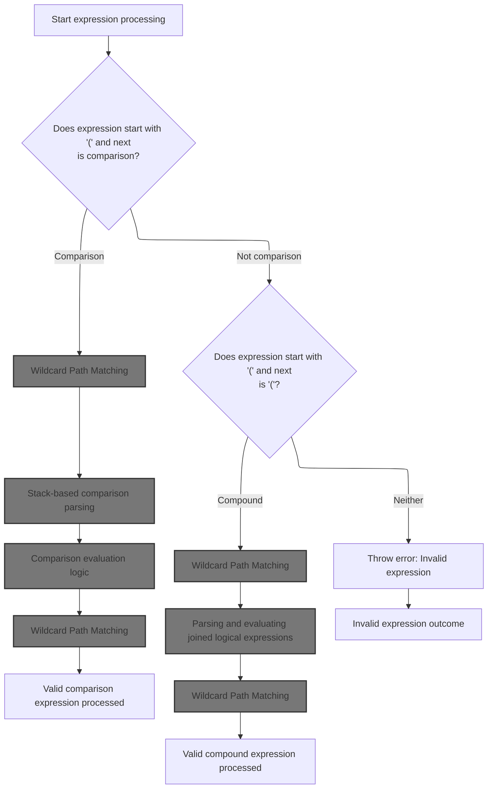
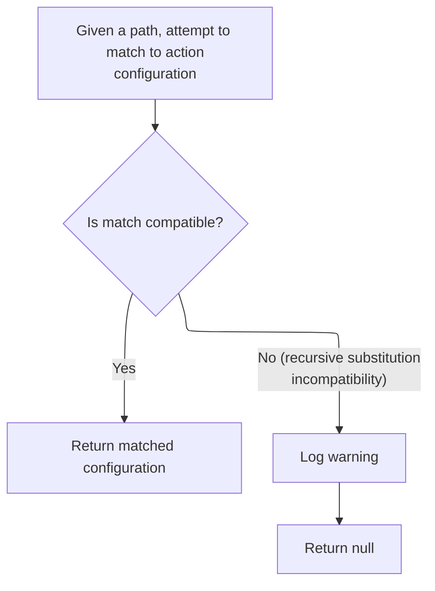
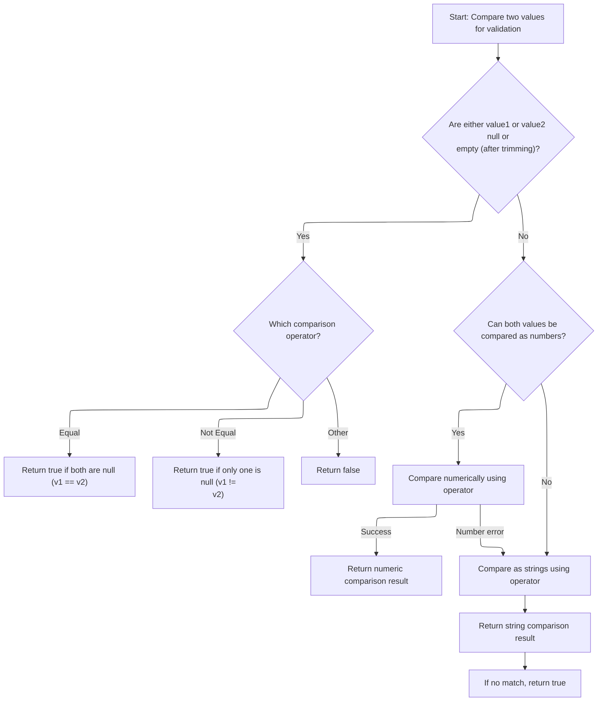
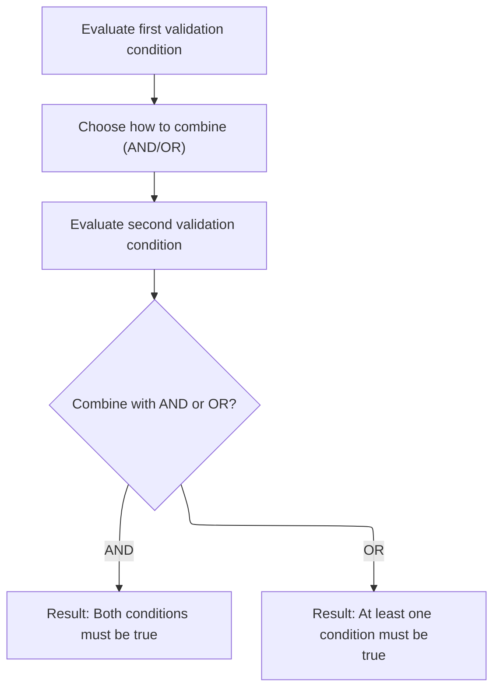

```mermaid
%%{init: {"flowchart": {"defaultRenderer": "elk"}} }%%
flowchart TD
    node1["Clone original action configuration"] --> node2{"Clone successful?"}
    click node1 openCode "core/src/main/java/org/apache/struts/config/ActionConfigMatcher.java:161:163"
    node2 -->|"Yes"| node3["Update fields with variable
substitutions"]
    click node2 openCode "core/src/main/java/org/apache/struts/config/ActionConfigMatcher.java:164:168"
    node2 -->|"No"| node8["Return null"]
    click node8 openCode "core/src/main/java/org/apache/struts/config/ActionConfigMatcher.java:167:168"
    node3 --> node4["Normalize path"]
    click node3 openCode "core/src/main/java/org/apache/struts/config/ActionConfigMatcher.java:170:188"
    node4 --> node5["Set normalized path"]
    click node4 openCode "core/src/main/java/org/apache/struts/config/ActionConfigMatcher.java:172:176"
    node5 --> node6["Update forward configurations"]
    click node5 openCode "core/src/main/java/org/apache/struts/config/ActionConfigMatcher.java:190:213"
    subgraph loop1["For each forward configuration"]
        node6 --> node7["Clone forward config"]
        click node7 openCode "core/src/main/java/org/apache/struts/config/ActionConfigMatcher.java:194:195"
        node7 --> node15["Update forward config fields with
variable substitutions"]
        click node15 openCode "core/src/main/java/org/apache/struts/config/ActionConfigMatcher.java:201:206"
        node15 --> node16["Replace forward config properties"]
        click node16 openCode "core/src/main/java/org/apache/struts/config/ActionConfigMatcher.java:208:209"
        node16 --> node17["Remove old forward config"]
        click node17 openCode "core/src/main/java/org/apache/struts/config/ActionConfigMatcher.java:211:211"
        node17 --> node18["Add updated forward config"]
        click node18 openCode "core/src/main/java/org/apache/struts/config/ActionConfigMatcher.java:212:212"
        node18 --> node6
    end
    node6 --> node9["Replace main config properties"]
    click node9 openCode "core/src/main/java/org/apache/struts/config/ActionConfigMatcher.java:215:216"
    node9 --> node10["Add exception configurations"]
    click node10 openCode "core/src/main/java/org/apache/struts/config/ActionConfigMatcher.java:217:221"
    subgraph loop2["For each exception configuration"]
        node10 --> node12["Add exception config"]
        click node12 openCode "core/src/main/java/org/apache/struts/config/ActionConfigMatcher.java:220:221"
        node12 --> node10
    end
    node10 --> node13["Freeze configuration"]
    click node13 openCode "core/src/main/java/org/apache/struts/config/ActionConfigMatcher.java:223:223"
    node13 --> node14["Return updated configuration"]
    click node14 openCode "core/src/main/java/org/apache/struts/config/ActionConfigMatcher.java:225:226"

classDef HeadingStyle fill:#777777,stroke:#333,stroke-width:2px;

%% Swimm:
%% %%{init: {"flowchart": {"defaultRenderer": "elk"}} }%%
%% flowchart TD
%%     node1["Clone original action configuration"] --> node2{"Clone successful?"}
%%     click node1 openCode "<SwmPath>[core/…/config/ActionConfigMatcher.java](core/src/main/java/org/apache/struts/config/ActionConfigMatcher.java)</SwmPath>:161:163"
%%     node2 -->|"Yes"| node3["Update fields with variable
%% substitutions"]
%%     click node2 openCode "<SwmPath>[core/…/config/ActionConfigMatcher.java](core/src/main/java/org/apache/struts/config/ActionConfigMatcher.java)</SwmPath>:164:168"
%%     node2 -->|"No"| node8["Return null"]
%%     click node8 openCode "<SwmPath>[core/…/config/ActionConfigMatcher.java](core/src/main/java/org/apache/struts/config/ActionConfigMatcher.java)</SwmPath>:167:168"
%%     node3 --> node4["Normalize path"]
%%     click node3 openCode "<SwmPath>[core/…/config/ActionConfigMatcher.java](core/src/main/java/org/apache/struts/config/ActionConfigMatcher.java)</SwmPath>:170:188"
%%     node4 --> node5["Set normalized path"]
%%     click node4 openCode "<SwmPath>[core/…/config/ActionConfigMatcher.java](core/src/main/java/org/apache/struts/config/ActionConfigMatcher.java)</SwmPath>:172:176"
%%     node5 --> node6["Update forward configurations"]
%%     click node5 openCode "<SwmPath>[core/…/config/ActionConfigMatcher.java](core/src/main/java/org/apache/struts/config/ActionConfigMatcher.java)</SwmPath>:190:213"
%%     subgraph loop1["For each forward configuration"]
%%         node6 --> node7["Clone forward config"]
%%         click node7 openCode "<SwmPath>[core/…/config/ActionConfigMatcher.java](core/src/main/java/org/apache/struts/config/ActionConfigMatcher.java)</SwmPath>:194:195"
%%         node7 --> node15["Update forward config fields with
%% variable substitutions"]
%%         click node15 openCode "<SwmPath>[core/…/config/ActionConfigMatcher.java](core/src/main/java/org/apache/struts/config/ActionConfigMatcher.java)</SwmPath>:201:206"
%%         node15 --> node16["Replace forward config properties"]
%%         click node16 openCode "<SwmPath>[core/…/config/ActionConfigMatcher.java](core/src/main/java/org/apache/struts/config/ActionConfigMatcher.java)</SwmPath>:208:209"
%%         node16 --> node17["Remove old forward config"]
%%         click node17 openCode "<SwmPath>[core/…/config/ActionConfigMatcher.java](core/src/main/java/org/apache/struts/config/ActionConfigMatcher.java)</SwmPath>:211:211"
%%         node17 --> node18["Add updated forward config"]
%%         click node18 openCode "<SwmPath>[core/…/config/ActionConfigMatcher.java](core/src/main/java/org/apache/struts/config/ActionConfigMatcher.java)</SwmPath>:212:212"
%%         node18 --> node6
%%     end
%%     node6 --> node9["Replace main config properties"]
%%     click node9 openCode "<SwmPath>[core/…/config/ActionConfigMatcher.java](core/src/main/java/org/apache/struts/config/ActionConfigMatcher.java)</SwmPath>:215:216"
%%     node9 --> node10["Add exception configurations"]
%%     click node10 openCode "<SwmPath>[core/…/config/ActionConfigMatcher.java](core/src/main/java/org/apache/struts/config/ActionConfigMatcher.java)</SwmPath>:217:221"
%%     subgraph loop2["For each exception configuration"]
%%         node10 --> node12["Add exception config"]
%%         click node12 openCode "<SwmPath>[core/…/config/ActionConfigMatcher.java](core/src/main/java/org/apache/struts/config/ActionConfigMatcher.java)</SwmPath>:220:221"
%%         node12 --> node10
%%     end
%%     node10 --> node13["Freeze configuration"]
%%     click node13 openCode "<SwmPath>[core/…/config/ActionConfigMatcher.java](core/src/main/java/org/apache/struts/config/ActionConfigMatcher.java)</SwmPath>:223:223"
%%     node13 --> node14["Return updated configuration"]
%%     click node14 openCode "<SwmPath>[core/…/config/ActionConfigMatcher.java](core/src/main/java/org/apache/struts/config/ActionConfigMatcher.java)</SwmPath>:225:226"
%% 
%% classDef HeadingStyle fill:#777777,stroke:#333,stroke-width:2px;
```

This document describes how parenthesized validation expressions are evaluated to support flexible validation rules. The flow receives an expression as input, determines if it is a comparison or a logical combination (AND/OR) of sub-expressions, evaluates the relevant parts, and outputs whether the expression is true or false.

# Parsing Parenthesized Expressions



<SwmSnippet path="/core/src/main/java/org/apache/struts/validator/validwhen/ValidWhenParser.java" line="413">

---

In <SwmToken path="core/src/main/java/org/apache/struts/validator/validwhen/ValidWhenParser.java" pos="413:7:7" line-data="	public final void expr() throws RecognitionException, TokenStreamException {">`expr`</SwmToken>, the parser checks the next two tokens to decide if it's about to parse a comparison or a joined expression inside parentheses. It uses <SwmToken path="core/src/main/java/org/apache/struts/validator/validwhen/ValidWhenParser.java" pos="416:16:16" line-data="		if ((LA(1)==LPAREN) &amp;&amp; (_tokenSet_1.member(LA(2)))) {">`_tokenSet_1`</SwmToken> to figure out if the second token is something that starts a comparison. This is where the parsing path splits, and it's why the next step needs to hand off to the matcher logic, since the structure of the input determines which parsing branch gets executed.

```java
	public final void expr() throws RecognitionException, TokenStreamException {
		
		
		if ((LA(1)==LPAREN) && (_tokenSet_1.member(LA(2)))) {
			match(LPAREN);
```

---

</SwmSnippet>

## Wildcard Path Matching

<SwmSnippet path="/core/src/main/java/org/apache/struts/config/ActionConfigMatcher.java" line="101">

---

In <SwmToken path="core/src/main/java/org/apache/struts/config/ActionConfigMatcher.java" pos="101:5:5" line-data="    public ActionConfig match(String path) {">`match`</SwmToken>, we loop through all compiled wildcard patterns and try to match the normalized path (without a leading slash) against each one. If a pattern matches, we grab any variables from the path. Next, we need to call the wildcard matcher to actually check if the path fits the pattern and extract those variables.

```java
    public ActionConfig match(String path) {
        ActionConfig config = null;

        if (compiledPaths.size() > 0) {
            if (log.isDebugEnabled()) {
                log.debug("Attempting to match '" + path
                    + "' to a wildcard pattern");
            }

            if ((path.length() > 0) && (path.charAt(0) == '/')) {
                path = path.substring(1);
            }

            Mapping m;
            HashMap vars = new HashMap();

            for (Iterator i = compiledPaths.iterator(); i.hasNext();) {
                m = (Mapping) i.next();

                if (wildcard.match(vars, path, m.getPattern())) {
                    if (log.isDebugEnabled()) {
                        log.debug("Path matches pattern '"
                            + m.getActionConfig().getPath() + "'");
                    }

```

---

</SwmSnippet>

### Wildcard Pattern Evaluation

See <SwmLink doc-title="Pattern Matching Flow">[Pattern Matching Flow](/.swm/pattern-matching-flow.xpx2fb46.sw.md)</SwmLink>

### <SwmToken path="core/src/main/java/org/apache/struts/config/ActionConfigMatcher.java" pos="101:3:3" line-data="    public ActionConfig match(String path) {">`ActionConfig`</SwmToken> Conversion and Error Handling



<SwmSnippet path="/core/src/main/java/org/apache/struts/config/ActionConfigMatcher.java" line="126">

---

We just got back from `WildcardHelper.match`. Now, if the path matched, we try to convert the <SwmToken path="core/src/main/java/org/apache/struts/config/ActionConfigMatcher.java" pos="129:2:2" line-data="                		    (ActionConfig) m.getActionConfig(), vars);">`ActionConfig`</SwmToken> using the extracted variables. If there's a recursive substitution problem, we catch it, log a warning, and skip this config. After all patterns are checked, we return the config (or null if nothing worked). Next, we need to call <SwmToken path="core/src/main/java/org/apache/struts/config/ActionConfigMatcher.java" pos="128:1:1" line-data="                	    convertActionConfig(path,">`convertActionConfig`</SwmToken> to actually apply the variable substitutions.

```java
                    try {
                	config =
                	    convertActionConfig(path,
                		    (ActionConfig) m.getActionConfig(), vars);
                    } catch (IllegalStateException e) {
                	log.warn("Path matches pattern '"
                		+ m.getActionConfig().getPath() + "' but is "
                		+ "incompatible with the matching config due "
                		+ "to recursive substitution: "
                		+ path);
                	config = null;
                    }
                }
            }
        }

        return config;
    }
```

---

</SwmSnippet>

## <SwmToken path="core/src/main/java/org/apache/struts/config/ActionConfigMatcher.java" pos="101:3:3" line-data="    public ActionConfig match(String path) {">`ActionConfig`</SwmToken> Cloning and Variable Substitution



<SwmSnippet path="/core/src/main/java/org/apache/struts/config/ActionConfigMatcher.java" line="157">

---

In <SwmToken path="core/src/main/java/org/apache/struts/config/ActionConfigMatcher.java" pos="157:5:5" line-data="    protected ActionConfig convertActionConfig(String path, ActionConfig orig,">`convertActionConfig`</SwmToken>, we clone the original <SwmToken path="core/src/main/java/org/apache/struts/config/ActionConfigMatcher.java" pos="157:3:3" line-data="    protected ActionConfig convertActionConfig(String path, ActionConfig orig,">`ActionConfig`</SwmToken> so we can safely modify it. If cloning fails, we log a warning and bail out. Next, we need to start substituting variables into the config fields, so we call <SwmToken path="core/src/main/java/org/apache/struts/config/ActionConfigMatcher.java" pos="170:5:5" line-data="        config.setName(convertParam(orig.getName(), vars));">`convertParam`</SwmToken> for each property.

```java
    protected ActionConfig convertActionConfig(String path, ActionConfig orig,
        Map vars) {
        ActionConfig config = null;

        try {
            config = (ActionConfig) BeanUtils.cloneBean(orig);
        } catch (Exception ex) {
            log.warn("Unable to clone action config, recommend not using "
                + "wildcards", ex);

            return null;
        }

        config.setName(convertParam(orig.getName(), vars));
```

---

</SwmSnippet>

<SwmSnippet path="/core/src/main/java/org/apache/struts/config/ActionConfigMatcher.java" line="258">

---

<SwmToken path="core/src/main/java/org/apache/struts/config/ActionConfigMatcher.java" pos="258:5:5" line-data="    protected String convertParam(String val, Map vars) {">`convertParam`</SwmToken> does the placeholder replacement for config fields. It looks for {x} patterns and swaps them with values from the vars map. If a value would cause a recursive substitution, it throws an exception to avoid infinite loops. Only single-character keys are supported for placeholders.

```java
    protected String convertParam(String val, Map vars) {
        if (val == null) {
            return null;
        } else if (val.indexOf("{") == -1) {
            return val;
        }

        Map.Entry entry;
        StringBuffer key = new StringBuffer("{0}");
        StringBuffer ret = new StringBuffer(val);
        String keyStr;
        int x;

        for (Iterator i = vars.entrySet().iterator(); i.hasNext();) {
            entry = (Map.Entry) i.next();
            key.setCharAt(1, ((String) entry.getKey()).charAt(0));
            keyStr = key.toString();
            
            // STR-3169
            // Prevent an infinite loop by retaining the placeholders
            // that contain itself in the substitution value
            if (((String) entry.getValue()).contains(keyStr)) {
        	throw new IllegalStateException();
            }
            
            // Replace all instances of the placeholder
            while ((x = ret.toString().indexOf(keyStr)) > -1) {
                ret.replace(x, x + 3, (String) entry.getValue());
            }
        }
```

---

</SwmSnippet>

<SwmSnippet path="/core/src/main/java/org/apache/struts/config/ActionConfigMatcher.java" line="170">

---

We just finished variable substitution in <SwmToken path="core/src/main/java/org/apache/struts/config/ActionConfigMatcher.java" pos="128:1:1" line-data="                	    convertActionConfig(path,">`convertActionConfig`</SwmToken>. Now, we set the name on the cloned <SwmToken path="core/src/main/java/org/apache/struts/config/ActionConfigMatcher.java" pos="101:3:3" line-data="    public ActionConfig match(String path) {">`ActionConfig`</SwmToken> using the substituted value. Next, we call <SwmToken path="core/src/main/java/org/apache/struts/config/ActionConfigMatcher.java" pos="170:3:3" line-data="        config.setName(convertParam(orig.getName(), vars));">`setName`</SwmToken> on <SwmToken path="core/src/main/java/org/apache/struts/config/ActionConfigMatcher.java" pos="101:3:3" line-data="    public ActionConfig match(String path) {">`ActionConfig`</SwmToken> to actually update the config object.

```java
        config.setName(convertParam(orig.getName(), vars));

```

---

</SwmSnippet>

<SwmSnippet path="/core/src/main/java/org/apache/struts/config/ActionConfig.java" line="517">

---

<SwmToken path="core/src/main/java/org/apache/struts/config/ActionConfig.java" pos="517:5:5" line-data="    public void setName(String name) {">`setName`</SwmToken> updates the config name, but only if the config isn't frozen. If it's already finalized, it throws an exception to block changes.

```java
    public void setName(String name) {
        if (configured) {
            throw new IllegalStateException("Configuration is frozen");
        }

        this.name = name;
    }
```

---

</SwmSnippet>

<SwmSnippet path="/core/src/main/java/org/apache/struts/config/ActionConfigMatcher.java" line="172">

---

We just set the name in <SwmToken path="core/src/main/java/org/apache/struts/config/ActionConfigMatcher.java" pos="101:3:3" line-data="    public ActionConfig match(String path) {">`ActionConfig`</SwmToken>. Now, we check if the path starts with a slash and fix it if needed, then set the path. Next, we call <SwmToken path="core/src/main/java/org/apache/struts/config/ActionConfigMatcher.java" pos="176:3:3" line-data="        config.setPath(path);">`setPath`</SwmToken> on <SwmToken path="core/src/main/java/org/apache/struts/config/ActionConfigMatcher.java" pos="101:3:3" line-data="    public ActionConfig match(String path) {">`ActionConfig`</SwmToken> to update the path field.

```java
        if ((path.length() == 0) || (path.charAt(0) != '/')) {
            path = "/" + path;
        }

        config.setPath(path);
```

---

</SwmSnippet>

<SwmSnippet path="/core/src/main/java/org/apache/struts/config/ActionConfig.java" line="565">

---

<SwmToken path="core/src/main/java/org/apache/struts/config/ActionConfig.java" pos="565:5:5" line-data="    public void setPath(String path) {">`setPath`</SwmToken> updates the config path, but only if the config isn't frozen. If it's frozen, it throws an exception to block changes.

```java
    public void setPath(String path) {
        if (configured) {
            throw new IllegalStateException("Configuration is frozen");
        }

        this.path = path;
    }
```

---

</SwmSnippet>

<SwmSnippet path="/core/src/main/java/org/apache/struts/config/ActionConfigMatcher.java" line="177">

---

We just set the path in <SwmToken path="core/src/main/java/org/apache/struts/config/ActionConfigMatcher.java" pos="101:3:3" line-data="    public ActionConfig match(String path) {">`ActionConfig`</SwmToken>. Now, we need to set the type field using the substituted value. Next, we call <SwmToken path="core/src/main/java/org/apache/struts/config/ActionConfigMatcher.java" pos="177:3:3" line-data="        config.setType(convertParam(orig.getType(), vars));">`setType`</SwmToken> on <SwmToken path="core/src/main/java/org/apache/struts/config/ActionConfigMatcher.java" pos="101:3:3" line-data="    public ActionConfig match(String path) {">`ActionConfig`</SwmToken>.

```java
        config.setType(convertParam(orig.getType(), vars));
```

---

</SwmSnippet>

<SwmSnippet path="/core/src/main/java/org/apache/struts/config/ActionConfigMatcher.java" line="177">

---

We just got the substituted type value in <SwmToken path="core/src/main/java/org/apache/struts/config/ActionConfigMatcher.java" pos="128:1:1" line-data="                	    convertActionConfig(path,">`convertActionConfig`</SwmToken>. Now, we call <SwmToken path="core/src/main/java/org/apache/struts/config/ActionConfigMatcher.java" pos="177:3:3" line-data="        config.setType(convertParam(orig.getType(), vars));">`setType`</SwmToken> on <SwmToken path="core/src/main/java/org/apache/struts/config/ActionConfigMatcher.java" pos="101:3:3" line-data="    public ActionConfig match(String path) {">`ActionConfig`</SwmToken> to update the type field.

```java
        config.setType(convertParam(orig.getType(), vars));
```

---

</SwmSnippet>

<SwmSnippet path="/core/src/main/java/org/apache/struts/config/ActionConfig.java" line="788">

---

<SwmToken path="core/src/main/java/org/apache/struts/config/ActionConfig.java" pos="788:5:5" line-data="    public void setType(String type) {">`setType`</SwmToken> updates the config type, but only if the config isn't frozen. If it's frozen, it throws an exception to block changes.

```java
    public void setType(String type) {
        if (configured) {
            throw new IllegalStateException("Configuration is frozen");
        }

        this.type = type;
    }
```

---

</SwmSnippet>

<SwmSnippet path="/core/src/main/java/org/apache/struts/config/ActionConfigMatcher.java" line="178">

---

We just set the type in <SwmToken path="core/src/main/java/org/apache/struts/config/ActionConfigMatcher.java" pos="101:3:3" line-data="    public ActionConfig match(String path) {">`ActionConfig`</SwmToken>. Now, we need to set the roles and parameter fields using the substituted values. Next, we call <SwmToken path="core/src/main/java/org/apache/struts/config/ActionConfigMatcher.java" pos="179:3:3" line-data="        config.setParameter(convertParam(orig.getParameter(), vars));">`setParameter`</SwmToken> on <SwmToken path="core/src/main/java/org/apache/struts/config/ActionConfigMatcher.java" pos="101:3:3" line-data="    public ActionConfig match(String path) {">`ActionConfig`</SwmToken>.

```java
        config.setRoles(convertParam(orig.getRoles(), vars));
        config.setParameter(convertParam(orig.getParameter(), vars));
```

---

</SwmSnippet>

<SwmSnippet path="/core/src/main/java/org/apache/struts/config/ActionConfigMatcher.java" line="179">

---

We just got the substituted parameter value in <SwmToken path="core/src/main/java/org/apache/struts/config/ActionConfigMatcher.java" pos="128:1:1" line-data="                	    convertActionConfig(path,">`convertActionConfig`</SwmToken>. Now, we call <SwmToken path="core/src/main/java/org/apache/struts/config/ActionConfigMatcher.java" pos="179:3:3" line-data="        config.setParameter(convertParam(orig.getParameter(), vars));">`setParameter`</SwmToken> on <SwmToken path="core/src/main/java/org/apache/struts/config/ActionConfigMatcher.java" pos="101:3:3" line-data="    public ActionConfig match(String path) {">`ActionConfig`</SwmToken> to update the parameter field.

```java
        config.setParameter(convertParam(orig.getParameter(), vars));
```

---

</SwmSnippet>

<SwmSnippet path="/core/src/main/java/org/apache/struts/config/ActionConfig.java" line="541">

---

<SwmToken path="core/src/main/java/org/apache/struts/config/ActionConfig.java" pos="541:5:5" line-data="    public void setParameter(String parameter) {">`setParameter`</SwmToken> updates the config parameter, but only if the config isn't frozen. If it's frozen, it throws an exception to block changes.

```java
    public void setParameter(String parameter) {
        if (configured) {
            throw new IllegalStateException("Configuration is frozen");
        }

        this.parameter = parameter;
    }
```

---

</SwmSnippet>

<SwmSnippet path="/core/src/main/java/org/apache/struts/config/ActionConfigMatcher.java" line="180">

---

We just set the parameter in <SwmToken path="core/src/main/java/org/apache/struts/config/ActionConfigMatcher.java" pos="101:3:3" line-data="    public ActionConfig match(String path) {">`ActionConfig`</SwmToken>. Now, we need to set the attribute field using the substituted value. Next, we call <SwmToken path="core/src/main/java/org/apache/struts/config/ActionConfigMatcher.java" pos="180:3:3" line-data="        config.setAttribute(convertParam(orig.getAttribute(), vars));">`setAttribute`</SwmToken> on <SwmToken path="core/src/main/java/org/apache/struts/config/ActionConfigMatcher.java" pos="101:3:3" line-data="    public ActionConfig match(String path) {">`ActionConfig`</SwmToken>.

```java
        config.setAttribute(convertParam(orig.getAttribute(), vars));
```

---

</SwmSnippet>

<SwmSnippet path="/core/src/main/java/org/apache/struts/config/ActionConfigMatcher.java" line="180">

---

We just got the substituted attribute value in <SwmToken path="core/src/main/java/org/apache/struts/config/ActionConfigMatcher.java" pos="128:1:1" line-data="                	    convertActionConfig(path,">`convertActionConfig`</SwmToken>. Now, we call <SwmToken path="core/src/main/java/org/apache/struts/config/ActionConfigMatcher.java" pos="180:3:3" line-data="        config.setAttribute(convertParam(orig.getAttribute(), vars));">`setAttribute`</SwmToken> on <SwmToken path="core/src/main/java/org/apache/struts/config/ActionConfigMatcher.java" pos="101:3:3" line-data="    public ActionConfig match(String path) {">`ActionConfig`</SwmToken> to update the attribute field.

```java
        config.setAttribute(convertParam(orig.getAttribute(), vars));
```

---

</SwmSnippet>

<SwmSnippet path="/core/src/main/java/org/apache/struts/config/ActionConfig.java" line="337">

---

<SwmToken path="core/src/main/java/org/apache/struts/config/ActionConfig.java" pos="337:5:5" line-data="    public void setAttribute(String attribute) {">`setAttribute`</SwmToken> updates the config attribute, but only if the config isn't frozen. If it's frozen, it throws an exception to block changes.

```java
    public void setAttribute(String attribute) {
        if (configured) {
            throw new IllegalStateException("Configuration is frozen");
        }

        this.attribute = attribute;
    }
```

---

</SwmSnippet>

<SwmSnippet path="/core/src/main/java/org/apache/struts/config/ActionConfigMatcher.java" line="181">

---

We just set the attribute in <SwmToken path="core/src/main/java/org/apache/struts/config/ActionConfigMatcher.java" pos="101:3:3" line-data="    public ActionConfig match(String path) {">`ActionConfig`</SwmToken>. Now, we need to set the forward field using the substituted value. Next, we call <SwmToken path="core/src/main/java/org/apache/struts/config/ActionConfigMatcher.java" pos="181:3:3" line-data="        config.setForward(convertParam(orig.getForward(), vars));">`setForward`</SwmToken> on <SwmToken path="core/src/main/java/org/apache/struts/config/ActionConfigMatcher.java" pos="101:3:3" line-data="    public ActionConfig match(String path) {">`ActionConfig`</SwmToken>.

```java
        config.setForward(convertParam(orig.getForward(), vars));
```

---

</SwmSnippet>

<SwmSnippet path="/core/src/main/java/org/apache/struts/config/ActionConfigMatcher.java" line="181">

---

We just got the substituted forward value in <SwmToken path="core/src/main/java/org/apache/struts/config/ActionConfigMatcher.java" pos="128:1:1" line-data="                	    convertActionConfig(path,">`convertActionConfig`</SwmToken>. Now, we call <SwmToken path="core/src/main/java/org/apache/struts/config/ActionConfigMatcher.java" pos="181:3:3" line-data="        config.setForward(convertParam(orig.getForward(), vars));">`setForward`</SwmToken> on <SwmToken path="core/src/main/java/org/apache/struts/config/ActionConfigMatcher.java" pos="101:3:3" line-data="    public ActionConfig match(String path) {">`ActionConfig`</SwmToken> to update the forward field.

```java
        config.setForward(convertParam(orig.getForward(), vars));
```

---

</SwmSnippet>

<SwmSnippet path="/core/src/main/java/org/apache/struts/config/ActionConfig.java" line="419">

---

<SwmToken path="core/src/main/java/org/apache/struts/config/ActionConfig.java" pos="419:5:5" line-data="    public void setForward(String forward) {">`setForward`</SwmToken> updates the config forward, but only if the config isn't frozen. If it's frozen, it throws an exception to block changes.

```java
    public void setForward(String forward) {
        if (configured) {
            throw new IllegalStateException("Configuration is frozen");
        }

        this.forward = forward;
    }
```

---

</SwmSnippet>

<SwmSnippet path="/core/src/main/java/org/apache/struts/config/ActionConfigMatcher.java" line="182">

---

We just set the forward in <SwmToken path="core/src/main/java/org/apache/struts/config/ActionConfigMatcher.java" pos="101:3:3" line-data="    public ActionConfig match(String path) {">`ActionConfig`</SwmToken>. Now, we need to set the include field using the substituted value. Next, we call <SwmToken path="core/src/main/java/org/apache/struts/config/ActionConfigMatcher.java" pos="182:3:3" line-data="        config.setInclude(convertParam(orig.getInclude(), vars));">`setInclude`</SwmToken> on <SwmToken path="core/src/main/java/org/apache/struts/config/ActionConfigMatcher.java" pos="101:3:3" line-data="    public ActionConfig match(String path) {">`ActionConfig`</SwmToken>.

```java
        config.setInclude(convertParam(orig.getInclude(), vars));
```

---

</SwmSnippet>

<SwmSnippet path="/core/src/main/java/org/apache/struts/config/ActionConfigMatcher.java" line="182">

---

We just got the substituted include value in <SwmToken path="core/src/main/java/org/apache/struts/config/ActionConfigMatcher.java" pos="128:1:1" line-data="                	    convertActionConfig(path,">`convertActionConfig`</SwmToken>. Now, we call <SwmToken path="core/src/main/java/org/apache/struts/config/ActionConfigMatcher.java" pos="182:3:3" line-data="        config.setInclude(convertParam(orig.getInclude(), vars));">`setInclude`</SwmToken> on <SwmToken path="core/src/main/java/org/apache/struts/config/ActionConfigMatcher.java" pos="101:3:3" line-data="    public ActionConfig match(String path) {">`ActionConfig`</SwmToken> to update the include field.

```java
        config.setInclude(convertParam(orig.getInclude(), vars));
```

---

</SwmSnippet>

<SwmSnippet path="/core/src/main/java/org/apache/struts/config/ActionConfig.java" line="446">

---

<SwmToken path="core/src/main/java/org/apache/struts/config/ActionConfig.java" pos="446:5:5" line-data="    public void setInclude(String include) {">`setInclude`</SwmToken> updates the config include, but only if the config isn't frozen. If it's frozen, it throws an exception to block changes.

```java
    public void setInclude(String include) {
        if (configured) {
            throw new IllegalStateException("Configuration is frozen");
        }

        this.include = include;
    }
```

---

</SwmSnippet>

<SwmSnippet path="/core/src/main/java/org/apache/struts/config/ActionConfigMatcher.java" line="183">

---

We just set the include in <SwmToken path="core/src/main/java/org/apache/struts/config/ActionConfigMatcher.java" pos="101:3:3" line-data="    public ActionConfig match(String path) {">`ActionConfig`</SwmToken>. Now, we need to set the input field using the substituted value. Next, we call <SwmToken path="core/src/main/java/org/apache/struts/config/ActionConfigMatcher.java" pos="183:3:3" line-data="        config.setInput(convertParam(orig.getInput(), vars));">`setInput`</SwmToken> on <SwmToken path="core/src/main/java/org/apache/struts/config/ActionConfigMatcher.java" pos="101:3:3" line-data="    public ActionConfig match(String path) {">`ActionConfig`</SwmToken>.

```java
        config.setInput(convertParam(orig.getInput(), vars));
```

---

</SwmSnippet>

<SwmSnippet path="/core/src/main/java/org/apache/struts/config/ActionConfigMatcher.java" line="183">

---

We just got the substituted input value in <SwmToken path="core/src/main/java/org/apache/struts/config/ActionConfigMatcher.java" pos="128:1:1" line-data="                	    convertActionConfig(path,">`convertActionConfig`</SwmToken>. Now, we call <SwmToken path="core/src/main/java/org/apache/struts/config/ActionConfigMatcher.java" pos="183:3:3" line-data="        config.setInput(convertParam(orig.getInput(), vars));">`setInput`</SwmToken> on <SwmToken path="core/src/main/java/org/apache/struts/config/ActionConfigMatcher.java" pos="101:3:3" line-data="    public ActionConfig match(String path) {">`ActionConfig`</SwmToken> to update the input field.

```java
        config.setInput(convertParam(orig.getInput(), vars));
```

---

</SwmSnippet>

<SwmSnippet path="/core/src/main/java/org/apache/struts/config/ActionConfig.java" line="473">

---

<SwmToken path="core/src/main/java/org/apache/struts/config/ActionConfig.java" pos="473:5:5" line-data="    public void setInput(String input) {">`setInput`</SwmToken> updates the config input, but only if the config isn't frozen. If it's frozen, it throws an exception to block changes.

```java
    public void setInput(String input) {
        if (configured) {
            throw new IllegalStateException("Configuration is frozen");
        }

        this.input = input;
    }
```

---

</SwmSnippet>

<SwmSnippet path="/core/src/main/java/org/apache/struts/config/ActionConfigMatcher.java" line="184">

---

We just set the input in <SwmToken path="core/src/main/java/org/apache/struts/config/ActionConfigMatcher.java" pos="101:3:3" line-data="    public ActionConfig match(String path) {">`ActionConfig`</SwmToken>. Now, we need to set the catalog field using the substituted value. Next, we call <SwmToken path="core/src/main/java/org/apache/struts/config/ActionConfigMatcher.java" pos="184:3:3" line-data="        config.setCatalog(convertParam(orig.getCatalog(), vars));">`setCatalog`</SwmToken> on <SwmToken path="core/src/main/java/org/apache/struts/config/ActionConfigMatcher.java" pos="101:3:3" line-data="    public ActionConfig match(String path) {">`ActionConfig`</SwmToken>.

```java
        config.setCatalog(convertParam(orig.getCatalog(), vars));
```

---

</SwmSnippet>

<SwmSnippet path="/core/src/main/java/org/apache/struts/config/ActionConfigMatcher.java" line="184">

---

We just got the substituted catalog value in <SwmToken path="core/src/main/java/org/apache/struts/config/ActionConfigMatcher.java" pos="128:1:1" line-data="                	    convertActionConfig(path,">`convertActionConfig`</SwmToken>. Now, we call <SwmToken path="core/src/main/java/org/apache/struts/config/ActionConfigMatcher.java" pos="184:3:3" line-data="        config.setCatalog(convertParam(orig.getCatalog(), vars));">`setCatalog`</SwmToken> on <SwmToken path="core/src/main/java/org/apache/struts/config/ActionConfigMatcher.java" pos="101:3:3" line-data="    public ActionConfig match(String path) {">`ActionConfig`</SwmToken> to update the catalog field.

```java
        config.setCatalog(convertParam(orig.getCatalog(), vars));
```

---

</SwmSnippet>

<SwmSnippet path="/core/src/main/java/org/apache/struts/config/ActionConfig.java" line="882">

---

<SwmToken path="core/src/main/java/org/apache/struts/config/ActionConfig.java" pos="882:5:5" line-data="    public void setCatalog(String catalog) {">`setCatalog`</SwmToken> updates the config catalog, but only if the config isn't frozen. If it's frozen, it throws an exception to block changes.

```java
    public void setCatalog(String catalog) {
        if (configured) {
            throw new IllegalStateException("Configuration is frozen");
        }

        this.catalog = catalog;
    }
```

---

</SwmSnippet>

<SwmSnippet path="/core/src/main/java/org/apache/struts/config/ActionConfigMatcher.java" line="185">

---

We just set the catalog in <SwmToken path="core/src/main/java/org/apache/struts/config/ActionConfigMatcher.java" pos="101:3:3" line-data="    public ActionConfig match(String path) {">`ActionConfig`</SwmToken>. Now, we need to set the command field using the substituted value. Next, we call <SwmToken path="core/src/main/java/org/apache/struts/config/ActionConfigMatcher.java" pos="185:3:3" line-data="        config.setCommand(convertParam(orig.getCommand(), vars));">`setCommand`</SwmToken> on <SwmToken path="core/src/main/java/org/apache/struts/config/ActionConfigMatcher.java" pos="101:3:3" line-data="    public ActionConfig match(String path) {">`ActionConfig`</SwmToken>.

```java
        config.setCommand(convertParam(orig.getCommand(), vars));
```

---

</SwmSnippet>

<SwmSnippet path="/core/src/main/java/org/apache/struts/config/ActionConfigMatcher.java" line="185">

---

We just got the substituted command value in <SwmToken path="core/src/main/java/org/apache/struts/config/ActionConfigMatcher.java" pos="128:1:1" line-data="                	    convertActionConfig(path,">`convertActionConfig`</SwmToken>. Now, we call <SwmToken path="core/src/main/java/org/apache/struts/config/ActionConfigMatcher.java" pos="185:3:3" line-data="        config.setCommand(convertParam(orig.getCommand(), vars));">`setCommand`</SwmToken> on <SwmToken path="core/src/main/java/org/apache/struts/config/ActionConfigMatcher.java" pos="101:3:3" line-data="    public ActionConfig match(String path) {">`ActionConfig`</SwmToken> to update the command field.

```java
        config.setCommand(convertParam(orig.getCommand(), vars));
```

---

</SwmSnippet>

<SwmSnippet path="/core/src/main/java/org/apache/struts/config/ActionConfig.java" line="864">

---

<SwmToken path="core/src/main/java/org/apache/struts/config/ActionConfig.java" pos="864:5:5" line-data="    public void setCommand(String command) {">`setCommand`</SwmToken> updates the config command, but only if the config isn't frozen. If it's frozen, it throws an exception to block changes.

```java
    public void setCommand(String command) {
        if (configured) {
            throw new IllegalStateException("Configuration is frozen");
        }

        this.command = command;
    }
```

---

</SwmSnippet>

<SwmSnippet path="/core/src/main/java/org/apache/struts/config/ActionConfigMatcher.java" line="186">

---

We just set the command in <SwmToken path="core/src/main/java/org/apache/struts/config/ActionConfigMatcher.java" pos="101:3:3" line-data="    public ActionConfig match(String path) {">`ActionConfig`</SwmToken>. Now, we need to set the <SwmToken path="core/src/main/java/org/apache/struts/config/ActionConfig.java" pos="499:9:9" line-data="    public void setMultipartClass(String multipartClass) {">`multipartClass`</SwmToken> field using the substituted value. Next, we call <SwmToken path="core/src/main/java/org/apache/struts/config/ActionConfigMatcher.java" pos="186:3:3" line-data="        config.setMultipartClass(convertParam(orig.getMultipartClass(), vars));">`setMultipartClass`</SwmToken> on <SwmToken path="core/src/main/java/org/apache/struts/config/ActionConfigMatcher.java" pos="101:3:3" line-data="    public ActionConfig match(String path) {">`ActionConfig`</SwmToken>.

```java
        config.setMultipartClass(convertParam(orig.getMultipartClass(), vars));
```

---

</SwmSnippet>

<SwmSnippet path="/core/src/main/java/org/apache/struts/config/ActionConfigMatcher.java" line="186">

---

We just got the substituted <SwmToken path="core/src/main/java/org/apache/struts/config/ActionConfig.java" pos="499:9:9" line-data="    public void setMultipartClass(String multipartClass) {">`multipartClass`</SwmToken> value in <SwmToken path="core/src/main/java/org/apache/struts/config/ActionConfigMatcher.java" pos="128:1:1" line-data="                	    convertActionConfig(path,">`convertActionConfig`</SwmToken>. Now, we call <SwmToken path="core/src/main/java/org/apache/struts/config/ActionConfigMatcher.java" pos="186:3:3" line-data="        config.setMultipartClass(convertParam(orig.getMultipartClass(), vars));">`setMultipartClass`</SwmToken> on <SwmToken path="core/src/main/java/org/apache/struts/config/ActionConfigMatcher.java" pos="101:3:3" line-data="    public ActionConfig match(String path) {">`ActionConfig`</SwmToken> to update the <SwmToken path="core/src/main/java/org/apache/struts/config/ActionConfig.java" pos="499:9:9" line-data="    public void setMultipartClass(String multipartClass) {">`multipartClass`</SwmToken> field.

```java
        config.setMultipartClass(convertParam(orig.getMultipartClass(), vars));
```

---

</SwmSnippet>

<SwmSnippet path="/core/src/main/java/org/apache/struts/config/ActionConfig.java" line="499">

---

SetMultipartClass checks if the config is frozen using the 'configured' flag and blocks any changes to <SwmToken path="core/src/main/java/org/apache/struts/config/ActionConfig.java" pos="499:9:9" line-data="    public void setMultipartClass(String multipartClass) {">`multipartClass`</SwmToken> after that point. This keeps the config immutable once finalized.

```java
    public void setMultipartClass(String multipartClass) {
        if (configured) {
            throw new IllegalStateException("Configuration is frozen");
        }

        this.multipartClass = multipartClass;
    }
```

---

</SwmSnippet>

<SwmSnippet path="/core/src/main/java/org/apache/struts/config/ActionConfigMatcher.java" line="187">

---

After updating <SwmToken path="core/src/main/java/org/apache/struts/config/ActionConfig.java" pos="499:9:9" line-data="    public void setMultipartClass(String multipartClass) {">`multipartClass`</SwmToken>, we move on to set the prefix field using <SwmToken path="core/src/main/java/org/apache/struts/config/ActionConfigMatcher.java" pos="187:5:5" line-data="        config.setPrefix(convertParam(orig.getPrefix(), vars));">`convertParam`</SwmToken> in <SwmToken path="core/src/main/java/org/apache/struts/config/ActionConfigMatcher.java" pos="47:4:4" line-data="public class ActionConfigMatcher implements Serializable {">`ActionConfigMatcher`</SwmToken>. This keeps the substitution flow going for all relevant config fields.

```java
        config.setPrefix(convertParam(orig.getPrefix(), vars));
```

---

</SwmSnippet>

<SwmSnippet path="/core/src/main/java/org/apache/struts/config/ActionConfigMatcher.java" line="187">

---

Now we call <SwmToken path="core/src/main/java/org/apache/struts/config/ActionConfigMatcher.java" pos="187:3:3" line-data="        config.setPrefix(convertParam(orig.getPrefix(), vars));">`setPrefix`</SwmToken> on <SwmToken path="core/src/main/java/org/apache/struts/config/ActionConfigMatcher.java" pos="101:3:3" line-data="    public ActionConfig match(String path) {">`ActionConfig`</SwmToken> to actually update the prefix field with the substituted value from <SwmToken path="core/src/main/java/org/apache/struts/config/ActionConfigMatcher.java" pos="187:5:5" line-data="        config.setPrefix(convertParam(orig.getPrefix(), vars));">`convertParam`</SwmToken>. This keeps the config fields in sync with the resolved variables.

```java
        config.setPrefix(convertParam(orig.getPrefix(), vars));
```

---

</SwmSnippet>

<SwmSnippet path="/core/src/main/java/org/apache/struts/config/ActionConfig.java" line="585">

---

SetPrefix only updates the prefix if the config isn't frozen. If it's already locked down, it throws, so you can't mess with the config after it's finalized.

```java
    public void setPrefix(String prefix) {
        if (configured) {
            throw new IllegalStateException("Configuration is frozen");
        }

        this.prefix = prefix;
    }
```

---

</SwmSnippet>

<SwmSnippet path="/core/src/main/java/org/apache/struts/config/ActionConfigMatcher.java" line="188">

---

After prefix, we jump to setting the suffix field in <SwmToken path="core/src/main/java/org/apache/struts/config/ActionConfigMatcher.java" pos="47:4:4" line-data="public class ActionConfigMatcher implements Serializable {">`ActionConfigMatcher`</SwmToken>, again using <SwmToken path="core/src/main/java/org/apache/struts/config/ActionConfigMatcher.java" pos="188:5:5" line-data="        config.setSuffix(convertParam(orig.getSuffix(), vars));">`convertParam`</SwmToken> to handle any variable replacements.

```java
        config.setSuffix(convertParam(orig.getSuffix(), vars));
```

---

</SwmSnippet>

<SwmSnippet path="/core/src/main/java/org/apache/struts/config/ActionConfigMatcher.java" line="188">

---

Now we call <SwmToken path="core/src/main/java/org/apache/struts/config/ActionConfigMatcher.java" pos="188:3:3" line-data="        config.setSuffix(convertParam(orig.getSuffix(), vars));">`setSuffix`</SwmToken> on <SwmToken path="core/src/main/java/org/apache/struts/config/ActionConfigMatcher.java" pos="101:3:3" line-data="    public ActionConfig match(String path) {">`ActionConfig`</SwmToken> to update the suffix field with the resolved value. This keeps the config consistent with the latest substitutions.

```java
        config.setSuffix(convertParam(orig.getSuffix(), vars));

```

---

</SwmSnippet>

<SwmSnippet path="/core/src/main/java/org/apache/struts/config/ActionConfig.java" line="776">

---

SetSuffix works just like <SwmToken path="core/src/main/java/org/apache/struts/config/ActionConfigMatcher.java" pos="187:3:3" line-data="        config.setPrefix(convertParam(orig.getPrefix(), vars));">`setPrefix`</SwmToken>: it blocks changes if the config is frozen, so you can't update the suffix after the config is locked.

```java
    public void setSuffix(String suffix) {
        if (configured) {
            throw new IllegalStateException("Configuration is frozen");
        }

        this.suffix = suffix;
    }
```

---

</SwmSnippet>

<SwmSnippet path="/core/src/main/java/org/apache/struts/config/ActionConfigMatcher.java" line="190">

---

After setting suffix, we loop through <SwmToken path="core/src/main/java/org/apache/struts/config/ActionConfigMatcher.java" pos="190:1:1" line-data="        ForwardConfig[] fConfigs = orig.findForwardConfigs();">`ForwardConfig`</SwmToken> entries, clone each one, and prep them for variable substitution. This avoids mutating the originals.

```java
        ForwardConfig[] fConfigs = orig.findForwardConfigs();
        ForwardConfig cfg;

        for (int x = 0; x < fConfigs.length; x++) {
            try {
                cfg = (ActionForward) BeanUtils.cloneBean(fConfigs[x]);
            } catch (Exception ex) {
                log.warn("Unable to clone action config, recommend not using "
                        + "wildcards", ex);
                return null;
            }
            cfg.setName(fConfigs[x].getName());
            cfg.setPath(convertParam(fConfigs[x].getPath(), vars));
```

---

</SwmSnippet>

<SwmSnippet path="/core/src/main/java/org/apache/struts/config/ActionConfigMatcher.java" line="202">

---

After cloning, we set the path on the <SwmToken path="core/src/main/java/org/apache/struts/config/ActionConfigMatcher.java" pos="190:1:1" line-data="        ForwardConfig[] fConfigs = orig.findForwardConfigs();">`ForwardConfig`</SwmToken> using the substituted value. This makes sure the forward points to the right place for this config instance.

```java
            cfg.setPath(convertParam(fConfigs[x].getPath(), vars));
```

---

</SwmSnippet>

<SwmSnippet path="/core/src/main/java/org/apache/struts/config/ExceptionConfig.java" line="141">

---

SetPath in <SwmToken path="core/src/main/java/org/apache/struts/config/ActionConfigMatcher.java" pos="217:1:1" line-data="        ExceptionConfig[] exConfigs = orig.findExceptionConfigs();">`ExceptionConfig`</SwmToken> blocks changes if the config is frozen, just like the other setters. No path updates after freezing.

```java
    public void setPath(String path) {
        if (configured) {
            throw new IllegalStateException("Configuration is frozen");
        }

        this.path = path;
    }
```

---

</SwmSnippet>

<SwmSnippet path="/core/src/main/java/org/apache/struts/config/ActionConfigMatcher.java" line="203">

---

After path, we set the redirect property on <SwmToken path="core/src/main/java/org/apache/struts/config/ActionConfigMatcher.java" pos="190:1:1" line-data="        ForwardConfig[] fConfigs = orig.findForwardConfigs();">`ForwardConfig`</SwmToken>. This determines if the forward is a redirect or not.

```java
            cfg.setRedirect(fConfigs[x].getRedirect());
```

---

</SwmSnippet>

<SwmSnippet path="/core/src/main/java/org/apache/struts/config/ForwardConfig.java" line="222">

---

SetRedirect blocks changes if the config is frozen, so you can't flip the redirect flag after the config is locked.

```java
    public void setRedirect(boolean redirect) {
        if (configured) {
            throw new IllegalStateException("Configuration is frozen");
        }

        this.redirect = redirect;
    }
```

---

</SwmSnippet>

<SwmSnippet path="/core/src/main/java/org/apache/struts/config/ActionConfigMatcher.java" line="204">

---

After redirect, we set the command field on <SwmToken path="core/src/main/java/org/apache/struts/config/ActionConfigMatcher.java" pos="190:1:1" line-data="        ForwardConfig[] fConfigs = orig.findForwardConfigs();">`ForwardConfig`</SwmToken> using <SwmToken path="core/src/main/java/org/apache/struts/config/ActionConfigMatcher.java" pos="204:5:5" line-data="            cfg.setCommand(convertParam(fConfigs[x].getCommand(), vars));">`convertParam`</SwmToken>. This resolves any placeholders in the command value.

```java
            cfg.setCommand(convertParam(fConfigs[x].getCommand(), vars));
```

---

</SwmSnippet>

<SwmSnippet path="/core/src/main/java/org/apache/struts/config/ActionConfigMatcher.java" line="204">

---

After command, we set the catalog field on <SwmToken path="core/src/main/java/org/apache/struts/config/ActionConfigMatcher.java" pos="190:1:1" line-data="        ForwardConfig[] fConfigs = orig.findForwardConfigs();">`ForwardConfig`</SwmToken> using <SwmToken path="core/src/main/java/org/apache/struts/config/ActionConfigMatcher.java" pos="204:5:5" line-data="            cfg.setCommand(convertParam(fConfigs[x].getCommand(), vars));">`convertParam`</SwmToken>. This resolves any placeholders in the catalog value.

```java
            cfg.setCommand(convertParam(fConfigs[x].getCommand(), vars));
```

---

</SwmSnippet>

<SwmSnippet path="/core/src/main/java/org/apache/struts/config/ActionConfigMatcher.java" line="205">

---

After catalog, we set the module field on <SwmToken path="core/src/main/java/org/apache/struts/config/ActionConfigMatcher.java" pos="190:1:1" line-data="        ForwardConfig[] fConfigs = orig.findForwardConfigs();">`ForwardConfig`</SwmToken> using <SwmToken path="core/src/main/java/org/apache/struts/config/ActionConfigMatcher.java" pos="205:5:5" line-data="            cfg.setCatalog(convertParam(fConfigs[x].getCatalog(), vars));">`convertParam`</SwmToken>. This resolves any placeholders in the module value.

```java
            cfg.setCatalog(convertParam(fConfigs[x].getCatalog(), vars));
```

---

</SwmSnippet>

<SwmSnippet path="/core/src/main/java/org/apache/struts/config/ActionConfigMatcher.java" line="205">

---

Now we call <SwmToken path="core/src/main/java/org/apache/struts/config/ActionConfigMatcher.java" pos="206:3:3" line-data="            cfg.setModule(convertParam(fConfigs[x].getModule(), vars));">`setModule`</SwmToken> on <SwmToken path="core/src/main/java/org/apache/struts/config/ActionConfigMatcher.java" pos="190:1:1" line-data="        ForwardConfig[] fConfigs = orig.findForwardConfigs();">`ForwardConfig`</SwmToken> to update the module field with the resolved value. This keeps the config consistent with the latest substitutions.

```java
            cfg.setCatalog(convertParam(fConfigs[x].getCatalog(), vars));
```

---

</SwmSnippet>

<SwmSnippet path="/core/src/main/java/org/apache/struts/config/ActionConfigMatcher.java" line="206">

---

After setting module, we call <SwmToken path="core/src/main/java/org/apache/struts/config/ActionConfigMatcher.java" pos="208:1:1" line-data="            replaceProperties(fConfigs[x].getProperties(), cfg.getProperties(),">`replaceProperties`</SwmToken> to update all properties on <SwmToken path="core/src/main/java/org/apache/struts/config/ActionConfigMatcher.java" pos="190:1:1" line-data="        ForwardConfig[] fConfigs = orig.findForwardConfigs();">`ForwardConfig`</SwmToken> with the resolved values from the original config.

```java
            cfg.setModule(convertParam(fConfigs[x].getModule(), vars));
```

---

</SwmSnippet>

<SwmSnippet path="/core/src/main/java/org/apache/struts/config/ActionConfigMatcher.java" line="206">

---

After updating <SwmToken path="core/src/main/java/org/apache/struts/config/ActionConfigMatcher.java" pos="190:1:1" line-data="        ForwardConfig[] fConfigs = orig.findForwardConfigs();">`ForwardConfig`</SwmToken>, we call <SwmToken path="core/src/main/java/org/apache/struts/config/ActionConfigMatcher.java" pos="208:1:1" line-data="            replaceProperties(fConfigs[x].getProperties(), cfg.getProperties(),">`replaceProperties`</SwmToken> for <SwmToken path="core/src/main/java/org/apache/struts/config/ActionConfigMatcher.java" pos="101:3:3" line-data="    public ActionConfig match(String path) {">`ActionConfig`</SwmToken> itself, updating its properties with the resolved values.

```java
            cfg.setModule(convertParam(fConfigs[x].getModule(), vars));

```

---

</SwmSnippet>

<SwmSnippet path="/core/src/main/java/org/apache/struts/config/ForwardConfig.java" line="210">

---

SetModule in <SwmToken path="core/src/main/java/org/apache/struts/config/ActionConfigMatcher.java" pos="190:1:1" line-data="        ForwardConfig[] fConfigs = orig.findForwardConfigs();">`ForwardConfig`</SwmToken> blocks changes if the config is frozen, so you can't update the module after the config is locked.

```java
    public void setModule(String module) {
        if (configured) {
            throw new IllegalStateException("Configuration is frozen");
        }

        this.module = module;
    }
```

---

</SwmSnippet>

<SwmSnippet path="/core/src/main/java/org/apache/struts/config/ActionConfigMatcher.java" line="208">

---

After setting module, we call <SwmToken path="core/src/main/java/org/apache/struts/config/ActionConfigMatcher.java" pos="208:1:1" line-data="            replaceProperties(fConfigs[x].getProperties(), cfg.getProperties(),">`replaceProperties`</SwmToken> to update all properties on <SwmToken path="core/src/main/java/org/apache/struts/config/ActionConfigMatcher.java" pos="190:1:1" line-data="        ForwardConfig[] fConfigs = orig.findForwardConfigs();">`ForwardConfig`</SwmToken> with the resolved values from the original config.

```java
            replaceProperties(fConfigs[x].getProperties(), cfg.getProperties(),
                vars);

```

---

</SwmSnippet>

<SwmSnippet path="/core/src/main/java/org/apache/struts/config/ActionConfigMatcher.java" line="238">

---

ReplaceProperties loops through all properties, swaps out placeholders using <SwmToken path="core/src/main/java/org/apache/struts/config/ActionConfigMatcher.java" pos="244:1:1" line-data="                convertParam((String) entry.getValue(), vars));">`convertParam`</SwmToken>, and writes the results into the target Properties object.

```java
    protected void replaceProperties(Properties orig, Properties props, Map vars) {
        Map.Entry entry = null;

        for (Iterator i = orig.entrySet().iterator(); i.hasNext();) {
            entry = (Map.Entry) i.next();
            props.setProperty((String) entry.getKey(),
                convertParam((String) entry.getValue(), vars));
        }
    }
```

---

</SwmSnippet>

<SwmSnippet path="/core/src/main/java/org/apache/struts/config/ActionConfigMatcher.java" line="211">

---

After updating properties, we remove the old <SwmToken path="core/src/main/java/org/apache/struts/config/ActionConfigMatcher.java" pos="190:1:1" line-data="        ForwardConfig[] fConfigs = orig.findForwardConfigs();">`ForwardConfig`</SwmToken> from <SwmToken path="core/src/main/java/org/apache/struts/config/ActionConfigMatcher.java" pos="101:3:3" line-data="    public ActionConfig match(String path) {">`ActionConfig`</SwmToken> and add the new, substituted one. This keeps the config map clean and up-to-date.

```java
            config.removeForwardConfig(fConfigs[x]);
            config.addForwardConfig(cfg);
        }

```

---

</SwmSnippet>

<SwmSnippet path="/core/src/main/java/org/apache/struts/config/ActionConfig.java" line="1355">

---

RemoveForwardConfig checks if the config is frozen and only removes the <SwmToken path="core/src/main/java/org/apache/struts/config/ActionConfig.java" pos="1355:7:7" line-data="    public void removeForwardConfig(ForwardConfig config) {">`ForwardConfig`</SwmToken> by name if it's still mutable. No removals after freezing.

```java
    public void removeForwardConfig(ForwardConfig config) {
        if (configured) {
            throw new IllegalStateException("Configuration is frozen");
        }

        forwards.remove(config.getName());
    }
```

---

</SwmSnippet>

<SwmSnippet path="/core/src/main/java/org/apache/struts/config/ActionConfigMatcher.java" line="215">

---

After updating <SwmToken path="core/src/main/java/org/apache/struts/config/ActionConfigMatcher.java" pos="190:1:1" line-data="        ForwardConfig[] fConfigs = orig.findForwardConfigs();">`ForwardConfig`</SwmToken>, we call <SwmToken path="core/src/main/java/org/apache/struts/config/ActionConfigMatcher.java" pos="215:1:1" line-data="        replaceProperties(orig.getProperties(), config.getProperties(), vars);">`replaceProperties`</SwmToken> for <SwmToken path="core/src/main/java/org/apache/struts/config/ActionConfigMatcher.java" pos="101:3:3" line-data="    public ActionConfig match(String path) {">`ActionConfig`</SwmToken> itself, updating its properties with the resolved values.

```java
        replaceProperties(orig.getProperties(), config.getProperties(), vars);

```

---

</SwmSnippet>

<SwmSnippet path="/core/src/main/java/org/apache/struts/config/ActionConfigMatcher.java" line="217">

---

After replacing properties, we add <SwmToken path="core/src/main/java/org/apache/struts/config/ActionConfigMatcher.java" pos="217:1:1" line-data="        ExceptionConfig[] exConfigs = orig.findExceptionConfigs();">`ExceptionConfig`</SwmToken> entries to <SwmToken path="core/src/main/java/org/apache/struts/config/ActionConfigMatcher.java" pos="101:3:3" line-data="    public ActionConfig match(String path) {">`ActionConfig`</SwmToken> so all exception handling is wired up before freezing.

```java
        ExceptionConfig[] exConfigs = orig.findExceptionConfigs();

        for (int x = 0; x < exConfigs.length; x++) {
            config.addExceptionConfig(exConfigs[x]);
        }

```

---

</SwmSnippet>

<SwmSnippet path="/core/src/main/java/org/apache/struts/config/ActionConfig.java" line="1043">

---

AddExceptionConfig checks if the config is frozen and only adds the <SwmToken path="core/src/main/java/org/apache/struts/config/ActionConfig.java" pos="1043:7:7" line-data="    public void addExceptionConfig(ExceptionConfig config) {">`ExceptionConfig`</SwmToken> by type if it's still mutable. No additions after freezing.

```java
    public void addExceptionConfig(ExceptionConfig config) {
        if (configured) {
            throw new IllegalStateException("Configuration is frozen");
        }

        exceptions.put(config.getType(), config);
    }
```

---

</SwmSnippet>

<SwmSnippet path="/core/src/main/java/org/apache/struts/config/ActionConfigMatcher.java" line="223">

---

After all substitutions and additions, we call freeze on <SwmToken path="core/src/main/java/org/apache/struts/config/ActionConfigMatcher.java" pos="101:3:3" line-data="    public ActionConfig match(String path) {">`ActionConfig`</SwmToken> to lock it down. No more changes allowed after this point.

```java
        config.freeze();

        return config;
    }
```

---

</SwmSnippet>

## Branching to comparison parsing

<SwmSnippet path="/core/src/main/java/org/apache/struts/validator/validwhen/ValidWhenParser.java" line="418">

---

After matching, expr hands off to <SwmToken path="core/src/main/java/org/apache/struts/validator/validwhen/ValidWhenParser.java" pos="418:1:1" line-data="			comparisonExpression();">`comparisonExpression`</SwmToken> to parse the comparison part of the expression. This is where the actual comparison logic gets handled.

```java
			comparisonExpression();
```

---

</SwmSnippet>

## Stack-based comparison parsing

<SwmSnippet path="/core/src/main/java/org/apache/struts/validator/validwhen/ValidWhenParser.java" line="432">

---

In <SwmToken path="core/src/main/java/org/apache/struts/validator/validwhen/ValidWhenParser.java" pos="432:7:7" line-data="	public final void comparisonExpression() throws RecognitionException, TokenStreamException {">`comparisonExpression`</SwmToken>, we start by parsing the first operand with value(). This sets up the stack for the comparison logic that follows.

```java
	public final void comparisonExpression() throws RecognitionException, TokenStreamException {
		
		
		value();
```

---

</SwmSnippet>

### Operand parsing

See <SwmLink doc-title="Resolving Value Expressions">[Resolving Value Expressions](/.swm/resolving-value-expressions.vdeo7gmx.sw.md)</SwmLink>

### Operator parsing

```mermaid
%%{init: {"flowchart": {"defaultRenderer": "elk"}} }%%
flowchart TD
  node11["Extract first value"]
  click node11 openCode "core/src/main/java/org/apache/struts/validator/validwhen/ValidWhenParser.java:441:441"
  node12["Extract second value"]
  click node12 openCode "core/src/main/java/org/apache/struts/validator/validwhen/ValidWhenParser.java:439:439"
  node11 --> node12
  node12 --> node2{"Which comparison operator?"}
  click node2 openCode "core/src/main/java/org/apache/struts/validator/validwhen/ValidWhenParser.java:490:531"
  node2 -->|"Equals (=)"| node3["Evaluate: value1 = value2"]
  click node3 openCode "core/src/main/java/org/apache/struts/validator/validwhen/ValidWhenParser.java:493:494"
  node2 -->|"Not Equals (!=)"| node4["Evaluate: value1 != value2"]
  click node4 openCode "core/src/main/java/org/apache/struts/validator/validwhen/ValidWhenParser.java:523:524"
  node2 -->|"Greater Than (>)"| node5["Evaluate: value1 > value2"]
  click node5 openCode "core/src/main/java/org/apache/struts/validator/validwhen/ValidWhenParser.java:499:500"
  node2 -->|"Greater or Equal (>=)"| node6["Evaluate: value1 >= value2"]
  click node6 openCode "core/src/main/java/org/apache/struts/validator/validwhen/ValidWhenParser.java:505:506"
  node2 -->|"Less Than (<)"| node7["Evaluate: value1 < value2"]
  click node7 openCode "core/src/main/java/org/apache/struts/validator/validwhen/ValidWhenParser.java:511:512"
  node2 -->|"Less or Equal (<=)"| node8["Evaluate: value1 <= value2"]
  click node8 openCode "core/src/main/java/org/apache/struts/validator/validwhen/ValidWhenParser.java:517:518"
  node2 -->|"Other"| node10["Error: Invalid operator"]
  click node10 openCode "core/src/main/java/org/apache/struts/validator/validwhen/ValidWhenParser.java:529:530"
  node3 --> node9["Push result (true/false)"]
  click node9 openCode "core/src/main/java/org/apache/struts/validator/validwhen/ValidWhenParser.java:442:442"
  node4 --> node9
  node5 --> node9
  node6 --> node9
  node7 --> node9
  node8 --> node9
classDef HeadingStyle fill:#777777,stroke:#333,stroke-width:2px;

%% Swimm:
%% %%{init: {"flowchart": {"defaultRenderer": "elk"}} }%%
%% flowchart TD
%%   node11["Extract first value"]
%%   click node11 openCode "<SwmPath>[core/…/validwhen/ValidWhenParser.java](core/src/main/java/org/apache/struts/validator/validwhen/ValidWhenParser.java)</SwmPath>:441:441"
%%   node12["Extract second value"]
%%   click node12 openCode "<SwmPath>[core/…/validwhen/ValidWhenParser.java](core/src/main/java/org/apache/struts/validator/validwhen/ValidWhenParser.java)</SwmPath>:439:439"
%%   node11 --> node12
%%   node12 --> node2{"Which comparison operator?"}
%%   click node2 openCode "<SwmPath>[core/…/validwhen/ValidWhenParser.java](core/src/main/java/org/apache/struts/validator/validwhen/ValidWhenParser.java)</SwmPath>:490:531"
%%   node2 -->|"Equals (=)"| node3["Evaluate: value1 = value2"]
%%   click node3 openCode "<SwmPath>[core/…/validwhen/ValidWhenParser.java](core/src/main/java/org/apache/struts/validator/validwhen/ValidWhenParser.java)</SwmPath>:493:494"
%%   node2 -->|"Not Equals (!=)"| node4["Evaluate: value1 != value2"]
%%   click node4 openCode "<SwmPath>[core/…/validwhen/ValidWhenParser.java](core/src/main/java/org/apache/struts/validator/validwhen/ValidWhenParser.java)</SwmPath>:523:524"
%%   node2 -->|"Greater Than (>)"| node5["Evaluate: value1 > value2"]
%%   click node5 openCode "<SwmPath>[core/…/validwhen/ValidWhenParser.java](core/src/main/java/org/apache/struts/validator/validwhen/ValidWhenParser.java)</SwmPath>:499:500"
%%   node2 -->|"Greater or Equal (>=)"| node6["Evaluate: value1 >= value2"]
%%   click node6 openCode "<SwmPath>[core/…/validwhen/ValidWhenParser.java](core/src/main/java/org/apache/struts/validator/validwhen/ValidWhenParser.java)</SwmPath>:505:506"
%%   node2 -->|"Less Than (<)"| node7["Evaluate: value1 < value2"]
%%   click node7 openCode "<SwmPath>[core/…/validwhen/ValidWhenParser.java](core/src/main/java/org/apache/struts/validator/validwhen/ValidWhenParser.java)</SwmPath>:511:512"
%%   node2 -->|"Less or Equal (<=)"| node8["Evaluate: value1 <= value2"]
%%   click node8 openCode "<SwmPath>[core/…/validwhen/ValidWhenParser.java](core/src/main/java/org/apache/struts/validator/validwhen/ValidWhenParser.java)</SwmPath>:517:518"
%%   node2 -->|"Other"| node10["Error: Invalid operator"]
%%   click node10 openCode "<SwmPath>[core/…/validwhen/ValidWhenParser.java](core/src/main/java/org/apache/struts/validator/validwhen/ValidWhenParser.java)</SwmPath>:529:530"
%%   node3 --> node9["Push result (true/false)"]
%%   click node9 openCode "<SwmPath>[core/…/validwhen/ValidWhenParser.java](core/src/main/java/org/apache/struts/validator/validwhen/ValidWhenParser.java)</SwmPath>:442:442"
%%   node4 --> node9
%%   node5 --> node9
%%   node6 --> node9
%%   node7 --> node9
%%   node8 --> node9
%% classDef HeadingStyle fill:#777777,stroke:#333,stroke-width:2px;
```



<SwmSnippet path="/core/src/main/java/org/apache/struts/validator/validwhen/ValidWhenParser.java" line="436">

---

After parsing the first operand, <SwmToken path="core/src/main/java/org/apache/struts/validator/validwhen/ValidWhenParser.java" pos="418:1:1" line-data="			comparisonExpression();">`comparisonExpression`</SwmToken> calls comparison to grab the comparison operator from the input.

```java
		comparison();
```

---

</SwmSnippet>

<SwmSnippet path="/core/src/main/java/org/apache/struts/validator/validwhen/ValidWhenParser.java" line="487">

---

Comparison looks at the next token, matches it to a known operator, and pushes the operator constant onto the stack. If it doesn't match, it throws.

```java
	public final void comparison() throws RecognitionException, TokenStreamException {
		
		
		switch ( LA(1)) {
		case EQUALSIGN:
		{
			match(EQUALSIGN);
			argStack.push(new Integer(EQUAL));
			break;
		}
		case GREATERTHANSIGN:
		{
			match(GREATERTHANSIGN);
			argStack.push(new Integer(GREATER_THAN));
			break;
		}
		case GREATEREQUALSIGN:
		{
			match(GREATEREQUALSIGN);
			argStack.push(new Integer(GREATER_EQUAL));
			break;
		}
		case LESSTHANSIGN:
		{
			match(LESSTHANSIGN);
			argStack.push(new Integer(LESS_THAN));
			break;
		}
		case LESSEQUALSIGN:
		{
			match(LESSEQUALSIGN);
			argStack.push(new Integer(LESS_EQUAL));
			break;
		}
		case NOTEQUALSIGN:
		{
			match(NOTEQUALSIGN);
			argStack.push(new Integer(NOT_EQUAL));
			break;
		}
		default:
		{
			throw new NoViableAltException(LT(1), getFilename());
		}
		}
	}
```

---

</SwmSnippet>

<SwmSnippet path="/core/src/main/java/org/apache/struts/validator/validwhen/ValidWhenParser.java" line="437">

---

After grabbing the operator, <SwmToken path="core/src/main/java/org/apache/struts/validator/validwhen/ValidWhenParser.java" pos="418:1:1" line-data="			comparisonExpression();">`comparisonExpression`</SwmToken> calls value again to parse the second operand for the comparison.

```java
		value();
		
```

---

</SwmSnippet>

<SwmSnippet path="/core/src/main/java/org/apache/struts/validator/validwhen/ValidWhenParser.java" line="439">

---

After parsing both operands and the operator, <SwmToken path="core/src/main/java/org/apache/struts/validator/validwhen/ValidWhenParser.java" pos="418:1:1" line-data="			comparisonExpression();">`comparisonExpression`</SwmToken> pops them off the stack, evaluates the comparison, and pushes the Boolean result back.

```java
			   Object v2 = argStack.pop();
			   Object comp = argStack.pop();
		Object v1 = argStack.pop();
		argStack.push(new Boolean(evaluateComparison(v1, comp, v2)));
		
	}
```

---

</SwmSnippet>

## Comparison evaluation logic



<SwmSnippet path="/core/src/main/java/org/apache/struts/validator/validwhen/ValidWhenParser.java" line="69">

---

EvaluateComparison handles nulls and empty strings, tries numeric comparison with <SwmToken path="core/src/main/java/org/apache/struts/validator/validwhen/ValidWhenParser.java" pos="98:1:1" line-data="                BigDecimal.class.isInstance(v1) || ">`BigDecimal`</SwmToken> if possible, and falls back to string comparison. The operator constant decides how the result is interpreted.

```java
    private boolean evaluateComparison (Object v1, Object comparison, Object v2) {
        boolean numCompare = true;
	
		if ((v1 == null) || (v2 == null)) {
			if (String.class.isInstance(v1)) {
				if (((String) v1).trim().length() == 0) {
					v1 = null;
                }
			}
            if (String.class.isInstance(v2)) {
                if (((String) v2).trim().length() == 0) {
                    v2 = null;
                }
            }
            
    		switch (((Integer)comparison).intValue()) {
    		case LESS_EQUAL:
    		case GREATER_THAN:
    		case LESS_THAN:
    		case GREATER_EQUAL:
                return false;
    		case EQUAL:
                return (v1 == v2);
    		case NOT_EQUAL:
                return (v1 != v2);
    		}
        }
        
        if ( (Integer.class.isInstance(v1) || 
                BigDecimal.class.isInstance(v1) || 
                String.class.isInstance(v1)) &&
             (Integer.class.isInstance(v2) || 
                BigDecimal.class.isInstance(v2) || 
                String.class.isInstance(v2))) {
    	    numCompare = true;
        } else {
            numCompare = false;
        }
	
    	if (numCompare) {
    	    try {
        		BigDecimal v1i = null;
        		BigDecimal v2i = null;
        		
                if (BigDecimal.class.isInstance(v1)) {
        		    v1i = (BigDecimal)v1;
                } else if (Integer.class.isInstance(v1)) {
                    v1i = new BigDecimal(v1.toString());
        		} else {
        		    v1i = new BigDecimal((String) v1);
        		}
    		
        		if (BigDecimal.class.isInstance(v2)) {
                    v2i = (BigDecimal)v2;
                } else if (Integer.class.isInstance(v2)) {
                    v2i = new BigDecimal(v2.toString());
        		} else {
                    v2i = new BigDecimal((String) v2);
        		}
    
                int res = v1i.compareTo(v2i);
                switch (((Integer)comparison).intValue()) {
                case LESS_EQUAL:
                    return (res <= 0);
                case LESS_THAN:
                    return (res < 0);
                case EQUAL:
                    return (res == 0);
                case GREATER_THAN:
                    return (res > 0);
                case GREATER_EQUAL:
                    return (res >= 0);
                case NOT_EQUAL:
                    return (res != 0);
                }
            } catch (NumberFormatException ex) {};
    	}
	
    	String v1s = "";
    	String v2s = "";
    
    	if (String.class.isInstance(v1)) {
            v1s = (String) v1;
    	} else {
            v1s = v1.toString();
    	}
    
    	if (String.class.isInstance(v2)) {
            v2s = (String) v2;
    	} else {
            v2s = v2.toString();
    	}

        int res = v1s.compareTo(v2s);
        switch (((Integer)comparison).intValue()) {
        case LESS_EQUAL:
            return (res <= 0);
        case LESS_THAN:
            return (res < 0);
        case EQUAL:
            return (res == 0);
        case GREATER_THAN:
            return (res > 0);
        case GREATER_EQUAL:
            return (res >= 0);
        case NOT_EQUAL:
            return (res != 0);
        }
        return true;
    }
```

---

</SwmSnippet>

<SwmSnippet path="/core/src/main/java/org/apache/struts/util/LabelValueBean.java" line="110">

---

CompareTo in <SwmToken path="core/src/main/java/org/apache/struts/util/LabelValueBean.java" pos="113:9:9" line-data="        String otherLabel = ((LabelValueBean) o).getLabel();">`LabelValueBean`</SwmToken> just casts the input to <SwmToken path="core/src/main/java/org/apache/struts/util/LabelValueBean.java" pos="113:9:9" line-data="        String otherLabel = ((LabelValueBean) o).getLabel();">`LabelValueBean`</SwmToken> and compares the labels using String's <SwmToken path="core/src/main/java/org/apache/struts/util/LabelValueBean.java" pos="110:5:5" line-data="    public int compareTo(Object o) {">`compareTo`</SwmToken>. If you pass the wrong type, you'll get a <SwmToken path="core/src/main/java/org/apache/struts/util/LabelValueBean.java" pos="112:3:3" line-data="        // ClassCastException as required by interface">`ClassCastException`</SwmToken>.

```java
    public int compareTo(Object o) {
        // Implicitly tests for the correct type, throwing
        // ClassCastException as required by interface
        String otherLabel = ((LabelValueBean) o).getLabel();

        return this.getLabel().compareTo(otherLabel);
    }
```

---

</SwmSnippet>

## Branching to joined expression parsing

<SwmSnippet path="/core/src/main/java/org/apache/struts/validator/validwhen/ValidWhenParser.java" line="419">

---

After returning from <SwmToken path="core/src/main/java/org/apache/struts/validator/validwhen/ValidWhenParser.java" pos="418:1:1" line-data="			comparisonExpression();">`comparisonExpression`</SwmToken> in ValidWhenParser.expr, we match the closing parenthesis (RPAREN) to finish parsing the comparison. The check against <SwmToken path="core/src/main/java/org/apache/struts/validator/validwhen/ValidWhenParser.java" pos="416:16:16" line-data="		if ((LA(1)==LPAREN) &amp;&amp; (_tokenSet_1.member(LA(2)))) {">`_tokenSet_1`</SwmToken> for the second token is what made us take this branch, and it's what keeps the parsing logic clean for comparison expressions. Next, we need to call <SwmToken path="core/src/main/java/org/apache/struts/config/ActionConfigMatcher.java" pos="47:4:4" line-data="public class ActionConfigMatcher implements Serializable {">`ActionConfigMatcher`</SwmToken> to handle config matching for the parsed expression.

```java
			match(RPAREN);
		}
		else if ((LA(1)==LPAREN) && (LA(2)==LPAREN)) {
			match(LPAREN);
```

---

</SwmSnippet>

<SwmSnippet path="/core/src/main/java/org/apache/struts/validator/validwhen/ValidWhenParser.java" line="423">

---

After returning from <SwmToken path="core/src/main/java/org/apache/struts/config/ActionConfigMatcher.java" pos="47:4:4" line-data="public class ActionConfigMatcher implements Serializable {">`ActionConfigMatcher`</SwmToken>, ValidWhenParser.expr sees two LPAREN tokens and calls <SwmToken path="core/src/main/java/org/apache/struts/validator/validwhen/ValidWhenParser.java" pos="423:1:1" line-data="			joinedExpression();">`joinedExpression`</SwmToken>. This is how the parser handles nested logical expressions, prepping for AND/OR joins between sub-expressions.

```java
			joinedExpression();
```

---

</SwmSnippet>

## Parsing and evaluating joined logical expressions



<SwmSnippet path="/core/src/main/java/org/apache/struts/validator/validwhen/ValidWhenParser.java" line="446">

---

In <SwmToken path="core/src/main/java/org/apache/struts/validator/validwhen/ValidWhenParser.java" pos="446:7:7" line-data="	public final void joinedExpression() throws RecognitionException, TokenStreamException {">`joinedExpression`</SwmToken>, we kick things off by calling expr to parse the first sub-expression and push its result onto the stack. Next, we need to call join to grab the logical operator (AND/OR) for combining expressions.

```java
	public final void joinedExpression() throws RecognitionException, TokenStreamException {
		
		
		expr();
```

---

</SwmSnippet>

<SwmSnippet path="/core/src/main/java/org/apache/struts/validator/validwhen/ValidWhenParser.java" line="450">

---

Back in <SwmToken path="core/src/main/java/org/apache/struts/validator/validwhen/ValidWhenParser.java" pos="423:1:1" line-data="			joinedExpression();">`joinedExpression`</SwmToken>, after parsing the first expression, we call join to match the logical operator (AND/OR) and push it onto the stack. This sets up the join for combining the two expressions.

```java
		join();
```

---

</SwmSnippet>

<SwmSnippet path="/core/src/main/java/org/apache/struts/validator/validwhen/ValidWhenParser.java" line="464">

---

Join matches either ANDSIGN or ORSIGN and pushes the operator constant onto the stack. If the token isn't valid, it throws. Next, we need to call <SwmToken path="core/src/main/java/org/apache/struts/config/ActionConfigMatcher.java" pos="47:4:4" line-data="public class ActionConfigMatcher implements Serializable {">`ActionConfigMatcher`</SwmToken> to handle config matching for the parsed join.

```java
	public final void join() throws RecognitionException, TokenStreamException {
		
		
		switch ( LA(1)) {
		case ANDSIGN:
		{
			match(ANDSIGN);
			argStack.push(new Integer(AND));
			break;
		}
		case ORSIGN:
		{
			match(ORSIGN);
			argStack.push(new Integer(OR));
			break;
		}
		default:
		{
			throw new NoViableAltException(LT(1), getFilename());
		}
		}
	}
```

---

</SwmSnippet>

<SwmSnippet path="/core/src/main/java/org/apache/struts/validator/validwhen/ValidWhenParser.java" line="451">

---

After join in <SwmToken path="core/src/main/java/org/apache/struts/validator/validwhen/ValidWhenParser.java" pos="423:1:1" line-data="			joinedExpression();">`joinedExpression`</SwmToken>, we call expr again to parse the second operand for the logical operation. This puts both Boolean values on the stack for evaluation.

```java
		expr();
		
```

---

</SwmSnippet>

<SwmSnippet path="/core/src/main/java/org/apache/struts/validator/validwhen/ValidWhenParser.java" line="453">

---

After parsing both operands and the join operator in <SwmToken path="core/src/main/java/org/apache/struts/validator/validwhen/ValidWhenParser.java" pos="423:1:1" line-data="			joinedExpression();">`joinedExpression`</SwmToken>, we pop the values from the stack, evaluate the logical AND/OR, and push the result back. The stack order is critical here: <SwmToken path="core/src/main/java/org/apache/struts/validator/validwhen/ValidWhenParser.java" pos="455:3:3" line-data="		Boolean v2 = (Boolean) argStack.pop();">`v2`</SwmToken>, join, <SwmToken path="core/src/main/java/org/apache/struts/validator/validwhen/ValidWhenParser.java" pos="453:3:3" line-data="		Boolean v1 = (Boolean) argStack.pop();">`v1`</SwmToken>. If join is AND, we push <SwmToken path="core/src/main/java/org/apache/struts/validator/validwhen/ValidWhenParser.java" pos="453:3:3" line-data="		Boolean v1 = (Boolean) argStack.pop();">`v1`</SwmToken> && <SwmToken path="core/src/main/java/org/apache/struts/validator/validwhen/ValidWhenParser.java" pos="455:3:3" line-data="		Boolean v2 = (Boolean) argStack.pop();">`v2`</SwmToken>; otherwise, <SwmToken path="core/src/main/java/org/apache/struts/validator/validwhen/ValidWhenParser.java" pos="453:3:3" line-data="		Boolean v1 = (Boolean) argStack.pop();">`v1`</SwmToken> || <SwmToken path="core/src/main/java/org/apache/struts/validator/validwhen/ValidWhenParser.java" pos="455:3:3" line-data="		Boolean v2 = (Boolean) argStack.pop();">`v2`</SwmToken>.

```java
		Boolean v1 = (Boolean) argStack.pop();
		Integer join = (Integer) argStack.pop();
		Boolean v2 = (Boolean) argStack.pop();
		if (join.intValue() == AND) {
		argStack.push(new Boolean(v1.booleanValue() && v2.booleanValue()));
		} else {
		argStack.push(new Boolean(v1.booleanValue() || v2.booleanValue()));
		}
		
	}
```

---

</SwmSnippet>

## Finalizing parenthesized expression parsing

<SwmSnippet path="/core/src/main/java/org/apache/struts/validator/validwhen/ValidWhenParser.java" line="424">

---

After <SwmToken path="core/src/main/java/org/apache/struts/validator/validwhen/ValidWhenParser.java" pos="423:1:1" line-data="			joinedExpression();">`joinedExpression`</SwmToken> in expr, we match the closing parenthesis (RPAREN) and wrap up the parsing. If the tokens don't fit any expected pattern, we throw <SwmToken path="core/src/main/java/org/apache/struts/validator/validwhen/ValidWhenParser.java" pos="427:5:5" line-data="			throw new NoViableAltException(LT(1), getFilename());">`NoViableAltException`</SwmToken>. The lookahead logic (LA(1), LA(2)) is what drives the branching here, making sure only valid parenthesized expressions get parsed.

```java
			match(RPAREN);
		}
		else {
			throw new NoViableAltException(LT(1), getFilename());
		}
		
	}
```

---

</SwmSnippet>

&nbsp;

*This is an auto-generated document by Swimm 🌊 and has not yet been verified by a human*

<SwmMeta version="3.0.0" repo-id="Z2l0aHViJTNBJTNBc3RydXRzMSUzQSUzQVN3aW1tLURlbW8=" repo-name="struts1"><sup>Powered by [Swimm](https://app.swimm.io/)</sup></SwmMeta>
