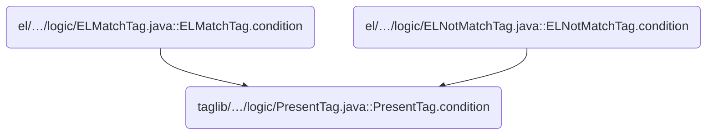
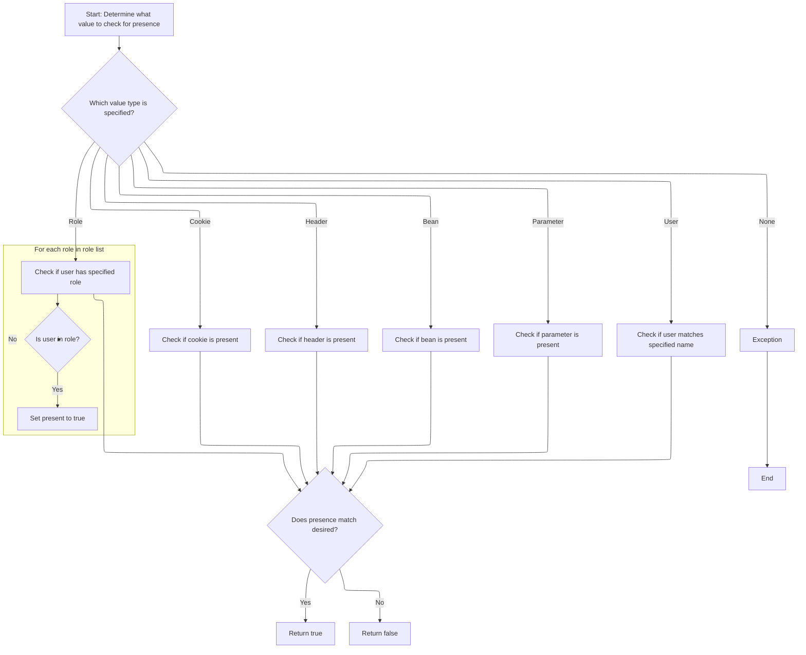

This document describes how the system determines whether a specific request attribute is present, based on user-specified criteria. Only the first attribute set among cookie, header, bean, parameter, role, or user is checked, and the result is used to control conditional rendering in JSP pages.

# Where is this flow used?

This flow is used multiple times in the codebase as represented in the following diagram:



# Evaluating Request Attribute Presence



<SwmSnippet path="/taglib/src/main/java/org/apache/struts/taglib/logic/PresentTag.java" line="67">

---

In <SwmToken path="taglib/src/main/java/org/apache/struts/taglib/logic/PresentTag.java" pos="67:5:5" line-data="    protected boolean condition(boolean desired)">`condition`</SwmToken>, the function starts by checking each possible request attribute (cookie, header, name, parameter, role, user) in a fixed order, using only the first non-null one to determine presence. If multiple are set, only the first is used, which isn't obvious from the interface. The logic for each attribute is delegated to helper methods or direct checks.

```java
    protected boolean condition(boolean desired)
        throws JspException {
        // Evaluate the presence of the specified value
        boolean present = false;
        HttpServletRequest request =
            (HttpServletRequest) pageContext.getRequest();

        if (cookie != null) {
            present = this.isCookiePresent(request);
        } else if (header != null) {
            String value = request.getHeader(header);

            present = (value != null);
        } else if (name != null) {
            present = this.isBeanPresent();
        } else if (parameter != null) {
            String value = request.getParameter(parameter);

            present = (value != null);
        } else if (role != null) {
            StringTokenizer st =
                new StringTokenizer(role, ROLE_DELIMITER, false);

            while (!present && st.hasMoreTokens()) {
                present = request.isUserInRole(st.nextToken());
            }
```

---

</SwmSnippet>

<SwmSnippet path="/taglib/src/main/java/org/apache/struts/taglib/logic/PresentTag.java" line="93">

---

Finally, the function either throws an exception if no field is set, or returns true if the detected presence matches the 'desired' value. This determines if the tag body should be evaluated in the JSP.

```java
        } else if (user != null) {
            Principal principal = request.getUserPrincipal();

            present = (principal != null) && user.equals(principal.getName());
        } else {
            JspException e =
                new JspException(messages.getMessage("logic.selector"));

            TagUtils.getInstance().saveException(pageContext, e);
            throw e;
        }

        return (present == desired);
    }
```

---

</SwmSnippet>

&nbsp;

*This is an auto-generated document by Swimm 🌊 and has not yet been verified by a human*

<SwmMeta version="3.0.0" repo-id="Z2l0aHViJTNBJTNBc3RydXRzMSUzQSUzQVN3aW1tLURlbW8=" repo-name="struts1"><sup>Powered by [Swimm](https://app.swimm.io/)</sup></SwmMeta>
