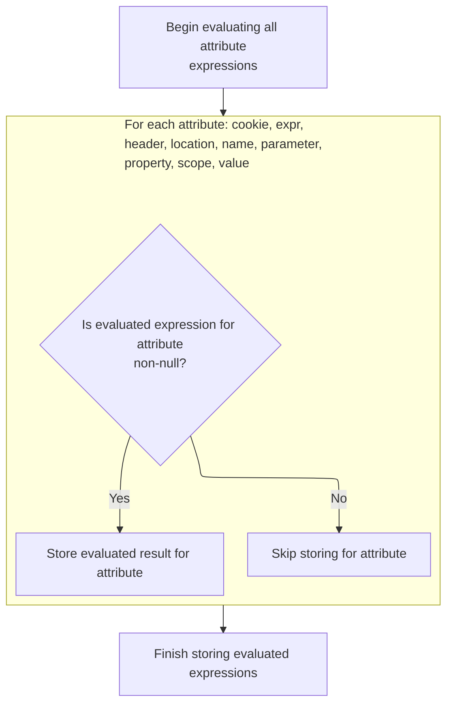

This document describes how tag attributes in a JSP page are dynamically evaluated and set before executing the tag's main logic. The process ensures that all expressions are resolved so the tag operates with the correct values.

# Starting the tag processing

<SwmSnippet path="/el/src/main/java/org/apache/strutsel/taglib/logic/ELMatchTag.java" line="277">

---

In <SwmToken path="el/src/main/java/org/apache/strutsel/taglib/logic/ELMatchTag.java" pos="277:5:5" line-data="    public int doStartTag() throws JspException {">`doStartTag`</SwmToken>, we kick things off by calling <SwmToken path="el/src/main/java/org/apache/strutsel/taglib/logic/ELMatchTag.java" pos="278:1:1" line-data="        evaluateExpressions();">`evaluateExpressions`</SwmToken> so all tag attributes are resolved and set before any tag logic runs. This makes sure everything downstream uses the right values.

```java
    public int doStartTag() throws JspException {
        evaluateExpressions();

```

---

</SwmSnippet>

## Evaluating and applying tag expressions



<SwmSnippet path="/el/src/main/java/org/apache/strutsel/taglib/logic/ELMatchTag.java" line="312">

---

In <SwmToken path="el/src/main/java/org/apache/strutsel/taglib/logic/ELMatchTag.java" pos="312:5:5" line-data="    private void evaluateExpressions()">`evaluateExpressions`</SwmToken>, we loop through each tag attribute, resolve its expression, and update the tag state. When 'parameter' is set, we call <SwmToken path="core/src/main/java/org/apache/struts/config/MessageResourcesConfig.java" pos="34:4:4" line-data="public class MessageResourcesConfig extends BaseConfig {">`MessageResourcesConfig`</SwmToken> to update the config, so downstream logic gets the right value.

```java
    private void evaluateExpressions()
        throws JspException {
        String string = null;

        if ((string =
                EvalHelper.evalString("cookie", getCookieExpr(), this,
                    pageContext)) != null) {
            setCookie(string);
        }

        if ((string =
                EvalHelper.evalString("expr", getExpr(), this, pageContext)) != null) {
            setExprValue(string);
        }

        if ((string =
                EvalHelper.evalString("header", getHeaderExpr(), this,
                    pageContext)) != null) {
            setHeader(string);
        }

        if ((string =
                EvalHelper.evalString("location", getLocationExpr(), this,
                    pageContext)) != null) {
            setLocation(string);
        }

        if ((string =
                EvalHelper.evalString("name", getNameExpr(), this, pageContext)) != null) {
            setName(string);
        }

        if ((string =
                EvalHelper.evalString("parameter", getParameterExpr(), this,
                    pageContext)) != null) {
            setParameter(string);
        }

```

---

</SwmSnippet>

<SwmSnippet path="/core/src/main/java/org/apache/struts/config/MessageResourcesConfig.java" line="127">

---

<SwmToken path="core/src/main/java/org/apache/struts/config/MessageResourcesConfig.java" pos="127:5:5" line-data="    public void setParameter(String parameter) {">`setParameter`</SwmToken> checks if the config is frozen. If it's not, it updates the parameter; if it is, it throws an exception to block changes.

```java
    public void setParameter(String parameter) {
        if (configured) {
            throw new IllegalStateException("Configuration is frozen");
        }

        this.parameter = parameter;
    }
```

---

</SwmSnippet>

<SwmSnippet path="/el/src/main/java/org/apache/strutsel/taglib/logic/ELMatchTag.java" line="350">

---

After coming back from <SwmToken path="core/src/main/java/org/apache/struts/config/MessageResourcesConfig.java" pos="34:4:4" line-data="public class MessageResourcesConfig extends BaseConfig {">`MessageResourcesConfig`</SwmToken>, <SwmToken path="el/src/main/java/org/apache/strutsel/taglib/logic/ELMatchTag.java" pos="278:1:1" line-data="        evaluateExpressions();">`evaluateExpressions`</SwmToken> keeps resolving more tag attributes. If 'scope' is present, we call <SwmToken path="core/src/main/java/org/apache/struts/config/ActionConfig.java" pos="41:4:4" line-data="public class ActionConfig extends BaseConfig {">`ActionConfig`</SwmToken> to update it, so the tag's scope is set up for later use.

```java
        if ((string =
                EvalHelper.evalString("property", getPropertyExpr(), this,
                    pageContext)) != null) {
            setProperty(string);
        }

        if ((string =
                EvalHelper.evalString("scope", getScopeExpr(), this, pageContext)) != null) {
            setScope(string);
        }

```

---

</SwmSnippet>

<SwmSnippet path="/core/src/main/java/org/apache/struts/config/ActionConfig.java" line="652">

---

<SwmToken path="core/src/main/java/org/apache/struts/config/ActionConfig.java" pos="652:5:5" line-data="    public void setScope(String scope) {">`setScope`</SwmToken> checks if the config is frozen. If not, it updates the scope; if frozen, it throws an exception so you can't change it anymore.

```java
    public void setScope(String scope) {
        if (configured) {
            throw new IllegalStateException("Configuration is frozen");
        }

        this.scope = scope;
    }
```

---

</SwmSnippet>

<SwmSnippet path="/el/src/main/java/org/apache/strutsel/taglib/logic/ELMatchTag.java" line="361">

---

After coming back from <SwmToken path="core/src/main/java/org/apache/struts/config/ActionConfig.java" pos="41:4:4" line-data="public class ActionConfig extends BaseConfig {">`ActionConfig`</SwmToken>, <SwmToken path="el/src/main/java/org/apache/strutsel/taglib/logic/ELMatchTag.java" pos="278:1:1" line-data="        evaluateExpressions();">`evaluateExpressions`</SwmToken> wraps up by checking and setting the 'value' attribute if it's present. That's the last dynamic property handled for this tag.

```java
        if ((string =
                EvalHelper.evalString("value", getValueExpr(), this, pageContext)) != null) {
            setValue(string);
        }
    }
```

---

</SwmSnippet>

## Delegating to parent tag logic

<SwmSnippet path="/el/src/main/java/org/apache/strutsel/taglib/logic/ELMatchTag.java" line="280">

---

After finishing <SwmToken path="el/src/main/java/org/apache/strutsel/taglib/logic/ELMatchTag.java" pos="278:1:1" line-data="        evaluateExpressions();">`evaluateExpressions`</SwmToken>, <SwmToken path="el/src/main/java/org/apache/strutsel/taglib/logic/ELMatchTag.java" pos="280:6:6" line-data="        return (super.doStartTag());">`doStartTag`</SwmToken> hands off to the parent class by calling <SwmToken path="el/src/main/java/org/apache/strutsel/taglib/logic/ELMatchTag.java" pos="280:4:8" line-data="        return (super.doStartTag());">`super.doStartTag()`</SwmToken>. This triggers the standard tag logic, which may involve processing other tags like <SwmToken path="el/src/main/java/org/apache/strutsel/taglib/bean/ELResourceTag.java" pos="38:4:4" line-data="public class ELResourceTag extends ResourceTag {">`ELResourceTag`</SwmToken> next.

```java
        return (super.doStartTag());
    }
```

---

</SwmSnippet>

# Processing resource tag start

<SwmSnippet path="/el/src/main/java/org/apache/strutsel/taglib/bean/ELResourceTag.java" line="120">

---

<SwmToken path="el/src/main/java/org/apache/strutsel/taglib/bean/ELResourceTag.java" pos="120:5:5" line-data="    public int doStartTag() throws JspException {">`doStartTag`</SwmToken> in <SwmToken path="el/src/main/java/org/apache/strutsel/taglib/bean/ELResourceTag.java" pos="38:4:4" line-data="public class ELResourceTag extends ResourceTag {">`ELResourceTag`</SwmToken> first resolves all tag expressions, then calls the parent class for the actual tag processing. This makes sure all dynamic values are set before running the tag logic.

```java
    public int doStartTag() throws JspException {
        evaluateExpressions();

        return (super.doStartTag());
    }
```

---

</SwmSnippet>

# Evaluating resource tag expressions

```mermaid
%%{init: {"flowchart": {"defaultRenderer": "elk"}} }%%
flowchart TD
  node1["Evaluate expressions for resource
attributes"]
  click node1 openCode "el/src/main/java/org/apache/strutsel/taglib/bean/ELResourceTag.java:132:150"
  node1 --> node2{"Does 'id' expression yield a value?"}
  click node2 openCode "el/src/main/java/org/apache/strutsel/taglib/bean/ELResourceTag.java:136:139"
  node2 -->|"Yes"| node3["Set resource 'id'"]
  click node3 openCode "el/src/main/java/org/apache/strutsel/taglib/bean/ELResourceTag.java:138:139"
  node2 -->|"No"| node4
  node3 --> node4
  node4{"Does 'input' expression yield a value?"}
  click node4 openCode "el/src/main/java/org/apache/strutsel/taglib/bean/ELResourceTag.java:141:144"
  node4 -->|"Yes"| node5["Set resource 'input'"]
  click node5 openCode "el/src/main/java/org/apache/strutsel/taglib/bean/ELResourceTag.java:143:144"
  node4 -->|"No"| node6
  node5 --> node6
  node6{"Does 'name' expression yield a value?"}
  click node6 openCode "el/src/main/java/org/apache/strutsel/taglib/bean/ELResourceTag.java:146:149"
  node6 -->|"Yes"| node7["Set resource 'name'"]
  click node7 openCode "el/src/main/java/org/apache/strutsel/taglib/bean/ELResourceTag.java:148:149"
  node6 -->|"No"| node8["End of evaluation"]
  node7 --> node8
  click node8 openCode "el/src/main/java/org/apache/strutsel/taglib/bean/ELResourceTag.java:150:150"

classDef HeadingStyle fill:#777777,stroke:#333,stroke-width:2px;

%% Swimm:
%% %%{init: {"flowchart": {"defaultRenderer": "elk"}} }%%
%% flowchart TD
%%   node1["Evaluate expressions for resource
%% attributes"]
%%   click node1 openCode "<SwmPath>[el/…/bean/ELResourceTag.java](el/src/main/java/org/apache/strutsel/taglib/bean/ELResourceTag.java)</SwmPath>:132:150"
%%   node1 --> node2{"Does 'id' expression yield a value?"}
%%   click node2 openCode "<SwmPath>[el/…/bean/ELResourceTag.java](el/src/main/java/org/apache/strutsel/taglib/bean/ELResourceTag.java)</SwmPath>:136:139"
%%   node2 -->|"Yes"| node3["Set resource 'id'"]
%%   click node3 openCode "<SwmPath>[el/…/bean/ELResourceTag.java](el/src/main/java/org/apache/strutsel/taglib/bean/ELResourceTag.java)</SwmPath>:138:139"
%%   node2 -->|"No"| node4
%%   node3 --> node4
%%   node4{"Does 'input' expression yield a value?"}
%%   click node4 openCode "<SwmPath>[el/…/bean/ELResourceTag.java](el/src/main/java/org/apache/strutsel/taglib/bean/ELResourceTag.java)</SwmPath>:141:144"
%%   node4 -->|"Yes"| node5["Set resource 'input'"]
%%   click node5 openCode "<SwmPath>[el/…/bean/ELResourceTag.java](el/src/main/java/org/apache/strutsel/taglib/bean/ELResourceTag.java)</SwmPath>:143:144"
%%   node4 -->|"No"| node6
%%   node5 --> node6
%%   node6{"Does 'name' expression yield a value?"}
%%   click node6 openCode "<SwmPath>[el/…/bean/ELResourceTag.java](el/src/main/java/org/apache/strutsel/taglib/bean/ELResourceTag.java)</SwmPath>:146:149"
%%   node6 -->|"Yes"| node7["Set resource 'name'"]
%%   click node7 openCode "<SwmPath>[el/…/bean/ELResourceTag.java](el/src/main/java/org/apache/strutsel/taglib/bean/ELResourceTag.java)</SwmPath>:148:149"
%%   node6 -->|"No"| node8["End of evaluation"]
%%   node7 --> node8
%%   click node8 openCode "<SwmPath>[el/…/bean/ELResourceTag.java](el/src/main/java/org/apache/strutsel/taglib/bean/ELResourceTag.java)</SwmPath>:150:150"
%% 
%% classDef HeadingStyle fill:#777777,stroke:#333,stroke-width:2px;
```



<SwmSnippet path="/el/src/main/java/org/apache/strutsel/taglib/bean/ELResourceTag.java" line="132">

---

In <SwmToken path="el/src/main/java/org/apache/strutsel/taglib/bean/ELResourceTag.java" pos="132:5:5" line-data="    private void evaluateExpressions()">`evaluateExpressions`</SwmToken>, we resolve 'id' and 'input' expressions. If 'input' is present, we call <SwmToken path="core/src/main/java/org/apache/struts/config/ActionConfig.java" pos="41:4:4" line-data="public class ActionConfig extends BaseConfig {">`ActionConfig`</SwmToken> to update the config, so the tag uses the right input value.

```java
    private void evaluateExpressions()
        throws JspException {
        String string = null;

        if ((string =
                EvalHelper.evalString("id", getIdExpr(), this, pageContext)) != null) {
            setId(string);
        }

        if ((string =
                EvalHelper.evalString("input", getInputExpr(), this, pageContext)) != null) {
            setInput(string);
        }

```

---

</SwmSnippet>

<SwmSnippet path="/core/src/main/java/org/apache/struts/config/ActionConfig.java" line="473">

---

<SwmToken path="core/src/main/java/org/apache/struts/config/ActionConfig.java" pos="473:5:5" line-data="    public void setInput(String input) {">`setInput`</SwmToken> checks if the config is frozen. If not, it updates the input; if frozen, it throws an exception so you can't change it anymore.

```java
    public void setInput(String input) {
        if (configured) {
            throw new IllegalStateException("Configuration is frozen");
        }

        this.input = input;
    }
```

---

</SwmSnippet>

<SwmSnippet path="/el/src/main/java/org/apache/strutsel/taglib/bean/ELResourceTag.java" line="146">

---

After coming back from <SwmToken path="core/src/main/java/org/apache/struts/config/ActionConfig.java" pos="41:4:4" line-data="public class ActionConfig extends BaseConfig {">`ActionConfig`</SwmToken>, <SwmToken path="el/src/main/java/org/apache/strutsel/taglib/logic/ELMatchTag.java" pos="278:1:1" line-data="        evaluateExpressions();">`evaluateExpressions`</SwmToken> in <SwmToken path="el/src/main/java/org/apache/strutsel/taglib/bean/ELResourceTag.java" pos="38:4:4" line-data="public class ELResourceTag extends ResourceTag {">`ELResourceTag`</SwmToken> finishes by checking and setting the 'name' attribute if it's present. That's the last dynamic property handled for this tag.

```java
        if ((string =
                EvalHelper.evalString("name", getNameExpr(), this, pageContext)) != null) {
            setName(string);
        }
    }
```

---

</SwmSnippet>

&nbsp;

*This is an auto-generated document by Swimm 🌊 and has not yet been verified by a human*

<SwmMeta version="3.0.0" repo-id="Z2l0aHViJTNBJTNBc3RydXRzMSUzQSUzQVN3aW1tLURlbW8=" repo-name="struts1"><sup>Powered by [Swimm](https://app.swimm.io/)</sup></SwmMeta>
