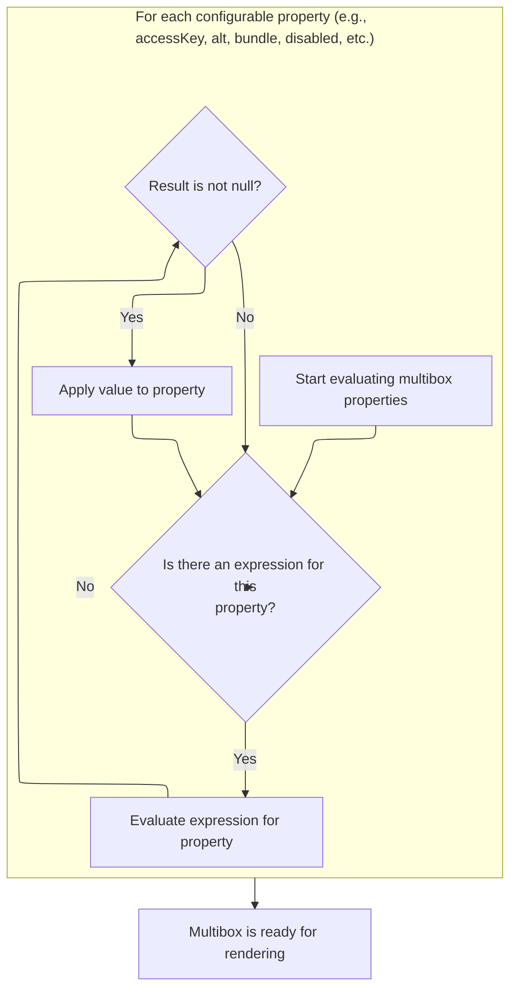
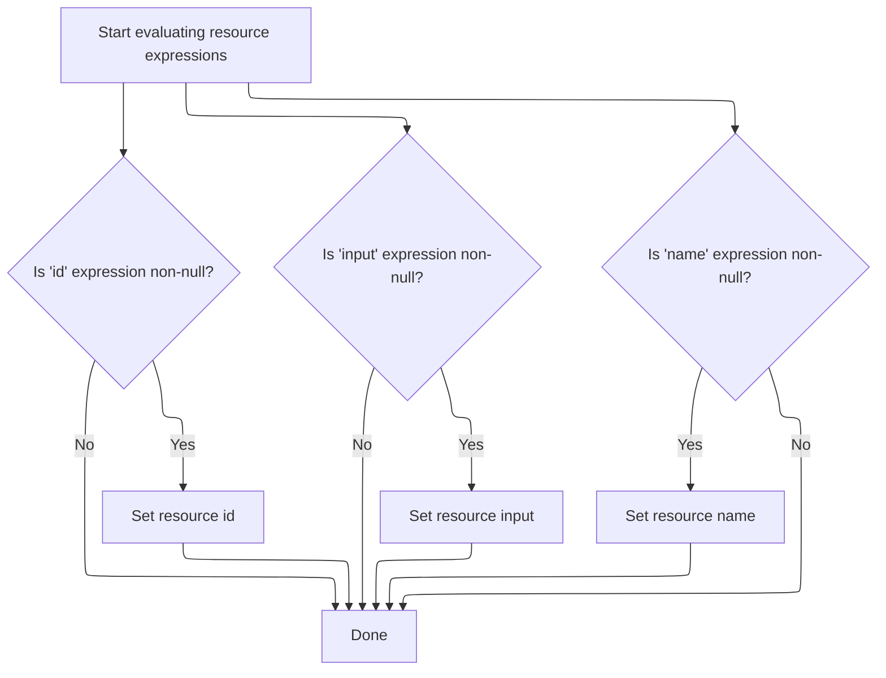

This document explains how tag attributes with Expression Language (EL) expressions are evaluated to ensure dynamic values are resolved before rendering. The flow covers both multibox and resource tags, enabling flexible and dynamic tag configuration in JSP pages.

# Starting Multibox Tag Processing

<SwmSnippet path="/el/src/main/java/org/apache/strutsel/taglib/html/ELMultiboxTag.java" line="767">

---

In <SwmToken path="el/src/main/java/org/apache/strutsel/taglib/html/ELMultiboxTag.java" pos="767:5:5" line-data="    public int doStartTag() throws JspException {">`doStartTag`</SwmToken>, we kick things off by evaluating all the EL expressions for the tag's attributes. This ensures that any dynamic values provided in the JSP are resolved before the tag does anything else. Next, we call <SwmToken path="el/src/main/java/org/apache/strutsel/taglib/html/ELMultiboxTag.java" pos="768:1:1" line-data="        evaluateExpressions();">`evaluateExpressions`</SwmToken> to handle this resolution step.

```java
    public int doStartTag() throws JspException {
        evaluateExpressions();

```

---

</SwmSnippet>

## Evaluating Multibox Tag Expressions



<SwmSnippet path="/el/src/main/java/org/apache/strutsel/taglib/html/ELMultiboxTag.java" line="779">

---

In <SwmToken path="el/src/main/java/org/apache/strutsel/taglib/html/ELMultiboxTag.java" pos="779:5:5" line-data="    private void evaluateExpressions()">`evaluateExpressions`</SwmToken>, we go through each tag attribute that can be set via EL, evaluate its expression, and set the resolved value. We call <SwmToken path="el/src/main/java/org/apache/strutsel/taglib/html/ELMultiboxTag.java" pos="785:1:3" line-data="                EvalHelper.evalString(&quot;accessKey&quot;, getAccesskeyExpr(), this,">`EvalHelper.evalString`</SwmToken> next to actually perform the EL evaluation for each attribute.

```java
    private void evaluateExpressions()
        throws JspException {
        String string = null;
        Boolean bool = null;

        if ((string =
                EvalHelper.evalString("accessKey", getAccesskeyExpr(), this,
                    pageContext)) != null) {
            setAccesskey(string);
        }

        if ((string =
                EvalHelper.evalString("alt", getAltExpr(), this, pageContext)) != null) {
            setAlt(string);
        }

        if ((string =
                EvalHelper.evalString("altKey", getAltKeyExpr(), this,
                    pageContext)) != null) {
            setAltKey(string);
        }

        if ((string =
                EvalHelper.evalString("bundle", getBundleExpr(), this,
                    pageContext)) != null) {
```

---

</SwmSnippet>

<SwmSnippet path="/el/src/main/java/org/apache/strutsel/taglib/utils/EvalHelper.java" line="64">

---

<SwmToken path="el/src/main/java/org/apache/strutsel/taglib/utils/EvalHelper.java" pos="64:7:7" line-data="    public static String evalString(String attrName, String attrValue,">`evalString`</SwmToken> checks if the attribute value is non-null, then evaluates it as an EL expression using the tag and page context. The result is the evaluated string, not just the raw input.

```java
    public static String evalString(String attrName, String attrValue,
        Tag tagObject, PageContext pageContext)
        throws JspException {
        Object result = null;

        if (attrValue != null) {
            result =
                ExpressionEvaluatorManager.evaluate(attrName, attrValue,
                    String.class, tagObject, pageContext);
        }

        return ((String) result);
    }
```

---

</SwmSnippet>

<SwmSnippet path="/el/src/main/java/org/apache/strutsel/taglib/html/ELMultiboxTag.java" line="804">

---

Back in `ELMultiboxTag.evaluateExpressions`, after getting the evaluated bundle string, we set it using <SwmToken path="el/src/main/java/org/apache/strutsel/taglib/html/ELMultiboxTag.java" pos="804:1:1" line-data="            setBundle(string);">`setBundle`</SwmToken>. Next, we call into the config logic to actually update the bundle, but only if the configuration isn't frozen.

```java
            setBundle(string);
        }

```

---

</SwmSnippet>

<SwmSnippet path="/core/src/main/java/org/apache/struts/config/ExceptionConfig.java" line="89">

---

<SwmToken path="core/src/main/java/org/apache/struts/config/ExceptionConfig.java" pos="89:5:5" line-data="    public void setBundle(String bundle) {">`setBundle`</SwmToken> checks if the config is frozen (using the <SwmToken path="core/src/main/java/org/apache/struts/config/ExceptionConfig.java" pos="90:4:4" line-data="        if (configured) {">`configured`</SwmToken> flag). If it is, it throws an exception to block changes; otherwise, it updates the bundle string.

```java
    public void setBundle(String bundle) {
        if (configured) {
            throw new IllegalStateException("Configuration is frozen");
        }

        this.bundle = bundle;
    }
```

---

</SwmSnippet>

<SwmSnippet path="/el/src/main/java/org/apache/strutsel/taglib/html/ELMultiboxTag.java" line="807">

---

Back in `ELMultiboxTag.evaluateExpressions`, after handling the bundle, we keep evaluating and setting all other EL-capable attributes using <SwmToken path="el/src/main/java/org/apache/strutsel/taglib/html/ELMultiboxTag.java" pos="808:1:1" line-data="                EvalHelper.evalBoolean(&quot;disabled&quot;, getDisabledExpr(), this,">`EvalHelper`</SwmToken>. Each attribute is processed individually to ensure all dynamic values are resolved.

```java
        if ((bool =
                EvalHelper.evalBoolean("disabled", getDisabledExpr(), this,
                    pageContext)) != null) {
            setDisabled(bool.booleanValue());
        }

        if ((string =
                EvalHelper.evalString("errorKey", getErrorKeyExpr(), this,
                    pageContext)) != null) {
            setErrorKey(string);
        }

        if ((string =
                EvalHelper.evalString("errorStyle", getErrorStyleExpr(), this,
                    pageContext)) != null) {
            setErrorStyle(string);
        }

        if ((string =
                EvalHelper.evalString("errorStyleClass",
                    getErrorStyleClassExpr(), this, pageContext)) != null) {
            setErrorStyleClass(string);
        }

        if ((string =
                EvalHelper.evalString("errorStyleId", getErrorStyleIdExpr(),
                    this, pageContext)) != null) {
            setErrorStyleId(string);
        }

        if ((string =
                EvalHelper.evalString("name", getNameExpr(), this, pageContext)) != null) {
            setName(string);
        }

        if ((string =
                EvalHelper.evalString("onblur", getOnblurExpr(), this,
                    pageContext)) != null) {
            setOnblur(string);
        }

        if ((string =
                EvalHelper.evalString("onchange", getOnchangeExpr(), this,
                    pageContext)) != null) {
            setOnchange(string);
        }

        if ((string =
                EvalHelper.evalString("onclick", getOnclickExpr(), this,
                    pageContext)) != null) {
            setOnclick(string);
        }

        if ((string =
                EvalHelper.evalString("ondblclick", getOndblclickExpr(), this,
                    pageContext)) != null) {
            setOndblclick(string);
        }

        if ((string =
                EvalHelper.evalString("onfocus", getOnfocusExpr(), this,
                    pageContext)) != null) {
            setOnfocus(string);
        }

        if ((string =
                EvalHelper.evalString("onkeydown", getOnkeydownExpr(), this,
                    pageContext)) != null) {
            setOnkeydown(string);
        }

        if ((string =
                EvalHelper.evalString("onkeypress", getOnkeypressExpr(), this,
                    pageContext)) != null) {
            setOnkeypress(string);
        }

        if ((string =
                EvalHelper.evalString("onkeyup", getOnkeyupExpr(), this,
                    pageContext)) != null) {
            setOnkeyup(string);
        }

        if ((string =
                EvalHelper.evalString("onmousedown", getOnmousedownExpr(),
                    this, pageContext)) != null) {
            setOnmousedown(string);
        }

        if ((string =
                EvalHelper.evalString("onmousemove", getOnmousemoveExpr(),
                    this, pageContext)) != null) {
            setOnmousemove(string);
        }

        if ((string =
                EvalHelper.evalString("onmouseout", getOnmouseoutExpr(), this,
                    pageContext)) != null) {
            setOnmouseout(string);
        }

        if ((string =
                EvalHelper.evalString("onmouseover", getOnmouseoverExpr(),
                    this, pageContext)) != null) {
            setOnmouseover(string);
        }

        if ((string =
                EvalHelper.evalString("onmouseup", getOnmouseupExpr(), this,
                    pageContext)) != null) {
            setOnmouseup(string);
        }

        if ((string =
                EvalHelper.evalString("property", getPropertyExpr(), this,
                    pageContext)) != null) {
            setProperty(string);
        }

        if ((string =
                EvalHelper.evalString("style", getStyleExpr(), this, pageContext)) != null) {
            setStyle(string);
        }

        if ((string =
                EvalHelper.evalString("styleClass", getStyleClassExpr(), this,
                    pageContext)) != null) {
            setStyleClass(string);
        }

        if ((string =
                EvalHelper.evalString("styleId", getStyleIdExpr(), this,
                    pageContext)) != null) {
            setStyleId(string);
        }

        if ((string =
                EvalHelper.evalString("tabindex", getTabindexExpr(), this,
                    pageContext)) != null) {
            setTabindex(string);
        }

        if ((string =
                EvalHelper.evalString("title", getTitleExpr(), this, pageContext)) != null) {
            setTitle(string);
        }

        if ((string =
                EvalHelper.evalString("titleKey", getTitleKeyExpr(), this,
                    pageContext)) != null) {
            setTitleKey(string);
        }

        if ((string =
                EvalHelper.evalString("value", getValueExpr(), this, pageContext)) != null) {
            setValue(string);
        }
    }
```

---

</SwmSnippet>

## Delegating to Parent Multibox Logic

<SwmSnippet path="/el/src/main/java/org/apache/strutsel/taglib/html/ELMultiboxTag.java" line="770">

---

Back in `ELMultiboxTag.doStartTag`, after evaluating all expressions, we delegate to the parent tag logic by calling <SwmToken path="el/src/main/java/org/apache/strutsel/taglib/html/ELMultiboxTag.java" pos="770:4:6" line-data="        return (super.doStartTag());">`super.doStartTag`</SwmToken>. This hands off control to the base implementation, which handles the main tag processing. Next, we move to the resource tag logic if needed.

```java
        return (super.doStartTag());
    }
```

---

</SwmSnippet>

# Starting Resource Tag Processing

<SwmSnippet path="/el/src/main/java/org/apache/strutsel/taglib/bean/ELResourceTag.java" line="120">

---

<SwmToken path="el/src/main/java/org/apache/strutsel/taglib/bean/ELResourceTag.java" pos="120:5:5" line-data="    public int doStartTag() throws JspException {">`doStartTag`</SwmToken> in the resource tag starts by evaluating all EL expressions for its attributes, just like the multibox tag. This makes sure any dynamic values are set up before continuing.

```java
    public int doStartTag() throws JspException {
        evaluateExpressions();

        return (super.doStartTag());
    }
```

---

</SwmSnippet>

# Evaluating Resource Tag Expressions



<SwmSnippet path="/el/src/main/java/org/apache/strutsel/taglib/bean/ELResourceTag.java" line="132">

---

In <SwmToken path="el/src/main/java/org/apache/strutsel/taglib/bean/ELResourceTag.java" pos="132:5:5" line-data="    private void evaluateExpressions()">`evaluateExpressions`</SwmToken> for the resource tag, we evaluate the 'id' and 'input' expressions using <SwmToken path="el/src/main/java/org/apache/strutsel/taglib/bean/ELResourceTag.java" pos="137:1:3" line-data="                EvalHelper.evalString(&quot;id&quot;, getIdExpr(), this, pageContext)) != null) {">`EvalHelper.evalString`</SwmToken>. This resolves any EL expressions before setting the values on the tag.

```java
    private void evaluateExpressions()
        throws JspException {
        String string = null;

        if ((string =
                EvalHelper.evalString("id", getIdExpr(), this, pageContext)) != null) {
            setId(string);
        }

        if ((string =
                EvalHelper.evalString("input", getInputExpr(), this, pageContext)) != null) {
```

---

</SwmSnippet>

<SwmSnippet path="/el/src/main/java/org/apache/strutsel/taglib/bean/ELResourceTag.java" line="143">

---

Back in `ELResourceTag.evaluateExpressions`, after evaluating the input expression, we set it using <SwmToken path="el/src/main/java/org/apache/strutsel/taglib/bean/ELResourceTag.java" pos="143:1:1" line-data="            setInput(string);">`setInput`</SwmToken>. Next, we call into the config logic to actually update the input, but only if the configuration isn't frozen.

```java
            setInput(string);
        }

```

---

</SwmSnippet>

<SwmSnippet path="/core/src/main/java/org/apache/struts/config/ActionConfig.java" line="473">

---

<SwmToken path="core/src/main/java/org/apache/struts/config/ActionConfig.java" pos="473:5:5" line-data="    public void setInput(String input) {">`setInput`</SwmToken> checks if the config is frozen (using the <SwmToken path="core/src/main/java/org/apache/struts/config/ActionConfig.java" pos="474:4:4" line-data="        if (configured) {">`configured`</SwmToken> flag). If it is, it throws an exception to block changes; otherwise, it updates the input string.

```java
    public void setInput(String input) {
        if (configured) {
            throw new IllegalStateException("Configuration is frozen");
        }

        this.input = input;
    }
```

---

</SwmSnippet>

<SwmSnippet path="/el/src/main/java/org/apache/strutsel/taglib/bean/ELResourceTag.java" line="146">

---

Back in `ELResourceTag.evaluateExpressions`, after handling input, we keep evaluating and setting any other EL-capable attributes using <SwmToken path="el/src/main/java/org/apache/strutsel/taglib/bean/ELResourceTag.java" pos="147:1:1" line-data="                EvalHelper.evalString(&quot;name&quot;, getNameExpr(), this, pageContext)) != null) {">`EvalHelper`</SwmToken>. Each attribute is processed individually to ensure all dynamic values are resolved.

```java
        if ((string =
                EvalHelper.evalString("name", getNameExpr(), this, pageContext)) != null) {
            setName(string);
        }
    }
```

---

</SwmSnippet>

&nbsp;

*This is an auto-generated document by Swimm 🌊 and has not yet been verified by a human*

<SwmMeta version="3.0.0" repo-id="Z2l0aHViJTNBJTNBc3RydXRzMSUzQSUzQVN3aW1tLURlbW8=" repo-name="struts1"><sup>Powered by [Swimm](https://app.swimm.io/)</sup></SwmMeta>
