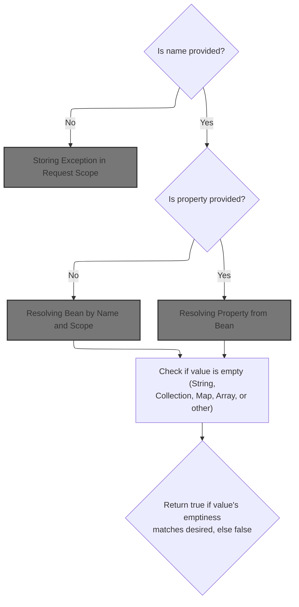
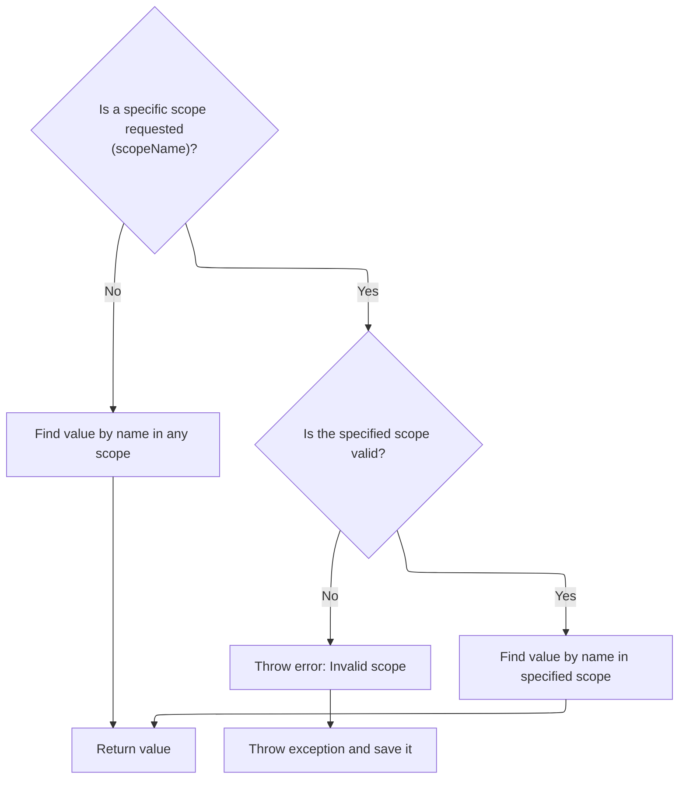
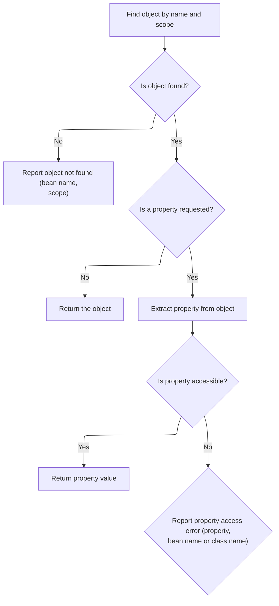

This document describes how the system determines whether a specified value, such as a bean or property, is empty. By supporting flexible attribute and scope resolution, this flow enables conditional logic or rendering in web pages. The process accepts attributes like name, property, and scope, and returns a boolean indicating if the value's emptiness matches the desired condition.

# Checking for Missing Name Attribute



<SwmSnippet path="/taglib/src/main/java/org/apache/struts/taglib/logic/EmptyTag.java" line="65">

---

In <SwmToken path="taglib/src/main/java/org/apache/struts/taglib/logic/EmptyTag.java" pos="65:5:5" line-data="    protected boolean condition(boolean desired)">`condition`</SwmToken>, we check if the 'name' attribute is missing and, if so, create and throw a <SwmToken path="taglib/src/main/java/org/apache/struts/taglib/logic/EmptyTag.java" pos="66:3:3" line-data="        throws JspException {">`JspException`</SwmToken>. Before throwing, we call TagUtils.saveException to store the exception in the page context, so error handlers can access it.

```java
    protected boolean condition(boolean desired)
        throws JspException {
        if (this.name == null) {
            JspException e =
                new JspException(messages.getMessage("empty.noNameAttribute"));

            TagUtils.getInstance().saveException(pageContext, e);
            throw e;
        }

```

---

</SwmSnippet>

## Storing Exception in Request Scope

<SwmSnippet path="/tiles/src/main/java/org/apache/struts/tiles/taglib/util/TagUtils.java" line="301">

---

<SwmToken path="tiles/src/main/java/org/apache/struts/tiles/taglib/util/TagUtils.java" pos="301:7:7" line-data="    public static void saveException(PageContext pageContext, Throwable exception) {">`saveException`</SwmToken> puts the exception into the page context under <SwmToken path="tiles/src/main/java/org/apache/struts/tiles/taglib/util/TagUtils.java" pos="302:15:15" line-data="        pageContext.setAttribute(Globals.EXCEPTION_KEY, exception, PageContext.REQUEST_SCOPE);">`REQUEST_SCOPE`</SwmToken>, making it available for error handling during this request only.

```java
    public static void saveException(PageContext pageContext, Throwable exception) {
        pageContext.setAttribute(Globals.EXCEPTION_KEY, exception, PageContext.REQUEST_SCOPE);
    }
```

---

</SwmSnippet>

<SwmSnippet path="/tiles/src/main/java/org/apache/struts/tiles/taglib/util/TagUtils.java" line="290">

---

<SwmToken path="tiles/src/main/java/org/apache/struts/tiles/taglib/util/TagUtils.java" pos="290:7:7" line-data="    public static void setAttribute(PageContext pageContext, String name, Object beanValue)">`setAttribute`</SwmToken> is just a wrapper that always puts the attribute in <SwmToken path="tiles/src/main/java/org/apache/struts/tiles/taglib/util/TagUtils.java" pos="292:13:13" line-data="        pageContext.setAttribute(name, beanValue, PageContext.REQUEST_SCOPE);">`REQUEST_SCOPE`</SwmToken>, so everything using it behaves consistently and doesn't leak data across requests.

```java
    public static void setAttribute(PageContext pageContext, String name, Object beanValue)
        throws JspException {
        pageContext.setAttribute(name, beanValue, PageContext.REQUEST_SCOPE);
    }
```

---

</SwmSnippet>

## Looking Up the Bean or Value

<SwmSnippet path="/taglib/src/main/java/org/apache/struts/taglib/logic/EmptyTag.java" line="75">

---

Back in `EmptyTag.condition`, after handling missing names, we fetch the value to check by calling TagUtils.lookup, which handles finding the bean or property in the right scope.

```java
        Object value = null;

        if (this.property == null) {
            value = TagUtils.getInstance().lookup(pageContext, name, scope);
        } else {
```

---

</SwmSnippet>

## Resolving Bean by Name and Scope



<SwmSnippet path="/taglib/src/main/java/org/apache/struts/taglib/TagUtils.java" line="863">

---

In <SwmToken path="taglib/src/main/java/org/apache/struts/taglib/TagUtils.java" pos="863:5:5" line-data="    public Object lookup(PageContext pageContext, String name, String scopeName)">`lookup`</SwmToken>, we either search all scopes for the bean if <SwmToken path="taglib/src/main/java/org/apache/struts/taglib/TagUtils.java" pos="863:19:19" line-data="    public Object lookup(PageContext pageContext, String name, String scopeName)">`scopeName`</SwmToken> is null, or resolve the scope and fetch the bean from that specific scope. Errors in scope resolution are caught and handled.

```java
    public Object lookup(PageContext pageContext, String name, String scopeName)
        throws JspException {
        if (scopeName == null) {
            return pageContext.findAttribute(name);
        }

        try {
            return pageContext.getAttribute(name, instance.getScope(scopeName));
```

---

</SwmSnippet>

<SwmSnippet path="/taglib/src/main/java/org/apache/struts/taglib/TagUtils.java" line="809">

---

<SwmToken path="taglib/src/main/java/org/apache/struts/taglib/TagUtils.java" pos="809:5:5" line-data="    public int getScope(String scopeName)">`getScope`</SwmToken> normalizes the scope name to lowercase and looks it up in a map of known scopes. If the scope isn't found, it throws an exception with a message.

```java
    public int getScope(String scopeName)
        throws JspException {
        Integer scope = (Integer) scopes.get(scopeName.toLowerCase());

        if (scope == null) {
            throw new JspException(messages.getMessage("lookup.scope", scope));
        }

        return scope.intValue();
    }
```

---

</SwmSnippet>

<SwmSnippet path="/taglib/src/main/java/org/apache/struts/taglib/TagUtils.java" line="871">

---

After <SwmToken path="taglib/src/main/java/org/apache/struts/taglib/TagUtils.java" pos="809:5:5" line-data="    public int getScope(String scopeName)">`getScope`</SwmToken> or attribute lookup, if a <SwmToken path="taglib/src/main/java/org/apache/struts/taglib/TagUtils.java" pos="871:6:6" line-data="        } catch (JspException e) {">`JspException`</SwmToken> is thrown, we save it in the page context before rethrowing, so error handlers can access it.

```java
        } catch (JspException e) {
            saveException(pageContext, e);
            throw e;
        }
    }
```

---

</SwmSnippet>

<SwmSnippet path="/taglib/src/main/java/org/apache/struts/taglib/TagUtils.java" line="1170">

---

<SwmToken path="taglib/src/main/java/org/apache/struts/taglib/TagUtils.java" pos="1170:5:5" line-data="    public void saveException(PageContext pageContext, Throwable exception) {">`saveException`</SwmToken> here just puts the exception in <SwmToken path="taglib/src/main/java/org/apache/struts/taglib/TagUtils.java" pos="1172:3:3" line-data="            PageContext.REQUEST_SCOPE);">`REQUEST_SCOPE`</SwmToken> under <SwmToken path="taglib/src/main/java/org/apache/struts/taglib/TagUtils.java" pos="1171:5:7" line-data="        pageContext.setAttribute(Globals.EXCEPTION_KEY, exception,">`Globals.EXCEPTION_KEY`</SwmToken>, same as the tiles version, so error handling is consistent.

```java
    public void saveException(PageContext pageContext, Throwable exception) {
        pageContext.setAttribute(Globals.EXCEPTION_KEY, exception,
            PageContext.REQUEST_SCOPE);
    }
```

---

</SwmSnippet>

## Looking Up a Property Value

<SwmSnippet path="/taglib/src/main/java/org/apache/struts/taglib/logic/EmptyTag.java" line="80">

---

Back in `EmptyTag.condition`, if a property is specified, we call the overloaded TagUtils.lookup to fetch the property value from the bean, handling both bean and property lookups.

```java
            value =
                TagUtils.getInstance().lookup(pageContext, name, property, scope);
        }

```

---

</SwmSnippet>

## Resolving Property from Bean



<SwmSnippet path="/taglib/src/main/java/org/apache/struts/taglib/TagUtils.java" line="897">

---

In <SwmToken path="taglib/src/main/java/org/apache/struts/taglib/TagUtils.java" pos="897:5:5" line-data="    public Object lookup(PageContext pageContext, String name, String property,">`lookup`</SwmToken> (name, property, scope), we first fetch the bean, throw if it's missing, and if a property is specified, use <SwmToken path="taglib/src/main/java/org/apache/struts/taglib/TagUtils.java" pos="922:3:3" line-data="            return PropertyUtils.getProperty(bean, property);">`PropertyUtils`</SwmToken> to get it. All errors are wrapped and saved for error handling.

```java
    public Object lookup(PageContext pageContext, String name, String property,
        String scope) throws JspException {
        // Look up the requested bean, and return if requested
        Object bean = lookup(pageContext, name, scope);

        if (bean == null) {
            JspException e = null;

            if (scope == null) {
                e = new JspException(messages.getMessage("lookup.bean.any", name));
            } else {
                e = new JspException(messages.getMessage("lookup.bean", name,
                            scope));
            }

            saveException(pageContext, e);
            throw e;
        }

        if (property == null) {
            return bean;
        }

        // Locate and return the specified property
        try {
            return PropertyUtils.getProperty(bean, property);
        } catch (IllegalAccessException e) {
            saveException(pageContext, e);
            throw new JspException(messages.getMessage("lookup.access",
                    property, name), e);
        } catch (IllegalArgumentException e) {
            saveException(pageContext, e);
            throw new JspException(messages.getMessage("lookup.argument",
                    property, name), e);
        } catch (InvocationTargetException e) {
            Throwable t = e.getTargetException();

            if (t == null) {
                t = e;
            }

            saveException(pageContext, t);
            throw new JspException(messages.getMessage("lookup.target",
                    property, name), e);
        } catch (NoSuchMethodException e) {
            saveException(pageContext, e);

```

---

</SwmSnippet>

<SwmSnippet path="/taglib/src/main/java/org/apache/struts/taglib/TagUtils.java" line="944">

---

After property lookup in <SwmToken path="taglib/src/main/java/org/apache/struts/taglib/TagUtils.java" pos="947:12:12" line-data="            // an input tag. Thus lookup the bean under the key and use">`lookup`</SwmToken>, if <SwmToken path="taglib/src/main/java/org/apache/struts/taglib/TagUtils.java" pos="941:6:6" line-data="        } catch (NoSuchMethodException e) {">`NoSuchMethodException`</SwmToken> happens and the name is <SwmToken path="taglib/src/main/java/org/apache/struts/taglib/TagUtils.java" pos="949:4:6" line-data="            if (Constants.BEAN_KEY.equals(name)) {">`Constants.BEAN_KEY`</SwmToken>, we try to show the bean's class name in the error message for better debugging. Otherwise, we just throw with the property and name.

```java
            String beanName = name;

            // Name defaults to Contants.BEAN_KEY if no name is specified by
            // an input tag. Thus lookup the bean under the key and use
            // its class name for the exception message.
            if (Constants.BEAN_KEY.equals(name)) {
                Object obj = pageContext.findAttribute(Constants.BEAN_KEY);

                if (obj != null) {
                    beanName = obj.getClass().getName();
                }
            }

            throw new JspException(messages.getMessage("lookup.method",
                    property, beanName), e);
        }
    }
```

---

</SwmSnippet>

## Evaluating If the Value Is Empty

<SwmSnippet path="/taglib/src/main/java/org/apache/struts/taglib/logic/EmptyTag.java" line="84">

---

Back in `EmptyTag.condition`, after getting the value, we check if it's empty by handling String, Collection, Map, and Array types. The result is compared to 'desired' to decide if the tag condition passes.

```java
        boolean empty = true;

        if (value == null) {
            empty = true;
        } else if (value instanceof String) {
            String strValue = (String) value;

            empty = (strValue.length() < 1);
        } else if (value instanceof Collection) {
            Collection collValue = (Collection) value;

            empty = collValue.isEmpty();
        } else if (value instanceof Map) {
            Map mapValue = (Map) value;

            empty = mapValue.isEmpty();
        } else if (value.getClass().isArray()) {
            empty = Array.getLength(value) == 0;
        } else {
            empty = false;
        }

        return (empty == desired);
    }
```

---

</SwmSnippet>

&nbsp;

*This is an auto-generated document by Swimm 🌊 and has not yet been verified by a human*

<SwmMeta version="3.0.0" repo-id="Z2l0aHViJTNBJTNBc3RydXRzMSUzQSUzQVN3aW1tLURlbW8=" repo-name="struts1"><sup>Powered by [Swimm](https://app.swimm.io/)</sup></SwmMeta>
