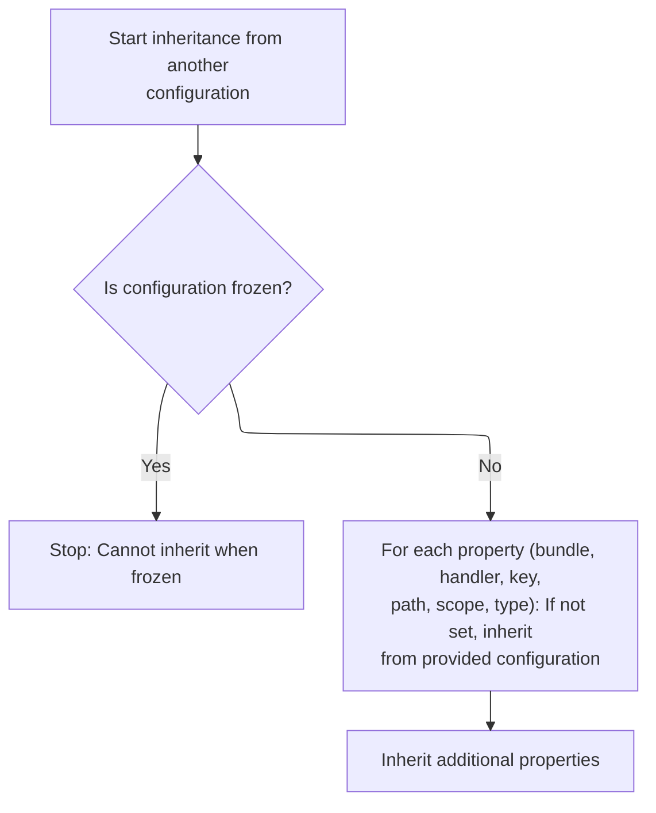

This document describes how exception configurations inherit properties from other configurations, supporting both global and <SwmToken path="core/src/main/java/org/apache/struts/config/ExceptionConfig.java" pos="357:23:25" line-data="            // (because if we are, that means we&#39;re an action-level handler">`action-level`</SwmToken> error handlers. The process receives an exception configuration and outputs a fully resolved configuration with all inherited properties applied, while preventing circular dependencies.

# Resolving <SwmToken path="core/src/main/java/org/apache/struts/config/ExceptionConfig.java" pos="194:1:1" line-data="        ExceptionConfig ancestor = null;">`ExceptionConfig`</SwmToken> Inheritance and Preventing Cycles

<SwmSnippet path="/core/src/main/java/org/apache/struts/config/ExceptionConfig.java" line="336">

---

In <SwmToken path="core/src/main/java/org/apache/struts/config/ExceptionConfig.java" pos="336:5:5" line-data="    public void processExtends(ModuleConfig moduleConfig,">`processExtends`</SwmToken>, we're figuring out which exception config to inherit from by checking if we're a global or <SwmToken path="core/src/main/java/org/apache/struts/config/ExceptionConfig.java" pos="357:23:25" line-data="            // (because if we are, that means we&#39;re an action-level handler">`action-level`</SwmToken> handler, and then searching for the base config in <SwmToken path="core/src/main/java/org/apache/struts/config/ExceptionConfig.java" pos="337:3:3" line-data="        ActionConfig actionConfig)">`actionConfig`</SwmToken> or <SwmToken path="core/src/main/java/org/apache/struts/config/ExceptionConfig.java" pos="336:9:9" line-data="    public void processExtends(ModuleConfig moduleConfig,">`moduleConfig`</SwmToken> as needed. Before we actually inherit, we call <SwmToken path="core/src/main/java/org/apache/struts/config/ExceptionConfig.java" pos="378:4:4" line-data="            if (checkCircularInheritance(moduleConfig, actionConfig)) {">`checkCircularInheritance`</SwmToken> to make sure we're not creating a loop in the inheritance chain, which would break the config resolution.

```java
    public void processExtends(ModuleConfig moduleConfig,
        ActionConfig actionConfig)
        throws ClassNotFoundException, IllegalAccessException,
            InstantiationException, InvocationTargetException {
        if (configured) {
            throw new IllegalStateException("Configuration is frozen");
        }

        String ancestorType = getExtends();

        if ((!extensionProcessed) && (ancestorType != null)) {
            ExceptionConfig baseConfig = null;

            // We only check the action config if we're not a global handler
            boolean checkActionConfig =
                (this != moduleConfig.findExceptionConfig(getType()));

            // ... and the action config was provided
            checkActionConfig &= (actionConfig != null);

            // ... and we're not extending a config with the same type value
            // (because if we are, that means we're an action-level handler
            //  extending a global handler).
            checkActionConfig &= !ancestorType.equals(getType());

            // We first check in the action config's exception handlers
            if (checkActionConfig) {
                baseConfig = actionConfig.findExceptionConfig(ancestorType);
            }

            // Then check the global exception handlers
            if (baseConfig == null) {
                baseConfig = moduleConfig.findExceptionConfig(ancestorType);
            }

            if (baseConfig == null) {
                throw new NullPointerException("Unable to find "
                    + "handler for '" + ancestorType + "' to extend.");
            }

            // Check for circular inheritance and make sure the base config's
            //  own inheritance has been processed already
            if (checkCircularInheritance(moduleConfig, actionConfig)) {
                throw new IllegalArgumentException(
                    "Circular inheritance detected for forward " + getType());
            }

```

---

</SwmSnippet>

<SwmSnippet path="/core/src/main/java/org/apache/struts/config/ExceptionConfig.java" line="185">

---

<SwmToken path="core/src/main/java/org/apache/struts/config/ExceptionConfig.java" pos="185:5:5" line-data="    protected boolean checkCircularInheritance(ModuleConfig moduleConfig,">`checkCircularInheritance`</SwmToken> walks up the inheritance chain, switching between <SwmToken path="core/src/main/java/org/apache/struts/config/ExceptionConfig.java" pos="357:23:25" line-data="            // (because if we are, that means we&#39;re an action-level handler">`action-level`</SwmToken> and global configs as needed, and bails out if it ever sees itself again in the chain. It also flips <SwmToken path="core/src/main/java/org/apache/struts/config/ExceptionConfig.java" pos="186:3:3" line-data="        ActionConfig actionConfig) {">`actionConfig`</SwmToken> to null when it hits a global handler, so it doesn't get stuck bouncing between scopes.

```java
    protected boolean checkCircularInheritance(ModuleConfig moduleConfig,
        ActionConfig actionConfig) {
        String ancestorType = getExtends();

        if (ancestorType == null) {
            return false;
        }

        // Find our ancestor
        ExceptionConfig ancestor = null;

        // First check the action config
        if (actionConfig != null) {
            ancestor = actionConfig.findExceptionConfig(ancestorType);

            // If we found *this*, set ancestor to null to check for a global def
            if (ancestor == this) {
                ancestor = null;
            }
        }

        // Then check the global handlers
        if (ancestor == null) {
            ancestor = moduleConfig.findExceptionConfig(ancestorType);

            if (ancestor != null) {
                // If the ancestor is a global handler, set actionConfig
                //  to null so further searches are only done among
                //  global handlers.
                actionConfig = null;
            }
        }

        while (ancestor != null) {
            // Check if an ancestor is extending *this*
            if (ancestor == this) {
                return true;
            }

            // Get our ancestor's ancestor
            ancestorType = ancestor.getExtends();

            // check against ancestors extending same typed ancestors
            if (ancestor.getType().equals(ancestorType)) {
                // If the ancestor is extending a config for the same type,
                //  make sure we look for its ancestor in the global handlers.
                //  If we're already at that level, we return false.
                if (actionConfig == null) {
                    return false;
                } else {
                    // Set actionConfig = null to force us to look for global
                    //  forwards
                    actionConfig = null;
                }
            }

            ancestor = null;

            // First check the action config
            if (actionConfig != null) {
                ancestor = actionConfig.findExceptionConfig(ancestorType);
            }

            // Then check the global handlers
            if (ancestor == null) {
                ancestor = moduleConfig.findExceptionConfig(ancestorType);

                if (ancestor != null) {
                    // Limit further checks to moduleConfig.
                    actionConfig = null;
                }
            }
        }
```

---

</SwmSnippet>

<SwmSnippet path="/core/src/main/java/org/apache/struts/config/ExceptionConfig.java" line="383">

---

Back in <SwmToken path="core/src/main/java/org/apache/struts/config/ExceptionConfig.java" pos="384:3:3" line-data="                baseConfig.processExtends(moduleConfig, actionConfig);">`processExtends`</SwmToken>, after making sure there's no circular inheritance, we check if the base config has already processed its own extensions. If not, we call its <SwmToken path="core/src/main/java/org/apache/struts/config/ExceptionConfig.java" pos="384:3:3" line-data="                baseConfig.processExtends(moduleConfig, actionConfig);">`processExtends`</SwmToken> to resolve its inheritance chain first, so we don't miss any inherited properties.

```java
            if (!baseConfig.isExtensionProcessed()) {
                baseConfig.processExtends(moduleConfig, actionConfig);
            }

```

---

</SwmSnippet>

<SwmSnippet path="/core/src/main/java/org/apache/struts/config/ExceptionConfig.java" line="387">

---

After making sure the base config's inheritance is resolved, <SwmToken path="core/src/main/java/org/apache/struts/config/ExceptionConfig.java" pos="336:5:5" line-data="    public void processExtends(ModuleConfig moduleConfig,">`processExtends`</SwmToken> calls <SwmToken path="core/src/main/java/org/apache/struts/config/ExceptionConfig.java" pos="388:1:1" line-data="            inheritFrom(baseConfig);">`inheritFrom`</SwmToken> to pull in any properties from the base config that aren't already set here.

```java
            // copy values from the base config
            inheritFrom(baseConfig);
        }

```

---

</SwmSnippet>

## Copying Unset <SwmToken path="core/src/main/java/org/apache/struts/config/ExceptionConfig.java" pos="194:1:1" line-data="        ExceptionConfig ancestor = null;">`ExceptionConfig`</SwmToken> Properties from Base



<SwmSnippet path="/core/src/main/java/org/apache/struts/config/ExceptionConfig.java" line="289">

---

In <SwmToken path="core/src/main/java/org/apache/struts/config/ExceptionConfig.java" pos="289:5:5" line-data="    public void inheritFrom(ExceptionConfig config)">`inheritFrom`</SwmToken>, we go through each property and copy it from the base config only if it's not already set here. First up is the bundle, so we call <SwmToken path="core/src/main/java/org/apache/struts/config/ExceptionConfig.java" pos="298:1:1" line-data="            setBundle(config.getBundle());">`setBundle`</SwmToken> if ours is null.

```java
    public void inheritFrom(ExceptionConfig config)
        throws ClassNotFoundException, IllegalAccessException,
            InstantiationException, InvocationTargetException {
        if (configured) {
            throw new IllegalStateException("Configuration is frozen");
        }

        // Inherit values that have not been overridden
        if (getBundle() == null) {
            setBundle(config.getBundle());
        }

```

---

</SwmSnippet>

<SwmSnippet path="/core/src/main/java/org/apache/struts/config/ExceptionConfig.java" line="89">

---

<SwmToken path="core/src/main/java/org/apache/struts/config/ExceptionConfig.java" pos="89:5:5" line-data="    public void setBundle(String bundle) {">`setBundle`</SwmToken> sets the bundle unless the config is frozen, in which case it throws. This keeps the config immutable after setup.

```java
    public void setBundle(String bundle) {
        if (configured) {
            throw new IllegalStateException("Configuration is frozen");
        }

        this.bundle = bundle;
    }
```

---

</SwmSnippet>

<SwmSnippet path="/core/src/main/java/org/apache/struts/config/ExceptionConfig.java" line="301">

---

After <SwmToken path="core/src/main/java/org/apache/struts/config/ExceptionConfig.java" pos="89:5:5" line-data="    public void setBundle(String bundle) {">`setBundle`</SwmToken>, <SwmToken path="core/src/main/java/org/apache/struts/config/ExceptionConfig.java" pos="289:5:5" line-data="    public void inheritFrom(ExceptionConfig config)">`inheritFrom`</SwmToken> checks if the handler is still the default (<SwmToken path="core/src/main/java/org/apache/struts/config/ExceptionConfig.java" pos="301:11:19" line-data="        if (getHandler().equals(&quot;org.apache.struts.action.ExceptionHandler&quot;)) {">`org.apache.struts.action.ExceptionHandler`</SwmToken>). If so, it copies the handler from the base config by calling <SwmToken path="core/src/main/java/org/apache/struts/config/ExceptionConfig.java" pos="302:1:1" line-data="            setHandler(config.getHandler());">`setHandler`</SwmToken>.

```java
        if (getHandler().equals("org.apache.struts.action.ExceptionHandler")) {
            setHandler(config.getHandler());
        }

```

---

</SwmSnippet>

<SwmSnippet path="/core/src/main/java/org/apache/struts/config/ExceptionConfig.java" line="117">

---

<SwmToken path="core/src/main/java/org/apache/struts/config/ExceptionConfig.java" pos="117:5:5" line-data="    public void setHandler(String handler) {">`setHandler`</SwmToken> updates the handler unless the config is frozen, in which case it throws. This keeps handler assignments stable after setup.

```java
    public void setHandler(String handler) {
        if (configured) {
            throw new IllegalStateException("Configuration is frozen");
        }

        this.handler = handler;
    }
```

---

</SwmSnippet>

<SwmSnippet path="/core/src/main/java/org/apache/struts/config/ExceptionConfig.java" line="305">

---

After <SwmToken path="core/src/main/java/org/apache/struts/config/ExceptionConfig.java" pos="117:5:5" line-data="    public void setHandler(String handler) {">`setHandler`</SwmToken>, <SwmToken path="core/src/main/java/org/apache/struts/config/ExceptionConfig.java" pos="289:5:5" line-data="    public void inheritFrom(ExceptionConfig config)">`inheritFrom`</SwmToken> checks if the key is missing. If so, it copies the key from the base config by calling <SwmToken path="core/src/main/java/org/apache/struts/config/ExceptionConfig.java" pos="306:1:1" line-data="            setKey(config.getKey());">`setKey`</SwmToken>.

```java
        if (getKey() == null) {
            setKey(config.getKey());
        }

```

---

</SwmSnippet>

<SwmSnippet path="/core/src/main/java/org/apache/struts/config/ExceptionConfig.java" line="129">

---

<SwmToken path="core/src/main/java/org/apache/struts/config/ExceptionConfig.java" pos="129:5:5" line-data="    public void setKey(String key) {">`setKey`</SwmToken> sets the key unless the config is frozen, in which case it throws. This keeps the key stable after config is locked.

```java
    public void setKey(String key) {
        if (configured) {
            throw new IllegalStateException("Configuration is frozen");
        }

        this.key = key;
    }
```

---

</SwmSnippet>

<SwmSnippet path="/core/src/main/java/org/apache/struts/config/ExceptionConfig.java" line="309">

---

After <SwmToken path="core/src/main/java/org/apache/struts/config/ExceptionConfig.java" pos="129:5:5" line-data="    public void setKey(String key) {">`setKey`</SwmToken>, <SwmToken path="core/src/main/java/org/apache/struts/config/ExceptionConfig.java" pos="289:5:5" line-data="    public void inheritFrom(ExceptionConfig config)">`inheritFrom`</SwmToken> checks if the path is missing. If so, it copies the path from the base config by calling <SwmToken path="core/src/main/java/org/apache/struts/config/ExceptionConfig.java" pos="310:1:1" line-data="            setPath(config.getPath());">`setPath`</SwmToken>.

```java
        if (getPath() == null) {
            setPath(config.getPath());
        }

```

---

</SwmSnippet>

<SwmSnippet path="/core/src/main/java/org/apache/struts/config/ExceptionConfig.java" line="313">

---

After <SwmToken path="core/src/main/java/org/apache/struts/config/ExceptionConfig.java" pos="310:1:1" line-data="            setPath(config.getPath());">`setPath`</SwmToken>, <SwmToken path="core/src/main/java/org/apache/struts/config/ExceptionConfig.java" pos="289:5:5" line-data="    public void inheritFrom(ExceptionConfig config)">`inheritFrom`</SwmToken> checks if the scope is still 'request' (the default). If so, it copies the scope from the base config by calling <SwmToken path="core/src/main/java/org/apache/struts/config/ExceptionConfig.java" pos="314:1:1" line-data="            setScope(config.getScope());">`setScope`</SwmToken>.

```java
        if (getScope().equals("request")) {
            setScope(config.getScope());
        }

```

---

</SwmSnippet>

<SwmSnippet path="/core/src/main/java/org/apache/struts/config/ExceptionConfig.java" line="153">

---

<SwmToken path="core/src/main/java/org/apache/struts/config/ExceptionConfig.java" pos="153:5:5" line-data="    public void setScope(String scope) {">`setScope`</SwmToken> updates the scope unless the config is frozen, in which case it throws. This keeps the scope stable after config is locked.

```java
    public void setScope(String scope) {
        if (configured) {
            throw new IllegalStateException("Configuration is frozen");
        }

        this.scope = scope;
    }
```

---

</SwmSnippet>

<SwmSnippet path="/core/src/main/java/org/apache/struts/config/ExceptionConfig.java" line="317">

---

After <SwmToken path="core/src/main/java/org/apache/struts/config/ExceptionConfig.java" pos="153:5:5" line-data="    public void setScope(String scope) {">`setScope`</SwmToken>, <SwmToken path="core/src/main/java/org/apache/struts/config/ExceptionConfig.java" pos="289:5:5" line-data="    public void inheritFrom(ExceptionConfig config)">`inheritFrom`</SwmToken> checks if the type is missing. If so, it copies the type from the base config by calling <SwmToken path="core/src/main/java/org/apache/struts/config/ExceptionConfig.java" pos="318:1:1" line-data="            setType(config.getType());">`setType`</SwmToken>.

```java
        if (getType() == null) {
            setType(config.getType());
        }

```

---

</SwmSnippet>

<SwmSnippet path="/core/src/main/java/org/apache/struts/config/ExceptionConfig.java" line="165">

---

<SwmToken path="core/src/main/java/org/apache/struts/config/ExceptionConfig.java" pos="165:5:5" line-data="    public void setType(String type) {">`setType`</SwmToken> sets the type unless the config is frozen, in which case it throws. This keeps the type stable after config is locked.

```java
    public void setType(String type) {
        if (configured) {
            throw new IllegalStateException("Configuration is frozen");
        }

        this.type = type;
    }
```

---

</SwmSnippet>

<SwmSnippet path="/core/src/main/java/org/apache/struts/config/ExceptionConfig.java" line="321">

---

After all the main fields are handled, <SwmToken path="core/src/main/java/org/apache/struts/config/ExceptionConfig.java" pos="289:5:5" line-data="    public void inheritFrom(ExceptionConfig config)">`inheritFrom`</SwmToken> calls <SwmToken path="core/src/main/java/org/apache/struts/config/ExceptionConfig.java" pos="321:1:1" line-data="        inheritProperties(config);">`inheritProperties`</SwmToken> (from <SwmToken path="core/src/main/java/org/apache/struts/config/ExceptionConfig.java" pos="34:8:8" line-data="public class ExceptionConfig extends BaseConfig {">`BaseConfig`</SwmToken>) to pick up any extra properties not covered directly here.

```java
        inheritProperties(config);
    }
```

---

</SwmSnippet>

## Finalizing the Extension State

<SwmSnippet path="/core/src/main/java/org/apache/struts/config/ExceptionConfig.java" line="391">

---

After <SwmToken path="core/src/main/java/org/apache/struts/config/ExceptionConfig.java" pos="289:5:5" line-data="    public void inheritFrom(ExceptionConfig config)">`inheritFrom`</SwmToken> finishes, <SwmToken path="core/src/main/java/org/apache/struts/config/ExceptionConfig.java" pos="336:5:5" line-data="    public void processExtends(ModuleConfig moduleConfig,">`processExtends`</SwmToken> sets <SwmToken path="core/src/main/java/org/apache/struts/config/ExceptionConfig.java" pos="391:1:1" line-data="        extensionProcessed = true;">`extensionProcessed`</SwmToken> to true so we don't redo the inheritance logic if this method is called again.

```java
        extensionProcessed = true;
    }
```

---

</SwmSnippet>

&nbsp;

*This is an auto-generated document by Swimm 🌊 and has not yet been verified by a human*

<SwmMeta version="3.0.0" repo-id="Z2l0aHViJTNBJTNBc3RydXRzMSUzQSUzQVN3aW1tLURlbW8=" repo-name="struts1"><sup>Powered by [Swimm](https://app.swimm.io/)</sup></SwmMeta>
