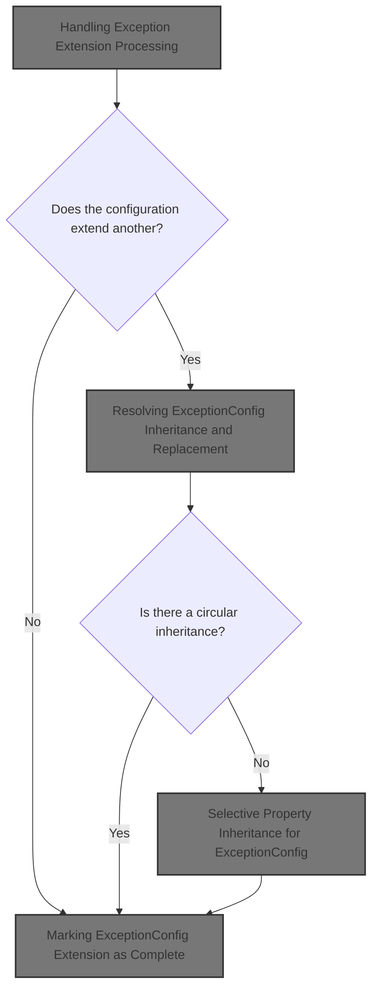
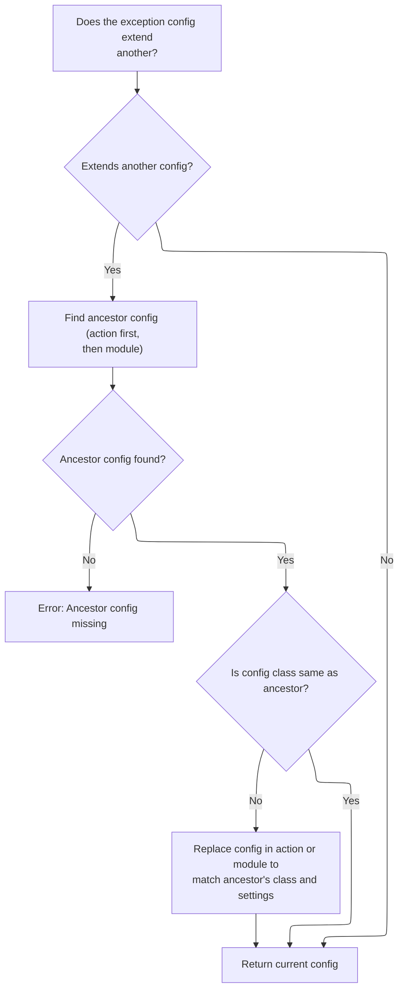
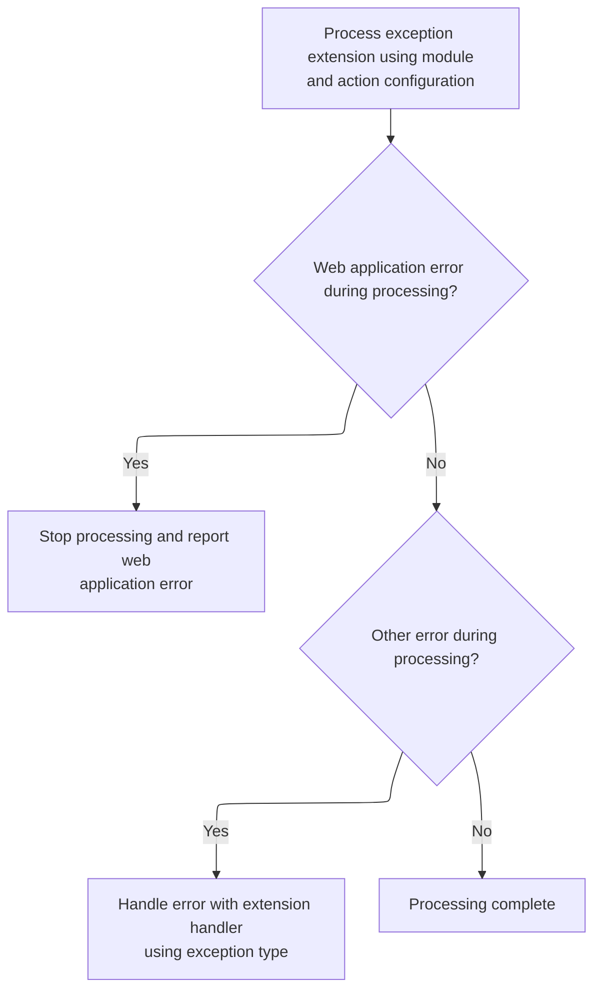
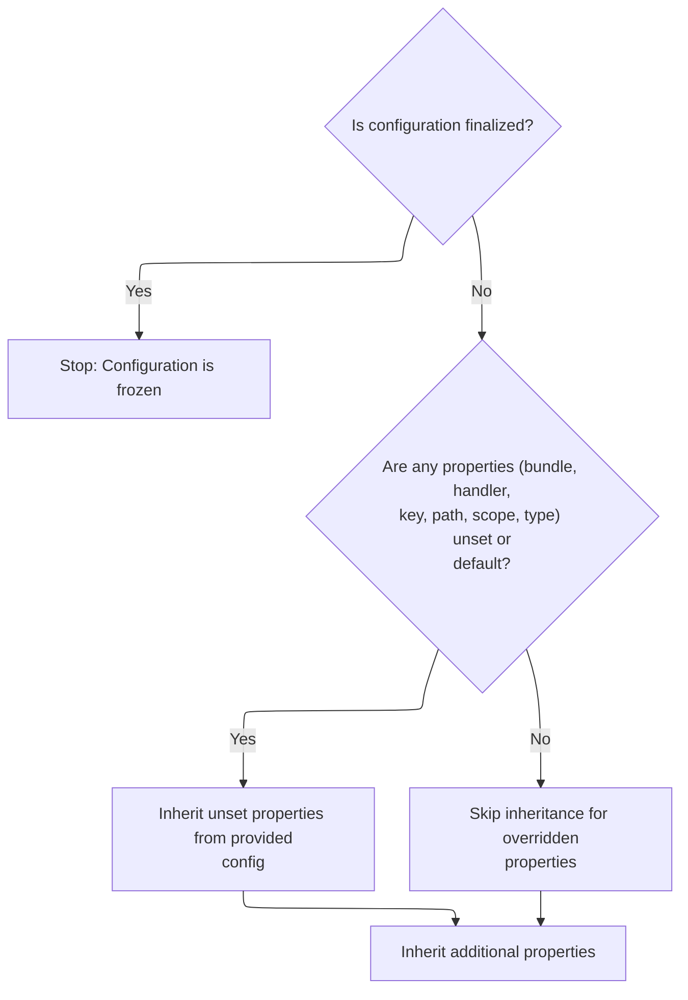

This document describes how exception configurations are processed to support inheritance and property extension. Exception configurations may inherit properties from other configurations, allowing for flexible error handling definitions at both global and action levels. The flow ensures that all relevant properties are inherited only if they are not explicitly set, circular dependencies are avoided, and the configuration is finalized for further processing.



# Handling Exception Extension Processing

<SwmSnippet path="/core/src/main/java/org/apache/struts/action/ActionServlet.java" line="1254">

---

In <SwmToken path="core/src/main/java/org/apache/struts/action/ActionServlet.java" pos="1254:5:5" line-data="    protected void processExceptionExtension(ExceptionConfig exceptionConfig,">`processExceptionExtension`</SwmToken>, we check if the <SwmToken path="core/src/main/java/org/apache/struts/action/ActionServlet.java" pos="1254:7:7" line-data="    protected void processExceptionExtension(ExceptionConfig exceptionConfig,">`ExceptionConfig`</SwmToken> extension has already been processed. If not, we log the action (if debug is enabled) and then call <SwmToken path="core/src/main/java/org/apache/struts/action/ActionServlet.java" pos="1265:1:1" line-data="                    processExceptionConfigClass(exceptionConfig, moduleConfig,">`processExceptionConfigClass`</SwmToken> to handle any inheritance or class replacement needed for the <SwmToken path="core/src/main/java/org/apache/struts/action/ActionServlet.java" pos="1254:7:7" line-data="    protected void processExceptionExtension(ExceptionConfig exceptionConfig,">`ExceptionConfig`</SwmToken>. This sets up the <SwmToken path="core/src/main/java/org/apache/struts/action/ActionServlet.java" pos="1254:7:7" line-data="    protected void processExceptionExtension(ExceptionConfig exceptionConfig,">`ExceptionConfig`</SwmToken> correctly before further processing.

```java
    protected void processExceptionExtension(ExceptionConfig exceptionConfig,
        ModuleConfig moduleConfig, ActionConfig actionConfig)
        throws ServletException {
        try {
            if (!exceptionConfig.isExtensionProcessed()) {
                if (log.isDebugEnabled()) {
                    log.debug("Processing extensions for '"
                        + exceptionConfig.getType() + "'");
                }

                exceptionConfig =
                    processExceptionConfigClass(exceptionConfig, moduleConfig,
                        actionConfig);

```

---

</SwmSnippet>

## Resolving <SwmToken path="core/src/main/java/org/apache/struts/action/ActionServlet.java" pos="1254:7:7" line-data="    protected void processExceptionExtension(ExceptionConfig exceptionConfig,">`ExceptionConfig`</SwmToken> Inheritance and Replacement



<SwmSnippet path="/core/src/main/java/org/apache/struts/action/ActionServlet.java" line="1293">

---

In <SwmToken path="core/src/main/java/org/apache/struts/action/ActionServlet.java" pos="1293:5:5" line-data="    protected ExceptionConfig processExceptionConfigClass(">`processExceptionConfigClass`</SwmToken>, we check if the <SwmToken path="core/src/main/java/org/apache/struts/action/ActionServlet.java" pos="1293:3:3" line-data="    protected ExceptionConfig processExceptionConfigClass(">`ExceptionConfig`</SwmToken> extends another config. If so, we look up the ancestor in both <SwmToken path="core/src/main/java/org/apache/struts/action/ActionServlet.java" pos="1295:1:1" line-data="        ActionConfig actionConfig)">`ActionConfig`</SwmToken> and <SwmToken path="core/src/main/java/org/apache/struts/action/ActionServlet.java" pos="1294:6:6" line-data="        ExceptionConfig exceptionConfig, ModuleConfig moduleConfig,">`ModuleConfig`</SwmToken>. If the ancestor uses a different subclass, we create a new instance of that class, copy over the properties, and prepare to replace the original config. This is where we need to call into <SwmToken path="core/src/main/java/org/apache/struts/action/ActionServlet.java" pos="45:10:10" line-data="import org.apache.struts.config.BaseConfig;">`BaseConfig`</SwmToken> to handle the property copying and instantiation.

```java
    protected ExceptionConfig processExceptionConfigClass(
        ExceptionConfig exceptionConfig, ModuleConfig moduleConfig,
        ActionConfig actionConfig)
        throws ServletException {
        String ancestor = exceptionConfig.getExtends();

        if (ancestor == null) {
            // Nothing to do, then
            return exceptionConfig;
        }

        // Make sure that this config is of the right class
        ExceptionConfig baseConfig = null;
        if (actionConfig != null) {
            baseConfig = actionConfig.findExceptionConfig(ancestor);
        }

        if (baseConfig == null) {
            // This means either there's no actionConfig anyway, or the
            // ancestor is not defined within the action.
            baseConfig = moduleConfig.findExceptionConfig(ancestor);
        }

        if (baseConfig == null) {
            throw new UnavailableException("Unable to find "
                + "exception config '" + ancestor + "' to extend.");
        }

        // Was our config's class overridden already?
        if (exceptionConfig.getClass().equals(ExceptionConfig.class)) {
            // Ensure that our config is using the correct class
            if (!baseConfig.getClass().equals(exceptionConfig.getClass())) {
                // Replace the config with an instance of the correct class
                ExceptionConfig newExceptionConfig = null;
                String baseConfigClassName = baseConfig.getClass().getName();

                try {
                    newExceptionConfig =
                        (ExceptionConfig) RequestUtils.applicationInstance(
                            baseConfigClassName);

                    // copy the values
                    BeanUtils.copyProperties(newExceptionConfig,
                        exceptionConfig);
                } catch (Exception e) {
                    handleCreationException(baseConfigClassName, e);
                }

```

---

</SwmSnippet>

<SwmSnippet path="/core/src/main/java/org/apache/struts/action/ActionServlet.java" line="1341">

---

Back in <SwmToken path="core/src/main/java/org/apache/struts/action/ActionServlet.java" pos="1265:1:1" line-data="                    processExceptionConfigClass(exceptionConfig, moduleConfig,">`processExceptionConfigClass`</SwmToken>, after creating the new <SwmToken path="core/src/main/java/org/apache/struts/action/ActionServlet.java" pos="1254:7:7" line-data="    protected void processExceptionExtension(ExceptionConfig exceptionConfig,">`ExceptionConfig`</SwmToken> instance, we remove the old config from <SwmToken path="core/src/main/java/org/apache/struts/action/ActionServlet.java" pos="1255:6:6" line-data="        ModuleConfig moduleConfig, ActionConfig actionConfig)">`ActionConfig`</SwmToken> if present. This clears out the outdated config so we can add the new one, keeping the configuration consistent.

```java
                // replace exceptionConfig with newExceptionConfig
                if (actionConfig != null) {
                    actionConfig.removeExceptionConfig(exceptionConfig);
```

---

</SwmSnippet>

<SwmSnippet path="/core/src/main/java/org/apache/struts/config/ActionConfig.java" line="1340">

---

ActionConfig.removeExceptionConfig checks if the configuration is frozen before removing the <SwmToken path="core/src/main/java/org/apache/struts/config/ActionConfig.java" pos="1340:7:7" line-data="    public void removeExceptionConfig(ExceptionConfig config) {">`ExceptionConfig`</SwmToken> from its map, using the exception type as the key. This prevents changes after the config is finalized.

```java
    public void removeExceptionConfig(ExceptionConfig config) {
        if (configured) {
            throw new IllegalStateException("Configuration is frozen");
        }

        exceptions.remove(config.getType());
    }
```

---

</SwmSnippet>

<SwmSnippet path="/core/src/main/java/org/apache/struts/action/ActionServlet.java" line="1344">

---

Back in <SwmToken path="core/src/main/java/org/apache/struts/action/ActionServlet.java" pos="1265:1:1" line-data="                    processExceptionConfigClass(exceptionConfig, moduleConfig,">`processExceptionConfigClass`</SwmToken>, after removing the old <SwmToken path="core/src/main/java/org/apache/struts/action/ActionServlet.java" pos="1254:7:7" line-data="    protected void processExceptionExtension(ExceptionConfig exceptionConfig,">`ExceptionConfig`</SwmToken> from <SwmToken path="core/src/main/java/org/apache/struts/action/ActionServlet.java" pos="1255:6:6" line-data="        ModuleConfig moduleConfig, ActionConfig actionConfig)">`ActionConfig`</SwmToken>, we also handle the case where the config is only in <SwmToken path="core/src/main/java/org/apache/struts/action/ActionServlet.java" pos="1255:1:1" line-data="        ModuleConfig moduleConfig, ActionConfig actionConfig)">`ModuleConfig`</SwmToken>. We remove and add the new <SwmToken path="core/src/main/java/org/apache/struts/action/ActionServlet.java" pos="1254:7:7" line-data="    protected void processExceptionExtension(ExceptionConfig exceptionConfig,">`ExceptionConfig`</SwmToken> there, making sure the right instance is used everywhere.

```java
                    actionConfig.addExceptionConfig(newExceptionConfig);
                } else {
                    moduleConfig.removeExceptionConfig(exceptionConfig);
                    moduleConfig.addExceptionConfig(newExceptionConfig);
                }
                exceptionConfig = newExceptionConfig;
            }
        }

        return exceptionConfig;
    }
```

---

</SwmSnippet>

<SwmSnippet path="/core/src/main/java/org/apache/struts/config/impl/ModuleConfigImpl.java" line="677">

---

ModuleConfigImpl.removeExceptionConfig calls <SwmToken path="core/src/main/java/org/apache/struts/config/impl/ModuleConfigImpl.java" pos="678:1:1" line-data="        throwIfConfigured();">`throwIfConfigured`</SwmToken> to make sure the config isn't locked, then removes the <SwmToken path="core/src/main/java/org/apache/struts/config/impl/ModuleConfigImpl.java" pos="677:7:7" line-data="    public void removeExceptionConfig(ExceptionConfig config) {">`ExceptionConfig`</SwmToken> from its map using the type as the key. This keeps the config state consistent.

```java
    public void removeExceptionConfig(ExceptionConfig config) {
        throwIfConfigured();
        exceptions.remove(config.getType());
    }
```

---

</SwmSnippet>

## Finalizing Exception Extension Processing



<SwmSnippet path="/core/src/main/java/org/apache/struts/action/ActionServlet.java" line="1268">

---

Back in <SwmToken path="core/src/main/java/org/apache/struts/action/ActionServlet.java" pos="1254:5:5" line-data="    protected void processExceptionExtension(ExceptionConfig exceptionConfig,">`processExceptionExtension`</SwmToken>, after <SwmToken path="core/src/main/java/org/apache/struts/action/ActionServlet.java" pos="1265:1:1" line-data="                    processExceptionConfigClass(exceptionConfig, moduleConfig,">`processExceptionConfigClass`</SwmToken>, we call <SwmToken path="core/src/main/java/org/apache/struts/action/ActionServlet.java" pos="1268:3:3" line-data="                exceptionConfig.processExtends(moduleConfig, actionConfig);">`processExtends`</SwmToken> on the <SwmToken path="core/src/main/java/org/apache/struts/action/ActionServlet.java" pos="1254:7:7" line-data="    protected void processExceptionExtension(ExceptionConfig exceptionConfig,">`ExceptionConfig`</SwmToken> to apply inherited properties and mark the extension as processed. This is where the actual property inheritance happens.

```java
                exceptionConfig.processExtends(moduleConfig, actionConfig);
            }
        } catch (ServletException e) {
            throw e;
        } catch (Exception e) {
            handleGeneralExtensionException("Exception",
                exceptionConfig.getType(), e);
        }
    }
```

---

</SwmSnippet>

# Applying <SwmToken path="core/src/main/java/org/apache/struts/action/ActionServlet.java" pos="1254:7:7" line-data="    protected void processExceptionExtension(ExceptionConfig exceptionConfig,">`ExceptionConfig`</SwmToken> Inheritance and Circular Checks

<SwmSnippet path="/core/src/main/java/org/apache/struts/config/ExceptionConfig.java" line="336">

---

In <SwmToken path="core/src/main/java/org/apache/struts/config/ExceptionConfig.java" pos="336:5:5" line-data="    public void processExtends(ModuleConfig moduleConfig,">`processExtends`</SwmToken>, we check if the config is frozen, then look up the ancestor <SwmToken path="core/src/main/java/org/apache/struts/config/ExceptionConfig.java" pos="347:1:1" line-data="            ExceptionConfig baseConfig = null;">`ExceptionConfig`</SwmToken>. If needed, we recursively process the ancestor's extension and check for circular inheritance before inheriting properties. This ensures the config tree is valid and all properties are inherited in the right order.

```java
    public void processExtends(ModuleConfig moduleConfig,
        ActionConfig actionConfig)
        throws ClassNotFoundException, IllegalAccessException,
            InstantiationException, InvocationTargetException {
        if (configured) {
            throw new IllegalStateException("Configuration is frozen");
        }

        String ancestorType = getExtends();

        if ((!extensionProcessed) && (ancestorType != null)) {
            ExceptionConfig baseConfig = null;

            // We only check the action config if we're not a global handler
            boolean checkActionConfig =
                (this != moduleConfig.findExceptionConfig(getType()));

            // ... and the action config was provided
            checkActionConfig &= (actionConfig != null);

            // ... and we're not extending a config with the same type value
            // (because if we are, that means we're an action-level handler
            //  extending a global handler).
            checkActionConfig &= !ancestorType.equals(getType());

            // We first check in the action config's exception handlers
            if (checkActionConfig) {
                baseConfig = actionConfig.findExceptionConfig(ancestorType);
            }

            // Then check the global exception handlers
            if (baseConfig == null) {
                baseConfig = moduleConfig.findExceptionConfig(ancestorType);
            }

            if (baseConfig == null) {
                throw new NullPointerException("Unable to find "
                    + "handler for '" + ancestorType + "' to extend.");
            }

            // Check for circular inheritance and make sure the base config's
            //  own inheritance has been processed already
            if (checkCircularInheritance(moduleConfig, actionConfig)) {
                throw new IllegalArgumentException(
                    "Circular inheritance detected for forward " + getType());
            }

```

---

</SwmSnippet>

<SwmSnippet path="/core/src/main/java/org/apache/struts/config/ExceptionConfig.java" line="185">

---

CheckCircularInheritance walks up the ancestor chain, switching between action and module configs as needed, to see if any ancestor points back to the current config. If it finds a loop, it returns true to signal a circular reference.

```java
    protected boolean checkCircularInheritance(ModuleConfig moduleConfig,
        ActionConfig actionConfig) {
        String ancestorType = getExtends();

        if (ancestorType == null) {
            return false;
        }

        // Find our ancestor
        ExceptionConfig ancestor = null;

        // First check the action config
        if (actionConfig != null) {
            ancestor = actionConfig.findExceptionConfig(ancestorType);

            // If we found *this*, set ancestor to null to check for a global def
            if (ancestor == this) {
                ancestor = null;
            }
        }

        // Then check the global handlers
        if (ancestor == null) {
            ancestor = moduleConfig.findExceptionConfig(ancestorType);

            if (ancestor != null) {
                // If the ancestor is a global handler, set actionConfig
                //  to null so further searches are only done among
                //  global handlers.
                actionConfig = null;
            }
        }

        while (ancestor != null) {
            // Check if an ancestor is extending *this*
            if (ancestor == this) {
                return true;
            }

            // Get our ancestor's ancestor
            ancestorType = ancestor.getExtends();

            // check against ancestors extending same typed ancestors
            if (ancestor.getType().equals(ancestorType)) {
                // If the ancestor is extending a config for the same type,
                //  make sure we look for its ancestor in the global handlers.
                //  If we're already at that level, we return false.
                if (actionConfig == null) {
                    return false;
                } else {
                    // Set actionConfig = null to force us to look for global
                    //  forwards
                    actionConfig = null;
                }
            }

            ancestor = null;

            // First check the action config
            if (actionConfig != null) {
                ancestor = actionConfig.findExceptionConfig(ancestorType);
            }

            // Then check the global handlers
            if (ancestor == null) {
                ancestor = moduleConfig.findExceptionConfig(ancestorType);

                if (ancestor != null) {
                    // Limit further checks to moduleConfig.
                    actionConfig = null;
                }
            }
        }
```

---

</SwmSnippet>

<SwmSnippet path="/core/src/main/java/org/apache/struts/config/ExceptionConfig.java" line="383">

---

After returning from <SwmToken path="core/src/main/java/org/apache/struts/config/ExceptionConfig.java" pos="185:5:5" line-data="    protected boolean checkCircularInheritance(ModuleConfig moduleConfig,">`checkCircularInheritance`</SwmToken> in <SwmToken path="core/src/main/java/org/apache/struts/action/ActionServlet.java" pos="1254:7:7" line-data="    protected void processExceptionExtension(ExceptionConfig exceptionConfig,">`ExceptionConfig`</SwmToken>, if the <SwmToken path="core/src/main/java/org/apache/struts/config/ExceptionConfig.java" pos="383:5:5" line-data="            if (!baseConfig.isExtensionProcessed()) {">`baseConfig`</SwmToken>'s extension hasn't been processed yet, we recursively call <SwmToken path="core/src/main/java/org/apache/struts/config/ExceptionConfig.java" pos="384:3:3" line-data="                baseConfig.processExtends(moduleConfig, actionConfig);">`processExtends`</SwmToken> on it. This ensures all ancestor properties are inherited before we copy them.

```java
            if (!baseConfig.isExtensionProcessed()) {
                baseConfig.processExtends(moduleConfig, actionConfig);
            }

```

---

</SwmSnippet>

<SwmSnippet path="/core/src/main/java/org/apache/struts/config/ExceptionConfig.java" line="387">

---

After returning from <SwmToken path="core/src/main/java/org/apache/struts/action/ActionServlet.java" pos="50:10:10" line-data="import org.apache.struts.config.ForwardConfig;">`ForwardConfig`</SwmToken>, ExceptionConfig.inheritFrom is called to copy all relevant properties from the base config to the current config, finalizing the inheritance step.

```java
            // copy values from the base config
            inheritFrom(baseConfig);
        }

```

---

</SwmSnippet>

## Selective Property Inheritance for <SwmToken path="core/src/main/java/org/apache/struts/action/ActionServlet.java" pos="1254:7:7" line-data="    protected void processExceptionExtension(ExceptionConfig exceptionConfig,">`ExceptionConfig`</SwmToken>



<SwmSnippet path="/core/src/main/java/org/apache/struts/config/ExceptionConfig.java" line="289">

---

In <SwmToken path="core/src/main/java/org/apache/struts/config/ExceptionConfig.java" pos="289:5:5" line-data="    public void inheritFrom(ExceptionConfig config)">`inheritFrom`</SwmToken>, we selectively copy properties from the given config only if the current value is null or a default. This way, explicit settings on the current config aren't lost.

```java
    public void inheritFrom(ExceptionConfig config)
        throws ClassNotFoundException, IllegalAccessException,
            InstantiationException, InvocationTargetException {
        if (configured) {
            throw new IllegalStateException("Configuration is frozen");
        }

        // Inherit values that have not been overridden
        if (getBundle() == null) {
            setBundle(config.getBundle());
        }

```

---

</SwmSnippet>

<SwmSnippet path="/core/src/main/java/org/apache/struts/config/ExceptionConfig.java" line="89">

---

SetBundle checks if the config is frozen before setting the bundle value. If it's frozen, it throws an exception to prevent changes.

```java
    public void setBundle(String bundle) {
        if (configured) {
            throw new IllegalStateException("Configuration is frozen");
        }

        this.bundle = bundle;
    }
```

---

</SwmSnippet>

<SwmSnippet path="/core/src/main/java/org/apache/struts/config/ExceptionConfig.java" line="301">

---

After <SwmToken path="core/src/main/java/org/apache/struts/config/ExceptionConfig.java" pos="89:5:5" line-data="    public void setBundle(String bundle) {">`setBundle`</SwmToken> in <SwmToken path="core/src/main/java/org/apache/struts/config/ExceptionConfig.java" pos="289:5:5" line-data="    public void inheritFrom(ExceptionConfig config)">`inheritFrom`</SwmToken>, we check if the handler is the default and only then inherit it from the base config. Same logic applies for scope. This avoids overwriting custom handlers or scopes.

```java
        if (getHandler().equals("org.apache.struts.action.ExceptionHandler")) {
            setHandler(config.getHandler());
        }

```

---

</SwmSnippet>

<SwmSnippet path="/core/src/main/java/org/apache/struts/config/ExceptionConfig.java" line="117">

---

SetHandler throws if the config is frozen, otherwise it sets the handler string. This keeps the config immutable after setup.

```java
    public void setHandler(String handler) {
        if (configured) {
            throw new IllegalStateException("Configuration is frozen");
        }

        this.handler = handler;
    }
```

---

</SwmSnippet>

<SwmSnippet path="/core/src/main/java/org/apache/struts/config/ExceptionConfig.java" line="305">

---

After <SwmToken path="core/src/main/java/org/apache/struts/config/ExceptionConfig.java" pos="117:5:5" line-data="    public void setHandler(String handler) {">`setHandler`</SwmToken> in <SwmToken path="core/src/main/java/org/apache/struts/config/ExceptionConfig.java" pos="289:5:5" line-data="    public void inheritFrom(ExceptionConfig config)">`inheritFrom`</SwmToken>, we only inherit the key from the base config if the current key is null. This preserves any explicit key set by the user.

```java
        if (getKey() == null) {
            setKey(config.getKey());
        }

```

---

</SwmSnippet>

<SwmSnippet path="/core/src/main/java/org/apache/struts/config/ExceptionConfig.java" line="129">

---

SetKey throws if the config is frozen, otherwise it sets the key value. This keeps the config immutable after setup.

```java
    public void setKey(String key) {
        if (configured) {
            throw new IllegalStateException("Configuration is frozen");
        }

        this.key = key;
    }
```

---

</SwmSnippet>

<SwmSnippet path="/core/src/main/java/org/apache/struts/config/ExceptionConfig.java" line="309">

---

After <SwmToken path="core/src/main/java/org/apache/struts/config/ExceptionConfig.java" pos="129:5:5" line-data="    public void setKey(String key) {">`setKey`</SwmToken> in <SwmToken path="core/src/main/java/org/apache/struts/config/ExceptionConfig.java" pos="289:5:5" line-data="    public void inheritFrom(ExceptionConfig config)">`inheritFrom`</SwmToken>, we only inherit the path from the base config if the current path is null. This keeps any explicit path set by the user.

```java
        if (getPath() == null) {
            setPath(config.getPath());
        }

```

---

</SwmSnippet>

<SwmSnippet path="/core/src/main/java/org/apache/struts/config/ExceptionConfig.java" line="313">

---

After <SwmToken path="core/src/main/java/org/apache/struts/config/ExceptionConfig.java" pos="310:1:1" line-data="            setPath(config.getPath());">`setPath`</SwmToken> in <SwmToken path="core/src/main/java/org/apache/struts/config/ExceptionConfig.java" pos="289:5:5" line-data="    public void inheritFrom(ExceptionConfig config)">`inheritFrom`</SwmToken>, we only inherit scope if it's the default value ("request"), and type if it's null. This way, custom values aren't overwritten unless they're just defaults.

```java
        if (getScope().equals("request")) {
            setScope(config.getScope());
        }

        if (getType() == null) {
            setType(config.getType());
        }

```

---

</SwmSnippet>

<SwmSnippet path="/core/src/main/java/org/apache/struts/config/ExceptionConfig.java" line="165">

---

SetType throws if the config is frozen, otherwise it sets the type value. This keeps the config immutable after setup.

```java
    public void setType(String type) {
        if (configured) {
            throw new IllegalStateException("Configuration is frozen");
        }

        this.type = type;
    }
```

---

</SwmSnippet>

<SwmSnippet path="/core/src/main/java/org/apache/struts/config/ExceptionConfig.java" line="321">

---

After <SwmToken path="core/src/main/java/org/apache/struts/config/ExceptionConfig.java" pos="165:5:5" line-data="    public void setType(String type) {">`setType`</SwmToken> in <SwmToken path="core/src/main/java/org/apache/struts/config/ExceptionConfig.java" pos="289:5:5" line-data="    public void inheritFrom(ExceptionConfig config)">`inheritFrom`</SwmToken>, we call <SwmToken path="core/src/main/java/org/apache/struts/config/ExceptionConfig.java" pos="321:1:1" line-data="        inheritProperties(config);">`inheritProperties`</SwmToken> to copy any remaining properties from the base config. This covers anything not handled by the explicit setters.

```java
        inheritProperties(config);
    }
```

---

</SwmSnippet>

## Marking <SwmToken path="core/src/main/java/org/apache/struts/action/ActionServlet.java" pos="1254:7:7" line-data="    protected void processExceptionExtension(ExceptionConfig exceptionConfig,">`ExceptionConfig`</SwmToken> Extension as Complete

<SwmSnippet path="/core/src/main/java/org/apache/struts/config/ExceptionConfig.java" line="391">

---

After returning from <SwmToken path="core/src/main/java/org/apache/struts/config/ExceptionConfig.java" pos="289:5:5" line-data="    public void inheritFrom(ExceptionConfig config)">`inheritFrom`</SwmToken> in <SwmToken path="core/src/main/java/org/apache/struts/action/ActionServlet.java" pos="1268:3:3" line-data="                exceptionConfig.processExtends(moduleConfig, actionConfig);">`processExtends`</SwmToken>, we set <SwmToken path="core/src/main/java/org/apache/struts/config/ExceptionConfig.java" pos="391:1:1" line-data="        extensionProcessed = true;">`extensionProcessed`</SwmToken> to true. This flags that the config's inheritance is done and prevents reprocessing.

```java
        extensionProcessed = true;
    }
```

---

</SwmSnippet>

&nbsp;

*This is an auto-generated document by Swimm 🌊 and has not yet been verified by a human*

<SwmMeta version="3.0.0" repo-id="Z2l0aHViJTNBJTNBc3RydXRzMSUzQSUzQVN3aW1tLURlbW8=" repo-name="struts1"><sup>Powered by [Swimm](https://app.swimm.io/)</sup></SwmMeta>
