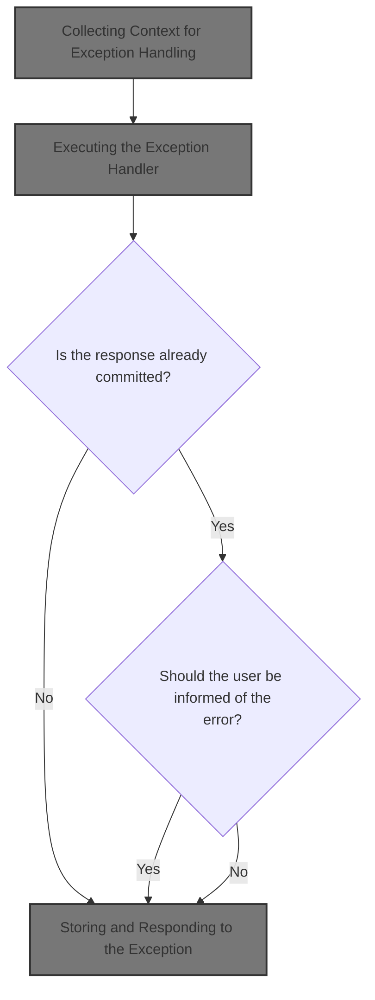
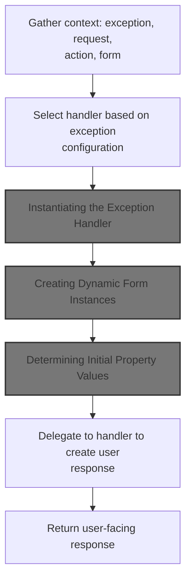
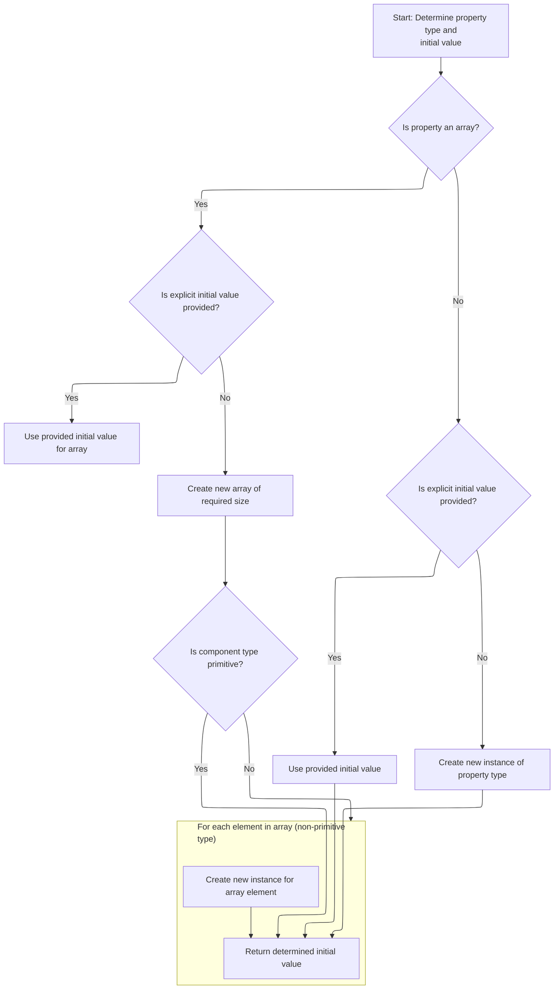
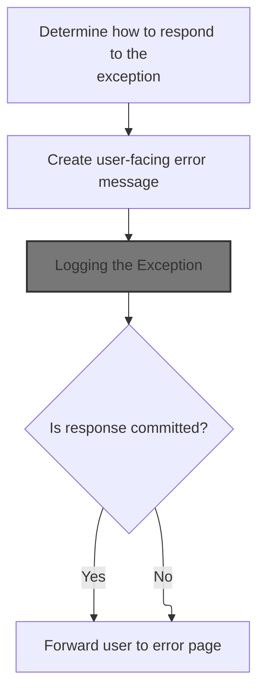
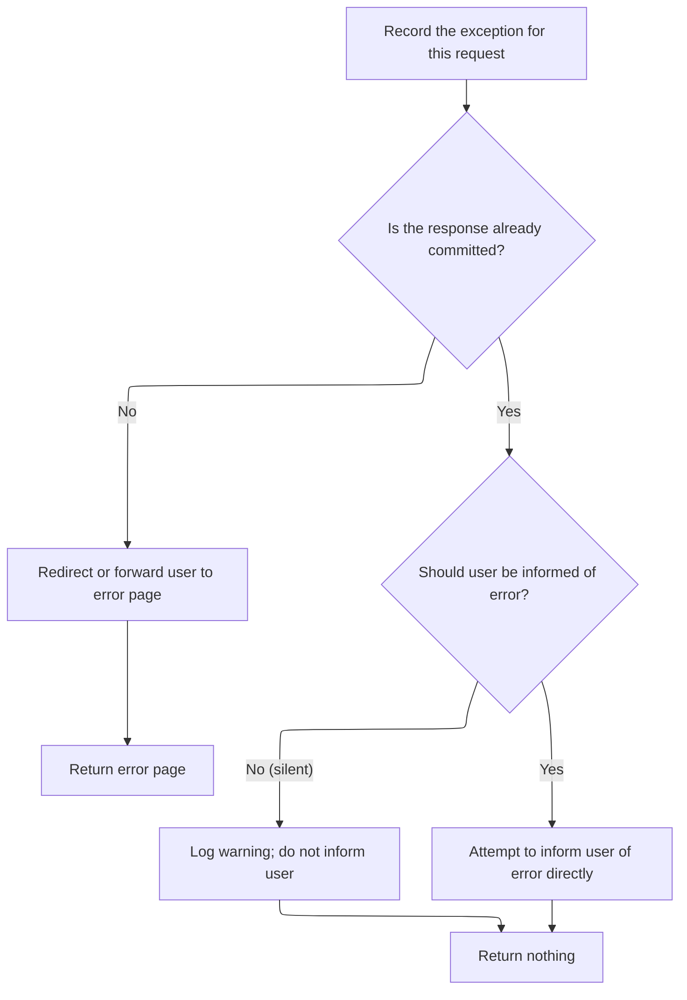

This document describes how exceptions are handled during request processing. When an error occurs, the system collects the relevant context, selects the appropriate handler, and prepares any necessary form data. The handler processes the exception, determines how to inform the user, logs the error, and records the exception for further handling.



# Collecting Context for Exception Handling



<SwmSnippet path="/core/src/main/java/org/apache/struts/chain/commands/servlet/ExceptionHandler.java" line="50">

---

In <SwmToken path="core/src/main/java/org/apache/struts/chain/commands/servlet/ExceptionHandler.java" pos="50:5:5" line-data="    protected ForwardConfig handle(ActionContext context, Exception exception,">`handle`</SwmToken>, we grab the <SwmToken path="core/src/main/java/org/apache/struts/chain/commands/servlet/ExceptionHandler.java" pos="55:1:1" line-data="        ServletActionContext sacontext = (ServletActionContext) context;">`ServletActionContext`</SwmToken> from the generic <SwmToken path="core/src/main/java/org/apache/struts/chain/commands/servlet/ExceptionHandler.java" pos="50:7:7" line-data="    protected ForwardConfig handle(ActionContext context, Exception exception,">`ActionContext`</SwmToken>, then pull out the <SwmToken path="core/src/main/java/org/apache/struts/chain/commands/servlet/ExceptionHandler.java" pos="56:1:1" line-data="        ActionForm actionForm = (ActionForm) sacontext.getActionForm();">`ActionForm`</SwmToken> and <SwmToken path="core/src/main/java/org/apache/struts/chain/commands/servlet/ExceptionHandler.java" pos="57:1:1" line-data="        HttpServletRequest request = sacontext.getRequest();">`HttpServletRequest`</SwmToken>. This sets up the handler with the request and form objects needed for downstream exception processing. We need to call <SwmToken path="core/src/main/java/org/apache/struts/chain/commands/servlet/ExceptionHandler.java" pos="55:1:1" line-data="        ServletActionContext sacontext = (ServletActionContext) context;">`ServletActionContext`</SwmToken> next to get access to the servlet-specific request and response objects.

```java
    protected ForwardConfig handle(ActionContext context, Exception exception,
        ExceptionConfig exceptionConfig, ActionConfig actionConfig,
        ModuleConfig moduleConfig)
        throws Exception {
        // Look up the remaining properties needed for this handler
        ServletActionContext sacontext = (ServletActionContext) context;
        ActionForm actionForm = (ActionForm) sacontext.getActionForm();
        HttpServletRequest request = sacontext.getRequest();
```

---

</SwmSnippet>

## Accessing the HTTP Request

<SwmSnippet path="/core/src/main/java/org/apache/struts/chain/contexts/ServletActionContext.java" line="94">

---

<SwmToken path="core/src/main/java/org/apache/struts/chain/contexts/ServletActionContext.java" pos="94:5:5" line-data="    public HttpServletRequest getRequest() {">`getRequest`</SwmToken> just calls <SwmToken path="core/src/main/java/org/apache/struts/chain/contexts/ServletActionContext.java" pos="95:3:5" line-data="        return servletWebContext().getRequest();">`servletWebContext()`</SwmToken><SwmToken path="core/src/main/java/org/apache/struts/chain/contexts/ServletActionContext.java" pos="95:6:9" line-data="        return servletWebContext().getRequest();">`.getRequest()`</SwmToken>, so we're tunneling through the context layers to get the actual <SwmToken path="core/src/main/java/org/apache/struts/chain/contexts/ServletActionContext.java" pos="94:3:3" line-data="    public HttpServletRequest getRequest() {">`HttpServletRequest`</SwmToken>. This is needed so ExceptionHandler.handle can work with the real servlet request.

```java
    public HttpServletRequest getRequest() {
        return servletWebContext().getRequest();
    }
```

---

</SwmSnippet>

<SwmSnippet path="/core/src/main/java/org/apache/struts/chain/contexts/ServletActionContext.java" line="67">

---

<SwmToken path="core/src/main/java/org/apache/struts/chain/contexts/ServletActionContext.java" pos="67:5:5" line-data="    protected ServletWebContext servletWebContext() {">`servletWebContext`</SwmToken> casts <SwmToken path="core/src/main/java/org/apache/struts/chain/contexts/ServletActionContext.java" pos="68:9:11" line-data="        return (ServletWebContext) this.getBaseContext();">`getBaseContext()`</SwmToken> to <SwmToken path="core/src/main/java/org/apache/struts/chain/contexts/ServletActionContext.java" pos="67:3:3" line-data="    protected ServletWebContext servletWebContext() {">`ServletWebContext`</SwmToken>. This is a shortcut to get the servlet-specific context, but if the base context isn't what we expect, it'll blow up with a ClassCastException.

```java
    protected ServletWebContext servletWebContext() {
        return (ServletWebContext) this.getBaseContext();
    }
```

---

</SwmSnippet>

## Retrieving the HTTP Response

<SwmSnippet path="/core/src/main/java/org/apache/struts/chain/commands/servlet/ExceptionHandler.java" line="58">

---

Back in ExceptionHandler.handle, after grabbing the request, we pull the response from <SwmToken path="core/src/main/java/org/apache/struts/chain/commands/servlet/ExceptionHandler.java" pos="55:1:1" line-data="        ServletActionContext sacontext = (ServletActionContext) context;">`ServletActionContext`</SwmToken>. This is needed so the handler can write to the response or forward as part of exception processing.

```java
        HttpServletResponse response = sacontext.getResponse();

```

---

</SwmSnippet>

<SwmSnippet path="/core/src/main/java/org/apache/struts/chain/contexts/ServletActionContext.java" line="103">

---

<SwmToken path="core/src/main/java/org/apache/struts/chain/contexts/ServletActionContext.java" pos="103:5:5" line-data="    public HttpServletResponse getResponse() {">`getResponse`</SwmToken> just tunnels through to <SwmToken path="core/src/main/java/org/apache/struts/chain/contexts/ServletActionContext.java" pos="104:3:5" line-data="        return servletWebContext().getResponse();">`servletWebContext()`</SwmToken><SwmToken path="core/src/main/java/org/apache/struts/chain/contexts/ServletActionContext.java" pos="104:6:9" line-data="        return servletWebContext().getResponse();">`.getResponse()`</SwmToken>, so we're getting the actual servlet response object needed for downstream error handling.

```java
    public HttpServletResponse getResponse() {
        return servletWebContext().getResponse();
    }
```

---

</SwmSnippet>

<SwmSnippet path="/core/src/main/java/org/apache/struts/chain/commands/servlet/ExceptionHandler.java" line="60">

---

Just returned from <SwmToken path="core/src/main/java/org/apache/struts/chain/commands/servlet/ExceptionHandler.java" pos="55:1:1" line-data="        ServletActionContext sacontext = (ServletActionContext) context;">`ServletActionContext`</SwmToken>, ExceptionHandler.handle now uses ClassUtils.getApplicationInstance to create the handler specified in <SwmToken path="core/src/main/java/org/apache/struts/chain/commands/servlet/ExceptionHandler.java" pos="63:4:4" line-data="            .getApplicationInstance(exceptionConfig.getHandler());">`exceptionConfig`</SwmToken>. This lets us plug in different handler classes at runtime.

```java
        // Handle this exception
        org.apache.struts.action.ExceptionHandler handler =
            (org.apache.struts.action.ExceptionHandler) ClassUtils
            .getApplicationInstance(exceptionConfig.getHandler());

```

---

</SwmSnippet>

## Instantiating the Exception Handler

<SwmSnippet path="/core/src/main/java/org/apache/struts/chain/commands/util/ClassUtils.java" line="68">

---

<SwmToken path="core/src/main/java/org/apache/struts/chain/commands/util/ClassUtils.java" pos="68:7:7" line-data="    public static Object getApplicationInstance(String className)">`getApplicationInstance`</SwmToken> uses reflection to instantiate the handler class. If the class isn't found or can't be created, it'll throw exceptions. Next, we need to look at <SwmToken path="core/src/main/java/org/apache/struts/action/DynaActionFormClass.java" pos="45:4:4" line-data="public class DynaActionFormClass implements DynaClass, Serializable {">`DynaActionFormClass`</SwmToken> to see how form beans are instantiated similarly.

```java
    public static Object getApplicationInstance(String className)
        throws ClassNotFoundException, IllegalAccessException,
            InstantiationException {
        return (getApplicationClass(className).newInstance());
    }
```

---

</SwmSnippet>

## Creating Dynamic Form Instances

<SwmSnippet path="/core/src/main/java/org/apache/struts/action/DynaActionFormClass.java" line="158">

---

In <SwmToken path="core/src/main/java/org/apache/struts/action/DynaActionFormClass.java" pos="158:5:5" line-data="    public DynaBean newInstance()">`newInstance`</SwmToken>, we use reflection to create a <SwmToken path="core/src/main/java/org/apache/struts/action/DynaActionFormClass.java" pos="160:1:1" line-data="        DynaActionForm dynaBean = (DynaActionForm) getBeanClass().newInstance();">`DynaActionForm`</SwmToken>, set its class reference, and initialize its properties from the config. This isn't just a plain bean instantiation—it's prepping the form with initial values as defined in the repository config.

```java
    public DynaBean newInstance()
        throws IllegalAccessException, InstantiationException {
        DynaActionForm dynaBean = (DynaActionForm) getBeanClass().newInstance();

```

---

</SwmSnippet>

### Resolving the Form Bean Class

<SwmSnippet path="/core/src/main/java/org/apache/struts/action/DynaActionFormClass.java" line="227">

---

<SwmToken path="core/src/main/java/org/apache/struts/action/DynaActionFormClass.java" pos="227:5:5" line-data="    protected Class getBeanClass() {">`getBeanClass`</SwmToken> checks if <SwmToken path="core/src/main/java/org/apache/struts/action/DynaActionFormClass.java" pos="228:4:4" line-data="        if (beanClass == null) {">`beanClass`</SwmToken> is set, and if not, introspects the config to load and validate the class. If the class isn't a <SwmToken path="core/src/main/java/org/apache/struts/action/DynaActionFormClass.java" pos="160:1:1" line-data="        DynaActionForm dynaBean = (DynaActionForm) getBeanClass().newInstance();">`DynaActionForm`</SwmToken> subclass, it throws an error. This ensures only valid form beans are used.

```java
    protected Class getBeanClass() {
        if (beanClass == null) {
            introspect(config);
        }

        return (beanClass);
    }
```

---

</SwmSnippet>

### Introspecting Form Properties

```mermaid
%%{init: {"flowchart": {"defaultRenderer": "elk"}} }%%
flowchart TD
    node1["Receive form bean configuration (type,
name, properties)"] --> node2{"Is form bean class valid?"}
    click node1 openCode "core/src/main/java/org/apache/struts/action/DynaActionFormClass.java:246:247"
    node2 -->|"No"| node3["Raise error: Cannot instantiate class"]
    click node2 openCode "core/src/main/java/org/apache/struts/action/DynaActionFormClass.java:250:258"
    click node3 openCode "core/src/main/java/org/apache/struts/action/DynaActionFormClass.java:253:258"
    node2 -->|"Yes"| node4{"Is class a subclass of dynamic form?"}
    click node4 openCode "core/src/main/java/org/apache/struts/action/DynaActionFormClass.java:260:264"
    node4 -->|"No"| node5["Raise error: Not a subclass of dynamic
form"]
    click node5 openCode "core/src/main/java/org/apache/struts/action/DynaActionFormClass.java:261:264"
    node4 -->|"Yes"| node6["Set form name from configuration"]
    click node6 openCode "core/src/main/java/org/apache/struts/action/DynaActionFormClass.java:267:267"
    node6 --> node7["Get property descriptors from
configuration"]
    click node7 openCode "core/src/main/java/org/apache/struts/action/DynaActionFormClass.java:270:270"
    node7 --> node8{"Are property descriptors present?"}
    click node8 openCode "core/src/main/java/org/apache/struts/action/DynaActionFormClass.java:272:274"
    node8 -->|"No"| node9["Use empty property list"]
    click node9 openCode "core/src/main/java/org/apache/struts/action/DynaActionFormClass.java:273:274"
    node8 -->|"Yes"| node10["Use provided property descriptors"]
    click node10 openCode "core/src/main/java/org/apache/struts/action/DynaActionFormClass.java:270:271"
    node9 --> node11
    node10 --> node11
    
    subgraph loop1["For each property descriptor"]
      node11["Define dynamic property and add to map"]
      click node11 openCode "core/src/main/java/org/apache/struts/action/DynaActionFormClass.java:279:284"
    end
classDef HeadingStyle fill:#777777,stroke:#333,stroke-width:2px;

%% Swimm:
%% %%{init: {"flowchart": {"defaultRenderer": "elk"}} }%%
%% flowchart TD
%%     node1["Receive form bean configuration (type,
%% name, properties)"] --> node2{"Is form bean class valid?"}
%%     click node1 openCode "<SwmPath>[core/…/action/DynaActionFormClass.java](core/src/main/java/org/apache/struts/action/DynaActionFormClass.java)</SwmPath>:246:247"
%%     node2 -->|"No"| node3["Raise error: Cannot instantiate class"]
%%     click node2 openCode "<SwmPath>[core/…/action/DynaActionFormClass.java](core/src/main/java/org/apache/struts/action/DynaActionFormClass.java)</SwmPath>:250:258"
%%     click node3 openCode "<SwmPath>[core/…/action/DynaActionFormClass.java](core/src/main/java/org/apache/struts/action/DynaActionFormClass.java)</SwmPath>:253:258"
%%     node2 -->|"Yes"| node4{"Is class a subclass of dynamic form?"}
%%     click node4 openCode "<SwmPath>[core/…/action/DynaActionFormClass.java](core/src/main/java/org/apache/struts/action/DynaActionFormClass.java)</SwmPath>:260:264"
%%     node4 -->|"No"| node5["Raise error: Not a subclass of dynamic
%% form"]
%%     click node5 openCode "<SwmPath>[core/…/action/DynaActionFormClass.java](core/src/main/java/org/apache/struts/action/DynaActionFormClass.java)</SwmPath>:261:264"
%%     node4 -->|"Yes"| node6["Set form name from configuration"]
%%     click node6 openCode "<SwmPath>[core/…/action/DynaActionFormClass.java](core/src/main/java/org/apache/struts/action/DynaActionFormClass.java)</SwmPath>:267:267"
%%     node6 --> node7["Get property descriptors from
%% configuration"]
%%     click node7 openCode "<SwmPath>[core/…/action/DynaActionFormClass.java](core/src/main/java/org/apache/struts/action/DynaActionFormClass.java)</SwmPath>:270:270"
%%     node7 --> node8{"Are property descriptors present?"}
%%     click node8 openCode "<SwmPath>[core/…/action/DynaActionFormClass.java](core/src/main/java/org/apache/struts/action/DynaActionFormClass.java)</SwmPath>:272:274"
%%     node8 -->|"No"| node9["Use empty property list"]
%%     click node9 openCode "<SwmPath>[core/…/action/DynaActionFormClass.java](core/src/main/java/org/apache/struts/action/DynaActionFormClass.java)</SwmPath>:273:274"
%%     node8 -->|"Yes"| node10["Use provided property descriptors"]
%%     click node10 openCode "<SwmPath>[core/…/action/DynaActionFormClass.java](core/src/main/java/org/apache/struts/action/DynaActionFormClass.java)</SwmPath>:270:271"
%%     node9 --> node11
%%     node10 --> node11
%%     
%%     subgraph loop1["For each property descriptor"]
%%       node11["Define dynamic property and add to map"]
%%       click node11 openCode "<SwmPath>[core/…/action/DynaActionFormClass.java](core/src/main/java/org/apache/struts/action/DynaActionFormClass.java)</SwmPath>:279:284"
%%     end
%% classDef HeadingStyle fill:#777777,stroke:#333,stroke-width:2px;
```



<SwmSnippet path="/core/src/main/java/org/apache/struts/action/DynaActionFormClass.java" line="246">

---

<SwmToken path="core/src/main/java/org/apache/struts/action/DynaActionFormClass.java" pos="246:5:5" line-data="    protected void introspect(FormBeanConfig config) {">`introspect`</SwmToken> loads the bean class from config, checks it's a <SwmToken path="core/src/main/java/org/apache/struts/action/DynaActionFormClass.java" pos="260:5:5" line-data="        if (!DynaActionForm.class.isAssignableFrom(beanClass)) {">`DynaActionForm`</SwmToken> subclass, and builds dynamic property definitions from property configs. If property configs are missing, it defaults to an empty array. Next, we call <SwmToken path="core/src/main/java/org/apache/struts/action/DynaActionFormClass.java" pos="270:1:1" line-data="        FormPropertyConfig[] descriptors = config.findFormPropertyConfigs();">`FormPropertyConfig`</SwmToken> to resolve property types.

```java
    protected void introspect(FormBeanConfig config) {
        this.config = config;

        // Validate the ActionFormBean implementation class
        try {
            beanClass = RequestUtils.applicationClass(config.getType());
        } catch (Throwable t) {
        	IllegalArgumentException t2 = new IllegalArgumentException(
                "Cannot instantiate ActionFormBean class '" + config.getType()
                + "'");
        	t2.initCause(t);
        	throw t2;
        }

        if (!DynaActionForm.class.isAssignableFrom(beanClass)) {
            throw new IllegalArgumentException("Class '" + config.getType()
                + "' is not a subclass of "
                + "'org.apache.struts.action.DynaActionForm'");
        }

        // Set the name we will know ourselves by from the form bean name
        this.name = config.getName();

        // Look up the property descriptors for this bean class
        FormPropertyConfig[] descriptors = config.findFormPropertyConfigs();

        if (descriptors == null) {
            descriptors = new FormPropertyConfig[0];
        }

        // Create corresponding dynamic property definitions
        properties = new DynaProperty[descriptors.length];

        for (int i = 0; i < descriptors.length; i++) {
            properties[i] =
                new DynaProperty(descriptors[i].getName(),
                    descriptors[i].getTypeClass());
            propertiesMap.put(properties[i].getName(), properties[i]);
        }
    }
```

---

</SwmSnippet>

<SwmSnippet path="/core/src/main/java/org/apache/struts/config/FormPropertyConfig.java" line="221">

---

<SwmToken path="core/src/main/java/org/apache/struts/config/FormPropertyConfig.java" pos="221:5:5" line-data="    public Class getTypeClass() {">`getTypeClass`</SwmToken> figures out the property type, handling arrays and primitives. If the type is an array, it creates the array class; for primitives, it returns the Java type; otherwise, it loads the class by name. This feeds back into <SwmToken path="core/src/main/java/org/apache/struts/action/DynaActionFormClass.java" pos="45:4:4" line-data="public class DynaActionFormClass implements DynaClass, Serializable {">`DynaActionFormClass`</SwmToken> for property setup.

```java
    public Class getTypeClass() {
        // Identify the base class (in case an array was specified)
        String baseType = getType();
        boolean indexed = false;

        if (baseType.endsWith("[]")) {
            baseType = baseType.substring(0, baseType.length() - 2);
            indexed = true;
        }

        // Construct an appropriate Class instance for the base class
        Class baseClass = null;

        if ("boolean".equals(baseType)) {
            baseClass = Boolean.TYPE;
        } else if ("byte".equals(baseType)) {
            baseClass = Byte.TYPE;
        } else if ("char".equals(baseType)) {
            baseClass = Character.TYPE;
        } else if ("double".equals(baseType)) {
            baseClass = Double.TYPE;
        } else if ("float".equals(baseType)) {
            baseClass = Float.TYPE;
        } else if ("int".equals(baseType)) {
            baseClass = Integer.TYPE;
        } else if ("long".equals(baseType)) {
            baseClass = Long.TYPE;
        } else if ("short".equals(baseType)) {
            baseClass = Short.TYPE;
        } else {
            ClassLoader classLoader =
                Thread.currentThread().getContextClassLoader();

            if (classLoader == null) {
                classLoader = this.getClass().getClassLoader();
            }

            try {
                baseClass = classLoader.loadClass(baseType);
            } catch (ClassNotFoundException ex) {
                log.error("Class '" + baseType +
                          "' not found for property '" + name + "'");
                baseClass = null;
            }
        }

        // Return the base class or an array appropriately
        if (indexed) {
            return (Array.newInstance(baseClass, 0).getClass());
        } else {
            return (baseClass);
        }
    }
```

---

</SwmSnippet>

### Initializing Form Property Values

<SwmSnippet path="/core/src/main/java/org/apache/struts/action/DynaActionFormClass.java" line="162">

---

Just returned from <SwmToken path="core/src/main/java/org/apache/struts/action/DynaActionFormClass.java" pos="45:4:4" line-data="public class DynaActionFormClass implements DynaClass, Serializable {">`DynaActionFormClass`</SwmToken>, the function now loops through property configs and sets each property on the new <SwmToken path="core/src/main/java/org/apache/struts/action/DynaActionFormClass.java" pos="160:1:1" line-data="        DynaActionForm dynaBean = (DynaActionForm) getBeanClass().newInstance();">`DynaActionForm`</SwmToken> instance to its initial value. This relies on FormPropertyConfig.initial to figure out what to set.

```java
        dynaBean.setDynaActionFormClass(this);

        FormPropertyConfig[] props = config.findFormPropertyConfigs();

        for (int i = 0; i < props.length; i++) {
            dynaBean.set(props[i].getName(), props[i].initial());
        }

        return (dynaBean);
    }
```

---

</SwmSnippet>

## Determining Initial Property Values



<SwmSnippet path="/core/src/main/java/org/apache/struts/config/FormPropertyConfig.java" line="318">

---

In <SwmToken path="core/src/main/java/org/apache/struts/config/FormPropertyConfig.java" pos="318:5:5" line-data="    public Object initial() {">`initial`</SwmToken>, we figure out the initial value for a property. If it's an array, we convert or create the array and fill it; for non-arrays, we convert or instantiate the value. This relies on <SwmToken path="core/src/main/java/org/apache/struts/config/FormPropertyConfig.java" pos="322:7:7" line-data="            Class clazz = getTypeClass();">`getTypeClass`</SwmToken> and the initial/size fields.

```java
    public Object initial() {
        Object initialValue = null;

        try {
            Class clazz = getTypeClass();

```

---

</SwmSnippet>

<SwmSnippet path="/core/src/main/java/org/apache/struts/config/FormPropertyConfig.java" line="324">

---

Just returned from FormPropertyConfig.initial, the function checks if the property is an array and, if so, creates and fills the array. If element instantiation fails, it logs the error and keeps going. This ensures arrays are initialized even if some elements can't be created.

```java
            if (clazz.isArray()) {
                if (initial != null) {
                    initialValue = ConvertUtils.convert(initial, clazz);
                } else {
                    initialValue =
                        Array.newInstance(clazz.getComponentType(), size);

                    if (!(clazz.getComponentType().isPrimitive())) {
                        for (int i = 0; i < size; i++) {
                            try {
                                Array.set(initialValue, i,
                                    clazz.getComponentType().newInstance());
                            } catch (Throwable t) {
                                log.error("Unable to create instance of "
                                    + clazz.getName() + " for property=" + name
                                    + ", type=" + type + ", initial=" + initial
                                    + ", size=" + size + ".");

                                //FIXME: Should we just dump the entire application/module ?
                            }
                        }
```

---

</SwmSnippet>

<SwmSnippet path="/core/src/main/java/org/apache/struts/config/FormPropertyConfig.java" line="348">

---

Finishing up FormPropertyConfig.initial, for non-array types, we convert the initial value or instantiate the class. If anything fails, we just return null. This feeds back into <SwmToken path="core/src/main/java/org/apache/struts/action/DynaActionFormClass.java" pos="45:4:4" line-data="public class DynaActionFormClass implements DynaClass, Serializable {">`DynaActionFormClass`</SwmToken> for property setup.

```java
                if (initial != null) {
                    initialValue = ConvertUtils.convert(initial, clazz);
                } else {
                    initialValue = clazz.newInstance();
                }
            }
        } catch (Throwable t) {
            initialValue = null;
        }

        return (initialValue);
    }
```

---

</SwmSnippet>

## Executing the Exception Handler

<SwmSnippet path="/core/src/main/java/org/apache/struts/chain/commands/servlet/ExceptionHandler.java" line="65">

---

Just returned from <SwmToken path="core/src/main/java/org/apache/struts/chain/commands/servlet/ExceptionHandler.java" pos="62:13:13" line-data="            (org.apache.struts.action.ExceptionHandler) ClassUtils">`ClassUtils`</SwmToken>, ExceptionHandler.handle now calls <SwmToken path="core/src/main/java/org/apache/struts/chain/commands/servlet/ExceptionHandler.java" pos="65:4:6" line-data="        return (handler.execute(exception, exceptionConfig,">`handler.execute`</SwmToken>, passing the exception, config, mapping, form, request, and response. This hands off control to the handler for actual exception processing.

```java
        return (handler.execute(exception, exceptionConfig,
            (ActionMapping) actionConfig, actionForm, request, response));
    }
```

---

</SwmSnippet>

# Processing the Exception and Building the Forward



<SwmSnippet path="/core/src/main/java/org/apache/struts/action/ExceptionHandler.java" line="124">

---

In <SwmToken path="core/src/main/java/org/apache/struts/action/ExceptionHandler.java" pos="124:5:5" line-data="    public ActionForward execute(Exception ex, ExceptionConfig ae,">`execute`</SwmToken>, we figure out where to forward based on <SwmToken path="core/src/main/java/org/apache/struts/action/ExceptionHandler.java" pos="124:12:12" line-data="    public ActionForward execute(Exception ex, ExceptionConfig ae,">`ExceptionConfig`</SwmToken> or <SwmToken path="core/src/main/java/org/apache/struts/action/ExceptionHandler.java" pos="125:1:1" line-data="        ActionMapping mapping, ActionForm formInstance,">`ActionMapping`</SwmToken>, and build the error message from the exception or config. This sets up the context for logging and storing the exception.

```java
    public ActionForward execute(Exception ex, ExceptionConfig ae,
        ActionMapping mapping, ActionForm formInstance,
        HttpServletRequest request, HttpServletResponse response)
        throws ServletException {
        LOG.debug("ExceptionHandler executing for exception " + ex);

        ActionForward forward;
        ActionMessage error;
        String property;

        // Build the forward from the exception mapping if it exists
        // or from the form input
        if (ae.getPath() != null) {
            forward = new ActionForward(ae.getPath());
        } else {
            forward = mapping.getInputForward();
        }

        // Figure out the error
        if (ex instanceof ModuleException) {
            error = ((ModuleException) ex).getActionMessage();
            property = ((ModuleException) ex).getProperty();
        } else {
            // STR-2924
            if (ae.getKey() != null) {
                error = new ActionMessage(ae.getKey(), ex.getMessage());
                property = error.getKey();
            } else {
                error = null;
                property = null;
            }
        }

        this.logException(ex);

```

---

</SwmSnippet>

## Logging the Exception

<SwmSnippet path="/core/src/main/java/org/apache/struts/action/ExceptionHandler.java" line="274">

---

<SwmToken path="core/src/main/java/org/apache/struts/action/ExceptionHandler.java" pos="274:5:5" line-data="    protected void logException(Exception e) {">`logException`</SwmToken> logs the exception at debug level, using <SwmToken path="core/src/main/java/org/apache/struts/action/ExceptionHandler.java" pos="275:5:7" line-data="        LOG.debug(messages.getMessage(&quot;exception.LOG&quot;), e);">`messages.getMessage`</SwmToken> to fetch the log message string. This keeps logs consistent and localizable. Next, we look at <SwmToken path="core/src/main/java/org/apache/struts/chain/contexts/ServletActionContext.java" pos="29:10:10" line-data="import org.apache.struts.util.MessageResources;">`MessageResources`</SwmToken> for message retrieval.

```java
    protected void logException(Exception e) {
        LOG.debug(messages.getMessage("exception.LOG"), e);
    }
```

---

</SwmSnippet>

## Retrieving Log Message Strings

<SwmSnippet path="/core/src/main/java/org/apache/struts/util/MessageResources.java" line="196">

---

<SwmToken path="core/src/main/java/org/apache/struts/util/MessageResources.java" pos="196:5:5" line-data="    public String getMessage(String key) {">`getMessage`</SwmToken> just calls the overload with locale and arguments, so all message retrieval logic is centralized. This lets us handle localization and argument substitution in one spot.

```java
    public String getMessage(String key) {
        return this.getMessage((Locale) null, key, null);
    }
```

---

</SwmSnippet>

## Formatting and Caching Log Messages

```mermaid
%%{init: {"flowchart": {"defaultRenderer": "elk"}} }%%
flowchart TD
  node1["Request message for key and locale (with
argument)"] --> node9{"Is locale provided?"}
  click node1 openCode "core/src/main/java/org/apache/struts/util/MessageResources.java:324:326"
  node9 -->|"No"| node10["Use default locale"]
  click node9 openCode "core/src/main/java/org/apache/struts/util/MessageResources.java:288:290"
  node9 -->|"Yes"| node2["Proceed with provided locale"]
  click node10 openCode "core/src/main/java/org/apache/struts/util/MessageResources.java:288:290"
  node10 --> node2
  node2{"Is prepared message format available for
key and locale?"}
  click node2 openCode "core/src/main/java/org/apache/struts/util/MessageResources.java:295:297"
  node2 -->|"Yes"| node5["Format message with argument and return"]
  click node5 openCode "core/src/main/java/org/apache/struts/util/MessageResources.java:311:312"
  node2 -->|"No"| node3{"Does message exist for key and locale?"}
  click node3 openCode "core/src/main/java/org/apache/struts/util/MessageResources.java:299:301"
  node3 -->|"Yes"| node4["Prepare and store message format"]
  click node4 openCode "core/src/main/java/org/apache/struts/util/MessageResources.java:305:308"
  node4 --> node5
  node3 -->|"No"| node6{"Should return null if missing?"}
  click node6 openCode "core/src/main/java/org/apache/struts/util/MessageResources.java:302:303"
  node6 -->|"Yes"| node7["Return null"]
  click node7 openCode "core/src/main/java/org/apache/struts/util/MessageResources.java:302:303"
  node6 -->|"No"| node8["Return placeholder message with key"]
  click node8 openCode "core/src/main/java/org/apache/struts/util/MessageResources.java:302:303"

classDef HeadingStyle fill:#777777,stroke:#333,stroke-width:2px;

%% Swimm:
%% %%{init: {"flowchart": {"defaultRenderer": "elk"}} }%%
%% flowchart TD
%%   node1["Request message for key and locale (with
%% argument)"] --> node9{"Is locale provided?"}
%%   click node1 openCode "<SwmPath>[core/…/util/MessageResources.java](core/src/main/java/org/apache/struts/util/MessageResources.java)</SwmPath>:324:326"
%%   node9 -->|"No"| node10["Use default locale"]
%%   click node9 openCode "<SwmPath>[core/…/util/MessageResources.java](core/src/main/java/org/apache/struts/util/MessageResources.java)</SwmPath>:288:290"
%%   node9 -->|"Yes"| node2["Proceed with provided locale"]
%%   click node10 openCode "<SwmPath>[core/…/util/MessageResources.java](core/src/main/java/org/apache/struts/util/MessageResources.java)</SwmPath>:288:290"
%%   node10 --> node2
%%   node2{"Is prepared message format available for
%% key and locale?"}
%%   click node2 openCode "<SwmPath>[core/…/util/MessageResources.java](core/src/main/java/org/apache/struts/util/MessageResources.java)</SwmPath>:295:297"
%%   node2 -->|"Yes"| node5["Format message with argument and return"]
%%   click node5 openCode "<SwmPath>[core/…/util/MessageResources.java](core/src/main/java/org/apache/struts/util/MessageResources.java)</SwmPath>:311:312"
%%   node2 -->|"No"| node3{"Does message exist for key and locale?"}
%%   click node3 openCode "<SwmPath>[core/…/util/MessageResources.java](core/src/main/java/org/apache/struts/util/MessageResources.java)</SwmPath>:299:301"
%%   node3 -->|"Yes"| node4["Prepare and store message format"]
%%   click node4 openCode "<SwmPath>[core/…/util/MessageResources.java](core/src/main/java/org/apache/struts/util/MessageResources.java)</SwmPath>:305:308"
%%   node4 --> node5
%%   node3 -->|"No"| node6{"Should return null if missing?"}
%%   click node6 openCode "<SwmPath>[core/…/util/MessageResources.java](core/src/main/java/org/apache/struts/util/MessageResources.java)</SwmPath>:302:303"
%%   node6 -->|"Yes"| node7["Return null"]
%%   click node7 openCode "<SwmPath>[core/…/util/MessageResources.java](core/src/main/java/org/apache/struts/util/MessageResources.java)</SwmPath>:302:303"
%%   node6 -->|"No"| node8["Return placeholder message with key"]
%%   click node8 openCode "<SwmPath>[core/…/util/MessageResources.java](core/src/main/java/org/apache/struts/util/MessageResources.java)</SwmPath>:302:303"
%% 
%% classDef HeadingStyle fill:#777777,stroke:#333,stroke-width:2px;
```



<SwmSnippet path="/core/src/main/java/org/apache/struts/util/MessageResources.java" line="324">

---

<SwmToken path="core/src/main/java/org/apache/struts/util/MessageResources.java" pos="324:5:5" line-data="    public String getMessage(Locale locale, String key, Object arg0) {">`getMessage`</SwmToken> checks the cache for a <SwmToken path="core/src/main/java/org/apache/struts/util/MessageResources.java" pos="287:5:5" line-data="        // Cache MessageFormat instances as they are accessed">`MessageFormat`</SwmToken>, escapes the format string, and formats the message with arguments. If the message isn't found, it returns a placeholder or null. This keeps log messages fast and consistent.

```java
    public String getMessage(Locale locale, String key, Object arg0) {
        return this.getMessage(locale, key, new Object[] { arg0 });
    }
```

---

</SwmSnippet>

<SwmSnippet path="/core/src/main/java/org/apache/struts/util/MessageResources.java" line="286">

---

<SwmToken path="core/src/main/java/org/apache/struts/util/MessageResources.java" pos="286:5:5" line-data="    public String getMessage(Locale locale, String key, Object[] args) {">`getMessage`</SwmToken> caches <SwmToken path="core/src/main/java/org/apache/struts/util/MessageResources.java" pos="287:5:5" line-data="        // Cache MessageFormat instances as they are accessed">`MessageFormat`</SwmToken> objects keyed by locale and message key, escapes format strings, and falls back to a placeholder if the message is missing. This keeps message formatting fast and robust.

```java
    public String getMessage(Locale locale, String key, Object[] args) {
        // Cache MessageFormat instances as they are accessed
        if (locale == null) {
            locale = defaultLocale;
        }

        MessageFormat format = null;
        String formatKey = messageKey(locale, key);

        synchronized (formats) {
            format = (MessageFormat) formats.get(formatKey);

            if (format == null) {
                String formatString = getMessage(locale, key);

                if (formatString == null) {
                    return returnNull ? null : ("???" + formatKey + "???");
                }

                format = new MessageFormat(escape(formatString));
                format.setLocale(locale);
                formats.put(formatKey, format);
            }
        }

        return format.format(args);
    }
```

---

</SwmSnippet>

## Storing and Responding to the Exception



<SwmSnippet path="/core/src/main/java/org/apache/struts/action/ExceptionHandler.java" line="159">

---

Just returned from <SwmToken path="core/src/main/java/org/apache/struts/action/ExceptionHandler.java" pos="174:6:6" line-data="            LOG.warn(&quot;ExceptionHandler configured with &quot; + SILENT_IF_COMMITTED">`ExceptionHandler`</SwmToken>, the function stores the exception and error info in the request, then checks if the response is committed. If it is, it tries to include the error page or writes a minimal error message and stack trace directly. This uses repository-specific logic for alternate handling.

```java
        // Store the exception
        request.setAttribute(Globals.EXCEPTION_KEY, ex);
        this.storeException(request, property, error, forward, ae.getScope());

        if (!response.isCommitted()) {
            return forward;
        }

        LOG.debug("Response is already committed, so forwarding will not work."
            + " Attempt alternate handling.");

        if (!silent(ae)) {
            handleCommittedResponse(ex, ae, mapping, formInstance, request,
                response, forward);
        } else {
            LOG.warn("ExceptionHandler configured with " + SILENT_IF_COMMITTED
                + " and response is committed.", ex);
        }

        return null;
    }
```

---

</SwmSnippet>

<SwmSnippet path="/core/src/main/java/org/apache/struts/action/ExceptionHandler.java" line="197">

---

<SwmToken path="core/src/main/java/org/apache/struts/action/ExceptionHandler.java" pos="197:5:5" line-data="    protected void handleCommittedResponse(Exception ex,">`handleCommittedResponse`</SwmToken> checks if <SwmToken path="core/src/main/java/org/apache/struts/action/ExceptionHandler.java" pos="201:3:3" line-data="        String includePath = determineIncludePath(config, actionForward);">`includePath`</SwmToken> starts with '/'. If it does, it tries to include the resource in the response; if not, it logs a warning and skips inclusion. If inclusion fails or isn't possible, it writes a minimal error message and stack trace directly to the response.

```java
    protected void handleCommittedResponse(Exception ex,
        ExceptionConfig config, ActionMapping mapping, ActionForm formInstance,
        HttpServletRequest request, HttpServletResponse response,
        ActionForward actionForward) {
        String includePath = determineIncludePath(config, actionForward);

        if (includePath != null) {
            if (includePath.startsWith("/")) {
                LOG.debug("response committed, "
                    + "but attempt to include results "
                    + "of actionForward path");

                RequestDispatcher requestDispatcher =
                    request.getRequestDispatcher(includePath);

                try {
                    requestDispatcher.include(request, response);

                    return;
                } catch (IOException e) {
                    LOG.error("IOException when trying to include "
                        + "the error page path " + includePath, e);
                } catch (ServletException e) {
                    LOG.error("ServletException when trying to include "
                        + "the error page path " + includePath, e);
                }
            } else {
                LOG.warn("Suspicious includePath doesn't seem likely to work, "
                    + "so skipping it: " + includePath
                    + "; expected path to start with '/'");
            }
        }

        LOG.debug("Include not available or failed; "
            + "try writing to the response directly.");

        try {
            response.getWriter().println("Unexpected error: " + ex);
            response.getWriter().println("<!-- ");
            ex.printStackTrace(response.getWriter());
            response.getWriter().println("-->");
        } catch (IOException e) {
            LOG.error("Error giving minimal information about exception", e);
            LOG.error("Original exception: ", ex);
        }
    }
```

---

</SwmSnippet>

&nbsp;

*This is an auto-generated document by Swimm 🌊 and has not yet been verified by a human*

<SwmMeta version="3.0.0" repo-id="Z2l0aHViJTNBJTNBc3RydXRzMSUzQSUzQVN3aW1tLURlbW8=" repo-name="struts1"><sup>Powered by [Swimm](https://app.swimm.io/)</sup></SwmMeta>
