This document outlines how an incoming request is handled to execute the correct business action and determine the next navigation step. The process includes validating the request, dispatching the action based on request parameters, executing business logic, and processing the result for navigation or response.

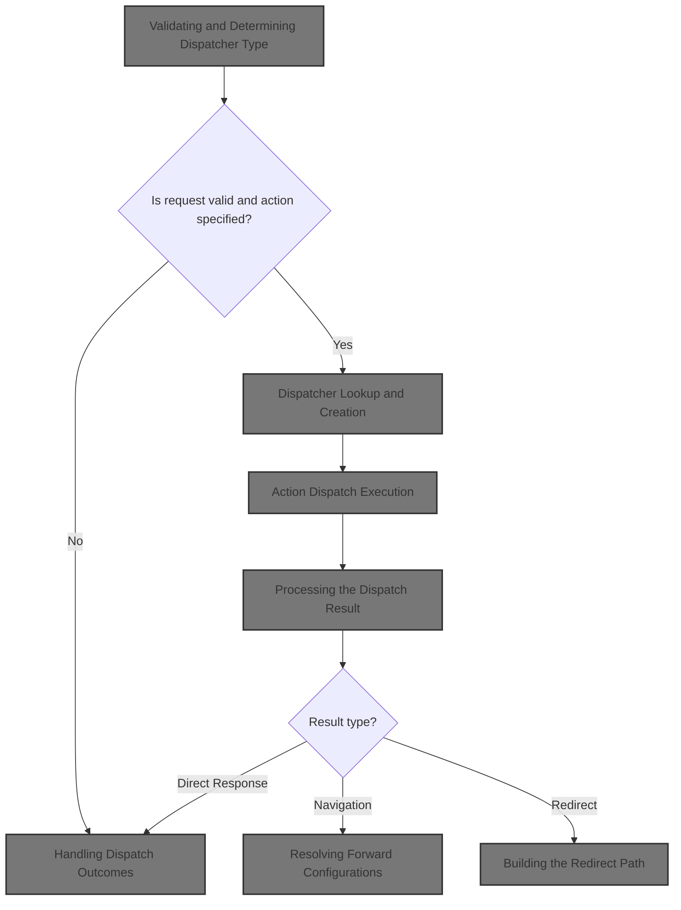

# Validating and Determining Dispatcher Type

```mermaid
%%{init: {"flowchart": {"defaultRenderer": "elk"}} }%%
flowchart TD
  node1["Start action execution process"]
  click node1 openCode "core/src/main/java/org/apache/struts/chain/commands/ExecuteDispatcher.java:58:63"
  node1 --> node2{"Is the request valid?"}
  click node2 openCode "core/src/main/java/org/apache/struts/chain/commands/ExecuteDispatcher.java:60:63"
  node2 -->|"No"| node12["Processing the Dispatch Result"]
  
  node2 -->|"Yes"| node3{"Is an action specified?"}
  click node3 openCode "core/src/main/java/org/apache/struts/chain/commands/ExecuteDispatcher.java:66:68"
  node3 -->|"No"| node12
  node3 -->|"Yes"| node4{"Is dispatcher type specified?"}
  click node4 openCode "core/src/main/java/org/apache/struts/chain/commands/ExecuteDispatcher.java:72:74"
  node4 -->|"No"| node13{"Is default dispatcher type available?"}
  node4 -->|"Yes"| node5{"Is dispatcher cache available?"}
  click node13 openCode "core/src/main/java/org/apache/struts/chain/commands/ExecuteDispatcher.java:73:76"
  node13 -->|"No"| node12
  node13 -->|"Yes"| node5
  node5 -->|"No"| node14["Create dispatcher cache"]
  
  node5 -->|"Yes"| node6{"Is dispatcher for action available?"}
  click node14 openCode "core/src/main/java/org/apache/struts/chain/commands/ExecuteDispatcher.java:83:85"
  node14 --> node6
  node6 -->|"No"| node7["Instantiating Dispatcher"]
  
  node6 -->|"Yes"| node8["Action Dispatch Execution"]
  
  node7 --> node8
  
  node8 --> node9["Processing the Dispatch Result"]
  
  node9 --> node12
classDef HeadingStyle fill:#777777,stroke:#333,stroke-width:2px;
click node5 goToHeading "Accessing Application Scope"
node5:::HeadingStyle
click node6 goToHeading "Dispatcher Lookup and Creation"
node6:::HeadingStyle
click node7 goToHeading "Instantiating Dispatcher"
node7:::HeadingStyle
click node8 goToHeading "Action Dispatch Execution"
node8:::HeadingStyle
click node9 goToHeading "Processing the Dispatch Result"
node9:::HeadingStyle
click node12 goToHeading "Processing the Dispatch Result"
node12:::HeadingStyle

%% Swimm:
%% %%{init: {"flowchart": {"defaultRenderer": "elk"}} }%%
%% flowchart TD
%%   node1["Start action execution process"]
%%   click node1 openCode "<SwmPath>[core/…/commands/ExecuteDispatcher.java](core/src/main/java/org/apache/struts/chain/commands/ExecuteDispatcher.java)</SwmPath>:58:63"
%%   node1 --> node2{"Is the request valid?"}
%%   click node2 openCode "<SwmPath>[core/…/commands/ExecuteDispatcher.java](core/src/main/java/org/apache/struts/chain/commands/ExecuteDispatcher.java)</SwmPath>:60:63"
%%   node2 -->|"No"| node12["Processing the Dispatch Result"]
%%   
%%   node2 -->|"Yes"| node3{"Is an action specified?"}
%%   click node3 openCode "<SwmPath>[core/…/commands/ExecuteDispatcher.java](core/src/main/java/org/apache/struts/chain/commands/ExecuteDispatcher.java)</SwmPath>:66:68"
%%   node3 -->|"No"| node12
%%   node3 -->|"Yes"| node4{"Is dispatcher type specified?"}
%%   click node4 openCode "<SwmPath>[core/…/commands/ExecuteDispatcher.java](core/src/main/java/org/apache/struts/chain/commands/ExecuteDispatcher.java)</SwmPath>:72:74"
%%   node4 -->|"No"| node13{"Is default dispatcher type available?"}
%%   node4 -->|"Yes"| node5{"Is dispatcher cache available?"}
%%   click node13 openCode "<SwmPath>[core/…/commands/ExecuteDispatcher.java](core/src/main/java/org/apache/struts/chain/commands/ExecuteDispatcher.java)</SwmPath>:73:76"
%%   node13 -->|"No"| node12
%%   node13 -->|"Yes"| node5
%%   node5 -->|"No"| node14["Create dispatcher cache"]
%%   
%%   node5 -->|"Yes"| node6{"Is dispatcher for action available?"}
%%   click node14 openCode "<SwmPath>[core/…/commands/ExecuteDispatcher.java](core/src/main/java/org/apache/struts/chain/commands/ExecuteDispatcher.java)</SwmPath>:83:85"
%%   node14 --> node6
%%   node6 -->|"No"| node7["Instantiating Dispatcher"]
%%   
%%   node6 -->|"Yes"| node8["Action Dispatch Execution"]
%%   
%%   node7 --> node8
%%   
%%   node8 --> node9["Processing the Dispatch Result"]
%%   
%%   node9 --> node12
%% classDef HeadingStyle fill:#777777,stroke:#333,stroke-width:2px;
%% click node5 goToHeading "Accessing Application Scope"
%% node5:::HeadingStyle
%% click node6 goToHeading "Dispatcher Lookup and Creation"
%% node6:::HeadingStyle
%% click node7 goToHeading "Instantiating Dispatcher"
%% node7:::HeadingStyle
%% click node8 goToHeading "Action Dispatch Execution"
%% node8:::HeadingStyle
%% click node9 goToHeading "Processing the Dispatch Result"
%% node9:::HeadingStyle
%% click node12 goToHeading "Processing the Dispatch Result"
%% node12:::HeadingStyle
```

<SwmSnippet path="/core/src/main/java/org/apache/struts/chain/commands/ExecuteDispatcher.java" line="58">

---

In `ExecuteDispatcher.execute`, we check if the form is valid and if an action is specified. If either is missing, we bail early. Next, we call <SwmToken path="core/src/main/java/org/apache/struts/chain/commands/ExecuteDispatcher.java" pos="71:7:7" line-data="        String dispatcherType = getDispatcherType(context);">`getDispatcherType`</SwmToken> to figure out what kind of dispatcher we need for this request, since the dispatcher type determines how the action will be handled.

```java
    public boolean execute(ActionContext context) throws Exception {
        // Skip processing if the current request is not valid
        Boolean valid = context.getFormValid();
        if ((valid == null) || !valid.booleanValue()) {
            return CONTINUE_PROCESSING;
        }

        // Skip processing if no action is specified
        if (context.getAction() == null) {
            return CONTINUE_PROCESSING;
        }

        // Skip processing if no dispatcher type specified
        String dispatcherType = getDispatcherType(context);
```

---

</SwmSnippet>

<SwmSnippet path="/core/src/main/java/org/apache/struts/chain/commands/ExecuteDispatcher.java" line="127">

---

<SwmToken path="core/src/main/java/org/apache/struts/chain/commands/ExecuteDispatcher.java" pos="127:5:5" line-data="    protected String getDispatcherType(ActionContext context) {">`getDispatcherType`</SwmToken> grabs the dispatcher type from the action config in the context. It assumes context and its action config are always valid, so it doesn't bother with extra checks or error handling.

```java
    protected String getDispatcherType(ActionContext context) {
        String dispatcherType = null;
        if (context != null) {
            dispatcherType = context.getActionConfig().getDispatcher();
        }
        return dispatcherType;
    }
```

---

</SwmSnippet>

<SwmSnippet path="/core/src/main/java/org/apache/struts/chain/commands/ExecuteDispatcher.java" line="72">

---

Back in `ExecuteDispatcher.execute`, after getting the dispatcher type, we check for a fallback and set up a cache for dispatchers using the application scope. We call `WebActionContext.getApplicationScope` next to access the shared cache, so we can reuse dispatcher instances across requests.

```java
        if (dispatcherType == null) {
            dispatcherType = defaultDispatcherType;
            if (dispatcherType == null) {
                return CONTINUE_PROCESSING;
            }
        }

        // Obtain (or create) the dispatcher cache
        String cacheKey = Constants.DISPATCHERS_KEY + context.getModuleConfig().getPrefix();
        Map dispatchers = (Map) context.getApplicationScope().get(cacheKey);
        if (dispatchers == null) {
            dispatchers = new HashMap();
            context.getApplicationScope().put(cacheKey, dispatchers);
        }

```

---

</SwmSnippet>

## Accessing Application Scope

<SwmSnippet path="/core/src/main/java/org/apache/struts/chain/contexts/WebActionContext.java" line="116">

---

<SwmToken path="core/src/main/java/org/apache/struts/chain/contexts/WebActionContext.java" pos="116:5:5" line-data="    public Map getApplicationScope() {">`getApplicationScope`</SwmToken> just grabs the application scope map from the underlying web context. We need this so we can store and retrieve dispatcher instances that are shared across requests.

```java
    public Map getApplicationScope() {
        return webContext().getApplicationScope();
    }
```

---

</SwmSnippet>

<SwmSnippet path="/core/src/main/java/org/apache/struts/chain/contexts/WebActionContext.java" line="49">

---

<SwmToken path="core/src/main/java/org/apache/struts/chain/contexts/WebActionContext.java" pos="49:5:7" line-data="    protected WebContext webContext() {">`webContext()`</SwmToken> just casts the base context to <SwmToken path="core/src/main/java/org/apache/struts/chain/contexts/WebActionContext.java" pos="49:3:3" line-data="    protected WebContext webContext() {">`WebContext`</SwmToken>. The code assumes this is always safe, so there's no extra validation or error handling.

```java
    protected WebContext webContext() {
        return (WebContext) this.getBaseContext();
    }
```

---

</SwmSnippet>

## Dispatcher Lookup and Creation

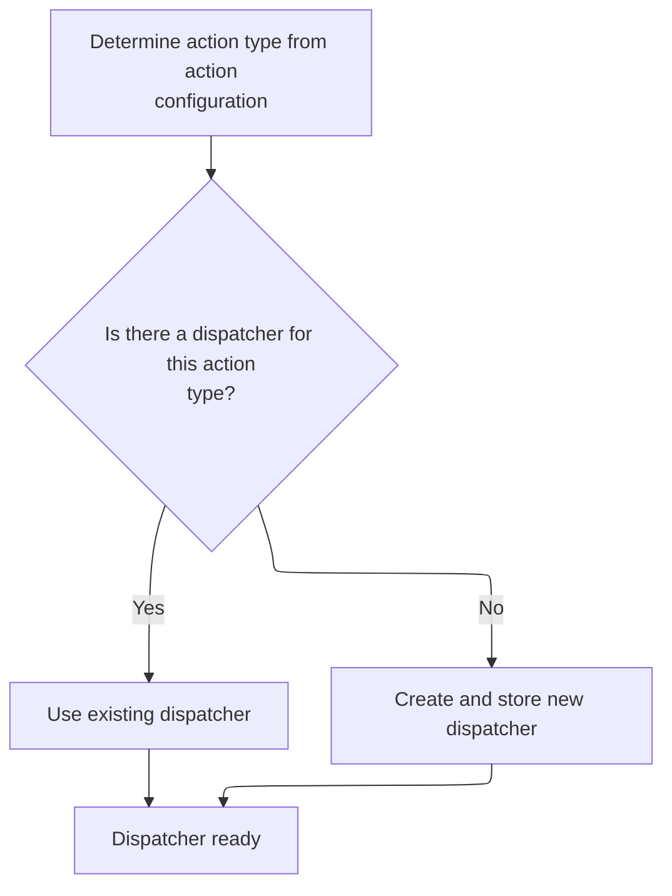

<SwmSnippet path="/core/src/main/java/org/apache/struts/chain/commands/ExecuteDispatcher.java" line="87">

---

Back in `ExecuteDispatcher.execute`, after grabbing the application scope, we look up the dispatcher for the current action type. If it's missing, we call <SwmToken path="core/src/main/java/org/apache/struts/chain/commands/ExecuteDispatcher.java" pos="95:5:5" line-data="                dispatcher = createDispatcher(dispatcherType, context);">`createDispatcher`</SwmToken> to make a new one and cache it.

```java
        // Lookup (or create) the dispatch instance
        Dispatcher dispatcher = null;
        synchronized (dispatchers) {
            ActionConfig actionConfig = context.getActionConfig();
            String actionType = actionConfig.getType();
            dispatcher = (Dispatcher) dispatchers.get(actionType);

            if (dispatcher == null) {
                dispatcher = createDispatcher(dispatcherType, context);
                dispatchers.put(actionType, dispatcher);
            }
        }

```

---

</SwmSnippet>

## Instantiating Dispatcher

<SwmSnippet path="/core/src/main/java/org/apache/struts/chain/commands/ExecuteDispatcher.java" line="53">

---

<SwmToken path="core/src/main/java/org/apache/struts/chain/commands/ExecuteDispatcher.java" pos="53:5:5" line-data="    protected Dispatcher createDispatcher(String type, ActionContext context) throws Exception {">`createDispatcher`</SwmToken> logs the dispatcher type and uses <SwmToken path="core/src/main/java/org/apache/struts/chain/commands/ExecuteDispatcher.java" pos="55:7:9" line-data="        return (Dispatcher) ClassUtils.getApplicationInstance(type);">`ClassUtils.getApplicationInstance`</SwmToken> to load and instantiate the dispatcher class. This is where we actually get the dispatcher object.

```java
    protected Dispatcher createDispatcher(String type, ActionContext context) throws Exception {
        log.info("Initializing dispatcher of type: " + type);
        return (Dispatcher) ClassUtils.getApplicationInstance(type);
    }
```

---

</SwmSnippet>

## Loading Dispatcher Class

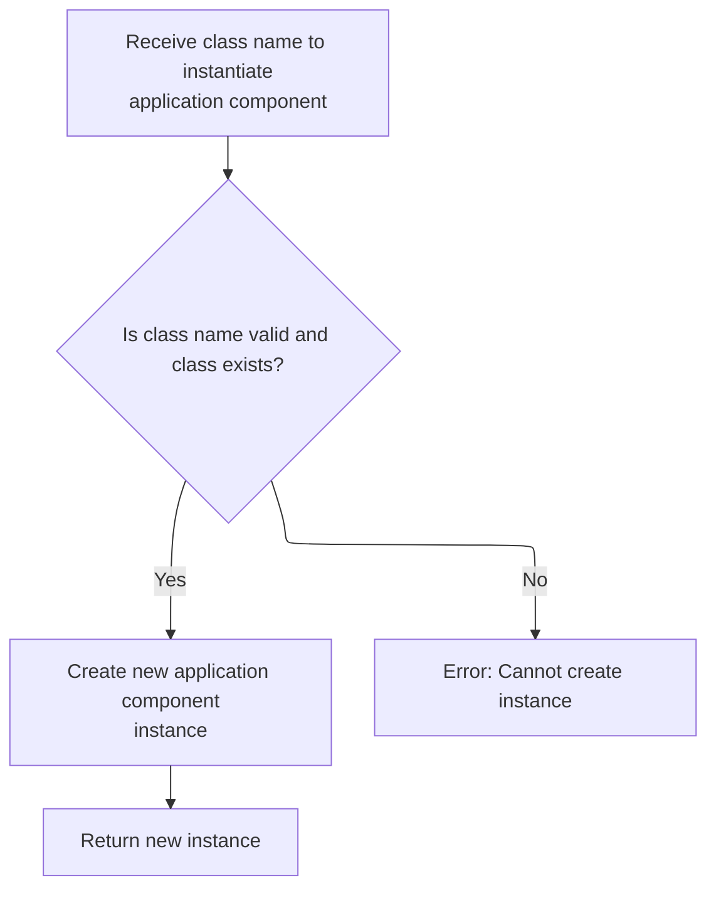

<SwmSnippet path="/core/src/main/java/org/apache/struts/chain/commands/util/ClassUtils.java" line="68">

---

<SwmToken path="core/src/main/java/org/apache/struts/chain/commands/util/ClassUtils.java" pos="68:7:7" line-data="    public static Object getApplicationInstance(String className)">`getApplicationInstance`</SwmToken> loads the class by name and calls <SwmToken path="core/src/main/java/org/apache/struts/chain/commands/util/ClassUtils.java" pos="71:9:9" line-data="        return (getApplicationClass(className).newInstance());">`newInstance`</SwmToken> to create an object. If the dispatcher type is a <SwmToken path="core/src/main/java/org/apache/struts/action/DynaActionFormClass.java" pos="45:4:4" line-data="public class DynaActionFormClass implements DynaClass, Serializable {">`DynaActionFormClass`</SwmToken>, this triggers its instantiation logic next.

```java
    public static Object getApplicationInstance(String className)
        throws ClassNotFoundException, IllegalAccessException,
            InstantiationException {
        return (getApplicationClass(className).newInstance());
    }
```

---

</SwmSnippet>

## Creating Dynamic Form Instance

<SwmSnippet path="/core/src/main/java/org/apache/struts/action/DynaActionFormClass.java" line="158">

---

In <SwmToken path="core/src/main/java/org/apache/struts/action/DynaActionFormClass.java" pos="158:5:5" line-data="    public DynaBean newInstance()">`newInstance`</SwmToken>, we create a new <SwmToken path="core/src/main/java/org/apache/struts/action/DynaActionFormClass.java" pos="160:1:1" line-data="        DynaActionForm dynaBean = (DynaActionForm) getBeanClass().newInstance();">`DynaActionForm`</SwmToken> using reflection, set its class reference, and prep its properties using the config. This sets up the bean with initial values before it's used.

```java
    public DynaBean newInstance()
        throws IllegalAccessException, InstantiationException {
        DynaActionForm dynaBean = (DynaActionForm) getBeanClass().newInstance();

```

---

</SwmSnippet>

### Bean Class Initialization

<SwmSnippet path="/core/src/main/java/org/apache/struts/action/DynaActionFormClass.java" line="227">

---

<SwmToken path="core/src/main/java/org/apache/struts/action/DynaActionFormClass.java" pos="227:5:5" line-data="    protected Class getBeanClass() {">`getBeanClass`</SwmToken> checks if <SwmToken path="core/src/main/java/org/apache/struts/action/DynaActionFormClass.java" pos="228:4:4" line-data="        if (beanClass == null) {">`beanClass`</SwmToken> is set; if not, it calls <SwmToken path="core/src/main/java/org/apache/struts/action/DynaActionFormClass.java" pos="229:1:4" line-data="            introspect(config);">`introspect(config)`</SwmToken> to initialize it. This lazy setup means we only do the work when the bean class is actually needed.

```java
    protected Class getBeanClass() {
        if (beanClass == null) {
            introspect(config);
        }

        return (beanClass);
    }
```

---

</SwmSnippet>

### Form Bean Introspection and Property Setup

```mermaid
%%{init: {"flowchart": {"defaultRenderer": "elk"}} }%%
flowchart TD
  node1["Start introspection of form bean config"]
  click node1 openCode "core/src/main/java/org/apache/struts/action/DynaActionFormClass.java:246:247"
  node1 --> node2{"Can instantiate bean class from config
type?"}
  click node2 openCode "core/src/main/java/org/apache/struts/action/DynaActionFormClass.java:250:258"
  node2 -->|"No"| node3["Throw error: Cannot instantiate class"]
  click node3 openCode "core/src/main/java/org/apache/struts/action/DynaActionFormClass.java:253:258"
  node2 -->|"Yes"| node4{"Is bean class a subclass of dynamic
form?"}
  click node4 openCode "core/src/main/java/org/apache/struts/action/DynaActionFormClass.java:260:264"
  node4 -->|"No"| node5["Throw error: Not a subclass of dynamic
form"]
  click node5 openCode "core/src/main/java/org/apache/struts/action/DynaActionFormClass.java:261:264"
  node4 -->|"Yes"| node6["Set form name from config"]
  click node6 openCode "core/src/main/java/org/apache/struts/action/DynaActionFormClass.java:267:267"
  node6 --> node7{"Property descriptors exist?"}
  click node7 openCode "core/src/main/java/org/apache/struts/action/DynaActionFormClass.java:270:274"
  node7 -->|"No"| node8["Use empty property list"]
  click node8 openCode "core/src/main/java/org/apache/struts/action/DynaActionFormClass.java:273:274"
  node8 --> node12["End introspection"]
  node7 -->|"Yes"| node9["Use property descriptors from config"]
  click node9 openCode "core/src/main/java/org/apache/struts/action/DynaActionFormClass.java:270:271"
  node9 --> node10
  subgraph loop1["For each property descriptor"]
    node10["Create and register dynamic property
(name, type)"]
    click node10 openCode "core/src/main/java/org/apache/struts/action/DynaActionFormClass.java:279:284"
  end
  node10 --> node12["End introspection"]
  click node12 openCode "core/src/main/java/org/apache/struts/action/DynaActionFormClass.java:285:285"

classDef HeadingStyle fill:#777777,stroke:#333,stroke-width:2px;

%% Swimm:
%% %%{init: {"flowchart": {"defaultRenderer": "elk"}} }%%
%% flowchart TD
%%   node1["Start introspection of form bean config"]
%%   click node1 openCode "<SwmPath>[core/…/action/DynaActionFormClass.java](core/src/main/java/org/apache/struts/action/DynaActionFormClass.java)</SwmPath>:246:247"
%%   node1 --> node2{"Can instantiate bean class from config
%% type?"}
%%   click node2 openCode "<SwmPath>[core/…/action/DynaActionFormClass.java](core/src/main/java/org/apache/struts/action/DynaActionFormClass.java)</SwmPath>:250:258"
%%   node2 -->|"No"| node3["Throw error: Cannot instantiate class"]
%%   click node3 openCode "<SwmPath>[core/…/action/DynaActionFormClass.java](core/src/main/java/org/apache/struts/action/DynaActionFormClass.java)</SwmPath>:253:258"
%%   node2 -->|"Yes"| node4{"Is bean class a subclass of dynamic
%% form?"}
%%   click node4 openCode "<SwmPath>[core/…/action/DynaActionFormClass.java](core/src/main/java/org/apache/struts/action/DynaActionFormClass.java)</SwmPath>:260:264"
%%   node4 -->|"No"| node5["Throw error: Not a subclass of dynamic
%% form"]
%%   click node5 openCode "<SwmPath>[core/…/action/DynaActionFormClass.java](core/src/main/java/org/apache/struts/action/DynaActionFormClass.java)</SwmPath>:261:264"
%%   node4 -->|"Yes"| node6["Set form name from config"]
%%   click node6 openCode "<SwmPath>[core/…/action/DynaActionFormClass.java](core/src/main/java/org/apache/struts/action/DynaActionFormClass.java)</SwmPath>:267:267"
%%   node6 --> node7{"Property descriptors exist?"}
%%   click node7 openCode "<SwmPath>[core/…/action/DynaActionFormClass.java](core/src/main/java/org/apache/struts/action/DynaActionFormClass.java)</SwmPath>:270:274"
%%   node7 -->|"No"| node8["Use empty property list"]
%%   click node8 openCode "<SwmPath>[core/…/action/DynaActionFormClass.java](core/src/main/java/org/apache/struts/action/DynaActionFormClass.java)</SwmPath>:273:274"
%%   node8 --> node12["End introspection"]
%%   node7 -->|"Yes"| node9["Use property descriptors from config"]
%%   click node9 openCode "<SwmPath>[core/…/action/DynaActionFormClass.java](core/src/main/java/org/apache/struts/action/DynaActionFormClass.java)</SwmPath>:270:271"
%%   node9 --> node10
%%   subgraph loop1["For each property descriptor"]
%%     node10["Create and register dynamic property
%% (name, type)"]
%%     click node10 openCode "<SwmPath>[core/…/action/DynaActionFormClass.java](core/src/main/java/org/apache/struts/action/DynaActionFormClass.java)</SwmPath>:279:284"
%%   end
%%   node10 --> node12["End introspection"]
%%   click node12 openCode "<SwmPath>[core/…/action/DynaActionFormClass.java](core/src/main/java/org/apache/struts/action/DynaActionFormClass.java)</SwmPath>:285:285"
%% 
%% classDef HeadingStyle fill:#777777,stroke:#333,stroke-width:2px;
```

<SwmSnippet path="/core/src/main/java/org/apache/struts/action/DynaActionFormClass.java" line="246">

---

<SwmToken path="core/src/main/java/org/apache/struts/action/DynaActionFormClass.java" pos="246:5:5" line-data="    protected void introspect(FormBeanConfig config) {">`introspect`</SwmToken> loads the bean class from config, checks it's a <SwmToken path="core/src/main/java/org/apache/struts/action/DynaActionFormClass.java" pos="260:5:5" line-data="        if (!DynaActionForm.class.isAssignableFrom(beanClass)) {">`DynaActionForm`</SwmToken> subclass, sets the form name, and builds property definitions using <SwmToken path="core/src/main/java/org/apache/struts/action/DynaActionFormClass.java" pos="270:1:1" line-data="        FormPropertyConfig[] descriptors = config.findFormPropertyConfigs();">`FormPropertyConfig`</SwmToken> descriptors. Next, we call <SwmToken path="core/src/main/java/org/apache/struts/action/DynaActionFormClass.java" pos="282:6:6" line-data="                    descriptors[i].getTypeClass());">`getTypeClass`</SwmToken> to resolve property types.

```java
    protected void introspect(FormBeanConfig config) {
        this.config = config;

        // Validate the ActionFormBean implementation class
        try {
            beanClass = RequestUtils.applicationClass(config.getType());
        } catch (Throwable t) {
        	IllegalArgumentException t2 = new IllegalArgumentException(
                "Cannot instantiate ActionFormBean class '" + config.getType()
                + "'");
        	t2.initCause(t);
        	throw t2;
        }

        if (!DynaActionForm.class.isAssignableFrom(beanClass)) {
            throw new IllegalArgumentException("Class '" + config.getType()
                + "' is not a subclass of "
                + "'org.apache.struts.action.DynaActionForm'");
        }

        // Set the name we will know ourselves by from the form bean name
        this.name = config.getName();

        // Look up the property descriptors for this bean class
        FormPropertyConfig[] descriptors = config.findFormPropertyConfigs();

        if (descriptors == null) {
            descriptors = new FormPropertyConfig[0];
        }

        // Create corresponding dynamic property definitions
        properties = new DynaProperty[descriptors.length];

        for (int i = 0; i < descriptors.length; i++) {
            properties[i] =
                new DynaProperty(descriptors[i].getName(),
                    descriptors[i].getTypeClass());
            propertiesMap.put(properties[i].getName(), properties[i]);
        }
    }
```

---

</SwmSnippet>

<SwmSnippet path="/core/src/main/java/org/apache/struts/config/FormPropertyConfig.java" line="221">

---

<SwmToken path="core/src/main/java/org/apache/struts/config/FormPropertyConfig.java" pos="221:5:5" line-data="    public Class getTypeClass() {">`getTypeClass`</SwmToken> figures out the property type, handling primitives and arrays. If the type is an array, it builds the array class; otherwise, it loads the base class. This info is used for property setup in <SwmToken path="core/src/main/java/org/apache/struts/action/DynaActionFormClass.java" pos="45:4:4" line-data="public class DynaActionFormClass implements DynaClass, Serializable {">`DynaActionFormClass`</SwmToken>.

```java
    public Class getTypeClass() {
        // Identify the base class (in case an array was specified)
        String baseType = getType();
        boolean indexed = false;

        if (baseType.endsWith("[]")) {
            baseType = baseType.substring(0, baseType.length() - 2);
            indexed = true;
        }

        // Construct an appropriate Class instance for the base class
        Class baseClass = null;

        if ("boolean".equals(baseType)) {
            baseClass = Boolean.TYPE;
        } else if ("byte".equals(baseType)) {
            baseClass = Byte.TYPE;
        } else if ("char".equals(baseType)) {
            baseClass = Character.TYPE;
        } else if ("double".equals(baseType)) {
            baseClass = Double.TYPE;
        } else if ("float".equals(baseType)) {
            baseClass = Float.TYPE;
        } else if ("int".equals(baseType)) {
            baseClass = Integer.TYPE;
        } else if ("long".equals(baseType)) {
            baseClass = Long.TYPE;
        } else if ("short".equals(baseType)) {
            baseClass = Short.TYPE;
        } else {
            ClassLoader classLoader =
                Thread.currentThread().getContextClassLoader();

            if (classLoader == null) {
                classLoader = this.getClass().getClassLoader();
            }

            try {
                baseClass = classLoader.loadClass(baseType);
            } catch (ClassNotFoundException ex) {
                log.error("Class '" + baseType +
                          "' not found for property '" + name + "'");
                baseClass = null;
            }
        }

        // Return the base class or an array appropriately
        if (indexed) {
            return (Array.newInstance(baseClass, 0).getClass());
        } else {
            return (baseClass);
        }
    }
```

---

</SwmSnippet>

### Initializing Dynamic Form Properties

<SwmSnippet path="/core/src/main/java/org/apache/struts/action/DynaActionFormClass.java" line="162">

---

Back in `DynaActionFormClass.newInstance`, after creating the bean, we loop through property configs and set each property to its initial value using the config. This preps the bean for use.

```java
        dynaBean.setDynaActionFormClass(this);

        FormPropertyConfig[] props = config.findFormPropertyConfigs();

        for (int i = 0; i < props.length; i++) {
            dynaBean.set(props[i].getName(), props[i].initial());
        }

        return (dynaBean);
    }
```

---

</SwmSnippet>

## Resolving Initial Property Values

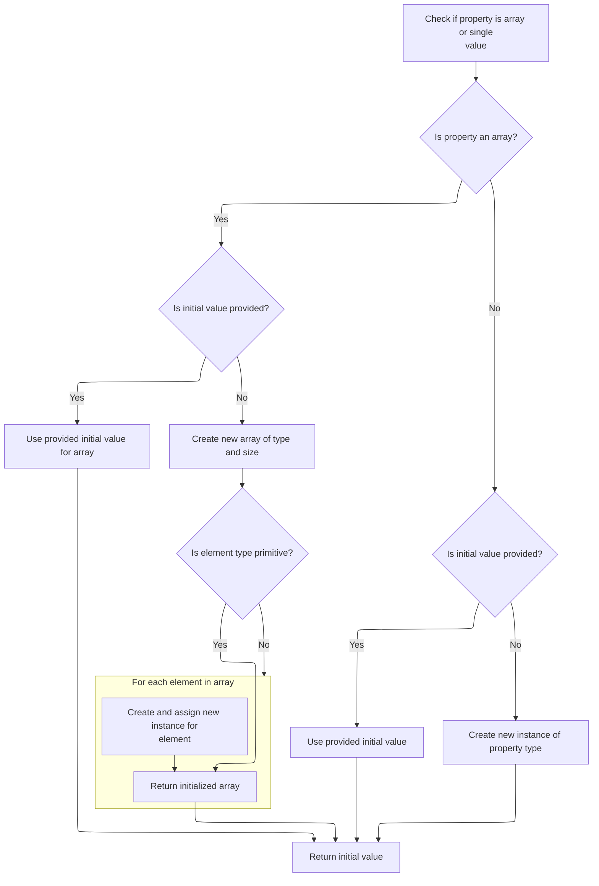

<SwmSnippet path="/core/src/main/java/org/apache/struts/config/FormPropertyConfig.java" line="318">

---

In <SwmToken path="core/src/main/java/org/apache/struts/config/FormPropertyConfig.java" pos="318:5:5" line-data="    public Object initial() {">`initial`</SwmToken>, we figure out the initial value for a property. If the type is an array, we either convert the initial value or create a new array and fill it with default instances.

```java
    public Object initial() {
        Object initialValue = null;

        try {
            Class clazz = getTypeClass();

```

---

</SwmSnippet>

<SwmSnippet path="/core/src/main/java/org/apache/struts/config/FormPropertyConfig.java" line="324">

---

After returning from `FormPropertyConfig.initial`, if the property is an array and the component type isn't primitive, we loop and instantiate each element. This makes sure the array is filled with usable objects.

```java
            if (clazz.isArray()) {
                if (initial != null) {
                    initialValue = ConvertUtils.convert(initial, clazz);
                } else {
                    initialValue =
                        Array.newInstance(clazz.getComponentType(), size);

                    if (!(clazz.getComponentType().isPrimitive())) {
                        for (int i = 0; i < size; i++) {
                            try {
                                Array.set(initialValue, i,
                                    clazz.getComponentType().newInstance());
                            } catch (Throwable t) {
                                log.error("Unable to create instance of "
                                    + clazz.getName() + " for property=" + name
                                    + ", type=" + type + ", initial=" + initial
                                    + ", size=" + size + ".");

                                //FIXME: Should we just dump the entire application/module ?
                            }
                        }
```

---

</SwmSnippet>

<SwmSnippet path="/core/src/main/java/org/apache/struts/config/FormPropertyConfig.java" line="348">

---

Finishing up `FormPropertyConfig.initial`, for non-array types, we either convert the initial value or instantiate the class. This gives us a default value for every property before handing back to <SwmToken path="core/src/main/java/org/apache/struts/action/DynaActionFormClass.java" pos="45:4:4" line-data="public class DynaActionFormClass implements DynaClass, Serializable {">`DynaActionFormClass`</SwmToken>.

```java
                if (initial != null) {
                    initialValue = ConvertUtils.convert(initial, clazz);
                } else {
                    initialValue = clazz.newInstance();
                }
            }
        } catch (Throwable t) {
            initialValue = null;
        }

        return (initialValue);
    }
```

---

</SwmSnippet>

## Dispatching the Action

<SwmSnippet path="/core/src/main/java/org/apache/struts/chain/commands/ExecuteDispatcher.java" line="100">

---

Back in `ExecuteDispatcher.execute`, after creating or retrieving the dispatcher, we call its <SwmToken path="core/src/main/java/org/apache/struts/chain/commands/ExecuteDispatcher.java" pos="101:9:9" line-data="        Object result = dispatcher.dispatch(context);">`dispatch`</SwmToken> method with the context. This kicks off the actual action handling.

```java
        // Dispatch
        Object result = dispatcher.dispatch(context);
```

---

</SwmSnippet>

## Action Dispatch Execution

<SwmSnippet path="/extras/src/main/java/org/apache/struts/actions/ActionDispatcher.java" line="507">

---

In <SwmToken path="extras/src/main/java/org/apache/struts/actions/ActionDispatcher.java" pos="507:5:5" line-data="    public Object dispatch(ActionContext context) throws Exception {">`dispatch`</SwmToken>, we cast the context to <SwmToken path="extras/src/main/java/org/apache/struts/actions/ActionDispatcher.java" pos="508:1:1" line-data="        ServletActionContext servletContext = (ServletActionContext) context;">`ServletActionContext`</SwmToken> so we can grab the request and response objects needed for action execution. Next, we call <SwmToken path="extras/src/main/java/org/apache/struts/actions/ActionDispatcher.java" pos="510:3:3" line-data="            servletContext.getRequest(), servletContext.getResponse());">`getRequest`</SwmToken> to get the HTTP request.

```java
    public Object dispatch(ActionContext context) throws Exception {
        ServletActionContext servletContext = (ServletActionContext) context;
        return execute((ActionMapping) context.getActionConfig(), context.getActionForm(),
            servletContext.getRequest(), servletContext.getResponse());
```

---

</SwmSnippet>

### Retrieving HTTP Request

<SwmSnippet path="/core/src/main/java/org/apache/struts/chain/contexts/ServletActionContext.java" line="94">

---

<SwmToken path="core/src/main/java/org/apache/struts/chain/contexts/ServletActionContext.java" pos="94:5:5" line-data="    public HttpServletRequest getRequest() {">`getRequest`</SwmToken> grabs the HTTP request from the servlet web context. We need this for the action execution step.

```java
    public HttpServletRequest getRequest() {
        return servletWebContext().getRequest();
    }
```

---

</SwmSnippet>

<SwmSnippet path="/core/src/main/java/org/apache/struts/chain/contexts/ServletActionContext.java" line="67">

---

<SwmToken path="core/src/main/java/org/apache/struts/chain/contexts/ServletActionContext.java" pos="67:5:7" line-data="    protected ServletWebContext servletWebContext() {">`servletWebContext()`</SwmToken> just casts the base context to <SwmToken path="core/src/main/java/org/apache/struts/chain/contexts/ServletActionContext.java" pos="67:3:3" line-data="    protected ServletWebContext servletWebContext() {">`ServletWebContext`</SwmToken>. The code expects this to always work, so there's no extra logic.

```java
    protected ServletWebContext servletWebContext() {
        return (ServletWebContext) this.getBaseContext();
    }
```

---

</SwmSnippet>

### Preparing Action Execution Arguments

<SwmSnippet path="/extras/src/main/java/org/apache/struts/actions/ActionDispatcher.java" line="509">

---

Back in `ActionDispatcher.dispatch`, after getting the request, we grab the response object too. Both are needed for the action execution step.

```java
        return execute((ActionMapping) context.getActionConfig(), context.getActionForm(),
            servletContext.getRequest(), servletContext.getResponse());
```

---

</SwmSnippet>

<SwmSnippet path="/core/src/main/java/org/apache/struts/chain/contexts/ServletActionContext.java" line="103">

---

<SwmToken path="core/src/main/java/org/apache/struts/chain/contexts/ServletActionContext.java" pos="103:5:5" line-data="    public HttpServletResponse getResponse() {">`getResponse`</SwmToken> grabs the HTTP response from the servlet web context. We need this for the action execution step.

```java
    public HttpServletResponse getResponse() {
        return servletWebContext().getResponse();
    }
```

---

</SwmSnippet>

<SwmSnippet path="/extras/src/main/java/org/apache/struts/actions/ActionDispatcher.java" line="509">

---

Finishing up `ActionDispatcher.dispatch`, we call <SwmToken path="extras/src/main/java/org/apache/struts/actions/ActionDispatcher.java" pos="509:3:3" line-data="        return execute((ActionMapping) context.getActionConfig(), context.getActionForm(),">`execute`</SwmToken> with mapping, form, request, and response. This runs the action logic and returns an <SwmToken path="extras/src/main/java/org/apache/struts/actions/ActionDispatcher.java" pos="197:3:3" line-data="    public ActionForward execute(ActionMapping mapping, ActionForm form,">`ActionForward`</SwmToken> for navigation.

```java
        return execute((ActionMapping) context.getActionConfig(), context.getActionForm(),
            servletContext.getRequest(), servletContext.getResponse());
    }
```

---

</SwmSnippet>

## Executing Action Logic

<SwmSnippet path="/extras/src/main/java/org/apache/struts/actions/ActionDispatcher.java" line="197">

---

In <SwmToken path="extras/src/main/java/org/apache/struts/actions/ActionDispatcher.java" pos="197:5:5" line-data="    public ActionForward execute(ActionMapping mapping, ActionForm form,">`execute`</SwmToken>, we check if the request was cancelled. If so, we call <SwmToken path="extras/src/main/java/org/apache/struts/actions/ActionDispatcher.java" pos="200:6:6" line-data="        // Process &quot;cancelled&quot;">`cancelled`</SwmToken> to handle it and return early if needed.

```java
    public ActionForward execute(ActionMapping mapping, ActionForm form,
        HttpServletRequest request, HttpServletResponse response)
        throws Exception {
        // Process "cancelled"
        if (isCancelled(request)) {
            ActionForward af = cancelled(mapping, form, request, response);

            if (af != null) {
                return af;
            }
        }

```

---

</SwmSnippet>

### Handling Cancelled Actions

See <SwmLink doc-title="Handling Cancelled Actions">[Handling Cancelled Actions](/.swm/handling-cancelled-actions.1o2dnmn9.sw.md)</SwmLink>

### Determining the Dispatch Method Parameter

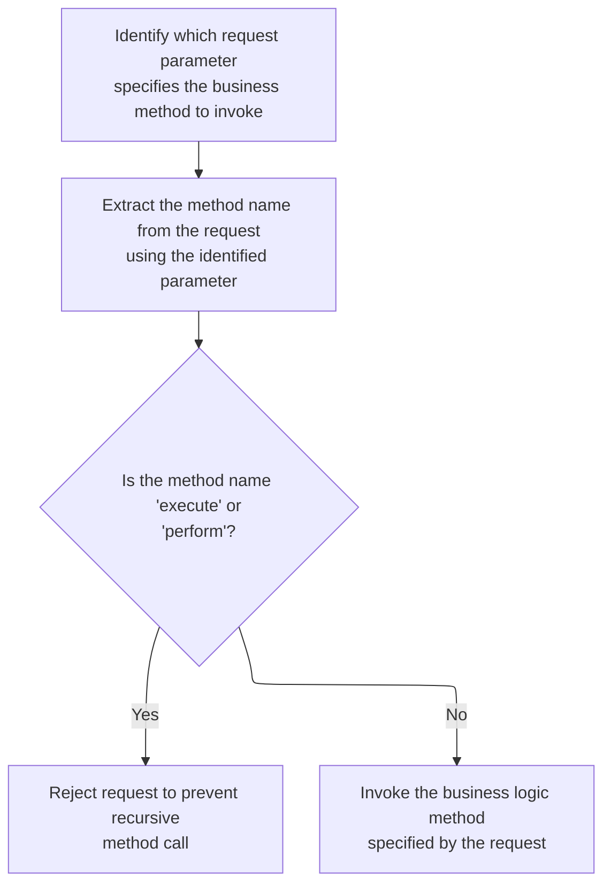

<SwmSnippet path="/extras/src/main/java/org/apache/struts/actions/ActionDispatcher.java" line="209">

---

After handling cancelled requests, we call <SwmToken path="extras/src/main/java/org/apache/struts/actions/ActionDispatcher.java" pos="210:7:7" line-data="        String parameter = getParameter(mapping, form, request, response);">`getParameter`</SwmToken> to figure out which request parameter will be used to determine the method to dispatch. The flavor variable decides if we default to 'method' or throw an error if the parameter is missing.

```java
        // Identify the request parameter containing the method name
        String parameter = getParameter(mapping, form, request, response);

```

---

</SwmSnippet>

<SwmSnippet path="/extras/src/main/java/org/apache/struts/actions/ActionDispatcher.java" line="435">

---

GetParameter figures out which request parameter to use for dispatching. It checks the flavor variable to decide if it should default to 'method', throw an error, or just use the mapping value. This isn't obvious from the function signature, so you have to know the flavor constants to understand the control flow.

```java
    protected String getParameter(ActionMapping mapping, ActionForm form,
        HttpServletRequest request, HttpServletResponse response)
        throws Exception {
        String parameter = mapping.getParameter();

        if ("".equals(parameter)) {
            parameter = null;
        }

        if ((parameter == null) && (flavor == DEFAULT_FLAVOR)) {
            // use "method" for DEFAULT_FLAVOR if no parameter was provided
            return "method";
        }

        if ((parameter == null)
            && ((flavor == MAPPING_FLAVOR) || (flavor == DISPATCH_FLAVOR))) {
            String message =
                messages.getMessage("dispatch.handler", mapping.getPath());

            log.error(message);

            throw new ServletException(message);
        }

        return parameter;
    }
```

---

</SwmSnippet>

<SwmSnippet path="/extras/src/main/java/org/apache/struts/actions/ActionDispatcher.java" line="212">

---

After resolving the dispatch parameter, we call <SwmToken path="extras/src/main/java/org/apache/struts/actions/ActionDispatcher.java" pos="214:1:1" line-data="            getMethodName(mapping, form, request, response, parameter);">`getMethodName`</SwmToken> to figure out which method should actually be invoked. This lets us support different dispatching strategies based on the flavor variable.

```java
        // Get the method's name. This could be overridden in subclasses.
        String name =
            getMethodName(mapping, form, request, response, parameter);

```

---

</SwmSnippet>

<SwmSnippet path="/extras/src/main/java/org/apache/struts/actions/ActionDispatcher.java" line="474">

---

GetMethodName decides which method to call for the action. If flavor is <SwmToken path="extras/src/main/java/org/apache/struts/actions/ActionDispatcher.java" pos="478:8:8" line-data="        if (flavor == MAPPING_FLAVOR) {">`MAPPING_FLAVOR`</SwmToken>, it just returns the parameter directly; otherwise, it looks up the method name in the request parameters. This lets us support different dispatching strategies.

```java
    protected String getMethodName(ActionMapping mapping, ActionForm form,
        HttpServletRequest request, HttpServletResponse response,
        String parameter) throws Exception {
        // "Mapping" flavor, defaults to "method"
        if (flavor == MAPPING_FLAVOR) {
            return parameter;
        }

        // default behaviour
        return request.getParameter(parameter);
    }
```

---

</SwmSnippet>

<SwmSnippet path="/extras/src/main/java/org/apache/struts/actions/ActionDispatcher.java" line="216">

---

After getting the method name, we check for recursion ('execute' or 'perform') to avoid infinite loops. If it's safe, we call <SwmToken path="extras/src/main/java/org/apache/struts/actions/ActionDispatcher.java" pos="226:3:3" line-data="        return dispatchMethod(mapping, form, request, response, name);">`dispatchMethod`</SwmToken> to actually invoke the method.

```java
        // Prevent recursive calls
        if ("execute".equals(name) || "perform".equals(name)) {
            String message =
                messages.getMessage("dispatch.recursive", mapping.getPath());

            log.error(message);
            throw new ServletException(message);
        }

        // Invoke the named method, and return the result
        return dispatchMethod(mapping, form, request, response, name);
    }
```

---

</SwmSnippet>

## Dispatching to the Target Method

<SwmSnippet path="/extras/src/main/java/org/apache/struts/actions/ActionDispatcher.java" line="313">

---

In <SwmToken path="extras/src/main/java/org/apache/struts/actions/ActionDispatcher.java" pos="313:5:5" line-data="    protected ActionForward dispatchMethod(ActionMapping mapping,">`dispatchMethod`</SwmToken>, if the method name is missing (null), we call unspecified to handle the fallback. This is how we deal with requests that don't specify which action method to run.

```java
    protected ActionForward dispatchMethod(ActionMapping mapping,
        ActionForm form, HttpServletRequest request,
        HttpServletResponse response, String name)
        throws Exception {
        // Make sure we have a valid method name to call.
        // This may be null if the user hacks the query string.
        if (name == null) {
            return this.unspecified(mapping, form, request, response);
        }

```

---

</SwmSnippet>

### Fallback for Missing Method Names

<SwmSnippet path="/extras/src/main/java/org/apache/struts/actions/ActionDispatcher.java" line="245">

---

Unspecified tries to find a method called 'unspecified' to use as a fallback. If it exists, we dispatch to it; if not, we throw an error and bail out.

```java
    protected ActionForward unspecified(ActionMapping mapping, ActionForm form,
        HttpServletRequest request, HttpServletResponse response)
        throws Exception {
        // Identify if there is an "unspecified" method to be dispatched to
        String name = "unspecified";
        Method method = null;

        try {
            method = getMethod(name);
```

---

</SwmSnippet>

<SwmSnippet path="/extras/src/main/java/org/apache/struts/actions/ActionDispatcher.java" line="254">

---

If we can't find the 'unspecified' method, we log the error and throw a <SwmToken path="extras/src/main/java/org/apache/struts/actions/ActionDispatcher.java" pos="261:5:5" line-data="            throw new ServletException(message, e);">`ServletException`</SwmToken>. This stops the flow so we don't dispatch to a missing method.

```java
        } catch (NoSuchMethodException e) {
            String message =
                messages.getMessage("dispatch.parameter", mapping.getPath(),
                    mapping.getParameter());

            log.error(message);

            throw new ServletException(message, e);
        }

```

---

</SwmSnippet>

<SwmSnippet path="/extras/src/main/java/org/apache/struts/actions/ActionDispatcher.java" line="264">

---

Once we've got the 'unspecified' method, we call <SwmToken path="extras/src/main/java/org/apache/struts/actions/ActionDispatcher.java" pos="264:3:3" line-data="        return dispatchMethod(mapping, form, request, response, name, method);">`dispatchMethod`</SwmToken> with its reference so the dispatcher can actually run it as a fallback.

```java
        return dispatchMethod(mapping, form, request, response, name, method);
    }
```

---

</SwmSnippet>

### Dispatching the Fallback Method

<SwmSnippet path="/extras/src/main/java/org/apache/struts/actions/ActionDispatcher.java" line="323">

---

After handling unspecified, we look up the actual method to dispatch to. If it's missing, we log the error and throw an exception so the request doesn't proceed.

```java
        // Identify the method object to be dispatched to
        Method method = null;

        try {
            method = getMethod(name);
```

---

</SwmSnippet>

<SwmSnippet path="/extras/src/main/java/org/apache/struts/actions/ActionDispatcher.java" line="328">

---

Once we've got the method reference, we call <SwmToken path="extras/src/main/java/org/apache/struts/actions/ActionDispatcher.java" pos="341:3:3" line-data="        return dispatchMethod(mapping, form, request, response, name, method);">`dispatchMethod`</SwmToken> again to actually run the method for this request.

```java
        } catch (NoSuchMethodException e) {
            String message =
                messages.getMessage("dispatch.method", mapping.getPath(), name);

            log.error(message, e);

            String userMsg =
                messages.getMessage("dispatch.method.user", mapping.getPath());
            NoSuchMethodException e2 = new NoSuchMethodException(userMsg);
            e2.initCause(e);
            throw e2;
        }

        return dispatchMethod(mapping, form, request, response, name, method);
    }
```

---

</SwmSnippet>

## Processing the Dispatch Result

<SwmSnippet path="/core/src/main/java/org/apache/struts/chain/commands/ExecuteDispatcher.java" line="102">

---

After dispatching the action, we call <SwmToken path="core/src/main/java/org/apache/struts/chain/commands/ExecuteDispatcher.java" pos="102:1:1" line-data="        processDispatchResult(result, context);">`processDispatchResult`</SwmToken> to handle whatever the action returned—could be a forward, a string, or nothing. This decides what happens next in the flow.

```java
        processDispatchResult(result, context);

        return CONTINUE_PROCESSING;
    }
```

---

</SwmSnippet>

# Handling Dispatch Outcomes

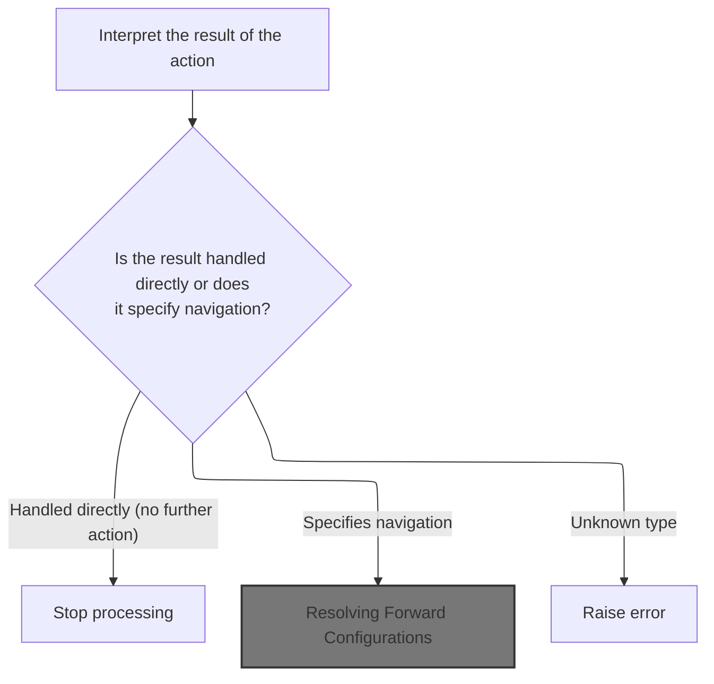

<SwmSnippet path="/core/src/main/java/org/apache/struts/chain/commands/ExecuteDispatcher.java" line="156">

---

ProcessDispatchResult checks what type of result came back from dispatch. If it's null, we assume the response is already handled. If it's a <SwmToken path="core/src/main/java/org/apache/struts/chain/commands/ExecuteDispatcher.java" pos="163:8:8" line-data="        if (result instanceof ForwardConfig) {">`ForwardConfig`</SwmToken>, we set it in the context. If it's a string, we look up the forward in <SwmToken path="core/src/main/java/org/apache/struts/chain/commands/ExecuteDispatcher.java" pos="170:1:1" line-data="        ActionMapping mapping = ((ActionMapping) actionConfig);">`ActionMapping`</SwmToken>. If it's <SwmToken path="core/src/main/java/org/apache/struts/chain/commands/ExecuteDispatcher.java" pos="177:8:10" line-data="        if (result == void.class) {">`void.class`</SwmToken>, we default to 'success'. Anything else throws an exception.

```java
    protected void processDispatchResult(Object result, ActionContext context) {
        // Null means the response was handled directly
        if (result == null) {
            return;
        }

        // A forward is the classical response
        if (result instanceof ForwardConfig) {
            context.setForwardConfig((ForwardConfig) result);
            return;
        }

        // String represents the name of a forward
        ActionConfig actionConfig = context.getActionConfig();
        ActionMapping mapping = ((ActionMapping) actionConfig);
        if (result instanceof String) {
            context.setForwardConfig(mapping.findRequiredForward((String) result));
            return;
        }

        // Select success if no return signature
        if (result == void.class) {
            context.setForwardConfig(mapping.findRequiredForward(Action.SUCCESS));
            return;
        }

```

---

</SwmSnippet>

## Resolving Forward Configurations

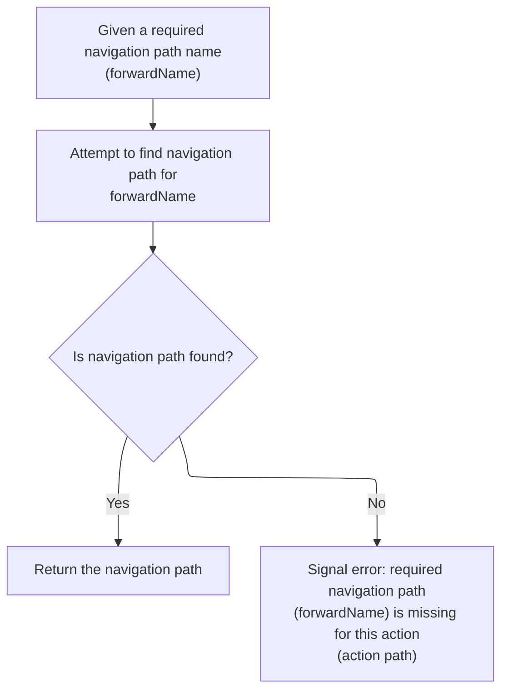

<SwmSnippet path="/core/src/main/java/org/apache/struts/action/ActionMapping.java" line="98">

---

FindRequiredForward looks up the forward by name. If it's not found, we throw an exception. Otherwise, we return the forward so the flow can continue. Next, we might need to resolve the path for redirects.

```java
    public ActionForward findRequiredForward(String forwardName) {
        ActionForward forward = findForward(forwardName);
        if (forward == null) {
            throw new IllegalStateException(
                    "Unable to find '" + forwardName + 
                    "' forward of action path '" + getPath() + "'"); 
        }
        return forward;
    }
```

---

</SwmSnippet>

## Building the Redirect Path

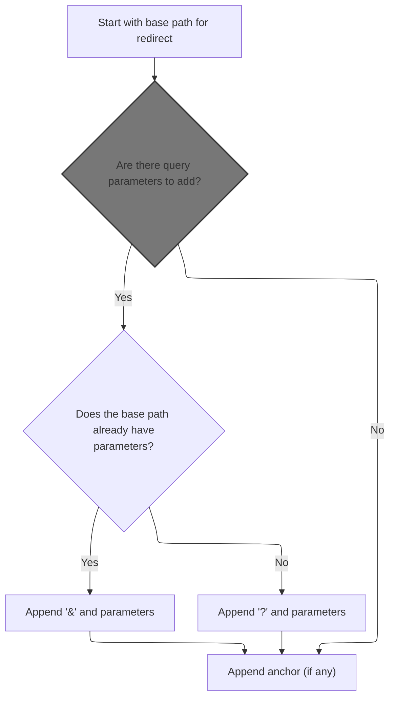

<SwmSnippet path="/core/src/main/java/org/apache/struts/action/ActionRedirect.java" line="230">

---

GetPath starts by grabbing the original path and then builds up the redirect URL. We need to call <SwmToken path="core/src/main/java/org/apache/struts/action/ActionRedirect.java" pos="233:7:7" line-data="        String parameterString = getParameterString();">`getParameterString`</SwmToken> next to add any query parameters to the path.

```java
    public String getPath() {
        // get the original path and the parameter string that was formed
        String originalPath = getOriginalPath();
```

---

</SwmSnippet>

<SwmSnippet path="/core/src/main/java/org/apache/struts/action/ActionRedirect.java" line="220">

---

GetOriginalPath just returns the base path for the redirect. We use this as the starting point before adding parameters or anchors.

```java
    public String getOriginalPath() {
        return super.getPath();
    }
```

---

</SwmSnippet>

<SwmSnippet path="/core/src/main/java/org/apache/struts/action/ActionRedirect.java" line="233">

---

After grabbing the original path, we call <SwmToken path="core/src/main/java/org/apache/struts/action/ActionRedirect.java" pos="233:7:7" line-data="        String parameterString = getParameterString();">`getParameterString`</SwmToken> to build the query string for the redirect. This handles both single and multiple values for each parameter.

```java
        String parameterString = getParameterString();
```

---

</SwmSnippet>

### Constructing the Parameter String

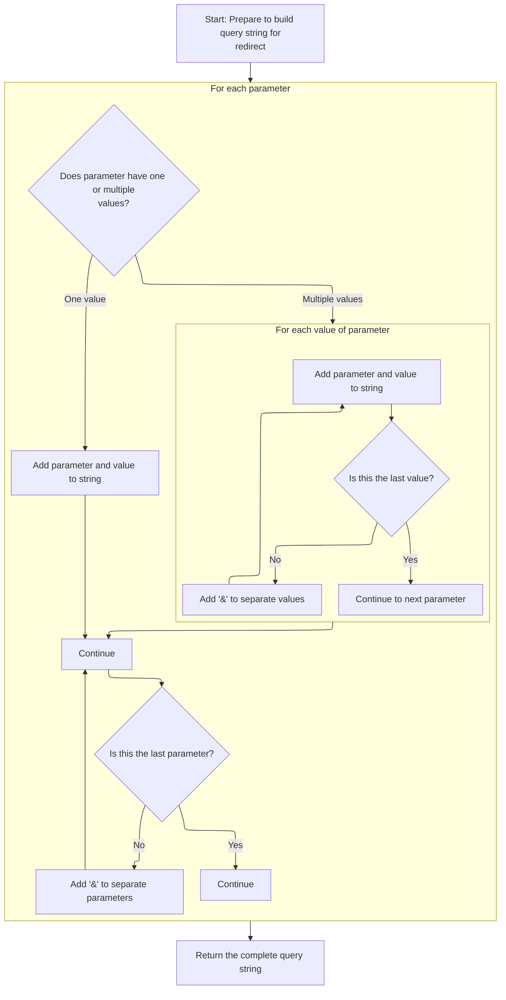

<SwmSnippet path="/core/src/main/java/org/apache/struts/action/ActionRedirect.java" line="295">

---

GetParameterString loops through the <SwmToken path="core/src/main/java/org/apache/struts/action/ActionRedirect.java" pos="299:7:7" line-data="        Iterator iterator = parameterValues.keySet().iterator();">`parameterValues`</SwmToken> map and builds a query string. It handles both single values and arrays, so you get a standard URL parameter string for the redirect.

```java
    public String getParameterString() {
        StringBuffer strParam = new StringBuffer(DEFAULT_BUFFER_SIZE);

        // loop through all parameters
        Iterator iterator = parameterValues.keySet().iterator();

        while (iterator.hasNext()) {
            // get the parameter name
            String paramName = (String) iterator.next();

            // get the value for this parameter
            Object value = parameterValues.get(paramName);

            if (value instanceof String) {
                // just one value for this param
                strParam.append(paramName).append("=").append(value);
            } else if (value instanceof String[]) {
                // loop through all values for this param
                String[] values = (String[]) value;

                for (int i = 0; i < values.length; i++) {
                    strParam.append(paramName).append("=").append(values[i]);

                    if (i < (values.length - 1)) {
                        strParam.append("&");
                    }
                }
            }

            if (iterator.hasNext()) {
                strParam.append("&");
            }
        }
```

---

</SwmSnippet>

<SwmSnippet path="/core/src/main/java/org/apache/struts/action/ActionRedirect.java" line="329">

---

Once we've built the parameter string, we return it so it can be appended to the redirect path. This forms the full URL for the redirect.

```java
        return strParam.toString();
    }
```

---

</SwmSnippet>

### String Representation of Redirect

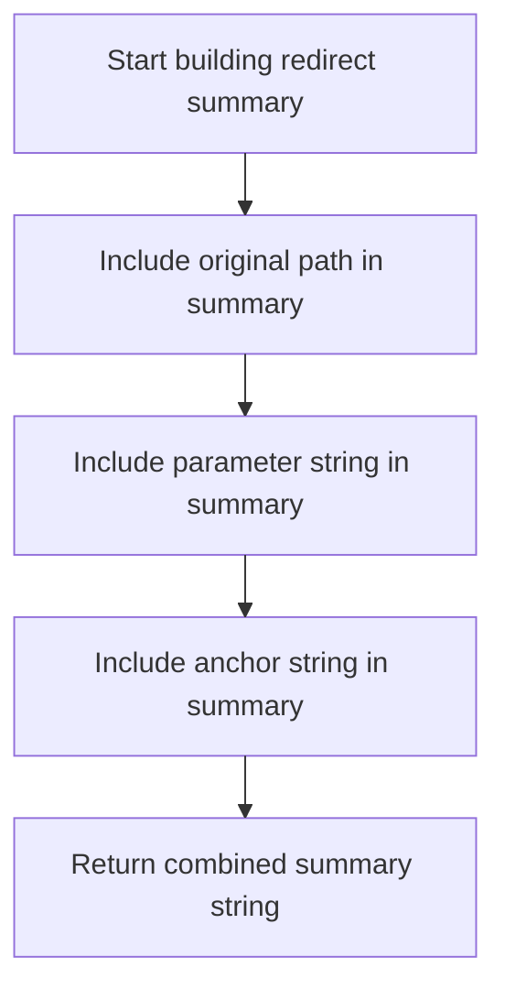

<SwmSnippet path="/core/src/main/java/org/apache/struts/action/ActionRedirect.java" line="340">

---

ToString builds a string representation of the <SwmToken path="core/src/main/java/org/apache/struts/action/ActionRedirect.java" pos="343:6:6" line-data="        result.append(&quot;ActionRedirect [&quot;);">`ActionRedirect`</SwmToken>, including the original path and parameter string. This is mainly for debugging or logging so you can see the full redirect details.

```java
    public String toString() {
        StringBuffer result = new StringBuffer(DEFAULT_BUFFER_SIZE);

        result.append("ActionRedirect [");
        result.append("originalPath=").append(getOriginalPath()).append(";");
```

---

</SwmSnippet>

<SwmSnippet path="/core/src/main/java/org/apache/struts/action/ActionRedirect.java" line="345">

---

After formatting the redirect details, we include the parameter string and anchor string in the output so it's easy to debug or log the full redirect info.

```java
        result.append("parameterString=").append(getParameterString()).append("]");
```

---

</SwmSnippet>

<SwmSnippet path="/core/src/main/java/org/apache/struts/action/ActionRedirect.java" line="346">

---

After building the redirect path and parameters, we append the anchor string so the final URL includes any fragment identifier for client navigation.

```java
        result.append("anchorString=").append(getAnchorString()).append("]");

        return result.toString();
    }
```

---

</SwmSnippet>

### Finalizing the Redirect URL

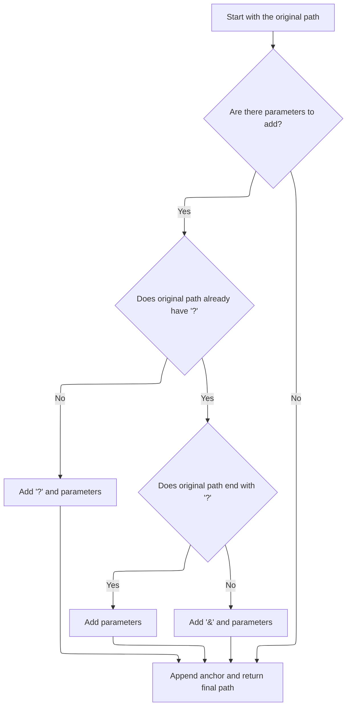

<SwmSnippet path="/core/src/main/java/org/apache/struts/action/ActionRedirect.java" line="234">

---

When finalizing the redirect URL, we check if the original path already has a '?', so we know whether to use '&' or '?' for appending parameters. Then we add the anchor string at the end.

```java
        String anchorString = getAnchorString();

        StringBuffer result = new StringBuffer(originalPath);

        if ((parameterString != null) && (parameterString.length() > 0)) {
            // the parameter separator we're going to use
            String paramSeparator = "?";

            // true if we need to use a parameter separator after originalPath
            boolean needsParamSeparator = true;

            // does the original path already have a "?"?
            int paramStartIndex = originalPath.indexOf("?");

            if (paramStartIndex > 0) {
                // did the path end with "?"?
                needsParamSeparator = (paramStartIndex != (originalPath.length()
                    - 1));

                if (needsParamSeparator) {
                    paramSeparator = "&";
                }
            }

            if (needsParamSeparator) {
                result.append(paramSeparator);
            }

            result.append(parameterString);
        }

        // append anchor string (or blank if none was set)
        result.append(anchorString);


        return result.toString();
    }
```

---

</SwmSnippet>

## Handling Unknown Dispatch Results

<SwmSnippet path="/core/src/main/java/org/apache/struts/chain/commands/ExecuteDispatcher.java" line="182">

---

If the dispatch result is an unknown type, we throw an <SwmToken path="core/src/main/java/org/apache/struts/chain/commands/ExecuteDispatcher.java" pos="183:5:5" line-data="        throw new IllegalStateException(&quot;Unknown dispatch return type: &quot; + result.getClass().getName());">`IllegalStateException`</SwmToken> so the flow stops and doesn't try to handle something unexpected.

```java
        // Unknown result type
        throw new IllegalStateException("Unknown dispatch return type: " + result.getClass().getName());
    }
```

---

</SwmSnippet>

&nbsp;

*This is an auto-generated document by Swimm 🌊 and has not yet been verified by a human*

<SwmMeta version="3.0.0" repo-id="Z2l0aHViJTNBJTNBc3RydXRzMSUzQSUzQVN3aW1tLURlbW8=" repo-name="struts1"><sup>Powered by [Swimm](https://app.swimm.io/)</sup></SwmMeta>
