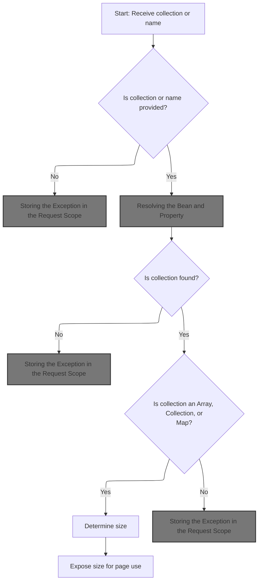
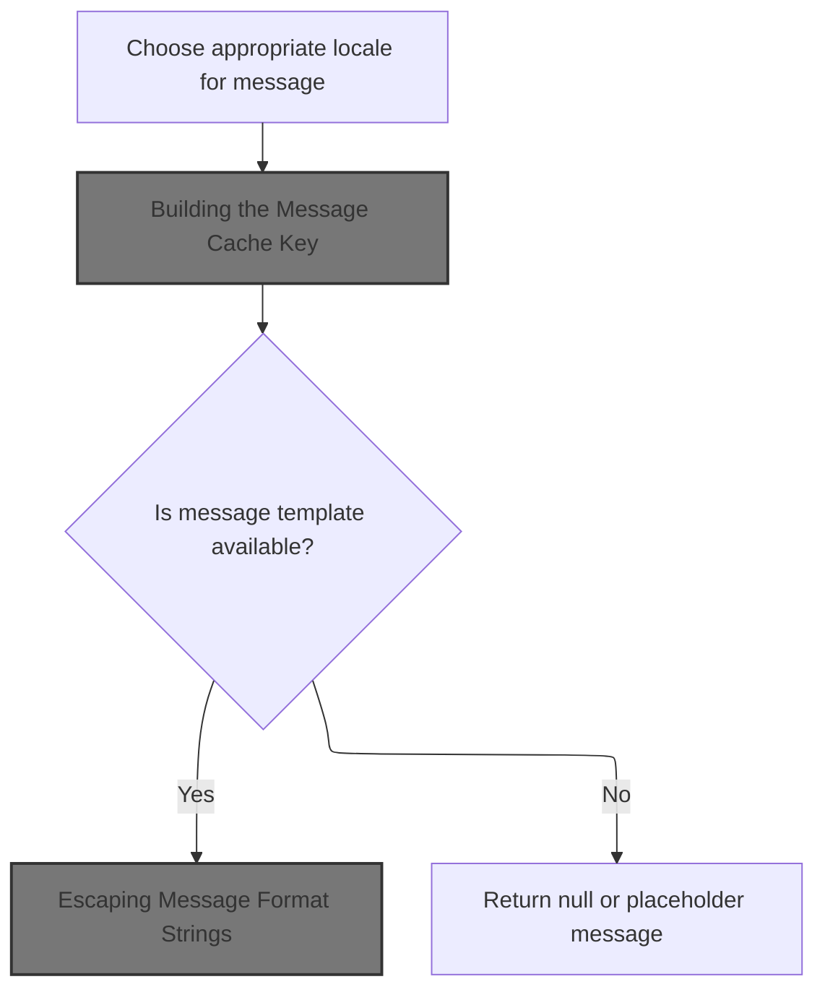
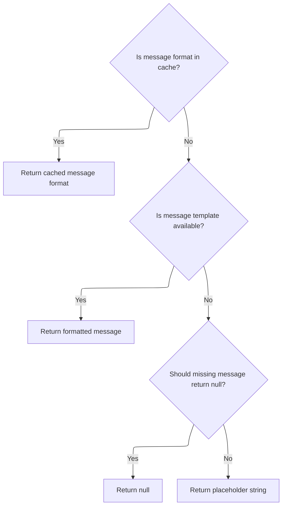
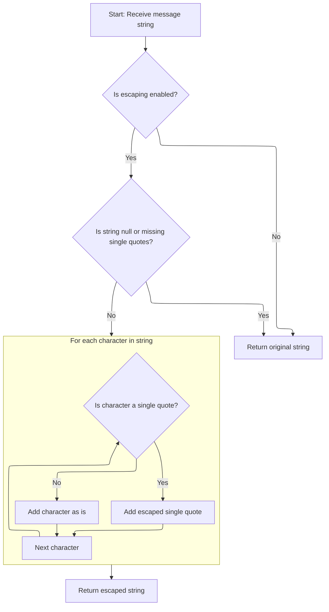
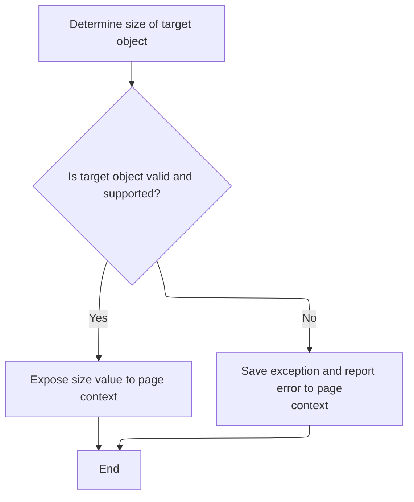
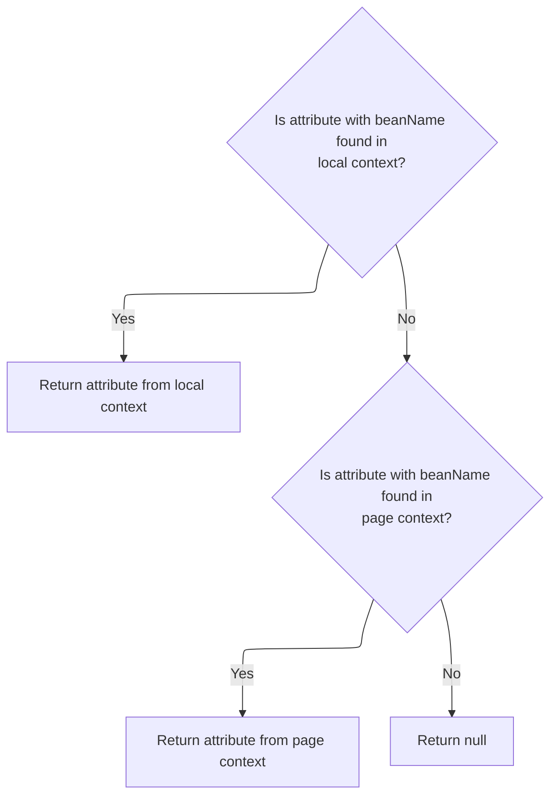
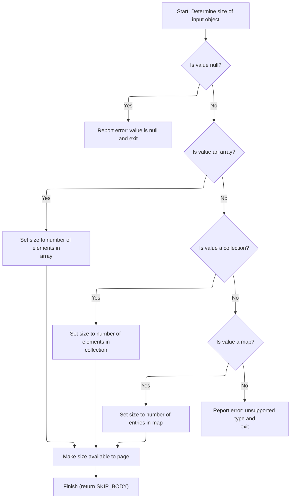

This document explains how the system makes the size of a collection, array, or map available for use in dynamic JSP pages. By supporting both direct collections and bean properties as sources, this flow allows page logic to adapt based on the size of data structures.

# Determining the Collection Source



<SwmSnippet path="/taglib/src/main/java/org/apache/struts/taglib/bean/SizeTag.java" line="125">

---

In <SwmToken path="taglib/src/main/java/org/apache/struts/taglib/bean/SizeTag.java" pos="125:5:5" line-data="    public int doStartTag() throws JspException {">`doStartTag`</SwmToken>, we first check if the 'collection' attribute is set. If not, and 'name' is also missing, we throw an exception with a localized error message. The next step is to fetch this error message from <SwmToken path="taglib/src/main/java/org/apache/struts/taglib/bean/SizeTag.java" pos="24:10:10" line-data="import org.apache.struts.util.MessageResources;">`MessageResources`</SwmToken>, which is why we call into that class next.

```java
    public int doStartTag() throws JspException {
        // Retrieve the required property value
        Object value = this.collection;

        if (value == null) {
            if (name == null) {
                // Must specify either a collection attribute or a name
                // attribute.
                JspException e =
                    new JspException(messages.getMessage(
                            "size.noCollectionOrName"));

```

---

</SwmSnippet>

## Fetching a Localized Message String

<SwmSnippet path="/core/src/main/java/org/apache/struts/util/MessageResources.java" line="196">

---

<SwmToken path="core/src/main/java/org/apache/struts/util/MessageResources.java" pos="196:5:10" line-data="    public String getMessage(String key) {">`getMessage(String key)`</SwmToken> just hands off to the main message retrieval method, passing null for locale and arguments. This keeps all the logic in one place.

```java
    public String getMessage(String key) {
        return this.getMessage((Locale) null, key, null);
    }
```

---

</SwmSnippet>

## Convenience Overload for Single Argument

<SwmSnippet path="/core/src/main/java/org/apache/struts/util/MessageResources.java" line="324">

---

<SwmToken path="core/src/main/java/org/apache/struts/util/MessageResources.java" pos="324:5:20" line-data="    public String getMessage(Locale locale, String key, Object arg0) {">`getMessage(Locale locale, String key, Object arg0)`</SwmToken> just wraps the argument in an array and calls the main message retrieval method. It's a shortcut for the common case of one argument.

```java
    public String getMessage(Locale locale, String key, Object arg0) {
        return this.getMessage(locale, key, new Object[] { arg0 });
    }
```

---

</SwmSnippet>

## Formatting and Caching the Message



<SwmSnippet path="/core/src/main/java/org/apache/struts/util/MessageResources.java" line="286">

---

In <SwmToken path="core/src/main/java/org/apache/struts/util/MessageResources.java" pos="286:5:5" line-data="    public String getMessage(Locale locale, String key, Object[] args) {">`getMessage`</SwmToken>`(`<SwmToken path="core/src/main/java/org/apache/struts/util/MessageResources.java" pos="286:7:7" line-data="    public String getMessage(Locale locale, String key, Object[] args) {">`Locale`</SwmToken>`, `<SwmToken path="core/src/main/java/org/apache/struts/util/MessageResources.java" pos="286:3:3" line-data="    public String getMessage(Locale locale, String key, Object[] args) {">`String`</SwmToken>`, `<SwmToken path="core/src/main/java/org/apache/struts/util/MessageResources.java" pos="286:17:17" line-data="    public String getMessage(Locale locale, String key, Object[] args) {">`Object`</SwmToken>`[])`, we prep for message formatting: set the locale, build a cache key, and check if we already have a <SwmToken path="core/src/main/java/org/apache/struts/util/MessageResources.java" pos="287:5:5" line-data="        // Cache MessageFormat instances as they are accessed">`MessageFormat`</SwmToken> for this combo. If not, we need to generate one, which means calling <SwmToken path="core/src/main/java/org/apache/struts/util/MessageResources.java" pos="293:7:7" line-data="        String formatKey = messageKey(locale, key);">`messageKey`</SwmToken> next.

```java
    public String getMessage(Locale locale, String key, Object[] args) {
        // Cache MessageFormat instances as they are accessed
        if (locale == null) {
            locale = defaultLocale;
        }

        MessageFormat format = null;
        String formatKey = messageKey(locale, key);

```

---

</SwmSnippet>

### Building the Message Cache Key

<SwmSnippet path="/core/src/main/java/org/apache/struts/util/MessageResources.java" line="460">

---

<SwmToken path="core/src/main/java/org/apache/struts/util/MessageResources.java" pos="460:5:5" line-data="    protected String messageKey(Locale locale, String key) {">`messageKey`</SwmToken>`(`<SwmToken path="core/src/main/java/org/apache/struts/util/MessageResources.java" pos="460:7:7" line-data="    protected String messageKey(Locale locale, String key) {">`Locale`</SwmToken>`, `<SwmToken path="core/src/main/java/org/apache/struts/util/MessageResources.java" pos="460:3:3" line-data="    protected String messageKey(Locale locale, String key) {">`String`</SwmToken>`)` builds a unique cache key by joining the locale string and the message key with a dot. This lets us store and retrieve the right <SwmToken path="core/src/main/java/org/apache/struts/util/MessageResources.java" pos="287:5:5" line-data="        // Cache MessageFormat instances as they are accessed">`MessageFormat`</SwmToken> for each locale/key combo.

```java
    protected String messageKey(Locale locale, String key) {
        return (localeKey(locale) + "." + key);
    }
```

---

</SwmSnippet>

<SwmSnippet path="/core/src/main/java/org/apache/struts/util/MessageResources.java" line="449">

---

<SwmToken path="core/src/main/java/org/apache/struts/util/MessageResources.java" pos="449:5:5" line-data="    protected String localeKey(Locale locale) {">`localeKey`</SwmToken>`(`<SwmToken path="core/src/main/java/org/apache/struts/util/MessageResources.java" pos="449:7:7" line-data="    protected String localeKey(Locale locale) {">`Locale`</SwmToken>`)` returns an empty string if the locale is null, otherwise it just uses <SwmToken path="core/src/main/java/org/apache/struts/util/MessageResources.java" pos="450:18:22" line-data="        return (locale == null) ? &quot;&quot; : locale.toString();">`locale.toString()`</SwmToken>. No surprises here.

```java
    protected String localeKey(Locale locale) {
        return (locale == null) ? "" : locale.toString();
    }
```

---

</SwmSnippet>

### Retrieving and Preparing the Message Format



<SwmSnippet path="/core/src/main/java/org/apache/struts/util/MessageResources.java" line="295">

---

Back in <SwmToken path="core/src/main/java/org/apache/struts/util/MessageResources.java" pos="299:7:7" line-data="                String formatString = getMessage(locale, key);">`getMessage`</SwmToken>`(`<SwmToken path="core/src/main/java/org/apache/struts/util/MessageResources.java" pos="197:8:8" line-data="        return this.getMessage((Locale) null, key, null);">`Locale`</SwmToken>`, `<SwmToken path="core/src/main/java/org/apache/struts/util/MessageResources.java" pos="299:1:1" line-data="                String formatString = getMessage(locale, key);">`String`</SwmToken>`, `<SwmToken path="taglib/src/main/java/org/apache/struts/taglib/bean/SizeTag.java" pos="127:1:1" line-data="        Object value = this.collection;">`Object`</SwmToken>`[])`, after building the cache key, we synchronize on the formats cache to safely check for an existing <SwmToken path="core/src/main/java/org/apache/struts/util/MessageResources.java" pos="296:6:6" line-data="            format = (MessageFormat) formats.get(formatKey);">`MessageFormat`</SwmToken>. If the format isn't cached, we fetch the message string. If it's missing, we either return null or a placeholder string, depending on the <SwmToken path="core/src/main/java/org/apache/struts/util/MessageResources.java" pos="302:3:3" line-data="                    return returnNull ? null : (&quot;???&quot; + formatKey + &quot;???&quot;);">`returnNull`</SwmToken> flag. If found, we escape the format string next.

```java
        synchronized (formats) {
            format = (MessageFormat) formats.get(formatKey);

            if (format == null) {
                String formatString = getMessage(locale, key);

                if (formatString == null) {
                    return returnNull ? null : ("???" + formatKey + "???");
                }

                format = new MessageFormat(escape(formatString));
```

---

</SwmSnippet>

### Escaping Message Format Strings



<SwmSnippet path="/core/src/main/java/org/apache/struts/util/MessageResources.java" line="417">

---

In <SwmToken path="core/src/main/java/org/apache/struts/util/MessageResources.java" pos="417:5:5" line-data="    protected String escape(String string) {">`escape`</SwmToken>`(`<SwmToken path="core/src/main/java/org/apache/struts/util/MessageResources.java" pos="417:3:3" line-data="    protected String escape(String string) {">`String`</SwmToken>`)`, we check if escaping is enabled (via <SwmToken path="core/src/main/java/org/apache/struts/util/MessageResources.java" pos="418:5:7" line-data="        if (!isEscape()) {">`isEscape()`</SwmToken>). If not, or if there are no single quotes, we just return the string. Otherwise, we prep to escape single quotes.

```java
    protected String escape(String string) {
        if (!isEscape()) {
            return string;
        }

        if ((string == null) || (string.indexOf('\'') < 0)) {
            return string;
        }

```

---

</SwmSnippet>

<SwmSnippet path="/core/src/main/java/org/apache/struts/util/MessageResources.java" line="175">

---

<SwmToken path="core/src/main/java/org/apache/struts/util/MessageResources.java" pos="175:5:7" line-data="    public boolean isEscape() {">`isEscape()`</SwmToken> just returns the current value of the escape flag. Nothing fancy.

```java
    public boolean isEscape() {
        return escape;
    }
```

---

</SwmSnippet>

<SwmSnippet path="/core/src/main/java/org/apache/struts/util/MessageResources.java" line="426">

---

Back from <SwmToken path="core/src/main/java/org/apache/struts/util/MessageResources.java" pos="176:3:3" line-data="        return escape;">`escape`</SwmToken>`(`<SwmToken path="core/src/main/java/org/apache/struts/util/MessageResources.java" pos="196:3:3" line-data="    public String getMessage(String key) {">`String`</SwmToken>`)`, we loop through the string, doubling any single quotes we find. The result is a string safe for <SwmToken path="core/src/main/java/org/apache/struts/util/MessageResources.java" pos="287:5:5" line-data="        // Cache MessageFormat instances as they are accessed">`MessageFormat`</SwmToken>.

```java
        int n = string.length();
        StringBuffer sb = new StringBuffer(n);

        for (int i = 0; i < n; i++) {
            char ch = string.charAt(i);

            if (ch == '\'') {
                sb.append('\'');
            }

            sb.append(ch);
        }
```

---

</SwmSnippet>

### Finalizing and Returning the Formatted Message

<SwmSnippet path="/core/src/main/java/org/apache/struts/util/MessageResources.java" line="306">

---

Back from <SwmToken path="core/src/main/java/org/apache/struts/util/MessageResources.java" pos="176:3:3" line-data="        return escape;">`escape`</SwmToken>`(`<SwmToken path="core/src/main/java/org/apache/struts/util/MessageResources.java" pos="196:3:3" line-data="    public String getMessage(String key) {">`String`</SwmToken>`)`, we set the locale on the <SwmToken path="core/src/main/java/org/apache/struts/util/MessageResources.java" pos="287:5:5" line-data="        // Cache MessageFormat instances as they are accessed">`MessageFormat`</SwmToken>, cache it, and finally format the message with the provided arguments. The result is returned to the caller. Next, we move to <SwmToken path="taglib/src/main/java/org/apache/struts/taglib/html/ErrorsTag.java" pos="62:4:4" line-data="public class ErrorsTag extends TagSupport {">`ErrorsTag`</SwmToken> to handle locale assignment for error display.

```java
                format.setLocale(locale);
                formats.put(formatKey, format);
            }
        }

        return format.format(args);
    }
```

---

</SwmSnippet>

<SwmSnippet path="/taglib/src/main/java/org/apache/struts/taglib/html/ErrorsTag.java" line="125">

---

<SwmToken path="taglib/src/main/java/org/apache/struts/taglib/html/ErrorsTag.java" pos="125:5:10" line-data="    public void setLocale(String locale) {">`setLocale(String locale)`</SwmToken> just assigns the locale string to the instance variable. No extra logic.

```java
    public void setLocale(String locale) {
        this.locale = locale;
    }
```

---

</SwmSnippet>

## Handling Exception and Fallback Lookup



<SwmSnippet path="/taglib/src/main/java/org/apache/struts/taglib/bean/SizeTag.java" line="137">

---

Back in <SwmToken path="taglib/src/main/java/org/apache/struts/taglib/bean/SizeTag.java" pos="125:5:5" line-data="    public int doStartTag() throws JspException {">`doStartTag`</SwmToken>, after getting the error message from <SwmToken path="taglib/src/main/java/org/apache/struts/taglib/bean/SizeTag.java" pos="24:10:10" line-data="import org.apache.struts.util.MessageResources;">`MessageResources`</SwmToken>, we call <SwmToken path="taglib/src/main/java/org/apache/struts/taglib/bean/SizeTag.java" pos="137:1:5" line-data="                TagUtils.getInstance().saveException(pageContext, e);">`TagUtils.getInstance()`</SwmToken><SwmToken path="taglib/src/main/java/org/apache/struts/taglib/bean/SizeTag.java" pos="137:6:7" line-data="                TagUtils.getInstance().saveException(pageContext, e);">`.saveException`</SwmToken> to store the exception in the page context for error reporting.

```java
                TagUtils.getInstance().saveException(pageContext, e);
```

---

</SwmSnippet>

<SwmSnippet path="/taglib/src/main/java/org/apache/struts/taglib/TagUtils.java" line="150">

---

<SwmToken path="taglib/src/main/java/org/apache/struts/taglib/TagUtils.java" pos="150:7:9" line-data="    public static TagUtils getInstance() {">`getInstance()`</SwmToken> returns the singleton <SwmToken path="taglib/src/main/java/org/apache/struts/taglib/TagUtils.java" pos="150:5:5" line-data="    public static TagUtils getInstance() {">`TagUtils`</SwmToken> instance. This is just standard singleton pattern usage.

```java
    public static TagUtils getInstance() {
        return instance;
    }
```

---

</SwmSnippet>

<SwmSnippet path="/taglib/src/main/java/org/apache/struts/taglib/bean/SizeTag.java" line="137">

---

Back in <SwmToken path="taglib/src/main/java/org/apache/struts/taglib/bean/SizeTag.java" pos="125:5:5" line-data="    public int doStartTag() throws JspException {">`doStartTag`</SwmToken>, after getting the <SwmToken path="taglib/src/main/java/org/apache/struts/taglib/bean/SizeTag.java" pos="137:1:1" line-data="                TagUtils.getInstance().saveException(pageContext, e);">`TagUtils`</SwmToken> instance, we call <SwmToken path="taglib/src/main/java/org/apache/struts/taglib/bean/SizeTag.java" pos="137:7:7" line-data="                TagUtils.getInstance().saveException(pageContext, e);">`saveException`</SwmToken> to store the exception, then immediately throw it to signal the error up the stack.

```java
                TagUtils.getInstance().saveException(pageContext, e);
                throw e;
            }

```

---

</SwmSnippet>

## Storing the Exception in the Request Scope

<SwmSnippet path="/tiles/src/main/java/org/apache/struts/tiles/taglib/util/TagUtils.java" line="301">

---

<SwmToken path="tiles/src/main/java/org/apache/struts/tiles/taglib/util/TagUtils.java" pos="301:7:7" line-data="    public static void saveException(PageContext pageContext, Throwable exception) {">`saveException`</SwmToken>`(`<SwmToken path="tiles/src/main/java/org/apache/struts/tiles/taglib/util/TagUtils.java" pos="301:9:9" line-data="    public static void saveException(PageContext pageContext, Throwable exception) {">`PageContext`</SwmToken>`, `<SwmToken path="tiles/src/main/java/org/apache/struts/tiles/taglib/util/TagUtils.java" pos="301:14:14" line-data="    public static void saveException(PageContext pageContext, Throwable exception) {">`Throwable`</SwmToken>`)` puts the exception in the request scope under <SwmToken path="tiles/src/main/java/org/apache/struts/tiles/taglib/util/TagUtils.java" pos="302:5:7" line-data="        pageContext.setAttribute(Globals.EXCEPTION_KEY, exception, PageContext.REQUEST_SCOPE);">`Globals.EXCEPTION_KEY`</SwmToken>. This makes it available for error handling in the current request.

```java
    public static void saveException(PageContext pageContext, Throwable exception) {
        pageContext.setAttribute(Globals.EXCEPTION_KEY, exception, PageContext.REQUEST_SCOPE);
    }
```

---

</SwmSnippet>

<SwmSnippet path="/tiles/src/main/java/org/apache/struts/tiles/taglib/util/TagUtils.java" line="290">

---

<SwmToken path="tiles/src/main/java/org/apache/struts/tiles/taglib/util/TagUtils.java" pos="290:7:7" line-data="    public static void setAttribute(PageContext pageContext, String name, Object beanValue)">`setAttribute`</SwmToken>`(`<SwmToken path="tiles/src/main/java/org/apache/struts/tiles/taglib/util/TagUtils.java" pos="290:9:9" line-data="    public static void setAttribute(PageContext pageContext, String name, Object beanValue)">`PageContext`</SwmToken>`, `<SwmToken path="tiles/src/main/java/org/apache/struts/tiles/taglib/util/TagUtils.java" pos="290:14:14" line-data="    public static void setAttribute(PageContext pageContext, String name, Object beanValue)">`String`</SwmToken>`, `<SwmToken path="tiles/src/main/java/org/apache/struts/tiles/taglib/util/TagUtils.java" pos="290:19:19" line-data="    public static void setAttribute(PageContext pageContext, String name, Object beanValue)">`Object`</SwmToken>`)` just sets the attribute in the request scope. It's a thin wrapper for convenience.

```java
    public static void setAttribute(PageContext pageContext, String name, Object beanValue)
        throws JspException {
        pageContext.setAttribute(name, beanValue, PageContext.REQUEST_SCOPE);
    }
```

---

</SwmSnippet>

## Fallback to Bean Property Lookup

<SwmSnippet path="/taglib/src/main/java/org/apache/struts/taglib/bean/SizeTag.java" line="141">

---

Back in <SwmToken path="taglib/src/main/java/org/apache/struts/taglib/bean/SizeTag.java" pos="125:5:5" line-data="    public int doStartTag() throws JspException {">`doStartTag`</SwmToken>, after saving the exception, we try to look up the value using <SwmToken path="taglib/src/main/java/org/apache/struts/taglib/bean/SizeTag.java" pos="142:1:5" line-data="                TagUtils.getInstance().lookup(pageContext, name, property, scope);">`TagUtils.getInstance()`</SwmToken>.lookup, falling back to a bean property if the direct collection wasn't set.

```java
            value =
                TagUtils.getInstance().lookup(pageContext, name, property, scope);
```

---

</SwmSnippet>

<SwmSnippet path="/taglib/src/main/java/org/apache/struts/taglib/bean/SizeTag.java" line="142">

---

Back in <SwmToken path="taglib/src/main/java/org/apache/struts/taglib/bean/SizeTag.java" pos="125:5:5" line-data="    public int doStartTag() throws JspException {">`doStartTag`</SwmToken>, after the exception handling, we use <SwmToken path="taglib/src/main/java/org/apache/struts/taglib/bean/SizeTag.java" pos="142:1:5" line-data="                TagUtils.getInstance().lookup(pageContext, name, property, scope);">`TagUtils.getInstance()`</SwmToken>.lookup to fetch the value by name and property from the page context. This lets the tag work with either a direct collection or a bean property.

```java
                TagUtils.getInstance().lookup(pageContext, name, property, scope);
        }

```

---

</SwmSnippet>

## Resolving the Bean and Property

<SwmSnippet path="/taglib/src/main/java/org/apache/struts/taglib/TagUtils.java" line="897">

---

In <SwmToken path="taglib/src/main/java/org/apache/struts/taglib/TagUtils.java" pos="925:12:12" line-data="            throw new JspException(messages.getMessage(&quot;lookup.access&quot;,">`lookup`</SwmToken>`(`<SwmToken path="taglib/src/main/java/org/apache/struts/taglib/TagUtils.java" pos="897:7:7" line-data="    public Object lookup(PageContext pageContext, String name, String property,">`PageContext`</SwmToken>`, `<SwmToken path="taglib/src/main/java/org/apache/struts/taglib/TagUtils.java" pos="897:12:12" line-data="    public Object lookup(PageContext pageContext, String name, String property,">`String`</SwmToken>`, `<SwmToken path="taglib/src/main/java/org/apache/struts/taglib/TagUtils.java" pos="897:12:12" line-data="    public Object lookup(PageContext pageContext, String name, String property,">`String`</SwmToken>`, `<SwmToken path="taglib/src/main/java/org/apache/struts/taglib/TagUtils.java" pos="897:12:12" line-data="    public Object lookup(PageContext pageContext, String name, String property,">`String`</SwmToken>`)`, we first try to find the bean by name and scope. If it's not found, we throw a <SwmToken path="taglib/src/main/java/org/apache/struts/taglib/TagUtils.java" pos="898:8:8" line-data="        String scope) throws JspException {">`JspException`</SwmToken> with a localized error message, which means we need to call <SwmToken path="taglib/src/main/java/org/apache/struts/taglib/bean/SizeTag.java" pos="24:10:10" line-data="import org.apache.struts.util.MessageResources;">`MessageResources`</SwmToken> next to get the message.

```java
    public Object lookup(PageContext pageContext, String name, String property,
        String scope) throws JspException {
        // Look up the requested bean, and return if requested
        Object bean = lookup(pageContext, name, scope);

        if (bean == null) {
            JspException e = null;

            if (scope == null) {
                e = new JspException(messages.getMessage("lookup.bean.any", name));
            } else {
```

---

</SwmSnippet>

<SwmSnippet path="/core/src/main/java/org/apache/struts/util/MessageResources.java" line="218">

---

<SwmToken path="core/src/main/java/org/apache/struts/util/MessageResources.java" pos="218:5:15" line-data="    public String getMessage(String key, Object arg0) {">`getMessage(String key, Object arg0)`</SwmToken> just delegates to the main message retrieval method, passing null for locale and wrapping the argument as needed.

```java
    public String getMessage(String key, Object arg0) {
        return this.getMessage((Locale) null, key, arg0);
    }
```

---

</SwmSnippet>

<SwmSnippet path="/taglib/src/main/java/org/apache/struts/taglib/TagUtils.java" line="908">

---

Back in <SwmToken path="taglib/src/main/java/org/apache/struts/taglib/TagUtils.java" pos="908:14:14" line-data="                e = new JspException(messages.getMessage(&quot;lookup.bean&quot;, name,">`lookup`</SwmToken>, after getting the error message from <SwmToken path="taglib/src/main/java/org/apache/struts/taglib/bean/SizeTag.java" pos="24:10:10" line-data="import org.apache.struts.util.MessageResources;">`MessageResources`</SwmToken>, we use it to create a <SwmToken path="taglib/src/main/java/org/apache/struts/taglib/TagUtils.java" pos="908:7:7" line-data="                e = new JspException(messages.getMessage(&quot;lookup.bean&quot;, name,">`JspException`</SwmToken> if the bean isn't found. If a scope is specified, we include it in the message.

```java
                e = new JspException(messages.getMessage("lookup.bean", name,
                            scope));
            }

```

---

</SwmSnippet>

<SwmSnippet path="/taglib/src/main/java/org/apache/struts/taglib/TagUtils.java" line="912">

---

Back in <SwmToken path="taglib/src/main/java/org/apache/struts/taglib/bean/SizeTag.java" pos="142:7:7" line-data="                TagUtils.getInstance().lookup(pageContext, name, property, scope);">`lookup`</SwmToken>, after preparing the exception, we call <SwmToken path="taglib/src/main/java/org/apache/struts/taglib/TagUtils.java" pos="912:1:1" line-data="            saveException(pageContext, e);">`saveException`</SwmToken> to store it in the request scope, then throw it to signal the error.

```java
            saveException(pageContext, e);
            throw e;
        }

        if (property == null) {
            return bean;
        }

```

---

</SwmSnippet>

<SwmSnippet path="/taglib/src/main/java/org/apache/struts/taglib/TagUtils.java" line="1170">

---

<SwmToken path="taglib/src/main/java/org/apache/struts/taglib/TagUtils.java" pos="1170:5:5" line-data="    public void saveException(PageContext pageContext, Throwable exception) {">`saveException`</SwmToken>`(`<SwmToken path="taglib/src/main/java/org/apache/struts/taglib/TagUtils.java" pos="1170:7:7" line-data="    public void saveException(PageContext pageContext, Throwable exception) {">`PageContext`</SwmToken>`, `<SwmToken path="taglib/src/main/java/org/apache/struts/taglib/TagUtils.java" pos="1170:12:12" line-data="    public void saveException(PageContext pageContext, Throwable exception) {">`Throwable`</SwmToken>`)` puts the exception in the request scope under <SwmToken path="taglib/src/main/java/org/apache/struts/taglib/TagUtils.java" pos="1171:5:7" line-data="        pageContext.setAttribute(Globals.EXCEPTION_KEY, exception,">`Globals.EXCEPTION_KEY`</SwmToken>. This makes it available for error handling in the current request.

```java
    public void saveException(PageContext pageContext, Throwable exception) {
        pageContext.setAttribute(Globals.EXCEPTION_KEY, exception,
            PageContext.REQUEST_SCOPE);
    }
```

---

</SwmSnippet>

<SwmSnippet path="/taglib/src/main/java/org/apache/struts/taglib/TagUtils.java" line="920">

---

Back in <SwmToken path="taglib/src/main/java/org/apache/struts/taglib/bean/SizeTag.java" pos="142:7:7" line-data="                TagUtils.getInstance().lookup(pageContext, name, property, scope);">`lookup`</SwmToken>, if the bean is found and a property is specified, we use <SwmToken path="taglib/src/main/java/org/apache/struts/taglib/TagUtils.java" pos="922:3:5" line-data="            return PropertyUtils.getProperty(bean, property);">`PropertyUtils.getProperty`</SwmToken> to fetch the property value. This is where NestedPropertyTag.getProperty comes in if the property is nested.

```java
        // Locate and return the specified property
        try {
            return PropertyUtils.getProperty(bean, property);
```

---

</SwmSnippet>

<SwmSnippet path="/taglib/src/main/java/org/apache/struts/taglib/nested/NestedPropertyTag.java" line="64">

---

<SwmToken path="taglib/src/main/java/org/apache/struts/taglib/nested/NestedPropertyTag.java" pos="64:5:7" line-data="    public String getProperty() {">`getProperty()`</SwmToken> just returns the value of the property field. No extra logic.

```java
    public String getProperty() {
        return this.property;
    }
```

---

</SwmSnippet>

<SwmSnippet path="/taglib/src/main/java/org/apache/struts/taglib/TagUtils.java" line="923">

---

Back in <SwmToken path="taglib/src/main/java/org/apache/struts/taglib/bean/SizeTag.java" pos="142:7:7" line-data="                TagUtils.getInstance().lookup(pageContext, name, property, scope);">`lookup`</SwmToken>, after getting the property value, we handle any <SwmToken path="taglib/src/main/java/org/apache/struts/taglib/TagUtils.java" pos="923:6:6" line-data="        } catch (IllegalAccessException e) {">`IllegalAccessException`</SwmToken> by saving the exception and preparing to throw a <SwmToken path="taglib/src/main/java/org/apache/struts/taglib/bean/SizeTag.java" pos="125:11:11" line-data="    public int doStartTag() throws JspException {">`JspException`</SwmToken> with a localized message.

```java
        } catch (IllegalAccessException e) {
            saveException(pageContext, e);
```

---

</SwmSnippet>

<SwmSnippet path="/taglib/src/main/java/org/apache/struts/taglib/TagUtils.java" line="925">

---

Back in <SwmToken path="taglib/src/main/java/org/apache/struts/taglib/TagUtils.java" pos="925:12:12" line-data="            throw new JspException(messages.getMessage(&quot;lookup.access&quot;,">`lookup`</SwmToken>, if we catch an <SwmToken path="taglib/src/main/java/org/apache/struts/taglib/TagUtils.java" pos="923:6:6" line-data="        } catch (IllegalAccessException e) {">`IllegalAccessException`</SwmToken>, we call <SwmToken path="taglib/src/main/java/org/apache/struts/taglib/bean/SizeTag.java" pos="137:7:7" line-data="                TagUtils.getInstance().saveException(pageContext, e);">`saveException`</SwmToken> and then use MessageResources.getMessage to build the error message for the <SwmToken path="taglib/src/main/java/org/apache/struts/taglib/TagUtils.java" pos="925:5:5" line-data="            throw new JspException(messages.getMessage(&quot;lookup.access&quot;,">`JspException`</SwmToken>.

```java
            throw new JspException(messages.getMessage("lookup.access",
                    property, name), e);
        } catch (IllegalArgumentException e) {
```

---

</SwmSnippet>

<SwmSnippet path="/taglib/src/main/java/org/apache/struts/taglib/TagUtils.java" line="928">

---

After getting the error message from <SwmToken path="taglib/src/main/java/org/apache/struts/taglib/bean/SizeTag.java" pos="24:10:10" line-data="import org.apache.struts.util.MessageResources;">`MessageResources`</SwmToken>, we call `TagUtils.saveException` to stash the exception in the page context. This makes it available for error handling downstream.

```java
            saveException(pageContext, e);
```

---

</SwmSnippet>

<SwmSnippet path="/taglib/src/main/java/org/apache/struts/taglib/TagUtils.java" line="929">

---

After saving the exception, `TagUtils.lookup` throws a <SwmToken path="taglib/src/main/java/org/apache/struts/taglib/TagUtils.java" pos="929:5:5" line-data="            throw new JspException(messages.getMessage(&quot;lookup.argument&quot;,">`JspException`</SwmToken> with a localized message from <SwmToken path="taglib/src/main/java/org/apache/struts/taglib/bean/SizeTag.java" pos="24:10:10" line-data="import org.apache.struts.util.MessageResources;">`MessageResources`</SwmToken>. This gives a clear error for debugging and stops tag processing.

```java
            throw new JspException(messages.getMessage("lookup.argument",
                    property, name), e);
        } catch (InvocationTargetException e) {
```

---

</SwmSnippet>

<SwmSnippet path="/taglib/src/main/java/org/apache/struts/taglib/TagUtils.java" line="932">

---

After catching <SwmToken path="taglib/src/main/java/org/apache/struts/taglib/TagUtils.java" pos="931:6:6" line-data="        } catch (InvocationTargetException e) {">`InvocationTargetException`</SwmToken> in `TagUtils.lookup`, we grab the real cause (target exception), save it in the page context, and prep to throw a new <SwmToken path="taglib/src/main/java/org/apache/struts/taglib/bean/SizeTag.java" pos="125:11:11" line-data="    public int doStartTag() throws JspException {">`JspException`</SwmToken>.

```java
            Throwable t = e.getTargetException();

            if (t == null) {
                t = e;
            }

            saveException(pageContext, t);
```

---

</SwmSnippet>

<SwmSnippet path="/taglib/src/main/java/org/apache/struts/taglib/TagUtils.java" line="939">

---

After saving the exception, `TagUtils.lookup` checks if the bean name is <SwmToken path="taglib/src/main/java/org/apache/struts/taglib/TagUtils.java" pos="949:4:6" line-data="            if (Constants.BEAN_KEY.equals(name)) {">`Constants.BEAN_KEY`</SwmToken>. If so, it finds the bean in the page context and uses its class name in the error message for better clarity.

```java
            throw new JspException(messages.getMessage("lookup.target",
                    property, name), e);
        } catch (NoSuchMethodException e) {
```

---

</SwmSnippet>

<SwmSnippet path="/taglib/src/main/java/org/apache/struts/taglib/TagUtils.java" line="942">

---

After catching <SwmToken path="taglib/src/main/java/org/apache/struts/taglib/TagUtils.java" pos="941:6:6" line-data="        } catch (NoSuchMethodException e) {">`NoSuchMethodException`</SwmToken>, `TagUtils.lookup` saves it in the page context for error handling. This makes sure the error is visible to handlers or error pages.

```java
            saveException(pageContext, e);

```

---

</SwmSnippet>

<SwmSnippet path="/taglib/src/main/java/org/apache/struts/taglib/TagUtils.java" line="944">

---

After saving the exception, `TagUtils.lookup` checks if the bean name is <SwmToken path="taglib/src/main/java/org/apache/struts/taglib/TagUtils.java" pos="949:4:6" line-data="            if (Constants.BEAN_KEY.equals(name)) {">`Constants.BEAN_KEY`</SwmToken>. If so, it looks up the bean in the page context and uses its class name for a clearer error message.

```java
            String beanName = name;

            // Name defaults to Contants.BEAN_KEY if no name is specified by
            // an input tag. Thus lookup the bean under the key and use
            // its class name for the exception message.
            if (Constants.BEAN_KEY.equals(name)) {
                Object obj = pageContext.findAttribute(Constants.BEAN_KEY);

                if (obj != null) {
                    beanName = obj.getClass().getName();
                }
            }

```

---

</SwmSnippet>

### Looking Up Attributes with Fallback



<SwmSnippet path="/tiles/src/main/java/org/apache/struts/tiles/ComponentContext.java" line="152">

---

In <SwmToken path="tiles/src/main/java/org/apache/struts/tiles/ComponentContext.java" pos="152:5:5" line-data="    public Object findAttribute(String beanName, PageContext pageContext) {">`findAttribute`</SwmToken>, we first try to get the attribute from the local context (<SwmToken path="tiles/src/main/java/org/apache/struts/tiles/ComponentContext.java" pos="153:7:7" line-data="        Object attribute = getAttribute(beanName);">`getAttribute`</SwmToken>). If it's not there, we fall back to searching the broader page context. This lets us handle cases where the attribute could be set in either scope, so we don't miss it.

```java
    public Object findAttribute(String beanName, PageContext pageContext) {
        Object attribute = getAttribute(beanName);
```

---

</SwmSnippet>

<SwmSnippet path="/tiles/src/main/java/org/apache/struts/tiles/ComponentContext.java" line="112">

---

<SwmToken path="tiles/src/main/java/org/apache/struts/tiles/ComponentContext.java" pos="112:5:5" line-data="    public Object getAttribute(String name) {">`getAttribute`</SwmToken> just checks if the attributes map exists, and if so, grabs the value for the given name. If the map's not there, it returns null—no surprises.

```java
    public Object getAttribute(String name) {
        if (attributes == null){
            return null;
        }

        return attributes.get(name);
    }
```

---

</SwmSnippet>

<SwmSnippet path="/tiles/src/main/java/org/apache/struts/tiles/ComponentContext.java" line="154">

---

After <SwmToken path="tiles/src/main/java/org/apache/struts/tiles/ComponentContext.java" pos="112:5:5" line-data="    public Object getAttribute(String name) {">`getAttribute`</SwmToken>, if we didn't find the attribute, we try <SwmToken path="tiles/src/main/java/org/apache/struts/tiles/ComponentContext.java" pos="155:5:7" line-data="            attribute = pageContext.findAttribute(beanName);">`pageContext.findAttribute`</SwmToken>. So, <SwmToken path="tiles/src/main/java/org/apache/struts/tiles/ComponentContext.java" pos="155:7:7" line-data="            attribute = pageContext.findAttribute(beanName);">`findAttribute`</SwmToken> returns the first match it finds, preferring the local context over the page context.

```java
        if (attribute == null) {
            attribute = pageContext.findAttribute(beanName);
        }

        return attribute;
    }
```

---

</SwmSnippet>

### Throwing Lookup Exceptions with Context

<SwmSnippet path="/taglib/src/main/java/org/apache/struts/taglib/TagUtils.java" line="957">

---

After trying both attribute lookups, if we still can't access the property, `TagUtils.lookup` throws a <SwmToken path="taglib/src/main/java/org/apache/struts/taglib/TagUtils.java" pos="957:5:5" line-data="            throw new JspException(messages.getMessage(&quot;lookup.method&quot;,">`JspException`</SwmToken> with a detailed message from <SwmToken path="taglib/src/main/java/org/apache/struts/taglib/bean/SizeTag.java" pos="24:10:10" line-data="import org.apache.struts.util.MessageResources;">`MessageResources`</SwmToken>. This gives a clear error for debugging.

```java
            throw new JspException(messages.getMessage("lookup.method",
                    property, beanName), e);
        }
    }
```

---

</SwmSnippet>

## Calculating and Exposing the Collection Size



<SwmSnippet path="/taglib/src/main/java/org/apache/struts/taglib/bean/SizeTag.java" line="145">

---

Back in `SizeTag.doStartTag`, if the value is null, we grab a localized error message and throw a <SwmToken path="taglib/src/main/java/org/apache/struts/taglib/bean/SizeTag.java" pos="149:1:1" line-data="            JspException e =">`JspException`</SwmToken>. No point in continuing if there's nothing to size.

```java
        // Identify the number of elements, based on the collection type
        int size = 0;

        if (value == null) {
            JspException e =
                new JspException(messages.getMessage("size.collection", 
                        "value == null"));

```

---

</SwmSnippet>

<SwmSnippet path="/taglib/src/main/java/org/apache/struts/taglib/bean/SizeTag.java" line="153">

---

After building the exception, `SizeTag.doStartTag` saves it in the page context. This lets error handlers or JSP error pages pick it up and display something useful.

```java
            TagUtils.getInstance().saveException(pageContext, e);
```

---

</SwmSnippet>

<SwmSnippet path="/taglib/src/main/java/org/apache/struts/taglib/bean/SizeTag.java" line="153">

---

After saving the exception, `SizeTag.doStartTag` immediately throws it. This both logs the error for handlers and stops further processing.

```java
            TagUtils.getInstance().saveException(pageContext, e);
```

---

</SwmSnippet>

<SwmSnippet path="/taglib/src/main/java/org/apache/struts/taglib/bean/SizeTag.java" line="154">

---

`SizeTag.doStartTag` checks if the value is an array, Collection, or Map, and uses the right method to get the size. If it's none of these, we bail with an exception.

```java
            throw e;
        } else if (value.getClass().isArray()) {
            size = Array.getLength(value);
```

---

</SwmSnippet>

<SwmSnippet path="/taglib/src/main/java/org/apache/struts/taglib/logic/IterateTag.java" line="175">

---

<SwmToken path="taglib/src/main/java/org/apache/struts/taglib/logic/IterateTag.java" pos="175:5:5" line-data="    public String getLength() {">`getLength`</SwmToken> just returns the value of the private length field. No extra logic—just a standard getter.

```java
    public String getLength() {
        return (this.length);
    }
```

---

</SwmSnippet>

<SwmSnippet path="/taglib/src/main/java/org/apache/struts/taglib/bean/SizeTag.java" line="157">

---

Back in `SizeTag.doStartTag`, if the value is a Collection or Map, we call size() on it. If not, we throw an exception with a localized message.

```java
        } else if (value instanceof Collection) {
            size = ((Collection) value).size();
        } else if (value instanceof Map) {
            size = ((Map) value).size();
        } else {
            JspException e =
                new JspException(messages.getMessage("size.collection", 
                        value.getClass().getName()));

```

---

</SwmSnippet>

<SwmSnippet path="/taglib/src/main/java/org/apache/struts/taglib/bean/SizeTag.java" line="166">

---

After building the exception for an unsupported type, `SizeTag.doStartTag` saves it in the page context for error handling.

```java
            TagUtils.getInstance().saveException(pageContext, e);
```

---

</SwmSnippet>

<SwmSnippet path="/taglib/src/main/java/org/apache/struts/taglib/bean/SizeTag.java" line="166">

---

After saving the exception for an unsupported type, `SizeTag.doStartTag` throws it right away. If it's not a known collection type, we just error out.

```java
            TagUtils.getInstance().saveException(pageContext, e);
            throw e;
        }

```

---

</SwmSnippet>

<SwmSnippet path="/taglib/src/main/java/org/apache/struts/taglib/bean/SizeTag.java" line="170">

---

Once we've got the size, `SizeTag.doStartTag` puts it in the page context under the given id. Now the JSP can use it as a scripting variable.

```java
        // Expose this size as a scripting variable
        pageContext.setAttribute(this.id, new Integer(size),
            PageContext.PAGE_SCOPE);

        return (SKIP_BODY);
    }
```

---

</SwmSnippet>

&nbsp;

*This is an auto-generated document by Swimm 🌊 and has not yet been verified by a human*

<SwmMeta version="3.0.0" repo-id="Z2l0aHViJTNBJTNBc3RydXRzMSUzQSUzQVN3aW1tLURlbW8=" repo-name="struts1"><sup>Powered by [Swimm](https://app.swimm.io/)</sup></SwmMeta>
