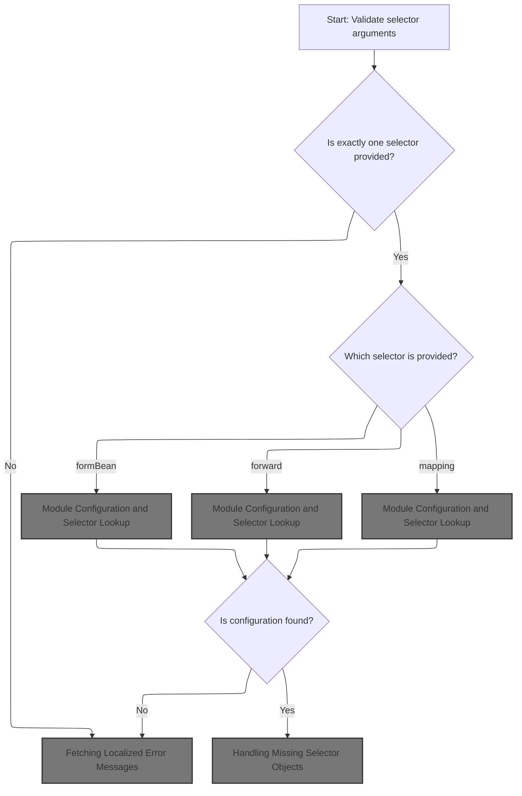
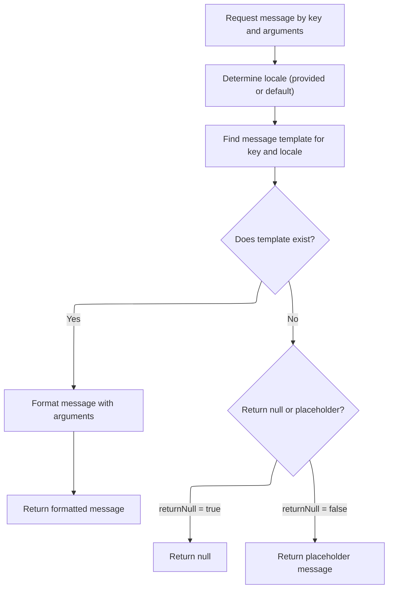
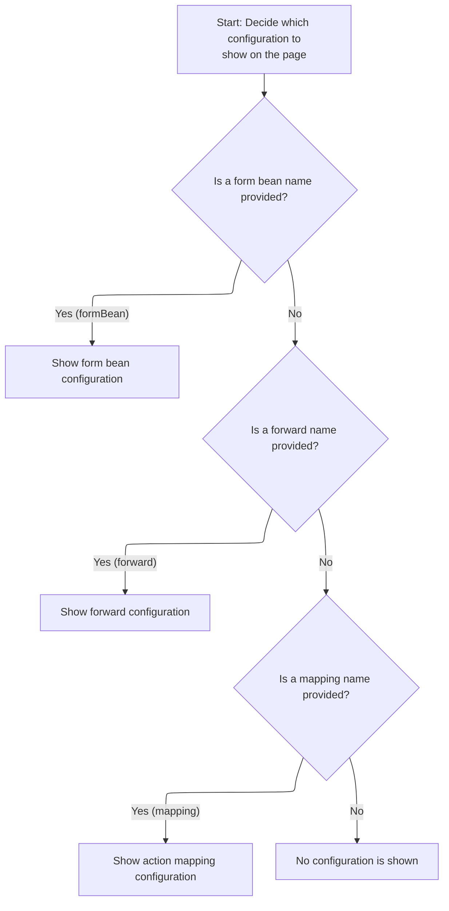
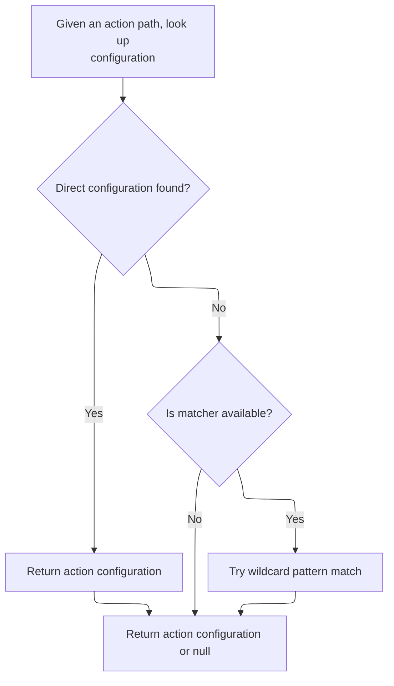
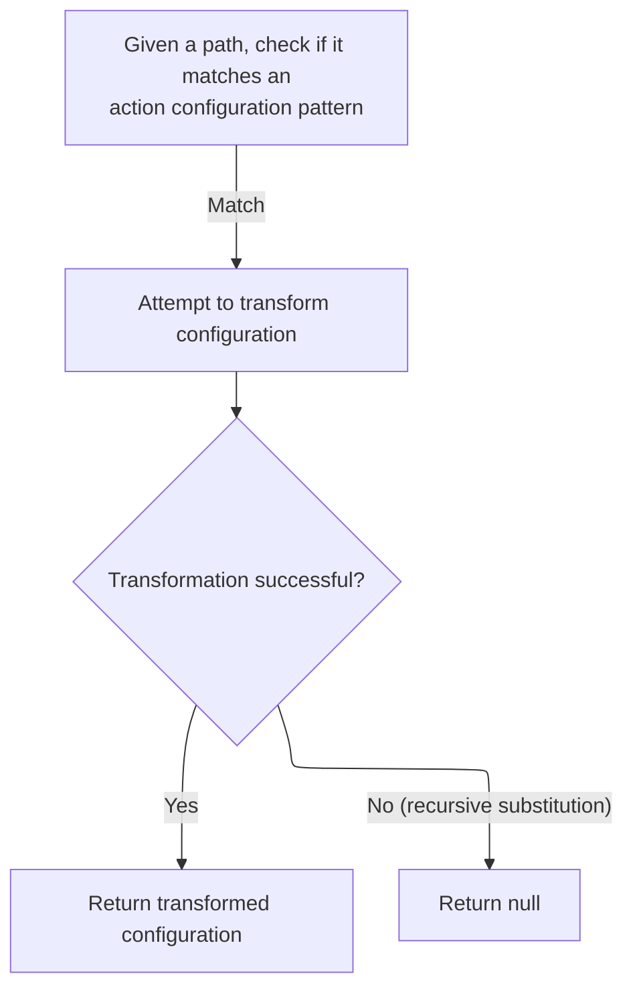
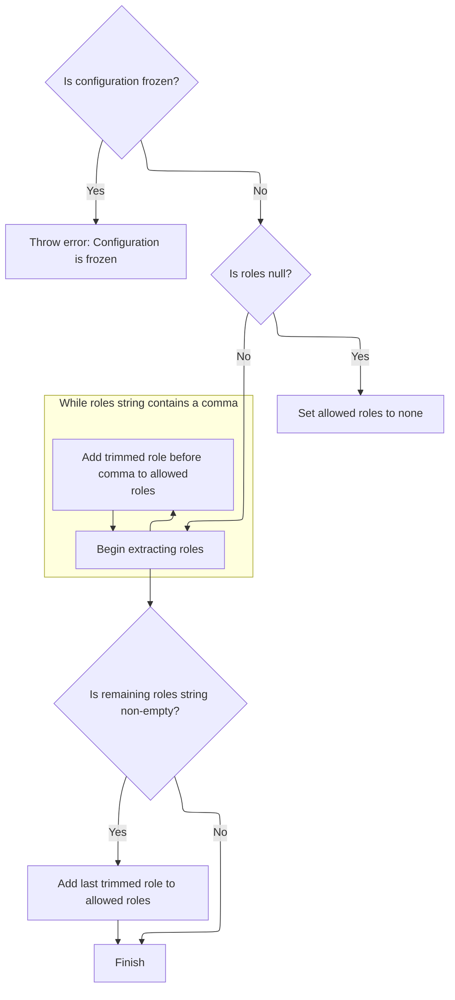
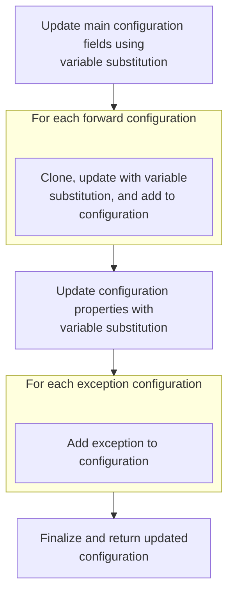

This document describes how selector information in a JSP tag is processed to expose the appropriate configuration object for use in the page. The flow ensures only one selector is set, retrieves the relevant configuration, and provides localized error messages if needed. This enables flexible page rendering and clear user feedback.

# Selector Validation and Exception Handling



<SwmSnippet path="/taglib/src/main/java/org/apache/struts/taglib/bean/StrutsTag.java" line="108">

---

In <SwmToken path="taglib/src/main/java/org/apache/struts/taglib/bean/StrutsTag.java" pos="108:5:5" line-data="    public int doStartTag() throws JspException {">`doStartTag`</SwmToken>, we check that only one selector (<SwmToken path="taglib/src/main/java/org/apache/struts/taglib/bean/StrutsTag.java" pos="112:4:4" line-data="        if (formBean != null) {">`formBean`</SwmToken>, forward, or mapping) is set. If that's not the case, we grab an error message from <SwmToken path="taglib/src/main/java/org/apache/struts/taglib/bean/StrutsTag.java" pos="25:10:10" line-data="import org.apache.struts.util.MessageResources;">`MessageResources`</SwmToken> for localization, save the exception to the page context, and throw it. This sets up the flow for error handling and user feedback.

```java
    public int doStartTag() throws JspException {
        // Validate the selector arguments
        int n = 0;

        if (formBean != null) {
            n++;
        }

        if (forward != null) {
            n++;
        }

        if (mapping != null) {
            n++;
        }

        if (n != 1) {
            JspException e =
                new JspException(messages.getMessage("struts.selector"));

            TagUtils.getInstance().saveException(pageContext, e);
            throw e;
        }

```

---

</SwmSnippet>

## Fetching Localized Error Messages

<SwmSnippet path="/core/src/main/java/org/apache/struts/util/MessageResources.java" line="196">

---

<SwmToken path="core/src/main/java/org/apache/struts/util/MessageResources.java" pos="196:5:10" line-data="    public String getMessage(String key) {">`getMessage(String key)`</SwmToken> just hands off to the main message retrieval method with nulls for locale and arguments. This keeps the logic consistent and lets the core method handle all cases.

```java
    public String getMessage(String key) {
        return this.getMessage((Locale) null, key, null);
    }
```

---

</SwmSnippet>

## Delegating Message Retrieval with Arguments



<SwmSnippet path="/core/src/main/java/org/apache/struts/util/MessageResources.java" line="324">

---

<SwmToken path="core/src/main/java/org/apache/struts/util/MessageResources.java" pos="324:5:5" line-data="    public String getMessage(Locale locale, String key, Object arg0) {">`getMessage`</SwmToken>`(`<SwmToken path="core/src/main/java/org/apache/struts/util/MessageResources.java" pos="324:7:7" line-data="    public String getMessage(Locale locale, String key, Object arg0) {">`Locale`</SwmToken>`, `<SwmToken path="core/src/main/java/org/apache/struts/util/MessageResources.java" pos="324:3:3" line-data="    public String getMessage(Locale locale, String key, Object arg0) {">`String`</SwmToken>`, `<SwmToken path="core/src/main/java/org/apache/struts/util/MessageResources.java" pos="324:17:17" line-data="    public String getMessage(Locale locale, String key, Object arg0) {">`Object`</SwmToken>`)` just wraps the single argument in an array and calls the main message formatting method. This keeps things simple and avoids duplicating formatting logic.

```java
    public String getMessage(Locale locale, String key, Object arg0) {
        return this.getMessage(locale, key, new Object[] { arg0 });
    }
```

---

</SwmSnippet>

<SwmSnippet path="/core/src/main/java/org/apache/struts/util/MessageResources.java" line="286">

---

<SwmToken path="core/src/main/java/org/apache/struts/util/MessageResources.java" pos="286:5:5" line-data="    public String getMessage(Locale locale, String key, Object[] args) {">`getMessage`</SwmToken>`(`<SwmToken path="core/src/main/java/org/apache/struts/util/MessageResources.java" pos="286:7:7" line-data="    public String getMessage(Locale locale, String key, Object[] args) {">`Locale`</SwmToken>`, `<SwmToken path="core/src/main/java/org/apache/struts/util/MessageResources.java" pos="286:3:3" line-data="    public String getMessage(Locale locale, String key, Object[] args) {">`String`</SwmToken>`, `<SwmToken path="core/src/main/java/org/apache/struts/util/MessageResources.java" pos="286:17:17" line-data="    public String getMessage(Locale locale, String key, Object[] args) {">`Object`</SwmToken>`[])` handles message formatting with caching for performance, fallback for missing keys, and escaping for safe formatting. It checks the cache for a <SwmToken path="core/src/main/java/org/apache/struts/util/MessageResources.java" pos="287:5:5" line-data="        // Cache MessageFormat instances as they are accessed">`MessageFormat`</SwmToken>, creates one if needed, and returns the formatted message or a fallback if the key is missing.

```java
    public String getMessage(Locale locale, String key, Object[] args) {
        // Cache MessageFormat instances as they are accessed
        if (locale == null) {
            locale = defaultLocale;
        }

        MessageFormat format = null;
        String formatKey = messageKey(locale, key);

        synchronized (formats) {
            format = (MessageFormat) formats.get(formatKey);

            if (format == null) {
                String formatString = getMessage(locale, key);

                if (formatString == null) {
                    return returnNull ? null : ("???" + formatKey + "???");
                }

                format = new MessageFormat(escape(formatString));
                format.setLocale(locale);
                formats.put(formatKey, format);
            }
        }

        return format.format(args);
    }
```

---

</SwmSnippet>

## Module Configuration and Selector Lookup



<SwmSnippet path="/taglib/src/main/java/org/apache/struts/taglib/bean/StrutsTag.java" line="132">

---

Back in `StrutsTag.doStartTag`, after handling the error message, we grab the module config and use the selector to fetch the relevant object (form bean, forward, or action mapping). This sets up the tag to expose the right object, so next we need to call <SwmToken path="core/src/main/java/org/apache/struts/config/impl/ModuleConfigImpl.java" pos="58:4:4" line-data="public class ModuleConfigImpl extends BaseConfig implements Serializable,">`ModuleConfigImpl`</SwmToken> to actually look up the action mapping if that's the selector.

```java
        // Retrieve our module configuration information
        ModuleConfig config =
            TagUtils.getInstance().getModuleConfig(pageContext);

        // Retrieve the requested object to be exposed
        Object object = null;
        String selector = null;

        if (formBean != null) {
            selector = formBean;
            object = config.findFormBeanConfig(formBean);
        } else if (forward != null) {
            selector = forward;
            object = config.findForwardConfig(forward);
        } else if (mapping != null) {
            selector = mapping;
            object = config.findActionConfig(mapping);
        }

```

---

</SwmSnippet>

## Action Mapping Lookup and Wildcard Matching



<SwmSnippet path="/core/src/main/java/org/apache/struts/config/impl/ModuleConfigImpl.java" line="436">

---

<SwmToken path="core/src/main/java/org/apache/struts/config/impl/ModuleConfigImpl.java" pos="436:5:5" line-data="    public ActionConfig findActionConfig(String path) {">`findActionConfig`</SwmToken> first checks for a direct match in the action configs. If that's not found and a matcher exists, it tries wildcard matching. This lets us handle dynamic or custom paths, so next we call <SwmToken path="core/src/main/java/org/apache/struts/config/impl/ModuleConfigImpl.java" pos="27:10:10" line-data="import org.apache.struts.config.ActionConfigMatcher;">`ActionConfigMatcher`</SwmToken> to see if any wildcard patterns fit.

```java
    public ActionConfig findActionConfig(String path) {
        ActionConfig config = (ActionConfig) actionConfigs.get(path);

        // If a direct match cannot be found, try to match action configs
        // containing wildcard patterns only if a matcher exists.
        if ((config == null) && (matcher != null)) {
            config = matcher.match(path);
        }

        return config;
    }
```

---

</SwmSnippet>

## Wildcard Path Matching and Variable Extraction

<SwmSnippet path="/core/src/main/java/org/apache/struts/config/ActionConfigMatcher.java" line="101">

---

In <SwmToken path="core/src/main/java/org/apache/struts/config/ActionConfigMatcher.java" pos="101:5:5" line-data="    public ActionConfig match(String path) {">`match`</SwmToken>, we strip the leading slash from the path, then loop through compiled wildcard patterns. For each, we use <SwmToken path="core/src/main/java/org/apache/struts/config/ActionConfigMatcher.java" pos="27:10:10" line-data="import org.apache.struts.util.WildcardHelper;">`WildcardHelper`</SwmToken> to check for a match and extract variables. If a match is found, we convert the config using those variables. Next, we need <SwmToken path="core/src/main/java/org/apache/struts/config/ActionConfigMatcher.java" pos="27:10:10" line-data="import org.apache.struts.util.WildcardHelper;">`WildcardHelper`</SwmToken> to actually do the matching.

```java
    public ActionConfig match(String path) {
        ActionConfig config = null;

        if (compiledPaths.size() > 0) {
            if (log.isDebugEnabled()) {
                log.debug("Attempting to match '" + path
                    + "' to a wildcard pattern");
            }

            if ((path.length() > 0) && (path.charAt(0) == '/')) {
                path = path.substring(1);
            }

            Mapping m;
            HashMap vars = new HashMap();

            for (Iterator i = compiledPaths.iterator(); i.hasNext();) {
                m = (Mapping) i.next();

                if (wildcard.match(vars, path, m.getPattern())) {
                    if (log.isDebugEnabled()) {
                        log.debug("Path matches pattern '"
                            + m.getActionConfig().getPath() + "'");
                    }

```

---

</SwmSnippet>

### Wildcard Pattern Matching Logic

See <SwmLink doc-title="Pattern Matching Flow">[Pattern Matching Flow](/.swm/pattern-matching-flow.h1tpx0gg.sw.md)</SwmLink>

### Config Conversion and Recursive Substitution Handling



<SwmSnippet path="/core/src/main/java/org/apache/struts/config/ActionConfigMatcher.java" line="126">

---

Just back from <SwmToken path="core/src/main/java/org/apache/struts/config/ActionConfigMatcher.java" pos="27:10:10" line-data="import org.apache.struts.util.WildcardHelper;">`WildcardHelper`</SwmToken>, `ActionConfigMatcher.match` tries to convert the matched config. If there's a recursive substitution, it catches the exception, logs a warning, and skips that config. Next, we call <SwmToken path="core/src/main/java/org/apache/struts/config/ActionConfigMatcher.java" pos="128:1:1" line-data="                	    convertActionConfig(path,">`convertActionConfig`</SwmToken> to handle the variable substitution in the config.

```java
                    try {
                	config =
                	    convertActionConfig(path,
                		    (ActionConfig) m.getActionConfig(), vars);
                    } catch (IllegalStateException e) {
                	log.warn("Path matches pattern '"
                		+ m.getActionConfig().getPath() + "' but is "
                		+ "incompatible with the matching config due "
                		+ "to recursive substitution: "
                		+ path);
                	config = null;
                    }
                }
            }
        }

        return config;
    }
```

---

</SwmSnippet>

## Config Cloning and Variable Substitution

<SwmSnippet path="/core/src/main/java/org/apache/struts/config/ActionConfigMatcher.java" line="157">

---

In <SwmToken path="core/src/main/java/org/apache/struts/config/ActionConfigMatcher.java" pos="157:5:5" line-data="    protected ActionConfig convertActionConfig(String path, ActionConfig orig,">`convertActionConfig`</SwmToken>, we clone the original config, then start substituting variables into its properties. If cloning fails, we log a warning and bail out. Next, we use <SwmToken path="core/src/main/java/org/apache/struts/config/ActionConfigMatcher.java" pos="170:5:5" line-data="        config.setName(convertParam(orig.getName(), vars));">`convertParam`</SwmToken> to handle variable substitution for each property.

```java
    protected ActionConfig convertActionConfig(String path, ActionConfig orig,
        Map vars) {
        ActionConfig config = null;

        try {
            config = (ActionConfig) BeanUtils.cloneBean(orig);
        } catch (Exception ex) {
            log.warn("Unable to clone action config, recommend not using "
                + "wildcards", ex);

            return null;
        }

        config.setName(convertParam(orig.getName(), vars));
```

---

</SwmSnippet>

<SwmSnippet path="/core/src/main/java/org/apache/struts/config/ActionConfigMatcher.java" line="258">

---

<SwmToken path="core/src/main/java/org/apache/struts/config/ActionConfigMatcher.java" pos="258:5:5" line-data="    protected String convertParam(String val, Map vars) {">`convertParam`</SwmToken> replaces placeholders like '{x}' in the config property with values from the vars map. It checks for recursive substitution and throws if detected, so we don't get stuck in an infinite loop. This keeps the config values clean and safe.

```java
    protected String convertParam(String val, Map vars) {
        if (val == null) {
            return null;
        } else if (val.indexOf("{") == -1) {
            return val;
        }

        Map.Entry entry;
        StringBuffer key = new StringBuffer("{0}");
        StringBuffer ret = new StringBuffer(val);
        String keyStr;
        int x;

        for (Iterator i = vars.entrySet().iterator(); i.hasNext();) {
            entry = (Map.Entry) i.next();
            key.setCharAt(1, ((String) entry.getKey()).charAt(0));
            keyStr = key.toString();
            
            // STR-3169
            // Prevent an infinite loop by retaining the placeholders
            // that contain itself in the substitution value
            if (((String) entry.getValue()).contains(keyStr)) {
        	throw new IllegalStateException();
            }
            
            // Replace all instances of the placeholder
            while ((x = ret.toString().indexOf(keyStr)) > -1) {
                ret.replace(x, x + 3, (String) entry.getValue());
            }
        }
```

---

</SwmSnippet>

<SwmSnippet path="/core/src/main/java/org/apache/struts/config/ActionConfigMatcher.java" line="170">

---

Just back from <SwmToken path="core/src/main/java/org/apache/struts/config/ActionConfigMatcher.java" pos="170:5:5" line-data="        config.setName(convertParam(orig.getName(), vars));">`convertParam`</SwmToken> in <SwmToken path="core/src/main/java/org/apache/struts/config/impl/ModuleConfigImpl.java" pos="27:10:10" line-data="import org.apache.struts.config.ActionConfigMatcher;">`ActionConfigMatcher`</SwmToken>, we set the name on the config using the substituted value. Next, we call <SwmToken path="core/src/main/java/org/apache/struts/config/impl/ModuleConfigImpl.java" pos="436:3:3" line-data="    public ActionConfig findActionConfig(String path) {">`ActionConfig`</SwmToken> to actually update the property, which enforces immutability if the config is frozen.

```java
        config.setName(convertParam(orig.getName(), vars));

```

---

</SwmSnippet>

<SwmSnippet path="/core/src/main/java/org/apache/struts/config/ActionConfig.java" line="517">

---

<SwmToken path="core/src/main/java/org/apache/struts/config/ActionConfig.java" pos="517:5:5" line-data="    public void setName(String name) {">`setName`</SwmToken> checks if the config is frozen before updating the name. If it's locked, it throws, so the name can't be changed after setup. This keeps the config immutable once it's finalized.

```java
    public void setName(String name) {
        if (configured) {
            throw new IllegalStateException("Configuration is frozen");
        }

        this.name = name;
    }
```

---

</SwmSnippet>

<SwmSnippet path="/core/src/main/java/org/apache/struts/config/ActionConfigMatcher.java" line="172">

---

Just back from <SwmToken path="core/src/main/java/org/apache/struts/config/impl/ModuleConfigImpl.java" pos="436:3:3" line-data="    public ActionConfig findActionConfig(String path) {">`ActionConfig`</SwmToken>, <SwmToken path="core/src/main/java/org/apache/struts/config/impl/ModuleConfigImpl.java" pos="27:10:10" line-data="import org.apache.struts.config.ActionConfigMatcher;">`ActionConfigMatcher`</SwmToken> checks the path format and sets it on the config, making sure it starts with a slash. Next, we call <SwmToken path="core/src/main/java/org/apache/struts/config/impl/ModuleConfigImpl.java" pos="436:3:3" line-data="    public ActionConfig findActionConfig(String path) {">`ActionConfig`</SwmToken> to update the path, which also enforces immutability if the config is frozen.

```java
        if ((path.length() == 0) || (path.charAt(0) != '/')) {
            path = "/" + path;
        }

        config.setPath(path);
```

---

</SwmSnippet>

<SwmSnippet path="/core/src/main/java/org/apache/struts/config/ActionConfig.java" line="565">

---

<SwmToken path="core/src/main/java/org/apache/struts/config/ActionConfig.java" pos="565:5:5" line-data="    public void setPath(String path) {">`setPath`</SwmToken> checks if the config is frozen before updating the path. If it's locked, it throws, so the path can't be changed after setup. This keeps routing consistent and prevents accidental changes.

```java
    public void setPath(String path) {
        if (configured) {
            throw new IllegalStateException("Configuration is frozen");
        }

        this.path = path;
    }
```

---

</SwmSnippet>

<SwmSnippet path="/core/src/main/java/org/apache/struts/config/ActionConfigMatcher.java" line="177">

---

Just back from <SwmToken path="core/src/main/java/org/apache/struts/config/impl/ModuleConfigImpl.java" pos="436:3:3" line-data="    public ActionConfig findActionConfig(String path) {">`ActionConfig`</SwmToken>, <SwmToken path="core/src/main/java/org/apache/struts/config/impl/ModuleConfigImpl.java" pos="27:10:10" line-data="import org.apache.struts.config.ActionConfigMatcher;">`ActionConfigMatcher`</SwmToken> substitutes variables in the type and sets it on the config. Next, we call <SwmToken path="core/src/main/java/org/apache/struts/config/impl/ModuleConfigImpl.java" pos="436:3:3" line-data="    public ActionConfig findActionConfig(String path) {">`ActionConfig`</SwmToken> to update the type, which also enforces immutability if the config is frozen.

```java
        config.setType(convertParam(orig.getType(), vars));
```

---

</SwmSnippet>

<SwmSnippet path="/core/src/main/java/org/apache/struts/config/ActionConfigMatcher.java" line="177">

---

Just back from <SwmToken path="core/src/main/java/org/apache/struts/config/impl/ModuleConfigImpl.java" pos="27:10:10" line-data="import org.apache.struts.config.ActionConfigMatcher;">`ActionConfigMatcher`</SwmToken>, we substitute variables in the roles property and set it on the config. Next, we call <SwmToken path="core/src/main/java/org/apache/struts/config/impl/ModuleConfigImpl.java" pos="436:3:3" line-data="    public ActionConfig findActionConfig(String path) {">`ActionConfig`</SwmToken> to update roles, which parses the string and enforces immutability if the config is frozen.

```java
        config.setType(convertParam(orig.getType(), vars));
```

---

</SwmSnippet>

<SwmSnippet path="/core/src/main/java/org/apache/struts/config/ActionConfig.java" line="788">

---

In <SwmToken path="core/src/main/java/org/apache/struts/config/ActionConfigMatcher.java" pos="178:3:3" line-data="        config.setRoles(convertParam(orig.getRoles(), vars));">`setRoles`</SwmToken>, we check if the config is frozen, then parse the roles string by commas, trim each name, and store them in an array. This makes access control checks straightforward and keeps the config immutable after setup.

```java
    public void setType(String type) {
        if (configured) {
            throw new IllegalStateException("Configuration is frozen");
        }

        this.type = type;
    }
```

---

</SwmSnippet>

<SwmSnippet path="/core/src/main/java/org/apache/struts/config/ActionConfigMatcher.java" line="178">

---

Just back from <SwmToken path="core/src/main/java/org/apache/struts/config/impl/ModuleConfigImpl.java" pos="436:3:3" line-data="    public ActionConfig findActionConfig(String path) {">`ActionConfig`</SwmToken>, <SwmToken path="core/src/main/java/org/apache/struts/config/impl/ModuleConfigImpl.java" pos="27:10:10" line-data="import org.apache.struts.config.ActionConfigMatcher;">`ActionConfigMatcher`</SwmToken> substitutes variables in the roles property and sets it on the config. Next, we call <SwmToken path="core/src/main/java/org/apache/struts/config/impl/ModuleConfigImpl.java" pos="436:3:3" line-data="    public ActionConfig findActionConfig(String path) {">`ActionConfig`</SwmToken> to update roles, which parses the string and enforces immutability if the config is frozen.

```java
        config.setRoles(convertParam(orig.getRoles(), vars));
```

---

</SwmSnippet>

<SwmSnippet path="/core/src/main/java/org/apache/struts/config/ActionConfigMatcher.java" line="178">

---

Just back from <SwmToken path="core/src/main/java/org/apache/struts/config/impl/ModuleConfigImpl.java" pos="27:10:10" line-data="import org.apache.struts.config.ActionConfigMatcher;">`ActionConfigMatcher`</SwmToken>, we substitute variables in the roles property and set it on the config. Next, we call <SwmToken path="core/src/main/java/org/apache/struts/config/impl/ModuleConfigImpl.java" pos="436:3:3" line-data="    public ActionConfig findActionConfig(String path) {">`ActionConfig`</SwmToken> to update roles, which parses the string and enforces immutability if the config is frozen.

```java
        config.setRoles(convertParam(orig.getRoles(), vars));
```

---

</SwmSnippet>

### Role String Parsing and Immutability Enforcement



<SwmSnippet path="/core/src/main/java/org/apache/struts/config/ActionConfig.java" line="597">

---

In <SwmToken path="core/src/main/java/org/apache/struts/config/ActionConfig.java" pos="597:5:5" line-data="    public void setRoles(String roles) {">`setRoles`</SwmToken>, we check if the config is frozen, then parse the roles string by commas, trim each name, and store them in an array. This makes access control checks straightforward and keeps the config immutable after setup.

```java
    public void setRoles(String roles) {
        if (configured) {
            throw new IllegalStateException("Configuration is frozen");
        }

        this.roles = roles;

        if (roles == null) {
            roleNames = new String[0];

            return;
        }

        ArrayList list = new ArrayList();

        while (true) {
            int comma = roles.indexOf(',');

            if (comma < 0) {
                break;
            }

            list.add(roles.substring(0, comma).trim());
            roles = roles.substring(comma + 1);
        }
```

---

</SwmSnippet>

<SwmSnippet path="/core/src/main/java/org/apache/struts/config/ActionConfig.java" line="623">

---

After parsing, the roles string is split and trimmed into an array. If there's anything left after the last comma, it's added too. This array is used for access control checks.

```java
        roles = roles.trim();

        if (roles.length() > 0) {
            list.add(roles);
        }

        roleNames = (String[]) list.toArray(new String[list.size()]);
    }
```

---

</SwmSnippet>

### Parameter and Attribute Substitution



<SwmSnippet path="/core/src/main/java/org/apache/struts/config/ActionConfigMatcher.java" line="179">

---

Just back from <SwmToken path="core/src/main/java/org/apache/struts/config/impl/ModuleConfigImpl.java" pos="436:3:3" line-data="    public ActionConfig findActionConfig(String path) {">`ActionConfig`</SwmToken>, <SwmToken path="core/src/main/java/org/apache/struts/config/impl/ModuleConfigImpl.java" pos="27:10:10" line-data="import org.apache.struts.config.ActionConfigMatcher;">`ActionConfigMatcher`</SwmToken> substitutes variables in the parameter and sets it on the config. Next, we call <SwmToken path="core/src/main/java/org/apache/struts/config/impl/ModuleConfigImpl.java" pos="436:3:3" line-data="    public ActionConfig findActionConfig(String path) {">`ActionConfig`</SwmToken> to update the parameter, which also enforces immutability if the config is frozen.

```java
        config.setParameter(convertParam(orig.getParameter(), vars));
```

---

</SwmSnippet>

<SwmSnippet path="/core/src/main/java/org/apache/struts/config/ActionConfigMatcher.java" line="179">

---

Just back from <SwmToken path="core/src/main/java/org/apache/struts/config/impl/ModuleConfigImpl.java" pos="27:10:10" line-data="import org.apache.struts.config.ActionConfigMatcher;">`ActionConfigMatcher`</SwmToken>, we substitute variables in the attribute and set it on the config. Next, we call <SwmToken path="core/src/main/java/org/apache/struts/config/impl/ModuleConfigImpl.java" pos="436:3:3" line-data="    public ActionConfig findActionConfig(String path) {">`ActionConfig`</SwmToken> to update the attribute, which also enforces immutability if the config is frozen.

```java
        config.setParameter(convertParam(orig.getParameter(), vars));
```

---

</SwmSnippet>

<SwmSnippet path="/core/src/main/java/org/apache/struts/config/ActionConfig.java" line="541">

---

<SwmToken path="core/src/main/java/org/apache/struts/config/ActionConfig.java" pos="541:5:5" line-data="    public void setParameter(String parameter) {">`setParameter`</SwmToken> checks if the config is frozen before updating the parameter. If it's locked, it throws, so the parameter can't be changed after setup. No validation is done on the value itself.

```java
    public void setParameter(String parameter) {
        if (configured) {
            throw new IllegalStateException("Configuration is frozen");
        }

        this.parameter = parameter;
    }
```

---

</SwmSnippet>

<SwmSnippet path="/core/src/main/java/org/apache/struts/config/ActionConfigMatcher.java" line="180">

---

Just back from <SwmToken path="core/src/main/java/org/apache/struts/config/impl/ModuleConfigImpl.java" pos="436:3:3" line-data="    public ActionConfig findActionConfig(String path) {">`ActionConfig`</SwmToken>, <SwmToken path="core/src/main/java/org/apache/struts/config/impl/ModuleConfigImpl.java" pos="27:10:10" line-data="import org.apache.struts.config.ActionConfigMatcher;">`ActionConfigMatcher`</SwmToken> substitutes variables in the attribute and sets it on the config. Next, we call <SwmToken path="core/src/main/java/org/apache/struts/config/impl/ModuleConfigImpl.java" pos="436:3:3" line-data="    public ActionConfig findActionConfig(String path) {">`ActionConfig`</SwmToken> to update the attribute, which also enforces immutability if the config is frozen.

```java
        config.setAttribute(convertParam(orig.getAttribute(), vars));
```

---

</SwmSnippet>

<SwmSnippet path="/core/src/main/java/org/apache/struts/config/ActionConfigMatcher.java" line="180">

---

Just back from <SwmToken path="core/src/main/java/org/apache/struts/config/impl/ModuleConfigImpl.java" pos="27:10:10" line-data="import org.apache.struts.config.ActionConfigMatcher;">`ActionConfigMatcher`</SwmToken>, we substitute variables in the forward property and set it on the config. Next, we call <SwmToken path="core/src/main/java/org/apache/struts/config/impl/ModuleConfigImpl.java" pos="436:3:3" line-data="    public ActionConfig findActionConfig(String path) {">`ActionConfig`</SwmToken> to update the forward, which also enforces immutability if the config is frozen.

```java
        config.setAttribute(convertParam(orig.getAttribute(), vars));
```

---

</SwmSnippet>

<SwmSnippet path="/core/src/main/java/org/apache/struts/config/ActionConfig.java" line="337">

---

<SwmToken path="core/src/main/java/org/apache/struts/config/ActionConfig.java" pos="337:5:5" line-data="    public void setAttribute(String attribute) {">`setAttribute`</SwmToken> checks if the config is frozen before updating the attribute. If it's locked, it throws, so the attribute can't be changed after setup. No validation is done on the value itself.

```java
    public void setAttribute(String attribute) {
        if (configured) {
            throw new IllegalStateException("Configuration is frozen");
        }

        this.attribute = attribute;
    }
```

---

</SwmSnippet>

<SwmSnippet path="/core/src/main/java/org/apache/struts/config/ActionConfigMatcher.java" line="181">

---

Just back from <SwmToken path="core/src/main/java/org/apache/struts/config/impl/ModuleConfigImpl.java" pos="436:3:3" line-data="    public ActionConfig findActionConfig(String path) {">`ActionConfig`</SwmToken>, <SwmToken path="core/src/main/java/org/apache/struts/config/impl/ModuleConfigImpl.java" pos="27:10:10" line-data="import org.apache.struts.config.ActionConfigMatcher;">`ActionConfigMatcher`</SwmToken> substitutes variables in the forward and sets it on the config. Next, we call <SwmToken path="core/src/main/java/org/apache/struts/config/impl/ModuleConfigImpl.java" pos="436:3:3" line-data="    public ActionConfig findActionConfig(String path) {">`ActionConfig`</SwmToken> to update the forward, which also enforces immutability if the config is frozen.

```java
        config.setForward(convertParam(orig.getForward(), vars));
```

---

</SwmSnippet>

<SwmSnippet path="/core/src/main/java/org/apache/struts/config/ActionConfigMatcher.java" line="181">

---

Just back from <SwmToken path="core/src/main/java/org/apache/struts/config/impl/ModuleConfigImpl.java" pos="27:10:10" line-data="import org.apache.struts.config.ActionConfigMatcher;">`ActionConfigMatcher`</SwmToken>, we substitute variables in the forward property and set it on the config. Next, we call <SwmToken path="core/src/main/java/org/apache/struts/config/impl/ModuleConfigImpl.java" pos="436:3:3" line-data="    public ActionConfig findActionConfig(String path) {">`ActionConfig`</SwmToken> to update the forward, which also enforces immutability if the config is frozen.

```java
        config.setForward(convertParam(orig.getForward(), vars));
```

---

</SwmSnippet>

<SwmSnippet path="/core/src/main/java/org/apache/struts/config/ActionConfig.java" line="419">

---

<SwmToken path="core/src/main/java/org/apache/struts/config/ActionConfig.java" pos="419:5:5" line-data="    public void setForward(String forward) {">`setForward`</SwmToken> updates the forward property, but only if the config isn't frozen. If <SwmToken path="core/src/main/java/org/apache/struts/config/ActionConfig.java" pos="420:4:4" line-data="        if (configured) {">`configured`</SwmToken> is true, it throws an exception to block changes after the config is finalized. This is how the repo enforces immutability for configuration objects.

```java
    public void setForward(String forward) {
        if (configured) {
            throw new IllegalStateException("Configuration is frozen");
        }

        this.forward = forward;
    }
```

---

</SwmSnippet>

<SwmSnippet path="/core/src/main/java/org/apache/struts/config/ActionConfigMatcher.java" line="182">

---

Just back from <SwmToken path="core/src/main/java/org/apache/struts/config/impl/ModuleConfigImpl.java" pos="436:3:3" line-data="    public ActionConfig findActionConfig(String path) {">`ActionConfig`</SwmToken>, <SwmToken path="core/src/main/java/org/apache/struts/config/impl/ModuleConfigImpl.java" pos="27:10:10" line-data="import org.apache.struts.config.ActionConfigMatcher;">`ActionConfigMatcher`</SwmToken> now updates the include property with variable substitution. This keeps all config fields in sync with the current wildcard match.

```java
        config.setInclude(convertParam(orig.getInclude(), vars));
```

---

</SwmSnippet>

<SwmSnippet path="/core/src/main/java/org/apache/struts/config/ActionConfigMatcher.java" line="182">

---

After updating include in <SwmToken path="core/src/main/java/org/apache/struts/config/impl/ModuleConfigImpl.java" pos="27:10:10" line-data="import org.apache.struts.config.ActionConfigMatcher;">`ActionConfigMatcher`</SwmToken>, we call <SwmToken path="core/src/main/java/org/apache/struts/config/impl/ModuleConfigImpl.java" pos="436:3:3" line-data="    public ActionConfig findActionConfig(String path) {">`ActionConfig`</SwmToken> to actually set the value. This step applies the substituted value and enforces immutability if the config is frozen.

```java
        config.setInclude(convertParam(orig.getInclude(), vars));
```

---

</SwmSnippet>

<SwmSnippet path="/core/src/main/java/org/apache/struts/config/ActionConfig.java" line="446">

---

<SwmToken path="core/src/main/java/org/apache/struts/config/ActionConfig.java" pos="446:5:5" line-data="    public void setInclude(String include) {">`setInclude`</SwmToken> sets the include property, but only if the config isn't frozen. If <SwmToken path="core/src/main/java/org/apache/struts/config/ActionConfig.java" pos="447:4:4" line-data="        if (configured) {">`configured`</SwmToken> is true, it throws, so you can't change the include after the config is locked.

```java
    public void setInclude(String include) {
        if (configured) {
            throw new IllegalStateException("Configuration is frozen");
        }

        this.include = include;
    }
```

---

</SwmSnippet>

<SwmSnippet path="/core/src/main/java/org/apache/struts/config/ActionConfigMatcher.java" line="183">

---

Just back from <SwmToken path="core/src/main/java/org/apache/struts/config/impl/ModuleConfigImpl.java" pos="436:3:3" line-data="    public ActionConfig findActionConfig(String path) {">`ActionConfig`</SwmToken>, <SwmToken path="core/src/main/java/org/apache/struts/config/impl/ModuleConfigImpl.java" pos="27:10:10" line-data="import org.apache.struts.config.ActionConfigMatcher;">`ActionConfigMatcher`</SwmToken> now updates the input property using <SwmToken path="core/src/main/java/org/apache/struts/config/ActionConfigMatcher.java" pos="183:5:5" line-data="        config.setInput(convertParam(orig.getInput(), vars));">`convertParam`</SwmToken>. This keeps the config consistent with the current wildcard variables.

```java
        config.setInput(convertParam(orig.getInput(), vars));
```

---

</SwmSnippet>

<SwmSnippet path="/core/src/main/java/org/apache/struts/config/ActionConfigMatcher.java" line="183">

---

After updating input in <SwmToken path="core/src/main/java/org/apache/struts/config/impl/ModuleConfigImpl.java" pos="27:10:10" line-data="import org.apache.struts.config.ActionConfigMatcher;">`ActionConfigMatcher`</SwmToken>, we call <SwmToken path="core/src/main/java/org/apache/struts/config/impl/ModuleConfigImpl.java" pos="436:3:3" line-data="    public ActionConfig findActionConfig(String path) {">`ActionConfig`</SwmToken> to actually set the value. This applies the substituted input and enforces immutability if the config is frozen.

```java
        config.setInput(convertParam(orig.getInput(), vars));
```

---

</SwmSnippet>

<SwmSnippet path="/core/src/main/java/org/apache/struts/config/ActionConfig.java" line="473">

---

<SwmToken path="core/src/main/java/org/apache/struts/config/ActionConfig.java" pos="473:5:5" line-data="    public void setInput(String input) {">`setInput`</SwmToken> sets the input property, but only if the config isn't frozen. If <SwmToken path="core/src/main/java/org/apache/struts/config/ActionConfig.java" pos="474:4:4" line-data="        if (configured) {">`configured`</SwmToken> is true, it throws, so you can't change input after the config is locked.

```java
    public void setInput(String input) {
        if (configured) {
            throw new IllegalStateException("Configuration is frozen");
        }

        this.input = input;
    }
```

---

</SwmSnippet>

<SwmSnippet path="/core/src/main/java/org/apache/struts/config/ActionConfigMatcher.java" line="184">

---

Just back from <SwmToken path="core/src/main/java/org/apache/struts/config/impl/ModuleConfigImpl.java" pos="436:3:3" line-data="    public ActionConfig findActionConfig(String path) {">`ActionConfig`</SwmToken>, <SwmToken path="core/src/main/java/org/apache/struts/config/impl/ModuleConfigImpl.java" pos="27:10:10" line-data="import org.apache.struts.config.ActionConfigMatcher;">`ActionConfigMatcher`</SwmToken> now updates the catalog property using <SwmToken path="core/src/main/java/org/apache/struts/config/ActionConfigMatcher.java" pos="184:5:5" line-data="        config.setCatalog(convertParam(orig.getCatalog(), vars));">`convertParam`</SwmToken>. This keeps the config in sync with the current variables.

```java
        config.setCatalog(convertParam(orig.getCatalog(), vars));
```

---

</SwmSnippet>

<SwmSnippet path="/core/src/main/java/org/apache/struts/config/ActionConfigMatcher.java" line="184">

---

After updating catalog in <SwmToken path="core/src/main/java/org/apache/struts/config/impl/ModuleConfigImpl.java" pos="27:10:10" line-data="import org.apache.struts.config.ActionConfigMatcher;">`ActionConfigMatcher`</SwmToken>, we call <SwmToken path="core/src/main/java/org/apache/struts/config/impl/ModuleConfigImpl.java" pos="436:3:3" line-data="    public ActionConfig findActionConfig(String path) {">`ActionConfig`</SwmToken> to actually set the value. This applies the substituted catalog and enforces immutability if the config is frozen.

```java
        config.setCatalog(convertParam(orig.getCatalog(), vars));
```

---

</SwmSnippet>

<SwmSnippet path="/core/src/main/java/org/apache/struts/config/ActionConfig.java" line="882">

---

<SwmToken path="core/src/main/java/org/apache/struts/config/ActionConfig.java" pos="882:5:5" line-data="    public void setCatalog(String catalog) {">`setCatalog`</SwmToken> sets the catalog property, but only if the config isn't frozen. If <SwmToken path="core/src/main/java/org/apache/struts/config/ActionConfig.java" pos="883:4:4" line-data="        if (configured) {">`configured`</SwmToken> is true, it throws, so you can't change catalog after the config is locked.

```java
    public void setCatalog(String catalog) {
        if (configured) {
            throw new IllegalStateException("Configuration is frozen");
        }

        this.catalog = catalog;
    }
```

---

</SwmSnippet>

<SwmSnippet path="/core/src/main/java/org/apache/struts/config/ActionConfigMatcher.java" line="185">

---

Just back from <SwmToken path="core/src/main/java/org/apache/struts/config/impl/ModuleConfigImpl.java" pos="436:3:3" line-data="    public ActionConfig findActionConfig(String path) {">`ActionConfig`</SwmToken>, <SwmToken path="core/src/main/java/org/apache/struts/config/impl/ModuleConfigImpl.java" pos="27:10:10" line-data="import org.apache.struts.config.ActionConfigMatcher;">`ActionConfigMatcher`</SwmToken> now updates the command property using <SwmToken path="core/src/main/java/org/apache/struts/config/ActionConfigMatcher.java" pos="185:5:5" line-data="        config.setCommand(convertParam(orig.getCommand(), vars));">`convertParam`</SwmToken>. This keeps the config in sync with the current variables.

```java
        config.setCommand(convertParam(orig.getCommand(), vars));
```

---

</SwmSnippet>

<SwmSnippet path="/core/src/main/java/org/apache/struts/config/ActionConfigMatcher.java" line="185">

---

After updating command in <SwmToken path="core/src/main/java/org/apache/struts/config/impl/ModuleConfigImpl.java" pos="27:10:10" line-data="import org.apache.struts.config.ActionConfigMatcher;">`ActionConfigMatcher`</SwmToken>, we call <SwmToken path="core/src/main/java/org/apache/struts/config/impl/ModuleConfigImpl.java" pos="436:3:3" line-data="    public ActionConfig findActionConfig(String path) {">`ActionConfig`</SwmToken> to actually set the value. This applies the substituted command and enforces immutability if the config is frozen.

```java
        config.setCommand(convertParam(orig.getCommand(), vars));
```

---

</SwmSnippet>

<SwmSnippet path="/core/src/main/java/org/apache/struts/config/ActionConfig.java" line="864">

---

<SwmToken path="core/src/main/java/org/apache/struts/config/ActionConfig.java" pos="864:5:5" line-data="    public void setCommand(String command) {">`setCommand`</SwmToken> sets the command property, but only if the config isn't frozen. If <SwmToken path="core/src/main/java/org/apache/struts/config/ActionConfig.java" pos="865:4:4" line-data="        if (configured) {">`configured`</SwmToken> is true, it throws, so you can't change command after the config is locked.

```java
    public void setCommand(String command) {
        if (configured) {
            throw new IllegalStateException("Configuration is frozen");
        }

        this.command = command;
    }
```

---

</SwmSnippet>

<SwmSnippet path="/core/src/main/java/org/apache/struts/config/ActionConfigMatcher.java" line="186">

---

Just back from <SwmToken path="core/src/main/java/org/apache/struts/config/impl/ModuleConfigImpl.java" pos="436:3:3" line-data="    public ActionConfig findActionConfig(String path) {">`ActionConfig`</SwmToken>, <SwmToken path="core/src/main/java/org/apache/struts/config/impl/ModuleConfigImpl.java" pos="27:10:10" line-data="import org.apache.struts.config.ActionConfigMatcher;">`ActionConfigMatcher`</SwmToken> now updates the <SwmToken path="core/src/main/java/org/apache/struts/config/ActionConfig.java" pos="499:9:9" line-data="    public void setMultipartClass(String multipartClass) {">`multipartClass`</SwmToken> property using <SwmToken path="core/src/main/java/org/apache/struts/config/ActionConfigMatcher.java" pos="186:5:5" line-data="        config.setMultipartClass(convertParam(orig.getMultipartClass(), vars));">`convertParam`</SwmToken>. This keeps the config in sync with the current variables.

```java
        config.setMultipartClass(convertParam(orig.getMultipartClass(), vars));
```

---

</SwmSnippet>

<SwmSnippet path="/core/src/main/java/org/apache/struts/config/ActionConfigMatcher.java" line="186">

---

After updating <SwmToken path="core/src/main/java/org/apache/struts/config/ActionConfig.java" pos="499:9:9" line-data="    public void setMultipartClass(String multipartClass) {">`multipartClass`</SwmToken> in <SwmToken path="core/src/main/java/org/apache/struts/config/impl/ModuleConfigImpl.java" pos="27:10:10" line-data="import org.apache.struts.config.ActionConfigMatcher;">`ActionConfigMatcher`</SwmToken>, we call <SwmToken path="core/src/main/java/org/apache/struts/config/impl/ModuleConfigImpl.java" pos="436:3:3" line-data="    public ActionConfig findActionConfig(String path) {">`ActionConfig`</SwmToken> to actually set the value. This applies the substituted <SwmToken path="core/src/main/java/org/apache/struts/config/ActionConfig.java" pos="499:9:9" line-data="    public void setMultipartClass(String multipartClass) {">`multipartClass`</SwmToken> and enforces immutability if the config is frozen.

```java
        config.setMultipartClass(convertParam(orig.getMultipartClass(), vars));
```

---

</SwmSnippet>

<SwmSnippet path="/core/src/main/java/org/apache/struts/config/ActionConfig.java" line="499">

---

<SwmToken path="core/src/main/java/org/apache/struts/config/ActionConfig.java" pos="499:5:5" line-data="    public void setMultipartClass(String multipartClass) {">`setMultipartClass`</SwmToken> sets the <SwmToken path="core/src/main/java/org/apache/struts/config/ActionConfig.java" pos="499:9:9" line-data="    public void setMultipartClass(String multipartClass) {">`multipartClass`</SwmToken> property, but only if the config isn't frozen. If <SwmToken path="core/src/main/java/org/apache/struts/config/ActionConfig.java" pos="500:4:4" line-data="        if (configured) {">`configured`</SwmToken> is true, it throws, so you can't change <SwmToken path="core/src/main/java/org/apache/struts/config/ActionConfig.java" pos="499:9:9" line-data="    public void setMultipartClass(String multipartClass) {">`multipartClass`</SwmToken> after the config is locked.

```java
    public void setMultipartClass(String multipartClass) {
        if (configured) {
            throw new IllegalStateException("Configuration is frozen");
        }

        this.multipartClass = multipartClass;
    }
```

---

</SwmSnippet>

<SwmSnippet path="/core/src/main/java/org/apache/struts/config/ActionConfigMatcher.java" line="187">

---

Just back from <SwmToken path="core/src/main/java/org/apache/struts/config/impl/ModuleConfigImpl.java" pos="436:3:3" line-data="    public ActionConfig findActionConfig(String path) {">`ActionConfig`</SwmToken>, <SwmToken path="core/src/main/java/org/apache/struts/config/impl/ModuleConfigImpl.java" pos="27:10:10" line-data="import org.apache.struts.config.ActionConfigMatcher;">`ActionConfigMatcher`</SwmToken> now updates the prefix property using <SwmToken path="core/src/main/java/org/apache/struts/config/ActionConfigMatcher.java" pos="187:5:5" line-data="        config.setPrefix(convertParam(orig.getPrefix(), vars));">`convertParam`</SwmToken>. This keeps the config in sync with the current variables.

```java
        config.setPrefix(convertParam(orig.getPrefix(), vars));
```

---

</SwmSnippet>

<SwmSnippet path="/core/src/main/java/org/apache/struts/config/ActionConfigMatcher.java" line="187">

---

After updating prefix in <SwmToken path="core/src/main/java/org/apache/struts/config/impl/ModuleConfigImpl.java" pos="27:10:10" line-data="import org.apache.struts.config.ActionConfigMatcher;">`ActionConfigMatcher`</SwmToken>, we call <SwmToken path="core/src/main/java/org/apache/struts/config/impl/ModuleConfigImpl.java" pos="436:3:3" line-data="    public ActionConfig findActionConfig(String path) {">`ActionConfig`</SwmToken> to actually set the value. This applies the substituted prefix and enforces immutability if the config is frozen.

```java
        config.setPrefix(convertParam(orig.getPrefix(), vars));
```

---

</SwmSnippet>

<SwmSnippet path="/core/src/main/java/org/apache/struts/config/ActionConfig.java" line="585">

---

<SwmToken path="core/src/main/java/org/apache/struts/config/ActionConfig.java" pos="585:5:5" line-data="    public void setPrefix(String prefix) {">`setPrefix`</SwmToken> sets the prefix property, but only if the config isn't frozen. If <SwmToken path="core/src/main/java/org/apache/struts/config/ActionConfig.java" pos="586:4:4" line-data="        if (configured) {">`configured`</SwmToken> is true, it throws, so you can't change prefix after the config is locked.

```java
    public void setPrefix(String prefix) {
        if (configured) {
            throw new IllegalStateException("Configuration is frozen");
        }

        this.prefix = prefix;
    }
```

---

</SwmSnippet>

<SwmSnippet path="/core/src/main/java/org/apache/struts/config/ActionConfigMatcher.java" line="188">

---

Just back from <SwmToken path="core/src/main/java/org/apache/struts/config/impl/ModuleConfigImpl.java" pos="436:3:3" line-data="    public ActionConfig findActionConfig(String path) {">`ActionConfig`</SwmToken>, <SwmToken path="core/src/main/java/org/apache/struts/config/impl/ModuleConfigImpl.java" pos="27:10:10" line-data="import org.apache.struts.config.ActionConfigMatcher;">`ActionConfigMatcher`</SwmToken> now updates the suffix property using <SwmToken path="core/src/main/java/org/apache/struts/config/ActionConfigMatcher.java" pos="188:5:5" line-data="        config.setSuffix(convertParam(orig.getSuffix(), vars));">`convertParam`</SwmToken>. This keeps the config in sync with the current variables.

```java
        config.setSuffix(convertParam(orig.getSuffix(), vars));
```

---

</SwmSnippet>

<SwmSnippet path="/core/src/main/java/org/apache/struts/config/ActionConfigMatcher.java" line="188">

---

After updating suffix in <SwmToken path="core/src/main/java/org/apache/struts/config/impl/ModuleConfigImpl.java" pos="27:10:10" line-data="import org.apache.struts.config.ActionConfigMatcher;">`ActionConfigMatcher`</SwmToken>, we call <SwmToken path="core/src/main/java/org/apache/struts/config/impl/ModuleConfigImpl.java" pos="436:3:3" line-data="    public ActionConfig findActionConfig(String path) {">`ActionConfig`</SwmToken> to actually set the value. This applies the substituted suffix and enforces immutability if the config is frozen.

```java
        config.setSuffix(convertParam(orig.getSuffix(), vars));

```

---

</SwmSnippet>

<SwmSnippet path="/core/src/main/java/org/apache/struts/config/ActionConfig.java" line="776">

---

<SwmToken path="core/src/main/java/org/apache/struts/config/ActionConfig.java" pos="776:5:5" line-data="    public void setSuffix(String suffix) {">`setSuffix`</SwmToken> sets the suffix property, but only if the config isn't frozen. If <SwmToken path="core/src/main/java/org/apache/struts/config/ActionConfig.java" pos="777:4:4" line-data="        if (configured) {">`configured`</SwmToken> is true, it throws, so you can't change suffix after the config is locked.

```java
    public void setSuffix(String suffix) {
        if (configured) {
            throw new IllegalStateException("Configuration is frozen");
        }

        this.suffix = suffix;
    }
```

---

</SwmSnippet>

<SwmSnippet path="/core/src/main/java/org/apache/struts/config/ActionConfigMatcher.java" line="190">

---

Just back from <SwmToken path="core/src/main/java/org/apache/struts/config/impl/ModuleConfigImpl.java" pos="436:3:3" line-data="    public ActionConfig findActionConfig(String path) {">`ActionConfig`</SwmToken>, <SwmToken path="core/src/main/java/org/apache/struts/config/impl/ModuleConfigImpl.java" pos="27:10:10" line-data="import org.apache.struts.config.ActionConfigMatcher;">`ActionConfigMatcher`</SwmToken> now loops through forward configs, clones them, and updates their properties with variable substitution. This makes sure all forwards are in sync with the current wildcard match.

```java
        ForwardConfig[] fConfigs = orig.findForwardConfigs();
        ForwardConfig cfg;

        for (int x = 0; x < fConfigs.length; x++) {
            try {
                cfg = (ActionForward) BeanUtils.cloneBean(fConfigs[x]);
            } catch (Exception ex) {
                log.warn("Unable to clone action config, recommend not using "
                        + "wildcards", ex);
                return null;
            }
            cfg.setName(fConfigs[x].getName());
            cfg.setPath(convertParam(fConfigs[x].getPath(), vars));
```

---

</SwmSnippet>

<SwmSnippet path="/core/src/main/java/org/apache/struts/config/ActionConfigMatcher.java" line="202">

---

After updating the path on the forward config in <SwmToken path="core/src/main/java/org/apache/struts/config/impl/ModuleConfigImpl.java" pos="27:10:10" line-data="import org.apache.struts.config.ActionConfigMatcher;">`ActionConfigMatcher`</SwmToken>, we call <SwmToken path="core/src/main/java/org/apache/struts/config/ActionConfigMatcher.java" pos="217:1:1" line-data="        ExceptionConfig[] exConfigs = orig.findExceptionConfigs();">`ExceptionConfig`</SwmToken> to actually set the value. This applies the substituted path and enforces immutability if the config is frozen.

```java
            cfg.setPath(convertParam(fConfigs[x].getPath(), vars));
```

---

</SwmSnippet>

<SwmSnippet path="/core/src/main/java/org/apache/struts/config/ExceptionConfig.java" line="141">

---

<SwmToken path="core/src/main/java/org/apache/struts/config/ExceptionConfig.java" pos="141:5:5" line-data="    public void setPath(String path) {">`setPath`</SwmToken> sets the path property, but only if the config isn't frozen. If <SwmToken path="core/src/main/java/org/apache/struts/config/ExceptionConfig.java" pos="142:4:4" line-data="        if (configured) {">`configured`</SwmToken> is true, it throws, so you can't change path after the config is locked.

```java
    public void setPath(String path) {
        if (configured) {
            throw new IllegalStateException("Configuration is frozen");
        }

        this.path = path;
    }
```

---

</SwmSnippet>

<SwmSnippet path="/core/src/main/java/org/apache/struts/config/ActionConfigMatcher.java" line="203">

---

Just back from <SwmToken path="core/src/main/java/org/apache/struts/config/ActionConfigMatcher.java" pos="217:1:1" line-data="        ExceptionConfig[] exConfigs = orig.findExceptionConfigs();">`ExceptionConfig`</SwmToken>, <SwmToken path="core/src/main/java/org/apache/struts/config/impl/ModuleConfigImpl.java" pos="27:10:10" line-data="import org.apache.struts.config.ActionConfigMatcher;">`ActionConfigMatcher`</SwmToken> now updates the redirect property on the forward config. This keeps the forward config consistent with the current wildcard match.

```java
            cfg.setRedirect(fConfigs[x].getRedirect());
```

---

</SwmSnippet>

<SwmSnippet path="/core/src/main/java/org/apache/struts/config/ForwardConfig.java" line="222">

---

<SwmToken path="core/src/main/java/org/apache/struts/config/ForwardConfig.java" pos="222:5:5" line-data="    public void setRedirect(boolean redirect) {">`setRedirect`</SwmToken> sets the redirect property, but only if the config isn't frozen. If <SwmToken path="core/src/main/java/org/apache/struts/config/ForwardConfig.java" pos="223:4:4" line-data="        if (configured) {">`configured`</SwmToken> is true, it throws, so you can't change redirect after the config is locked.

```java
    public void setRedirect(boolean redirect) {
        if (configured) {
            throw new IllegalStateException("Configuration is frozen");
        }

        this.redirect = redirect;
    }
```

---

</SwmSnippet>

<SwmSnippet path="/core/src/main/java/org/apache/struts/config/ActionConfigMatcher.java" line="204">

---

Just back from <SwmToken path="core/src/main/java/org/apache/struts/config/ActionConfigMatcher.java" pos="190:1:1" line-data="        ForwardConfig[] fConfigs = orig.findForwardConfigs();">`ForwardConfig`</SwmToken>, <SwmToken path="core/src/main/java/org/apache/struts/config/impl/ModuleConfigImpl.java" pos="27:10:10" line-data="import org.apache.struts.config.ActionConfigMatcher;">`ActionConfigMatcher`</SwmToken> now updates the command property on the forward config using <SwmToken path="core/src/main/java/org/apache/struts/config/ActionConfigMatcher.java" pos="204:5:5" line-data="            cfg.setCommand(convertParam(fConfigs[x].getCommand(), vars));">`convertParam`</SwmToken>. This keeps the forward config in sync with the current variables.

```java
            cfg.setCommand(convertParam(fConfigs[x].getCommand(), vars));
```

---

</SwmSnippet>

<SwmSnippet path="/core/src/main/java/org/apache/struts/config/ActionConfigMatcher.java" line="204">

---

After updating command in <SwmToken path="core/src/main/java/org/apache/struts/config/impl/ModuleConfigImpl.java" pos="27:10:10" line-data="import org.apache.struts.config.ActionConfigMatcher;">`ActionConfigMatcher`</SwmToken>, we call <SwmToken path="core/src/main/java/org/apache/struts/config/impl/ModuleConfigImpl.java" pos="436:3:3" line-data="    public ActionConfig findActionConfig(String path) {">`ActionConfig`</SwmToken> to actually set the value. This applies the substituted command and enforces immutability if the config is frozen.

```java
            cfg.setCommand(convertParam(fConfigs[x].getCommand(), vars));
```

---

</SwmSnippet>

<SwmSnippet path="/core/src/main/java/org/apache/struts/config/ActionConfigMatcher.java" line="205">

---

Just back from <SwmToken path="core/src/main/java/org/apache/struts/config/impl/ModuleConfigImpl.java" pos="436:3:3" line-data="    public ActionConfig findActionConfig(String path) {">`ActionConfig`</SwmToken>, <SwmToken path="core/src/main/java/org/apache/struts/config/impl/ModuleConfigImpl.java" pos="27:10:10" line-data="import org.apache.struts.config.ActionConfigMatcher;">`ActionConfigMatcher`</SwmToken> now updates the catalog property on the forward config using <SwmToken path="core/src/main/java/org/apache/struts/config/ActionConfigMatcher.java" pos="205:5:5" line-data="            cfg.setCatalog(convertParam(fConfigs[x].getCatalog(), vars));">`convertParam`</SwmToken>. This keeps the forward config in sync with the current variables.

```java
            cfg.setCatalog(convertParam(fConfigs[x].getCatalog(), vars));
```

---

</SwmSnippet>

<SwmSnippet path="/core/src/main/java/org/apache/struts/config/ActionConfigMatcher.java" line="205">

---

After updating catalog in <SwmToken path="core/src/main/java/org/apache/struts/config/impl/ModuleConfigImpl.java" pos="27:10:10" line-data="import org.apache.struts.config.ActionConfigMatcher;">`ActionConfigMatcher`</SwmToken>, we call <SwmToken path="core/src/main/java/org/apache/struts/config/impl/ModuleConfigImpl.java" pos="436:3:3" line-data="    public ActionConfig findActionConfig(String path) {">`ActionConfig`</SwmToken> to actually set the value. This applies the substituted catalog and enforces immutability if the config is frozen.

```java
            cfg.setCatalog(convertParam(fConfigs[x].getCatalog(), vars));
```

---

</SwmSnippet>

<SwmSnippet path="/core/src/main/java/org/apache/struts/config/ActionConfigMatcher.java" line="206">

---

Just back from <SwmToken path="core/src/main/java/org/apache/struts/config/impl/ModuleConfigImpl.java" pos="436:3:3" line-data="    public ActionConfig findActionConfig(String path) {">`ActionConfig`</SwmToken>, <SwmToken path="core/src/main/java/org/apache/struts/config/impl/ModuleConfigImpl.java" pos="27:10:10" line-data="import org.apache.struts.config.ActionConfigMatcher;">`ActionConfigMatcher`</SwmToken> now updates the module property on the forward config using <SwmToken path="core/src/main/java/org/apache/struts/config/ActionConfigMatcher.java" pos="206:5:5" line-data="            cfg.setModule(convertParam(fConfigs[x].getModule(), vars));">`convertParam`</SwmToken>. This keeps the forward config in sync with the current variables.

```java
            cfg.setModule(convertParam(fConfigs[x].getModule(), vars));
```

---

</SwmSnippet>

<SwmSnippet path="/core/src/main/java/org/apache/struts/config/ActionConfigMatcher.java" line="206">

---

After updating module in <SwmToken path="core/src/main/java/org/apache/struts/config/impl/ModuleConfigImpl.java" pos="27:10:10" line-data="import org.apache.struts.config.ActionConfigMatcher;">`ActionConfigMatcher`</SwmToken>, we call <SwmToken path="core/src/main/java/org/apache/struts/config/ActionConfigMatcher.java" pos="190:1:1" line-data="        ForwardConfig[] fConfigs = orig.findForwardConfigs();">`ForwardConfig`</SwmToken> to actually set the value. This applies the substituted module and enforces immutability if the config is frozen.

```java
            cfg.setModule(convertParam(fConfigs[x].getModule(), vars));

```

---

</SwmSnippet>

<SwmSnippet path="/core/src/main/java/org/apache/struts/config/ForwardConfig.java" line="210">

---

<SwmToken path="core/src/main/java/org/apache/struts/config/ForwardConfig.java" pos="210:5:5" line-data="    public void setModule(String module) {">`setModule`</SwmToken> sets the module property, but only if the config isn't frozen. If <SwmToken path="core/src/main/java/org/apache/struts/config/ForwardConfig.java" pos="211:4:4" line-data="        if (configured) {">`configured`</SwmToken> is true, it throws, so you can't change module after the config is locked.

```java
    public void setModule(String module) {
        if (configured) {
            throw new IllegalStateException("Configuration is frozen");
        }

        this.module = module;
    }
```

---

</SwmSnippet>

<SwmSnippet path="/core/src/main/java/org/apache/struts/config/ActionConfigMatcher.java" line="208">

---

Just back from <SwmToken path="core/src/main/java/org/apache/struts/config/ActionConfigMatcher.java" pos="190:1:1" line-data="        ForwardConfig[] fConfigs = orig.findForwardConfigs();">`ForwardConfig`</SwmToken>, <SwmToken path="core/src/main/java/org/apache/struts/config/impl/ModuleConfigImpl.java" pos="27:10:10" line-data="import org.apache.struts.config.ActionConfigMatcher;">`ActionConfigMatcher`</SwmToken> now replaces all properties on the forward config, applying variable substitution to each one. This keeps everything in sync with the current variables.

```java
            replaceProperties(fConfigs[x].getProperties(), cfg.getProperties(),
                vars);

```

---

</SwmSnippet>

<SwmSnippet path="/core/src/main/java/org/apache/struts/config/ActionConfigMatcher.java" line="238">

---

<SwmToken path="core/src/main/java/org/apache/struts/config/ActionConfigMatcher.java" pos="238:5:5" line-data="    protected void replaceProperties(Properties orig, Properties props, Map vars) {">`replaceProperties`</SwmToken> loops through the original properties, applies variable substitution to each value, and updates the target properties map. This keeps all config properties in sync with the current variables.

```java
    protected void replaceProperties(Properties orig, Properties props, Map vars) {
        Map.Entry entry = null;

        for (Iterator i = orig.entrySet().iterator(); i.hasNext();) {
            entry = (Map.Entry) i.next();
            props.setProperty((String) entry.getKey(),
                convertParam((String) entry.getValue(), vars));
        }
    }
```

---

</SwmSnippet>

<SwmSnippet path="/core/src/main/java/org/apache/struts/config/ActionConfigMatcher.java" line="211">

---

Just back from <SwmToken path="core/src/main/java/org/apache/struts/config/impl/ModuleConfigImpl.java" pos="27:10:10" line-data="import org.apache.struts.config.ActionConfigMatcher;">`ActionConfigMatcher`</SwmToken>, we remove the old forward config and add the updated one. This swaps out the old config for the new, fully substituted version.

```java
            config.removeForwardConfig(fConfigs[x]);
            config.addForwardConfig(cfg);
        }

```

---

</SwmSnippet>

<SwmSnippet path="/core/src/main/java/org/apache/struts/config/ActionConfig.java" line="1355">

---

<SwmToken path="core/src/main/java/org/apache/struts/config/ActionConfig.java" pos="1355:5:5" line-data="    public void removeForwardConfig(ForwardConfig config) {">`removeForwardConfig`</SwmToken> removes a forward config from the internal map, but only if the config isn't frozen. If <SwmToken path="core/src/main/java/org/apache/struts/config/ActionConfig.java" pos="1356:4:4" line-data="        if (configured) {">`configured`</SwmToken> is true, it throws, so you can't change forwards after the config is locked.

```java
    public void removeForwardConfig(ForwardConfig config) {
        if (configured) {
            throw new IllegalStateException("Configuration is frozen");
        }

        forwards.remove(config.getName());
    }
```

---

</SwmSnippet>

<SwmSnippet path="/core/src/main/java/org/apache/struts/config/ActionConfigMatcher.java" line="215">

---

Just back from <SwmToken path="core/src/main/java/org/apache/struts/config/impl/ModuleConfigImpl.java" pos="436:3:3" line-data="    public ActionConfig findActionConfig(String path) {">`ActionConfig`</SwmToken>, <SwmToken path="core/src/main/java/org/apache/struts/config/impl/ModuleConfigImpl.java" pos="27:10:10" line-data="import org.apache.struts.config.ActionConfigMatcher;">`ActionConfigMatcher`</SwmToken> now replaces all properties on the main config, applying variable substitution to each one. This keeps everything in sync with the current variables.

```java
        replaceProperties(orig.getProperties(), config.getProperties(), vars);

```

---

</SwmSnippet>

<SwmSnippet path="/core/src/main/java/org/apache/struts/config/ActionConfigMatcher.java" line="217">

---

Just back from <SwmToken path="core/src/main/java/org/apache/struts/config/impl/ModuleConfigImpl.java" pos="27:10:10" line-data="import org.apache.struts.config.ActionConfigMatcher;">`ActionConfigMatcher`</SwmToken>, we add all exception configs to the main config after replacing properties. This attaches the exception handling rules to the config, now that all substitutions are done.

```java
        ExceptionConfig[] exConfigs = orig.findExceptionConfigs();

        for (int x = 0; x < exConfigs.length; x++) {
            config.addExceptionConfig(exConfigs[x]);
        }
```

---

</SwmSnippet>

<SwmSnippet path="/core/src/main/java/org/apache/struts/config/ActionConfigMatcher.java" line="223">

---

Finally, we freeze the config to lock in all changes, then return it. This ensures the config can't be changed later, keeping everything consistent for the rest of the request.

```java
        config.freeze();

        return config;
    }
```

---

</SwmSnippet>

## Handling Missing Selector Objects

<SwmSnippet path="/taglib/src/main/java/org/apache/struts/taglib/bean/StrutsTag.java" line="151">

---

Just back from <SwmToken path="core/src/main/java/org/apache/struts/config/impl/ModuleConfigImpl.java" pos="58:4:4" line-data="public class ModuleConfigImpl extends BaseConfig implements Serializable,">`ModuleConfigImpl`</SwmToken>, if the object is still null in StrutsTag.doStartTag, we grab a localized error message using <SwmToken path="taglib/src/main/java/org/apache/struts/taglib/bean/StrutsTag.java" pos="25:10:10" line-data="import org.apache.struts.util.MessageResources;">`MessageResources`</SwmToken>. This gives us a clear, language-specific error to throw and save for the page context.

```java
        if (object == null) {
            JspException e =
                new JspException(messages.getMessage("struts.missing", selector));

            TagUtils.getInstance().saveException(pageContext, e);
            throw e;
        }

```

---

</SwmSnippet>

<SwmSnippet path="/core/src/main/java/org/apache/struts/util/MessageResources.java" line="218">

---

GetMessage just hands off to the main message retrieval method, passing null for Locale and wrapping the argument. This keeps all the formatting and localization logic in one place, so error messages are consistent.

```java
    public String getMessage(String key, Object arg0) {
        return this.getMessage((Locale) null, key, arg0);
    }
```

---

</SwmSnippet>

<SwmSnippet path="/taglib/src/main/java/org/apache/struts/taglib/bean/StrutsTag.java" line="159">

---

Just back from <SwmToken path="taglib/src/main/java/org/apache/struts/taglib/bean/StrutsTag.java" pos="25:10:10" line-data="import org.apache.struts.util.MessageResources;">`MessageResources`</SwmToken>, if the object isn't null, StrutsTag.doStartTag exposes it as a scripting variable and returns <SwmToken path="taglib/src/main/java/org/apache/struts/taglib/bean/StrutsTag.java" pos="162:4:4" line-data="        return (SKIP_BODY);">`SKIP_BODY`</SwmToken>. This makes the selected object available to the JSP for use in the page.

```java
        // Expose this value as a scripting variable
        pageContext.setAttribute(id, object);

        return (SKIP_BODY);
    }
```

---

</SwmSnippet>

&nbsp;

*This is an auto-generated document by Swimm 🌊 and has not yet been verified by a human*

<SwmMeta version="3.0.0" repo-id="Z2l0aHViJTNBJTNBc3RydXRzMSUzQSUzQVN3aW1tLURlbW8=" repo-name="struts1"><sup>Powered by [Swimm](https://app.swimm.io/)</sup></SwmMeta>
