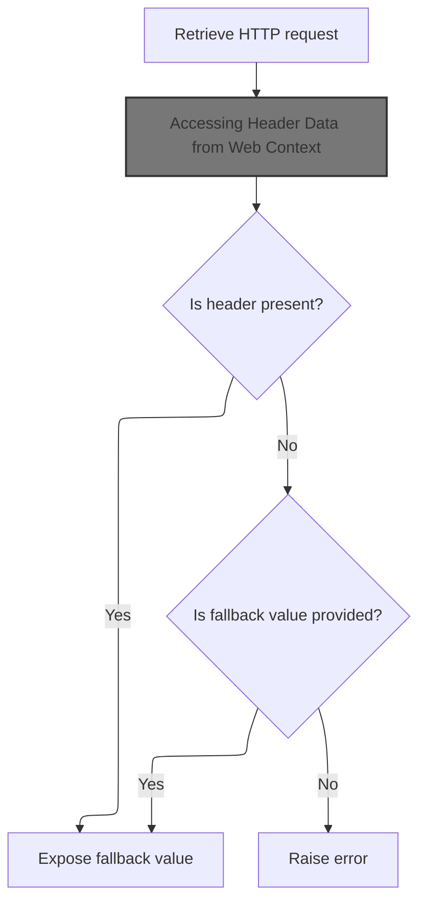
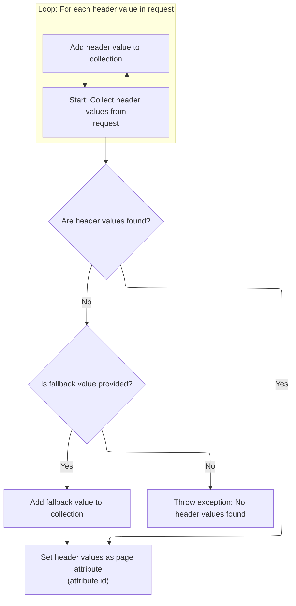

This document describes how HTTP header values are exposed to JSP pages as page attributes. Depending on configuration, either a single header value or all values for a header name are made available. This enables JSP pages to adapt their behavior based on incoming request headers.

# Choosing Single or Multiple Header Handling

<SwmSnippet path="/taglib/src/main/java/org/apache/struts/taglib/bean/HeaderTag.java" line="111">

---

In <SwmToken path="taglib/src/main/java/org/apache/struts/taglib/bean/HeaderTag.java" pos="111:5:5" line-data="    public int doStartTag() throws JspException {">`doStartTag`</SwmToken>, we check if 'multiple' is null to decide if we should fetch a single header or all headers with the given name. If it's null, we call <SwmToken path="taglib/src/main/java/org/apache/struts/taglib/bean/HeaderTag.java" pos="113:3:3" line-data="            this.handleSingleHeader();">`handleSingleHeader`</SwmToken> to grab just one value, which is what most JSPs expect when referencing a header directly.

```java
    public int doStartTag() throws JspException {
        if (this.multiple == null) {
            this.handleSingleHeader();
        } else {
```

---

</SwmSnippet>

## Fetching a Single Header Value



<SwmSnippet path="/taglib/src/main/java/org/apache/struts/taglib/bean/HeaderTag.java" line="160">

---

In <SwmToken path="taglib/src/main/java/org/apache/struts/taglib/bean/HeaderTag.java" pos="160:5:5" line-data="    protected void handleSingleHeader()">`handleSingleHeader`</SwmToken>, we grab the HTTP header value from the request using the header name. To do this, we need to access the <SwmToken path="taglib/src/main/java/org/apache/struts/taglib/bean/HeaderTag.java" pos="163:3:3" line-data="            ((HttpServletRequest) pageContext.getRequest()).getHeader(name);">`HttpServletRequest`</SwmToken>, which is why the next step is to get it from the page context.

```java
    protected void handleSingleHeader()
        throws JspException {
        String value =
            ((HttpServletRequest) pageContext.getRequest()).getHeader(name);
```

---

</SwmSnippet>

### Accessing the HTTP Request Object

<SwmSnippet path="/core/src/main/java/org/apache/struts/chain/contexts/ServletActionContext.java" line="94">

---

GetRequest() just returns the <SwmToken path="core/src/main/java/org/apache/struts/chain/contexts/ServletActionContext.java" pos="94:3:3" line-data="    public HttpServletRequest getRequest() {">`HttpServletRequest`</SwmToken> from the current <SwmToken path="core/src/main/java/org/apache/struts/chain/contexts/ServletActionContext.java" pos="67:3:3" line-data="    protected ServletWebContext servletWebContext() {">`ServletWebContext`</SwmToken>, so the tag handler can read headers and other request data.

```java
    public HttpServletRequest getRequest() {
        return servletWebContext().getRequest();
    }
```

---

</SwmSnippet>

<SwmSnippet path="/core/src/main/java/org/apache/struts/chain/contexts/ServletActionContext.java" line="67">

---

ServletWebContext() just casts <SwmToken path="core/src/main/java/org/apache/struts/chain/contexts/ServletActionContext.java" pos="68:9:11" line-data="        return (ServletWebContext) this.getBaseContext();">`getBaseContext()`</SwmToken> to <SwmToken path="core/src/main/java/org/apache/struts/chain/contexts/ServletActionContext.java" pos="67:3:3" line-data="    protected ServletWebContext servletWebContext() {">`ServletWebContext`</SwmToken>. The code assumes the base context is always of the right type, which is typical for this kind of framework.

```java
    protected ServletWebContext servletWebContext() {
        return (ServletWebContext) this.getBaseContext();
    }
```

---

</SwmSnippet>

### Extracting the Header Value

<SwmSnippet path="/taglib/src/main/java/org/apache/struts/taglib/bean/HeaderTag.java" line="163">

---

Back in HeaderTag.handleSingleHeader, after getting the request, we fetch the header value. If it's not found, we need to check for a default or handle the error, which is why the next step is to interact with <SwmToken path="core/src/main/java/org/apache/struts/chain/contexts/ServletActionContext.java" pos="39:8:8" line-data="public class ServletActionContext extends WebActionContext {">`WebActionContext`</SwmToken> for further context handling.

```java
            ((HttpServletRequest) pageContext.getRequest()).getHeader(name);

```

---

</SwmSnippet>

### Accessing Header Data from Web Context

<SwmSnippet path="/core/src/main/java/org/apache/struts/chain/contexts/WebActionContext.java" line="67">

---

GetHeader() pulls the header map from the current <SwmToken path="core/src/main/java/org/apache/struts/chain/contexts/WebActionContext.java" pos="49:3:3" line-data="    protected WebContext webContext() {">`WebContext`</SwmToken>, so the tag handler can access all header values as needed.

```java
    public Map getHeader() {
        return webContext().getHeader();
    }
```

---

</SwmSnippet>

<SwmSnippet path="/core/src/main/java/org/apache/struts/chain/contexts/WebActionContext.java" line="49">

---

WebContext() just casts <SwmToken path="core/src/main/java/org/apache/struts/chain/contexts/WebActionContext.java" pos="50:9:11" line-data="        return (WebContext) this.getBaseContext();">`getBaseContext()`</SwmToken> to <SwmToken path="core/src/main/java/org/apache/struts/chain/contexts/WebActionContext.java" pos="49:3:3" line-data="    protected WebContext webContext() {">`WebContext`</SwmToken>. The code expects the base context to always be a <SwmToken path="core/src/main/java/org/apache/struts/chain/contexts/WebActionContext.java" pos="49:3:3" line-data="    protected WebContext webContext() {">`WebContext`</SwmToken>, which is standard for this framework.

```java
    protected WebContext webContext() {
        return (WebContext) this.getBaseContext();
    }
```

---

</SwmSnippet>

### Finalizing Single Header Handling

<SwmSnippet path="/taglib/src/main/java/org/apache/struts/taglib/bean/HeaderTag.java" line="165">

---

Back in HeaderTag.handleSingleHeader, after getting the header value (or default), we either throw an exception if it's missing, or set it as an attribute in the page context for the JSP to use.

```java
        if ((value == null) && (this.value != null)) {
            value = this.value;
        }

        if (value == null) {
            JspException e =
                new JspException(messages.getMessage("header.get", name));

            TagUtils.getInstance().saveException(pageContext, e);
            throw e;
        }

        pageContext.setAttribute(id, value);
    }
```

---

</SwmSnippet>

## Handling Multiple Headers if Needed

<SwmSnippet path="/taglib/src/main/java/org/apache/struts/taglib/bean/HeaderTag.java" line="115">

---

Back in HeaderTag.doStartTag, if 'multiple' isn't null, we call <SwmToken path="taglib/src/main/java/org/apache/struts/taglib/bean/HeaderTag.java" pos="115:3:3" line-data="            this.handleMultipleHeaders();">`handleMultipleHeaders`</SwmToken> to collect all header values and make them available to the JSP. The method always returns <SwmToken path="taglib/src/main/java/org/apache/struts/taglib/bean/HeaderTag.java" pos="118:3:3" line-data="        return SKIP_BODY;">`SKIP_BODY`</SwmToken>, so the tag doesn't process a body.

```java
            this.handleMultipleHeaders();
        }

        return SKIP_BODY;
    }
```

---

</SwmSnippet>

# Collecting Multiple Header Values



<SwmSnippet path="/taglib/src/main/java/org/apache/struts/taglib/bean/HeaderTag.java" line="127">

---

In <SwmToken path="taglib/src/main/java/org/apache/struts/taglib/bean/HeaderTag.java" pos="127:5:5" line-data="    protected void handleMultipleHeaders()">`handleMultipleHeaders`</SwmToken>, we collect all values for the given header name from the request. To do this, we need the <SwmToken path="taglib/src/main/java/org/apache/struts/taglib/bean/HeaderTag.java" pos="131:3:3" line-data="            ((HttpServletRequest) pageContext.getRequest()).getHeaders(name);">`HttpServletRequest`</SwmToken>, so the next step is to get it from the page context.

```java
    protected void handleMultipleHeaders()
        throws JspException {
        ArrayList values = new ArrayList();
        Enumeration items =
            ((HttpServletRequest) pageContext.getRequest()).getHeaders(name);

```

---

</SwmSnippet>

<SwmSnippet path="/taglib/src/main/java/org/apache/struts/taglib/bean/HeaderTag.java" line="133">

---

Back in HeaderTag.handleMultipleHeaders, after getting the headers enumeration from the request, we loop through and add each value to a list for later processing.

```java
        while (items.hasMoreElements()) {
            values.add(items.nextElement());
        }
```

---

</SwmSnippet>

<SwmSnippet path="/taglib/src/main/java/org/apache/struts/taglib/bean/HeaderTag.java" line="137">

---

Finally, in <SwmToken path="taglib/src/main/java/org/apache/struts/taglib/bean/HeaderTag.java" pos="115:3:3" line-data="            this.handleMultipleHeaders();">`handleMultipleHeaders`</SwmToken>, if no headers are found, we use a default value if available or throw an exception. The collected values are set as an array attribute in the page context for the JSP to use.

```java
        if (values.isEmpty() && (this.value != null)) {
            values.add(this.value);
        }

        String[] headers = new String[values.size()];

        if (headers.length == 0) {
            JspException e =
                new JspException(messages.getMessage("header.get", name));

            TagUtils.getInstance().saveException(pageContext, e);
            throw e;
        }

        pageContext.setAttribute(id, values.toArray(headers));
    }
```

---

</SwmSnippet>

&nbsp;

*This is an auto-generated document by Swimm 🌊 and has not yet been verified by a human*

<SwmMeta version="3.0.0" repo-id="Z2l0aHViJTNBJTNBc3RydXRzMSUzQSUzQVN3aW1tLURlbW8=" repo-name="struts1"><sup>Powered by [Swimm](https://app.swimm.io/)</sup></SwmMeta>
