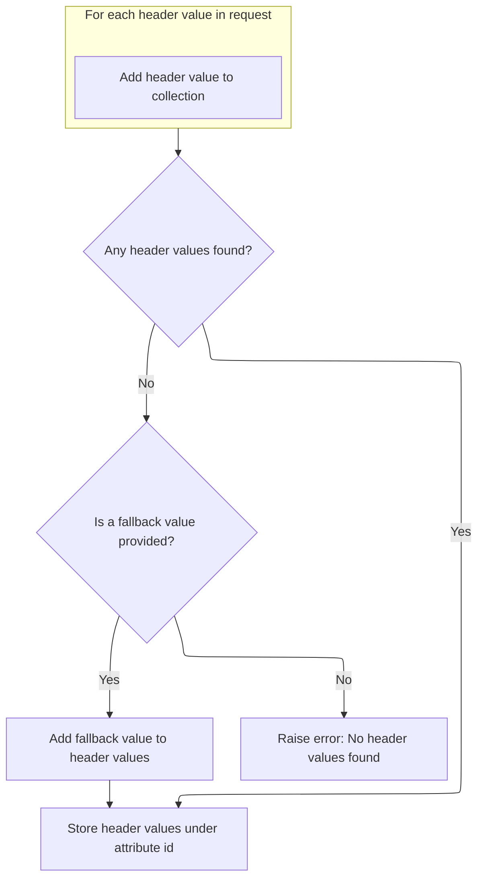

This document explains how HTTP header values are exposed to JSP pages for use in rendering dynamic content. Depending on configuration, either a single value or all values for a given header name are retrieved from the HTTP request and made available as page attributes. This enables JSPs to adapt their output based on client request data.

# Deciding How to Process Headers

<SwmSnippet path="/taglib/src/main/java/org/apache/struts/taglib/bean/HeaderTag.java" line="111">

---

In <SwmToken path="taglib/src/main/java/org/apache/struts/taglib/bean/HeaderTag.java" pos="111:5:5" line-data="    public int doStartTag() throws JspException {">`doStartTag`</SwmToken>, we decide if we're dealing with one header or multiple. If 'multiple' is null, we call <SwmToken path="taglib/src/main/java/org/apache/struts/taglib/bean/HeaderTag.java" pos="113:3:3" line-data="            this.handleSingleHeader();">`handleSingleHeader`</SwmToken> to grab just one header value. This sets up the tag to expose a single header to the JSP. If 'multiple' isn't null, we switch to handling multiple headers instead.

```java
    public int doStartTag() throws JspException {
        if (this.multiple == null) {
            this.handleSingleHeader();
        } else {
```

---

</SwmSnippet>

<SwmSnippet path="/taglib/src/main/java/org/apache/struts/taglib/bean/HeaderTag.java" line="160">

---

<SwmToken path="taglib/src/main/java/org/apache/struts/taglib/bean/HeaderTag.java" pos="160:5:5" line-data="    protected void handleSingleHeader()">`handleSingleHeader`</SwmToken> grabs the header value from the request. If it's missing, it checks for a local fallback. If neither is found, it throws a localized exception and saves it in the page context for JSP error handling. If a value is found, it sets it as a page attribute so the JSP can use it.

```java
    protected void handleSingleHeader()
        throws JspException {
        String value =
            ((HttpServletRequest) pageContext.getRequest()).getHeader(name);

        if ((value == null) && (this.value != null)) {
            value = this.value;
        }

        if (value == null) {
            JspException e =
                new JspException(messages.getMessage("header.get", name));

            TagUtils.getInstance().saveException(pageContext, e);
            throw e;
        }

        pageContext.setAttribute(id, value);
    }
```

---

</SwmSnippet>

<SwmSnippet path="/taglib/src/main/java/org/apache/struts/taglib/bean/HeaderTag.java" line="115">

---

Back in <SwmToken path="taglib/src/main/java/org/apache/struts/taglib/bean/HeaderTag.java" pos="111:5:5" line-data="    public int doStartTag() throws JspException {">`doStartTag`</SwmToken>, after handling a single header, if 'multiple' isn't null, we call <SwmToken path="taglib/src/main/java/org/apache/struts/taglib/bean/HeaderTag.java" pos="115:3:3" line-data="            this.handleMultipleHeaders();">`handleMultipleHeaders`</SwmToken> to collect all matching headers. The function always returns <SwmToken path="taglib/src/main/java/org/apache/struts/taglib/bean/HeaderTag.java" pos="118:3:3" line-data="        return SKIP_BODY;">`SKIP_BODY`</SwmToken>, so the JSP skips the tag body and just uses the header values set in the context.

```java
            this.handleMultipleHeaders();
        }

        return SKIP_BODY;
    }
```

---

</SwmSnippet>

# Collecting Multiple Header Values



<SwmSnippet path="/taglib/src/main/java/org/apache/struts/taglib/bean/HeaderTag.java" line="127">

---

In <SwmToken path="taglib/src/main/java/org/apache/struts/taglib/bean/HeaderTag.java" pos="127:5:5" line-data="    protected void handleMultipleHeaders()">`handleMultipleHeaders`</SwmToken>, we grab all values for the header name from the request and add them to a list. This lets us handle cases where the header appears multiple times, so the JSP gets every value.

```java
    protected void handleMultipleHeaders()
        throws JspException {
        ArrayList values = new ArrayList();
        Enumeration items =
            ((HttpServletRequest) pageContext.getRequest()).getHeaders(name);

        while (items.hasMoreElements()) {
            values.add(items.nextElement());
        }
```

---

</SwmSnippet>

<SwmSnippet path="/taglib/src/main/java/org/apache/struts/taglib/bean/HeaderTag.java" line="137">

---

After collecting header values, if none are found and there's a fallback, we add that. If still empty, we throw a localized exception and save it for JSP error handling. Otherwise, we set the array of values as a page attribute so the JSP can use them.

```java
        if (values.isEmpty() && (this.value != null)) {
            values.add(this.value);
        }

        String[] headers = new String[values.size()];

        if (headers.length == 0) {
            JspException e =
                new JspException(messages.getMessage("header.get", name));

            TagUtils.getInstance().saveException(pageContext, e);
            throw e;
        }

        pageContext.setAttribute(id, values.toArray(headers));
    }
```

---

</SwmSnippet>

&nbsp;

*This is an auto-generated document by Swimm 🌊 and has not yet been verified by a human*

<SwmMeta version="3.0.0" repo-id="Z2l0aHViJTNBJTNBc3RydXRzMSUzQSUzQVN3aW1tLURlbW8=" repo-name="struts1"><sup>Powered by [Swimm](https://app.swimm.io/)</sup></SwmMeta>
