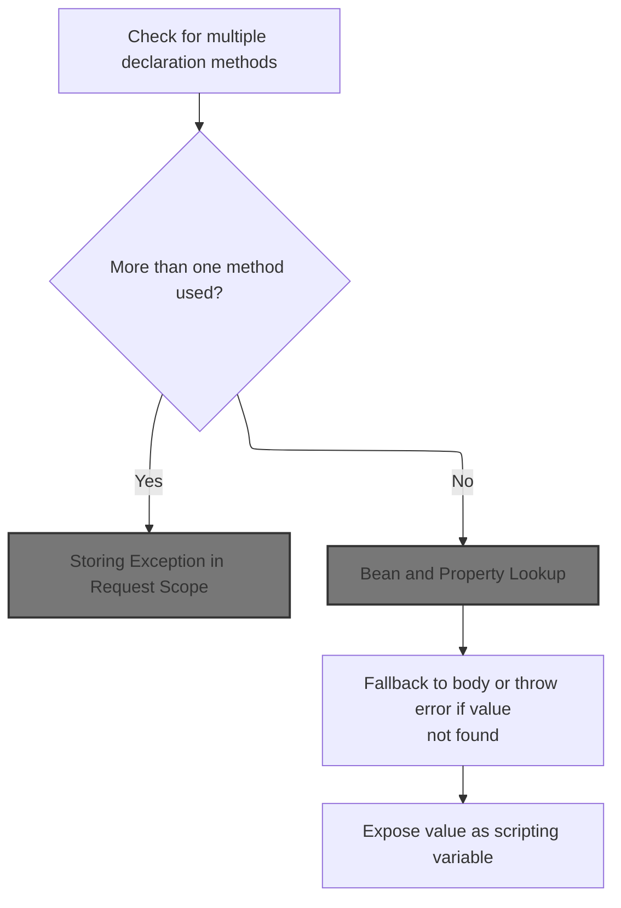
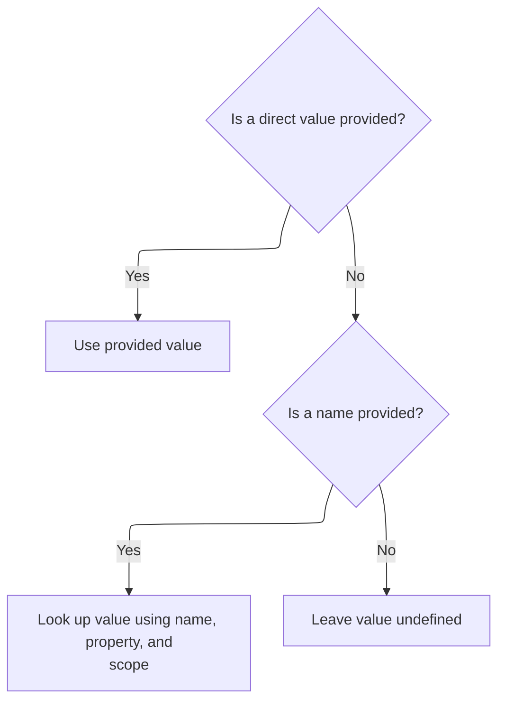
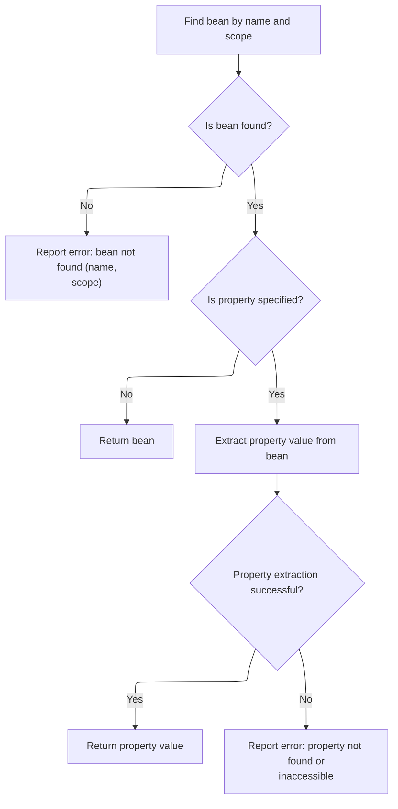

This document describes how a value is exposed as a scripting variable in a JSP page. The process ensures only one declaration method is used, resolves the value from available sources, and makes it available in the specified scope. If the value cannot be determined, error information is provided for handling.

# Validating Declaration Method



<SwmSnippet path="/taglib/src/main/java/org/apache/struts/taglib/bean/DefineTag.java" line="191">

---

In <SwmToken path="taglib/src/main/java/org/apache/struts/taglib/bean/DefineTag.java" pos="191:5:5" line-data="    public int doEndTag() throws JspException {">`doEndTag`</SwmToken>, we check that only one of body, name, or value is set to avoid conflicting declarations. If more than one is set, we throw a <SwmToken path="taglib/src/main/java/org/apache/struts/taglib/bean/DefineTag.java" pos="191:11:11" line-data="    public int doEndTag() throws JspException {">`JspException`</SwmToken> and log it using TagUtils.saveException, so the error is accessible in the request scope for downstream error handling.

```java
    public int doEndTag() throws JspException {
        // Enforce restriction on ways to declare the new value
        int n = 0;

        if (this.body != null) {
            n++;
        }

        if (this.name != null) {
            n++;
        }

        if (this.value != null) {
            n++;
        }

        if (n > 1) {
            JspException e =
                new JspException(messages.getMessage("define.value", id));

            TagUtils.getInstance().saveException(pageContext, e);
            throw e;
        }

```

---

</SwmSnippet>

## Storing Exception in Request Scope

<SwmSnippet path="/tiles/src/main/java/org/apache/struts/tiles/taglib/util/TagUtils.java" line="301">

---

<SwmToken path="tiles/src/main/java/org/apache/struts/tiles/taglib/util/TagUtils.java" pos="301:7:7" line-data="    public static void saveException(PageContext pageContext, Throwable exception) {">`saveException`</SwmToken> puts the exception into the page context under <SwmToken path="tiles/src/main/java/org/apache/struts/tiles/taglib/util/TagUtils.java" pos="302:5:7" line-data="        pageContext.setAttribute(Globals.EXCEPTION_KEY, exception, PageContext.REQUEST_SCOPE);">`Globals.EXCEPTION_KEY`</SwmToken> in the request scope, so error handlers can pick it up during this request.

```java
    public static void saveException(PageContext pageContext, Throwable exception) {
        pageContext.setAttribute(Globals.EXCEPTION_KEY, exception, PageContext.REQUEST_SCOPE);
    }
```

---

</SwmSnippet>

<SwmSnippet path="/tiles/src/main/java/org/apache/struts/tiles/taglib/util/TagUtils.java" line="290">

---

<SwmToken path="tiles/src/main/java/org/apache/struts/tiles/taglib/util/TagUtils.java" pos="290:7:7" line-data="    public static void setAttribute(PageContext pageContext, String name, Object beanValue)">`setAttribute`</SwmToken> always puts the attribute in the request scope, regardless of caller intent, so it's only visible for the current request cycle.

```java
    public static void setAttribute(PageContext pageContext, String name, Object beanValue)
        throws JspException {
        pageContext.setAttribute(name, beanValue, PageContext.REQUEST_SCOPE);
    }
```

---

</SwmSnippet>

## Resolving Value Source



<SwmSnippet path="/taglib/src/main/java/org/apache/struts/taglib/bean/DefineTag.java" line="215">

---

Back in DefineTag.doEndTag, after handling exceptions, we try to resolve the value: first from the explicit value, then by looking up name/property using TagUtils.lookup, and only if those fail, from the body.

```java
        // Retrieve the required property value
        Object value = this.value;

        if ((value == null) && (name != null)) {
            value =
                TagUtils.getInstance().lookup(pageContext, name, property, scope);
        }

```

---

</SwmSnippet>

## Bean and Property Lookup



<SwmSnippet path="/taglib/src/main/java/org/apache/struts/taglib/TagUtils.java" line="897">

---

In <SwmToken path="taglib/src/main/java/org/apache/struts/taglib/TagUtils.java" pos="897:5:5" line-data="    public Object lookup(PageContext pageContext, String name, String property,">`lookup`</SwmToken>, we first find the bean by name and scope, then optionally retrieve a property. If either fails, we throw and log exceptions. Special handling for <SwmToken path="taglib/src/main/java/org/apache/struts/taglib/TagUtils.java" pos="946:11:11" line-data="            // Name defaults to Contants.BEAN_KEY if no name is specified by">`BEAN_KEY`</SwmToken> gives clearer error messages by using the bean's class name.

```java
    public Object lookup(PageContext pageContext, String name, String property,
        String scope) throws JspException {
        // Look up the requested bean, and return if requested
        Object bean = lookup(pageContext, name, scope);

        if (bean == null) {
            JspException e = null;

            if (scope == null) {
                e = new JspException(messages.getMessage("lookup.bean.any", name));
            } else {
                e = new JspException(messages.getMessage("lookup.bean", name,
                            scope));
            }

            saveException(pageContext, e);
            throw e;
        }

        if (property == null) {
            return bean;
        }

        // Locate and return the specified property
        try {
            return PropertyUtils.getProperty(bean, property);
        } catch (IllegalAccessException e) {
            saveException(pageContext, e);
            throw new JspException(messages.getMessage("lookup.access",
                    property, name), e);
        } catch (IllegalArgumentException e) {
            saveException(pageContext, e);
            throw new JspException(messages.getMessage("lookup.argument",
                    property, name), e);
        } catch (InvocationTargetException e) {
            Throwable t = e.getTargetException();

            if (t == null) {
                t = e;
            }

            saveException(pageContext, t);
            throw new JspException(messages.getMessage("lookup.target",
                    property, name), e);
        } catch (NoSuchMethodException e) {
            saveException(pageContext, e);

```

---

</SwmSnippet>

<SwmSnippet path="/taglib/src/main/java/org/apache/struts/taglib/TagUtils.java" line="1170">

---

<SwmToken path="taglib/src/main/java/org/apache/struts/taglib/TagUtils.java" pos="1170:5:5" line-data="    public void saveException(PageContext pageContext, Throwable exception) {">`saveException`</SwmToken> here logs exceptions in the request scope, just like the tiles <SwmToken path="taglib/src/main/java/org/apache/struts/taglib/bean/DefineTag.java" pos="211:1:1" line-data="            TagUtils.getInstance().saveException(pageContext, e);">`TagUtils`</SwmToken>, so error handlers can access them during the request.

```java
    public void saveException(PageContext pageContext, Throwable exception) {
        pageContext.setAttribute(Globals.EXCEPTION_KEY, exception,
            PageContext.REQUEST_SCOPE);
    }
```

---

</SwmSnippet>

<SwmSnippet path="/taglib/src/main/java/org/apache/struts/taglib/TagUtils.java" line="944">

---

Back in TagUtils.lookup, if the bean name is <SwmToken path="taglib/src/main/java/org/apache/struts/taglib/TagUtils.java" pos="946:11:11" line-data="            // Name defaults to Contants.BEAN_KEY if no name is specified by">`BEAN_KEY`</SwmToken> and a property is missing, we fetch the bean's class name for the error message, so developers get more useful info when debugging.

```java
            String beanName = name;

            // Name defaults to Contants.BEAN_KEY if no name is specified by
            // an input tag. Thus lookup the bean under the key and use
            // its class name for the exception message.
            if (Constants.BEAN_KEY.equals(name)) {
                Object obj = pageContext.findAttribute(Constants.BEAN_KEY);

                if (obj != null) {
                    beanName = obj.getClass().getName();
                }
            }

            throw new JspException(messages.getMessage("lookup.method",
                    property, beanName), e);
        }
    }
```

---

</SwmSnippet>

## Fallback and Exception Handling

```mermaid
%%{init: {"flowchart": {"defaultRenderer": "elk"}} }%%
flowchart TD
    node1["Start: Prepare to expose value as
scripting variable"] --> node2{"Is value null and body not null?"}
    click node1 openCode "taglib/src/main/java/org/apache/struts/taglib/bean/DefineTag.java:223:223"
    node2 -->|"Yes"| node3["Set value from body"]
    click node2 openCode "taglib/src/main/java/org/apache/struts/taglib/bean/DefineTag.java:223:224"
    node2 -->|"No"| node4{"Is value still null?"}
    click node3 openCode "taglib/src/main/java/org/apache/struts/taglib/bean/DefineTag.java:224:224"
    node3 --> node4
    node4 -->|"Yes"| node5["Throw exception: value is missing, stop
page processing"]
    click node4 openCode "taglib/src/main/java/org/apache/struts/taglib/bean/DefineTag.java:227:233"
    node4 -->|"No"| node6{"Is toScope specified?"}
    click node5 openCode "taglib/src/main/java/org/apache/struts/taglib/bean/DefineTag.java:227:233"
    node6 -->|"Yes"| node7{"Is toScope valid?"}
    click node6 openCode "taglib/src/main/java/org/apache/struts/taglib/bean/DefineTag.java:239:241"
    node6 -->|"No"| node8["Expose value as scripting variable with
id in PAGE_SCOPE"]
    click node8 openCode "taglib/src/main/java/org/apache/struts/taglib/bean/DefineTag.java:246:246"
    node7 -->|"Yes"| node9["Expose value as scripting variable with
id in specified scope"]
    click node7 openCode "taglib/src/main/java/org/apache/struts/taglib/bean/DefineTag.java:246:246"
    node7 -->|"No"| node8
    node9 --> node10["Page processing continues"]
    node8 --> node10
    click node10 openCode "taglib/src/main/java/org/apache/struts/taglib/bean/DefineTag.java:249:249"
classDef HeadingStyle fill:#777777,stroke:#333,stroke-width:2px;

%% Swimm:
%% %%{init: {"flowchart": {"defaultRenderer": "elk"}} }%%
%% flowchart TD
%%     node1["Start: Prepare to expose value as
%% scripting variable"] --> node2{"Is value null and body not null?"}
%%     click node1 openCode "<SwmPath>[taglib/…/bean/DefineTag.java](taglib/src/main/java/org/apache/struts/taglib/bean/DefineTag.java)</SwmPath>:223:223"
%%     node2 -->|"Yes"| node3["Set value from body"]
%%     click node2 openCode "<SwmPath>[taglib/…/bean/DefineTag.java](taglib/src/main/java/org/apache/struts/taglib/bean/DefineTag.java)</SwmPath>:223:224"
%%     node2 -->|"No"| node4{"Is value still null?"}
%%     click node3 openCode "<SwmPath>[taglib/…/bean/DefineTag.java](taglib/src/main/java/org/apache/struts/taglib/bean/DefineTag.java)</SwmPath>:224:224"
%%     node3 --> node4
%%     node4 -->|"Yes"| node5["Throw exception: value is missing, stop
%% page processing"]
%%     click node4 openCode "<SwmPath>[taglib/…/bean/DefineTag.java](taglib/src/main/java/org/apache/struts/taglib/bean/DefineTag.java)</SwmPath>:227:233"
%%     node4 -->|"No"| node6{"Is <SwmToken path="taglib/src/main/java/org/apache/struts/taglib/bean/DefineTag.java" pos="239:4:4" line-data="            if (toScope != null) {">`toScope`</SwmToken> specified?"}
%%     click node5 openCode "<SwmPath>[taglib/…/bean/DefineTag.java](taglib/src/main/java/org/apache/struts/taglib/bean/DefineTag.java)</SwmPath>:227:233"
%%     node6 -->|"Yes"| node7{"Is <SwmToken path="taglib/src/main/java/org/apache/struts/taglib/bean/DefineTag.java" pos="239:4:4" line-data="            if (toScope != null) {">`toScope`</SwmToken> valid?"}
%%     click node6 openCode "<SwmPath>[taglib/…/bean/DefineTag.java](taglib/src/main/java/org/apache/struts/taglib/bean/DefineTag.java)</SwmPath>:239:241"
%%     node6 -->|"No"| node8["Expose value as scripting variable with
%% id in <SwmToken path="taglib/src/main/java/org/apache/struts/taglib/bean/DefineTag.java" pos="236:9:9" line-data="        int inScope = PageContext.PAGE_SCOPE;">`PAGE_SCOPE`</SwmToken>"]
%%     click node8 openCode "<SwmPath>[taglib/…/bean/DefineTag.java](taglib/src/main/java/org/apache/struts/taglib/bean/DefineTag.java)</SwmPath>:246:246"
%%     node7 -->|"Yes"| node9["Expose value as scripting variable with
%% id in specified scope"]
%%     click node7 openCode "<SwmPath>[taglib/…/bean/DefineTag.java](taglib/src/main/java/org/apache/struts/taglib/bean/DefineTag.java)</SwmPath>:246:246"
%%     node7 -->|"No"| node8
%%     node9 --> node10["Page processing continues"]
%%     node8 --> node10
%%     click node10 openCode "<SwmPath>[taglib/…/bean/DefineTag.java](taglib/src/main/java/org/apache/struts/taglib/bean/DefineTag.java)</SwmPath>:249:249"
%% classDef HeadingStyle fill:#777777,stroke:#333,stroke-width:2px;
```



<SwmSnippet path="/taglib/src/main/java/org/apache/struts/taglib/bean/DefineTag.java" line="223">

---

Back in DefineTag.doEndTag, after trying explicit value and lookup, if the value is still null, we use the body. If that's also null, we log and throw an exception using TagUtils.saveException.

```java
        if ((value == null) && (body != null)) {
            value = body;
        }

        if (value == null) {
            JspException e =
                new JspException(messages.getMessage("define.null", id));

            TagUtils.getInstance().saveException(pageContext, e);
            throw e;
        }

```

---

</SwmSnippet>

<SwmSnippet path="/taglib/src/main/java/org/apache/struts/taglib/bean/DefineTag.java" line="235">

---

Finally, in DefineTag.doEndTag, we pick the scope for the scripting variable: defaulting to <SwmToken path="taglib/src/main/java/org/apache/struts/taglib/bean/DefineTag.java" pos="236:9:9" line-data="        int inScope = PageContext.PAGE_SCOPE;">`PAGE_SCOPE`</SwmToken>, or using <SwmToken path="taglib/src/main/java/org/apache/struts/taglib/bean/DefineTag.java" pos="239:4:4" line-data="            if (toScope != null) {">`toScope`</SwmToken> if valid. If <SwmToken path="taglib/src/main/java/org/apache/struts/taglib/bean/DefineTag.java" pos="239:4:4" line-data="            if (toScope != null) {">`toScope`</SwmToken> is invalid, we log a warning and stick with <SwmToken path="taglib/src/main/java/org/apache/struts/taglib/bean/DefineTag.java" pos="236:9:9" line-data="        int inScope = PageContext.PAGE_SCOPE;">`PAGE_SCOPE`</SwmToken>. The value is then set in the page context for use in the rest of the JSP.

```java
        // Expose this value as a scripting variable
        int inScope = PageContext.PAGE_SCOPE;

        try {
            if (toScope != null) {
                inScope = TagUtils.getInstance().getScope(toScope);
            }
        } catch (JspException e) {
            log.warn("toScope was invalid name so we default to PAGE_SCOPE", e);
        }

        pageContext.setAttribute(id, value, inScope);

        // Continue processing this page
        return (EVAL_PAGE);
    }
```

---

</SwmSnippet>

&nbsp;

*This is an auto-generated document by Swimm 🌊 and has not yet been verified by a human*

<SwmMeta version="3.0.0" repo-id="Z2l0aHViJTNBJTNBc3RydXRzMSUzQSUzQVN3aW1tLURlbW8=" repo-name="struts1"><sup>Powered by [Swimm](https://app.swimm.io/)</sup></SwmMeta>
