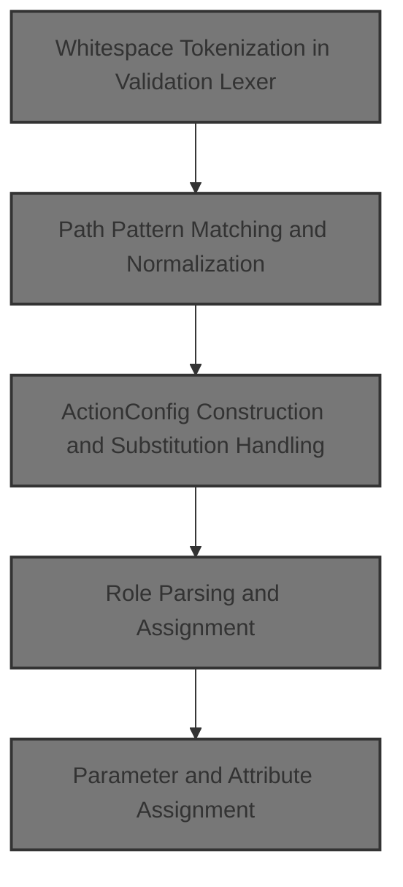
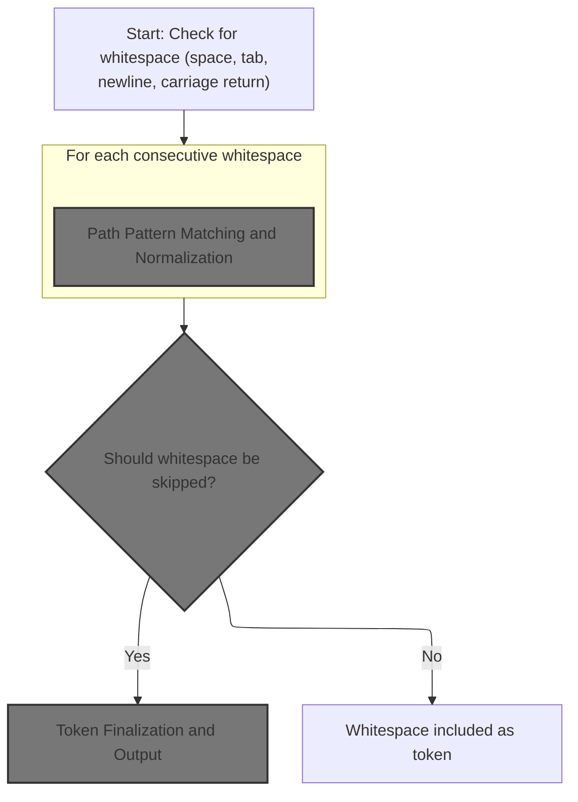
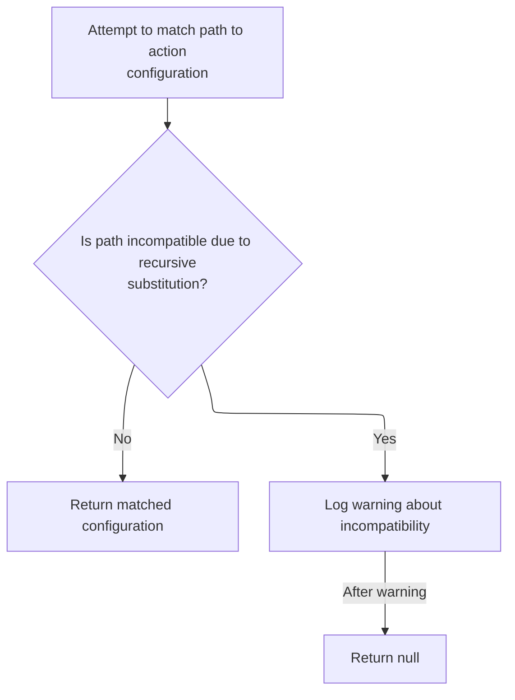
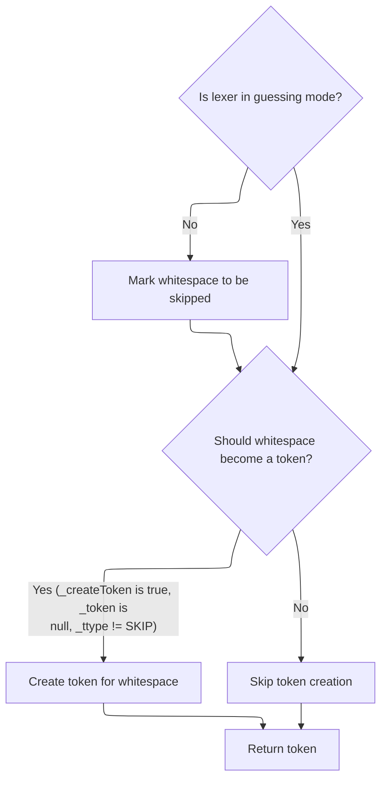

This document outlines how a path and its configuration are processed to produce a finalized action configuration. The flow includes whitespace tokenization, pattern matching, variable extraction, and substitution of all relevant fields, resulting in an immutable configuration ready for routing and validation.



# Whitespace Tokenization in Validation Lexer



<SwmSnippet path="/core/src/main/java/org/apache/struts/validator/validwhen/ValidWhenLexer.java" line="202">

---

In <SwmToken path="core/src/main/java/org/apache/struts/validator/validwhen/ValidWhenLexer.java" pos="202:7:7" line-data="	public final void mWS(boolean _createToken) throws RecognitionException, CharStreamException, TokenStreamException {">`mWS`</SwmToken>, the lexer loops through the input, matching spaces, tabs, newlines, and carriage returns as whitespace tokens. If it hits a non-whitespace character, it throws an exception unless at least one whitespace was already matched. After tokenizing whitespace, the flow continues to <SwmToken path="core/src/main/java/org/apache/struts/config/ActionConfigMatcher.java" pos="47:4:4" line-data="public class ActionConfigMatcher implements Serializable {">`ActionConfigMatcher`</SwmToken>, where the actual path matching and configuration logic happens, using the cleaned-up input.

```java
	public final void mWS(boolean _createToken) throws RecognitionException, CharStreamException, TokenStreamException {
		int _ttype; Token _token=null; int _begin=text.length();
		_ttype = WS;
		int _saveIndex;
		
		{
		int _cnt17=0;
		_loop17:
		do {
			switch ( LA(1)) {
			case ' ':
			{
				match(' ');
				break;
			}
			case '\t':
			{
				match('\t');
				break;
			}
			case '\n':
			{
				match('\n');
				break;
			}
			case '\r':
			{
				match('\r');
				break;
			}
			default:
			{
				if ( _cnt17>=1 ) { break _loop17; } else {throw new NoViableAltForCharException((char)LA(1), getFilename(), getLine(), getColumn());}
			}
			}
			_cnt17++;
		} while (true);
		}
```

---

</SwmSnippet>

## Path Pattern Matching and Normalization

<SwmSnippet path="/core/src/main/java/org/apache/struts/config/ActionConfigMatcher.java" line="101">

---

In <SwmToken path="core/src/main/java/org/apache/struts/config/ActionConfigMatcher.java" pos="101:5:5" line-data="    public ActionConfig match(String path) {">`match`</SwmToken>, the code strips a leading slash from the path if present, then loops through all compiled path patterns. For each, it uses WildcardHelper.match to see if the path fits the pattern. If there's a match, it tries to build a new <SwmToken path="core/src/main/java/org/apache/struts/config/ActionConfigMatcher.java" pos="101:3:3" line-data="    public ActionConfig match(String path) {">`ActionConfig`</SwmToken> using the matched variables. The next step is to call <SwmToken path="core/src/main/java/org/apache/struts/config/ActionConfigMatcher.java" pos="27:10:10" line-data="import org.apache.struts.util.WildcardHelper;">`WildcardHelper`</SwmToken> to actually perform the wildcard matching logic.

```java
    public ActionConfig match(String path) {
        ActionConfig config = null;

        if (compiledPaths.size() > 0) {
            if (log.isDebugEnabled()) {
                log.debug("Attempting to match '" + path
                    + "' to a wildcard pattern");
            }

            if ((path.length() > 0) && (path.charAt(0) == '/')) {
                path = path.substring(1);
            }

            Mapping m;
            HashMap vars = new HashMap();

            for (Iterator i = compiledPaths.iterator(); i.hasNext();) {
                m = (Mapping) i.next();

                if (wildcard.match(vars, path, m.getPattern())) {
                    if (log.isDebugEnabled()) {
                        log.debug("Path matches pattern '"
                            + m.getActionConfig().getPath() + "'");
                    }

```

---

</SwmSnippet>

### Wildcard Pattern Evaluation

See <SwmLink doc-title="Pattern Matching with Wildcards">[Pattern Matching with Wildcards](/.swm/pattern-matching-with-wildcards.fhxreivg.sw.md)</SwmLink>

### <SwmToken path="core/src/main/java/org/apache/struts/config/ActionConfigMatcher.java" pos="101:3:3" line-data="    public ActionConfig match(String path) {">`ActionConfig`</SwmToken> Construction and Substitution Handling



<SwmSnippet path="/core/src/main/java/org/apache/struts/config/ActionConfigMatcher.java" line="126">

---

Back in `ActionConfigMatcher.match`, after returning from <SwmToken path="core/src/main/java/org/apache/struts/config/ActionConfigMatcher.java" pos="27:10:10" line-data="import org.apache.struts.util.WildcardHelper;">`WildcardHelper`</SwmToken>, the code tries to convert the matched <SwmToken path="core/src/main/java/org/apache/struts/config/ActionConfigMatcher.java" pos="129:2:2" line-data="                		    (ActionConfig) m.getActionConfig(), vars);">`ActionConfig`</SwmToken> using the extracted variables. If recursive substitution is detected, it logs a warning and skips the config. The next step is to call <SwmToken path="core/src/main/java/org/apache/struts/config/ActionConfigMatcher.java" pos="128:1:1" line-data="                	    convertActionConfig(path,">`convertActionConfig`</SwmToken> to build the final <SwmToken path="core/src/main/java/org/apache/struts/config/ActionConfigMatcher.java" pos="129:2:2" line-data="                		    (ActionConfig) m.getActionConfig(), vars);">`ActionConfig`</SwmToken> instance.

```java
                    try {
                	config =
                	    convertActionConfig(path,
                		    (ActionConfig) m.getActionConfig(), vars);
                    } catch (IllegalStateException e) {
                	log.warn("Path matches pattern '"
                		+ m.getActionConfig().getPath() + "' but is "
                		+ "incompatible with the matching config due "
                		+ "to recursive substitution: "
                		+ path);
                	config = null;
                    }
                }
            }
        }

        return config;
    }
```

---

</SwmSnippet>

## <SwmToken path="core/src/main/java/org/apache/struts/config/ActionConfigMatcher.java" pos="101:3:3" line-data="    public ActionConfig match(String path) {">`ActionConfig`</SwmToken> Cloning and Parameter Substitution

<SwmSnippet path="/core/src/main/java/org/apache/struts/config/ActionConfigMatcher.java" line="157">

---

In <SwmToken path="core/src/main/java/org/apache/struts/config/ActionConfigMatcher.java" pos="157:5:5" line-data="    protected ActionConfig convertActionConfig(String path, ActionConfig orig,">`convertActionConfig`</SwmToken>, the code clones the original <SwmToken path="core/src/main/java/org/apache/struts/config/ActionConfigMatcher.java" pos="157:3:3" line-data="    protected ActionConfig convertActionConfig(String path, ActionConfig orig,">`ActionConfig`</SwmToken> and starts substituting parameters using the provided variables. If cloning fails, it logs a warning and returns null. The next step is to substitute the name field using <SwmToken path="core/src/main/java/org/apache/struts/config/ActionConfigMatcher.java" pos="170:5:5" line-data="        config.setName(convertParam(orig.getName(), vars));">`convertParam`</SwmToken>.

```java
    protected ActionConfig convertActionConfig(String path, ActionConfig orig,
        Map vars) {
        ActionConfig config = null;

        try {
            config = (ActionConfig) BeanUtils.cloneBean(orig);
        } catch (Exception ex) {
            log.warn("Unable to clone action config, recommend not using "
                + "wildcards", ex);

            return null;
        }

        config.setName(convertParam(orig.getName(), vars));
```

---

</SwmSnippet>

<SwmSnippet path="/core/src/main/java/org/apache/struts/config/ActionConfigMatcher.java" line="258">

---

<SwmToken path="core/src/main/java/org/apache/struts/config/ActionConfigMatcher.java" pos="258:5:5" line-data="    protected String convertParam(String val, Map vars) {">`convertParam`</SwmToken> replaces placeholders like '{x}' in the input string with values from the vars map, assuming single-character keys. It checks for cycles to avoid infinite loops. This prepares the string for use in the cloned <SwmToken path="core/src/main/java/org/apache/struts/config/ActionConfigMatcher.java" pos="101:3:3" line-data="    public ActionConfig match(String path) {">`ActionConfig`</SwmToken>. The next step is to set the substituted name in the config.

```java
    protected String convertParam(String val, Map vars) {
        if (val == null) {
            return null;
        } else if (val.indexOf("{") == -1) {
            return val;
        }

        Map.Entry entry;
        StringBuffer key = new StringBuffer("{0}");
        StringBuffer ret = new StringBuffer(val);
        String keyStr;
        int x;

        for (Iterator i = vars.entrySet().iterator(); i.hasNext();) {
            entry = (Map.Entry) i.next();
            key.setCharAt(1, ((String) entry.getKey()).charAt(0));
            keyStr = key.toString();
            
            // STR-3169
            // Prevent an infinite loop by retaining the placeholders
            // that contain itself in the substitution value
            if (((String) entry.getValue()).contains(keyStr)) {
        	throw new IllegalStateException();
            }
            
            // Replace all instances of the placeholder
            while ((x = ret.toString().indexOf(keyStr)) > -1) {
                ret.replace(x, x + 3, (String) entry.getValue());
            }
        }
```

---

</SwmSnippet>

<SwmSnippet path="/core/src/main/java/org/apache/struts/config/ActionConfigMatcher.java" line="170">

---

Back from <SwmToken path="core/src/main/java/org/apache/struts/config/ActionConfigMatcher.java" pos="170:5:5" line-data="        config.setName(convertParam(orig.getName(), vars));">`convertParam`</SwmToken> in <SwmToken path="core/src/main/java/org/apache/struts/config/ActionConfigMatcher.java" pos="47:4:4" line-data="public class ActionConfigMatcher implements Serializable {">`ActionConfigMatcher`</SwmToken>, the code now sets the name on the config object using the substituted value. The next step is to call ActionConfig.setName to update the config instance.

```java
        config.setName(convertParam(orig.getName(), vars));

```

---

</SwmSnippet>

<SwmSnippet path="/core/src/main/java/org/apache/struts/config/ActionConfig.java" line="517">

---

<SwmToken path="core/src/main/java/org/apache/struts/config/ActionConfig.java" pos="517:5:5" line-data="    public void setName(String name) {">`setName`</SwmToken> checks if the configuration is frozen (configured == true) and throws if so. Otherwise, it updates the name. This ensures the config can't be changed after being finalized.

```java
    public void setName(String name) {
        if (configured) {
            throw new IllegalStateException("Configuration is frozen");
        }

        this.name = name;
    }
```

---

</SwmSnippet>

<SwmSnippet path="/core/src/main/java/org/apache/struts/config/ActionConfigMatcher.java" line="172">

---

Back from <SwmToken path="core/src/main/java/org/apache/struts/config/ActionConfigMatcher.java" pos="170:3:3" line-data="        config.setName(convertParam(orig.getName(), vars));">`setName`</SwmToken> in <SwmToken path="core/src/main/java/org/apache/struts/config/ActionConfigMatcher.java" pos="101:3:3" line-data="    public ActionConfig match(String path) {">`ActionConfig`</SwmToken>, the code checks if the path starts with a slash and adds one if needed, then sets the path on the config. The next step is to call ActionConfig.setPath to update the routing info.

```java
        if ((path.length() == 0) || (path.charAt(0) != '/')) {
            path = "/" + path;
        }

        config.setPath(path);
```

---

</SwmSnippet>

<SwmSnippet path="/core/src/main/java/org/apache/struts/config/ActionConfig.java" line="565">

---

<SwmToken path="core/src/main/java/org/apache/struts/config/ActionConfig.java" pos="565:5:5" line-data="    public void setPath(String path) {">`setPath`</SwmToken> checks if the configuration is frozen and throws if so. Otherwise, it updates the path. This keeps the config immutable after it's finalized.

```java
    public void setPath(String path) {
        if (configured) {
            throw new IllegalStateException("Configuration is frozen");
        }

        this.path = path;
    }
```

---

</SwmSnippet>

<SwmSnippet path="/core/src/main/java/org/apache/struts/config/ActionConfigMatcher.java" line="177">

---

Back from <SwmToken path="core/src/main/java/org/apache/struts/config/ActionConfigMatcher.java" pos="176:3:3" line-data="        config.setPath(path);">`setPath`</SwmToken> in <SwmToken path="core/src/main/java/org/apache/struts/config/ActionConfigMatcher.java" pos="101:3:3" line-data="    public ActionConfig match(String path) {">`ActionConfig`</SwmToken>, the code now sets the type on the config using the substituted value. The next step is to call ActionConfig.setType to update the handler info.

```java
        config.setType(convertParam(orig.getType(), vars));
```

---

</SwmSnippet>

<SwmSnippet path="/core/src/main/java/org/apache/struts/config/ActionConfigMatcher.java" line="177">

---

Back from <SwmToken path="core/src/main/java/org/apache/struts/config/ActionConfigMatcher.java" pos="177:5:5" line-data="        config.setType(convertParam(orig.getType(), vars));">`convertParam`</SwmToken> in <SwmToken path="core/src/main/java/org/apache/struts/config/ActionConfigMatcher.java" pos="47:4:4" line-data="public class ActionConfigMatcher implements Serializable {">`ActionConfigMatcher`</SwmToken>, the code now sets the type on the config object using the substituted value. The next step is to call ActionConfig.setType to update the config instance.

```java
        config.setType(convertParam(orig.getType(), vars));
```

---

</SwmSnippet>

<SwmSnippet path="/core/src/main/java/org/apache/struts/config/ActionConfig.java" line="788">

---

<SwmToken path="core/src/main/java/org/apache/struts/config/ActionConfig.java" pos="788:5:5" line-data="    public void setType(String type) {">`setType`</SwmToken> checks if the configuration is frozen and throws if so. Otherwise, it updates the type. This keeps the config immutable after it's finalized.

```java
    public void setType(String type) {
        if (configured) {
            throw new IllegalStateException("Configuration is frozen");
        }

        this.type = type;
    }
```

---

</SwmSnippet>

<SwmSnippet path="/core/src/main/java/org/apache/struts/config/ActionConfigMatcher.java" line="178">

---

Back from <SwmToken path="core/src/main/java/org/apache/struts/config/ActionConfigMatcher.java" pos="177:3:3" line-data="        config.setType(convertParam(orig.getType(), vars));">`setType`</SwmToken> in <SwmToken path="core/src/main/java/org/apache/struts/config/ActionConfigMatcher.java" pos="101:3:3" line-data="    public ActionConfig match(String path) {">`ActionConfig`</SwmToken>, the code now sets the roles on the config using the substituted value. The next step is to call ActionConfig.setRoles to update the access control info.

```java
        config.setRoles(convertParam(orig.getRoles(), vars));
```

---

</SwmSnippet>

<SwmSnippet path="/core/src/main/java/org/apache/struts/config/ActionConfigMatcher.java" line="178">

---

Back from <SwmToken path="core/src/main/java/org/apache/struts/config/ActionConfigMatcher.java" pos="178:5:5" line-data="        config.setRoles(convertParam(orig.getRoles(), vars));">`convertParam`</SwmToken> in <SwmToken path="core/src/main/java/org/apache/struts/config/ActionConfigMatcher.java" pos="47:4:4" line-data="public class ActionConfigMatcher implements Serializable {">`ActionConfigMatcher`</SwmToken>, the code now sets the roles on the config object using the substituted value. The next step is to call ActionConfig.setRoles to update the config instance.

```java
        config.setRoles(convertParam(orig.getRoles(), vars));
```

---

</SwmSnippet>

### Role Parsing and Assignment

```mermaid
%%{init: {"flowchart": {"defaultRenderer": "elk"}} }%%
flowchart TD
    node1["Set roles for action"] --> node2{"Is configuration frozen?"}
    click node1 openCode "core/src/main/java/org/apache/struts/config/ActionConfig.java:597:630"
    node2 -->|"Yes"| node3["Reject change: configuration is frozen"]
    click node2 openCode "core/src/main/java/org/apache/struts/config/ActionConfig.java:598:600"
    click node3 openCode "core/src/main/java/org/apache/struts/config/ActionConfig.java:599:600"
    node2 -->|"No"| node4{"Is roles value null?"}
    click node4 openCode "core/src/main/java/org/apache/struts/config/ActionConfig.java:604:608"
    node4 -->|"Yes"| node5["Set allowed roles list to empty"]
    click node5 openCode "core/src/main/java/org/apache/struts/config/ActionConfig.java:605:607"
    node5 --> node10["Done"]
    node4 -->|"No"| node6["Prepare to extract roles"]
    click node6 openCode "core/src/main/java/org/apache/struts/config/ActionConfig.java:610:611"
    
    subgraph loop1["For each comma in roles string"]
      node7{"Does roles contain a comma?"}
      click node7 openCode "core/src/main/java/org/apache/struts/config/ActionConfig.java:612:617"
      node7 -->|"Yes"| node8["Add role to allowed list"]
      click node8 openCode "core/src/main/java/org/apache/struts/config/ActionConfig.java:619:620"
      node8 --> node7
      node7 -->|"No"| node9["Check for remaining role"]
      click node9 openCode "core/src/main/java/org/apache/struts/config/ActionConfig.java:623:627"
    end
    node6 --> node7
    node9 -->|"Yes"| node11["Add last role to allowed list"]
    click node11 openCode "core/src/main/java/org/apache/struts/config/ActionConfig.java:626:627"
    node9 -->|"No"| node10["Done"]
    node11 --> node10["Done"]
    click node10 openCode "core/src/main/java/org/apache/struts/config/ActionConfig.java:629:630"

classDef HeadingStyle fill:#777777,stroke:#333,stroke-width:2px;

%% Swimm:
%% %%{init: {"flowchart": {"defaultRenderer": "elk"}} }%%
%% flowchart TD
%%     node1["Set roles for action"] --> node2{"Is configuration frozen?"}
%%     click node1 openCode "<SwmPath>[core/…/config/ActionConfig.java](core/src/main/java/org/apache/struts/config/ActionConfig.java)</SwmPath>:597:630"
%%     node2 -->|"Yes"| node3["Reject change: configuration is frozen"]
%%     click node2 openCode "<SwmPath>[core/…/config/ActionConfig.java](core/src/main/java/org/apache/struts/config/ActionConfig.java)</SwmPath>:598:600"
%%     click node3 openCode "<SwmPath>[core/…/config/ActionConfig.java](core/src/main/java/org/apache/struts/config/ActionConfig.java)</SwmPath>:599:600"
%%     node2 -->|"No"| node4{"Is roles value null?"}
%%     click node4 openCode "<SwmPath>[core/…/config/ActionConfig.java](core/src/main/java/org/apache/struts/config/ActionConfig.java)</SwmPath>:604:608"
%%     node4 -->|"Yes"| node5["Set allowed roles list to empty"]
%%     click node5 openCode "<SwmPath>[core/…/config/ActionConfig.java](core/src/main/java/org/apache/struts/config/ActionConfig.java)</SwmPath>:605:607"
%%     node5 --> node10["Done"]
%%     node4 -->|"No"| node6["Prepare to extract roles"]
%%     click node6 openCode "<SwmPath>[core/…/config/ActionConfig.java](core/src/main/java/org/apache/struts/config/ActionConfig.java)</SwmPath>:610:611"
%%     
%%     subgraph loop1["For each comma in roles string"]
%%       node7{"Does roles contain a comma?"}
%%       click node7 openCode "<SwmPath>[core/…/config/ActionConfig.java](core/src/main/java/org/apache/struts/config/ActionConfig.java)</SwmPath>:612:617"
%%       node7 -->|"Yes"| node8["Add role to allowed list"]
%%       click node8 openCode "<SwmPath>[core/…/config/ActionConfig.java](core/src/main/java/org/apache/struts/config/ActionConfig.java)</SwmPath>:619:620"
%%       node8 --> node7
%%       node7 -->|"No"| node9["Check for remaining role"]
%%       click node9 openCode "<SwmPath>[core/…/config/ActionConfig.java](core/src/main/java/org/apache/struts/config/ActionConfig.java)</SwmPath>:623:627"
%%     end
%%     node6 --> node7
%%     node9 -->|"Yes"| node11["Add last role to allowed list"]
%%     click node11 openCode "<SwmPath>[core/…/config/ActionConfig.java](core/src/main/java/org/apache/struts/config/ActionConfig.java)</SwmPath>:626:627"
%%     node9 -->|"No"| node10["Done"]
%%     node11 --> node10["Done"]
%%     click node10 openCode "<SwmPath>[core/…/config/ActionConfig.java](core/src/main/java/org/apache/struts/config/ActionConfig.java)</SwmPath>:629:630"
%% 
%% classDef HeadingStyle fill:#777777,stroke:#333,stroke-width:2px;
```



<SwmSnippet path="/core/src/main/java/org/apache/struts/config/ActionConfig.java" line="597">

---

In <SwmToken path="core/src/main/java/org/apache/struts/config/ActionConfig.java" pos="597:5:5" line-data="    public void setRoles(String roles) {">`setRoles`</SwmToken>, the code splits the input string by commas, trims each part, and builds an array of role names. If the config is frozen, it throws. This ensures roles are parsed and stored consistently for access checks.

```java
    public void setRoles(String roles) {
        if (configured) {
            throw new IllegalStateException("Configuration is frozen");
        }

        this.roles = roles;

        if (roles == null) {
            roleNames = new String[0];

            return;
        }

        ArrayList list = new ArrayList();

        while (true) {
            int comma = roles.indexOf(',');

            if (comma < 0) {
                break;
            }

            list.add(roles.substring(0, comma).trim());
            roles = roles.substring(comma + 1);
        }
```

---

</SwmSnippet>

<SwmSnippet path="/core/src/main/java/org/apache/struts/config/ActionConfig.java" line="623">

---

Finally, the code trims the last part of the roles string and adds it to the list if not empty, then converts the list to an array. This finalizes the <SwmToken path="core/src/main/java/org/apache/struts/config/ActionConfig.java" pos="629:1:1" line-data="        roleNames = (String[]) list.toArray(new String[list.size()]);">`roleNames`</SwmToken> array for the config.

```java
        roles = roles.trim();

        if (roles.length() > 0) {
            list.add(roles);
        }

        roleNames = (String[]) list.toArray(new String[list.size()]);
    }
```

---

</SwmSnippet>

### Parameter and Attribute Assignment

```mermaid
%%{init: {"flowchart": {"defaultRenderer": "elk"}} }%%
flowchart TD
  node1["Transform main config fields with
variable substitution"]
  click node1 openCode "core/src/main/java/org/apache/struts/config/ActionConfigMatcher.java:179:188"
  node1 --> node2["Replace properties in main config"]
  click node2 openCode "core/src/main/java/org/apache/struts/config/ActionConfigMatcher.java:215:215"

  subgraph loop1["For each forward config"]
    node3["Clone and transform forward config
fields with variable substitution"]
    click node3 openCode "core/src/main/java/org/apache/struts/config/ActionConfigMatcher.java:190:213"
    node3 --> node4["Replace properties in forward config"]
    click node4 openCode "core/src/main/java/org/apache/struts/config/ActionConfigMatcher.java:208:208"
    node4 --> node5["Add transformed forward config to new
config"]
    click node5 openCode "core/src/main/java/org/apache/struts/config/ActionConfigMatcher.java:212:212"
  end
  node2 --> loop1
  loop1 --> loop2

  subgraph loop2["For each exception config"]
    node6["Add exception config to new config"]
    click node6 openCode "core/src/main/java/org/apache/struts/config/ActionConfigMatcher.java:219:221"
  end
  loop2 --> node7["Freeze and return the new config"]
  click node7 openCode "core/src/main/java/org/apache/struts/config/ActionConfigMatcher.java:223:225"
classDef HeadingStyle fill:#777777,stroke:#333,stroke-width:2px;

%% Swimm:
%% %%{init: {"flowchart": {"defaultRenderer": "elk"}} }%%
%% flowchart TD
%%   node1["Transform main config fields with
%% variable substitution"]
%%   click node1 openCode "<SwmPath>[core/…/config/ActionConfigMatcher.java](core/src/main/java/org/apache/struts/config/ActionConfigMatcher.java)</SwmPath>:179:188"
%%   node1 --> node2["Replace properties in main config"]
%%   click node2 openCode "<SwmPath>[core/…/config/ActionConfigMatcher.java](core/src/main/java/org/apache/struts/config/ActionConfigMatcher.java)</SwmPath>:215:215"
%% 
%%   subgraph loop1["For each forward config"]
%%     node3["Clone and transform forward config
%% fields with variable substitution"]
%%     click node3 openCode "<SwmPath>[core/…/config/ActionConfigMatcher.java](core/src/main/java/org/apache/struts/config/ActionConfigMatcher.java)</SwmPath>:190:213"
%%     node3 --> node4["Replace properties in forward config"]
%%     click node4 openCode "<SwmPath>[core/…/config/ActionConfigMatcher.java](core/src/main/java/org/apache/struts/config/ActionConfigMatcher.java)</SwmPath>:208:208"
%%     node4 --> node5["Add transformed forward config to new
%% config"]
%%     click node5 openCode "<SwmPath>[core/…/config/ActionConfigMatcher.java](core/src/main/java/org/apache/struts/config/ActionConfigMatcher.java)</SwmPath>:212:212"
%%   end
%%   node2 --> loop1
%%   loop1 --> loop2
%% 
%%   subgraph loop2["For each exception config"]
%%     node6["Add exception config to new config"]
%%     click node6 openCode "<SwmPath>[core/…/config/ActionConfigMatcher.java](core/src/main/java/org/apache/struts/config/ActionConfigMatcher.java)</SwmPath>:219:221"
%%   end
%%   loop2 --> node7["Freeze and return the new config"]
%%   click node7 openCode "<SwmPath>[core/…/config/ActionConfigMatcher.java](core/src/main/java/org/apache/struts/config/ActionConfigMatcher.java)</SwmPath>:223:225"
%% classDef HeadingStyle fill:#777777,stroke:#333,stroke-width:2px;
```



<SwmSnippet path="/core/src/main/java/org/apache/struts/config/ActionConfigMatcher.java" line="179">

---

Back from <SwmToken path="core/src/main/java/org/apache/struts/config/ActionConfigMatcher.java" pos="178:3:3" line-data="        config.setRoles(convertParam(orig.getRoles(), vars));">`setRoles`</SwmToken> in <SwmToken path="core/src/main/java/org/apache/struts/config/ActionConfigMatcher.java" pos="101:3:3" line-data="    public ActionConfig match(String path) {">`ActionConfig`</SwmToken>, the code now sets the parameter on the config using the substituted value. The next step is to call ActionConfig.setParameter to update the config.

```java
        config.setParameter(convertParam(orig.getParameter(), vars));
```

---

</SwmSnippet>

<SwmSnippet path="/core/src/main/java/org/apache/struts/config/ActionConfigMatcher.java" line="179">

---

Back from <SwmToken path="core/src/main/java/org/apache/struts/config/ActionConfigMatcher.java" pos="179:5:5" line-data="        config.setParameter(convertParam(orig.getParameter(), vars));">`convertParam`</SwmToken> in <SwmToken path="core/src/main/java/org/apache/struts/config/ActionConfigMatcher.java" pos="47:4:4" line-data="public class ActionConfigMatcher implements Serializable {">`ActionConfigMatcher`</SwmToken>, the code now sets the parameter on the config object using the substituted value. The next step is to call ActionConfig.setParameter to update the config instance.

```java
        config.setParameter(convertParam(orig.getParameter(), vars));
```

---

</SwmSnippet>

<SwmSnippet path="/core/src/main/java/org/apache/struts/config/ActionConfig.java" line="541">

---

<SwmToken path="core/src/main/java/org/apache/struts/config/ActionConfig.java" pos="541:5:5" line-data="    public void setParameter(String parameter) {">`setParameter`</SwmToken> checks if the configuration is frozen and throws if so. Otherwise, it updates the parameter. This keeps the config immutable after it's finalized.

```java
    public void setParameter(String parameter) {
        if (configured) {
            throw new IllegalStateException("Configuration is frozen");
        }

        this.parameter = parameter;
    }
```

---

</SwmSnippet>

<SwmSnippet path="/core/src/main/java/org/apache/struts/config/ActionConfigMatcher.java" line="180">

---

Back from <SwmToken path="core/src/main/java/org/apache/struts/config/ActionConfigMatcher.java" pos="179:3:3" line-data="        config.setParameter(convertParam(orig.getParameter(), vars));">`setParameter`</SwmToken> in <SwmToken path="core/src/main/java/org/apache/struts/config/ActionConfigMatcher.java" pos="101:3:3" line-data="    public ActionConfig match(String path) {">`ActionConfig`</SwmToken>, the code now sets the attribute on the config using the substituted value. The next step is to call ActionConfig.setAttribute to update the config.

```java
        config.setAttribute(convertParam(orig.getAttribute(), vars));
```

---

</SwmSnippet>

<SwmSnippet path="/core/src/main/java/org/apache/struts/config/ActionConfig.java" line="321">

---

<SwmToken path="core/src/main/java/org/apache/struts/config/ActionConfig.java" pos="321:5:5" line-data="    public String getAttribute() {">`getAttribute`</SwmToken> returns the attribute if set, otherwise falls back to the name. This guarantees a non-null value for downstream logic.

```java
    public String getAttribute() {
        if (this.attribute == null) {
            return (this.name);
        } else {
            return (this.attribute);
        }
    }
```

---

</SwmSnippet>

<SwmSnippet path="/core/src/main/java/org/apache/struts/config/ActionConfigMatcher.java" line="180">

---

Back from <SwmToken path="core/src/main/java/org/apache/struts/config/ActionConfigMatcher.java" pos="180:9:9" line-data="        config.setAttribute(convertParam(orig.getAttribute(), vars));">`getAttribute`</SwmToken> in <SwmToken path="core/src/main/java/org/apache/struts/config/ActionConfigMatcher.java" pos="101:3:3" line-data="    public ActionConfig match(String path) {">`ActionConfig`</SwmToken>, the code now sets the attribute on the config using the substituted value. The next step is to call ActionConfig.setAttribute to update the config.

```java
        config.setAttribute(convertParam(orig.getAttribute(), vars));
```

---

</SwmSnippet>

<SwmSnippet path="/core/src/main/java/org/apache/struts/config/ActionConfigMatcher.java" line="180">

---

Back from <SwmToken path="core/src/main/java/org/apache/struts/config/ActionConfigMatcher.java" pos="180:5:5" line-data="        config.setAttribute(convertParam(orig.getAttribute(), vars));">`convertParam`</SwmToken> in <SwmToken path="core/src/main/java/org/apache/struts/config/ActionConfigMatcher.java" pos="47:4:4" line-data="public class ActionConfigMatcher implements Serializable {">`ActionConfigMatcher`</SwmToken>, the code now sets the attribute on the config object using the substituted value. The next step is to call ActionConfig.setAttribute to update the config instance.

```java
        config.setAttribute(convertParam(orig.getAttribute(), vars));
```

---

</SwmSnippet>

<SwmSnippet path="/core/src/main/java/org/apache/struts/config/ActionConfig.java" line="337">

---

<SwmToken path="core/src/main/java/org/apache/struts/config/ActionConfig.java" pos="337:5:5" line-data="    public void setAttribute(String attribute) {">`setAttribute`</SwmToken> checks if the configuration is frozen and throws if so. Otherwise, it updates the attribute. This keeps the config immutable after it's finalized.

```java
    public void setAttribute(String attribute) {
        if (configured) {
            throw new IllegalStateException("Configuration is frozen");
        }

        this.attribute = attribute;
    }
```

---

</SwmSnippet>

<SwmSnippet path="/core/src/main/java/org/apache/struts/config/ActionConfigMatcher.java" line="181">

---

Back from <SwmToken path="core/src/main/java/org/apache/struts/config/ActionConfigMatcher.java" pos="180:3:3" line-data="        config.setAttribute(convertParam(orig.getAttribute(), vars));">`setAttribute`</SwmToken> in <SwmToken path="core/src/main/java/org/apache/struts/config/ActionConfigMatcher.java" pos="101:3:3" line-data="    public ActionConfig match(String path) {">`ActionConfig`</SwmToken>, the code now sets the forward on the config using the substituted value. The next step is to call ActionConfig.setForward to update the navigation info.

```java
        config.setForward(convertParam(orig.getForward(), vars));
```

---

</SwmSnippet>

<SwmSnippet path="/core/src/main/java/org/apache/struts/config/ActionConfigMatcher.java" line="181">

---

Back from <SwmToken path="core/src/main/java/org/apache/struts/config/ActionConfigMatcher.java" pos="181:5:5" line-data="        config.setForward(convertParam(orig.getForward(), vars));">`convertParam`</SwmToken> in <SwmToken path="core/src/main/java/org/apache/struts/config/ActionConfigMatcher.java" pos="47:4:4" line-data="public class ActionConfigMatcher implements Serializable {">`ActionConfigMatcher`</SwmToken>, the code now sets the forward on the config object using the substituted value. The next step is to call ActionConfig.setForward to update the config instance.

```java
        config.setForward(convertParam(orig.getForward(), vars));
```

---

</SwmSnippet>

<SwmSnippet path="/core/src/main/java/org/apache/struts/config/ActionConfig.java" line="419">

---

<SwmToken path="core/src/main/java/org/apache/struts/config/ActionConfig.java" pos="419:5:5" line-data="    public void setForward(String forward) {">`setForward`</SwmToken> checks if the configuration is frozen and throws if so. Otherwise, it updates the forward property. This keeps the config immutable after it's finalized.

```java
    public void setForward(String forward) {
        if (configured) {
            throw new IllegalStateException("Configuration is frozen");
        }

        this.forward = forward;
    }
```

---

</SwmSnippet>

<SwmSnippet path="/core/src/main/java/org/apache/struts/config/ActionConfigMatcher.java" line="182">

---

Back from <SwmToken path="core/src/main/java/org/apache/struts/config/ActionConfigMatcher.java" pos="181:3:3" line-data="        config.setForward(convertParam(orig.getForward(), vars));">`setForward`</SwmToken> in <SwmToken path="core/src/main/java/org/apache/struts/config/ActionConfigMatcher.java" pos="101:3:3" line-data="    public ActionConfig match(String path) {">`ActionConfig`</SwmToken>, the code now sets the include on the config using the substituted value. The next step is to call ActionConfig.setInclude to update the config.

```java
        config.setInclude(convertParam(orig.getInclude(), vars));
```

---

</SwmSnippet>

<SwmSnippet path="/core/src/main/java/org/apache/struts/config/ActionConfigMatcher.java" line="182">

---

Back from <SwmToken path="core/src/main/java/org/apache/struts/config/ActionConfigMatcher.java" pos="182:5:5" line-data="        config.setInclude(convertParam(orig.getInclude(), vars));">`convertParam`</SwmToken> in <SwmToken path="core/src/main/java/org/apache/struts/config/ActionConfigMatcher.java" pos="47:4:4" line-data="public class ActionConfigMatcher implements Serializable {">`ActionConfigMatcher`</SwmToken>, the code now sets the include on the config object using the substituted value. The next step is to call ActionConfig.setInclude to update the config instance.

```java
        config.setInclude(convertParam(orig.getInclude(), vars));
```

---

</SwmSnippet>

<SwmSnippet path="/core/src/main/java/org/apache/struts/config/ActionConfig.java" line="446">

---

<SwmToken path="core/src/main/java/org/apache/struts/config/ActionConfig.java" pos="446:5:5" line-data="    public void setInclude(String include) {">`setInclude`</SwmToken> checks if the configuration is frozen and throws if so. Otherwise, it updates the include property. This keeps the config immutable after it's finalized.

```java
    public void setInclude(String include) {
        if (configured) {
            throw new IllegalStateException("Configuration is frozen");
        }

        this.include = include;
    }
```

---

</SwmSnippet>

<SwmSnippet path="/core/src/main/java/org/apache/struts/config/ActionConfigMatcher.java" line="183">

---

Back from <SwmToken path="core/src/main/java/org/apache/struts/config/ActionConfigMatcher.java" pos="182:3:3" line-data="        config.setInclude(convertParam(orig.getInclude(), vars));">`setInclude`</SwmToken> in <SwmToken path="core/src/main/java/org/apache/struts/config/ActionConfigMatcher.java" pos="101:3:3" line-data="    public ActionConfig match(String path) {">`ActionConfig`</SwmToken>, the code now sets the input on the config using the substituted value. The next step is to call ActionConfig.setInput to update the config.

```java
        config.setInput(convertParam(orig.getInput(), vars));
```

---

</SwmSnippet>

<SwmSnippet path="/core/src/main/java/org/apache/struts/config/ActionConfigMatcher.java" line="183">

---

Back from <SwmToken path="core/src/main/java/org/apache/struts/config/ActionConfigMatcher.java" pos="183:5:5" line-data="        config.setInput(convertParam(orig.getInput(), vars));">`convertParam`</SwmToken> in <SwmToken path="core/src/main/java/org/apache/struts/config/ActionConfigMatcher.java" pos="47:4:4" line-data="public class ActionConfigMatcher implements Serializable {">`ActionConfigMatcher`</SwmToken>, the code now sets the input on the config object using the substituted value. The next step is to call ActionConfig.setInput to update the config instance.

```java
        config.setInput(convertParam(orig.getInput(), vars));
```

---

</SwmSnippet>

<SwmSnippet path="/core/src/main/java/org/apache/struts/config/ActionConfig.java" line="473">

---

<SwmToken path="core/src/main/java/org/apache/struts/config/ActionConfig.java" pos="473:5:5" line-data="    public void setInput(String input) {">`setInput`</SwmToken> checks if the configuration is frozen and throws if so. Otherwise, it updates the input property. This keeps the config immutable after it's finalized.

```java
    public void setInput(String input) {
        if (configured) {
            throw new IllegalStateException("Configuration is frozen");
        }

        this.input = input;
    }
```

---

</SwmSnippet>

<SwmSnippet path="/core/src/main/java/org/apache/struts/config/ActionConfigMatcher.java" line="184">

---

After returning from <SwmPath>[core/…/config/ActionConfig.java](core/src/main/java/org/apache/struts/config/ActionConfig.java)</SwmPath>, we call <SwmToken path="core/src/main/java/org/apache/struts/config/ActionConfigMatcher.java" pos="47:4:4" line-data="public class ActionConfigMatcher implements Serializable {">`ActionConfigMatcher`</SwmToken> to set the catalog and command fields using substituted values. This step ensures those fields are updated with the correct parameters before moving on to the next part of the flow.

```java
        config.setCatalog(convertParam(orig.getCatalog(), vars));
        config.setCommand(convertParam(orig.getCommand(), vars));
```

---

</SwmSnippet>

<SwmSnippet path="/core/src/main/java/org/apache/struts/config/ActionConfigMatcher.java" line="185">

---

After setting the command in <SwmToken path="core/src/main/java/org/apache/struts/config/ActionConfigMatcher.java" pos="47:4:4" line-data="public class ActionConfigMatcher implements Serializable {">`ActionConfigMatcher`</SwmToken>, we call <SwmPath>[core/…/config/ActionConfig.java](core/src/main/java/org/apache/struts/config/ActionConfig.java)</SwmPath> to actually assign the command value, but only if the config isn't frozen. This keeps the config immutable once it's finalized.

```java
        config.setCommand(convertParam(orig.getCommand(), vars));
```

---

</SwmSnippet>

<SwmSnippet path="/core/src/main/java/org/apache/struts/config/ActionConfig.java" line="864">

---

SetCommand checks if the config is frozen before assigning the command value. If it's frozen, it throws, so you can't change command after finalization.

```java
    public void setCommand(String command) {
        if (configured) {
            throw new IllegalStateException("Configuration is frozen");
        }

        this.command = command;
    }
```

---

</SwmSnippet>

<SwmSnippet path="/core/src/main/java/org/apache/struts/config/ActionConfigMatcher.java" line="186">

---

After setting command, <SwmToken path="core/src/main/java/org/apache/struts/config/ActionConfigMatcher.java" pos="47:4:4" line-data="public class ActionConfigMatcher implements Serializable {">`ActionConfigMatcher`</SwmToken> sets <SwmToken path="core/src/main/java/org/apache/struts/config/ActionConfig.java" pos="499:9:9" line-data="    public void setMultipartClass(String multipartClass) {">`multipartClass`</SwmToken> using substituted values. This step updates the config to handle multipart requests properly before moving on.

```java
        config.setMultipartClass(convertParam(orig.getMultipartClass(), vars));
```

---

</SwmSnippet>

<SwmSnippet path="/core/src/main/java/org/apache/struts/config/ActionConfigMatcher.java" line="186">

---

<SwmPath>[core/…/config/ActionConfig.java](core/src/main/java/org/apache/struts/config/ActionConfig.java)</SwmPath> sets the <SwmToken path="core/src/main/java/org/apache/struts/config/ActionConfig.java" pos="499:9:9" line-data="    public void setMultipartClass(String multipartClass) {">`multipartClass`</SwmToken>, but only if the config isn't frozen. If it's frozen, it throws, so you can't change the handler for multipart requests after finalization.

```java
        config.setMultipartClass(convertParam(orig.getMultipartClass(), vars));
```

---

</SwmSnippet>

<SwmSnippet path="/core/src/main/java/org/apache/struts/config/ActionConfig.java" line="499">

---

SetMultipartClass checks if the config is frozen before assigning the value. If it's frozen, it throws, so you can't change <SwmToken path="core/src/main/java/org/apache/struts/config/ActionConfig.java" pos="499:9:9" line-data="    public void setMultipartClass(String multipartClass) {">`multipartClass`</SwmToken> after finalization.

```java
    public void setMultipartClass(String multipartClass) {
        if (configured) {
            throw new IllegalStateException("Configuration is frozen");
        }

        this.multipartClass = multipartClass;
    }
```

---

</SwmSnippet>

<SwmSnippet path="/core/src/main/java/org/apache/struts/config/ActionConfigMatcher.java" line="187">

---

After setting <SwmToken path="core/src/main/java/org/apache/struts/config/ActionConfig.java" pos="499:9:9" line-data="    public void setMultipartClass(String multipartClass) {">`multipartClass`</SwmToken>, <SwmToken path="core/src/main/java/org/apache/struts/config/ActionConfigMatcher.java" pos="47:4:4" line-data="public class ActionConfigMatcher implements Serializable {">`ActionConfigMatcher`</SwmToken> sets the prefix using substituted values. This step updates the routing info in the config before moving on.

```java
        config.setPrefix(convertParam(orig.getPrefix(), vars));
```

---

</SwmSnippet>

<SwmSnippet path="/core/src/main/java/org/apache/struts/config/ActionConfigMatcher.java" line="187">

---

<SwmPath>[core/…/config/ActionConfig.java](core/src/main/java/org/apache/struts/config/ActionConfig.java)</SwmPath> sets the prefix, but only if the config isn't frozen. If it's frozen, it throws, so you can't change the routing prefix after finalization.

```java
        config.setPrefix(convertParam(orig.getPrefix(), vars));
```

---

</SwmSnippet>

<SwmSnippet path="/core/src/main/java/org/apache/struts/config/ActionConfig.java" line="585">

---

SetPrefix checks if the config is frozen before assigning the value. If it's frozen, it throws, so you can't change prefix after finalization.

```java
    public void setPrefix(String prefix) {
        if (configured) {
            throw new IllegalStateException("Configuration is frozen");
        }

        this.prefix = prefix;
    }
```

---

</SwmSnippet>

<SwmSnippet path="/core/src/main/java/org/apache/struts/config/ActionConfigMatcher.java" line="188">

---

After setting prefix, <SwmToken path="core/src/main/java/org/apache/struts/config/ActionConfigMatcher.java" pos="47:4:4" line-data="public class ActionConfigMatcher implements Serializable {">`ActionConfigMatcher`</SwmToken> sets the suffix using substituted values. This step updates the routing info in the config before moving on.

```java
        config.setSuffix(convertParam(orig.getSuffix(), vars));
```

---

</SwmSnippet>

<SwmSnippet path="/core/src/main/java/org/apache/struts/config/ActionConfigMatcher.java" line="188">

---

<SwmPath>[core/…/config/ActionConfig.java](core/src/main/java/org/apache/struts/config/ActionConfig.java)</SwmPath> sets the suffix, but only if the config isn't frozen. If it's frozen, it throws, so you can't change the routing suffix after finalization.

```java
        config.setSuffix(convertParam(orig.getSuffix(), vars));

```

---

</SwmSnippet>

<SwmSnippet path="/core/src/main/java/org/apache/struts/config/ActionConfig.java" line="776">

---

SetSuffix checks if the config is frozen before assigning the value. If it's frozen, it throws, so you can't change suffix after finalization.

```java
    public void setSuffix(String suffix) {
        if (configured) {
            throw new IllegalStateException("Configuration is frozen");
        }

        this.suffix = suffix;
    }
```

---

</SwmSnippet>

<SwmSnippet path="/core/src/main/java/org/apache/struts/config/ActionConfigMatcher.java" line="190">

---

After setting suffix, <SwmToken path="core/src/main/java/org/apache/struts/config/ActionConfigMatcher.java" pos="47:4:4" line-data="public class ActionConfigMatcher implements Serializable {">`ActionConfigMatcher`</SwmToken> loops through forward configs, clones them, and updates their fields. This avoids shared references and keeps configs isolated.

```java
        ForwardConfig[] fConfigs = orig.findForwardConfigs();
        ForwardConfig cfg;

        for (int x = 0; x < fConfigs.length; x++) {
            try {
                cfg = (ActionForward) BeanUtils.cloneBean(fConfigs[x]);
            } catch (Exception ex) {
                log.warn("Unable to clone action config, recommend not using "
                        + "wildcards", ex);
                return null;
            }
            cfg.setName(fConfigs[x].getName());
            cfg.setPath(convertParam(fConfigs[x].getPath(), vars));
```

---

</SwmSnippet>

<SwmSnippet path="/core/src/main/java/org/apache/struts/config/ActionConfigMatcher.java" line="202">

---

<SwmPath>[core/…/config/ExceptionConfig.java](core/src/main/java/org/apache/struts/config/ExceptionConfig.java)</SwmPath> sets the path, but only if the config isn't frozen. If it's frozen, it throws, so you can't change the path after finalization.

```java
            cfg.setPath(convertParam(fConfigs[x].getPath(), vars));
```

---

</SwmSnippet>

<SwmSnippet path="/core/src/main/java/org/apache/struts/config/ExceptionConfig.java" line="141">

---

SetPath checks if the config is frozen before assigning the value. If it's frozen, it throws, so you can't change path after finalization.

```java
    public void setPath(String path) {
        if (configured) {
            throw new IllegalStateException("Configuration is frozen");
        }

        this.path = path;
    }
```

---

</SwmSnippet>

<SwmSnippet path="/core/src/main/java/org/apache/struts/config/ActionConfigMatcher.java" line="203">

---

After setting path, <SwmToken path="core/src/main/java/org/apache/struts/config/ActionConfigMatcher.java" pos="47:4:4" line-data="public class ActionConfigMatcher implements Serializable {">`ActionConfigMatcher`</SwmToken> sets redirect on <SwmToken path="core/src/main/java/org/apache/struts/config/ActionConfigMatcher.java" pos="190:1:1" line-data="        ForwardConfig[] fConfigs = orig.findForwardConfigs();">`ForwardConfig`</SwmToken>. This controls whether navigation uses a redirect or a forward.

```java
            cfg.setRedirect(fConfigs[x].getRedirect());
```

---

</SwmSnippet>

<SwmSnippet path="/core/src/main/java/org/apache/struts/config/ForwardConfig.java" line="222">

---

SetRedirect checks if the config is frozen before assigning the value. If it's frozen, it throws, so you can't change redirect after finalization.

```java
    public void setRedirect(boolean redirect) {
        if (configured) {
            throw new IllegalStateException("Configuration is frozen");
        }

        this.redirect = redirect;
    }
```

---

</SwmSnippet>

<SwmSnippet path="/core/src/main/java/org/apache/struts/config/ActionConfigMatcher.java" line="204">

---

After setting redirect, <SwmToken path="core/src/main/java/org/apache/struts/config/ActionConfigMatcher.java" pos="47:4:4" line-data="public class ActionConfigMatcher implements Serializable {">`ActionConfigMatcher`</SwmToken> sets command on <SwmToken path="core/src/main/java/org/apache/struts/config/ActionConfigMatcher.java" pos="190:1:1" line-data="        ForwardConfig[] fConfigs = orig.findForwardConfigs();">`ForwardConfig`</SwmToken> using substituted values. This step updates the config for command-based navigation.

```java
            cfg.setCommand(convertParam(fConfigs[x].getCommand(), vars));
```

---

</SwmSnippet>

<SwmSnippet path="/core/src/main/java/org/apache/struts/config/ActionConfigMatcher.java" line="204">

---

After setting command, <SwmToken path="core/src/main/java/org/apache/struts/config/ActionConfigMatcher.java" pos="47:4:4" line-data="public class ActionConfigMatcher implements Serializable {">`ActionConfigMatcher`</SwmToken> sets catalog and module on <SwmToken path="core/src/main/java/org/apache/struts/config/ActionConfigMatcher.java" pos="190:1:1" line-data="        ForwardConfig[] fConfigs = orig.findForwardConfigs();">`ForwardConfig`</SwmToken> using substituted values. This step updates the config for catalog-based navigation.

```java
            cfg.setCommand(convertParam(fConfigs[x].getCommand(), vars));
```

---

</SwmSnippet>

<SwmSnippet path="/core/src/main/java/org/apache/struts/config/ActionConfigMatcher.java" line="205">

---

After setting catalog, <SwmToken path="core/src/main/java/org/apache/struts/config/ActionConfigMatcher.java" pos="47:4:4" line-data="public class ActionConfigMatcher implements Serializable {">`ActionConfigMatcher`</SwmToken> sets module on <SwmToken path="core/src/main/java/org/apache/struts/config/ActionConfigMatcher.java" pos="190:1:1" line-data="        ForwardConfig[] fConfigs = orig.findForwardConfigs();">`ForwardConfig`</SwmToken> using substituted values. This step updates the config for module-based navigation.

```java
            cfg.setCatalog(convertParam(fConfigs[x].getCatalog(), vars));
            cfg.setModule(convertParam(fConfigs[x].getModule(), vars));
```

---

</SwmSnippet>

<SwmSnippet path="/core/src/main/java/org/apache/struts/config/ActionConfigMatcher.java" line="206">

---

SetModule checks if the config is frozen before assigning the value. If it's frozen, it throws, so you can't change module after finalization.

```java
            cfg.setModule(convertParam(fConfigs[x].getModule(), vars));

```

---

</SwmSnippet>

<SwmSnippet path="/core/src/main/java/org/apache/struts/config/ForwardConfig.java" line="210">

---

After setting module, <SwmToken path="core/src/main/java/org/apache/struts/config/ActionConfigMatcher.java" pos="47:4:4" line-data="public class ActionConfigMatcher implements Serializable {">`ActionConfigMatcher`</SwmToken> replaces properties in the config using substituted values. This keeps all fields consistent before moving on.

```java
    public void setModule(String module) {
        if (configured) {
            throw new IllegalStateException("Configuration is frozen");
        }

        this.module = module;
    }
```

---

</SwmSnippet>

<SwmSnippet path="/core/src/main/java/org/apache/struts/config/ActionConfigMatcher.java" line="208">

---

ReplaceProperties loops through the original properties, substitutes variables, and updates the config's properties map. This keeps all property values in sync with the vars map.

```java
            replaceProperties(fConfigs[x].getProperties(), cfg.getProperties(),
                vars);

```

---

</SwmSnippet>

<SwmSnippet path="/core/src/main/java/org/apache/struts/config/ActionConfigMatcher.java" line="238">

---

After replacing properties, <SwmToken path="core/src/main/java/org/apache/struts/config/ActionConfigMatcher.java" pos="47:4:4" line-data="public class ActionConfigMatcher implements Serializable {">`ActionConfigMatcher`</SwmToken> removes the old forward config and adds the new one with substituted values. This updates the navigation info in the config.

```java
    protected void replaceProperties(Properties orig, Properties props, Map vars) {
        Map.Entry entry = null;

        for (Iterator i = orig.entrySet().iterator(); i.hasNext();) {
            entry = (Map.Entry) i.next();
            props.setProperty((String) entry.getKey(),
                convertParam((String) entry.getValue(), vars));
        }
    }
```

---

</SwmSnippet>

<SwmSnippet path="/core/src/main/java/org/apache/struts/config/ActionConfigMatcher.java" line="211">

---

AddForwardConfig checks if the config is frozen before adding the forward config. It uses the config's name as the key in the forwards map, so names need to be unique.

```java
            config.removeForwardConfig(fConfigs[x]);
            config.addForwardConfig(cfg);
        }

```

---

</SwmSnippet>

<SwmSnippet path="/core/src/main/java/org/apache/struts/config/ActionConfig.java" line="1059">

---

After adding forward configs, <SwmToken path="core/src/main/java/org/apache/struts/config/ActionConfigMatcher.java" pos="47:4:4" line-data="public class ActionConfigMatcher implements Serializable {">`ActionConfigMatcher`</SwmToken> replaces properties in the config using substituted values. This keeps all fields consistent before moving on.

```java
    public void addForwardConfig(ForwardConfig config) {
        if (configured) {
            throw new IllegalStateException("Configuration is frozen");
        }

        forwards.put(config.getName(), config);
    }
```

---

</SwmSnippet>

<SwmSnippet path="/core/src/main/java/org/apache/struts/config/ActionConfigMatcher.java" line="215">

---

After replacing properties, <SwmToken path="core/src/main/java/org/apache/struts/config/ActionConfigMatcher.java" pos="47:4:4" line-data="public class ActionConfigMatcher implements Serializable {">`ActionConfigMatcher`</SwmToken> adds exception configs to the config. This updates error handling info before finalization.

```java
        replaceProperties(orig.getProperties(), config.getProperties(), vars);

```

---

</SwmSnippet>

<SwmSnippet path="/core/src/main/java/org/apache/struts/config/ActionConfigMatcher.java" line="217">

---

AddExceptionConfig checks if the config is frozen before adding the exception config. It uses the config's type as the key in the exceptions map, so types need to be unique.

```java
        ExceptionConfig[] exConfigs = orig.findExceptionConfigs();

        for (int x = 0; x < exConfigs.length; x++) {
            config.addExceptionConfig(exConfigs[x]);
        }

```

---

</SwmSnippet>

<SwmSnippet path="/core/src/main/java/org/apache/struts/config/ActionConfig.java" line="1043">

---

At the end of <SwmToken path="core/src/main/java/org/apache/struts/config/ActionConfigMatcher.java" pos="47:4:4" line-data="public class ActionConfigMatcher implements Serializable {">`ActionConfigMatcher`</SwmToken>, we freeze the config to lock it down. No more changes allowed after this point.

```java
    public void addExceptionConfig(ExceptionConfig config) {
        if (configured) {
            throw new IllegalStateException("Configuration is frozen");
        }

        exceptions.put(config.getType(), config);
    }
```

---

</SwmSnippet>

<SwmSnippet path="/core/src/main/java/org/apache/struts/config/ActionConfigMatcher.java" line="223">

---

At the end of <SwmToken path="core/src/main/java/org/apache/struts/config/ActionConfigMatcher.java" pos="47:4:4" line-data="public class ActionConfigMatcher implements Serializable {">`ActionConfigMatcher`</SwmToken>, we freeze the config to lock it down. No more changes allowed after this point.

```java
        config.freeze();

        return config;
    }
```

---

</SwmSnippet>

## Token Finalization and Output



<SwmSnippet path="/core/src/main/java/org/apache/struts/validator/validwhen/ValidWhenLexer.java" line="240">

---

Back in ValidWhenLexer.mWS, after ActionConfigMatcher.match, we finalize the token. If it's whitespace, we mark it as SKIP so downstream parsing ignores it. If it's not SKIP, we create the token and set its text.

```java
		if ( inputState.guessing==0 ) {
			_ttype = Token.SKIP;
		}
		if ( _createToken && _token==null && _ttype!=Token.SKIP ) {
			_token = makeToken(_ttype);
			_token.setText(new String(text.getBuffer(), _begin, text.length()-_begin));
		}
		_returnToken = _token;
	}
```

---

</SwmSnippet>

&nbsp;

*This is an auto-generated document by Swimm 🌊 and has not yet been verified by a human*

<SwmMeta version="3.0.0" repo-id="Z2l0aHViJTNBJTNBc3RydXRzMSUzQSUzQVN3aW1tLURlbW8=" repo-name="struts1"><sup>Powered by [Swimm](https://app.swimm.io/)</sup></SwmMeta>
