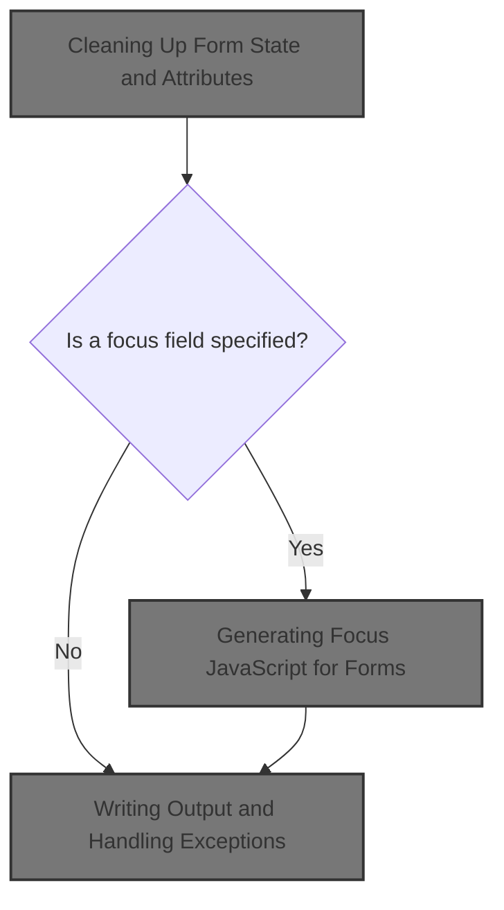
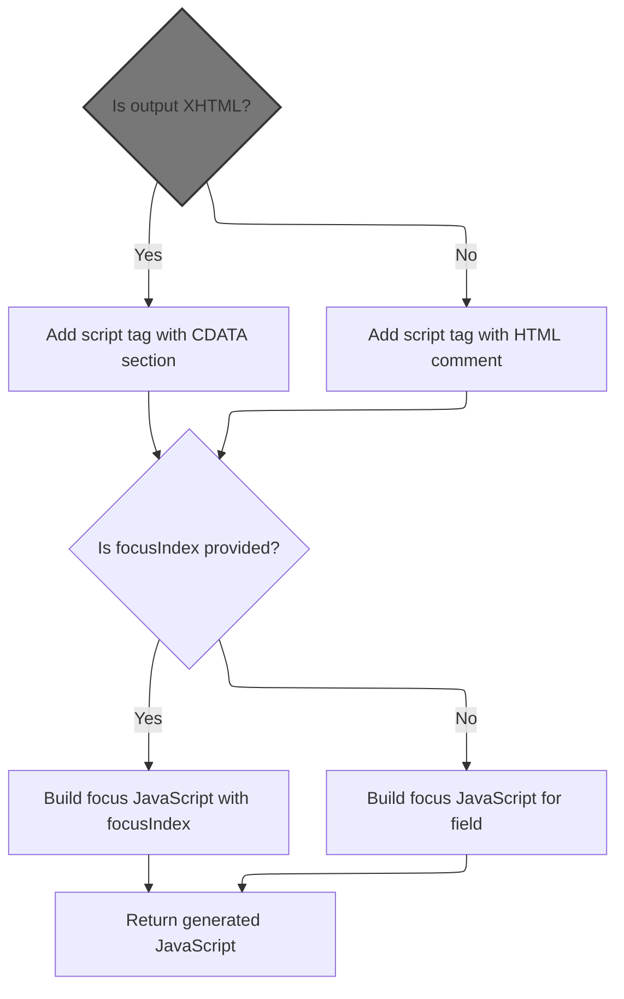

This document describes how the system finalizes a web form after user interaction. When a form is completed, the system removes temporary state, closes the form, and optionally sets focus to a specific field, adapting to different output types for compatibility.



# Cleaning Up Form State and Attributes

<SwmSnippet path="/taglib/src/main/java/org/apache/struts/taglib/html/FormTag.java" line="679">

---

In <SwmToken path="taglib/src/main/java/org/apache/struts/taglib/html/FormTag.java" pos="679:5:5" line-data="    public int doEndTag() throws JspException {">`doEndTag`</SwmToken>, we're cleaning up by removing the form and bean attributes from the request scope. This prevents any leftover state from leaking into other parts of the page or future requests. Next, we delegate the actual attribute removal to the context adapter, which handles the underlying context specifics.

```java
    public int doEndTag() throws JspException {
        // Remove the page scope attributes we created
        pageContext.removeAttribute(Constants.BEAN_KEY,
            PageContext.REQUEST_SCOPE);
        pageContext.removeAttribute(Constants.FORM_KEY,
            PageContext.REQUEST_SCOPE);

```

---

</SwmSnippet>

<SwmSnippet path="/tiles2/src/main/java/org/apache/struts/tiles2/util/PlugInConfigContextAdapter.java" line="207">

---

<SwmToken path="tiles2/src/main/java/org/apache/struts/tiles2/util/PlugInConfigContextAdapter.java" pos="207:5:5" line-data="    public void removeAttribute(String string) {">`removeAttribute`</SwmToken> just hands off the attribute removal to <SwmToken path="tiles2/src/main/java/org/apache/struts/tiles2/util/PlugInConfigContextAdapter.java" pos="208:1:1" line-data="        rootContext.removeAttribute(string);">`rootContext`</SwmToken>. No extra logic, just a straight delegation.

```java
    public void removeAttribute(String string) {
        rootContext.removeAttribute(string);
    }
```

---

</SwmSnippet>

<SwmSnippet path="/taglib/src/main/java/org/apache/struts/taglib/html/FormTag.java" line="686">

---

Back in <SwmToken path="taglib/src/main/java/org/apache/struts/taglib/html/FormTag.java" pos="679:5:5" line-data="    public int doEndTag() throws JspException {">`doEndTag`</SwmToken>, after cleaning up attributes, we close the form with '</form>' and, if a focus field is set, we add <SwmToken path="taglib/src/main/java/org/apache/struts/taglib/html/FormTag.java" pos="689:5:5" line-data="        // Render JavaScript to set the input focus if required">`JavaScript`</SwmToken> to set focus on that field. This is where we call <SwmToken path="taglib/src/main/java/org/apache/struts/taglib/html/FormTag.java" pos="691:7:7" line-data="            results.append(this.renderFocusJavascript());">`renderFocusJavascript`</SwmToken> to generate that script.

```java
        // Render a tag representing the end of our current form
        StringBuffer results = new StringBuffer("</form>");

        // Render JavaScript to set the input focus if required
        if (this.focus != null) {
            results.append(this.renderFocusJavascript());
        }

```

---

</SwmSnippet>

## Generating Focus <SwmToken path="taglib/src/main/java/org/apache/struts/taglib/html/FormTag.java" pos="689:5:5" line-data="        // Render JavaScript to set the input focus if required">`JavaScript`</SwmToken> for Forms



<SwmSnippet path="/taglib/src/main/java/org/apache/struts/taglib/html/FormTag.java" line="715">

---

In <SwmToken path="taglib/src/main/java/org/apache/struts/taglib/html/FormTag.java" pos="715:5:5" line-data="    protected String renderFocusJavascript() {">`renderFocusJavascript`</SwmToken>, we're building the <SwmToken path="taglib/src/main/java/org/apache/struts/taglib/html/FormTag.java" pos="722:10:10" line-data="            results.append(&quot; language=\&quot;JavaScript\&quot;&quot;);">`JavaScript`</SwmToken> to focus a form element. We check if the output is XHTML or HTML to decide how to wrap the script content, since XHTML needs CDATA and HTML uses comment tags. Next, we call <SwmToken path="taglib/src/main/java/org/apache/struts/taglib/html/FormTag.java" pos="721:7:7" line-data="        if (!this.isXhtml() &amp;&amp; this.scriptLanguage) {">`isXhtml`</SwmToken> to figure out which wrapping to use.

```java
    protected String renderFocusJavascript() {
        StringBuffer results = new StringBuffer();

        results.append(lineEnd);
        results.append("<script type=\"text/javascript\"");

        if (!this.isXhtml() && this.scriptLanguage) {
            results.append(" language=\"JavaScript\"");
        }

        results.append(">");
        results.append(lineEnd);

        // xhtml content should emit CDATA section
        // but html content should use the browser hiding trick
        results.append(isXhtml() ? "//<![CDATA[" : "<!--");
        results.append(lineEnd);

        // Construct the index if needed and insert into focus statement
        String index = "";
        if (this.focusIndex != null) {
            StringBuffer sb = new StringBuffer("[");
            sb.append(this.focusIndex);
            sb.append("]");
            index = sb.toString();
        }
        
        // Construct the control name that will receive focus.
        StringBuffer focusControl = new StringBuffer("document.forms[\"");
        focusControl.append(beanName);
        focusControl.append("\"].elements[\"");
        focusControl.append(this.focus);
        focusControl.append("\"]");
        focusControl.append(index);

        results.append("  var focusControl = ");
        results.append(focusControl.toString());
        results.append(";");
        results.append(lineEnd);
        results.append(lineEnd);

        results.append("  if (focusControl != null && ");
        results.append("focusControl.type != \"hidden\" && ");
        results.append("!focusControl.disabled && ");
        results.append("focusControl.style.display != \"none\") {");
        results.append(lineEnd);

        results.append("     focusControl");
        results.append(".focus();");
        results.append(lineEnd);

        results.append("  }");
        results.append(lineEnd);

        results.append("//");
        results.append(isXhtml() ? "]]>" : "-->");
```

---

</SwmSnippet>

### Determining Output Type for Script Wrapping

<SwmSnippet path="/taglib/src/main/java/org/apache/struts/taglib/html/FormTag.java" line="898">

---

In <SwmToken path="taglib/src/main/java/org/apache/struts/taglib/html/FormTag.java" pos="898:5:5" line-data="    private boolean isXhtml() {">`isXhtml`</SwmToken>, we just ask <SwmToken path="taglib/src/main/java/org/apache/struts/taglib/html/FormTag.java" pos="899:3:3" line-data="        return TagUtils.getInstance().isXhtml(this.pageContext);">`TagUtils`</SwmToken> if the current page context is XHTML. The actual logic is in <SwmToken path="taglib/src/main/java/org/apache/struts/taglib/html/FormTag.java" pos="899:3:3" line-data="        return TagUtils.getInstance().isXhtml(this.pageContext);">`TagUtils`</SwmToken>, so we call its singleton instance next.

```java
    private boolean isXhtml() {
        return TagUtils.getInstance().isXhtml(this.pageContext);
```

---

</SwmSnippet>

<SwmSnippet path="/taglib/src/main/java/org/apache/struts/taglib/TagUtils.java" line="150">

---

<SwmToken path="taglib/src/main/java/org/apache/struts/taglib/TagUtils.java" pos="150:7:7" line-data="    public static TagUtils getInstance() {">`getInstance`</SwmToken> just returns the one <SwmToken path="taglib/src/main/java/org/apache/struts/taglib/TagUtils.java" pos="150:5:5" line-data="    public static TagUtils getInstance() {">`TagUtils`</SwmToken> instance. No state, just a utility class pattern.

```java
    public static TagUtils getInstance() {
        return instance;
    }
```

---

</SwmSnippet>

<SwmSnippet path="/taglib/src/main/java/org/apache/struts/taglib/html/FormTag.java" line="899">

---

Just got back from <SwmToken path="taglib/src/main/java/org/apache/struts/taglib/html/FormTag.java" pos="899:3:3" line-data="        return TagUtils.getInstance().isXhtml(this.pageContext);">`TagUtils`</SwmToken>. In <SwmToken path="taglib/src/main/java/org/apache/struts/taglib/html/FormTag.java" pos="899:9:9" line-data="        return TagUtils.getInstance().isXhtml(this.pageContext);">`isXhtml`</SwmToken>, we return whatever <SwmToken path="taglib/src/main/java/org/apache/struts/taglib/html/FormTag.java" pos="899:3:3" line-data="        return TagUtils.getInstance().isXhtml(this.pageContext);">`TagUtils`</SwmToken> found in the page context about XHTML mode. Next, we call its <SwmToken path="taglib/src/main/java/org/apache/struts/taglib/html/FormTag.java" pos="899:9:9" line-data="        return TagUtils.getInstance().isXhtml(this.pageContext);">`isXhtml`</SwmToken> method to do the actual check.

```java
        return TagUtils.getInstance().isXhtml(this.pageContext);
    }
```

---

</SwmSnippet>

### Checking XHTML Mode in Page Context

<SwmSnippet path="/taglib/src/main/java/org/apache/struts/taglib/TagUtils.java" line="838">

---

<SwmToken path="taglib/src/main/java/org/apache/struts/taglib/TagUtils.java" pos="838:5:5" line-data="    public boolean isXhtml(PageContext pageContext) {">`isXhtml`</SwmToken> checks the page context for <SwmToken path="taglib/src/main/java/org/apache/struts/taglib/TagUtils.java" pos="841:14:16" line-data="            xhtml = (String) lookup(pageContext, Globals.XHTML_KEY, null);">`Globals.XHTML_KEY`</SwmToken> using the lookup method. If it's set to 'true', we treat the page as XHTML. Next, we call <SwmToken path="taglib/src/main/java/org/apache/struts/taglib/TagUtils.java" pos="841:9:9" line-data="            xhtml = (String) lookup(pageContext, Globals.XHTML_KEY, null);">`lookup`</SwmToken> to fetch that value.

```java
    public boolean isXhtml(PageContext pageContext) {
        String xhtml;
        try {
            xhtml = (String) lookup(pageContext, Globals.XHTML_KEY, null);
            return "true".equalsIgnoreCase(xhtml);
        } catch (JspException e) {
            log.error("Failed xhtml lookup", e);
            throw new RuntimeException(e);
        }
    }
```

---

</SwmSnippet>

### Fetching Values from Page Context by Key

See <SwmLink doc-title="Attribute Lookup Flow">[Attribute Lookup Flow](/.swm/attribute-lookup-flow.3tlcx7q4.sw.md)</SwmLink>

### Storing Exceptions in the Request Scope

<SwmSnippet path="/taglib/src/main/java/org/apache/struts/taglib/TagUtils.java" line="1170">

---

<SwmToken path="taglib/src/main/java/org/apache/struts/taglib/TagUtils.java" pos="1170:5:5" line-data="    public void saveException(PageContext pageContext, Throwable exception) {">`saveException`</SwmToken> puts the exception in the request scope under <SwmToken path="taglib/src/main/java/org/apache/struts/taglib/TagUtils.java" pos="1171:5:7" line-data="        pageContext.setAttribute(Globals.EXCEPTION_KEY, exception,">`Globals.EXCEPTION_KEY`</SwmToken>. This is how Struts makes exceptions available for error handling. The actual <SwmToken path="taglib/src/main/java/org/apache/struts/taglib/TagUtils.java" pos="1171:3:3" line-data="        pageContext.setAttribute(Globals.EXCEPTION_KEY, exception,">`setAttribute`</SwmToken> logic is handled by the Tiles <SwmToken path="taglib/src/main/java/org/apache/struts/taglib/html/FormTag.java" pos="899:3:3" line-data="        return TagUtils.getInstance().isXhtml(this.pageContext);">`TagUtils`</SwmToken> next.

```java
    public void saveException(PageContext pageContext, Throwable exception) {
        pageContext.setAttribute(Globals.EXCEPTION_KEY, exception,
            PageContext.REQUEST_SCOPE);
    }
```

---

</SwmSnippet>

<SwmSnippet path="/tiles/src/main/java/org/apache/struts/tiles/taglib/util/TagUtils.java" line="290">

---

<SwmToken path="tiles/src/main/java/org/apache/struts/tiles/taglib/util/TagUtils.java" pos="290:7:7" line-data="    public static void setAttribute(PageContext pageContext, String name, Object beanValue)">`setAttribute`</SwmToken> just puts the attribute in the request scope, no matter what. It's a wrapper to keep things consistent and avoid scope mistakes.

```java
    public static void setAttribute(PageContext pageContext, String name, Object beanValue)
        throws JspException {
        pageContext.setAttribute(name, beanValue, PageContext.REQUEST_SCOPE);
    }
```

---

</SwmSnippet>

### Finalizing the Focus <SwmToken path="taglib/src/main/java/org/apache/struts/taglib/html/FormTag.java" pos="689:5:5" line-data="        // Render JavaScript to set the input focus if required">`JavaScript`</SwmToken> Output

<SwmSnippet path="/taglib/src/main/java/org/apache/struts/taglib/html/FormTag.java" line="771">

---

Just returned from <SwmToken path="taglib/src/main/java/org/apache/struts/taglib/html/FormTag.java" pos="721:7:7" line-data="        if (!this.isXhtml() &amp;&amp; this.scriptLanguage) {">`isXhtml`</SwmToken>. Here, we finish building the <SwmToken path="taglib/src/main/java/org/apache/struts/taglib/html/FormTag.java" pos="689:5:5" line-data="        // Render JavaScript to set the input focus if required">`JavaScript`</SwmToken> string, closing the script tag and returning the result. The XHTML/HTML check earlier decided how the script content is wrapped.

```java
        results.append(lineEnd);

        results.append("</script>");
        results.append(lineEnd);

        return results.toString();
    }
```

---

</SwmSnippet>

## Writing Output and Handling Exceptions

<SwmSnippet path="/taglib/src/main/java/org/apache/struts/taglib/html/FormTag.java" line="694">

---

Just returned from <SwmToken path="taglib/src/main/java/org/apache/struts/taglib/html/FormTag.java" pos="691:7:7" line-data="            results.append(this.renderFocusJavascript());">`renderFocusJavascript`</SwmToken>. Now in <SwmToken path="taglib/src/main/java/org/apache/struts/taglib/html/FormTag.java" pos="679:5:5" line-data="    public int doEndTag() throws JspException {">`doEndTag`</SwmToken>, we write the results to the output. If there's an <SwmToken path="taglib/src/main/java/org/apache/struts/taglib/html/FormTag.java" pos="699:6:6" line-data="        } catch (IOException e) {">`IOException`</SwmToken>, we use <SwmToken path="taglib/src/main/java/org/apache/struts/taglib/html/FormTag.java" pos="31:10:10" line-data="import org.apache.struts.util.MessageResources;">`MessageResources`</SwmToken> to get a localized error message for the exception.

```java
        // Print this value to our output writer
        JspWriter writer = pageContext.getOut();

        try {
            writer.print(results.toString());
        } catch (IOException e) {
            throw new JspException(messages.getMessage("common.io", e.toString()), e);
        }

```

---

</SwmSnippet>

<SwmSnippet path="/taglib/src/main/java/org/apache/struts/taglib/html/FormTag.java" line="703">

---

Finally, after handling exceptions and writing output (with localized error messages from <SwmToken path="taglib/src/main/java/org/apache/struts/taglib/html/FormTag.java" pos="31:10:10" line-data="import org.apache.struts.util.MessageResources;">`MessageResources`</SwmToken> if needed), we clear <SwmToken path="taglib/src/main/java/org/apache/struts/taglib/html/FormTag.java" pos="703:1:1" line-data="        postbackAction = null;">`postbackAction`</SwmToken> and return <SwmToken path="taglib/src/main/java/org/apache/struts/taglib/html/FormTag.java" pos="706:4:4" line-data="        return (EVAL_PAGE);">`EVAL_PAGE`</SwmToken>. This signals that FormTag.doEndTag is done and the JSP should keep rendering the rest of the page. No special branching—just standard tag flow control.

```java
        postbackAction = null;

        // Continue processing this page
        return (EVAL_PAGE);
    }
```

---

</SwmSnippet>

&nbsp;

*This is an auto-generated document by Swimm 🌊 and has not yet been verified by a human*

<SwmMeta version="3.0.0" repo-id="Z2l0aHViJTNBJTNBc3RydXRzMSUzQSUzQVN3aW1tLURlbW8=" repo-name="struts1"><sup>Powered by [Swimm](https://app.swimm.io/)</sup></SwmMeta>
