This document describes how form bean configurations inherit properties and settings from ancestor configurations. The process receives a form bean configuration and outputs an updated configuration with inherited and merged settings, supporting modular and reusable form definitions.

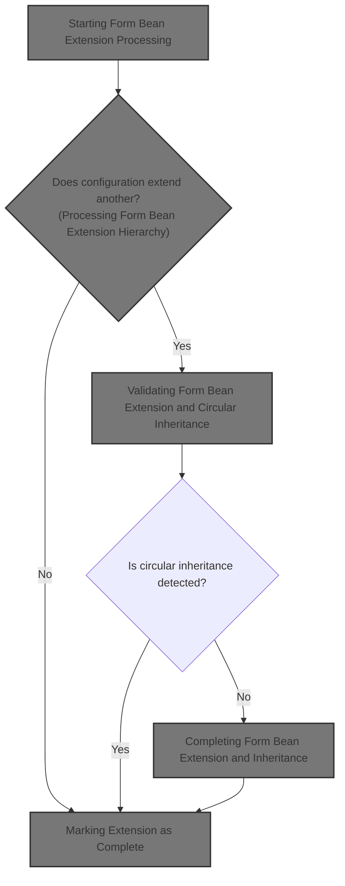

# Starting Form Bean Extension Processing

<SwmSnippet path="/core/src/main/java/org/apache/struts/action/ActionServlet.java" line="968">

---

In <SwmToken path="core/src/main/java/org/apache/struts/action/ActionServlet.java" pos="968:5:5" line-data="    protected void processFormBeanExtension(FormBeanConfig beanConfig,">`processFormBeanExtension`</SwmToken>, we check if the <SwmToken path="core/src/main/java/org/apache/struts/action/ActionServlet.java" pos="968:9:9" line-data="    protected void processFormBeanExtension(FormBeanConfig beanConfig,">`beanConfig`</SwmToken> extension has already been processed. If not, we call <SwmToken path="core/src/main/java/org/apache/struts/action/ActionServlet.java" pos="979:1:1" line-data="                    processFormBeanConfigClass(beanConfig, moduleConfig);">`processFormBeanConfigClass`</SwmToken> to handle inheritance and possibly swap <SwmToken path="core/src/main/java/org/apache/struts/action/ActionServlet.java" pos="968:9:9" line-data="    protected void processFormBeanExtension(FormBeanConfig beanConfig,">`beanConfig`</SwmToken> for a subclass instance, prepping it for further extension logic.

```java
    protected void processFormBeanExtension(FormBeanConfig beanConfig,
        ModuleConfig moduleConfig)
        throws ServletException {
        try {
            if (!beanConfig.isExtensionProcessed()) {
                if (log.isDebugEnabled()) {
                    log.debug("Processing extensions for '"
                        + beanConfig.getName() + "'");
                }

                beanConfig =
                    processFormBeanConfigClass(beanConfig, moduleConfig);

```

---

</SwmSnippet>

## Resolving Form Bean Class and Inheritance

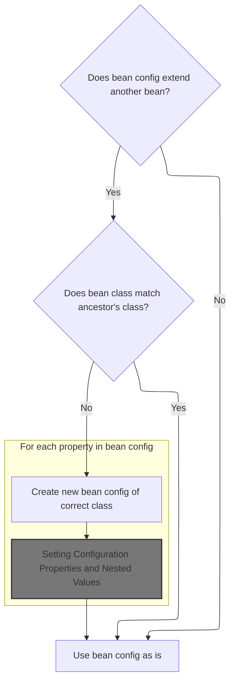

<SwmSnippet path="/core/src/main/java/org/apache/struts/action/ActionServlet.java" line="1003">

---

In <SwmToken path="core/src/main/java/org/apache/struts/action/ActionServlet.java" pos="1003:5:5" line-data="    protected FormBeanConfig processFormBeanConfigClass(">`processFormBeanConfigClass`</SwmToken>, we check if <SwmToken path="core/src/main/java/org/apache/struts/action/ActionServlet.java" pos="1004:3:3" line-data="        FormBeanConfig beanConfig, ModuleConfig moduleConfig)">`beanConfig`</SwmToken> extends another bean. If so, and the class is just <SwmToken path="core/src/main/java/org/apache/struts/action/ActionServlet.java" pos="1003:3:3" line-data="    protected FormBeanConfig processFormBeanConfigClass(">`FormBeanConfig`</SwmToken>, we swap it for an instance of the ancestor's class, copying all properties and configs. Next, we call BaseConfig.copyProperties to handle property copying.

```java
    protected FormBeanConfig processFormBeanConfigClass(
        FormBeanConfig beanConfig, ModuleConfig moduleConfig)
        throws ServletException {
        String ancestor = beanConfig.getExtends();

        if (ancestor == null) {
            // Nothing to do, then
            return beanConfig;
        }

        // Make sure that this bean is of the right class
        FormBeanConfig baseConfig = moduleConfig.findFormBeanConfig(ancestor);

        if (baseConfig == null) {
            throw new UnavailableException("Unable to find " + "form bean '"
                + ancestor + "' to extend.");
        }

        // Was our bean's class overridden already?
        if (beanConfig.getClass().equals(FormBeanConfig.class)) {
            // Ensure that our bean is using the correct class
            if (!baseConfig.getClass().equals(beanConfig.getClass())) {
                // Replace the bean with an instance of the correct class
                FormBeanConfig newBeanConfig = null;
                String baseConfigClassName = baseConfig.getClass().getName();

                try {
                    newBeanConfig =
                        (FormBeanConfig) RequestUtils.applicationInstance(baseConfigClassName);

                    // copy the values
                    BeanUtils.copyProperties(newBeanConfig, beanConfig);

```

---

</SwmSnippet>

### Copying Configuration Properties

<SwmSnippet path="/core/src/main/java/org/apache/struts/config/BaseConfig.java" line="155">

---

<SwmToken path="core/src/main/java/org/apache/struts/config/BaseConfig.java" pos="155:5:5" line-data="    protected Properties copyProperties() {">`copyProperties`</SwmToken> duplicates all key-value pairs from the original config's properties to a new Properties object. This is needed to ensure the new <SwmToken path="core/src/main/java/org/apache/struts/action/ActionServlet.java" pos="968:9:9" line-data="    protected void processFormBeanExtension(FormBeanConfig beanConfig,">`beanConfig`</SwmToken> instance inherits all settings from the original.

```java
    protected Properties copyProperties() {
        Properties copy = new Properties();

        Enumeration keys = properties.propertyNames();

        while (keys.hasMoreElements()) {
            String key = (String) keys.nextElement();

            copy.setProperty(key, properties.getProperty(key));
        }

        return copy;
    }
```

---

</SwmSnippet>

### Setting Configuration Properties and Nested Values

<SwmSnippet path="/core/src/main/java/org/apache/struts/config/BaseConfig.java" line="88">

---

<SwmToken path="core/src/main/java/org/apache/struts/config/BaseConfig.java" pos="88:5:5" line-data="    public void setProperty(String key, String value) {">`setProperty`</SwmToken> checks if the config is still modifiable, then sets the property in the Properties map. Next, we call NestedPropertyHelper.setProperty to handle nested property paths for request-scoped configs.

```java
    public void setProperty(String key, String value) {
        throwIfConfigured();
        properties.setProperty(key, value);
    }
```

---

</SwmSnippet>

<SwmSnippet path="/taglib/src/main/java/org/apache/struts/taglib/nested/NestedPropertyHelper.java" line="136">

---

<SwmToken path="taglib/src/main/java/org/apache/struts/taglib/nested/NestedPropertyHelper.java" pos="136:9:9" line-data="    public static final void setProperty(HttpServletRequest request,">`setProperty`</SwmToken> grabs a <SwmToken path="taglib/src/main/java/org/apache/struts/taglib/nested/NestedPropertyHelper.java" pos="139:1:1" line-data="        NestedReference nr = referenceInstance(request);">`NestedReference`</SwmToken> tied to the request and sets the nested property via that object, instead of directly on the request. This keeps nested property logic encapsulated and organized.

```java
    public static final void setProperty(HttpServletRequest request,
        String property) {
        // get the old one if any
        NestedReference nr = referenceInstance(request);

        nr.setNestedProperty(property);
    }
```

---

</SwmSnippet>

### Copying Form Property Configurations

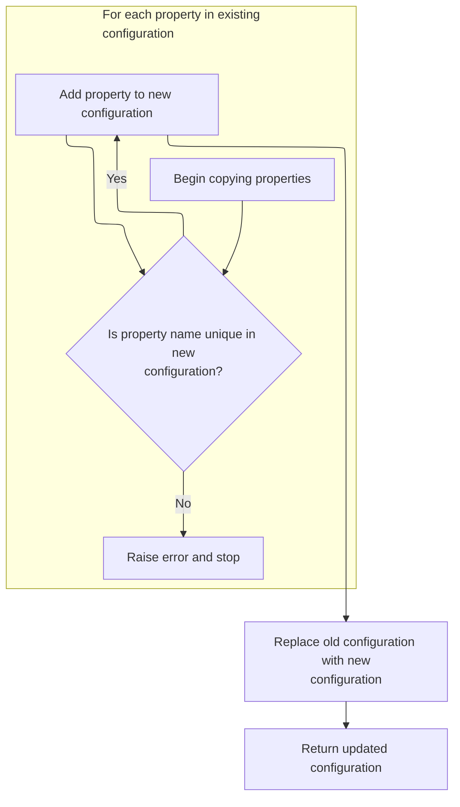

<SwmSnippet path="/core/src/main/java/org/apache/struts/action/ActionServlet.java" line="1036">

---

Back in <SwmToken path="core/src/main/java/org/apache/struts/action/ActionServlet.java" pos="979:1:1" line-data="                    processFormBeanConfigClass(beanConfig, moduleConfig);">`processFormBeanConfigClass`</SwmToken>, after copying bean properties, we copy each form property config to the new <SwmToken path="core/src/main/java/org/apache/struts/action/ActionServlet.java" pos="1037:1:1" line-data="                        beanConfig.findFormPropertyConfigs();">`beanConfig`</SwmToken>. Next, we call FormBeanConfig.addFormPropertyConfig to handle uniqueness and lifecycle checks for each property.

```java
                    FormPropertyConfig[] fpc =
                        beanConfig.findFormPropertyConfigs();

                    for (int i = 0; i < fpc.length; i++) {
                        newBeanConfig.addFormPropertyConfig(fpc[i]);
                    }
```

---

</SwmSnippet>

<SwmSnippet path="/core/src/main/java/org/apache/struts/config/FormBeanConfig.java" line="427">

---

<SwmToken path="core/src/main/java/org/apache/struts/config/FormBeanConfig.java" pos="427:5:5" line-data="    public void addFormPropertyConfig(FormPropertyConfig config) {">`addFormPropertyConfig`</SwmToken> checks if the config is modifiable, then ensures the property name is unique before adding it to the map. This prevents duplicate property configs and enforces lifecycle constraints.

```java
    public void addFormPropertyConfig(FormPropertyConfig config) {
        throwIfConfigured();

        if (formProperties.containsKey(config.getName())) {
            throw new IllegalArgumentException("Property " + config.getName()
                + " already defined");
        }

        formProperties.put(config.getName(), config);
    }
```

---

</SwmSnippet>

<SwmSnippet path="/core/src/main/java/org/apache/struts/action/ActionServlet.java" line="1042">

---

Finally, after adding form property configs, we update <SwmToken path="core/src/main/java/org/apache/struts/action/ActionServlet.java" pos="1047:1:1" line-data="                moduleConfig.removeFormBeanConfig(beanConfig);">`moduleConfig`</SwmToken> to use the new <SwmToken path="core/src/main/java/org/apache/struts/action/ActionServlet.java" pos="1046:5:5" line-data="                // replace beanConfig with newBeanConfig">`beanConfig`</SwmToken> instance. This ensures all future lookups reference the upgraded config, supporting inheritance and property copying in <SwmToken path="core/src/main/java/org/apache/struts/action/ActionServlet.java" pos="979:1:1" line-data="                    processFormBeanConfigClass(beanConfig, moduleConfig);">`processFormBeanConfigClass`</SwmToken>.

```java
                } catch (Exception e) {
                    handleCreationException(baseConfigClassName, e);
                }

                // replace beanConfig with newBeanConfig
                moduleConfig.removeFormBeanConfig(beanConfig);
                moduleConfig.addFormBeanConfig(newBeanConfig);
                beanConfig = newBeanConfig;
            }
        }

        return beanConfig;
    }
```

---

</SwmSnippet>

## Processing Form Bean Extension Hierarchy

<SwmSnippet path="/core/src/main/java/org/apache/struts/action/ActionServlet.java" line="981">

---

Back in <SwmToken path="core/src/main/java/org/apache/struts/action/ActionServlet.java" pos="968:5:5" line-data="    protected void processFormBeanExtension(FormBeanConfig beanConfig,">`processFormBeanExtension`</SwmToken>, after handling class inheritance, we call <SwmToken path="core/src/main/java/org/apache/struts/action/ActionServlet.java" pos="981:3:3" line-data="                beanConfig.processExtends(moduleConfig);">`processExtends`</SwmToken> on <SwmToken path="core/src/main/java/org/apache/struts/action/ActionServlet.java" pos="981:1:1" line-data="                beanConfig.processExtends(moduleConfig);">`beanConfig`</SwmToken> to process hierarchical extension logic, including circular checks and ancestor extension processing.

```java
                beanConfig.processExtends(moduleConfig);
            }
        } catch (ServletException e) {
            throw e;
        } catch (Exception e) {
            handleGeneralExtensionException("FormBeanConfig",
                beanConfig.getName(), e);
        }
    }
```

---

</SwmSnippet>

# Validating Form Bean Extension and Circular Inheritance

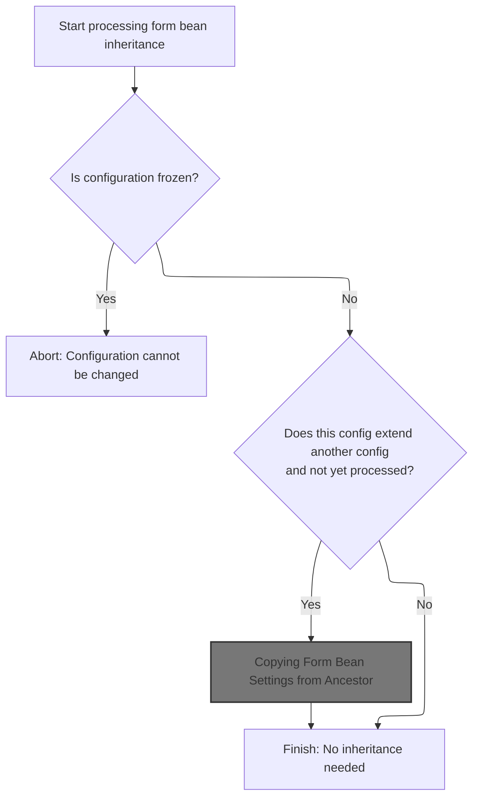

<SwmSnippet path="/core/src/main/java/org/apache/struts/config/FormBeanConfig.java" line="528">

---

In <SwmToken path="core/src/main/java/org/apache/struts/config/FormBeanConfig.java" pos="528:5:5" line-data="    public void processExtends(ModuleConfig moduleConfig)">`processExtends`</SwmToken>, we check if the config is frozen, then look up the ancestor config and check for circular inheritance. Next, we call <SwmToken path="core/src/main/java/org/apache/struts/config/FormBeanConfig.java" pos="548:4:4" line-data="            if (checkCircularInheritance(moduleConfig)) {">`checkCircularInheritance`</SwmToken> to ensure the extension chain doesn't loop back on itself.

```java
    public void processExtends(ModuleConfig moduleConfig)
        throws ClassNotFoundException, IllegalAccessException,
            InstantiationException, InvocationTargetException {
        if (configured) {
            throw new IllegalStateException("Configuration is frozen");
        }

        String ancestor = getExtends();

        if ((!extensionProcessed) && (ancestor != null)) {
            FormBeanConfig baseConfig =
                moduleConfig.findFormBeanConfig(ancestor);

            if (baseConfig == null) {
                throw new NullPointerException("Unable to find "
                    + "form bean '" + ancestor + "' to extend.");
            }

            // Check against circule inheritance and make sure the base config's
            //  own extends have been processed already
            if (checkCircularInheritance(moduleConfig)) {
                throw new IllegalArgumentException(
                    "Circular inheritance detected for form bean " + getName());
            }

```

---

</SwmSnippet>

<SwmSnippet path="/core/src/main/java/org/apache/struts/config/FormBeanConfig.java" line="206">

---

<SwmToken path="core/src/main/java/org/apache/struts/config/FormBeanConfig.java" pos="206:5:5" line-data="    protected boolean checkCircularInheritance(ModuleConfig moduleConfig) {">`checkCircularInheritance`</SwmToken> walks up the ancestor chain, comparing each ancestor's name to the current config's name. If it finds a match, it flags circular inheritance; otherwise, it keeps going until the chain ends.

```java
    protected boolean checkCircularInheritance(ModuleConfig moduleConfig) {
        String ancestorName = getExtends();

        while (ancestorName != null) {
            // check if we have the same name as an ancestor
            if (getName().equals(ancestorName)) {
                return true;
            }

            // get our ancestor's ancestor
            FormBeanConfig ancestor =
                moduleConfig.findFormBeanConfig(ancestorName);

            ancestorName = ancestor.getExtends();
        }
```

---

</SwmSnippet>

<SwmSnippet path="/core/src/main/java/org/apache/struts/config/FormBeanConfig.java" line="553">

---

Back in <SwmToken path="core/src/main/java/org/apache/struts/config/FormBeanConfig.java" pos="555:3:3" line-data="                baseConfig.processExtends(moduleConfig);">`processExtends`</SwmToken>, after checking for circular inheritance, we make sure the ancestor's extension is processed. If not, we call <SwmToken path="core/src/main/java/org/apache/struts/config/FormBeanConfig.java" pos="555:3:3" line-data="                baseConfig.processExtends(moduleConfig);">`processExtends`</SwmToken> on the ancestor, which may trigger <SwmToken path="core/src/main/java/org/apache/struts/config/ActionConfig.java" pos="939:1:1" line-data="            ActionConfig baseConfig = moduleConfig.findActionConfig(ancestor);">`ActionConfig`</SwmToken> extension logic next.

```java
            // Make sure the ancestor's own extension has been processed.
            if (!baseConfig.isExtensionProcessed()) {
                baseConfig.processExtends(moduleConfig);
            }

```

---

</SwmSnippet>

## Processing Action Extension Hierarchy

```mermaid
%%{init: {"flowchart": {"defaultRenderer": "elk"}} }%%
flowchart TD
  node1{"Is configuration frozen?"}
  click node1 openCode "core/src/main/java/org/apache/struts/config/ActionConfig.java:1296:1298"
  node1 -->|"Yes"| node2["Stop: Configuration is frozen"]
  click node2 openCode "core/src/main/java/org/apache/struts/config/ActionConfig.java:1297:1298"
  node1 -->|"No"| node3{"Does this action extend another?"}
  click node3 openCode "core/src/main/java/org/apache/struts/config/ActionConfig.java:1302:1302"
  node3 -->|"No"| node9["Inheritance complete"]
  click node9 openCode "core/src/main/java/org/apache/struts/config/ActionConfig.java:1331:1331"
  node3 -->|"Yes"| node4["Resolving Action Config by Path or Pattern"]
  
  node4 --> node5{"Was ancestor found?"}
  click node5 openCode "core/src/main/java/org/apache/struts/config/ActionConfig.java:1305:1312"
  node5 -->|"No"| node6["Stop: Ancestor not found"]
  click node6 openCode "core/src/main/java/org/apache/struts/config/ActionConfig.java:1310:1312"
  node5 -->|"Yes"| node7{"Is there circular inheritance?"}
  
  node7 -->|"Yes"| node8["Stop: Circular inheritance"]
  click node8 openCode "core/src/main/java/org/apache/struts/config/ActionConfig.java:1317:1319"
  node7 -->|"No"| node10{"Has ancestor's inheritance been
processed?"}
  click node10 openCode "core/src/main/java/org/apache/struts/config/ActionConfig.java:1322:1324"
  node10 -->|"No"| node11["Process ancestor's inheritance"]
  click node11 openCode "core/src/main/java/org/apache/struts/config/ActionConfig.java:1323:1324"
  node10 -->|"Yes"| node12["Copying Action Settings from Ancestor"]
  
  node11 --> node12
  node12 --> node13["Mark inheritance as processed"]
  click node13 openCode "core/src/main/java/org/apache/struts/config/ActionConfig.java:1330:1331"
  node13 --> node9
classDef HeadingStyle fill:#777777,stroke:#333,stroke-width:2px;
click node4 goToHeading "Resolving Action Config by Path or Pattern"
node4:::HeadingStyle
click node7 goToHeading "Validating Action Extension and Circular Inheritance"
node7:::HeadingStyle
click node12 goToHeading "Copying Action Settings from Ancestor"
node12:::HeadingStyle

%% Swimm:
%% %%{init: {"flowchart": {"defaultRenderer": "elk"}} }%%
%% flowchart TD
%%   node1{"Is configuration frozen?"}
%%   click node1 openCode "<SwmPath>[core/…/config/ActionConfig.java](core/src/main/java/org/apache/struts/config/ActionConfig.java)</SwmPath>:1296:1298"
%%   node1 -->|"Yes"| node2["Stop: Configuration is frozen"]
%%   click node2 openCode "<SwmPath>[core/…/config/ActionConfig.java](core/src/main/java/org/apache/struts/config/ActionConfig.java)</SwmPath>:1297:1298"
%%   node1 -->|"No"| node3{"Does this action extend another?"}
%%   click node3 openCode "<SwmPath>[core/…/config/ActionConfig.java](core/src/main/java/org/apache/struts/config/ActionConfig.java)</SwmPath>:1302:1302"
%%   node3 -->|"No"| node9["Inheritance complete"]
%%   click node9 openCode "<SwmPath>[core/…/config/ActionConfig.java](core/src/main/java/org/apache/struts/config/ActionConfig.java)</SwmPath>:1331:1331"
%%   node3 -->|"Yes"| node4["Resolving Action Config by Path or Pattern"]
%%   
%%   node4 --> node5{"Was ancestor found?"}
%%   click node5 openCode "<SwmPath>[core/…/config/ActionConfig.java](core/src/main/java/org/apache/struts/config/ActionConfig.java)</SwmPath>:1305:1312"
%%   node5 -->|"No"| node6["Stop: Ancestor not found"]
%%   click node6 openCode "<SwmPath>[core/…/config/ActionConfig.java](core/src/main/java/org/apache/struts/config/ActionConfig.java)</SwmPath>:1310:1312"
%%   node5 -->|"Yes"| node7{"Is there circular inheritance?"}
%%   
%%   node7 -->|"Yes"| node8["Stop: Circular inheritance"]
%%   click node8 openCode "<SwmPath>[core/…/config/ActionConfig.java](core/src/main/java/org/apache/struts/config/ActionConfig.java)</SwmPath>:1317:1319"
%%   node7 -->|"No"| node10{"Has ancestor's inheritance been
%% processed?"}
%%   click node10 openCode "<SwmPath>[core/…/config/ActionConfig.java](core/src/main/java/org/apache/struts/config/ActionConfig.java)</SwmPath>:1322:1324"
%%   node10 -->|"No"| node11["Process ancestor's inheritance"]
%%   click node11 openCode "<SwmPath>[core/…/config/ActionConfig.java](core/src/main/java/org/apache/struts/config/ActionConfig.java)</SwmPath>:1323:1324"
%%   node10 -->|"Yes"| node12["Copying Action Settings from Ancestor"]
%%   
%%   node11 --> node12
%%   node12 --> node13["Mark inheritance as processed"]
%%   click node13 openCode "<SwmPath>[core/…/config/ActionConfig.java](core/src/main/java/org/apache/struts/config/ActionConfig.java)</SwmPath>:1330:1331"
%%   node13 --> node9
%% classDef HeadingStyle fill:#777777,stroke:#333,stroke-width:2px;
%% click node4 goToHeading "Resolving Action Config by Path or Pattern"
%% node4:::HeadingStyle
%% click node7 goToHeading "Validating Action Extension and Circular Inheritance"
%% node7:::HeadingStyle
%% click node12 goToHeading "Copying Action Settings from Ancestor"
%% node12:::HeadingStyle
```

<SwmSnippet path="/core/src/main/java/org/apache/struts/config/ActionConfig.java" line="1293">

---

In <SwmToken path="core/src/main/java/org/apache/struts/config/ActionConfig.java" pos="1293:5:5" line-data="    public void processExtends(ModuleConfig moduleConfig)">`processExtends`</SwmToken>, we check if the config is frozen, then look up the ancestor action config. Next, we call ModuleConfigImpl.findActionConfig to resolve the ancestor, which may involve wildcard matching.

```java
    public void processExtends(ModuleConfig moduleConfig)
        throws ClassNotFoundException, IllegalAccessException,
            InstantiationException, InvocationTargetException {
        if (configured) {
            throw new IllegalStateException("Configuration is frozen");
        }

        String ancestor = getExtends();

        if ((!extensionProcessed) && (ancestor != null)) {
            ActionConfig baseConfig =
                moduleConfig.findActionConfig(ancestor);
```

---

</SwmSnippet>

### Resolving Action Config by Path or Pattern

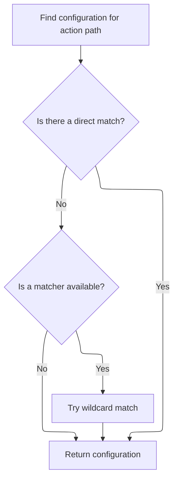

<SwmSnippet path="/core/src/main/java/org/apache/struts/config/impl/ModuleConfigImpl.java" line="436">

---

<SwmToken path="core/src/main/java/org/apache/struts/config/impl/ModuleConfigImpl.java" pos="436:5:5" line-data="    public ActionConfig findActionConfig(String path) {">`findActionConfig`</SwmToken> first tries a direct lookup for the action config by path. If that fails and a matcher exists, it uses the matcher to find a config by pattern. Next, we call ActionConfigMatcher.match to handle wildcard resolution.

```java
    public ActionConfig findActionConfig(String path) {
        ActionConfig config = (ActionConfig) actionConfigs.get(path);

        // If a direct match cannot be found, try to match action configs
        // containing wildcard patterns only if a matcher exists.
        if ((config == null) && (matcher != null)) {
            config = matcher.match(path);
        }

        return config;
    }
```

---

</SwmSnippet>

### Wildcard Matching for Action Config Resolution

See <SwmLink doc-title="Matching Paths to Action Configurations">[Matching Paths to Action Configurations](/.swm/matching-paths-to-action-configurations.a49ev0uj.sw.md)</SwmLink>

### Converting and Setting Action Config Attributes

See <SwmLink doc-title="Creating a Customized Action Configuration">[Creating a Customized Action Configuration](/.swm/creating-a-customized-action-configuration.ih4gm0ut.sw.md)</SwmLink>

### Handling Ancestor Lookup and Circular Inheritance in Action Extension

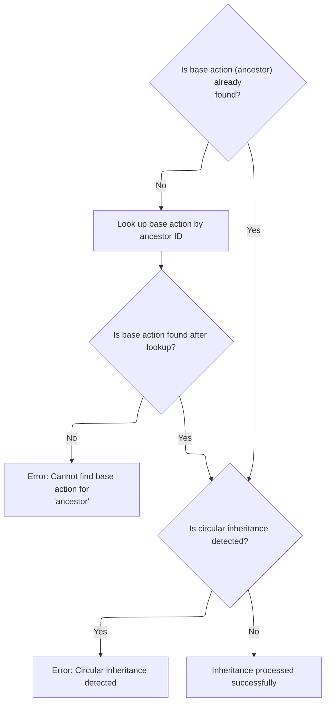

<SwmSnippet path="/core/src/main/java/org/apache/struts/config/ActionConfig.java" line="1305">

---

Back in <SwmToken path="core/src/main/java/org/apache/struts/action/ActionServlet.java" pos="981:3:3" line-data="                beanConfig.processExtends(moduleConfig);">`processExtends`</SwmToken> (<SwmToken path="core/src/main/java/org/apache/struts/config/ActionConfig.java" pos="939:1:1" line-data="            ActionConfig baseConfig = moduleConfig.findActionConfig(ancestor);">`ActionConfig`</SwmToken>), after resolving the ancestor config, we check for circular inheritance before proceeding. This prevents loops in the extension chain.

```java
            if (baseConfig == null) {
                baseConfig = moduleConfig.findActionConfigId(ancestor); 
            }
            
            if (baseConfig == null) {
                throw new NullPointerException("Unable to find "
                    + "action for '" + ancestor + "' to extend.");
            }

            // Check against circular inheritance and make sure the base
            //  config's own extends has been processed already
            if (checkCircularInheritance(moduleConfig)) {
                throw new IllegalArgumentException(
                    "Circular inheritance detected for action " + getPath());
            }

```

---

</SwmSnippet>

### Validating Action Extension and Circular Inheritance

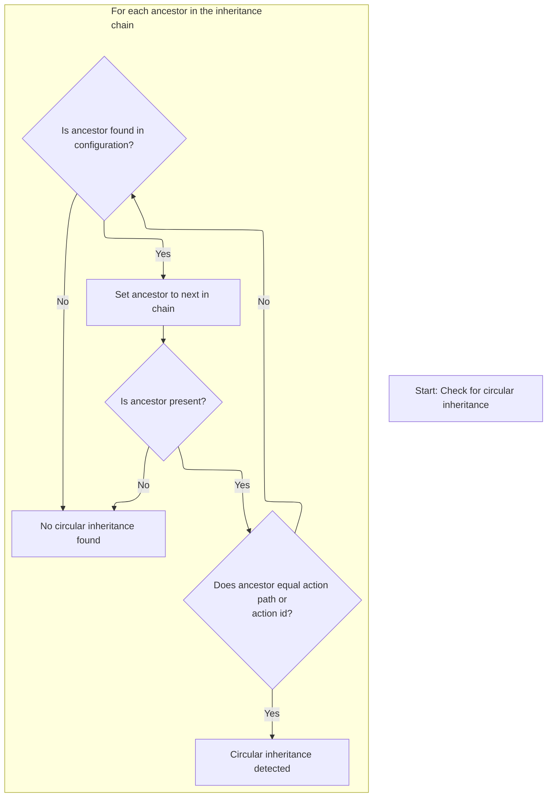

<SwmSnippet path="/core/src/main/java/org/apache/struts/config/ActionConfig.java" line="929">

---

In <SwmToken path="core/src/main/java/org/apache/struts/config/ActionConfig.java" pos="929:5:5" line-data="    protected boolean checkCircularInheritance(ModuleConfig moduleConfig) {">`checkCircularInheritance`</SwmToken>, we walk up the ancestor chain, comparing each ancestor's path and <SwmToken path="core/src/main/java/org/apache/struts/config/ActionConfig.java" pos="79:5:5" line-data="    protected String actionId = null;">`actionId`</SwmToken> to the current config. If a match is found, we flag circular inheritance; otherwise, we keep traversing using ModuleConfigImpl.findActionConfig.

```java
    protected boolean checkCircularInheritance(ModuleConfig moduleConfig) {
        String ancestor = getExtends();

        while (ancestor != null) {
            // check if we have the same path or id as an ancestor
            if (getPath().equals(ancestor) || ancestor.equals(getActionId())) {
                return true;
            }

            // get our ancestor's config
            ActionConfig baseConfig = moduleConfig.findActionConfig(ancestor);
```

---

</SwmSnippet>

<SwmSnippet path="/core/src/main/java/org/apache/struts/config/ActionConfig.java" line="940">

---

Back in <SwmToken path="core/src/main/java/org/apache/struts/config/FormBeanConfig.java" pos="206:5:5" line-data="    protected boolean checkCircularInheritance(ModuleConfig moduleConfig) {">`checkCircularInheritance`</SwmToken>, we update ancestor each loop, traversing the chain until either a loop is found or the chain ends. If no loop is found, we return false.

```java
            if (baseConfig == null) {
                baseConfig = moduleConfig.findActionConfigId(ancestor); 
            }

            if (baseConfig != null) {
                ancestor = baseConfig.getExtends();
            } else {
                ancestor = null;
            }
        }

        return false;
    }
```

---

</SwmSnippet>

### Completing Action Extension and Inheritance

<SwmSnippet path="/core/src/main/java/org/apache/struts/config/ActionConfig.java" line="1321">

---

Back in <SwmToken path="core/src/main/java/org/apache/struts/config/ActionConfig.java" pos="1323:3:3" line-data="                baseConfig.processExtends(moduleConfig);">`processExtends`</SwmToken> (<SwmToken path="core/src/main/java/org/apache/struts/config/ActionConfig.java" pos="939:1:1" line-data="            ActionConfig baseConfig = moduleConfig.findActionConfig(ancestor);">`ActionConfig`</SwmToken>), after ensuring the ancestor's extension is processed, we call <SwmToken path="core/src/main/java/org/apache/struts/config/ActionConfig.java" pos="1327:1:1" line-data="            inheritFrom(baseConfig);">`inheritFrom`</SwmToken> to copy settings from the ancestor. This finalizes inheritance for the current action config.

```java
            // Make sure the ancestor's own extension has been processed.
            if (!baseConfig.isExtensionProcessed()) {
                baseConfig.processExtends(moduleConfig);
            }

            // Copy values from the base config
            inheritFrom(baseConfig);
        }

```

---

</SwmSnippet>

### Copying Action Settings from Ancestor

See <SwmLink doc-title="Inheriting Action Configuration Properties">[Inheriting Action Configuration Properties](/.swm/inheriting-action-configuration-properties.ewxymqs9.sw.md)</SwmLink>

### Finalizing Action Extension Processing

<SwmSnippet path="/core/src/main/java/org/apache/struts/config/ActionConfig.java" line="1330">

---

Back in <SwmToken path="core/src/main/java/org/apache/struts/action/ActionServlet.java" pos="981:3:3" line-data="                beanConfig.processExtends(moduleConfig);">`processExtends`</SwmToken> (<SwmToken path="core/src/main/java/org/apache/struts/config/ActionConfig.java" pos="939:1:1" line-data="            ActionConfig baseConfig = moduleConfig.findActionConfig(ancestor);">`ActionConfig`</SwmToken>), we mark <SwmToken path="core/src/main/java/org/apache/struts/config/ActionConfig.java" pos="1330:1:1" line-data="        extensionProcessed = true;">`extensionProcessed`</SwmToken> as true to signal that inheritance and extension logic is complete for this config.

```java
        extensionProcessed = true;
    }
```

---

</SwmSnippet>

## Completing Form Bean Extension and Inheritance

<SwmSnippet path="/core/src/main/java/org/apache/struts/config/FormBeanConfig.java" line="558">

---

Back in <SwmToken path="core/src/main/java/org/apache/struts/action/ActionServlet.java" pos="981:3:3" line-data="                beanConfig.processExtends(moduleConfig);">`processExtends`</SwmToken> (<SwmToken path="core/src/main/java/org/apache/struts/action/ActionServlet.java" pos="968:7:7" line-data="    protected void processFormBeanExtension(FormBeanConfig beanConfig,">`FormBeanConfig`</SwmToken>), after ancestor extension processing, we call <SwmToken path="core/src/main/java/org/apache/struts/config/FormBeanConfig.java" pos="559:1:1" line-data="            inheritFrom(baseConfig);">`inheritFrom`</SwmToken> to copy values from the base config, finalizing inheritance for the current bean config.

```java
            // Copy values from the base config
            inheritFrom(baseConfig);
        }

```

---

</SwmSnippet>

## Copying Form Bean Settings from Ancestor

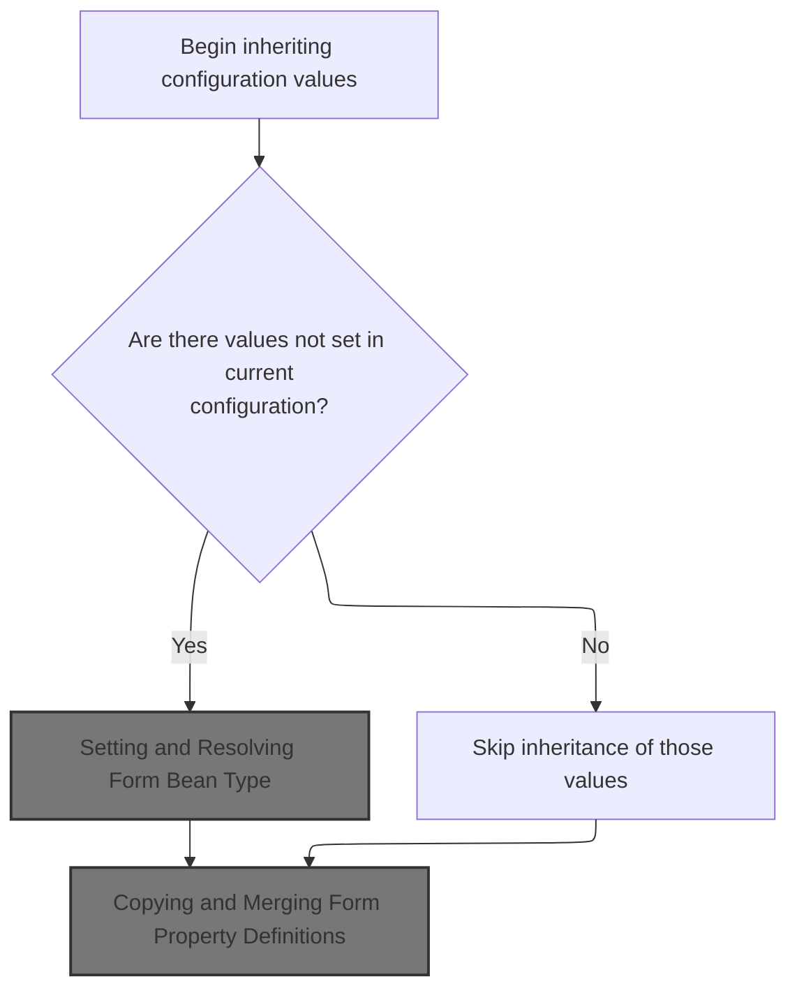

<SwmSnippet path="/core/src/main/java/org/apache/struts/config/FormBeanConfig.java" line="497">

---

In <SwmToken path="core/src/main/java/org/apache/struts/config/FormBeanConfig.java" pos="497:5:5" line-data="    public void inheritFrom(FormBeanConfig config)">`inheritFrom`</SwmToken>, we check if the config is modifiable, then set the name from the ancestor only if it's not already set. Next, we call <SwmToken path="core/src/main/java/org/apache/struts/config/FormBeanConfig.java" pos="504:1:1" line-data="            setName(config.getName());">`setName`</SwmToken> to update the field if needed.

```java
    public void inheritFrom(FormBeanConfig config)
        throws ClassNotFoundException, IllegalAccessException,
            InstantiationException, InvocationTargetException {
        throwIfConfigured();

        // Inherit values that have not been overridden
        if (getName() == null) {
            setName(config.getName());
        }

```

---

</SwmSnippet>

<SwmSnippet path="/core/src/main/java/org/apache/struts/config/FormBeanConfig.java" line="152">

---

<SwmToken path="core/src/main/java/org/apache/struts/config/FormBeanConfig.java" pos="152:5:5" line-data="    public void setName(String name) {">`setName`</SwmToken> checks if the config is still modifiable, then updates the name field. This enforces immutability after configuration is finalized.

```java
    public void setName(String name) {
        throwIfConfigured();
        this.name = name;
    }
```

---

</SwmSnippet>

<SwmSnippet path="/core/src/main/java/org/apache/struts/config/FormBeanConfig.java" line="507">

---

After returning from FormBeanConfig.inheritFrom, we check if the current config should inherit the 'restricted' flag and the 'type' from the ancestor. If these aren't set, we update them now. This ensures the config is fully aligned with its parent before moving on to type-specific logic.

```java
        if (!isRestricted()) {
            setRestricted(config.isRestricted());
        }

        if (getType() == null) {
            setType(config.getType());
        }

```

---

</SwmSnippet>

### Setting and Resolving Form Bean Type

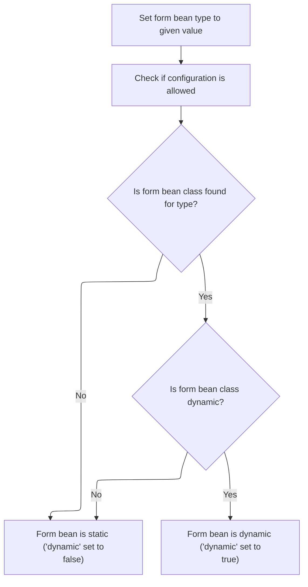

<SwmSnippet path="/core/src/main/java/org/apache/struts/config/FormBeanConfig.java" line="161">

---

In <SwmToken path="core/src/main/java/org/apache/struts/config/FormBeanConfig.java" pos="161:5:5" line-data="    public void setType(String type) {">`setType`</SwmToken>, we first make sure the config isn't already locked down by calling <SwmToken path="core/src/main/java/org/apache/struts/config/FormBeanConfig.java" pos="162:1:1" line-data="        throwIfConfigured();">`throwIfConfigured`</SwmToken>. Then we set the type and figure out if this bean is dynamic by checking if the resolved class is a <SwmToken path="core/src/main/java/org/apache/struts/config/FormBeanConfig.java" pos="165:7:7" line-data="        Class dynaBeanClass = DynaActionForm.class;">`DynaActionForm`</SwmToken>. This impacts how the bean is used later, especially for dynamic property handling.

```java
    public void setType(String type) {
        throwIfConfigured();
        this.type = type;

        Class dynaBeanClass = DynaActionForm.class;
        Class formBeanClass = formBeanClass();

```

---

</SwmSnippet>

<SwmSnippet path="/core/src/main/java/org/apache/struts/config/FormBeanConfig.java" line="603">

---

FormBeanClass tries to load the class named by <SwmToken path="core/src/main/java/org/apache/struts/config/FormBeanConfig.java" pos="612:8:10" line-data="            return (classLoader.loadClass(getType()));">`getType()`</SwmToken> using the thread's context class loader, falling back to the class's own loader if needed. If loading fails, it just returns null. This lets the framework support different deployment setups where classes might live in different class loaders.

```java
    protected Class formBeanClass() {
        ClassLoader classLoader =
            Thread.currentThread().getContextClassLoader();

        if (classLoader == null) {
            classLoader = this.getClass().getClassLoader();
        }

        try {
            return (classLoader.loadClass(getType()));
        } catch (Exception e) {
            return (null);
        }
    }
```

---

</SwmSnippet>

<SwmSnippet path="/core/src/main/java/org/apache/struts/config/FormBeanConfig.java" line="168">

---

After coming back from <SwmToken path="core/src/main/java/org/apache/struts/config/FormBeanConfig.java" pos="168:4:4" line-data="        if (formBeanClass != null) {">`formBeanClass`</SwmToken>, we check if the loaded class is a <SwmToken path="core/src/main/java/org/apache/struts/config/FormBeanConfig.java" pos="165:7:7" line-data="        Class dynaBeanClass = DynaActionForm.class;">`DynaActionForm`</SwmToken>. If it is, we set the dynamic flag to true; otherwise, it's false. This controls how the framework treats the bean for property handling and validation.

```java
        if (formBeanClass != null) {
            if (dynaBeanClass.isAssignableFrom(formBeanClass)) {
                this.dynamic = true;
            } else {
                this.dynamic = false;
            }
        } else {
            this.dynamic = false;
        }
    }
```

---

</SwmSnippet>

### Inheriting Form Property Configurations

<SwmSnippet path="/core/src/main/java/org/apache/struts/config/FormBeanConfig.java" line="515">

---

After <SwmToken path="core/src/main/java/org/apache/struts/config/FormBeanConfig.java" pos="161:5:5" line-data="    public void setType(String type) {">`setType`</SwmToken>, we call <SwmToken path="core/src/main/java/org/apache/struts/config/FormBeanConfig.java" pos="515:1:1" line-data="        inheritFormProperties(config);">`inheritFormProperties`</SwmToken> to pull in any form property configs from the parent that aren't already present. This step ensures the bean config has all the necessary property definitions before merging other settings.

```java
        inheritFormProperties(config);
```

---

</SwmSnippet>

### Copying and Merging Form Property Definitions

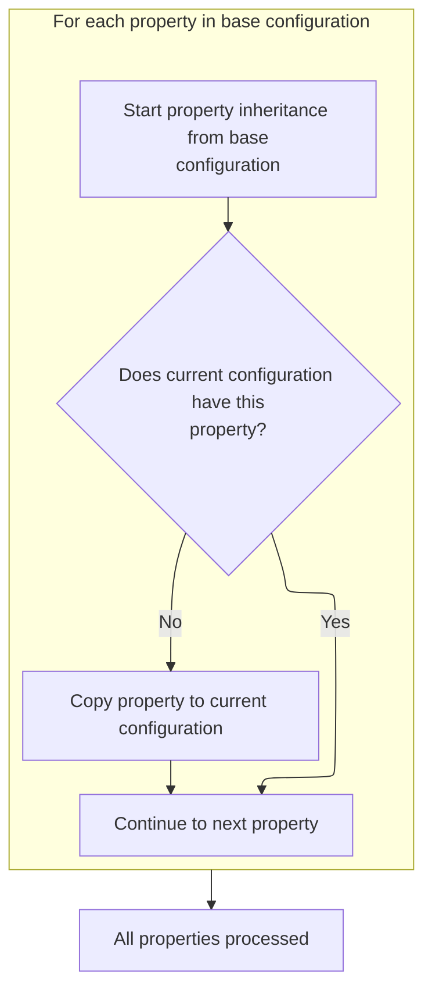

<SwmSnippet path="/core/src/main/java/org/apache/struts/config/FormBeanConfig.java" line="232">

---

In <SwmToken path="core/src/main/java/org/apache/struts/config/FormBeanConfig.java" pos="232:5:5" line-data="    protected void inheritFormProperties(FormBeanConfig config)">`inheritFormProperties`</SwmToken>, we loop through the parent's property configs. If the child doesn't already have a property, we clone it using <SwmToken path="core/src/main/java/org/apache/struts/config/FormBeanConfig.java" pos="253:1:3" line-data="                BeanUtils.copyProperties(prop, baseFpc);">`BeanUtils.copyProperties`</SwmToken>. This avoids shared state between parent and child configs.

```java
    protected void inheritFormProperties(FormBeanConfig config)
        throws ClassNotFoundException, IllegalAccessException,
            InstantiationException, InvocationTargetException {
        throwIfConfigured();

        // Inherit form property configs
        FormPropertyConfig[] baseFpcs = config.findFormPropertyConfigs();

        for (int i = 0; i < baseFpcs.length; i++) {
            FormPropertyConfig baseFpc = baseFpcs[i];

            // Do we have this prop?
            FormPropertyConfig prop =
                this.findFormPropertyConfig(baseFpc.getName());

            if (prop == null) {
                // We don't have this, so let's copy it
                prop =
                    (FormPropertyConfig) RequestUtils.applicationInstance(baseFpc.getClass()
                                                                                 .getName());

                BeanUtils.copyProperties(prop, baseFpc);
```

---

</SwmSnippet>

<SwmSnippet path="/core/src/main/java/org/apache/struts/config/FormBeanConfig.java" line="254">

---

After copying the property config, we add it to the child config with <SwmToken path="core/src/main/java/org/apache/struts/config/FormBeanConfig.java" pos="254:3:3" line-data="                this.addFormPropertyConfig(prop);">`addFormPropertyConfig`</SwmToken>. This makes sure the new property is registered and available for later use.

```java
                this.addFormPropertyConfig(prop);
```

---

</SwmSnippet>

<SwmSnippet path="/core/src/main/java/org/apache/struts/config/FormBeanConfig.java" line="255">

---

After adding the property config, we call <SwmToken path="core/src/main/java/org/apache/struts/config/FormBeanConfig.java" pos="255:3:3" line-data="                prop.setProperties(baseFpc.copyProperties());">`setProperties`</SwmToken> with a copy of the parent's properties. This step finalizes the property config so it has all the right settings, fully independent from the parent.

```java
                prop.setProperties(baseFpc.copyProperties());
            }
        }
    }
```

---

</SwmSnippet>

### Merging Remaining Config Properties

<SwmSnippet path="/core/src/main/java/org/apache/struts/config/FormBeanConfig.java" line="516">

---

After finishing up with form property configs, we call <SwmToken path="core/src/main/java/org/apache/struts/config/FormBeanConfig.java" pos="516:1:1" line-data="        inheritProperties(config);">`inheritProperties`</SwmToken> to merge in any remaining settings from the parent config. This wraps up the inheritance process for the bean config.

```java
        inheritProperties(config);
    }
```

---

</SwmSnippet>

## Marking Extension as Complete

<SwmSnippet path="/core/src/main/java/org/apache/struts/config/FormBeanConfig.java" line="562">

---

After all the inheritance and merging, we set <SwmToken path="core/src/main/java/org/apache/struts/config/FormBeanConfig.java" pos="562:1:1" line-data="        extensionProcessed = true;">`extensionProcessed`</SwmToken> to true. This tells the framework we're done with extension logic for this config, so it won't get processed again.

```java
        extensionProcessed = true;
    }
```

---

</SwmSnippet>

&nbsp;

*This is an auto-generated document by Swimm 🌊 and has not yet been verified by a human*

<SwmMeta version="3.0.0" repo-id="Z2l0aHViJTNBJTNBc3RydXRzMSUzQSUzQVN3aW1tLURlbW8=" repo-name="struts1"><sup>Powered by [Swimm](https://app.swimm.io/)</sup></SwmMeta>
