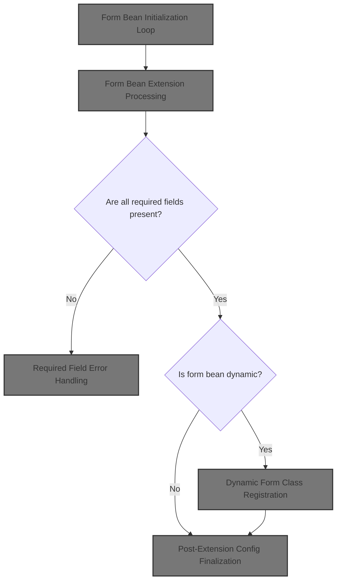
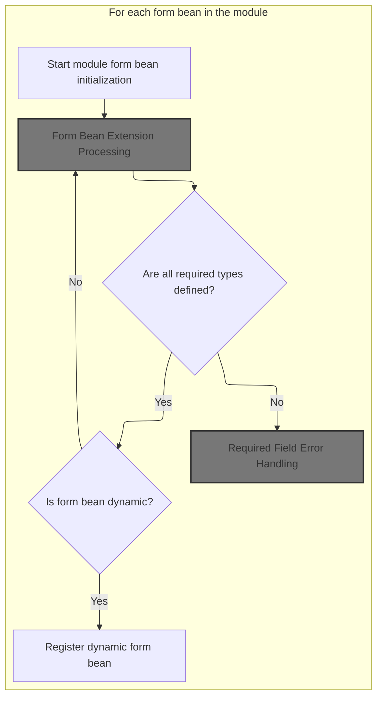
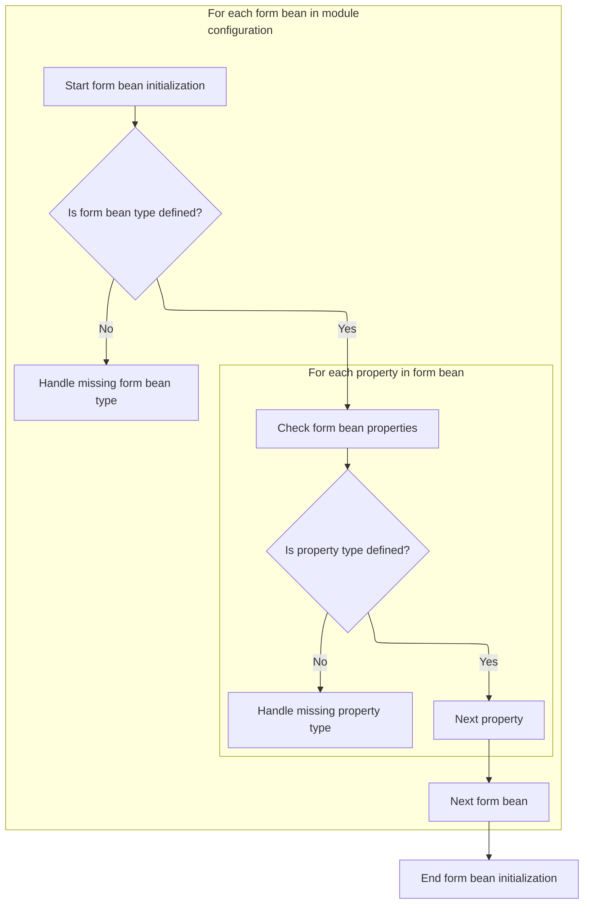

This document describes how form beans are initialized for a module. Each form bean is configured, inheritance and extensions are processed, required fields are validated, and dynamic form beans are registered. The input is a set of form bean configurations, and the output is a set of fully initialized form beans ready for use.



# Form Bean Initialization Loop



<SwmSnippet path="/core/src/main/java/org/apache/struts/action/ActionServlet.java" line="914">

---

In <SwmToken path="core/src/main/java/org/apache/struts/action/ActionServlet.java" pos="914:5:5" line-data="    protected void initModuleFormBeans(ModuleConfig config)">`initModuleFormBeans`</SwmToken>, we're looping through all form beans for the module and running <SwmToken path="core/src/main/java/org/apache/struts/action/ActionServlet.java" pos="927:1:1" line-data="            postProcessConfig(beanConfig, config, true);">`postProcessConfig`</SwmToken> on each. This sets up or finalizes config details before we handle any inheritance or extension logic. We call <SwmToken path="core/src/main/java/org/apache/struts/action/ActionServlet.java" pos="927:1:1" line-data="            postProcessConfig(beanConfig, config, true);">`postProcessConfig`</SwmToken> here to make sure each bean config is in a consistent state before moving on.

```java
    protected void initModuleFormBeans(ModuleConfig config)
        throws ServletException {
        if (log.isDebugEnabled()) {
            log.debug("Initializing module path '" + config.getPrefix()
                + "' form beans");
        }

        // Process form bean extensions.
        FormBeanConfig[] formBeans = config.findFormBeanConfigs();

        for (int i = 0; i < formBeans.length; i++) {
            FormBeanConfig beanConfig = formBeans[i];

            postProcessConfig(beanConfig, config, true);
```

---

</SwmSnippet>

<SwmSnippet path="/core/src/main/java/org/apache/struts/action/ActionServlet.java" line="928">

---

Back in <SwmToken path="core/src/main/java/org/apache/struts/action/ActionServlet.java" pos="914:5:5" line-data="    protected void initModuleFormBeans(ModuleConfig config)">`initModuleFormBeans`</SwmToken>, after <SwmToken path="core/src/main/java/org/apache/struts/action/ActionServlet.java" pos="927:1:1" line-data="            postProcessConfig(beanConfig, config, true);">`postProcessConfig`</SwmToken>, we immediately call <SwmToken path="core/src/main/java/org/apache/struts/action/ActionServlet.java" pos="928:1:1" line-data="            processFormBeanExtension(beanConfig, config);">`processFormBeanExtension`</SwmToken>. This is where we handle any inheritance or extension setup for the form bean, which depends on the config being finalized in the previous step.

```java
            processFormBeanExtension(beanConfig, config);
```

---

</SwmSnippet>

## Form Bean Extension Processing

<SwmSnippet path="/core/src/main/java/org/apache/struts/action/ActionServlet.java" line="968">

---

In <SwmToken path="core/src/main/java/org/apache/struts/action/ActionServlet.java" pos="968:5:5" line-data="    protected void processFormBeanExtension(FormBeanConfig beanConfig,">`processFormBeanExtension`</SwmToken>, we check if the extension logic has already been processed. If not, we call <SwmToken path="core/src/main/java/org/apache/struts/action/ActionServlet.java" pos="979:1:1" line-data="                    processFormBeanConfigClass(beanConfig, moduleConfig);">`processFormBeanConfigClass`</SwmToken> to resolve and set up the actual Java class for the form bean, which is needed before we handle inheritance or extension details.

```java
    protected void processFormBeanExtension(FormBeanConfig beanConfig,
        ModuleConfig moduleConfig)
        throws ServletException {
        try {
            if (!beanConfig.isExtensionProcessed()) {
                if (log.isDebugEnabled()) {
                    log.debug("Processing extensions for '"
                        + beanConfig.getName() + "'");
                }

                beanConfig =
                    processFormBeanConfigClass(beanConfig, moduleConfig);

```

---

</SwmSnippet>

### Form Bean Class Resolution

See <SwmLink doc-title="Ensuring correct subclassing of form bean configurations">[Ensuring correct subclassing of form bean configurations](/.swm/ensuring-correct-subclassing-of-form-bean-configurations.8gl1dn08.sw.md)</SwmLink>

### Form Bean Inheritance Resolution

<SwmSnippet path="/core/src/main/java/org/apache/struts/action/ActionServlet.java" line="981">

---

After returning from <SwmToken path="core/src/main/java/org/apache/struts/action/ActionServlet.java" pos="979:1:1" line-data="                    processFormBeanConfigClass(beanConfig, moduleConfig);">`processFormBeanConfigClass`</SwmToken> in <SwmToken path="core/src/main/java/org/apache/struts/action/ActionServlet.java" pos="928:1:1" line-data="            processFormBeanExtension(beanConfig, config);">`processFormBeanExtension`</SwmToken>, we call <SwmToken path="core/src/main/java/org/apache/struts/action/ActionServlet.java" pos="981:3:3" line-data="                beanConfig.processExtends(moduleConfig);">`processExtends`</SwmToken> on the bean config. This step applies inheritance, pulling in properties from parent configs if defined.

```java
                beanConfig.processExtends(moduleConfig);
            }
```

---

</SwmSnippet>

### Parent Form Bean Property Merging

See <SwmLink doc-title="Configuration Inheritance Resolution">[Configuration Inheritance Resolution](/.swm/configuration-inheritance-resolution.p90tkh29.sw.md)</SwmLink>

### Extension Exception Handling

<SwmSnippet path="/core/src/main/java/org/apache/struts/action/ActionServlet.java" line="983">

---

After <SwmToken path="core/src/main/java/org/apache/struts/action/ActionServlet.java" pos="981:3:3" line-data="                beanConfig.processExtends(moduleConfig);">`processExtends`</SwmToken> in <SwmToken path="core/src/main/java/org/apache/struts/action/ActionServlet.java" pos="928:1:1" line-data="            processFormBeanExtension(beanConfig, config);">`processFormBeanExtension`</SwmToken>, if any exception is thrown (other than <SwmToken path="core/src/main/java/org/apache/struts/action/ActionServlet.java" pos="983:6:6" line-data="        } catch (ServletException e) {">`ServletException`</SwmToken>), we catch it and pass it to <SwmToken path="core/src/main/java/org/apache/struts/action/ActionServlet.java" pos="986:1:1" line-data="            handleGeneralExtensionException(&quot;FormBeanConfig&quot;,">`handleGeneralExtensionException`</SwmToken>. This logs the error and throws an <SwmToken path="core/src/main/java/org/apache/struts/action/ActionServlet.java" pos="815:1:1" line-data="        UnavailableException e2 = new UnavailableException(errorMessage);">`UnavailableException`</SwmToken> to halt further processing.

```java
        } catch (ServletException e) {
            throw e;
        } catch (Exception e) {
            handleGeneralExtensionException("FormBeanConfig",
                beanConfig.getName(), e);
        }
    }
```

---

</SwmSnippet>

## Extension Error Reporting

<SwmSnippet path="/core/src/main/java/org/apache/struts/action/ActionServlet.java" line="808">

---

In <SwmToken path="core/src/main/java/org/apache/struts/action/ActionServlet.java" pos="808:5:5" line-data="    private void handleGeneralExtensionException(String configType,">`handleGeneralExtensionException`</SwmToken>, we build an error message using <SwmToken path="core/src/main/java/org/apache/struts/action/ActionServlet.java" pos="812:1:3" line-data="            internal.getMessage(&quot;configExtends&quot;, configType, configName);">`internal.getMessage`</SwmToken>, which pulls a formatted string for logging and exception purposes. This makes sure the error details are clear and consistent.

```java
    private void handleGeneralExtensionException(String configType,
        String configName, Exception e)
        throws ServletException {
        String errorMessage =
            internal.getMessage("configExtends", configType, configName);

        log.error(errorMessage, e);
```

---

</SwmSnippet>

<SwmSnippet path="/core/src/main/java/org/apache/struts/action/ActionServlet.java" line="815">

---

After getting the error message, <SwmToken path="core/src/main/java/org/apache/struts/action/ActionServlet.java" pos="808:5:5" line-data="    private void handleGeneralExtensionException(String configType,">`handleGeneralExtensionException`</SwmToken> wraps it in an <SwmToken path="core/src/main/java/org/apache/struts/action/ActionServlet.java" pos="815:1:1" line-data="        UnavailableException e2 = new UnavailableException(errorMessage);">`UnavailableException`</SwmToken>, attaches the original cause, and throws it. This stops the servlet and makes the error traceable.

```java
        UnavailableException e2 = new UnavailableException(errorMessage);
        e2.initCause(e);
        throw e2;
    }
```

---

</SwmSnippet>

## Post-Extension Config Finalization



<SwmSnippet path="/core/src/main/java/org/apache/struts/action/ActionServlet.java" line="929">

---

After <SwmToken path="core/src/main/java/org/apache/struts/action/ActionServlet.java" pos="928:1:1" line-data="            processFormBeanExtension(beanConfig, config);">`processFormBeanExtension`</SwmToken> in <SwmToken path="core/src/main/java/org/apache/struts/action/ActionServlet.java" pos="914:5:5" line-data="    protected void initModuleFormBeans(ModuleConfig config)">`initModuleFormBeans`</SwmToken>, we call <SwmToken path="core/src/main/java/org/apache/struts/action/ActionServlet.java" pos="929:1:1" line-data="            postProcessConfig(beanConfig, config, false);">`postProcessConfig`</SwmToken> again. This lets us apply any last tweaks or checks now that all extension logic is done.

```java
            postProcessConfig(beanConfig, config, false);
        }

```

---

</SwmSnippet>

<SwmSnippet path="/core/src/main/java/org/apache/struts/action/ActionServlet.java" line="932">

---

After <SwmToken path="core/src/main/java/org/apache/struts/action/ActionServlet.java" pos="927:1:1" line-data="            postProcessConfig(beanConfig, config, true);">`postProcessConfig`</SwmToken> in <SwmToken path="core/src/main/java/org/apache/struts/action/ActionServlet.java" pos="914:5:5" line-data="    protected void initModuleFormBeans(ModuleConfig config)">`initModuleFormBeans`</SwmToken>, we check that all required fields are present in the form bean and its properties. If anything's missing, we call <SwmToken path="core/src/main/java/org/apache/struts/action/ActionServlet.java" pos="937:1:1" line-data="                handleValueRequiredException(&quot;type&quot;, formBean.getName(),">`handleValueRequiredException`</SwmToken> to log the problem and halt the servlet.

```java
        for (int i = 0; i < formBeans.length; i++) {
            FormBeanConfig formBean = formBeans[i];

            // Verify that required fields are all present for the form config
            if (formBean.getType() == null) {
                handleValueRequiredException("type", formBean.getName(),
                    "form bean");
            }

            // ... and the property configs
            FormPropertyConfig[] fpcs = formBean.findFormPropertyConfigs();

            for (int j = 0; j < fpcs.length; j++) {
                FormPropertyConfig property = fpcs[j];

                if (property.getType() == null) {
                    handleValueRequiredException("type", property.getName(),
                        "form property");
                }
            }

```

---

</SwmSnippet>

## Required Field Error Handling

<SwmSnippet path="/core/src/main/java/org/apache/struts/action/ActionServlet.java" line="830">

---

In <SwmToken path="core/src/main/java/org/apache/struts/action/ActionServlet.java" pos="830:5:5" line-data="    private void handleValueRequiredException(String field, String configType,">`handleValueRequiredException`</SwmToken>, we use <SwmToken path="core/src/main/java/org/apache/struts/action/ActionServlet.java" pos="833:1:3" line-data="            internal.getMessage(&quot;configFieldRequired&quot;, field, configType,">`internal.getMessage`</SwmToken> to build a detailed error message about the missing field. This message is used for logging and in the exception we throw.

```java
    private void handleValueRequiredException(String field, String configType,
        String configName) throws ServletException {
        String errorMessage =
            internal.getMessage("configFieldRequired", field, configType,
                configName);

        log.error(errorMessage);
```

---

</SwmSnippet>

<SwmSnippet path="/core/src/main/java/org/apache/struts/util/MessageResources.java" line="339">

---

<SwmToken path="core/src/main/java/org/apache/struts/util/MessageResources.java" pos="339:5:5" line-data="    public String getMessage(Locale locale, String key, Object arg0, Object arg1) {">`getMessage`</SwmToken> in <SwmToken path="core/src/main/java/org/apache/struts/action/ActionServlet.java" pos="56:10:10" line-data="import org.apache.struts.util.MessageResources;">`MessageResources`</SwmToken> builds the actual error string, possibly localized, using the provided key and arguments. This is what gets logged and thrown in the exception.

```java
    public String getMessage(Locale locale, String key, Object arg0, Object arg1) {
        return this.getMessage(locale, key, new Object[] { arg0, arg1 });
    }
```

---

</SwmSnippet>

<SwmSnippet path="/core/src/main/java/org/apache/struts/action/ActionServlet.java" line="837">

---

After building the error message, <SwmToken path="core/src/main/java/org/apache/struts/action/ActionServlet.java" pos="830:5:5" line-data="    private void handleValueRequiredException(String field, String configType,">`handleValueRequiredException`</SwmToken> throws an <SwmToken path="core/src/main/java/org/apache/struts/action/ActionServlet.java" pos="837:5:5" line-data="        throw new UnavailableException(errorMessage);">`UnavailableException`</SwmToken> with it. This stops the servlet from running with missing required fields.

```java
        throw new UnavailableException(errorMessage);
    }
```

---

</SwmSnippet>

## Dynamic Form Class Registration

<SwmSnippet path="/core/src/main/java/org/apache/struts/action/ActionServlet.java" line="953">

---

After all validation in <SwmToken path="core/src/main/java/org/apache/struts/action/ActionServlet.java" pos="914:5:5" line-data="    protected void initModuleFormBeans(ModuleConfig config)">`initModuleFormBeans`</SwmToken>, we make sure every dynamic form bean has its <SwmToken path="core/src/main/java/org/apache/struts/action/ActionServlet.java" pos="953:13:13" line-data="            // Force creation and registration of DynaActionFormClass instances">`DynaActionFormClass`</SwmToken> created and registered. This avoids runtime surprises by setting everything up now.

```java
            // Force creation and registration of DynaActionFormClass instances
            // for all dynamic form beans
            if (formBean.getDynamic()) {
                formBean.getDynaActionFormClass();
            }
        }
    }
```

---

</SwmSnippet>

<SwmSnippet path="/core/src/main/java/org/apache/struts/config/FormBeanConfig.java" line="117">

---

<SwmToken path="core/src/main/java/org/apache/struts/config/FormBeanConfig.java" pos="117:5:5" line-data="    public DynaActionFormClass getDynaActionFormClass() {">`getDynaActionFormClass`</SwmToken> checks if the form is dynamic and throws if not. If it is, it lazily creates the <SwmToken path="core/src/main/java/org/apache/struts/config/FormBeanConfig.java" pos="117:3:3" line-data="    public DynaActionFormClass getDynaActionFormClass() {">`DynaActionFormClass`</SwmToken> in a thread-safe way, so we only ever make one instance, even with multiple threads.

```java
    public DynaActionFormClass getDynaActionFormClass() {
        if (dynamic == false) {
            throw new IllegalArgumentException("ActionForm is not dynamic");
        }

        synchronized (lock) {
            if (dynaActionFormClass == null) {
                dynaActionFormClass = new DynaActionFormClass(this);
            }
        }

        return dynaActionFormClass;
    }
```

---

</SwmSnippet>

&nbsp;

*This is an auto-generated document by Swimm 🌊 and has not yet been verified by a human*

<SwmMeta version="3.0.0" repo-id="Z2l0aHViJTNBJTNBc3RydXRzMSUzQSUzQVN3aW1tLURlbW8=" repo-name="struts1"><sup>Powered by [Swimm](https://app.swimm.io/)</sup></SwmMeta>
