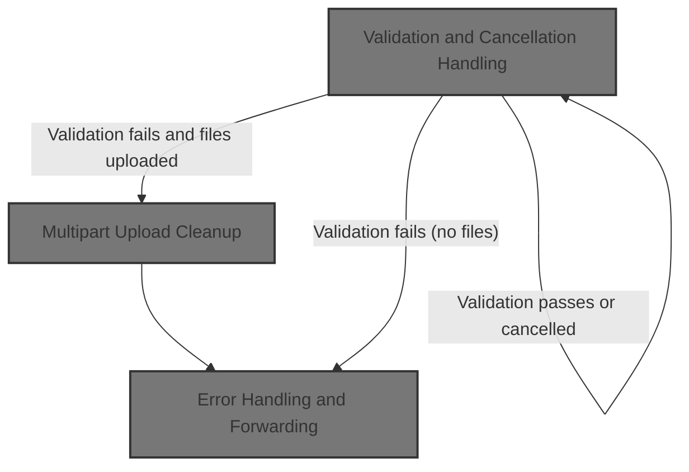
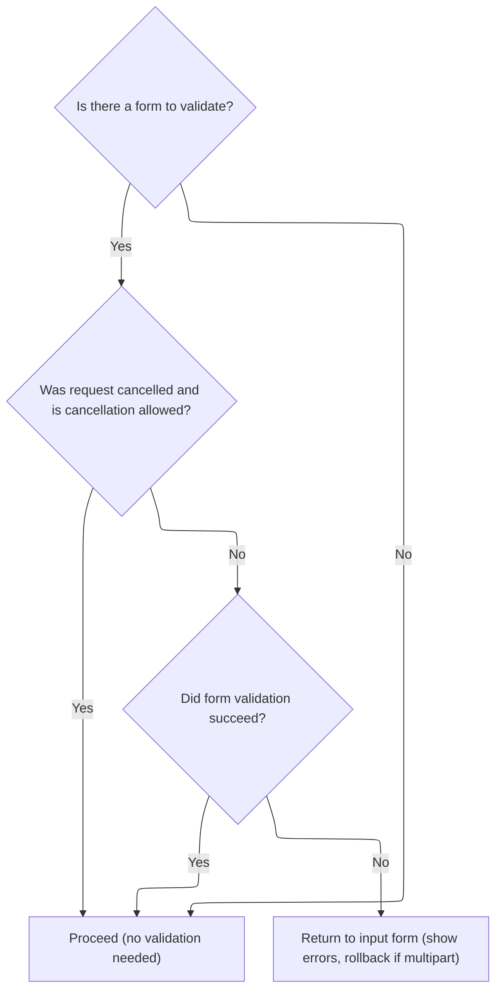
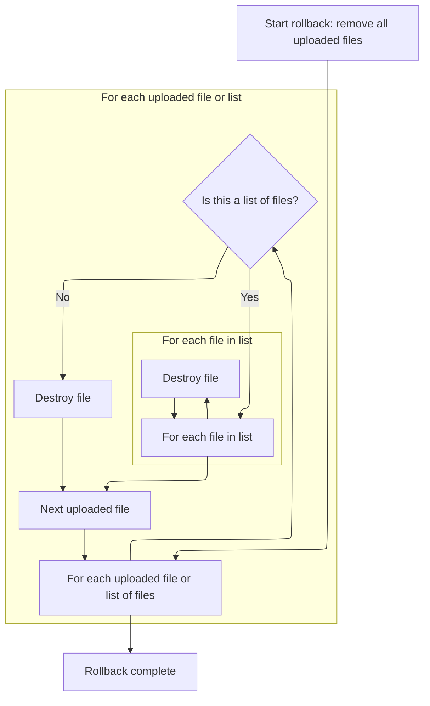
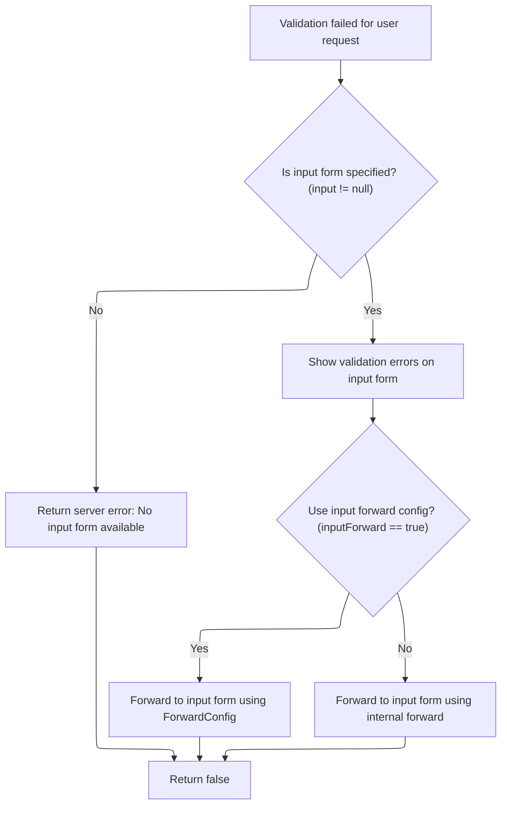

This document describes how user-submitted form data is validated as part of handling a request. The process checks if validation is needed, manages cancellations, validates the form, and cleans up uploaded files if validation fails. If errors are found, the user is returned to the input form with errors displayed.



# Where is this flow used?

This flow is used multiple times in the codebase as represented in the following diagram:

```mermaid
graph TD;
      1f3af44bfff9bae4b8af237be5302e37d202c99867273a09e77b9f6144dee63a(core/…/action/RequestProcessor.java::RequestProcessor.process) --> 50581ec391f4fce49b6dbae97891e027c2d8240a26ea5444e94a177c6bee499e(core/…/action/RequestProcessor.java::RequestProcessor.processValidate)

294cd284fa406b4fe4f160157c73b79eaa7835613a545efd883ce1f14dd1ca7e(core/…/action/ActionServlet.java::ActionServlet.process) --> 1f3af44bfff9bae4b8af237be5302e37d202c99867273a09e77b9f6144dee63a(core/…/action/RequestProcessor.java::RequestProcessor.process)

dde35d78060f1afca84b5e9dedc002fc37669b07142e9d5a1f656107cc900aa0(core/…/action/ActionServlet.java::ActionServlet.doGet) --> 294cd284fa406b4fe4f160157c73b79eaa7835613a545efd883ce1f14dd1ca7e(core/…/action/ActionServlet.java::ActionServlet.process)

ec52fb7c28a6afaae4fd5937965ca776c6c12441d8a10e0b92b387b05c5c5cf5(core/…/action/ActionServlet.java::ActionServlet.doPost) --> 294cd284fa406b4fe4f160157c73b79eaa7835613a545efd883ce1f14dd1ca7e(core/…/action/ActionServlet.java::ActionServlet.process)

8a621e29539d7ec8103485c1826ea7ac430c2b3deba2e4e21eb89aae3dfd0db1(faces/…/application/ActionListenerImpl.java::ActionListenerImpl.processAction) --> 1f3af44bfff9bae4b8af237be5302e37d202c99867273a09e77b9f6144dee63a(core/…/action/RequestProcessor.java::RequestProcessor.process)

8a621e29539d7ec8103485c1826ea7ac430c2b3deba2e4e21eb89aae3dfd0db1(faces/…/application/ActionListenerImpl.java::ActionListenerImpl.processAction) --> 8a621e29539d7ec8103485c1826ea7ac430c2b3deba2e4e21eb89aae3dfd0db1(faces/…/application/ActionListenerImpl.java::ActionListenerImpl.processAction)

b6211350e11e85bcf46d253c558813ee61b37e055811de360f2913d9c6c11855(faces/…/application/FacesRequestProcessor.java::FacesRequestProcessor.processValidate) --> 50581ec391f4fce49b6dbae97891e027c2d8240a26ea5444e94a177c6bee499e(core/…/action/RequestProcessor.java::RequestProcessor.processValidate)

0bc0691bf9c50f4a52d764f7f740965bf40e7fa6e17f47ec4ceba243a639ad10(faces/…/application/FacesTilesRequestProcessor.java::FacesTilesRequestProcessor.processValidate) --> 50581ec391f4fce49b6dbae97891e027c2d8240a26ea5444e94a177c6bee499e(core/…/action/RequestProcessor.java::RequestProcessor.processValidate)


classDef mainFlowStyle color:#000000,fill:#7CB9F4
classDef rootsStyle color:#000000,fill:#00FFF4
classDef Style1 color:#000000,fill:#00FFAA
classDef Style2 color:#000000,fill:#FFFF00
classDef Style3 color:#000000,fill:#AA7CB9

%% Swimm:
%% graph TD;
%%       1f3af44bfff9bae4b8af237be5302e37d202c99867273a09e77b9f6144dee63a(<SwmPath>[core/…/action/RequestProcessor.java](core/src/main/java/org/apache/struts/action/RequestProcessor.java)</SwmPath>::RequestProcessor.process) --> 50581ec391f4fce49b6dbae97891e027c2d8240a26ea5444e94a177c6bee499e(<SwmPath>[core/…/action/RequestProcessor.java](core/src/main/java/org/apache/struts/action/RequestProcessor.java)</SwmPath>::RequestProcessor.processValidate)
%% 
%% 294cd284fa406b4fe4f160157c73b79eaa7835613a545efd883ce1f14dd1ca7e(<SwmPath>[core/…/action/ActionServlet.java](core/src/main/java/org/apache/struts/action/ActionServlet.java)</SwmPath>::ActionServlet.process) --> 1f3af44bfff9bae4b8af237be5302e37d202c99867273a09e77b9f6144dee63a(<SwmPath>[core/…/action/RequestProcessor.java](core/src/main/java/org/apache/struts/action/RequestProcessor.java)</SwmPath>::RequestProcessor.process)
%% 
%% dde35d78060f1afca84b5e9dedc002fc37669b07142e9d5a1f656107cc900aa0(<SwmPath>[core/…/action/ActionServlet.java](core/src/main/java/org/apache/struts/action/ActionServlet.java)</SwmPath>::ActionServlet.doGet) --> 294cd284fa406b4fe4f160157c73b79eaa7835613a545efd883ce1f14dd1ca7e(<SwmPath>[core/…/action/ActionServlet.java](core/src/main/java/org/apache/struts/action/ActionServlet.java)</SwmPath>::ActionServlet.process)
%% 
%% ec52fb7c28a6afaae4fd5937965ca776c6c12441d8a10e0b92b387b05c5c5cf5(<SwmPath>[core/…/action/ActionServlet.java](core/src/main/java/org/apache/struts/action/ActionServlet.java)</SwmPath>::ActionServlet.doPost) --> 294cd284fa406b4fe4f160157c73b79eaa7835613a545efd883ce1f14dd1ca7e(<SwmPath>[core/…/action/ActionServlet.java](core/src/main/java/org/apache/struts/action/ActionServlet.java)</SwmPath>::ActionServlet.process)
%% 
%% 8a621e29539d7ec8103485c1826ea7ac430c2b3deba2e4e21eb89aae3dfd0db1(<SwmPath>[faces/…/application/ActionListenerImpl.java](faces/src/main/java/org/apache/struts/faces/application/ActionListenerImpl.java)</SwmPath>::ActionListenerImpl.processAction) --> 1f3af44bfff9bae4b8af237be5302e37d202c99867273a09e77b9f6144dee63a(<SwmPath>[core/…/action/RequestProcessor.java](core/src/main/java/org/apache/struts/action/RequestProcessor.java)</SwmPath>::RequestProcessor.process)
%% 
%% 8a621e29539d7ec8103485c1826ea7ac430c2b3deba2e4e21eb89aae3dfd0db1(<SwmPath>[faces/…/application/ActionListenerImpl.java](faces/src/main/java/org/apache/struts/faces/application/ActionListenerImpl.java)</SwmPath>::ActionListenerImpl.processAction) --> 8a621e29539d7ec8103485c1826ea7ac430c2b3deba2e4e21eb89aae3dfd0db1(<SwmPath>[faces/…/application/ActionListenerImpl.java](faces/src/main/java/org/apache/struts/faces/application/ActionListenerImpl.java)</SwmPath>::ActionListenerImpl.processAction)
%% 
%% b6211350e11e85bcf46d253c558813ee61b37e055811de360f2913d9c6c11855(<SwmPath>[faces/…/application/FacesRequestProcessor.java](faces/src/main/java/org/apache/struts/faces/application/FacesRequestProcessor.java)</SwmPath>::FacesRequestProcessor.processValidate) --> 50581ec391f4fce49b6dbae97891e027c2d8240a26ea5444e94a177c6bee499e(<SwmPath>[core/…/action/RequestProcessor.java](core/src/main/java/org/apache/struts/action/RequestProcessor.java)</SwmPath>::RequestProcessor.processValidate)
%% 
%% 0bc0691bf9c50f4a52d764f7f740965bf40e7fa6e17f47ec4ceba243a639ad10(<SwmPath>[faces/…/application/FacesTilesRequestProcessor.java](faces/src/main/java/org/apache/struts/faces/application/FacesTilesRequestProcessor.java)</SwmPath>::FacesTilesRequestProcessor.processValidate) --> 50581ec391f4fce49b6dbae97891e027c2d8240a26ea5444e94a177c6bee499e(<SwmPath>[core/…/action/RequestProcessor.java](core/src/main/java/org/apache/struts/action/RequestProcessor.java)</SwmPath>::RequestProcessor.processValidate)
%% 
%% 
%% classDef mainFlowStyle color:#000000,fill:#7CB9F4
%% classDef rootsStyle color:#000000,fill:#00FFF4
%% classDef Style1 color:#000000,fill:#00FFAA
%% classDef Style2 color:#000000,fill:#FFFF00
%% classDef Style3 color:#000000,fill:#AA7CB9
```



# Validation and Cancellation Handling



<SwmSnippet path="/core/src/main/java/org/apache/struts/action/RequestProcessor.java" line="917">

---

In <SwmToken path="core/src/main/java/org/apache/struts/action/RequestProcessor.java" pos="917:5:5" line-data="    protected boolean processValidate(HttpServletRequest request,">`processValidate`</SwmToken>, we start by skipping validation if there's no form or if validation is turned off for this mapping. Then, we check if the request was cancelled: if cancellation is allowed, we skip validation; if not, we throw an <SwmToken path="core/src/main/java/org/apache/struts/action/RequestProcessor.java" pos="919:9:9" line-data="        throws IOException, ServletException, InvalidCancelException {">`InvalidCancelException`</SwmToken>. After that, we run the form's validate method. If there are errors and the form has a multipart handler, we call its rollback method to clean up any uploaded files before handling the error response. This is why we need to call <SwmToken path="core/src/main/java/org/apache/struts/upload/CommonsMultipartRequestHandler.java" pos="58:4:4" line-data="public class CommonsMultipartRequestHandler implements MultipartRequestHandler {">`CommonsMultipartRequestHandler`</SwmToken> next—it's about cleaning up after failed multipart validations.

```java
    protected boolean processValidate(HttpServletRequest request,
        HttpServletResponse response, ActionForm form, ActionMapping mapping)
        throws IOException, ServletException, InvalidCancelException {
        if (form == null) {
            return (true);
        }

        // Has validation been turned off for this mapping?
        if (!mapping.getValidate()) {
            return (true);
        }

        // Was this request cancelled? If it has been, the mapping also
        // needs to state whether the cancellation is permissable; otherwise
        // the cancellation is considered to be a symptom of a programmer
        // error or a spoof.
        if (request.getAttribute(Globals.CANCEL_KEY) != null) {
            if (mapping.getCancellable()) {
                if (log.isDebugEnabled()) {
                    log.debug(" Cancelled transaction, skipping validation");
                }
                return (true);
            } else {
                request.removeAttribute(Globals.CANCEL_KEY);
                throw new InvalidCancelException();
            }
        }

        // Call the form bean's validation method
        if (log.isDebugEnabled()) {
            log.debug(" Validating input form properties");
        }

        ActionMessages errors = form.validate(mapping, request);

        if ((errors == null) || errors.isEmpty()) {
            if (log.isTraceEnabled()) {
                log.trace("  No errors detected, accepting input");
            }

            return (true);
        }

        // Special handling for multipart request
        if (form.getMultipartRequestHandler() != null) {
            if (log.isTraceEnabled()) {
                log.trace("  Rolling back multipart request");
            }

            form.getMultipartRequestHandler().rollback();
        }

```

---

</SwmSnippet>

## Multipart Upload Cleanup



<SwmSnippet path="/core/src/main/java/org/apache/struts/upload/CommonsMultipartRequestHandler.java" line="247">

---

<SwmToken path="core/src/main/java/org/apache/struts/upload/CommonsMultipartRequestHandler.java" pos="247:5:5" line-data="    public void rollback() {">`rollback`</SwmToken> loops through all uploaded file references in <SwmToken path="core/src/main/java/org/apache/struts/upload/CommonsMultipartRequestHandler.java" pos="248:7:7" line-data="        Iterator iter = elementsFile.values().iterator();">`elementsFile`</SwmToken>, handling both lists and single <SwmToken path="core/src/main/java/org/apache/struts/upload/CommonsMultipartRequestHandler.java" pos="255:3:3" line-data="                    ((FormFile)i.next()).destroy();">`FormFile`</SwmToken> objects, and calls destroy on each. This wipes out any uploaded files from a failed multipart request, so we don't leave junk files behind after validation errors.

```java
    public void rollback() {
        Iterator iter = elementsFile.values().iterator();

        Object o;
        while (iter.hasNext()) {
            o = iter.next();
            if (o instanceof List) {
                for (Iterator i = ((List)o).iterator(); i.hasNext(); ) {
                    ((FormFile)i.next()).destroy();
                }
            } else {
                ((FormFile)o).destroy();
            }
        }
    }
```

---

</SwmSnippet>

## File Deletion and Request Forwarding

<SwmSnippet path="/core/src/main/java/org/apache/struts/upload/CommonsMultipartRequestHandler.java" line="645">

---

<SwmToken path="core/src/main/java/org/apache/struts/upload/CommonsMultipartRequestHandler.java" pos="645:5:5" line-data="        public void destroy() {">`destroy`</SwmToken> just calls delete on the underlying <SwmToken path="core/src/main/java/org/apache/struts/upload/CommonsMultipartRequestHandler.java" pos="646:1:1" line-data="            fileItem.delete();">`fileItem`</SwmToken>, which removes the uploaded file from temp storage. After this, if the app needs to handle any additional cleanup or navigation (like in a JSF flow), that's where RegistrationBacking.delete comes in.

```java
        public void destroy() {
            fileItem.delete();
        }
```

---

</SwmSnippet>

<SwmSnippet path="/apps/faces-example1/src/main/java/org/apache/struts/webapp/example/RegistrationBacking.java" line="101">

---

<SwmToken path="apps/faces-example1/src/main/java/org/apache/struts/webapp/example/RegistrationBacking.java" pos="101:5:5" line-data="    public String delete() {">`delete`</SwmToken> in <SwmToken path="apps/faces-example1/src/main/java/org/apache/struts/webapp/example/RegistrationBacking.java" pos="36:4:4" line-data="public class RegistrationBacking extends AbstractBacking {">`RegistrationBacking`</SwmToken> builds a URL with the delete action and user/subscription info, then forwards the request to that URL. It returns null, which in JSF means no navigation change—forwarding handles the flow instead.

```java
    public String delete() {

        if (log.isDebugEnabled()) {
            log.debug("delete()");
        }
        FacesContext context = FacesContext.getCurrentInstance();
        StringBuffer url = subscription(context);
        url.append("?action=Delete");
        url.append("&username=");
        User user = (User)
            context.getExternalContext().getSessionMap().get("user");
        url.append(user.getUsername());
        url.append("&host=");
        Subscription subscription = (Subscription)
            context.getExternalContext().getRequestMap().get("subscription");
        url.append(subscription.getHost());
        forward(context, url.toString());
        return (null);

    }
```

---

</SwmSnippet>

## Error Handling and Forwarding



<SwmSnippet path="/core/src/main/java/org/apache/struts/action/RequestProcessor.java" line="969">

---

Back in <SwmToken path="core/src/main/java/org/apache/struts/action/RequestProcessor.java" pos="917:5:5" line-data="    protected boolean processValidate(HttpServletRequest request,">`processValidate`</SwmToken>, after cleaning up multipart uploads, we check if there's an input path to return to. If not, we send a 500 error. If there is, we stash the errors in the request and either forward or internally redirect to the input form, depending on the controller config. That's why we call <SwmToken path="core/src/main/java/org/apache/struts/action/RequestProcessor.java" pos="995:1:1" line-data="            internalModuleRelativeForward(input, request, response);">`internalModuleRelativeForward`</SwmToken> next—to handle the internal forward if configured.

```java
        // Was an input path (or forward) specified for this mapping?
        String input = mapping.getInput();

        if (input == null) {
            if (log.isTraceEnabled()) {
                log.trace("  Validation failed but no input form available");
            }

            response.sendError(HttpServletResponse.SC_INTERNAL_SERVER_ERROR,
                getInternal().getMessage("noInput", mapping.getPath()));

            return (false);
        }

        // Save our error messages and return to the input form if possible
        if (log.isDebugEnabled()) {
            log.debug(" Validation failed, returning to '" + input + "'");
        }

        request.setAttribute(Globals.ERROR_KEY, errors);

        if (moduleConfig.getControllerConfig().getInputForward()) {
            ForwardConfig forward = mapping.findForward(input);

            processForwardConfig(request, response, forward);
        } else {
            internalModuleRelativeForward(input, request, response);
        }

        return (false);
    }
```

---

</SwmSnippet>

<SwmSnippet path="/core/src/main/java/org/apache/struts/action/RequestProcessor.java" line="1015">

---

<SwmToken path="core/src/main/java/org/apache/struts/action/RequestProcessor.java" pos="1015:5:5" line-data="    protected void internalModuleRelativeForward(String uri,">`internalModuleRelativeForward`</SwmToken> just prepends the module prefix to the given URI and forwards the request internally. This keeps the navigation inside the right module

```java
    protected void internalModuleRelativeForward(String uri,
        HttpServletRequest request, HttpServletResponse response)
        throws IOException, ServletException {
        // Construct a request dispatcher for the specified path
        uri = moduleConfig.getPrefix() + uri;

        // Delegate the processing of this request
        // :FIXME: - exception handling?
        if (log.isDebugEnabled()) {
            log.debug(" Delegating via forward to '" + uri + "'");
        }

        doForward(uri, request, response);
    }
```

---

</SwmSnippet>

&nbsp;

*This is an auto-generated document by Swimm 🌊 and has not yet been verified by a human*

<SwmMeta version="3.0.0" repo-id="Z2l0aHViJTNBJTNBc3RydXRzMSUzQSUzQVN3aW1tLURlbW8=" repo-name="struts1"><sup>Powered by [Swimm](https://app.swimm.io/)</sup></SwmMeta>
