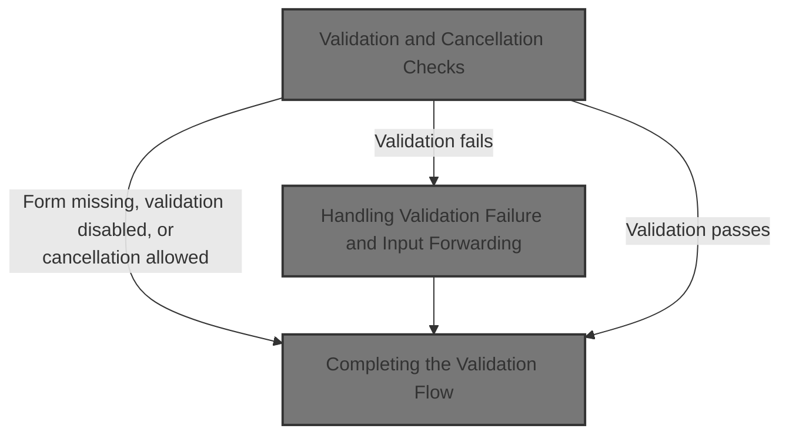
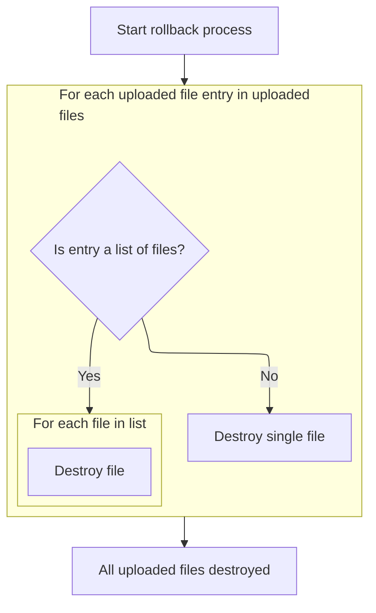
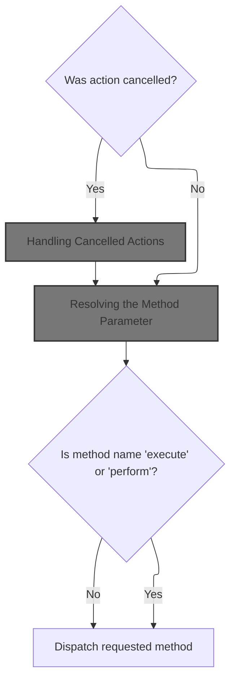
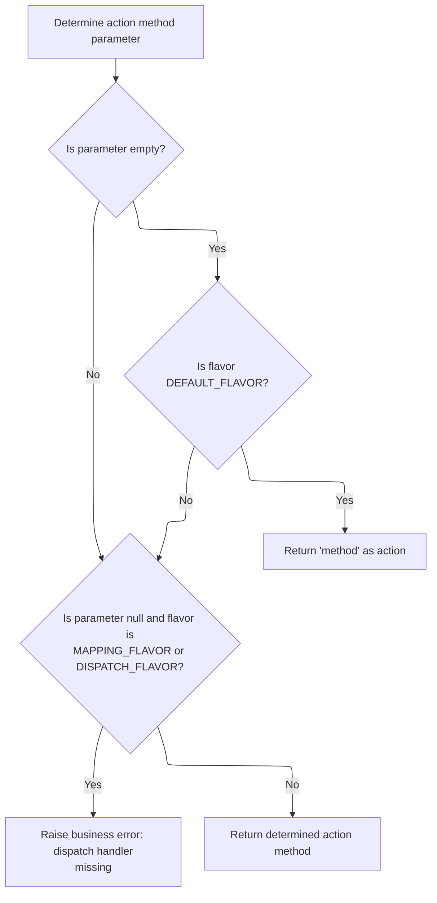
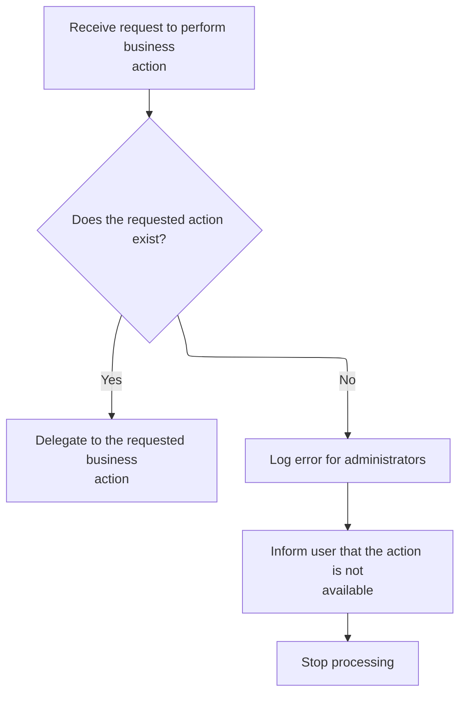

This document outlines how user-submitted forms are validated during an action request. The system checks if validation is needed, handles cancellations, and validates the data. If validation fails, uploaded files are cleaned up and the user is redirected back to the form with error messages.



# Where is this flow used?

This flow is used multiple times in the codebase as represented in the following diagram:

```mermaid
graph TD;
      1f3af44bfff9bae4b8af237be5302e37d202c99867273a09e77b9f6144dee63a(core/…/action/RequestProcessor.java::RequestProcessor.process) --> 50581ec391f4fce49b6dbae97891e027c2d8240a26ea5444e94a177c6bee499e(core/…/action/RequestProcessor.java::RequestProcessor.processValidate)

294cd284fa406b4fe4f160157c73b79eaa7835613a545efd883ce1f14dd1ca7e(core/…/action/ActionServlet.java::ActionServlet.process) --> 1f3af44bfff9bae4b8af237be5302e37d202c99867273a09e77b9f6144dee63a(core/…/action/RequestProcessor.java::RequestProcessor.process)

dde35d78060f1afca84b5e9dedc002fc37669b07142e9d5a1f656107cc900aa0(core/…/action/ActionServlet.java::ActionServlet.doGet) --> 294cd284fa406b4fe4f160157c73b79eaa7835613a545efd883ce1f14dd1ca7e(core/…/action/ActionServlet.java::ActionServlet.process)

ec52fb7c28a6afaae4fd5937965ca776c6c12441d8a10e0b92b387b05c5c5cf5(core/…/action/ActionServlet.java::ActionServlet.doPost) --> 294cd284fa406b4fe4f160157c73b79eaa7835613a545efd883ce1f14dd1ca7e(core/…/action/ActionServlet.java::ActionServlet.process)

8a621e29539d7ec8103485c1826ea7ac430c2b3deba2e4e21eb89aae3dfd0db1(faces/…/application/ActionListenerImpl.java::ActionListenerImpl.processAction) --> 1f3af44bfff9bae4b8af237be5302e37d202c99867273a09e77b9f6144dee63a(core/…/action/RequestProcessor.java::RequestProcessor.process)

8a621e29539d7ec8103485c1826ea7ac430c2b3deba2e4e21eb89aae3dfd0db1(faces/…/application/ActionListenerImpl.java::ActionListenerImpl.processAction) --> 8a621e29539d7ec8103485c1826ea7ac430c2b3deba2e4e21eb89aae3dfd0db1(faces/…/application/ActionListenerImpl.java::ActionListenerImpl.processAction)

b6211350e11e85bcf46d253c558813ee61b37e055811de360f2913d9c6c11855(faces/…/application/FacesRequestProcessor.java::FacesRequestProcessor.processValidate) --> 50581ec391f4fce49b6dbae97891e027c2d8240a26ea5444e94a177c6bee499e(core/…/action/RequestProcessor.java::RequestProcessor.processValidate)

0bc0691bf9c50f4a52d764f7f740965bf40e7fa6e17f47ec4ceba243a639ad10(faces/…/application/FacesTilesRequestProcessor.java::FacesTilesRequestProcessor.processValidate) --> 50581ec391f4fce49b6dbae97891e027c2d8240a26ea5444e94a177c6bee499e(core/…/action/RequestProcessor.java::RequestProcessor.processValidate)


classDef mainFlowStyle color:#000000,fill:#7CB9F4
classDef rootsStyle color:#000000,fill:#00FFF4
classDef Style1 color:#000000,fill:#00FFAA
classDef Style2 color:#000000,fill:#FFFF00
classDef Style3 color:#000000,fill:#AA7CB9

%% Swimm:
%% graph TD;
%%       1f3af44bfff9bae4b8af237be5302e37d202c99867273a09e77b9f6144dee63a(<SwmPath>[core/…/action/RequestProcessor.java](core/src/main/java/org/apache/struts/action/RequestProcessor.java)</SwmPath>::RequestProcessor.process) --> 50581ec391f4fce49b6dbae97891e027c2d8240a26ea5444e94a177c6bee499e(<SwmPath>[core/…/action/RequestProcessor.java](core/src/main/java/org/apache/struts/action/RequestProcessor.java)</SwmPath>::RequestProcessor.processValidate)
%% 
%% 294cd284fa406b4fe4f160157c73b79eaa7835613a545efd883ce1f14dd1ca7e(<SwmPath>[core/…/action/ActionServlet.java](core/src/main/java/org/apache/struts/action/ActionServlet.java)</SwmPath>::ActionServlet.process) --> 1f3af44bfff9bae4b8af237be5302e37d202c99867273a09e77b9f6144dee63a(<SwmPath>[core/…/action/RequestProcessor.java](core/src/main/java/org/apache/struts/action/RequestProcessor.java)</SwmPath>::RequestProcessor.process)
%% 
%% dde35d78060f1afca84b5e9dedc002fc37669b07142e9d5a1f656107cc900aa0(<SwmPath>[core/…/action/ActionServlet.java](core/src/main/java/org/apache/struts/action/ActionServlet.java)</SwmPath>::ActionServlet.doGet) --> 294cd284fa406b4fe4f160157c73b79eaa7835613a545efd883ce1f14dd1ca7e(<SwmPath>[core/…/action/ActionServlet.java](core/src/main/java/org/apache/struts/action/ActionServlet.java)</SwmPath>::ActionServlet.process)
%% 
%% ec52fb7c28a6afaae4fd5937965ca776c6c12441d8a10e0b92b387b05c5c5cf5(<SwmPath>[core/…/action/ActionServlet.java](core/src/main/java/org/apache/struts/action/ActionServlet.java)</SwmPath>::ActionServlet.doPost) --> 294cd284fa406b4fe4f160157c73b79eaa7835613a545efd883ce1f14dd1ca7e(<SwmPath>[core/…/action/ActionServlet.java](core/src/main/java/org/apache/struts/action/ActionServlet.java)</SwmPath>::ActionServlet.process)
%% 
%% 8a621e29539d7ec8103485c1826ea7ac430c2b3deba2e4e21eb89aae3dfd0db1(<SwmPath>[faces/…/application/ActionListenerImpl.java](faces/src/main/java/org/apache/struts/faces/application/ActionListenerImpl.java)</SwmPath>::ActionListenerImpl.processAction) --> 1f3af44bfff9bae4b8af237be5302e37d202c99867273a09e77b9f6144dee63a(<SwmPath>[core/…/action/RequestProcessor.java](core/src/main/java/org/apache/struts/action/RequestProcessor.java)</SwmPath>::RequestProcessor.process)
%% 
%% 8a621e29539d7ec8103485c1826ea7ac430c2b3deba2e4e21eb89aae3dfd0db1(<SwmPath>[faces/…/application/ActionListenerImpl.java](faces/src/main/java/org/apache/struts/faces/application/ActionListenerImpl.java)</SwmPath>::ActionListenerImpl.processAction) --> 8a621e29539d7ec8103485c1826ea7ac430c2b3deba2e4e21eb89aae3dfd0db1(<SwmPath>[faces/…/application/ActionListenerImpl.java](faces/src/main/java/org/apache/struts/faces/application/ActionListenerImpl.java)</SwmPath>::ActionListenerImpl.processAction)
%% 
%% b6211350e11e85bcf46d253c558813ee61b37e055811de360f2913d9c6c11855(<SwmPath>[faces/…/application/FacesRequestProcessor.java](faces/src/main/java/org/apache/struts/faces/application/FacesRequestProcessor.java)</SwmPath>::FacesRequestProcessor.processValidate) --> 50581ec391f4fce49b6dbae97891e027c2d8240a26ea5444e94a177c6bee499e(<SwmPath>[core/…/action/RequestProcessor.java](core/src/main/java/org/apache/struts/action/RequestProcessor.java)</SwmPath>::RequestProcessor.processValidate)
%% 
%% 0bc0691bf9c50f4a52d764f7f740965bf40e7fa6e17f47ec4ceba243a639ad10(<SwmPath>[faces/…/application/FacesTilesRequestProcessor.java](faces/src/main/java/org/apache/struts/faces/application/FacesTilesRequestProcessor.java)</SwmPath>::FacesTilesRequestProcessor.processValidate) --> 50581ec391f4fce49b6dbae97891e027c2d8240a26ea5444e94a177c6bee499e(<SwmPath>[core/…/action/RequestProcessor.java](core/src/main/java/org/apache/struts/action/RequestProcessor.java)</SwmPath>::RequestProcessor.processValidate)
%% 
%% 
%% classDef mainFlowStyle color:#000000,fill:#7CB9F4
%% classDef rootsStyle color:#000000,fill:#00FFF4
%% classDef Style1 color:#000000,fill:#00FFAA
%% classDef Style2 color:#000000,fill:#FFFF00
%% classDef Style3 color:#000000,fill:#AA7CB9
```



# Validation and Cancellation Checks

```mermaid
%%{init: {"flowchart": {"defaultRenderer": "elk"}} }%%
flowchart TD
    node1["Start validation process"] --> node2{"Is there a form to validate?"}
    click node1 openCode "core/src/main/java/org/apache/struts/action/RequestProcessor.java:917:920"
    node2 -->|"No"| node14["Allow request to proceed"]
    click node2 openCode "core/src/main/java/org/apache/struts/action/RequestProcessor.java:920:922"
    node2 -->|"Yes"| node3{"Is validation enabled for this action?"}
    click node3 openCode "core/src/main/java/org/apache/struts/action/RequestProcessor.java:925:927"
    node3 -->|"No"| node14
    node3 -->|"Yes"| node4{"Was the request cancelled?"}
    click node4 openCode "core/src/main/java/org/apache/struts/action/RequestProcessor.java:933:943"
    node4 -->|"Yes"| node5{"Is cancellation allowed?"}
    click node5 openCode "core/src/main/java/org/apache/struts/action/RequestProcessor.java:934:942"
    node5 -->|"Yes"| node14
    node5 -->|"No"| node6["Stop processing: invalid cancellation"]
    click node6 openCode "core/src/main/java/org/apache/struts/action/RequestProcessor.java:940:941"
    node4 -->|"No"| node7["Validate form data"]
    click node7 openCode "core/src/main/java/org/apache/struts/action/RequestProcessor.java:950:951"
    node7 --> node8{"Did validation pass?"}
    click node8 openCode "core/src/main/java/org/apache/struts/action/RequestProcessor.java:952:958"
    node8 -->|"Yes"| node14
    node8 -->|"No"| node15["Cleaning Up Uploaded Files"]
    
    node15 --> node9{"Is there an input page?"}
    click node9 openCode "core/src/main/java/org/apache/struts/action/RequestProcessor.java:972:981"
    node9 -->|"No"| node10["Looking Up Localized Error Messages"]
    
    node9 -->|"Yes"| node11["Save errors to request"]
    click node11 openCode "core/src/main/java/org/apache/struts/action/RequestProcessor.java:988:989"
    node11 --> node12{"Forward or internal redirect to input
page?"}
    click node12 openCode "core/src/main/java/org/apache/struts/action/RequestProcessor.java:990:996"
    node12 -->|"Forward"| node13["Resolving and Forwarding to the Target URI"]
    
    node12 -->|"Internal redirect"| node16["Forwarding the Request to the Target Resource"]
    
    node14["Allow request to proceed"]
    click node14 openCode "core/src/main/java/org/apache/struts/action/RequestProcessor.java:921:957"
    node16["Forwarding the Request to the Target Resource"]
    

classDef HeadingStyle fill:#777777,stroke:#333,stroke-width:2px;
click node15 goToHeading "Cleaning Up Uploaded Files"
node15:::HeadingStyle
click node10 goToHeading "Looking Up Localized Error Messages"
node10:::HeadingStyle
click node13 goToHeading "Resolving and Forwarding to the Target URI"
node13:::HeadingStyle
click node16 goToHeading "Forwarding the Request to the Target Resource"
node16:::HeadingStyle

%% Swimm:
%% %%{init: {"flowchart": {"defaultRenderer": "elk"}} }%%
%% flowchart TD
%%     node1["Start validation process"] --> node2{"Is there a form to validate?"}
%%     click node1 openCode "<SwmPath>[core/…/action/RequestProcessor.java](core/src/main/java/org/apache/struts/action/RequestProcessor.java)</SwmPath>:917:920"
%%     node2 -->|"No"| node14["Allow request to proceed"]
%%     click node2 openCode "<SwmPath>[core/…/action/RequestProcessor.java](core/src/main/java/org/apache/struts/action/RequestProcessor.java)</SwmPath>:920:922"
%%     node2 -->|"Yes"| node3{"Is validation enabled for this action?"}
%%     click node3 openCode "<SwmPath>[core/…/action/RequestProcessor.java](core/src/main/java/org/apache/struts/action/RequestProcessor.java)</SwmPath>:925:927"
%%     node3 -->|"No"| node14
%%     node3 -->|"Yes"| node4{"Was the request cancelled?"}
%%     click node4 openCode "<SwmPath>[core/…/action/RequestProcessor.java](core/src/main/java/org/apache/struts/action/RequestProcessor.java)</SwmPath>:933:943"
%%     node4 -->|"Yes"| node5{"Is cancellation allowed?"}
%%     click node5 openCode "<SwmPath>[core/…/action/RequestProcessor.java](core/src/main/java/org/apache/struts/action/RequestProcessor.java)</SwmPath>:934:942"
%%     node5 -->|"Yes"| node14
%%     node5 -->|"No"| node6["Stop processing: invalid cancellation"]
%%     click node6 openCode "<SwmPath>[core/…/action/RequestProcessor.java](core/src/main/java/org/apache/struts/action/RequestProcessor.java)</SwmPath>:940:941"
%%     node4 -->|"No"| node7["Validate form data"]
%%     click node7 openCode "<SwmPath>[core/…/action/RequestProcessor.java](core/src/main/java/org/apache/struts/action/RequestProcessor.java)</SwmPath>:950:951"
%%     node7 --> node8{"Did validation pass?"}
%%     click node8 openCode "<SwmPath>[core/…/action/RequestProcessor.java](core/src/main/java/org/apache/struts/action/RequestProcessor.java)</SwmPath>:952:958"
%%     node8 -->|"Yes"| node14
%%     node8 -->|"No"| node15["Cleaning Up Uploaded Files"]
%%     
%%     node15 --> node9{"Is there an input page?"}
%%     click node9 openCode "<SwmPath>[core/…/action/RequestProcessor.java](core/src/main/java/org/apache/struts/action/RequestProcessor.java)</SwmPath>:972:981"
%%     node9 -->|"No"| node10["Looking Up Localized Error Messages"]
%%     
%%     node9 -->|"Yes"| node11["Save errors to request"]
%%     click node11 openCode "<SwmPath>[core/…/action/RequestProcessor.java](core/src/main/java/org/apache/struts/action/RequestProcessor.java)</SwmPath>:988:989"
%%     node11 --> node12{"Forward or internal redirect to input
%% page?"}
%%     click node12 openCode "<SwmPath>[core/…/action/RequestProcessor.java](core/src/main/java/org/apache/struts/action/RequestProcessor.java)</SwmPath>:990:996"
%%     node12 -->|"Forward"| node13["Resolving and Forwarding to the Target URI"]
%%     
%%     node12 -->|"Internal redirect"| node16["Forwarding the Request to the Target Resource"]
%%     
%%     node14["Allow request to proceed"]
%%     click node14 openCode "<SwmPath>[core/…/action/RequestProcessor.java](core/src/main/java/org/apache/struts/action/RequestProcessor.java)</SwmPath>:921:957"
%%     node16["Forwarding the Request to the Target Resource"]
%%     
%% 
%% classDef HeadingStyle fill:#777777,stroke:#333,stroke-width:2px;
%% click node15 goToHeading "Cleaning Up Uploaded Files"
%% node15:::HeadingStyle
%% click node10 goToHeading "Looking Up Localized Error Messages"
%% node10:::HeadingStyle
%% click node13 goToHeading "Resolving and Forwarding to the Target URI"
%% node13:::HeadingStyle
%% click node16 goToHeading "Forwarding the Request to the Target Resource"
%% node16:::HeadingStyle
```



<SwmSnippet path="/core/src/main/java/org/apache/struts/action/RequestProcessor.java" line="917">

---

In <SwmToken path="core/src/main/java/org/apache/struts/action/RequestProcessor.java" pos="917:5:5" line-data="    protected boolean processValidate(HttpServletRequest request,">`processValidate`</SwmToken>, we check for null forms, disabled validation, and cancelled requests before actually validating the form. If validation fails, we handle multipart rollback by calling the form's multipart request handler. This is needed to clean up any uploaded files if the form isn't valid, so we don't leave junk files around.

```java
    protected boolean processValidate(HttpServletRequest request,
        HttpServletResponse response, ActionForm form, ActionMapping mapping)
        throws IOException, ServletException, InvalidCancelException {
        if (form == null) {
            return (true);
        }

        // Has validation been turned off for this mapping?
        if (!mapping.getValidate()) {
            return (true);
        }

        // Was this request cancelled? If it has been, the mapping also
        // needs to state whether the cancellation is permissable; otherwise
        // the cancellation is considered to be a symptom of a programmer
        // error or a spoof.
        if (request.getAttribute(Globals.CANCEL_KEY) != null) {
            if (mapping.getCancellable()) {
                if (log.isDebugEnabled()) {
                    log.debug(" Cancelled transaction, skipping validation");
                }
                return (true);
            } else {
                request.removeAttribute(Globals.CANCEL_KEY);
                throw new InvalidCancelException();
            }
        }

        // Call the form bean's validation method
        if (log.isDebugEnabled()) {
            log.debug(" Validating input form properties");
        }

        ActionMessages errors = form.validate(mapping, request);

        if ((errors == null) || errors.isEmpty()) {
            if (log.isTraceEnabled()) {
                log.trace("  No errors detected, accepting input");
            }

            return (true);
        }

        // Special handling for multipart request
        if (form.getMultipartRequestHandler() != null) {
            if (log.isTraceEnabled()) {
                log.trace("  Rolling back multipart request");
            }

            form.getMultipartRequestHandler().rollback();
        }

```

---

</SwmSnippet>

## Cleaning Up Uploaded Files



<SwmSnippet path="/core/src/main/java/org/apache/struts/upload/CommonsMultipartRequestHandler.java" line="247">

---

<SwmToken path="core/src/main/java/org/apache/struts/upload/CommonsMultipartRequestHandler.java" pos="247:5:5" line-data="    public void rollback() {">`rollback`</SwmToken> loops through all uploaded file entries, handling both single files and lists of files, and calls destroy on each <SwmToken path="core/src/main/java/org/apache/struts/upload/CommonsMultipartRequestHandler.java" pos="255:3:3" line-data="                    ((FormFile)i.next()).destroy();">`FormFile`</SwmToken>. This ensures all uploaded files are cleaned up after a failed validation.

```java
    public void rollback() {
        Iterator iter = elementsFile.values().iterator();

        Object o;
        while (iter.hasNext()) {
            o = iter.next();
            if (o instanceof List) {
                for (Iterator i = ((List)o).iterator(); i.hasNext(); ) {
                    ((FormFile)i.next()).destroy();
                }
            } else {
                ((FormFile)o).destroy();
            }
        }
    }
```

---

</SwmSnippet>

## Deleting Temporary File Resources

<SwmSnippet path="/core/src/main/java/org/apache/struts/upload/CommonsMultipartRequestHandler.java" line="645">

---

<SwmToken path="core/src/main/java/org/apache/struts/upload/CommonsMultipartRequestHandler.java" pos="645:5:5" line-data="        public void destroy() {">`destroy`</SwmToken> just deletes the temporary file for the upload. This is the last cleanup step after a failed form submission, so nothing is left behind.

```java
        public void destroy() {
            fileItem.delete();
        }
```

---

</SwmSnippet>

## Triggering Subscription Deletion

<SwmSnippet path="/apps/faces-example1/src/main/java/org/apache/struts/webapp/example/RegistrationBacking.java" line="101">

---

In <SwmToken path="apps/faces-example1/src/main/java/org/apache/struts/webapp/example/RegistrationBacking.java" pos="101:5:5" line-data="    public String delete() {">`delete`</SwmToken>, we grab the <SwmToken path="apps/faces-example1/src/main/java/org/apache/struts/webapp/example/RegistrationBacking.java" pos="106:1:1" line-data="        FacesContext context = FacesContext.getCurrentInstance();">`FacesContext`</SwmToken> and start building a URL for the delete action. Next, we call <SwmToken path="apps/faces-example1/src/main/java/org/apache/struts/webapp/example/RegistrationBacking.java" pos="107:7:7" line-data="        StringBuffer url = subscription(context);">`subscription`</SwmToken> in <SwmToken path="apps/faces-example1/src/main/java/org/apache/struts/webapp/example/RegistrationBacking.java" pos="36:8:8" line-data="public class RegistrationBacking extends AbstractBacking {">`AbstractBacking`</SwmToken> to get the base URL for the subscription edit endpoint.

```java
    public String delete() {

        if (log.isDebugEnabled()) {
            log.debug("delete()");
        }
        FacesContext context = FacesContext.getCurrentInstance();
        StringBuffer url = subscription(context);
```

---

</SwmSnippet>

### Building Subscription Action <SwmToken path="core/src/main/java/org/apache/struts/util/RequestUtils.java" pos="677:9:9" line-data="     * the case for URLs that were originally created from relative or">`URLs`</SwmToken>

<SwmSnippet path="/apps/faces-example1/src/main/java/org/apache/struts/webapp/example/AbstractBacking.java" line="124">

---

<SwmToken path="apps/faces-example1/src/main/java/org/apache/struts/webapp/example/AbstractBacking.java" pos="124:5:5" line-data="    protected StringBuffer subscription(FacesContext context) {">`subscription`</SwmToken> just calls <SwmToken path="apps/faces-example1/src/main/java/org/apache/struts/webapp/example/AbstractBacking.java" pos="126:4:4" line-data="        return (action(context, &quot;/editSubscription&quot;));">`action`</SwmToken> to build the URL for the subscription edit endpoint. This keeps URL construction consistent and ensures the '.do' extension is always added.

```java
    protected StringBuffer subscription(FacesContext context) {

        return (action(context, "/editSubscription"));

    }
```

---

</SwmSnippet>

<SwmSnippet path="/apps/faces-example1/src/main/java/org/apache/struts/webapp/example/AbstractBacking.java" line="47">

---

<SwmToken path="apps/faces-example1/src/main/java/org/apache/struts/webapp/example/AbstractBacking.java" pos="47:5:5" line-data="    protected StringBuffer action(FacesContext context, String action) {">`action`</SwmToken> takes the action path and appends '.do' to it. This assumes Struts is set up for extension mapping, so all action <SwmToken path="core/src/main/java/org/apache/struts/util/RequestUtils.java" pos="677:9:9" line-data="     * the case for URLs that were originally created from relative or">`URLs`</SwmToken> are formed the same way.

```java
    protected StringBuffer action(FacesContext context, String action) {

        // FIXME - assumes extension mapping for Struts
        StringBuffer sb = new StringBuffer(action);
        sb.append(".do");
        return (sb);

    }
```

---

</SwmSnippet>

### Completing the Delete Request

<SwmSnippet path="/apps/faces-example1/src/main/java/org/apache/struts/webapp/example/RegistrationBacking.java" line="108">

---

Back in RegistrationBacking.delete, we just got the subscription URL from <SwmToken path="apps/faces-example1/src/main/java/org/apache/struts/webapp/example/RegistrationBacking.java" pos="36:8:8" line-data="public class RegistrationBacking extends AbstractBacking {">`AbstractBacking`</SwmToken>. Now we append the delete action and user/subscription info as query parameters, then call forward to actually trigger the delete. Returning null keeps us on the same page.

```java
        url.append("?action=Delete");
        url.append("&username=");
        User user = (User)
            context.getExternalContext().getSessionMap().get("user");
        url.append(user.getUsername());
        url.append("&host=");
        Subscription subscription = (Subscription)
            context.getExternalContext().getRequestMap().get("subscription");
        url.append(subscription.getHost());
        forward(context, url.toString());
        return (null);

    }
```

---

</SwmSnippet>

## Dispatching the Delete Action

<SwmSnippet path="/apps/faces-example1/src/main/java/org/apache/struts/webapp/example/AbstractBacking.java" line="66">

---

<SwmToken path="apps/faces-example1/src/main/java/org/apache/struts/webapp/example/AbstractBacking.java" pos="66:5:5" line-data="    protected void forward(FacesContext context, String url) {">`forward`</SwmToken> uses the JSF ExternalContext to dispatch the request to the given URL. If dispatch throws an <SwmToken path="apps/faces-example1/src/main/java/org/apache/struts/webapp/example/AbstractBacking.java" pos="70:6:6" line-data="        } catch (IOException e) {">`IOException`</SwmToken>, we wrap it in a <SwmToken path="apps/faces-example1/src/main/java/org/apache/struts/webapp/example/AbstractBacking.java" pos="71:5:5" line-data="            throw new FacesException(e);">`FacesException`</SwmToken>. Finally, we mark the response as complete so JSF doesn't try to render anything else.

```java
    protected void forward(FacesContext context, String url) {

        try {
            context.getExternalContext().dispatch(url);
        } catch (IOException e) {
            throw new FacesException(e);
        } finally {
            context.responseComplete();
        }

    }
```

---

</SwmSnippet>

## Routing to the Action Handler

<SwmSnippet path="/extras/src/main/java/org/apache/struts/actions/ActionDispatcher.java" line="507">

---

In <SwmToken path="extras/src/main/java/org/apache/struts/actions/ActionDispatcher.java" pos="507:5:5" line-data="    public Object dispatch(ActionContext context) throws Exception {">`dispatch`</SwmToken>, we cast the <SwmToken path="extras/src/main/java/org/apache/struts/actions/ActionDispatcher.java" pos="507:7:7" line-data="    public Object dispatch(ActionContext context) throws Exception {">`ActionContext`</SwmToken> to <SwmToken path="extras/src/main/java/org/apache/struts/actions/ActionDispatcher.java" pos="508:1:1" line-data="        ServletActionContext servletContext = (ServletActionContext) context;">`ServletActionContext`</SwmToken> so we can grab the servlet request and response. Next, we call <SwmToken path="extras/src/main/java/org/apache/struts/actions/ActionDispatcher.java" pos="510:3:3" line-data="            servletContext.getRequest(), servletContext.getResponse());">`getRequest`</SwmToken> to get the actual <SwmToken path="core/src/main/java/org/apache/struts/action/RequestProcessor.java" pos="356:7:7" line-data="    protected void processForwardConfig(HttpServletRequest request,">`HttpServletRequest`</SwmToken> object.

```java
    public Object dispatch(ActionContext context) throws Exception {
        ServletActionContext servletContext = (ServletActionContext) context;
        return execute((ActionMapping) context.getActionConfig(), context.getActionForm(),
            servletContext.getRequest(), servletContext.getResponse());
```

---

</SwmSnippet>

### Accessing the Servlet Request

<SwmSnippet path="/core/src/main/java/org/apache/struts/chain/contexts/ServletActionContext.java" line="94">

---

<SwmToken path="core/src/main/java/org/apache/struts/chain/contexts/ServletActionContext.java" pos="94:5:5" line-data="    public HttpServletRequest getRequest() {">`getRequest`</SwmToken> just calls <SwmToken path="core/src/main/java/org/apache/struts/chain/contexts/ServletActionContext.java" pos="95:3:5" line-data="        return servletWebContext().getRequest();">`servletWebContext()`</SwmToken><SwmToken path="core/src/main/java/org/apache/struts/chain/contexts/ServletActionContext.java" pos="95:6:9" line-data="        return servletWebContext().getRequest();">`.getRequest()`</SwmToken> to get the actual <SwmToken path="core/src/main/java/org/apache/struts/chain/contexts/ServletActionContext.java" pos="94:3:3" line-data="    public HttpServletRequest getRequest() {">`HttpServletRequest`</SwmToken>. This keeps request access consistent across the context hierarchy.

```java
    public HttpServletRequest getRequest() {
        return servletWebContext().getRequest();
    }
```

---

</SwmSnippet>

<SwmSnippet path="/core/src/main/java/org/apache/struts/chain/contexts/ServletActionContext.java" line="67">

---

<SwmToken path="core/src/main/java/org/apache/struts/chain/contexts/ServletActionContext.java" pos="67:5:5" line-data="    protected ServletWebContext servletWebContext() {">`servletWebContext`</SwmToken> just casts <SwmToken path="core/src/main/java/org/apache/struts/chain/contexts/ServletActionContext.java" pos="68:9:11" line-data="        return (ServletWebContext) this.getBaseContext();">`getBaseContext()`</SwmToken> to <SwmToken path="core/src/main/java/org/apache/struts/chain/contexts/ServletActionContext.java" pos="67:3:3" line-data="    protected ServletWebContext servletWebContext() {">`ServletWebContext`</SwmToken>. This assumes the base context is always the right type, so we can access servlet-specific stuff directly.

```java
    protected ServletWebContext servletWebContext() {
        return (ServletWebContext) this.getBaseContext();
    }
```

---

</SwmSnippet>

### Passing Request and Response to Action

<SwmSnippet path="/extras/src/main/java/org/apache/struts/actions/ActionDispatcher.java" line="509">

---

Back in ActionDispatcher.dispatch, we just got the request from <SwmToken path="extras/src/main/java/org/apache/struts/actions/ActionDispatcher.java" pos="508:1:1" line-data="        ServletActionContext servletContext = (ServletActionContext) context;">`ServletActionContext`</SwmToken>. Now we pass the mapping, form, request, and response to execute to run the action logic.

```java
        return execute((ActionMapping) context.getActionConfig(), context.getActionForm(),
            servletContext.getRequest(), servletContext.getResponse());
```

---

</SwmSnippet>

<SwmSnippet path="/core/src/main/java/org/apache/struts/chain/contexts/ServletActionContext.java" line="103">

---

<SwmToken path="core/src/main/java/org/apache/struts/chain/contexts/ServletActionContext.java" pos="103:5:5" line-data="    public HttpServletResponse getResponse() {">`getResponse`</SwmToken> just calls <SwmToken path="core/src/main/java/org/apache/struts/chain/contexts/ServletActionContext.java" pos="104:3:5" line-data="        return servletWebContext().getResponse();">`servletWebContext()`</SwmToken><SwmToken path="core/src/main/java/org/apache/struts/chain/contexts/ServletActionContext.java" pos="104:6:9" line-data="        return servletWebContext().getResponse();">`.getResponse()`</SwmToken> to get the actual <SwmToken path="core/src/main/java/org/apache/struts/chain/contexts/ServletActionContext.java" pos="103:3:3" line-data="    public HttpServletResponse getResponse() {">`HttpServletResponse`</SwmToken>. This keeps response access consistent across the context hierarchy.

```java
    public HttpServletResponse getResponse() {
        return servletWebContext().getResponse();
    }
```

---

</SwmSnippet>

<SwmSnippet path="/extras/src/main/java/org/apache/struts/actions/ActionDispatcher.java" line="509">

---

Back in ActionDispatcher.dispatch, after getting request and response, we call execute and return whatever it gives us. This hands off control to the action logic.

```java
        return execute((ActionMapping) context.getActionConfig(), context.getActionForm(),
            servletContext.getRequest(), servletContext.getResponse());
    }
```

---

</SwmSnippet>

## Handling Action Execution and Cancellation



<SwmSnippet path="/extras/src/main/java/org/apache/struts/actions/ActionDispatcher.java" line="197">

---

In <SwmToken path="extras/src/main/java/org/apache/struts/actions/ActionDispatcher.java" pos="197:5:5" line-data="    public ActionForward execute(ActionMapping mapping, ActionForm form,">`execute`</SwmToken>, we check if the request is cancelled and handle it if needed. If not, we move on to figuring out which method to call for the action.

```java
    public ActionForward execute(ActionMapping mapping, ActionForm form,
        HttpServletRequest request, HttpServletResponse response)
        throws Exception {
        // Process "cancelled"
        if (isCancelled(request)) {
            ActionForward af = cancelled(mapping, form, request, response);

            if (af != null) {
                return af;
            }
        }

```

---

</SwmSnippet>

### Handling Cancelled Actions

See <SwmLink doc-title="Handling Cancelled Actions">[Handling Cancelled Actions](/.swm/handling-cancelled-actions.k5rw2odx.sw.md)</SwmLink>

### Determining the Action Method

<SwmSnippet path="/extras/src/main/java/org/apache/struts/actions/ActionDispatcher.java" line="209">

---

Back in ActionDispatcher.execute, after handling cancellation, we call <SwmToken path="extras/src/main/java/org/apache/struts/actions/ActionDispatcher.java" pos="210:7:7" line-data="        String parameter = getParameter(mapping, form, request, response);">`getParameter`</SwmToken> to figure out which parameter tells us the method name to run.

```java
        // Identify the request parameter containing the method name
        String parameter = getParameter(mapping, form, request, response);

```

---

</SwmSnippet>

### Resolving the Method Parameter



<SwmSnippet path="/extras/src/main/java/org/apache/struts/actions/ActionDispatcher.java" line="435">

---

<SwmToken path="extras/src/main/java/org/apache/struts/actions/ActionDispatcher.java" pos="435:5:5" line-data="    protected String getParameter(ActionMapping mapping, ActionForm form,">`getParameter`</SwmToken> checks the mapping's parameter and normalizes empty strings to null. Depending on the flavor, it either returns a default, throws an exception, or uses the parameter. If it needs an error message, it calls MessageResources.getMessage.

```java
    protected String getParameter(ActionMapping mapping, ActionForm form,
        HttpServletRequest request, HttpServletResponse response)
        throws Exception {
        String parameter = mapping.getParameter();

        if ("".equals(parameter)) {
            parameter = null;
        }

        if ((parameter == null) && (flavor == DEFAULT_FLAVOR)) {
            // use "method" for DEFAULT_FLAVOR if no parameter was provided
            return "method";
        }

        if ((parameter == null)
            && ((flavor == MAPPING_FLAVOR) || (flavor == DISPATCH_FLAVOR))) {
            String message =
                messages.getMessage("dispatch.handler", mapping.getPath());

            log.error(message);

            throw new ServletException(message);
        }

        return parameter;
    }
```

---

</SwmSnippet>

<SwmSnippet path="/core/src/main/java/org/apache/struts/util/MessageResources.java" line="218">

---

<SwmToken path="core/src/main/java/org/apache/struts/util/MessageResources.java" pos="218:5:5" line-data="    public String getMessage(String key, Object arg0) {">`getMessage`</SwmToken> just calls another overload with null Locale, so all message formatting happens in one spot. This keeps error messages consistent.

```java
    public String getMessage(String key, Object arg0) {
        return this.getMessage((Locale) null, key, arg0);
    }
```

---

</SwmSnippet>

### Extracting the Method Name

<SwmSnippet path="/extras/src/main/java/org/apache/struts/actions/ActionDispatcher.java" line="212">

---

Back in ActionDispatcher.execute, after getting the parameter, we call <SwmToken path="extras/src/main/java/org/apache/struts/actions/ActionDispatcher.java" pos="214:1:1" line-data="            getMethodName(mapping, form, request, response, parameter);">`getMethodName`</SwmToken> to figure out which method to actually run for the action.

```java
        // Get the method's name. This could be overridden in subclasses.
        String name =
            getMethodName(mapping, form, request, response, parameter);

```

---

</SwmSnippet>

<SwmSnippet path="/extras/src/main/java/org/apache/struts/actions/ActionDispatcher.java" line="474">

---

<SwmToken path="extras/src/main/java/org/apache/struts/actions/ActionDispatcher.java" pos="474:5:5" line-data="    protected String getMethodName(ActionMapping mapping, ActionForm form,">`getMethodName`</SwmToken> checks the flavor and either returns the parameter or grabs the method name from the request. This lets Struts support different dispatching strategies.

```java
    protected String getMethodName(ActionMapping mapping, ActionForm form,
        HttpServletRequest request, HttpServletResponse response,
        String parameter) throws Exception {
        // "Mapping" flavor, defaults to "method"
        if (flavor == MAPPING_FLAVOR) {
            return parameter;
        }

        // default behaviour
        return request.getParameter(parameter);
    }
```

---

</SwmSnippet>

<SwmSnippet path="/extras/src/main/java/org/apache/struts/actions/ActionDispatcher.java" line="216">

---

Back in ActionDispatcher.execute, after getting the method name, we check if it's 'execute' or 'perform' to avoid recursion. If so, we log an error and throw a <SwmToken path="extras/src/main/java/org/apache/struts/actions/ActionDispatcher.java" pos="222:5:5" line-data="            throw new ServletException(message);">`ServletException`</SwmToken> with a message from <SwmToken path="core/src/main/java/org/apache/struts/action/RequestProcessor.java" pos="31:10:10" line-data="import org.apache.struts.util.MessageResources;">`MessageResources`</SwmToken>.

```java
        // Prevent recursive calls
        if ("execute".equals(name) || "perform".equals(name)) {
            String message =
                messages.getMessage("dispatch.recursive", mapping.getPath());

            log.error(message);
            throw new ServletException(message);
        }

```

---

</SwmSnippet>

<SwmSnippet path="/extras/src/main/java/org/apache/struts/actions/ActionDispatcher.java" line="225">

---

Back in ActionDispatcher.execute, after all the checks, we call <SwmToken path="extras/src/main/java/org/apache/struts/actions/ActionDispatcher.java" pos="226:3:3" line-data="        return dispatchMethod(mapping, form, request, response, name);">`dispatchMethod`</SwmToken> to actually run the action method and return its result.

```java
        // Invoke the named method, and return the result
        return dispatchMethod(mapping, form, request, response, name);
    }
```

---

</SwmSnippet>

## Invoking the Action Method

<SwmSnippet path="/extras/src/main/java/org/apache/struts/actions/ActionDispatcher.java" line="313">

---

In <SwmToken path="extras/src/main/java/org/apache/struts/actions/ActionDispatcher.java" pos="313:5:5" line-data="    protected ActionForward dispatchMethod(ActionMapping mapping,">`dispatchMethod`</SwmToken>, we check if the method name is null. If it is, we call unspecified to handle the case where no method was specified in the request.

```java
    protected ActionForward dispatchMethod(ActionMapping mapping,
        ActionForm form, HttpServletRequest request,
        HttpServletResponse response, String name)
        throws Exception {
        // Make sure we have a valid method name to call.
        // This may be null if the user hacks the query string.
        if (name == null) {
            return this.unspecified(mapping, form, request, response);
        }

```

---

</SwmSnippet>

### Handling Unspecified Action Methods

<SwmSnippet path="/extras/src/main/java/org/apache/struts/actions/ActionDispatcher.java" line="245">

---

In <SwmToken path="extras/src/main/java/org/apache/struts/actions/ActionDispatcher.java" pos="245:5:5" line-data="    protected ActionForward unspecified(ActionMapping mapping, ActionForm form,">`unspecified`</SwmToken>, we try to find and call a method named 'unspecified' on the action if no method was given in the request. This gives the action a default handler instead of just failing outright.

```java
    protected ActionForward unspecified(ActionMapping mapping, ActionForm form,
        HttpServletRequest request, HttpServletResponse response)
        throws Exception {
        // Identify if there is an "unspecified" method to be dispatched to
        String name = "unspecified";
        Method method = null;

        try {
            method = getMethod(name);
```

---

</SwmSnippet>

<SwmSnippet path="/extras/src/main/java/org/apache/struts/actions/ActionDispatcher.java" line="254">

---

Next, if there's no 'unspecified' method, we build an error message using the mapping and parameter, log it, and throw a <SwmToken path="core/src/main/java/org/apache/struts/action/RequestProcessor.java" pos="358:6:6" line-data="        throws IOException, ServletException {">`ServletException`</SwmToken>. This makes sure missing handlers are reported clearly.

```java
        } catch (NoSuchMethodException e) {
            String message =
                messages.getMessage("dispatch.parameter", mapping.getPath(),
                    mapping.getParameter());
```

---

</SwmSnippet>

<SwmSnippet path="/extras/src/main/java/org/apache/struts/actions/ActionDispatcher.java" line="256">

---

Here, we call MessageResources.getMessage to fetch a localized error message for the missing method. This lets the app show user-friendly or localized errors instead of hardcoded text.

```java
                messages.getMessage("dispatch.parameter", mapping.getPath(),
                    mapping.getParameter());

            log.error(message);

            throw new ServletException(message, e);
        }

```

---

</SwmSnippet>

<SwmSnippet path="/extras/src/main/java/org/apache/struts/actions/ActionDispatcher.java" line="264">

---

Finally, if we found the 'unspecified' method, we call <SwmToken path="extras/src/main/java/org/apache/struts/actions/ActionDispatcher.java" pos="264:3:3" line-data="        return dispatchMethod(mapping, form, request, response, name, method);">`dispatchMethod`</SwmToken> with it. This runs the action logic and returns its result, just like any other action method.

```java
        return dispatchMethod(mapping, form, request, response, name, method);
    }
```

---

</SwmSnippet>

### Dispatching to the Target Action Method



<SwmSnippet path="/extras/src/main/java/org/apache/struts/actions/ActionDispatcher.java" line="323">

---

Back in <SwmToken path="extras/src/main/java/org/apache/struts/actions/ActionDispatcher.java" pos="226:3:3" line-data="        return dispatchMethod(mapping, form, request, response, name);">`dispatchMethod`</SwmToken>, we try to look up the method to call using the provided name. If it's not found, we handle the error and don't proceed with dispatch.

```java
        // Identify the method object to be dispatched to
        Method method = null;

        try {
            method = getMethod(name);
```

---

</SwmSnippet>

<SwmSnippet path="/extras/src/main/java/org/apache/struts/actions/ActionDispatcher.java" line="328">

---

Here, if the method isn't found, we call MessageResources.getMessage to build a localized error message for the missing method. This keeps error reporting consistent and localizable.

```java
        } catch (NoSuchMethodException e) {
            String message =
                messages.getMessage("dispatch.method", mapping.getPath(), name);

            log.error(message, e);

```

---

</SwmSnippet>

<SwmSnippet path="/extras/src/main/java/org/apache/struts/actions/ActionDispatcher.java" line="334">

---

Next, we fetch a user-facing error message for the missing method and throw a new <SwmToken path="extras/src/main/java/org/apache/struts/actions/ActionDispatcher.java" pos="336:1:1" line-data="            NoSuchMethodException e2 = new NoSuchMethodException(userMsg);">`NoSuchMethodException`</SwmToken> with it, chaining the original exception. This gives both a clear error for users and preserves debug info.

```java
            String userMsg =
                messages.getMessage("dispatch.method.user", mapping.getPath());
            NoSuchMethodException e2 = new NoSuchMethodException(userMsg);
            e2.initCause(e);
            throw e2;
        }

        return dispatchMethod(mapping, form, request, response, name, method);
    }
```

---

</SwmSnippet>

## Handling Validation Failure and Input Forwarding

<SwmSnippet path="/core/src/main/java/org/apache/struts/action/RequestProcessor.java" line="969">

---

Back in <SwmToken path="core/src/main/java/org/apache/struts/action/RequestProcessor.java" pos="917:5:5" line-data="    protected boolean processValidate(HttpServletRequest request,">`processValidate`</SwmToken>, if validation fails and there's no input form, we log a trace, send a 500 error with a message from <SwmToken path="core/src/main/java/org/apache/struts/util/PropertyMessageResources.java" pos="82:8:8" line-data=" * Configure &lt;code&gt;PropertyMessageResources&lt;/code&gt; to operate in this mode by">`PropertyMessageResources`</SwmToken>, and stop processing. This prevents the user from seeing a broken or incomplete form.

```java
        // Was an input path (or forward) specified for this mapping?
        String input = mapping.getInput();

        if (input == null) {
            if (log.isTraceEnabled()) {
                log.trace("  Validation failed but no input form available");
            }

            response.sendError(HttpServletResponse.SC_INTERNAL_SERVER_ERROR,
                getInternal().getMessage("noInput", mapping.getPath()));

            return (false);
        }

        // Save our error messages and return to the input form if possible
        if (log.isDebugEnabled()) {
            log.debug(" Validation failed, returning to '" + input + "'");
        }

```

---

</SwmSnippet>

## Looking Up Localized Error Messages

```mermaid
%%{init: {"flowchart": {"defaultRenderer": "elk"}} }%%
flowchart TD
    node1["Find message for requested locale"] --> node2{"Message found?"}
    click node1 openCode "core/src/main/java/org/apache/struts/util/PropertyMessageResources.java:238:239"
    click node2 openCode "core/src/main/java/org/apache/struts/util/PropertyMessageResources.java:239:241"
    node2 -->|"Yes"| node3["Return localized message"]
    click node3 openCode "core/src/main/java/org/apache/struts/util/PropertyMessageResources.java:240:241"
    node2 -->|"No"| node4{"Mode is JSTL?"}
    click node4 openCode "core/src/main/java/org/apache/struts/util/PropertyMessageResources.java:244:248"
    node4 -->|"Yes"| node7["Find message in default properties"]
    click node7 openCode "core/src/main/java/org/apache/struts/util/PropertyMessageResources.java:271:273"
    node4 -->|"No"| node5{"Is locale default?"}
    click node5 openCode "core/src/main/java/org/apache/struts/util/PropertyMessageResources.java:252:263"
    node5 -->|"No"| node8["Find message for default locale"]
    click node8 openCode "core/src/main/java/org/apache/struts/util/PropertyMessageResources.java:253:254"
    node8 --> node9{"Message found?"}
    click node9 openCode "core/src/main/java/org/apache/struts/util/PropertyMessageResources.java:266:268"
    node9 -->|"Yes"| node3
    node9 -->|"No"| node7
    node5 -->|"Yes"| node7
    node7 --> node10{"Message found?"}
    click node10 openCode "core/src/main/java/org/apache/struts/util/PropertyMessageResources.java:272:273"
    node10 -->|"Yes"| node3
    node10 -->|"No"| node11{"Return null? (returnNull = true)"}
    click node11 openCode "core/src/main/java/org/apache/struts/util/PropertyMessageResources.java:277:281"
    node11 -->|"Yes"| node12["Return null"]
    click node12 openCode "core/src/main/java/org/apache/struts/util/PropertyMessageResources.java:278:279"
    node11 -->|"No"| node13["Return ???key???"]
    click node13 openCode "core/src/main/java/org/apache/struts/util/PropertyMessageResources.java:280:281"

classDef HeadingStyle fill:#777777,stroke:#333,stroke-width:2px;

%% Swimm:
%% %%{init: {"flowchart": {"defaultRenderer": "elk"}} }%%
%% flowchart TD
%%     node1["Find message for requested locale"] --> node2{"Message found?"}
%%     click node1 openCode "<SwmPath>[core/…/util/PropertyMessageResources.java](core/src/main/java/org/apache/struts/util/PropertyMessageResources.java)</SwmPath>:238:239"
%%     click node2 openCode "<SwmPath>[core/…/util/PropertyMessageResources.java](core/src/main/java/org/apache/struts/util/PropertyMessageResources.java)</SwmPath>:239:241"
%%     node2 -->|"Yes"| node3["Return localized message"]
%%     click node3 openCode "<SwmPath>[core/…/util/PropertyMessageResources.java](core/src/main/java/org/apache/struts/util/PropertyMessageResources.java)</SwmPath>:240:241"
%%     node2 -->|"No"| node4{"Mode is JSTL?"}
%%     click node4 openCode "<SwmPath>[core/…/util/PropertyMessageResources.java](core/src/main/java/org/apache/struts/util/PropertyMessageResources.java)</SwmPath>:244:248"
%%     node4 -->|"Yes"| node7["Find message in default properties"]
%%     click node7 openCode "<SwmPath>[core/…/util/PropertyMessageResources.java](core/src/main/java/org/apache/struts/util/PropertyMessageResources.java)</SwmPath>:271:273"
%%     node4 -->|"No"| node5{"Is locale default?"}
%%     click node5 openCode "<SwmPath>[core/…/util/PropertyMessageResources.java](core/src/main/java/org/apache/struts/util/PropertyMessageResources.java)</SwmPath>:252:263"
%%     node5 -->|"No"| node8["Find message for default locale"]
%%     click node8 openCode "<SwmPath>[core/…/util/PropertyMessageResources.java](core/src/main/java/org/apache/struts/util/PropertyMessageResources.java)</SwmPath>:253:254"
%%     node8 --> node9{"Message found?"}
%%     click node9 openCode "<SwmPath>[core/…/util/PropertyMessageResources.java](core/src/main/java/org/apache/struts/util/PropertyMessageResources.java)</SwmPath>:266:268"
%%     node9 -->|"Yes"| node3
%%     node9 -->|"No"| node7
%%     node5 -->|"Yes"| node7
%%     node7 --> node10{"Message found?"}
%%     click node10 openCode "<SwmPath>[core/…/util/PropertyMessageResources.java](core/src/main/java/org/apache/struts/util/PropertyMessageResources.java)</SwmPath>:272:273"
%%     node10 -->|"Yes"| node3
%%     node10 -->|"No"| node11{"Return null? (<SwmToken path="core/src/main/java/org/apache/struts/util/PropertyMessageResources.java" pos="277:4:4" line-data="        if (returnNull) {">`returnNull`</SwmToken> = true)"}
%%     click node11 openCode "<SwmPath>[core/…/util/PropertyMessageResources.java](core/src/main/java/org/apache/struts/util/PropertyMessageResources.java)</SwmPath>:277:281"
%%     node11 -->|"Yes"| node12["Return null"]
%%     click node12 openCode "<SwmPath>[core/…/util/PropertyMessageResources.java](core/src/main/java/org/apache/struts/util/PropertyMessageResources.java)</SwmPath>:278:279"
%%     node11 -->|"No"| node13["Return ???key???"]
%%     click node13 openCode "<SwmPath>[core/…/util/PropertyMessageResources.java](core/src/main/java/org/apache/struts/util/PropertyMessageResources.java)</SwmPath>:280:281"
%% 
%% classDef HeadingStyle fill:#777777,stroke:#333,stroke-width:2px;
```



<SwmSnippet path="/core/src/main/java/org/apache/struts/util/PropertyMessageResources.java" line="227">

---

<SwmToken path="core/src/main/java/org/apache/struts/util/PropertyMessageResources.java" pos="227:5:5" line-data="    public String getMessage(Locale locale, String key) {">`getMessage`</SwmToken> looks up a localized message string for a given key and locale. It uses different fallback strategies depending on the mode: JSTL mode skips fallback, RESOURCE_BUNDLE mode tries hierarchical locale fallback, and the default just checks the specified and default locales. If nothing is found, it returns a placeholder or null.

```java
    public String getMessage(Locale locale, String key) {
        if (log.isDebugEnabled()) {
            log.debug("getMessage(" + locale + "," + key + ")");
        }

        // Initialize variables we will require
        String localeKey = localeKey(locale);
        String originalKey = messageKey(localeKey, key);
        String message = null;

        // Search the specified Locale
        message = findMessage(locale, key, originalKey);
        if (message != null) {
            return message;
        }

        // JSTL Compatibility - JSTL doesn't use the default locale
        if (mode == MODE_JSTL) {

           // do nothing (i.e. don't use default Locale)

        // PropertyResourcesBundle - searches through the hierarchy
        // for the default Locale (e.g. first en_US then en)
        } else if (mode == MODE_RESOURCE_BUNDLE) {

            if (!defaultLocale.equals(locale)) {
                message = findMessage(defaultLocale, key, originalKey);
            }

        // Default (backwards) Compatibility - just searches the
        // specified Locale (e.g. just en_US)
        } else {

            if (!defaultLocale.equals(locale)) {
                localeKey = localeKey(defaultLocale);
                message = findMessage(localeKey, key, originalKey);
            }

        }
        if (message != null) {
            return message;
        }

        // Find the message in the default properties file
        message = findMessage("", key, originalKey);
        if (message != null) {
            return message;
        }

        // Return an appropriate error indication
        if (returnNull) {
            return (null);
        } else {
            return ("???" + messageKey(locale, key) + "???");
        }
    }
```

---

</SwmSnippet>

<SwmSnippet path="/core/src/main/java/org/apache/struts/util/PropertyMessageResources.java" line="393">

---

<SwmToken path="core/src/main/java/org/apache/struts/util/PropertyMessageResources.java" pos="393:5:5" line-data="    private String findMessage(Locale locale, String key, String originalKey) {">`findMessage`</SwmToken> tries to locate a message for the most specific locale first, then strips locale modifiers (like '\_US' or '\_POSIX') to try more general locales. It assumes locale keys use underscores to separate parts, so the fallback works as expected.

```java
    private String findMessage(Locale locale, String key, String originalKey) {

        // Initialize variables we will require
        String localeKey = localeKey(locale);
        String messageKey = null;
        String message = null;
        int underscore = 0;

        // Loop from specific to general Locales looking for this message
        while (true) {
            message = findMessage(localeKey, key, originalKey);
            if (message != null) {
                break;
            }

            // Strip trailing modifiers to try a more general locale key
            underscore = localeKey.lastIndexOf("_");

            if (underscore < 0) {
                break;
            }

            localeKey = localeKey.substring(0, underscore);
        }
```

---

</SwmSnippet>

## Forwarding to the Input Form

<SwmSnippet path="/core/src/main/java/org/apache/struts/action/RequestProcessor.java" line="988">

---

Back in <SwmToken path="core/src/main/java/org/apache/struts/action/RequestProcessor.java" pos="917:5:5" line-data="    protected boolean processValidate(HttpServletRequest request,">`processValidate`</SwmToken>, if there's an input form, we set the errors in the request and either forward using <SwmToken path="core/src/main/java/org/apache/struts/action/RequestProcessor.java" pos="993:1:1" line-data="            processForwardConfig(request, response, forward);">`processForwardConfig`</SwmToken> or do an internal forward, depending on the controller config. This gets the user back to the form with errors visible.

```java
        request.setAttribute(Globals.ERROR_KEY, errors);

        if (moduleConfig.getControllerConfig().getInputForward()) {
            ForwardConfig forward = mapping.findForward(input);

            processForwardConfig(request, response, forward);
        } else {
```

---

</SwmSnippet>

## Resolving and Forwarding to the Target URI

```mermaid
%%{init: {"flowchart": {"defaultRenderer": "elk"}} }%%
flowchart TD
    node1{"Is a destination specified?"}
    click node1 openCode "core/src/main/java/org/apache/struts/action/RequestProcessor.java:359:361"
    node1 -->|"No"| node2["End: No navigation"]
    click node2 openCode "core/src/main/java/org/apache/struts/action/RequestProcessor.java:360:361"
    node1 -->|"Yes"| node3{"Can destination be mapped to an internal
action?"}
    click node3 openCode "core/src/main/java/org/apache/struts/action/RequestProcessor.java:371:377"
    node3 -->|"Yes"| node4["Update destination to internal action
path"]
    click node4 openCode "core/src/main/java/org/apache/struts/action/RequestProcessor.java:372:377"
    node3 -->|"No"| node5["Use specified destination"]
    click node5 openCode "core/src/main/java/org/apache/struts/action/RequestProcessor.java:367:371"
    node4 --> node6{"Is destination internal (starts with
'/')?"}
    node5 --> node6
    click node6 openCode "core/src/main/java/org/apache/struts/action/RequestProcessor.java:381:386"
    node6 -->|"Yes"| node7["Build internal path for navigation"]
    click node7 openCode "core/src/main/java/org/apache/struts/action/RequestProcessor.java:383:384"
    node6 -->|"No"| node8["Use external or absolute destination"]
    click node8 openCode "core/src/main/java/org/apache/struts/action/RequestProcessor.java:385:386"
    node7 --> node9{"Redirect user?"}
    node8 --> node9
    click node9 openCode "core/src/main/java/org/apache/struts/action/RequestProcessor.java:388:397"
    node9 -->|"Yes"| node10["Send user to new page (redirect)"]
    click node10 openCode "core/src/main/java/org/apache/struts/action/RequestProcessor.java:390:394"
    node9 -->|"No"| node11["Show new page internally (forward)"]
    click node11 openCode "core/src/main/java/org/apache/struts/action/RequestProcessor.java:396:397"

classDef HeadingStyle fill:#777777,stroke:#333,stroke-width:2px;

%% Swimm:
%% %%{init: {"flowchart": {"defaultRenderer": "elk"}} }%%
%% flowchart TD
%%     node1{"Is a destination specified?"}
%%     click node1 openCode "<SwmPath>[core/…/action/RequestProcessor.java](core/src/main/java/org/apache/struts/action/RequestProcessor.java)</SwmPath>:359:361"
%%     node1 -->|"No"| node2["End: No navigation"]
%%     click node2 openCode "<SwmPath>[core/…/action/RequestProcessor.java](core/src/main/java/org/apache/struts/action/RequestProcessor.java)</SwmPath>:360:361"
%%     node1 -->|"Yes"| node3{"Can destination be mapped to an internal
%% action?"}
%%     click node3 openCode "<SwmPath>[core/…/action/RequestProcessor.java](core/src/main/java/org/apache/struts/action/RequestProcessor.java)</SwmPath>:371:377"
%%     node3 -->|"Yes"| node4["Update destination to internal action
%% path"]
%%     click node4 openCode "<SwmPath>[core/…/action/RequestProcessor.java](core/src/main/java/org/apache/struts/action/RequestProcessor.java)</SwmPath>:372:377"
%%     node3 -->|"No"| node5["Use specified destination"]
%%     click node5 openCode "<SwmPath>[core/…/action/RequestProcessor.java](core/src/main/java/org/apache/struts/action/RequestProcessor.java)</SwmPath>:367:371"
%%     node4 --> node6{"Is destination internal (starts with
%% '/')?"}
%%     node5 --> node6
%%     click node6 openCode "<SwmPath>[core/…/action/RequestProcessor.java](core/src/main/java/org/apache/struts/action/RequestProcessor.java)</SwmPath>:381:386"
%%     node6 -->|"Yes"| node7["Build internal path for navigation"]
%%     click node7 openCode "<SwmPath>[core/…/action/RequestProcessor.java](core/src/main/java/org/apache/struts/action/RequestProcessor.java)</SwmPath>:383:384"
%%     node6 -->|"No"| node8["Use external or absolute destination"]
%%     click node8 openCode "<SwmPath>[core/…/action/RequestProcessor.java](core/src/main/java/org/apache/struts/action/RequestProcessor.java)</SwmPath>:385:386"
%%     node7 --> node9{"Redirect user?"}
%%     node8 --> node9
%%     click node9 openCode "<SwmPath>[core/…/action/RequestProcessor.java](core/src/main/java/org/apache/struts/action/RequestProcessor.java)</SwmPath>:388:397"
%%     node9 -->|"Yes"| node10["Send user to new page (redirect)"]
%%     click node10 openCode "<SwmPath>[core/…/action/RequestProcessor.java](core/src/main/java/org/apache/struts/action/RequestProcessor.java)</SwmPath>:390:394"
%%     node9 -->|"No"| node11["Show new page internally (forward)"]
%%     click node11 openCode "<SwmPath>[core/…/action/RequestProcessor.java](core/src/main/java/org/apache/struts/action/RequestProcessor.java)</SwmPath>:396:397"
%% 
%% classDef HeadingStyle fill:#777777,stroke:#333,stroke-width:2px;
```



<SwmSnippet path="/core/src/main/java/org/apache/struts/action/RequestProcessor.java" line="356">

---

In <SwmToken path="core/src/main/java/org/apache/struts/action/RequestProcessor.java" pos="356:5:5" line-data="    protected void processForwardConfig(HttpServletRequest request,">`processForwardConfig`</SwmToken>, we check if the forward is null, log the action, and grab the path. If the path can be mapped to an action, we call <SwmToken path="core/src/main/java/org/apache/struts/action/RequestProcessor.java" pos="371:7:9" line-data="        String actionIdPath = RequestUtils.actionIdURL(forward, request, servlet);">`RequestUtils.actionIdURL`</SwmToken> to resolve the correct URI for the forward.

```java
    protected void processForwardConfig(HttpServletRequest request,
        HttpServletResponse response, ForwardConfig forward)
        throws IOException, ServletException {
        if (forward == null) {
            return;
        }

        if (log.isDebugEnabled()) {
            log.debug("processForwardConfig(" + forward + ")");
        }

        String forwardPath = forward.getPath();
        String uri;

        // If the forward can be unaliased into an action, then use the path of the action
        String actionIdPath = RequestUtils.actionIdURL(forward, request, servlet);
```

---

</SwmSnippet>

<SwmSnippet path="/core/src/main/java/org/apache/struts/util/RequestUtils.java" line="1080">

---

<SwmToken path="core/src/main/java/org/apache/struts/util/RequestUtils.java" pos="1080:7:7" line-data="    public static String actionIdURL(String originalPath, ModuleConfig moduleConfig, ActionServlet servlet) {">`actionIdURL`</SwmToken> checks if the path is relative, splits out any query string, finds the action config, and builds a new path using the servlet mapping pattern. It handles different mapping styles and puts the query string back if needed.

```java
    public static String actionIdURL(String originalPath, ModuleConfig moduleConfig, ActionServlet servlet) {
        if (originalPath.startsWith("http") || originalPath.startsWith("/")) {
            return null;
        }

        // Split the forward path into the resource and query string;
        // it is possible a forward (or redirect) has added parameters.
        String actionId = null;
        String qs = null;
        int qpos = originalPath.indexOf("?");
        if (qpos == -1) {
            actionId = originalPath;
        } else {
            actionId = originalPath.substring(0, qpos);
            qs = originalPath.substring(qpos);
        }

        // Find the action of the given actionId
        ActionConfig actionConfig = moduleConfig.findActionConfigId(actionId);
        if (actionConfig == null) {
            if (log.isDebugEnabled()) {
                log.debug("No actionId found for " + actionId);
            }
            return null;
        }

        String path = actionConfig.getPath();
        String mapping = RequestUtils.getServletMapping(servlet);
        StringBuffer actionIdPath = new StringBuffer();

        // Form the path based on the servlet mapping pattern
        if (mapping.startsWith("*")) {
            actionIdPath.append(path);
            actionIdPath.append(mapping.substring(1));
        } else if (mapping.startsWith("/")) {  // implied ends with a *
            mapping = mapping.substring(0, mapping.length() - 1);
            if (mapping.endsWith("/") && path.startsWith("/")) {
                actionIdPath.append(mapping);
                actionIdPath.append(path.substring(1));
            } else {
                actionIdPath.append(mapping);
                actionIdPath.append(path);
            }
        } else {
            log.warn("Unknown servlet mapping pattern");
            actionIdPath.append(path);
        }

        // Lastly add any query parameters (the ? is part of the query string)
        if (qs != null) {
            actionIdPath.append(qs);
        }

        // Return the path
        if (log.isDebugEnabled()) {
            log.debug(originalPath + " unaliased to " + actionIdPath.toString());
        }
        return actionIdPath.toString();
    }
```

---

</SwmSnippet>

<SwmSnippet path="/core/src/main/java/org/apache/struts/action/RequestProcessor.java" line="372">

---

Back in <SwmToken path="core/src/main/java/org/apache/struts/action/RequestProcessor.java" pos="356:5:5" line-data="    protected void processForwardConfig(HttpServletRequest request,">`processForwardConfig`</SwmToken>, if <SwmToken path="core/src/main/java/org/apache/struts/action/RequestProcessor.java" pos="372:4:4" line-data="        if (actionIdPath != null) {">`actionIdPath`</SwmToken> is set, we create a new <SwmToken path="core/src/main/java/org/apache/struts/action/RequestProcessor.java" pos="374:1:1" line-data="            ForwardConfig actionIdForward = new ForwardConfig(forward);">`ForwardConfig`</SwmToken>, set its path, and use it for the forward. This avoids mutating the original config and keeps things thread-safe.

```java
        if (actionIdPath != null) {
            forwardPath = actionIdPath;
            ForwardConfig actionIdForward = new ForwardConfig(forward);
            actionIdForward.setPath(actionIdPath);
            forward = actionIdForward;
        }

```

---

</SwmSnippet>

<SwmSnippet path="/core/src/main/java/org/apache/struts/config/ForwardConfig.java" line="198">

---

<SwmToken path="core/src/main/java/org/apache/struts/config/ForwardConfig.java" pos="198:5:5" line-data="    public void setPath(String path) {">`setPath`</SwmToken> sets the path for the <SwmToken path="core/src/main/java/org/apache/struts/action/RequestProcessor.java" pos="357:6:6" line-data="        HttpServletResponse response, ForwardConfig forward)">`ForwardConfig`</SwmToken>, but only if the config isn't frozen. If it's already configured, it throws an exception to prevent changes, enforcing immutability.

```java
    public void setPath(String path) {
        if (configured) {
            throw new IllegalStateException("Configuration is frozen");
        }

        this.path = path;
    }
```

---

</SwmSnippet>

<SwmSnippet path="/core/src/main/java/org/apache/struts/action/RequestProcessor.java" line="379">

---

Back in <SwmToken path="core/src/main/java/org/apache/struts/action/RequestProcessor.java" pos="356:5:5" line-data="    protected void processForwardConfig(HttpServletRequest request,">`processForwardConfig`</SwmToken>, if the forward path starts with '/', we call <SwmToken path="core/src/main/java/org/apache/struts/action/RequestProcessor.java" pos="383:5:7" line-data="            uri = RequestUtils.forwardURL(request, forward, null);">`RequestUtils.forwardURL`</SwmToken> to resolve the <SwmToken path="core/src/main/java/org/apache/struts/config/ForwardConfig.java" pos="66:11:13" line-data="     * considered to be the module-relative portion of the URL. It will be">`module-relative`</SwmToken> URI. Otherwise, we just use the path directly.

```java
        // paths not starting with / should be passed through without any
        // processing (ie. they're absolute)
        if (forwardPath.startsWith("/")) {
            // get module relative uri
            uri = RequestUtils.forwardURL(request, forward, null);
        } else {
            uri = forwardPath;
        }

```

---

</SwmSnippet>

<SwmSnippet path="/core/src/main/java/org/apache/struts/util/RequestUtils.java" line="842">

---

<SwmToken path="core/src/main/java/org/apache/struts/util/RequestUtils.java" pos="842:7:7" line-data="    public static String forwardURL(HttpServletRequest request,">`forwardURL`</SwmToken> builds the final URI for the forward. It loads the module config and prefix, applies any module override, and parses the forward pattern to substitute the prefix and path. If there's no pattern, it just concatenates them with a '/'. This handles all the module and pattern logic for forwarding.

```java
    public static String forwardURL(HttpServletRequest request,
        ForwardConfig forward, ModuleConfig moduleConfig) {
        //load the current moduleConfig, if null
        if (moduleConfig == null) {
            moduleConfig = ModuleUtils.getInstance().getModuleConfig(request);
        }

        String path = forward.getPath();

        //load default prefix
        String prefix = moduleConfig.getPrefix();

        //override prefix if supplied by forward
        if (forward.getModule() != null) {
            prefix = forward.getModule();

            if ("/".equals(prefix)) {
                prefix = "";
            }
        }

        StringBuffer sb = new StringBuffer();

        // Calculate a context relative path for this ForwardConfig
        String forwardPattern =
            moduleConfig.getControllerConfig().getForwardPattern();

        if (forwardPattern == null) {
            // Performance optimization for previous default behavior
            sb.append(prefix);

            // smoothly insert a '/' if needed
            if (!path.startsWith("/")) {
                sb.append("/");
            }

            sb.append(path);
        } else {
            boolean dollar = false;

            for (int i = 0; i < forwardPattern.length(); i++) {
                char ch = forwardPattern.charAt(i);

                if (dollar) {
                    switch (ch) {
                    case 'M':
                        sb.append(prefix);

                        break;

                    case 'P':

                        // add '/' if needed
                        if (!path.startsWith("/")) {
                            sb.append("/");
                        }

                        sb.append(path);

                        break;

                    case '$':
                        sb.append('$');

                        break;

                    default:
                        ; // Silently swallow
                    }

                    dollar = false;

                    continue;
                } else if (ch == '$') {
                    dollar = true;
                } else {
                    sb.append(ch);
                }
            }
```

---

</SwmSnippet>

<SwmSnippet path="/core/src/main/java/org/apache/struts/action/RequestProcessor.java" line="388">

---

Back in <SwmToken path="core/src/main/java/org/apache/struts/action/RequestProcessor.java" pos="356:5:5" line-data="    protected void processForwardConfig(HttpServletRequest request,">`processForwardConfig`</SwmToken>, if the forward is a redirect, we send a redirect response (adding the context path if needed). Otherwise, we call <SwmToken path="core/src/main/java/org/apache/struts/action/RequestProcessor.java" pos="396:1:1" line-data="            doForward(uri, request, response);">`doForward`</SwmToken> to forward internally to the resolved URI.

```java
        if (forward.getRedirect()) {
            // only prepend context path for relative uri
            if (uri.startsWith("/")) {
                uri = request.getContextPath() + uri;
            }

            response.sendRedirect(response.encodeRedirectURL(uri));
        } else {
            doForward(uri, request, response);
        }
    }
```

---

</SwmSnippet>

## Forwarding the Request to the Target Resource

<SwmSnippet path="/core/src/main/java/org/apache/struts/action/RequestProcessor.java" line="1071">

---

In <SwmToken path="core/src/main/java/org/apache/struts/action/RequestProcessor.java" pos="1071:5:5" line-data="    protected void doForward(String uri, HttpServletRequest request,">`doForward`</SwmToken>, we get the <SwmToken path="core/src/main/java/org/apache/struts/action/RequestProcessor.java" pos="1074:1:1" line-data="        RequestDispatcher rd = getServletContext().getRequestDispatcher(uri);">`RequestDispatcher`</SwmToken> for the URI. If it's null, we send a 500 error with a message from <SwmToken path="core/src/main/java/org/apache/struts/util/PropertyMessageResources.java" pos="82:8:8" line-data=" * Configure &lt;code&gt;PropertyMessageResources&lt;/code&gt; to operate in this mode by">`PropertyMessageResources`</SwmToken> to signal a dispatcher problem.

```java
    protected void doForward(String uri, HttpServletRequest request,
        HttpServletResponse response)
        throws IOException, ServletException {
        RequestDispatcher rd = getServletContext().getRequestDispatcher(uri);

        if (rd == null) {
            response.sendError(HttpServletResponse.SC_INTERNAL_SERVER_ERROR,
                getInternal().getMessage("requestDispatcher", uri));

            return;
        }

```

---

</SwmSnippet>

<SwmSnippet path="/core/src/main/java/org/apache/struts/action/RequestProcessor.java" line="1083">

---

Finally, in <SwmToken path="core/src/main/java/org/apache/struts/action/RequestProcessor.java" pos="396:1:1" line-data="            doForward(uri, request, response);">`doForward`</SwmToken>, we forward the request and response to the target resource. This is a server-side forward, so all request attributes are preserved for the next resource.

```java
        rd.forward(request, response);
    }
```

---

</SwmSnippet>

## Completing the Validation Flow

<SwmSnippet path="/core/src/main/java/org/apache/struts/action/RequestProcessor.java" line="995">

---

Back in <SwmToken path="core/src/main/java/org/apache/struts/action/RequestProcessor.java" pos="917:5:5" line-data="    protected boolean processValidate(HttpServletRequest request,">`processValidate`</SwmToken>, if we're not using inputForward, we call <SwmToken path="core/src/main/java/org/apache/struts/action/RequestProcessor.java" pos="995:1:1" line-data="            internalModuleRelativeForward(input, request, response);">`internalModuleRelativeForward`</SwmToken> to forward to the input form. This wraps up the validation and error handling flow.

```java
            internalModuleRelativeForward(input, request, response);
        }

        return (false);
    }
```

---

</SwmSnippet>

<SwmSnippet path="/core/src/main/java/org/apache/struts/action/RequestProcessor.java" line="1015">

---

<SwmToken path="core/src/main/java/org/apache/struts/action/RequestProcessor.java" pos="1015:5:5" line-data="    protected void internalModuleRelativeForward(String uri,">`internalModuleRelativeForward`</SwmToken> prepends the module prefix to the input URI and forwards the request. It assumes the URI is relative and safe to combine with the module prefix, then delegates to <SwmToken path="core/src/main/java/org/apache/struts/action/RequestProcessor.java" pos="1027:1:1" line-data="        doForward(uri, request, response);">`doForward`</SwmToken> for the actual forward.

```java
    protected void internalModuleRelativeForward(String uri,
        HttpServletRequest request, HttpServletResponse response)
        throws IOException, ServletException {
        // Construct a request dispatcher for the specified path
        uri = moduleConfig.getPrefix() + uri;

        // Delegate the processing of this request
        // :FIXME: - exception handling?
        if (log.isDebugEnabled()) {
            log.debug(" Delegating via forward to '" + uri + "'");
        }

        doForward(uri, request, response);
    }
```

---

</SwmSnippet>

&nbsp;

*This is an auto-generated document by Swimm 🌊 and has not yet been verified by a human*

<SwmMeta version="3.0.0" repo-id="Z2l0aHViJTNBJTNBc3RydXRzMSUzQSUzQVN3aW1tLURlbW8=" repo-name="struts1"><sup>Powered by [Swimm](https://app.swimm.io/)</sup></SwmMeta>
