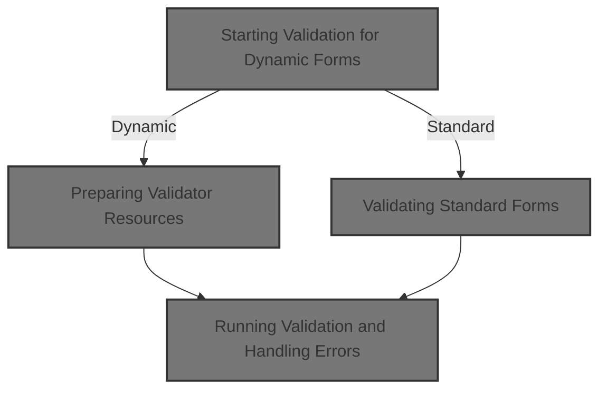
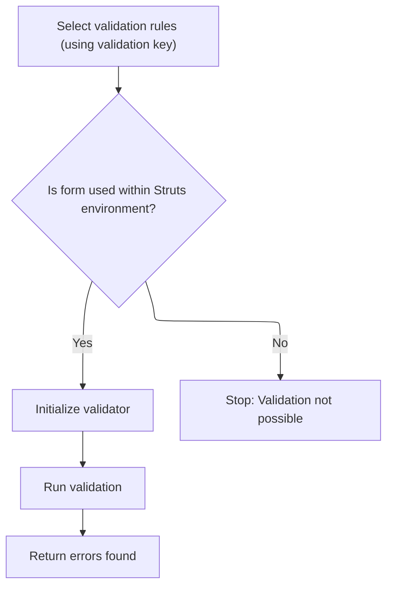

This document describes how user-submitted form data is validated before processing. Both dynamic and standard forms are checked against defined rules, and any validation errors are returned for display.



# Where is this flow used?

This flow is used multiple times in the codebase as represented in the following diagram:

```mermaid
graph TD;
      382171d5c5fa749d856fefa98e38e643ce568755e09dd28f0b1f11573ff07827(apps/…/upload/UploadForm.java::UploadForm.validate) --> e9bfe1f5c38ea4ff61bb05d83c6e780e5fcfa114b3133fffd1038a4eb06fefaa(core/…/validator/DynaValidatorForm.java::DynaValidatorForm.validate)

352a7d68e0d62f664ccef8ff4b76d7dea3cc5aa87a5f058c6da54a570b2e43f5(apps/…/validator/MultiRegistrationAction.java::MultiRegistrationAction.execute) --> e9bfe1f5c38ea4ff61bb05d83c6e780e5fcfa114b3133fffd1038a4eb06fefaa(core/…/validator/DynaValidatorForm.java::DynaValidatorForm.validate)

4ca3f87e04554dd3ae500e35edc639343f549e7dea660cbc8a33909cdf793f9f(apps/…/validator/RegistrationForm.java::RegistrationForm.validate) --> e9bfe1f5c38ea4ff61bb05d83c6e780e5fcfa114b3133fffd1038a4eb06fefaa(core/…/validator/DynaValidatorForm.java::DynaValidatorForm.validate)

b81b308c6fd1faa3211a8df646dfe086219eca722290e640d1c99562ff5f3215(apps/…/validator/RegistrationForm.java::RegistrationForm.validate) --> e9bfe1f5c38ea4ff61bb05d83c6e780e5fcfa114b3133fffd1038a4eb06fefaa(core/…/validator/DynaValidatorForm.java::DynaValidatorForm.validate)


classDef mainFlowStyle color:#000000,fill:#7CB9F4
classDef rootsStyle color:#000000,fill:#00FFF4
classDef Style1 color:#000000,fill:#00FFAA
classDef Style2 color:#000000,fill:#FFFF00
classDef Style3 color:#000000,fill:#AA7CB9

%% Swimm:
%% graph TD;
%%       382171d5c5fa749d856fefa98e38e643ce568755e09dd28f0b1f11573ff07827(<SwmPath>[apps/…/upload/UploadForm.java](apps/examples/src/main/java/org/apache/struts/webapp/upload/UploadForm.java)</SwmPath>::UploadForm.validate) --> e9bfe1f5c38ea4ff61bb05d83c6e780e5fcfa114b3133fffd1038a4eb06fefaa(<SwmPath>[core/…/validator/DynaValidatorForm.java](core/src/main/java/org/apache/struts/validator/DynaValidatorForm.java)</SwmPath>::DynaValidatorForm.validate)
%% 
%% 352a7d68e0d62f664ccef8ff4b76d7dea3cc5aa87a5f058c6da54a570b2e43f5(<SwmPath>[apps/…/validator/MultiRegistrationAction.java](apps/examples/src/main/java/org/apache/struts/webapp/validator/MultiRegistrationAction.java)</SwmPath>::MultiRegistrationAction.execute) --> e9bfe1f5c38ea4ff61bb05d83c6e780e5fcfa114b3133fffd1038a4eb06fefaa(<SwmPath>[core/…/validator/DynaValidatorForm.java](core/src/main/java/org/apache/struts/validator/DynaValidatorForm.java)</SwmPath>::DynaValidatorForm.validate)
%% 
%% 4ca3f87e04554dd3ae500e35edc639343f549e7dea660cbc8a33909cdf793f9f(<SwmPath>[apps/…/validator/RegistrationForm.java](apps/examples/src/main/java/org/apache/struts/webapp/validator/RegistrationForm.java)</SwmPath>::RegistrationForm.validate) --> e9bfe1f5c38ea4ff61bb05d83c6e780e5fcfa114b3133fffd1038a4eb06fefaa(<SwmPath>[core/…/validator/DynaValidatorForm.java](core/src/main/java/org/apache/struts/validator/DynaValidatorForm.java)</SwmPath>::DynaValidatorForm.validate)
%% 
%% b81b308c6fd1faa3211a8df646dfe086219eca722290e640d1c99562ff5f3215(<SwmPath>[apps/…/validator/RegistrationForm.java](apps/examples/src/main/java/org/apache/struts/webapp/validator/RegistrationForm.java)</SwmPath>::RegistrationForm.validate) --> e9bfe1f5c38ea4ff61bb05d83c6e780e5fcfa114b3133fffd1038a4eb06fefaa(<SwmPath>[core/…/validator/DynaValidatorForm.java](core/src/main/java/org/apache/struts/validator/DynaValidatorForm.java)</SwmPath>::DynaValidatorForm.validate)
%% 
%% 
%% classDef mainFlowStyle color:#000000,fill:#7CB9F4
%% classDef rootsStyle color:#000000,fill:#00FFF4
%% classDef Style1 color:#000000,fill:#00FFAA
%% classDef Style2 color:#000000,fill:#FFFF00
%% classDef Style3 color:#000000,fill:#AA7CB9
```



# Starting Validation for Dynamic Forms

<SwmSnippet path="/core/src/main/java/org/apache/struts/validator/DynaValidatorForm.java" line="106">

---

In <SwmToken path="core/src/main/java/org/apache/struts/validator/DynaValidatorForm.java" pos="106:5:5" line-data="    public ActionErrors validate(ActionMapping mapping,">`validate`</SwmToken>, we start by setting the page property from the form's dynamic property, grab the servlet context, and get a validation key based on the mapping and request. Then, we initialize a Validator using <SwmToken path="core/src/main/java/org/apache/struts/validator/DynaValidatorForm.java" pos="116:1:3" line-data="            Resources.initValidator(validationKey, this, application, request,">`Resources.initValidator`</SwmToken>, which ties together the form, context, request, errors, and page. This setup is needed before we actually run validation, and that's why we call <SwmPath>[core/…/validator/Resources.java](core/src/main/java/org/apache/struts/validator/Resources.java)</SwmPath> next—to get a properly configured Validator instance.

```java
    public ActionErrors validate(ActionMapping mapping,
        HttpServletRequest request) {
        this.setPageFromDynaProperty();

        ServletContext application = getServlet().getServletContext();
        ActionErrors errors = new ActionErrors();

        String validationKey = getValidationKey(mapping, request);

        Validator validator =
            Resources.initValidator(validationKey, this, application, request,
                errors, page);

```

---

</SwmSnippet>

## Preparing Validator Resources

<SwmSnippet path="/core/src/main/java/org/apache/struts/validator/Resources.java" line="499">

---

In <SwmToken path="core/src/main/java/org/apache/struts/validator/Resources.java" pos="499:7:7" line-data="    public static Validator initValidator(String key, Object bean,">`initValidator`</SwmToken>, we grab <SwmToken path="core/src/main/java/org/apache/struts/validator/Resources.java" pos="502:1:1" line-data="        ValidatorResources resources =">`ValidatorResources`</SwmToken> using the application and request, keyed by a module-specific prefix. This lets us set up the Validator with the right rules for the current module and context, so the validation logic is scoped correctly.

```java
    public static Validator initValidator(String key, Object bean,
        ServletContext application, HttpServletRequest request,
        ActionMessages errors, int page) {
        ValidatorResources resources =
            Resources.getValidatorResources(application, request);

```

---

</SwmSnippet>

<SwmSnippet path="/core/src/main/java/org/apache/struts/validator/Resources.java" line="90">

---

<SwmToken path="core/src/main/java/org/apache/struts/validator/Resources.java" pos="90:7:7" line-data="    public static ValidatorResources getValidatorResources(">`getValidatorResources`</SwmToken> pulls the <SwmToken path="core/src/main/java/org/apache/struts/validator/Resources.java" pos="90:5:5" line-data="    public static ValidatorResources getValidatorResources(">`ValidatorResources`</SwmToken> from the <SwmToken path="core/src/main/java/org/apache/struts/validator/Resources.java" pos="91:1:1" line-data="        ServletContext application, HttpServletRequest request) {">`ServletContext`</SwmToken> using a key that's namespaced with the module prefix. This keeps validation rules separate for each module, so you don't get cross-module conflicts.

```java
    public static ValidatorResources getValidatorResources(
        ServletContext application, HttpServletRequest request) {
        String prefix =
            ModuleUtils.getInstance().getModuleConfig(request, application)
                       .getPrefix();

        return (ValidatorResources) application.getAttribute(ValidatorPlugIn.VALIDATOR_KEY
            + prefix);
    }
```

---

</SwmSnippet>

<SwmSnippet path="/core/src/main/java/org/apache/struts/validator/Resources.java" line="505">

---

After returning from <SwmToken path="core/src/main/java/org/apache/struts/validator/Resources.java" pos="90:7:7" line-data="    public static ValidatorResources getValidatorResources(">`getValidatorResources`</SwmToken>, we finish setting up the Validator by configuring it with the context class loader, page number, and a bunch of parameters (servlet context, request, locale, errors, bean). This makes sure the Validator has everything it needs to run validation in the right context.

```java
        Locale locale = RequestUtils.getUserLocale(request, null);

        Validator validator = new Validator(resources, key);

        validator.setUseContextClassLoader(true);

        validator.setPage(page);

        validator.setParameter(SERVLET_CONTEXT_PARAM, application);
        validator.setParameter(HTTP_SERVLET_REQUEST_PARAM, request);
        validator.setParameter(Validator.LOCALE_PARAM, locale);
        validator.setParameter(ACTION_MESSAGES_PARAM, errors);
        validator.setParameter(Validator.BEAN_PARAM, bean);

        return validator;
    }
```

---

</SwmSnippet>

## Running Validation and Handling Errors

<SwmSnippet path="/core/src/main/java/org/apache/struts/validator/DynaValidatorForm.java" line="119">

---

Back in `DynaValidatorForm.validate`, after getting the Validator from <SwmPath>[core/…/validator/Resources.java](core/src/main/java/org/apache/struts/validator/Resources.java)</SwmPath>, we run the validation, catch any exceptions, log them, and return the errors. Next, we call <SwmPath>[core/…/validator/ValidatorForm.java](core/src/main/java/org/apache/struts/validator/ValidatorForm.java)</SwmPath> to handle similar validation logic for other form types.

```java
        try {
            validatorResults = validator.validate();
        } catch (ValidatorException e) {
            log.error(e.getMessage(), e);
        }

        return errors;
    }
```

---

</SwmSnippet>

# Validating Standard Forms



<SwmSnippet path="/core/src/main/java/org/apache/struts/validator/ValidatorForm.java" line="104">

---

In `ValidatorForm.validate`, we set up errors, get the validation key, and fetch the servlet context. If the servlet isn't available, we throw an exception. Then we initialize the Validator with all the context, just like with dynamic forms, and call <SwmPath>[core/…/validator/Resources.java](core/src/main/java/org/apache/struts/validator/Resources.java)</SwmPath> to get the Validator ready for validation.

```java
    public ActionErrors validate(ActionMapping mapping,
        HttpServletRequest request) {
        
        ActionErrors errors = new ActionErrors();
        String validationKey = getValidationKey(mapping, request);

        ServletContext application;
        try {
            application = getServlet().getServletContext();
        } catch (NullPointerException e) {
            IllegalStateException e2 = new IllegalStateException(
                    "Missing ActionServlet instance for bean '" +
                    mapping.getName() + 
                    "' (created outside of Struts?)");
        	e2.initCause(e);
        	throw e2;
        }
        
        Validator validator =
            Resources.initValidator(validationKey, this, application, request,
                errors, getPage());

```

---

</SwmSnippet>

<SwmSnippet path="/core/src/main/java/org/apache/struts/validator/ValidatorForm.java" line="126">

---

Here, we actually run the Validator (which we just finished setting up in <SwmPath>[core/…/validator/Resources.java](core/src/main/java/org/apache/struts/validator/Resources.java)</SwmPath>) and catch any <SwmToken path="core/src/main/java/org/apache/struts/validator/ValidatorForm.java" pos="128:6:6" line-data="        } catch (ValidatorException e) {">`ValidatorException`</SwmToken> that might get thrown. If there's an exception, we log it, but don't interrupt the flow—validation errors are collected in the <SwmToken path="core/src/main/java/org/apache/struts/validator/DynaValidatorForm.java" pos="106:3:3" line-data="    public ActionErrors validate(ActionMapping mapping,">`ActionErrors`</SwmToken> object and returned to the caller. This wraps up the validation process in ValidatorForm.validate, following the standard pattern: run validation, handle exceptions quietly, and return errors for the UI to display.

```java
        try {
            validatorResults = validator.validate();
        } catch (ValidatorException e) {
            log.error(e.getMessage(), e);
        }

        return errors;
    }
```

---

</SwmSnippet>

&nbsp;

*This is an auto-generated document by Swimm 🌊 and has not yet been verified by a human*

<SwmMeta version="3.0.0" repo-id="Z2l0aHViJTNBJTNBc3RydXRzMSUzQSUzQVN3aW1tLURlbW8=" repo-name="struts1"><sup>Powered by [Swimm](https://app.swimm.io/)</sup></SwmMeta>
