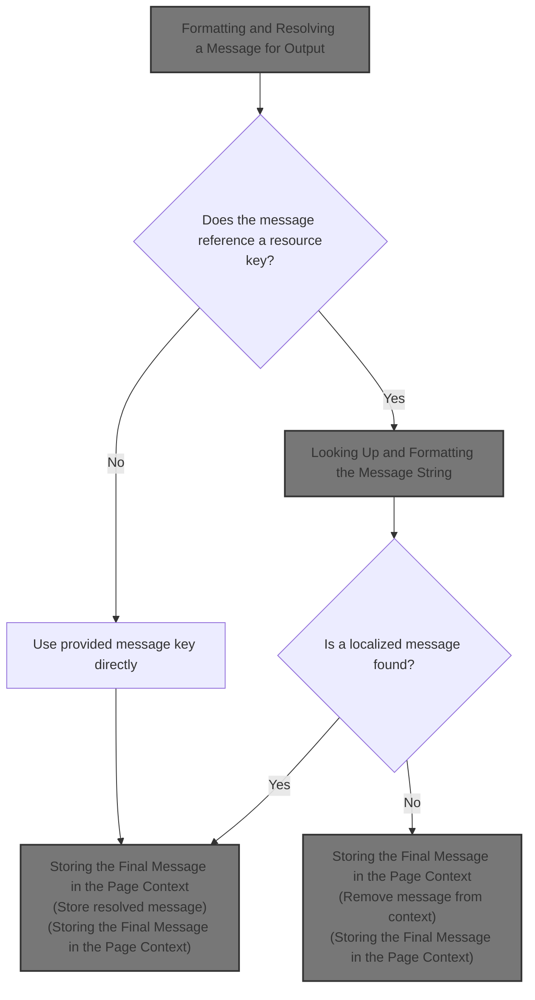
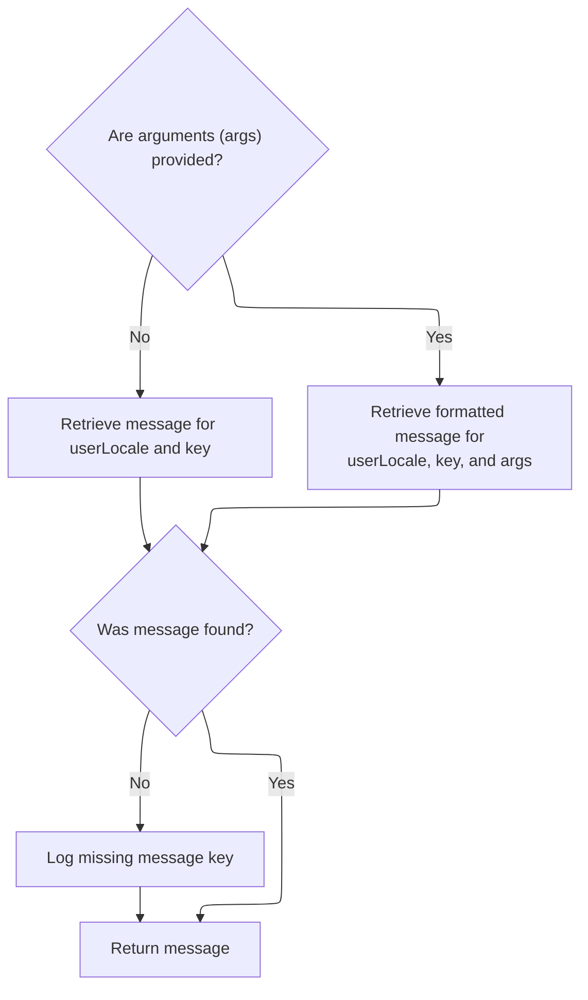
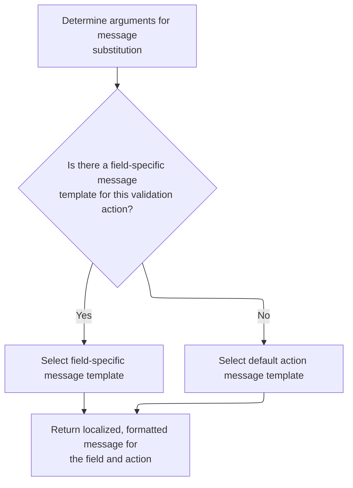
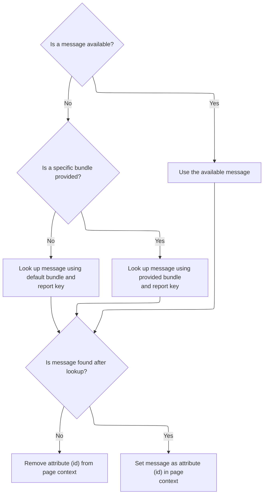

This document describes how messages are resolved and formatted for display, enabling dynamic and localized content in the user interface. The process supports internationalization and flexible message templates, with the resolved message stored for rendering.



# Where is this flow used?

This flow is used multiple times in the codebase as represented in the following diagram:

```mermaid
graph TD;
      8bf7f4c55e8294499cb93083471ed76f74afaf4bb5dd222e7e9d67ee3346238b(taglib/…/html/MessagesTag.java::MessagesTag.doStartTag) --> 72afb4dd125b85c39db221e93726cbc34be8e9aa3cca5350087fe9a68598af37(taglib/…/html/MessagesTag.java::MessagesTag.processMessage)

fe1eff2e4d768eea4bcfdac55fc10ff525f5cce284c33dd790f59c92899472f5(taglib/…/html/MessagesTag.java::MessagesTag.doAfterBody) --> 72afb4dd125b85c39db221e93726cbc34be8e9aa3cca5350087fe9a68598af37(taglib/…/html/MessagesTag.java::MessagesTag.processMessage)


classDef mainFlowStyle color:#000000,fill:#7CB9F4
classDef rootsStyle color:#000000,fill:#00FFF4
classDef Style1 color:#000000,fill:#00FFAA
classDef Style2 color:#000000,fill:#FFFF00
classDef Style3 color:#000000,fill:#AA7CB9

%% Swimm:
%% graph TD;
%%       8bf7f4c55e8294499cb93083471ed76f74afaf4bb5dd222e7e9d67ee3346238b(<SwmPath>[taglib/…/html/MessagesTag.java](taglib/src/main/java/org/apache/struts/taglib/html/MessagesTag.java)</SwmPath>::MessagesTag.doStartTag) --> 72afb4dd125b85c39db221e93726cbc34be8e9aa3cca5350087fe9a68598af37(<SwmPath>[taglib/…/html/MessagesTag.java](taglib/src/main/java/org/apache/struts/taglib/html/MessagesTag.java)</SwmPath>::MessagesTag.processMessage)
%% 
%% fe1eff2e4d768eea4bcfdac55fc10ff525f5cce284c33dd790f59c92899472f5(<SwmPath>[taglib/…/html/MessagesTag.java](taglib/src/main/java/org/apache/struts/taglib/html/MessagesTag.java)</SwmPath>::MessagesTag.doAfterBody) --> 72afb4dd125b85c39db221e93726cbc34be8e9aa3cca5350087fe9a68598af37(<SwmPath>[taglib/…/html/MessagesTag.java](taglib/src/main/java/org/apache/struts/taglib/html/MessagesTag.java)</SwmPath>::MessagesTag.processMessage)
%% 
%% 
%% classDef mainFlowStyle color:#000000,fill:#7CB9F4
%% classDef rootsStyle color:#000000,fill:#00FFF4
%% classDef Style1 color:#000000,fill:#00FFAA
%% classDef Style2 color:#000000,fill:#FFFF00
%% classDef Style3 color:#000000,fill:#AA7CB9
```



# Formatting and Resolving a Message for Output

<SwmSnippet path="/taglib/src/main/java/org/apache/struts/taglib/html/MessagesTag.java" line="293">

---

In <SwmToken path="taglib/src/main/java/org/apache/struts/taglib/html/MessagesTag.java" pos="293:5:5" line-data="    private void processMessage(ActionMessage report)">`processMessage`</SwmToken>, we check if the <SwmToken path="taglib/src/main/java/org/apache/struts/taglib/html/MessagesTag.java" pos="293:7:7" line-data="    private void processMessage(ActionMessage report)">`ActionMessage`</SwmToken> is a resource-based message, handle argument filtering if needed, and then delegate to <SwmToken path="taglib/src/main/java/org/apache/struts/taglib/html/MessagesTag.java" pos="303:5:5" line-data="            msg = TagUtils.getInstance().message(pageContext, bundle, locale,">`TagUtils`</SwmToken> to resolve and format the message string using the provided bundle, locale, and arguments. This offloads the actual resource lookup and formatting to a shared utility.

```java
    private void processMessage(ActionMessage report)
        throws JspException {
        String msg = null;

        if (report.isResource()) {
            Object[] values = report.getValues();
            if (filterArgs) {
                values = filterMessageReplacementValues(values);
            }
            
            msg = TagUtils.getInstance().message(pageContext, bundle, locale,
                    report.getKey(), values);

```

---

</SwmSnippet>

## Looking Up and Formatting the Message String

<SwmSnippet path="/taglib/src/main/java/org/apache/struts/taglib/TagUtils.java" line="995">

---

In <SwmToken path="taglib/src/main/java/org/apache/struts/taglib/TagUtils.java" pos="995:5:5" line-data="    public String message(PageContext pageContext, String bundle,">`message`</SwmToken>, we grab the <SwmToken path="taglib/src/main/java/org/apache/struts/taglib/TagUtils.java" pos="998:1:1" line-data="        MessageResources resources =">`MessageResources`</SwmToken> instance for the given bundle and context. This is needed to actually look up the message template before formatting it with arguments.

```java
    public String message(PageContext pageContext, String bundle,
        String locale, String key, Object[] args)
        throws JspException {
        MessageResources resources =
            retrieveMessageResources(pageContext, bundle, false);

```

---

</SwmSnippet>

<SwmSnippet path="/taglib/src/main/java/org/apache/struts/taglib/TagUtils.java" line="1118">

---

<SwmToken path="taglib/src/main/java/org/apache/struts/taglib/TagUtils.java" pos="1118:5:5" line-data="    public MessageResources retrieveMessageResources(PageContext pageContext,">`retrieveMessageResources`</SwmToken> handles the lookup for <SwmToken path="taglib/src/main/java/org/apache/struts/taglib/TagUtils.java" pos="1118:3:3" line-data="    public MessageResources retrieveMessageResources(PageContext pageContext,">`MessageResources`</SwmToken> by searching in page, request, and application scopes, using bundle names and module prefixes as needed. If nothing is found, it throws an exception. This makes resource resolution flexible and supports modular setups.

```java
    public MessageResources retrieveMessageResources(PageContext pageContext,
        String bundle, boolean checkPageScope)
        throws JspException {
        MessageResources resources = null;

        if (bundle == null) {
            bundle = Globals.MESSAGES_KEY;
        }

        if (checkPageScope) {
            resources =
                (MessageResources) pageContext.getAttribute(bundle,
                    PageContext.PAGE_SCOPE);
        }

        if (resources == null) {
            resources =
                (MessageResources) pageContext.getAttribute(bundle,
                    PageContext.REQUEST_SCOPE);
        }

        if (resources == null) {
            ModuleConfig moduleConfig = getModuleConfig(pageContext);

            resources =
                (MessageResources) pageContext.getAttribute(bundle
                    + moduleConfig.getPrefix(), PageContext.APPLICATION_SCOPE);
        }

        if (resources == null) {
            resources =
                (MessageResources) pageContext.getAttribute(bundle,
                    PageContext.APPLICATION_SCOPE);
        }

        if (resources == null) {
            JspException e =
                new JspException(messages.getMessage("message.bundle", bundle));

            saveException(pageContext, e);
            throw e;
        }

        return resources;
    }
```

---

</SwmSnippet>

<SwmSnippet path="/taglib/src/main/java/org/apache/struts/taglib/TagUtils.java" line="1001">

---

Back in <SwmToken path="taglib/src/main/java/org/apache/struts/taglib/html/MessagesTag.java" pos="303:11:11" line-data="            msg = TagUtils.getInstance().message(pageContext, bundle, locale,">`message`</SwmToken>, after getting the resources, we resolve the user's locale. This is needed to pick the right localized message variant.

```java
        Locale userLocale = getUserLocale(pageContext, locale);
```

---

</SwmSnippet>

### Resolving the User's Locale

See <SwmLink doc-title="Determining user locale">[Determining user locale](/.swm/determining-user-locale.9ax6omxh.sw.md)</SwmLink>

### Fetching and Formatting the Message Text



<SwmSnippet path="/taglib/src/main/java/org/apache/struts/taglib/TagUtils.java" line="1002">

---

Back in <SwmToken path="taglib/src/main/java/org/apache/struts/taglib/TagUtils.java" pos="1002:3:3" line-data="        String message = null;">`message`</SwmToken>, we use the resolved resources and locale to fetch the message string, either plain or with arguments. This step actually retrieves and formats the message for output.

```java
        String message = null;

        if (args == null) {
            message = resources.getMessage(userLocale, key);
        } else {
            message = resources.getMessage(userLocale, key, args);
        }

```

---

</SwmSnippet>

<SwmSnippet path="/core/src/main/java/org/apache/struts/validator/Resources.java" line="249">

---

<SwmToken path="core/src/main/java/org/apache/struts/validator/Resources.java" pos="249:7:7" line-data="    public static String getMessage(HttpServletRequest request, String key) {">`getMessage`</SwmToken> fetches the <SwmToken path="core/src/main/java/org/apache/struts/validator/Resources.java" pos="250:1:1" line-data="        MessageResources messages = getMessageResources(request);">`MessageResources`</SwmToken> and the user's locale from the request, then delegates to another <SwmToken path="core/src/main/java/org/apache/struts/validator/Resources.java" pos="249:7:7" line-data="    public static String getMessage(HttpServletRequest request, String key) {">`getMessage`</SwmToken> variant to actually resolve the message string.

```java
    public static String getMessage(HttpServletRequest request, String key) {
        MessageResources messages = getMessageResources(request);

        return getMessage(messages, RequestUtils.getUserLocale(request, null),
            key);
    }
```

---

</SwmSnippet>

<SwmSnippet path="/taglib/src/main/java/org/apache/struts/taglib/TagUtils.java" line="1010">

---

Back in <SwmToken path="taglib/src/main/java/org/apache/struts/taglib/TagUtils.java" pos="1010:5:5" line-data="        if ((message == null) &amp;&amp; log.isDebugEnabled()) {">`message`</SwmToken>, if the message wasn't found, we log the missing key for debugging. Then we return the resolved message string (or null if not found).

```java
        if ((message == null) && log.isDebugEnabled()) {
            // log missing key to ease debugging
            log.debug(resources.getMessage("message.resources", key, bundle,
                    locale));
        }

        return message;
    }
```

---

</SwmSnippet>

## Resolving Message Arguments for Validation



<SwmSnippet path="/core/src/main/java/org/apache/struts/validator/Resources.java" line="265">

---

In <SwmToken path="core/src/main/java/org/apache/struts/validator/Resources.java" pos="265:7:7" line-data="    public static String getMessage(MessageResources messages, Locale locale,">`getMessage`</SwmToken>, we extract up to four arguments from the field for the given action, prepping them for substitution into the message template.

```java
    public static String getMessage(MessageResources messages, Locale locale,
        ValidatorAction va, Field field) {
        String[] args = getArgs(va.getName(), messages, locale, field);
```

---

</SwmSnippet>

<SwmSnippet path="/core/src/main/java/org/apache/struts/validator/Resources.java" line="420">

---

<SwmToken path="core/src/main/java/org/apache/struts/validator/Resources.java" pos="420:9:9" line-data="    public static String[] getArgs(String actionName,">`getArgs`</SwmToken> collects up to four arguments from the field for the action, resolving each as a resource or plain string. This is hardcoded to four, so extra arguments are ignored.

```java
    public static String[] getArgs(String actionName,
        MessageResources messages, Locale locale, Field field) {
        String[] argMessages = new String[4];

        Arg[] args =
            new Arg[] {
                field.getArg(actionName, 0), field.getArg(actionName, 1),
                field.getArg(actionName, 2), field.getArg(actionName, 3)
            };

        for (int i = 0; i < args.length; i++) {
            if (args[i] == null) {
                continue;
            }

            if (args[i].isResource()) {
                argMessages[i] = getMessage(messages, locale, args[i].getKey());
            } else {
                argMessages[i] = args[i].getKey();
            }
        }
```

---

</SwmSnippet>

<SwmSnippet path="/core/src/main/java/org/apache/struts/validator/Resources.java" line="268">

---

Back in <SwmToken path="core/src/main/java/org/apache/struts/validator/Resources.java" pos="272:5:5" line-data="        return messages.getMessage(locale, msg, args);">`getMessage`</SwmToken>, we pick the message template from the field if present, otherwise from the <SwmToken path="core/src/main/java/org/apache/struts/validator/Resources.java" pos="266:1:1" line-data="        ValidatorAction va, Field field) {">`ValidatorAction`</SwmToken>. Then we call <SwmToken path="core/src/main/java/org/apache/struts/validator/Resources.java" pos="272:5:5" line-data="        return messages.getMessage(locale, msg, args);">`getMessage`</SwmToken> with the resolved arguments to produce the final message.

```java
        String msg =
            (field.getMsg(va.getName()) != null) ? field.getMsg(va.getName())
                                                 : va.getMsg();

        return messages.getMessage(locale, msg, args);
    }
```

---

</SwmSnippet>

## Storing the Final Message in the Page Context



<SwmSnippet path="/taglib/src/main/java/org/apache/struts/taglib/html/MessagesTag.java" line="306">

---

Back in <SwmToken path="taglib/src/main/java/org/apache/struts/taglib/html/MessagesTag.java" pos="293:5:5" line-data="    private void processMessage(ActionMessage report)">`processMessage`</SwmToken>, if the message is still null after all lookups, we remove the page attribute. Otherwise, we store the resolved message for use in the JSP.

```java
            if (msg == null) {
                String bundleName = (bundle == null) ? "default" : bundle;

                msg = messageResources.getMessage("messagesTag.notfound",
                        report.getKey(), bundleName);
            }
        } else {
            msg = report.getKey();
        }

        if (msg == null) {
            pageContext.removeAttribute(id);
        } else {
            pageContext.setAttribute(id, msg);
        }
    }
```

---

</SwmSnippet>

&nbsp;

*This is an auto-generated document by Swimm 🌊 and has not yet been verified by a human*

<SwmMeta version="3.0.0" repo-id="Z2l0aHViJTNBJTNBc3RydXRzMSUzQSUzQVN3aW1tLURlbW8=" repo-name="struts1"><sup>Powered by [Swimm](https://app.swimm.io/)</sup></SwmMeta>
