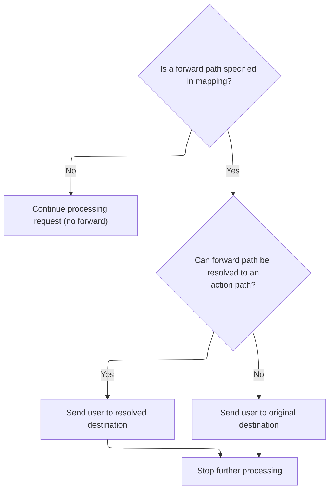
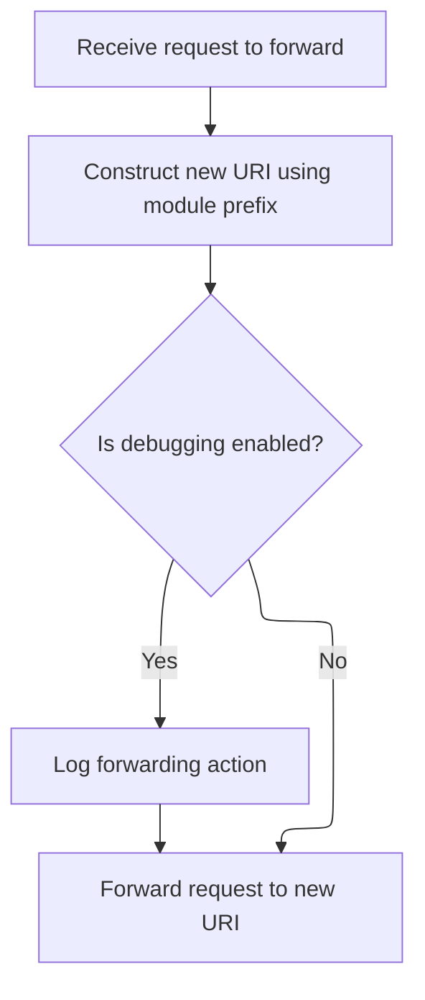
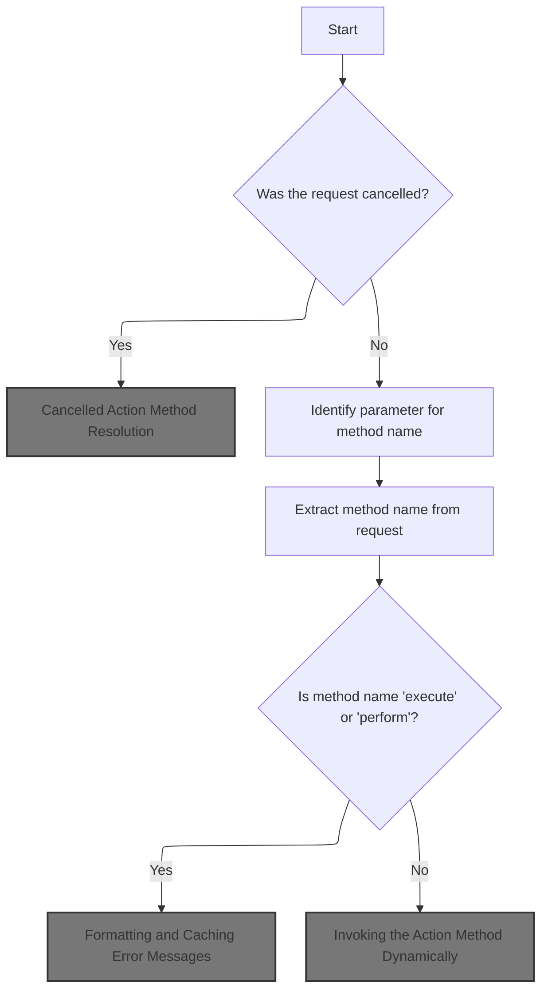
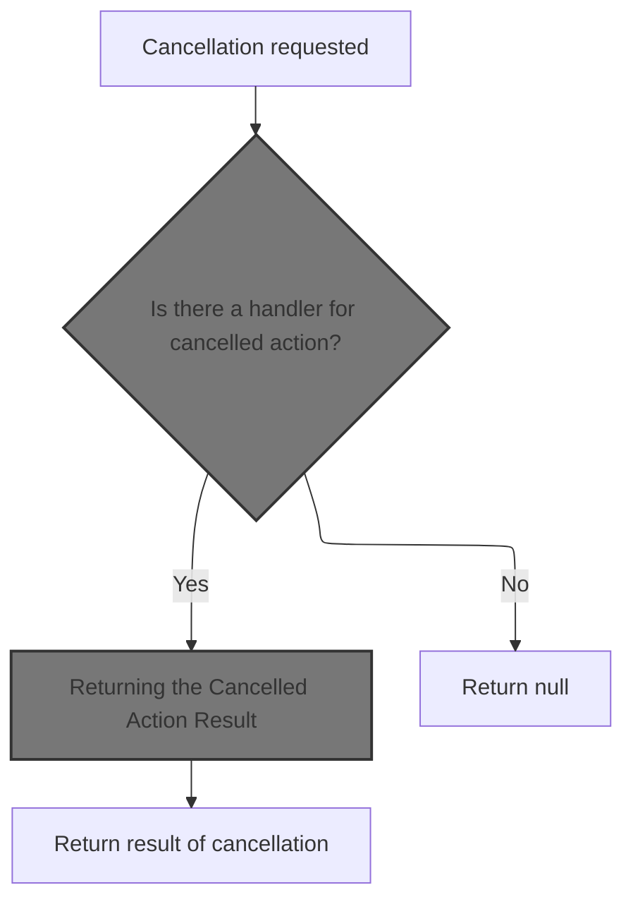
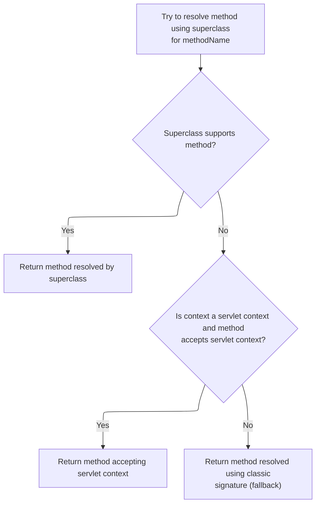
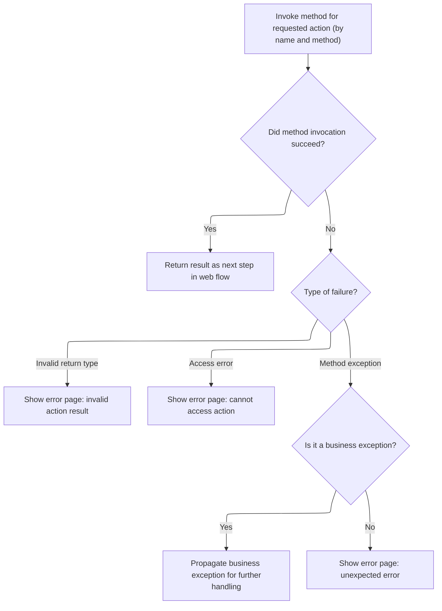

This document explains how the application manages navigation by forwarding web requests to the correct destination or allowing them to continue processing. The system checks if a forward is needed and, if so, sends the user to the appropriate next page or action, ensuring smooth transitions.

# Delegating Forward Handling

<SwmSnippet path="/faces/src/main/java/org/apache/struts/faces/application/FacesTilesRequestProcessor.java" line="269">

---

<SwmToken path="faces/src/main/java/org/apache/struts/faces/application/FacesTilesRequestProcessor.java" pos="269:5:5" line-data="    protected boolean processForward(HttpServletRequest request,">`processForward`</SwmToken> in <SwmToken path="faces/src/main/java/org/apache/struts/faces/application/FacesTilesRequestProcessor.java" pos="64:4:4" line-data="public class FacesTilesRequestProcessor extends TilesRequestProcessor {">`FacesTilesRequestProcessor`</SwmToken> just logs the call and delegates everything to the superclass's <SwmToken path="faces/src/main/java/org/apache/struts/faces/application/FacesTilesRequestProcessor.java" pos="269:5:5" line-data="    protected boolean processForward(HttpServletRequest request,">`processForward`</SwmToken>. No custom logic here—it's just a pass-through to the core Struts forward handling, so the next step is to see what the base <SwmToken path="faces/src/main/java/org/apache/struts/faces/application/FacesTilesRequestProcessor.java" pos="54:15:15" line-data=" * &lt;p&gt;Concrete implementation of &lt;code&gt;RequestProcessor&lt;/code&gt; that">`RequestProcessor`</SwmToken> does.

```java
    protected boolean processForward(HttpServletRequest request,
                                     HttpServletResponse response,
                                     ActionMapping mapping)
        throws IOException, ServletException {

        if (log.isTraceEnabled()) {
            log.trace("Performing standard forward handling");
        }
        boolean result = super.processForward
            (request, response, mapping);
        if (log.isDebugEnabled()) {
            log.debug("Standard forward handling returned " + result);
        }
        return (result);

    }
```

---

</SwmSnippet>

# Resolving and Processing Forwards



<SwmSnippet path="/core/src/main/java/org/apache/struts/action/RequestProcessor.java" line="550">

---

In <SwmToken path="core/src/main/java/org/apache/struts/action/RequestProcessor.java" pos="550:5:5" line-data="    protected boolean processForward(HttpServletRequest request,">`processForward`</SwmToken> (<SwmToken path="faces/src/main/java/org/apache/struts/faces/application/FacesTilesRequestProcessor.java" pos="54:15:15" line-data=" * &lt;p&gt;Concrete implementation of &lt;code&gt;RequestProcessor&lt;/code&gt; that">`RequestProcessor`</SwmToken>), we grab the forward string from the mapping. If it's null, we bail out and let processing continue. Otherwise, we try to resolve it into an action path using <SwmToken path="core/src/main/java/org/apache/struts/action/RequestProcessor.java" pos="561:7:9" line-data="        String actionIdPath = RequestUtils.actionIdURL(forward, this.moduleConfig, this.servlet);">`RequestUtils.actionIdURL`</SwmToken>—this lets us handle logical action names as well as direct paths. Next, we need to see how <SwmToken path="core/src/main/java/org/apache/struts/action/RequestProcessor.java" pos="561:7:9" line-data="        String actionIdPath = RequestUtils.actionIdURL(forward, this.moduleConfig, this.servlet);">`RequestUtils.actionIdURL`</SwmToken> does the actual resolution.

```java
    protected boolean processForward(HttpServletRequest request,
        HttpServletResponse response, ActionMapping mapping)
        throws IOException, ServletException {
        // Are we going to processing this request?
        String forward = mapping.getForward();

        if (forward == null) {
            return (true);
        }

        // If the forward can be unaliased into an action, then use the path of the action
        String actionIdPath = RequestUtils.actionIdURL(forward, this.moduleConfig, this.servlet);
```

---

</SwmSnippet>

<SwmSnippet path="/core/src/main/java/org/apache/struts/util/RequestUtils.java" line="1080">

---

<SwmToken path="core/src/main/java/org/apache/struts/util/RequestUtils.java" pos="1080:7:7" line-data="    public static String actionIdURL(String originalPath, ModuleConfig moduleConfig, ActionServlet servlet) {">`actionIdURL`</SwmToken> checks if the path is already absolute or context-rooted—if so, it skips any mapping. Otherwise, it splits out any query string, looks up the action config, and builds the correct servlet path based on the mapping pattern. If there's a query string, it gets appended back. Now, back in RequestProcessor.processForward, we use this resolved path for the actual forward.

```java
    public static String actionIdURL(String originalPath, ModuleConfig moduleConfig, ActionServlet servlet) {
        if (originalPath.startsWith("http") || originalPath.startsWith("/")) {
            return null;
        }

        // Split the forward path into the resource and query string;
        // it is possible a forward (or redirect) has added parameters.
        String actionId = null;
        String qs = null;
        int qpos = originalPath.indexOf("?");
        if (qpos == -1) {
            actionId = originalPath;
        } else {
            actionId = originalPath.substring(0, qpos);
            qs = originalPath.substring(qpos);
        }

        // Find the action of the given actionId
        ActionConfig actionConfig = moduleConfig.findActionConfigId(actionId);
        if (actionConfig == null) {
            if (log.isDebugEnabled()) {
                log.debug("No actionId found for " + actionId);
            }
            return null;
        }

        String path = actionConfig.getPath();
        String mapping = RequestUtils.getServletMapping(servlet);
        StringBuffer actionIdPath = new StringBuffer();

        // Form the path based on the servlet mapping pattern
        if (mapping.startsWith("*")) {
            actionIdPath.append(path);
            actionIdPath.append(mapping.substring(1));
        } else if (mapping.startsWith("/")) {  // implied ends with a *
            mapping = mapping.substring(0, mapping.length() - 1);
            if (mapping.endsWith("/") && path.startsWith("/")) {
                actionIdPath.append(mapping);
                actionIdPath.append(path.substring(1));
            } else {
                actionIdPath.append(mapping);
                actionIdPath.append(path);
            }
        } else {
            log.warn("Unknown servlet mapping pattern");
            actionIdPath.append(path);
        }

        // Lastly add any query parameters (the ? is part of the query string)
        if (qs != null) {
            actionIdPath.append(qs);
        }

        // Return the path
        if (log.isDebugEnabled()) {
            log.debug(originalPath + " unaliased to " + actionIdPath.toString());
        }
        return actionIdPath.toString();
    }
```

---

</SwmSnippet>

<SwmSnippet path="/core/src/main/java/org/apache/struts/action/RequestProcessor.java" line="562">

---

Just got back from <SwmToken path="core/src/main/java/org/apache/struts/action/RequestProcessor.java" pos="561:7:9" line-data="        String actionIdPath = RequestUtils.actionIdURL(forward, this.moduleConfig, this.servlet);">`RequestUtils.actionIdURL`</SwmToken>. If we got a resolved action path, we swap it in for the forward string. Then, <SwmToken path="core/src/main/java/org/apache/struts/action/RequestProcessor.java" pos="566:1:1" line-data="        internalModuleRelativeForward(forward, request, response);">`internalModuleRelativeForward`</SwmToken> is called to actually dispatch the request. Returning false here signals that no further processing should happen after the forward.

```java
        if (actionIdPath != null) {
            forward = actionIdPath;
        }

        internalModuleRelativeForward(forward, request, response);

        return (false);
    }
```

---

</SwmSnippet>

# Dispatching to Module Resource



<SwmSnippet path="/core/src/main/java/org/apache/struts/action/RequestProcessor.java" line="1015">

---

<SwmToken path="core/src/main/java/org/apache/struts/action/RequestProcessor.java" pos="1015:5:5" line-data="    protected void internalModuleRelativeForward(String uri,">`internalModuleRelativeForward`</SwmToken> prepends the module prefix to the URI and then hands off to <SwmToken path="core/src/main/java/org/apache/struts/action/RequestProcessor.java" pos="1027:1:1" line-data="        doForward(uri, request, response);">`doForward`</SwmToken>. This keeps the forward within the right module context. Next, <SwmToken path="core/src/main/java/org/apache/struts/action/RequestProcessor.java" pos="1027:1:1" line-data="        doForward(uri, request, response);">`doForward`</SwmToken> actually performs the servlet dispatch.

```java
    protected void internalModuleRelativeForward(String uri,
        HttpServletRequest request, HttpServletResponse response)
        throws IOException, ServletException {
        // Construct a request dispatcher for the specified path
        uri = moduleConfig.getPrefix() + uri;

        // Delegate the processing of this request
        // :FIXME: - exception handling?
        if (log.isDebugEnabled()) {
            log.debug(" Delegating via forward to '" + uri + "'");
        }

        doForward(uri, request, response);
    }
```

---

</SwmSnippet>

# Servlet Forward Execution

<SwmSnippet path="/core/src/main/java/org/apache/struts/action/RequestProcessor.java" line="1071">

---

In <SwmToken path="core/src/main/java/org/apache/struts/action/RequestProcessor.java" pos="1071:5:5" line-data="    protected void doForward(String uri, HttpServletRequest request,">`doForward`</SwmToken>, we try to get a <SwmToken path="core/src/main/java/org/apache/struts/action/RequestProcessor.java" pos="1074:1:1" line-data="        RequestDispatcher rd = getServletContext().getRequestDispatcher(uri);">`RequestDispatcher`</SwmToken> for the URI. If that fails, we send a 500 error with a message from <SwmToken path="core/src/main/java/org/apache/struts/util/PropertyMessageResources.java" pos="82:8:8" line-data=" * Configure &lt;code&gt;PropertyMessageResources&lt;/code&gt; to operate in this mode by">`PropertyMessageResources`</SwmToken>. Otherwise, we go ahead and forward the request. Next, we need to see how the error message is fetched.

```java
    protected void doForward(String uri, HttpServletRequest request,
        HttpServletResponse response)
        throws IOException, ServletException {
        RequestDispatcher rd = getServletContext().getRequestDispatcher(uri);

        if (rd == null) {
            response.sendError(HttpServletResponse.SC_INTERNAL_SERVER_ERROR,
                getInternal().getMessage("requestDispatcher", uri));

            return;
        }

```

---

</SwmSnippet>

## Localized Error Message Lookup

```mermaid
%%{init: {"flowchart": {"defaultRenderer": "elk"}} }%%
flowchart TD
  node1["Request message for locale and key"]
  click node1 openCode "core/src/main/java/org/apache/struts/util/PropertyMessageResources.java:227:282"
  node1 --> node2["Search for message in requested locale"]
  click node2 openCode "core/src/main/java/org/apache/struts/util/PropertyMessageResources.java:238:241"
  node2 --> node3{"Message found?"}
  click node3 openCode "core/src/main/java/org/apache/struts/util/PropertyMessageResources.java:239:241"
  node3 -->|"Yes"| node4["Return message"]
  click node4 openCode "core/src/main/java/org/apache/struts/util/PropertyMessageResources.java:240:241"
  node3 -->|"No"| node5{"Mode?"}
  click node5 openCode "core/src/main/java/org/apache/struts/util/PropertyMessageResources.java:244:265"
  node5 -->|"JSTL"| node6["Skip default locale"]
  click node6 openCode "core/src/main/java/org/apache/struts/util/PropertyMessageResources.java:246:247"
  node6 --> node9["Search in base properties"]
  node5 -->|"Resource Bundle or Default"| node7["Search for message in default locale"]
  click node7 openCode "core/src/main/java/org/apache/struts/util/PropertyMessageResources.java:252:263"
  node7 --> node8{"Message found?"}
  click node8 openCode "core/src/main/java/org/apache/struts/util/PropertyMessageResources.java:266:268"
  node8 -->|"Yes"| node4
  node8 -->|"No"| node9["Search in base properties"]
  click node9 openCode "core/src/main/java/org/apache/struts/util/PropertyMessageResources.java:271:273"
  node9 --> node10{"Message found?"}
  click node10 openCode "core/src/main/java/org/apache/struts/util/PropertyMessageResources.java:272:274"
  node10 -->|"Yes"| node4
  node10 -->|"No"| node11{"returnNull?"}
  click node11 openCode "core/src/main/java/org/apache/struts/util/PropertyMessageResources.java:277:281"
  node11 -->|"Yes"| node12["Return null"]
  click node12 openCode "core/src/main/java/org/apache/struts/util/PropertyMessageResources.java:278:279"
  node11 -->|"No"| node13["Return placeholder message"]
  click node13 openCode "core/src/main/java/org/apache/struts/util/PropertyMessageResources.java:280:281"
classDef HeadingStyle fill:#777777,stroke:#333,stroke-width:2px;

%% Swimm:
%% %%{init: {"flowchart": {"defaultRenderer": "elk"}} }%%
%% flowchart TD
%%   node1["Request message for locale and key"]
%%   click node1 openCode "<SwmPath>[core/…/util/PropertyMessageResources.java](core/src/main/java/org/apache/struts/util/PropertyMessageResources.java)</SwmPath>:227:282"
%%   node1 --> node2["Search for message in requested locale"]
%%   click node2 openCode "<SwmPath>[core/…/util/PropertyMessageResources.java](core/src/main/java/org/apache/struts/util/PropertyMessageResources.java)</SwmPath>:238:241"
%%   node2 --> node3{"Message found?"}
%%   click node3 openCode "<SwmPath>[core/…/util/PropertyMessageResources.java](core/src/main/java/org/apache/struts/util/PropertyMessageResources.java)</SwmPath>:239:241"
%%   node3 -->|"Yes"| node4["Return message"]
%%   click node4 openCode "<SwmPath>[core/…/util/PropertyMessageResources.java](core/src/main/java/org/apache/struts/util/PropertyMessageResources.java)</SwmPath>:240:241"
%%   node3 -->|"No"| node5{"Mode?"}
%%   click node5 openCode "<SwmPath>[core/…/util/PropertyMessageResources.java](core/src/main/java/org/apache/struts/util/PropertyMessageResources.java)</SwmPath>:244:265"
%%   node5 -->|"JSTL"| node6["Skip default locale"]
%%   click node6 openCode "<SwmPath>[core/…/util/PropertyMessageResources.java](core/src/main/java/org/apache/struts/util/PropertyMessageResources.java)</SwmPath>:246:247"
%%   node6 --> node9["Search in base properties"]
%%   node5 -->|"Resource Bundle or Default"| node7["Search for message in default locale"]
%%   click node7 openCode "<SwmPath>[core/…/util/PropertyMessageResources.java](core/src/main/java/org/apache/struts/util/PropertyMessageResources.java)</SwmPath>:252:263"
%%   node7 --> node8{"Message found?"}
%%   click node8 openCode "<SwmPath>[core/…/util/PropertyMessageResources.java](core/src/main/java/org/apache/struts/util/PropertyMessageResources.java)</SwmPath>:266:268"
%%   node8 -->|"Yes"| node4
%%   node8 -->|"No"| node9["Search in base properties"]
%%   click node9 openCode "<SwmPath>[core/…/util/PropertyMessageResources.java](core/src/main/java/org/apache/struts/util/PropertyMessageResources.java)</SwmPath>:271:273"
%%   node9 --> node10{"Message found?"}
%%   click node10 openCode "<SwmPath>[core/…/util/PropertyMessageResources.java](core/src/main/java/org/apache/struts/util/PropertyMessageResources.java)</SwmPath>:272:274"
%%   node10 -->|"Yes"| node4
%%   node10 -->|"No"| node11{"<SwmToken path="core/src/main/java/org/apache/struts/util/PropertyMessageResources.java" pos="277:4:4" line-data="        if (returnNull) {">`returnNull`</SwmToken>?"}
%%   click node11 openCode "<SwmPath>[core/…/util/PropertyMessageResources.java](core/src/main/java/org/apache/struts/util/PropertyMessageResources.java)</SwmPath>:277:281"
%%   node11 -->|"Yes"| node12["Return null"]
%%   click node12 openCode "<SwmPath>[core/…/util/PropertyMessageResources.java](core/src/main/java/org/apache/struts/util/PropertyMessageResources.java)</SwmPath>:278:279"
%%   node11 -->|"No"| node13["Return placeholder message"]
%%   click node13 openCode "<SwmPath>[core/…/util/PropertyMessageResources.java](core/src/main/java/org/apache/struts/util/PropertyMessageResources.java)</SwmPath>:280:281"
%% classDef HeadingStyle fill:#777777,stroke:#333,stroke-width:2px;
```



<SwmSnippet path="/core/src/main/java/org/apache/struts/util/PropertyMessageResources.java" line="227">

---

<SwmToken path="core/src/main/java/org/apache/struts/util/PropertyMessageResources.java" pos="227:5:5" line-data="    public String getMessage(Locale locale, String key) {">`getMessage`</SwmToken> tries to find a localized message for the given key, checking the requested locale, then falling back to the default locale, and finally the base properties. If nothing is found, it returns a placeholder or null. The actual lookup logic is handled by <SwmToken path="core/src/main/java/org/apache/struts/util/PropertyMessageResources.java" pos="238:5:5" line-data="        message = findMessage(locale, key, originalKey);">`findMessage`</SwmToken>.

```java
    public String getMessage(Locale locale, String key) {
        if (log.isDebugEnabled()) {
            log.debug("getMessage(" + locale + "," + key + ")");
        }

        // Initialize variables we will require
        String localeKey = localeKey(locale);
        String originalKey = messageKey(localeKey, key);
        String message = null;

        // Search the specified Locale
        message = findMessage(locale, key, originalKey);
        if (message != null) {
            return message;
        }

        // JSTL Compatibility - JSTL doesn't use the default locale
        if (mode == MODE_JSTL) {

           // do nothing (i.e. don't use default Locale)

        // PropertyResourcesBundle - searches through the hierarchy
        // for the default Locale (e.g. first en_US then en)
        } else if (mode == MODE_RESOURCE_BUNDLE) {

            if (!defaultLocale.equals(locale)) {
                message = findMessage(defaultLocale, key, originalKey);
            }

        // Default (backwards) Compatibility - just searches the
        // specified Locale (e.g. just en_US)
        } else {

            if (!defaultLocale.equals(locale)) {
                localeKey = localeKey(defaultLocale);
                message = findMessage(localeKey, key, originalKey);
            }

        }
        if (message != null) {
            return message;
        }

        // Find the message in the default properties file
        message = findMessage("", key, originalKey);
        if (message != null) {
            return message;
        }

        // Return an appropriate error indication
        if (returnNull) {
            return (null);
        } else {
            return ("???" + messageKey(locale, key) + "???");
        }
    }
```

---

</SwmSnippet>

<SwmSnippet path="/core/src/main/java/org/apache/struts/util/PropertyMessageResources.java" line="393">

---

<SwmToken path="core/src/main/java/org/apache/struts/util/PropertyMessageResources.java" pos="393:5:5" line-data="    private String findMessage(Locale locale, String key, String originalKey) {">`findMessage`</SwmToken> keeps stripping locale modifiers (like '\_WIN', '\_US') from the locale key and tries to find a message at each level. This way, if a specific translation isn't found, it falls back to more general ones. The lookup relies on helper methods for locale key formatting and message retrieval.

```java
    private String findMessage(Locale locale, String key, String originalKey) {

        // Initialize variables we will require
        String localeKey = localeKey(locale);
        String messageKey = null;
        String message = null;
        int underscore = 0;

        // Loop from specific to general Locales looking for this message
        while (true) {
            message = findMessage(localeKey, key, originalKey);
            if (message != null) {
                break;
            }

            // Strip trailing modifiers to try a more general locale key
            underscore = localeKey.lastIndexOf("_");

            if (underscore < 0) {
                break;
            }

            localeKey = localeKey.substring(0, underscore);
        }
```

---

</SwmSnippet>

## Completing the Servlet Forward

<SwmSnippet path="/core/src/main/java/org/apache/struts/action/RequestProcessor.java" line="1083">

---

Just returned from PropertyMessageResources.getMessage. Now, <SwmToken path="core/src/main/java/org/apache/struts/action/RequestProcessor.java" pos="1083:1:3" line-data="        rd.forward(request, response);">`rd.forward`</SwmToken> actually performs the servlet forward to the target resource. After this, the JSF backing bean (<SwmToken path="apps/faces-example1/src/main/java/org/apache/struts/webapp/example/AbstractBacking.java" pos="35:4:4" line-data="abstract class AbstractBacking {">`AbstractBacking`</SwmToken>) takes over to handle the JSF response lifecycle.

```java
        rd.forward(request, response);
    }
```

---

</SwmSnippet>

# JSF Dispatch and Response Completion

<SwmSnippet path="/apps/faces-example1/src/main/java/org/apache/struts/webapp/example/AbstractBacking.java" line="66">

---

<SwmToken path="apps/faces-example1/src/main/java/org/apache/struts/webapp/example/AbstractBacking.java" pos="66:5:5" line-data="    protected void forward(FacesContext context, String url) {">`forward`</SwmToken> in <SwmToken path="apps/faces-example1/src/main/java/org/apache/struts/webapp/example/AbstractBacking.java" pos="35:4:4" line-data="abstract class AbstractBacking {">`AbstractBacking`</SwmToken> uses the JSF ExternalContext to dispatch to the given URL, and always marks the response as complete. If there's an error, it wraps it in a <SwmToken path="apps/faces-example1/src/main/java/org/apache/struts/webapp/example/AbstractBacking.java" pos="71:5:5" line-data="            throw new FacesException(e);">`FacesException`</SwmToken>. Next, <SwmToken path="extras/src/main/java/org/apache/struts/actions/ActionDispatcher.java" pos="56:5:5" line-data=" *       protected ActionDispatcher dispatcher">`ActionDispatcher`</SwmToken> handles the action method dispatching.

```java
    protected void forward(FacesContext context, String url) {

        try {
            context.getExternalContext().dispatch(url);
        } catch (IOException e) {
            throw new FacesException(e);
        } finally {
            context.responseComplete();
        }

    }
```

---

</SwmSnippet>

# Action Method Dispatch

<SwmSnippet path="/extras/src/main/java/org/apache/struts/actions/ActionDispatcher.java" line="507">

---

In <SwmToken path="extras/src/main/java/org/apache/struts/actions/ActionDispatcher.java" pos="507:5:5" line-data="    public Object dispatch(ActionContext context) throws Exception {">`dispatch`</SwmToken>, we cast the context to <SwmToken path="extras/src/main/java/org/apache/struts/actions/ActionDispatcher.java" pos="508:1:1" line-data="        ServletActionContext servletContext = (ServletActionContext) context;">`ServletActionContext`</SwmToken> to get access to the servlet request and response, then call execute with all the action parameters. Next, we need to see how <SwmToken path="extras/src/main/java/org/apache/struts/actions/ActionDispatcher.java" pos="510:3:3" line-data="            servletContext.getRequest(), servletContext.getResponse());">`getRequest`</SwmToken> and <SwmToken path="extras/src/main/java/org/apache/struts/actions/ActionDispatcher.java" pos="510:10:10" line-data="            servletContext.getRequest(), servletContext.getResponse());">`getResponse`</SwmToken> work in <SwmToken path="extras/src/main/java/org/apache/struts/actions/ActionDispatcher.java" pos="508:1:1" line-data="        ServletActionContext servletContext = (ServletActionContext) context;">`ServletActionContext`</SwmToken>.

```java
    public Object dispatch(ActionContext context) throws Exception {
        ServletActionContext servletContext = (ServletActionContext) context;
        return execute((ActionMapping) context.getActionConfig(), context.getActionForm(),
            servletContext.getRequest(), servletContext.getResponse());
```

---

</SwmSnippet>

## Servlet Request Extraction

<SwmSnippet path="/core/src/main/java/org/apache/struts/chain/contexts/ServletActionContext.java" line="94">

---

<SwmToken path="core/src/main/java/org/apache/struts/chain/contexts/ServletActionContext.java" pos="94:5:5" line-data="    public HttpServletRequest getRequest() {">`getRequest`</SwmToken> just grabs the request from <SwmToken path="core/src/main/java/org/apache/struts/chain/contexts/ServletActionContext.java" pos="95:3:3" line-data="        return servletWebContext().getRequest();">`servletWebContext`</SwmToken>, which is a casted base context. This assumes the context is always a <SwmToken path="core/src/main/java/org/apache/struts/chain/contexts/ServletActionContext.java" pos="67:3:3" line-data="    protected ServletWebContext servletWebContext() {">`ServletWebContext`</SwmToken>. Next, let's see how <SwmToken path="core/src/main/java/org/apache/struts/chain/contexts/ServletActionContext.java" pos="95:3:3" line-data="        return servletWebContext().getRequest();">`servletWebContext`</SwmToken> does the cast.

```java
    public HttpServletRequest getRequest() {
        return servletWebContext().getRequest();
    }
```

---

</SwmSnippet>

<SwmSnippet path="/core/src/main/java/org/apache/struts/chain/contexts/ServletActionContext.java" line="67">

---

<SwmToken path="core/src/main/java/org/apache/struts/chain/contexts/ServletActionContext.java" pos="67:5:5" line-data="    protected ServletWebContext servletWebContext() {">`servletWebContext`</SwmToken> just casts the base context to <SwmToken path="core/src/main/java/org/apache/struts/chain/contexts/ServletActionContext.java" pos="67:3:3" line-data="    protected ServletWebContext servletWebContext() {">`ServletWebContext`</SwmToken>—no checks, no extra logic. It's a straight cast, so if the context isn't right, things blow up. After this, we go back to <SwmToken path="extras/src/main/java/org/apache/struts/actions/ActionDispatcher.java" pos="56:5:5" line-data=" *       protected ActionDispatcher dispatcher">`ActionDispatcher`</SwmToken> to finish the dispatch.

```java
    protected ServletWebContext servletWebContext() {
        return (ServletWebContext) this.getBaseContext();
    }
```

---

</SwmSnippet>

## Action Execution with Request/Response

<SwmSnippet path="/extras/src/main/java/org/apache/struts/actions/ActionDispatcher.java" line="509">

---

Just got the request from <SwmToken path="extras/src/main/java/org/apache/struts/actions/ActionDispatcher.java" pos="508:1:1" line-data="        ServletActionContext servletContext = (ServletActionContext) context;">`ServletActionContext`</SwmToken>. Now, in <SwmToken path="extras/src/main/java/org/apache/struts/actions/ActionDispatcher.java" pos="56:5:5" line-data=" *       protected ActionDispatcher dispatcher">`ActionDispatcher`</SwmToken>, we also grab the response and pass both to execute. This lets the action method handle the HTTP interaction. Next, let's see how <SwmToken path="extras/src/main/java/org/apache/struts/actions/ActionDispatcher.java" pos="510:10:10" line-data="            servletContext.getRequest(), servletContext.getResponse());">`getResponse`</SwmToken> works.

```java
        return execute((ActionMapping) context.getActionConfig(), context.getActionForm(),
            servletContext.getRequest(), servletContext.getResponse());
```

---

</SwmSnippet>

<SwmSnippet path="/core/src/main/java/org/apache/struts/chain/contexts/ServletActionContext.java" line="103">

---

<SwmToken path="core/src/main/java/org/apache/struts/chain/contexts/ServletActionContext.java" pos="103:5:5" line-data="    public HttpServletResponse getResponse() {">`getResponse`</SwmToken> just pulls the response from <SwmToken path="core/src/main/java/org/apache/struts/chain/contexts/ServletActionContext.java" pos="104:3:3" line-data="        return servletWebContext().getResponse();">`servletWebContext`</SwmToken>, same as <SwmToken path="extras/src/main/java/org/apache/struts/actions/ActionDispatcher.java" pos="510:3:3" line-data="            servletContext.getRequest(), servletContext.getResponse());">`getRequest`</SwmToken>. It's just another accessor, no transformation. After this, we're back in <SwmToken path="extras/src/main/java/org/apache/struts/actions/ActionDispatcher.java" pos="56:5:5" line-data=" *       protected ActionDispatcher dispatcher">`ActionDispatcher`</SwmToken> to actually run the action logic.

```java
    public HttpServletResponse getResponse() {
        return servletWebContext().getResponse();
    }
```

---

</SwmSnippet>

<SwmSnippet path="/extras/src/main/java/org/apache/struts/actions/ActionDispatcher.java" line="509">

---

Just got the response from <SwmToken path="extras/src/main/java/org/apache/struts/actions/ActionDispatcher.java" pos="508:1:1" line-data="        ServletActionContext servletContext = (ServletActionContext) context;">`ServletActionContext`</SwmToken>. Now, ActionDispatcher.execute is called with all the action parameters. This is where the actual action logic runs and decides what happens next.

```java
        return execute((ActionMapping) context.getActionConfig(), context.getActionForm(),
            servletContext.getRequest(), servletContext.getResponse());
    }
```

---

</SwmSnippet>

# Action Logic and Cancellation Handling



<SwmSnippet path="/extras/src/main/java/org/apache/struts/actions/ActionDispatcher.java" line="197">

---

In <SwmToken path="extras/src/main/java/org/apache/struts/actions/ActionDispatcher.java" pos="197:5:5" line-data="    public ActionForward execute(ActionMapping mapping, ActionForm form,">`execute`</SwmToken>, we first check if the request was cancelled. If so, we call cancelled to get an <SwmToken path="extras/src/main/java/org/apache/struts/actions/ActionDispatcher.java" pos="197:3:3" line-data="    public ActionForward execute(ActionMapping mapping, ActionForm form,">`ActionForward`</SwmToken> and skip the main action logic. This is the Struts way to handle user cancellations up front. Next, let's see how cancelled works.

```java
    public ActionForward execute(ActionMapping mapping, ActionForm form,
        HttpServletRequest request, HttpServletResponse response)
        throws Exception {
        // Process "cancelled"
        if (isCancelled(request)) {
            ActionForward af = cancelled(mapping, form, request, response);

            if (af != null) {
                return af;
            }
        }

```

---

</SwmSnippet>

## Cancelled Action Method Resolution



<SwmSnippet path="/extras/src/main/java/org/apache/struts/actions/ActionDispatcher.java" line="282">

---

In <SwmToken path="extras/src/main/java/org/apache/struts/actions/ActionDispatcher.java" pos="282:5:5" line-data="    protected ActionForward cancelled(ActionMapping mapping, ActionForm form,">`cancelled`</SwmToken>, we try to find a method named 'cancelled' using reflection. If it's not there, we just return null and keep going. Otherwise, we cache and use the method. Next, <SwmToken path="extras/src/main/java/org/apache/struts/actions/ActionDispatcher.java" pos="290:5:5" line-data="            method = getMethod(name);">`getMethod`</SwmToken> handles the reflection lookup and caching.

```java
    protected ActionForward cancelled(ActionMapping mapping, ActionForm form,
        HttpServletRequest request, HttpServletResponse response)
        throws Exception {
        // Identify if there is an "cancelled" method to be dispatched to
        String name = "cancelled";
        Method method = null;

        try {
            method = getMethod(name);
        } catch (NoSuchMethodException e) {
            return null;
        }

```

---

</SwmSnippet>

### Reflection-based Method Caching

<SwmSnippet path="/extras/src/main/java/org/apache/struts/actions/ActionDispatcher.java" line="410">

---

<SwmToken path="extras/src/main/java/org/apache/struts/actions/ActionDispatcher.java" pos="410:5:5" line-data="    protected Method getMethod(String name)">`getMethod`</SwmToken> checks a synchronized cache for the method. If it's not there, it uses reflection to find it and then caches it for next time. This avoids repeated slow lookups. If the method isn't found, we delegate to <SwmToken path="core/src/main/java/org/apache/struts/dispatcher/AbstractDispatcher.java" pos="43:6:6" line-data="public abstract class AbstractDispatcher implements Dispatcher, Serializable {">`AbstractDispatcher`</SwmToken> for more advanced resolution.

```java
    protected Method getMethod(String name)
        throws NoSuchMethodException {
        synchronized (methods) {
            Method method = (Method) methods.get(name);

            if (method == null) {
                method = clazz.getMethod(name, types);
                methods.put(name, method);
            }

            return (method);
        }
    }
```

---

</SwmSnippet>

### Context-aware Method Lookup

<SwmSnippet path="/core/src/main/java/org/apache/struts/dispatcher/AbstractDispatcher.java" line="203">

---

<SwmToken path="core/src/main/java/org/apache/struts/dispatcher/AbstractDispatcher.java" pos="203:7:7" line-data="    protected final Method getMethod(ActionContext context, String methodName) throws NoSuchMethodException {">`getMethod`</SwmToken> in <SwmToken path="core/src/main/java/org/apache/struts/dispatcher/AbstractDispatcher.java" pos="43:6:6" line-data="public abstract class AbstractDispatcher implements Dispatcher, Serializable {">`AbstractDispatcher`</SwmToken> builds a cache key from the action class name and method name, checks the cache, and if not found, calls <SwmToken path="core/src/main/java/org/apache/struts/dispatcher/AbstractDispatcher.java" pos="215:5:5" line-data="                method = resolveMethod(context, methodName);">`resolveMethod`</SwmToken> to do the actual lookup. This keeps method resolution fast and correct per class.

```java
    protected final Method getMethod(ActionContext context, String methodName) throws NoSuchMethodException {
        synchronized (methods) {
            // Key the method based on the class-method combination
            StringBuffer keyBuf = new StringBuffer(100);
            keyBuf.append(context.getAction().getClass().getName());
            keyBuf.append(":");
            keyBuf.append(methodName);
            String key = keyBuf.toString();

            Method method = (Method) methods.get(key);

            if (method == null) {
                method = resolveMethod(context, methodName);
                methods.put(key, method);
            }

            return method;
        }
    }
```

---

</SwmSnippet>

### Delegated Method Resolution

<SwmSnippet path="/core/src/main/java/org/apache/struts/dispatcher/AbstractDispatcher.java" line="288">

---

<SwmToken path="core/src/main/java/org/apache/struts/dispatcher/AbstractDispatcher.java" pos="288:3:3" line-data="    Method resolveMethod(ActionContext context, String methodName) throws NoSuchMethodException {">`resolveMethod`</SwmToken> just hands off to the <SwmToken path="core/src/main/java/org/apache/struts/dispatcher/AbstractDispatcher.java" pos="289:3:3" line-data="        return methodResolver.resolveMethod(context, methodName);">`methodResolver`</SwmToken>, which can implement different strategies for finding the right method. Next, <SwmToken path="core/src/main/java/org/apache/struts/dispatcher/servlet/ServletMethodResolver.java" pos="49:4:4" line-data="public class ServletMethodResolver extends AbstractMethodResolver {">`ServletMethodResolver`</SwmToken> tries to resolve the method using servlet-specific logic.

```java
    Method resolveMethod(ActionContext context, String methodName) throws NoSuchMethodException {
        return methodResolver.resolveMethod(context, methodName);
    }
```

---

</SwmSnippet>

### Layered Method Resolution Strategy



<SwmSnippet path="/core/src/main/java/org/apache/struts/dispatcher/servlet/ServletMethodResolver.java" line="110">

---

In <SwmToken path="core/src/main/java/org/apache/struts/dispatcher/servlet/ServletMethodResolver.java" pos="110:5:5" line-data="    public Method resolveMethod(ActionContext context, String methodName) throws NoSuchMethodException {">`resolveMethod`</SwmToken>, we first try the superclass's logic, then check for a method that takes a <SwmToken path="extras/src/main/java/org/apache/struts/actions/ActionDispatcher.java" pos="508:1:1" line-data="        ServletActionContext servletContext = (ServletActionContext) context;">`ServletActionContext`</SwmToken>, and finally fall back to the classic method signature. This way, we cover all the bases for method resolution. If none work, it throws.

```java
    public Method resolveMethod(ActionContext context, String methodName) throws NoSuchMethodException {
        // First try to resolve anything the superclass supports
        try {
            return super.resolveMethod(context, methodName);
        } catch (NoSuchMethodException e) {
            // continue
        }

```

---

</SwmSnippet>

<SwmSnippet path="/core/src/main/java/org/apache/struts/dispatcher/servlet/ServletMethodResolver.java" line="118">

---

Just returned from <SwmToken path="core/src/main/java/org/apache/struts/dispatcher/AbstractDispatcher.java" pos="43:6:6" line-data="public abstract class AbstractDispatcher implements Dispatcher, Serializable {">`AbstractDispatcher`</SwmToken>. Now, <SwmToken path="core/src/main/java/org/apache/struts/dispatcher/servlet/ServletMethodResolver.java" pos="49:4:4" line-data="public class ServletMethodResolver extends AbstractMethodResolver {">`ServletMethodResolver`</SwmToken> checks if the action method can take a <SwmToken path="core/src/main/java/org/apache/struts/dispatcher/servlet/ServletMethodResolver.java" pos="119:8:8" line-data="        if (context instanceof ServletActionContext) {">`ServletActionContext`</SwmToken> parameter. If it finds one, it uses it; otherwise, it keeps looking. This supports actions that want the full context.

```java
        // Can the method accept the servlet action context?
        if (context instanceof ServletActionContext) {
            try {
                Class actionClass = context.getAction().getClass();
                return actionClass.getMethod(methodName, new Class[] { ServletActionContext.class });
            } catch (NoSuchMethodException e) {
                // continue
            }
        }

```

---

</SwmSnippet>

<SwmSnippet path="/core/src/main/java/org/apache/struts/dispatcher/servlet/ServletMethodResolver.java" line="128">

---

Just returned from <SwmToken path="core/src/main/java/org/apache/struts/dispatcher/AbstractDispatcher.java" pos="43:6:6" line-data="public abstract class AbstractDispatcher implements Dispatcher, Serializable {">`AbstractDispatcher`</SwmToken>. If the method isn't found with the other strategies, <SwmToken path="core/src/main/java/org/apache/struts/dispatcher/servlet/ServletMethodResolver.java" pos="49:4:4" line-data="public class ServletMethodResolver extends AbstractMethodResolver {">`ServletMethodResolver`</SwmToken> finally tries <SwmToken path="core/src/main/java/org/apache/struts/dispatcher/servlet/ServletMethodResolver.java" pos="129:3:3" line-data="        return resolveClassicMethod(context, methodName);">`resolveClassicMethod`</SwmToken>, which looks for the classic signature. This way, older or simpler actions are still supported.

```java
        // Lastly, try the classical argument listing
        return resolveClassicMethod(context, methodName);
    }
```

---

</SwmSnippet>

<SwmSnippet path="/core/src/main/java/org/apache/struts/dispatcher/servlet/ServletMethodResolver.java" line="105">

---

ResolveClassicMethod tries to find an action method with the classic four-argument signature. If it doesn't find one, we hand off to <SwmToken path="core/src/main/java/org/apache/struts/dispatcher/AbstractDispatcher.java" pos="43:6:6" line-data="public abstract class AbstractDispatcher implements Dispatcher, Serializable {">`AbstractDispatcher`</SwmToken> for more advanced method lookup.

```java
    protected final Method resolveClassicMethod(ActionContext context, String methodName) throws NoSuchMethodException {
        Class actionClass = context.getAction().getClass();
        return actionClass.getMethod(methodName, CLASSIC_EXECUTE_SIGNATURE);
    }
```

---

</SwmSnippet>

### Returning the Cancelled Action Result

<SwmSnippet path="/extras/src/main/java/org/apache/struts/actions/ActionDispatcher.java" line="295">

---

Just got back from <SwmToken path="extras/src/main/java/org/apache/struts/actions/ActionDispatcher.java" pos="253:5:5" line-data="            method = getMethod(name);">`getMethod`</SwmToken> in <SwmToken path="extras/src/main/java/org/apache/struts/actions/ActionDispatcher.java" pos="56:5:5" line-data=" *       protected ActionDispatcher dispatcher">`ActionDispatcher`</SwmToken>. Now, <SwmToken path="extras/src/main/java/org/apache/struts/actions/ActionDispatcher.java" pos="295:3:3" line-data="        return dispatchMethod(mapping, form, request, response, name, method);">`dispatchMethod`</SwmToken> is called to actually invoke the resolved method and return its <SwmToken path="extras/src/main/java/org/apache/struts/actions/ActionDispatcher.java" pos="197:3:3" line-data="    public ActionForward execute(ActionMapping mapping, ActionForm form,">`ActionForward`</SwmToken>. This is the final step for handling a cancelled action.

```java
        return dispatchMethod(mapping, form, request, response, name, method);
    }
```

---

</SwmSnippet>

## Invoking the Action Method Dynamically



<SwmSnippet path="/extras/src/main/java/org/apache/struts/actions/ActionDispatcher.java" line="358">

---

In <SwmToken path="extras/src/main/java/org/apache/struts/actions/ActionDispatcher.java" pos="358:5:5" line-data="    protected ActionForward dispatchMethod(ActionMapping mapping,">`dispatchMethod`</SwmToken>, we use reflection to call the resolved action method with the standard four arguments. If the method is a JSF method binding (like in <SwmToken path="faces/src/main/java/org/apache/struts/faces/taglib/CommandLinkTag.java" pos="39:4:4" line-data="public class CommandLinkTag extends AbstractFacesTag {">`CommandLinkTag`</SwmToken>), we need to invoke it using the JSF mechanism next.

```java
    protected ActionForward dispatchMethod(ActionMapping mapping,
        ActionForm form, HttpServletRequest request,
        HttpServletResponse response, String name, Method method)
        throws Exception {
        ActionForward forward = null;

        try {
            Object[] args = { mapping, form, request, response };

            forward = (ActionForward) method.invoke(actionInstance, args);
```

---

</SwmSnippet>

<SwmSnippet path="/faces/src/main/java/org/apache/struts/faces/taglib/CommandLinkTag.java" line="356">

---

Invoke in <SwmToken path="faces/src/main/java/org/apache/struts/faces/taglib/CommandLinkTag.java" pos="39:4:4" line-data="public class CommandLinkTag extends AbstractFacesTag {">`CommandLinkTag`</SwmToken> just returns the outcome field and ignores its parameters. It's a simple accessor, even though the signature looks like it could do more.

```java
    public Object invoke(FacesContext context, Object params[]) {
        return (this.outcome);
    }
```

---

</SwmSnippet>

<SwmSnippet path="/extras/src/main/java/org/apache/struts/actions/ActionDispatcher.java" line="368">

---

Just returned from CommandLinkTag.invoke. Back in <SwmToken path="extras/src/main/java/org/apache/struts/actions/ActionDispatcher.java" pos="226:3:3" line-data="        return dispatchMethod(mapping, form, request, response, name);">`dispatchMethod`</SwmToken>, if an <SwmToken path="extras/src/main/java/org/apache/struts/actions/ActionDispatcher.java" pos="380:6:6" line-data="        } catch (InvocationTargetException e) {">`InvocationTargetException`</SwmToken> is caught, we unwrap and rethrow the real cause. For error messages, we call MessageResources.getMessage to log the right details.

```java
        } catch (ClassCastException e) {
            String message =
                messages.getMessage("dispatch.return", mapping.getPath(), name);

            log.error(message, e);
            throw e;
        } catch (IllegalAccessException e) {
            String message =
                messages.getMessage("dispatch.error", mapping.getPath(), name);

            log.error(message, e);
            throw e;
        } catch (InvocationTargetException e) {
            // Rethrow the target exception if possible so that the
            // exception handling machinery can deal with it
            Throwable t = e.getTargetException();

            if (t instanceof Exception) {
                throw ((Exception) t);
            } else {
                String message =
                    messages.getMessage("dispatch.error", mapping.getPath(),
                        name);

                log.error(message, e);
                throw new ServletException(t);
            }
        }

        // Return the returned ActionForward instance
        return (forward);
    }
```

---

</SwmSnippet>

## Formatting and Caching Error Messages

```mermaid
%%{init: {"flowchart": {"defaultRenderer": "elk"}} }%%
flowchart TD
  node1["Request message for key and locale, with
argument"]
  click node1 openCode "core/src/main/java/org/apache/struts/util/MessageResources.java:324:326"
  node1 --> node2{"Is locale provided?"}
  click node2 openCode "core/src/main/java/org/apache/struts/util/MessageResources.java:288:290"
  node2 -->|"No"| node3["Use default locale"]
  click node3 openCode "core/src/main/java/org/apache/struts/util/MessageResources.java:289:290"
  node2 -->|"Yes"| node4["Use provided locale"]
  click node4 openCode "core/src/main/java/org/apache/struts/util/MessageResources.java:288:290"
  node3 --> node5["Find message template for key and locale"]
  click node5 openCode "core/src/main/java/org/apache/struts/util/MessageResources.java:293:300"
  node4 --> node5
  node5 --> node6{"Is message template found?"}
  click node6 openCode "core/src/main/java/org/apache/struts/util/MessageResources.java:301:303"
  node6 -->|"No"| node7{"Is returnNull flag set?"}
  click node7 openCode "core/src/main/java/org/apache/struts/util/MessageResources.java:302:303"
  node7 -->|"Yes"| node8["Return null"]
  click node8 openCode "core/src/main/java/org/apache/struts/util/MessageResources.java:302:302"
  node7 -->|"No"| node9["Return placeholder string with key and
locale"]
  click node9 openCode "core/src/main/java/org/apache/struts/util/MessageResources.java:302:303"
  node6 -->|"Yes"| node10["Substitute argument into message
template"]
  click node10 openCode "core/src/main/java/org/apache/struts/util/MessageResources.java:311:311"
  node10 --> node11["Return formatted message"]
  click node11 openCode "core/src/main/java/org/apache/struts/util/MessageResources.java:311:311"

classDef HeadingStyle fill:#777777,stroke:#333,stroke-width:2px;

%% Swimm:
%% %%{init: {"flowchart": {"defaultRenderer": "elk"}} }%%
%% flowchart TD
%%   node1["Request message for key and locale, with
%% argument"]
%%   click node1 openCode "<SwmPath>[core/…/util/MessageResources.java](core/src/main/java/org/apache/struts/util/MessageResources.java)</SwmPath>:324:326"
%%   node1 --> node2{"Is locale provided?"}
%%   click node2 openCode "<SwmPath>[core/…/util/MessageResources.java](core/src/main/java/org/apache/struts/util/MessageResources.java)</SwmPath>:288:290"
%%   node2 -->|"No"| node3["Use default locale"]
%%   click node3 openCode "<SwmPath>[core/…/util/MessageResources.java](core/src/main/java/org/apache/struts/util/MessageResources.java)</SwmPath>:289:290"
%%   node2 -->|"Yes"| node4["Use provided locale"]
%%   click node4 openCode "<SwmPath>[core/…/util/MessageResources.java](core/src/main/java/org/apache/struts/util/MessageResources.java)</SwmPath>:288:290"
%%   node3 --> node5["Find message template for key and locale"]
%%   click node5 openCode "<SwmPath>[core/…/util/MessageResources.java](core/src/main/java/org/apache/struts/util/MessageResources.java)</SwmPath>:293:300"
%%   node4 --> node5
%%   node5 --> node6{"Is message template found?"}
%%   click node6 openCode "<SwmPath>[core/…/util/MessageResources.java](core/src/main/java/org/apache/struts/util/MessageResources.java)</SwmPath>:301:303"
%%   node6 -->|"No"| node7{"Is <SwmToken path="core/src/main/java/org/apache/struts/util/PropertyMessageResources.java" pos="277:4:4" line-data="        if (returnNull) {">`returnNull`</SwmToken> flag set?"}
%%   click node7 openCode "<SwmPath>[core/…/util/MessageResources.java](core/src/main/java/org/apache/struts/util/MessageResources.java)</SwmPath>:302:303"
%%   node7 -->|"Yes"| node8["Return null"]
%%   click node8 openCode "<SwmPath>[core/…/util/MessageResources.java](core/src/main/java/org/apache/struts/util/MessageResources.java)</SwmPath>:302:302"
%%   node7 -->|"No"| node9["Return placeholder string with key and
%% locale"]
%%   click node9 openCode "<SwmPath>[core/…/util/MessageResources.java](core/src/main/java/org/apache/struts/util/MessageResources.java)</SwmPath>:302:303"
%%   node6 -->|"Yes"| node10["Substitute argument into message
%% template"]
%%   click node10 openCode "<SwmPath>[core/…/util/MessageResources.java](core/src/main/java/org/apache/struts/util/MessageResources.java)</SwmPath>:311:311"
%%   node10 --> node11["Return formatted message"]
%%   click node11 openCode "<SwmPath>[core/…/util/MessageResources.java](core/src/main/java/org/apache/struts/util/MessageResources.java)</SwmPath>:311:311"
%% 
%% classDef HeadingStyle fill:#777777,stroke:#333,stroke-width:2px;
```



<SwmSnippet path="/core/src/main/java/org/apache/struts/util/MessageResources.java" line="324">

---

GetMessage here just wraps the single argument in an Object array and calls the main formatting method. This way, all message formatting goes through one place.

```java
    public String getMessage(Locale locale, String key, Object arg0) {
        return this.getMessage(locale, key, new Object[] { arg0 });
    }
```

---

</SwmSnippet>

<SwmSnippet path="/core/src/main/java/org/apache/struts/util/MessageResources.java" line="286">

---

GetMessage here does the heavy lifting: it checks the cache for a <SwmToken path="core/src/main/java/org/apache/struts/util/MessageResources.java" pos="287:5:5" line-data="        // Cache MessageFormat instances as they are accessed">`MessageFormat`</SwmToken>, loads and escapes the message if needed, and returns a formatted string. If the message is missing, you get a '???key???' placeholder so missing translations are obvious.

```java
    public String getMessage(Locale locale, String key, Object[] args) {
        // Cache MessageFormat instances as they are accessed
        if (locale == null) {
            locale = defaultLocale;
        }

        MessageFormat format = null;
        String formatKey = messageKey(locale, key);

        synchronized (formats) {
            format = (MessageFormat) formats.get(formatKey);

            if (format == null) {
                String formatString = getMessage(locale, key);

                if (formatString == null) {
                    return returnNull ? null : ("???" + formatKey + "???");
                }

                format = new MessageFormat(escape(formatString));
                format.setLocale(locale);
                formats.put(formatKey, format);
            }
        }

        return format.format(args);
    }
```

---

</SwmSnippet>

## Resolving the Target Method Name

<SwmSnippet path="/extras/src/main/java/org/apache/struts/actions/ActionDispatcher.java" line="209">

---

Just returned from <SwmToken path="extras/src/main/java/org/apache/struts/actions/ActionDispatcher.java" pos="210:7:7" line-data="        String parameter = getParameter(mapping, form, request, response);">`getParameter`</SwmToken> in <SwmToken path="extras/src/main/java/org/apache/struts/actions/ActionDispatcher.java" pos="56:5:5" line-data=" *       protected ActionDispatcher dispatcher">`ActionDispatcher`</SwmToken>. Now, <SwmToken path="extras/src/main/java/org/apache/struts/actions/ActionDispatcher.java" pos="214:1:1" line-data="            getMethodName(mapping, form, request, response, parameter);">`getMethodName`</SwmToken> is called to figure out which method to dispatch based on the request and mapping. This lets the action handle multiple operations.

```java
        // Identify the request parameter containing the method name
        String parameter = getParameter(mapping, form, request, response);

```

---

</SwmSnippet>

## Extracting the Dispatch Parameter

```mermaid
%%{init: {"flowchart": {"defaultRenderer": "elk"}} }%%
flowchart TD
    node1["Get parameter from mapping"]
    click node1 openCode "extras/src/main/java/org/apache/struts/actions/ActionDispatcher.java:438:438"
    node1 --> node2{"Is parameter empty?"}
    click node2 openCode "extras/src/main/java/org/apache/struts/actions/ActionDispatcher.java:440:441"
    node2 -->|"Yes"| node3["Set parameter to null"]
    click node3 openCode "extras/src/main/java/org/apache/struts/actions/ActionDispatcher.java:441:441"
    node2 -->|"No"| node4
    node3 --> node4{"Is parameter null and flavor is
DEFAULT_FLAVOR?"}
    click node4 openCode "extras/src/main/java/org/apache/struts/actions/ActionDispatcher.java:444:447"
    node4 -->|"Yes"| node5["Return 'method' as parameter"]
    click node5 openCode "extras/src/main/java/org/apache/struts/actions/ActionDispatcher.java:446:447"
    node4 -->|"No"| node6{"Is parameter null and flavor is
MAPPING_FLAVOR or DISPATCH_FLAVOR?"}
    click node6 openCode "extras/src/main/java/org/apache/struts/actions/ActionDispatcher.java:449:457"
    node6 -->|"Yes"| node7["Retrieve error message"]
    click node7 openCode "extras/src/main/java/org/apache/struts/actions/ActionDispatcher.java:451:452"
    node7 --> node8["Throw error: dispatch handler missing"]
    click node8 openCode "extras/src/main/java/org/apache/struts/actions/ActionDispatcher.java:454:457"
    node6 -->|"No"| node9["Return parameter"]
    click node9 openCode "extras/src/main/java/org/apache/struts/actions/ActionDispatcher.java:459:460"

classDef HeadingStyle fill:#777777,stroke:#333,stroke-width:2px;

%% Swimm:
%% %%{init: {"flowchart": {"defaultRenderer": "elk"}} }%%
%% flowchart TD
%%     node1["Get parameter from mapping"]
%%     click node1 openCode "<SwmPath>[extras/…/actions/ActionDispatcher.java](extras/src/main/java/org/apache/struts/actions/ActionDispatcher.java)</SwmPath>:438:438"
%%     node1 --> node2{"Is parameter empty?"}
%%     click node2 openCode "<SwmPath>[extras/…/actions/ActionDispatcher.java](extras/src/main/java/org/apache/struts/actions/ActionDispatcher.java)</SwmPath>:440:441"
%%     node2 -->|"Yes"| node3["Set parameter to null"]
%%     click node3 openCode "<SwmPath>[extras/…/actions/ActionDispatcher.java](extras/src/main/java/org/apache/struts/actions/ActionDispatcher.java)</SwmPath>:441:441"
%%     node2 -->|"No"| node4
%%     node3 --> node4{"Is parameter null and flavor is
%% <SwmToken path="extras/src/main/java/org/apache/struts/actions/ActionDispatcher.java" pos="444:19:19" line-data="        if ((parameter == null) &amp;&amp; (flavor == DEFAULT_FLAVOR)) {">`DEFAULT_FLAVOR`</SwmToken>?"}
%%     click node4 openCode "<SwmPath>[extras/…/actions/ActionDispatcher.java](extras/src/main/java/org/apache/struts/actions/ActionDispatcher.java)</SwmPath>:444:447"
%%     node4 -->|"Yes"| node5["Return 'method' as parameter"]
%%     click node5 openCode "<SwmPath>[extras/…/actions/ActionDispatcher.java](extras/src/main/java/org/apache/struts/actions/ActionDispatcher.java)</SwmPath>:446:447"
%%     node4 -->|"No"| node6{"Is parameter null and flavor is
%% <SwmToken path="extras/src/main/java/org/apache/struts/actions/ActionDispatcher.java" pos="450:9:9" line-data="            &amp;&amp; ((flavor == MAPPING_FLAVOR) || (flavor == DISPATCH_FLAVOR))) {">`MAPPING_FLAVOR`</SwmToken> or <SwmToken path="extras/src/main/java/org/apache/struts/actions/ActionDispatcher.java" pos="450:19:19" line-data="            &amp;&amp; ((flavor == MAPPING_FLAVOR) || (flavor == DISPATCH_FLAVOR))) {">`DISPATCH_FLAVOR`</SwmToken>?"}
%%     click node6 openCode "<SwmPath>[extras/…/actions/ActionDispatcher.java](extras/src/main/java/org/apache/struts/actions/ActionDispatcher.java)</SwmPath>:449:457"
%%     node6 -->|"Yes"| node7["Retrieve error message"]
%%     click node7 openCode "<SwmPath>[extras/…/actions/ActionDispatcher.java](extras/src/main/java/org/apache/struts/actions/ActionDispatcher.java)</SwmPath>:451:452"
%%     node7 --> node8["Throw error: dispatch handler missing"]
%%     click node8 openCode "<SwmPath>[extras/…/actions/ActionDispatcher.java](extras/src/main/java/org/apache/struts/actions/ActionDispatcher.java)</SwmPath>:454:457"
%%     node6 -->|"No"| node9["Return parameter"]
%%     click node9 openCode "<SwmPath>[extras/…/actions/ActionDispatcher.java](extras/src/main/java/org/apache/struts/actions/ActionDispatcher.java)</SwmPath>:459:460"
%% 
%% classDef HeadingStyle fill:#777777,stroke:#333,stroke-width:2px;
```



<SwmSnippet path="/extras/src/main/java/org/apache/struts/actions/ActionDispatcher.java" line="435">

---

GetParameter checks the mapping and flavor to decide which parameter name to use for dispatching. If it's missing and the flavor isn't <SwmToken path="extras/src/main/java/org/apache/struts/actions/ActionDispatcher.java" pos="444:19:19" line-data="        if ((parameter == null) &amp;&amp; (flavor == DEFAULT_FLAVOR)) {">`DEFAULT_FLAVOR`</SwmToken>, we log and throw with a localized error from <SwmToken path="core/src/main/java/org/apache/struts/action/RequestProcessor.java" pos="31:10:10" line-data="import org.apache.struts.util.MessageResources;">`MessageResources`</SwmToken>.

```java
    protected String getParameter(ActionMapping mapping, ActionForm form,
        HttpServletRequest request, HttpServletResponse response)
        throws Exception {
        String parameter = mapping.getParameter();

        if ("".equals(parameter)) {
            parameter = null;
        }

        if ((parameter == null) && (flavor == DEFAULT_FLAVOR)) {
            // use "method" for DEFAULT_FLAVOR if no parameter was provided
            return "method";
        }

        if ((parameter == null)
            && ((flavor == MAPPING_FLAVOR) || (flavor == DISPATCH_FLAVOR))) {
            String message =
                messages.getMessage("dispatch.handler", mapping.getPath());

            log.error(message);

            throw new ServletException(message);
        }

        return parameter;
    }
```

---

</SwmSnippet>

<SwmSnippet path="/core/src/main/java/org/apache/struts/util/MessageResources.java" line="218">

---

GetMessage here just passes the call to the Locale-based overload, so all message lookups (even without a locale) use the same logic.

```java
    public String getMessage(String key, Object arg0) {
        return this.getMessage((Locale) null, key, arg0);
    }
```

---

</SwmSnippet>

## Determining the Method to Dispatch

<SwmSnippet path="/extras/src/main/java/org/apache/struts/actions/ActionDispatcher.java" line="212">

---

Just returned from <SwmToken path="extras/src/main/java/org/apache/struts/actions/ActionDispatcher.java" pos="210:7:7" line-data="        String parameter = getParameter(mapping, form, request, response);">`getParameter`</SwmToken>. Now, <SwmToken path="extras/src/main/java/org/apache/struts/actions/ActionDispatcher.java" pos="214:1:1" line-data="            getMethodName(mapping, form, request, response, parameter);">`getMethodName`</SwmToken> is called to extract the actual method name from the request or mapping, so we know which action method to dispatch.

```java
        // Get the method's name. This could be overridden in subclasses.
        String name =
            getMethodName(mapping, form, request, response, parameter);

```

---

</SwmSnippet>

<SwmSnippet path="/extras/src/main/java/org/apache/struts/actions/ActionDispatcher.java" line="474">

---

GetMethodName checks if we're in <SwmToken path="extras/src/main/java/org/apache/struts/actions/ActionDispatcher.java" pos="478:8:8" line-data="        if (flavor == MAPPING_FLAVOR) {">`MAPPING_FLAVOR`</SwmToken> mode—if so, it just returns the parameter. Otherwise, it pulls the method name from the request parameter, so the action can handle different operations.

```java
    protected String getMethodName(ActionMapping mapping, ActionForm form,
        HttpServletRequest request, HttpServletResponse response,
        String parameter) throws Exception {
        // "Mapping" flavor, defaults to "method"
        if (flavor == MAPPING_FLAVOR) {
            return parameter;
        }

        // default behaviour
        return request.getParameter(parameter);
    }
```

---

</SwmSnippet>

<SwmSnippet path="/extras/src/main/java/org/apache/struts/actions/ActionDispatcher.java" line="216">

---

Just returned from <SwmToken path="extras/src/main/java/org/apache/struts/actions/ActionDispatcher.java" pos="214:1:1" line-data="            getMethodName(mapping, form, request, response, parameter);">`getMethodName`</SwmToken>. Now, before dispatching, we check for recursive method names like 'execute' or 'perform'. If found, we log and throw with a localized error from <SwmToken path="core/src/main/java/org/apache/struts/action/RequestProcessor.java" pos="31:10:10" line-data="import org.apache.struts.util.MessageResources;">`MessageResources`</SwmToken> to prevent infinite loops.

```java
        // Prevent recursive calls
        if ("execute".equals(name) || "perform".equals(name)) {
            String message =
                messages.getMessage("dispatch.recursive", mapping.getPath());

            log.error(message);
            throw new ServletException(message);
        }

```

---

</SwmSnippet>

<SwmSnippet path="/extras/src/main/java/org/apache/struts/actions/ActionDispatcher.java" line="225">

---

Just returned from MessageResources.getMessage. Now, <SwmToken path="extras/src/main/java/org/apache/struts/actions/ActionDispatcher.java" pos="226:3:3" line-data="        return dispatchMethod(mapping, form, request, response, name);">`dispatchMethod`</SwmToken> is called to actually invoke the resolved method and return its <SwmToken path="extras/src/main/java/org/apache/struts/actions/ActionDispatcher.java" pos="197:3:3" line-data="    public ActionForward execute(ActionMapping mapping, ActionForm form,">`ActionForward`</SwmToken>, finishing the dispatch process.

```java
        // Invoke the named method, and return the result
        return dispatchMethod(mapping, form, request, response, name);
    }
```

---

</SwmSnippet>

# Dispatching to the Action Method

<SwmSnippet path="/extras/src/main/java/org/apache/struts/actions/ActionDispatcher.java" line="313">

---

In <SwmToken path="extras/src/main/java/org/apache/struts/actions/ActionDispatcher.java" pos="313:5:5" line-data="    protected ActionForward dispatchMethod(ActionMapping mapping,">`dispatchMethod`</SwmToken>, if the method name is null, we call unspecified to see if there's a fallback method to handle the request. This keeps things from blowing up if the method isn't specified.

```java
    protected ActionForward dispatchMethod(ActionMapping mapping,
        ActionForm form, HttpServletRequest request,
        HttpServletResponse response, String name)
        throws Exception {
        // Make sure we have a valid method name to call.
        // This may be null if the user hacks the query string.
        if (name == null) {
            return this.unspecified(mapping, form, request, response);
        }

```

---

</SwmSnippet>

## Fallback for Unspecified Methods

<SwmSnippet path="/extras/src/main/java/org/apache/struts/actions/ActionDispatcher.java" line="245">

---

In unspecified, we try to find and call a method named 'unspecified' on the action. If it's not there, we need to handle the error next.

```java
    protected ActionForward unspecified(ActionMapping mapping, ActionForm form,
        HttpServletRequest request, HttpServletResponse response)
        throws Exception {
        // Identify if there is an "unspecified" method to be dispatched to
        String name = "unspecified";
        Method method = null;

        try {
            method = getMethod(name);
```

---

</SwmSnippet>

<SwmSnippet path="/extras/src/main/java/org/apache/struts/actions/ActionDispatcher.java" line="254">

---

Just returned from <SwmToken path="extras/src/main/java/org/apache/struts/actions/ActionDispatcher.java" pos="253:5:5" line-data="            method = getMethod(name);">`getMethod`</SwmToken> in unspecified. If the method isn't found, we log and throw with a localized error message, so missing handlers are obvious.

```java
        } catch (NoSuchMethodException e) {
            String message =
                messages.getMessage("dispatch.parameter", mapping.getPath(),
                    mapping.getParameter());
```

---

</SwmSnippet>

<SwmSnippet path="/extras/src/main/java/org/apache/struts/actions/ActionDispatcher.java" line="256">

---

Just returned from unspecified. For error handling, we call MessageResources.getMessage to build a localized error message with the mapping path and parameter.

```java
                messages.getMessage("dispatch.parameter", mapping.getPath(),
                    mapping.getParameter());

            log.error(message);

            throw new ServletException(message, e);
        }

```

---

</SwmSnippet>

<SwmSnippet path="/extras/src/main/java/org/apache/struts/actions/ActionDispatcher.java" line="264">

---

Just returned from MessageResources.getMessage. If the 'unspecified' method exists, we call <SwmToken path="extras/src/main/java/org/apache/struts/actions/ActionDispatcher.java" pos="264:3:3" line-data="        return dispatchMethod(mapping, form, request, response, name, method);">`dispatchMethod`</SwmToken> to invoke it and return the <SwmToken path="extras/src/main/java/org/apache/struts/actions/ActionDispatcher.java" pos="197:3:3" line-data="    public ActionForward execute(ActionMapping mapping, ActionForm form,">`ActionForward`</SwmToken>.

```java
        return dispatchMethod(mapping, form, request, response, name, method);
    }
```

---

</SwmSnippet>

## Dispatching the Fallback Method

<SwmSnippet path="/extras/src/main/java/org/apache/struts/actions/ActionDispatcher.java" line="323">

---

Just returned from unspecified. Now, we call <SwmToken path="extras/src/main/java/org/apache/struts/actions/ActionDispatcher.java" pos="327:5:5" line-data="            method = getMethod(name);">`getMethod`</SwmToken> again to resolve the Method object for the given name before invoking it.

```java
        // Identify the method object to be dispatched to
        Method method = null;

        try {
            method = getMethod(name);
```

---

</SwmSnippet>

<SwmSnippet path="/extras/src/main/java/org/apache/struts/actions/ActionDispatcher.java" line="328">

---

Just returned from <SwmToken path="extras/src/main/java/org/apache/struts/actions/ActionDispatcher.java" pos="253:5:5" line-data="            method = getMethod(name);">`getMethod`</SwmToken>. If the method isn't found, we call MessageResources.getMessage to build a localized error message for logging and exception handling.

```java
        } catch (NoSuchMethodException e) {
            String message =
                messages.getMessage("dispatch.method", mapping.getPath(), name);

            log.error(message, e);

```

---

</SwmSnippet>

<SwmSnippet path="/extras/src/main/java/org/apache/struts/actions/ActionDispatcher.java" line="334">

---

Just returned from MessageResources.getMessage. If the method isn't found, we build a user-facing error message and throw a <SwmToken path="extras/src/main/java/org/apache/struts/actions/ActionDispatcher.java" pos="336:1:1" line-data="            NoSuchMethodException e2 = new NoSuchMethodException(userMsg);">`NoSuchMethodException`</SwmToken> with it, so the error is clear in the UI or logs.

```java
            String userMsg =
                messages.getMessage("dispatch.method.user", mapping.getPath());
            NoSuchMethodException e2 = new NoSuchMethodException(userMsg);
            e2.initCause(e);
            throw e2;
        }

        return dispatchMethod(mapping, form, request, response, name, method);
    }
```

---

</SwmSnippet>

&nbsp;

*This is an auto-generated document by Swimm 🌊 and has not yet been verified by a human*

<SwmMeta version="3.0.0" repo-id="Z2l0aHViJTNBJTNBc3RydXRzMSUzQSUzQVN3aW1tLURlbW8=" repo-name="struts1"><sup>Powered by [Swimm](https://app.swimm.io/)</sup></SwmMeta>
