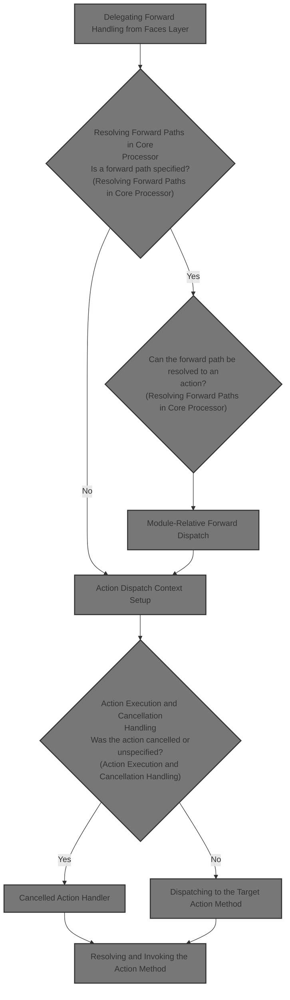
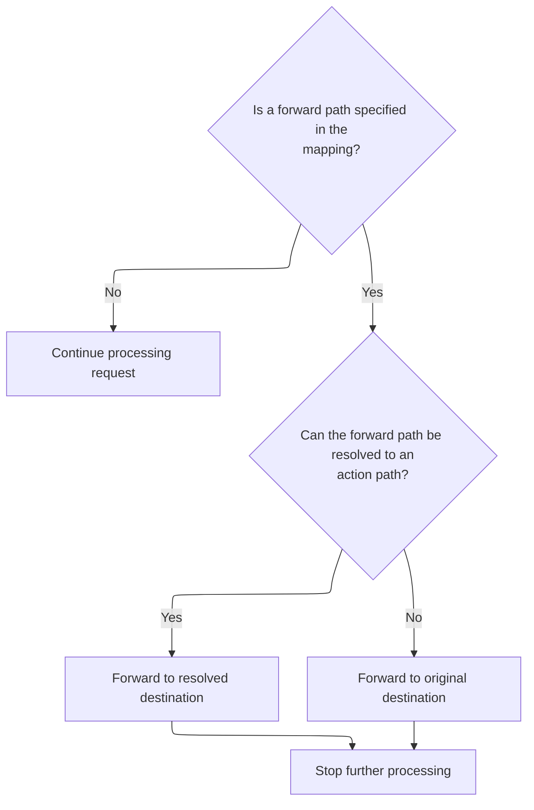
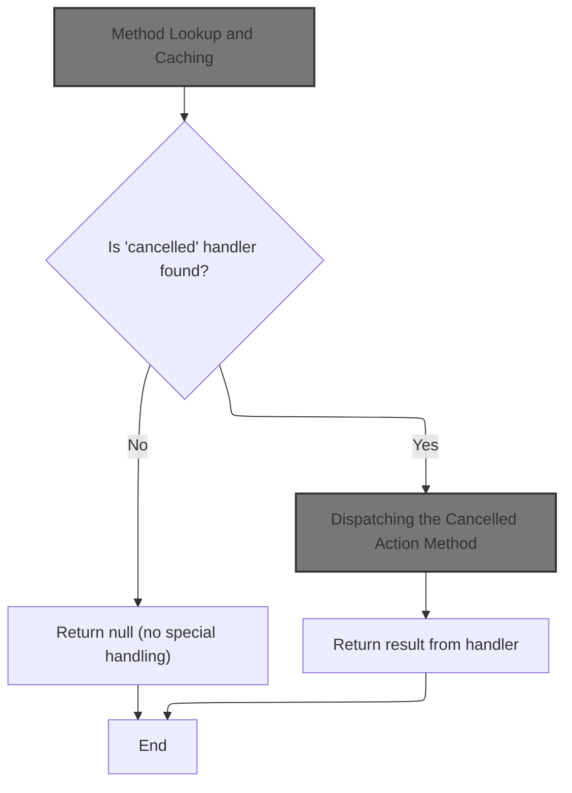
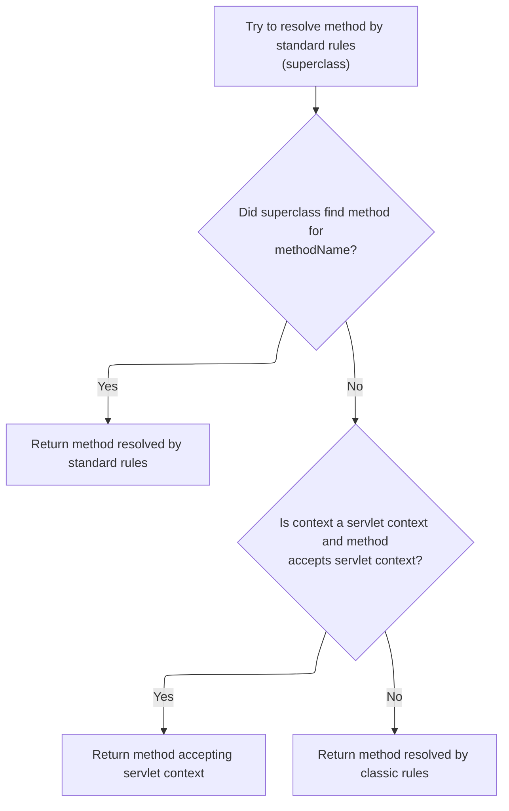
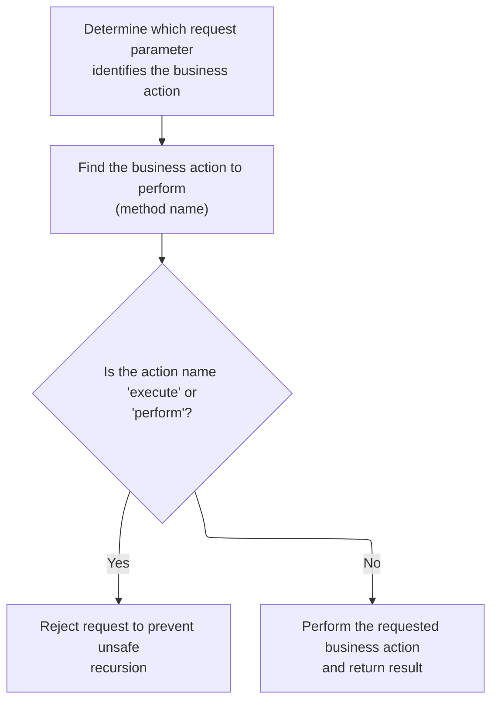

This document describes how user requests are forwarded to new destinations within the web application. When a forward is triggered, the system determines the correct destination and redirects the user, executing any associated business logic.



# Delegating Forward Handling from Faces Layer

<SwmSnippet path="/faces/src/main/java/org/apache/struts/faces/application/FacesRequestProcessor.java" line="255">

---

<SwmToken path="faces/src/main/java/org/apache/struts/faces/application/FacesRequestProcessor.java" pos="255:5:5" line-data="    protected boolean processForward(HttpServletRequest request,">`processForward`</SwmToken> in <SwmToken path="faces/src/main/java/org/apache/struts/faces/application/FacesRequestProcessor.java" pos="65:4:4" line-data="public class FacesRequestProcessor extends RequestProcessor {">`FacesRequestProcessor`</SwmToken> just logs the action and hands off the actual forward processing to the core <SwmToken path="faces/src/main/java/org/apache/struts/faces/application/FacesRequestProcessor.java" pos="45:10:10" line-data="import org.apache.struts.action.RequestProcessor;">`RequestProcessor`</SwmToken>. No Faces-specific logic here, just delegation. We call the core processor next because that's where the real forward mechanics are implemented.

```java
    protected boolean processForward(HttpServletRequest request,
                                     HttpServletResponse response,
                                     ActionMapping mapping)
        throws IOException, ServletException {

        if (log.isTraceEnabled()) {
            log.trace("Performing standard forward handling");
        }
        boolean result = super.processForward
            (request, response, mapping);
        if (log.isDebugEnabled()) {
            log.debug("Standard forward handling returned " + result);
        }
        return (result);

    }
```

---

</SwmSnippet>

# Resolving Forward Paths in Core Processor



<SwmSnippet path="/core/src/main/java/org/apache/struts/action/RequestProcessor.java" line="550">

---

In <SwmToken path="core/src/main/java/org/apache/struts/action/RequestProcessor.java" pos="550:5:5" line-data="    protected boolean processForward(HttpServletRequest request,">`processForward`</SwmToken> (core), we grab the forward path from the mapping and check if it can be mapped to an action. If so, we use <SwmToken path="core/src/main/java/org/apache/struts/action/RequestProcessor.java" pos="561:7:9" line-data="        String actionIdPath = RequestUtils.actionIdURL(forward, this.moduleConfig, this.servlet);">`RequestUtils.actionIdURL`</SwmToken> to resolve it. This lets us handle forwards that are actually actions, so we need to call <SwmToken path="core/src/main/java/org/apache/struts/action/RequestProcessor.java" pos="561:7:7" line-data="        String actionIdPath = RequestUtils.actionIdURL(forward, this.moduleConfig, this.servlet);">`RequestUtils`</SwmToken> next to get the correct URL.

```java
    protected boolean processForward(HttpServletRequest request,
        HttpServletResponse response, ActionMapping mapping)
        throws IOException, ServletException {
        // Are we going to processing this request?
        String forward = mapping.getForward();

        if (forward == null) {
            return (true);
        }

        // If the forward can be unaliased into an action, then use the path of the action
        String actionIdPath = RequestUtils.actionIdURL(forward, this.moduleConfig, this.servlet);
```

---

</SwmSnippet>

<SwmSnippet path="/core/src/main/java/org/apache/struts/util/RequestUtils.java" line="1080">

---

<SwmToken path="core/src/main/java/org/apache/struts/util/RequestUtils.java" pos="1080:7:7" line-data="    public static String actionIdURL(String originalPath, ModuleConfig moduleConfig, ActionServlet servlet) {">`actionIdURL`</SwmToken> checks if the path is relative (not starting with 'http' or '/'), splits out any query string, looks up the action config, and builds the URL based on servlet mapping patterns. If there's a query string, it tacks that on at the end. Only relative paths get processed, and the mapping logic is Struts-specific.

```java
    public static String actionIdURL(String originalPath, ModuleConfig moduleConfig, ActionServlet servlet) {
        if (originalPath.startsWith("http") || originalPath.startsWith("/")) {
            return null;
        }

        // Split the forward path into the resource and query string;
        // it is possible a forward (or redirect) has added parameters.
        String actionId = null;
        String qs = null;
        int qpos = originalPath.indexOf("?");
        if (qpos == -1) {
            actionId = originalPath;
        } else {
            actionId = originalPath.substring(0, qpos);
            qs = originalPath.substring(qpos);
        }

        // Find the action of the given actionId
        ActionConfig actionConfig = moduleConfig.findActionConfigId(actionId);
        if (actionConfig == null) {
            if (log.isDebugEnabled()) {
                log.debug("No actionId found for " + actionId);
            }
            return null;
        }

        String path = actionConfig.getPath();
        String mapping = RequestUtils.getServletMapping(servlet);
        StringBuffer actionIdPath = new StringBuffer();

        // Form the path based on the servlet mapping pattern
        if (mapping.startsWith("*")) {
            actionIdPath.append(path);
            actionIdPath.append(mapping.substring(1));
        } else if (mapping.startsWith("/")) {  // implied ends with a *
            mapping = mapping.substring(0, mapping.length() - 1);
            if (mapping.endsWith("/") && path.startsWith("/")) {
                actionIdPath.append(mapping);
                actionIdPath.append(path.substring(1));
            } else {
                actionIdPath.append(mapping);
                actionIdPath.append(path);
            }
        } else {
            log.warn("Unknown servlet mapping pattern");
            actionIdPath.append(path);
        }

        // Lastly add any query parameters (the ? is part of the query string)
        if (qs != null) {
            actionIdPath.append(qs);
        }

        // Return the path
        if (log.isDebugEnabled()) {
            log.debug(originalPath + " unaliased to " + actionIdPath.toString());
        }
        return actionIdPath.toString();
    }
```

---

</SwmSnippet>

<SwmSnippet path="/core/src/main/java/org/apache/struts/action/RequestProcessor.java" line="562">

---

Just got back from <SwmToken path="core/src/main/java/org/apache/struts/action/RequestProcessor.java" pos="561:9:9" line-data="        String actionIdPath = RequestUtils.actionIdURL(forward, this.moduleConfig, this.servlet);">`actionIdURL`</SwmToken>. Now, if we got a valid <SwmToken path="core/src/main/java/org/apache/struts/action/RequestProcessor.java" pos="562:4:4" line-data="        if (actionIdPath != null) {">`actionIdPath`</SwmToken>, we update the forward path and call <SwmToken path="core/src/main/java/org/apache/struts/action/RequestProcessor.java" pos="566:1:1" line-data="        internalModuleRelativeForward(forward, request, response);">`internalModuleRelativeForward`</SwmToken> in <SwmToken path="faces/src/main/java/org/apache/struts/faces/application/FacesRequestProcessor.java" pos="45:10:10" line-data="import org.apache.struts.action.RequestProcessor;">`RequestProcessor`</SwmToken> to actually forward the request. This is where the module-relative forwarding happens.

```java
        if (actionIdPath != null) {
            forward = actionIdPath;
        }

        internalModuleRelativeForward(forward, request, response);

        return (false);
    }
```

---

</SwmSnippet>

# Module-Relative Forward Dispatch

<SwmSnippet path="/core/src/main/java/org/apache/struts/action/RequestProcessor.java" line="1015">

---

<SwmToken path="core/src/main/java/org/apache/struts/action/RequestProcessor.java" pos="1015:5:5" line-data="    protected void internalModuleRelativeForward(String uri,">`internalModuleRelativeForward`</SwmToken> prepends the module prefix to the URI and then calls <SwmToken path="core/src/main/java/org/apache/struts/action/RequestProcessor.java" pos="1027:1:1" line-data="        doForward(uri, request, response);">`doForward`</SwmToken> to hand off the request. This keeps the forward scoped to the right module.

```java
    protected void internalModuleRelativeForward(String uri,
        HttpServletRequest request, HttpServletResponse response)
        throws IOException, ServletException {
        // Construct a request dispatcher for the specified path
        uri = moduleConfig.getPrefix() + uri;

        // Delegate the processing of this request
        // :FIXME: - exception handling?
        if (log.isDebugEnabled()) {
            log.debug(" Delegating via forward to '" + uri + "'");
        }

        doForward(uri, request, response);
    }
```

---

</SwmSnippet>

# Servlet Forward Execution

<SwmSnippet path="/core/src/main/java/org/apache/struts/action/RequestProcessor.java" line="1071">

---

In <SwmToken path="core/src/main/java/org/apache/struts/action/RequestProcessor.java" pos="1071:5:5" line-data="    protected void doForward(String uri, HttpServletRequest request,">`doForward`</SwmToken>, we try to get a dispatcher for the URI. If it's missing, we grab an error message from <SwmToken path="core/src/main/java/org/apache/struts/util/PropertyMessageResources.java" pos="82:8:8" line-data=" * Configure &lt;code&gt;PropertyMessageResources&lt;/code&gt; to operate in this mode by">`PropertyMessageResources`</SwmToken> and send an internal server error. This is where error handling and message localization kick in.

```java
    protected void doForward(String uri, HttpServletRequest request,
        HttpServletResponse response)
        throws IOException, ServletException {
        RequestDispatcher rd = getServletContext().getRequestDispatcher(uri);

        if (rd == null) {
            response.sendError(HttpServletResponse.SC_INTERNAL_SERVER_ERROR,
                getInternal().getMessage("requestDispatcher", uri));

            return;
        }

```

---

</SwmSnippet>

## Localized Error Message Lookup

```mermaid
%%{init: {"flowchart": {"defaultRenderer": "elk"}} }%%
flowchart TD
  node1["Request message for given locale and
key"]
  click node1 openCode "core/src/main/java/org/apache/struts/util/PropertyMessageResources.java:227:282"
  node2{"Is message found for requested locale?"}
  click node2 openCode "core/src/main/java/org/apache/struts/util/PropertyMessageResources.java:238:241"
  node1 --> node2
  node2 -- Yes --> node8["Return localized message"]
  click node8 openCode "core/src/main/java/org/apache/struts/util/PropertyMessageResources.java:240:241"
  node2 -- No --> node3{"Mode: JSTL, ResourceBundle, or
Default?"}
  click node3 openCode "core/src/main/java/org/apache/struts/util/PropertyMessageResources.java:244:265"
  node3 -- JSTL --> node6["Try base properties file (no default
locale fallback)"]
  click node6 openCode "core/src/main/java/org/apache/struts/util/PropertyMessageResources.java:271:273"
  node3 -- ResourceBundle --> node5{"Is message found for default locale
(hierarchy)?"}
  click node5 openCode "core/src/main/java/org/apache/struts/util/PropertyMessageResources.java:253:254"
  node3 -- Default --> node51{"Is message found for default locale
(direct)?"}
  click node51 openCode "core/src/main/java/org/apache/struts/util/PropertyMessageResources.java:260:263"
  node5 -- Yes --> node8
  node5 -- No --> node6
  node51 -- Yes --> node8
  node51 -- No --> node6
  node6 -- Yes --> node8
  node6 -- No --> node7{"returnNull is true?"}
  click node7 openCode "core/src/main/java/org/apache/struts/util/PropertyMessageResources.java:277:281"
  node7 -- Yes --> node9["Return null"]
  click node9 openCode "core/src/main/java/org/apache/struts/util/PropertyMessageResources.java:278:279"
  node7 -- No --> node10["Return 'message not found' placeholder"]
  click node10 openCode "core/src/main/java/org/apache/struts/util/PropertyMessageResources.java:280:281"

classDef HeadingStyle fill:#777777,stroke:#333,stroke-width:2px;

%% Swimm:
%% %%{init: {"flowchart": {"defaultRenderer": "elk"}} }%%
%% flowchart TD
%%   node1["Request message for given locale and
%% key"]
%%   click node1 openCode "<SwmPath>[core/…/util/PropertyMessageResources.java](core/src/main/java/org/apache/struts/util/PropertyMessageResources.java)</SwmPath>:227:282"
%%   node2{"Is message found for requested locale?"}
%%   click node2 openCode "<SwmPath>[core/…/util/PropertyMessageResources.java](core/src/main/java/org/apache/struts/util/PropertyMessageResources.java)</SwmPath>:238:241"
%%   node1 --> node2
%%   node2 -- Yes --> node8["Return localized message"]
%%   click node8 openCode "<SwmPath>[core/…/util/PropertyMessageResources.java](core/src/main/java/org/apache/struts/util/PropertyMessageResources.java)</SwmPath>:240:241"
%%   node2 -- No --> node3{"Mode: JSTL, ResourceBundle, or
%% Default?"}
%%   click node3 openCode "<SwmPath>[core/…/util/PropertyMessageResources.java](core/src/main/java/org/apache/struts/util/PropertyMessageResources.java)</SwmPath>:244:265"
%%   node3 -- JSTL --> node6["Try base properties file (no default
%% locale fallback)"]
%%   click node6 openCode "<SwmPath>[core/…/util/PropertyMessageResources.java](core/src/main/java/org/apache/struts/util/PropertyMessageResources.java)</SwmPath>:271:273"
%%   node3 -- ResourceBundle --> node5{"Is message found for default locale
%% (hierarchy)?"}
%%   click node5 openCode "<SwmPath>[core/…/util/PropertyMessageResources.java](core/src/main/java/org/apache/struts/util/PropertyMessageResources.java)</SwmPath>:253:254"
%%   node3 -- Default --> node51{"Is message found for default locale
%% (direct)?"}
%%   click node51 openCode "<SwmPath>[core/…/util/PropertyMessageResources.java](core/src/main/java/org/apache/struts/util/PropertyMessageResources.java)</SwmPath>:260:263"
%%   node5 -- Yes --> node8
%%   node5 -- No --> node6
%%   node51 -- Yes --> node8
%%   node51 -- No --> node6
%%   node6 -- Yes --> node8
%%   node6 -- No --> node7{"<SwmToken path="core/src/main/java/org/apache/struts/util/PropertyMessageResources.java" pos="277:4:4" line-data="        if (returnNull) {">`returnNull`</SwmToken> is true?"}
%%   click node7 openCode "<SwmPath>[core/…/util/PropertyMessageResources.java](core/src/main/java/org/apache/struts/util/PropertyMessageResources.java)</SwmPath>:277:281"
%%   node7 -- Yes --> node9["Return null"]
%%   click node9 openCode "<SwmPath>[core/…/util/PropertyMessageResources.java](core/src/main/java/org/apache/struts/util/PropertyMessageResources.java)</SwmPath>:278:279"
%%   node7 -- No --> node10["Return 'message not found' placeholder"]
%%   click node10 openCode "<SwmPath>[core/…/util/PropertyMessageResources.java](core/src/main/java/org/apache/struts/util/PropertyMessageResources.java)</SwmPath>:280:281"
%% 
%% classDef HeadingStyle fill:#777777,stroke:#333,stroke-width:2px;
```



<SwmSnippet path="/core/src/main/java/org/apache/struts/util/PropertyMessageResources.java" line="227">

---

<SwmToken path="core/src/main/java/org/apache/struts/util/PropertyMessageResources.java" pos="227:5:5" line-data="    public String getMessage(Locale locale, String key) {">`getMessage`</SwmToken> looks up a localized message using a mode-based fallback strategy. It checks the requested locale, then falls back to default locale or properties file depending on mode, and finally returns either null or a formatted error string if nothing is found. The fallback logic is controlled by mode and flags.

```java
    public String getMessage(Locale locale, String key) {
        if (log.isDebugEnabled()) {
            log.debug("getMessage(" + locale + "," + key + ")");
        }

        // Initialize variables we will require
        String localeKey = localeKey(locale);
        String originalKey = messageKey(localeKey, key);
        String message = null;

        // Search the specified Locale
        message = findMessage(locale, key, originalKey);
        if (message != null) {
            return message;
        }

        // JSTL Compatibility - JSTL doesn't use the default locale
        if (mode == MODE_JSTL) {

           // do nothing (i.e. don't use default Locale)

        // PropertyResourcesBundle - searches through the hierarchy
        // for the default Locale (e.g. first en_US then en)
        } else if (mode == MODE_RESOURCE_BUNDLE) {

            if (!defaultLocale.equals(locale)) {
                message = findMessage(defaultLocale, key, originalKey);
            }

        // Default (backwards) Compatibility - just searches the
        // specified Locale (e.g. just en_US)
        } else {

            if (!defaultLocale.equals(locale)) {
                localeKey = localeKey(defaultLocale);
                message = findMessage(localeKey, key, originalKey);
            }

        }
        if (message != null) {
            return message;
        }

        // Find the message in the default properties file
        message = findMessage("", key, originalKey);
        if (message != null) {
            return message;
        }

        // Return an appropriate error indication
        if (returnNull) {
            return (null);
        } else {
            return ("???" + messageKey(locale, key) + "???");
        }
    }
```

---

</SwmSnippet>

<SwmSnippet path="/core/src/main/java/org/apache/struts/util/PropertyMessageResources.java" line="393">

---

<SwmToken path="core/src/main/java/org/apache/struts/util/PropertyMessageResources.java" pos="393:5:5" line-data="    private String findMessage(Locale locale, String key, String originalKey) {">`findMessage`</SwmToken> uses the <SwmToken path="core/src/main/java/org/apache/struts/util/PropertyMessageResources.java" pos="396:3:3" line-data="        String localeKey = localeKey(locale);">`localeKey`</SwmToken> string to progressively generalize the locale, stripping underscores to fall back from specific to general locales. It assumes <SwmToken path="core/src/main/java/org/apache/struts/util/PropertyMessageResources.java" pos="396:3:3" line-data="        String localeKey = localeKey(locale);">`localeKey`</SwmToken> is underscore-separated, so the fallback logic works as intended.

```java
    private String findMessage(Locale locale, String key, String originalKey) {

        // Initialize variables we will require
        String localeKey = localeKey(locale);
        String messageKey = null;
        String message = null;
        int underscore = 0;

        // Loop from specific to general Locales looking for this message
        while (true) {
            message = findMessage(localeKey, key, originalKey);
            if (message != null) {
                break;
            }

            // Strip trailing modifiers to try a more general locale key
            underscore = localeKey.lastIndexOf("_");

            if (underscore < 0) {
                break;
            }

            localeKey = localeKey.substring(0, underscore);
        }
```

---

</SwmSnippet>

## Completing Servlet Forward

<SwmSnippet path="/core/src/main/java/org/apache/struts/action/RequestProcessor.java" line="1083">

---

Just returned from <SwmToken path="core/src/main/java/org/apache/struts/util/PropertyMessageResources.java" pos="82:8:8" line-data=" * Configure &lt;code&gt;PropertyMessageResources&lt;/code&gt; to operate in this mode by">`PropertyMessageResources`</SwmToken>. The dispatcher forwards the request, and that's it for <SwmToken path="faces/src/main/java/org/apache/struts/faces/application/FacesRequestProcessor.java" pos="45:10:10" line-data="import org.apache.struts.action.RequestProcessor;">`RequestProcessor`</SwmToken>. Next, we call <SwmToken path="apps/faces-example1/src/main/java/org/apache/struts/webapp/example/AbstractBacking.java" pos="35:4:4" line-data="abstract class AbstractBacking {">`AbstractBacking`</SwmToken> to handle any Faces-specific forwarding.

```java
        rd.forward(request, response);
    }
```

---

</SwmSnippet>

# JSF Forward Dispatch

<SwmSnippet path="/apps/faces-example1/src/main/java/org/apache/struts/webapp/example/AbstractBacking.java" line="66">

---

<SwmToken path="apps/faces-example1/src/main/java/org/apache/struts/webapp/example/AbstractBacking.java" pos="66:5:5" line-data="    protected void forward(FacesContext context, String url) {">`forward`</SwmToken> in <SwmToken path="apps/faces-example1/src/main/java/org/apache/struts/webapp/example/AbstractBacking.java" pos="35:4:4" line-data="abstract class AbstractBacking {">`AbstractBacking`</SwmToken> dispatches the URL via JSF and marks the response as complete. If there's an error, it throws a <SwmToken path="apps/faces-example1/src/main/java/org/apache/struts/webapp/example/AbstractBacking.java" pos="71:5:5" line-data="            throw new FacesException(e);">`FacesException`</SwmToken>. Next, we call <SwmToken path="extras/src/main/java/org/apache/struts/actions/ActionDispatcher.java" pos="56:5:5" line-data=" *       protected ActionDispatcher dispatcher">`ActionDispatcher`</SwmToken> to handle any Struts action logic.

```java
    protected void forward(FacesContext context, String url) {

        try {
            context.getExternalContext().dispatch(url);
        } catch (IOException e) {
            throw new FacesException(e);
        } finally {
            context.responseComplete();
        }

    }
```

---

</SwmSnippet>

# Action Dispatch Context Setup

<SwmSnippet path="/extras/src/main/java/org/apache/struts/actions/ActionDispatcher.java" line="507">

---

In <SwmToken path="extras/src/main/java/org/apache/struts/actions/ActionDispatcher.java" pos="507:5:5" line-data="    public Object dispatch(ActionContext context) throws Exception {">`dispatch`</SwmToken>, we cast the context to <SwmToken path="extras/src/main/java/org/apache/struts/actions/ActionDispatcher.java" pos="508:1:1" line-data="        ServletActionContext servletContext = (ServletActionContext) context;">`ServletActionContext`</SwmToken> so we can grab the request and response for action execution. Next, we call <SwmToken path="extras/src/main/java/org/apache/struts/actions/ActionDispatcher.java" pos="508:1:1" line-data="        ServletActionContext servletContext = (ServletActionContext) context;">`ServletActionContext`</SwmToken> to get those objects.

```java
    public Object dispatch(ActionContext context) throws Exception {
        ServletActionContext servletContext = (ServletActionContext) context;
        return execute((ActionMapping) context.getActionConfig(), context.getActionForm(),
            servletContext.getRequest(), servletContext.getResponse());
```

---

</SwmSnippet>

## Retrieving Servlet Request

<SwmSnippet path="/core/src/main/java/org/apache/struts/chain/contexts/ServletActionContext.java" line="94">

---

<SwmToken path="core/src/main/java/org/apache/struts/chain/contexts/ServletActionContext.java" pos="94:5:5" line-data="    public HttpServletRequest getRequest() {">`getRequest`</SwmToken> just calls <SwmToken path="core/src/main/java/org/apache/struts/chain/contexts/ServletActionContext.java" pos="95:3:5" line-data="        return servletWebContext().getRequest();">`servletWebContext()`</SwmToken><SwmToken path="core/src/main/java/org/apache/struts/chain/contexts/ServletActionContext.java" pos="95:6:9" line-data="        return servletWebContext().getRequest();">`.getRequest()`</SwmToken> to grab the servlet request. We need to call <SwmToken path="core/src/main/java/org/apache/struts/chain/contexts/ServletActionContext.java" pos="95:3:3" line-data="        return servletWebContext().getRequest();">`servletWebContext`</SwmToken> next to get access to the actual request object.

```java
    public HttpServletRequest getRequest() {
        return servletWebContext().getRequest();
    }
```

---

</SwmSnippet>

<SwmSnippet path="/core/src/main/java/org/apache/struts/chain/contexts/ServletActionContext.java" line="67">

---

<SwmToken path="core/src/main/java/org/apache/struts/chain/contexts/ServletActionContext.java" pos="67:5:5" line-data="    protected ServletWebContext servletWebContext() {">`servletWebContext`</SwmToken> just casts <SwmToken path="core/src/main/java/org/apache/struts/chain/contexts/ServletActionContext.java" pos="68:9:9" line-data="        return (ServletWebContext) this.getBaseContext();">`getBaseContext`</SwmToken> to <SwmToken path="core/src/main/java/org/apache/struts/chain/contexts/ServletActionContext.java" pos="67:3:3" line-data="    protected ServletWebContext servletWebContext() {">`ServletWebContext`</SwmToken>. It assumes the base context is the right type, so if it's not, you'll get a <SwmToken path="extras/src/main/java/org/apache/struts/actions/ActionDispatcher.java" pos="368:6:6" line-data="        } catch (ClassCastException e) {">`ClassCastException`</SwmToken>. No extra logic, just a direct cast.

```java
    protected ServletWebContext servletWebContext() {
        return (ServletWebContext) this.getBaseContext();
    }
```

---

</SwmSnippet>

## Action Execution with Servlet Context

<SwmSnippet path="/extras/src/main/java/org/apache/struts/actions/ActionDispatcher.java" line="509">

---

Just got back from <SwmToken path="extras/src/main/java/org/apache/struts/actions/ActionDispatcher.java" pos="508:1:1" line-data="        ServletActionContext servletContext = (ServletActionContext) context;">`ServletActionContext`</SwmToken> for the request. Now, <SwmToken path="extras/src/main/java/org/apache/struts/actions/ActionDispatcher.java" pos="56:5:5" line-data=" *       protected ActionDispatcher dispatcher">`ActionDispatcher`</SwmToken> grabs the response from <SwmToken path="extras/src/main/java/org/apache/struts/actions/ActionDispatcher.java" pos="508:1:1" line-data="        ServletActionContext servletContext = (ServletActionContext) context;">`ServletActionContext`</SwmToken> too, since both are needed for action execution.

```java
        return execute((ActionMapping) context.getActionConfig(), context.getActionForm(),
            servletContext.getRequest(), servletContext.getResponse());
```

---

</SwmSnippet>

<SwmSnippet path="/core/src/main/java/org/apache/struts/chain/contexts/ServletActionContext.java" line="103">

---

<SwmToken path="core/src/main/java/org/apache/struts/chain/contexts/ServletActionContext.java" pos="103:5:5" line-data="    public HttpServletResponse getResponse() {">`getResponse`</SwmToken> just calls <SwmToken path="core/src/main/java/org/apache/struts/chain/contexts/ServletActionContext.java" pos="104:3:5" line-data="        return servletWebContext().getResponse();">`servletWebContext()`</SwmToken><SwmToken path="core/src/main/java/org/apache/struts/chain/contexts/ServletActionContext.java" pos="104:6:9" line-data="        return servletWebContext().getResponse();">`.getResponse()`</SwmToken> to grab the servlet response. We need to call <SwmToken path="core/src/main/java/org/apache/struts/chain/contexts/ServletActionContext.java" pos="104:3:3" line-data="        return servletWebContext().getResponse();">`servletWebContext`</SwmToken> next to get access to the actual response object.

```java
    public HttpServletResponse getResponse() {
        return servletWebContext().getResponse();
    }
```

---

</SwmSnippet>

<SwmSnippet path="/extras/src/main/java/org/apache/struts/actions/ActionDispatcher.java" line="509">

---

Just got back from <SwmToken path="extras/src/main/java/org/apache/struts/actions/ActionDispatcher.java" pos="508:1:1" line-data="        ServletActionContext servletContext = (ServletActionContext) context;">`ServletActionContext`</SwmToken> for both request and response. Now, <SwmToken path="extras/src/main/java/org/apache/struts/actions/ActionDispatcher.java" pos="56:5:5" line-data=" *       protected ActionDispatcher dispatcher">`ActionDispatcher`</SwmToken> calls execute with these objects to run the action logic.

```java
        return execute((ActionMapping) context.getActionConfig(), context.getActionForm(),
            servletContext.getRequest(), servletContext.getResponse());
    }
```

---

</SwmSnippet>

# Action Execution and Cancellation Handling

<SwmSnippet path="/extras/src/main/java/org/apache/struts/actions/ActionDispatcher.java" line="197">

---

In <SwmToken path="extras/src/main/java/org/apache/struts/actions/ActionDispatcher.java" pos="197:5:5" line-data="    public ActionForward execute(ActionMapping mapping, ActionForm form,">`execute`</SwmToken>, we check if the action was cancelled. If so, we call cancelled to handle that case. If cancelled returns a forward, we use it; otherwise, we keep processing.

```java
    public ActionForward execute(ActionMapping mapping, ActionForm form,
        HttpServletRequest request, HttpServletResponse response)
        throws Exception {
        // Process "cancelled"
        if (isCancelled(request)) {
            ActionForward af = cancelled(mapping, form, request, response);

            if (af != null) {
                return af;
            }
        }

```

---

</SwmSnippet>

## Cancelled Action Handler



<SwmSnippet path="/extras/src/main/java/org/apache/struts/actions/ActionDispatcher.java" line="282">

---

In <SwmToken path="extras/src/main/java/org/apache/struts/actions/ActionDispatcher.java" pos="282:5:5" line-data="    protected ActionForward cancelled(ActionMapping mapping, ActionForm form,">`cancelled`</SwmToken>, we try to find a method named 'cancelled' using <SwmToken path="extras/src/main/java/org/apache/struts/actions/ActionDispatcher.java" pos="290:5:5" line-data="            method = getMethod(name);">`getMethod`</SwmToken>. If it's not there, we just return null and move on.

```java
    protected ActionForward cancelled(ActionMapping mapping, ActionForm form,
        HttpServletRequest request, HttpServletResponse response)
        throws Exception {
        // Identify if there is an "cancelled" method to be dispatched to
        String name = "cancelled";
        Method method = null;

        try {
            method = getMethod(name);
        } catch (NoSuchMethodException e) {
            return null;
        }

```

---

</SwmSnippet>

### Method Lookup and Caching

<SwmSnippet path="/extras/src/main/java/org/apache/struts/actions/ActionDispatcher.java" line="410">

---

<SwmToken path="extras/src/main/java/org/apache/struts/actions/ActionDispatcher.java" pos="410:5:5" line-data="    protected Method getMethod(String name)">`getMethod`</SwmToken> checks the cache for the method name, and if it's not there, uses reflection to find it and caches the result. The method name and parameter types have to match what's in the class, otherwise you'll get an exception.

```java
    protected Method getMethod(String name)
        throws NoSuchMethodException {
        synchronized (methods) {
            Method method = (Method) methods.get(name);

            if (method == null) {
                method = clazz.getMethod(name, types);
                methods.put(name, method);
            }

            return (method);
        }
    }
```

---

</SwmSnippet>

### Context-Aware Method Lookup

<SwmSnippet path="/core/src/main/java/org/apache/struts/dispatcher/AbstractDispatcher.java" line="203">

---

<SwmToken path="core/src/main/java/org/apache/struts/dispatcher/AbstractDispatcher.java" pos="203:7:7" line-data="    protected final Method getMethod(ActionContext context, String methodName) throws NoSuchMethodException {">`getMethod`</SwmToken> builds a key from the action class and method name, checks the cache, and if not found, calls <SwmToken path="core/src/main/java/org/apache/struts/dispatcher/AbstractDispatcher.java" pos="215:5:5" line-data="                method = resolveMethod(context, methodName);">`resolveMethod`</SwmToken> to find it. Synchronization keeps the cache thread-safe.

```java
    protected final Method getMethod(ActionContext context, String methodName) throws NoSuchMethodException {
        synchronized (methods) {
            // Key the method based on the class-method combination
            StringBuffer keyBuf = new StringBuffer(100);
            keyBuf.append(context.getAction().getClass().getName());
            keyBuf.append(":");
            keyBuf.append(methodName);
            String key = keyBuf.toString();

            Method method = (Method) methods.get(key);

            if (method == null) {
                method = resolveMethod(context, methodName);
                methods.put(key, method);
            }

            return method;
        }
    }
```

---

</SwmSnippet>

### Resolving Action Method via Resolver

<SwmSnippet path="/core/src/main/java/org/apache/struts/dispatcher/AbstractDispatcher.java" line="288">

---

<SwmToken path="core/src/main/java/org/apache/struts/dispatcher/AbstractDispatcher.java" pos="288:3:3" line-data="    Method resolveMethod(ActionContext context, String methodName) throws NoSuchMethodException {">`resolveMethod`</SwmToken> just delegates to <SwmToken path="core/src/main/java/org/apache/struts/dispatcher/AbstractDispatcher.java" pos="289:3:3" line-data="        return methodResolver.resolveMethod(context, methodName);">`methodResolver`</SwmToken> to find the method. This lets us handle different resolution strategies depending on the context.

```java
    Method resolveMethod(ActionContext context, String methodName) throws NoSuchMethodException {
        return methodResolver.resolveMethod(context, methodName);
    }
```

---

</SwmSnippet>

### Layered Method Resolution



<SwmSnippet path="/core/src/main/java/org/apache/struts/dispatcher/servlet/ServletMethodResolver.java" line="110">

---

In <SwmToken path="core/src/main/java/org/apache/struts/dispatcher/servlet/ServletMethodResolver.java" pos="110:5:5" line-data="    public Method resolveMethod(ActionContext context, String methodName) throws NoSuchMethodException {">`resolveMethod`</SwmToken>, we first try the superclass's strategy, then check for a method that takes <SwmToken path="extras/src/main/java/org/apache/struts/actions/ActionDispatcher.java" pos="508:1:1" line-data="        ServletActionContext servletContext = (ServletActionContext) context;">`ServletActionContext`</SwmToken>, and finally fall back to classic resolution. This layered approach covers different method signatures and context types.

```java
    public Method resolveMethod(ActionContext context, String methodName) throws NoSuchMethodException {
        // First try to resolve anything the superclass supports
        try {
            return super.resolveMethod(context, methodName);
        } catch (NoSuchMethodException e) {
            // continue
        }

```

---

</SwmSnippet>

<SwmSnippet path="/core/src/main/java/org/apache/struts/dispatcher/servlet/ServletMethodResolver.java" line="118">

---

Just got back from <SwmToken path="core/src/main/java/org/apache/struts/dispatcher/AbstractDispatcher.java" pos="43:6:6" line-data="public abstract class AbstractDispatcher implements Dispatcher, Serializable {">`AbstractDispatcher`</SwmToken>. Now, <SwmToken path="core/src/main/java/org/apache/struts/dispatcher/servlet/ServletMethodResolver.java" pos="49:4:4" line-data="public class ServletMethodResolver extends AbstractMethodResolver {">`ServletMethodResolver`</SwmToken> checks if the context is a <SwmToken path="core/src/main/java/org/apache/struts/dispatcher/servlet/ServletMethodResolver.java" pos="119:8:8" line-data="        if (context instanceof ServletActionContext) {">`ServletActionContext`</SwmToken> and tries to find a method that takes it as a parameter. This is specific to how Struts handles servlet actions.

```java
        // Can the method accept the servlet action context?
        if (context instanceof ServletActionContext) {
            try {
                Class actionClass = context.getAction().getClass();
                return actionClass.getMethod(methodName, new Class[] { ServletActionContext.class });
            } catch (NoSuchMethodException e) {
                // continue
            }
        }

```

---

</SwmSnippet>

<SwmSnippet path="/core/src/main/java/org/apache/struts/dispatcher/servlet/ServletMethodResolver.java" line="128">

---

Just got back from <SwmToken path="core/src/main/java/org/apache/struts/dispatcher/AbstractDispatcher.java" pos="43:6:6" line-data="public abstract class AbstractDispatcher implements Dispatcher, Serializable {">`AbstractDispatcher`</SwmToken>. Now, <SwmToken path="core/src/main/java/org/apache/struts/dispatcher/servlet/ServletMethodResolver.java" pos="49:4:4" line-data="public class ServletMethodResolver extends AbstractMethodResolver {">`ServletMethodResolver`</SwmToken> falls back to classic method resolution if the previous strategies didn't work. This covers all bases for method lookup.

```java
        // Lastly, try the classical argument listing
        return resolveClassicMethod(context, methodName);
    }
```

---

</SwmSnippet>

<SwmSnippet path="/core/src/main/java/org/apache/struts/dispatcher/servlet/ServletMethodResolver.java" line="105">

---

<SwmToken path="core/src/main/java/org/apache/struts/dispatcher/servlet/ServletMethodResolver.java" pos="105:7:7" line-data="    protected final Method resolveClassicMethod(ActionContext context, String methodName) throws NoSuchMethodException {">`resolveClassicMethod`</SwmToken> is where we use Java reflection to find a method in the action class that matches the given name and the <SwmToken path="core/src/main/java/org/apache/struts/dispatcher/servlet/ServletMethodResolver.java" pos="107:10:10" line-data="        return actionClass.getMethod(methodName, CLASSIC_EXECUTE_SIGNATURE);">`CLASSIC_EXECUTE_SIGNATURE`</SwmToken> parameter types. This is how Struts ensures it's calling a method with the right signature. We need to call <SwmToken path="core/src/main/java/org/apache/struts/dispatcher/AbstractDispatcher.java" pos="43:6:6" line-data="public abstract class AbstractDispatcher implements Dispatcher, Serializable {">`AbstractDispatcher`</SwmToken> next because that's where the higher-level method resolution logic lives, including cache checks and fallback strategies.

```java
    protected final Method resolveClassicMethod(ActionContext context, String methodName) throws NoSuchMethodException {
        Class actionClass = context.getAction().getClass();
        return actionClass.getMethod(methodName, CLASSIC_EXECUTE_SIGNATURE);
    }
```

---

</SwmSnippet>

### Dispatching the Cancelled Action Method

<SwmSnippet path="/extras/src/main/java/org/apache/struts/actions/ActionDispatcher.java" line="295">

---

We just got back from <SwmToken path="extras/src/main/java/org/apache/struts/actions/ActionDispatcher.java" pos="253:5:5" line-data="            method = getMethod(name);">`getMethod`</SwmToken> in <SwmToken path="extras/src/main/java/org/apache/struts/actions/ActionDispatcher.java" pos="56:5:5" line-data=" *       protected ActionDispatcher dispatcher">`ActionDispatcher`</SwmToken>. Now, we call <SwmToken path="extras/src/main/java/org/apache/struts/actions/ActionDispatcher.java" pos="295:3:3" line-data="        return dispatchMethod(mapping, form, request, response, name, method);">`dispatchMethod`</SwmToken> with the resolved method and all the action arguments. This is where the actual method invocation happens, and the result (an <SwmToken path="extras/src/main/java/org/apache/struts/actions/ActionDispatcher.java" pos="197:3:3" line-data="    public ActionForward execute(ActionMapping mapping, ActionForm form,">`ActionForward`</SwmToken>) is returned to control what happens next.

```java
        return dispatchMethod(mapping, form, request, response, name, method);
    }
```

---

</SwmSnippet>

<SwmSnippet path="/extras/src/main/java/org/apache/struts/actions/ActionDispatcher.java" line="358">

---

<SwmToken path="extras/src/main/java/org/apache/struts/actions/ActionDispatcher.java" pos="358:5:5" line-data="    protected ActionForward dispatchMethod(ActionMapping mapping,">`dispatchMethod`</SwmToken> is where we actually invoke the resolved method on the action instance using reflection, passing in mapping, form, request, and response. The result is cast to <SwmToken path="extras/src/main/java/org/apache/struts/actions/ActionDispatcher.java" pos="358:3:3" line-data="    protected ActionForward dispatchMethod(ActionMapping mapping,">`ActionForward`</SwmToken>. If anything goes wrong (wrong return type, access issues, or exceptions from the method), it's logged and handled here.

```java
    protected ActionForward dispatchMethod(ActionMapping mapping,
        ActionForm form, HttpServletRequest request,
        HttpServletResponse response, String name, Method method)
        throws Exception {
        ActionForward forward = null;

        try {
            Object[] args = { mapping, form, request, response };

            forward = (ActionForward) method.invoke(actionInstance, args);
        } catch (ClassCastException e) {
            String message =
                messages.getMessage("dispatch.return", mapping.getPath(), name);

            log.error(message, e);
            throw e;
        } catch (IllegalAccessException e) {
            String message =
                messages.getMessage("dispatch.error", mapping.getPath(), name);

            log.error(message, e);
            throw e;
        } catch (InvocationTargetException e) {
            // Rethrow the target exception if possible so that the
            // exception handling machinery can deal with it
            Throwable t = e.getTargetException();

            if (t instanceof Exception) {
                throw ((Exception) t);
            } else {
                String message =
                    messages.getMessage("dispatch.error", mapping.getPath(),
                        name);

                log.error(message, e);
                throw new ServletException(t);
            }
        }

        // Return the returned ActionForward instance
        return (forward);
    }
```

---

</SwmSnippet>

## Determining the Action Method Parameter



<SwmSnippet path="/extras/src/main/java/org/apache/struts/actions/ActionDispatcher.java" line="209">

---

We just got back from cancelled in <SwmToken path="extras/src/main/java/org/apache/struts/actions/ActionDispatcher.java" pos="56:5:5" line-data=" *       protected ActionDispatcher dispatcher">`ActionDispatcher`</SwmToken>. Now, we call <SwmToken path="extras/src/main/java/org/apache/struts/actions/ActionDispatcher.java" pos="210:7:7" line-data="        String parameter = getParameter(mapping, form, request, response);">`getParameter`</SwmToken> to figure out which request parameter holds the method name we want to dispatch to. This is needed before we can actually look up and invoke the method.

```java
        // Identify the request parameter containing the method name
        String parameter = getParameter(mapping, form, request, response);

```

---

</SwmSnippet>

<SwmSnippet path="/extras/src/main/java/org/apache/struts/actions/ActionDispatcher.java" line="435">

---

<SwmToken path="extras/src/main/java/org/apache/struts/actions/ActionDispatcher.java" pos="435:5:5" line-data="    protected String getParameter(ActionMapping mapping, ActionForm form,">`getParameter`</SwmToken> checks the mapping and the internal 'flavor' field to decide which parameter name to use for method dispatch. If nothing is set and we're in <SwmToken path="extras/src/main/java/org/apache/struts/actions/ActionDispatcher.java" pos="444:19:19" line-data="        if ((parameter == null) &amp;&amp; (flavor == DEFAULT_FLAVOR)) {">`DEFAULT_FLAVOR`</SwmToken>, it returns 'method'. For other flavors, missing parameters trigger an error. This logic is all about picking the right parameter name before we try to get its value from the request.

```java
    protected String getParameter(ActionMapping mapping, ActionForm form,
        HttpServletRequest request, HttpServletResponse response)
        throws Exception {
        String parameter = mapping.getParameter();

        if ("".equals(parameter)) {
            parameter = null;
        }

        if ((parameter == null) && (flavor == DEFAULT_FLAVOR)) {
            // use "method" for DEFAULT_FLAVOR if no parameter was provided
            return "method";
        }

        if ((parameter == null)
            && ((flavor == MAPPING_FLAVOR) || (flavor == DISPATCH_FLAVOR))) {
            String message =
                messages.getMessage("dispatch.handler", mapping.getPath());

            log.error(message);

            throw new ServletException(message);
        }

        return parameter;
    }
```

---

</SwmSnippet>

<SwmSnippet path="/extras/src/main/java/org/apache/struts/actions/ActionDispatcher.java" line="212">

---

We just got back from <SwmToken path="extras/src/main/java/org/apache/struts/actions/ActionDispatcher.java" pos="210:7:7" line-data="        String parameter = getParameter(mapping, form, request, response);">`getParameter`</SwmToken>. Now, <SwmToken path="extras/src/main/java/org/apache/struts/actions/ActionDispatcher.java" pos="214:1:1" line-data="            getMethodName(mapping, form, request, response, parameter);">`getMethodName`</SwmToken> figures out the actual method name to call. For <SwmToken path="extras/src/main/java/org/apache/struts/actions/ActionDispatcher.java" pos="450:9:9" line-data="            &amp;&amp; ((flavor == MAPPING_FLAVOR) || (flavor == DISPATCH_FLAVOR))) {">`MAPPING_FLAVOR`</SwmToken>, it just returns the parameter. Otherwise, it looks up the parameter value in the request. This is how the framework decides which action method to invoke next.

```java
        // Get the method's name. This could be overridden in subclasses.
        String name =
            getMethodName(mapping, form, request, response, parameter);

```

---

</SwmSnippet>

<SwmSnippet path="/extras/src/main/java/org/apache/struts/actions/ActionDispatcher.java" line="474">

---

<SwmToken path="extras/src/main/java/org/apache/struts/actions/ActionDispatcher.java" pos="197:5:5" line-data="    public ActionForward execute(ActionMapping mapping, ActionForm form,">`execute`</SwmToken> checks if the method name is 'execute' or 'perform' to avoid recursion. If not, it calls <SwmToken path="extras/src/main/java/org/apache/struts/actions/ActionDispatcher.java" pos="226:3:3" line-data="        return dispatchMethod(mapping, form, request, response, name);">`dispatchMethod`</SwmToken> to actually invoke the action method. This is the final step before the action logic runs.

```java
    protected String getMethodName(ActionMapping mapping, ActionForm form,
        HttpServletRequest request, HttpServletResponse response,
        String parameter) throws Exception {
        // "Mapping" flavor, defaults to "method"
        if (flavor == MAPPING_FLAVOR) {
            return parameter;
        }

        // default behaviour
        return request.getParameter(parameter);
    }
```

---

</SwmSnippet>

<SwmSnippet path="/extras/src/main/java/org/apache/struts/actions/ActionDispatcher.java" line="216">

---

We just got back from the method name checks. Now, <SwmToken path="extras/src/main/java/org/apache/struts/actions/ActionDispatcher.java" pos="226:3:3" line-data="        return dispatchMethod(mapping, form, request, response, name);">`dispatchMethod`</SwmToken> is called with the resolved method name. If the name is null, it falls back to unspecified, which is how the framework handles requests without a specific method.

```java
        // Prevent recursive calls
        if ("execute".equals(name) || "perform".equals(name)) {
            String message =
                messages.getMessage("dispatch.recursive", mapping.getPath());

            log.error(message);
            throw new ServletException(message);
        }

        // Invoke the named method, and return the result
        return dispatchMethod(mapping, form, request, response, name);
    }
```

---

</SwmSnippet>

# Dispatching to the Target Action Method

<SwmSnippet path="/extras/src/main/java/org/apache/struts/actions/ActionDispatcher.java" line="313">

---

In <SwmToken path="extras/src/main/java/org/apache/struts/actions/ActionDispatcher.java" pos="313:5:5" line-data="    protected ActionForward dispatchMethod(ActionMapping mapping,">`dispatchMethod`</SwmToken>, if the method name is null, we call unspecified to see if there's a default handler. Otherwise, we keep going to resolve and invoke the actual method.

```java
    protected ActionForward dispatchMethod(ActionMapping mapping,
        ActionForm form, HttpServletRequest request,
        HttpServletResponse response, String name)
        throws Exception {
        // Make sure we have a valid method name to call.
        // This may be null if the user hacks the query string.
        if (name == null) {
            return this.unspecified(mapping, form, request, response);
        }

```

---

</SwmSnippet>

## Handling Unspecified Action Methods

<SwmSnippet path="/extras/src/main/java/org/apache/struts/actions/ActionDispatcher.java" line="245">

---

In <SwmToken path="extras/src/main/java/org/apache/struts/actions/ActionDispatcher.java" pos="245:5:5" line-data="    protected ActionForward unspecified(ActionMapping mapping, ActionForm form,">`unspecified`</SwmToken>, we try to find and call a method named 'unspecified' on the action. If it's not there, we log an error and throw an exception. If it exists, we move on to actually invoking it.

```java
    protected ActionForward unspecified(ActionMapping mapping, ActionForm form,
        HttpServletRequest request, HttpServletResponse response)
        throws Exception {
        // Identify if there is an "unspecified" method to be dispatched to
        String name = "unspecified";
        Method method = null;

        try {
            method = getMethod(name);
```

---

</SwmSnippet>

<SwmSnippet path="/extras/src/main/java/org/apache/struts/actions/ActionDispatcher.java" line="254">

---

We just tried to get the 'unspecified' method. If it's missing, we log the error and throw a <SwmToken path="extras/src/main/java/org/apache/struts/actions/ActionDispatcher.java" pos="261:5:5" line-data="            throw new ServletException(message, e);">`ServletException`</SwmToken>, which means the request fails right here. If we found the method, we keep going to actually invoke it.

```java
        } catch (NoSuchMethodException e) {
            String message =
                messages.getMessage("dispatch.parameter", mapping.getPath(),
                    mapping.getParameter());

            log.error(message);

            throw new ServletException(message, e);
        }

```

---

</SwmSnippet>

<SwmSnippet path="/extras/src/main/java/org/apache/struts/actions/ActionDispatcher.java" line="264">

---

We just found the 'unspecified' method. Now, we call <SwmToken path="extras/src/main/java/org/apache/struts/actions/ActionDispatcher.java" pos="264:3:3" line-data="        return dispatchMethod(mapping, form, request, response, name, method);">`dispatchMethod`</SwmToken> with it, which actually runs the action and returns the <SwmToken path="extras/src/main/java/org/apache/struts/actions/ActionDispatcher.java" pos="197:3:3" line-data="    public ActionForward execute(ActionMapping mapping, ActionForm form,">`ActionForward`</SwmToken> result.

```java
        return dispatchMethod(mapping, form, request, response, name, method);
    }
```

---

</SwmSnippet>

## Resolving and Invoking the Action Method

<SwmSnippet path="/extras/src/main/java/org/apache/struts/actions/ActionDispatcher.java" line="323">

---

We just got back from unspecified or the main dispatch path. Now, we try to resolve the method by name using <SwmToken path="extras/src/main/java/org/apache/struts/actions/ActionDispatcher.java" pos="327:5:5" line-data="            method = getMethod(name);">`getMethod`</SwmToken>. If it's not found, we log the error and throw an exception. If it's found, we move on to actually invoking it.

```java
        // Identify the method object to be dispatched to
        Method method = null;

        try {
            method = getMethod(name);
```

---

</SwmSnippet>

<SwmSnippet path="/extras/src/main/java/org/apache/struts/actions/ActionDispatcher.java" line="328">

---

We just resolved the method. Now, <SwmToken path="extras/src/main/java/org/apache/struts/actions/ActionDispatcher.java" pos="341:3:3" line-data="        return dispatchMethod(mapping, form, request, response, name, method);">`dispatchMethod`</SwmToken> is called with the method and all the arguments, which actually runs the action and returns the result to the framework.

```java
        } catch (NoSuchMethodException e) {
            String message =
                messages.getMessage("dispatch.method", mapping.getPath(), name);

            log.error(message, e);

            String userMsg =
                messages.getMessage("dispatch.method.user", mapping.getPath());
            NoSuchMethodException e2 = new NoSuchMethodException(userMsg);
            e2.initCause(e);
            throw e2;
        }

        return dispatchMethod(mapping, form, request, response, name, method);
    }
```

---

</SwmSnippet>

&nbsp;

*This is an auto-generated document by Swimm 🌊 and has not yet been verified by a human*

<SwmMeta version="3.0.0" repo-id="Z2l0aHViJTNBJTNBc3RydXRzMSUzQSUzQVN3aW1tLURlbW8=" repo-name="struts1"><sup>Powered by [Swimm](https://app.swimm.io/)</sup></SwmMeta>
