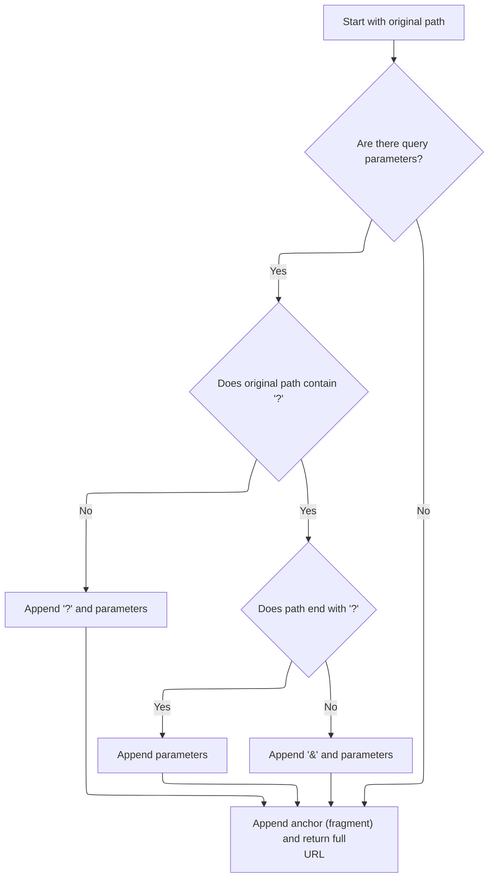

This document describes how a summary string is generated for a redirect, combining its original path, parameters, and anchor. The summary is used for logging and debugging, providing a clear view of the redirect's behavior.

# Building the Redirect Description

<SwmSnippet path="/core/src/main/java/org/apache/struts/action/ActionRedirect.java" line="340">

---

In <SwmToken path="core/src/main/java/org/apache/struts/action/ActionRedirect.java" pos="340:5:5" line-data="    public String toString() {">`toString`</SwmToken>, we're starting to build a string that summarizes the redirect, and we immediately pull in the original path using <SwmToken path="core/src/main/java/org/apache/struts/action/ActionRedirect.java" pos="344:13:13" line-data="        result.append(&quot;originalPath=&quot;).append(getOriginalPath()).append(&quot;;&quot;);">`getOriginalPath`</SwmToken>. This sets up the context for what this redirect is actually targeting, before we add any parameters or anchors.

```java
    public String toString() {
        StringBuffer result = new StringBuffer(DEFAULT_BUFFER_SIZE);

        result.append("ActionRedirect [");
        result.append("originalPath=").append(getOriginalPath()).append(";");
```

---

</SwmSnippet>

## Retrieving the Base Path

<SwmSnippet path="/core/src/main/java/org/apache/struts/action/ActionRedirect.java" line="220">

---

<SwmToken path="core/src/main/java/org/apache/struts/action/ActionRedirect.java" pos="220:5:5" line-data="    public String getOriginalPath() {">`getOriginalPath`</SwmToken> just hands off to the superclass's <SwmToken path="core/src/main/java/org/apache/struts/action/ActionRedirect.java" pos="221:5:5" line-data="        return super.getPath();">`getPath`</SwmToken>, so it's basically a passthrough. We call <SwmToken path="core/src/main/java/org/apache/struts/action/ActionRedirect.java" pos="221:5:5" line-data="        return super.getPath();">`getPath`</SwmToken> next because that's where any logic for resolving the actual path lives, and it keeps things open for overrides.

```java
    public String getOriginalPath() {
        return super.getPath();
    }
```

---

</SwmSnippet>

## Composing the Full Redirect Path

<SwmSnippet path="/core/src/main/java/org/apache/struts/action/ActionRedirect.java" line="230">

---

In <SwmToken path="core/src/main/java/org/apache/struts/action/ActionRedirect.java" pos="230:5:5" line-data="    public String getPath() {">`getPath`</SwmToken>, we grab the original path again to use as the base for building the final redirect URL. We need to call <SwmToken path="core/src/main/java/org/apache/struts/action/ActionRedirect.java" pos="232:7:7" line-data="        String originalPath = getOriginalPath();">`getOriginalPath`</SwmToken> here to make sure we're always starting from the right place, especially if subclasses change the path logic.

```java
    public String getPath() {
        // get the original path and the parameter string that was formed
        String originalPath = getOriginalPath();
```

---

</SwmSnippet>

<SwmSnippet path="/core/src/main/java/org/apache/struts/action/ActionRedirect.java" line="233">

---

Back in <SwmToken path="core/src/main/java/org/apache/struts/action/ActionRedirect.java" pos="221:5:5" line-data="        return super.getPath();">`getPath`</SwmToken>, after getting the original path, we immediately pull the parameter string. This is so we can decide if and how to append parameters to the base path, depending on what's present.

```java
        String parameterString = getParameterString();
```

---

</SwmSnippet>

### Building the Query String

```mermaid
%%{init: {"flowchart": {"defaultRenderer": "elk"}} }%%
flowchart TD
    node1["Start building parameter string for URL"] --> node2["For each parameter"]
    click node1 openCode "core/src/main/java/org/apache/struts/action/ActionRedirect.java:295:296"
    click node2 openCode "core/src/main/java/org/apache/struts/action/ActionRedirect.java:299:327"
    subgraph loop1["For each parameter"]
        node2 --> node3{"Is value single or multiple?"}
        click node3 openCode "core/src/main/java/org/apache/struts/action/ActionRedirect.java:308:322"
        node3 -->|"Single value"| node4["Append parameter name and value to query
string"]
        click node4 openCode "core/src/main/java/org/apache/struts/action/ActionRedirect.java:310:310"
        node3 -->|"Multiple values"| node5["For each value"]
        click node5 openCode "core/src/main/java/org/apache/struts/action/ActionRedirect.java:315:321"
        subgraph loop2["For each value"]
            node5 --> node6["Append parameter name and value to query
string"]
            click node6 openCode "core/src/main/java/org/apache/struts/action/ActionRedirect.java:316:316"
            node6 --> node7{"More values?"}
            click node7 openCode "core/src/main/java/org/apache/struts/action/ActionRedirect.java:318:320"
            node7 -->|"Yes"| node8["Append '&' separator between values"]
            click node8 openCode "core/src/main/java/org/apache/struts/action/ActionRedirect.java:319:319"
            node7 -->|"No"| node10{"More parameters?"}
            click node10 openCode "core/src/main/java/org/apache/struts/action/ActionRedirect.java:324:326"
        end
        node4 --> node10
        node10 -->|"Yes"| node11["Append '&' separator between parameters"]
        click node11 openCode "core/src/main/java/org/apache/struts/action/ActionRedirect.java:325:325"
        node10 -->|"No"| node12["Return complete query string"]
        click node12 openCode "core/src/main/java/org/apache/struts/action/ActionRedirect.java:329:330"
    end
classDef HeadingStyle fill:#777777,stroke:#333,stroke-width:2px;

%% Swimm:
%% %%{init: {"flowchart": {"defaultRenderer": "elk"}} }%%
%% flowchart TD
%%     node1["Start building parameter string for URL"] --> node2["For each parameter"]
%%     click node1 openCode "<SwmPath>[core/…/action/ActionRedirect.java](core/src/main/java/org/apache/struts/action/ActionRedirect.java)</SwmPath>:295:296"
%%     click node2 openCode "<SwmPath>[core/…/action/ActionRedirect.java](core/src/main/java/org/apache/struts/action/ActionRedirect.java)</SwmPath>:299:327"
%%     subgraph loop1["For each parameter"]
%%         node2 --> node3{"Is value single or multiple?"}
%%         click node3 openCode "<SwmPath>[core/…/action/ActionRedirect.java](core/src/main/java/org/apache/struts/action/ActionRedirect.java)</SwmPath>:308:322"
%%         node3 -->|"Single value"| node4["Append parameter name and value to query
%% string"]
%%         click node4 openCode "<SwmPath>[core/…/action/ActionRedirect.java](core/src/main/java/org/apache/struts/action/ActionRedirect.java)</SwmPath>:310:310"
%%         node3 -->|"Multiple values"| node5["For each value"]
%%         click node5 openCode "<SwmPath>[core/…/action/ActionRedirect.java](core/src/main/java/org/apache/struts/action/ActionRedirect.java)</SwmPath>:315:321"
%%         subgraph loop2["For each value"]
%%             node5 --> node6["Append parameter name and value to query
%% string"]
%%             click node6 openCode "<SwmPath>[core/…/action/ActionRedirect.java](core/src/main/java/org/apache/struts/action/ActionRedirect.java)</SwmPath>:316:316"
%%             node6 --> node7{"More values?"}
%%             click node7 openCode "<SwmPath>[core/…/action/ActionRedirect.java](core/src/main/java/org/apache/struts/action/ActionRedirect.java)</SwmPath>:318:320"
%%             node7 -->|"Yes"| node8["Append '&' separator between values"]
%%             click node8 openCode "<SwmPath>[core/…/action/ActionRedirect.java](core/src/main/java/org/apache/struts/action/ActionRedirect.java)</SwmPath>:319:319"
%%             node7 -->|"No"| node10{"More parameters?"}
%%             click node10 openCode "<SwmPath>[core/…/action/ActionRedirect.java](core/src/main/java/org/apache/struts/action/ActionRedirect.java)</SwmPath>:324:326"
%%         end
%%         node4 --> node10
%%         node10 -->|"Yes"| node11["Append '&' separator between parameters"]
%%         click node11 openCode "<SwmPath>[core/…/action/ActionRedirect.java](core/src/main/java/org/apache/struts/action/ActionRedirect.java)</SwmPath>:325:325"
%%         node10 -->|"No"| node12["Return complete query string"]
%%         click node12 openCode "<SwmPath>[core/…/action/ActionRedirect.java](core/src/main/java/org/apache/struts/action/ActionRedirect.java)</SwmPath>:329:330"
%%     end
%% classDef HeadingStyle fill:#777777,stroke:#333,stroke-width:2px;
```



<SwmSnippet path="/core/src/main/java/org/apache/struts/action/ActionRedirect.java" line="295">

---

In <SwmToken path="core/src/main/java/org/apache/struts/action/ActionRedirect.java" pos="295:5:5" line-data="    public String getParameterString() {">`getParameterString`</SwmToken>, we loop through all parameters and build up the query string. If a value is a String, we append it directly; if it's a String\[\], we append each value separately. The function expects all values to be either String or String\[\], and doesn't check for nulls or other types.

```java
    public String getParameterString() {
        StringBuffer strParam = new StringBuffer(DEFAULT_BUFFER_SIZE);

        // loop through all parameters
        Iterator iterator = parameterValues.keySet().iterator();

        while (iterator.hasNext()) {
            // get the parameter name
            String paramName = (String) iterator.next();

            // get the value for this parameter
            Object value = parameterValues.get(paramName);

            if (value instanceof String) {
                // just one value for this param
                strParam.append(paramName).append("=").append(value);
            } else if (value instanceof String[]) {
                // loop through all values for this param
                String[] values = (String[]) value;

                for (int i = 0; i < values.length; i++) {
                    strParam.append(paramName).append("=").append(values[i]);

                    if (i < (values.length - 1)) {
                        strParam.append("&");
                    }
                }
            }

            if (iterator.hasNext()) {
                strParam.append("&");
            }
        }
```

---

</SwmSnippet>

<SwmSnippet path="/core/src/main/java/org/apache/struts/action/ActionRedirect.java" line="329">

---

Finally, <SwmToken path="core/src/main/java/org/apache/struts/action/ActionRedirect.java" pos="233:7:7" line-data="        String parameterString = getParameterString();">`getParameterString`</SwmToken> returns the built query string, which is then used by <SwmToken path="core/src/main/java/org/apache/struts/action/ActionRedirect.java" pos="221:5:5" line-data="        return super.getPath();">`getPath`</SwmToken> and <SwmToken path="core/src/main/java/org/apache/struts/action/ActionRedirect.java" pos="329:5:5" line-data="        return strParam.toString();">`toString`</SwmToken> to show what parameters are being sent with the redirect.

```java
        return strParam.toString();
    }
```

---

</SwmSnippet>

### Finalizing the Redirect URL



<SwmSnippet path="/core/src/main/java/org/apache/struts/action/ActionRedirect.java" line="234">

---

Back in <SwmToken path="core/src/main/java/org/apache/struts/action/ActionRedirect.java" pos="221:5:5" line-data="        return super.getPath();">`getPath`</SwmToken>, after getting the parameter string, we figure out if we need a '?' or '&' to append parameters, then add the anchor at the end. The result is the complete redirect URL, ready for use or logging in <SwmToken path="core/src/main/java/org/apache/struts/action/ActionRedirect.java" pos="269:5:5" line-data="        return result.toString();">`toString`</SwmToken>.

```java
        String anchorString = getAnchorString();

        StringBuffer result = new StringBuffer(originalPath);

        if ((parameterString != null) && (parameterString.length() > 0)) {
            // the parameter separator we're going to use
            String paramSeparator = "?";

            // true if we need to use a parameter separator after originalPath
            boolean needsParamSeparator = true;

            // does the original path already have a "?"?
            int paramStartIndex = originalPath.indexOf("?");

            if (paramStartIndex > 0) {
                // did the path end with "?"?
                needsParamSeparator = (paramStartIndex != (originalPath.length()
                    - 1));

                if (needsParamSeparator) {
                    paramSeparator = "&";
                }
            }

            if (needsParamSeparator) {
                result.append(paramSeparator);
            }

            result.append(parameterString);
        }

        // append anchor string (or blank if none was set)
        result.append(anchorString);


        return result.toString();
    }
```

---

</SwmSnippet>

## Appending Parameters and Anchor Info

<SwmSnippet path="/core/src/main/java/org/apache/struts/action/ActionRedirect.java" line="345">

---

Back in <SwmToken path="core/src/main/java/org/apache/struts/action/ActionRedirect.java" pos="269:5:5" line-data="        return result.toString();">`toString`</SwmToken>, after showing the original path, we add the parameter string. This makes it clear what parameters are part of the redirect, which is useful for debugging.

```java
        result.append("parameterString=").append(getParameterString()).append("]");
```

---

</SwmSnippet>

<SwmSnippet path="/core/src/main/java/org/apache/struts/action/ActionRedirect.java" line="346">

---

Finally, in <SwmToken path="core/src/main/java/org/apache/struts/action/ActionRedirect.java" pos="348:5:5" line-data="        return result.toString();">`toString`</SwmToken>, we append the anchor string and close out the description. The result is a full summary of the redirect, including path, parameters, and anchor, mainly for logging or debugging.

```java
        result.append("anchorString=").append(getAnchorString()).append("]");

        return result.toString();
    }
```

---

</SwmSnippet>

&nbsp;

*This is an auto-generated document by Swimm 🌊 and has not yet been verified by a human*

<SwmMeta version="3.0.0" repo-id="Z2l0aHViJTNBJTNBc3RydXRzMSUzQSUzQVN3aW1tLURlbW8=" repo-name="struts1"><sup>Powered by [Swimm](https://app.swimm.io/)</sup></SwmMeta>
