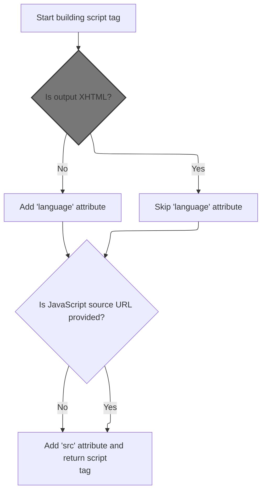

This document explains how the system generates a <script> tag that is compatible with both HTML and XHTML outputs. The process takes the document type and an optional <SwmToken path="faces/src/main/java/org/apache/struts/faces/taglib/JavascriptValidatorTag.java" pos="60:11:11" line-data=" * Custom tag that generates JavaScript for client side validation based">`JavaScript`</SwmToken> source URL as input, and outputs a properly formatted <script> tag.

# Building the <script> Tag Start



<SwmSnippet path="/faces/src/main/java/org/apache/struts/faces/taglib/JavascriptValidatorTag.java" line="704">

---

In <SwmToken path="faces/src/main/java/org/apache/struts/faces/taglib/JavascriptValidatorTag.java" pos="704:5:5" line-data="    private String getStartElement() {">`getStartElement`</SwmToken>, we start building the <script> tag with the type attribute. We then check if the document is XHTML by calling <SwmToken path="faces/src/main/java/org/apache/struts/faces/taglib/JavascriptValidatorTag.java" pos="709:7:9" line-data="        if (!this.isXhtml()) {">`isXhtml()`</SwmToken>, since XHTML doesn't allow the language attribute. If it's not XHTML, we add language=<SwmToken path="faces/src/main/java/org/apache/struts/faces/taglib/JavascriptValidatorTag.java" pos="710:10:12" line-data="            start.append(&quot; language=\&quot;Javascript1.1\&quot;&quot;);">`Javascript1.1`</SwmToken>. This keeps the markup valid for both HTML and XHTML outputs.

```java
    private String getStartElement() {
        StringBuffer start =
          new StringBuffer("<script type=\"text/javascript\"");

        // there is no language attribute in xhtml
        if (!this.isXhtml()) {
            start.append(" language=\"Javascript1.1\"");
        }

```

---

</SwmSnippet>

## Determining Document Type

<SwmSnippet path="/faces/src/main/java/org/apache/struts/faces/taglib/JavascriptValidatorTag.java" line="724">

---

<SwmToken path="faces/src/main/java/org/apache/struts/faces/taglib/JavascriptValidatorTag.java" pos="724:5:5" line-data="    private boolean isXhtml() {">`isXhtml`</SwmToken> just delegates to <SwmToken path="faces/src/main/java/org/apache/struts/faces/taglib/JavascriptValidatorTag.java" pos="725:3:3" line-data="        return TagUtils.getInstance().isXhtml(this.pageContext);">`TagUtils`</SwmToken> to check if the current page context is set to XHTML mode. This keeps the XHTML detection logic centralized and consistent.

```java
    private boolean isXhtml() {
        return TagUtils.getInstance().isXhtml(this.pageContext);
    }
```

---

</SwmSnippet>

## Checking XHTML Mode in Context

<SwmSnippet path="/taglib/src/main/java/org/apache/struts/taglib/TagUtils.java" line="838">

---

<SwmToken path="taglib/src/main/java/org/apache/struts/taglib/TagUtils.java" pos="838:5:5" line-data="    public boolean isXhtml(PageContext pageContext) {">`isXhtml`</SwmToken> in <SwmToken path="faces/src/main/java/org/apache/struts/faces/taglib/JavascriptValidatorTag.java" pos="725:3:3" line-data="        return TagUtils.getInstance().isXhtml(this.pageContext);">`TagUtils`</SwmToken> grabs the XHTML mode flag from the page context using a lookup. If the value is the string "true", we treat the page as XHTML. If the lookup fails, it logs and throws.

```java
    public boolean isXhtml(PageContext pageContext) {
        String xhtml;
        try {
            xhtml = (String) lookup(pageContext, Globals.XHTML_KEY, null);
            return "true".equalsIgnoreCase(xhtml);
        } catch (JspException e) {
            log.error("Failed xhtml lookup", e);
            throw new RuntimeException(e);
        }
    }
```

---

</SwmSnippet>

## Looking Up Context Attributes

<SwmSnippet path="/taglib/src/main/java/org/apache/struts/taglib/TagUtils.java" line="863">

---

<SwmToken path="taglib/src/main/java/org/apache/struts/taglib/TagUtils.java" pos="863:5:5" line-data="    public Object lookup(PageContext pageContext, String name, String scopeName)">`lookup`</SwmToken> fetches an attribute from the page context, either by searching all scopes or a specific one. If a scope name is given, it normalizes it to lowercase and resolves it to an int using <SwmToken path="taglib/src/main/java/org/apache/struts/taglib/TagUtils.java" pos="870:12:12" line-data="            return pageContext.getAttribute(name, instance.getScope(scopeName));">`getScope`</SwmToken>. If the scope is invalid, it throws.

```java
    public Object lookup(PageContext pageContext, String name, String scopeName)
        throws JspException {
        if (scopeName == null) {
            return pageContext.findAttribute(name);
        }

        try {
            return pageContext.getAttribute(name, instance.getScope(scopeName));
        } catch (JspException e) {
            saveException(pageContext, e);
            throw e;
        }
    }
```

---

</SwmSnippet>

## Resolving Scope Names

<SwmSnippet path="/taglib/src/main/java/org/apache/struts/taglib/TagUtils.java" line="809">

---

<SwmToken path="taglib/src/main/java/org/apache/struts/taglib/TagUtils.java" pos="809:5:5" line-data="    public int getScope(String scopeName)">`getScope`</SwmToken> lowercases the scope name and looks it up in the scopes map. If it's missing, it throws a <SwmToken path="taglib/src/main/java/org/apache/struts/taglib/TagUtils.java" pos="810:3:3" line-data="        throws JspException {">`JspException`</SwmToken> with a message from <SwmToken path="faces/src/main/java/org/apache/struts/faces/taglib/JavascriptValidatorTag.java" pos="54:10:10" line-data="import org.apache.struts.util.MessageResources;">`MessageResources`</SwmToken>. Otherwise, it returns the int value for the scope.

```java
    public int getScope(String scopeName)
        throws JspException {
        Integer scope = (Integer) scopes.get(scopeName.toLowerCase());

        if (scope == null) {
            throw new JspException(messages.getMessage("lookup.scope", scope));
        }

        return scope.intValue();
    }
```

---

</SwmSnippet>

<SwmSnippet path="/core/src/main/java/org/apache/struts/util/MessageResources.java" line="218">

---

<SwmToken path="core/src/main/java/org/apache/struts/util/MessageResources.java" pos="218:5:5" line-data="    public String getMessage(String key, Object arg0) {">`getMessage`</SwmToken> fetches a formatted message string, possibly localized, using the provided key and argument. This is used for error reporting in <SwmToken path="taglib/src/main/java/org/apache/struts/taglib/TagUtils.java" pos="809:5:5" line-data="    public int getScope(String scopeName)">`getScope`</SwmToken>.

```java
    public String getMessage(String key, Object arg0) {
        return this.getMessage((Locale) null, key, arg0);
    }
```

---

</SwmSnippet>

## Finalizing the <script> Tag

<SwmSnippet path="/faces/src/main/java/org/apache/struts/faces/taglib/JavascriptValidatorTag.java" line="713">

---

Back in <SwmToken path="faces/src/main/java/org/apache/struts/faces/taglib/JavascriptValidatorTag.java" pos="704:5:5" line-data="    private String getStartElement() {">`getStartElement`</SwmToken>, after checking XHTML, we add the src attribute if it's set, then close the <script> tag and return the result. The src value is used as-is, so it needs to be trusted or validated elsewhere.

```java
        if (this.src != null) {
            start.append(" src=\"" + src + "\"");
        }

        start.append("> \n");
        return start.toString();
    }
```

---

</SwmSnippet>

&nbsp;

*This is an* <SwmToken path="faces/src/main/java/org/apache/struts/faces/taglib/JavascriptValidatorTag.java" pos="186:5:7" line-data="     * the auto-generated method name based on the key (form name)">`auto-generated`</SwmToken> *document by Swimm 🌊 and has not yet been verified by a human*

<SwmMeta version="3.0.0" repo-id="Z2l0aHViJTNBJTNBc3RydXRzMSUzQSUzQVN3aW1tLURlbW8=" repo-name="struts1"><sup>Powered by [Swimm](https://app.swimm.io/)</sup></SwmMeta>
