This document outlines how <SwmToken path="taglib/src/main/java/org/apache/struts/taglib/html/JavascriptValidatorTag.java" pos="55:11:11" line-data=" * Custom tag that generates JavaScript for client side validation based on">`JavaScript`</SwmToken> validation code is generated and added to web pages for client-side form validation. The process adapts validation logic to the user's locale and form configuration, ensuring users receive immediate, localized feedback when filling out forms.

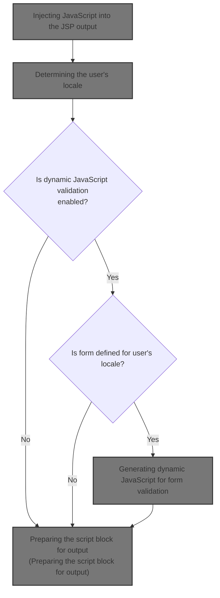

# Injecting <SwmToken path="taglib/src/main/java/org/apache/struts/taglib/html/JavascriptValidatorTag.java" pos="55:11:11" line-data=" * Custom tag that generates JavaScript for client side validation based on">`JavaScript`</SwmToken> into the JSP output

<SwmSnippet path="/taglib/src/main/java/org/apache/struts/taglib/html/JavascriptValidatorTag.java" line="345">

---

<SwmToken path="taglib/src/main/java/org/apache/struts/taglib/html/JavascriptValidatorTag.java" pos="345:5:5" line-data="    public int doStartTag() throws JspException {">`doStartTag`</SwmToken> writes the generated <SwmToken path="taglib/src/main/java/org/apache/struts/taglib/html/JavascriptValidatorTag.java" pos="55:11:11" line-data=" * Custom tag that generates JavaScript for client side validation based on">`JavaScript`</SwmToken> directly to the JSP output stream by calling <SwmToken path="taglib/src/main/java/org/apache/struts/taglib/html/JavascriptValidatorTag.java" pos="349:7:7" line-data="            writer.print(this.renderJavascript());">`renderJavascript`</SwmToken>. This ensures the validation script is sent to the client as part of the page. We call <SwmToken path="taglib/src/main/java/org/apache/struts/taglib/html/JavascriptValidatorTag.java" pos="349:7:7" line-data="            writer.print(this.renderJavascript());">`renderJavascript`</SwmToken> next because that's where the actual script is built.

```java
    public int doStartTag() throws JspException {
        JspWriter writer = pageContext.getOut();

        try {
            writer.print(this.renderJavascript());
        } catch (IOException e) {
            throw new JspException(e.getMessage(), e);
        }

        return EVAL_BODY_TAG;
    }
```

---

</SwmSnippet>

# Building the <SwmToken path="taglib/src/main/java/org/apache/struts/taglib/html/JavascriptValidatorTag.java" pos="55:11:11" line-data=" * Custom tag that generates JavaScript for client side validation based on">`JavaScript`</SwmToken> validation code

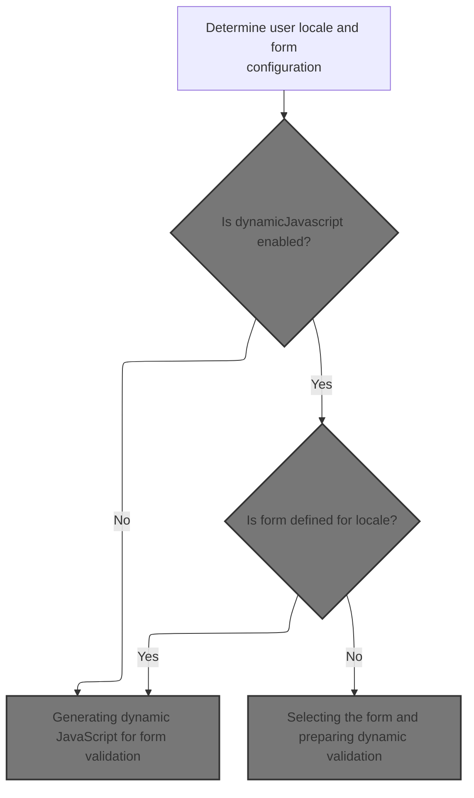

<SwmSnippet path="/taglib/src/main/java/org/apache/struts/taglib/html/JavascriptValidatorTag.java" line="362">

---

In <SwmToken path="taglib/src/main/java/org/apache/struts/taglib/html/JavascriptValidatorTag.java" pos="362:5:5" line-data="    protected String renderJavascript()">`renderJavascript`</SwmToken>, we grab the <SwmToken path="taglib/src/main/java/org/apache/struts/taglib/html/JavascriptValidatorTag.java" pos="368:1:1" line-data="        ValidatorResources resources =">`ValidatorResources`</SwmToken> from the application scope using a key based on the module config. We need to call ComponentContext.getAttribute next because attribute retrieval may depend on custom scope handling, which affects how we access shared resources.

```java
    protected String renderJavascript()
        throws JspException {
        StringBuffer results = new StringBuffer();

        ModuleConfig config =
            TagUtils.getInstance().getModuleConfig(pageContext);
        ValidatorResources resources =
            (ValidatorResources) pageContext.getAttribute(
              ValidatorPlugIn.VALIDATOR_KEY
                + config.getPrefix(), PageContext.APPLICATION_SCOPE);

```

---

</SwmSnippet>

<SwmSnippet path="/tiles/src/main/java/org/apache/struts/tiles/ComponentContext.java" line="169">

---

<SwmToken path="tiles/src/main/java/org/apache/struts/tiles/ComponentContext.java" pos="169:5:5" line-data="    public Object getAttribute(">`getAttribute`</SwmToken> checks if the scope is <SwmToken path="tiles/src/main/java/org/apache/struts/tiles/ComponentContext.java" pos="174:10:10" line-data="        if (scope == ComponentConstants.COMPONENT_SCOPE){">`COMPONENT_SCOPE`</SwmToken> and uses a custom retrieval method for that case. Otherwise, it falls back to the standard page context attribute lookup. This lets the tag access resources from either a shared component context or the usual JSP scopes.

```java
    public Object getAttribute(
        String beanName,
        int scope,
        PageContext pageContext) {

        if (scope == ComponentConstants.COMPONENT_SCOPE){
            return getAttribute(beanName);
        }

        return pageContext.getAttribute(beanName, scope);
    }
```

---

</SwmSnippet>

<SwmSnippet path="/taglib/src/main/java/org/apache/struts/taglib/html/JavascriptValidatorTag.java" line="373">

---

Back in <SwmToken path="taglib/src/main/java/org/apache/struts/taglib/html/JavascriptValidatorTag.java" pos="349:7:7" line-data="            writer.print(this.renderJavascript());">`renderJavascript`</SwmToken>, after getting <SwmToken path="taglib/src/main/java/org/apache/struts/taglib/html/JavascriptValidatorTag.java" pos="375:2:2" line-data="                &quot;ValidatorResources not found in application scope under key \&quot;&quot;">`ValidatorResources`</SwmToken>, we check if it's null and throw an exception if so. Next, we call TagUtils.getUserLocale to fetch the user's locale, which is needed for localized validation messages.

```java
        if (resources == null) {
            throw new JspException(
                "ValidatorResources not found in application scope under key \""
                + ValidatorPlugIn.VALIDATOR_KEY + config.getPrefix() + "\"");
        }

        Locale locale =
            TagUtils.getInstance().getUserLocale(this.pageContext, null);

```

---

</SwmSnippet>

## Determining the user's locale

<SwmSnippet path="/taglib/src/main/java/org/apache/struts/taglib/TagUtils.java" line="830">

---

In <SwmToken path="taglib/src/main/java/org/apache/struts/taglib/TagUtils.java" pos="830:5:5" line-data="    public Locale getUserLocale(PageContext pageContext, String locale) {">`getUserLocale`</SwmToken>, we grab the user's locale from the request. We need to call <SwmToken path="core/src/main/java/org/apache/struts/chain/contexts/ServletActionContext.java" pos="39:4:4" line-data="public class ServletActionContext extends WebActionContext {">`ServletActionContext`</SwmToken> next because that's where the actual <SwmToken path="taglib/src/main/java/org/apache/struts/taglib/TagUtils.java" pos="831:8:8" line-data="        return RequestUtils.getUserLocale((HttpServletRequest) pageContext">`HttpServletRequest`</SwmToken> is accessed for locale lookup.

```java
    public Locale getUserLocale(PageContext pageContext, String locale) {
        return RequestUtils.getUserLocale((HttpServletRequest) pageContext
            .getRequest(), locale);
```

---

</SwmSnippet>

### Accessing the HTTP request context

<SwmSnippet path="/core/src/main/java/org/apache/struts/chain/contexts/ServletActionContext.java" line="94">

---

<SwmToken path="core/src/main/java/org/apache/struts/chain/contexts/ServletActionContext.java" pos="94:5:5" line-data="    public HttpServletRequest getRequest() {">`getRequest`</SwmToken> just returns the <SwmToken path="core/src/main/java/org/apache/struts/chain/contexts/ServletActionContext.java" pos="94:3:3" line-data="    public HttpServletRequest getRequest() {">`HttpServletRequest`</SwmToken> from <SwmToken path="core/src/main/java/org/apache/struts/chain/contexts/ServletActionContext.java" pos="95:3:3" line-data="        return servletWebContext().getRequest();">`servletWebContext`</SwmToken>. We need to call <SwmToken path="core/src/main/java/org/apache/struts/chain/contexts/ServletActionContext.java" pos="95:3:3" line-data="        return servletWebContext().getRequest();">`servletWebContext`</SwmToken> next because that's where the base context is cast to the right type for request access.

```java
    public HttpServletRequest getRequest() {
        return servletWebContext().getRequest();
    }
```

---

</SwmSnippet>

<SwmSnippet path="/core/src/main/java/org/apache/struts/chain/contexts/ServletActionContext.java" line="67">

---

<SwmToken path="core/src/main/java/org/apache/struts/chain/contexts/ServletActionContext.java" pos="67:5:5" line-data="    protected ServletWebContext servletWebContext() {">`servletWebContext`</SwmToken> just casts the base context to <SwmToken path="core/src/main/java/org/apache/struts/chain/contexts/ServletActionContext.java" pos="67:3:3" line-data="    protected ServletWebContext servletWebContext() {">`ServletWebContext`</SwmToken>. There's no type check, so it assumes the framework always provides the right context type.

```java
    protected ServletWebContext servletWebContext() {
        return (ServletWebContext) this.getBaseContext();
    }
```

---

</SwmSnippet>

### Resolving the user's locale from session or request

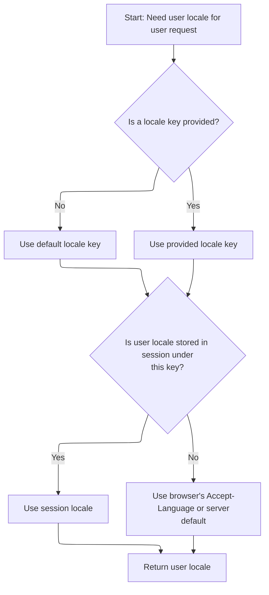

<SwmSnippet path="/taglib/src/main/java/org/apache/struts/taglib/TagUtils.java" line="831">

---

Just returned from <SwmToken path="core/src/main/java/org/apache/struts/chain/contexts/ServletActionContext.java" pos="39:4:4" line-data="public class ServletActionContext extends WebActionContext {">`ServletActionContext`</SwmToken>, and now TagUtils.getUserLocale calls <SwmToken path="taglib/src/main/java/org/apache/struts/taglib/TagUtils.java" pos="831:3:5" line-data="        return RequestUtils.getUserLocale((HttpServletRequest) pageContext">`RequestUtils.getUserLocale`</SwmToken> to actually resolve the locale from session or request. This ensures we get the user's preferred language for validation messages.

```java
        return RequestUtils.getUserLocale((HttpServletRequest) pageContext
            .getRequest(), locale);
    }
```

---

</SwmSnippet>

<SwmSnippet path="/core/src/main/java/org/apache/struts/util/RequestUtils.java" line="299">

---

<SwmToken path="core/src/main/java/org/apache/struts/util/RequestUtils.java" pos="299:7:7" line-data="    public static Locale getUserLocale(HttpServletRequest request, String locale) {">`getUserLocale`</SwmToken> checks the session for a Locale object using the locale key, and falls back to the request's locale if not found. It assumes the session attribute is always a Locale, which could cause issues if it's not.

```java
    public static Locale getUserLocale(HttpServletRequest request, String locale) {
        Locale userLocale = null;
        HttpSession session = request.getSession(false);

        if (locale == null) {
            locale = Globals.LOCALE_KEY;
        }

        // Only check session if sessions are enabled
        if (session != null) {
            userLocale = (Locale) session.getAttribute(locale);
        }

        if (userLocale == null) {
            // Returns Locale based on Accept-Language header or the server default
            userLocale = request.getLocale();
        }

        return userLocale;
    }
```

---

</SwmSnippet>

## Selecting the form and preparing dynamic validation

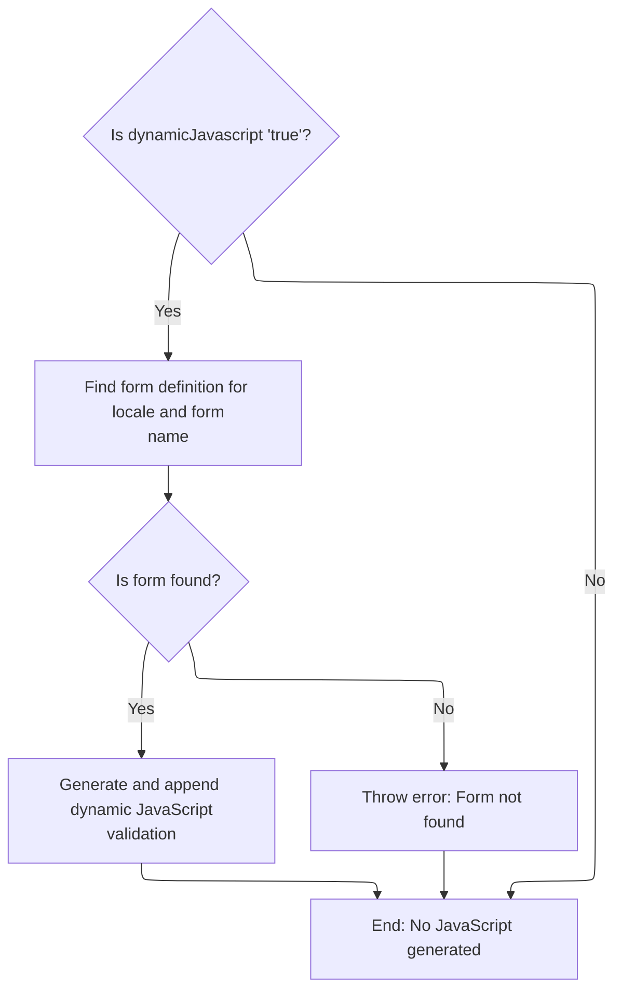

<SwmSnippet path="/taglib/src/main/java/org/apache/struts/taglib/html/JavascriptValidatorTag.java" line="382">

---

Just returned from <SwmToken path="taglib/src/main/java/org/apache/struts/taglib/html/JavascriptValidatorTag.java" pos="367:1:1" line-data="            TagUtils.getInstance().getModuleConfig(pageContext);">`TagUtils`</SwmToken>, and now in <SwmToken path="taglib/src/main/java/org/apache/struts/taglib/html/JavascriptValidatorTag.java" pos="349:7:7" line-data="            writer.print(this.renderJavascript());">`renderJavascript`</SwmToken>, we check if <SwmToken path="taglib/src/main/java/org/apache/struts/taglib/html/JavascriptValidatorTag.java" pos="383:10:10" line-data="        if (&quot;true&quot;.equalsIgnoreCase(dynamicJavascript)) {">`dynamicJavascript`</SwmToken> is enabled and fetch the form definition. If the form exists, we call <SwmToken path="taglib/src/main/java/org/apache/struts/taglib/html/JavascriptValidatorTag.java" pos="396:7:7" line-data="                results.append(this.createDynamicJavascript(config, resources,">`createDynamicJavascript`</SwmToken> to build the validation script for this form.

```java
        Form form = null;
        if ("true".equalsIgnoreCase(dynamicJavascript)) {
            form = resources.getForm(locale, formName);
            if (form == null) {
                throw new JspException("No form found under '" + formName
                    + "' in locale '" + locale
                    + "'.  A form must be defined in the "
                    + "Commons Validator configuration when "
                    + "dynamicJavascript=\"true\" is set.");
            }
        }

        if (form != null) {
            if ("true".equalsIgnoreCase(dynamicJavascript)) {
                results.append(this.createDynamicJavascript(config, resources,
                        locale, form));
```

---

</SwmSnippet>

## Generating dynamic <SwmToken path="taglib/src/main/java/org/apache/struts/taglib/html/JavascriptValidatorTag.java" pos="55:11:11" line-data=" * Custom tag that generates JavaScript for client side validation based on">`JavaScript`</SwmToken> for form validation

```mermaid
%%{init: {"flowchart": {"defaultRenderer": "elk"}} }%%
flowchart TD
    node1["Start: Prepare JavaScript validation
generation"] --> node2["Fetching localized message resources"]
    click node1 openCode "taglib/src/main/java/org/apache/struts/taglib/html/JavascriptValidatorTag.java:428:435"
    
    node2 --> node3["Collecting validation actions for the form"]
    
    node3 --> node4{"Should validation stop on first error?"}
    click node4 openCode "taglib/src/main/java/org/apache/struts/taglib/html/JavascriptValidatorTag.java:629:641"
    node4 --> node5{"Does form name require mapping?"}
    click node5 openCode "taglib/src/main/java/org/apache/struts/taglib/html/JavascriptValidatorTag.java:450:454"
    node5 -->|"Yes"| node6["Locating the action mapping for the form"]
    
    node5 -->|"No"| node7["Use form name as is"]
    click node7 openCode "taglib/src/main/java/org/apache/struts/taglib/html/JavascriptValidatorTag.java:466:467"
    node6 --> node8["Starting the JavaScript validation block"]
    node7 --> node8
    
    node8 --> node9["For each validation action"]

    subgraph loop1["For each validation action"]
      node9 --> node10["For each relevant field"]
      
      subgraph loop2["For each relevant field"]
        node10 --> node11["Retrieving localized validation messages"]
        
        node11 --> node12["Escaping quotes in validation messages"]
        
        node12 --> node13["For each variable in field"]
        
        subgraph loop3["For each variable in field"]
          node13 --> node14{"Is variable a special 'field' variable?"}
          click node14 openCode "taglib/src/main/java/org/apache/struts/taglib/html/JavascriptValidatorTag.java:524:526"
          node14 -->|"Yes"| node13
          node14 -->|"No"| node15["Resolving variable values for validation"]
          
          node15 --> node16{"Variable type?"}
          click node16 openCode "taglib/src/main/java/org/apache/struts/taglib/html/JavascriptValidatorTag.java:530:548"
          node16 -->|"int"| node17["Generate JS assignment for integer"]
          click node17 openCode "taglib/src/main/java/org/apache/struts/taglib/html/JavascriptValidatorTag.java:531:533"
          node16 -->|"regexp"| node18["Generate JS assignment for regexp"]
          click node18 openCode "taglib/src/main/java/org/apache/struts/taglib/html/JavascriptValidatorTag.java:534:535"
          node16 -->|"string"| node19["Generate JS assignment for string"]
          click node19 openCode "taglib/src/main/java/org/apache/struts/taglib/html/JavascriptValidatorTag.java:536:538"
          node16 -->|"mask"| node20["Generate JS assignment for mask"]
          click node20 openCode "taglib/src/main/java/org/apache/struts/taglib/html/JavascriptValidatorTag.java:543:544"
          node16 -->|"other"| node21["Generate JS assignment for other type"]
          click node21 openCode "taglib/src/main/java/org/apache/struts/taglib/html/JavascriptValidatorTag.java:546:547"
        end
      end
    end
    node9 --> node22["Return generated JavaScript validation
code"]
    click node22 openCode "taglib/src/main/java/org/apache/struts/taglib/html/JavascriptValidatorTag.java:557:558"

classDef HeadingStyle fill:#777777,stroke:#333,stroke-width:2px;
click node2 goToHeading "Fetching localized message resources"
node2:::HeadingStyle
click node3 goToHeading "Collecting validation actions for the form"
node3:::HeadingStyle
click node6 goToHeading "Locating the action mapping for the form"
node6:::HeadingStyle
click node8 goToHeading "Starting the JavaScript validation block"
node8:::HeadingStyle
click node11 goToHeading "Retrieving localized validation messages"
node11:::HeadingStyle
click node12 goToHeading "Escaping quotes in validation messages"
node12:::HeadingStyle
click node15 goToHeading "Resolving variable values for validation"
node15:::HeadingStyle

%% Swimm:
%% %%{init: {"flowchart": {"defaultRenderer": "elk"}} }%%
%% flowchart TD
%%     node1["Start: Prepare <SwmToken path="taglib/src/main/java/org/apache/struts/taglib/html/JavascriptValidatorTag.java" pos="55:11:11" line-data=" * Custom tag that generates JavaScript for client side validation based on">`JavaScript`</SwmToken> validation
%% generation"] --> node2["Fetching localized message resources"]
%%     click node1 openCode "<SwmPath>[taglib/…/html/JavascriptValidatorTag.java](taglib/src/main/java/org/apache/struts/taglib/html/JavascriptValidatorTag.java)</SwmPath>:428:435"
%%     
%%     node2 --> node3["Collecting validation actions for the form"]
%%     
%%     node3 --> node4{"Should validation stop on first error?"}
%%     click node4 openCode "<SwmPath>[taglib/…/html/JavascriptValidatorTag.java](taglib/src/main/java/org/apache/struts/taglib/html/JavascriptValidatorTag.java)</SwmPath>:629:641"
%%     node4 --> node5{"Does form name require mapping?"}
%%     click node5 openCode "<SwmPath>[taglib/…/html/JavascriptValidatorTag.java](taglib/src/main/java/org/apache/struts/taglib/html/JavascriptValidatorTag.java)</SwmPath>:450:454"
%%     node5 -->|"Yes"| node6["Locating the action mapping for the form"]
%%     
%%     node5 -->|"No"| node7["Use form name as is"]
%%     click node7 openCode "<SwmPath>[taglib/…/html/JavascriptValidatorTag.java](taglib/src/main/java/org/apache/struts/taglib/html/JavascriptValidatorTag.java)</SwmPath>:466:467"
%%     node6 --> node8["Starting the <SwmToken path="taglib/src/main/java/org/apache/struts/taglib/html/JavascriptValidatorTag.java" pos="55:11:11" line-data=" * Custom tag that generates JavaScript for client side validation based on">`JavaScript`</SwmToken> validation block"]
%%     node7 --> node8
%%     
%%     node8 --> node9["For each validation action"]
%% 
%%     subgraph loop1["For each validation action"]
%%       node9 --> node10["For each relevant field"]
%%       
%%       subgraph loop2["For each relevant field"]
%%         node10 --> node11["Retrieving localized validation messages"]
%%         
%%         node11 --> node12["Escaping quotes in validation messages"]
%%         
%%         node12 --> node13["For each variable in field"]
%%         
%%         subgraph loop3["For each variable in field"]
%%           node13 --> node14{"Is variable a special 'field' variable?"}
%%           click node14 openCode "<SwmPath>[taglib/…/html/JavascriptValidatorTag.java](taglib/src/main/java/org/apache/struts/taglib/html/JavascriptValidatorTag.java)</SwmPath>:524:526"
%%           node14 -->|"Yes"| node13
%%           node14 -->|"No"| node15["Resolving variable values for validation"]
%%           
%%           node15 --> node16{"Variable type?"}
%%           click node16 openCode "<SwmPath>[taglib/…/html/JavascriptValidatorTag.java](taglib/src/main/java/org/apache/struts/taglib/html/JavascriptValidatorTag.java)</SwmPath>:530:548"
%%           node16 -->|"int"| node17["Generate JS assignment for integer"]
%%           click node17 openCode "<SwmPath>[taglib/…/html/JavascriptValidatorTag.java](taglib/src/main/java/org/apache/struts/taglib/html/JavascriptValidatorTag.java)</SwmPath>:531:533"
%%           node16 -->|"regexp"| node18["Generate JS assignment for regexp"]
%%           click node18 openCode "<SwmPath>[taglib/…/html/JavascriptValidatorTag.java](taglib/src/main/java/org/apache/struts/taglib/html/JavascriptValidatorTag.java)</SwmPath>:534:535"
%%           node16 -->|"string"| node19["Generate JS assignment for string"]
%%           click node19 openCode "<SwmPath>[taglib/…/html/JavascriptValidatorTag.java](taglib/src/main/java/org/apache/struts/taglib/html/JavascriptValidatorTag.java)</SwmPath>:536:538"
%%           node16 -->|"mask"| node20["Generate JS assignment for mask"]
%%           click node20 openCode "<SwmPath>[taglib/…/html/JavascriptValidatorTag.java](taglib/src/main/java/org/apache/struts/taglib/html/JavascriptValidatorTag.java)</SwmPath>:543:544"
%%           node16 -->|"other"| node21["Generate JS assignment for other type"]
%%           click node21 openCode "<SwmPath>[taglib/…/html/JavascriptValidatorTag.java](taglib/src/main/java/org/apache/struts/taglib/html/JavascriptValidatorTag.java)</SwmPath>:546:547"
%%         end
%%       end
%%     end
%%     node9 --> node22["Return generated <SwmToken path="taglib/src/main/java/org/apache/struts/taglib/html/JavascriptValidatorTag.java" pos="55:11:11" line-data=" * Custom tag that generates JavaScript for client side validation based on">`JavaScript`</SwmToken> validation
%% code"]
%%     click node22 openCode "<SwmPath>[taglib/…/html/JavascriptValidatorTag.java](taglib/src/main/java/org/apache/struts/taglib/html/JavascriptValidatorTag.java)</SwmPath>:557:558"
%% 
%% classDef HeadingStyle fill:#777777,stroke:#333,stroke-width:2px;
%% click node2 goToHeading "Fetching localized message resources"
%% node2:::HeadingStyle
%% click node3 goToHeading "Collecting validation actions for the form"
%% node3:::HeadingStyle
%% click node6 goToHeading "Locating the action mapping for the form"
%% node6:::HeadingStyle
%% click node8 goToHeading "Starting the <SwmToken path="taglib/src/main/java/org/apache/struts/taglib/html/JavascriptValidatorTag.java" pos="55:11:11" line-data=" * Custom tag that generates JavaScript for client side validation based on">`JavaScript`</SwmToken> validation block"
%% node8:::HeadingStyle
%% click node11 goToHeading "Retrieving localized validation messages"
%% node11:::HeadingStyle
%% click node12 goToHeading "Escaping quotes in validation messages"
%% node12:::HeadingStyle
%% click node15 goToHeading "Resolving variable values for validation"
%% node15:::HeadingStyle
```

<SwmSnippet path="/taglib/src/main/java/org/apache/struts/taglib/html/JavascriptValidatorTag.java" line="428">

---

In <SwmToken path="taglib/src/main/java/org/apache/struts/taglib/html/JavascriptValidatorTag.java" pos="428:5:5" line-data="    private String createDynamicJavascript(ModuleConfig config,">`createDynamicJavascript`</SwmToken>, we start building the <SwmToken path="taglib/src/main/java/org/apache/struts/taglib/html/JavascriptValidatorTag.java" pos="55:11:11" line-data=" * Custom tag that generates JavaScript for client side validation based on">`JavaScript`</SwmToken> by grabbing message resources and context info. We call TagUtils.retrieveMessageResources next to get localized messages for validation.

```java
    private String createDynamicJavascript(ModuleConfig config,
        ValidatorResources resources, Locale locale, Form form)
        throws JspException {
        StringBuffer results = new StringBuffer();

        MessageResources messages =
            TagUtils.getInstance().retrieveMessageResources(pageContext,
                bundle, true);

```

---

</SwmSnippet>

### Fetching localized message resources

```mermaid
%%{init: {"flowchart": {"defaultRenderer": "elk"}} }%%
flowchart TD
    node1["Start: Retrieve message resources"] --> node2{"Is bundle provided?"}
    click node1 openCode "taglib/src/main/java/org/apache/struts/taglib/TagUtils.java:1118:1123"
    node2 -->|"No"| node3["Use default bundle"]
    click node2 openCode "taglib/src/main/java/org/apache/struts/taglib/TagUtils.java:1123:1125"
    node2 -->|"Yes"| node4["Proceed with provided bundle"]
    click node3 openCode "taglib/src/main/java/org/apache/struts/taglib/TagUtils.java:1123:1125"
    node3 --> node4
    click node4 openCode "taglib/src/main/java/org/apache/struts/taglib/TagUtils.java:1125:1127"
    node4 --> node5{"Check page scope?"}
    node5 -->|"Yes"| node6{"Resource in page scope?"}
    click node5 openCode "taglib/src/main/java/org/apache/struts/taglib/TagUtils.java:1127:1131"
    node5 -->|"No"| node7{"Resource in request scope?"}
    node6 -->|"Yes"| node12["Return resources"]
    click node6 openCode "taglib/src/main/java/org/apache/struts/taglib/TagUtils.java:1128:1131"
    node6 -->|"No"| node7
    click node7 openCode "taglib/src/main/java/org/apache/struts/taglib/TagUtils.java:1133:1137"
    node7 -->|"Yes"| node12
    node7 -->|"No"| node8{"Resource in app scope (with module
prefix)?"}
    click node8 openCode "taglib/src/main/java/org/apache/struts/taglib/TagUtils.java:1139:1145"
    node8 -->|"Yes"| node12
    node8 -->|"No"| node9{"Resource in app scope (no prefix)?"}
    click node9 openCode "taglib/src/main/java/org/apache/struts/taglib/TagUtils.java:1147:1151"
    node9 -->|"Yes"| node12
    node9 -->|"No"| node10["Throw error: Resource not found"]
    click node10 openCode "taglib/src/main/java/org/apache/struts/taglib/TagUtils.java:1153:1159"
    node12["Return resources"]
    click node12 openCode "taglib/src/main/java/org/apache/struts/taglib/TagUtils.java:1161:1162"
classDef HeadingStyle fill:#777777,stroke:#333,stroke-width:2px;

%% Swimm:
%% %%{init: {"flowchart": {"defaultRenderer": "elk"}} }%%
%% flowchart TD
%%     node1["Start: Retrieve message resources"] --> node2{"Is bundle provided?"}
%%     click node1 openCode "<SwmPath>[taglib/…/taglib/TagUtils.java](taglib/src/main/java/org/apache/struts/taglib/TagUtils.java)</SwmPath>:1118:1123"
%%     node2 -->|"No"| node3["Use default bundle"]
%%     click node2 openCode "<SwmPath>[taglib/…/taglib/TagUtils.java](taglib/src/main/java/org/apache/struts/taglib/TagUtils.java)</SwmPath>:1123:1125"
%%     node2 -->|"Yes"| node4["Proceed with provided bundle"]
%%     click node3 openCode "<SwmPath>[taglib/…/taglib/TagUtils.java](taglib/src/main/java/org/apache/struts/taglib/TagUtils.java)</SwmPath>:1123:1125"
%%     node3 --> node4
%%     click node4 openCode "<SwmPath>[taglib/…/taglib/TagUtils.java](taglib/src/main/java/org/apache/struts/taglib/TagUtils.java)</SwmPath>:1125:1127"
%%     node4 --> node5{"Check page scope?"}
%%     node5 -->|"Yes"| node6{"Resource in page scope?"}
%%     click node5 openCode "<SwmPath>[taglib/…/taglib/TagUtils.java](taglib/src/main/java/org/apache/struts/taglib/TagUtils.java)</SwmPath>:1127:1131"
%%     node5 -->|"No"| node7{"Resource in request scope?"}
%%     node6 -->|"Yes"| node12["Return resources"]
%%     click node6 openCode "<SwmPath>[taglib/…/taglib/TagUtils.java](taglib/src/main/java/org/apache/struts/taglib/TagUtils.java)</SwmPath>:1128:1131"
%%     node6 -->|"No"| node7
%%     click node7 openCode "<SwmPath>[taglib/…/taglib/TagUtils.java](taglib/src/main/java/org/apache/struts/taglib/TagUtils.java)</SwmPath>:1133:1137"
%%     node7 -->|"Yes"| node12
%%     node7 -->|"No"| node8{"Resource in app scope (with module
%% prefix)?"}
%%     click node8 openCode "<SwmPath>[taglib/…/taglib/TagUtils.java](taglib/src/main/java/org/apache/struts/taglib/TagUtils.java)</SwmPath>:1139:1145"
%%     node8 -->|"Yes"| node12
%%     node8 -->|"No"| node9{"Resource in app scope (no prefix)?"}
%%     click node9 openCode "<SwmPath>[taglib/…/taglib/TagUtils.java](taglib/src/main/java/org/apache/struts/taglib/TagUtils.java)</SwmPath>:1147:1151"
%%     node9 -->|"Yes"| node12
%%     node9 -->|"No"| node10["Throw error: Resource not found"]
%%     click node10 openCode "<SwmPath>[taglib/…/taglib/TagUtils.java](taglib/src/main/java/org/apache/struts/taglib/TagUtils.java)</SwmPath>:1153:1159"
%%     node12["Return resources"]
%%     click node12 openCode "<SwmPath>[taglib/…/taglib/TagUtils.java](taglib/src/main/java/org/apache/struts/taglib/TagUtils.java)</SwmPath>:1161:1162"
%% classDef HeadingStyle fill:#777777,stroke:#333,stroke-width:2px;
```

<SwmSnippet path="/taglib/src/main/java/org/apache/struts/taglib/TagUtils.java" line="1118">

---

In <SwmToken path="taglib/src/main/java/org/apache/struts/taglib/TagUtils.java" pos="1118:5:5" line-data="    public MessageResources retrieveMessageResources(PageContext pageContext,">`retrieveMessageResources`</SwmToken>, we look for the message bundle in several scopes, starting with page scope. We call <SwmToken path="tiles/src/main/java/org/apache/struts/tiles/ComponentContext.java" pos="39:4:4" line-data="public class ComponentContext implements Serializable {">`ComponentContext`</SwmToken> next because resource retrieval may depend on custom scope handling.

```java
    public MessageResources retrieveMessageResources(PageContext pageContext,
        String bundle, boolean checkPageScope)
        throws JspException {
        MessageResources resources = null;

        if (bundle == null) {
            bundle = Globals.MESSAGES_KEY;
        }

        if (checkPageScope) {
            resources =
                (MessageResources) pageContext.getAttribute(bundle,
                    PageContext.PAGE_SCOPE);
        }

        if (resources == null) {
            resources =
                (MessageResources) pageContext.getAttribute(bundle,
                    PageContext.REQUEST_SCOPE);
        }

        if (resources == null) {
            ModuleConfig moduleConfig = getModuleConfig(pageContext);

            resources =
                (MessageResources) pageContext.getAttribute(bundle
                    + moduleConfig.getPrefix(), PageContext.APPLICATION_SCOPE);
        }

        if (resources == null) {
            resources =
                (MessageResources) pageContext.getAttribute(bundle,
                    PageContext.APPLICATION_SCOPE);
        }

```

---

</SwmSnippet>

<SwmSnippet path="/taglib/src/main/java/org/apache/struts/taglib/TagUtils.java" line="1153">

---

Just returned from <SwmToken path="tiles/src/main/java/org/apache/struts/tiles/ComponentContext.java" pos="39:4:4" line-data="public class ComponentContext implements Serializable {">`ComponentContext`</SwmToken>, and if no message resources are found in any scope, <SwmToken path="taglib/src/main/java/org/apache/struts/taglib/html/JavascriptValidatorTag.java" pos="367:1:1" line-data="            TagUtils.getInstance().getModuleConfig(pageContext);">`TagUtils`</SwmToken> throws an exception and saves it in the page context. This stops the page from rendering broken validation messages.

```java
        if (resources == null) {
            JspException e =
                new JspException(messages.getMessage("message.bundle", bundle));

            saveException(pageContext, e);
            throw e;
        }

        return resources;
    }
```

---

</SwmSnippet>

### Preparing context for <SwmToken path="taglib/src/main/java/org/apache/struts/taglib/html/JavascriptValidatorTag.java" pos="55:11:11" line-data=" * Custom tag that generates JavaScript for client side validation based on">`JavaScript`</SwmToken> generation

<SwmSnippet path="/taglib/src/main/java/org/apache/struts/taglib/html/JavascriptValidatorTag.java" line="437">

---

Just returned from <SwmToken path="taglib/src/main/java/org/apache/struts/taglib/html/JavascriptValidatorTag.java" pos="367:1:1" line-data="            TagUtils.getInstance().getModuleConfig(pageContext);">`TagUtils`</SwmToken>, and now in <SwmToken path="taglib/src/main/java/org/apache/struts/taglib/html/JavascriptValidatorTag.java" pos="396:7:7" line-data="                results.append(this.createDynamicJavascript(config, resources,">`createDynamicJavascript`</SwmToken>, we grab the <SwmToken path="taglib/src/main/java/org/apache/struts/taglib/html/JavascriptValidatorTag.java" pos="437:1:1" line-data="        HttpServletRequest request =">`HttpServletRequest`</SwmToken> and <SwmToken path="taglib/src/main/java/org/apache/struts/taglib/html/JavascriptValidatorTag.java" pos="439:1:1" line-data="        ServletContext application = pageContext.getServletContext();">`ServletContext`</SwmToken> for context. Next, we call <SwmToken path="taglib/src/main/java/org/apache/struts/taglib/html/JavascriptValidatorTag.java" pos="441:9:9" line-data="        List actions = this.createActionList(resources, form);">`createActionList`</SwmToken> to figure out which validation actions to include.

```java
        HttpServletRequest request =
            (HttpServletRequest) pageContext.getRequest();
```

---

</SwmSnippet>

<SwmSnippet path="/taglib/src/main/java/org/apache/struts/taglib/html/JavascriptValidatorTag.java" line="439">

---

Just returned from <SwmToken path="core/src/main/java/org/apache/struts/chain/contexts/ServletActionContext.java" pos="39:4:4" line-data="public class ServletActionContext extends WebActionContext {">`ServletActionContext`</SwmToken>, and now in <SwmToken path="taglib/src/main/java/org/apache/struts/taglib/html/JavascriptValidatorTag.java" pos="396:7:7" line-data="                results.append(this.createDynamicJavascript(config, resources,">`createDynamicJavascript`</SwmToken>, we call <SwmToken path="taglib/src/main/java/org/apache/struts/taglib/html/JavascriptValidatorTag.java" pos="441:9:9" line-data="        List actions = this.createActionList(resources, form);">`createActionList`</SwmToken> to get the list of validation actions for the form. This list drives which <SwmToken path="taglib/src/main/java/org/apache/struts/taglib/html/JavascriptValidatorTag.java" pos="55:11:11" line-data=" * Custom tag that generates JavaScript for client side validation based on">`JavaScript`</SwmToken> validation functions are generated.

```java
        ServletContext application = pageContext.getServletContext();

        List actions = this.createActionList(resources, form);

```

---

</SwmSnippet>

### Collecting validation actions for the form

See <SwmLink doc-title="Generating Validation Actions for Client-Side Form Validation">[Generating Validation Actions for Client-Side Form Validation](/.swm/generating-validation-actions-for-client-side-form-validation.a0vv00qx.sw.md)</SwmLink>

### Configuring error handling for validation

```mermaid
%%{init: {"flowchart": {"defaultRenderer": "elk"}} }%%
flowchart TD
    node1["Determine if validation stops on first
error"] --> node2{"stopOnError?"}
    click node1 openCode "taglib/src/main/java/org/apache/struts/taglib/html/JavascriptValidatorTag.java:629:641"
    node2 -->|"True"| node3["Use '&&' operator for method chain"]
    node2 -->|"False"| node4["Use '&' operator for method chain"]
    click node2 openCode "taglib/src/main/java/org/apache/struts/taglib/html/JavascriptValidatorTag.java:629:641"
    click node3 openCode "taglib/src/main/java/org/apache/struts/taglib/html/JavascriptValidatorTag.java:652:669"
    click node4 openCode "taglib/src/main/java/org/apache/struts/taglib/html/JavascriptValidatorTag.java:652:669"
    
    subgraph loop1["For each validation action"]
        node3 --> node5["Append action method to chain"]
        node4 --> node5
        node5 --> node6["After all actions processed"]
        click node5 openCode "taglib/src/main/java/org/apache/struts/taglib/html/JavascriptValidatorTag.java:652:669"
    end
    node6 --> node7{"Does form name start with '/'"}
    click node6 openCode "taglib/src/main/java/org/apache/struts/taglib/html/JavascriptValidatorTag.java:446:454"
    node7 -->|"Yes"| node8["Map form name to action mapping"]
    node7 -->|"No"| node9["Use form name as is"]
    click node7 openCode "taglib/src/main/java/org/apache/struts/taglib/html/JavascriptValidatorTag.java:450:454"
    click node8 openCode "taglib/src/main/java/org/apache/struts/taglib/html/JavascriptValidatorTag.java:450:454"
    click node9 openCode "taglib/src/main/java/org/apache/struts/taglib/html/JavascriptValidatorTag.java:446:448"
    node8 --> node10["Return dynamic JavaScript validation
logic"]
    node9 --> node10
    click node10 openCode "taglib/src/main/java/org/apache/struts/taglib/html/JavascriptValidatorTag.java:443:447"
classDef HeadingStyle fill:#777777,stroke:#333,stroke-width:2px;

%% Swimm:
%% %%{init: {"flowchart": {"defaultRenderer": "elk"}} }%%
%% flowchart TD
%%     node1["Determine if validation stops on first
%% error"] --> node2{"<SwmToken path="taglib/src/main/java/org/apache/struts/taglib/html/JavascriptValidatorTag.java" pos="444:10:10" line-data="            this.createMethods(actions, this.stopOnError(config));">`stopOnError`</SwmToken>?"}
%%     click node1 openCode "<SwmPath>[taglib/…/html/JavascriptValidatorTag.java](taglib/src/main/java/org/apache/struts/taglib/html/JavascriptValidatorTag.java)</SwmPath>:629:641"
%%     node2 -->|"True"| node3["Use '&&' operator for method chain"]
%%     node2 -->|"False"| node4["Use '&' operator for method chain"]
%%     click node2 openCode "<SwmPath>[taglib/…/html/JavascriptValidatorTag.java](taglib/src/main/java/org/apache/struts/taglib/html/JavascriptValidatorTag.java)</SwmPath>:629:641"
%%     click node3 openCode "<SwmPath>[taglib/…/html/JavascriptValidatorTag.java](taglib/src/main/java/org/apache/struts/taglib/html/JavascriptValidatorTag.java)</SwmPath>:652:669"
%%     click node4 openCode "<SwmPath>[taglib/…/html/JavascriptValidatorTag.java](taglib/src/main/java/org/apache/struts/taglib/html/JavascriptValidatorTag.java)</SwmPath>:652:669"
%%     
%%     subgraph loop1["For each validation action"]
%%         node3 --> node5["Append action method to chain"]
%%         node4 --> node5
%%         node5 --> node6["After all actions processed"]
%%         click node5 openCode "<SwmPath>[taglib/…/html/JavascriptValidatorTag.java](taglib/src/main/java/org/apache/struts/taglib/html/JavascriptValidatorTag.java)</SwmPath>:652:669"
%%     end
%%     node6 --> node7{"Does form name start with '/'"}
%%     click node6 openCode "<SwmPath>[taglib/…/html/JavascriptValidatorTag.java](taglib/src/main/java/org/apache/struts/taglib/html/JavascriptValidatorTag.java)</SwmPath>:446:454"
%%     node7 -->|"Yes"| node8["Map form name to action mapping"]
%%     node7 -->|"No"| node9["Use form name as is"]
%%     click node7 openCode "<SwmPath>[taglib/…/html/JavascriptValidatorTag.java](taglib/src/main/java/org/apache/struts/taglib/html/JavascriptValidatorTag.java)</SwmPath>:450:454"
%%     click node8 openCode "<SwmPath>[taglib/…/html/JavascriptValidatorTag.java](taglib/src/main/java/org/apache/struts/taglib/html/JavascriptValidatorTag.java)</SwmPath>:450:454"
%%     click node9 openCode "<SwmPath>[taglib/…/html/JavascriptValidatorTag.java](taglib/src/main/java/org/apache/struts/taglib/html/JavascriptValidatorTag.java)</SwmPath>:446:448"
%%     node8 --> node10["Return dynamic <SwmToken path="taglib/src/main/java/org/apache/struts/taglib/html/JavascriptValidatorTag.java" pos="55:11:11" line-data=" * Custom tag that generates JavaScript for client side validation based on">`JavaScript`</SwmToken> validation
%% logic"]
%%     node9 --> node10
%%     click node10 openCode "<SwmPath>[taglib/…/html/JavascriptValidatorTag.java](taglib/src/main/java/org/apache/struts/taglib/html/JavascriptValidatorTag.java)</SwmPath>:443:447"
%% classDef HeadingStyle fill:#777777,stroke:#333,stroke-width:2px;
```

<SwmSnippet path="/taglib/src/main/java/org/apache/struts/taglib/html/JavascriptValidatorTag.java" line="443">

---

<SwmToken path="taglib/src/main/java/org/apache/struts/taglib/html/JavascriptValidatorTag.java" pos="444:10:10" line-data="            this.createMethods(actions, this.stopOnError(config));">`stopOnError`</SwmToken> grabs its value from the application scope, defaulting to true if not set. We call <SwmToken path="tiles/src/main/java/org/apache/struts/tiles/ComponentContext.java" pos="39:4:4" line-data="public class ComponentContext implements Serializable {">`ComponentContext`</SwmToken> next because scope handling may affect where the value is retrieved from.

```java
        final String methods =
            this.createMethods(actions, this.stopOnError(config));
```

---

</SwmSnippet>

<SwmSnippet path="/taglib/src/main/java/org/apache/struts/taglib/html/JavascriptValidatorTag.java" line="629">

---

Just returned from <SwmToken path="taglib/src/main/java/org/apache/struts/taglib/html/JavascriptValidatorTag.java" pos="629:5:5" line-data="    private boolean stopOnError(ModuleConfig config) {">`stopOnError`</SwmToken>, and now in <SwmToken path="taglib/src/main/java/org/apache/struts/taglib/html/JavascriptValidatorTag.java" pos="396:7:7" line-data="                results.append(this.createDynamicJavascript(config, resources,">`createDynamicJavascript`</SwmToken>, we call <SwmToken path="taglib/src/main/java/org/apache/struts/taglib/html/JavascriptValidatorTag.java" pos="444:3:3" line-data="            this.createMethods(actions, this.stopOnError(config));">`createMethods`</SwmToken> to generate the <SwmToken path="taglib/src/main/java/org/apache/struts/taglib/html/JavascriptValidatorTag.java" pos="55:11:11" line-data=" * Custom tag that generates JavaScript for client side validation based on">`JavaScript`</SwmToken> function calls for validation, using the <SwmToken path="taglib/src/main/java/org/apache/struts/taglib/html/JavascriptValidatorTag.java" pos="629:5:5" line-data="    private boolean stopOnError(ModuleConfig config) {">`stopOnError`</SwmToken> flag to decide how they're combined.

```java
    private boolean stopOnError(ModuleConfig config) {
        Object stopOnErrorObj =
            pageContext.getAttribute(ValidatorPlugIn.STOP_ON_ERROR_KEY + '.'
                + config.getPrefix(), PageContext.APPLICATION_SCOPE);

        boolean stopOnError = true;

        if (stopOnErrorObj instanceof Boolean) {
            stopOnError = ((Boolean) stopOnErrorObj).booleanValue();
        }

        return stopOnError;
    }
```

---

</SwmSnippet>

<SwmSnippet path="/taglib/src/main/java/org/apache/struts/taglib/html/JavascriptValidatorTag.java" line="444">

---

<SwmToken path="taglib/src/main/java/org/apache/struts/taglib/html/JavascriptValidatorTag.java" pos="444:3:3" line-data="            this.createMethods(actions, this.stopOnError(config));">`createMethods`</SwmToken> loops through the <SwmToken path="taglib/src/main/java/org/apache/struts/taglib/html/JavascriptValidatorTag.java" pos="472:1:1" line-data="            ValidatorAction va = (ValidatorAction) i.next();">`ValidatorAction`</SwmToken> list, builds a string of method calls, and uses either '&&' or '&' depending on <SwmToken path="taglib/src/main/java/org/apache/struts/taglib/html/JavascriptValidatorTag.java" pos="444:10:10" line-data="            this.createMethods(actions, this.stopOnError(config));">`stopOnError`</SwmToken>. We call IteratorAdapter next because that's how the list is iterated.

```java
            this.createMethods(actions, this.stopOnError(config));

```

---

</SwmSnippet>

<SwmSnippet path="/taglib/src/main/java/org/apache/struts/taglib/html/JavascriptValidatorTag.java" line="652">

---

Just returned from <SwmToken path="taglib/src/main/java/org/apache/struts/taglib/html/JavascriptValidatorTag.java" pos="652:5:5" line-data="    private String createMethods(List actions, boolean stopOnError) {">`createMethods`</SwmToken>, and now in <SwmToken path="taglib/src/main/java/org/apache/struts/taglib/html/JavascriptValidatorTag.java" pos="396:7:7" line-data="                results.append(this.createDynamicJavascript(config, resources,">`createDynamicJavascript`</SwmToken>, we check if the form name starts with '/'. If so, we look up the action mapping in <SwmToken path="taglib/src/main/java/org/apache/struts/taglib/html/JavascriptValidatorTag.java" pos="366:1:1" line-data="        ModuleConfig config =">`ModuleConfig`</SwmToken> to get the right attribute name for the <SwmToken path="taglib/src/main/java/org/apache/struts/taglib/html/JavascriptValidatorTag.java" pos="55:11:11" line-data=" * Custom tag that generates JavaScript for client side validation based on">`JavaScript`</SwmToken>.

```java
    private String createMethods(List actions, boolean stopOnError) {
        StringBuffer methods = new StringBuffer();
        final String methodOperator = stopOnError ? " && " : " & ";

        Iterator iter = actions.iterator();

        while (iter.hasNext()) {
            ValidatorAction va = (ValidatorAction) iter.next();

            if (methods.length() > 0) {
                methods.append(methodOperator);
            }

            methods.append(va.getMethod()).append("(form)");
        }

        return methods.toString();
    }
```

---

</SwmSnippet>

<SwmSnippet path="/taglib/src/main/java/org/apache/struts/taglib/html/JavascriptValidatorTag.java" line="446">

---

<SwmToken path="taglib/src/main/java/org/apache/struts/taglib/html/JavascriptValidatorTag.java" pos="454:7:7" line-data="                (ActionMapping) config.findActionConfig(mappingName);">`findActionConfig`</SwmToken> looks up the action config by path, and if not found, uses the matcher for wildcard matches. We call <SwmToken path="core/src/main/java/org/apache/struts/config/impl/ModuleConfigImpl.java" pos="442:5:7" line-data="            config = matcher.match(path);">`matcher.match`</SwmToken> next to handle flexible mapping cases.

```java
        String formName = form.getName();

        jsFormName = formName;

        if (jsFormName.charAt(0) == '/') {
            String mappingName =
                TagUtils.getInstance().getActionMappingName(jsFormName);
            ActionMapping mapping =
                (ActionMapping) config.findActionConfig(mappingName);

```

---

</SwmSnippet>

### Locating the action mapping for the form

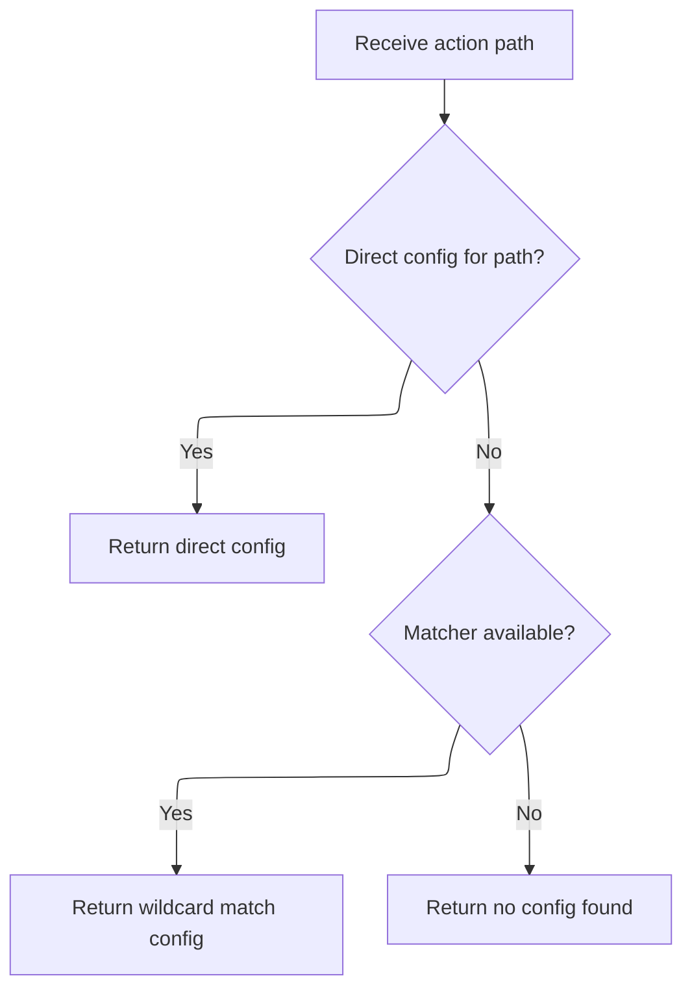

<SwmSnippet path="/core/src/main/java/org/apache/struts/config/impl/ModuleConfigImpl.java" line="436">

---

<SwmToken path="core/src/main/java/org/apache/struts/config/impl/ModuleConfigImpl.java" pos="436:5:5" line-data="    public ActionConfig findActionConfig(String path) {">`findActionConfig`</SwmToken> looks up the action config by path, and if not found, uses the matcher for wildcard matches. We call <SwmToken path="core/src/main/java/org/apache/struts/config/impl/ModuleConfigImpl.java" pos="442:5:7" line-data="            config = matcher.match(path);">`matcher.match`</SwmToken> next to handle flexible mapping cases.

```java
    public ActionConfig findActionConfig(String path) {
        ActionConfig config = (ActionConfig) actionConfigs.get(path);

        // If a direct match cannot be found, try to match action configs
        // containing wildcard patterns only if a matcher exists.
        if ((config == null) && (matcher != null)) {
            config = matcher.match(path);
        }

        return config;
    }
```

---

</SwmSnippet>

### Wildcard action mapping resolution

See <SwmLink doc-title="Matching Paths to Action Configurations">[Matching Paths to Action Configurations](/.swm/matching-paths-to-action-configurations.pfvn1d9i.sw.md)</SwmLink>

### Converting wildcard matches to action configs

See <SwmLink doc-title="Dynamic Action Configuration Update">[Dynamic Action Configuration Update](/.swm/dynamic-action-configuration-update.ttlc1vev.sw.md)</SwmLink>

### Finalizing the form identifier for <SwmToken path="taglib/src/main/java/org/apache/struts/taglib/html/JavascriptValidatorTag.java" pos="55:11:11" line-data=" * Custom tag that generates JavaScript for client side validation based on">`JavaScript`</SwmToken> generation

<SwmSnippet path="/taglib/src/main/java/org/apache/struts/taglib/html/JavascriptValidatorTag.java" line="456">

---

Just returned from <SwmToken path="core/src/main/java/org/apache/struts/config/impl/ModuleConfigImpl.java" pos="58:4:4" line-data="public class ModuleConfigImpl extends BaseConfig implements Serializable,">`ModuleConfigImpl`</SwmToken>, and now in <SwmToken path="taglib/src/main/java/org/apache/struts/taglib/html/JavascriptValidatorTag.java" pos="396:7:7" line-data="                results.append(this.createDynamicJavascript(config, resources,">`createDynamicJavascript`</SwmToken>, if the mapping isn't found, we throw an exception and set it in the page context. If found, we use the mapping's attribute name for the <SwmToken path="taglib/src/main/java/org/apache/struts/taglib/html/JavascriptValidatorTag.java" pos="55:11:11" line-data=" * Custom tag that generates JavaScript for client side validation based on">`JavaScript`</SwmToken> form identifier.

```java
            if (mapping == null) {
                JspException e =
                    new JspException(messages.getMessage("formTag.mapping",
                            mappingName));

                pageContext.setAttribute(Globals.EXCEPTION_KEY, e,
                    PageContext.REQUEST_SCOPE);
                throw e;
            }

            jsFormName = mapping.getAttribute();
        }

```

---

</SwmSnippet>

<SwmSnippet path="/taglib/src/main/java/org/apache/struts/taglib/html/JavascriptValidatorTag.java" line="469">

---

Just returned from <SwmToken path="core/src/main/java/org/apache/struts/config/impl/ModuleConfigImpl.java" pos="436:3:3" line-data="    public ActionConfig findActionConfig(String path) {">`ActionConfig`</SwmToken>, and now in <SwmToken path="taglib/src/main/java/org/apache/struts/taglib/html/JavascriptValidatorTag.java" pos="396:7:7" line-data="                results.append(this.createDynamicJavascript(config, resources,">`createDynamicJavascript`</SwmToken>, we call <SwmToken path="taglib/src/main/java/org/apache/struts/taglib/html/JavascriptValidatorTag.java" pos="469:7:7" line-data="        results.append(this.getJavascriptBegin(methods));">`getJavascriptBegin`</SwmToken> to build the <SwmToken path="taglib/src/main/java/org/apache/struts/taglib/html/JavascriptValidatorTag.java" pos="55:11:11" line-data=" * Custom tag that generates JavaScript for client side validation based on">`JavaScript`</SwmToken> header and function wrapper, using the resolved form name and methods string.

```java
        results.append(this.getJavascriptBegin(methods));

```

---

</SwmSnippet>

### Starting the <SwmToken path="taglib/src/main/java/org/apache/struts/taglib/html/JavascriptValidatorTag.java" pos="55:11:11" line-data=" * Custom tag that generates JavaScript for client side validation based on">`JavaScript`</SwmToken> validation block

See <SwmLink doc-title="Generating JavaScript Validation Functions">[Generating JavaScript Validation Functions](/.swm/generating-javascript-validation-functions.jquq2flp.sw.md)</SwmLink>

### Iterating over validation actions and fields

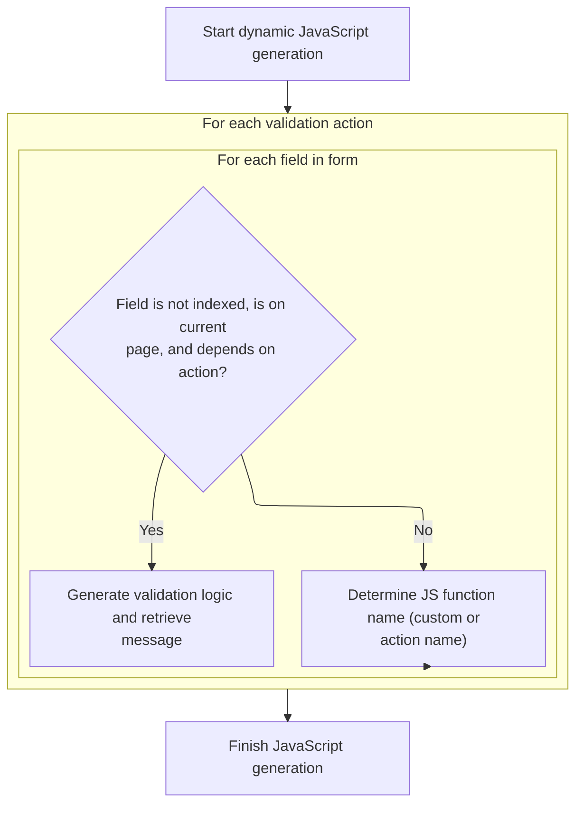

<SwmSnippet path="/taglib/src/main/java/org/apache/struts/taglib/html/JavascriptValidatorTag.java" line="471">

---

Just returned from <SwmToken path="taglib/src/main/java/org/apache/struts/taglib/html/JavascriptValidatorTag.java" pos="469:7:7" line-data="        results.append(this.getJavascriptBegin(methods));">`getJavascriptBegin`</SwmToken>, here JavascriptValidatorTag.createDynamicJavascript loops through each <SwmToken path="taglib/src/main/java/org/apache/struts/taglib/html/JavascriptValidatorTag.java" pos="472:1:1" line-data="            ValidatorAction va = (ValidatorAction) i.next();">`ValidatorAction`</SwmToken> and then each Field in the form, skipping indexed fields and those not relevant for the current action or page. We need IteratorAdapter next because the code relies on Java's Iterator interface to traverse collections, which is abstracted for compatibility across different collection types.

```java
        for (Iterator i = actions.iterator(); i.hasNext();) {
            ValidatorAction va = (ValidatorAction) i.next();
            int jscriptVar = 0;
            String functionName = null;

            if ((va.getJsFunctionName() != null)
                && (va.getJsFunctionName().length() > 0)) {
                functionName = va.getJsFunctionName();
            } else {
                functionName = va.getName();
            }

            results.append("    function " + jsFormName + "_" + functionName
                + " () { \n");

            for (Iterator x = form.getFields().iterator(); x.hasNext();) {
                Field field = (Field) x.next();

                // Skip indexed fields for now until there is a good way to
                // handle error messages (and the length of the list (could
                // retrieve from scope?))
                if (field.isIndexed() || (field.getPage() != page)
                    || !field.isDependency(va.getName())) {
                    continue;
                }

```

---

</SwmSnippet>

<SwmSnippet path="/taglib/src/main/java/org/apache/struts/taglib/html/JavascriptValidatorTag.java" line="497">

---

Just returned from IteratorAdapter, here JavascriptValidatorTag.createDynamicJavascript calls <SwmToken path="taglib/src/main/java/org/apache/struts/taglib/html/JavascriptValidatorTag.java" pos="498:1:3" line-data="                    Resources.getMessage(application, request, messages,">`Resources.getMessage`</SwmToken> for each field to fetch the localized validation message. This ensures the generated <SwmToken path="taglib/src/main/java/org/apache/struts/taglib/html/JavascriptValidatorTag.java" pos="55:11:11" line-data=" * Custom tag that generates JavaScript for client side validation based on">`JavaScript`</SwmToken> includes the right error text for each <SwmPath>[core/…/struts/action/](core/src/main/java/org/apache/struts/action/)</SwmPath> combo.

```java
                String message =
                    Resources.getMessage(application, request, messages,
                        locale, va, field);

```

---

</SwmSnippet>

### Retrieving localized validation messages

See <SwmLink doc-title="Generating Localized Field Messages">[Generating Localized Field Messages](/.swm/generating-localized-field-messages.jzf040ta.sw.md)</SwmLink>

### Sanitizing validation messages for <SwmToken path="taglib/src/main/java/org/apache/struts/taglib/html/JavascriptValidatorTag.java" pos="55:11:11" line-data=" * Custom tag that generates JavaScript for client side validation based on">`JavaScript`</SwmToken>

<SwmSnippet path="/taglib/src/main/java/org/apache/struts/taglib/html/JavascriptValidatorTag.java" line="501">

---

EscapeQuotes walks through the input string, tokenizing by quotes and adding a backslash before each quote. We need ValidWhenLexer next because parsing and tokenizing is a recurring pattern in validation logic, especially for complex expressions.

```java
                message = (message != null) ? message : "";

                // prefix variable with 'a' to make it a legal identifier
                results.append("     this.a" + jscriptVar++ + " = new Array(\""
                    + field.getKey() + "\", \"" + escapeQuotes(message)
                    + "\", ");

```

---

</SwmSnippet>

### Escaping quotes in validation messages

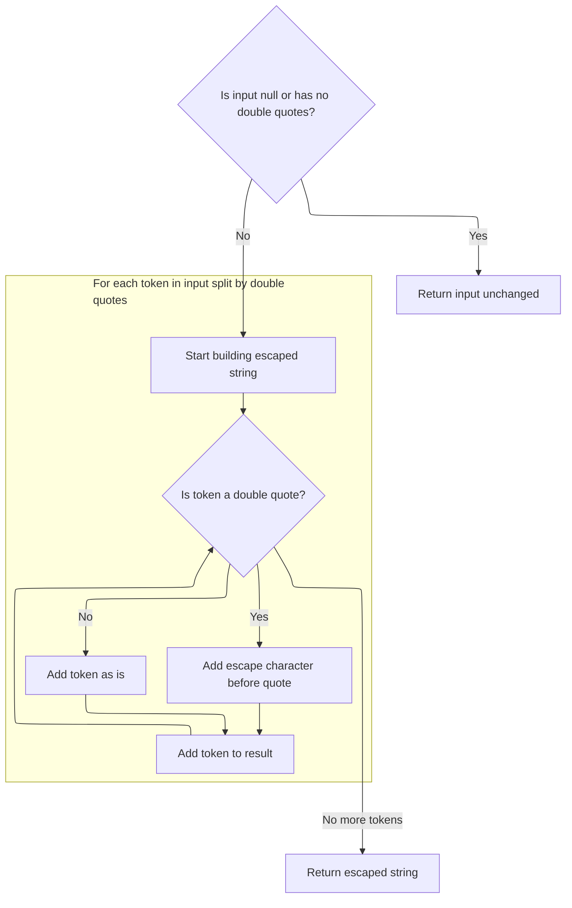

<SwmSnippet path="/taglib/src/main/java/org/apache/struts/taglib/html/JavascriptValidatorTag.java" line="560">

---

EscapeQuotes walks through the input string, tokenizing by quotes and adding a backslash before each quote. We need ValidWhenLexer next because parsing and tokenizing is a recurring pattern in validation logic, especially for complex expressions.

```java
    private String escapeQuotes(String in) {
        if ((in == null) || (in.indexOf("\"") == -1)) {
            return in;
        }

        StringBuffer buffer = new StringBuffer();
        StringTokenizer tokenizer = new StringTokenizer(in, "\"", true);

        while (tokenizer.hasMoreTokens()) {
            String token = tokenizer.nextToken();

            if (token.equals("\"")) {
                buffer.append("\\");
            }

            buffer.append(token);
        }

        return buffer.toString();
    }
```

---

</SwmSnippet>

### Tokenizing validation expressions

See <SwmLink doc-title="Tokenizing validation expressions">[Tokenizing validation expressions](/.swm/tokenizing-validation-expressions.lih1ng9w.sw.md)</SwmLink>

### Building validation parameter arrays

<SwmSnippet path="/taglib/src/main/java/org/apache/struts/taglib/html/JavascriptValidatorTag.java" line="508">

---

Just returned from <SwmToken path="taglib/src/main/java/org/apache/struts/taglib/html/JavascriptValidatorTag.java" pos="505:22:22" line-data="                    + field.getKey() + &quot;\&quot;, \&quot;&quot; + escapeQuotes(message)">`escapeQuotes`</SwmToken>, here JavascriptValidatorTag.createDynamicJavascript loops through each variable in the field, using Iterator to traverse the keys. This lets us dynamically build <SwmToken path="taglib/src/main/java/org/apache/struts/taglib/html/JavascriptValidatorTag.java" pos="55:11:11" line-data=" * Custom tag that generates JavaScript for client side validation based on">`JavaScript`</SwmToken> Function objects for each field's validation parameters.

```java
                results.append("new Function (\"varName\", \"");

                Map vars = field.getVars();

                // Loop through the field's variables.
                Iterator varsIterator = vars.keySet().iterator();

                while (varsIterator.hasNext()) {
                    String varName = (String) varsIterator.next();
```

---

</SwmSnippet>

<SwmSnippet path="/taglib/src/main/java/org/apache/struts/taglib/html/JavascriptValidatorTag.java" line="517">

---

Just returned from IteratorAdapter, here JavascriptValidatorTag.createDynamicJavascript calls <SwmToken path="taglib/src/main/java/org/apache/struts/taglib/html/JavascriptValidatorTag.java" pos="519:1:3" line-data="                        Resources.getVarValue(var, application, request, false);">`Resources.getVarValue`</SwmToken> for each variable to resolve its value, including localization and resource bundle lookup if the variable is marked as a resource.

```java
                    Var var = (Var) vars.get(varName);
                    String varValue =
                        Resources.getVarValue(var, application, request, false);
```

---

</SwmSnippet>

### Resolving variable values for validation

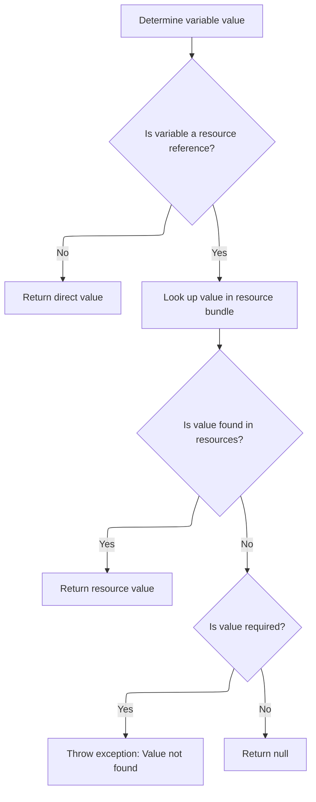

<SwmSnippet path="/core/src/main/java/org/apache/struts/validator/Resources.java" line="190">

---

In <SwmToken path="core/src/main/java/org/apache/struts/validator/Resources.java" pos="190:7:7" line-data="    public static String getVarValue(Var var, ServletContext application,">`getVarValue`</SwmToken>, we check if the variable is a resource. If not, we just return its value. If it is, we fetch the <SwmToken path="core/src/main/java/org/apache/struts/validator/Resources.java" pos="202:1:1" line-data="        MessageResources messages =">`MessageResources`</SwmToken> for the specified bundle to resolve the value. We need to call <SwmToken path="core/src/main/java/org/apache/struts/validator/Resources.java" pos="190:7:7" line-data="    public static String getVarValue(Var var, ServletContext application,">`getVarValue`</SwmToken> again next because the actual lookup and localization happens in the following lines.

```java
    public static String getVarValue(Var var, ServletContext application,
        HttpServletRequest request, boolean required) {
        String varName = var.getName();
        String varValue = var.getValue();

        // Non-resource variable
        if (!var.isResource()) {
            return varValue;
        }

        // Get the message resources
        String bundle = var.getBundle();
        MessageResources messages =
            getMessageResources(application, request, bundle);

```

---

</SwmSnippet>

<SwmSnippet path="/core/src/main/java/org/apache/struts/validator/Resources.java" line="205">

---

Just returned from <SwmToken path="taglib/src/main/java/org/apache/struts/taglib/html/JavascriptValidatorTag.java" pos="519:3:3" line-data="                        Resources.getVarValue(var, application, request, false);">`getVarValue`</SwmToken>, here we grab the user's locale using <SwmToken path="core/src/main/java/org/apache/struts/validator/Resources.java" pos="206:7:9" line-data="        Locale locale = RequestUtils.getUserLocale(request, null);">`RequestUtils.getUserLocale`</SwmToken> so the variable value can be localized. This makes sure the <SwmToken path="taglib/src/main/java/org/apache/struts/taglib/html/JavascriptValidatorTag.java" pos="55:11:11" line-data=" * Custom tag that generates JavaScript for client side validation based on">`JavaScript`</SwmToken> validation parameters are in the user's language.

```java
        // Retrieve variable's value from message resources
        Locale locale = RequestUtils.getUserLocale(request, null);
```

---

</SwmSnippet>

<SwmSnippet path="/core/src/main/java/org/apache/struts/validator/Resources.java" line="207">

---

Just returned from <SwmToken path="taglib/src/main/java/org/apache/struts/taglib/TagUtils.java" pos="831:3:5" line-data="        return RequestUtils.getUserLocale((HttpServletRequest) pageContext">`RequestUtils.getUserLocale`</SwmToken>, here <SwmToken path="taglib/src/main/java/org/apache/struts/taglib/html/JavascriptValidatorTag.java" pos="519:3:3" line-data="                        Resources.getVarValue(var, application, request, false);">`getVarValue`</SwmToken> fetches the localized value from message resources, throws if missing and required, logs debug info, and returns the resolved value for use in <SwmToken path="taglib/src/main/java/org/apache/struts/taglib/html/JavascriptValidatorTag.java" pos="55:11:11" line-data=" * Custom tag that generates JavaScript for client side validation based on">`JavaScript`</SwmToken> generation.

```java
        String value = messages.getMessage(locale, varValue, null);

        // Not found in message resources
        if ((value == null) && required) {
            throw new IllegalArgumentException(sysmsgs.getMessage(
                    "variable.resource.notfound", varName, varValue, bundle));
        }

        if (log.isDebugEnabled()) {
            log.debug("Var=[" + varName + "], " + "bundle=[" + bundle + "], "
                + "key=[" + varValue + "], " + "value=[" + value + "]");
        }

        return value;
    }
```

---

</SwmSnippet>

### Appending validation variables to <SwmToken path="taglib/src/main/java/org/apache/struts/taglib/html/JavascriptValidatorTag.java" pos="55:11:11" line-data=" * Custom tag that generates JavaScript for client side validation based on">`JavaScript`</SwmToken>

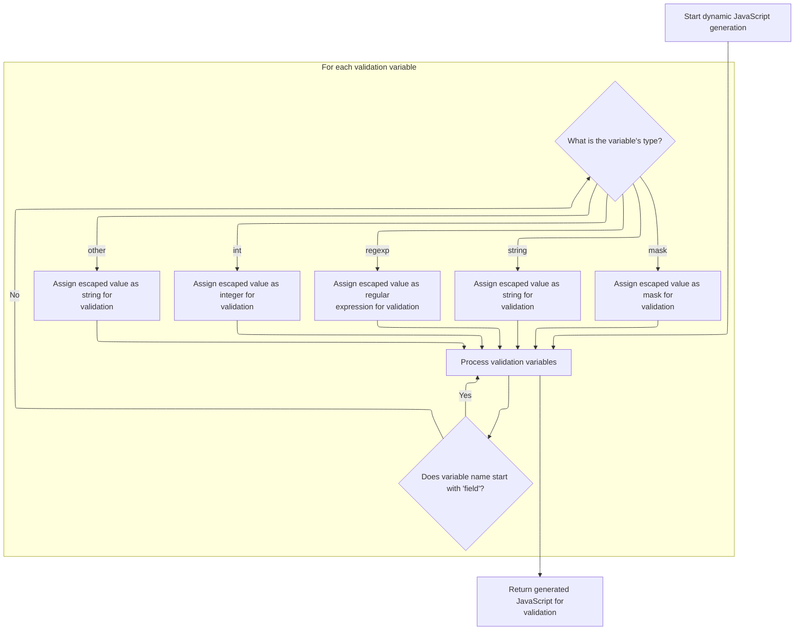

<SwmSnippet path="/taglib/src/main/java/org/apache/struts/taglib/html/JavascriptValidatorTag.java" line="520">

---

Just returned from <SwmToken path="taglib/src/main/java/org/apache/struts/taglib/html/JavascriptValidatorTag.java" pos="519:3:3" line-data="                        Resources.getVarValue(var, application, request, false);">`getVarValue`</SwmToken>, here JavascriptValidatorTag.createDynamicJavascript finishes by appending variable assignments and closing the function and array initialization. The result is a string of <SwmToken path="taglib/src/main/java/org/apache/struts/taglib/html/JavascriptValidatorTag.java" pos="55:11:11" line-data=" * Custom tag that generates JavaScript for client side validation based on">`JavaScript`</SwmToken> functions, each tied to a <SwmPath>[core/…/struts/action/](core/src/main/java/org/apache/struts/action/)</SwmPath>, with localized messages and validation parameters for client-side checks.

```java
                    String jsType = var.getJsType();

                    // skip requiredif variables field, fieldIndexed, fieldTest,
                    // fieldValue
                    if (varName.startsWith("field")) {
                        continue;
                    }

                    String varValueEscaped = escapeJavascript(varValue);

                    if (Var.JSTYPE_INT.equalsIgnoreCase(jsType)) {
                        results.append("this." + varName + "="
                            + varValueEscaped + "; ");
                    } else if (Var.JSTYPE_REGEXP.equalsIgnoreCase(jsType)) {
                        results.append("this." + varName + "=/"
                            + varValueEscaped + "/; ");
                    } else if (Var.JSTYPE_STRING.equalsIgnoreCase(jsType)) {
                        results.append("this." + varName + "='"
                            + varValueEscaped + "'; ");

                        // So everyone using the latest format doesn't need to
                        // change their xml files immediately.
                    } else if ("mask".equalsIgnoreCase(varName)) {
                        results.append("this." + varName + "=/"
                            + varValueEscaped + "/; ");
                    } else {
                        results.append("this." + varName + "='"
                            + varValueEscaped + "'; ");
                    }
                }

                results.append(" return this[varName];\"));\n");
            }

            results.append("    } \n\n");
        }

        return results.toString();
    }
```

---

</SwmSnippet>

## Preparing the script block for output

```mermaid
%%{init: {"flowchart": {"defaultRenderer": "elk"}} }%%
flowchart TD
    node1["Start rendering JavaScript validation
code"]
    click node1 openCode "taglib/src/main/java/org/apache/struts/taglib/html/JavascriptValidatorTag.java:398:405"
    node1 --> node2{"Is staticJavascript true?"}
    click node2 openCode "taglib/src/main/java/org/apache/struts/taglib/html/JavascriptValidatorTag.java:398:405"
    node2 -->|"Yes"| node3["Append start element"]
    click node3 openCode "taglib/src/main/java/org/apache/struts/taglib/html/JavascriptValidatorTag.java:399:400"
    node3 --> node4{"Is htmlComment true?"}
    click node4 openCode "taglib/src/main/java/org/apache/struts/taglib/html/JavascriptValidatorTag.java:401:403"
    node4 -->|"Yes"| node5["Wrap JavaScript in HTML comment"]
    click node5 openCode "taglib/src/main/java/org/apache/struts/taglib/html/JavascriptValidatorTag.java:402:403"
    node4 -->|"No"| node6["Proceed without HTML comment"]
    click node6 openCode "taglib/src/main/java/org/apache/struts/taglib/html/JavascriptValidatorTag.java:404:404"
    node5 --> node7["Append static JavaScript methods"]
    node6 --> node7
    node2 -->|"No"| node7
    node7["Append static JavaScript methods"]
    click node7 openCode "taglib/src/main/java/org/apache/struts/taglib/html/JavascriptValidatorTag.java:407:409"
    node7 --> node8{"Is form present and (dynamicJavascript
or staticJavascript) true?"}
    click node8 openCode "taglib/src/main/java/org/apache/struts/taglib/html/JavascriptValidatorTag.java:411:415"
    node8 -->|"Yes"| node9["Append JavaScript end block"]
    click node9 openCode "taglib/src/main/java/org/apache/struts/taglib/html/JavascriptValidatorTag.java:414:414"
    node8 -->|"No"| node10["Return rendered JavaScript"]
    node9 --> node10["Return rendered JavaScript"]
    click node10 openCode "taglib/src/main/java/org/apache/struts/taglib/html/JavascriptValidatorTag.java:417:418"
classDef HeadingStyle fill:#777777,stroke:#333,stroke-width:2px;

%% Swimm:
%% %%{init: {"flowchart": {"defaultRenderer": "elk"}} }%%
%% flowchart TD
%%     node1["Start rendering <SwmToken path="taglib/src/main/java/org/apache/struts/taglib/html/JavascriptValidatorTag.java" pos="55:11:11" line-data=" * Custom tag that generates JavaScript for client side validation based on">`JavaScript`</SwmToken> validation
%% code"]
%%     click node1 openCode "<SwmPath>[taglib/…/html/JavascriptValidatorTag.java](taglib/src/main/java/org/apache/struts/taglib/html/JavascriptValidatorTag.java)</SwmPath>:398:405"
%%     node1 --> node2{"Is <SwmToken path="taglib/src/main/java/org/apache/struts/taglib/html/JavascriptValidatorTag.java" pos="398:14:14" line-data="            } else if (&quot;true&quot;.equalsIgnoreCase(staticJavascript)) {">`staticJavascript`</SwmToken> true?"}
%%     click node2 openCode "<SwmPath>[taglib/…/html/JavascriptValidatorTag.java](taglib/src/main/java/org/apache/struts/taglib/html/JavascriptValidatorTag.java)</SwmPath>:398:405"
%%     node2 -->|"Yes"| node3["Append start element"]
%%     click node3 openCode "<SwmPath>[taglib/…/html/JavascriptValidatorTag.java](taglib/src/main/java/org/apache/struts/taglib/html/JavascriptValidatorTag.java)</SwmPath>:399:400"
%%     node3 --> node4{"Is <SwmToken path="taglib/src/main/java/org/apache/struts/taglib/html/JavascriptValidatorTag.java" pos="401:10:10" line-data="                if (&quot;true&quot;.equalsIgnoreCase(htmlComment)) {">`htmlComment`</SwmToken> true?"}
%%     click node4 openCode "<SwmPath>[taglib/…/html/JavascriptValidatorTag.java](taglib/src/main/java/org/apache/struts/taglib/html/JavascriptValidatorTag.java)</SwmPath>:401:403"
%%     node4 -->|"Yes"| node5["Wrap <SwmToken path="taglib/src/main/java/org/apache/struts/taglib/html/JavascriptValidatorTag.java" pos="55:11:11" line-data=" * Custom tag that generates JavaScript for client side validation based on">`JavaScript`</SwmToken> in HTML comment"]
%%     click node5 openCode "<SwmPath>[taglib/…/html/JavascriptValidatorTag.java](taglib/src/main/java/org/apache/struts/taglib/html/JavascriptValidatorTag.java)</SwmPath>:402:403"
%%     node4 -->|"No"| node6["Proceed without HTML comment"]
%%     click node6 openCode "<SwmPath>[taglib/…/html/JavascriptValidatorTag.java](taglib/src/main/java/org/apache/struts/taglib/html/JavascriptValidatorTag.java)</SwmPath>:404:404"
%%     node5 --> node7["Append static <SwmToken path="taglib/src/main/java/org/apache/struts/taglib/html/JavascriptValidatorTag.java" pos="55:11:11" line-data=" * Custom tag that generates JavaScript for client side validation based on">`JavaScript`</SwmToken> methods"]
%%     node6 --> node7
%%     node2 -->|"No"| node7
%%     node7["Append static <SwmToken path="taglib/src/main/java/org/apache/struts/taglib/html/JavascriptValidatorTag.java" pos="55:11:11" line-data=" * Custom tag that generates JavaScript for client side validation based on">`JavaScript`</SwmToken> methods"]
%%     click node7 openCode "<SwmPath>[taglib/…/html/JavascriptValidatorTag.java](taglib/src/main/java/org/apache/struts/taglib/html/JavascriptValidatorTag.java)</SwmPath>:407:409"
%%     node7 --> node8{"Is form present and (<SwmToken path="taglib/src/main/java/org/apache/struts/taglib/html/JavascriptValidatorTag.java" pos="383:10:10" line-data="        if (&quot;true&quot;.equalsIgnoreCase(dynamicJavascript)) {">`dynamicJavascript`</SwmToken>
%% or <SwmToken path="taglib/src/main/java/org/apache/struts/taglib/html/JavascriptValidatorTag.java" pos="398:14:14" line-data="            } else if (&quot;true&quot;.equalsIgnoreCase(staticJavascript)) {">`staticJavascript`</SwmToken>) true?"}
%%     click node8 openCode "<SwmPath>[taglib/…/html/JavascriptValidatorTag.java](taglib/src/main/java/org/apache/struts/taglib/html/JavascriptValidatorTag.java)</SwmPath>:411:415"
%%     node8 -->|"Yes"| node9["Append <SwmToken path="taglib/src/main/java/org/apache/struts/taglib/html/JavascriptValidatorTag.java" pos="55:11:11" line-data=" * Custom tag that generates JavaScript for client side validation based on">`JavaScript`</SwmToken> end block"]
%%     click node9 openCode "<SwmPath>[taglib/…/html/JavascriptValidatorTag.java](taglib/src/main/java/org/apache/struts/taglib/html/JavascriptValidatorTag.java)</SwmPath>:414:414"
%%     node8 -->|"No"| node10["Return rendered <SwmToken path="taglib/src/main/java/org/apache/struts/taglib/html/JavascriptValidatorTag.java" pos="55:11:11" line-data=" * Custom tag that generates JavaScript for client side validation based on">`JavaScript`</SwmToken>"]
%%     node9 --> node10["Return rendered <SwmToken path="taglib/src/main/java/org/apache/struts/taglib/html/JavascriptValidatorTag.java" pos="55:11:11" line-data=" * Custom tag that generates JavaScript for client side validation based on">`JavaScript`</SwmToken>"]
%%     click node10 openCode "<SwmPath>[taglib/…/html/JavascriptValidatorTag.java](taglib/src/main/java/org/apache/struts/taglib/html/JavascriptValidatorTag.java)</SwmPath>:417:418"
%% classDef HeadingStyle fill:#777777,stroke:#333,stroke-width:2px;
```

<SwmSnippet path="/taglib/src/main/java/org/apache/struts/taglib/html/JavascriptValidatorTag.java" line="398">

---

Just returned from <SwmToken path="taglib/src/main/java/org/apache/struts/taglib/html/JavascriptValidatorTag.java" pos="396:7:7" line-data="                results.append(this.createDynamicJavascript(config, resources,">`createDynamicJavascript`</SwmToken>, here JavascriptValidatorTag.renderJavascript checks if <SwmToken path="taglib/src/main/java/org/apache/struts/taglib/html/JavascriptValidatorTag.java" pos="398:14:14" line-data="            } else if (&quot;true&quot;.equalsIgnoreCase(staticJavascript)) {">`staticJavascript`</SwmToken> is enabled, then calls <SwmToken path="taglib/src/main/java/org/apache/struts/taglib/html/JavascriptValidatorTag.java" pos="399:7:7" line-data="                results.append(this.renderStartElement());">`renderStartElement`</SwmToken> to start the script block and optionally adds HTML comments for older browser compatibility.

```java
            } else if ("true".equalsIgnoreCase(staticJavascript)) {
                results.append(this.renderStartElement());

                if ("true".equalsIgnoreCase(htmlComment)) {
                    results.append(HTML_BEGIN_COMMENT);
                }
            }
        }

```

---

</SwmSnippet>

<SwmSnippet path="/taglib/src/main/java/org/apache/struts/taglib/html/JavascriptValidatorTag.java" line="407">

---

Just returned from <SwmToken path="taglib/src/main/java/org/apache/struts/taglib/html/JavascriptValidatorTag.java" pos="399:7:7" line-data="                results.append(this.renderStartElement());">`renderStartElement`</SwmToken>, here JavascriptValidatorTag.renderJavascript appends static <SwmToken path="taglib/src/main/java/org/apache/struts/taglib/html/JavascriptValidatorTag.java" pos="55:11:11" line-data=" * Custom tag that generates JavaScript for client side validation based on">`JavaScript`</SwmToken> methods by calling <SwmToken path="taglib/src/main/java/org/apache/struts/taglib/html/JavascriptValidatorTag.java" pos="408:5:5" line-data="            results.append(getJavascriptStaticMethods(resources));">`getJavascriptStaticMethods`</SwmToken>, which adds shared validation functions for all actions.

```java
        if ("true".equalsIgnoreCase(staticJavascript)) {
            results.append(getJavascriptStaticMethods(resources));
        }

```

---

</SwmSnippet>

<SwmSnippet path="/taglib/src/main/java/org/apache/struts/taglib/html/JavascriptValidatorTag.java" line="793">

---

GetJavascriptStaticMethods loops through <SwmToken path="taglib/src/main/java/org/apache/struts/taglib/html/JavascriptValidatorTag.java" pos="698:9:9" line-data="        // Create list of ValidatorActions based on actionMethods">`ValidatorActions`</SwmToken> using Iterator, appending each action's <SwmToken path="taglib/src/main/java/org/apache/struts/taglib/html/JavascriptValidatorTag.java" pos="55:11:11" line-data=" * Custom tag that generates JavaScript for client side validation based on">`JavaScript`</SwmToken> code if it's present. IteratorAdapter is needed for compatibility with different collection types.

```java
    protected String getJavascriptStaticMethods(ValidatorResources resources) {
        StringBuffer sb = new StringBuffer();

        sb.append("\n\n");

        Iterator actions = resources.getValidatorActions().values().iterator();

        while (actions.hasNext()) {
            ValidatorAction va = (ValidatorAction) actions.next();

            if (va != null) {
                String javascript = va.getJavascript();

                if ((javascript != null) && (javascript.length() > 0)) {
                    sb.append(javascript + "\n");
                }
            }
        }

        return sb.toString();
    }
```

---

</SwmSnippet>

<SwmSnippet path="/taglib/src/main/java/org/apache/struts/taglib/html/JavascriptValidatorTag.java" line="411">

---

Just returned from <SwmToken path="taglib/src/main/java/org/apache/struts/taglib/html/JavascriptValidatorTag.java" pos="408:5:5" line-data="            results.append(getJavascriptStaticMethods(resources));">`getJavascriptStaticMethods`</SwmToken>, here JavascriptValidatorTag.renderJavascript appends the script end block using <SwmToken path="taglib/src/main/java/org/apache/struts/taglib/html/JavascriptValidatorTag.java" pos="414:5:5" line-data="            results.append(getJavascriptEnd());">`getJavascriptEnd`</SwmToken>, which closes the script and adds any required markers for HTML or XHTML compliance.

```java
        if ((form != null)
            && ("true".equalsIgnoreCase(dynamicJavascript)
            || "true".equalsIgnoreCase(staticJavascript))) {
            results.append(getJavascriptEnd());
        }

        return results.toString();
    }
```

---

</SwmSnippet>

# Closing the script block

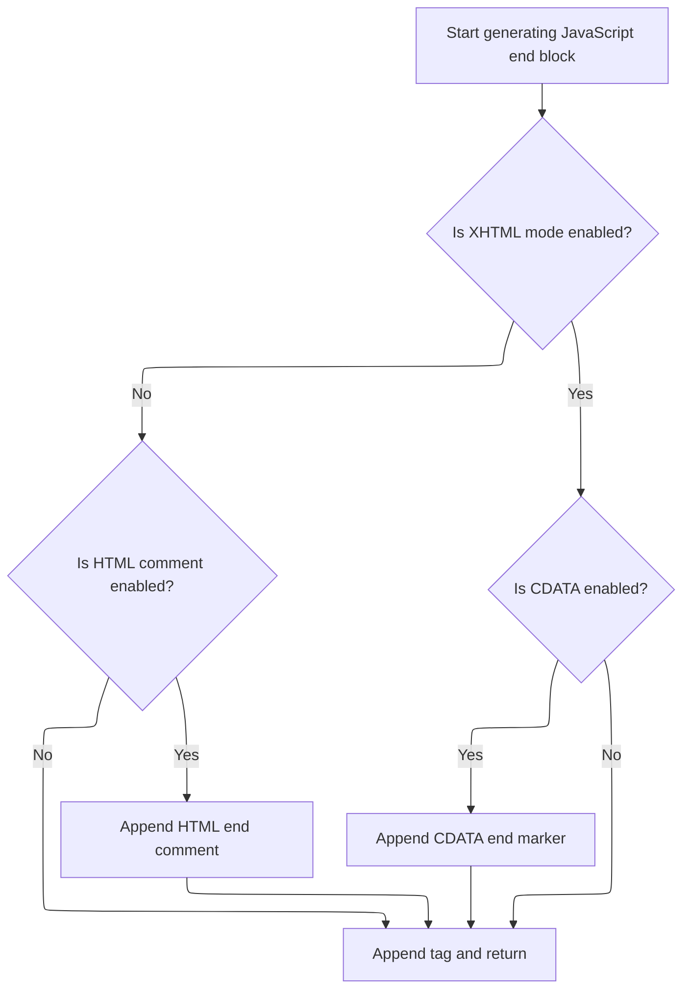

<SwmSnippet path="/taglib/src/main/java/org/apache/struts/taglib/html/JavascriptValidatorTag.java" line="818">

---

In <SwmToken path="taglib/src/main/java/org/apache/struts/taglib/html/JavascriptValidatorTag.java" pos="818:5:5" line-data="    protected String getJavascriptEnd() {">`getJavascriptEnd`</SwmToken>, we build the script block ending, checking <SwmToken path="taglib/src/main/java/org/apache/struts/taglib/html/JavascriptValidatorTag.java" pos="823:7:7" line-data="        if (!this.isXhtml() &amp;&amp; &quot;true&quot;.equals(htmlComment)) {">`isXhtml`</SwmToken> to decide if we need HTML comment or CDATA markers. This ensures the output is valid for both HTML and XHTML, depending on the flags.

```java
    protected String getJavascriptEnd() {
        StringBuffer sb = new StringBuffer();

        sb.append("\n");

        if (!this.isXhtml() && "true".equals(htmlComment)) {
            sb.append(HTML_END_COMMENT);
        }

        if (this.isXhtml() && "true".equalsIgnoreCase(this.cdata)) {
            sb.append("//]]>\r\n");
        }

```

---

</SwmSnippet>

<SwmSnippet path="/taglib/src/main/java/org/apache/struts/taglib/html/JavascriptValidatorTag.java" line="831">

---

Just returned from <SwmToken path="taglib/src/main/java/org/apache/struts/taglib/html/JavascriptValidatorTag.java" pos="823:7:7" line-data="        if (!this.isXhtml() &amp;&amp; &quot;true&quot;.equals(htmlComment)) {">`isXhtml`</SwmToken>, here <SwmToken path="taglib/src/main/java/org/apache/struts/taglib/html/JavascriptValidatorTag.java" pos="414:5:5" line-data="            results.append(getJavascriptEnd());">`getJavascriptEnd`</SwmToken> appends the closing </script> tag and newlines, finalizing the script block. The conditional markers ensure compatibility, but the closing tag is always needed for valid HTML/XHTML.

```java
        sb.append("</script>\n\n");

        return sb.toString();
    }
```

---

</SwmSnippet>

&nbsp;

*This is an* <SwmToken path="taglib/src/main/java/org/apache/struts/taglib/html/JavascriptValidatorTag.java" pos="239:24:26" line-data="     * method name if it has a value.  This overrides the auto-generated">`auto-generated`</SwmToken> *document by Swimm 🌊 and has not yet been verified by a human*

<SwmMeta version="3.0.0" repo-id="Z2l0aHViJTNBJTNBc3RydXRzMSUzQSUzQVN3aW1tLURlbW8=" repo-name="struts1"><sup>Powered by [Swimm](https://app.swimm.io/)</sup></SwmMeta>
