This document describes how the system generates and outputs a <base> tag for each JSP page. By extracting the current HTTP request context and applying configuration options, the flow ensures that the base tag accurately represents the scheme, server, port, and path for the page. This enables all relative <SwmToken path="core/src/main/java/org/apache/struts/util/RequestUtils.java" pos="677:9:9" line-data="     * the case for URLs that were originally created from relative or">`URLs`</SwmToken> to resolve correctly, even in complex deployment scenarios.

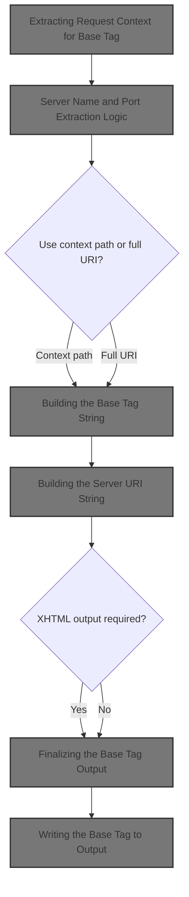
```mermaid
flowchart TD
  node1["Extracting Request Context for Base Tag"]:::HeadingStyle
  click node1 goToHeading "Extracting Request Context for Base Tag"
  node1 --> node2["Server Name and Port Extraction Logic"]:::HeadingStyle
  click node2 goToHeading "Server Name and Port Extraction Logic"
  node2 --> node3{"Use context path or full URI?"}
  node3 -->|"Context path"| node4["Building the Base Tag String"]:::HeadingStyle
  click node4 goToHeading "Building the Base Tag String"
  node3 -->|"Full URI"| node4
  node4 --> node5["Building the Server URI String"]:::HeadingStyle
  click node5 goToHeading "Building the Server URI String"
  node5 --> node6{"XHTML output required?"}
  node6 -->|"Yes"| node7["Finalizing the Base Tag Output"]:::HeadingStyle
  click node7 goToHeading "Finalizing the Base Tag Output"
  node6 -->|"No"| node7
  node7 --> node8["Writing the Base Tag to Output"]:::HeadingStyle
  click node8 goToHeading "Writing the Base Tag to Output"
classDef HeadingStyle fill:#777777,stroke:#333,stroke-width:2px;
```

# Extracting Request Context for Base Tag

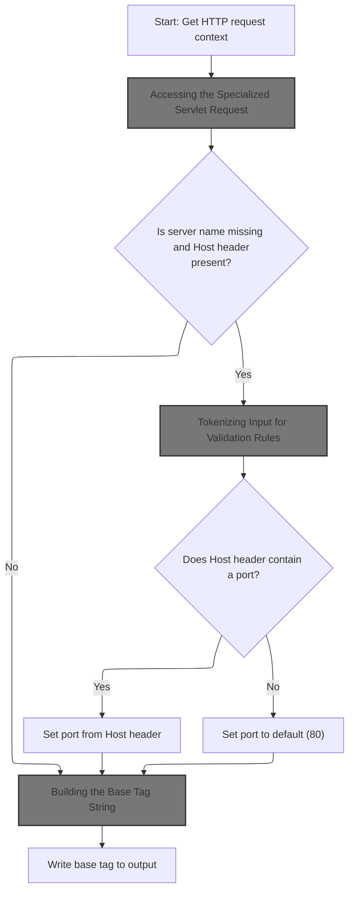
```mermaid
%%{init: {"flowchart": {"defaultRenderer": "elk"}} }%%
flowchart TD
  node1["Start: Get HTTP request context"]
  click node1 openCode "taglib/src/main/java/org/apache/struts/taglib/html/BaseTag.java:114:116"
  node1 --> node2["Accessing the Specialized Servlet Request"]
  
  node2 --> node3{"Is server name missing and Host header
present?"}
  click node3 openCode "taglib/src/main/java/org/apache/struts/taglib/html/BaseTag.java:123:139"
  node3 -->|"Yes"| node4["Tokenizing Input for Validation Rules"]
  
  node4 --> node5{"Does Host header contain a port?"}
  click node5 openCode "taglib/src/main/java/org/apache/struts/taglib/html/BaseTag.java:128:138"
  node5 -->|"Yes"| node6["Set port from Host header"]
  click node6 openCode "taglib/src/main/java/org/apache/struts/taglib/html/BaseTag.java:132:133"
  node5 -->|"No"| node7["Set port to default (80)"]
  click node7 openCode "taglib/src/main/java/org/apache/struts/taglib/html/BaseTag.java:134:138"
  node6 --> node8["Building the Base Tag String"]
  node7 --> node8
  node3 -->|"No"| node8
  
  node8 --> node9["Write base tag to output"]
  click node9 openCode "taglib/src/main/java/org/apache/struts/taglib/html/BaseTag.java:145:155"

classDef HeadingStyle fill:#777777,stroke:#333,stroke-width:2px;
click node2 goToHeading "Accessing the Specialized Servlet Request"
node2:::HeadingStyle
click node4 goToHeading "Tokenizing Input for Validation Rules"
node4:::HeadingStyle
click node8 goToHeading "Building the Base Tag String"
node8:::HeadingStyle

%% Swimm:
%% %%{init: {"flowchart": {"defaultRenderer": "elk"}} }%%
%% flowchart TD
%%   node1["Start: Get HTTP request context"]
%%   click node1 openCode "<SwmPath>[taglib/…/html/BaseTag.java](taglib/src/main/java/org/apache/struts/taglib/html/BaseTag.java)</SwmPath>:114:116"
%%   node1 --> node2["Accessing the Specialized Servlet Request"]
%%   
%%   node2 --> node3{"Is server name missing and Host header
%% present?"}
%%   click node3 openCode "<SwmPath>[taglib/…/html/BaseTag.java](taglib/src/main/java/org/apache/struts/taglib/html/BaseTag.java)</SwmPath>:123:139"
%%   node3 -->|"Yes"| node4["Tokenizing Input for Validation Rules"]
%%   
%%   node4 --> node5{"Does Host header contain a port?"}
%%   click node5 openCode "<SwmPath>[taglib/…/html/BaseTag.java](taglib/src/main/java/org/apache/struts/taglib/html/BaseTag.java)</SwmPath>:128:138"
%%   node5 -->|"Yes"| node6["Set port from Host header"]
%%   click node6 openCode "<SwmPath>[taglib/…/html/BaseTag.java](taglib/src/main/java/org/apache/struts/taglib/html/BaseTag.java)</SwmPath>:132:133"
%%   node5 -->|"No"| node7["Set port to default (80)"]
%%   click node7 openCode "<SwmPath>[taglib/…/html/BaseTag.java](taglib/src/main/java/org/apache/struts/taglib/html/BaseTag.java)</SwmPath>:134:138"
%%   node6 --> node8["Building the Base Tag String"]
%%   node7 --> node8
%%   node3 -->|"No"| node8
%%   
%%   node8 --> node9["Write base tag to output"]
%%   click node9 openCode "<SwmPath>[taglib/…/html/BaseTag.java](taglib/src/main/java/org/apache/struts/taglib/html/BaseTag.java)</SwmPath>:145:155"
%% 
%% classDef HeadingStyle fill:#777777,stroke:#333,stroke-width:2px;
%% click node2 goToHeading "Accessing the Specialized Servlet Request"
%% node2:::HeadingStyle
%% click node4 goToHeading "Tokenizing Input for Validation Rules"
%% node4:::HeadingStyle
%% click node8 goToHeading "Building the Base Tag String"
%% node8:::HeadingStyle
```

<SwmSnippet path="/taglib/src/main/java/org/apache/struts/taglib/html/BaseTag.java" line="114">

---

In <SwmToken path="taglib/src/main/java/org/apache/struts/taglib/html/BaseTag.java" pos="114:5:5" line-data="    public int doStartTag() throws JspException {">`doStartTag`</SwmToken>, we're grabbing the HTTP request from the page context. This is the entry point for collecting all the info we need to build the base tag. Next, we call into <SwmToken path="core/src/main/java/org/apache/struts/chain/contexts/ServletActionContext.java" pos="39:4:4" line-data="public class ServletActionContext extends WebActionContext {">`ServletActionContext`</SwmToken> to get a more specialized request context, which is necessary if the page context doesn't give us everything (like in some advanced Struts setups).

```java
    public int doStartTag() throws JspException {
        HttpServletRequest request =
            (HttpServletRequest) pageContext.getRequest();
```

---

</SwmSnippet>

## Accessing the Specialized Servlet Request

<SwmSnippet path="/core/src/main/java/org/apache/struts/chain/contexts/ServletActionContext.java" line="94">

---

<SwmToken path="core/src/main/java/org/apache/struts/chain/contexts/ServletActionContext.java" pos="94:5:5" line-data="    public HttpServletRequest getRequest() {">`getRequest`</SwmToken> just delegates to <SwmToken path="core/src/main/java/org/apache/struts/chain/contexts/ServletActionContext.java" pos="95:3:9" line-data="        return servletWebContext().getRequest();">`servletWebContext().getRequest()`</SwmToken>. This ensures we're always working with a <SwmToken path="core/src/main/java/org/apache/struts/chain/contexts/ServletActionContext.java" pos="67:3:3" line-data="    protected ServletWebContext servletWebContext() {">`ServletWebContext`</SwmToken>, which exposes the servlet-specific request methods we need for the rest of the flow.

```java
    public HttpServletRequest getRequest() {
        return servletWebContext().getRequest();
    }
```

---

</SwmSnippet>

<SwmSnippet path="/core/src/main/java/org/apache/struts/chain/contexts/ServletActionContext.java" line="67">

---

<SwmToken path="core/src/main/java/org/apache/struts/chain/contexts/ServletActionContext.java" pos="67:5:5" line-data="    protected ServletWebContext servletWebContext() {">`servletWebContext`</SwmToken> just casts the base context to <SwmToken path="core/src/main/java/org/apache/struts/chain/contexts/ServletActionContext.java" pos="67:3:3" line-data="    protected ServletWebContext servletWebContext() {">`ServletWebContext`</SwmToken>. If the context isn't actually a <SwmToken path="core/src/main/java/org/apache/struts/chain/contexts/ServletActionContext.java" pos="67:3:3" line-data="    protected ServletWebContext servletWebContext() {">`ServletWebContext`</SwmToken>, this blows up at runtime. It's a shortcut to avoid type checks, but you need to be sure the context is always set up right.

```java
    protected ServletWebContext servletWebContext() {
        return (ServletWebContext) this.getBaseContext();
    }
```

---

</SwmSnippet>

## Server Name and Port Extraction Logic

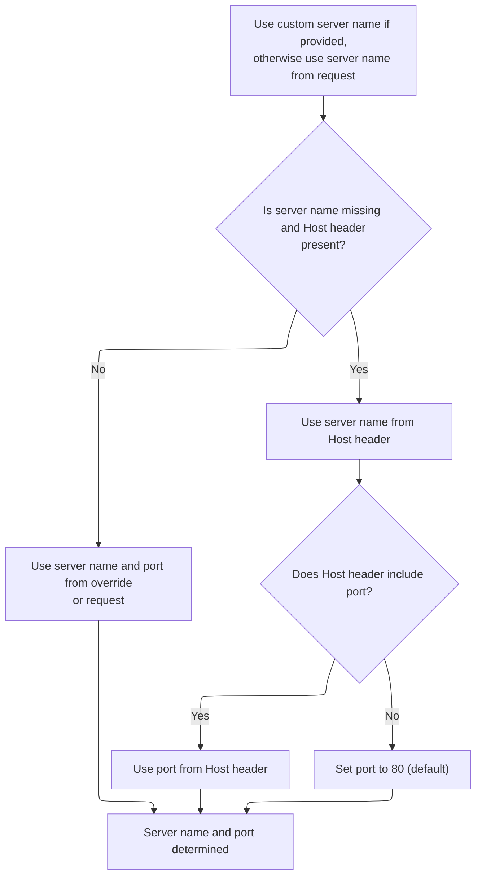
```mermaid
%%{init: {"flowchart": {"defaultRenderer": "elk"}} }%%
flowchart TD
  node1["Use custom server name if provided,
otherwise use server name from request"]
  click node1 openCode "taglib/src/main/java/org/apache/struts/taglib/html/BaseTag.java:117:118"
  node1 --> node2{"Is server name missing and Host header
present?"}
  click node2 openCode "taglib/src/main/java/org/apache/struts/taglib/html/BaseTag.java:123:123"
  node2 -->|"Yes"| node3["Use server name from Host header"]
  click node3 openCode "taglib/src/main/java/org/apache/struts/taglib/html/BaseTag.java:126:126"
  node2 -->|"No"| node4["Use server name and port from override
or request"]
  click node4 openCode "taglib/src/main/java/org/apache/struts/taglib/html/BaseTag.java:118:120"
  node3 --> node5{"Does Host header include port?"}
  click node5 openCode "taglib/src/main/java/org/apache/struts/taglib/html/BaseTag.java:128:128"
  node5 -->|"Yes"| node6["Use port from Host header"]
  click node6 openCode "taglib/src/main/java/org/apache/struts/taglib/html/BaseTag.java:132:133"
  node5 -->|"No"| node7["Set port to 80 (default)"]
  click node7 openCode "taglib/src/main/java/org/apache/struts/taglib/html/BaseTag.java:137:137"
  node6 --> node8["Server name and port determined"]
  click node8 openCode "taglib/src/main/java/org/apache/struts/taglib/html/BaseTag.java:139:139"
  node7 --> node8
  node4 --> node8
classDef HeadingStyle fill:#777777,stroke:#333,stroke-width:2px;

%% Swimm:
%% %%{init: {"flowchart": {"defaultRenderer": "elk"}} }%%
%% flowchart TD
%%   node1["Use custom server name if provided,
%% otherwise use server name from request"]
%%   click node1 openCode "<SwmPath>[taglib/…/html/BaseTag.java](taglib/src/main/java/org/apache/struts/taglib/html/BaseTag.java)</SwmPath>:117:118"
%%   node1 --> node2{"Is server name missing and Host header
%% present?"}
%%   click node2 openCode "<SwmPath>[taglib/…/html/BaseTag.java](taglib/src/main/java/org/apache/struts/taglib/html/BaseTag.java)</SwmPath>:123:123"
%%   node2 -->|"Yes"| node3["Use server name from Host header"]
%%   click node3 openCode "<SwmPath>[taglib/…/html/BaseTag.java](taglib/src/main/java/org/apache/struts/taglib/html/BaseTag.java)</SwmPath>:126:126"
%%   node2 -->|"No"| node4["Use server name and port from override
%% or request"]
%%   click node4 openCode "<SwmPath>[taglib/…/html/BaseTag.java](taglib/src/main/java/org/apache/struts/taglib/html/BaseTag.java)</SwmPath>:118:120"
%%   node3 --> node5{"Does Host header include port?"}
%%   click node5 openCode "<SwmPath>[taglib/…/html/BaseTag.java](taglib/src/main/java/org/apache/struts/taglib/html/BaseTag.java)</SwmPath>:128:128"
%%   node5 -->|"Yes"| node6["Use port from Host header"]
%%   click node6 openCode "<SwmPath>[taglib/…/html/BaseTag.java](taglib/src/main/java/org/apache/struts/taglib/html/BaseTag.java)</SwmPath>:132:133"
%%   node5 -->|"No"| node7["Set port to 80 (default)"]
%%   click node7 openCode "<SwmPath>[taglib/…/html/BaseTag.java](taglib/src/main/java/org/apache/struts/taglib/html/BaseTag.java)</SwmPath>:137:137"
%%   node6 --> node8["Server name and port determined"]
%%   click node8 openCode "<SwmPath>[taglib/…/html/BaseTag.java](taglib/src/main/java/org/apache/struts/taglib/html/BaseTag.java)</SwmPath>:139:139"
%%   node7 --> node8
%%   node4 --> node8
%% classDef HeadingStyle fill:#777777,stroke:#333,stroke-width:2px;
```

<SwmSnippet path="/taglib/src/main/java/org/apache/struts/taglib/html/BaseTag.java" line="117">

---

Back in BaseTag.doStartTag, after getting the request, we check if <SwmToken path="taglib/src/main/java/org/apache/struts/taglib/html/BaseTag.java" pos="117:3:3" line-data="        String serverName =">`serverName`</SwmToken> is set. If not, we try to pull it from the Host header, splitting on ':' to get the name and port. If parsing fails or the port isn't there, we just use 80. This is all about making sure the base tag has the right host and port, even if the config is incomplete. Next, we call into <SwmToken path="core/src/main/java/org/apache/struts/validator/validwhen/ValidWhenLexer.java" pos="1:25:25" line-data="// $ANTLR 2.7.7 (20060906): &quot;ValidWhenParser.g&quot; -&gt; &quot;ValidWhenLexer.java&quot;$">`ValidWhenLexer`</SwmToken> to tokenize and parse values, which is needed for further validation or processing.

```java
        String serverName =
            (this.server == null) ? request.getServerName() : this.server;

        int port = request.getServerPort();
        String headerHost = request.getHeader("Host");

        if ((serverName == null) && (headerHost != null)) {
            StringTokenizer tokenizer = new StringTokenizer(headerHost, ":");

            serverName = tokenizer.nextToken();

            if (tokenizer.hasMoreTokens()) {
                String portS = tokenizer.nextToken();

                try {
                    port = Integer.parseInt(portS);
                } catch (Exception e) {
                    port = 80;
                }
            } else {
                port = 80;
            }
        }

```

---

</SwmSnippet>

## Tokenizing Input for Validation Rules


```mermaid
%%{init: {"flowchart": {"defaultRenderer": "elk"}} }%%
flowchart TD
    node1["Start tokenization"]
    click node1 openCode "core/src/main/java/org/apache/struts/validator/validwhen/ValidWhenLexer.java:75:78"
    node1 --> nodeLoopStart
    subgraph loop1["Repeat until a valid token is found or
end of input"]
      nodeLoopStart["Begin token recognition"]
      click nodeLoopStart openCode "core/src/main/java/org/apache/struts/validator/validwhen/ValidWhenLexer.java:78:84"
      nodeLoopStart --> nodeCharType{"What is the next character?"}
      click nodeCharType openCode "core/src/main/java/org/apache/struts/validator/validwhen/ValidWhenLexer.java:84:159"
      nodeCharType -->|"Whitespace"| node2["Skipping Whitespace in Validation Input"]
      
      node2 --> nodeCheckSkip{"Is token SKIP?"}
      click nodeCheckSkip openCode "core/src/main/java/org/apache/struts/validator/validwhen/ValidWhenLexer.java:181:181"
      nodeCheckSkip -->|"Yes"| nodeLoopStart
      nodeCheckSkip -->|"No"| nodeAdjustType
      nodeCharType -->|"Digit or '-'"| node4["Parsing Numeric Literals"]
      
      node4 --> nodeAdjustType
      nodeCharType -->|"Quote"| node6["Parsing String Literals"]
      
      node6 --> nodeAdjustType
      nodeCharType -->|"["| node8["Parsing Left Bracket Token"]
      
      node8 --> nodeAdjustType
      nodeCharType -->|"]"| node10["Parsing Right Bracket Token"]
      
      node10 --> nodeAdjustType
      nodeCharType -->|"("| node12["Tokenizing Left Parenthesis"]
      
      node12 --> nodeAdjustType
      nodeCharType -->|")"| node14["Tokenizing Right Parenthesis"]
      
      node14 --> nodeAdjustType
      nodeCharType -->|"'*'"| node16["Tokenizing the '*this*' Keyword"]
      
      node16 --> nodeAdjustType
      nodeCharType -->|"Identifier"| node18["Tokenizing Field Names and Variables"]
      
      node18 --> nodeAdjustType
      nodeCharType -->|"'='"| node20["Tokenizing the '==' Operator"]
      
      node20 --> nodeAdjustType
      nodeCharType -->|"'!'"| node22["Tokenizing the '!=' Operator"]
      
      node22 --> nodeAdjustType
      nodeCharType -->|"'<='"| node24["Tokenizing the '<=' Operator"]
      
      node24 --> nodeAdjustType
      nodeCharType -->|"'>='"| node26["Tokenizing the '>=' Operator"]
      
      node26 --> nodeAdjustType
      nodeCharType -->|"'<'"| node28["Tokenizing Less-Than Operator"]
      
      node28 --> nodeAdjustType
      nodeCharType -->|"'>'"| node30["Tokenizing Greater-Than Operator"]
      
      node30 --> nodeAdjustType
      nodeCharType -->|"EOF"| nodeEOF["Return EOF token"]
      click nodeEOF openCode "core/src/main/java/org/apache/struts/validator/validwhen/ValidWhenLexer.java:177:178"
      nodeCharType -->|"Unrecognized"| nodeError["Raise error"]
      click nodeError openCode "core/src/main/java/org/apache/struts/validator/validwhen/ValidWhenLexer.java:178:179"
      nodeAdjustType["Adjust and finalize token type"]
      click nodeAdjustType openCode "core/src/main/java/org/apache/struts/validator/validwhen/ValidWhenLexer.java:182:185"
      nodeAdjustType --> nodeReturn
    end
    nodeReturn["Return recognized token"]
    click nodeReturn openCode "core/src/main/java/org/apache/struts/validator/validwhen/ValidWhenLexer.java:185:185"
classDef HeadingStyle fill:#777777,stroke:#333,stroke-width:2px;
click node2 goToHeading "Skipping Whitespace in Validation Input"
node2:::HeadingStyle
click node4 goToHeading "Parsing Numeric Literals"
node4:::HeadingStyle
click node6 goToHeading "Parsing String Literals"
node6:::HeadingStyle
click node8 goToHeading "Parsing Left Bracket Token"
node8:::HeadingStyle
click node10 goToHeading "Parsing Right Bracket Token"
node10:::HeadingStyle
click node12 goToHeading "Tokenizing Left Parenthesis"
node12:::HeadingStyle
click node14 goToHeading "Tokenizing Right Parenthesis"
node14:::HeadingStyle
click node16 goToHeading "Tokenizing the '*this*' Keyword"
node16:::HeadingStyle
click node18 goToHeading "Tokenizing Field Names and Variables"
node18:::HeadingStyle
click node20 goToHeading "Tokenizing the '==' Operator"
node20:::HeadingStyle
click node22 goToHeading "Tokenizing the '!=' Operator"
node22:::HeadingStyle
click node24 goToHeading "Tokenizing the '<=' Operator"
node24:::HeadingStyle
click node26 goToHeading "Tokenizing the '>=' Operator"
node26:::HeadingStyle
click node28 goToHeading "Tokenizing Less-Than Operator"
node28:::HeadingStyle
click node30 goToHeading "Tokenizing Greater-Than Operator"
node30:::HeadingStyle

%% Swimm:
%% %%{init: {"flowchart": {"defaultRenderer": "elk"}} }%%
%% flowchart TD
%%     node1["Start tokenization"]
%%     click node1 openCode "<SwmPath>[core/…/validwhen/ValidWhenLexer.java](core/src/main/java/org/apache/struts/validator/validwhen/ValidWhenLexer.java)</SwmPath>:75:78"
%%     node1 --> nodeLoopStart
%%     subgraph loop1["Repeat until a valid token is found or
%% end of input"]
%%       nodeLoopStart["Begin token recognition"]
%%       click nodeLoopStart openCode "<SwmPath>[core/…/validwhen/ValidWhenLexer.java](core/src/main/java/org/apache/struts/validator/validwhen/ValidWhenLexer.java)</SwmPath>:78:84"
%%       nodeLoopStart --> nodeCharType{"What is the next character?"}
%%       click nodeCharType openCode "<SwmPath>[core/…/validwhen/ValidWhenLexer.java](core/src/main/java/org/apache/struts/validator/validwhen/ValidWhenLexer.java)</SwmPath>:84:159"
%%       nodeCharType -->|"Whitespace"| node2["Skipping Whitespace in Validation Input"]
%%       
%%       node2 --> nodeCheckSkip{"Is token SKIP?"}
%%       click nodeCheckSkip openCode "<SwmPath>[core/…/validwhen/ValidWhenLexer.java](core/src/main/java/org/apache/struts/validator/validwhen/ValidWhenLexer.java)</SwmPath>:181:181"
%%       nodeCheckSkip -->|"Yes"| nodeLoopStart
%%       nodeCheckSkip -->|"No"| nodeAdjustType
%%       nodeCharType -->|"Digit or '-'"| node4["Parsing Numeric Literals"]
%%       
%%       node4 --> nodeAdjustType
%%       nodeCharType -->|"Quote"| node6["Parsing String Literals"]
%%       
%%       node6 --> nodeAdjustType
%%       nodeCharType -->|"["| node8["Parsing Left Bracket Token"]
%%       
%%       node8 --> nodeAdjustType
%%       nodeCharType -->|"]"| node10["Parsing Right Bracket Token"]
%%       
%%       node10 --> nodeAdjustType
%%       nodeCharType -->|"("| node12["Tokenizing Left Parenthesis"]
%%       
%%       node12 --> nodeAdjustType
%%       nodeCharType -->|")"| node14["Tokenizing Right Parenthesis"]
%%       
%%       node14 --> nodeAdjustType
%%       nodeCharType -->|"'*'"| node16["Tokenizing the '*this*' Keyword"]
%%       
%%       node16 --> nodeAdjustType
%%       nodeCharType -->|"Identifier"| node18["Tokenizing Field Names and Variables"]
%%       
%%       node18 --> nodeAdjustType
%%       nodeCharType -->|"'='"| node20["Tokenizing the '==' Operator"]
%%       
%%       node20 --> nodeAdjustType
%%       nodeCharType -->|"'!'"| node22["Tokenizing the '!=' Operator"]
%%       
%%       node22 --> nodeAdjustType
%%       nodeCharType -->|"'<='"| node24["Tokenizing the '<=' Operator"]
%%       
%%       node24 --> nodeAdjustType
%%       nodeCharType -->|"'>='"| node26["Tokenizing the '>=' Operator"]
%%       
%%       node26 --> nodeAdjustType
%%       nodeCharType -->|"'<'"| node28["Tokenizing Less-Than Operator"]
%%       
%%       node28 --> nodeAdjustType
%%       nodeCharType -->|"'>'"| node30["Tokenizing Greater-Than Operator"]
%%       
%%       node30 --> nodeAdjustType
%%       nodeCharType -->|"EOF"| nodeEOF["Return EOF token"]
%%       click nodeEOF openCode "<SwmPath>[core/…/validwhen/ValidWhenLexer.java](core/src/main/java/org/apache/struts/validator/validwhen/ValidWhenLexer.java)</SwmPath>:177:178"
%%       nodeCharType -->|"Unrecognized"| nodeError["Raise error"]
%%       click nodeError openCode "<SwmPath>[core/…/validwhen/ValidWhenLexer.java](core/src/main/java/org/apache/struts/validator/validwhen/ValidWhenLexer.java)</SwmPath>:178:179"
%%       nodeAdjustType["Adjust and finalize token type"]
%%       click nodeAdjustType openCode "<SwmPath>[core/…/validwhen/ValidWhenLexer.java](core/src/main/java/org/apache/struts/validator/validwhen/ValidWhenLexer.java)</SwmPath>:182:185"
%%       nodeAdjustType --> nodeReturn
%%     end
%%     nodeReturn["Return recognized token"]
%%     click nodeReturn openCode "<SwmPath>[core/…/validwhen/ValidWhenLexer.java](core/src/main/java/org/apache/struts/validator/validwhen/ValidWhenLexer.java)</SwmPath>:185:185"
%% classDef HeadingStyle fill:#777777,stroke:#333,stroke-width:2px;
%% click node2 goToHeading "Skipping Whitespace in Validation Input"
%% node2:::HeadingStyle
%% click node4 goToHeading "Parsing Numeric Literals"
%% node4:::HeadingStyle
%% click node6 goToHeading "Parsing String Literals"
%% node6:::HeadingStyle
%% click node8 goToHeading "Parsing Left Bracket Token"
%% node8:::HeadingStyle
%% click node10 goToHeading "Parsing Right Bracket Token"
%% node10:::HeadingStyle
%% click node12 goToHeading "Tokenizing Left Parenthesis"
%% node12:::HeadingStyle
%% click node14 goToHeading "Tokenizing Right Parenthesis"
%% node14:::HeadingStyle
%% click node16 goToHeading "Tokenizing the '*this*' Keyword"
%% node16:::HeadingStyle
%% click node18 goToHeading "Tokenizing Field Names and Variables"
%% node18:::HeadingStyle
%% click node20 goToHeading "Tokenizing the '==' Operator"
%% node20:::HeadingStyle
%% click node22 goToHeading "Tokenizing the '!=' Operator"
%% node22:::HeadingStyle
%% click node24 goToHeading "Tokenizing the '<=' Operator"
%% node24:::HeadingStyle
%% click node26 goToHeading "Tokenizing the '>=' Operator"
%% node26:::HeadingStyle
%% click node28 goToHeading "Tokenizing Less-Than Operator"
%% node28:::HeadingStyle
%% click node30 goToHeading "Tokenizing Greater-Than Operator"
%% node30:::HeadingStyle
```

<SwmSnippet path="/core/src/main/java/org/apache/struts/validator/validwhen/ValidWhenLexer.java" line="75">

---

In <SwmToken path="core/src/main/java/org/apache/struts/validator/validwhen/ValidWhenLexer.java" pos="75:4:4" line-data="public Token nextToken() throws TokenStreamException {">`nextToken`</SwmToken>, we loop through the input, using a switch to decide which token type to match next. This is where the lexer starts breaking up the input for validation, and it calls out to specific matchers like <SwmToken path="core/src/main/java/org/apache/struts/validator/validwhen/ValidWhenLexer.java" pos="87:1:1" line-data="					mWS(true);">`mWS`</SwmToken> for whitespace.

```java
public Token nextToken() throws TokenStreamException {
	Token theRetToken=null;
tryAgain:
	for (;;) {
		Token _token = null;
		int _ttype = Token.INVALID_TYPE;
		resetText();
		try {   // for char stream error handling
			try {   // for lexical error handling
				switch ( LA(1)) {
				case '\t':  case '\n':  case '\r':  case ' ':
				{
					mWS(true);
					theRetToken=_returnToken;
					break;
				}
				case '-':  case '0':  case '1':  case '2':
				case '3':  case '4':  case '5':  case '6':
```

---

</SwmSnippet>

### Skipping Whitespace in Validation Input

See <SwmLink doc-title="Dynamic Configuration Matching and Customization">[Dynamic Configuration Matching and Customization](/.swm/dynamic-configuration-matching-and-customization.i870ohri.sw.md)</SwmLink>

### Handling Numeric Literals in Validation Input

<SwmSnippet path="/core/src/main/java/org/apache/struts/validator/validwhen/ValidWhenLexer.java" line="93">

---

Just after returning from <SwmToken path="core/src/main/java/org/apache/struts/validator/validwhen/ValidWhenLexer.java" pos="87:1:1" line-data="					mWS(true);">`mWS`</SwmToken> in ValidWhenLexer.nextToken, we check for digits and call <SwmToken path="core/src/main/java/org/apache/struts/validator/validwhen/ValidWhenLexer.java" pos="95:1:1" line-data="					mDECIMAL_LITERAL(true);">`mDECIMAL_LITERAL`</SwmToken>. This is where we start parsing numbers, which can be decimals, hex, octal, or floats, depending on the input.

```java
				case '7':  case '8':  case '9':
				{
					mDECIMAL_LITERAL(true);
					theRetToken=_returnToken;
					break;
				}
```

---

</SwmSnippet>

### Parsing Numeric Literals

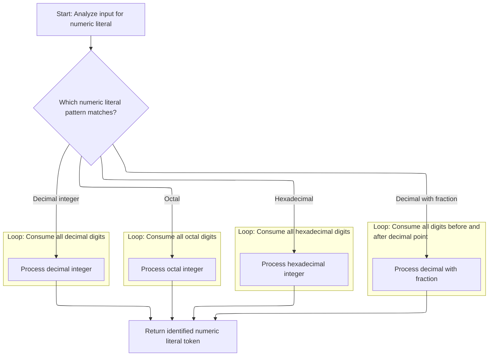
```mermaid
%%{init: {"flowchart": {"defaultRenderer": "elk"}} }%%
flowchart TD
  node1["Start: Analyze input for numeric literal"]
  click node1 openCode "core/src/main/java/org/apache/struts/validator/validwhen/ValidWhenLexer.java:250:255"
  node1 --> node2{"Which numeric literal pattern matches?"}
  click node2 openCode "core/src/main/java/org/apache/struts/validator/validwhen/ValidWhenLexer.java:256:306"
  node2 -->|"Decimal with fraction"| node3["Process decimal with fraction"]
  click node3 openCode "core/src/main/java/org/apache/struts/validator/validwhen/ValidWhenLexer.java:306:361"
  subgraph loop1["Loop: Consume all digits before and
after decimal point"]
    node3
  end
  node2 -->|"Hexadecimal"| node4["Process hexadecimal integer"]
  click node4 openCode "core/src/main/java/org/apache/struts/validator/validwhen/ValidWhenLexer.java:361:413"
  subgraph loop2["Loop: Consume all hexadecimal digits"]
    node4
  end
  node2 -->|"Octal"| node5["Process octal integer"]
  click node5 openCode "core/src/main/java/org/apache/struts/validator/validwhen/ValidWhenLexer.java:413:450"
  subgraph loop3["Loop: Consume all octal digits"]
    node5
  end
  node2 -->|"Decimal integer"| node6["Process decimal integer"]
  click node6 openCode "core/src/main/java/org/apache/struts/validator/validwhen/ValidWhenLexer.java:450:491"
  subgraph loop4["Loop: Consume all decimal digits"]
    node6
  end
  node3 --> node7["Create and return token for literal type"]
  node4 --> node7
  node5 --> node7
  node6 --> node7
  node7["Return identified numeric literal token"]
  click node7 openCode "core/src/main/java/org/apache/struts/validator/validwhen/ValidWhenLexer.java:495:500"
classDef HeadingStyle fill:#777777,stroke:#333,stroke-width:2px;

%% Swimm:
%% %%{init: {"flowchart": {"defaultRenderer": "elk"}} }%%
%% flowchart TD
%%   node1["Start: Analyze input for numeric literal"]
%%   click node1 openCode "<SwmPath>[core/…/validwhen/ValidWhenLexer.java](core/src/main/java/org/apache/struts/validator/validwhen/ValidWhenLexer.java)</SwmPath>:250:255"
%%   node1 --> node2{"Which numeric literal pattern matches?"}
%%   click node2 openCode "<SwmPath>[core/…/validwhen/ValidWhenLexer.java](core/src/main/java/org/apache/struts/validator/validwhen/ValidWhenLexer.java)</SwmPath>:256:306"
%%   node2 -->|"Decimal with fraction"| node3["Process decimal with fraction"]
%%   click node3 openCode "<SwmPath>[core/…/validwhen/ValidWhenLexer.java](core/src/main/java/org/apache/struts/validator/validwhen/ValidWhenLexer.java)</SwmPath>:306:361"
%%   subgraph loop1["Loop: Consume all digits before and
%% after decimal point"]
%%     node3
%%   end
%%   node2 -->|"Hexadecimal"| node4["Process hexadecimal integer"]
%%   click node4 openCode "<SwmPath>[core/…/validwhen/ValidWhenLexer.java](core/src/main/java/org/apache/struts/validator/validwhen/ValidWhenLexer.java)</SwmPath>:361:413"
%%   subgraph loop2["Loop: Consume all hexadecimal digits"]
%%     node4
%%   end
%%   node2 -->|"Octal"| node5["Process octal integer"]
%%   click node5 openCode "<SwmPath>[core/…/validwhen/ValidWhenLexer.java](core/src/main/java/org/apache/struts/validator/validwhen/ValidWhenLexer.java)</SwmPath>:413:450"
%%   subgraph loop3["Loop: Consume all octal digits"]
%%     node5
%%   end
%%   node2 -->|"Decimal integer"| node6["Process decimal integer"]
%%   click node6 openCode "<SwmPath>[core/…/validwhen/ValidWhenLexer.java](core/src/main/java/org/apache/struts/validator/validwhen/ValidWhenLexer.java)</SwmPath>:450:491"
%%   subgraph loop4["Loop: Consume all decimal digits"]
%%     node6
%%   end
%%   node3 --> node7["Create and return token for literal type"]
%%   node4 --> node7
%%   node5 --> node7
%%   node6 --> node7
%%   node7["Return identified numeric literal token"]
%%   click node7 openCode "<SwmPath>[core/…/validwhen/ValidWhenLexer.java](core/src/main/java/org/apache/struts/validator/validwhen/ValidWhenLexer.java)</SwmPath>:495:500"
%% classDef HeadingStyle fill:#777777,stroke:#333,stroke-width:2px;
```

<SwmSnippet path="/core/src/main/java/org/apache/struts/validator/validwhen/ValidWhenLexer.java" line="250">

---

In <SwmToken path="core/src/main/java/org/apache/struts/validator/validwhen/ValidWhenLexer.java" pos="250:7:7" line-data="	public final void mDECIMAL_LITERAL(boolean _createToken) throws RecognitionException, CharStreamException, TokenStreamException {">`mDECIMAL_LITERAL`</SwmToken>, we use lookahead and predicates to figure out if we're dealing with a float, hex, octal, or decimal integer. The function branches based on the input, matches the right pattern, and sets the token type so downstream code knows what kind of number it got.

```java
	public final void mDECIMAL_LITERAL(boolean _createToken) throws RecognitionException, CharStreamException, TokenStreamException {
		int _ttype; Token _token=null; int _begin=text.length();
		_ttype = DECIMAL_LITERAL;
		int _saveIndex;
		
		boolean synPredMatched24 = false;
		if (((_tokenSet_0.member(LA(1))) && (_tokenSet_1.member(LA(2))))) {
			int _m24 = mark();
			synPredMatched24 = true;
			inputState.guessing++;
			try {
				{
				{
				switch ( LA(1)) {
				case '-':
				{
					match('-');
					break;
				}
				case '0':  case '1':  case '2':  case '3':
				case '4':  case '5':  case '6':  case '7':
				case '8':  case '9':
				{
					break;
				}
				default:
				{
					throw new NoViableAltForCharException((char)LA(1), getFilename(), getLine(), getColumn());
				}
				}
				}
				{
				int _cnt22=0;
				_loop22:
				do {
					if (((LA(1) >= '0' && LA(1) <= '9'))) {
						matchRange('0','9');
					}
					else {
						if ( _cnt22>=1 ) { break _loop22; } else {throw new NoViableAltForCharException((char)LA(1), getFilename(), getLine(), getColumn());}
					}
					
					_cnt22++;
				} while (true);
```

---

</SwmSnippet>

<SwmSnippet path="/core/src/main/java/org/apache/struts/validator/validwhen/ValidWhenLexer.java" line="296">

---

Here we're matching the decimal point after the integer part if we're parsing a floating-point number. This is the continuation of the float parsing branch, and the next snippet keeps matching the digits after the decimal.

```java
				match('.');
				}
				}
			}
			catch (RecognitionException pe) {
				synPredMatched24 = false;
			}
			rewind(_m24);
inputState.guessing--;
		}
		if ( synPredMatched24 ) {
			{
			{
			switch ( LA(1)) {
			case '-':
			{
				match('-');
				break;
			}
			case '0':  case '1':  case '2':  case '3':
			case '4':  case '5':  case '6':  case '7':
			case '8':  case '9':
			{
				break;
			}
			default:
			{
				throw new NoViableAltForCharException((char)LA(1), getFilename(), getLine(), getColumn());
			}
			}
			}
			{
			int _cnt28=0;
			_loop28:
			do {
				if (((LA(1) >= '0' && LA(1) <= '9'))) {
					matchRange('0','9');
				}
				else {
					if ( _cnt28>=1 ) { break _loop28; } else {throw new NoViableAltForCharException((char)LA(1), getFilename(), getLine(), getColumn());}
				}
				
				_cnt28++;
			} while (true);
```

---

</SwmSnippet>

<SwmSnippet path="/core/src/main/java/org/apache/struts/validator/validwhen/ValidWhenLexer.java" line="342">

---

Now we're matching the digits after the decimal point for a floating-point literal. This wraps up the float parsing, and the next part checks for other numeric formats like hex or octal.

```java
			match('.');
			}
			{
			int _cnt31=0;
			_loop31:
			do {
				if (((LA(1) >= '0' && LA(1) <= '9'))) {
					matchRange('0','9');
				}
				else {
					if ( _cnt31>=1 ) { break _loop31; } else {throw new NoViableAltForCharException((char)LA(1), getFilename(), getLine(), getColumn());}
				}
				
				_cnt31++;
			} while (true);
```

---

</SwmSnippet>

<SwmSnippet path="/core/src/main/java/org/apache/struts/validator/validwhen/ValidWhenLexer.java" line="361">

---

This is where we use another syntactic predicate to check for a hexadecimal literal (0x...). If the lookahead matches, we branch into hex parsing. If not, we keep checking for octal or decimal formats. The guessing logic here prevents us from consuming input unless we're sure.

```java
			boolean synPredMatched38 = false;
			if (((LA(1)=='0') && (LA(2)=='x'))) {
				int _m38 = mark();
				synPredMatched38 = true;
				inputState.guessing++;
				try {
					{
					match('0');
					match('x');
					}
				}
				catch (RecognitionException pe) {
					synPredMatched38 = false;
				}
				rewind(_m38);
inputState.guessing--;
			}
			if ( synPredMatched38 ) {
				{
				match('0');
				match('x');
				{
				int _cnt41=0;
				_loop41:
				do {
					switch ( LA(1)) {
					case '0':  case '1':  case '2':  case '3':
					case '4':  case '5':  case '6':  case '7':
					case '8':  case '9':
					{
						matchRange('0','9');
						break;
					}
					case 'a':  case 'b':  case 'c':  case 'd':
					case 'e':  case 'f':
					{
						matchRange('a','f');
						break;
					}
					default:
					{
						if ( _cnt41>=1 ) { break _loop41; } else {throw new NoViableAltForCharException((char)LA(1), getFilename(), getLine(), getColumn());}
					}
					}
					_cnt41++;
				} while (true);
```

---

</SwmSnippet>

<SwmSnippet path="/core/src/main/java/org/apache/struts/validator/validwhen/ValidWhenLexer.java" line="409">

---

After handling hex, we check for octal literals (starting with 0 and followed by 0-7). If that doesn't match, we fall through to decimal integer parsing. Each branch sets the token type for the matched format.

```java
				if ( inputState.guessing==0 ) {
					_ttype = HEX_INT_LITERAL;
				}
			}
			else {
				boolean synPredMatched33 = false;
				if (((LA(1)=='0') && (true))) {
					int _m33 = mark();
					synPredMatched33 = true;
					inputState.guessing++;
					try {
						{
						match('0');
						}
					}
					catch (RecognitionException pe) {
						synPredMatched33 = false;
					}
					rewind(_m33);
inputState.guessing--;
				}
				if ( synPredMatched33 ) {
					{
					match('0');
					{
					_loop36:
					do {
						if (((LA(1) >= '0' && LA(1) <= '7'))) {
							matchRange('0','7');
						}
						else {
							break _loop36;
						}
						
					} while (true);
```

---

</SwmSnippet>

<SwmSnippet path="/core/src/main/java/org/apache/struts/validator/validwhen/ValidWhenLexer.java" line="446">

---

Here we're finalizing the numeric literal parsing. If none of the special cases match, we parse a regular decimal integer (with optional leading '-'). After this, we need to call into ActionConfigMatcher to map the parsed tokens to action configs for further processing.

```java
					if ( inputState.guessing==0 ) {
						_ttype = OCTAL_INT_LITERAL;
					}
				}
				else if ((_tokenSet_2.member(LA(1))) && (true)) {
					{
					{
					switch ( LA(1)) {
					case '-':
					{
						match('-');
						break;
					}
					case '1':  case '2':  case '3':  case '4':
					case '5':  case '6':  case '7':  case '8':
					case '9':
					{
						break;
					}
```

---

</SwmSnippet>

<SwmSnippet path="/core/src/main/java/org/apache/struts/validator/validwhen/ValidWhenLexer.java" line="465">

---

Just returned from ActionConfigMatcher, so now in ValidWhenLexer.mDECIMAL_LITERAL, we set the token type for decimal integers and wrap up the token creation. The result is a token ready for the parser to consume.

```java
					default:
					{
						throw new NoViableAltForCharException((char)LA(1), getFilename(), getLine(), getColumn());
					}
					}
					}
					{
					matchRange('1','9');
					}
					{
					_loop46:
					do {
						if (((LA(1) >= '0' && LA(1) <= '9'))) {
							matchRange('0','9');
						}
						else {
							break _loop46;
						}
						
					} while (true);
```

---

</SwmSnippet>

<SwmSnippet path="/core/src/main/java/org/apache/struts/validator/validwhen/ValidWhenLexer.java" line="487">

---

At the end of <SwmToken path="core/src/main/java/org/apache/struts/validator/validwhen/ValidWhenLexer.java" pos="95:1:1" line-data="					mDECIMAL_LITERAL(true);">`mDECIMAL_LITERAL`</SwmToken>, we return a token with the right type (float, hex, octal, or decimal) based on what we matched. This token is used by the parser to understand the input's structure.

```java
					if ( inputState.guessing==0 ) {
						_ttype = DEC_INT_LITERAL;
					}
				}
				else {
					throw new NoViableAltForCharException((char)LA(1), getFilename(), getLine(), getColumn());
				}
				}}
				if ( _createToken && _token==null && _ttype!=Token.SKIP ) {
					_token = makeToken(_ttype);
					_token.setText(new String(text.getBuffer(), _begin, text.length()-_begin));
				}
				_returnToken = _token;
			}
```

---

</SwmSnippet>

### Handling String Literals in Validation Input

<SwmSnippet path="/core/src/main/java/org/apache/struts/validator/validwhen/ValidWhenLexer.java" line="99">

---

Just after returning from <SwmToken path="core/src/main/java/org/apache/struts/validator/validwhen/ValidWhenLexer.java" pos="95:1:1" line-data="					mDECIMAL_LITERAL(true);">`mDECIMAL_LITERAL`</SwmToken> in ValidWhenLexer.nextToken, we check for quotes and call <SwmToken path="core/src/main/java/org/apache/struts/validator/validwhen/ValidWhenLexer.java" pos="101:1:1" line-data="					mSTRING_LITERAL(true);">`mSTRING_LITERAL`</SwmToken>. This is where we parse string tokens, which are needed for things like field names or literal values in validation rules.

```java
				case '"':  case '\'':
				{
					mSTRING_LITERAL(true);
					theRetToken=_returnToken;
					break;
				}
```

---

</SwmSnippet>

### Parsing String Literals

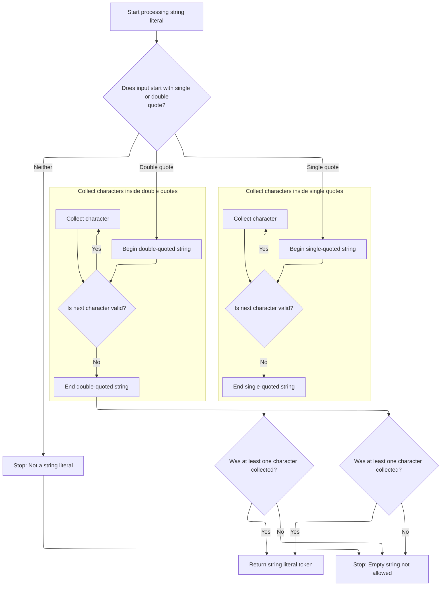
```mermaid
%%{init: {"flowchart": {"defaultRenderer": "elk"}} }%%
flowchart TD
  node1["Start processing string literal"] --> node2{"Does input start with single or double
quote?"}
  click node1 openCode "core/src/main/java/org/apache/struts/validator/validwhen/ValidWhenLexer.java:502:507"
  node2 -->|"Single quote"| node3["Begin single-quoted string"]
  click node2 openCode "core/src/main/java/org/apache/struts/validator/validwhen/ValidWhenLexer.java:507:508"
  node2 -->|"Double quote"| node6["Begin double-quoted string"]
  click node2 openCode "core/src/main/java/org/apache/struts/validator/validwhen/ValidWhenLexer.java:530:531"
  node2 -->|"Neither"| node10["Stop: Not a string literal"]
  click node10 openCode "core/src/main/java/org/apache/struts/validator/validwhen/ValidWhenLexer.java:552:555"

  subgraph loop1["Collect characters inside single quotes"]
    node3 --> node4{"Is next character valid?"}
    click node3 openCode "core/src/main/java/org/apache/struts/validator/validwhen/ValidWhenLexer.java:510:526"
    node4 -->|"Yes"| node5["Collect character"]
    click node4 openCode "core/src/main/java/org/apache/struts/validator/validwhen/ValidWhenLexer.java:516:517"
    node5 --> node4
    node4 -->|"No"| node8["End single-quoted string"]
    click node8 openCode "core/src/main/java/org/apache/struts/validator/validwhen/ValidWhenLexer.java:526:528"
  end

  subgraph loop2["Collect characters inside double quotes"]
    node6 --> node7{"Is next character valid?"}
    click node6 openCode "core/src/main/java/org/apache/struts/validator/validwhen/ValidWhenLexer.java:532:548"
    node7 -->|"Yes"| node9["Collect character"]
    click node7 openCode "core/src/main/java/org/apache/struts/validator/validwhen/ValidWhenLexer.java:538:539"
    node9 --> node7
    node7 -->|"No"| node11["End double-quoted string"]
    click node11 openCode "core/src/main/java/org/apache/struts/validator/validwhen/ValidWhenLexer.java:548:550"
  end

  node8 --> node12{"Was at least one character collected?"}
  click node12 openCode "core/src/main/java/org/apache/struts/validator/validwhen/ValidWhenLexer.java:520:521"
  node11 --> node13{"Was at least one character collected?"}
  click node13 openCode "core/src/main/java/org/apache/struts/validator/validwhen/ValidWhenLexer.java:542:543"
  node12 -->|"Yes"| node14["Return string literal token"]
  click node14 openCode "core/src/main/java/org/apache/struts/validator/validwhen/ValidWhenLexer.java:557:562"
  node12 -->|"No"| node15["Stop: Empty string not allowed"]
  click node15 openCode "core/src/main/java/org/apache/struts/validator/validwhen/ValidWhenLexer.java:520:521"
  node13 -->|"Yes"| node14
  node13 -->|"No"| node15
  node10 --> node15

classDef HeadingStyle fill:#777777,stroke:#333,stroke-width:2px;

%% Swimm:
%% %%{init: {"flowchart": {"defaultRenderer": "elk"}} }%%
%% flowchart TD
%%   node1["Start processing string literal"] --> node2{"Does input start with single or double
%% quote?"}
%%   click node1 openCode "<SwmPath>[core/…/validwhen/ValidWhenLexer.java](core/src/main/java/org/apache/struts/validator/validwhen/ValidWhenLexer.java)</SwmPath>:502:507"
%%   node2 -->|"Single quote"| node3["Begin single-quoted string"]
%%   click node2 openCode "<SwmPath>[core/…/validwhen/ValidWhenLexer.java](core/src/main/java/org/apache/struts/validator/validwhen/ValidWhenLexer.java)</SwmPath>:507:508"
%%   node2 -->|"Double quote"| node6["Begin double-quoted string"]
%%   click node2 openCode "<SwmPath>[core/…/validwhen/ValidWhenLexer.java](core/src/main/java/org/apache/struts/validator/validwhen/ValidWhenLexer.java)</SwmPath>:530:531"
%%   node2 -->|"Neither"| node10["Stop: Not a string literal"]
%%   click node10 openCode "<SwmPath>[core/…/validwhen/ValidWhenLexer.java](core/src/main/java/org/apache/struts/validator/validwhen/ValidWhenLexer.java)</SwmPath>:552:555"
%% 
%%   subgraph loop1["Collect characters inside single quotes"]
%%     node3 --> node4{"Is next character valid?"}
%%     click node3 openCode "<SwmPath>[core/…/validwhen/ValidWhenLexer.java](core/src/main/java/org/apache/struts/validator/validwhen/ValidWhenLexer.java)</SwmPath>:510:526"
%%     node4 -->|"Yes"| node5["Collect character"]
%%     click node4 openCode "<SwmPath>[core/…/validwhen/ValidWhenLexer.java](core/src/main/java/org/apache/struts/validator/validwhen/ValidWhenLexer.java)</SwmPath>:516:517"
%%     node5 --> node4
%%     node4 -->|"No"| node8["End single-quoted string"]
%%     click node8 openCode "<SwmPath>[core/…/validwhen/ValidWhenLexer.java](core/src/main/java/org/apache/struts/validator/validwhen/ValidWhenLexer.java)</SwmPath>:526:528"
%%   end
%% 
%%   subgraph loop2["Collect characters inside double quotes"]
%%     node6 --> node7{"Is next character valid?"}
%%     click node6 openCode "<SwmPath>[core/…/validwhen/ValidWhenLexer.java](core/src/main/java/org/apache/struts/validator/validwhen/ValidWhenLexer.java)</SwmPath>:532:548"
%%     node7 -->|"Yes"| node9["Collect character"]
%%     click node7 openCode "<SwmPath>[core/…/validwhen/ValidWhenLexer.java](core/src/main/java/org/apache/struts/validator/validwhen/ValidWhenLexer.java)</SwmPath>:538:539"
%%     node9 --> node7
%%     node7 -->|"No"| node11["End double-quoted string"]
%%     click node11 openCode "<SwmPath>[core/…/validwhen/ValidWhenLexer.java](core/src/main/java/org/apache/struts/validator/validwhen/ValidWhenLexer.java)</SwmPath>:548:550"
%%   end
%% 
%%   node8 --> node12{"Was at least one character collected?"}
%%   click node12 openCode "<SwmPath>[core/…/validwhen/ValidWhenLexer.java](core/src/main/java/org/apache/struts/validator/validwhen/ValidWhenLexer.java)</SwmPath>:520:521"
%%   node11 --> node13{"Was at least one character collected?"}
%%   click node13 openCode "<SwmPath>[core/…/validwhen/ValidWhenLexer.java](core/src/main/java/org/apache/struts/validator/validwhen/ValidWhenLexer.java)</SwmPath>:542:543"
%%   node12 -->|"Yes"| node14["Return string literal token"]
%%   click node14 openCode "<SwmPath>[core/…/validwhen/ValidWhenLexer.java](core/src/main/java/org/apache/struts/validator/validwhen/ValidWhenLexer.java)</SwmPath>:557:562"
%%   node12 -->|"No"| node15["Stop: Empty string not allowed"]
%%   click node15 openCode "<SwmPath>[core/…/validwhen/ValidWhenLexer.java](core/src/main/java/org/apache/struts/validator/validwhen/ValidWhenLexer.java)</SwmPath>:520:521"
%%   node13 -->|"Yes"| node14
%%   node13 -->|"No"| node15
%%   node10 --> node15
%% 
%% classDef HeadingStyle fill:#777777,stroke:#333,stroke-width:2px;
```

<SwmSnippet path="/core/src/main/java/org/apache/struts/validator/validwhen/ValidWhenLexer.java" line="502">

---

In <SwmToken path="core/src/main/java/org/apache/struts/validator/validwhen/ValidWhenLexer.java" pos="502:7:7" line-data="	public final void mSTRING_LITERAL(boolean _createToken) throws RecognitionException, CharStreamException, TokenStreamException {">`mSTRING_LITERAL`</SwmToken>, we check if the string starts with a single or double quote, then match everything up to the closing quote. This is how we extract string values from the input.

```java
	public final void mSTRING_LITERAL(boolean _createToken) throws RecognitionException, CharStreamException, TokenStreamException {
		int _ttype; Token _token=null; int _begin=text.length();
		_ttype = STRING_LITERAL;
		int _saveIndex;
		
		switch ( LA(1)) {
		case '\'':
		{
			{
			match('\'');
			{
			int _cnt50=0;
			_loop50:
			do {
				if ((_tokenSet_3.member(LA(1)))) {
					matchNot('\'');
				}
				else {
					if ( _cnt50>=1 ) { break _loop50; } else {throw new NoViableAltForCharException((char)LA(1), getFilename(), getLine(), getColumn());}
				}
				
				_cnt50++;
			} while (true);
```

---

</SwmSnippet>

<SwmSnippet path="/core/src/main/java/org/apache/struts/validator/validwhen/ValidWhenLexer.java" line="526">

---

Here we're matching the closing quote for single-quoted strings, then branching to handle double-quoted strings in the next part. Both branches ensure the string is properly terminated.

```java
			match('\'');
			}
			break;
		}
		case '"':
		{
			{
			match('\"');
			{
			int _cnt53=0;
			_loop53:
			do {
				if ((_tokenSet_4.member(LA(1)))) {
					matchNot('\"');
				}
				else {
					if ( _cnt53>=1 ) { break _loop53; } else {throw new NoViableAltForCharException((char)LA(1), getFilename(), getLine(), getColumn());}
				}
				
				_cnt53++;
			} while (true);
```

---

</SwmSnippet>

<SwmSnippet path="/core/src/main/java/org/apache/struts/validator/validwhen/ValidWhenLexer.java" line="548">

---

This part throws an exception if the input isn't a valid string literal. After handling strings, we need to call ActionConfigMatcher to map the parsed tokens to action configs for further processing.

```java
			match('\"');
			}
			break;
		}
		default:
		{
			throw new NoViableAltForCharException((char)LA(1), getFilename(), getLine(), getColumn());
		}
		}
```

---

</SwmSnippet>

<SwmSnippet path="/core/src/main/java/org/apache/struts/validator/validwhen/ValidWhenLexer.java" line="557">

---

Just returned from ActionConfigMatcher, so now in ValidWhenLexer.mSTRING_LITERAL, we create and return the string token. The parser can now use this token for further validation logic.

```java
		if ( _createToken && _token==null && _ttype!=Token.SKIP ) {
			_token = makeToken(_ttype);
			_token.setText(new String(text.getBuffer(), _begin, text.length()-_begin));
		}
		_returnToken = _token;
	}
```

---

</SwmSnippet>

### Handling Bracket Tokens in Validation Input

<SwmSnippet path="/core/src/main/java/org/apache/struts/validator/validwhen/ValidWhenLexer.java" line="105">

---

Just after returning from <SwmToken path="core/src/main/java/org/apache/struts/validator/validwhen/ValidWhenLexer.java" pos="101:1:1" line-data="					mSTRING_LITERAL(true);">`mSTRING_LITERAL`</SwmToken> in ValidWhenLexer.nextToken, we check for '\[' and call <SwmToken path="core/src/main/java/org/apache/struts/validator/validwhen/ValidWhenLexer.java" pos="107:1:1" line-data="					mLBRACKET(true);">`mLBRACKET`</SwmToken>. This is where we tokenize left brackets, which are used for grouping or array access in validation rules.

```java
				case '[':
				{
					mLBRACKET(true);
					theRetToken=_returnToken;
					break;
				}
```

---

</SwmSnippet>

### Parsing Left Bracket Token

<SwmSnippet path="/core/src/main/java/org/apache/struts/validator/validwhen/ValidWhenLexer.java" line="564">

---

In <SwmToken path="core/src/main/java/org/apache/struts/validator/validwhen/ValidWhenLexer.java" pos="564:7:7" line-data="	public final void mLBRACKET(boolean _createToken) throws RecognitionException, CharStreamException, TokenStreamException {">`mLBRACKET`</SwmToken>, we just match the '\[' character and create a token for it. After this, we need to call ActionConfigMatcher to map the bracket token to the right action config for further parsing.

```java
	public final void mLBRACKET(boolean _createToken) throws RecognitionException, CharStreamException, TokenStreamException {
		int _ttype; Token _token=null; int _begin=text.length();
		_ttype = LBRACKET;
		int _saveIndex;
		
		match('[');
```

---

</SwmSnippet>

<SwmSnippet path="/core/src/main/java/org/apache/struts/validator/validwhen/ValidWhenLexer.java" line="570">

---

Just returned from ActionConfigMatcher, so now in ValidWhenLexer.mLBRACKET, we create and return the left bracket token. The parser can now use this for grouping or array access.

```java
		if ( _createToken && _token==null && _ttype!=Token.SKIP ) {
			_token = makeToken(_ttype);
			_token.setText(new String(text.getBuffer(), _begin, text.length()-_begin));
		}
		_returnToken = _token;
	}
```

---

</SwmSnippet>

### Handling Right Bracket Tokens in Validation Input

<SwmSnippet path="/core/src/main/java/org/apache/struts/validator/validwhen/ValidWhenLexer.java" line="111">

---

Just after returning from <SwmToken path="core/src/main/java/org/apache/struts/validator/validwhen/ValidWhenLexer.java" pos="107:1:1" line-data="					mLBRACKET(true);">`mLBRACKET`</SwmToken> in ValidWhenLexer.nextToken, we check for '\]' and call <SwmToken path="core/src/main/java/org/apache/struts/validator/validwhen/ValidWhenLexer.java" pos="113:1:1" line-data="					mRBRACKET(true);">`mRBRACKET`</SwmToken>. This is where we tokenize right brackets, closing groups or array accesses in validation rules.

```java
				case ']':
				{
					mRBRACKET(true);
					theRetToken=_returnToken;
					break;
				}
```

---

</SwmSnippet>

### Parsing Right Bracket Token

```mermaid
%%{init: {"flowchart": {"defaultRenderer": "elk"}} }%%
flowchart TD
  node1["Recognize right bracket ('"]') in input]
  click node1 openCode "core/src/main/java/org/apache/struts/validator/validwhen/ValidWhenLexer.java:582:582"
  node1 --> node2{"Should create token? (_createToken && no
token exists && not SKIP)"}
  click node2 openCode "core/src/main/java/org/apache/struts/validator/validwhen/ValidWhenLexer.java:583:583"
  node2 -->|"Yes"| node3["Create token for right bracket"]
  click node3 openCode "core/src/main/java/org/apache/struts/validator/validwhen/ValidWhenLexer.java:584:585"
  node2 -->|"No"| node4["No token created"]
  click node4 openCode "core/src/main/java/org/apache/struts/validator/validwhen/ValidWhenLexer.java:583:586"
  node3 --> node5["Set return token"]
  node4 --> node5["Set return token"]
  click node5 openCode "core/src/main/java/org/apache/struts/validator/validwhen/ValidWhenLexer.java:587:588"
classDef HeadingStyle fill:#777777,stroke:#333,stroke-width:2px;

%% Swimm:
%% %%{init: {"flowchart": {"defaultRenderer": "elk"}} }%%
%% flowchart TD
%%   node1["Recognize right bracket ('"]') in input]
%%   click node1 openCode "<SwmPath>[core/…/validwhen/ValidWhenLexer.java](core/src/main/java/org/apache/struts/validator/validwhen/ValidWhenLexer.java)</SwmPath>:582:582"
%%   node1 --> node2{"Should create token? (<SwmToken path="core/src/main/java/org/apache/struts/validator/validwhen/ValidWhenLexer.java" pos="250:11:11" line-data="	public final void mDECIMAL_LITERAL(boolean _createToken) throws RecognitionException, CharStreamException, TokenStreamException {">`_createToken`</SwmToken> && no
%% token exists && not SKIP)"}
%%   click node2 openCode "<SwmPath>[core/…/validwhen/ValidWhenLexer.java](core/src/main/java/org/apache/struts/validator/validwhen/ValidWhenLexer.java)</SwmPath>:583:583"
%%   node2 -->|"Yes"| node3["Create token for right bracket"]
%%   click node3 openCode "<SwmPath>[core/…/validwhen/ValidWhenLexer.java](core/src/main/java/org/apache/struts/validator/validwhen/ValidWhenLexer.java)</SwmPath>:584:585"
%%   node2 -->|"No"| node4["No token created"]
%%   click node4 openCode "<SwmPath>[core/…/validwhen/ValidWhenLexer.java](core/src/main/java/org/apache/struts/validator/validwhen/ValidWhenLexer.java)</SwmPath>:583:586"
%%   node3 --> node5["Set return token"]
%%   node4 --> node5["Set return token"]
%%   click node5 openCode "<SwmPath>[core/…/validwhen/ValidWhenLexer.java](core/src/main/java/org/apache/struts/validator/validwhen/ValidWhenLexer.java)</SwmPath>:587:588"
%% classDef HeadingStyle fill:#777777,stroke:#333,stroke-width:2px;
```

<SwmSnippet path="/core/src/main/java/org/apache/struts/validator/validwhen/ValidWhenLexer.java" line="577">

---

In <SwmToken path="core/src/main/java/org/apache/struts/validator/validwhen/ValidWhenLexer.java" pos="577:7:7" line-data="	public final void mRBRACKET(boolean _createToken) throws RecognitionException, CharStreamException, TokenStreamException {">`mRBRACKET`</SwmToken>, we just match the '\]' character and create a token for it. After this, we need to call ActionConfigMatcher to map the bracket token to the right action config for further parsing.

```java
	public final void mRBRACKET(boolean _createToken) throws RecognitionException, CharStreamException, TokenStreamException {
		int _ttype; Token _token=null; int _begin=text.length();
		_ttype = RBRACKET;
		int _saveIndex;
		
		match(']');
```

---

</SwmSnippet>

<SwmSnippet path="/core/src/main/java/org/apache/struts/validator/validwhen/ValidWhenLexer.java" line="583">

---

Just returned from ActionConfigMatcher, so now in ValidWhenLexer.mRBRACKET, we create and return the right bracket token. The parser can now use this to close groups or array accesses.

```java
		if ( _createToken && _token==null && _ttype!=Token.SKIP ) {
			_token = makeToken(_ttype);
			_token.setText(new String(text.getBuffer(), _begin, text.length()-_begin));
		}
		_returnToken = _token;
	}
```

---

</SwmSnippet>

### Handling Parenthesis Tokens in Validation Input

<SwmSnippet path="/core/src/main/java/org/apache/struts/validator/validwhen/ValidWhenLexer.java" line="117">

---

Just after returning from <SwmToken path="core/src/main/java/org/apache/struts/validator/validwhen/ValidWhenLexer.java" pos="113:1:1" line-data="					mRBRACKET(true);">`mRBRACKET`</SwmToken> in ValidWhenLexer.nextToken, we check for '(' and call <SwmToken path="core/src/main/java/org/apache/struts/validator/validwhen/ValidWhenLexer.java" pos="119:1:1" line-data="					mLPAREN(true);">`mLPAREN`</SwmToken>. This is where we tokenize left parentheses, which are used for grouping in validation rules.

```java
				case '(':
				{
					mLPAREN(true);
					theRetToken=_returnToken;
					break;
				}
```

---

</SwmSnippet>

### Tokenizing Left Parenthesis

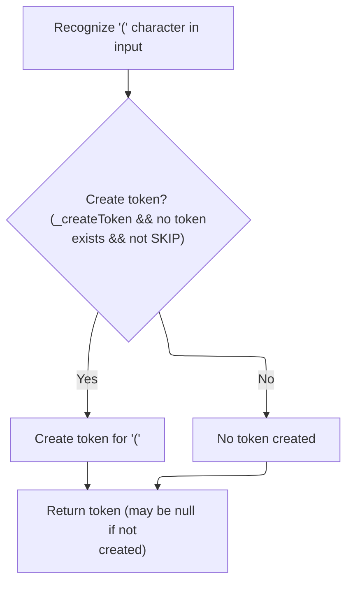
```mermaid
%%{init: {"flowchart": {"defaultRenderer": "elk"}} }%%
flowchart TD
    node1["Recognize '(' character in input"]
    click node1 openCode "core/src/main/java/org/apache/struts/validator/validwhen/ValidWhenLexer.java:595:595"
    node1 --> node2{"Create token? (_createToken && no token
exists && not SKIP)"}
    click node2 openCode "core/src/main/java/org/apache/struts/validator/validwhen/ValidWhenLexer.java:596:599"
    node2 -->|"Yes"| node3["Create token for '('"]
    click node3 openCode "core/src/main/java/org/apache/struts/validator/validwhen/ValidWhenLexer.java:597:598"
    node2 -->|"No"| node4["No token created"]
    click node4 openCode "core/src/main/java/org/apache/struts/validator/validwhen/ValidWhenLexer.java:599:599"
    node3 --> node5["Return token (may be null if not
created)"]
    click node5 openCode "core/src/main/java/org/apache/struts/validator/validwhen/ValidWhenLexer.java:600:601"
    node4 --> node5
classDef HeadingStyle fill:#777777,stroke:#333,stroke-width:2px;

%% Swimm:
%% %%{init: {"flowchart": {"defaultRenderer": "elk"}} }%%
%% flowchart TD
%%     node1["Recognize '(' character in input"]
%%     click node1 openCode "<SwmPath>[core/…/validwhen/ValidWhenLexer.java](core/src/main/java/org/apache/struts/validator/validwhen/ValidWhenLexer.java)</SwmPath>:595:595"
%%     node1 --> node2{"Create token? (<SwmToken path="core/src/main/java/org/apache/struts/validator/validwhen/ValidWhenLexer.java" pos="250:11:11" line-data="	public final void mDECIMAL_LITERAL(boolean _createToken) throws RecognitionException, CharStreamException, TokenStreamException {">`_createToken`</SwmToken> && no token
%% exists && not SKIP)"}
%%     click node2 openCode "<SwmPath>[core/…/validwhen/ValidWhenLexer.java](core/src/main/java/org/apache/struts/validator/validwhen/ValidWhenLexer.java)</SwmPath>:596:599"
%%     node2 -->|"Yes"| node3["Create token for '('"]
%%     click node3 openCode "<SwmPath>[core/…/validwhen/ValidWhenLexer.java](core/src/main/java/org/apache/struts/validator/validwhen/ValidWhenLexer.java)</SwmPath>:597:598"
%%     node2 -->|"No"| node4["No token created"]
%%     click node4 openCode "<SwmPath>[core/…/validwhen/ValidWhenLexer.java](core/src/main/java/org/apache/struts/validator/validwhen/ValidWhenLexer.java)</SwmPath>:599:599"
%%     node3 --> node5["Return token (may be null if not
%% created)"]
%%     click node5 openCode "<SwmPath>[core/…/validwhen/ValidWhenLexer.java](core/src/main/java/org/apache/struts/validator/validwhen/ValidWhenLexer.java)</SwmPath>:600:601"
%%     node4 --> node5
%% classDef HeadingStyle fill:#777777,stroke:#333,stroke-width:2px;
```

<SwmSnippet path="/core/src/main/java/org/apache/struts/validator/validwhen/ValidWhenLexer.java" line="590">

---

In <SwmToken path="core/src/main/java/org/apache/struts/validator/validwhen/ValidWhenLexer.java" pos="590:7:7" line-data="	public final void mLPAREN(boolean _createToken) throws RecognitionException, CharStreamException, TokenStreamException {">`mLPAREN`</SwmToken>, we're matching the '(' character and setting up the token for it. This is needed so the parser can recognize groupings in validation expressions. After this, we call ActionConfigMatcher to link the token to the right action config, which lets the parser handle grouped logic.

```java
	public final void mLPAREN(boolean _createToken) throws RecognitionException, CharStreamException, TokenStreamException {
		int _ttype; Token _token=null; int _begin=text.length();
		_ttype = LPAREN;
		int _saveIndex;
		
		match('(');
```

---

</SwmSnippet>

<SwmSnippet path="/core/src/main/java/org/apache/struts/validator/validwhen/ValidWhenLexer.java" line="596">

---

Just returned from ActionConfigMatcher, so at the end of <SwmToken path="core/src/main/java/org/apache/struts/validator/validwhen/ValidWhenLexer.java" pos="119:1:1" line-data="					mLPAREN(true);">`mLPAREN`</SwmToken>, we create and return the left parenthesis token. This token is now mapped to the right action config and ready for the parser to handle grouping.

```java
		if ( _createToken && _token==null && _ttype!=Token.SKIP ) {
			_token = makeToken(_ttype);
			_token.setText(new String(text.getBuffer(), _begin, text.length()-_begin));
		}
		_returnToken = _token;
	}
```

---

</SwmSnippet>

### Tokenizing Right Parenthesis

<SwmSnippet path="/core/src/main/java/org/apache/struts/validator/validwhen/ValidWhenLexer.java" line="123">

---

After returning from <SwmToken path="core/src/main/java/org/apache/struts/validator/validwhen/ValidWhenLexer.java" pos="119:1:1" line-data="					mLPAREN(true);">`mLPAREN`</SwmToken>, the <SwmToken path="taglib/src/main/java/org/apache/struts/taglib/html/BaseTag.java" pos="126:7:7" line-data="            serverName = tokenizer.nextToken();">`nextToken`</SwmToken> logic checks for ')' and calls <SwmToken path="core/src/main/java/org/apache/struts/validator/validwhen/ValidWhenLexer.java" pos="125:1:1" line-data="					mRPAREN(true);">`mRPAREN`</SwmToken>. This lets us tokenize the closing parenthesis so the parser knows where the group ends.

```java
				case ')':
				{
					mRPAREN(true);
					theRetToken=_returnToken;
					break;
				}
```

---

</SwmSnippet>

### Tokenizing Right Parenthesis

<SwmSnippet path="/core/src/main/java/org/apache/struts/validator/validwhen/ValidWhenLexer.java" line="603">

---

In <SwmToken path="core/src/main/java/org/apache/struts/validator/validwhen/ValidWhenLexer.java" pos="603:7:7" line-data="	public final void mRPAREN(boolean _createToken) throws RecognitionException, CharStreamException, TokenStreamException {">`mRPAREN`</SwmToken>, we're matching the ')' character and setting up the token for it. This is needed so the parser can recognize the end of groupings in validation expressions. After this, we call ActionConfigMatcher to link the token to the right action config.

```java
	public final void mRPAREN(boolean _createToken) throws RecognitionException, CharStreamException, TokenStreamException {
		int _ttype; Token _token=null; int _begin=text.length();
		_ttype = RPAREN;
		int _saveIndex;
		
		match(')');
```

---

</SwmSnippet>

<SwmSnippet path="/core/src/main/java/org/apache/struts/validator/validwhen/ValidWhenLexer.java" line="609">

---

Just returned from ActionConfigMatcher, so at the end of <SwmToken path="core/src/main/java/org/apache/struts/validator/validwhen/ValidWhenLexer.java" pos="125:1:1" line-data="					mRPAREN(true);">`mRPAREN`</SwmToken>, we create and return the right parenthesis token. This token is now mapped to the right action config and ready for the parser to handle closing groups.

```java
		if ( _createToken && _token==null && _ttype!=Token.SKIP ) {
			_token = makeToken(_ttype);
			_token.setText(new String(text.getBuffer(), _begin, text.length()-_begin));
		}
		_returnToken = _token;
	}
```

---

</SwmSnippet>

### Tokenizing Special Keywords

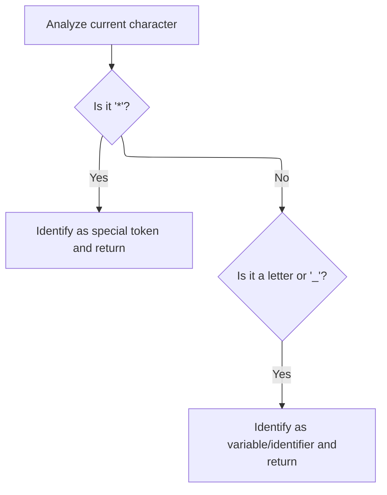
```mermaid
%%{init: {"flowchart": {"defaultRenderer": "elk"}} }%%
flowchart TD
    node1["Analyze current character"] --> node2{"Is it '*'?"}
    click node1 openCode "core/src/main/java/org/apache/struts/validator/validwhen/ValidWhenLexer.java:129:140"
    node2 -->|"Yes"| node3["Identify as special token and return"]
    click node2 openCode "core/src/main/java/org/apache/struts/validator/validwhen/ValidWhenLexer.java:129:140"
    click node3 openCode "core/src/main/java/org/apache/struts/validator/validwhen/ValidWhenLexer.java:131:134"
    node2 -->|"No"| node4{"Is it a letter or '_'?"}
    click node4 openCode "core/src/main/java/org/apache/struts/validator/validwhen/ValidWhenLexer.java:135:140"
    node4 -->|"Yes"| node5["Identify as variable/identifier and
return"]
    click node5 openCode "core/src/main/java/org/apache/struts/validator/validwhen/ValidWhenLexer.java:135:140"

classDef HeadingStyle fill:#777777,stroke:#333,stroke-width:2px;

%% Swimm:
%% %%{init: {"flowchart": {"defaultRenderer": "elk"}} }%%
%% flowchart TD
%%     node1["Analyze current character"] --> node2{"Is it '*'?"}
%%     click node1 openCode "<SwmPath>[core/…/validwhen/ValidWhenLexer.java](core/src/main/java/org/apache/struts/validator/validwhen/ValidWhenLexer.java)</SwmPath>:129:140"
%%     node2 -->|"Yes"| node3["Identify as special token and return"]
%%     click node2 openCode "<SwmPath>[core/…/validwhen/ValidWhenLexer.java](core/src/main/java/org/apache/struts/validator/validwhen/ValidWhenLexer.java)</SwmPath>:129:140"
%%     click node3 openCode "<SwmPath>[core/…/validwhen/ValidWhenLexer.java](core/src/main/java/org/apache/struts/validator/validwhen/ValidWhenLexer.java)</SwmPath>:131:134"
%%     node2 -->|"No"| node4{"Is it a letter or '_'?"}
%%     click node4 openCode "<SwmPath>[core/…/validwhen/ValidWhenLexer.java](core/src/main/java/org/apache/struts/validator/validwhen/ValidWhenLexer.java)</SwmPath>:135:140"
%%     node4 -->|"Yes"| node5["Identify as variable/identifier and
%% return"]
%%     click node5 openCode "<SwmPath>[core/…/validwhen/ValidWhenLexer.java](core/src/main/java/org/apache/struts/validator/validwhen/ValidWhenLexer.java)</SwmPath>:135:140"
%% 
%% classDef HeadingStyle fill:#777777,stroke:#333,stroke-width:2px;
```

<SwmSnippet path="/core/src/main/java/org/apache/struts/validator/validwhen/ValidWhenLexer.java" line="129">

---

After returning from <SwmToken path="core/src/main/java/org/apache/struts/validator/validwhen/ValidWhenLexer.java" pos="125:1:1" line-data="					mRPAREN(true);">`mRPAREN`</SwmToken>, the <SwmToken path="taglib/src/main/java/org/apache/struts/taglib/html/BaseTag.java" pos="126:7:7" line-data="            serverName = tokenizer.nextToken();">`nextToken`</SwmToken> logic checks for '\*' and calls <SwmToken path="core/src/main/java/org/apache/struts/validator/validwhen/ValidWhenLexer.java" pos="131:1:1" line-data="					mTHIS(true);">`mTHIS`</SwmToken>. This lets us tokenize the '*this*' keyword so the parser can handle references to the current field.

```java
				case '*':
				{
					mTHIS(true);
					theRetToken=_returnToken;
					break;
				}
				case '.':  case '_':  case 'a':  case 'b':
				case 'c':  case 'd':  case 'e':  case 'f':
				case 'g':  case 'h':  case 'i':  case 'j':
				case 'k':  case 'l':  case 'm':  case 'n':
				case 'o':  case 'p':  case 'q':  case 'r':
				case 's':  case 't':  case 'u':  case 'v':
```

---

</SwmSnippet>

### Tokenizing the '*this*' Keyword

<SwmSnippet path="/core/src/main/java/org/apache/struts/validator/validwhen/ValidWhenLexer.java" line="616">

---

In <SwmToken path="core/src/main/java/org/apache/struts/validator/validwhen/ValidWhenLexer.java" pos="616:7:7" line-data="	public final void mTHIS(boolean _createToken) throws RecognitionException, CharStreamException, TokenStreamException {">`mTHIS`</SwmToken>, we're matching the '*this*' keyword and setting up the token for it. This is needed so the parser can recognize references to the current field. After this, we call ActionConfigMatcher to link the token to the right action config.

```java
	public final void mTHIS(boolean _createToken) throws RecognitionException, CharStreamException, TokenStreamException {
		int _ttype; Token _token=null; int _begin=text.length();
		_ttype = THIS;
		int _saveIndex;
		
		match("*this*");
```

---

</SwmSnippet>

<SwmSnippet path="/core/src/main/java/org/apache/struts/validator/validwhen/ValidWhenLexer.java" line="622">

---

Just returned from ActionConfigMatcher, so at the end of <SwmToken path="core/src/main/java/org/apache/struts/validator/validwhen/ValidWhenLexer.java" pos="131:1:1" line-data="					mTHIS(true);">`mTHIS`</SwmToken>, we create and return the '*this*' token. This token is now mapped to the right action config and ready for the parser to handle field references.

```java
		if ( _createToken && _token==null && _ttype!=Token.SKIP ) {
			_token = makeToken(_ttype);
			_token.setText(new String(text.getBuffer(), _begin, text.length()-_begin));
		}
		_returnToken = _token;
	}
```

---

</SwmSnippet>

### Tokenizing Identifiers

<SwmSnippet path="/core/src/main/java/org/apache/struts/validator/validwhen/ValidWhenLexer.java" line="141">

---

After returning from <SwmToken path="core/src/main/java/org/apache/struts/validator/validwhen/ValidWhenLexer.java" pos="131:1:1" line-data="					mTHIS(true);">`mTHIS`</SwmToken>, the <SwmToken path="taglib/src/main/java/org/apache/struts/taglib/html/BaseTag.java" pos="126:7:7" line-data="            serverName = tokenizer.nextToken();">`nextToken`</SwmToken> logic checks for lowercase letters and calls <SwmToken path="core/src/main/java/org/apache/struts/validator/validwhen/ValidWhenLexer.java" pos="143:1:1" line-data="					mIDENTIFIER(true);">`mIDENTIFIER`</SwmToken>. This lets us tokenize field names or variable references for validation rules.

```java
				case 'w':  case 'x':  case 'y':  case 'z':
				{
					mIDENTIFIER(true);
					theRetToken=_returnToken;
					break;
				}
```

---

</SwmSnippet>

### Tokenizing Field Names and Variables

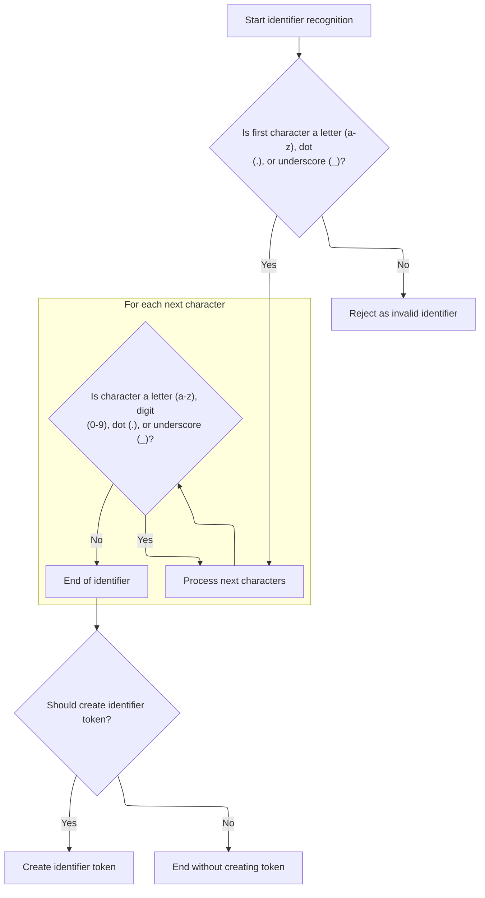
```mermaid
%%{init: {"flowchart": {"defaultRenderer": "elk"}} }%%
flowchart TD
    node1["Start identifier recognition"] --> node2{"Is first character a letter (a-z), dot
(.), or underscore (_)?"}
    click node1 openCode "core/src/main/java/org/apache/struts/validator/validwhen/ValidWhenLexer.java:629:634"
    click node2 openCode "core/src/main/java/org/apache/struts/validator/validwhen/ValidWhenLexer.java:635:662"
    node2 -->|"Yes"| node3["Process next characters"]
    node2 -->|"No"| node6["Reject as invalid identifier"]
    click node6 openCode "core/src/main/java/org/apache/struts/validator/validwhen/ValidWhenLexer.java:658:660"
    subgraph loop1["For each next character"]
      node3 --> node4{"Is character a letter (a-z), digit
(0-9), dot (.), or underscore (_)?"}
      click node4 openCode "core/src/main/java/org/apache/struts/validator/validwhen/ValidWhenLexer.java:667:695"
      node4 -->|"Yes"| node3
      node4 -->|"No"| node5["End of identifier"]
      click node5 openCode "core/src/main/java/org/apache/struts/validator/validwhen/ValidWhenLexer.java:698:703"
    end
    node5 --> node7{"Should create identifier token?"}
    click node7 openCode "core/src/main/java/org/apache/struts/validator/validwhen/ValidWhenLexer.java:704:707"
    node7 -->|"Yes"| node8["Create identifier token"]
    click node8 openCode "core/src/main/java/org/apache/struts/validator/validwhen/ValidWhenLexer.java:705:706"
    node7 -->|"No"| node9["End without creating token"]
    click node9 openCode "core/src/main/java/org/apache/struts/validator/validwhen/ValidWhenLexer.java:707:709"

classDef HeadingStyle fill:#777777,stroke:#333,stroke-width:2px;

%% Swimm:
%% %%{init: {"flowchart": {"defaultRenderer": "elk"}} }%%
%% flowchart TD
%%     node1["Start identifier recognition"] --> node2{"Is first character a letter (a-z), dot
%% (.), or underscore (_)?"}
%%     click node1 openCode "<SwmPath>[core/…/validwhen/ValidWhenLexer.java](core/src/main/java/org/apache/struts/validator/validwhen/ValidWhenLexer.java)</SwmPath>:629:634"
%%     click node2 openCode "<SwmPath>[core/…/validwhen/ValidWhenLexer.java](core/src/main/java/org/apache/struts/validator/validwhen/ValidWhenLexer.java)</SwmPath>:635:662"
%%     node2 -->|"Yes"| node3["Process next characters"]
%%     node2 -->|"No"| node6["Reject as invalid identifier"]
%%     click node6 openCode "<SwmPath>[core/…/validwhen/ValidWhenLexer.java](core/src/main/java/org/apache/struts/validator/validwhen/ValidWhenLexer.java)</SwmPath>:658:660"
%%     subgraph loop1["For each next character"]
%%       node3 --> node4{"Is character a letter (a-z), digit
%% (0-9), dot (.), or underscore (_)?"}
%%       click node4 openCode "<SwmPath>[core/…/validwhen/ValidWhenLexer.java](core/src/main/java/org/apache/struts/validator/validwhen/ValidWhenLexer.java)</SwmPath>:667:695"
%%       node4 -->|"Yes"| node3
%%       node4 -->|"No"| node5["End of identifier"]
%%       click node5 openCode "<SwmPath>[core/…/validwhen/ValidWhenLexer.java](core/src/main/java/org/apache/struts/validator/validwhen/ValidWhenLexer.java)</SwmPath>:698:703"
%%     end
%%     node5 --> node7{"Should create identifier token?"}
%%     click node7 openCode "<SwmPath>[core/…/validwhen/ValidWhenLexer.java](core/src/main/java/org/apache/struts/validator/validwhen/ValidWhenLexer.java)</SwmPath>:704:707"
%%     node7 -->|"Yes"| node8["Create identifier token"]
%%     click node8 openCode "<SwmPath>[core/…/validwhen/ValidWhenLexer.java](core/src/main/java/org/apache/struts/validator/validwhen/ValidWhenLexer.java)</SwmPath>:705:706"
%%     node7 -->|"No"| node9["End without creating token"]
%%     click node9 openCode "<SwmPath>[core/…/validwhen/ValidWhenLexer.java](core/src/main/java/org/apache/struts/validator/validwhen/ValidWhenLexer.java)</SwmPath>:707:709"
%% 
%% classDef HeadingStyle fill:#777777,stroke:#333,stroke-width:2px;
```

<SwmSnippet path="/core/src/main/java/org/apache/struts/validator/validwhen/ValidWhenLexer.java" line="629">

---

In <SwmToken path="core/src/main/java/org/apache/struts/validator/validwhen/ValidWhenLexer.java" pos="629:7:7" line-data="	public final void mIDENTIFIER(boolean _createToken) throws RecognitionException, CharStreamException, TokenStreamException {">`mIDENTIFIER`</SwmToken>, we're matching field names or variable references. Identifiers can start with a lowercase letter, dot, or underscore, and can include digits, dots, and underscores after that. This is so validation rules can reference nested fields or properties. After matching, we call ActionConfigMatcher to map the token to the right action config.

```java
	public final void mIDENTIFIER(boolean _createToken) throws RecognitionException, CharStreamException, TokenStreamException {
		int _ttype; Token _token=null; int _begin=text.length();
		_ttype = IDENTIFIER;
		int _saveIndex;
		
		{
		switch ( LA(1)) {
		case 'a':  case 'b':  case 'c':  case 'd':
		case 'e':  case 'f':  case 'g':  case 'h':
		case 'i':  case 'j':  case 'k':  case 'l':
		case 'm':  case 'n':  case 'o':  case 'p':
		case 'q':  case 'r':  case 's':  case 't':
		case 'u':  case 'v':  case 'w':  case 'x':
		case 'y':  case 'z':
		{
			matchRange('a','z');
			break;
		}
		case '.':
		{
			match('.');
			break;
		}
		case '_':
		{
			match('_');
			break;
		}
		default:
		{
			throw new NoViableAltForCharException((char)LA(1), getFilename(), getLine(), getColumn());
		}
		}
		}
		{
		int _cnt62=0;
		_loop62:
		do {
			switch ( LA(1)) {
			case 'a':  case 'b':  case 'c':  case 'd':
			case 'e':  case 'f':  case 'g':  case 'h':
			case 'i':  case 'j':  case 'k':  case 'l':
			case 'm':  case 'n':  case 'o':  case 'p':
			case 'q':  case 'r':  case 's':  case 't':
			case 'u':  case 'v':  case 'w':  case 'x':
			case 'y':  case 'z':
			{
				matchRange('a','z');
				break;
			}
			case '0':  case '1':  case '2':  case '3':
			case '4':  case '5':  case '6':  case '7':
			case '8':  case '9':
			{
				matchRange('0','9');
				break;
			}
			case '.':
			{
				match('.');
				break;
			}
			case '_':
			{
				match('_');
				break;
			}
			default:
			{
				if ( _cnt62>=1 ) { break _loop62; } else {throw new NoViableAltForCharException((char)LA(1), getFilename(), getLine(), getColumn());}
			}
			}
			_cnt62++;
		} while (true);
		}
```

---

</SwmSnippet>

<SwmSnippet path="/core/src/main/java/org/apache/struts/validator/validwhen/ValidWhenLexer.java" line="704">

---

Just returned from ActionConfigMatcher, so at the end of <SwmToken path="core/src/main/java/org/apache/struts/validator/validwhen/ValidWhenLexer.java" pos="143:1:1" line-data="					mIDENTIFIER(true);">`mIDENTIFIER`</SwmToken>, we create and return the identifier token. The token is now mapped to the right action config and ready for the parser to handle field references or variable names.

```java
		if ( _createToken && _token==null && _ttype!=Token.SKIP ) {
			_token = makeToken(_ttype);
			_token.setText(new String(text.getBuffer(), _begin, text.length()-_begin));
		}
		_returnToken = _token;
	}
```

---

</SwmSnippet>

### Tokenizing Equality Operators

<SwmSnippet path="/core/src/main/java/org/apache/struts/validator/validwhen/ValidWhenLexer.java" line="147">

---

After returning from <SwmToken path="core/src/main/java/org/apache/struts/validator/validwhen/ValidWhenLexer.java" pos="143:1:1" line-data="					mIDENTIFIER(true);">`mIDENTIFIER`</SwmToken>, the <SwmToken path="taglib/src/main/java/org/apache/struts/taglib/html/BaseTag.java" pos="126:7:7" line-data="            serverName = tokenizer.nextToken();">`nextToken`</SwmToken> logic checks for '=' and calls <SwmToken path="core/src/main/java/org/apache/struts/validator/validwhen/ValidWhenLexer.java" pos="149:1:1" line-data="					mEQUALSIGN(true);">`mEQUALSIGN`</SwmToken>. This lets us tokenize the '==' operator for equality checks in validation rules.

```java
				case '=':
				{
					mEQUALSIGN(true);
					theRetToken=_returnToken;
					break;
				}
```

---

</SwmSnippet>

### Tokenizing the '==' Operator

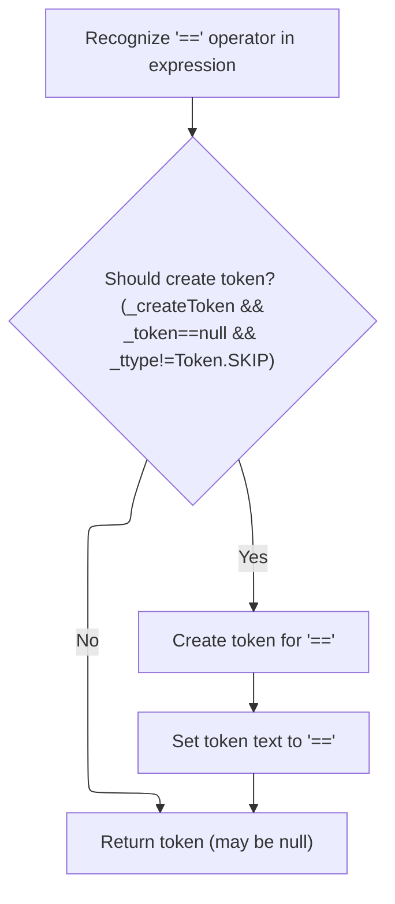
```mermaid
%%{init: {"flowchart": {"defaultRenderer": "elk"}} }%%
flowchart TD
  node1["Recognize '==' operator in expression"]
  click node1 openCode "core/src/main/java/org/apache/struts/validator/validwhen/ValidWhenLexer.java:716:717"
  node1 --> node2{"Should create token? (_createToken &&
_token==null && _ttype!=Token.SKIP)"}
  click node2 openCode "core/src/main/java/org/apache/struts/validator/validwhen/ValidWhenLexer.java:718:718"
  node2 -->|"Yes"| node3["Create token for '=='"]
  click node3 openCode "core/src/main/java/org/apache/struts/validator/validwhen/ValidWhenLexer.java:719:719"
  node3 --> node4["Set token text to '=='"]
  click node4 openCode "core/src/main/java/org/apache/struts/validator/validwhen/ValidWhenLexer.java:720:720"
  node4 --> node5["Return token (may be null)"]
  click node5 openCode "core/src/main/java/org/apache/struts/validator/validwhen/ValidWhenLexer.java:722:723"
  node2 -->|"No"| node5

classDef HeadingStyle fill:#777777,stroke:#333,stroke-width:2px;

%% Swimm:
%% %%{init: {"flowchart": {"defaultRenderer": "elk"}} }%%
%% flowchart TD
%%   node1["Recognize '==' operator in expression"]
%%   click node1 openCode "<SwmPath>[core/…/validwhen/ValidWhenLexer.java](core/src/main/java/org/apache/struts/validator/validwhen/ValidWhenLexer.java)</SwmPath>:716:717"
%%   node1 --> node2{"Should create token? (<SwmToken path="core/src/main/java/org/apache/struts/validator/validwhen/ValidWhenLexer.java" pos="250:11:11" line-data="	public final void mDECIMAL_LITERAL(boolean _createToken) throws RecognitionException, CharStreamException, TokenStreamException {">`_createToken`</SwmToken> &&
%% _token==null && _ttype!=<SwmToken path="core/src/main/java/org/apache/struts/validator/validwhen/ValidWhenLexer.java" pos="495:17:19" line-data="				if ( _createToken &amp;&amp; _token==null &amp;&amp; _ttype!=Token.SKIP ) {">`Token.SKIP`</SwmToken>)"}
%%   click node2 openCode "<SwmPath>[core/…/validwhen/ValidWhenLexer.java](core/src/main/java/org/apache/struts/validator/validwhen/ValidWhenLexer.java)</SwmPath>:718:718"
%%   node2 -->|"Yes"| node3["Create token for '=='"]
%%   click node3 openCode "<SwmPath>[core/…/validwhen/ValidWhenLexer.java](core/src/main/java/org/apache/struts/validator/validwhen/ValidWhenLexer.java)</SwmPath>:719:719"
%%   node3 --> node4["Set token text to '=='"]
%%   click node4 openCode "<SwmPath>[core/…/validwhen/ValidWhenLexer.java](core/src/main/java/org/apache/struts/validator/validwhen/ValidWhenLexer.java)</SwmPath>:720:720"
%%   node4 --> node5["Return token (may be null)"]
%%   click node5 openCode "<SwmPath>[core/…/validwhen/ValidWhenLexer.java](core/src/main/java/org/apache/struts/validator/validwhen/ValidWhenLexer.java)</SwmPath>:722:723"
%%   node2 -->|"No"| node5
%% 
%% classDef HeadingStyle fill:#777777,stroke:#333,stroke-width:2px;
```

<SwmSnippet path="/core/src/main/java/org/apache/struts/validator/validwhen/ValidWhenLexer.java" line="711">

---

In <SwmToken path="core/src/main/java/org/apache/struts/validator/validwhen/ValidWhenLexer.java" pos="711:7:7" line-data="	public final void mEQUALSIGN(boolean _createToken) throws RecognitionException, CharStreamException, TokenStreamException {">`mEQUALSIGN`</SwmToken>, we're matching the '==' operator and setting up the token for it. This is needed so the parser can recognize equality checks. After this, we call ActionConfigMatcher to link the token to the right action config.

```java
	public final void mEQUALSIGN(boolean _createToken) throws RecognitionException, CharStreamException, TokenStreamException {
		int _ttype; Token _token=null; int _begin=text.length();
		_ttype = EQUALSIGN;
		int _saveIndex;
		
		match('=');
		match('=');
```

---

</SwmSnippet>

<SwmSnippet path="/core/src/main/java/org/apache/struts/validator/validwhen/ValidWhenLexer.java" line="718">

---

Just returned from ActionConfigMatcher, so at the end of <SwmToken path="core/src/main/java/org/apache/struts/validator/validwhen/ValidWhenLexer.java" pos="149:1:1" line-data="					mEQUALSIGN(true);">`mEQUALSIGN`</SwmToken>, we create and return the equality token. The token is now mapped to the right action config and ready for the parser to handle equality checks.

```java
		if ( _createToken && _token==null && _ttype!=Token.SKIP ) {
			_token = makeToken(_ttype);
			_token.setText(new String(text.getBuffer(), _begin, text.length()-_begin));
		}
		_returnToken = _token;
	}
```

---

</SwmSnippet>

### Tokenizing Inequality Operators

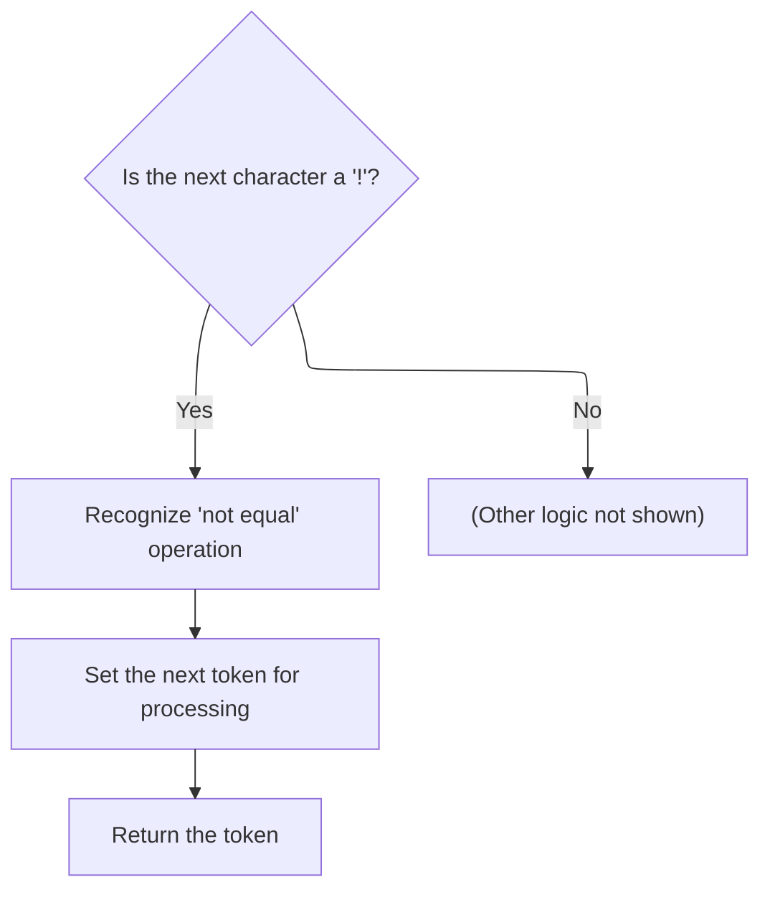
```mermaid
%%{init: {"flowchart": {"defaultRenderer": "elk"}} }%%
flowchart TD
    node1{"Is the next character a '!'?"}
    click node1 openCode "core/src/main/java/org/apache/struts/validator/validwhen/ValidWhenLexer.java:153:153"
    node1 -->|"Yes"| node2["Recognize 'not equal' operation"]
    click node2 openCode "core/src/main/java/org/apache/struts/validator/validwhen/ValidWhenLexer.java:155:155"
    node2 --> node3["Set the next token for processing"]
    click node3 openCode "core/src/main/java/org/apache/struts/validator/validwhen/ValidWhenLexer.java:156:156"
    node3 --> node4["Return the token"]
    click node4 openCode "core/src/main/java/org/apache/struts/validator/validwhen/ValidWhenLexer.java:157:157"
    node1 -->|"No"| node5["(Other logic not shown)"]
    click node5 openCode "core/src/main/java/org/apache/struts/validator/validwhen/ValidWhenLexer.java:153:153"
classDef HeadingStyle fill:#777777,stroke:#333,stroke-width:2px;

%% Swimm:
%% %%{init: {"flowchart": {"defaultRenderer": "elk"}} }%%
%% flowchart TD
%%     node1{"Is the next character a '!'?"}
%%     click node1 openCode "<SwmPath>[core/…/validwhen/ValidWhenLexer.java](core/src/main/java/org/apache/struts/validator/validwhen/ValidWhenLexer.java)</SwmPath>:153:153"
%%     node1 -->|"Yes"| node2["Recognize 'not equal' operation"]
%%     click node2 openCode "<SwmPath>[core/…/validwhen/ValidWhenLexer.java](core/src/main/java/org/apache/struts/validator/validwhen/ValidWhenLexer.java)</SwmPath>:155:155"
%%     node2 --> node3["Set the next token for processing"]
%%     click node3 openCode "<SwmPath>[core/…/validwhen/ValidWhenLexer.java](core/src/main/java/org/apache/struts/validator/validwhen/ValidWhenLexer.java)</SwmPath>:156:156"
%%     node3 --> node4["Return the token"]
%%     click node4 openCode "<SwmPath>[core/…/validwhen/ValidWhenLexer.java](core/src/main/java/org/apache/struts/validator/validwhen/ValidWhenLexer.java)</SwmPath>:157:157"
%%     node1 -->|"No"| node5["(Other logic not shown)"]
%%     click node5 openCode "<SwmPath>[core/…/validwhen/ValidWhenLexer.java](core/src/main/java/org/apache/struts/validator/validwhen/ValidWhenLexer.java)</SwmPath>:153:153"
%% classDef HeadingStyle fill:#777777,stroke:#333,stroke-width:2px;
```

<SwmSnippet path="/core/src/main/java/org/apache/struts/validator/validwhen/ValidWhenLexer.java" line="153">

---

After returning from <SwmToken path="core/src/main/java/org/apache/struts/validator/validwhen/ValidWhenLexer.java" pos="149:1:1" line-data="					mEQUALSIGN(true);">`mEQUALSIGN`</SwmToken>, the <SwmToken path="taglib/src/main/java/org/apache/struts/taglib/html/BaseTag.java" pos="126:7:7" line-data="            serverName = tokenizer.nextToken();">`nextToken`</SwmToken> logic checks for '!' and calls <SwmToken path="core/src/main/java/org/apache/struts/validator/validwhen/ValidWhenLexer.java" pos="155:1:1" line-data="					mNOTEQUALSIGN(true);">`mNOTEQUALSIGN`</SwmToken>. This lets us tokenize the '!=' operator for inequality checks in validation rules.

```java
				case '!':
				{
					mNOTEQUALSIGN(true);
					theRetToken=_returnToken;
					break;
				}
```

---

</SwmSnippet>

### Tokenizing the '!=' Operator

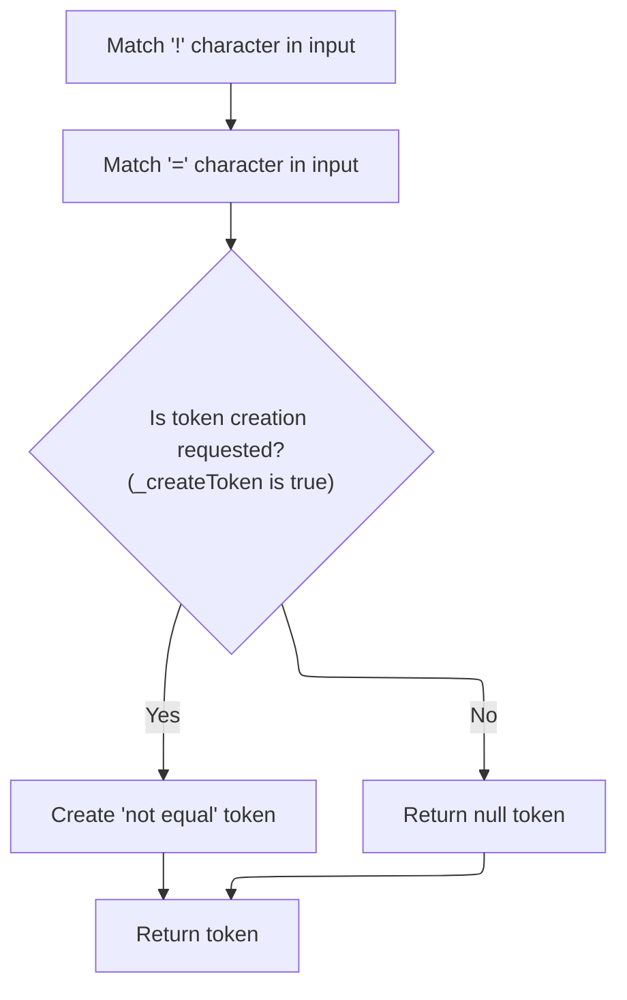
```mermaid
%%{init: {"flowchart": {"defaultRenderer": "elk"}} }%%
flowchart TD
  node1["Match '!' character in input"]
  click node1 openCode "core/src/main/java/org/apache/struts/validator/validwhen/ValidWhenLexer.java:730:730"
  node1 --> node2["Match '=' character in input"]
  click node2 openCode "core/src/main/java/org/apache/struts/validator/validwhen/ValidWhenLexer.java:731:731"
  node2 --> node3{"Is token creation requested?
(_createToken is true)"}
  click node3 openCode "core/src/main/java/org/apache/struts/validator/validwhen/ValidWhenLexer.java:732:735"
  node3 -->|"Yes"| node4["Create 'not equal' token"]
  click node4 openCode "core/src/main/java/org/apache/struts/validator/validwhen/ValidWhenLexer.java:733:734"
  node3 -->|"No"| node5["Return null token"]
  click node5 openCode "core/src/main/java/org/apache/struts/validator/validwhen/ValidWhenLexer.java:735:735"
  node4 --> node6["Return token"]
  click node6 openCode "core/src/main/java/org/apache/struts/validator/validwhen/ValidWhenLexer.java:736:737"
  node5 --> node6
classDef HeadingStyle fill:#777777,stroke:#333,stroke-width:2px;

%% Swimm:
%% %%{init: {"flowchart": {"defaultRenderer": "elk"}} }%%
%% flowchart TD
%%   node1["Match '!' character in input"]
%%   click node1 openCode "<SwmPath>[core/…/validwhen/ValidWhenLexer.java](core/src/main/java/org/apache/struts/validator/validwhen/ValidWhenLexer.java)</SwmPath>:730:730"
%%   node1 --> node2["Match '=' character in input"]
%%   click node2 openCode "<SwmPath>[core/…/validwhen/ValidWhenLexer.java](core/src/main/java/org/apache/struts/validator/validwhen/ValidWhenLexer.java)</SwmPath>:731:731"
%%   node2 --> node3{"Is token creation requested?
%% (<SwmToken path="core/src/main/java/org/apache/struts/validator/validwhen/ValidWhenLexer.java" pos="250:11:11" line-data="	public final void mDECIMAL_LITERAL(boolean _createToken) throws RecognitionException, CharStreamException, TokenStreamException {">`_createToken`</SwmToken> is true)"}
%%   click node3 openCode "<SwmPath>[core/…/validwhen/ValidWhenLexer.java](core/src/main/java/org/apache/struts/validator/validwhen/ValidWhenLexer.java)</SwmPath>:732:735"
%%   node3 -->|"Yes"| node4["Create 'not equal' token"]
%%   click node4 openCode "<SwmPath>[core/…/validwhen/ValidWhenLexer.java](core/src/main/java/org/apache/struts/validator/validwhen/ValidWhenLexer.java)</SwmPath>:733:734"
%%   node3 -->|"No"| node5["Return null token"]
%%   click node5 openCode "<SwmPath>[core/…/validwhen/ValidWhenLexer.java](core/src/main/java/org/apache/struts/validator/validwhen/ValidWhenLexer.java)</SwmPath>:735:735"
%%   node4 --> node6["Return token"]
%%   click node6 openCode "<SwmPath>[core/…/validwhen/ValidWhenLexer.java](core/src/main/java/org/apache/struts/validator/validwhen/ValidWhenLexer.java)</SwmPath>:736:737"
%%   node5 --> node6
%% classDef HeadingStyle fill:#777777,stroke:#333,stroke-width:2px;
```

<SwmSnippet path="/core/src/main/java/org/apache/struts/validator/validwhen/ValidWhenLexer.java" line="725">

---

In <SwmToken path="core/src/main/java/org/apache/struts/validator/validwhen/ValidWhenLexer.java" pos="725:7:7" line-data="	public final void mNOTEQUALSIGN(boolean _createToken) throws RecognitionException, CharStreamException, TokenStreamException {">`mNOTEQUALSIGN`</SwmToken>, we're matching the '!=' operator and setting up the token for it. This is needed so the parser can recognize inequality checks. After this, we call ActionConfigMatcher to link the token to the right action config.

```java
	public final void mNOTEQUALSIGN(boolean _createToken) throws RecognitionException, CharStreamException, TokenStreamException {
		int _ttype; Token _token=null; int _begin=text.length();
		_ttype = NOTEQUALSIGN;
		int _saveIndex;
		
		match('!');
		match('=');
```

---

</SwmSnippet>

<SwmSnippet path="/core/src/main/java/org/apache/struts/validator/validwhen/ValidWhenLexer.java" line="732">

---

Just returned from ActionConfigMatcher, so at the end of <SwmToken path="core/src/main/java/org/apache/struts/validator/validwhen/ValidWhenLexer.java" pos="155:1:1" line-data="					mNOTEQUALSIGN(true);">`mNOTEQUALSIGN`</SwmToken>, we create and return the inequality token. The token is now mapped to the right action config and ready for the parser to handle inequality checks.

```java
		if ( _createToken && _token==null && _ttype!=Token.SKIP ) {
			_token = makeToken(_ttype);
			_token.setText(new String(text.getBuffer(), _begin, text.length()-_begin));
		}
		_returnToken = _token;
	}
```

---

</SwmSnippet>

### Tokenizing Comparison Operators

<SwmSnippet path="/core/src/main/java/org/apache/struts/validator/validwhen/ValidWhenLexer.java" line="159">

---

After returning from <SwmToken path="core/src/main/java/org/apache/struts/validator/validwhen/ValidWhenLexer.java" pos="155:1:1" line-data="					mNOTEQUALSIGN(true);">`mNOTEQUALSIGN`</SwmToken>, the <SwmToken path="taglib/src/main/java/org/apache/struts/taglib/html/BaseTag.java" pos="126:7:7" line-data="            serverName = tokenizer.nextToken();">`nextToken`</SwmToken> logic checks for '<=' and calls <SwmToken path="core/src/main/java/org/apache/struts/validator/validwhen/ValidWhenLexer.java" pos="161:1:1" line-data="						mLESSEQUALSIGN(true);">`mLESSEQUALSIGN`</SwmToken>. This lets us tokenize the '<=' operator for less-than-or-equal comparisons in validation rules.

```java
				default:
					if ((LA(1)=='<') && (LA(2)=='=')) {
						mLESSEQUALSIGN(true);
```

---

</SwmSnippet>

### Tokenizing the '<=' Operator

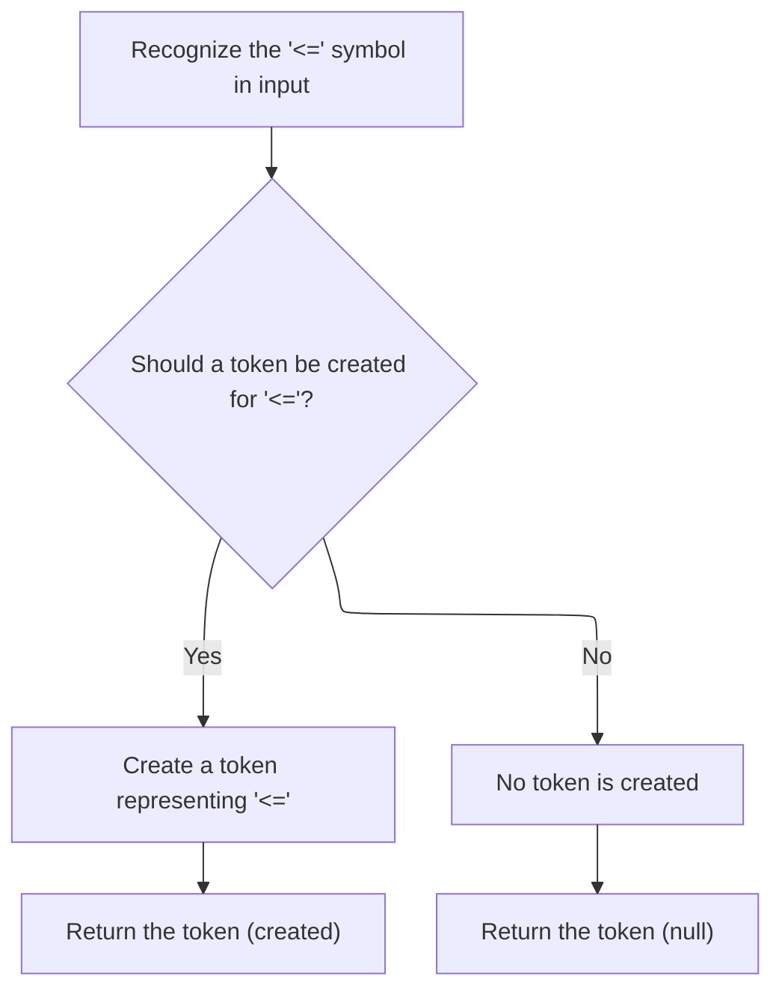
```mermaid
%%{init: {"flowchart": {"defaultRenderer": "elk"}} }%%
flowchart TD
  node1["Recognize the '<=' symbol in input"]
  click node1 openCode "core/src/main/java/org/apache/struts/validator/validwhen/ValidWhenLexer.java:770:771"
  node1 --> node2{"Should a token be created for '<='?"}
  click node2 openCode "core/src/main/java/org/apache/struts/validator/validwhen/ValidWhenLexer.java:772:775"
  node2 -->|"Yes"| node3["Create a token representing '<='"]
  click node3 openCode "core/src/main/java/org/apache/struts/validator/validwhen/ValidWhenLexer.java:773:774"
  node2 -->|"No"| node4["No token is created"]
  click node4 openCode "core/src/main/java/org/apache/struts/validator/validwhen/ValidWhenLexer.java:772:775"
  node3 --> node5["Return the token (created)"]
  click node5 openCode "core/src/main/java/org/apache/struts/validator/validwhen/ValidWhenLexer.java:776:777"
  node4 --> node6["Return the token (null)"]
  click node6 openCode "core/src/main/java/org/apache/struts/validator/validwhen/ValidWhenLexer.java:776:777"

classDef HeadingStyle fill:#777777,stroke:#333,stroke-width:2px;

%% Swimm:
%% %%{init: {"flowchart": {"defaultRenderer": "elk"}} }%%
%% flowchart TD
%%   node1["Recognize the '<=' symbol in input"]
%%   click node1 openCode "<SwmPath>[core/…/validwhen/ValidWhenLexer.java](core/src/main/java/org/apache/struts/validator/validwhen/ValidWhenLexer.java)</SwmPath>:770:771"
%%   node1 --> node2{"Should a token be created for '<='?"}
%%   click node2 openCode "<SwmPath>[core/…/validwhen/ValidWhenLexer.java](core/src/main/java/org/apache/struts/validator/validwhen/ValidWhenLexer.java)</SwmPath>:772:775"
%%   node2 -->|"Yes"| node3["Create a token representing '<='"]
%%   click node3 openCode "<SwmPath>[core/…/validwhen/ValidWhenLexer.java](core/src/main/java/org/apache/struts/validator/validwhen/ValidWhenLexer.java)</SwmPath>:773:774"
%%   node2 -->|"No"| node4["No token is created"]
%%   click node4 openCode "<SwmPath>[core/…/validwhen/ValidWhenLexer.java](core/src/main/java/org/apache/struts/validator/validwhen/ValidWhenLexer.java)</SwmPath>:772:775"
%%   node3 --> node5["Return the token (created)"]
%%   click node5 openCode "<SwmPath>[core/…/validwhen/ValidWhenLexer.java](core/src/main/java/org/apache/struts/validator/validwhen/ValidWhenLexer.java)</SwmPath>:776:777"
%%   node4 --> node6["Return the token (null)"]
%%   click node6 openCode "<SwmPath>[core/…/validwhen/ValidWhenLexer.java](core/src/main/java/org/apache/struts/validator/validwhen/ValidWhenLexer.java)</SwmPath>:776:777"
%% 
%% classDef HeadingStyle fill:#777777,stroke:#333,stroke-width:2px;
```

<SwmSnippet path="/core/src/main/java/org/apache/struts/validator/validwhen/ValidWhenLexer.java" line="765">

---

In <SwmToken path="core/src/main/java/org/apache/struts/validator/validwhen/ValidWhenLexer.java" pos="765:7:7" line-data="	public final void mLESSEQUALSIGN(boolean _createToken) throws RecognitionException, CharStreamException, TokenStreamException {">`mLESSEQUALSIGN`</SwmToken>, we're matching the '<=' operator and setting up the token for it. This is needed so the parser can recognize less-than-or-equal comparisons. After this, we call ActionConfigMatcher to link the token to the right action config.

```java
	public final void mLESSEQUALSIGN(boolean _createToken) throws RecognitionException, CharStreamException, TokenStreamException {
		int _ttype; Token _token=null; int _begin=text.length();
		_ttype = LESSEQUALSIGN;
		int _saveIndex;
		
		match('<');
		match('=');
```

---

</SwmSnippet>

<SwmSnippet path="/core/src/main/java/org/apache/struts/validator/validwhen/ValidWhenLexer.java" line="772">

---

Just returned from ActionConfigMatcher, so at the end of <SwmToken path="core/src/main/java/org/apache/struts/validator/validwhen/ValidWhenLexer.java" pos="161:1:1" line-data="						mLESSEQUALSIGN(true);">`mLESSEQUALSIGN`</SwmToken>, we create and return the comparison token. The token is now mapped to the right action config and ready for the parser to handle less-than-or-equal comparisons.

```java
		if ( _createToken && _token==null && _ttype!=Token.SKIP ) {
			_token = makeToken(_ttype);
			_token.setText(new String(text.getBuffer(), _begin, text.length()-_begin));
		}
		_returnToken = _token;
	}
```

---

</SwmSnippet>

### Tokenizing More Comparison Operators

<SwmSnippet path="/core/src/main/java/org/apache/struts/validator/validwhen/ValidWhenLexer.java" line="162">

---

After returning from <SwmToken path="core/src/main/java/org/apache/struts/validator/validwhen/ValidWhenLexer.java" pos="161:1:1" line-data="						mLESSEQUALSIGN(true);">`mLESSEQUALSIGN`</SwmToken>, the <SwmToken path="taglib/src/main/java/org/apache/struts/taglib/html/BaseTag.java" pos="126:7:7" line-data="            serverName = tokenizer.nextToken();">`nextToken`</SwmToken> logic checks for '>=' and calls <SwmToken path="core/src/main/java/org/apache/struts/validator/validwhen/ValidWhenLexer.java" pos="165:1:1" line-data="						mGREATEREQUALSIGN(true);">`mGREATEREQUALSIGN`</SwmToken>. This lets us tokenize the '>=' operator for greater-than-or-equal comparisons in validation rules.

```java
						theRetToken=_returnToken;
					}
					else if ((LA(1)=='>') && (LA(2)=='=')) {
						mGREATEREQUALSIGN(true);
```

---

</SwmSnippet>

### Tokenizing the '>=' Operator

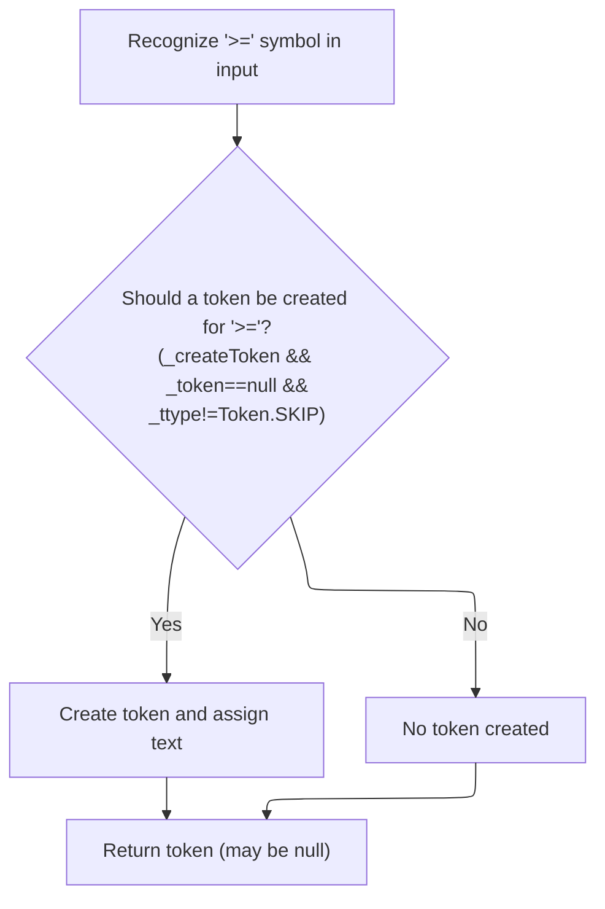
```mermaid
%%{init: {"flowchart": {"defaultRenderer": "elk"}} }%%
flowchart TD
    node1["Recognize '>=' symbol in input"]
    click node1 openCode "core/src/main/java/org/apache/struts/validator/validwhen/ValidWhenLexer.java:784:785"
    node1 --> node2{"Should a token be created for '>='?
(_createToken && _token==null &&
_ttype!=Token.SKIP)"}
    click node2 openCode "core/src/main/java/org/apache/struts/validator/validwhen/ValidWhenLexer.java:786:789"
    node2 -->|"Yes"| node3["Create token and assign text"]
    click node3 openCode "core/src/main/java/org/apache/struts/validator/validwhen/ValidWhenLexer.java:787:788"
    node2 -->|"No"| node4["No token created"]
    click node4 openCode "core/src/main/java/org/apache/struts/validator/validwhen/ValidWhenLexer.java:786:789"
    node3 --> node5["Set return token"]
    node4 --> node5
    node5["Return token (may be null)"]
    click node5 openCode "core/src/main/java/org/apache/struts/validator/validwhen/ValidWhenLexer.java:790:791"
classDef HeadingStyle fill:#777777,stroke:#333,stroke-width:2px;

%% Swimm:
%% %%{init: {"flowchart": {"defaultRenderer": "elk"}} }%%
%% flowchart TD
%%     node1["Recognize '>=' symbol in input"]
%%     click node1 openCode "<SwmPath>[core/…/validwhen/ValidWhenLexer.java](core/src/main/java/org/apache/struts/validator/validwhen/ValidWhenLexer.java)</SwmPath>:784:785"
%%     node1 --> node2{"Should a token be created for '>='?
%% (<SwmToken path="core/src/main/java/org/apache/struts/validator/validwhen/ValidWhenLexer.java" pos="250:11:11" line-data="	public final void mDECIMAL_LITERAL(boolean _createToken) throws RecognitionException, CharStreamException, TokenStreamException {">`_createToken`</SwmToken> && _token==null &&
%% _ttype!=<SwmToken path="core/src/main/java/org/apache/struts/validator/validwhen/ValidWhenLexer.java" pos="495:17:19" line-data="				if ( _createToken &amp;&amp; _token==null &amp;&amp; _ttype!=Token.SKIP ) {">`Token.SKIP`</SwmToken>)"}
%%     click node2 openCode "<SwmPath>[core/…/validwhen/ValidWhenLexer.java](core/src/main/java/org/apache/struts/validator/validwhen/ValidWhenLexer.java)</SwmPath>:786:789"
%%     node2 -->|"Yes"| node3["Create token and assign text"]
%%     click node3 openCode "<SwmPath>[core/…/validwhen/ValidWhenLexer.java](core/src/main/java/org/apache/struts/validator/validwhen/ValidWhenLexer.java)</SwmPath>:787:788"
%%     node2 -->|"No"| node4["No token created"]
%%     click node4 openCode "<SwmPath>[core/…/validwhen/ValidWhenLexer.java](core/src/main/java/org/apache/struts/validator/validwhen/ValidWhenLexer.java)</SwmPath>:786:789"
%%     node3 --> node5["Set return token"]
%%     node4 --> node5
%%     node5["Return token (may be null)"]
%%     click node5 openCode "<SwmPath>[core/…/validwhen/ValidWhenLexer.java](core/src/main/java/org/apache/struts/validator/validwhen/ValidWhenLexer.java)</SwmPath>:790:791"
%% classDef HeadingStyle fill:#777777,stroke:#333,stroke-width:2px;
```

<SwmSnippet path="/core/src/main/java/org/apache/struts/validator/validwhen/ValidWhenLexer.java" line="779">

---

In <SwmToken path="core/src/main/java/org/apache/struts/validator/validwhen/ValidWhenLexer.java" pos="779:7:7" line-data="	public final void mGREATEREQUALSIGN(boolean _createToken) throws RecognitionException, CharStreamException, TokenStreamException {">`mGREATEREQUALSIGN`</SwmToken>, we're matching the '>=' operator and setting up the token for it. This is needed so the parser can recognize greater-than-or-equal comparisons. After this, we call ActionConfigMatcher to link the token to the right action config.

```java
	public final void mGREATEREQUALSIGN(boolean _createToken) throws RecognitionException, CharStreamException, TokenStreamException {
		int _ttype; Token _token=null; int _begin=text.length();
		_ttype = GREATEREQUALSIGN;
		int _saveIndex;
		
		match('>');
		match('=');
```

---

</SwmSnippet>

<SwmSnippet path="/core/src/main/java/org/apache/struts/validator/validwhen/ValidWhenLexer.java" line="786">

---

Just returned from ActionConfigMatcher, so at the end of <SwmToken path="core/src/main/java/org/apache/struts/validator/validwhen/ValidWhenLexer.java" pos="165:1:1" line-data="						mGREATEREQUALSIGN(true);">`mGREATEREQUALSIGN`</SwmToken>, we create and return the comparison token. The token is now mapped to the right action config and ready for the parser to handle greater-than-or-equal comparisons.

```java
		if ( _createToken && _token==null && _ttype!=Token.SKIP ) {
			_token = makeToken(_ttype);
			_token.setText(new String(text.getBuffer(), _begin, text.length()-_begin));
		}
		_returnToken = _token;
	}
```

---

</SwmSnippet>

### Tokenizing Less-Than Operators

<SwmSnippet path="/core/src/main/java/org/apache/struts/validator/validwhen/ValidWhenLexer.java" line="166">

---

After returning from <SwmToken path="core/src/main/java/org/apache/struts/validator/validwhen/ValidWhenLexer.java" pos="165:1:1" line-data="						mGREATEREQUALSIGN(true);">`mGREATEREQUALSIGN`</SwmToken>, the <SwmToken path="taglib/src/main/java/org/apache/struts/taglib/html/BaseTag.java" pos="126:7:7" line-data="            serverName = tokenizer.nextToken();">`nextToken`</SwmToken> logic checks for '<' and calls <SwmToken path="core/src/main/java/org/apache/struts/validator/validwhen/ValidWhenLexer.java" pos="169:1:1" line-data="						mLESSTHANSIGN(true);">`mLESSTHANSIGN`</SwmToken>. This lets us tokenize the '<' operator for less-than comparisons in validation rules.

```java
						theRetToken=_returnToken;
					}
					else if ((LA(1)=='<') && (true)) {
						mLESSTHANSIGN(true);
```

---

</SwmSnippet>

### Tokenizing Less-Than Operator

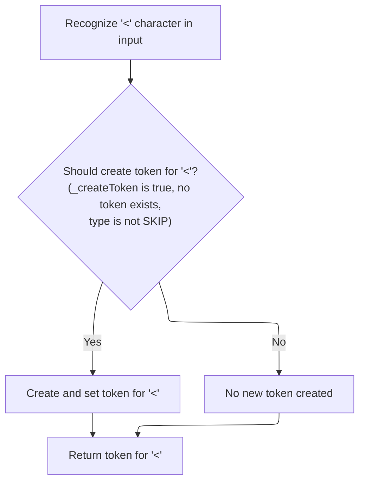
```mermaid
%%{init: {"flowchart": {"defaultRenderer": "elk"}} }%%
flowchart TD
  node1["Recognize '<' character in input"]
  click node1 openCode "core/src/main/java/org/apache/struts/validator/validwhen/ValidWhenLexer.java:744:744"
  node1 --> node2{"Should create token for '<'?
(_createToken is true, no token exists,
type is not SKIP)"}
  click node2 openCode "core/src/main/java/org/apache/struts/validator/validwhen/ValidWhenLexer.java:745:745"
  node2 -->|"Yes"| node3["Create and set token for '<'"]
  click node3 openCode "core/src/main/java/org/apache/struts/validator/validwhen/ValidWhenLexer.java:746:747"
  node2 -->|"No"| node4["No new token created"]
  click node4 openCode "core/src/main/java/org/apache/struts/validator/validwhen/ValidWhenLexer.java:748:748"
  node3 --> node5["Return token for '<'"]
  click node5 openCode "core/src/main/java/org/apache/struts/validator/validwhen/ValidWhenLexer.java:749:750"
  node4 --> node5
classDef HeadingStyle fill:#777777,stroke:#333,stroke-width:2px;

%% Swimm:
%% %%{init: {"flowchart": {"defaultRenderer": "elk"}} }%%
%% flowchart TD
%%   node1["Recognize '<' character in input"]
%%   click node1 openCode "<SwmPath>[core/…/validwhen/ValidWhenLexer.java](core/src/main/java/org/apache/struts/validator/validwhen/ValidWhenLexer.java)</SwmPath>:744:744"
%%   node1 --> node2{"Should create token for '<'?
%% (<SwmToken path="core/src/main/java/org/apache/struts/validator/validwhen/ValidWhenLexer.java" pos="250:11:11" line-data="	public final void mDECIMAL_LITERAL(boolean _createToken) throws RecognitionException, CharStreamException, TokenStreamException {">`_createToken`</SwmToken> is true, no token exists,
%% type is not SKIP)"}
%%   click node2 openCode "<SwmPath>[core/…/validwhen/ValidWhenLexer.java](core/src/main/java/org/apache/struts/validator/validwhen/ValidWhenLexer.java)</SwmPath>:745:745"
%%   node2 -->|"Yes"| node3["Create and set token for '<'"]
%%   click node3 openCode "<SwmPath>[core/…/validwhen/ValidWhenLexer.java](core/src/main/java/org/apache/struts/validator/validwhen/ValidWhenLexer.java)</SwmPath>:746:747"
%%   node2 -->|"No"| node4["No new token created"]
%%   click node4 openCode "<SwmPath>[core/…/validwhen/ValidWhenLexer.java](core/src/main/java/org/apache/struts/validator/validwhen/ValidWhenLexer.java)</SwmPath>:748:748"
%%   node3 --> node5["Return token for '<'"]
%%   click node5 openCode "<SwmPath>[core/…/validwhen/ValidWhenLexer.java](core/src/main/java/org/apache/struts/validator/validwhen/ValidWhenLexer.java)</SwmPath>:749:750"
%%   node4 --> node5
%% classDef HeadingStyle fill:#777777,stroke:#333,stroke-width:2px;
```

<SwmSnippet path="/core/src/main/java/org/apache/struts/validator/validwhen/ValidWhenLexer.java" line="739">

---

In <SwmToken path="core/src/main/java/org/apache/struts/validator/validwhen/ValidWhenLexer.java" pos="739:7:7" line-data="	public final void mLESSTHANSIGN(boolean _createToken) throws RecognitionException, CharStreamException, TokenStreamException {">`mLESSTHANSIGN`</SwmToken>, we're matching the '<' character and setting up the token for it. After this, we call ActionConfigMatcher to map the token to the right action config, so the parser can handle less-than comparisons.

```java
	public final void mLESSTHANSIGN(boolean _createToken) throws RecognitionException, CharStreamException, TokenStreamException {
		int _ttype; Token _token=null; int _begin=text.length();
		_ttype = LESSTHANSIGN;
		int _saveIndex;
		
		match('<');
```

---

</SwmSnippet>

<SwmSnippet path="/core/src/main/java/org/apache/struts/validator/validwhen/ValidWhenLexer.java" line="745">

---

Just returned from ActionConfigMatcher, so at the end of <SwmToken path="core/src/main/java/org/apache/struts/validator/validwhen/ValidWhenLexer.java" pos="169:1:1" line-data="						mLESSTHANSIGN(true);">`mLESSTHANSIGN`</SwmToken>, we create and return the less-than token if needed. The token is now mapped to the right action config and ready for the parser to handle less-than comparisons.

```java
		if ( _createToken && _token==null && _ttype!=Token.SKIP ) {
			_token = makeToken(_ttype);
			_token.setText(new String(text.getBuffer(), _begin, text.length()-_begin));
		}
		_returnToken = _token;
	}
```

---

</SwmSnippet>

### Tokenizing Greater-Than Operator

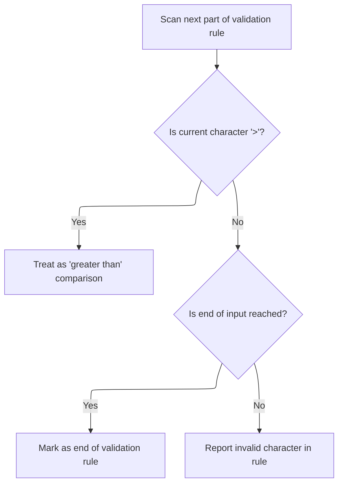
```mermaid
%%{init: {"flowchart": {"defaultRenderer": "elk"}} }%%
flowchart TD
  node1["Scan next part of validation rule"]
  click node1 openCode "core/src/main/java/org/apache/struts/validator/validwhen/ValidWhenLexer.java:170:171"
  node1 --> node2{"Is current character '>'?"}
  click node2 openCode "core/src/main/java/org/apache/struts/validator/validwhen/ValidWhenLexer.java:172:172"
  node2 -->|"Yes"| node3["Treat as 'greater than' comparison"]
  click node3 openCode "core/src/main/java/org/apache/struts/validator/validwhen/ValidWhenLexer.java:173:174"
  node2 -->|"No"| node4{"Is end of input reached?"}
  click node4 openCode "core/src/main/java/org/apache/struts/validator/validwhen/ValidWhenLexer.java:176:177"
  node4 -->|"Yes"| node5["Mark as end of validation rule"]
  click node5 openCode "core/src/main/java/org/apache/struts/validator/validwhen/ValidWhenLexer.java:177:177"
  node4 -->|"No"| node6["Report invalid character in rule"]
  click node6 openCode "core/src/main/java/org/apache/struts/validator/validwhen/ValidWhenLexer.java:178:179"

classDef HeadingStyle fill:#777777,stroke:#333,stroke-width:2px;

%% Swimm:
%% %%{init: {"flowchart": {"defaultRenderer": "elk"}} }%%
%% flowchart TD
%%   node1["Scan next part of validation rule"]
%%   click node1 openCode "<SwmPath>[core/…/validwhen/ValidWhenLexer.java](core/src/main/java/org/apache/struts/validator/validwhen/ValidWhenLexer.java)</SwmPath>:170:171"
%%   node1 --> node2{"Is current character '>'?"}
%%   click node2 openCode "<SwmPath>[core/…/validwhen/ValidWhenLexer.java](core/src/main/java/org/apache/struts/validator/validwhen/ValidWhenLexer.java)</SwmPath>:172:172"
%%   node2 -->|"Yes"| node3["Treat as 'greater than' comparison"]
%%   click node3 openCode "<SwmPath>[core/…/validwhen/ValidWhenLexer.java](core/src/main/java/org/apache/struts/validator/validwhen/ValidWhenLexer.java)</SwmPath>:173:174"
%%   node2 -->|"No"| node4{"Is end of input reached?"}
%%   click node4 openCode "<SwmPath>[core/…/validwhen/ValidWhenLexer.java](core/src/main/java/org/apache/struts/validator/validwhen/ValidWhenLexer.java)</SwmPath>:176:177"
%%   node4 -->|"Yes"| node5["Mark as end of validation rule"]
%%   click node5 openCode "<SwmPath>[core/…/validwhen/ValidWhenLexer.java](core/src/main/java/org/apache/struts/validator/validwhen/ValidWhenLexer.java)</SwmPath>:177:177"
%%   node4 -->|"No"| node6["Report invalid character in rule"]
%%   click node6 openCode "<SwmPath>[core/…/validwhen/ValidWhenLexer.java](core/src/main/java/org/apache/struts/validator/validwhen/ValidWhenLexer.java)</SwmPath>:178:179"
%% 
%% classDef HeadingStyle fill:#777777,stroke:#333,stroke-width:2px;
```

<SwmSnippet path="/core/src/main/java/org/apache/struts/validator/validwhen/ValidWhenLexer.java" line="170">

---

Back in <SwmToken path="taglib/src/main/java/org/apache/struts/taglib/html/BaseTag.java" pos="126:7:7" line-data="            serverName = tokenizer.nextToken();">`nextToken`</SwmToken>, after handling '<', we check for '>' and call <SwmToken path="core/src/main/java/org/apache/struts/validator/validwhen/ValidWhenLexer.java" pos="173:1:1" line-data="						mGREATERTHANSIGN(true);">`mGREATERTHANSIGN`</SwmToken> if found. This keeps the lexer moving through comparison operators without missing any, and sets up the next token for the parser.

```java
						theRetToken=_returnToken;
					}
					else if ((LA(1)=='>') && (true)) {
						mGREATERTHANSIGN(true);
						theRetToken=_returnToken;
					}
				else {
					if (LA(1)==EOF_CHAR) {uponEOF(); _returnToken = makeToken(Token.EOF_TYPE);}
				else {throw new NoViableAltForCharException((char)LA(1), getFilename(), getLine(), getColumn());}
				}
				}
```

---

</SwmSnippet>

### Tokenizing Greater-Than Operator

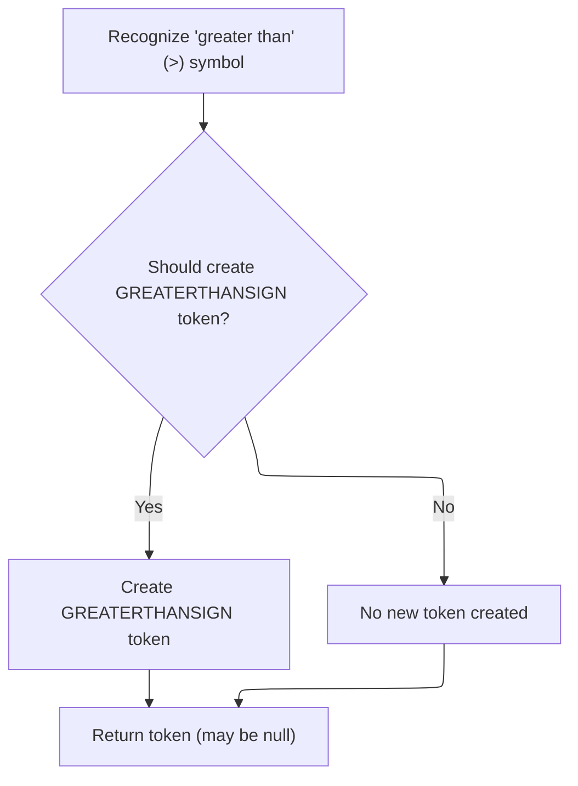
```mermaid
%%{init: {"flowchart": {"defaultRenderer": "elk"}} }%%
flowchart TD
    node1["Recognize 'greater than' (>) symbol"]
    click node1 openCode "core/src/main/java/org/apache/struts/validator/validwhen/ValidWhenLexer.java:757:757"
    node1 --> node2{"Should create GREATERTHANSIGN token?"}
    click node2 openCode "core/src/main/java/org/apache/struts/validator/validwhen/ValidWhenLexer.java:758:761"
    node2 -->|"Yes"| node3["Create GREATERTHANSIGN token"]
    click node3 openCode "core/src/main/java/org/apache/struts/validator/validwhen/ValidWhenLexer.java:759:760"
    node2 -->|"No"| node4["No new token created"]
    click node4 openCode "core/src/main/java/org/apache/struts/validator/validwhen/ValidWhenLexer.java:758:761"
    node3 --> node5["Return token (may be null)"]
    click node5 openCode "core/src/main/java/org/apache/struts/validator/validwhen/ValidWhenLexer.java:762:763"
    node4 --> node5
classDef HeadingStyle fill:#777777,stroke:#333,stroke-width:2px;

%% Swimm:
%% %%{init: {"flowchart": {"defaultRenderer": "elk"}} }%%
%% flowchart TD
%%     node1["Recognize 'greater than' (>) symbol"]
%%     click node1 openCode "<SwmPath>[core/…/validwhen/ValidWhenLexer.java](core/src/main/java/org/apache/struts/validator/validwhen/ValidWhenLexer.java)</SwmPath>:757:757"
%%     node1 --> node2{"Should create GREATERTHANSIGN token?"}
%%     click node2 openCode "<SwmPath>[core/…/validwhen/ValidWhenLexer.java](core/src/main/java/org/apache/struts/validator/validwhen/ValidWhenLexer.java)</SwmPath>:758:761"
%%     node2 -->|"Yes"| node3["Create GREATERTHANSIGN token"]
%%     click node3 openCode "<SwmPath>[core/…/validwhen/ValidWhenLexer.java](core/src/main/java/org/apache/struts/validator/validwhen/ValidWhenLexer.java)</SwmPath>:759:760"
%%     node2 -->|"No"| node4["No new token created"]
%%     click node4 openCode "<SwmPath>[core/…/validwhen/ValidWhenLexer.java](core/src/main/java/org/apache/struts/validator/validwhen/ValidWhenLexer.java)</SwmPath>:758:761"
%%     node3 --> node5["Return token (may be null)"]
%%     click node5 openCode "<SwmPath>[core/…/validwhen/ValidWhenLexer.java](core/src/main/java/org/apache/struts/validator/validwhen/ValidWhenLexer.java)</SwmPath>:762:763"
%%     node4 --> node5
%% classDef HeadingStyle fill:#777777,stroke:#333,stroke-width:2px;
```

<SwmSnippet path="/core/src/main/java/org/apache/struts/validator/validwhen/ValidWhenLexer.java" line="752">

---

In <SwmToken path="core/src/main/java/org/apache/struts/validator/validwhen/ValidWhenLexer.java" pos="752:7:7" line-data="	public final void mGREATERTHANSIGN(boolean _createToken) throws RecognitionException, CharStreamException, TokenStreamException {">`mGREATERTHANSIGN`</SwmToken>, we're matching the '>' character and setting up the token for it. After this, we call ActionConfigMatcher to map the token to the right action config, so the parser can handle greater-than comparisons.

```java
	public final void mGREATERTHANSIGN(boolean _createToken) throws RecognitionException, CharStreamException, TokenStreamException {
		int _ttype; Token _token=null; int _begin=text.length();
		_ttype = GREATERTHANSIGN;
		int _saveIndex;
		
		match('>');
```

---

</SwmSnippet>

<SwmSnippet path="/core/src/main/java/org/apache/struts/validator/validwhen/ValidWhenLexer.java" line="758">

---

Just returned from ActionConfigMatcher, so at the end of <SwmToken path="core/src/main/java/org/apache/struts/validator/validwhen/ValidWhenLexer.java" pos="173:1:1" line-data="						mGREATERTHANSIGN(true);">`mGREATERTHANSIGN`</SwmToken>, we create and return the greater-than token if needed. The token is now mapped to the right action config and ready for the parser to handle greater-than comparisons.

```java
		if ( _createToken && _token==null && _ttype!=Token.SKIP ) {
			_token = makeToken(_ttype);
			_token.setText(new String(text.getBuffer(), _begin, text.length()-_begin));
		}
		_returnToken = _token;
	}
```

---

</SwmSnippet>

### Finalizing Token and Handling Errors

<SwmSnippet path="/core/src/main/java/org/apache/struts/validator/validwhen/ValidWhenLexer.java" line="181">

---

Back in <SwmToken path="taglib/src/main/java/org/apache/struts/taglib/html/BaseTag.java" pos="126:7:7" line-data="            serverName = tokenizer.nextToken();">`nextToken`</SwmToken>, after handling the token, we finalize its type and return it. If the token is a SKIP, we loop again. After this, we need to call into <SwmToken path="faces/src/main/java/org/apache/struts/faces/component/CommandLinkComponent.java" pos="37:4:4" line-data="public class CommandLinkComponent extends UICommand {">`CommandLinkComponent`</SwmToken> to resolve dynamic properties for the next part of the flow.

```java
				if ( _returnToken==null ) continue tryAgain; // found SKIP token
				_ttype = _returnToken.getType();
				_ttype = testLiteralsTable(_ttype);
				_returnToken.setType(_ttype);
				return _returnToken;
			}
			catch (RecognitionException e) {
				throw new TokenStreamRecognitionException(e);
			}
		}
```

---

</SwmSnippet>

<SwmSnippet path="/faces/src/main/java/org/apache/struts/faces/component/CommandLinkComponent.java" line="434">

---

<SwmToken path="faces/src/main/java/org/apache/struts/faces/component/CommandLinkComponent.java" pos="434:5:5" line-data="    public String getType() {">`getType`</SwmToken> checks for a <SwmToken path="faces/src/main/java/org/apache/struts/faces/component/CommandLinkComponent.java" pos="435:1:1" line-data="        ValueBinding vb = getValueBinding(&quot;type&quot;);">`ValueBinding`</SwmToken> on 'type' to resolve the value dynamically using <SwmToken path="faces/src/main/java/org/apache/struts/faces/component/CommandLinkComponent.java" pos="26:8:8" line-data="import javax.faces.context.FacesContext;">`FacesContext`</SwmToken>. If there's no binding, it falls back to the local 'type' variable. This lets the component support both static and dynamic property values.

```java
    public String getType() {
        ValueBinding vb = getValueBinding("type");
        if (vb != null) {
            return (String) vb.getValue(getFacesContext());
        } else {
            return type;
        }
    }
```

---

</SwmSnippet>

<SwmSnippet path="/core/src/main/java/org/apache/struts/validator/validwhen/ValidWhenLexer.java" line="191">

---

Just returned from <SwmToken path="faces/src/main/java/org/apache/struts/faces/component/CommandLinkComponent.java" pos="37:4:4" line-data="public class CommandLinkComponent extends UICommand {">`CommandLinkComponent`</SwmToken>, so at the end of <SwmToken path="taglib/src/main/java/org/apache/struts/taglib/html/BaseTag.java" pos="126:7:7" line-data="            serverName = tokenizer.nextToken();">`nextToken`</SwmToken>, we handle any CharStreamExceptions by wrapping IO errors in <SwmToken path="core/src/main/java/org/apache/struts/validator/validwhen/ValidWhenLexer.java" pos="193:5:5" line-data="				throw new TokenStreamIOException(((CharStreamIOException)cse).io);">`TokenStreamIOException`</SwmToken>, and throw a generic <SwmToken path="core/src/main/java/org/apache/struts/validator/validwhen/ValidWhenLexer.java" pos="196:5:5" line-data="				throw new TokenStreamException(cse.getMessage());">`TokenStreamException`</SwmToken> for other cases. This keeps error handling clear for the caller.

```java
		catch (CharStreamException cse) {
			if ( cse instanceof CharStreamIOException ) {
				throw new TokenStreamIOException(((CharStreamIOException)cse).io);
			}
			else {
				throw new TokenStreamException(cse.getMessage());
			}
		}
	}
}
```

---

</SwmSnippet>

## Rendering the Base Tag Element

<SwmSnippet path="/taglib/src/main/java/org/apache/struts/taglib/html/BaseTag.java" line="141">

---

Back in <SwmToken path="taglib/src/main/java/org/apache/struts/taglib/html/BaseTag.java" pos="114:5:5" line-data="    public int doStartTag() throws JspException {">`doStartTag`</SwmToken>, after parsing and validating everything, we call <SwmToken path="taglib/src/main/java/org/apache/struts/taglib/html/BaseTag.java" pos="142:1:1" line-data="            renderBaseElement(request.getScheme(), serverName, port,">`renderBaseElement`</SwmToken> with the scheme, server name, port, and URI. This is where the base tag string is built for output.

```java
        String baseTag =
            renderBaseElement(request.getScheme(), serverName, port,
                request.getRequestURI());

```

---

</SwmSnippet>

## Building the Base Tag String

<SwmSnippet path="/taglib/src/main/java/org/apache/struts/taglib/html/BaseTag.java" line="170">

---

In <SwmToken path="taglib/src/main/java/org/apache/struts/taglib/html/BaseTag.java" pos="170:5:5" line-data="    protected String renderBaseElement(String scheme, String serverName,">`renderBaseElement`</SwmToken>, we decide how to build the base tag's href based on whether 'ref' equals <SwmToken path="taglib/src/main/java/org/apache/struts/taglib/html/BaseTag.java" pos="174:8:8" line-data="        if (ref.equals(REF_SITE)) {">`REF_SITE`</SwmToken>. If it does, we use the context path from the request; otherwise, we use the full URI. Next, we call <SwmToken path="core/src/main/java/org/apache/struts/chain/contexts/ServletActionContext.java" pos="39:4:4" line-data="public class ServletActionContext extends WebActionContext {">`ServletActionContext`</SwmToken> to get the servlet-specific context for further processing.

```java
    protected String renderBaseElement(String scheme, String serverName,
        int port, String uri) {
        StringBuffer tag = new StringBuffer("<base href=\"");

        if (ref.equals(REF_SITE)) {
            StringBuffer contextBase =
                new StringBuffer(((HttpServletRequest) pageContext.getRequest())
                    .getContextPath());

```

---

</SwmSnippet>

<SwmSnippet path="/taglib/src/main/java/org/apache/struts/taglib/html/BaseTag.java" line="179">

---

Just returned from <SwmToken path="core/src/main/java/org/apache/struts/chain/contexts/ServletActionContext.java" pos="39:4:4" line-data="public class ServletActionContext extends WebActionContext {">`ServletActionContext`</SwmToken>, so in <SwmToken path="taglib/src/main/java/org/apache/struts/taglib/html/BaseTag.java" pos="142:1:1" line-data="            renderBaseElement(request.getScheme(), serverName, port,">`renderBaseElement`</SwmToken>, we build the server URI string using <SwmToken path="taglib/src/main/java/org/apache/struts/taglib/html/BaseTag.java" pos="181:1:3" line-data="                    RequestUtils.createServerUriStringBuffer(scheme,">`RequestUtils.createServerUriStringBuffer`</SwmToken>. This handles both the context path and full URI cases, depending on the 'ref' value.

```java
            contextBase.append("/");
            tag.append(TagUtils.getInstance().filter(
                    RequestUtils.createServerUriStringBuffer(scheme,
                    serverName, port, contextBase.toString()).toString()));
        } else {
            tag.append(TagUtils.getInstance().filter(
                RequestUtils.createServerUriStringBuffer(scheme,
                    serverName, port, uri).toString()));
        }

```

---

</SwmSnippet>

### Building the Server URI String

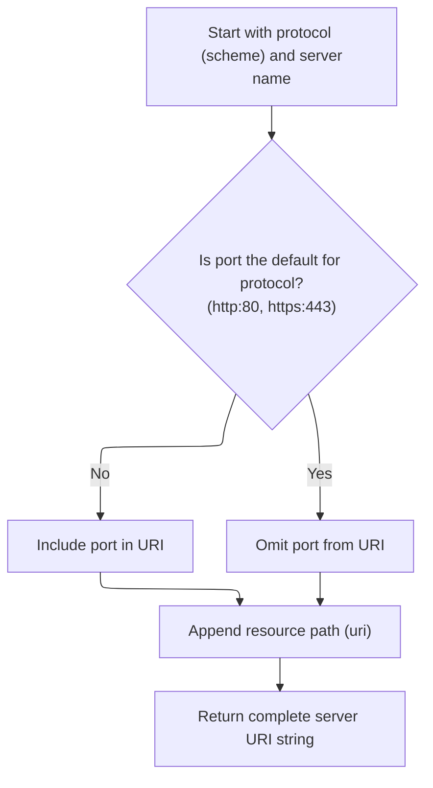
```mermaid
%%{init: {"flowchart": {"defaultRenderer": "elk"}} }%%
flowchart TD
  node1["Start with protocol (scheme) and server
name"] --> node2{"Is port the default for protocol?
(http:80, https:443)"}
  click node1 openCode "core/src/main/java/org/apache/struts/util/RequestUtils.java:1037:1039"
  node2 -->|"No"| node3["Include port in URI"]
  click node2 openCode "core/src/main/java/org/apache/struts/util/RequestUtils.java:1017:1021"
  node2 -->|"Yes"| node4["Omit port from URI"]
  click node3 openCode "core/src/main/java/org/apache/struts/util/RequestUtils.java:1017:1021"
  click node4 openCode "core/src/main/java/org/apache/struts/util/RequestUtils.java:1013:1016"
  node3 --> node5["Append resource path (uri)"]
  node4 --> node5
  click node5 openCode "core/src/main/java/org/apache/struts/util/RequestUtils.java:1041:1041"
  node5 --> node6["Return complete server URI string"]
  click node6 openCode "core/src/main/java/org/apache/struts/util/RequestUtils.java:1043:1044"

classDef HeadingStyle fill:#777777,stroke:#333,stroke-width:2px;

%% Swimm:
%% %%{init: {"flowchart": {"defaultRenderer": "elk"}} }%%
%% flowchart TD
%%   node1["Start with protocol (scheme) and server
%% name"] --> node2{"Is port the default for protocol?
%% (http:80, https:443)"}
%%   click node1 openCode "<SwmPath>[core/…/util/RequestUtils.java](core/src/main/java/org/apache/struts/util/RequestUtils.java)</SwmPath>:1037:1039"
%%   node2 -->|"No"| node3["Include port in URI"]
%%   click node2 openCode "<SwmPath>[core/…/util/RequestUtils.java](core/src/main/java/org/apache/struts/util/RequestUtils.java)</SwmPath>:1017:1021"
%%   node2 -->|"Yes"| node4["Omit port from URI"]
%%   click node3 openCode "<SwmPath>[core/…/util/RequestUtils.java](core/src/main/java/org/apache/struts/util/RequestUtils.java)</SwmPath>:1017:1021"
%%   click node4 openCode "<SwmPath>[core/…/util/RequestUtils.java](core/src/main/java/org/apache/struts/util/RequestUtils.java)</SwmPath>:1013:1016"
%%   node3 --> node5["Append resource path (uri)"]
%%   node4 --> node5
%%   click node5 openCode "<SwmPath>[core/…/util/RequestUtils.java](core/src/main/java/org/apache/struts/util/RequestUtils.java)</SwmPath>:1041:1041"
%%   node5 --> node6["Return complete server URI string"]
%%   click node6 openCode "<SwmPath>[core/…/util/RequestUtils.java](core/src/main/java/org/apache/struts/util/RequestUtils.java)</SwmPath>:1043:1044"
%% 
%% classDef HeadingStyle fill:#777777,stroke:#333,stroke-width:2px;
```

<SwmSnippet path="/core/src/main/java/org/apache/struts/util/RequestUtils.java" line="1037">

---

In <SwmToken path="core/src/main/java/org/apache/struts/util/RequestUtils.java" pos="1037:7:7" line-data="    public static StringBuffer createServerUriStringBuffer(String scheme,">`createServerUriStringBuffer`</SwmToken>, we first build the server part of the URL with <SwmToken path="core/src/main/java/org/apache/struts/util/RequestUtils.java" pos="1039:7:7" line-data="        StringBuffer serverUri = createServerStringBuffer(scheme, server, port);">`createServerStringBuffer`</SwmToken>, then append the URI. This modular approach keeps the URL construction clean and reusable.

```java
    public static StringBuffer createServerUriStringBuffer(String scheme,
        String server, int port, String uri) {
        StringBuffer serverUri = createServerStringBuffer(scheme, server, port);

```

---

</SwmSnippet>

<SwmSnippet path="/core/src/main/java/org/apache/struts/util/RequestUtils.java" line="1005">

---

<SwmToken path="core/src/main/java/org/apache/struts/util/RequestUtils.java" pos="1005:7:7" line-data="    public static StringBuffer createServerStringBuffer(String scheme,">`createServerStringBuffer`</SwmToken> builds the scheme, server, and port part of the URL. If the port is less than 0, we set it to 80 to avoid a <SwmToken path="core/src/main/java/org/apache/struts/util/RequestUtils.java" pos="1010:14:18" line-data="            port = 80; // Work around java.net.URL bug">`java.net.URL`</SwmToken> bug. We only include the port if it's not the default for the scheme.

```java
    public static StringBuffer createServerStringBuffer(String scheme,
        String server, int port) {
        StringBuffer url = new StringBuffer();

        if (port < 0) {
            port = 80; // Work around java.net.URL bug
        }

        url.append(scheme);
        url.append("://");
        url.append(server);

        if ((scheme.equals("http") && (port != 80))
            || (scheme.equals("https") && (port != 443))) {
            url.append(':');
            url.append(port);
        }

        return url;
    }
```

---

</SwmSnippet>

<SwmSnippet path="/core/src/main/java/org/apache/struts/util/RequestUtils.java" line="1041">

---

Just returned from <SwmToken path="core/src/main/java/org/apache/struts/util/RequestUtils.java" pos="1005:7:7" line-data="    public static StringBuffer createServerStringBuffer(String scheme,">`createServerStringBuffer`</SwmToken>, so at the end of <SwmToken path="taglib/src/main/java/org/apache/struts/taglib/html/BaseTag.java" pos="181:3:3" line-data="                    RequestUtils.createServerUriStringBuffer(scheme,">`createServerUriStringBuffer`</SwmToken>, we append the URI to the server string and return the result. This gives the caller the full URL for the base tag.

```java
        serverUri.append(uri);

        return serverUri;
    }
```

---

</SwmSnippet>

### Finalizing the Base Tag Output

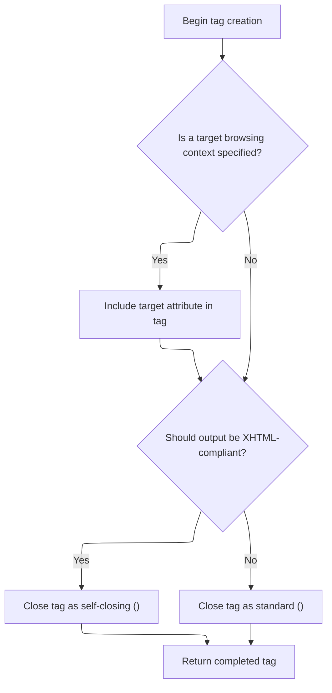
```mermaid
%%{init: {"flowchart": {"defaultRenderer": "elk"}} }%%
flowchart TD
  node1["Begin <base> tag creation"]
  click node1 openCode "taglib/src/main/java/org/apache/struts/taglib/html/BaseTag.java:189:191"
  node1 --> node2{"Is a target browsing context specified?"}
  click node2 openCode "taglib/src/main/java/org/apache/struts/taglib/html/BaseTag.java:191:195"
  node2 -->|"Yes"| node3["Include target attribute in tag"]
  click node3 openCode "taglib/src/main/java/org/apache/struts/taglib/html/BaseTag.java:192:194"
  node2 -->|"No"| node4{"Should output be XHTML-compliant?"}
  node3 --> node4
  click node4 openCode "taglib/src/main/java/org/apache/struts/taglib/html/BaseTag.java:197:201"
  node4 -->|"Yes"| node5["Close tag as self-closing (<base />)"]
  click node5 openCode "taglib/src/main/java/org/apache/struts/taglib/html/BaseTag.java:198:199"
  node4 -->|"No"| node6["Close tag as standard (<base>)"]
  click node6 openCode "taglib/src/main/java/org/apache/struts/taglib/html/BaseTag.java:200:201"
  node5 --> node7["Return completed <base> tag"]
  click node7 openCode "taglib/src/main/java/org/apache/struts/taglib/html/BaseTag.java:203:204"
  node6 --> node7
classDef HeadingStyle fill:#777777,stroke:#333,stroke-width:2px;

%% Swimm:
%% %%{init: {"flowchart": {"defaultRenderer": "elk"}} }%%
%% flowchart TD
%%   node1["Begin <base> tag creation"]
%%   click node1 openCode "<SwmPath>[taglib/…/html/BaseTag.java](taglib/src/main/java/org/apache/struts/taglib/html/BaseTag.java)</SwmPath>:189:191"
%%   node1 --> node2{"Is a target browsing context specified?"}
%%   click node2 openCode "<SwmPath>[taglib/…/html/BaseTag.java](taglib/src/main/java/org/apache/struts/taglib/html/BaseTag.java)</SwmPath>:191:195"
%%   node2 -->|"Yes"| node3["Include target attribute in tag"]
%%   click node3 openCode "<SwmPath>[taglib/…/html/BaseTag.java](taglib/src/main/java/org/apache/struts/taglib/html/BaseTag.java)</SwmPath>:192:194"
%%   node2 -->|"No"| node4{"Should output be XHTML-compliant?"}
%%   node3 --> node4
%%   click node4 openCode "<SwmPath>[taglib/…/html/BaseTag.java](taglib/src/main/java/org/apache/struts/taglib/html/BaseTag.java)</SwmPath>:197:201"
%%   node4 -->|"Yes"| node5["Close tag as self-closing (<base />)"]
%%   click node5 openCode "<SwmPath>[taglib/…/html/BaseTag.java](taglib/src/main/java/org/apache/struts/taglib/html/BaseTag.java)</SwmPath>:198:199"
%%   node4 -->|"No"| node6["Close tag as standard (<base>)"]
%%   click node6 openCode "<SwmPath>[taglib/…/html/BaseTag.java](taglib/src/main/java/org/apache/struts/taglib/html/BaseTag.java)</SwmPath>:200:201"
%%   node5 --> node7["Return completed <base> tag"]
%%   click node7 openCode "<SwmPath>[taglib/…/html/BaseTag.java](taglib/src/main/java/org/apache/struts/taglib/html/BaseTag.java)</SwmPath>:203:204"
%%   node6 --> node7
%% classDef HeadingStyle fill:#777777,stroke:#333,stroke-width:2px;
```

<SwmSnippet path="/taglib/src/main/java/org/apache/struts/taglib/html/BaseTag.java" line="189">

---

<SwmToken path="taglib/src/main/java/org/apache/struts/taglib/html/BaseTag.java" pos="197:10:10" line-data="        if (TagUtils.getInstance().isXhtml(this.pageContext)) {">`isXhtml`</SwmToken> checks the page context for the XHTML flag using lookup. If it's set to 'true', we know to close tags with '/>' for XHTML output. Otherwise, we use the regular HTML closing style.

```java
        tag.append("\"");

        if (this.target != null) {
            tag.append(" target=\"");
            tag.append(TagUtils.getInstance().filter(this.target));
            tag.append("\"");
        }

        if (TagUtils.getInstance().isXhtml(this.pageContext)) {
            tag.append(" />");
        } else {
            tag.append(">");
        }

        return tag.toString();
    }
```

---

</SwmSnippet>

## Looking Up Attributes in the Page Context

<SwmSnippet path="/taglib/src/main/java/org/apache/struts/taglib/TagUtils.java" line="838">

---

In <SwmToken path="taglib/src/main/java/org/apache/struts/taglib/TagUtils.java" pos="841:9:9" line-data="            xhtml = (String) lookup(pageContext, Globals.XHTML_KEY, null);">`lookup`</SwmToken>, we check if <SwmToken path="taglib/src/main/java/org/apache/struts/taglib/TagUtils.java" pos="809:9:9" line-data="    public int getScope(String scopeName)">`scopeName`</SwmToken> is null to decide whether to search all scopes or just one. If a scope is specified, we call <SwmToken path="taglib/src/main/java/org/apache/struts/taglib/TagUtils.java" pos="809:5:5" line-data="    public int getScope(String scopeName)">`getScope`</SwmToken> to resolve it and then get the attribute from that scope.

```java
    public boolean isXhtml(PageContext pageContext) {
        String xhtml;
        try {
            xhtml = (String) lookup(pageContext, Globals.XHTML_KEY, null);
            return "true".equalsIgnoreCase(xhtml);
        } catch (JspException e) {
            log.error("Failed xhtml lookup", e);
            throw new RuntimeException(e);
        }
    }
```

---

</SwmSnippet>

## Resolving Scope for Attribute Lookup

```mermaid
%%{init: {"flowchart": {"defaultRenderer": "elk"}} }%%
flowchart TD
  node1{"Is a specific scope provided?
(scopeName)"}
  click node1 openCode "taglib/src/main/java/org/apache/struts/taglib/TagUtils.java:865:867"
  node1 -->|"No"| node2["Retrieve attribute by name from default
context"]
  click node2 openCode "taglib/src/main/java/org/apache/struts/taglib/TagUtils.java:866:866"
  node1 -->|"Yes"| node3{"Is the scope valid?"}
  click node3 openCode "taglib/src/main/java/org/apache/struts/taglib/TagUtils.java:869:870"
  node3 -->|"Yes"| node4["Retrieve attribute by name from
specified scope"]
  click node4 openCode "taglib/src/main/java/org/apache/struts/taglib/TagUtils.java:870:871"
  node3 -->|"No"| node5["Save and throw error: Invalid scope"]
  click node5 openCode "taglib/src/main/java/org/apache/struts/taglib/TagUtils.java:872:873"

classDef HeadingStyle fill:#777777,stroke:#333,stroke-width:2px;

%% Swimm:
%% %%{init: {"flowchart": {"defaultRenderer": "elk"}} }%%
%% flowchart TD
%%   node1{"Is a specific scope provided?
%% (<SwmToken path="taglib/src/main/java/org/apache/struts/taglib/TagUtils.java" pos="809:9:9" line-data="    public int getScope(String scopeName)">`scopeName`</SwmToken>)"}
%%   click node1 openCode "<SwmPath>[taglib/…/taglib/TagUtils.java](taglib/src/main/java/org/apache/struts/taglib/TagUtils.java)</SwmPath>:865:867"
%%   node1 -->|"No"| node2["Retrieve attribute by name from default
%% context"]
%%   click node2 openCode "<SwmPath>[taglib/…/taglib/TagUtils.java](taglib/src/main/java/org/apache/struts/taglib/TagUtils.java)</SwmPath>:866:866"
%%   node1 -->|"Yes"| node3{"Is the scope valid?"}
%%   click node3 openCode "<SwmPath>[taglib/…/taglib/TagUtils.java](taglib/src/main/java/org/apache/struts/taglib/TagUtils.java)</SwmPath>:869:870"
%%   node3 -->|"Yes"| node4["Retrieve attribute by name from
%% specified scope"]
%%   click node4 openCode "<SwmPath>[taglib/…/taglib/TagUtils.java](taglib/src/main/java/org/apache/struts/taglib/TagUtils.java)</SwmPath>:870:871"
%%   node3 -->|"No"| node5["Save and throw error: Invalid scope"]
%%   click node5 openCode "<SwmPath>[taglib/…/taglib/TagUtils.java](taglib/src/main/java/org/apache/struts/taglib/TagUtils.java)</SwmPath>:872:873"
%% 
%% classDef HeadingStyle fill:#777777,stroke:#333,stroke-width:2px;
```

<SwmSnippet path="/taglib/src/main/java/org/apache/struts/taglib/TagUtils.java" line="863">

---

Just returned from <SwmToken path="taglib/src/main/java/org/apache/struts/taglib/TagUtils.java" pos="870:12:12" line-data="            return pageContext.getAttribute(name, instance.getScope(scopeName));">`getScope`</SwmToken>, so in <SwmToken path="taglib/src/main/java/org/apache/struts/taglib/TagUtils.java" pos="863:5:5" line-data="    public Object lookup(PageContext pageContext, String name, String scopeName)">`lookup`</SwmToken>, if we hit a <SwmToken path="taglib/src/main/java/org/apache/struts/taglib/TagUtils.java" pos="864:3:3" line-data="        throws JspException {">`JspException`</SwmToken>, we save it in the page context and rethrow. This makes sure errors are visible for later handling.

```java
    public Object lookup(PageContext pageContext, String name, String scopeName)
        throws JspException {
        if (scopeName == null) {
            return pageContext.findAttribute(name);
        }

        try {
            return pageContext.getAttribute(name, instance.getScope(scopeName));
```

---

</SwmSnippet>

<SwmSnippet path="/taglib/src/main/java/org/apache/struts/taglib/TagUtils.java" line="809">

---

<SwmToken path="taglib/src/main/java/org/apache/struts/taglib/TagUtils.java" pos="870:5:5" line-data="            return pageContext.getAttribute(name, instance.getScope(scopeName));">`getAttribute`</SwmToken> checks if the scope is <SwmToken path="tiles/src/main/java/org/apache/struts/tiles/ComponentContext.java" pos="174:10:10" line-data="        if (scope == ComponentConstants.COMPONENT_SCOPE){">`COMPONENT_SCOPE`</SwmToken>. If so, it does a local lookup; otherwise, it gets the attribute from the page context. This lets us handle component-scoped and regular attributes differently.

```java
    public int getScope(String scopeName)
        throws JspException {
        Integer scope = (Integer) scopes.get(scopeName.toLowerCase());

        if (scope == null) {
            throw new JspException(messages.getMessage("lookup.scope", scope));
        }

        return scope.intValue();
    }
```

---

</SwmSnippet>

<SwmSnippet path="/taglib/src/main/java/org/apache/struts/taglib/TagUtils.java" line="870">

---

Just returned from <SwmToken path="taglib/src/main/java/org/apache/struts/taglib/html/BaseTag.java" pos="180:5:5" line-data="            tag.append(TagUtils.getInstance().filter(">`TagUtils`</SwmToken>, so if the scope is <SwmToken path="tiles/src/main/java/org/apache/struts/tiles/ComponentContext.java" pos="174:10:10" line-data="        if (scope == ComponentConstants.COMPONENT_SCOPE){">`COMPONENT_SCOPE`</SwmToken>, we branch to <SwmToken path="tiles/src/main/java/org/apache/struts/tiles/ComponentContext.java" pos="39:4:4" line-data="public class ComponentContext implements Serializable {">`ComponentContext`</SwmToken> for the attribute lookup. This supports custom scoping beyond the standard JSP scopes.

```java
            return pageContext.getAttribute(name, instance.getScope(scopeName));
        } catch (JspException e) {
            saveException(pageContext, e);
            throw e;
        }
    }
```

---

</SwmSnippet>

<SwmSnippet path="/tiles/src/main/java/org/apache/struts/tiles/ComponentContext.java" line="169">

---

<SwmToken path="tiles/src/main/java/org/apache/struts/tiles/ComponentContext.java" pos="169:5:5" line-data="    public Object getAttribute(">`getAttribute`</SwmToken> checks if the scope is <SwmToken path="tiles/src/main/java/org/apache/struts/tiles/ComponentContext.java" pos="174:10:10" line-data="        if (scope == ComponentConstants.COMPONENT_SCOPE){">`COMPONENT_SCOPE`</SwmToken>. If so, it does a local lookup; otherwise, it gets the attribute from the page context. This lets us handle component-scoped and regular attributes differently.

```java
    public Object getAttribute(
        String beanName,
        int scope,
        PageContext pageContext) {

        if (scope == ComponentConstants.COMPONENT_SCOPE){
            return getAttribute(beanName);
        }

        return pageContext.getAttribute(beanName, scope);
    }
```

---

</SwmSnippet>

## Writing the Base Tag to Output

<SwmSnippet path="/taglib/src/main/java/org/apache/struts/taglib/html/BaseTag.java" line="145">

---

Just returned from <SwmToken path="taglib/src/main/java/org/apache/struts/taglib/html/BaseTag.java" pos="142:1:1" line-data="            renderBaseElement(request.getScheme(), serverName, port,">`renderBaseElement`</SwmToken>, so in <SwmToken path="taglib/src/main/java/org/apache/struts/taglib/html/BaseTag.java" pos="114:5:5" line-data="    public int doStartTag() throws JspException {">`doStartTag`</SwmToken>, we write the base tag string to the JSP output. If writing fails, we set the exception in the page context and throw a <SwmToken path="taglib/src/main/java/org/apache/struts/taglib/html/BaseTag.java" pos="152:5:5" line-data="            throw new JspException(messages.getMessage(&quot;common.io&quot;, e.toString()), e);">`JspException`</SwmToken> to stop rendering.

```java
        JspWriter out = pageContext.getOut();

        try {
            out.write(baseTag);
        } catch (IOException e) {
            pageContext.setAttribute(Globals.EXCEPTION_KEY, e,
                PageContext.REQUEST_SCOPE);
            throw new JspException(messages.getMessage("common.io", e.toString()), e);
        }

        return EVAL_BODY_INCLUDE;
    }
```

---

</SwmSnippet>

<SwmSnippet path="/core/src/main/java/org/apache/struts/util/ServletContextWriter.java" line="344">

---

<SwmToken path="core/src/main/java/org/apache/struts/util/ServletContextWriter.java" pos="344:5:5" line-data="    public void write(String s) {">`write`</SwmToken> writes the input string one character at a time by looping through it and calling the single-character write method. If the string is null, this will throw a <SwmToken path="taglib/src/main/java/org/apache/struts/taglib/TagUtils.java" pos="779:10:10" line-data="     * exists, otherwise a NullPointerException will be thrown.">`NullPointerException`</SwmToken>.

```java
    public void write(String s) {
        int len = s.length();

        for (int i = 0; i < len; i++) {
            write(s.charAt(i));
        }
```

---

</SwmSnippet>

&nbsp;

*This is an auto-generated document by Swimm 🌊 and has not yet been verified by a human*

<SwmMeta version="3.0.0" repo-id="Z2l0aHViJTNBJTNBc3RydXRzMSUzQSUzQVN3aW1tLURlbW8=" repo-name="struts1"><sup>Powered by [Swimm](https://app.swimm.io/)</sup></SwmMeta>
