This document describes how client-side <SwmToken path="faces/src/main/java/org/apache/struts/faces/taglib/JavascriptValidatorTag.java" pos="60:11:11" line-data=" * Custom tag that generates JavaScript for client side validation based">`JavaScript`</SwmToken> validation is generated and written to the page for forms. The flow enables users to receive immediate feedback when submitting forms, with validation tailored to their locale and form configuration. The main steps are preparing validation logic, resolving module and resources, collecting validator actions, building <SwmToken path="faces/src/main/java/org/apache/struts/faces/taglib/JavascriptValidatorTag.java" pos="60:11:11" line-data=" * Custom tag that generates JavaScript for client side validation based">`JavaScript`</SwmToken> validation functions, and outputting the generated code to the page.

```mermaid
flowchart TD
  node1["Starting the Validator Tag Processing"]:::HeadingStyle
  click node1 goToHeading "Starting the Validator Tag Processing"
  node1 --> node2["Extracting the HTTP Request from the Action Context"]:::HeadingStyle
  click node2 goToHeading "Extracting the HTTP Request from the Action Context"
  node2 --> node3["Resolving the Module Configuration"]:::HeadingStyle
  click node3 goToHeading "Resolving the Module Configuration"
  node3 --> node4["Loading Validator Resources and Locale
(Loading Validator Resources and Locale)"]:::HeadingStyle
  click node4 goToHeading "Loading Validator Resources and Locale"
  node4 --> node5{"Loading Validator Resources and
Locale
Is form definition found for
locale and formName?
(Loading Validator Resources and Locale)"}:::HeadingStyle
  click node5 goToHeading "Loading Validator Resources and Locale"
  node5 -->|"Yes"| node6{"Collecting Validator Actions for
JavaScript Generation
Is
dynamicJavascript or staticJavascript
enabled?
(Collecting Validator Actions for JavaScript Generation)"}:::HeadingStyle
  click node6 goToHeading "Collecting Validator Actions for JavaScript Generation"
  node5 -->|"No"| node8["Writing the Generated JavaScript to the
Page
No validation generated
(Writing the Generated JavaScript to the Page)"]:::HeadingStyle
  click node8 goToHeading "Writing the Generated JavaScript to the Page"
  node6 -->|"Yes"| node7{"Locating the Form's Client ID in the
Tag Hierarchy
Is form client ID found?
(Locating the Form's Client ID in the Tag Hierarchy)"}:::HeadingStyle
  click node7 goToHeading "Locating the Form's Client ID in the Tag Hierarchy"
  node6 -->|"No"| node8
  node7 -->|"Yes"| node9["Writing the Generated JavaScript to the
Page
(Writing the Generated JavaScript to the Page)"]:::HeadingStyle
  click node9 goToHeading "Writing the Generated JavaScript to the Page"
  node7 -->|"No"| node8
classDef HeadingStyle fill:#777777,stroke:#333,stroke-width:2px;

%% Swimm:
%% flowchart TD
%%   node1["Starting the Validator Tag Processing"]:::HeadingStyle
%%   click node1 goToHeading "Starting the Validator Tag Processing"
%%   node1 --> node2["Extracting the HTTP Request from the Action Context"]:::HeadingStyle
%%   click node2 goToHeading "Extracting the HTTP Request from the Action Context"
%%   node2 --> node3["Resolving the Module Configuration"]:::HeadingStyle
%%   click node3 goToHeading "Resolving the Module Configuration"
%%   node3 --> node4["Loading Validator Resources and Locale
%% (Loading Validator Resources and Locale)"]:::HeadingStyle
%%   click node4 goToHeading "Loading Validator Resources and Locale"
%%   node4 --> node5{"Loading Validator Resources and
%% Locale
%% Is form definition found for
%% locale and <SwmToken path="faces/src/main/java/org/apache/struts/faces/taglib/JavascriptValidatorTag.java" pos="295:14:14" line-data="        Form form = resources.getForm(locale, formName);">`formName`</SwmToken>?
%% (Loading Validator Resources and Locale)"}:::HeadingStyle
%%   click node5 goToHeading "Loading Validator Resources and Locale"
%%   node5 -->|"Yes"| node6{"Collecting Validator Actions for
%% <SwmToken path="faces/src/main/java/org/apache/struts/faces/taglib/JavascriptValidatorTag.java" pos="60:11:11" line-data=" * Custom tag that generates JavaScript for client side validation based">`JavaScript`</SwmToken> Generation
%% Is
%% <SwmToken path="faces/src/main/java/org/apache/struts/faces/taglib/JavascriptValidatorTag.java" pos="297:10:10" line-data="            if (&quot;true&quot;.equalsIgnoreCase(dynamicJavascript)) {">`dynamicJavascript`</SwmToken> or <SwmToken path="faces/src/main/java/org/apache/struts/faces/taglib/JavascriptValidatorTag.java" pos="514:14:14" line-data="            } else if (&quot;true&quot;.equalsIgnoreCase(staticJavascript)) {">`staticJavascript`</SwmToken>
%% enabled?
%% (Collecting Validator Actions for <SwmToken path="faces/src/main/java/org/apache/struts/faces/taglib/JavascriptValidatorTag.java" pos="60:11:11" line-data=" * Custom tag that generates JavaScript for client side validation based">`JavaScript`</SwmToken> Generation)"}:::HeadingStyle
%%   click node6 goToHeading "Collecting Validator Actions for <SwmToken path="faces/src/main/java/org/apache/struts/faces/taglib/JavascriptValidatorTag.java" pos="60:11:11" line-data=" * Custom tag that generates JavaScript for client side validation based">`JavaScript`</SwmToken> Generation"
%%   node5 -->|"No"| node8["Writing the Generated <SwmToken path="faces/src/main/java/org/apache/struts/faces/taglib/JavascriptValidatorTag.java" pos="60:11:11" line-data=" * Custom tag that generates JavaScript for client side validation based">`JavaScript`</SwmToken> to the
%% Page
%% No validation generated
%% (Writing the Generated <SwmToken path="faces/src/main/java/org/apache/struts/faces/taglib/JavascriptValidatorTag.java" pos="60:11:11" line-data=" * Custom tag that generates JavaScript for client side validation based">`JavaScript`</SwmToken> to the Page)"]:::HeadingStyle
%%   click node8 goToHeading "Writing the Generated <SwmToken path="faces/src/main/java/org/apache/struts/faces/taglib/JavascriptValidatorTag.java" pos="60:11:11" line-data=" * Custom tag that generates JavaScript for client side validation based">`JavaScript`</SwmToken> to the Page"
%%   node6 -->|"Yes"| node7{"Locating the Form's Client ID in the
%% Tag Hierarchy
%% Is form client ID found?
%% (Locating the Form's Client ID in the Tag Hierarchy)"}:::HeadingStyle
%%   click node7 goToHeading "Locating the Form's Client ID in the Tag Hierarchy"
%%   node6 -->|"No"| node8
%%   node7 -->|"Yes"| node9["Writing the Generated <SwmToken path="faces/src/main/java/org/apache/struts/faces/taglib/JavascriptValidatorTag.java" pos="60:11:11" line-data=" * Custom tag that generates JavaScript for client side validation based">`JavaScript`</SwmToken> to the
%% Page
%% (Writing the Generated <SwmToken path="faces/src/main/java/org/apache/struts/faces/taglib/JavascriptValidatorTag.java" pos="60:11:11" line-data=" * Custom tag that generates JavaScript for client side validation based">`JavaScript`</SwmToken> to the Page)"]:::HeadingStyle
%%   click node9 goToHeading "Writing the Generated <SwmToken path="faces/src/main/java/org/apache/struts/faces/taglib/JavascriptValidatorTag.java" pos="60:11:11" line-data=" * Custom tag that generates JavaScript for client side validation based">`JavaScript`</SwmToken> to the Page"
%%   node7 -->|"No"| node8
%% classDef HeadingStyle fill:#777777,stroke:#333,stroke-width:2px;
```

# Starting the Validator Tag Processing

```mermaid
%%{init: {"flowchart": {"defaultRenderer": "elk"}} }%%
flowchart TD
  node1["Start: Prepare JavaScript validation
generation"]
  click node1 openCode "faces/src/main/java/org/apache/struts/faces/taglib/JavascriptValidatorTag.java:279:283"
  node1 --> node2["Extracting the HTTP Request from the Action Context"]
  
  node2 --> node3["Get validator resources and user locale"]
  click node3 openCode "faces/src/main/java/org/apache/struts/faces/taglib/JavascriptValidatorTag.java:288:293"
  node3 --> node4{"Is form definition found for locale and
formName?"}
  
  node4 -->|"Yes"| node5{"dynamicJavascript = true?"}
  node4 -->|"No"| node21["Finish: No validation generated"]
  click node21 openCode "faces/src/main/java/org/apache/struts/faces/taglib/JavascriptValidatorTag.java:534:543"
  node5 -->|"Yes"| node6["Prepare message resources and action
lists"]
  click node6 openCode "faces/src/main/java/org/apache/struts/faces/taglib/JavascriptValidatorTag.java:298:305"
  node5 -->|"No"| node7{"staticJavascript = true?"}
  click node7 openCode "faces/src/main/java/org/apache/struts/faces/taglib/JavascriptValidatorTag.java:514:514"
  node7 -->|"Yes"| node8["Begin static JavaScript output"]
  click node8 openCode "faces/src/main/java/org/apache/struts/faces/taglib/JavascriptValidatorTag.java:515:518"
  node7 -->|"No"| node21
  node6 --> node9["Collect dependencies for each field"]
  click node9 openCode "faces/src/main/java/org/apache/struts/faces/taglib/JavascriptValidatorTag.java:307:319"
  node9 --> node10["Create list of validator actions with
JavaScript"]
  click node10 openCode "faces/src/main/java/org/apache/struts/faces/taglib/JavascriptValidatorTag.java:321:340"
  node10 --> node11["Sort validator actions by dependencies"]
  click node11 openCode "faces/src/main/java/org/apache/struts/faces/taglib/JavascriptValidatorTag.java:342:369"
  node11 --> node12["Building the JavaScript Function Wrapper"]
  
  node12 --> node13["Begin JavaScript output"]
  click node13 openCode "faces/src/main/java/org/apache/struts/faces/taglib/JavascriptValidatorTag.java:382:382"
  subgraph loop1["For each validator action"]
    node13 --> node14["Fetching Error Messages for Validator Actions"]
    
    subgraph loop2["For each field in form"]
      node14 --> node15["Generate validation variables and
messages"]
      click node15 openCode "faces/src/main/java/org/apache/struts/faces/taglib/JavascriptValidatorTag.java:418:423"
      node15 --> node16["Generating Unique JavaScript Variable Names"]
      
    end
  end
  node16 --> node17{"Include HTML comments?"}
  click node17 openCode "faces/src/main/java/org/apache/struts/faces/taglib/JavascriptValidatorTag.java:516:518"
  node17 -->|"Yes"| node18["Locating the Form's Client ID in the Tag Hierarchy"]
  
  node17 -->|"No"| node19["Finalizing the Script Block Output"]
  
  node18 --> node19
  node8 --> node17
  node19 --> node20["Write JavaScript to page"]
  click node20 openCode "faces/src/main/java/org/apache/struts/faces/taglib/JavascriptValidatorTag.java:534:537"
  node20 --> node22["Return: Validation JavaScript generated"]
  click node22 openCode "faces/src/main/java/org/apache/struts/faces/taglib/JavascriptValidatorTag.java:541:542"
classDef HeadingStyle fill:#777777,stroke:#333,stroke-width:2px;
click node2 goToHeading "Extracting the HTTP Request from the Action Context"
node2:::HeadingStyle
click node4 goToHeading "Finding the Right ModuleConfig"
node4:::HeadingStyle
click node14 goToHeading "Fetching Error Messages for Validator Actions"
node14:::HeadingStyle
click node16 goToHeading "Generating Unique JavaScript Variable Names"
node16:::HeadingStyle
click node18 goToHeading "Locating the Form's Client ID in the Tag Hierarchy"
node18:::HeadingStyle
click node12 goToHeading "Building the JavaScript Function Wrapper"
node12:::HeadingStyle
click node19 goToHeading "Finalizing the Script Block Output"
node19:::HeadingStyle

%% Swimm:
%% %%{init: {"flowchart": {"defaultRenderer": "elk"}} }%%
%% flowchart TD
%%   node1["Start: Prepare <SwmToken path="faces/src/main/java/org/apache/struts/faces/taglib/JavascriptValidatorTag.java" pos="60:11:11" line-data=" * Custom tag that generates JavaScript for client side validation based">`JavaScript`</SwmToken> validation
%% generation"]
%%   click node1 openCode "<SwmPath>[faces/…/taglib/JavascriptValidatorTag.java](faces/src/main/java/org/apache/struts/faces/taglib/JavascriptValidatorTag.java)</SwmPath>:279:283"
%%   node1 --> node2["Extracting the HTTP Request from the Action Context"]
%%   
%%   node2 --> node3["Get validator resources and user locale"]
%%   click node3 openCode "<SwmPath>[faces/…/taglib/JavascriptValidatorTag.java](faces/src/main/java/org/apache/struts/faces/taglib/JavascriptValidatorTag.java)</SwmPath>:288:293"
%%   node3 --> node4{"Is form definition found for locale and
%% <SwmToken path="faces/src/main/java/org/apache/struts/faces/taglib/JavascriptValidatorTag.java" pos="295:14:14" line-data="        Form form = resources.getForm(locale, formName);">`formName`</SwmToken>?"}
%%   
%%   node4 -->|"Yes"| node5{"<SwmToken path="faces/src/main/java/org/apache/struts/faces/taglib/JavascriptValidatorTag.java" pos="297:10:10" line-data="            if (&quot;true&quot;.equalsIgnoreCase(dynamicJavascript)) {">`dynamicJavascript`</SwmToken> = true?"}
%%   node4 -->|"No"| node21["Finish: No validation generated"]
%%   click node21 openCode "<SwmPath>[faces/…/taglib/JavascriptValidatorTag.java](faces/src/main/java/org/apache/struts/faces/taglib/JavascriptValidatorTag.java)</SwmPath>:534:543"
%%   node5 -->|"Yes"| node6["Prepare message resources and action
%% lists"]
%%   click node6 openCode "<SwmPath>[faces/…/taglib/JavascriptValidatorTag.java](faces/src/main/java/org/apache/struts/faces/taglib/JavascriptValidatorTag.java)</SwmPath>:298:305"
%%   node5 -->|"No"| node7{"<SwmToken path="faces/src/main/java/org/apache/struts/faces/taglib/JavascriptValidatorTag.java" pos="514:14:14" line-data="            } else if (&quot;true&quot;.equalsIgnoreCase(staticJavascript)) {">`staticJavascript`</SwmToken> = true?"}
%%   click node7 openCode "<SwmPath>[faces/…/taglib/JavascriptValidatorTag.java](faces/src/main/java/org/apache/struts/faces/taglib/JavascriptValidatorTag.java)</SwmPath>:514:514"
%%   node7 -->|"Yes"| node8["Begin static <SwmToken path="faces/src/main/java/org/apache/struts/faces/taglib/JavascriptValidatorTag.java" pos="60:11:11" line-data=" * Custom tag that generates JavaScript for client side validation based">`JavaScript`</SwmToken> output"]
%%   click node8 openCode "<SwmPath>[faces/…/taglib/JavascriptValidatorTag.java](faces/src/main/java/org/apache/struts/faces/taglib/JavascriptValidatorTag.java)</SwmPath>:515:518"
%%   node7 -->|"No"| node21
%%   node6 --> node9["Collect dependencies for each field"]
%%   click node9 openCode "<SwmPath>[faces/…/taglib/JavascriptValidatorTag.java](faces/src/main/java/org/apache/struts/faces/taglib/JavascriptValidatorTag.java)</SwmPath>:307:319"
%%   node9 --> node10["Create list of validator actions with
%% <SwmToken path="faces/src/main/java/org/apache/struts/faces/taglib/JavascriptValidatorTag.java" pos="60:11:11" line-data=" * Custom tag that generates JavaScript for client side validation based">`JavaScript`</SwmToken>"]
%%   click node10 openCode "<SwmPath>[faces/…/taglib/JavascriptValidatorTag.java](faces/src/main/java/org/apache/struts/faces/taglib/JavascriptValidatorTag.java)</SwmPath>:321:340"
%%   node10 --> node11["Sort validator actions by dependencies"]
%%   click node11 openCode "<SwmPath>[faces/…/taglib/JavascriptValidatorTag.java](faces/src/main/java/org/apache/struts/faces/taglib/JavascriptValidatorTag.java)</SwmPath>:342:369"
%%   node11 --> node12["Building the <SwmToken path="faces/src/main/java/org/apache/struts/faces/taglib/JavascriptValidatorTag.java" pos="60:11:11" line-data=" * Custom tag that generates JavaScript for client side validation based">`JavaScript`</SwmToken> Function Wrapper"]
%%   
%%   node12 --> node13["Begin <SwmToken path="faces/src/main/java/org/apache/struts/faces/taglib/JavascriptValidatorTag.java" pos="60:11:11" line-data=" * Custom tag that generates JavaScript for client side validation based">`JavaScript`</SwmToken> output"]
%%   click node13 openCode "<SwmPath>[faces/…/taglib/JavascriptValidatorTag.java](faces/src/main/java/org/apache/struts/faces/taglib/JavascriptValidatorTag.java)</SwmPath>:382:382"
%%   subgraph loop1["For each validator action"]
%%     node13 --> node14["Fetching Error Messages for Validator Actions"]
%%     
%%     subgraph loop2["For each field in form"]
%%       node14 --> node15["Generate validation variables and
%% messages"]
%%       click node15 openCode "<SwmPath>[faces/…/taglib/JavascriptValidatorTag.java](faces/src/main/java/org/apache/struts/faces/taglib/JavascriptValidatorTag.java)</SwmPath>:418:423"
%%       node15 --> node16["Generating Unique <SwmToken path="faces/src/main/java/org/apache/struts/faces/taglib/JavascriptValidatorTag.java" pos="60:11:11" line-data=" * Custom tag that generates JavaScript for client side validation based">`JavaScript`</SwmToken> Variable Names"]
%%       
%%     end
%%   end
%%   node16 --> node17{"Include HTML comments?"}
%%   click node17 openCode "<SwmPath>[faces/…/taglib/JavascriptValidatorTag.java](faces/src/main/java/org/apache/struts/faces/taglib/JavascriptValidatorTag.java)</SwmPath>:516:518"
%%   node17 -->|"Yes"| node18["Locating the Form's Client ID in the Tag Hierarchy"]
%%   
%%   node17 -->|"No"| node19["Finalizing the Script Block Output"]
%%   
%%   node18 --> node19
%%   node8 --> node17
%%   node19 --> node20["Write <SwmToken path="faces/src/main/java/org/apache/struts/faces/taglib/JavascriptValidatorTag.java" pos="60:11:11" line-data=" * Custom tag that generates JavaScript for client side validation based">`JavaScript`</SwmToken> to page"]
%%   click node20 openCode "<SwmPath>[faces/…/taglib/JavascriptValidatorTag.java](faces/src/main/java/org/apache/struts/faces/taglib/JavascriptValidatorTag.java)</SwmPath>:534:537"
%%   node20 --> node22["Return: Validation <SwmToken path="faces/src/main/java/org/apache/struts/faces/taglib/JavascriptValidatorTag.java" pos="60:11:11" line-data=" * Custom tag that generates JavaScript for client side validation based">`JavaScript`</SwmToken> generated"]
%%   click node22 openCode "<SwmPath>[faces/…/taglib/JavascriptValidatorTag.java](faces/src/main/java/org/apache/struts/faces/taglib/JavascriptValidatorTag.java)</SwmPath>:541:542"
%% classDef HeadingStyle fill:#777777,stroke:#333,stroke-width:2px;
%% click node2 goToHeading "Extracting the HTTP Request from the Action Context"
%% node2:::HeadingStyle
%% click node4 goToHeading "Finding the Right <SwmToken path="faces/src/main/java/org/apache/struts/faces/taglib/JavascriptValidatorTag.java" pos="285:1:1" line-data="        ModuleConfig config =">`ModuleConfig`</SwmToken>"
%% node4:::HeadingStyle
%% click node14 goToHeading "Fetching Error Messages for Validator Actions"
%% node14:::HeadingStyle
%% click node16 goToHeading "Generating Unique <SwmToken path="faces/src/main/java/org/apache/struts/faces/taglib/JavascriptValidatorTag.java" pos="60:11:11" line-data=" * Custom tag that generates JavaScript for client side validation based">`JavaScript`</SwmToken> Variable Names"
%% node16:::HeadingStyle
%% click node18 goToHeading "Locating the Form's Client ID in the Tag Hierarchy"
%% node18:::HeadingStyle
%% click node12 goToHeading "Building the <SwmToken path="faces/src/main/java/org/apache/struts/faces/taglib/JavascriptValidatorTag.java" pos="60:11:11" line-data=" * Custom tag that generates JavaScript for client side validation based">`JavaScript`</SwmToken> Function Wrapper"
%% node12:::HeadingStyle
%% click node19 goToHeading "Finalizing the Script Block Output"
%% node19:::HeadingStyle
```

<SwmSnippet path="/faces/src/main/java/org/apache/struts/faces/taglib/JavascriptValidatorTag.java" line="279">

---

In <SwmToken path="faces/src/main/java/org/apache/struts/faces/taglib/JavascriptValidatorTag.java" pos="279:5:5" line-data="    public int doStartTag() throws JspException {">`doStartTag`</SwmToken>, we grab the <SwmToken path="faces/src/main/java/org/apache/struts/faces/taglib/JavascriptValidatorTag.java" pos="282:1:1" line-data="        HttpServletRequest request =">`HttpServletRequest`</SwmToken> from the page context. We need this because the next step is to resolve the current module and context, which depends on the request object. That's why we call into <SwmToken path="core/src/main/java/org/apache/struts/chain/contexts/ServletActionContext.java" pos="39:4:4" line-data="public class ServletActionContext extends WebActionContext {">`ServletActionContext`</SwmToken> next.

```java
    public int doStartTag() throws JspException {
        StringBuffer results = new StringBuffer();

        HttpServletRequest request =
          (HttpServletRequest)pageContext.getRequest();
```

---

</SwmSnippet>

## Extracting the HTTP Request from the Action Context

<SwmSnippet path="/core/src/main/java/org/apache/struts/chain/contexts/ServletActionContext.java" line="94">

---

<SwmToken path="core/src/main/java/org/apache/struts/chain/contexts/ServletActionContext.java" pos="94:5:5" line-data="    public HttpServletRequest getRequest() {">`getRequest`</SwmToken> just fetches the request from the underlying <SwmToken path="core/src/main/java/org/apache/struts/chain/contexts/ServletActionContext.java" pos="67:3:3" line-data="    protected ServletWebContext servletWebContext() {">`ServletWebContext`</SwmToken>. This indirection lets the framework swap out context implementations if needed, but here it's always expected to be servlet-based.

```java
    public HttpServletRequest getRequest() {
        return servletWebContext().getRequest();
    }
```

---

</SwmSnippet>

<SwmSnippet path="/core/src/main/java/org/apache/struts/chain/contexts/ServletActionContext.java" line="67">

---

<SwmToken path="core/src/main/java/org/apache/struts/chain/contexts/ServletActionContext.java" pos="67:5:5" line-data="    protected ServletWebContext servletWebContext() {">`servletWebContext`</SwmToken> just casts the base context to <SwmToken path="core/src/main/java/org/apache/struts/chain/contexts/ServletActionContext.java" pos="67:3:3" line-data="    protected ServletWebContext servletWebContext() {">`ServletWebContext`</SwmToken>. If the context isn't what we expect, this blows up with a <SwmToken path="taglib/src/main/java/org/apache/struts/taglib/TagUtils.java" pos="209:8:8" line-data="            //        } catch (ClassCastException e) {">`ClassCastException`</SwmToken>. No safety checks—just assumes the context is always servlet-based.

```java
    protected ServletWebContext servletWebContext() {
        return (ServletWebContext) this.getBaseContext();
    }
```

---

</SwmSnippet>

## Resolving the Module Configuration

<SwmSnippet path="/faces/src/main/java/org/apache/struts/faces/taglib/JavascriptValidatorTag.java" line="284">

---

Back in `JavascriptValidatorTag.doStartTag`, after getting the request, we grab the <SwmToken path="faces/src/main/java/org/apache/struts/faces/taglib/JavascriptValidatorTag.java" pos="284:1:1" line-data="        ServletContext servletContext = pageContext.getServletContext();">`ServletContext`</SwmToken> and resolve the <SwmToken path="faces/src/main/java/org/apache/struts/faces/taglib/JavascriptValidatorTag.java" pos="285:1:1" line-data="        ModuleConfig config =">`ModuleConfig`</SwmToken> using <SwmToken path="faces/src/main/java/org/apache/struts/faces/taglib/JavascriptValidatorTag.java" pos="286:1:1" line-data="          ModuleUtils.getInstance().getModuleConfig(request, servletContext);">`ModuleUtils`</SwmToken>. This is needed to figure out which module's resources to use for validation.

```java
        ServletContext servletContext = pageContext.getServletContext();
        ModuleConfig config =
          ModuleUtils.getInstance().getModuleConfig(request, servletContext);

```

---

</SwmSnippet>

## Finding the Right <SwmToken path="faces/src/main/java/org/apache/struts/faces/taglib/JavascriptValidatorTag.java" pos="285:1:1" line-data="        ModuleConfig config =">`ModuleConfig`</SwmToken>

<SwmSnippet path="/core/src/main/java/org/apache/struts/util/ModuleUtils.java" line="130">

---

<SwmToken path="core/src/main/java/org/apache/struts/util/ModuleUtils.java" pos="130:5:5" line-data="    public ModuleConfig getModuleConfig(HttpServletRequest request,">`getModuleConfig`</SwmToken> first tries to get the config from the request. If it's not there, it falls back to the context (using the default module if needed) and then attaches it to the request for downstream code.

```java
    public ModuleConfig getModuleConfig(HttpServletRequest request,
        ServletContext context) {
        ModuleConfig moduleConfig = this.getModuleConfig(request);

        if (moduleConfig == null) {
            moduleConfig = this.getModuleConfig("", context);
            request.setAttribute(Globals.MODULE_KEY, moduleConfig);
        }

        return moduleConfig;
    }
```

---

</SwmSnippet>

<SwmSnippet path="/core/src/main/java/org/apache/struts/util/ModuleUtils.java" line="89">

---

<SwmToken path="core/src/main/java/org/apache/struts/util/ModuleUtils.java" pos="89:5:5" line-data="    public ModuleConfig getModuleConfig(String prefix, ServletContext context) {">`getModuleConfig`</SwmToken> (with prefix/context) checks if the prefix is null or '/', and fetches the default config. Otherwise, it builds a key with the prefix to get the right module's config. This lets the app handle multiple modules cleanly.

```java
    public ModuleConfig getModuleConfig(String prefix, ServletContext context) {
        if ((prefix == null) || "/".equals(prefix)) {
            return (ModuleConfig) context.getAttribute(Globals.MODULE_KEY);
        } else {
            return (ModuleConfig) context.getAttribute(Globals.MODULE_KEY
                + prefix);
        }
    }
```

---

</SwmSnippet>

## Loading Validator Resources and Locale

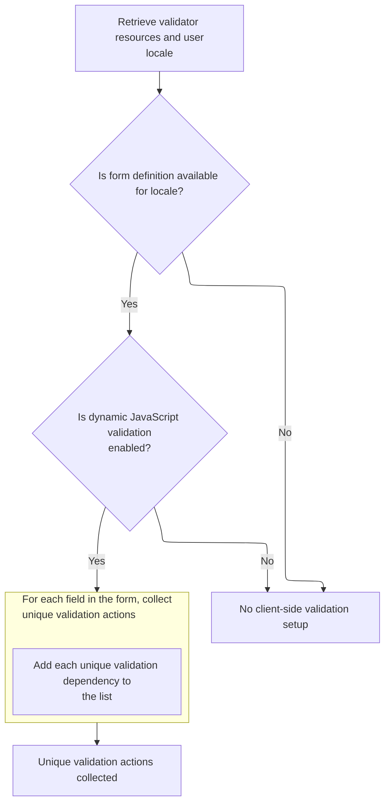

<SwmSnippet path="/faces/src/main/java/org/apache/struts/faces/taglib/JavascriptValidatorTag.java" line="288">

---

Back in `JavascriptValidatorTag.doStartTag`, after getting the module config, we fetch <SwmToken path="faces/src/main/java/org/apache/struts/faces/taglib/JavascriptValidatorTag.java" pos="288:1:1" line-data="        ValidatorResources resources =">`ValidatorResources`</SwmToken> using the config prefix. Then we resolve the user's locale using <SwmToken path="faces/src/main/java/org/apache/struts/faces/taglib/JavascriptValidatorTag.java" pos="293:7:7" line-data="        Locale locale = TagUtils.getInstance().getUserLocale(pageContext, null);">`TagUtils`</SwmToken>, so we can pull the right localized resources next.

```java
        ValidatorResources resources =
            (ValidatorResources) pageContext.getAttribute(
                ValidatorPlugIn.VALIDATOR_KEY + config.getPrefix(),
                PageContext.APPLICATION_SCOPE);

        Locale locale = TagUtils.getInstance().getUserLocale(pageContext, null);

```

---

</SwmSnippet>

<SwmSnippet path="/taglib/src/main/java/org/apache/struts/taglib/TagUtils.java" line="830">

---

<SwmToken path="taglib/src/main/java/org/apache/struts/taglib/TagUtils.java" pos="830:5:5" line-data="    public Locale getUserLocale(PageContext pageContext, String locale) {">`getUserLocale`</SwmToken> just hands off to <SwmToken path="taglib/src/main/java/org/apache/struts/taglib/TagUtils.java" pos="831:3:3" line-data="        return RequestUtils.getUserLocale((HttpServletRequest) pageContext">`RequestUtils`</SwmToken>, passing the request and locale. The request is needed because that's where user locale info is usually stored or inferred.

```java
    public Locale getUserLocale(PageContext pageContext, String locale) {
        return RequestUtils.getUserLocale((HttpServletRequest) pageContext
            .getRequest(), locale);
    }
```

---

</SwmSnippet>

<SwmSnippet path="/faces/src/main/java/org/apache/struts/faces/taglib/JavascriptValidatorTag.java" line="295">

---

Back in `JavascriptValidatorTag.doStartTag`, after getting the locale, we fetch the Form for the current locale and form name. Then we loop through its fields to collect all unique validation dependencies, which will drive what <SwmToken path="faces/src/main/java/org/apache/struts/faces/taglib/JavascriptValidatorTag.java" pos="60:11:11" line-data=" * Custom tag that generates JavaScript for client side validation based">`JavaScript`</SwmToken> gets generated. Next up is checking if these dependencies exist in the form's dynamic properties.

```java
        Form form = resources.getForm(locale, formName);
        if (form != null) {
            if ("true".equalsIgnoreCase(dynamicJavascript)) {
                MessageResources messages =
                    (MessageResources) pageContext.getAttribute(
                        bundle + config.getPrefix(),
                        PageContext.APPLICATION_SCOPE);

                List lActions = new ArrayList();
                List lActionMethods = new ArrayList();

                // Get List of actions for this Form
                for (Iterator i = form.getFields().iterator(); i.hasNext();) {
                    Field field = (Field) i.next();

                    for (Iterator x = field.getDependencyList().iterator();
                        x.hasNext();) {
                        Object o = x.next();

                        if (o != null && !lActionMethods.contains(o)) {
                            lActionMethods.add(o);
                        }
                    }

                }

```

---

</SwmSnippet>

## Checking Dynamic Form Properties

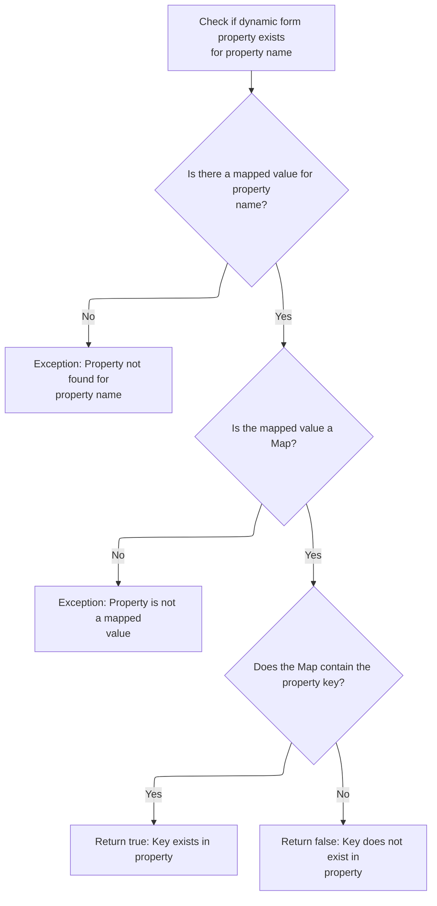

<SwmSnippet path="/core/src/main/java/org/apache/struts/action/DynaActionForm.java" line="203">

---

<SwmToken path="core/src/main/java/org/apache/struts/action/DynaActionForm.java" pos="203:5:5" line-data="    public boolean contains(String name, String key) {">`contains`</SwmToken> checks if a named dynamic property (expected to be a Map) contains a given key. If the property is missing or not a Map, it throws—so it enforces that dynamic properties are always maps. Next, we check if the relevant message exists for the dependency.

```java
    public boolean contains(String name, String key) {
        Object value = dynaValues.get(name);

        if (value == null) {
            throw new NullPointerException("No mapped value for '" + name + "("
                + key + ")'");
        } else if (value instanceof Map) {
            return (((Map) value).containsKey(key));
        } else {
            throw new IllegalArgumentException("Non-mapped property for '"
                + name + "(" + key + ")'");
        }
    }
```

---

</SwmSnippet>

## Checking for Localized Messages

<SwmSnippet path="/faces/src/main/java/org/apache/struts/faces/util/MessagesMap.java" line="107">

---

<SwmToken path="faces/src/main/java/org/apache/struts/faces/util/MessagesMap.java" pos="107:5:5" line-data="    public boolean containsKey(Object key) {">`containsKey`</SwmToken> checks if a localized message exists for the given key (converted to string) and locale. It relies on <SwmToken path="faces/src/main/java/org/apache/struts/faces/util/MessagesMap.java" pos="112:4:6" line-data="            return (messages.isPresent(locale, key.toString()));">`messages.isPresent`</SwmToken> to do the actual lookup. Next, we check if the message is really present or just a placeholder.

```java
    public boolean containsKey(Object key) {

        if (key == null) {
            return (false);
        } else {
            return (messages.isPresent(locale, key.toString()));
        }

    }
```

---

</SwmSnippet>

## Verifying Message Existence

<SwmSnippet path="/core/src/main/java/org/apache/struts/util/MessageResources.java" line="397">

---

<SwmToken path="core/src/main/java/org/apache/struts/util/MessageResources.java" pos="397:5:5" line-data="    public boolean isPresent(Locale locale, String key) {">`isPresent`</SwmToken> fetches the message for the given locale and key. If it's null or wrapped in '???', it's treated as missing. Otherwise, it's present and usable.

```java
    public boolean isPresent(Locale locale, String key) {
        String message = getMessage(locale, key);

        if (message == null) {
            return false;
        } else if (message.startsWith("???") && message.endsWith("???")) {
            return false; // FIXME - Only valid for default implementation
        } else {
            return true;
        }
    }
```

---

</SwmSnippet>

## Delegating Message Lookup Without Locale

<SwmSnippet path="/core/src/main/java/org/apache/struts/util/MessageResources.java" line="207">

---

<SwmToken path="core/src/main/java/org/apache/struts/validator/Resources.java" pos="231:7:7" line-data="    public static String getMessage(MessageResources messages, Locale locale,">`getMessage`</SwmToken>`(`<SwmToken path="core/src/main/java/org/apache/struts/util/MessageResources.java" pos="207:9:9" line-data="    public String getMessage(String key, Object[] args) {">`key`</SwmToken>`, `<SwmToken path="core/src/main/java/org/apache/struts/util/MessageResources.java" pos="207:16:16" line-data="    public String getMessage(String key, Object[] args) {">`args`</SwmToken>`)` just hands off to the locale-aware version, always passing null for locale. This means locale handling is deferred, and callers using this method get whatever the default locale logic provides.

```java
    public String getMessage(String key, Object[] args) {
        return this.getMessage((Locale) null, key, args);
    }
```

---

</SwmSnippet>

## Delegating Message Lookup With Single Argument

```mermaid
%%{init: {"flowchart": {"defaultRenderer": "elk"}} }%%
flowchart TD
  node1["Request for localized message (key,
arguments, locale)"] --> node2{"Is locale provided?"}
  click node1 openCode "core/src/main/java/org/apache/struts/util/MessageResources.java:324:326"
  node2 -->|"Yes"| node3["Use provided locale"]
  click node2 openCode "core/src/main/java/org/apache/struts/util/MessageResources.java:288:290"
  node2 -->|"No"| node4["Use default locale"]
  click node4 openCode "core/src/main/java/org/apache/struts/util/MessageResources.java:289:290"
  node3 --> node5{"Is message format available for key and
locale?"}
  node4 --> node5
  click node5 openCode "core/src/main/java/org/apache/struts/util/MessageResources.java:295:297"
  node5 -->|"Yes"| node6["Format message with arguments"]
  click node6 openCode "core/src/main/java/org/apache/struts/util/MessageResources.java:311:312"
  node5 -->|"No"| node7{"Is message string available for key?"}
  click node7 openCode "core/src/main/java/org/apache/struts/util/MessageResources.java:299:301"
  node7 -->|"Yes"| node8["Create message format and format with
arguments"]
  click node8 openCode "core/src/main/java/org/apache/struts/util/MessageResources.java:305:311"
  node7 -->|"No"| node9{"Should return null if missing?"}
  click node9 openCode "core/src/main/java/org/apache/struts/util/MessageResources.java:302:303"
  node9 -->|"Yes"| node10["Return null"]
  click node10 openCode "core/src/main/java/org/apache/struts/util/MessageResources.java:302:302"
  node9 -->|"No"| node11["Return fallback message (#quot;???key???#quot;)"]
  click node11 openCode "core/src/main/java/org/apache/struts/util/MessageResources.java:303:303"
  node6 --> node12["Return formatted message"]
  click node12 openCode "core/src/main/java/org/apache/struts/util/MessageResources.java:311:312"
  node8 --> node12
classDef HeadingStyle fill:#777777,stroke:#333,stroke-width:2px;

%% Swimm:
%% %%{init: {"flowchart": {"defaultRenderer": "elk"}} }%%
%% flowchart TD
%%   node1["Request for localized message (key,
%% arguments, locale)"] --> node2{"Is locale provided?"}
%%   click node1 openCode "<SwmPath>[core/…/util/MessageResources.java](core/src/main/java/org/apache/struts/util/MessageResources.java)</SwmPath>:324:326"
%%   node2 -->|"Yes"| node3["Use provided locale"]
%%   click node2 openCode "<SwmPath>[core/…/util/MessageResources.java](core/src/main/java/org/apache/struts/util/MessageResources.java)</SwmPath>:288:290"
%%   node2 -->|"No"| node4["Use default locale"]
%%   click node4 openCode "<SwmPath>[core/…/util/MessageResources.java](core/src/main/java/org/apache/struts/util/MessageResources.java)</SwmPath>:289:290"
%%   node3 --> node5{"Is message format available for key and
%% locale?"}
%%   node4 --> node5
%%   click node5 openCode "<SwmPath>[core/…/util/MessageResources.java](core/src/main/java/org/apache/struts/util/MessageResources.java)</SwmPath>:295:297"
%%   node5 -->|"Yes"| node6["Format message with arguments"]
%%   click node6 openCode "<SwmPath>[core/…/util/MessageResources.java](core/src/main/java/org/apache/struts/util/MessageResources.java)</SwmPath>:311:312"
%%   node5 -->|"No"| node7{"Is message string available for key?"}
%%   click node7 openCode "<SwmPath>[core/…/util/MessageResources.java](core/src/main/java/org/apache/struts/util/MessageResources.java)</SwmPath>:299:301"
%%   node7 -->|"Yes"| node8["Create message format and format with
%% arguments"]
%%   click node8 openCode "<SwmPath>[core/…/util/MessageResources.java](core/src/main/java/org/apache/struts/util/MessageResources.java)</SwmPath>:305:311"
%%   node7 -->|"No"| node9{"Should return null if missing?"}
%%   click node9 openCode "<SwmPath>[core/…/util/MessageResources.java](core/src/main/java/org/apache/struts/util/MessageResources.java)</SwmPath>:302:303"
%%   node9 -->|"Yes"| node10["Return null"]
%%   click node10 openCode "<SwmPath>[core/…/util/MessageResources.java](core/src/main/java/org/apache/struts/util/MessageResources.java)</SwmPath>:302:302"
%%   node9 -->|"No"| node11["Return fallback message (#quot;???key???#quot;)"]
%%   click node11 openCode "<SwmPath>[core/…/util/MessageResources.java](core/src/main/java/org/apache/struts/util/MessageResources.java)</SwmPath>:303:303"
%%   node6 --> node12["Return formatted message"]
%%   click node12 openCode "<SwmPath>[core/…/util/MessageResources.java](core/src/main/java/org/apache/struts/util/MessageResources.java)</SwmPath>:311:312"
%%   node8 --> node12
%% classDef HeadingStyle fill:#777777,stroke:#333,stroke-width:2px;
```

<SwmSnippet path="/core/src/main/java/org/apache/struts/util/MessageResources.java" line="324">

---

<SwmToken path="core/src/main/java/org/apache/struts/validator/Resources.java" pos="231:7:7" line-data="    public static String getMessage(MessageResources messages, Locale locale,">`getMessage`</SwmToken>`(`<SwmToken path="core/src/main/java/org/apache/struts/util/MessageResources.java" pos="324:9:9" line-data="    public String getMessage(Locale locale, String key, Object arg0) {">`locale`</SwmToken>`, `<SwmToken path="core/src/main/java/org/apache/struts/util/MessageResources.java" pos="324:14:14" line-data="    public String getMessage(Locale locale, String key, Object arg0) {">`key`</SwmToken>`, `<SwmToken path="core/src/main/java/org/apache/struts/util/MessageResources.java" pos="324:19:19" line-data="    public String getMessage(Locale locale, String key, Object arg0) {">`arg0`</SwmToken>`)` just wraps the argument in an array and calls the main array-based method. No extra logic—just makes single-argument calls easier.

```java
    public String getMessage(Locale locale, String key, Object arg0) {
        return this.getMessage(locale, key, new Object[] { arg0 });
    }
```

---

</SwmSnippet>

<SwmSnippet path="/core/src/main/java/org/apache/struts/util/MessageResources.java" line="286">

---

<SwmToken path="core/src/main/java/org/apache/struts/validator/Resources.java" pos="231:7:7" line-data="    public static String getMessage(MessageResources messages, Locale locale,">`getMessage`</SwmToken>`(`<SwmToken path="core/src/main/java/org/apache/struts/util/MessageResources.java" pos="286:9:9" line-data="    public String getMessage(Locale locale, String key, Object[] args) {">`locale`</SwmToken>`, `<SwmToken path="core/src/main/java/org/apache/struts/util/MessageResources.java" pos="286:14:14" line-data="    public String getMessage(Locale locale, String key, Object[] args) {">`key`</SwmToken>`, `<SwmToken path="core/src/main/java/org/apache/struts/util/MessageResources.java" pos="286:21:21" line-data="    public String getMessage(Locale locale, String key, Object[] args) {">`args`</SwmToken>`)` handles locale fallback, caches <SwmToken path="core/src/main/java/org/apache/struts/util/MessageResources.java" pos="287:5:5" line-data="        // Cache MessageFormat instances as they are accessed">`MessageFormat`</SwmToken> objects for speed, escapes message strings before formatting, and returns either a formatted message, null, or a placeholder if the message is missing. The cache is synchronized for thread safety.

```java
    public String getMessage(Locale locale, String key, Object[] args) {
        // Cache MessageFormat instances as they are accessed
        if (locale == null) {
            locale = defaultLocale;
        }

        MessageFormat format = null;
        String formatKey = messageKey(locale, key);

        synchronized (formats) {
            format = (MessageFormat) formats.get(formatKey);

            if (format == null) {
                String formatString = getMessage(locale, key);

                if (formatString == null) {
                    return returnNull ? null : ("???" + formatKey + "???");
                }

                format = new MessageFormat(escape(formatString));
                format.setLocale(locale);
                formats.put(formatKey, format);
            }
        }

        return format.format(args);
    }
```

---

</SwmSnippet>

## Collecting Validator Actions for <SwmToken path="faces/src/main/java/org/apache/struts/faces/taglib/JavascriptValidatorTag.java" pos="60:11:11" line-data=" * Custom tag that generates JavaScript for client side validation based">`JavaScript`</SwmToken> Generation

```mermaid
%%{init: {"flowchart": {"defaultRenderer": "elk"}} }%%
flowchart TD
  node1["Start: Prepare validator actions"]
  click node1 openCode "faces/src/main/java/org/apache/struts/faces/taglib/JavascriptValidatorTag.java:321:322"
  subgraph loop1["For each validation dependency"]
    node2{"Is validator action found?"}
    click node2 openCode "faces/src/main/java/org/apache/struts/faces/taglib/JavascriptValidatorTag.java:324:332"
    node2 -->|"No"| node3["Dependency missing: Cannot validate"]
    click node3 openCode "faces/src/main/java/org/apache/struts/faces/taglib/JavascriptValidatorTag.java:327:332"
    node2 -->|"Yes"| node4{"Has JavaScript?"}
    click node4 openCode "faces/src/main/java/org/apache/struts/faces/taglib/JavascriptValidatorTag.java:334:339"
    node4 -->|"Yes"| node5["Add validator action to list"]
    click node5 openCode "faces/src/main/java/org/apache/struts/faces/taglib/JavascriptValidatorTag.java:336:337"
    node4 -->|"No"| node6["Skip this dependency"]
    click node6 openCode "faces/src/main/java/org/apache/struts/faces/taglib/JavascriptValidatorTag.java:338:339"
  end
  loop1 --> node7["Sort validator actions by dependencies"]
  click node7 openCode "faces/src/main/java/org/apache/struts/faces/taglib/JavascriptValidatorTag.java:342:369"
  node7 --> subgraph loop2["For each validator action in order"]
    node8["Add method to JavaScript chain (methods)"]
    click node8 openCode "faces/src/main/java/org/apache/struts/faces/taglib/JavascriptValidatorTag.java:372:379"
  end
  loop2 --> node9["Append JavaScript chain to results"]
  click node9 openCode "faces/src/main/java/org/apache/struts/faces/taglib/JavascriptValidatorTag.java:382:382"

classDef HeadingStyle fill:#777777,stroke:#333,stroke-width:2px;

%% Swimm:
%% %%{init: {"flowchart": {"defaultRenderer": "elk"}} }%%
%% flowchart TD
%%   node1["Start: Prepare validator actions"]
%%   click node1 openCode "<SwmPath>[faces/…/taglib/JavascriptValidatorTag.java](faces/src/main/java/org/apache/struts/faces/taglib/JavascriptValidatorTag.java)</SwmPath>:321:322"
%%   subgraph loop1["For each validation dependency"]
%%     node2{"Is validator action found?"}
%%     click node2 openCode "<SwmPath>[faces/…/taglib/JavascriptValidatorTag.java](faces/src/main/java/org/apache/struts/faces/taglib/JavascriptValidatorTag.java)</SwmPath>:324:332"
%%     node2 -->|"No"| node3["Dependency missing: Cannot validate"]
%%     click node3 openCode "<SwmPath>[faces/…/taglib/JavascriptValidatorTag.java](faces/src/main/java/org/apache/struts/faces/taglib/JavascriptValidatorTag.java)</SwmPath>:327:332"
%%     node2 -->|"Yes"| node4{"Has <SwmToken path="faces/src/main/java/org/apache/struts/faces/taglib/JavascriptValidatorTag.java" pos="60:11:11" line-data=" * Custom tag that generates JavaScript for client side validation based">`JavaScript`</SwmToken>?"}
%%     click node4 openCode "<SwmPath>[faces/…/taglib/JavascriptValidatorTag.java](faces/src/main/java/org/apache/struts/faces/taglib/JavascriptValidatorTag.java)</SwmPath>:334:339"
%%     node4 -->|"Yes"| node5["Add validator action to list"]
%%     click node5 openCode "<SwmPath>[faces/…/taglib/JavascriptValidatorTag.java](faces/src/main/java/org/apache/struts/faces/taglib/JavascriptValidatorTag.java)</SwmPath>:336:337"
%%     node4 -->|"No"| node6["Skip this dependency"]
%%     click node6 openCode "<SwmPath>[faces/…/taglib/JavascriptValidatorTag.java](faces/src/main/java/org/apache/struts/faces/taglib/JavascriptValidatorTag.java)</SwmPath>:338:339"
%%   end
%%   loop1 --> node7["Sort validator actions by dependencies"]
%%   click node7 openCode "<SwmPath>[faces/…/taglib/JavascriptValidatorTag.java](faces/src/main/java/org/apache/struts/faces/taglib/JavascriptValidatorTag.java)</SwmPath>:342:369"
%%   node7 --> subgraph loop2["For each validator action in order"]
%%     node8["Add method to <SwmToken path="faces/src/main/java/org/apache/struts/faces/taglib/JavascriptValidatorTag.java" pos="60:11:11" line-data=" * Custom tag that generates JavaScript for client side validation based">`JavaScript`</SwmToken> chain (methods)"]
%%     click node8 openCode "<SwmPath>[faces/…/taglib/JavascriptValidatorTag.java](faces/src/main/java/org/apache/struts/faces/taglib/JavascriptValidatorTag.java)</SwmPath>:372:379"
%%   end
%%   loop2 --> node9["Append <SwmToken path="faces/src/main/java/org/apache/struts/faces/taglib/JavascriptValidatorTag.java" pos="60:11:11" line-data=" * Custom tag that generates JavaScript for client side validation based">`JavaScript`</SwmToken> chain to results"]
%%   click node9 openCode "<SwmPath>[faces/…/taglib/JavascriptValidatorTag.java](faces/src/main/java/org/apache/struts/faces/taglib/JavascriptValidatorTag.java)</SwmPath>:382:382"
%% 
%% classDef HeadingStyle fill:#777777,stroke:#333,stroke-width:2px;
```

<SwmSnippet path="/faces/src/main/java/org/apache/struts/faces/taglib/JavascriptValidatorTag.java" line="321">

---

Back in `JavascriptValidatorTag.doStartTag`, after checking dynamic properties in <SwmToken path="core/src/main/java/org/apache/struts/action/DynaActionForm.java" pos="50:14:14" line-data=" * solution is to subclass &lt;code&gt;DynaActionForm&lt;/code&gt; and call the">`DynaActionForm`</SwmToken>, we loop through dependencies, fetch <SwmToken path="faces/src/main/java/org/apache/struts/faces/taglib/JavascriptValidatorTag.java" pos="321:9:9" line-data="                // Create list of ValidatorActions based on lActionMethods">`ValidatorActions`</SwmToken>, and filter out any without <SwmToken path="faces/src/main/java/org/apache/struts/faces/taglib/JavascriptValidatorTag.java" pos="60:11:11" line-data=" * Custom tag that generates JavaScript for client side validation based">`JavaScript`</SwmToken>. Missing actions throw an NPE for easier debugging.

```java
                // Create list of ValidatorActions based on lActionMethods
                for (Iterator i = lActionMethods.iterator(); i.hasNext();) {
                    String depends = (String) i.next();
                    ValidatorAction va = resources.getValidatorAction(depends);

                    // throw nicer NPE for easier debugging
                    if (va == null) {
                        throw new NullPointerException(
                            "Depends string \""
                                + depends
                                + "\" was not found in validator-rules.xml.");
                    }

                    String javascript = va.getJavascript();
                    if (javascript != null && javascript.length() > 0) {
                        lActions.add(va);
                    } else {
                        i.remove();
                    }
                }
```

---

</SwmSnippet>

<SwmSnippet path="/faces/src/main/java/org/apache/struts/faces/taglib/JavascriptValidatorTag.java" line="342">

---

After filtering <SwmToken path="faces/src/main/java/org/apache/struts/faces/taglib/JavascriptValidatorTag.java" pos="321:9:9" line-data="                // Create list of ValidatorActions based on lActionMethods">`ValidatorActions`</SwmToken>, we sort them by dependency count and build a string of method calls joined with '&&'. This sets up the <SwmToken path="faces/src/main/java/org/apache/struts/faces/taglib/JavascriptValidatorTag.java" pos="60:11:11" line-data=" * Custom tag that generates JavaScript for client side validation based">`JavaScript`</SwmToken> validation logic for the form.

```java
                Collections.sort(lActions, new Comparator() {
                    public int compare(Object o1, Object o2) {
                        ValidatorAction va1 = (ValidatorAction) o1;
                        ValidatorAction va2 = (ValidatorAction) o2;

                        if ((va1.getDepends() == null
                            || va1.getDepends().length() == 0)
                            && (va2.getDepends() == null
                            || va2.getDepends().length() == 0)) {
                            return 0;
                        } else if (
                            (va1.getDepends() != null
                            && va1.getDepends().length() > 0)
                            && (va2.getDepends() == null
                            || va2.getDepends().length() == 0)) {
                            return 1;
                        } else if (
                            (va1.getDepends() == null
                            || va1.getDepends().length() == 0)
                            && (va2.getDepends() != null
                            && va2.getDepends().length() > 0)) {
                            return -1;
                        } else {
                            return va1.getDependencyList().size() -
                              va2.getDependencyList().size();
                        }
                    }
                });

                String methods = null;
                for (Iterator i = lActions.iterator(); i.hasNext();) {
                    ValidatorAction va = (ValidatorAction) i.next();

                    if (methods == null) {
                        methods = va.getMethod() + "(form)";
                    } else {
                        methods += " && " + va.getMethod() + "(form)";
                    }
                }
```

---

</SwmSnippet>

<SwmSnippet path="/faces/src/main/java/org/apache/struts/faces/taglib/JavascriptValidatorTag.java" line="382">

---

We call <SwmToken path="faces/src/main/java/org/apache/struts/faces/taglib/JavascriptValidatorTag.java" pos="382:5:8" line-data="                results.append(getJavascriptBegin(methods));">`getJavascriptBegin(methods)`</SwmToken> to generate the <SwmToken path="faces/src/main/java/org/apache/struts/faces/taglib/JavascriptValidatorTag.java" pos="60:11:11" line-data=" * Custom tag that generates JavaScript for client side validation based">`JavaScript`</SwmToken> function wrapper using the methods string. This is where the validation logic gets packaged for the client.

```java
                results.append(getJavascriptBegin(methods));

```

---

</SwmSnippet>

## Building the <SwmToken path="faces/src/main/java/org/apache/struts/faces/taglib/JavascriptValidatorTag.java" pos="60:11:11" line-data=" * Custom tag that generates JavaScript for client side validation based">`JavaScript`</SwmToken> Function Wrapper

<SwmSnippet path="/faces/src/main/java/org/apache/struts/faces/taglib/JavascriptValidatorTag.java" line="565">

---

In <SwmToken path="faces/src/main/java/org/apache/struts/faces/taglib/JavascriptValidatorTag.java" pos="565:5:5" line-data="    protected String getJavascriptBegin(String methods) {">`getJavascriptBegin`</SwmToken>, we start building the <SwmToken path="faces/src/main/java/org/apache/struts/faces/taglib/JavascriptValidatorTag.java" pos="60:11:11" line-data=" * Custom tag that generates JavaScript for client side validation based">`JavaScript`</SwmToken> function, using <SwmToken path="faces/src/main/java/org/apache/struts/faces/taglib/JavascriptValidatorTag.java" pos="568:1:1" line-data="            formName.substring(0, 1).toUpperCase()">`formName`</SwmToken> and <SwmToken path="faces/src/main/java/org/apache/struts/faces/taglib/JavascriptValidatorTag.java" pos="582:4:4" line-data="        if (methodName == null || methodName.length() == 0) {">`methodName`</SwmToken> to set the function name, and prepping the output with the right formatting. Next up is calling <SwmToken path="faces/src/main/java/org/apache/struts/faces/taglib/JavascriptValidatorTag.java" pos="571:7:7" line-data="        sb.append(this.getStartElement());">`getStartElement`</SwmToken> to add the opening tag or wrapper.

```java
    protected String getJavascriptBegin(String methods) {
        StringBuffer sb = new StringBuffer();
        String name =
            formName.substring(0, 1).toUpperCase()
                + formName.substring(1, formName.length());

        sb.append(this.getStartElement());

```

---

</SwmSnippet>

### Adding the Script Tag Wrapper

See <SwmLink doc-title="Generating a Script Tag for HTML and XHTML">[Generating a Script Tag for HTML and XHTML](/.swm/generating-a-script-tag-for-html-and-xhtml.e8e6dsat.sw.md)</SwmLink>

### Formatting Script Output for XHTML and Comments

```mermaid
%%{init: {"flowchart": {"defaultRenderer": "elk"}} }%%
flowchart TD
  node1["Start generating JavaScript validation
script"]
  node1 --> node2{"Is XHTML & CDATA enabled?"}
  click node1 openCode "faces/src/main/java/org/apache/struts/faces/taglib/JavascriptValidatorTag.java:573:573"
  node2 -->|"Yes"| node3["Add CDATA section"]
  click node2 openCode "faces/src/main/java/org/apache/struts/faces/taglib/JavascriptValidatorTag.java:573:575"
  node2 -->|"No"| node4{"Is HTML & comment enabled?"}
  click node4 openCode "faces/src/main/java/org/apache/struts/faces/taglib/JavascriptValidatorTag.java:577:579"
  node3 --> node5["Initialize cancel variable"]
  node4 -->|"Yes"| node6["Add HTML comment"]
  click node6 openCode "faces/src/main/java/org/apache/struts/faces/taglib/JavascriptValidatorTag.java:577:579"
  node4 -->|"No"| node5
  node6 --> node5
  click node5 openCode "faces/src/main/java/org/apache/struts/faces/taglib/JavascriptValidatorTag.java:580:580"
  node5 --> node7{"Custom method name provided?"}
  click node7 openCode "faces/src/main/java/org/apache/struts/faces/taglib/JavascriptValidatorTag.java:582:594"
  node7 -->|"Yes"| node8["Use custom method name"]
  click node8 openCode "faces/src/main/java/org/apache/struts/faces/taglib/JavascriptValidatorTag.java:589:594"
  node7 -->|"No"| node9["Use default method name"]
  click node9 openCode "faces/src/main/java/org/apache/struts/faces/taglib/JavascriptValidatorTag.java:583:588"
  node8 --> node10{"Validation methods present?"}
  node9 --> node10
  click node10 openCode "faces/src/main/java/org/apache/struts/faces/taglib/JavascriptValidatorTag.java:600:604"
  node10 -->|"Yes"| node11["Add validation methods"]
  click node11 openCode "faces/src/main/java/org/apache/struts/faces/taglib/JavascriptValidatorTag.java:603:604"
  node10 -->|"No"| node12["Return true always"]
  click node12 openCode "faces/src/main/java/org/apache/struts/faces/taglib/JavascriptValidatorTag.java:601:602"
  node11 --> node13["Return generated script"]
  node12 --> node13
  click node13 openCode "faces/src/main/java/org/apache/struts/faces/taglib/JavascriptValidatorTag.java:608:609"
classDef HeadingStyle fill:#777777,stroke:#333,stroke-width:2px;

%% Swimm:
%% %%{init: {"flowchart": {"defaultRenderer": "elk"}} }%%
%% flowchart TD
%%   node1["Start generating <SwmToken path="faces/src/main/java/org/apache/struts/faces/taglib/JavascriptValidatorTag.java" pos="60:11:11" line-data=" * Custom tag that generates JavaScript for client side validation based">`JavaScript`</SwmToken> validation
%% script"]
%%   node1 --> node2{"Is XHTML & CDATA enabled?"}
%%   click node1 openCode "<SwmPath>[faces/…/taglib/JavascriptValidatorTag.java](faces/src/main/java/org/apache/struts/faces/taglib/JavascriptValidatorTag.java)</SwmPath>:573:573"
%%   node2 -->|"Yes"| node3["Add CDATA section"]
%%   click node2 openCode "<SwmPath>[faces/…/taglib/JavascriptValidatorTag.java](faces/src/main/java/org/apache/struts/faces/taglib/JavascriptValidatorTag.java)</SwmPath>:573:575"
%%   node2 -->|"No"| node4{"Is HTML & comment enabled?"}
%%   click node4 openCode "<SwmPath>[faces/…/taglib/JavascriptValidatorTag.java](faces/src/main/java/org/apache/struts/faces/taglib/JavascriptValidatorTag.java)</SwmPath>:577:579"
%%   node3 --> node5["Initialize cancel variable"]
%%   node4 -->|"Yes"| node6["Add HTML comment"]
%%   click node6 openCode "<SwmPath>[faces/…/taglib/JavascriptValidatorTag.java](faces/src/main/java/org/apache/struts/faces/taglib/JavascriptValidatorTag.java)</SwmPath>:577:579"
%%   node4 -->|"No"| node5
%%   node6 --> node5
%%   click node5 openCode "<SwmPath>[faces/…/taglib/JavascriptValidatorTag.java](faces/src/main/java/org/apache/struts/faces/taglib/JavascriptValidatorTag.java)</SwmPath>:580:580"
%%   node5 --> node7{"Custom method name provided?"}
%%   click node7 openCode "<SwmPath>[faces/…/taglib/JavascriptValidatorTag.java](faces/src/main/java/org/apache/struts/faces/taglib/JavascriptValidatorTag.java)</SwmPath>:582:594"
%%   node7 -->|"Yes"| node8["Use custom method name"]
%%   click node8 openCode "<SwmPath>[faces/…/taglib/JavascriptValidatorTag.java](faces/src/main/java/org/apache/struts/faces/taglib/JavascriptValidatorTag.java)</SwmPath>:589:594"
%%   node7 -->|"No"| node9["Use default method name"]
%%   click node9 openCode "<SwmPath>[faces/…/taglib/JavascriptValidatorTag.java](faces/src/main/java/org/apache/struts/faces/taglib/JavascriptValidatorTag.java)</SwmPath>:583:588"
%%   node8 --> node10{"Validation methods present?"}
%%   node9 --> node10
%%   click node10 openCode "<SwmPath>[faces/…/taglib/JavascriptValidatorTag.java](faces/src/main/java/org/apache/struts/faces/taglib/JavascriptValidatorTag.java)</SwmPath>:600:604"
%%   node10 -->|"Yes"| node11["Add validation methods"]
%%   click node11 openCode "<SwmPath>[faces/…/taglib/JavascriptValidatorTag.java](faces/src/main/java/org/apache/struts/faces/taglib/JavascriptValidatorTag.java)</SwmPath>:603:604"
%%   node10 -->|"No"| node12["Return true always"]
%%   click node12 openCode "<SwmPath>[faces/…/taglib/JavascriptValidatorTag.java](faces/src/main/java/org/apache/struts/faces/taglib/JavascriptValidatorTag.java)</SwmPath>:601:602"
%%   node11 --> node13["Return generated script"]
%%   node12 --> node13
%%   click node13 openCode "<SwmPath>[faces/…/taglib/JavascriptValidatorTag.java](faces/src/main/java/org/apache/struts/faces/taglib/JavascriptValidatorTag.java)</SwmPath>:608:609"
%% classDef HeadingStyle fill:#777777,stroke:#333,stroke-width:2px;
```

<SwmSnippet path="/faces/src/main/java/org/apache/struts/faces/taglib/JavascriptValidatorTag.java" line="573">

---

After <SwmToken path="faces/src/main/java/org/apache/struts/faces/taglib/JavascriptValidatorTag.java" pos="515:7:7" line-data="                results.append(this.getStartElement());">`getStartElement`</SwmToken>, <SwmToken path="faces/src/main/java/org/apache/struts/faces/taglib/JavascriptValidatorTag.java" pos="382:5:5" line-data="                results.append(getJavascriptBegin(methods));">`getJavascriptBegin`</SwmToken> checks if we're in XHTML mode and whether CDATA or HTML comments should be added. These flags tweak the script output for compatibility with different page types.

```java
        if (this.isXhtml() && "true".equalsIgnoreCase(this.cdata)) {
            sb.append("<![CDATA[\r\n");
        }

        if (!this.isXhtml() && "true".equals(htmlComment)) {
            sb.append(htmlBeginComment);
        }
```

---

</SwmSnippet>

<SwmSnippet path="/faces/src/main/java/org/apache/struts/faces/taglib/JavascriptValidatorTag.java" line="580">

---

After checking XHTML and comments, <SwmToken path="faces/src/main/java/org/apache/struts/faces/taglib/JavascriptValidatorTag.java" pos="382:5:5" line-data="                results.append(getJavascriptBegin(methods));">`getJavascriptBegin`</SwmToken> builds the function body, using the methods string directly in the return statement. If methods is empty, validation always passes.

```java
        sb.append("\n     var bCancel = false; \n\n");

        if (methodName == null || methodName.length() == 0) {
            sb.append(
                "    function validate"
                    + name
                    + "(form) {                                          "
                    + "                         \n");
        } else {
            sb.append(
                "    function "
                    + methodName
                    + "(form) {                                          "
                    + "                         \n");
        }
        sb.append("        if (bCancel) \n");
        sb.append("      return true; \n");
        sb.append("        else \n");

        // Always return true if there aren't any Javascript validation methods
        if (methods == null || methods.length() == 0) {
            sb.append("       return true; \n");
        } else {
            sb.append("       return " + methods + "; \n");
        }

        sb.append("   } \n\n");

        return sb.toString();
    }
```

---

</SwmSnippet>

## Generating Validator Action Functions

```mermaid
%%{init: {"flowchart": {"defaultRenderer": "elk"}} }%%
flowchart TD
    node1["Start generating JS validation functions"]
    click node1 openCode "faces/src/main/java/org/apache/struts/faces/taglib/JavascriptValidatorTag.java:384:384"
    subgraph loop1["For each validator action"]
      node1 --> node2{"Does validator action have custom JS
function name?"}
      click node2 openCode "faces/src/main/java/org/apache/struts/faces/taglib/JavascriptValidatorTag.java:389:392"
      node2 -->|"Yes"| node3["Use custom JS function name for action"]
      click node3 openCode "faces/src/main/java/org/apache/struts/faces/taglib/JavascriptValidatorTag.java:391:392"
      node2 -->|"No"| node4["Use default action name"]
      click node4 openCode "faces/src/main/java/org/apache/struts/faces/taglib/JavascriptValidatorTag.java:393:394"
      node3 --> node5{"Is Struts 1.1 compatibility required?"}
      node4 --> node5
      click node5 openCode "faces/src/main/java/org/apache/struts/faces/taglib/JavascriptValidatorTag.java:396:403"
      node5 -->|"Yes"| node6["Prefix function name with form name"]
      click node6 openCode "faces/src/main/java/org/apache/struts/faces/taglib/JavascriptValidatorTag.java:400:402"
      node5 -->|"No"| node7["Use function name as is"]
      click node7 openCode "faces/src/main/java/org/apache/struts/faces/taglib/JavascriptValidatorTag.java:397:398"
      node6 --> node8
      node7 --> node8
      subgraph loop2["For each field in form"]
        node8 --> node9{"Is field indexed, not on current page,
or not dependent on action?"}
        click node9 openCode "faces/src/main/java/org/apache/struts/faces/taglib/JavascriptValidatorTag.java:411:413"
        node9 -->|"Yes"| node10["Skip field"]
        click node10 openCode "faces/src/main/java/org/apache/struts/faces/taglib/JavascriptValidatorTag.java:415:416"
        node9 -->|"No"| node11["Generate JS validation for field"]
        click node11 openCode "faces/src/main/java/org/apache/struts/faces/taglib/JavascriptValidatorTag.java:418:419"
      end
    end

classDef HeadingStyle fill:#777777,stroke:#333,stroke-width:2px;

%% Swimm:
%% %%{init: {"flowchart": {"defaultRenderer": "elk"}} }%%
%% flowchart TD
%%     node1["Start generating JS validation functions"]
%%     click node1 openCode "<SwmPath>[faces/…/taglib/JavascriptValidatorTag.java](faces/src/main/java/org/apache/struts/faces/taglib/JavascriptValidatorTag.java)</SwmPath>:384:384"
%%     subgraph loop1["For each validator action"]
%%       node1 --> node2{"Does validator action have custom JS
%% function name?"}
%%       click node2 openCode "<SwmPath>[faces/…/taglib/JavascriptValidatorTag.java](faces/src/main/java/org/apache/struts/faces/taglib/JavascriptValidatorTag.java)</SwmPath>:389:392"
%%       node2 -->|"Yes"| node3["Use custom JS function name for action"]
%%       click node3 openCode "<SwmPath>[faces/…/taglib/JavascriptValidatorTag.java](faces/src/main/java/org/apache/struts/faces/taglib/JavascriptValidatorTag.java)</SwmPath>:391:392"
%%       node2 -->|"No"| node4["Use default action name"]
%%       click node4 openCode "<SwmPath>[faces/…/taglib/JavascriptValidatorTag.java](faces/src/main/java/org/apache/struts/faces/taglib/JavascriptValidatorTag.java)</SwmPath>:393:394"
%%       node3 --> node5{"Is Struts <SwmToken path="faces/src/main/java/org/apache/struts/faces/taglib/JavascriptValidatorTag.java" pos="823:32:34" line-data="     * &lt;p&gt;Return &lt;code&gt;true&lt;/code&gt; if we are running on top of Struts 1.1&lt;/p&gt;">`1.1`</SwmToken> compatibility required?"}
%%       node4 --> node5
%%       click node5 openCode "<SwmPath>[faces/…/taglib/JavascriptValidatorTag.java](faces/src/main/java/org/apache/struts/faces/taglib/JavascriptValidatorTag.java)</SwmPath>:396:403"
%%       node5 -->|"Yes"| node6["Prefix function name with form name"]
%%       click node6 openCode "<SwmPath>[faces/…/taglib/JavascriptValidatorTag.java](faces/src/main/java/org/apache/struts/faces/taglib/JavascriptValidatorTag.java)</SwmPath>:400:402"
%%       node5 -->|"No"| node7["Use function name as is"]
%%       click node7 openCode "<SwmPath>[faces/…/taglib/JavascriptValidatorTag.java](faces/src/main/java/org/apache/struts/faces/taglib/JavascriptValidatorTag.java)</SwmPath>:397:398"
%%       node6 --> node8
%%       node7 --> node8
%%       subgraph loop2["For each field in form"]
%%         node8 --> node9{"Is field indexed, not on current page,
%% or not dependent on action?"}
%%         click node9 openCode "<SwmPath>[faces/…/taglib/JavascriptValidatorTag.java](faces/src/main/java/org/apache/struts/faces/taglib/JavascriptValidatorTag.java)</SwmPath>:411:413"
%%         node9 -->|"Yes"| node10["Skip field"]
%%         click node10 openCode "<SwmPath>[faces/…/taglib/JavascriptValidatorTag.java](faces/src/main/java/org/apache/struts/faces/taglib/JavascriptValidatorTag.java)</SwmPath>:415:416"
%%         node9 -->|"No"| node11["Generate JS validation for field"]
%%         click node11 openCode "<SwmPath>[faces/…/taglib/JavascriptValidatorTag.java](faces/src/main/java/org/apache/struts/faces/taglib/JavascriptValidatorTag.java)</SwmPath>:418:419"
%%       end
%%     end
%% 
%% classDef HeadingStyle fill:#777777,stroke:#333,stroke-width:2px;
```

<SwmSnippet path="/faces/src/main/java/org/apache/struts/faces/taglib/JavascriptValidatorTag.java" line="384">

---

After <SwmToken path="faces/src/main/java/org/apache/struts/faces/taglib/JavascriptValidatorTag.java" pos="382:5:5" line-data="                results.append(getJavascriptBegin(methods));">`getJavascriptBegin`</SwmToken>, `JavascriptValidatorTag.doStartTag` loops through <SwmToken path="faces/src/main/java/org/apache/struts/faces/taglib/JavascriptValidatorTag.java" pos="321:9:9" line-data="                // Create list of ValidatorActions based on lActionMethods">`ValidatorActions`</SwmToken> and fields, generating a <SwmToken path="faces/src/main/java/org/apache/struts/faces/taglib/JavascriptValidatorTag.java" pos="60:11:11" line-data=" * Custom tag that generates JavaScript for client side validation based">`JavaScript`</SwmToken> function for each action. We call <SwmToken path="faces/src/main/java/org/apache/struts/faces/taglib/JavascriptValidatorTag.java" pos="419:1:3" line-data="                            Resources.getMessage(messages, locale, va, field);">`Resources.getMessage`</SwmToken> next to fetch the error message for each <SwmPath>[core/…/struts/action/](core/src/main/java/org/apache/struts/action/)</SwmPath> combo.

```java
                for (Iterator i = lActions.iterator(); i.hasNext();) {
                    ValidatorAction va = (ValidatorAction) i.next();
                    String jscriptVar = null;
                    String functionName = null;

                    if (va.getJsFunctionName() != null
                        && va.getJsFunctionName().length() > 0) {
                        functionName = va.getJsFunctionName();
                    } else {
                        functionName = va.getName();
                    }

                    if (isStruts11()) {
                        results.append("    function " +
                          functionName + " () { \n");
                    } else {
                        results.append("    function " +
                          formName + "_" + functionName +
                          " () { \n");
                    }
                    for (Iterator x = form.getFields().iterator();
                        x.hasNext();) {
                        Field field = (Field) x.next();

                        // Skip indexed fields for now until there is a good
                        // way to handle error messages (and the length of the
                        // list (could retrieve from scope?))
                        if (field.isIndexed()
                            || field.getPage() != page
                            || !field.isDependency(va.getName())) {

                            continue;
                        }

                        String message =
                            Resources.getMessage(messages, locale, va, field);

```

---

</SwmSnippet>

## Fetching Error Messages for Validator Actions

<SwmSnippet path="/core/src/main/java/org/apache/struts/validator/Resources.java" line="265">

---

In <SwmToken path="faces/src/main/java/org/apache/struts/faces/taglib/JavascriptValidatorTag.java" pos="419:1:3" line-data="                            Resources.getMessage(messages, locale, va, field);">`Resources.getMessage`</SwmToken>, we prep the argument list using <SwmToken path="core/src/main/java/org/apache/struts/validator/Resources.java" pos="267:9:9" line-data="        String[] args = getArgs(va.getName(), messages, locale, field);">`getArgs`</SwmToken> before fetching the error message. This ties the message to the specific <SwmToken path="core/src/main/java/org/apache/struts/validator/Resources.java" pos="266:1:1" line-data="        ValidatorAction va, Field field) {">`ValidatorAction`</SwmToken> and Field, so it's accurate and localized.

```java
    public static String getMessage(MessageResources messages, Locale locale,
        ValidatorAction va, Field field) {
        String[] args = getArgs(va.getName(), messages, locale, field);
```

---

</SwmSnippet>

### Preparing Validator Argument Messages

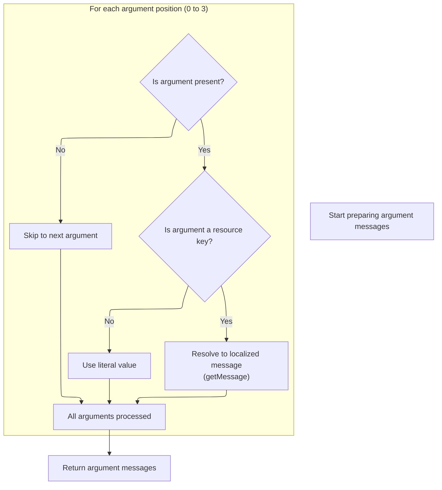

<SwmSnippet path="/core/src/main/java/org/apache/struts/validator/Resources.java" line="420">

---

<SwmToken path="core/src/main/java/org/apache/struts/validator/Resources.java" pos="420:9:9" line-data="    public static String[] getArgs(String actionName,">`getArgs`</SwmToken> builds an array of up to four argument messages for a validator, grabbing them from the Field object at indices 0 to 3. For each, it checks if the argument is a resource and fetches a localized message if so, otherwise just uses the key. This is where we prep the arguments for error messages, and the fixed size means only four are ever used, no matter what.

```java
    public static String[] getArgs(String actionName,
        MessageResources messages, Locale locale, Field field) {
        String[] argMessages = new String[4];

        Arg[] args =
            new Arg[] {
                field.getArg(actionName, 0), field.getArg(actionName, 1),
                field.getArg(actionName, 2), field.getArg(actionName, 3)
            };

        for (int i = 0; i < args.length; i++) {
            if (args[i] == null) {
                continue;
            }

            if (args[i].isResource()) {
                argMessages[i] = getMessage(messages, locale, args[i].getKey());
            } else {
                argMessages[i] = args[i].getKey();
            }
        }

        return argMessages;
    }
```

---

</SwmSnippet>

<SwmSnippet path="/core/src/main/java/org/apache/struts/validator/Resources.java" line="231">

---

<SwmToken path="core/src/main/java/org/apache/struts/validator/Resources.java" pos="231:7:7" line-data="    public static String getMessage(MessageResources messages, Locale locale,">`getMessage`</SwmToken> just tries to fetch a localized message for a key from <SwmToken path="core/src/main/java/org/apache/struts/validator/Resources.java" pos="231:9:9" line-data="    public static String getMessage(MessageResources messages, Locale locale,">`MessageResources`</SwmToken>. If it can't find one, it returns an empty string instead of null. This is where we actually resolve the message text for arguments, and we need to call into <SwmToken path="core/src/main/java/org/apache/struts/validator/Resources.java" pos="231:9:9" line-data="    public static String getMessage(MessageResources messages, Locale locale,">`MessageResources`</SwmToken> to do the real lookup.

```java
    public static String getMessage(MessageResources messages, Locale locale,
        String key) {
        String message = null;

        if (messages != null) {
            message = messages.getMessage(locale, key);
        }

        return (message == null) ? "" : message;
    }
```

---

</SwmSnippet>

### Resolving the Final Error Message Key

<SwmSnippet path="/core/src/main/java/org/apache/struts/validator/Resources.java" line="268">

---

Back in <SwmToken path="faces/src/main/java/org/apache/struts/faces/taglib/JavascriptValidatorTag.java" pos="419:1:3" line-data="                            Resources.getMessage(messages, locale, va, field);">`Resources.getMessage`</SwmToken>, we pick the message key from either the field or the <SwmToken path="faces/src/main/java/org/apache/struts/faces/taglib/JavascriptValidatorTag.java" pos="324:1:1" line-data="                    ValidatorAction va = resources.getValidatorAction(depends);">`ValidatorAction`</SwmToken>, preferring the field if set. Then we call MessageResources.getMessage to actually format and fetch the localized error message. This is where the final message string for the client is built.

```java
        String msg =
            (field.getMsg(va.getName()) != null) ? field.getMsg(va.getName())
                                                 : va.getMsg();

        return messages.getMessage(locale, msg, args);
    }
```

---

</SwmSnippet>

## Building <SwmToken path="faces/src/main/java/org/apache/struts/faces/taglib/JavascriptValidatorTag.java" pos="60:11:11" line-data=" * Custom tag that generates JavaScript for client side validation based">`JavaScript`</SwmToken> Validator Field Functions

<SwmSnippet path="/faces/src/main/java/org/apache/struts/faces/taglib/JavascriptValidatorTag.java" line="421">

---

Back in `JavascriptValidatorTag.doStartTag`, after getting the error message, we make sure it's not null, then call <SwmToken path="faces/src/main/java/org/apache/struts/faces/taglib/JavascriptValidatorTag.java" pos="423:7:7" line-data="                        jscriptVar = this.getNextVar(jscriptVar);">`getNextVar`</SwmToken> to generate a unique variable name for the next <SwmToken path="faces/src/main/java/org/apache/struts/faces/taglib/JavascriptValidatorTag.java" pos="60:11:11" line-data=" * Custom tag that generates JavaScript for client side validation based">`JavaScript`</SwmToken> validator function. This keeps each <SwmPath>[core/…/struts/action/](core/src/main/java/org/apache/struts/action/)</SwmPath> combo separate in the output.

```java
                        message = (message != null) ? message : "";

                        jscriptVar = this.getNextVar(jscriptVar);

```

---

</SwmSnippet>

## Generating Unique <SwmToken path="faces/src/main/java/org/apache/struts/faces/taglib/JavascriptValidatorTag.java" pos="60:11:11" line-data=" * Custom tag that generates JavaScript for client side validation based">`JavaScript`</SwmToken> Variable Names

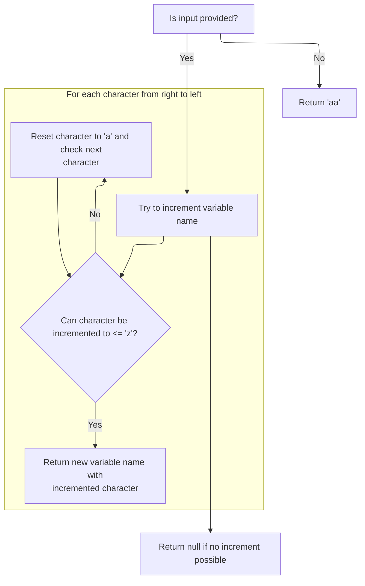

<SwmSnippet path="/faces/src/main/java/org/apache/struts/faces/taglib/JavascriptValidatorTag.java" line="654">

---

<SwmToken path="faces/src/main/java/org/apache/struts/faces/taglib/JavascriptValidatorTag.java" pos="654:5:5" line-data="    private String getNextVar(String input) {">`getNextVar`</SwmToken> generates the next variable name in a sequence, starting with 'aa' if there's no input. It increments the string like a base-26 number using letters, and calls <SwmToken path="faces/src/main/java/org/apache/struts/faces/taglib/JavascriptValidatorTag.java" pos="677:5:5" line-data="                input = replaceChar(input, pos, &#39;a&#39;);">`replaceChar`</SwmToken> to handle character rollover. This keeps the variable names unique and predictable.

```java
    private String getNextVar(String input) {
        if (input == null) {
            return "aa";
        }

        input = input.toLowerCase();

        for (int i = input.length(); i > 0; i--) {
            int pos = i - 1;

            char c = input.charAt(pos);
            c++;

            if (c <= 'z') {
                if (i == 0) {
                    return c + input.substring(pos, input.length());
                } else if (i == input.length()) {
                    return input.substring(0, pos) + c;
                } else {
                    return input.substring(0, pos) + c + input.substring(pos,
                      input.length() - 1);
                }
            } else {
                input = replaceChar(input, pos, 'a');
            }

        }

        return null;

    }
```

---

</SwmSnippet>

<SwmSnippet path="/faces/src/main/java/org/apache/struts/faces/taglib/JavascriptValidatorTag.java" line="689">

---

<SwmToken path="faces/src/main/java/org/apache/struts/faces/taglib/JavascriptValidatorTag.java" pos="689:5:5" line-data="    private String replaceChar(String input, int pos, char c) {">`replaceChar`</SwmToken> is supposed to swap a character at a given position, but the else branch actually chops off the last character. That's not standard and looks like a bug—so variable names might not always be what you'd expect.

```java
    private String replaceChar(String input, int pos, char c) {
        if (pos == 0) {
            return c + input.substring(pos, input.length());
        } else if (pos == input.length()) {
            return input.substring(0, pos) + c;
        } else {
            return input.substring(0, pos) + c + input.substring(pos,
              input.length() - 1);
        }
    }
```

---

</SwmSnippet>

## Assembling Validator Field Data Arrays

<SwmSnippet path="/faces/src/main/java/org/apache/struts/faces/taglib/JavascriptValidatorTag.java" line="425">

---

Back in `JavascriptValidatorTag.doStartTag`, after generating the variable name, we build a <SwmToken path="faces/src/main/java/org/apache/struts/faces/taglib/JavascriptValidatorTag.java" pos="60:11:11" line-data=" * Custom tag that generates JavaScript for client side validation based">`JavaScript`</SwmToken> array for each field, starting with the form client ID and field key. We call <SwmToken path="faces/src/main/java/org/apache/struts/faces/taglib/JavascriptValidatorTag.java" pos="429:3:3" line-data="                                + getFormClientId()">`getFormClientId`</SwmToken> next to get the unique DOM ID for the form, which is needed for the validator to hook up the logic.

```java
                        results.append(
                            "     this."
                                + jscriptVar
                                + " = new Array(\""
                                + getFormClientId()
                                + ":"
                                + field.getKey()
                                + "\", \""
                                + message
                                + "\", ");

```

---

</SwmSnippet>

## Locating the Form's Client ID in the Tag Hierarchy

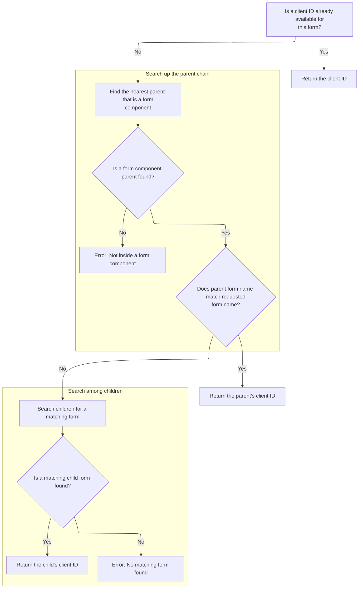

<SwmSnippet path="/faces/src/main/java/org/apache/struts/faces/taglib/JavascriptValidatorTag.java" line="754">

---

In <SwmToken path="faces/src/main/java/org/apache/struts/faces/taglib/JavascriptValidatorTag.java" pos="754:5:5" line-data="    private String getFormClientId(){">`getFormClientId`</SwmToken>, we first check for a cached client ID. If it's not there, we walk up the tag hierarchy to find a <SwmToken path="faces/src/main/java/org/apache/struts/faces/taglib/JavascriptValidatorTag.java" pos="764:8:8" line-data="            if (parent instanceof UIComponentTag) {">`UIComponentTag`</SwmToken>, then look for a <SwmToken path="faces/src/main/java/org/apache/struts/faces/taglib/JavascriptValidatorTag.java" pos="777:8:8" line-data="        if (parentComponent instanceof FormComponent) {">`FormComponent`</SwmToken> with a matching <SwmToken path="faces/src/main/java/org/apache/struts/faces/taglib/JavascriptValidatorTag.java" pos="779:10:10" line-data="                parentComponent.getAttributes().get(&quot;beanName&quot;))) {">`beanName`</SwmToken>. If we find it, we cache and return its client ID. Otherwise, we scan the children for a match. If nothing matches, we throw.

```java
    private String getFormClientId(){

        // Return any cached value
        if (formClientId != null) {
            return (formClientId);
        }

        // Locate our parent tag that is a component tag
        Tag parent = getParent();
        while (parent != null) {
            if (parent instanceof UIComponentTag) {
                break;
            }
            parent = parent.getParent();
        }
```

---

</SwmSnippet>

<SwmSnippet path="/faces/src/main/java/org/apache/struts/faces/taglib/JavascriptValidatorTag.java" line="769">

---

After finding the parent <SwmToken path="faces/src/main/java/org/apache/struts/faces/taglib/JavascriptValidatorTag.java" pos="771:11:11" line-data="                (&quot;Not nested inside a UIComponentTag&quot;);">`UIComponentTag`</SwmToken>, we check if it's a <SwmToken path="faces/src/main/java/org/apache/struts/faces/taglib/JavascriptValidatorTag.java" pos="777:8:8" line-data="        if (parentComponent instanceof FormComponent) {">`FormComponent`</SwmToken> with the right <SwmToken path="faces/src/main/java/org/apache/struts/faces/taglib/JavascriptValidatorTag.java" pos="779:10:10" line-data="                parentComponent.getAttributes().get(&quot;beanName&quot;))) {">`beanName`</SwmToken>. If not, we loop through its children to find a matching <SwmToken path="faces/src/main/java/org/apache/struts/faces/taglib/JavascriptValidatorTag.java" pos="777:8:8" line-data="        if (parentComponent instanceof FormComponent) {">`FormComponent`</SwmToken>. If nothing matches, we throw. This only works if the <SwmPath>[faces/…/faces/component/](faces/src/main/java/org/apache/struts/faces/component/)</SwmPath> hierarchy is set up as expected.

```java
        if (parent == null) {
            throw new IllegalArgumentException
                ("Not nested inside a UIComponentTag");
        }

        // Are we nested inside our corresponding form tag?
        UIComponent parentComponent =
            ((UIComponentTag) parent).getComponentInstance();
        if (parentComponent instanceof FormComponent) {
            if (formName.equals(
                parentComponent.getAttributes().get("beanName"))) {
                formClientId = parentComponent.getClientId
                    (FacesContext.getCurrentInstance());
                return (formClientId);
            }
        }

        // Scan the children of this tag's component
        Iterator kids = ((UIComponentTag) parent).
            getComponentInstance().getChildren().iterator();
        while (kids.hasNext()) {
            UIComponent kid = (UIComponent) kids.next();
            if (!(kid instanceof FormComponent)) {
                continue;
            }
            if (formName.equals(kid.getAttributes().get("beanName"))) {
                formClientId =
                    kid.getClientId(FacesContext.getCurrentInstance());
                return (formClientId);
            }
        }
```

---

</SwmSnippet>

<SwmSnippet path="/faces/src/main/java/org/apache/struts/faces/taglib/JavascriptValidatorTag.java" line="800">

---

If no matching <SwmToken path="faces/src/main/java/org/apache/struts/faces/taglib/JavascriptValidatorTag.java" pos="801:9:9" line-data="            (&quot;Cannot find child FormComponent for form &#39;&quot; + formName + &quot;&#39;&quot;);">`FormComponent`</SwmToken> is found after all the checks, we throw an <SwmToken path="faces/src/main/java/org/apache/struts/faces/taglib/JavascriptValidatorTag.java" pos="800:5:5" line-data="        throw new IllegalArgumentException">`IllegalArgumentException`</SwmToken> with the form name. So if the tag hierarchy isn't set up right, you'll see an error pointing to the missing form.

```java
        throw new IllegalArgumentException
            ("Cannot find child FormComponent for form '" + formName + "'");

    }
```

---

</SwmSnippet>

## Populating Validator Field Variables

```mermaid
%%{init: {"flowchart": {"defaultRenderer": "elk"}} }%%
flowchart TD
    node1["Start JavaScript validation generation"]
    click node1 openCode "faces/src/main/java/org/apache/struts/faces/taglib/JavascriptValidatorTag.java:436:437"
    node1 --> node2{"Is staticJavascript = true or
dynamicJavascript = true?"}
    click node2 openCode "faces/src/main/java/org/apache/struts/faces/taglib/JavascriptValidatorTag.java:514:519"
    node2 -->|"Yes"| node3{"Is form present?"}
    click node3 openCode "faces/src/main/java/org/apache/struts/faces/taglib/JavascriptValidatorTag.java:526:528"
    node2 -->|"No"| node8["Skip JavaScript generation"]
    click node8 openCode "faces/src/main/java/org/apache/struts/faces/taglib/JavascriptValidatorTag.java:520:520"
    node3 -->|"Yes"| node4["Generate JavaScript for each field
variable"]
    click node4 openCode "faces/src/main/java/org/apache/struts/faces/taglib/JavascriptValidatorTag.java:438:508"
    node3 -->|"No"| node8
    subgraph loop1["For each variable in each field"]
        node4 --> node5{"Variable type?"}
        click node5 openCode "faces/src/main/java/org/apache/struts/faces/taglib/JavascriptValidatorTag.java:453:507"
        node5 -->|"Integer"| node6["Assign integer value in JavaScript"]
        click node6 openCode "faces/src/main/java/org/apache/struts/faces/taglib/JavascriptValidatorTag.java:453:463"
        node5 -->|"RegExp"| node7["Assign RegExp in JavaScript"]
        click node7 openCode "faces/src/main/java/org/apache/struts/faces/taglib/JavascriptValidatorTag.java:464:474"
        node5 -->|"String/Other"| node9["Assign string/other value in JavaScript"]
        click node9 openCode "faces/src/main/java/org/apache/struts/faces/taglib/JavascriptValidatorTag.java:475:507"
    end
    node4 -->|"All variables processed"| node10{"Is htmlComment = true?"}
    click node10 openCode "faces/src/main/java/org/apache/struts/faces/taglib/JavascriptValidatorTag.java:516:518"
    node10 -->|"Yes"| node11["Include HTML comment in output"]
    click node11 openCode "faces/src/main/java/org/apache/struts/faces/taglib/JavascriptValidatorTag.java:517:517"
    node10 -->|"No"| node12["Skip HTML comment"]
    click node12 openCode "faces/src/main/java/org/apache/struts/faces/taglib/JavascriptValidatorTag.java:518:518"
    node11 --> node13["Finalize and return JavaScript output"]
    node12 --> node13
    node8 --> node13
    click node13 openCode "faces/src/main/java/org/apache/struts/faces/taglib/JavascriptValidatorTag.java:522:531"
    node2 -->|"staticJavascript = true"| node14["Append static JavaScript methods"]
    click node14 openCode "faces/src/main/java/org/apache/struts/faces/taglib/JavascriptValidatorTag.java:522:524"
    node14 --> node13

classDef HeadingStyle fill:#777777,stroke:#333,stroke-width:2px;

%% Swimm:
%% %%{init: {"flowchart": {"defaultRenderer": "elk"}} }%%
%% flowchart TD
%%     node1["Start <SwmToken path="faces/src/main/java/org/apache/struts/faces/taglib/JavascriptValidatorTag.java" pos="60:11:11" line-data=" * Custom tag that generates JavaScript for client side validation based">`JavaScript`</SwmToken> validation generation"]
%%     click node1 openCode "<SwmPath>[faces/…/taglib/JavascriptValidatorTag.java](faces/src/main/java/org/apache/struts/faces/taglib/JavascriptValidatorTag.java)</SwmPath>:436:437"
%%     node1 --> node2{"Is <SwmToken path="faces/src/main/java/org/apache/struts/faces/taglib/JavascriptValidatorTag.java" pos="514:14:14" line-data="            } else if (&quot;true&quot;.equalsIgnoreCase(staticJavascript)) {">`staticJavascript`</SwmToken> = true or
%% <SwmToken path="faces/src/main/java/org/apache/struts/faces/taglib/JavascriptValidatorTag.java" pos="297:10:10" line-data="            if (&quot;true&quot;.equalsIgnoreCase(dynamicJavascript)) {">`dynamicJavascript`</SwmToken> = true?"}
%%     click node2 openCode "<SwmPath>[faces/…/taglib/JavascriptValidatorTag.java](faces/src/main/java/org/apache/struts/faces/taglib/JavascriptValidatorTag.java)</SwmPath>:514:519"
%%     node2 -->|"Yes"| node3{"Is form present?"}
%%     click node3 openCode "<SwmPath>[faces/…/taglib/JavascriptValidatorTag.java](faces/src/main/java/org/apache/struts/faces/taglib/JavascriptValidatorTag.java)</SwmPath>:526:528"
%%     node2 -->|"No"| node8["Skip <SwmToken path="faces/src/main/java/org/apache/struts/faces/taglib/JavascriptValidatorTag.java" pos="60:11:11" line-data=" * Custom tag that generates JavaScript for client side validation based">`JavaScript`</SwmToken> generation"]
%%     click node8 openCode "<SwmPath>[faces/…/taglib/JavascriptValidatorTag.java](faces/src/main/java/org/apache/struts/faces/taglib/JavascriptValidatorTag.java)</SwmPath>:520:520"
%%     node3 -->|"Yes"| node4["Generate <SwmToken path="faces/src/main/java/org/apache/struts/faces/taglib/JavascriptValidatorTag.java" pos="60:11:11" line-data=" * Custom tag that generates JavaScript for client side validation based">`JavaScript`</SwmToken> for each field
%% variable"]
%%     click node4 openCode "<SwmPath>[faces/…/taglib/JavascriptValidatorTag.java](faces/src/main/java/org/apache/struts/faces/taglib/JavascriptValidatorTag.java)</SwmPath>:438:508"
%%     node3 -->|"No"| node8
%%     subgraph loop1["For each variable in each field"]
%%         node4 --> node5{"Variable type?"}
%%         click node5 openCode "<SwmPath>[faces/…/taglib/JavascriptValidatorTag.java](faces/src/main/java/org/apache/struts/faces/taglib/JavascriptValidatorTag.java)</SwmPath>:453:507"
%%         node5 -->|"Integer"| node6["Assign integer value in <SwmToken path="faces/src/main/java/org/apache/struts/faces/taglib/JavascriptValidatorTag.java" pos="60:11:11" line-data=" * Custom tag that generates JavaScript for client side validation based">`JavaScript`</SwmToken>"]
%%         click node6 openCode "<SwmPath>[faces/…/taglib/JavascriptValidatorTag.java](faces/src/main/java/org/apache/struts/faces/taglib/JavascriptValidatorTag.java)</SwmPath>:453:463"
%%         node5 -->|"RegExp"| node7["Assign RegExp in <SwmToken path="faces/src/main/java/org/apache/struts/faces/taglib/JavascriptValidatorTag.java" pos="60:11:11" line-data=" * Custom tag that generates JavaScript for client side validation based">`JavaScript`</SwmToken>"]
%%         click node7 openCode "<SwmPath>[faces/…/taglib/JavascriptValidatorTag.java](faces/src/main/java/org/apache/struts/faces/taglib/JavascriptValidatorTag.java)</SwmPath>:464:474"
%%         node5 -->|"String/Other"| node9["Assign string/other value in <SwmToken path="faces/src/main/java/org/apache/struts/faces/taglib/JavascriptValidatorTag.java" pos="60:11:11" line-data=" * Custom tag that generates JavaScript for client side validation based">`JavaScript`</SwmToken>"]
%%         click node9 openCode "<SwmPath>[faces/…/taglib/JavascriptValidatorTag.java](faces/src/main/java/org/apache/struts/faces/taglib/JavascriptValidatorTag.java)</SwmPath>:475:507"
%%     end
%%     node4 -->|"All variables processed"| node10{"Is <SwmToken path="faces/src/main/java/org/apache/struts/faces/taglib/JavascriptValidatorTag.java" pos="516:10:10" line-data="                if (&quot;true&quot;.equalsIgnoreCase(htmlComment)) {">`htmlComment`</SwmToken> = true?"}
%%     click node10 openCode "<SwmPath>[faces/…/taglib/JavascriptValidatorTag.java](faces/src/main/java/org/apache/struts/faces/taglib/JavascriptValidatorTag.java)</SwmPath>:516:518"
%%     node10 -->|"Yes"| node11["Include HTML comment in output"]
%%     click node11 openCode "<SwmPath>[faces/…/taglib/JavascriptValidatorTag.java](faces/src/main/java/org/apache/struts/faces/taglib/JavascriptValidatorTag.java)</SwmPath>:517:517"
%%     node10 -->|"No"| node12["Skip HTML comment"]
%%     click node12 openCode "<SwmPath>[faces/…/taglib/JavascriptValidatorTag.java](faces/src/main/java/org/apache/struts/faces/taglib/JavascriptValidatorTag.java)</SwmPath>:518:518"
%%     node11 --> node13["Finalize and return <SwmToken path="faces/src/main/java/org/apache/struts/faces/taglib/JavascriptValidatorTag.java" pos="60:11:11" line-data=" * Custom tag that generates JavaScript for client side validation based">`JavaScript`</SwmToken> output"]
%%     node12 --> node13
%%     node8 --> node13
%%     click node13 openCode "<SwmPath>[faces/…/taglib/JavascriptValidatorTag.java](faces/src/main/java/org/apache/struts/faces/taglib/JavascriptValidatorTag.java)</SwmPath>:522:531"
%%     node2 -->|"<SwmToken path="faces/src/main/java/org/apache/struts/faces/taglib/JavascriptValidatorTag.java" pos="514:14:14" line-data="            } else if (&quot;true&quot;.equalsIgnoreCase(staticJavascript)) {">`staticJavascript`</SwmToken> = true"| node14["Append static <SwmToken path="faces/src/main/java/org/apache/struts/faces/taglib/JavascriptValidatorTag.java" pos="60:11:11" line-data=" * Custom tag that generates JavaScript for client side validation based">`JavaScript`</SwmToken> methods"]
%%     click node14 openCode "<SwmPath>[faces/…/taglib/JavascriptValidatorTag.java](faces/src/main/java/org/apache/struts/faces/taglib/JavascriptValidatorTag.java)</SwmPath>:522:524"
%%     node14 --> node13
%% 
%% classDef HeadingStyle fill:#777777,stroke:#333,stroke-width:2px;
```

<SwmSnippet path="/faces/src/main/java/org/apache/struts/faces/taglib/JavascriptValidatorTag.java" line="436">

---

Back in `JavascriptValidatorTag.doStartTag`, after getting the form client ID, we loop through the field's variables and append them as <SwmToken path="faces/src/main/java/org/apache/struts/faces/taglib/JavascriptValidatorTag.java" pos="60:11:11" line-data=" * Custom tag that generates JavaScript for client side validation based">`JavaScript`</SwmToken> assignments. This sets up all the data the validator function needs for each field.

```java
                        results.append("new Function (\"varName\", \"");

                        Map vars = field.getVars();
                        // Loop through the field's variables.
                        Iterator varsIterator = vars.keySet().iterator();
                        while (varsIterator.hasNext()) {
                            String varName = (String) varsIterator.next();
                            Var var = (Var) vars.get(varName);
                            String varValue = var.getValue();
                            String jsType = var.getJsType();

                            // skip requiredif variables field, fieldIndexed,
                            // fieldTest, fieldValue
                            if (varName.startsWith("field")) {
                                continue;
                            }

                            if (Var.JSTYPE_INT.equalsIgnoreCase(jsType)) {
                                results.append(
                                    "this."
                                        + varName
                                        + "="
                                        + ValidatorUtils.replace(
                                            varValue,
                                            "\\",
                                            "\\\\")
                                        + "; ");
                            } else if (Var.JSTYPE_REGEXP.equalsIgnoreCase(
                                jsType)) {
                                results.append(
                                    "this."
                                        + varName
                                        + "=/"
                                        + ValidatorUtils.replace(
                                            varValue,
                                            "\\",
                                            "\\\\")
                                        + "/; ");
                            } else if (Var.JSTYPE_STRING.equalsIgnoreCase(
                                jsType)) {
                                results.append(
                                    "this."
                                        + varName
                                        + "='"
                                        + ValidatorUtils.replace(
                                            varValue,
                                            "\\",
                                            "\\\\")
                                        + "'; ");
                                // So everyone using the latest format doesn't
                                // need to change their xml files immediately.
                            } else if ("mask".equalsIgnoreCase(varName)) {
                                results.append(
                                    "this."
                                        + varName
                                        + "=/"
                                        + ValidatorUtils.replace(
                                            varValue,
                                            "\\",
                                            "\\\\")
                                        + "/; ");
                            } else {
                                results.append(
                                    "this."
                                        + varName
                                        + "='"
                                        + ValidatorUtils.replace(
                                            varValue,
                                            "\\",
                                            "\\\\")
                                        + "'; ");
                            }
                        }
```

---

</SwmSnippet>

<SwmSnippet path="/faces/src/main/java/org/apache/struts/faces/taglib/JavascriptValidatorTag.java" line="510">

---

After building the validator field functions, we check if <SwmToken path="faces/src/main/java/org/apache/struts/faces/taglib/JavascriptValidatorTag.java" pos="514:14:14" line-data="            } else if (&quot;true&quot;.equalsIgnoreCase(staticJavascript)) {">`staticJavascript`</SwmToken> is enabled and call <SwmToken path="faces/src/main/java/org/apache/struts/faces/taglib/JavascriptValidatorTag.java" pos="515:7:7" line-data="                results.append(this.getStartElement());">`getStartElement`</SwmToken> to add the opening <script> tag or wrapper. This is what actually puts the generated <SwmToken path="faces/src/main/java/org/apache/struts/faces/taglib/JavascriptValidatorTag.java" pos="60:11:11" line-data=" * Custom tag that generates JavaScript for client side validation based">`JavaScript`</SwmToken> into the page.

```java
                        results.append(" return this[varName];\"));\n");
                    }
                    results.append("    } \n\n");
                }
            } else if ("true".equalsIgnoreCase(staticJavascript)) {
                results.append(this.getStartElement());
                if ("true".equalsIgnoreCase(htmlComment)) {
                    results.append(htmlBeginComment);
                }
            }
        }

```

---

</SwmSnippet>

<SwmSnippet path="/faces/src/main/java/org/apache/struts/faces/taglib/JavascriptValidatorTag.java" line="522">

---

After <SwmToken path="faces/src/main/java/org/apache/struts/faces/taglib/JavascriptValidatorTag.java" pos="515:7:7" line-data="                results.append(this.getStartElement());">`getStartElement`</SwmToken>, we append any static validator methods if needed, then call <SwmToken path="faces/src/main/java/org/apache/struts/faces/taglib/JavascriptValidatorTag.java" pos="530:5:5" line-data="            results.append(getJavascriptEnd());">`getJavascriptEnd`</SwmToken> to close out the script block. This wraps up the generated <SwmToken path="faces/src/main/java/org/apache/struts/faces/taglib/JavascriptValidatorTag.java" pos="60:11:11" line-data=" * Custom tag that generates JavaScript for client side validation based">`JavaScript`</SwmToken> so it's ready for the browser.

```java
        if ("true".equalsIgnoreCase(staticJavascript)) {
            results.append(getJavascriptStaticMethods(resources));
        }

        if (form != null
            && ("true".equalsIgnoreCase(dynamicJavascript)
                || "true".equalsIgnoreCase(staticJavascript))) {

            results.append(getJavascriptEnd());
        }


```

---

</SwmSnippet>

## Finalizing the Script Block Output

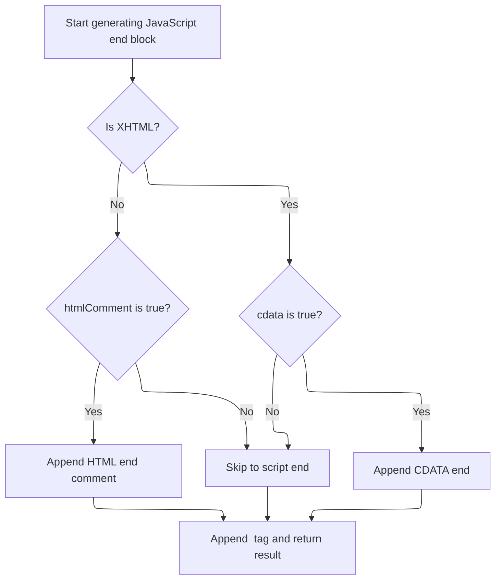

<SwmSnippet path="/faces/src/main/java/org/apache/struts/faces/taglib/JavascriptValidatorTag.java" line="633">

---

In <SwmToken path="faces/src/main/java/org/apache/struts/faces/taglib/JavascriptValidatorTag.java" pos="633:5:5" line-data="    protected String getJavascriptEnd() {">`getJavascriptEnd`</SwmToken>, we start building the script block ending by appending a newline. Then, we check if we're in HTML mode and <SwmToken path="faces/src/main/java/org/apache/struts/faces/taglib/JavascriptValidatorTag.java" pos="637:19:19" line-data="        if (!this.isXhtml() &amp;&amp; &quot;true&quot;.equals(htmlComment)){">`htmlComment`</SwmToken> is enabled—if so, we add the HTML comment end marker. If we're in XHTML mode and cdata is enabled, we add the CDATA section end. Calling <SwmToken path="faces/src/main/java/org/apache/struts/faces/taglib/JavascriptValidatorTag.java" pos="637:7:7" line-data="        if (!this.isXhtml() &amp;&amp; &quot;true&quot;.equals(htmlComment)){">`isXhtml`</SwmToken> here decides which markup rules to follow, so the script output matches the page type.

```java
    protected String getJavascriptEnd() {
        StringBuffer sb = new StringBuffer();

        sb.append("\n");
        if (!this.isXhtml() && "true".equals(htmlComment)){
            sb.append(htmlEndComment);
        }

        if (this.isXhtml() && "true".equalsIgnoreCase(this.cdata)) {
            sb.append("]]>\r\n");
        }

```

---

</SwmSnippet>

<SwmSnippet path="/faces/src/main/java/org/apache/struts/faces/taglib/JavascriptValidatorTag.java" line="645">

---

Back in <SwmToken path="faces/src/main/java/org/apache/struts/faces/taglib/JavascriptValidatorTag.java" pos="530:5:5" line-data="            results.append(getJavascriptEnd());">`getJavascriptEnd`</SwmToken>, after checking XHTML and comment conditions, we always append the closing </script> tag with two newlines. The result is a properly closed script block, no matter which markup mode we're in.

```java
        sb.append("</script>\n\n");

        return sb.toString();
    }
```

---

</SwmSnippet>

## Writing the Generated <SwmToken path="faces/src/main/java/org/apache/struts/faces/taglib/JavascriptValidatorTag.java" pos="60:11:11" line-data=" * Custom tag that generates JavaScript for client side validation based">`JavaScript`</SwmToken> to the Page

<SwmSnippet path="/faces/src/main/java/org/apache/struts/faces/taglib/JavascriptValidatorTag.java" line="534">

---

Back in <SwmToken path="faces/src/main/java/org/apache/struts/faces/taglib/JavascriptValidatorTag.java" pos="279:5:5" line-data="    public int doStartTag() throws JspException {">`doStartTag`</SwmToken>, after building the full <SwmToken path="faces/src/main/java/org/apache/struts/faces/taglib/JavascriptValidatorTag.java" pos="60:11:11" line-data=" * Custom tag that generates JavaScript for client side validation based">`JavaScript`</SwmToken> (including the script end from <SwmToken path="faces/src/main/java/org/apache/struts/faces/taglib/JavascriptValidatorTag.java" pos="530:5:5" line-data="            results.append(getJavascriptEnd());">`getJavascriptEnd`</SwmToken>), we write the result to the page output. If there's an error, we throw a <SwmToken path="faces/src/main/java/org/apache/struts/faces/taglib/JavascriptValidatorTag.java" pos="538:5:5" line-data="            throw new JspException(e.getMessage(), e);">`JspException`</SwmToken> to signal the failure.

```java
        JspWriter writer = pageContext.getOut();
        try {
            writer.print(results.toString());
        } catch (IOException e) {
            throw new JspException(e.getMessage(), e);
        }

        return (EVAL_BODY_TAG);

    }
```

---

</SwmSnippet>

&nbsp;

*This is an* <SwmToken path="faces/src/main/java/org/apache/struts/faces/taglib/JavascriptValidatorTag.java" pos="186:5:7" line-data="     * the auto-generated method name based on the key (form name)">`auto-generated`</SwmToken> *document by Swimm 🌊 and has not yet been verified by a human*

<SwmMeta version="3.0.0" repo-id="Z2l0aHViJTNBJTNBc3RydXRzMSUzQSUzQVN3aW1tLURlbW8=" repo-name="struts1"><sup>Powered by [Swimm](https://app.swimm.io/)</sup></SwmMeta>
