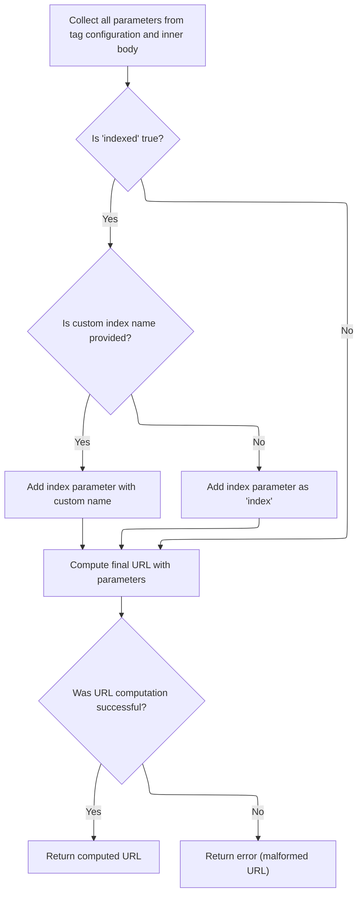

This document explains how dynamic anchor tags are generated and written to web pages. The flow allows links to be customized based on tag configuration and loop context, supporting navigation for individual items in a list. The main steps are building the anchor tag, assembling parameters (including indexed links), computing the final URL, and finalizing the tag with attributes and styles.

# Building the anchor tag and deciding the link URL

<SwmSnippet path="/taglib/src/main/java/org/apache/struts/taglib/html/LinkTag.java" line="342">

---

In <SwmToken path="taglib/src/main/java/org/apache/struts/taglib/html/LinkTag.java" pos="342:5:5" line-data="    public int doEndTag() throws JspException {">`doEndTag`</SwmToken>, we start by building the anchor tag and set up its 'name' attribute if needed. If any link-related attributes are present, we call <SwmToken path="taglib/src/main/java/org/apache/struts/taglib/html/LinkTag.java" pos="353:11:11" line-data="            prepareAttribute(results, &quot;href&quot;, calculateURL());">`calculateURL`</SwmToken> to figure out the actual href value for the anchor. This ensures the tag either acts as a name anchor or a proper hyperlink, depending on the context.

```java
    public int doEndTag() throws JspException {
        // Generate the opening anchor element
        StringBuffer results = new StringBuffer("<a");

        // Special case for name anchors
        prepareAttribute(results, "name", getLinkName());

        // * @since Struts 1.1
        if ((getLinkName() == null) || (getForward() != null)
            || (getHref() != null) || (getPage() != null)
            || (getAction() != null)) {
            prepareAttribute(results, "href", calculateURL());
        }

```

---

</SwmSnippet>

## Assembling link parameters and handling indexed links



<SwmSnippet path="/taglib/src/main/java/org/apache/struts/taglib/html/LinkTag.java" line="409">

---

In <SwmToken path="taglib/src/main/java/org/apache/struts/taglib/html/LinkTag.java" pos="409:5:5" line-data="    protected String calculateURL()">`calculateURL`</SwmToken>, we gather all parameters for the link, including those from tag attributes and the body. If the link is marked as 'indexed', we need to fetch the current loop index, so we call <SwmToken path="taglib/src/main/java/org/apache/struts/taglib/html/LinkTag.java" pos="428:7:7" line-data="            int indexValue = getIndexValue();">`getIndexValue`</SwmToken> from <SwmToken path="taglib/src/main/java/org/apache/struts/taglib/html/LinkTag.java" pos="39:8:8" line-data="public class LinkTag extends BaseHandlerTag {">`BaseHandlerTag`</SwmToken> to get that value.

```java
    protected String calculateURL()
        throws JspException {
        // Identify the parameters we will add to the completed URL
        Map params =
            TagUtils.getInstance().computeParameters(pageContext, paramId,
                paramName, paramProperty, paramScope, name, property, scope,
                transaction);

        // Add parameters collected from the tag's inner body
        if (!this.parameters.isEmpty()) {
            if (params == null) {
                params = new HashMap();
            }
            params.putAll(this.parameters);
        }

        // if "indexed=true", add "index=x" parameter to query string
        // * @since Struts 1.1
        if (indexed) {
            int indexValue = getIndexValue();

```

---

</SwmSnippet>

<SwmSnippet path="/taglib/src/main/java/org/apache/struts/taglib/html/BaseHandlerTag.java" line="935">

---

<SwmToken path="taglib/src/main/java/org/apache/struts/taglib/html/BaseHandlerTag.java" pos="935:5:5" line-data="    protected int getIndexValue()">`getIndexValue`</SwmToken> checks for an enclosing <SwmToken path="taglib/src/main/java/org/apache/struts/taglib/html/BaseHandlerTag.java" pos="938:1:1" line-data="        IterateTag iterateTag =">`IterateTag`</SwmToken> or JSTL loop to grab the current index. If neither is found, it throws an exception, making sure the tag is only used inside a loop context.

```java
    protected int getIndexValue()
        throws JspException {
        // look for outer iterate tag
        IterateTag iterateTag =
            (IterateTag) findAncestorWithClass(this, IterateTag.class);

        if (iterateTag != null) {
            return iterateTag.getIndex();
        }

        // Look for JSTL loops
        Integer i = getJstlLoopIndex();

        if (i != null) {
            return i.intValue();
        }

        // this tag should be nested in an IterateTag or JSTL loop tag, if it's not, throw exception
        JspException e =
            new JspException(messages.getMessage("indexed.noEnclosingIterate"));

        TagUtils.getInstance().saveException(pageContext, e);
        throw e;
    }
```

---

</SwmSnippet>

<SwmSnippet path="/taglib/src/main/java/org/apache/struts/taglib/html/LinkTag.java" line="430">

---

Back in <SwmToken path="taglib/src/main/java/org/apache/struts/taglib/html/LinkTag.java" pos="353:11:11" line-data="            prepareAttribute(results, &quot;href&quot;, calculateURL());">`calculateURL`</SwmToken>, after getting the index from <SwmToken path="taglib/src/main/java/org/apache/struts/taglib/html/LinkTag.java" pos="39:8:8" line-data="public class LinkTag extends BaseHandlerTag {">`BaseHandlerTag`</SwmToken>, we add it to the link parameters (either as 'index' or using a custom name). Then we build the final URL with all parameters, including the index, so each link points to a specific item.

```java
            //calculate index, and add as a parameter
            if (params == null) {
                params = new HashMap(); //create new HashMap if no other params
            }

            if (indexId != null) {
                params.put(indexId, Integer.toString(indexValue));
            } else {
                params.put("index", Integer.toString(indexValue));
            }
        }

        String url = null;

        try {
            url = TagUtils.getInstance().computeURLWithCharEncoding(pageContext,
                    forward, href, page, action, module, params, anchor, false,
                    useLocalEncoding);
        } catch (MalformedURLException e) {
            TagUtils.getInstance().saveException(pageContext, e);
            throw new JspException(messages.getMessage("rewrite.url",
                    e.toString()), e);
        }

        return (url);
    }
```

---

</SwmSnippet>

## Finalizing the anchor tag and writing it to the page

<SwmSnippet path="/taglib/src/main/java/org/apache/struts/taglib/html/LinkTag.java" line="356">

---

Back in <SwmToken path="taglib/src/main/java/org/apache/struts/taglib/html/LinkTag.java" pos="342:5:5" line-data="    public int doEndTag() throws JspException {">`doEndTag`</SwmToken>, after getting the URL from <SwmToken path="taglib/src/main/java/org/apache/struts/taglib/html/LinkTag.java" pos="353:11:11" line-data="            prepareAttribute(results, &quot;href&quot;, calculateURL());">`calculateURL`</SwmToken>, we finish up by adding other attributes, styles, and event handlers to the anchor tag, append the link text, and write the completed tag to the page.

```java
        prepareAttribute(results, "target", getTarget());
        prepareAttribute(results, "accesskey", getAccesskey());
        prepareAttribute(results, "tabindex", getTabindex());
        results.append(prepareStyles());
        results.append(prepareEventHandlers());
        prepareOtherAttributes(results);
        results.append(">");

        // Prepare the textual content and ending element of this hyperlink
        if (text != null) {
            results.append(text);
        }
        results.append("</a>");
        TagUtils.getInstance().write(pageContext, results.toString());

        return (EVAL_PAGE);
    }
```

---

</SwmSnippet>

&nbsp;

*This is an auto-generated document by Swimm 🌊 and has not yet been verified by a human*

<SwmMeta version="3.0.0" repo-id="Z2l0aHViJTNBJTNBc3RydXRzMSUzQSUzQVN3aW1tLURlbW8=" repo-name="struts1"><sup>Powered by [Swimm](https://app.swimm.io/)</sup></SwmMeta>
