This document explains how dynamic hyperlinks are generated for JSP pages. Parameters are collected and merged from multiple sources, then used to construct a properly encoded URL that supports session and transaction information. The final URL is written to the page output, enabling flexible navigation.

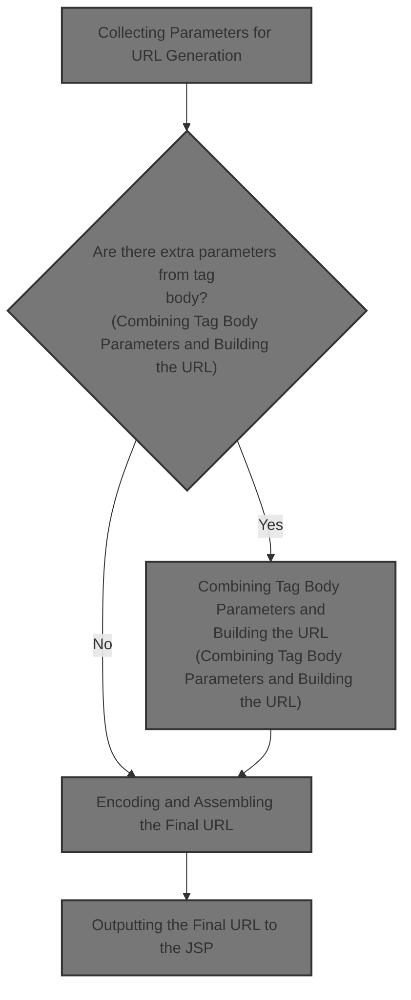

# Collecting Parameters for URL Generation

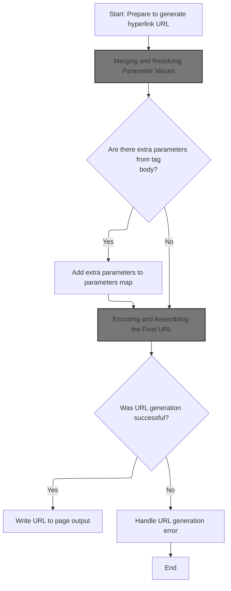

<SwmSnippet path="/taglib/src/main/java/org/apache/struts/taglib/html/RewriteTag.java" line="46">

---

In <SwmToken path="taglib/src/main/java/org/apache/struts/taglib/html/RewriteTag.java" pos="46:5:5" line-data="    public int doEndTag() throws JspException {">`doEndTag`</SwmToken>, we're preparing the parameter map for the URL by delegating to TagUtils.computeParameters. This step centralizes the logic for merging parameters from tag attributes, context, and transaction tokens, so we don't have to duplicate it in the tag class.

```java
    public int doEndTag() throws JspException {
        // Generate the hyperlink URL
        Map params =
            TagUtils.getInstance().computeParameters(pageContext, paramId,
                paramName, paramProperty, paramScope, name, property, scope,
                transaction);

```

---

</SwmSnippet>

## Merging and Resolving Parameter Values

<SwmSnippet path="/taglib/src/main/java/org/apache/struts/taglib/TagUtils.java" line="190">

---

In <SwmToken path="taglib/src/main/java/org/apache/struts/taglib/TagUtils.java" pos="190:5:5" line-data="    public Map computeParameters(PageContext pageContext, String paramId,">`computeParameters`</SwmToken>, we're merging parameters from the page context and tag attributes, handling both single and <SwmToken path="taglib/src/main/java/org/apache/struts/taglib/TagUtils.java" pos="199:13:15" line-data="        // Locate the Map containing our multi-value parameters map">`multi-value`</SwmToken> cases, and prepping the map for any transaction token if needed. This sets up a complete parameter set for the next step.

```java
    public Map computeParameters(PageContext pageContext, String paramId,
        String paramName, String paramProperty, String paramScope, String name,
        String property, String scope, boolean transaction)
        throws JspException {
        // Short circuit if no parameters are specified
        if ((paramId == null) && (name == null) && !transaction) {
            return (null);
        }

        // Locate the Map containing our multi-value parameters map
        Map map = null;

        try {
            if (name != null) {
                map = (Map) getInstance().lookup(pageContext, name, property,
                        scope);
            }

```

---

</SwmSnippet>

### Looking Up Context Values

See <SwmLink doc-title="Retrieving Objects and Properties in JSP Context">[Retrieving Objects and Properties in JSP Context](/.swm/retrieving-objects-and-properties-in-jsp-context.fsg4jeua.sw.md)</SwmLink>

### Handling Lookup Results and Exception Management

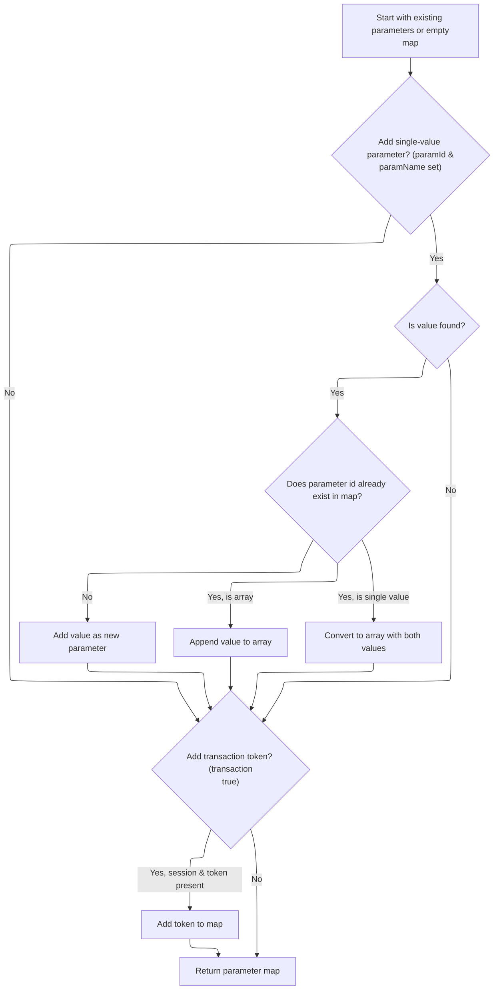

<SwmSnippet path="/taglib/src/main/java/org/apache/struts/taglib/TagUtils.java" line="208">

---

Back in <SwmToken path="taglib/src/main/java/org/apache/struts/taglib/html/RewriteTag.java" pos="49:7:7" line-data="            TagUtils.getInstance().computeParameters(pageContext, paramId,">`computeParameters`</SwmToken>, after the lookup, we catch and log any <SwmToken path="taglib/src/main/java/org/apache/struts/taglib/TagUtils.java" pos="211:7:7" line-data="            //            throw new JspException(">`JspException`</SwmToken> so that parameter resolution failures are visible and don't go unnoticed.

```java
            // @TODO - remove this - it is never thrown
            //        } catch (ClassCastException e) {
            //            saveException(pageContext, e);
            //            throw new JspException(
            //                    messages.getMessage("parameters.multi", name, property, scope));
        } catch (JspException e) {
            saveException(pageContext, e);
            throw e;
        }

```

---

</SwmSnippet>

<SwmSnippet path="/taglib/src/main/java/org/apache/struts/taglib/TagUtils.java" line="218">

---

Back in <SwmToken path="taglib/src/main/java/org/apache/struts/taglib/html/RewriteTag.java" pos="49:7:7" line-data="            TagUtils.getInstance().computeParameters(pageContext, paramId,">`computeParameters`</SwmToken>, after the lookup, we copy the map (if present) and start merging in new parameters, handling both single and <SwmToken path="taglib/src/main/java/org/apache/struts/taglib/TagUtils.java" pos="218:21:23" line-data="        // Create a Map to contain our results from the multi-value parameters">`multi-value`</SwmToken> cases to keep everything consistent for URL building.

```java
        // Create a Map to contain our results from the multi-value parameters
        Map results = null;

        if (map != null) {
            results = new HashMap(map);
        } else {
            results = new HashMap();
        }

        // Add the single-value parameter (if any)
        if ((paramId != null) && (paramName != null)) {
            Object paramValue = null;

            try {
                paramValue =
                    TagUtils.getInstance().lookup(pageContext, paramName,
                        paramProperty, paramScope);
```

---

</SwmSnippet>

<SwmSnippet path="/taglib/src/main/java/org/apache/struts/taglib/TagUtils.java" line="235">

---

Back in <SwmToken path="taglib/src/main/java/org/apache/struts/taglib/html/RewriteTag.java" pos="49:7:7" line-data="            TagUtils.getInstance().computeParameters(pageContext, paramId,">`computeParameters`</SwmToken>, we do a separate lookup for <SwmToken path="taglib/src/main/java/org/apache/struts/taglib/html/RewriteTag.java" pos="50:1:1" line-data="                paramName, paramProperty, paramScope, name, property, scope,">`paramName`</SwmToken> to fetch a specific value, catching exceptions so we can log and handle lookup failures cleanly.

```java
            } catch (JspException e) {
                saveException(pageContext, e);
                throw e;
            }

```

---

</SwmSnippet>

<SwmSnippet path="/taglib/src/main/java/org/apache/struts/taglib/TagUtils.java" line="240">

---

Back in <SwmToken path="taglib/src/main/java/org/apache/struts/taglib/html/RewriteTag.java" pos="49:7:7" line-data="            TagUtils.getInstance().computeParameters(pageContext, paramId,">`computeParameters`</SwmToken>, we merge the <SwmToken path="taglib/src/main/java/org/apache/struts/taglib/TagUtils.java" pos="187:24:26" line-data="     * @throws JspException if a class cast exception occurs on a looked-up">`looked-up`</SwmToken> value into the results map, handling both single and <SwmToken path="taglib/src/main/java/org/apache/struts/taglib/TagUtils.java" pos="199:13:15" line-data="        // Locate the Map containing our multi-value parameters map">`multi-value`</SwmToken> cases, and add the transaction token if needed. The final map is ready for URL construction.

```java
            if (paramValue != null) {
                String paramString = null;

                if (paramValue instanceof String) {
                    paramString = (String) paramValue;
                } else {
                    paramString = paramValue.toString();
                }

                Object mapValue = results.get(paramId);

                if (mapValue == null) {
                    results.put(paramId, paramString);
                } else if (mapValue instanceof String[]) {
                    String[] oldValues = (String[]) mapValue;
                    String[] newValues = new String[oldValues.length + 1];

                    System.arraycopy(oldValues, 0, newValues, 0,
                        oldValues.length);
                    newValues[oldValues.length] = paramString;
                    results.put(paramId, newValues);
                } else {
                    String[] newValues = new String[2];

                    newValues[0] = mapValue.toString();
                    newValues[1] = paramString;
                    results.put(paramId, newValues);
                }
            }
        }

        // Add our transaction control token (if requested)
        if (transaction) {
            HttpSession session = pageContext.getSession();
            String token = null;

            if (session != null) {
                token =
                    (String) session.getAttribute(Globals.TRANSACTION_TOKEN_KEY);
            }

            if (token != null) {
                results.put(Constants.TOKEN_KEY, token);
            }
        }

        // Return the completed Map
        return (results);
    }
```

---

</SwmSnippet>

## Combining Tag Body Parameters and Building the URL

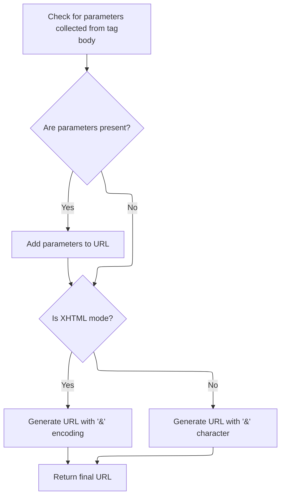

<SwmSnippet path="/taglib/src/main/java/org/apache/struts/taglib/html/RewriteTag.java" line="53">

---

Back in <SwmToken path="taglib/src/main/java/org/apache/struts/taglib/html/RewriteTag.java" pos="46:5:5" line-data="    public int doEndTag() throws JspException {">`doEndTag`</SwmToken>, after getting the computed parameters, we merge in any parameters set directly in the tag body, then call TagUtils.computeURLWithCharEncoding to actually build the URL string.

```java
        // Add parameters collected from the tag's inner body
        if (!this.parameters.isEmpty()) {
            if (params == null) {
                params = new HashMap();
            }
            params.putAll(this.parameters);
        }

        String url = null;

        try {
            // Note that we're encoding the & character to &amp; in XHTML mode only,
            // otherwise the & is written as is to work in javascripts.
            url = TagUtils.getInstance().computeURLWithCharEncoding(pageContext,
                    forward, href, page, action, module, params, anchor, false,
                    this.isXhtml(), useLocalEncoding);
```

---

</SwmSnippet>

## Encoding and Assembling the Final URL

```mermaid
%%{init: {"flowchart": {"defaultRenderer": "elk"}} }%%
flowchart TD
    node1["Choose character encoding (UTF-8 or
local)"] --> node2{"Is exactly one of forward, href, page,
or action specified?"}
    click node1 openCode "taglib/src/main/java/org/apache/struts/taglib/TagUtils.java:371:375"
    node2 -->|"Yes"| node3["Preparing the URL Buffer and Request Context"]
    
    node2 -->|"No"| nodeX["Cannot build URL: ambiguous or missing
type"]
    click nodeX openCode "taglib/src/main/java/org/apache/struts/taglib/TagUtils.java:397:400"
    node3 --> node4{"Anchor present?"}
    
    node4 -->|"Yes"| node5["Handling Page URLs and Final Assembly"]
    
    
    node4 -->|"No"| node6{"Parameters present?"}
    node5 --> node6
    node6 -->|"Yes"| subgraph loop1["For each parameter to add to the URL"]
        node7["Encoding URL Components"]
        
    end
    node6 -->|"No"| node8{"Rewrite for session/redirect needed?"}
    loop1 --> node8
    node8 -->|"Yes"| node9["Session ID Encoding and Final URL Return"]
    
    
    node8 -->|"No"| node10["Session ID Encoding and Final URL Return"]
    

classDef HeadingStyle fill:#777777,stroke:#333,stroke-width:2px;
click node2 goToHeading "Validating URL Specifiers and Error Handling"
node2:::HeadingStyle
click node3 goToHeading "Preparing the URL Buffer and Request Context"
node3:::HeadingStyle
click node4 goToHeading "Handling Page URLs and Final Assembly"
node4:::HeadingStyle
click node5 goToHeading "Handling Page URLs and Final Assembly"
node5:::HeadingStyle
click node7 goToHeading "Encoding URL Components"
node7:::HeadingStyle
click node8 goToHeading "Session ID Encoding and Final URL Return"
node8:::HeadingStyle
click node9 goToHeading "Session ID Encoding and Final URL Return"
node9:::HeadingStyle
click node10 goToHeading "Session ID Encoding and Final URL Return"
node10:::HeadingStyle

%% Swimm:
%% %%{init: {"flowchart": {"defaultRenderer": "elk"}} }%%
%% flowchart TD
%%     node1["Choose character encoding (<SwmToken path="taglib/src/main/java/org/apache/struts/taglib/TagUtils.java" pos="371:8:10" line-data="        String charEncoding = &quot;UTF-8&quot;;">`UTF-8`</SwmToken> or
%% local)"] --> node2{"Is exactly one of forward, href, page,
%% or action specified?"}
%%     click node1 openCode "<SwmPath>[taglib/…/taglib/TagUtils.java](taglib/src/main/java/org/apache/struts/taglib/TagUtils.java)</SwmPath>:371:375"
%%     node2 -->|"Yes"| node3["Preparing the URL Buffer and Request Context"]
%%     
%%     node2 -->|"No"| nodeX["Cannot build URL: ambiguous or missing
%% type"]
%%     click nodeX openCode "<SwmPath>[taglib/…/taglib/TagUtils.java](taglib/src/main/java/org/apache/struts/taglib/TagUtils.java)</SwmPath>:397:400"
%%     node3 --> node4{"Anchor present?"}
%%     
%%     node4 -->|"Yes"| node5["Handling Page <SwmToken path="core/src/main/java/org/apache/struts/util/RequestUtils.java" pos="677:9:9" line-data="     * the case for URLs that were originally created from relative or">`URLs`</SwmToken> and Final Assembly"]
%%     
%%     
%%     node4 -->|"No"| node6{"Parameters present?"}
%%     node5 --> node6
%%     node6 -->|"Yes"| subgraph loop1["For each parameter to add to the URL"]
%%         node7["Encoding URL Components"]
%%         
%%     end
%%     node6 -->|"No"| node8{"Rewrite for session/redirect needed?"}
%%     loop1 --> node8
%%     node8 -->|"Yes"| node9["Session ID Encoding and Final URL Return"]
%%     
%%     
%%     node8 -->|"No"| node10["Session ID Encoding and Final URL Return"]
%%     
%% 
%% classDef HeadingStyle fill:#777777,stroke:#333,stroke-width:2px;
%% click node2 goToHeading "Validating URL Specifiers and Error Handling"
%% node2:::HeadingStyle
%% click node3 goToHeading "Preparing the URL Buffer and Request Context"
%% node3:::HeadingStyle
%% click node4 goToHeading "Handling Page <SwmToken path="core/src/main/java/org/apache/struts/util/RequestUtils.java" pos="677:9:9" line-data="     * the case for URLs that were originally created from relative or">`URLs`</SwmToken> and Final Assembly"
%% node4:::HeadingStyle
%% click node5 goToHeading "Handling Page <SwmToken path="core/src/main/java/org/apache/struts/util/RequestUtils.java" pos="677:9:9" line-data="     * the case for URLs that were originally created from relative or">`URLs`</SwmToken> and Final Assembly"
%% node5:::HeadingStyle
%% click node7 goToHeading "Encoding URL Components"
%% node7:::HeadingStyle
%% click node8 goToHeading "Session ID Encoding and Final URL Return"
%% node8:::HeadingStyle
%% click node9 goToHeading "Session ID Encoding and Final URL Return"
%% node9:::HeadingStyle
%% click node10 goToHeading "Session ID Encoding and Final URL Return"
%% node10:::HeadingStyle
```

<SwmSnippet path="/taglib/src/main/java/org/apache/struts/taglib/TagUtils.java" line="366">

---

In <SwmToken path="taglib/src/main/java/org/apache/struts/taglib/TagUtils.java" pos="366:5:5" line-data="    public String computeURLWithCharEncoding(PageContext pageContext,">`computeURLWithCharEncoding`</SwmToken>, we figure out which character encoding to use for the URL, grabbing it from the response if <SwmToken path="taglib/src/main/java/org/apache/struts/taglib/TagUtils.java" pos="369:3:3" line-data="        boolean useLocalEncoding)">`useLocalEncoding`</SwmToken> is set. This ensures the URL is encoded consistently with the page output.

```java
    public String computeURLWithCharEncoding(PageContext pageContext,
        String forward, String href, String page, String action, String module,
        Map params, String anchor, boolean redirect, boolean encodeSeparator,
        boolean useLocalEncoding)
        throws MalformedURLException {
        String charEncoding = "UTF-8";

        if (useLocalEncoding) {
            charEncoding = pageContext.getResponse().getCharacterEncoding();
        }

```

---

</SwmSnippet>

### Accessing the HTTP Response Object

<SwmSnippet path="/core/src/main/java/org/apache/struts/chain/contexts/ServletActionContext.java" line="103">

---

<SwmToken path="core/src/main/java/org/apache/struts/chain/contexts/ServletActionContext.java" pos="103:5:5" line-data="    public HttpServletResponse getResponse() {">`getResponse`</SwmToken> fetches the HTTP response from the servlet context, so we can grab the character encoding for URL encoding.

```java
    public HttpServletResponse getResponse() {
        return servletWebContext().getResponse();
    }
```

---

</SwmSnippet>

<SwmSnippet path="/core/src/main/java/org/apache/struts/chain/contexts/ServletActionContext.java" line="67">

---

<SwmToken path="core/src/main/java/org/apache/struts/chain/contexts/ServletActionContext.java" pos="67:5:5" line-data="    protected ServletWebContext servletWebContext() {">`servletWebContext`</SwmToken> just casts the base context to <SwmToken path="core/src/main/java/org/apache/struts/chain/contexts/ServletActionContext.java" pos="67:3:3" line-data="    protected ServletWebContext servletWebContext() {">`ServletWebContext`</SwmToken>. If the type is wrong, it'll blow up with a <SwmToken path="taglib/src/main/java/org/apache/struts/taglib/TagUtils.java" pos="209:8:8" line-data="            //        } catch (ClassCastException e) {">`ClassCastException`</SwmToken>—there's no safety check.

```java
    protected ServletWebContext servletWebContext() {
        return (ServletWebContext) this.getBaseContext();
    }
```

---

</SwmSnippet>

### Validating URL Specifiers and Error Handling

<SwmSnippet path="/taglib/src/main/java/org/apache/struts/taglib/TagUtils.java" line="377">

---

Back in <SwmToken path="taglib/src/main/java/org/apache/struts/taglib/html/RewriteTag.java" pos="66:11:11" line-data="            url = TagUtils.getInstance().computeURLWithCharEncoding(pageContext,">`computeURLWithCharEncoding`</SwmToken>, we validate that only one of forward, href, page, or action is set. If not, we throw an error using a localized message from <SwmToken path="taglib/src/main/java/org/apache/struts/taglib/TagUtils.java" pos="34:10:10" line-data="import org.apache.struts.util.MessageResources;">`MessageResources`</SwmToken>.

```java
        // TODO All the computeURL() methods need refactoring!
        // Validate that exactly one specifier was included
        int n = 0;

        if (forward != null) {
            n++;
        }

        if (href != null) {
            n++;
        }

        if (page != null) {
            n++;
        }

        if (action != null) {
            n++;
        }

        if (n != 1) {
            throw new MalformedURLException(messages.getMessage(
                    "computeURL.specifier"));
        }

```

---

</SwmSnippet>

<SwmSnippet path="/core/src/main/java/org/apache/struts/util/MessageResources.java" line="196">

---

<SwmToken path="core/src/main/java/org/apache/struts/util/MessageResources.java" pos="196:5:5" line-data="    public String getMessage(String key) {">`getMessage`</SwmToken> fetches the error message string for the given key, supporting localization and fallback if the key isn't found.

```java
    public String getMessage(String key) {
        return this.getMessage((Locale) null, key, null);
    }
```

---

</SwmSnippet>

<SwmSnippet path="/taglib/src/main/java/org/apache/struts/taglib/TagUtils.java" line="402">

---

Back in <SwmToken path="taglib/src/main/java/org/apache/struts/taglib/html/RewriteTag.java" pos="66:11:11" line-data="            url = TagUtils.getInstance().computeURLWithCharEncoding(pageContext,">`computeURLWithCharEncoding`</SwmToken>, after error handling, we fetch the module config to get the right context for building the URL.

```java
        // Look up the module configuration for this request
        ModuleConfig moduleConfig = getModuleConfig(module, pageContext);

```

---

</SwmSnippet>

### Resolving Module Configuration

See <SwmLink doc-title="Retrieving Module Configuration for Requests">[Retrieving Module Configuration for Requests](/.swm/retrieving-module-configuration-for-requests.zk47b0my.sw.md)</SwmLink>

### Preparing the URL Buffer and Request Context

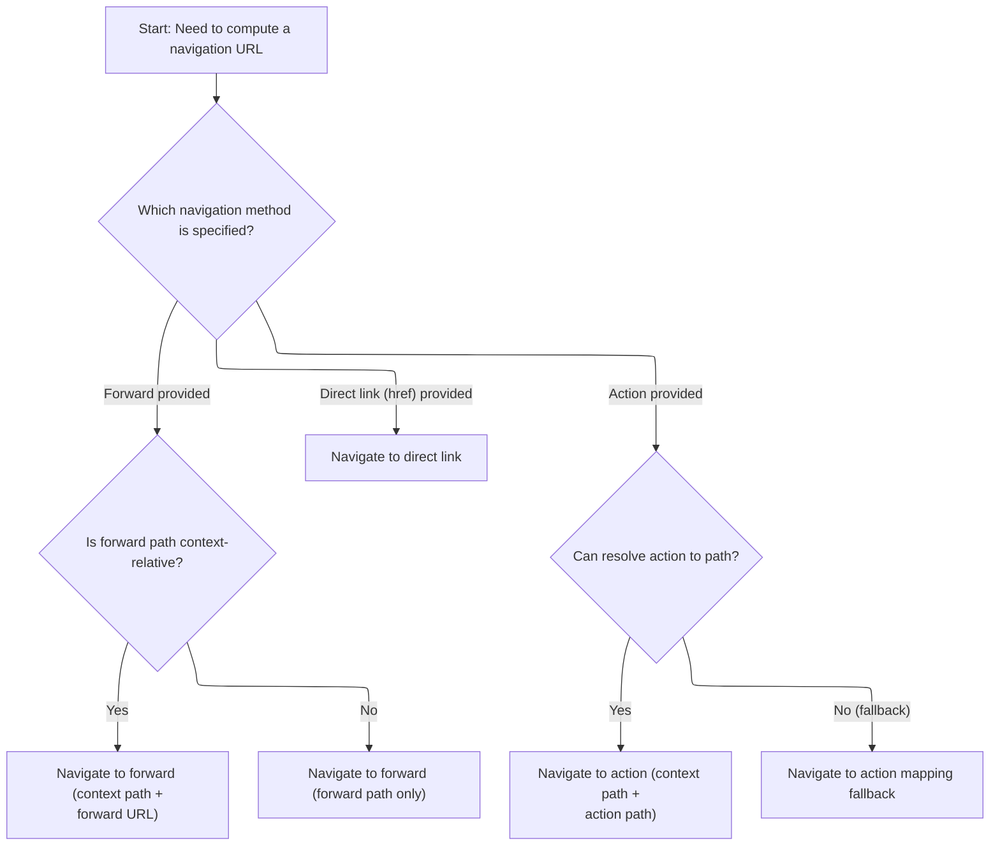

<SwmSnippet path="/taglib/src/main/java/org/apache/struts/taglib/TagUtils.java" line="405">

---

Back in <SwmToken path="taglib/src/main/java/org/apache/struts/taglib/html/RewriteTag.java" pos="66:11:11" line-data="            url = TagUtils.getInstance().computeURLWithCharEncoding(pageContext,">`computeURLWithCharEncoding`</SwmToken>, we grab the <SwmToken path="taglib/src/main/java/org/apache/struts/taglib/TagUtils.java" pos="407:1:1" line-data="        HttpServletRequest request =">`HttpServletRequest`</SwmToken> to get the context path and other request-specific info for building the URL.

```java
        // Calculate the appropriate URL
        StringBuffer url = new StringBuffer();
        HttpServletRequest request =
            (HttpServletRequest) pageContext.getRequest();

```

---

</SwmSnippet>

<SwmSnippet path="/taglib/src/main/java/org/apache/struts/taglib/TagUtils.java" line="410">

---

Back in <SwmToken path="taglib/src/main/java/org/apache/struts/taglib/html/RewriteTag.java" pos="66:11:11" line-data="            url = TagUtils.getInstance().computeURLWithCharEncoding(pageContext,">`computeURLWithCharEncoding`</SwmToken>, we check if the forward config exists. If not, we throw a localized error message using <SwmToken path="taglib/src/main/java/org/apache/struts/taglib/TagUtils.java" pos="34:10:10" line-data="import org.apache.struts.util.MessageResources;">`MessageResources`</SwmToken> for better debugging.

```java
        if (forward != null) {
            ForwardConfig forwardConfig =
                moduleConfig.findForwardConfig(forward);

            if (forwardConfig == null) {
                throw new MalformedURLException(messages.getMessage(
                        "computeURL.forward", forward));
            }

```

---

</SwmSnippet>

<SwmSnippet path="/taglib/src/main/java/org/apache/struts/taglib/TagUtils.java" line="419">

---

Back in <SwmToken path="taglib/src/main/java/org/apache/struts/taglib/html/RewriteTag.java" pos="66:11:11" line-data="            url = TagUtils.getInstance().computeURLWithCharEncoding(pageContext,">`computeURLWithCharEncoding`</SwmToken>, we call <SwmToken path="taglib/src/main/java/org/apache/struts/taglib/TagUtils.java" pos="426:5:5" line-data="                url.append(RequestUtils.forwardURL(request, forwardConfig,">`RequestUtils`</SwmToken> to handle servlet mapping and action config lookups, making sure the URL matches the servlet's routing rules.

```java
            // **** removed - see bug 37817 ****
            //  if (forwardConfig.getRedirect()) {
            //      redirect = true;
            //  }

            if (forwardConfig.getPath().startsWith("/")) {
                url.append(request.getContextPath());
                url.append(RequestUtils.forwardURL(request, forwardConfig,
                        moduleConfig));
            } else {
                url.append(forwardConfig.getPath());
            }
        } else if (href != null) {
            url.append(href);
        } else if (action != null) {
            ActionServlet servlet = (ActionServlet) pageContext.getServletContext().getAttribute(Globals.ACTION_SERVLET_KEY);
            String actionIdPath = RequestUtils.actionIdURL(action, moduleConfig, servlet);
```

---

</SwmSnippet>

<SwmSnippet path="/core/src/main/java/org/apache/struts/util/RequestUtils.java" line="1080">

---

<SwmToken path="core/src/main/java/org/apache/struts/util/RequestUtils.java" pos="1080:7:7" line-data="    public static String actionIdURL(String originalPath, ModuleConfig moduleConfig, ActionServlet servlet) {">`actionIdURL`</SwmToken> rewrites relative action paths based on servlet mapping and action config. It skips absolute paths, splits out query strings, and builds the new path according to the servlet mapping pattern.

```java
    public static String actionIdURL(String originalPath, ModuleConfig moduleConfig, ActionServlet servlet) {
        if (originalPath.startsWith("http") || originalPath.startsWith("/")) {
            return null;
        }

        // Split the forward path into the resource and query string;
        // it is possible a forward (or redirect) has added parameters.
        String actionId = null;
        String qs = null;
        int qpos = originalPath.indexOf("?");
        if (qpos == -1) {
            actionId = originalPath;
        } else {
            actionId = originalPath.substring(0, qpos);
            qs = originalPath.substring(qpos);
        }

        // Find the action of the given actionId
        ActionConfig actionConfig = moduleConfig.findActionConfigId(actionId);
        if (actionConfig == null) {
            if (log.isDebugEnabled()) {
                log.debug("No actionId found for " + actionId);
            }
            return null;
        }

        String path = actionConfig.getPath();
        String mapping = RequestUtils.getServletMapping(servlet);
        StringBuffer actionIdPath = new StringBuffer();

        // Form the path based on the servlet mapping pattern
        if (mapping.startsWith("*")) {
            actionIdPath.append(path);
            actionIdPath.append(mapping.substring(1));
        } else if (mapping.startsWith("/")) {  // implied ends with a *
            mapping = mapping.substring(0, mapping.length() - 1);
            if (mapping.endsWith("/") && path.startsWith("/")) {
                actionIdPath.append(mapping);
                actionIdPath.append(path.substring(1));
            } else {
                actionIdPath.append(mapping);
                actionIdPath.append(path);
            }
        } else {
            log.warn("Unknown servlet mapping pattern");
            actionIdPath.append(path);
        }

        // Lastly add any query parameters (the ? is part of the query string)
        if (qs != null) {
            actionIdPath.append(qs);
        }

        // Return the path
        if (log.isDebugEnabled()) {
            log.debug(originalPath + " unaliased to " + actionIdPath.toString());
        }
        return actionIdPath.toString();
    }
```

---

</SwmSnippet>

<SwmSnippet path="/taglib/src/main/java/org/apache/struts/taglib/TagUtils.java" line="436">

---

Back in <SwmToken path="taglib/src/main/java/org/apache/struts/taglib/html/RewriteTag.java" pos="66:11:11" line-data="            url = TagUtils.getInstance().computeURLWithCharEncoding(pageContext,">`computeURLWithCharEncoding`</SwmToken>, if <SwmToken path="taglib/src/main/java/org/apache/struts/taglib/TagUtils.java" pos="435:9:9" line-data="            String actionIdPath = RequestUtils.actionIdURL(action, moduleConfig, servlet);">`actionIdURL`</SwmToken> returns null, we use <SwmToken path="taglib/src/main/java/org/apache/struts/taglib/TagUtils.java" pos="441:7:7" line-data="                url.append(instance.getActionMappingURL(action, module,">`getActionMappingURL`</SwmToken> as a fallback to build the URL with module and servlet mapping info.

```java
            if (actionIdPath != null) {
                action = actionIdPath;
                url.append(request.getContextPath());
                url.append(actionIdPath);
            } else {
                url.append(instance.getActionMappingURL(action, module,
                        pageContext, false));
            }
```

---

</SwmSnippet>

### Building Action Mapping <SwmToken path="core/src/main/java/org/apache/struts/util/RequestUtils.java" pos="677:9:9" line-data="     * the case for URLs that were originally created from relative or">`URLs`</SwmToken>

```mermaid
%%{init: {"flowchart": {"defaultRenderer": "elk"}} }%%
flowchart TD
  node1["Start: Build action URL for user
navigation"]
  click node1 openCode "taglib/src/main/java/org/apache/struts/taglib/TagUtils.java:654:716"
  node1 --> node2{"Is application deployed in a
subdirectory?"}
  click node2 openCode "taglib/src/main/java/org/apache/struts/taglib/TagUtils.java:665:667"
  node2 -->|"Yes"| node3["Include application path in URL"]
  click node3 openCode "taglib/src/main/java/org/apache/struts/taglib/TagUtils.java:665:667"
  node2 -->|"No"| node4["Skip application path"]
  click node4 openCode "taglib/src/main/java/org/apache/struts/taglib/TagUtils.java:665:667"
  node3 --> node5{"Is this a multi-module app and not
context-relative?"}
  node4 --> node5
  click node5 openCode "taglib/src/main/java/org/apache/struts/taglib/TagUtils.java:671:673"
  node5 -->|"Yes"| node6["Add module prefix to URL"]
  click node6 openCode "taglib/src/main/java/org/apache/struts/taglib/TagUtils.java:671:673"
  node5 -->|"No"| node7["No module prefix needed"]
  click node7 openCode "taglib/src/main/java/org/apache/struts/taglib/TagUtils.java:671:673"
  node6 --> node8{"Is there a servlet mapping?"}
  node7 --> node8
  click node8 openCode "taglib/src/main/java/org/apache/struts/taglib/TagUtils.java:680:704"
  node8 -->|"Yes"| node9{"What kind of servlet mapping?"}
  click node9 openCode "taglib/src/main/java/org/apache/struts/taglib/TagUtils.java:690:699"
  node8 -->|"No"| node13{"Does action path start with '/'?"}
  click node13 openCode "taglib/src/main/java/org/apache/struts/taglib/TagUtils.java:708:710"
  node9 -->|"Extension mapping (e.g., *.do)"| node10["Append action mapping and extension"]
  click node10 openCode "taglib/src/main/java/org/apache/struts/taglib/TagUtils.java:691:692"
  node9 -->|"Path mapping (e.g., /app/*)"| node11["Append servlet path and action mapping"]
  click node11 openCode "taglib/src/main/java/org/apache/struts/taglib/TagUtils.java:694:696"
  node9 -->|"Root mapping (e.g., /)"| node12["Append action mapping only"]
  click node12 openCode "taglib/src/main/java/org/apache/struts/taglib/TagUtils.java:698:699"
  node10 --> node14{"Is there a query string?"}
  node11 --> node14
  node12 --> node14
  click node14 openCode "taglib/src/main/java/org/apache/struts/taglib/TagUtils.java:684:686"
  node14 -->|"Yes"| node15["Add query string to URL"]
  click node15 openCode "taglib/src/main/java/org/apache/struts/taglib/TagUtils.java:701:702"
  node14 -->|"No"| node16["No query string"]
  click node16 openCode "taglib/src/main/java/org/apache/struts/taglib/TagUtils.java:701:702"
  node15 --> node17["Return constructed URL"]
  node16 --> node17
  click node17 openCode "taglib/src/main/java/org/apache/struts/taglib/TagUtils.java:715:716"
  node13 -->|"No"| node18["Add leading slash to action"]
  click node18 openCode "taglib/src/main/java/org/apache/struts/taglib/TagUtils.java:709:710"
  node13 -->|"Yes"| node19["Action already has leading slash"]
  click node19 openCode "taglib/src/main/java/org/apache/struts/taglib/TagUtils.java:708:710"
  node18 --> node20["Append action to URL"]
  node19 --> node20
  click node20 openCode "taglib/src/main/java/org/apache/struts/taglib/TagUtils.java:712:713"
  node20 --> node17
  click node17 openCode "taglib/src/main/java/org/apache/struts/taglib/TagUtils.java:715:716"

classDef HeadingStyle fill:#777777,stroke:#333,stroke-width:2px;

%% Swimm:
%% %%{init: {"flowchart": {"defaultRenderer": "elk"}} }%%
%% flowchart TD
%%   node1["Start: Build action URL for user
%% navigation"]
%%   click node1 openCode "<SwmPath>[taglib/…/taglib/TagUtils.java](taglib/src/main/java/org/apache/struts/taglib/TagUtils.java)</SwmPath>:654:716"
%%   node1 --> node2{"Is application deployed in a
%% subdirectory?"}
%%   click node2 openCode "<SwmPath>[taglib/…/taglib/TagUtils.java](taglib/src/main/java/org/apache/struts/taglib/TagUtils.java)</SwmPath>:665:667"
%%   node2 -->|"Yes"| node3["Include application path in URL"]
%%   click node3 openCode "<SwmPath>[taglib/…/taglib/TagUtils.java](taglib/src/main/java/org/apache/struts/taglib/TagUtils.java)</SwmPath>:665:667"
%%   node2 -->|"No"| node4["Skip application path"]
%%   click node4 openCode "<SwmPath>[taglib/…/taglib/TagUtils.java](taglib/src/main/java/org/apache/struts/taglib/TagUtils.java)</SwmPath>:665:667"
%%   node3 --> node5{"Is this a multi-module app and not
%% <SwmToken path="taglib/src/main/java/org/apache/struts/taglib/TagUtils.java" pos="306:3:5" line-data="     *                    context-relative URI (if specified)">`context-relative`</SwmToken>?"}
%%   node4 --> node5
%%   click node5 openCode "<SwmPath>[taglib/…/taglib/TagUtils.java](taglib/src/main/java/org/apache/struts/taglib/TagUtils.java)</SwmPath>:671:673"
%%   node5 -->|"Yes"| node6["Add module prefix to URL"]
%%   click node6 openCode "<SwmPath>[taglib/…/taglib/TagUtils.java](taglib/src/main/java/org/apache/struts/taglib/TagUtils.java)</SwmPath>:671:673"
%%   node5 -->|"No"| node7["No module prefix needed"]
%%   click node7 openCode "<SwmPath>[taglib/…/taglib/TagUtils.java](taglib/src/main/java/org/apache/struts/taglib/TagUtils.java)</SwmPath>:671:673"
%%   node6 --> node8{"Is there a servlet mapping?"}
%%   node7 --> node8
%%   click node8 openCode "<SwmPath>[taglib/…/taglib/TagUtils.java](taglib/src/main/java/org/apache/struts/taglib/TagUtils.java)</SwmPath>:680:704"
%%   node8 -->|"Yes"| node9{"What kind of servlet mapping?"}
%%   click node9 openCode "<SwmPath>[taglib/…/taglib/TagUtils.java](taglib/src/main/java/org/apache/struts/taglib/TagUtils.java)</SwmPath>:690:699"
%%   node8 -->|"No"| node13{"Does action path start with '/'?"}
%%   click node13 openCode "<SwmPath>[taglib/…/taglib/TagUtils.java](taglib/src/main/java/org/apache/struts/taglib/TagUtils.java)</SwmPath>:708:710"
%%   node9 -->|"Extension mapping (e.g., *.do)"| node10["Append action mapping and extension"]
%%   click node10 openCode "<SwmPath>[taglib/…/taglib/TagUtils.java](taglib/src/main/java/org/apache/struts/taglib/TagUtils.java)</SwmPath>:691:692"
%%   node9 -->|"Path mapping (e.g., /app/*)"| node11["Append servlet path and action mapping"]
%%   click node11 openCode "<SwmPath>[taglib/…/taglib/TagUtils.java](taglib/src/main/java/org/apache/struts/taglib/TagUtils.java)</SwmPath>:694:696"
%%   node9 -->|"Root mapping (e.g., /)"| node12["Append action mapping only"]
%%   click node12 openCode "<SwmPath>[taglib/…/taglib/TagUtils.java](taglib/src/main/java/org/apache/struts/taglib/TagUtils.java)</SwmPath>:698:699"
%%   node10 --> node14{"Is there a query string?"}
%%   node11 --> node14
%%   node12 --> node14
%%   click node14 openCode "<SwmPath>[taglib/…/taglib/TagUtils.java](taglib/src/main/java/org/apache/struts/taglib/TagUtils.java)</SwmPath>:684:686"
%%   node14 -->|"Yes"| node15["Add query string to URL"]
%%   click node15 openCode "<SwmPath>[taglib/…/taglib/TagUtils.java](taglib/src/main/java/org/apache/struts/taglib/TagUtils.java)</SwmPath>:701:702"
%%   node14 -->|"No"| node16["No query string"]
%%   click node16 openCode "<SwmPath>[taglib/…/taglib/TagUtils.java](taglib/src/main/java/org/apache/struts/taglib/TagUtils.java)</SwmPath>:701:702"
%%   node15 --> node17["Return constructed URL"]
%%   node16 --> node17
%%   click node17 openCode "<SwmPath>[taglib/…/taglib/TagUtils.java](taglib/src/main/java/org/apache/struts/taglib/TagUtils.java)</SwmPath>:715:716"
%%   node13 -->|"No"| node18["Add leading slash to action"]
%%   click node18 openCode "<SwmPath>[taglib/…/taglib/TagUtils.java](taglib/src/main/java/org/apache/struts/taglib/TagUtils.java)</SwmPath>:709:710"
%%   node13 -->|"Yes"| node19["Action already has leading slash"]
%%   click node19 openCode "<SwmPath>[taglib/…/taglib/TagUtils.java](taglib/src/main/java/org/apache/struts/taglib/TagUtils.java)</SwmPath>:708:710"
%%   node18 --> node20["Append action to URL"]
%%   node19 --> node20
%%   click node20 openCode "<SwmPath>[taglib/…/taglib/TagUtils.java](taglib/src/main/java/org/apache/struts/taglib/TagUtils.java)</SwmPath>:712:713"
%%   node20 --> node17
%%   click node17 openCode "<SwmPath>[taglib/…/taglib/TagUtils.java](taglib/src/main/java/org/apache/struts/taglib/TagUtils.java)</SwmPath>:715:716"
%% 
%% classDef HeadingStyle fill:#777777,stroke:#333,stroke-width:2px;
```

<SwmSnippet path="/taglib/src/main/java/org/apache/struts/taglib/TagUtils.java" line="654">

---

In <SwmToken path="taglib/src/main/java/org/apache/struts/taglib/TagUtils.java" pos="654:5:5" line-data="    public String getActionMappingURL(String action, String module,">`getActionMappingURL`</SwmToken>, we build the action URL by combining the context path, module prefix, and servlet mapping. This handles all the routing details for Struts modules.

```java
    public String getActionMappingURL(String action, String module,
        PageContext pageContext, boolean contextRelative) {
        HttpServletRequest request =
            (HttpServletRequest) pageContext.getRequest();

```

---

</SwmSnippet>

<SwmSnippet path="/taglib/src/main/java/org/apache/struts/taglib/TagUtils.java" line="659">

---

Back in <SwmToken path="taglib/src/main/java/org/apache/struts/taglib/TagUtils.java" pos="441:7:7" line-data="                url.append(instance.getActionMappingURL(action, module,">`getActionMappingURL`</SwmToken>, we append the module prefix only if the URL isn't <SwmToken path="taglib/src/main/java/org/apache/struts/taglib/TagUtils.java" pos="306:3:5" line-data="     *                    context-relative URI (if specified)">`context-relative`</SwmToken>, and we handle query strings in the action argument to keep the URL accurate.

```java
        String contextPath = request.getContextPath();
        StringBuffer value = new StringBuffer();

        // Avoid setting two slashes at the beginning of an action:
        //  the length of contextPath should be more than 1
        //  in case of non-root context, otherwise length==1 (the slash)
        if (contextPath.length() > 1) {
            value.append(contextPath);
        }

        ModuleConfig moduleConfig = getModuleConfig(module, pageContext);

```

---

</SwmSnippet>

<SwmSnippet path="/taglib/src/main/java/org/apache/struts/taglib/TagUtils.java" line="671">

---

Back in <SwmToken path="taglib/src/main/java/org/apache/struts/taglib/TagUtils.java" pos="441:7:7" line-data="                url.append(instance.getActionMappingURL(action, module,">`getActionMappingURL`</SwmToken>, we branch based on the servlet mapping type to assemble the URL correctly, and we make sure to preserve any query strings in the action argument.

```java
        if ((moduleConfig != null) && (!contextRelative)) {
            value.append(moduleConfig.getPrefix());
        }

        // Use our servlet mapping, if one is specified
        String servletMapping =
            (String) pageContext.getAttribute(Globals.SERVLET_KEY,
                PageContext.APPLICATION_SCOPE);

        if (servletMapping != null) {
            String queryString = null;
            int question = action.indexOf("?");

            if (question >= 0) {
                queryString = action.substring(question);
            }

            String actionMapping = getActionMappingName(action);

            if (servletMapping.startsWith("*.")) {
                value.append(actionMapping);
                value.append(servletMapping.substring(1));
            } else if (servletMapping.endsWith("/*")) {
                value.append(servletMapping.substring(0,
                        servletMapping.length() - 2));
                value.append(actionMapping);
            } else if (servletMapping.equals("/")) {
                value.append(actionMapping);
            }

            if (queryString != null) {
                value.append(queryString);
            }
        }
        // Otherwise, assume extension mapping is in use and extension is
        // already included in the action property
        else {
            if (!action.startsWith("/")) {
                value.append("/");
            }

            value.append(action);
        }

        return value.toString();
    }
```

---

</SwmSnippet>

### Handling Page <SwmToken path="core/src/main/java/org/apache/struts/util/RequestUtils.java" pos="677:9:9" line-data="     * the case for URLs that were originally created from relative or">`URLs`</SwmToken> and Final Assembly

```mermaid
%%{init: {"flowchart": {"defaultRenderer": "elk"}} }%%
flowchart TD
    node1["Build base URL with context and page
path"]
    click node1 openCode "taglib/src/main/java/org/apache/struts/taglib/TagUtils.java:444:448"
    node1 --> node2{"Is anchor present?"}
    click node2 openCode "taglib/src/main/java/org/apache/struts/taglib/TagUtils.java:451:461"
    node2 -->|"Yes"| node3["Add anchor to URL"]
    click node3 openCode "taglib/src/main/java/org/apache/struts/taglib/TagUtils.java:451:461"
    node2 -->|"No"| node4{"Are parameters present?"}
    click node4 openCode "taglib/src/main/java/org/apache/struts/taglib/TagUtils.java:464:545"
    node3 --> node4
    node4 -->|"No"| node9["Return final URL"]
    click node9 openCode "taglib/src/main/java/org/apache/struts/taglib/TagUtils.java:552:552"
    node4 -->|"Yes"| node5["Save anchor and prepare for parameters"]
    click node5 openCode "taglib/src/main/java/org/apache/struts/taglib/TagUtils.java:465:475"
    node5 --> node6{"Choose parameter separator
(redirect/encodeSeparator)"}
    click node6 openCode "taglib/src/main/java/org/apache/struts/taglib/TagUtils.java:478:486"
    node6 --> node7["Add parameters to URL"]
    click node7 openCode "taglib/src/main/java/org/apache/struts/taglib/TagUtils.java:489:545"
    subgraph loop1["For each parameter"]
      node7 --> node8{"Parameter value type?"}
      click node8 openCode "taglib/src/main/java/org/apache/struts/taglib/TagUtils.java:492:544"
      node8 -->|"Null"| node10["Add key with no value"]
      click node10 openCode "taglib/src/main/java/org/apache/struts/taglib/TagUtils.java:496:506"
      node8 -->|"String"| node11["Add key=value"]
      click node11 openCode "taglib/src/main/java/org/apache/struts/taglib/TagUtils.java:507:517"
      node8 -->|"String array"| node12["Add key=value for each"]
      click node12 openCode "taglib/src/main/java/org/apache/struts/taglib/TagUtils.java:518:531"
      node8 -->|"Other"| node13["Add key=stringified value"]
      click node13 openCode "taglib/src/main/java/org/apache/struts/taglib/TagUtils.java:532:544"
      node10 --> node7
      node11 --> node7
      node12 --> node7
      node13 --> node7
    end
    node7 --> node14{"Was anchor present initially?"}
    click node14 openCode "taglib/src/main/java/org/apache/struts/taglib/TagUtils.java:548:551"
    node14 -->|"Yes"| node15["Add anchor again"]
    click node15 openCode "taglib/src/main/java/org/apache/struts/taglib/TagUtils.java:548:551"
    node14 -->|"No"| node9
    node15 --> node9
classDef HeadingStyle fill:#777777,stroke:#333,stroke-width:2px;

%% Swimm:
%% %%{init: {"flowchart": {"defaultRenderer": "elk"}} }%%
%% flowchart TD
%%     node1["Build base URL with context and page
%% path"]
%%     click node1 openCode "<SwmPath>[taglib/…/taglib/TagUtils.java](taglib/src/main/java/org/apache/struts/taglib/TagUtils.java)</SwmPath>:444:448"
%%     node1 --> node2{"Is anchor present?"}
%%     click node2 openCode "<SwmPath>[taglib/…/taglib/TagUtils.java](taglib/src/main/java/org/apache/struts/taglib/TagUtils.java)</SwmPath>:451:461"
%%     node2 -->|"Yes"| node3["Add anchor to URL"]
%%     click node3 openCode "<SwmPath>[taglib/…/taglib/TagUtils.java](taglib/src/main/java/org/apache/struts/taglib/TagUtils.java)</SwmPath>:451:461"
%%     node2 -->|"No"| node4{"Are parameters present?"}
%%     click node4 openCode "<SwmPath>[taglib/…/taglib/TagUtils.java](taglib/src/main/java/org/apache/struts/taglib/TagUtils.java)</SwmPath>:464:545"
%%     node3 --> node4
%%     node4 -->|"No"| node9["Return final URL"]
%%     click node9 openCode "<SwmPath>[taglib/…/taglib/TagUtils.java](taglib/src/main/java/org/apache/struts/taglib/TagUtils.java)</SwmPath>:552:552"
%%     node4 -->|"Yes"| node5["Save anchor and prepare for parameters"]
%%     click node5 openCode "<SwmPath>[taglib/…/taglib/TagUtils.java](taglib/src/main/java/org/apache/struts/taglib/TagUtils.java)</SwmPath>:465:475"
%%     node5 --> node6{"Choose parameter separator
%% (redirect/encodeSeparator)"}
%%     click node6 openCode "<SwmPath>[taglib/…/taglib/TagUtils.java](taglib/src/main/java/org/apache/struts/taglib/TagUtils.java)</SwmPath>:478:486"
%%     node6 --> node7["Add parameters to URL"]
%%     click node7 openCode "<SwmPath>[taglib/…/taglib/TagUtils.java](taglib/src/main/java/org/apache/struts/taglib/TagUtils.java)</SwmPath>:489:545"
%%     subgraph loop1["For each parameter"]
%%       node7 --> node8{"Parameter value type?"}
%%       click node8 openCode "<SwmPath>[taglib/…/taglib/TagUtils.java](taglib/src/main/java/org/apache/struts/taglib/TagUtils.java)</SwmPath>:492:544"
%%       node8 -->|"Null"| node10["Add key with no value"]
%%       click node10 openCode "<SwmPath>[taglib/…/taglib/TagUtils.java](taglib/src/main/java/org/apache/struts/taglib/TagUtils.java)</SwmPath>:496:506"
%%       node8 -->|"String"| node11["Add key=value"]
%%       click node11 openCode "<SwmPath>[taglib/…/taglib/TagUtils.java](taglib/src/main/java/org/apache/struts/taglib/TagUtils.java)</SwmPath>:507:517"
%%       node8 -->|"String array"| node12["Add key=value for each"]
%%       click node12 openCode "<SwmPath>[taglib/…/taglib/TagUtils.java](taglib/src/main/java/org/apache/struts/taglib/TagUtils.java)</SwmPath>:518:531"
%%       node8 -->|"Other"| node13["Add key=stringified value"]
%%       click node13 openCode "<SwmPath>[taglib/…/taglib/TagUtils.java](taglib/src/main/java/org/apache/struts/taglib/TagUtils.java)</SwmPath>:532:544"
%%       node10 --> node7
%%       node11 --> node7
%%       node12 --> node7
%%       node13 --> node7
%%     end
%%     node7 --> node14{"Was anchor present initially?"}
%%     click node14 openCode "<SwmPath>[taglib/…/taglib/TagUtils.java](taglib/src/main/java/org/apache/struts/taglib/TagUtils.java)</SwmPath>:548:551"
%%     node14 -->|"Yes"| node15["Add anchor again"]
%%     click node15 openCode "<SwmPath>[taglib/…/taglib/TagUtils.java](taglib/src/main/java/org/apache/struts/taglib/TagUtils.java)</SwmPath>:548:551"
%%     node14 -->|"No"| node9
%%     node15 --> node9
%% classDef HeadingStyle fill:#777777,stroke:#333,stroke-width:2px;
```

<SwmSnippet path="/taglib/src/main/java/org/apache/struts/taglib/TagUtils.java" line="444">

---

Back in <SwmToken path="taglib/src/main/java/org/apache/struts/taglib/html/RewriteTag.java" pos="66:11:11" line-data="            url = TagUtils.getInstance().computeURLWithCharEncoding(pageContext,">`computeURLWithCharEncoding`</SwmToken>, if we're building a page-based URL, we call <SwmToken path="taglib/src/main/java/org/apache/struts/taglib/TagUtils.java" pos="447:7:7" line-data="            url.append(this.pageURL(request, page, moduleConfig));">`pageURL`</SwmToken> to assemble it using the module config's page pattern and prefix.

```java
        } else /* if (page != null) */
         {
            url.append(request.getContextPath());
            url.append(this.pageURL(request, page, moduleConfig));
        }

```

---

</SwmSnippet>

<SwmSnippet path="/taglib/src/main/java/org/apache/struts/taglib/TagUtils.java" line="1031">

---

<SwmToken path="taglib/src/main/java/org/apache/struts/taglib/TagUtils.java" pos="1031:5:5" line-data="    public String pageURL(HttpServletRequest request, String page,">`pageURL`</SwmToken> builds the page URL using a pattern from the module config, replacing placeholders like $M (module prefix), $P (page), and $$ (literal $) for flexible URL formats.

```java
    public String pageURL(HttpServletRequest request, String page,
        ModuleConfig moduleConfig) {
        StringBuffer sb = new StringBuffer();
        String pagePattern =
            moduleConfig.getControllerConfig().getPagePattern();

        if (pagePattern == null) {
            sb.append(moduleConfig.getPrefix());
            sb.append(page);
        } else {
            boolean dollar = false;

            for (int i = 0; i < pagePattern.length(); i++) {
                char ch = pagePattern.charAt(i);

                if (dollar) {
                    switch (ch) {
                    case 'M':
                        sb.append(moduleConfig.getPrefix());

                        break;

                    case 'P':
                        sb.append(page);

                        break;

                    case '$':
                        sb.append('$');

                        break;

                    default:
                        ; // Silently swallow
                    }

                    dollar = false;

                    continue;
                } else if (ch == '$') {
                    dollar = true;
                } else {
                    sb.append(ch);
                }
            }
```

---

</SwmSnippet>

<SwmSnippet path="/taglib/src/main/java/org/apache/struts/taglib/TagUtils.java" line="450">

---

Back in <SwmToken path="taglib/src/main/java/org/apache/struts/taglib/html/RewriteTag.java" pos="66:11:11" line-data="            url = TagUtils.getInstance().computeURLWithCharEncoding(pageContext,">`computeURLWithCharEncoding`</SwmToken>, we add the anchor (if present) after building the main URL, making sure to encode it so special characters don't break the URL.

```java
        // Add anchor if requested (replacing any existing anchor)
        if (anchor != null) {
            String temp = url.toString();
            int hash = temp.indexOf('#');

            if (hash >= 0) {
                url.setLength(hash);
            }

            url.append('#');
            url.append(this.encodeURL(anchor, charEncoding));
        }

        // Add dynamic parameters if requested
        if ((params != null) && (params.size() > 0)) {
            // Save any existing anchor
            String temp = url.toString();
            int hash = temp.indexOf('#');

            if (hash >= 0) {
                anchor = temp.substring(hash + 1);
                url.setLength(hash);
                temp = url.toString();
            } else {
                anchor = null;
            }

            // Define the parameter separator
            String separator = null;

            if (redirect) {
                separator = "&";
            } else if (encodeSeparator) {
                separator = "&amp;";
            } else {
                separator = "&";
            }

            // Add the required request parameters
            boolean question = temp.indexOf('?') >= 0;
            Iterator keys = params.keySet().iterator();

            while (keys.hasNext()) {
                String key = (String) keys.next();
                Object value = params.get(key);

                if (value == null) {
                    if (!question) {
                        url.append('?');
                        question = true;
                    } else {
                        url.append(separator);
                    }

                    url.append(this.encodeURL(key, charEncoding));
                    url.append('='); // Interpret null as "no value"
                } else if (value instanceof String) {
                    if (!question) {
                        url.append('?');
                        question = true;
                    } else {
                        url.append(separator);
                    }

                    url.append(this.encodeURL(key, charEncoding));
                    url.append('=');
                    url.append(this.encodeURL((String) value, charEncoding));
                } else if (value instanceof String[]) {
                    String[] values = (String[]) value;

                    for (int i = 0; i < values.length; i++) {
                        if (!question) {
                            url.append('?');
                            question = true;
                        } else {
                            url.append(separator);
                        }

                        url.append(this.encodeURL(key, charEncoding));
                        url.append('=');
                        url.append(this.encodeURL(values[i], charEncoding));
                    }
                } else /* Convert other objects to a string */
                 {
                    if (!question) {
                        url.append('?');
                        question = true;
                    } else {
                        url.append(separator);
                    }

                    url.append(this.encodeURL(key, charEncoding));
                    url.append('=');
                    url.append(this.encodeURL(value.toString(), charEncoding));
                }
            }
```

---

</SwmSnippet>

<SwmSnippet path="/taglib/src/main/java/org/apache/struts/taglib/TagUtils.java" line="547">

---

After adding parameters, we re-append the anchor (if any) to the URL, encoding it again to avoid issues with special characters.

```java
            // Re-add the saved anchor (if any)
            if (anchor != null) {
                url.append('#');
                url.append(this.encodeURL(anchor, charEncoding));
            }
        }

```

---

</SwmSnippet>

### Encoding URL Components

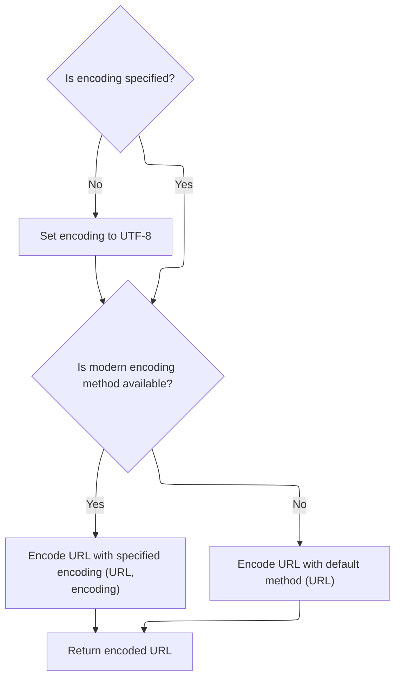

<SwmSnippet path="/taglib/src/main/java/org/apache/struts/taglib/TagUtils.java" line="590">

---

<SwmToken path="taglib/src/main/java/org/apache/struts/taglib/TagUtils.java" pos="590:5:5" line-data="    public String encodeURL(String url, String enc) {">`encodeURL`</SwmToken> just delegates to <SwmToken path="taglib/src/main/java/org/apache/struts/taglib/TagUtils.java" pos="591:3:5" line-data="        return ResponseUtils.encodeURL(url, enc);">`ResponseUtils.encodeURL`</SwmToken>, centralizing all the encoding logic and compatibility handling.

```java
    public String encodeURL(String url, String enc) {
        return ResponseUtils.encodeURL(url, enc);
    }
```

---

</SwmSnippet>

<SwmSnippet path="/core/src/main/java/org/apache/struts/util/ResponseUtils.java" line="163">

---

<SwmToken path="core/src/main/java/org/apache/struts/util/ResponseUtils.java" pos="163:7:7" line-data="    public static String encodeURL(String url, String enc) {">`encodeURL`</SwmToken> in <SwmToken path="taglib/src/main/java/org/apache/struts/taglib/TagUtils.java" pos="591:3:3" line-data="        return ResponseUtils.encodeURL(url, enc);">`ResponseUtils`</SwmToken> tries to use the Java <SwmToken path="core/src/main/java/org/apache/struts/util/ResponseUtils.java" pos="169:11:13" line-data="            // encode url with new 1.4 method and UTF-8 encoding">`1.4`</SwmToken> encode method via reflection for encoding with a specified charset, but falls back to the old <SwmToken path="core/src/main/java/org/apache/struts/util/ResponseUtils.java" pos="181:3:5" line-data="        return URLEncoder.encode(url);">`URLEncoder.encode`</SwmToken> if that's not available, always defaulting to <SwmToken path="core/src/main/java/org/apache/struts/util/ResponseUtils.java" pos="166:6:8" line-data="                enc = &quot;UTF-8&quot;;">`UTF-8`</SwmToken> if no encoding is given.

```java
    public static String encodeURL(String url, String enc) {
        try {
            if ((enc == null) || (enc.length() == 0)) {
                enc = "UTF-8";
            }

            // encode url with new 1.4 method and UTF-8 encoding
            if (encode != null) {
                return (String) encode.invoke(null, new Object[] { url, enc });
            }
        } catch (IllegalAccessException e) {
            log.debug("Could not find Java 1.4 encode method.  Using deprecated version.",
                e);
        } catch (InvocationTargetException e) {
            log.debug("Could not find Java 1.4 encode method. Using deprecated version.",
                e);
        }

        return URLEncoder.encode(url);
    }
```

---

</SwmSnippet>

### Session ID Encoding and Final URL Return

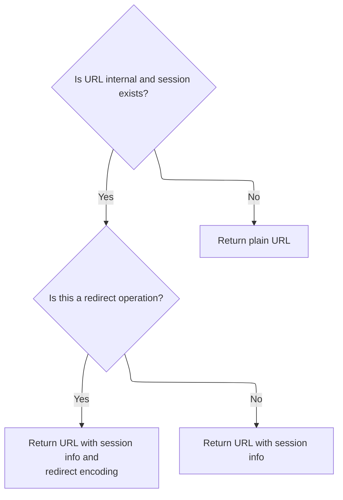

<SwmSnippet path="/taglib/src/main/java/org/apache/struts/taglib/TagUtils.java" line="554">

---

Back in TagUtils.computeURLWithCharEncoding, after encoding the main URL, we check if we need to rewrite the URL to include the session ID (if present) and whether we're dealing with a redirect. We call the response's <SwmToken path="taglib/src/main/java/org/apache/struts/taglib/TagUtils.java" pos="561:6:6" line-data="                return (response.encodeRedirectURL(url.toString()));">`encodeRedirectURL`</SwmToken> or <SwmToken path="taglib/src/main/java/org/apache/struts/taglib/TagUtils.java" pos="564:6:6" line-data="            return (response.encodeURL(url.toString()));">`encodeURL`</SwmToken> accordingly. If none of those apply, we just return the URL as-is. Next, we need to call <SwmToken path="core/src/main/java/org/apache/struts/chain/contexts/ServletActionContext.java" pos="39:4:4" line-data="public class ServletActionContext extends WebActionContext {">`ServletActionContext`</SwmToken> to get the servlet context objects for further processing, since the taglib code doesn't have direct access to the servlet API objects.

```java
        // Perform URL rewriting to include our session ID (if any)
        // but only if url is not an external URL
        if ((href == null) && (pageContext.getSession() != null)) {
            HttpServletResponse response =
                (HttpServletResponse) pageContext.getResponse();

            if (redirect) {
                return (response.encodeRedirectURL(url.toString()));
            }

            return (response.encodeURL(url.toString()));
        }

        return (url.toString());
    }
```

---

</SwmSnippet>

## Handling XHTML Output Option

<SwmSnippet path="/taglib/src/main/java/org/apache/struts/taglib/html/RewriteTag.java" line="68">

---

Back in RewriteTag.doEndTag, after building the URL, we check if the output should be XHTML-compliant by calling <SwmToken path="taglib/src/main/java/org/apache/struts/taglib/html/RewriteTag.java" pos="68:3:3" line-data="                    this.isXhtml(), useLocalEncoding);">`isXhtml`</SwmToken>. This affects how the tag renders its output. Next, we call BaseHandlerTag.isXhtml to actually determine the XHTML mode based on the page context.

```java
                    this.isXhtml(), useLocalEncoding);
```

---

</SwmSnippet>

## Delegating XHTML Mode Detection

<SwmSnippet path="/taglib/src/main/java/org/apache/struts/taglib/html/BaseHandlerTag.java" line="1174">

---

IsXhtml in <SwmToken path="taglib/src/main/java/org/apache/struts/taglib/html/BaseHandlerTag.java" pos="48:6:6" line-data="public abstract class BaseHandlerTag extends BodyTagSupport {">`BaseHandlerTag`</SwmToken> just delegates to <SwmToken path="taglib/src/main/java/org/apache/struts/taglib/html/BaseHandlerTag.java" pos="1175:3:7" line-data="        return TagUtils.getInstance().isXhtml(this.pageContext);">`TagUtils.getInstance()`</SwmToken><SwmToken path="taglib/src/main/java/org/apache/struts/taglib/html/BaseHandlerTag.java" pos="1175:8:9" line-data="        return TagUtils.getInstance().isXhtml(this.pageContext);">`.isXhtml`</SwmToken>, passing the page context. This keeps XHTML detection consistent across tags. Next, we call TagUtils.isXhtml to actually check the page context for the XHTML flag.

```java
    protected boolean isXhtml() {
        return TagUtils.getInstance().isXhtml(this.pageContext);
    }
```

---

</SwmSnippet>

## Checking XHTML Flag in Page Context

<SwmSnippet path="/taglib/src/main/java/org/apache/struts/taglib/TagUtils.java" line="838">

---

IsXhtml in <SwmToken path="taglib/src/main/java/org/apache/struts/taglib/html/RewriteTag.java" pos="49:1:1" line-data="            TagUtils.getInstance().computeParameters(pageContext, paramId,">`TagUtils`</SwmToken> tries to find the XHTML flag in the page context using lookup. If it finds 'true', it returns true; otherwise, false. If lookup fails, it logs and throws a runtime exception. Next, we call lookup to actually search for the flag in the context.

```java
    public boolean isXhtml(PageContext pageContext) {
        String xhtml;
        try {
            xhtml = (String) lookup(pageContext, Globals.XHTML_KEY, null);
            return "true".equalsIgnoreCase(xhtml);
        } catch (JspException e) {
            log.error("Failed xhtml lookup", e);
            throw new RuntimeException(e);
        }
    }
```

---

</SwmSnippet>

## Resolving Attribute Scope for Lookup

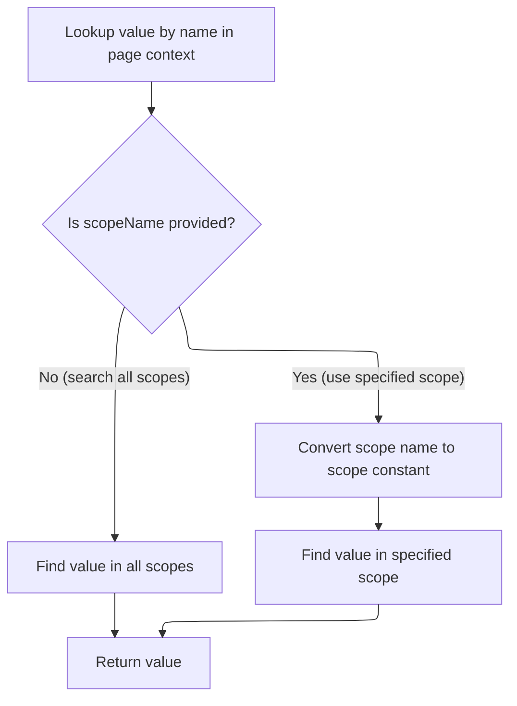

<SwmSnippet path="/taglib/src/main/java/org/apache/struts/taglib/TagUtils.java" line="863">

---

In lookup, if <SwmToken path="taglib/src/main/java/org/apache/struts/taglib/TagUtils.java" pos="863:19:19" line-data="    public Object lookup(PageContext pageContext, String name, String scopeName)">`scopeName`</SwmToken> is null, we use <SwmToken path="taglib/src/main/java/org/apache/struts/taglib/TagUtils.java" pos="866:5:5" line-data="            return pageContext.findAttribute(name);">`findAttribute`</SwmToken> to search all scopes for the attribute. If <SwmToken path="taglib/src/main/java/org/apache/struts/taglib/TagUtils.java" pos="863:19:19" line-data="    public Object lookup(PageContext pageContext, String name, String scopeName)">`scopeName`</SwmToken> is set, we resolve its integer value with <SwmToken path="taglib/src/main/java/org/apache/struts/taglib/TagUtils.java" pos="870:12:12" line-data="            return pageContext.getAttribute(name, instance.getScope(scopeName));">`getScope`</SwmToken> and use <SwmToken path="taglib/src/main/java/org/apache/struts/taglib/TagUtils.java" pos="870:5:5" line-data="            return pageContext.getAttribute(name, instance.getScope(scopeName));">`getAttribute`</SwmToken> for that specific scope. Next, we call <SwmToken path="taglib/src/main/java/org/apache/struts/taglib/TagUtils.java" pos="870:12:12" line-data="            return pageContext.getAttribute(name, instance.getScope(scopeName));">`getScope`</SwmToken> to translate the scope name to the right constant.

```java
    public Object lookup(PageContext pageContext, String name, String scopeName)
        throws JspException {
        if (scopeName == null) {
            return pageContext.findAttribute(name);
        }

        try {
            return pageContext.getAttribute(name, instance.getScope(scopeName));
```

---

</SwmSnippet>

<SwmSnippet path="/taglib/src/main/java/org/apache/struts/taglib/TagUtils.java" line="809">

---

GetScope lowercases the <SwmToken path="taglib/src/main/java/org/apache/struts/taglib/TagUtils.java" pos="809:9:9" line-data="    public int getScope(String scopeName)">`scopeName`</SwmToken> before looking it up in the scopes map, making the lookup case-insensitive. If the scope isn't found, it throws a <SwmToken path="taglib/src/main/java/org/apache/struts/taglib/TagUtils.java" pos="810:3:3" line-data="        throws JspException {">`JspException`</SwmToken> with a localized error message from <SwmToken path="taglib/src/main/java/org/apache/struts/taglib/TagUtils.java" pos="34:10:10" line-data="import org.apache.struts.util.MessageResources;">`MessageResources`</SwmToken>. If found, it returns the int value. Next, we call <SwmToken path="taglib/src/main/java/org/apache/struts/taglib/TagUtils.java" pos="34:10:10" line-data="import org.apache.struts.util.MessageResources;">`MessageResources`</SwmToken> to get the error message string for the exception.

```java
    public int getScope(String scopeName)
        throws JspException {
        Integer scope = (Integer) scopes.get(scopeName.toLowerCase());

        if (scope == null) {
            throw new JspException(messages.getMessage("lookup.scope", scope));
        }

        return scope.intValue();
    }
```

---

</SwmSnippet>

<SwmSnippet path="/taglib/src/main/java/org/apache/struts/taglib/TagUtils.java" line="871">

---

Back in lookup, if <SwmToken path="taglib/src/main/java/org/apache/struts/taglib/TagUtils.java" pos="809:5:5" line-data="    public int getScope(String scopeName)">`getScope`</SwmToken> or <SwmToken path="taglib/src/main/java/org/apache/struts/taglib/TagUtils.java" pos="278:7:7" line-data="                    (String) session.getAttribute(Globals.TRANSACTION_TOKEN_KEY);">`getAttribute`</SwmToken> throws a <SwmToken path="taglib/src/main/java/org/apache/struts/taglib/TagUtils.java" pos="871:6:6" line-data="        } catch (JspException e) {">`JspException`</SwmToken>, we catch it, save the exception in the page context for error handling, and then rethrow it. This makes sure the error is visible to error handlers. Next, we call <SwmToken path="taglib/src/main/java/org/apache/struts/taglib/TagUtils.java" pos="872:1:1" line-data="            saveException(pageContext, e);">`saveException`</SwmToken> to actually store the exception.

```java
        } catch (JspException e) {
            saveException(pageContext, e);
            throw e;
        }
    }
```

---

</SwmSnippet>

## Exception Handling During URL Generation

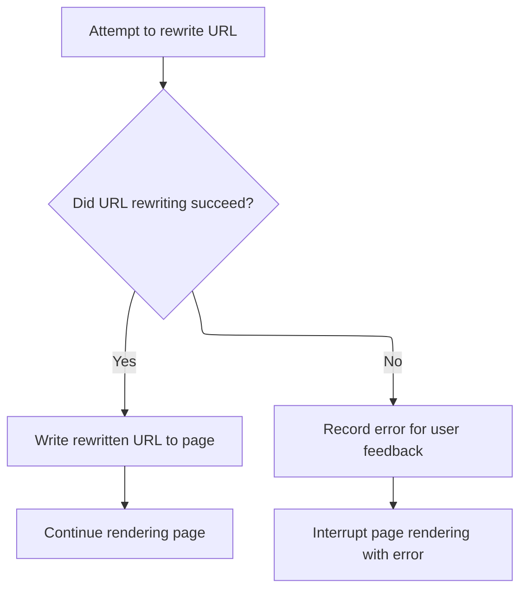

<SwmSnippet path="/taglib/src/main/java/org/apache/struts/taglib/html/RewriteTag.java" line="69">

---

Back in RewriteTag.doEndTag, if a <SwmToken path="taglib/src/main/java/org/apache/struts/taglib/html/RewriteTag.java" pos="69:6:6" line-data="        } catch (MalformedURLException e) {">`MalformedURLException`</SwmToken> is thrown, we catch it and call Tiles TagUtils.saveException to store the exception in the page context. This lets error handlers or Tiles infrastructure pick it up. Next, we call Tiles TagUtils.saveException to actually save the exception.

```java
        } catch (MalformedURLException e) {
            TagUtils.getInstance().saveException(pageContext, e);
```

---

</SwmSnippet>

<SwmSnippet path="/tiles/src/main/java/org/apache/struts/tiles/taglib/util/TagUtils.java" line="301">

---

SaveException in Tiles <SwmToken path="taglib/src/main/java/org/apache/struts/taglib/html/RewriteTag.java" pos="49:1:1" line-data="            TagUtils.getInstance().computeParameters(pageContext, paramId,">`TagUtils`</SwmToken> sets the exception as a request-scoped attribute using <SwmToken path="tiles/src/main/java/org/apache/struts/tiles/taglib/util/TagUtils.java" pos="302:5:7" line-data="        pageContext.setAttribute(Globals.EXCEPTION_KEY, exception, PageContext.REQUEST_SCOPE);">`Globals.EXCEPTION_KEY`</SwmToken>. This makes the exception available to error pages or handlers for the rest of the request. Next, we return to RewriteTag.doEndTag to throw a <SwmToken path="taglib/src/main/java/org/apache/struts/taglib/html/RewriteTag.java" pos="46:11:11" line-data="    public int doEndTag() throws JspException {">`JspException`</SwmToken> with a localized error message.

```java
    public static void saveException(PageContext pageContext, Throwable exception) {
        pageContext.setAttribute(Globals.EXCEPTION_KEY, exception, PageContext.REQUEST_SCOPE);
    }
```

---

</SwmSnippet>

<SwmSnippet path="/taglib/src/main/java/org/apache/struts/taglib/html/RewriteTag.java" line="71">

---

Back in RewriteTag.doEndTag, after saving the exception, we throw a new <SwmToken path="taglib/src/main/java/org/apache/struts/taglib/html/RewriteTag.java" pos="71:5:5" line-data="            throw new JspException(messages.getMessage(&quot;rewrite.url&quot;,">`JspException`</SwmToken> with a localized error message from <SwmToken path="taglib/src/main/java/org/apache/struts/taglib/TagUtils.java" pos="34:10:10" line-data="import org.apache.struts.util.MessageResources;">`MessageResources`</SwmToken>, including the exception details. This makes the error both visible and localizable. Next, we call <SwmToken path="taglib/src/main/java/org/apache/struts/taglib/TagUtils.java" pos="34:10:10" line-data="import org.apache.struts.util.MessageResources;">`MessageResources`</SwmToken> to get the error message string.

```java
            throw new JspException(messages.getMessage("rewrite.url",
                    e.toString()), e);
        }

```

---

</SwmSnippet>

<SwmSnippet path="/taglib/src/main/java/org/apache/struts/taglib/html/RewriteTag.java" line="75">

---

Back in RewriteTag.doEndTag, after all error handling, we call TagUtils.write to output the final URL to the page. Then we return <SwmToken path="taglib/src/main/java/org/apache/struts/taglib/html/RewriteTag.java" pos="76:4:4" line-data="        return (EVAL_PAGE);">`EVAL_PAGE`</SwmToken> to let the JSP engine keep processing the rest of the page. Next, we call TagUtils.write to actually print the URL.

```java
        TagUtils.getInstance().write(pageContext, url);
        return (EVAL_PAGE);
    }
```

---

</SwmSnippet>

# Outputting the Final URL to the JSP

<SwmSnippet path="/taglib/src/main/java/org/apache/struts/taglib/TagUtils.java" line="1186">

---

In write, we print the text to the JSP output using <SwmToken path="taglib/src/main/java/org/apache/struts/taglib/TagUtils.java" pos="1188:1:1" line-data="        JspWriter writer = pageContext.getOut();">`JspWriter`</SwmToken>. If there's an <SwmToken path="taglib/src/main/java/org/apache/struts/taglib/TagUtils.java" pos="1192:6:6" line-data="        } catch (IOException e) {">`IOException`</SwmToken>, we save the exception and throw a <SwmToken path="taglib/src/main/java/org/apache/struts/taglib/TagUtils.java" pos="1187:3:3" line-data="        throws JspException {">`JspException`</SwmToken>. Next, we call <SwmToken path="taglib/src/main/java/org/apache/struts/taglib/TagUtils.java" pos="1193:1:1" line-data="            saveException(pageContext, e);">`saveException`</SwmToken> to store the error for error handling.

```java
    public void write(PageContext pageContext, String text)
        throws JspException {
        JspWriter writer = pageContext.getOut();

        try {
            writer.print(text);
        } catch (IOException e) {
            saveException(pageContext, e);
```

---

</SwmSnippet>

<SwmSnippet path="/taglib/src/main/java/org/apache/struts/taglib/TagUtils.java" line="1194">

---

Back in write, if there's an <SwmToken path="taglib/src/main/java/org/apache/struts/taglib/TagUtils.java" pos="1192:6:6" line-data="        } catch (IOException e) {">`IOException`</SwmToken>, we throw a <SwmToken path="taglib/src/main/java/org/apache/struts/taglib/TagUtils.java" pos="1194:5:5" line-data="            throw new JspException(messages.getMessage(&quot;write.io&quot;, e.toString()), e);">`JspException`</SwmToken> with a localized error message from <SwmToken path="taglib/src/main/java/org/apache/struts/taglib/TagUtils.java" pos="34:10:10" line-data="import org.apache.struts.util.MessageResources;">`MessageResources`</SwmToken>. This keeps error reporting consistent and localizable.

```java
            throw new JspException(messages.getMessage("write.io", e.toString()), e);
        }
    }
```

---

</SwmSnippet>

&nbsp;

*This is an auto-generated document by Swimm 🌊 and has not yet been verified by a human*

<SwmMeta version="3.0.0" repo-id="Z2l0aHViJTNBJTNBc3RydXRzMSUzQSUzQVN3aW1tLURlbW8=" repo-name="struts1"><sup>Powered by [Swimm](https://app.swimm.io/)</sup></SwmMeta>
