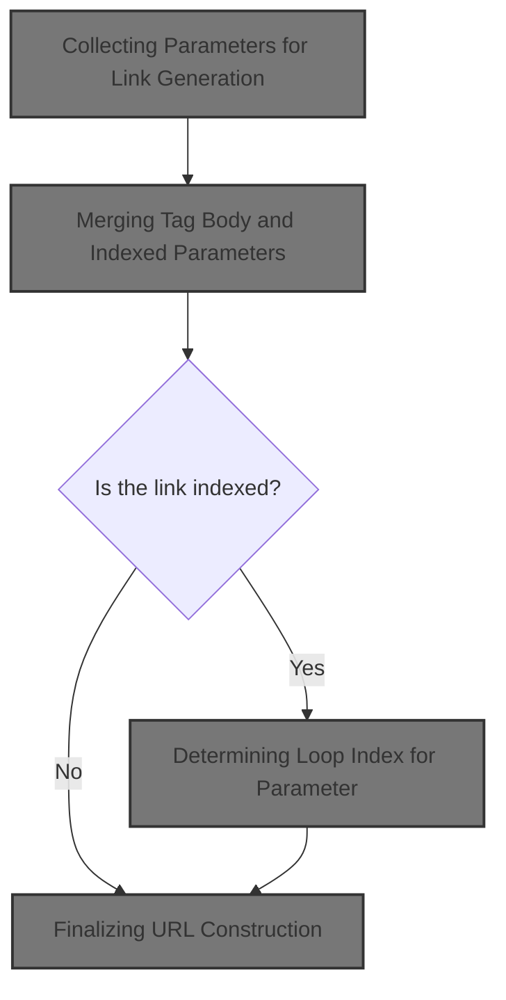
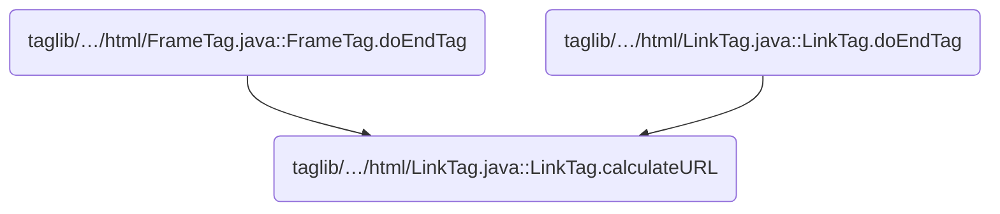
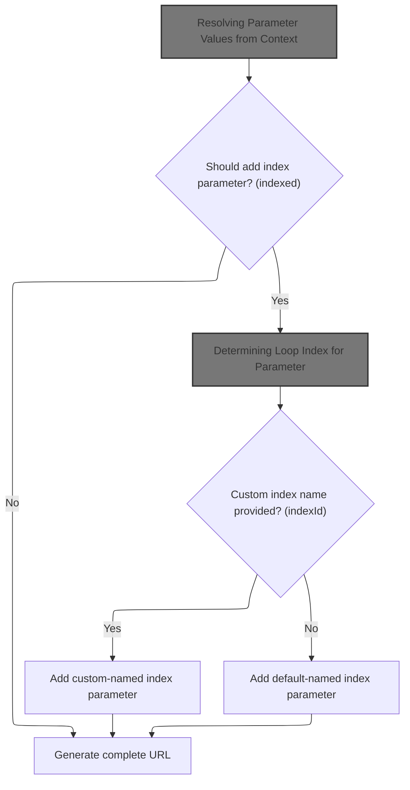
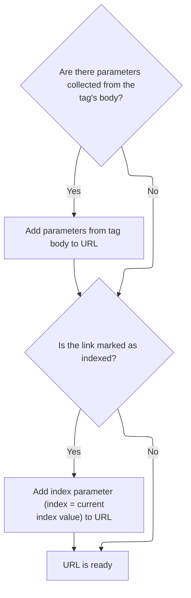
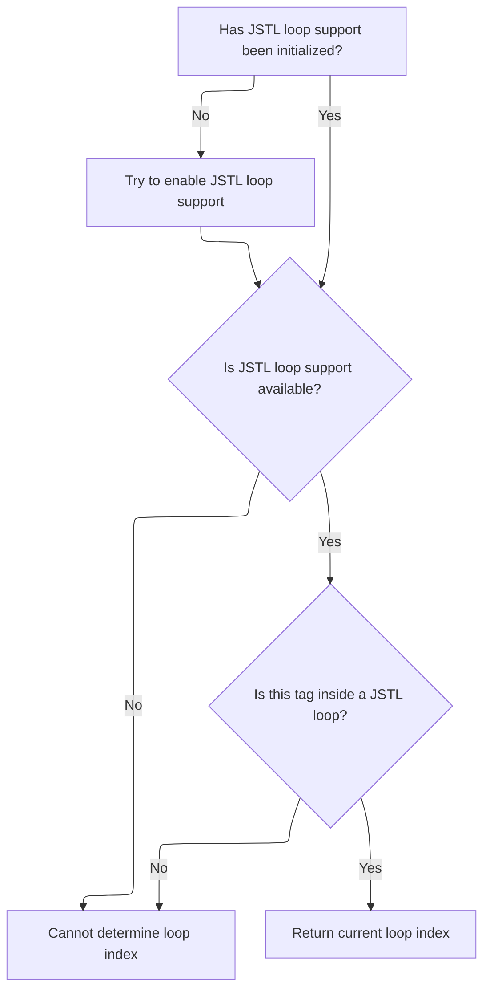
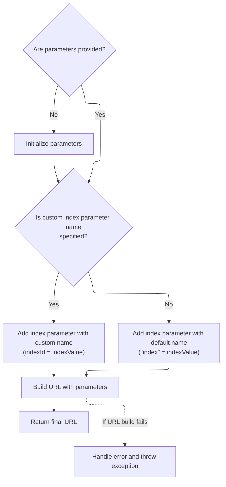

This document explains how a complete URL is generated for a link in a web page. Parameters are collected from various sources, and the current loop index is included when needed. The output is a URL ready for use in navigation or form submission.



# Where is this flow used?

This flow is used multiple times in the codebase as represented in the following diagram:



# Collecting Parameters for Link Generation



<SwmSnippet path="/taglib/src/main/java/org/apache/struts/taglib/html/LinkTag.java" line="409">

---

In <SwmToken path="taglib/src/main/java/org/apache/struts/taglib/html/LinkTag.java" pos="409:5:5" line-data="    protected String calculateURL()">`calculateURL`</SwmToken>, we're grabbing all the parameters needed for the link. We call <SwmToken path="taglib/src/main/java/org/apache/struts/taglib/html/LinkTag.java" pos="413:1:1" line-data="            TagUtils.getInstance().computeParameters(pageContext, paramId,">`TagUtils`</SwmToken> to centralize parameter handling, so any logic for extracting values from the page context or beans is handled in one place, not scattered across tags.

```java
    protected String calculateURL()
        throws JspException {
        // Identify the parameters we will add to the completed URL
        Map params =
            TagUtils.getInstance().computeParameters(pageContext, paramId,
                paramName, paramProperty, paramScope, name, property, scope,
                transaction);

```

---

</SwmSnippet>

## Resolving Parameter Values from Context

```mermaid
%%{init: {"flowchart": {"defaultRenderer": "elk"}} }%%
flowchart TD
    node1["Start: Request to build parameters map"] --> node2{"Are any parameters or transaction token
requested?"}
    click node1 openCode "taglib/src/main/java/org/apache/struts/taglib/TagUtils.java:190:195"
    node2 -->|"No"| node3["Return null"]
    click node2 openCode "taglib/src/main/java/org/apache/struts/taglib/TagUtils.java:195:197"
    click node3 openCode "taglib/src/main/java/org/apache/struts/taglib/TagUtils.java:196:197"
    node2 -->|"Yes"| node4["Prepare parameters map (include
multi-value parameters if available)"]
    click node4 openCode "taglib/src/main/java/org/apache/struts/taglib/TagUtils.java:200:225"
    node4 --> node5{"Are both single-value parameter fields
provided?"}
    click node5 openCode "taglib/src/main/java/org/apache/struts/taglib/TagUtils.java:228:229"
    node5 -->|"Yes"| node6["Add single-value parameter to map"]
    click node6 openCode "taglib/src/main/java/org/apache/struts/taglib/TagUtils.java:230:269"
    node5 -->|"No"| node7["Proceed without single-value parameter"]
    click node7 openCode "taglib/src/main/java/org/apache/struts/taglib/TagUtils.java:270:271"
    node6 --> node8{"Is transaction token requested?"}
    node7 --> node8
    click node8 openCode "taglib/src/main/java/org/apache/struts/taglib/TagUtils.java:272:284"
    node8 -->|"Yes"| node9["Add transaction token to map"]
    click node9 openCode "taglib/src/main/java/org/apache/struts/taglib/TagUtils.java:273:283"
    node8 -->|"No"| node10["Proceed without transaction token"]
    click node10 openCode "taglib/src/main/java/org/apache/struts/taglib/TagUtils.java:284:285"
    node9 --> node11["Return parameters map for tag"]
    node10 --> node11
    click node11 openCode "taglib/src/main/java/org/apache/struts/taglib/TagUtils.java:286:288"

classDef HeadingStyle fill:#777777,stroke:#333,stroke-width:2px;

%% Swimm:
%% %%{init: {"flowchart": {"defaultRenderer": "elk"}} }%%
%% flowchart TD
%%     node1["Start: Request to build parameters map"] --> node2{"Are any parameters or transaction token
%% requested?"}
%%     click node1 openCode "<SwmPath>[taglib/…/taglib/TagUtils.java](taglib/src/main/java/org/apache/struts/taglib/TagUtils.java)</SwmPath>:190:195"
%%     node2 -->|"No"| node3["Return null"]
%%     click node2 openCode "<SwmPath>[taglib/…/taglib/TagUtils.java](taglib/src/main/java/org/apache/struts/taglib/TagUtils.java)</SwmPath>:195:197"
%%     click node3 openCode "<SwmPath>[taglib/…/taglib/TagUtils.java](taglib/src/main/java/org/apache/struts/taglib/TagUtils.java)</SwmPath>:196:197"
%%     node2 -->|"Yes"| node4["Prepare parameters map (include
%% <SwmToken path="taglib/src/main/java/org/apache/struts/taglib/TagUtils.java" pos="199:13:15" line-data="        // Locate the Map containing our multi-value parameters map">`multi-value`</SwmToken> parameters if available)"]
%%     click node4 openCode "<SwmPath>[taglib/…/taglib/TagUtils.java](taglib/src/main/java/org/apache/struts/taglib/TagUtils.java)</SwmPath>:200:225"
%%     node4 --> node5{"Are both <SwmToken path="taglib/src/main/java/org/apache/struts/taglib/TagUtils.java" pos="227:7:9" line-data="        // Add the single-value parameter (if any)">`single-value`</SwmToken> parameter fields
%% provided?"}
%%     click node5 openCode "<SwmPath>[taglib/…/taglib/TagUtils.java](taglib/src/main/java/org/apache/struts/taglib/TagUtils.java)</SwmPath>:228:229"
%%     node5 -->|"Yes"| node6["Add <SwmToken path="taglib/src/main/java/org/apache/struts/taglib/TagUtils.java" pos="227:7:9" line-data="        // Add the single-value parameter (if any)">`single-value`</SwmToken> parameter to map"]
%%     click node6 openCode "<SwmPath>[taglib/…/taglib/TagUtils.java](taglib/src/main/java/org/apache/struts/taglib/TagUtils.java)</SwmPath>:230:269"
%%     node5 -->|"No"| node7["Proceed without <SwmToken path="taglib/src/main/java/org/apache/struts/taglib/TagUtils.java" pos="227:7:9" line-data="        // Add the single-value parameter (if any)">`single-value`</SwmToken> parameter"]
%%     click node7 openCode "<SwmPath>[taglib/…/taglib/TagUtils.java](taglib/src/main/java/org/apache/struts/taglib/TagUtils.java)</SwmPath>:270:271"
%%     node6 --> node8{"Is transaction token requested?"}
%%     node7 --> node8
%%     click node8 openCode "<SwmPath>[taglib/…/taglib/TagUtils.java](taglib/src/main/java/org/apache/struts/taglib/TagUtils.java)</SwmPath>:272:284"
%%     node8 -->|"Yes"| node9["Add transaction token to map"]
%%     click node9 openCode "<SwmPath>[taglib/…/taglib/TagUtils.java](taglib/src/main/java/org/apache/struts/taglib/TagUtils.java)</SwmPath>:273:283"
%%     node8 -->|"No"| node10["Proceed without transaction token"]
%%     click node10 openCode "<SwmPath>[taglib/…/taglib/TagUtils.java](taglib/src/main/java/org/apache/struts/taglib/TagUtils.java)</SwmPath>:284:285"
%%     node9 --> node11["Return parameters map for tag"]
%%     node10 --> node11
%%     click node11 openCode "<SwmPath>[taglib/…/taglib/TagUtils.java](taglib/src/main/java/org/apache/struts/taglib/TagUtils.java)</SwmPath>:286:288"
%% 
%% classDef HeadingStyle fill:#777777,stroke:#333,stroke-width:2px;
```



<SwmSnippet path="/taglib/src/main/java/org/apache/struts/taglib/TagUtils.java" line="190">

---

In <SwmToken path="taglib/src/main/java/org/apache/struts/taglib/TagUtils.java" pos="190:5:5" line-data="    public Map computeParameters(PageContext pageContext, String paramId,">`computeParameters`</SwmToken>, we're resolving parameter values from beans or scoped variables using lookup. This lets us support dynamic values, and we handle exceptions so errors are visible in the JSP context.

```java
    public Map computeParameters(PageContext pageContext, String paramId,
        String paramName, String paramProperty, String paramScope, String name,
        String property, String scope, boolean transaction)
        throws JspException {
        // Short circuit if no parameters are specified
        if ((paramId == null) && (name == null) && !transaction) {
            return (null);
        }

        // Locate the Map containing our multi-value parameters map
        Map map = null;

        try {
            if (name != null) {
                map = (Map) getInstance().lookup(pageContext, name, property,
                        scope);
            }

            // @TODO - remove this - it is never thrown
            //        } catch (ClassCastException e) {
            //            saveException(pageContext, e);
            //            throw new JspException(
            //                    messages.getMessage("parameters.multi", name, property, scope));
        } catch (JspException e) {
            saveException(pageContext, e);
            throw e;
        }

        // Create a Map to contain our results from the multi-value parameters
        Map results = null;

        if (map != null) {
            results = new HashMap(map);
        } else {
            results = new HashMap();
        }

        // Add the single-value parameter (if any)
        if ((paramId != null) && (paramName != null)) {
            Object paramValue = null;

            try {
                paramValue =
                    TagUtils.getInstance().lookup(pageContext, paramName,
                        paramProperty, paramScope);
            } catch (JspException e) {
                saveException(pageContext, e);
                throw e;
            }

```

---

</SwmSnippet>

<SwmSnippet path="/taglib/src/main/java/org/apache/struts/taglib/TagUtils.java" line="897">

---

<SwmToken path="taglib/src/main/java/org/apache/struts/taglib/TagUtils.java" pos="897:5:5" line-data="    public Object lookup(PageContext pageContext, String name, String property,">`lookup`</SwmToken> first finds the bean in the page context, then grabs a property if needed. If anything's missing or wrong, it throws a localized exception and logs it in the page context for debugging. There's extra logic for <SwmToken path="taglib/src/main/java/org/apache/struts/taglib/TagUtils.java" pos="949:4:6" line-data="            if (Constants.BEAN_KEY.equals(name)) {">`Constants.BEAN_KEY`</SwmToken> to make error messages clearer.

```java
    public Object lookup(PageContext pageContext, String name, String property,
        String scope) throws JspException {
        // Look up the requested bean, and return if requested
        Object bean = lookup(pageContext, name, scope);

        if (bean == null) {
            JspException e = null;

            if (scope == null) {
                e = new JspException(messages.getMessage("lookup.bean.any", name));
            } else {
                e = new JspException(messages.getMessage("lookup.bean", name,
                            scope));
            }

            saveException(pageContext, e);
            throw e;
        }

        if (property == null) {
            return bean;
        }

        // Locate and return the specified property
        try {
            return PropertyUtils.getProperty(bean, property);
        } catch (IllegalAccessException e) {
            saveException(pageContext, e);
            throw new JspException(messages.getMessage("lookup.access",
                    property, name), e);
        } catch (IllegalArgumentException e) {
            saveException(pageContext, e);
            throw new JspException(messages.getMessage("lookup.argument",
                    property, name), e);
        } catch (InvocationTargetException e) {
            Throwable t = e.getTargetException();

            if (t == null) {
                t = e;
            }

            saveException(pageContext, t);
            throw new JspException(messages.getMessage("lookup.target",
                    property, name), e);
        } catch (NoSuchMethodException e) {
            saveException(pageContext, e);

            String beanName = name;

            // Name defaults to Contants.BEAN_KEY if no name is specified by
            // an input tag. Thus lookup the bean under the key and use
            // its class name for the exception message.
            if (Constants.BEAN_KEY.equals(name)) {
                Object obj = pageContext.findAttribute(Constants.BEAN_KEY);

                if (obj != null) {
                    beanName = obj.getClass().getName();
                }
            }

            throw new JspException(messages.getMessage("lookup.method",
                    property, beanName), e);
        }
    }
```

---

</SwmSnippet>

<SwmSnippet path="/taglib/src/main/java/org/apache/struts/taglib/TagUtils.java" line="240">

---

After returning from <SwmToken path="taglib/src/main/java/org/apache/struts/taglib/html/LinkTag.java" pos="413:7:7" line-data="            TagUtils.getInstance().computeParameters(pageContext, paramId,">`computeParameters`</SwmToken>, we convert parameter values to strings, handle multiple values as arrays, and add the transaction token if needed. The result is a map ready for URL generation.

```java
            if (paramValue != null) {
                String paramString = null;

                if (paramValue instanceof String) {
                    paramString = (String) paramValue;
                } else {
                    paramString = paramValue.toString();
                }

                Object mapValue = results.get(paramId);

                if (mapValue == null) {
                    results.put(paramId, paramString);
                } else if (mapValue instanceof String[]) {
                    String[] oldValues = (String[]) mapValue;
                    String[] newValues = new String[oldValues.length + 1];

                    System.arraycopy(oldValues, 0, newValues, 0,
                        oldValues.length);
                    newValues[oldValues.length] = paramString;
                    results.put(paramId, newValues);
                } else {
                    String[] newValues = new String[2];

                    newValues[0] = mapValue.toString();
                    newValues[1] = paramString;
                    results.put(paramId, newValues);
                }
            }
        }

        // Add our transaction control token (if requested)
        if (transaction) {
            HttpSession session = pageContext.getSession();
            String token = null;

            if (session != null) {
                token =
                    (String) session.getAttribute(Globals.TRANSACTION_TOKEN_KEY);
            }

            if (token != null) {
                results.put(Constants.TOKEN_KEY, token);
            }
        }

        // Return the completed Map
        return (results);
    }
```

---

</SwmSnippet>

## Merging Tag Body and Indexed Parameters



<SwmSnippet path="/taglib/src/main/java/org/apache/struts/taglib/html/LinkTag.java" line="417">

---

Back in <SwmToken path="taglib/src/main/java/org/apache/struts/taglib/html/LinkTag.java" pos="409:5:5" line-data="    protected String calculateURL()">`calculateURL`</SwmToken>, after getting parameters from <SwmToken path="taglib/src/main/java/org/apache/struts/taglib/html/LinkTag.java" pos="413:1:1" line-data="            TagUtils.getInstance().computeParameters(pageContext, paramId,">`TagUtils`</SwmToken>, we merge any extra parameters from the tag body. If 'indexed' is set, we call <SwmToken path="taglib/src/main/java/org/apache/struts/taglib/html/LinkTag.java" pos="39:8:8" line-data="public class LinkTag extends BaseHandlerTag {">`BaseHandlerTag`</SwmToken> to get the current loop index for the link.

```java
        // Add parameters collected from the tag's inner body
        if (!this.parameters.isEmpty()) {
            if (params == null) {
                params = new HashMap();
            }
            params.putAll(this.parameters);
        }

        // if "indexed=true", add "index=x" parameter to query string
        // * @since Struts 1.1
        if (indexed) {
            int indexValue = getIndexValue();

```

---

</SwmSnippet>

## Determining Loop Index for Parameter

<SwmSnippet path="/taglib/src/main/java/org/apache/struts/taglib/html/BaseHandlerTag.java" line="935">

---

In <SwmToken path="taglib/src/main/java/org/apache/struts/taglib/html/BaseHandlerTag.java" pos="935:5:5" line-data="    protected int getIndexValue()">`getIndexValue`</SwmToken>, we check if the tag is inside an <SwmToken path="taglib/src/main/java/org/apache/struts/taglib/html/BaseHandlerTag.java" pos="938:1:1" line-data="        IterateTag iterateTag =">`IterateTag`</SwmToken>. If so, we grab its index. If not, we try JSTL loop context next. This is how we figure out which loop iteration the link belongs to.

```java
    protected int getIndexValue()
        throws JspException {
        // look for outer iterate tag
        IterateTag iterateTag =
            (IterateTag) findAncestorWithClass(this, IterateTag.class);

        if (iterateTag != null) {
            return iterateTag.getIndex();
        }

```

---

</SwmSnippet>

<SwmSnippet path="/taglib/src/main/java/org/apache/struts/taglib/logic/IterateTag.java" line="159">

---

<SwmToken path="taglib/src/main/java/org/apache/struts/taglib/logic/IterateTag.java" pos="159:5:5" line-data="    public int getIndex() {">`getIndex`</SwmToken> checks if iteration has started. If yes, it calculates the index using offset and count; if not, it returns zero. This lets us know which loop item we're on.

```java
    public int getIndex() {
        if (started) {
            return ((offsetValue + lengthCount) - 1);
        } else {
            return (0);
        }
    }
```

---

</SwmSnippet>

<SwmSnippet path="/taglib/src/main/java/org/apache/struts/taglib/html/BaseHandlerTag.java" line="945">

---

After returning from <SwmToken path="taglib/src/main/java/org/apache/struts/taglib/html/BaseHandlerTag.java" pos="869:6:6" line-data="                    loopTagStatusClass.getDeclaredMethod(&quot;getIndex&quot;, null);">`getIndex`</SwmToken> in <SwmToken path="taglib/src/main/java/org/apache/struts/taglib/html/BaseHandlerTag.java" pos="938:1:1" line-data="        IterateTag iterateTag =">`IterateTag`</SwmToken>, if no index is found, we call <SwmToken path="taglib/src/main/java/org/apache/struts/taglib/html/BaseHandlerTag.java" pos="946:7:7" line-data="        Integer i = getJstlLoopIndex();">`getJstlLoopIndex`</SwmToken> in <SwmToken path="taglib/src/main/java/org/apache/struts/taglib/html/LinkTag.java" pos="39:8:8" line-data="public class LinkTag extends BaseHandlerTag {">`BaseHandlerTag`</SwmToken> to check for JSTL loop context. If that's missing, we bail out with an exception.

```java
        // Look for JSTL loops
        Integer i = getJstlLoopIndex();

        if (i != null) {
            return i.intValue();
        }

```

---

</SwmSnippet>

### Extracting JSTL Loop Index via Reflection



<SwmSnippet path="/taglib/src/main/java/org/apache/struts/taglib/html/BaseHandlerTag.java" line="852">

---

<SwmToken path="taglib/src/main/java/org/apache/struts/taglib/html/BaseHandlerTag.java" pos="852:5:5" line-data="    private Integer getJstlLoopIndex() {">`getJstlLoopIndex`</SwmToken> uses reflection to load JSTL loop classes and methods only if they're present. It finds the ancestor loop tag, grabs its status, and extracts the index. If JSTL isn't loaded, we skip this step.

```java
    private Integer getJstlLoopIndex() {
        if (!triedJstlInit) {
            triedJstlInit = true;

            try {
                loopTagClass =
                    RequestUtils.applicationClass(
                        "javax.servlet.jsp.jstl.core.LoopTag");

                loopTagGetStatus =
                    loopTagClass.getDeclaredMethod("getLoopStatus", null);

                loopTagStatusClass =
                    RequestUtils.applicationClass(
                        "javax.servlet.jsp.jstl.core.LoopTagStatus");

                loopTagStatusGetIndex =
                    loopTagStatusClass.getDeclaredMethod("getIndex", null);

                triedJstlSuccess = true;
            } catch (ClassNotFoundException ex) {
                // These just mean that JSTL isn't loaded, so ignore
            } catch (NoSuchMethodException ex) {
            }
        }

        if (triedJstlSuccess) {
            try {
                Object loopTag =
                    findAncestorWithClass(this, loopTagClass);

                if (loopTag == null) {
                    return null;
                }

                Object status = loopTagGetStatus.invoke(loopTag, null);

                return (Integer) loopTagStatusGetIndex.invoke(status, null);
            } catch (IllegalAccessException ex) {
                log.error(ex.getMessage(), ex);
            } catch (IllegalArgumentException ex) {
                log.error(ex.getMessage(), ex);
            } catch (InvocationTargetException ex) {
                log.error(ex.getMessage(), ex);
            } catch (NullPointerException ex) {
                log.error(ex.getMessage(), ex);
            } catch (ExceptionInInitializerError ex) {
                log.error(ex.getMessage(), ex);
            }
        }

        return null;
    }
```

---

</SwmSnippet>

<SwmSnippet path="/faces/src/main/java/org/apache/struts/faces/taglib/CommandLinkTag.java" line="356">

---

<SwmToken path="faces/src/main/java/org/apache/struts/faces/taglib/CommandLinkTag.java" pos="356:5:5" line-data="    public Object invoke(FacesContext context, Object params[]) {">`invoke`</SwmToken> just returns the stored outcome, ignoring the context and params. It's a minimal accessor, not a real invocation, so the arguments don't matter.

```java
    public Object invoke(FacesContext context, Object params[]) {
        return (this.outcome);
    }
```

---

</SwmSnippet>

### Handling Missing Loop Context

<SwmSnippet path="/taglib/src/main/java/org/apache/struts/taglib/html/BaseHandlerTag.java" line="952">

---

After returning from <SwmToken path="taglib/src/main/java/org/apache/struts/taglib/html/BaseHandlerTag.java" pos="852:5:5" line-data="    private Integer getJstlLoopIndex() {">`getJstlLoopIndex`</SwmToken> in <SwmToken path="taglib/src/main/java/org/apache/struts/taglib/html/LinkTag.java" pos="39:8:8" line-data="public class LinkTag extends BaseHandlerTag {">`BaseHandlerTag`</SwmToken>, if no loop context is found, we throw an exception and log it. The tag must be inside a loop to work.

```java
        // this tag should be nested in an IterateTag or JSTL loop tag, if it's not, throw exception
        JspException e =
            new JspException(messages.getMessage("indexed.noEnclosingIterate"));

        TagUtils.getInstance().saveException(pageContext, e);
        throw e;
    }
```

---

</SwmSnippet>

## Finalizing URL Construction



<SwmSnippet path="/taglib/src/main/java/org/apache/struts/taglib/html/LinkTag.java" line="430">

---

After returning from <SwmToken path="taglib/src/main/java/org/apache/struts/taglib/html/LinkTag.java" pos="39:8:8" line-data="public class LinkTag extends BaseHandlerTag {">`BaseHandlerTag`</SwmToken>, we add the index parameter to the map, then call <SwmToken path="taglib/src/main/java/org/apache/struts/taglib/html/LinkTag.java" pos="445:5:5" line-data="            url = TagUtils.getInstance().computeURLWithCharEncoding(pageContext,">`TagUtils`</SwmToken> to build the final URL. If anything goes wrong, we log the exception and throw it up.

```java
            //calculate index, and add as a parameter
            if (params == null) {
                params = new HashMap(); //create new HashMap if no other params
            }

            if (indexId != null) {
                params.put(indexId, Integer.toString(indexValue));
            } else {
                params.put("index", Integer.toString(indexValue));
            }
        }

        String url = null;

        try {
            url = TagUtils.getInstance().computeURLWithCharEncoding(pageContext,
                    forward, href, page, action, module, params, anchor, false,
                    useLocalEncoding);
        } catch (MalformedURLException e) {
            TagUtils.getInstance().saveException(pageContext, e);
            throw new JspException(messages.getMessage("rewrite.url",
                    e.toString()), e);
        }

        return (url);
    }
```

---

</SwmSnippet>

&nbsp;

*This is an auto-generated document by Swimm 🌊 and has not yet been verified by a human*

<SwmMeta version="3.0.0" repo-id="Z2l0aHViJTNBJTNBc3RydXRzMSUzQSUzQVN3aW1tLURlbW8=" repo-name="struts1"><sup>Powered by [Swimm](https://app.swimm.io/)</sup></SwmMeta>
