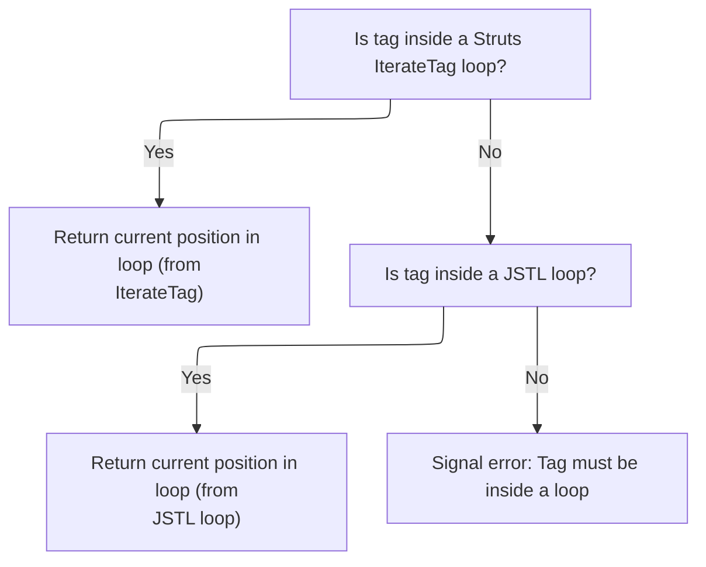

This document describes how indexed property strings are generated for form fields within repeated structures. Each field is uniquely identified based on its position in the loop, ensuring accurate mapping of submitted data to server-side objects.

# Building the Indexed Handler String

<SwmSnippet path="/taglib/src/main/java/org/apache/struts/taglib/html/BaseHandlerTag.java" line="913">

---

In <SwmToken path="taglib/src/main/java/org/apache/struts/taglib/html/BaseHandlerTag.java" pos="913:5:5" line-data="    protected void prepareIndex(StringBuffer handlers, String name)">`prepareIndex`</SwmToken>, we start building the indexed property string by appending the filtered name and an opening bracket. Next, we call <SwmToken path="taglib/src/main/java/org/apache/struts/taglib/html/BaseHandlerTag.java" pos="920:5:5" line-data="        handlers.append(getIndexValue());">`getIndexValue`</SwmToken> to fetch the current loop index, which is needed to complete the property reference for form fields.

```java
    protected void prepareIndex(StringBuffer handlers, String name)
        throws JspException {
        if (name != null) {
            handlers.append(TagUtils.getInstance().filter(name));
        }

        handlers.append("[");
        handlers.append(getIndexValue());
```

---

</SwmSnippet>

## Resolving the Current Loop Index



<SwmSnippet path="/taglib/src/main/java/org/apache/struts/taglib/html/BaseHandlerTag.java" line="935">

---

In <SwmToken path="taglib/src/main/java/org/apache/struts/taglib/html/BaseHandlerTag.java" pos="935:5:5" line-data="    protected int getIndexValue()">`getIndexValue`</SwmToken>, we first check if the tag is inside a Struts <SwmToken path="taglib/src/main/java/org/apache/struts/taglib/html/BaseHandlerTag.java" pos="938:1:1" line-data="        IterateTag iterateTag =">`IterateTag`</SwmToken> and use its index if found. If not, we call <SwmToken path="taglib/src/main/java/org/apache/struts/taglib/html/BaseHandlerTag.java" pos="946:7:7" line-data="        Integer i = getJstlLoopIndex();">`getJstlLoopIndex`</SwmToken> to see if we're inside a JSTL loop, so we can still resolve the current index for the property string.

```java
    protected int getIndexValue()
        throws JspException {
        // look for outer iterate tag
        IterateTag iterateTag =
            (IterateTag) findAncestorWithClass(this, IterateTag.class);

        if (iterateTag != null) {
            return iterateTag.getIndex();
        }

        // Look for JSTL loops
        Integer i = getJstlLoopIndex();

        if (i != null) {
            return i.intValue();
        }

```

---

</SwmSnippet>

<SwmSnippet path="/taglib/src/main/java/org/apache/struts/taglib/html/BaseHandlerTag.java" line="852">

---

<SwmToken path="taglib/src/main/java/org/apache/struts/taglib/html/BaseHandlerTag.java" pos="852:5:5" line-data="    private Integer getJstlLoopIndex() {">`getJstlLoopIndex`</SwmToken> sets up reflection access to JSTL loop classes and methods only once, then tries to find a JSTL <SwmToken path="taglib/src/main/java/org/apache/struts/taglib/html/BaseHandlerTag.java" pos="859:12:12" line-data="                        &quot;javax.servlet.jsp.jstl.core.LoopTag&quot;);">`LoopTag`</SwmToken> ancestor and call <SwmToken path="taglib/src/main/java/org/apache/struts/taglib/html/BaseHandlerTag.java" pos="862:6:6" line-data="                    loopTagClass.getDeclaredMethod(&quot;getLoopStatus&quot;, null);">`getLoopStatus`</SwmToken> and <SwmToken path="taglib/src/main/java/org/apache/struts/taglib/html/BaseHandlerTag.java" pos="869:6:6" line-data="                    loopTagStatusClass.getDeclaredMethod(&quot;getIndex&quot;, null);">`getIndex`</SwmToken> via reflection. If successful, it returns the current loop index; otherwise, it returns null. This only works if the tag is nested inside a JSTL loop.

```java
    private Integer getJstlLoopIndex() {
        if (!triedJstlInit) {
            triedJstlInit = true;

            try {
                loopTagClass =
                    RequestUtils.applicationClass(
                        "javax.servlet.jsp.jstl.core.LoopTag");

                loopTagGetStatus =
                    loopTagClass.getDeclaredMethod("getLoopStatus", null);

                loopTagStatusClass =
                    RequestUtils.applicationClass(
                        "javax.servlet.jsp.jstl.core.LoopTagStatus");

                loopTagStatusGetIndex =
                    loopTagStatusClass.getDeclaredMethod("getIndex", null);

                triedJstlSuccess = true;
            } catch (ClassNotFoundException ex) {
                // These just mean that JSTL isn't loaded, so ignore
            } catch (NoSuchMethodException ex) {
            }
        }

        if (triedJstlSuccess) {
            try {
                Object loopTag =
                    findAncestorWithClass(this, loopTagClass);

                if (loopTag == null) {
                    return null;
                }

                Object status = loopTagGetStatus.invoke(loopTag, null);

                return (Integer) loopTagStatusGetIndex.invoke(status, null);
            } catch (IllegalAccessException ex) {
                log.error(ex.getMessage(), ex);
            } catch (IllegalArgumentException ex) {
                log.error(ex.getMessage(), ex);
            } catch (InvocationTargetException ex) {
                log.error(ex.getMessage(), ex);
            } catch (NullPointerException ex) {
                log.error(ex.getMessage(), ex);
            } catch (ExceptionInInitializerError ex) {
                log.error(ex.getMessage(), ex);
            }
        }

        return null;
    }
```

---

</SwmSnippet>

<SwmSnippet path="/taglib/src/main/java/org/apache/struts/taglib/html/BaseHandlerTag.java" line="952">

---

Back in <SwmToken path="taglib/src/main/java/org/apache/struts/taglib/html/BaseHandlerTag.java" pos="920:5:5" line-data="        handlers.append(getIndexValue());">`getIndexValue`</SwmToken>, if neither a Struts <SwmToken path="taglib/src/main/java/org/apache/struts/taglib/html/BaseHandlerTag.java" pos="952:17:17" line-data="        // this tag should be nested in an IterateTag or JSTL loop tag, if it&#39;s not, throw exception">`IterateTag`</SwmToken> nor a JSTL loop index was found (<SwmToken path="taglib/src/main/java/org/apache/struts/taglib/html/BaseHandlerTag.java" pos="852:5:5" line-data="    private Integer getJstlLoopIndex() {">`getJstlLoopIndex`</SwmToken> returned null), we throw a <SwmToken path="taglib/src/main/java/org/apache/struts/taglib/html/BaseHandlerTag.java" pos="953:1:1" line-data="        JspException e =">`JspException`</SwmToken> to indicate the tag isn't properly nested, and log the error for debugging.

```java
        // this tag should be nested in an IterateTag or JSTL loop tag, if it's not, throw exception
        JspException e =
            new JspException(messages.getMessage("indexed.noEnclosingIterate"));

        TagUtils.getInstance().saveException(pageContext, e);
        throw e;
    }
```

---

</SwmSnippet>

## Finalizing the Indexed Handler String

<SwmSnippet path="/taglib/src/main/java/org/apache/struts/taglib/html/BaseHandlerTag.java" line="921">

---

Back in <SwmToken path="taglib/src/main/java/org/apache/struts/taglib/html/BaseHandlerTag.java" pos="913:5:5" line-data="    protected void prepareIndex(StringBuffer handlers, String name)">`prepareIndex`</SwmToken>, after getting the index from <SwmToken path="taglib/src/main/java/org/apache/struts/taglib/html/BaseHandlerTag.java" pos="920:5:5" line-data="        handlers.append(getIndexValue());">`getIndexValue`</SwmToken>, we close the bracket and, if a name was provided, append a dot. This shapes the property string for use in form field names like foo\[3\].bar.

```java
        handlers.append("]");

        if (name != null) {
            handlers.append(".");
        }
    }
```

---

</SwmSnippet>

&nbsp;

*This is an auto-generated document by Swimm 🌊 and has not yet been verified by a human*

<SwmMeta version="3.0.0" repo-id="Z2l0aHViJTNBJTNBc3RydXRzMSUzQSUzQVN3aW1tLURlbW8=" repo-name="struts1"><sup>Powered by [Swimm](https://app.swimm.io/)</sup></SwmMeta>
