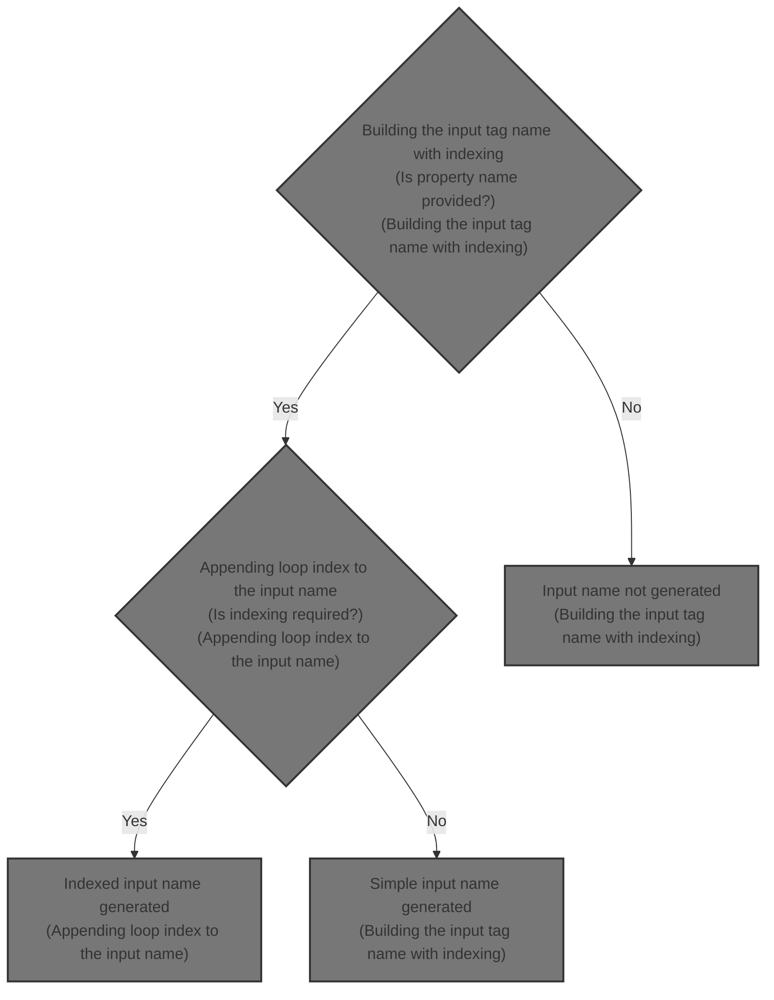
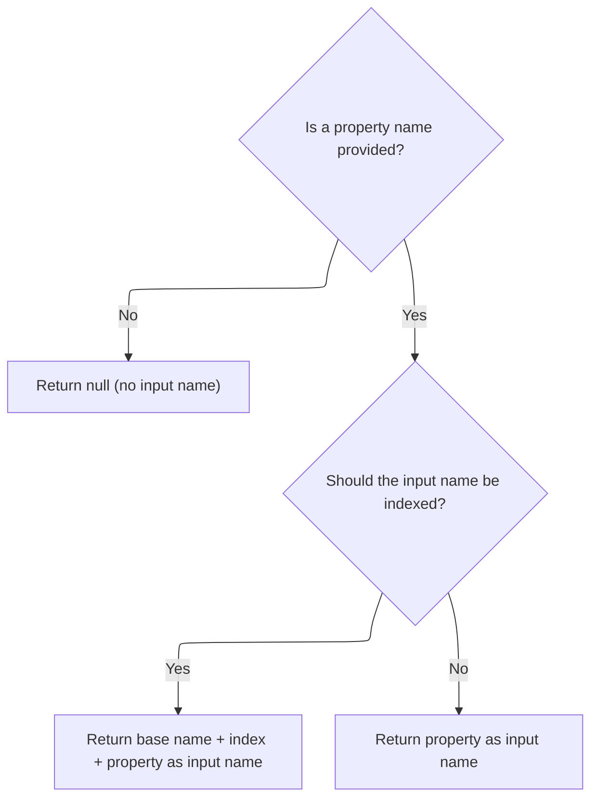

This document describes how input field names are generated for forms, supporting indexed naming for fields rendered inside loops. The flow ensures each field receives a unique name, allowing submitted values to be mapped correctly to backend properties.



# Building the input tag name with indexing



<SwmSnippet path="/taglib/src/main/java/org/apache/struts/taglib/html/BaseInputTag.java" line="229">

---

<SwmToken path="taglib/src/main/java/org/apache/struts/taglib/html/BaseInputTag.java" pos="229:5:5" line-data="    protected String prepareName()">`prepareName`</SwmToken> starts the flow by checking if the property is set and whether indexing is needed. If indexed, it builds the name using <SwmToken path="taglib/src/main/java/org/apache/struts/taglib/html/BaseInputTag.java" pos="239:1:1" line-data="            prepareIndex(results, name);">`prepareIndex`</SwmToken> from <SwmToken path="taglib/src/main/java/org/apache/struts/taglib/html/BaseInputTag.java" pos="33:10:10" line-data="public abstract class BaseInputTag extends BaseHandlerTag {">`BaseHandlerTag`</SwmToken>, which lets us handle input fields inside loops. We call <SwmToken path="taglib/src/main/java/org/apache/struts/taglib/html/BaseInputTag.java" pos="33:10:10" line-data="public abstract class BaseInputTag extends BaseHandlerTag {">`BaseHandlerTag`</SwmToken> next to actually append the index and format the name properly.

```java
    protected String prepareName()
        throws JspException {
        if (property == null) {
            return null;
        }

        // * @since Struts 1.1
        if (indexed) {
            StringBuffer results = new StringBuffer();

            prepareIndex(results, name);
            results.append(property);

            return results.toString();
        }

        return property;
    }
```

---

</SwmSnippet>

# Appending loop index to the input name

```mermaid
%%{init: {"flowchart": {"defaultRenderer": "elk"}} }%%
flowchart TD
  node1{"Is property name provided?"}
  click node1 openCode "taglib/src/main/java/org/apache/struts/taglib/html/BaseHandlerTag.java:915:917"
  node1 -->|"Yes"| node2["Add filtered property name to handler string"]
  click node2 openCode "taglib/src/main/java/org/apache/struts/taglib/html/BaseHandlerTag.java:916:916"
  node1 -->|"No"| node3["Skip property name"]
  click node3 openCode "taglib/src/main/java/org/apache/struts/taglib/html/BaseHandlerTag.java:915:917"
  node2 --> node4[Add '[' + current index value + ']' to handler string]
  node3 --> node4
  click node4 openCode "taglib/src/main/java/org/apache/struts/taglib/html/BaseHandlerTag.java:919:921"
  node4 --> node5{"Was property name provided?"}
  click node5 openCode "taglib/src/main/java/org/apache/struts/taglib/html/BaseHandlerTag.java:923:925"
  node5 -->|"Yes"| node6["Add '.' to handler string"]
  click node6 openCode "taglib/src/main/java/org/apache/struts/taglib/html/BaseHandlerTag.java:924:924"
  node5 -->|"No"| node7["Handler string is ready"]
  click node7 openCode "taglib/src/main/java/org/apache/struts/taglib/html/BaseHandlerTag.java:926:926"

classDef HeadingStyle fill:#777777,stroke:#333,stroke-width:2px;

%% Swimm:
%% %%{init: {"flowchart": {"defaultRenderer": "elk"}} }%%
%% flowchart TD
%%   node1{"Is property name provided?"}
%%   click node1 openCode "<SwmPath>[taglib/…/html/BaseHandlerTag.java](taglib/src/main/java/org/apache/struts/taglib/html/BaseHandlerTag.java)</SwmPath>:915:917"
%%   node1 -->|"Yes"| node2["Add filtered property name to handler string"]
%%   click node2 openCode "<SwmPath>[taglib/…/html/BaseHandlerTag.java](taglib/src/main/java/org/apache/struts/taglib/html/BaseHandlerTag.java)</SwmPath>:916:916"
%%   node1 -->|"No"| node3["Skip property name"]
%%   click node3 openCode "<SwmPath>[taglib/…/html/BaseHandlerTag.java](taglib/src/main/java/org/apache/struts/taglib/html/BaseHandlerTag.java)</SwmPath>:915:917"
%%   node2 --> node4[Add '[' + current index value + ']' to handler string]
%%   node3 --> node4
%%   click node4 openCode "<SwmPath>[taglib/…/html/BaseHandlerTag.java](taglib/src/main/java/org/apache/struts/taglib/html/BaseHandlerTag.java)</SwmPath>:919:921"
%%   node4 --> node5{"Was property name provided?"}
%%   click node5 openCode "<SwmPath>[taglib/…/html/BaseHandlerTag.java](taglib/src/main/java/org/apache/struts/taglib/html/BaseHandlerTag.java)</SwmPath>:923:925"
%%   node5 -->|"Yes"| node6["Add '.' to handler string"]
%%   click node6 openCode "<SwmPath>[taglib/…/html/BaseHandlerTag.java](taglib/src/main/java/org/apache/struts/taglib/html/BaseHandlerTag.java)</SwmPath>:924:924"
%%   node5 -->|"No"| node7["Handler string is ready"]
%%   click node7 openCode "<SwmPath>[taglib/…/html/BaseHandlerTag.java](taglib/src/main/java/org/apache/struts/taglib/html/BaseHandlerTag.java)</SwmPath>:926:926"
%% 
%% classDef HeadingStyle fill:#777777,stroke:#333,stroke-width:2px;
```

<SwmSnippet path="/taglib/src/main/java/org/apache/struts/taglib/html/BaseHandlerTag.java" line="913">

---

In <SwmToken path="taglib/src/main/java/org/apache/struts/taglib/html/BaseHandlerTag.java" pos="913:5:5" line-data="    protected void prepareIndex(StringBuffer handlers, String name)">`prepareIndex`</SwmToken>, we filter and append the name, then add the loop index in brackets using <SwmToken path="taglib/src/main/java/org/apache/struts/taglib/html/BaseHandlerTag.java" pos="920:5:5" line-data="        handlers.append(getIndexValue());">`getIndexValue`</SwmToken>. This sets up the naming convention for form fields inside loops, so each field gets a unique name.

```java
    protected void prepareIndex(StringBuffer handlers, String name)
        throws JspException {
        if (name != null) {
            handlers.append(TagUtils.getInstance().filter(name));
        }

        handlers.append("[");
        handlers.append(getIndexValue());
```

---

</SwmSnippet>

<SwmSnippet path="/taglib/src/main/java/org/apache/struts/taglib/html/BaseHandlerTag.java" line="935">

---

<SwmToken path="taglib/src/main/java/org/apache/struts/taglib/html/BaseHandlerTag.java" pos="935:5:5" line-data="    protected int getIndexValue()">`getIndexValue`</SwmToken> checks for an enclosing <SwmToken path="taglib/src/main/java/org/apache/struts/taglib/html/BaseHandlerTag.java" pos="938:1:1" line-data="        IterateTag iterateTag =">`IterateTag`</SwmToken> first, then tries JSTL loop tags, and throws if neither is found. This lets us grab the right index for the input name, no matter which loop type is used.

```java
    protected int getIndexValue()
        throws JspException {
        // look for outer iterate tag
        IterateTag iterateTag =
            (IterateTag) findAncestorWithClass(this, IterateTag.class);

        if (iterateTag != null) {
            return iterateTag.getIndex();
        }

        // Look for JSTL loops
        Integer i = getJstlLoopIndex();

        if (i != null) {
            return i.intValue();
        }

        // this tag should be nested in an IterateTag or JSTL loop tag, if it's not, throw exception
        JspException e =
            new JspException(messages.getMessage("indexed.noEnclosingIterate"));

        TagUtils.getInstance().saveException(pageContext, e);
        throw e;
    }
```

---

</SwmSnippet>

<SwmSnippet path="/taglib/src/main/java/org/apache/struts/taglib/html/BaseHandlerTag.java" line="921">

---

After returning from BaseHandlerTag.prepareIndex, we finish up by closing the bracket and adding a dot if the name was set. This shapes the input name so it matches what Struts expects for indexed properties.

```java
        handlers.append("]");

        if (name != null) {
            handlers.append(".");
        }
    }
```

---

</SwmSnippet>

&nbsp;

*This is an auto-generated document by Swimm 🌊 and has not yet been verified by a human*

<SwmMeta version="3.0.0" repo-id="Z2l0aHViJTNBJTNBc3RydXRzMSUzQSUzQVN3aW1tLURlbW8=" repo-name="struts1"><sup>Powered by [Swimm](https://app.swimm.io/)</sup></SwmMeta>
