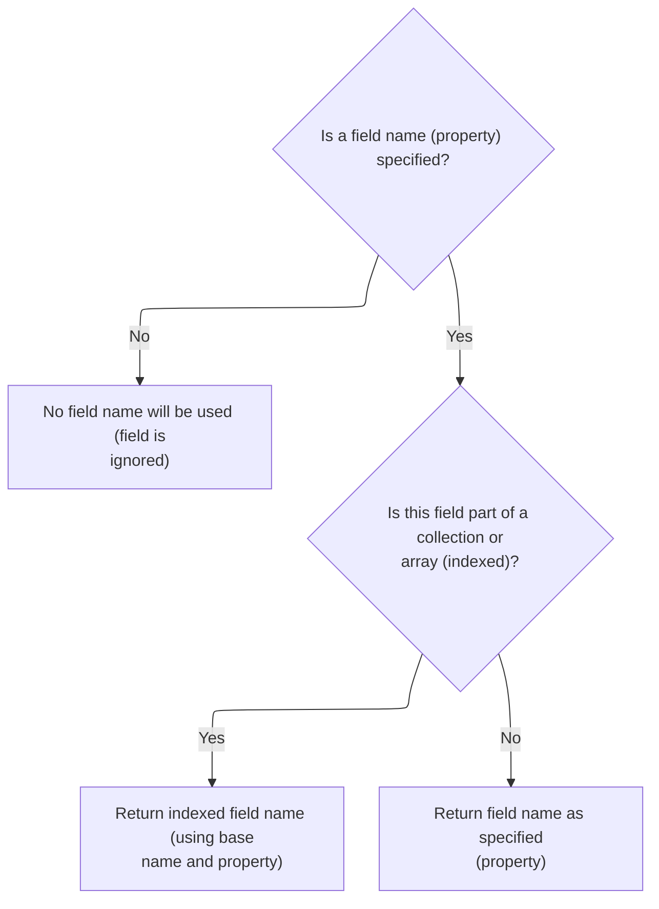

This document describes how input tag names are generated for HTML forms. The process checks if a field is part of a collection or array and, if so, appends the correct index to the tag name. This enables unique identification of fields in both simple and repeated form structures.

# Building the input tag name



<SwmSnippet path="/taglib/src/main/java/org/apache/struts/taglib/html/BaseInputTag.java" line="229">

---

<SwmToken path="taglib/src/main/java/org/apache/struts/taglib/html/BaseInputTag.java" pos="229:5:5" line-data="    protected String prepareName()">`prepareName`</SwmToken> builds the name for the input tag. If 'indexed' is set, it calls <SwmToken path="taglib/src/main/java/org/apache/struts/taglib/html/BaseInputTag.java" pos="239:1:1" line-data="            prepareIndex(results, name);">`prepareIndex`</SwmToken> to add the loop index, then appends the property. Otherwise, it just returns the property. We call <SwmToken path="taglib/src/main/java/org/apache/struts/taglib/html/BaseInputTag.java" pos="239:1:1" line-data="            prepareIndex(results, name);">`prepareIndex`</SwmToken> next to handle cases where the tag is inside a loop and needs a unique name.

```java
    protected String prepareName()
        throws JspException {
        if (property == null) {
            return null;
        }

        // * @since Struts 1.1
        if (indexed) {
            StringBuffer results = new StringBuffer();

            prepareIndex(results, name);
            results.append(property);

            return results.toString();
        }

        return property;
    }
```

---

</SwmSnippet>

# Adding loop index to the tag name

<SwmSnippet path="/taglib/src/main/java/org/apache/struts/taglib/html/BaseHandlerTag.java" line="913">

---

In <SwmToken path="taglib/src/main/java/org/apache/struts/taglib/html/BaseHandlerTag.java" pos="913:5:5" line-data="    protected void prepareIndex(StringBuffer handlers, String name)">`prepareIndex`</SwmToken>, we filter the name, append it, then add the loop index in brackets using <SwmToken path="taglib/src/main/java/org/apache/struts/taglib/html/BaseHandlerTag.java" pos="920:5:5" line-data="        handlers.append(getIndexValue());">`getIndexValue`</SwmToken>. This sets up the tag name to match its position in a loop. We call <SwmToken path="taglib/src/main/java/org/apache/struts/taglib/html/BaseHandlerTag.java" pos="920:5:5" line-data="        handlers.append(getIndexValue());">`getIndexValue`</SwmToken> next to fetch the actual index, which is needed for the naming.

```java
    protected void prepareIndex(StringBuffer handlers, String name)
        throws JspException {
        if (name != null) {
            handlers.append(TagUtils.getInstance().filter(name));
        }

        handlers.append("[");
        handlers.append(getIndexValue());
```

---

</SwmSnippet>

## Resolving the current loop index

<SwmSnippet path="/taglib/src/main/java/org/apache/struts/taglib/html/BaseHandlerTag.java" line="935">

---

In <SwmToken path="taglib/src/main/java/org/apache/struts/taglib/html/BaseHandlerTag.java" pos="935:5:5" line-data="    protected int getIndexValue()">`getIndexValue`</SwmToken>, we look for an ancestor <SwmToken path="taglib/src/main/java/org/apache/struts/taglib/html/BaseHandlerTag.java" pos="938:1:1" line-data="        IterateTag iterateTag =">`IterateTag`</SwmToken> and return its index if found. If not, we try to get the index from a JSTL loop. If neither is present, we throw an exception. Next, we call <SwmToken path="taglib/src/main/java/org/apache/struts/taglib/html/BaseHandlerTag.java" pos="946:7:7" line-data="        Integer i = getJstlLoopIndex();">`getJstlLoopIndex`</SwmToken> to handle JSTL loop cases.

```java
    protected int getIndexValue()
        throws JspException {
        // look for outer iterate tag
        IterateTag iterateTag =
            (IterateTag) findAncestorWithClass(this, IterateTag.class);

        if (iterateTag != null) {
            return iterateTag.getIndex();
        }

        // Look for JSTL loops
        Integer i = getJstlLoopIndex();

        if (i != null) {
            return i.intValue();
        }

```

---

</SwmSnippet>

<SwmSnippet path="/taglib/src/main/java/org/apache/struts/taglib/html/BaseHandlerTag.java" line="852">

---

<SwmToken path="taglib/src/main/java/org/apache/struts/taglib/html/BaseHandlerTag.java" pos="852:5:5" line-data="    private Integer getJstlLoopIndex() {">`getJstlLoopIndex`</SwmToken> uses reflection to load JSTL loop classes and methods, caches them for performance, and then finds the ancestor JSTL loop tag to get the current index. If JSTL isn't present, it just returns null.

```java
    private Integer getJstlLoopIndex() {
        if (!triedJstlInit) {
            triedJstlInit = true;

            try {
                loopTagClass =
                    RequestUtils.applicationClass(
                        "javax.servlet.jsp.jstl.core.LoopTag");

                loopTagGetStatus =
                    loopTagClass.getDeclaredMethod("getLoopStatus", null);

                loopTagStatusClass =
                    RequestUtils.applicationClass(
                        "javax.servlet.jsp.jstl.core.LoopTagStatus");

                loopTagStatusGetIndex =
                    loopTagStatusClass.getDeclaredMethod("getIndex", null);

                triedJstlSuccess = true;
            } catch (ClassNotFoundException ex) {
                // These just mean that JSTL isn't loaded, so ignore
            } catch (NoSuchMethodException ex) {
            }
        }

        if (triedJstlSuccess) {
            try {
                Object loopTag =
                    findAncestorWithClass(this, loopTagClass);

                if (loopTag == null) {
                    return null;
                }

                Object status = loopTagGetStatus.invoke(loopTag, null);

                return (Integer) loopTagStatusGetIndex.invoke(status, null);
            } catch (IllegalAccessException ex) {
                log.error(ex.getMessage(), ex);
            } catch (IllegalArgumentException ex) {
                log.error(ex.getMessage(), ex);
            } catch (InvocationTargetException ex) {
                log.error(ex.getMessage(), ex);
            } catch (NullPointerException ex) {
                log.error(ex.getMessage(), ex);
            } catch (ExceptionInInitializerError ex) {
                log.error(ex.getMessage(), ex);
            }
        }

        return null;
    }
```

---

</SwmSnippet>

<SwmSnippet path="/taglib/src/main/java/org/apache/struts/taglib/html/BaseHandlerTag.java" line="952">

---

Back in <SwmToken path="taglib/src/main/java/org/apache/struts/taglib/html/BaseHandlerTag.java" pos="920:5:5" line-data="        handlers.append(getIndexValue());">`getIndexValue`</SwmToken>, if no loop context is found, we throw a <SwmToken path="taglib/src/main/java/org/apache/struts/taglib/html/BaseHandlerTag.java" pos="953:1:1" line-data="        JspException e =">`JspException`</SwmToken> and call `TagUtils.saveException` to store it in the request scope. This lets downstream code or error pages access the exception.

```java
        // this tag should be nested in an IterateTag or JSTL loop tag, if it's not, throw exception
        JspException e =
            new JspException(messages.getMessage("indexed.noEnclosingIterate"));

        TagUtils.getInstance().saveException(pageContext, e);
```

---

</SwmSnippet>

### Storing exceptions in the request scope

<SwmSnippet path="/tiles/src/main/java/org/apache/struts/tiles/taglib/util/TagUtils.java" line="301">

---

<SwmToken path="tiles/src/main/java/org/apache/struts/tiles/taglib/util/TagUtils.java" pos="301:7:7" line-data="    public static void saveException(PageContext pageContext, Throwable exception) {">`saveException`</SwmToken> puts the exception in the request scope under a fixed key. This makes it available for error handling during the current request. We call <SwmToken path="tiles/src/main/java/org/apache/struts/tiles/taglib/util/TagUtils.java" pos="302:3:3" line-data="        pageContext.setAttribute(Globals.EXCEPTION_KEY, exception, PageContext.REQUEST_SCOPE);">`setAttribute`</SwmToken> next to actually store the value.

```java
    public static void saveException(PageContext pageContext, Throwable exception) {
        pageContext.setAttribute(Globals.EXCEPTION_KEY, exception, PageContext.REQUEST_SCOPE);
    }
```

---

</SwmSnippet>

<SwmSnippet path="/tiles/src/main/java/org/apache/struts/tiles/taglib/util/TagUtils.java" line="290">

---

<SwmToken path="tiles/src/main/java/org/apache/struts/tiles/taglib/util/TagUtils.java" pos="290:7:7" line-data="    public static void setAttribute(PageContext pageContext, String name, Object beanValue)">`setAttribute`</SwmToken> just wraps <SwmToken path="tiles/src/main/java/org/apache/struts/tiles/taglib/util/TagUtils.java" pos="292:1:3" line-data="        pageContext.setAttribute(name, beanValue, PageContext.REQUEST_SCOPE);">`pageContext.setAttribute`</SwmToken>, always using request scope. This keeps the attribute tied to the current request and avoids leaking it elsewhere.

```java
    public static void setAttribute(PageContext pageContext, String name, Object beanValue)
        throws JspException {
        pageContext.setAttribute(name, beanValue, PageContext.REQUEST_SCOPE);
    }
```

---

</SwmSnippet>

### Handling missing loop context

<SwmSnippet path="/taglib/src/main/java/org/apache/struts/taglib/html/BaseHandlerTag.java" line="957">

---

After returning from `TagUtils.saveException`, <SwmToken path="taglib/src/main/java/org/apache/struts/taglib/html/BaseHandlerTag.java" pos="920:5:5" line-data="        handlers.append(getIndexValue());">`getIndexValue`</SwmToken> throws the exception. This stops processing and lets the error handler or JSP container deal with the missing loop context.

```java
        throw e;
    }
```

---

</SwmSnippet>

## Finalizing the indexed tag name

<SwmSnippet path="/taglib/src/main/java/org/apache/struts/taglib/html/BaseHandlerTag.java" line="921">

---

After returning from <SwmToken path="taglib/src/main/java/org/apache/struts/taglib/html/BaseHandlerTag.java" pos="920:5:5" line-data="        handlers.append(getIndexValue());">`getIndexValue`</SwmToken>, <SwmToken path="taglib/src/main/java/org/apache/struts/taglib/html/BaseInputTag.java" pos="239:1:1" line-data="            prepareIndex(results, name);">`prepareIndex`</SwmToken> closes the bracket, and if name is present, appends a dot. This sets up the tag name for the property to be appended, keeping the naming consistent.

```java
        handlers.append("]");

        if (name != null) {
            handlers.append(".");
        }
    }
```

---

</SwmSnippet>

&nbsp;

*This is an auto-generated document by Swimm 🌊 and has not yet been verified by a human*

<SwmMeta version="3.0.0" repo-id="Z2l0aHViJTNBJTNBc3RydXRzMSUzQSUzQVN3aW1tLURlbW8=" repo-name="struts1"><sup>Powered by [Swimm](https://app.swimm.io/)</sup></SwmMeta>
