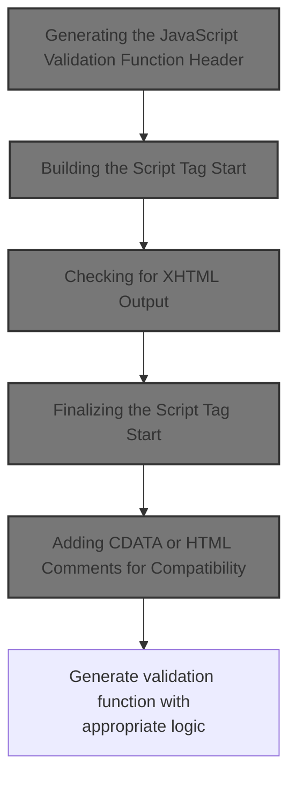

This document describes how a <SwmToken path="taglib/src/main/java/org/apache/struts/taglib/html/JavascriptValidatorTag.java" pos="55:11:11" line-data=" * Custom tag that generates JavaScript for client side validation based on">`JavaScript`</SwmToken> validation function is generated for client-side form validation. The process adapts to the form's configuration and markup type, ensuring the script is compatible and includes the correct validation logic.



# Generating the <SwmToken path="taglib/src/main/java/org/apache/struts/taglib/html/JavascriptValidatorTag.java" pos="55:11:11" line-data=" * Custom tag that generates JavaScript for client side validation based on">`JavaScript`</SwmToken> Validation Function Header

<SwmSnippet path="/taglib/src/main/java/org/apache/struts/taglib/html/JavascriptValidatorTag.java" line="744">

---

In <SwmToken path="taglib/src/main/java/org/apache/struts/taglib/html/JavascriptValidatorTag.java" pos="744:5:5" line-data="    protected String getJavascriptBegin(String methods) {">`getJavascriptBegin`</SwmToken>, we're setting up the <SwmToken path="taglib/src/main/java/org/apache/struts/taglib/html/JavascriptValidatorTag.java" pos="55:11:11" line-data=" * Custom tag that generates JavaScript for client side validation based on">`JavaScript`</SwmToken> function name for validation by sanitizing <SwmToken path="taglib/src/main/java/org/apache/struts/taglib/html/JavascriptValidatorTag.java" pos="746:7:7" line-data="        String name = jsFormName.replace(&#39;/&#39;, &#39;_&#39;); // remove any &#39;/&#39; characters">`jsFormName`</SwmToken> (removing slashes, capitalizing the first letter) or using <SwmToken path="taglib/src/main/java/org/apache/struts/taglib/html/JavascriptValidatorTag.java" pos="764:5:5" line-data="        if ((methodName == null) || (methodName.length() == 0)) {">`methodName`</SwmToken> if it's set. We call <SwmToken path="taglib/src/main/java/org/apache/struts/taglib/html/JavascriptValidatorTag.java" pos="752:7:7" line-data="        sb.append(this.renderStartElement());">`renderStartElement`</SwmToken> next to start building the <script> tag, which is needed before adding any <SwmToken path="taglib/src/main/java/org/apache/struts/taglib/html/JavascriptValidatorTag.java" pos="55:11:11" line-data=" * Custom tag that generates JavaScript for client side validation based on">`JavaScript`</SwmToken> code.

```java
    protected String getJavascriptBegin(String methods) {
        StringBuffer sb = new StringBuffer();
        String name = jsFormName.replace('/', '_'); // remove any '/' characters

        name =
            jsFormName.substring(0, 1).toUpperCase()
            + jsFormName.substring(1, jsFormName.length());

        sb.append(this.renderStartElement());

```

---

</SwmSnippet>

## Building the Script Tag Start

<SwmSnippet path="/taglib/src/main/java/org/apache/struts/taglib/html/JavascriptValidatorTag.java" line="842">

---

In <SwmToken path="taglib/src/main/java/org/apache/struts/taglib/html/JavascriptValidatorTag.java" pos="842:5:5" line-data="    protected String renderStartElement() {">`renderStartElement`</SwmToken>, we're starting the <script> tag and only add the language attribute if we're not in XHTML mode and <SwmToken path="taglib/src/main/java/org/apache/struts/taglib/html/JavascriptValidatorTag.java" pos="847:15:15" line-data="        if (!this.isXhtml() &amp;&amp; this.scriptLanguage) {">`scriptLanguage`</SwmToken> is true. We call <SwmToken path="taglib/src/main/java/org/apache/struts/taglib/html/JavascriptValidatorTag.java" pos="847:7:7" line-data="        if (!this.isXhtml() &amp;&amp; this.scriptLanguage) {">`isXhtml`</SwmToken> next to decide if the language attribute should be included.

```java
    protected String renderStartElement() {
        StringBuffer start =
            new StringBuffer("<script type=\"text/javascript\"");

        // there is no language attribute in XHTML
        if (!this.isXhtml() && this.scriptLanguage) {
            start.append(" language=\"Javascript1.1\"");
        }

```

---

</SwmSnippet>

### Checking for XHTML Output

<SwmSnippet path="/taglib/src/main/java/org/apache/struts/taglib/html/JavascriptValidatorTag.java" line="863">

---

<SwmToken path="taglib/src/main/java/org/apache/struts/taglib/html/JavascriptValidatorTag.java" pos="863:5:5" line-data="    private boolean isXhtml() {">`isXhtml`</SwmToken> just asks <SwmToken path="taglib/src/main/java/org/apache/struts/taglib/html/JavascriptValidatorTag.java" pos="864:3:3" line-data="        return TagUtils.getInstance().isXhtml(this.pageContext);">`TagUtils`</SwmToken> if XHTML mode is enabled for the current page context. We call into <SwmToken path="taglib/src/main/java/org/apache/struts/taglib/html/JavascriptValidatorTag.java" pos="864:3:3" line-data="        return TagUtils.getInstance().isXhtml(this.pageContext);">`TagUtils`</SwmToken> to centralize this logic and keep the check consistent.

```java
    private boolean isXhtml() {
        return TagUtils.getInstance().isXhtml(this.pageContext);
    }
```

---

</SwmSnippet>

### Looking Up XHTML Mode in Context

<SwmSnippet path="/taglib/src/main/java/org/apache/struts/taglib/TagUtils.java" line="838">

---

<SwmToken path="taglib/src/main/java/org/apache/struts/taglib/TagUtils.java" pos="838:5:5" line-data="    public boolean isXhtml(PageContext pageContext) {">`isXhtml`</SwmToken> in <SwmToken path="taglib/src/main/java/org/apache/struts/taglib/html/JavascriptValidatorTag.java" pos="864:3:3" line-data="        return TagUtils.getInstance().isXhtml(this.pageContext);">`TagUtils`</SwmToken> grabs the XHTML mode flag from the page context using the lookup helper. If the value is 'true', we treat the output as XHTML. If lookup fails, we log and throw.

```java
    public boolean isXhtml(PageContext pageContext) {
        String xhtml;
        try {
            xhtml = (String) lookup(pageContext, Globals.XHTML_KEY, null);
            return "true".equalsIgnoreCase(xhtml);
        } catch (JspException e) {
            log.error("Failed xhtml lookup", e);
            throw new RuntimeException(e);
        }
    }
```

---

</SwmSnippet>

<SwmSnippet path="/taglib/src/main/java/org/apache/struts/taglib/TagUtils.java" line="863">

---

<SwmToken path="taglib/src/main/java/org/apache/struts/taglib/TagUtils.java" pos="863:5:5" line-data="    public Object lookup(PageContext pageContext, String name, String scopeName)">`lookup`</SwmToken> checks if <SwmToken path="taglib/src/main/java/org/apache/struts/taglib/TagUtils.java" pos="863:19:19" line-data="    public Object lookup(PageContext pageContext, String name, String scopeName)">`scopeName`</SwmToken> is null. If so, it searches all scopes for the attribute. Otherwise, it looks in the specified scope. This lets us find the XHTML flag wherever it's set.

```java
    public Object lookup(PageContext pageContext, String name, String scopeName)
        throws JspException {
        if (scopeName == null) {
            return pageContext.findAttribute(name);
        }

        try {
            return pageContext.getAttribute(name, instance.getScope(scopeName));
        } catch (JspException e) {
            saveException(pageContext, e);
            throw e;
        }
    }
```

---

</SwmSnippet>

### Finalizing the Script Tag Start

<SwmSnippet path="/taglib/src/main/java/org/apache/struts/taglib/html/JavascriptValidatorTag.java" line="851">

---

Back in <SwmToken path="taglib/src/main/java/org/apache/struts/taglib/html/JavascriptValidatorTag.java" pos="752:7:7" line-data="        sb.append(this.renderStartElement());">`renderStartElement`</SwmToken>, after checking XHTML mode, we add a src attribute if needed and close the opening <script> tag. The XHTML check earlier determined if the language attribute was included.

```java
        if (this.src != null) {
            start.append(" src=\"" + src + "\"");
        }

        start.append("> \n");

        return start.toString();
    }
```

---

</SwmSnippet>

## Adding CDATA or HTML Comments for Compatibility

```mermaid
%%{init: {"flowchart": {"defaultRenderer": "elk"}} }%%
flowchart TD
    node1["Start generating JavaScript validation
function"] --> node2{"Is markup XHTML and CDATA required?"}
    click node1 openCode "taglib/src/main/java/org/apache/struts/taglib/html/JavascriptValidatorTag.java:754:791"
    node2 -->|"Yes (XHTML, CDATA='true')"| node3["Add CDATA section"]
    click node2 openCode "taglib/src/main/java/org/apache/struts/taglib/html/JavascriptValidatorTag.java:754:756"
    node2 -->|"No"| node4{"Is markup not XHTML and HTML comment
required?"}
    click node3 openCode "taglib/src/main/java/org/apache/struts/taglib/html/JavascriptValidatorTag.java:754:756"
    node4 -->|"Yes (not XHTML, HTML comment='true')"| node5["Add HTML comment"]
    click node4 openCode "taglib/src/main/java/org/apache/struts/taglib/html/JavascriptValidatorTag.java:758:760"
    node4 -->|"No"| node6["Skip markup comment"]
    click node5 openCode "taglib/src/main/java/org/apache/struts/taglib/html/JavascriptValidatorTag.java:758:760"
    click node6 openCode "taglib/src/main/java/org/apache/struts/taglib/html/JavascriptValidatorTag.java:758:760"
    node3 --> node7{"Is custom function name provided?"}
    node5 --> node7
    node6 --> node7
    click node7 openCode "taglib/src/main/java/org/apache/struts/taglib/html/JavascriptValidatorTag.java:764:768"
    node7 -->|"No (methodName absent)"| node8["Use default function name"]
    node7 -->|"Yes (methodName present)"| node9["Use custom function name"]
    click node8 openCode "taglib/src/main/java/org/apache/struts/taglib/html/JavascriptValidatorTag.java:765:766"
    click node9 openCode "taglib/src/main/java/org/apache/struts/taglib/html/JavascriptValidatorTag.java:767:768"
    node8 --> node10{"Are validation methods present?"}
    node9 --> node10
    click node10 openCode "taglib/src/main/java/org/apache/struts/taglib/html/JavascriptValidatorTag.java:775:786"
    node10 -->|"No (methods absent)"| node11["Return true always"]
    node10 -->|"Yes (methods present)"| node12["Add validation logic"]
    click node11 openCode "taglib/src/main/java/org/apache/struts/taglib/html/JavascriptValidatorTag.java:776:777"
    click node12 openCode "taglib/src/main/java/org/apache/struts/taglib/html/JavascriptValidatorTag.java:778:785"
    node11 --> node13["Return generated JavaScript"]
    node12 --> node13["Return generated JavaScript"]
    click node13 openCode "taglib/src/main/java/org/apache/struts/taglib/html/JavascriptValidatorTag.java:790:791"

classDef HeadingStyle fill:#777777,stroke:#333,stroke-width:2px;

%% Swimm:
%% %%{init: {"flowchart": {"defaultRenderer": "elk"}} }%%
%% flowchart TD
%%     node1["Start generating <SwmToken path="taglib/src/main/java/org/apache/struts/taglib/html/JavascriptValidatorTag.java" pos="55:11:11" line-data=" * Custom tag that generates JavaScript for client side validation based on">`JavaScript`</SwmToken> validation
%% function"] --> node2{"Is markup XHTML and CDATA required?"}
%%     click node1 openCode "<SwmPath>[taglib/…/html/JavascriptValidatorTag.java](taglib/src/main/java/org/apache/struts/taglib/html/JavascriptValidatorTag.java)</SwmPath>:754:791"
%%     node2 -->|"Yes (XHTML, CDATA='true')"| node3["Add CDATA section"]
%%     click node2 openCode "<SwmPath>[taglib/…/html/JavascriptValidatorTag.java](taglib/src/main/java/org/apache/struts/taglib/html/JavascriptValidatorTag.java)</SwmPath>:754:756"
%%     node2 -->|"No"| node4{"Is markup not XHTML and HTML comment
%% required?"}
%%     click node3 openCode "<SwmPath>[taglib/…/html/JavascriptValidatorTag.java](taglib/src/main/java/org/apache/struts/taglib/html/JavascriptValidatorTag.java)</SwmPath>:754:756"
%%     node4 -->|"Yes (not XHTML, HTML comment='true')"| node5["Add HTML comment"]
%%     click node4 openCode "<SwmPath>[taglib/…/html/JavascriptValidatorTag.java](taglib/src/main/java/org/apache/struts/taglib/html/JavascriptValidatorTag.java)</SwmPath>:758:760"
%%     node4 -->|"No"| node6["Skip markup comment"]
%%     click node5 openCode "<SwmPath>[taglib/…/html/JavascriptValidatorTag.java](taglib/src/main/java/org/apache/struts/taglib/html/JavascriptValidatorTag.java)</SwmPath>:758:760"
%%     click node6 openCode "<SwmPath>[taglib/…/html/JavascriptValidatorTag.java](taglib/src/main/java/org/apache/struts/taglib/html/JavascriptValidatorTag.java)</SwmPath>:758:760"
%%     node3 --> node7{"Is custom function name provided?"}
%%     node5 --> node7
%%     node6 --> node7
%%     click node7 openCode "<SwmPath>[taglib/…/html/JavascriptValidatorTag.java](taglib/src/main/java/org/apache/struts/taglib/html/JavascriptValidatorTag.java)</SwmPath>:764:768"
%%     node7 -->|"No (<SwmToken path="taglib/src/main/java/org/apache/struts/taglib/html/JavascriptValidatorTag.java" pos="764:5:5" line-data="        if ((methodName == null) || (methodName.length() == 0)) {">`methodName`</SwmToken> absent)"| node8["Use default function name"]
%%     node7 -->|"Yes (<SwmToken path="taglib/src/main/java/org/apache/struts/taglib/html/JavascriptValidatorTag.java" pos="764:5:5" line-data="        if ((methodName == null) || (methodName.length() == 0)) {">`methodName`</SwmToken> present)"| node9["Use custom function name"]
%%     click node8 openCode "<SwmPath>[taglib/…/html/JavascriptValidatorTag.java](taglib/src/main/java/org/apache/struts/taglib/html/JavascriptValidatorTag.java)</SwmPath>:765:766"
%%     click node9 openCode "<SwmPath>[taglib/…/html/JavascriptValidatorTag.java](taglib/src/main/java/org/apache/struts/taglib/html/JavascriptValidatorTag.java)</SwmPath>:767:768"
%%     node8 --> node10{"Are validation methods present?"}
%%     node9 --> node10
%%     click node10 openCode "<SwmPath>[taglib/…/html/JavascriptValidatorTag.java](taglib/src/main/java/org/apache/struts/taglib/html/JavascriptValidatorTag.java)</SwmPath>:775:786"
%%     node10 -->|"No (methods absent)"| node11["Return true always"]
%%     node10 -->|"Yes (methods present)"| node12["Add validation logic"]
%%     click node11 openCode "<SwmPath>[taglib/…/html/JavascriptValidatorTag.java](taglib/src/main/java/org/apache/struts/taglib/html/JavascriptValidatorTag.java)</SwmPath>:776:777"
%%     click node12 openCode "<SwmPath>[taglib/…/html/JavascriptValidatorTag.java](taglib/src/main/java/org/apache/struts/taglib/html/JavascriptValidatorTag.java)</SwmPath>:778:785"
%%     node11 --> node13["Return generated <SwmToken path="taglib/src/main/java/org/apache/struts/taglib/html/JavascriptValidatorTag.java" pos="55:11:11" line-data=" * Custom tag that generates JavaScript for client side validation based on">`JavaScript`</SwmToken>"]
%%     node12 --> node13["Return generated <SwmToken path="taglib/src/main/java/org/apache/struts/taglib/html/JavascriptValidatorTag.java" pos="55:11:11" line-data=" * Custom tag that generates JavaScript for client side validation based on">`JavaScript`</SwmToken>"]
%%     click node13 openCode "<SwmPath>[taglib/…/html/JavascriptValidatorTag.java](taglib/src/main/java/org/apache/struts/taglib/html/JavascriptValidatorTag.java)</SwmPath>:790:791"
%% 
%% classDef HeadingStyle fill:#777777,stroke:#333,stroke-width:2px;
```



<SwmSnippet path="/taglib/src/main/java/org/apache/struts/taglib/html/JavascriptValidatorTag.java" line="754">

---

Back in <SwmToken path="taglib/src/main/java/org/apache/struts/taglib/html/JavascriptValidatorTag.java" pos="744:5:5" line-data="    protected String getJavascriptBegin(String methods) {">`getJavascriptBegin`</SwmToken>, after building the script tag, we check if we need to add CDATA (for XHTML + cdata) or HTML comments (for non-XHTML + <SwmToken path="taglib/src/main/java/org/apache/struts/taglib/html/JavascriptValidatorTag.java" pos="758:19:19" line-data="        if (!this.isXhtml() &amp;&amp; &quot;true&quot;.equals(htmlComment)) {">`htmlComment`</SwmToken>). We call <SwmToken path="taglib/src/main/java/org/apache/struts/taglib/html/JavascriptValidatorTag.java" pos="754:6:6" line-data="        if (this.isXhtml() &amp;&amp; &quot;true&quot;.equalsIgnoreCase(this.cdata)) {">`isXhtml`</SwmToken> again to decide which wrapper to use for the <SwmToken path="taglib/src/main/java/org/apache/struts/taglib/html/JavascriptValidatorTag.java" pos="55:11:11" line-data=" * Custom tag that generates JavaScript for client side validation based on">`JavaScript`</SwmToken> block.

```java
        if (this.isXhtml() && "true".equalsIgnoreCase(this.cdata)) {
            sb.append("//<![CDATA[\r\n");
        }

        if (!this.isXhtml() && "true".equals(htmlComment)) {
            sb.append(HTML_BEGIN_COMMENT);
        }

```

---

</SwmSnippet>

<SwmSnippet path="/taglib/src/main/java/org/apache/struts/taglib/html/JavascriptValidatorTag.java" line="762">

---

Back in <SwmToken path="taglib/src/main/java/org/apache/struts/taglib/html/JavascriptValidatorTag.java" pos="744:5:5" line-data="    protected String getJavascriptBegin(String methods) {">`getJavascriptBegin`</SwmToken>, after the CDATA or comment logic, we generate the actual validation function. The methods string is inserted directly as the validation logic, and we decide how to return the result based on whether methods contains '&&'. If methods is missing or empty, we just return true.

```java
        sb.append("\n    var bCancel = false; \n\n");

        if ((methodName == null) || (methodName.length() == 0)) {
            sb.append("    function validate" + name + "(form) { \n");
        } else {
            sb.append("    function " + methodName + "(form) { \n");
        }

        sb.append("        if (bCancel) { \n");
        sb.append("            return true; \n");
        sb.append("        } else { \n");

        // Always return true if there aren't any Javascript validation methods
        if ((methods == null) || (methods.length() == 0)) {
            sb.append("            return true; \n");
        } else {
            sb.append("            var formValidationResult; \n");
            sb.append("            formValidationResult = " + methods + "; \n");
            if (methods.indexOf("&&") >= 0) {
                sb.append("            return (formValidationResult); \n");
            } else {
                //Making Sure that Bitwise operator works:
                sb.append("            return (formValidationResult == 1); \n");
            }
        }
        sb.append("        } \n");
        sb.append("    } \n\n");

        return sb.toString();
    }
```

---

</SwmSnippet>

&nbsp;

*This is an* <SwmToken path="taglib/src/main/java/org/apache/struts/taglib/html/JavascriptValidatorTag.java" pos="239:24:26" line-data="     * method name if it has a value.  This overrides the auto-generated">`auto-generated`</SwmToken> *document by Swimm 🌊 and has not yet been verified by a human*

<SwmMeta version="3.0.0" repo-id="Z2l0aHViJTNBJTNBc3RydXRzMSUzQSUzQVN3aW1tLURlbW8=" repo-name="struts1"><sup>Powered by [Swimm](https://app.swimm.io/)</sup></SwmMeta>
