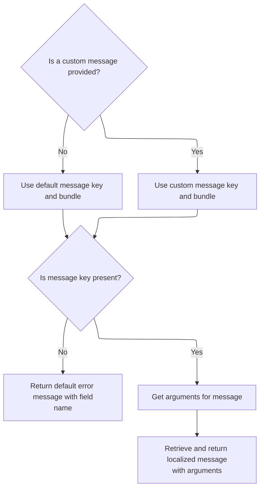

This document describes how the system generates localized messages for fields and actions, supporting internationalization and customization in forms and validation. The flow receives field and action information, user locale, and message resources as input, and returns a localized message string with any required argument substitution.

# Resolving Field Messages

<SwmSnippet path="/core/src/main/java/org/apache/struts/validator/Resources.java" line="286">

---

In <SwmToken path="core/src/main/java/org/apache/struts/validator/Resources.java" pos="286:7:7" line-data="    public static String getMessage(ServletContext application,">`getMessage`</SwmToken>, we first check if the field has a non-resource message for the action. If so, we just return its key (literal value). Otherwise, we need to resolve the message key, which may involve looking up resources, so we move on to logic that can involve <SwmToken path="core/src/main/java/org/apache/struts/config/ConfigHelper.java" pos="56:4:4" line-data="public class ConfigHelper implements ConfigHelperInterface {">`ConfigHelper`</SwmToken> to fetch the correct localized string.

```java
    public static String getMessage(ServletContext application,
        HttpServletRequest request, MessageResources defaultMessages,
        Locale locale, ValidatorAction va, Field field) {
        Msg msg = field.getMessage(va.getName());

        if ((msg != null) && !msg.isResource()) {
            return msg.getKey();
        }

```

---

</SwmSnippet>

## Fetching Localized Message Strings

<SwmSnippet path="/core/src/main/java/org/apache/struts/config/ConfigHelper.java" line="496">

---

In <SwmToken path="core/src/main/java/org/apache/struts/config/ConfigHelper.java" pos="496:5:5" line-data="    public String getMessage(String key) {">`getMessage`</SwmToken> (<SwmToken path="core/src/main/java/org/apache/struts/config/ConfigHelper.java" pos="56:4:4" line-data="public class ConfigHelper implements ConfigHelperInterface {">`ConfigHelper`</SwmToken>), we grab the <SwmToken path="core/src/main/java/org/apache/struts/config/ConfigHelper.java" pos="497:1:1" line-data="        MessageResources resources = getMessageResources();">`MessageResources`</SwmToken> and, if available, use <SwmToken path="core/src/main/java/org/apache/struts/config/ConfigHelper.java" pos="503:7:9" line-data="        return resources.getMessage(RequestUtils.getUserLocale(request, null),">`RequestUtils.getUserLocale`</SwmToken> to determine which language to fetch the message in. This step is needed to make sure the returned message matches the user's locale, so we call into <SwmToken path="core/src/main/java/org/apache/struts/config/ConfigHelper.java" pos="503:7:7" line-data="        return resources.getMessage(RequestUtils.getUserLocale(request, null),">`RequestUtils`</SwmToken> next.

```java
    public String getMessage(String key) {
        MessageResources resources = getMessageResources();

        if (resources == null) {
            return null;
        }

        return resources.getMessage(RequestUtils.getUserLocale(request, null),
```

---

</SwmSnippet>

<SwmSnippet path="/core/src/main/java/org/apache/struts/config/ConfigHelper.java" line="503">

---

Back in ConfigHelper.getMessage, after getting the user's locale from <SwmToken path="core/src/main/java/org/apache/struts/config/ConfigHelper.java" pos="503:7:7" line-data="        return resources.getMessage(RequestUtils.getUserLocale(request, null),">`RequestUtils`</SwmToken>, we fetch the localized message and return it. The flow then continues in Resources.getMessage to handle any argument substitution or further resource lookups.

```java
        return resources.getMessage(RequestUtils.getUserLocale(request, null),
            key);
    }
```

---

</SwmSnippet>

<SwmSnippet path="/core/src/main/java/org/apache/struts/validator/Resources.java" line="249">

---

<SwmToken path="core/src/main/java/org/apache/struts/validator/Resources.java" pos="249:7:7" line-data="    public static String getMessage(HttpServletRequest request, String key) {">`getMessage`</SwmToken> (Resources) uses <SwmToken path="core/src/main/java/org/apache/struts/validator/Resources.java" pos="250:7:7" line-data="        MessageResources messages = getMessageResources(request);">`getMessageResources`</SwmToken> to get the message bundle, then calls <SwmToken path="core/src/main/java/org/apache/struts/validator/Resources.java" pos="252:8:10" line-data="        return getMessage(messages, RequestUtils.getUserLocale(request, null),">`RequestUtils.getUserLocale`</SwmToken> to figure out which language to use for the message lookup. This ensures the message matches the user's locale.

```java
    public static String getMessage(HttpServletRequest request, String key) {
        MessageResources messages = getMessageResources(request);

        return getMessage(messages, RequestUtils.getUserLocale(request, null),
            key);
    }
```

---

</SwmSnippet>

## Selecting Message Key and Bundle



<SwmSnippet path="/core/src/main/java/org/apache/struts/validator/Resources.java" line="295">

---

Back in Resources.getMessage, after handling the result from <SwmToken path="core/src/main/java/org/apache/struts/config/ConfigHelper.java" pos="56:4:4" line-data="public class ConfigHelper implements ConfigHelperInterface {">`ConfigHelper`</SwmToken>, we check if the message specifies a different bundle and, if so, call <SwmToken path="core/src/main/java/org/apache/struts/validator/Resources.java" pos="307:1:1" line-data="                    getMessageResources(application, request, msg.getBundle());">`getMessageResources`</SwmToken> again to fetch the correct resource bundle for the message key.

```java
        String msgKey = null;
        String msgBundle = null;
        MessageResources messages = defaultMessages;

        if (msg == null) {
            msgKey = va.getMsg();
        } else {
            msgKey = msg.getKey();
            msgBundle = msg.getBundle();

            if (msg.getBundle() != null) {
                messages =
                    getMessageResources(application, request, msg.getBundle());
            }
        }

        if ((msgKey == null) || (msgKey.length() == 0)) {
            return "??? " + va.getName() + "." + field.getProperty() + " ???";
        }

```

---

</SwmSnippet>

<SwmSnippet path="/core/src/main/java/org/apache/struts/validator/Resources.java" line="117">

---

<SwmToken path="core/src/main/java/org/apache/struts/validator/Resources.java" pos="117:7:7" line-data="    public static MessageResources getMessageResources(">`getMessageResources`</SwmToken> tries to find the right <SwmToken path="core/src/main/java/org/apache/struts/validator/Resources.java" pos="117:5:5" line-data="    public static MessageResources getMessageResources(">`MessageResources`</SwmToken> by checking the request, then the application with a module prefix, and finally the application without a prefix. If nothing is found, it blows up with a <SwmToken path="core/src/main/java/org/apache/struts/validator/Resources.java" pos="140:5:5" line-data="            throw new NullPointerException(">`NullPointerException`</SwmToken>. This fallback lets modules have their own bundles but still supports global defaults.

```java
    public static MessageResources getMessageResources(
        ServletContext application, HttpServletRequest request, String bundle) {
        if (bundle == null) {
            bundle = Globals.MESSAGES_KEY;
        }

        MessageResources resources =
            (MessageResources) request.getAttribute(bundle);

        if (resources == null) {
            ModuleConfig moduleConfig =
                ModuleUtils.getInstance().getModuleConfig(request, application);

            resources =
                (MessageResources) application.getAttribute(bundle
                    + moduleConfig.getPrefix());
        }

        if (resources == null) {
            resources = (MessageResources) application.getAttribute(bundle);
        }

        if (resources == null) {
            throw new NullPointerException(
                "No message resources found for bundle: " + bundle);
        }

        return resources;
    }
```

---

</SwmSnippet>

<SwmSnippet path="/core/src/main/java/org/apache/struts/validator/Resources.java" line="315">

---

Back in Resources.getMessage, after getting the correct <SwmToken path="core/src/main/java/org/apache/struts/validator/Resources.java" pos="117:5:5" line-data="    public static MessageResources getMessageResources(">`MessageResources`</SwmToken>, we fetch the arguments for the message (if any) using <SwmToken path="core/src/main/java/org/apache/struts/validator/Resources.java" pos="316:11:11" line-data="        Arg[] args = field.getArgs(va.getName());">`getArgs`</SwmToken>, so we can fill in any placeholders in the message template.

```java
        // Get the arguments
        Arg[] args = field.getArgs(va.getName());
```

---

</SwmSnippet>

<SwmSnippet path="/core/src/main/java/org/apache/struts/validator/Resources.java" line="420">

---

<SwmToken path="core/src/main/java/org/apache/struts/validator/Resources.java" pos="420:9:9" line-data="    public static String[] getArgs(String actionName,">`getArgs`</SwmToken> pulls up to four arguments for the action from the field. For each, if it's a resource, it resolves the localized message; otherwise, it just uses the key. This is where argument substitution values for the message are assembled.

```java
    public static String[] getArgs(String actionName,
        MessageResources messages, Locale locale, Field field) {
        String[] argMessages = new String[4];

        Arg[] args =
            new Arg[] {
                field.getArg(actionName, 0), field.getArg(actionName, 1),
                field.getArg(actionName, 2), field.getArg(actionName, 3)
            };

        for (int i = 0; i < args.length; i++) {
            if (args[i] == null) {
                continue;
            }

            if (args[i].isResource()) {
                argMessages[i] = getMessage(messages, locale, args[i].getKey());
            } else {
                argMessages[i] = args[i].getKey();
            }
        }
```

---

</SwmSnippet>

<SwmSnippet path="/core/src/main/java/org/apache/struts/validator/Resources.java" line="317">

---

Back in Resources.getMessage, after getting the argument messages, we call <SwmToken path="core/src/main/java/org/apache/struts/validator/Resources.java" pos="318:1:1" line-data="            getArgValues(application, request, messages, locale, args);">`getArgValues`</SwmToken> to resolve the actual values for each argument, handling bundle overrides or resource lookups as needed before substituting them into the message.

```java
        String[] argValues =
            getArgValues(application, request, messages, locale, args);

        // Return the message
        return messages.getMessage(locale, msgKey, argValues);
    }
```

---

</SwmSnippet>

<SwmSnippet path="/core/src/main/java/org/apache/struts/validator/Resources.java" line="455">

---

<SwmToken path="core/src/main/java/org/apache/struts/validator/Resources.java" pos="455:9:9" line-data="    private static String[] getArgValues(ServletContext application,">`getArgValues`</SwmToken> loops through the arguments, and for each resource argument, checks if it needs a bundle override. If so, it calls <SwmToken path="core/src/main/java/org/apache/struts/validator/Resources.java" pos="471:1:1" line-data="                            getMessageResources(application, request,">`getMessageResources`</SwmToken> to fetch the right bundle before resolving the argument value.

```java
    private static String[] getArgValues(ServletContext application,
        HttpServletRequest request, MessageResources defaultMessages,
        Locale locale, Arg[] args) {
        if ((args == null) || (args.length == 0)) {
            return null;
        }

        String[] values = new String[args.length];

        for (int i = 0; i < args.length; i++) {
            if (args[i] != null) {
                if (args[i].isResource()) {
                    MessageResources messages = defaultMessages;

                    if (args[i].getBundle() != null) {
                        messages =
                            getMessageResources(application, request,
                                args[i].getBundle());
                    }

                    values[i] = messages.getMessage(locale, args[i].getKey());
                } else {
                    values[i] = args[i].getKey();
                }
            }
        }

        return values;
    }
```

---

</SwmSnippet>

&nbsp;

*This is an auto-generated document by Swimm 🌊 and has not yet been verified by a human*

<SwmMeta version="3.0.0" repo-id="Z2l0aHViJTNBJTNBc3RydXRzMSUzQSUzQVN3aW1tLURlbW8=" repo-name="struts1"><sup>Powered by [Swimm](https://app.swimm.io/)</sup></SwmMeta>
