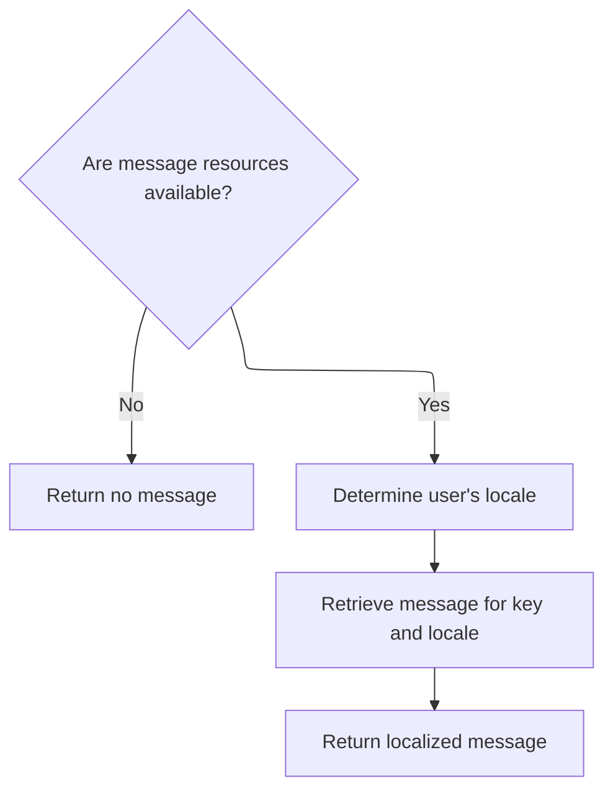
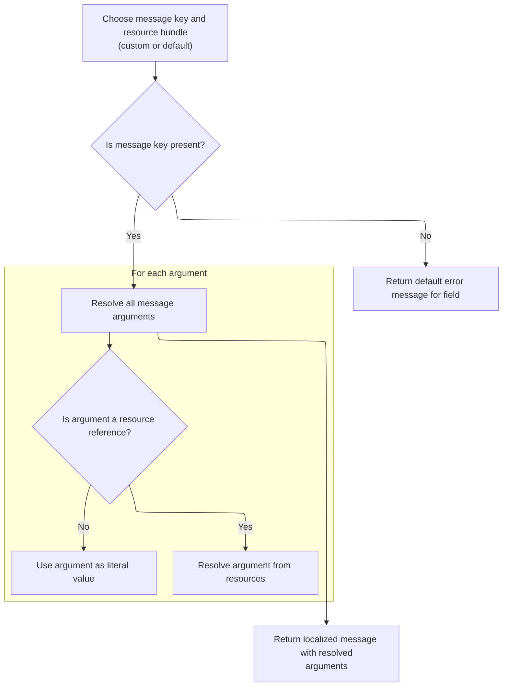

This document describes how the system generates localized messages for form fields and validation, supporting internationalization and user experience. The flow checks if a message is a literal or needs resolution, determines the user's locale, selects the resource bundle, resolves arguments, and returns the localized message for display.

# Where is this flow used?

This flow is used multiple times in the codebase as represented in the following diagram:

```mermaid
graph TD;
      458c04a5021f6d537e8945783c809ce9928d5125977f940354ba9b90000ba9a5(core/…/servlet/PerformForward.java::PerformForward.perform) --> f605f69248474996c74c70e740285179076f0b0cd3d9c45b7a1d90cd8b8e8264(core/…/validator/Resources.java::Resources.getMessage)

28b4cc4072bfb039614fc3464030b23c7a2618d7f6d4cfec51da91c2c1ebad36(faces/…/taglib/JavascriptValidatorTag.java::JavascriptValidatorTag.createDynamicJavascript) --> f605f69248474996c74c70e740285179076f0b0cd3d9c45b7a1d90cd8b8e8264(core/…/validator/Resources.java::Resources.getMessage)

de8991bead9bdfbdfd33ba23fdb3255e20874a62139c81593769ba8af6022f36(faces/…/taglib/JavascriptValidatorTag.java::JavascriptValidatorTag.renderJavascript) --> 28b4cc4072bfb039614fc3464030b23c7a2618d7f6d4cfec51da91c2c1ebad36(faces/…/taglib/JavascriptValidatorTag.java::JavascriptValidatorTag.createDynamicJavascript)

23572e7becf92791caf5edf74db07746e576720d54887a076de50b58bfddfb08(faces/…/taglib/JavascriptValidatorTag.java::JavascriptValidatorTag.doStartTag) --> de8991bead9bdfbdfd33ba23fdb3255e20874a62139c81593769ba8af6022f36(faces/…/taglib/JavascriptValidatorTag.java::JavascriptValidatorTag.renderJavascript)


classDef mainFlowStyle color:#000000,fill:#7CB9F4
classDef rootsStyle color:#000000,fill:#00FFF4
classDef Style1 color:#000000,fill:#00FFAA
classDef Style2 color:#000000,fill:#FFFF00
classDef Style3 color:#000000,fill:#AA7CB9

%% Swimm:
%% graph TD;
%%       458c04a5021f6d537e8945783c809ce9928d5125977f940354ba9b90000ba9a5(<SwmPath>[core/…/servlet/PerformForward.java](core/src/main/java/org/apache/struts/chain/commands/servlet/PerformForward.java)</SwmPath>::PerformForward.perform) --> f605f69248474996c74c70e740285179076f0b0cd3d9c45b7a1d90cd8b8e8264(<SwmPath>[core/…/validator/Resources.java](core/src/main/java/org/apache/struts/validator/Resources.java)</SwmPath>::Resources.getMessage)
%% 
%% 28b4cc4072bfb039614fc3464030b23c7a2618d7f6d4cfec51da91c2c1ebad36(<SwmPath>[faces/…/taglib/JavascriptValidatorTag.java](faces/src/main/java/org/apache/struts/faces/taglib/JavascriptValidatorTag.java)</SwmPath>::JavascriptValidatorTag.createDynamicJavascript) --> f605f69248474996c74c70e740285179076f0b0cd3d9c45b7a1d90cd8b8e8264(<SwmPath>[core/…/validator/Resources.java](core/src/main/java/org/apache/struts/validator/Resources.java)</SwmPath>::Resources.getMessage)
%% 
%% de8991bead9bdfbdfd33ba23fdb3255e20874a62139c81593769ba8af6022f36(<SwmPath>[faces/…/taglib/JavascriptValidatorTag.java](faces/src/main/java/org/apache/struts/faces/taglib/JavascriptValidatorTag.java)</SwmPath>::JavascriptValidatorTag.renderJavascript) --> 28b4cc4072bfb039614fc3464030b23c7a2618d7f6d4cfec51da91c2c1ebad36(<SwmPath>[faces/…/taglib/JavascriptValidatorTag.java](faces/src/main/java/org/apache/struts/faces/taglib/JavascriptValidatorTag.java)</SwmPath>::JavascriptValidatorTag.createDynamicJavascript)
%% 
%% 23572e7becf92791caf5edf74db07746e576720d54887a076de50b58bfddfb08(<SwmPath>[faces/…/taglib/JavascriptValidatorTag.java](faces/src/main/java/org/apache/struts/faces/taglib/JavascriptValidatorTag.java)</SwmPath>::JavascriptValidatorTag.doStartTag) --> de8991bead9bdfbdfd33ba23fdb3255e20874a62139c81593769ba8af6022f36(<SwmPath>[faces/…/taglib/JavascriptValidatorTag.java](faces/src/main/java/org/apache/struts/faces/taglib/JavascriptValidatorTag.java)</SwmPath>::JavascriptValidatorTag.renderJavascript)
%% 
%% 
%% classDef mainFlowStyle color:#000000,fill:#7CB9F4
%% classDef rootsStyle color:#000000,fill:#00FFF4
%% classDef Style1 color:#000000,fill:#00FFAA
%% classDef Style2 color:#000000,fill:#FFFF00
%% classDef Style3 color:#000000,fill:#AA7CB9
```



# Resolving Field Messages

<SwmSnippet path="/core/src/main/java/org/apache/struts/validator/Resources.java" line="286">

---

In <SwmToken path="core/src/main/java/org/apache/struts/validator/Resources.java" pos="286:7:7" line-data="    public static String getMessage(ServletContext application,">`getMessage`</SwmToken>, we check if the field's message is a resource or a literal. If it's a literal, we return it right away. Otherwise, we need to resolve it, which means we have to look up the actual message string, so we move on to <SwmToken path="core/src/main/java/org/apache/struts/config/ConfigHelper.java" pos="56:4:4" line-data="public class ConfigHelper implements ConfigHelperInterface {">`ConfigHelper`</SwmToken> for that.

```java
    public static String getMessage(ServletContext application,
        HttpServletRequest request, MessageResources defaultMessages,
        Locale locale, ValidatorAction va, Field field) {
        Msg msg = field.getMessage(va.getName());

        if ((msg != null) && !msg.isResource()) {
            return msg.getKey();
        }

```

---

</SwmSnippet>

## Looking Up Localized Messages



<SwmSnippet path="/core/src/main/java/org/apache/struts/config/ConfigHelper.java" line="496">

---

In <SwmToken path="core/src/main/java/org/apache/struts/config/ConfigHelper.java" pos="496:5:5" line-data="    public String getMessage(String key) {">`getMessage`</SwmToken> (<SwmToken path="core/src/main/java/org/apache/struts/config/ConfigHelper.java" pos="56:4:4" line-data="public class ConfigHelper implements ConfigHelperInterface {">`ConfigHelper`</SwmToken>), we grab the message resources and immediately fetch the user's locale using <SwmToken path="core/src/main/java/org/apache/struts/config/ConfigHelper.java" pos="503:7:7" line-data="        return resources.getMessage(RequestUtils.getUserLocale(request, null),">`RequestUtils`</SwmToken>. This is needed to pick the right localized message string for the user.

```java
    public String getMessage(String key) {
        MessageResources resources = getMessageResources();

        if (resources == null) {
            return null;
        }

        return resources.getMessage(RequestUtils.getUserLocale(request, null),
```

---

</SwmSnippet>

<SwmSnippet path="/core/src/main/java/org/apache/struts/util/RequestUtils.java" line="299">

---

<SwmToken path="core/src/main/java/org/apache/struts/util/RequestUtils.java" pos="299:7:7" line-data="    public static Locale getUserLocale(HttpServletRequest request, String locale) {">`getUserLocale`</SwmToken> checks for a Locale in the session using a key (defaulting to <SwmToken path="core/src/main/java/org/apache/struts/util/RequestUtils.java" pos="304:5:7" line-data="            locale = Globals.LOCALE_KEY;">`Globals.LOCALE_KEY`</SwmToken>), and if not found, falls back to the request's Locale. This covers both user preferences and browser settings.

```java
    public static Locale getUserLocale(HttpServletRequest request, String locale) {
        Locale userLocale = null;
        HttpSession session = request.getSession(false);

        if (locale == null) {
            locale = Globals.LOCALE_KEY;
        }

        // Only check session if sessions are enabled
        if (session != null) {
            userLocale = (Locale) session.getAttribute(locale);
        }

        if (userLocale == null) {
            // Returns Locale based on Accept-Language header or the server default
            userLocale = request.getLocale();
        }

        return userLocale;
    }
```

---

</SwmSnippet>

<SwmSnippet path="/core/src/main/java/org/apache/struts/config/ConfigHelper.java" line="503">

---

Back in ConfigHelper.getMessage, after getting the user's locale from <SwmToken path="core/src/main/java/org/apache/struts/config/ConfigHelper.java" pos="503:7:7" line-data="        return resources.getMessage(RequestUtils.getUserLocale(request, null),">`RequestUtils`</SwmToken>, we call <SwmToken path="core/src/main/java/org/apache/struts/config/ConfigHelper.java" pos="503:3:5" line-data="        return resources.getMessage(RequestUtils.getUserLocale(request, null),">`resources.getMessage`</SwmToken> to actually fetch the localized message string. Next, we need to call Resources.getMessage to continue the lookup with the resolved locale and key.

```java
        return resources.getMessage(RequestUtils.getUserLocale(request, null),
            key);
    }
```

---

</SwmSnippet>

<SwmSnippet path="/core/src/main/java/org/apache/struts/validator/Resources.java" line="249">

---

<SwmToken path="core/src/main/java/org/apache/struts/validator/Resources.java" pos="249:7:7" line-data="    public static String getMessage(HttpServletRequest request, String key) {">`getMessage`</SwmToken> (Resources) grabs the message resources for the request and fetches the user's locale (again, via <SwmToken path="core/src/main/java/org/apache/struts/validator/Resources.java" pos="252:8:8" line-data="        return getMessage(messages, RequestUtils.getUserLocale(request, null),">`RequestUtils`</SwmToken>) to make sure it uses the right translation for the message key.

```java
    public static String getMessage(HttpServletRequest request, String key) {
        MessageResources messages = getMessageResources(request);

        return getMessage(messages, RequestUtils.getUserLocale(request, null),
            key);
    }
```

---

</SwmSnippet>

## Selecting the Message Key and Bundle



<SwmSnippet path="/core/src/main/java/org/apache/struts/validator/Resources.java" line="295">

---

Back from ConfigHelper.getMessage, we figure out which message key and bundle to use. If a bundle override is present, we call <SwmToken path="core/src/main/java/org/apache/struts/validator/Resources.java" pos="307:1:1" line-data="                    getMessageResources(application, request, msg.getBundle());">`getMessageResources`</SwmToken> to get the right resource set for the lookup.

```java
        String msgKey = null;
        String msgBundle = null;
        MessageResources messages = defaultMessages;

        if (msg == null) {
            msgKey = va.getMsg();
        } else {
            msgKey = msg.getKey();
            msgBundle = msg.getBundle();

            if (msg.getBundle() != null) {
                messages =
                    getMessageResources(application, request, msg.getBundle());
            }
        }

        if ((msgKey == null) || (msgKey.length() == 0)) {
            return "??? " + va.getName() + "." + field.getProperty() + " ???";
        }

```

---

</SwmSnippet>

<SwmSnippet path="/core/src/main/java/org/apache/struts/validator/Resources.java" line="117">

---

<SwmToken path="core/src/main/java/org/apache/struts/validator/Resources.java" pos="117:7:7" line-data="    public static MessageResources getMessageResources(">`getMessageResources`</SwmToken> tries to find the <SwmToken path="core/src/main/java/org/apache/struts/validator/Resources.java" pos="117:5:5" line-data="    public static MessageResources getMessageResources(">`MessageResources`</SwmToken> object by checking request attributes, then application attributes with a module prefix, and finally just the bundle key. If nothing is found, it throws.

```java
    public static MessageResources getMessageResources(
        ServletContext application, HttpServletRequest request, String bundle) {
        if (bundle == null) {
            bundle = Globals.MESSAGES_KEY;
        }

        MessageResources resources =
            (MessageResources) request.getAttribute(bundle);

        if (resources == null) {
            ModuleConfig moduleConfig =
                ModuleUtils.getInstance().getModuleConfig(request, application);

            resources =
                (MessageResources) application.getAttribute(bundle
                    + moduleConfig.getPrefix());
        }

        if (resources == null) {
            resources = (MessageResources) application.getAttribute(bundle);
        }

        if (resources == null) {
            throw new NullPointerException(
                "No message resources found for bundle: " + bundle);
        }

        return resources;
    }
```

---

</SwmSnippet>

<SwmSnippet path="/core/src/main/java/org/apache/struts/validator/Resources.java" line="315">

---

Back in Resources.getMessage, after getting the right <SwmToken path="core/src/main/java/org/apache/struts/validator/Resources.java" pos="117:5:5" line-data="    public static MessageResources getMessageResources(">`MessageResources`</SwmToken>, we fetch the arguments for the message (if any) so we can fill in placeholders in the message string.

```java
        // Get the arguments
        Arg[] args = field.getArgs(va.getName());
```

---

</SwmSnippet>

<SwmSnippet path="/core/src/main/java/org/apache/struts/validator/Resources.java" line="420">

---

<SwmToken path="core/src/main/java/org/apache/struts/validator/Resources.java" pos="420:9:9" line-data="    public static String[] getArgs(String actionName,">`getArgs`</SwmToken> pulls up to four arguments from the field for the action, checks if each is a resource or a literal, and builds the array of argument strings for message formatting.

```java
    public static String[] getArgs(String actionName,
        MessageResources messages, Locale locale, Field field) {
        String[] argMessages = new String[4];

        Arg[] args =
            new Arg[] {
                field.getArg(actionName, 0), field.getArg(actionName, 1),
                field.getArg(actionName, 2), field.getArg(actionName, 3)
            };

        for (int i = 0; i < args.length; i++) {
            if (args[i] == null) {
                continue;
            }

            if (args[i].isResource()) {
                argMessages[i] = getMessage(messages, locale, args[i].getKey());
            } else {
                argMessages[i] = args[i].getKey();
            }
        }
```

---

</SwmSnippet>

<SwmSnippet path="/core/src/main/java/org/apache/struts/validator/Resources.java" line="317">

---

Back in Resources.getMessage, after getting the argument <SwmPath>[apps/…/jsp/messages/](apps/cookbook/src/main/webapp/jsp/messages/)</SwmPath>, we call <SwmToken path="core/src/main/java/org/apache/struts/validator/Resources.java" pos="318:1:1" line-data="            getArgValues(application, request, messages, locale, args);">`getArgValues`</SwmToken> to resolve any bundle-specific or resource-based argument values before formatting the final message.

```java
        String[] argValues =
            getArgValues(application, request, messages, locale, args);

        // Return the message
        return messages.getMessage(locale, msgKey, argValues);
    }
```

---

</SwmSnippet>

<SwmSnippet path="/core/src/main/java/org/apache/struts/validator/Resources.java" line="455">

---

<SwmToken path="core/src/main/java/org/apache/struts/validator/Resources.java" pos="455:9:9" line-data="    private static String[] getArgValues(ServletContext application,">`getArgValues`</SwmToken> loops through the arguments, and for each resource-type argument with a bundle, it fetches the right <SwmToken path="core/src/main/java/org/apache/struts/validator/Resources.java" pos="456:6:6" line-data="        HttpServletRequest request, MessageResources defaultMessages,">`MessageResources`</SwmToken> using <SwmToken path="core/src/main/java/org/apache/struts/validator/Resources.java" pos="471:1:1" line-data="                            getMessageResources(application, request,">`getMessageResources`</SwmToken>, then resolves the localized value for that argument.

```java
    private static String[] getArgValues(ServletContext application,
        HttpServletRequest request, MessageResources defaultMessages,
        Locale locale, Arg[] args) {
        if ((args == null) || (args.length == 0)) {
            return null;
        }

        String[] values = new String[args.length];

        for (int i = 0; i < args.length; i++) {
            if (args[i] != null) {
                if (args[i].isResource()) {
                    MessageResources messages = defaultMessages;

                    if (args[i].getBundle() != null) {
                        messages =
                            getMessageResources(application, request,
                                args[i].getBundle());
                    }

                    values[i] = messages.getMessage(locale, args[i].getKey());
                } else {
                    values[i] = args[i].getKey();
                }
            }
        }

        return values;
    }
```

---

</SwmSnippet>

&nbsp;

*This is an auto-generated document by Swimm 🌊 and has not yet been verified by a human*

<SwmMeta version="3.0.0" repo-id="Z2l0aHViJTNBJTNBc3RydXRzMSUzQSUzQVN3aW1tLURlbW8=" repo-name="struts1"><sup>Powered by [Swimm](https://app.swimm.io/)</sup></SwmMeta>
