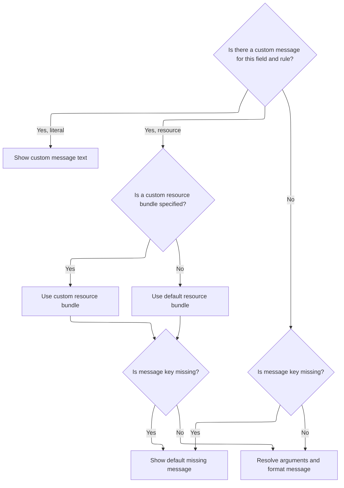
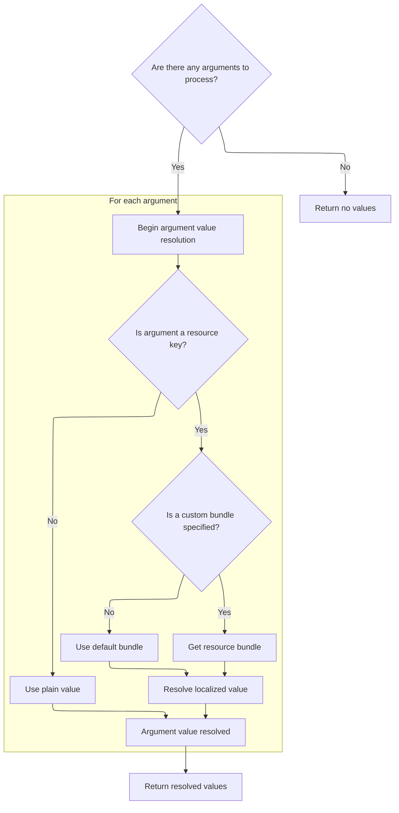

This document explains how user-facing messages are generated for display, supporting both custom and resource-based messages. The flow ensures messages are localized and can include dynamic arguments, providing clear and tailored feedback to users.

# Where is this flow used?

This flow is used multiple times in the codebase as represented in the following diagram:

```mermaid
graph TD;
      458c04a5021f6d537e8945783c809ce9928d5125977f940354ba9b90000ba9a5(core/…/servlet/PerformForward.java::PerformForward.perform) --> f605f69248474996c74c70e740285179076f0b0cd3d9c45b7a1d90cd8b8e8264(core/…/validator/Resources.java::Resources.getMessage)

28b4cc4072bfb039614fc3464030b23c7a2618d7f6d4cfec51da91c2c1ebad36(faces/…/taglib/JavascriptValidatorTag.java::JavascriptValidatorTag.createDynamicJavascript) --> f605f69248474996c74c70e740285179076f0b0cd3d9c45b7a1d90cd8b8e8264(core/…/validator/Resources.java::Resources.getMessage)

de8991bead9bdfbdfd33ba23fdb3255e20874a62139c81593769ba8af6022f36(faces/…/taglib/JavascriptValidatorTag.java::JavascriptValidatorTag.renderJavascript) --> 28b4cc4072bfb039614fc3464030b23c7a2618d7f6d4cfec51da91c2c1ebad36(faces/…/taglib/JavascriptValidatorTag.java::JavascriptValidatorTag.createDynamicJavascript)

23572e7becf92791caf5edf74db07746e576720d54887a076de50b58bfddfb08(faces/…/taglib/JavascriptValidatorTag.java::JavascriptValidatorTag.doStartTag) --> de8991bead9bdfbdfd33ba23fdb3255e20874a62139c81593769ba8af6022f36(faces/…/taglib/JavascriptValidatorTag.java::JavascriptValidatorTag.renderJavascript)


classDef mainFlowStyle color:#000000,fill:#7CB9F4
classDef rootsStyle color:#000000,fill:#00FFF4
classDef Style1 color:#000000,fill:#00FFAA
classDef Style2 color:#000000,fill:#FFFF00
classDef Style3 color:#000000,fill:#AA7CB9

%% Swimm:
%% graph TD;
%%       458c04a5021f6d537e8945783c809ce9928d5125977f940354ba9b90000ba9a5(<SwmPath>[core/…/servlet/PerformForward.java](core/src/main/java/org/apache/struts/chain/commands/servlet/PerformForward.java)</SwmPath>::PerformForward.perform) --> f605f69248474996c74c70e740285179076f0b0cd3d9c45b7a1d90cd8b8e8264(<SwmPath>[core/…/validator/Resources.java](core/src/main/java/org/apache/struts/validator/Resources.java)</SwmPath>::Resources.getMessage)
%% 
%% 28b4cc4072bfb039614fc3464030b23c7a2618d7f6d4cfec51da91c2c1ebad36(<SwmPath>[faces/…/taglib/JavascriptValidatorTag.java](faces/src/main/java/org/apache/struts/faces/taglib/JavascriptValidatorTag.java)</SwmPath>::JavascriptValidatorTag.createDynamicJavascript) --> f605f69248474996c74c70e740285179076f0b0cd3d9c45b7a1d90cd8b8e8264(<SwmPath>[core/…/validator/Resources.java](core/src/main/java/org/apache/struts/validator/Resources.java)</SwmPath>::Resources.getMessage)
%% 
%% de8991bead9bdfbdfd33ba23fdb3255e20874a62139c81593769ba8af6022f36(<SwmPath>[faces/…/taglib/JavascriptValidatorTag.java](faces/src/main/java/org/apache/struts/faces/taglib/JavascriptValidatorTag.java)</SwmPath>::JavascriptValidatorTag.renderJavascript) --> 28b4cc4072bfb039614fc3464030b23c7a2618d7f6d4cfec51da91c2c1ebad36(<SwmPath>[faces/…/taglib/JavascriptValidatorTag.java](faces/src/main/java/org/apache/struts/faces/taglib/JavascriptValidatorTag.java)</SwmPath>::JavascriptValidatorTag.createDynamicJavascript)
%% 
%% 23572e7becf92791caf5edf74db07746e576720d54887a076de50b58bfddfb08(<SwmPath>[faces/…/taglib/JavascriptValidatorTag.java](faces/src/main/java/org/apache/struts/faces/taglib/JavascriptValidatorTag.java)</SwmPath>::JavascriptValidatorTag.doStartTag) --> de8991bead9bdfbdfd33ba23fdb3255e20874a62139c81593769ba8af6022f36(<SwmPath>[faces/…/taglib/JavascriptValidatorTag.java](faces/src/main/java/org/apache/struts/faces/taglib/JavascriptValidatorTag.java)</SwmPath>::JavascriptValidatorTag.renderJavascript)
%% 
%% 
%% classDef mainFlowStyle color:#000000,fill:#7CB9F4
%% classDef rootsStyle color:#000000,fill:#00FFF4
%% classDef Style1 color:#000000,fill:#00FFAA
%% classDef Style2 color:#000000,fill:#FFFF00
%% classDef Style3 color:#000000,fill:#AA7CB9
```



# Resolving the Message String



<SwmSnippet path="/core/src/main/java/org/apache/struts/validator/Resources.java" line="286">

---

<SwmToken path="core/src/main/java/org/apache/struts/validator/Resources.java" pos="286:7:7" line-data="    public static String getMessage(ServletContext application,">`getMessage`</SwmToken> starts the flow by figuring out which message key and bundle to use, handling both direct strings and resource lookups. It then calls <SwmToken path="core/src/main/java/org/apache/struts/validator/Resources.java" pos="318:1:1" line-data="            getArgValues(application, request, messages, locale, args);">`getArgValues`</SwmToken> to resolve any dynamic arguments that need to be inserted into the message, so the final message string is properly formatted before returning it.

```java
    public static String getMessage(ServletContext application,
        HttpServletRequest request, MessageResources defaultMessages,
        Locale locale, ValidatorAction va, Field field) {
        Msg msg = field.getMessage(va.getName());

        if ((msg != null) && !msg.isResource()) {
            return msg.getKey();
        }

        String msgKey = null;
        String msgBundle = null;
        MessageResources messages = defaultMessages;

        if (msg == null) {
            msgKey = va.getMsg();
        } else {
            msgKey = msg.getKey();
            msgBundle = msg.getBundle();

            if (msg.getBundle() != null) {
                messages =
                    getMessageResources(application, request, msg.getBundle());
            }
        }

        if ((msgKey == null) || (msgKey.length() == 0)) {
            return "??? " + va.getName() + "." + field.getProperty() + " ???";
        }

        // Get the arguments
        Arg[] args = field.getArgs(va.getName());
        String[] argValues =
            getArgValues(application, request, messages, locale, args);

        // Return the message
        return messages.getMessage(locale, msgKey, argValues);
    }
```

---

</SwmSnippet>

# Resolving Argument Placeholders



<SwmSnippet path="/core/src/main/java/org/apache/struts/validator/Resources.java" line="455">

---

<SwmToken path="core/src/main/java/org/apache/struts/validator/Resources.java" pos="455:9:9" line-data="    private static String[] getArgValues(ServletContext application,">`getArgValues`</SwmToken> loops through the message arguments, resolving each one. If an argument is a resource key, it fetches the localized value using <SwmToken path="core/src/main/java/org/apache/struts/validator/Resources.java" pos="471:1:1" line-data="                            getMessageResources(application, request,">`getMessageResources`</SwmToken> (which might switch bundles if needed); otherwise, it just uses the raw value. This ensures all placeholders in the message are filled with the right strings.

```java
    private static String[] getArgValues(ServletContext application,
        HttpServletRequest request, MessageResources defaultMessages,
        Locale locale, Arg[] args) {
        if ((args == null) || (args.length == 0)) {
            return null;
        }

        String[] values = new String[args.length];

        for (int i = 0; i < args.length; i++) {
            if (args[i] != null) {
                if (args[i].isResource()) {
                    MessageResources messages = defaultMessages;

                    if (args[i].getBundle() != null) {
                        messages =
                            getMessageResources(application, request,
                                args[i].getBundle());
                    }

                    values[i] = messages.getMessage(locale, args[i].getKey());
                } else {
                    values[i] = args[i].getKey();
                }
            }
        }

        return values;
    }
```

---

</SwmSnippet>

<SwmSnippet path="/core/src/main/java/org/apache/struts/validator/Resources.java" line="117">

---

<SwmToken path="core/src/main/java/org/apache/struts/validator/Resources.java" pos="117:7:7" line-data="    public static MessageResources getMessageResources(">`getMessageResources`</SwmToken> handles finding the right <SwmToken path="core/src/main/java/org/apache/struts/validator/Resources.java" pos="117:5:5" line-data="    public static MessageResources getMessageResources(">`MessageResources`</SwmToken> instance by checking the request first, then the application context with a module-specific prefix, and finally just the bundle key. If nothing is found, it throws. The use of <SwmToken path="core/src/main/java/org/apache/struts/validator/Resources.java" pos="127:1:1" line-data="            ModuleConfig moduleConfig =">`ModuleConfig`</SwmToken> and a default bundle key keeps things working across modules and fallback scenarios.

```java
    public static MessageResources getMessageResources(
        ServletContext application, HttpServletRequest request, String bundle) {
        if (bundle == null) {
            bundle = Globals.MESSAGES_KEY;
        }

        MessageResources resources =
            (MessageResources) request.getAttribute(bundle);

        if (resources == null) {
            ModuleConfig moduleConfig =
                ModuleUtils.getInstance().getModuleConfig(request, application);

            resources =
                (MessageResources) application.getAttribute(bundle
                    + moduleConfig.getPrefix());
        }

        if (resources == null) {
            resources = (MessageResources) application.getAttribute(bundle);
        }

        if (resources == null) {
            throw new NullPointerException(
                "No message resources found for bundle: " + bundle);
        }

        return resources;
    }
```

---

</SwmSnippet>

&nbsp;

*This is an auto-generated document by Swimm 🌊 and has not yet been verified by a human*

<SwmMeta version="3.0.0" repo-id="Z2l0aHViJTNBJTNBc3RydXRzMSUzQSUzQVN3aW1tLURlbW8=" repo-name="struts1"><sup>Powered by [Swimm](https://app.swimm.io/)</sup></SwmMeta>
