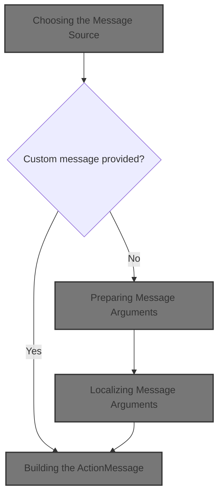
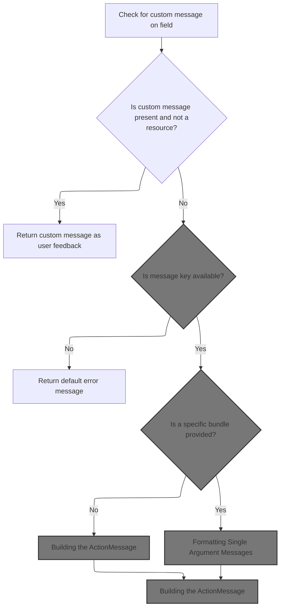
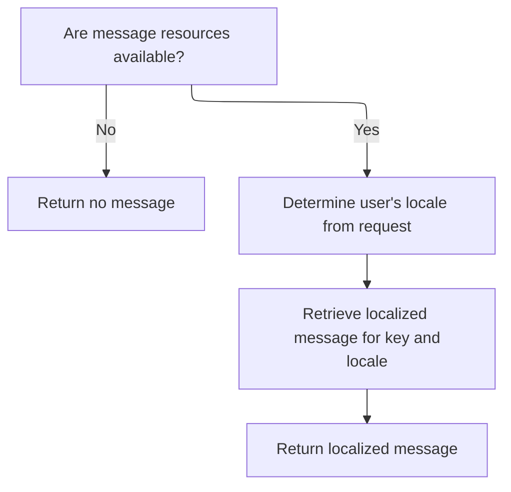
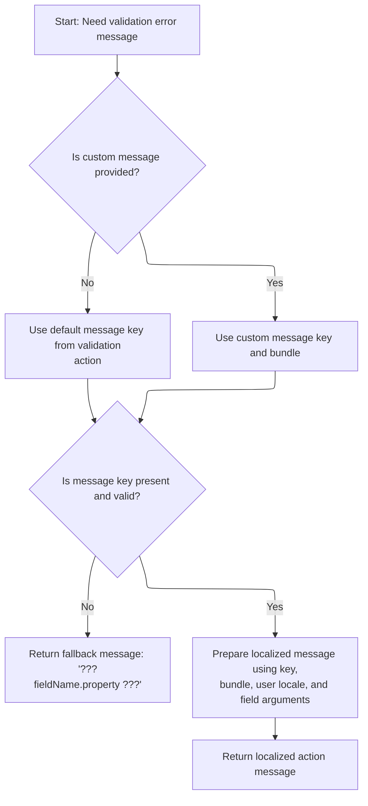
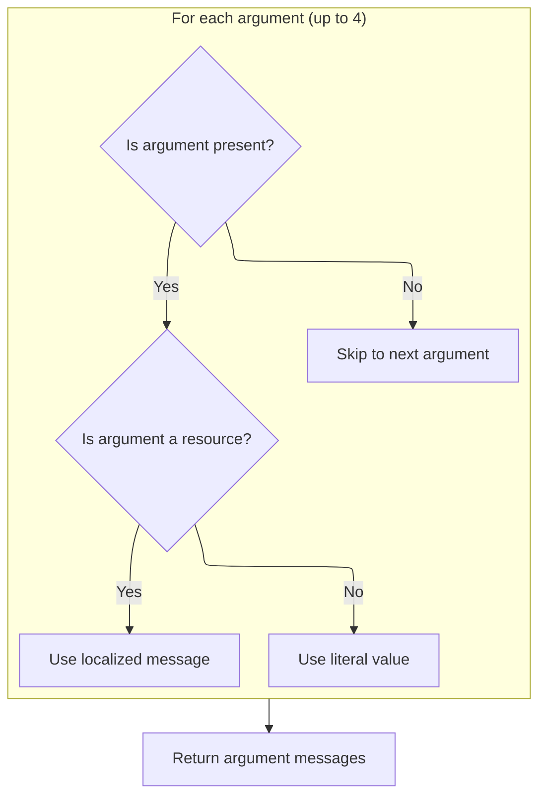
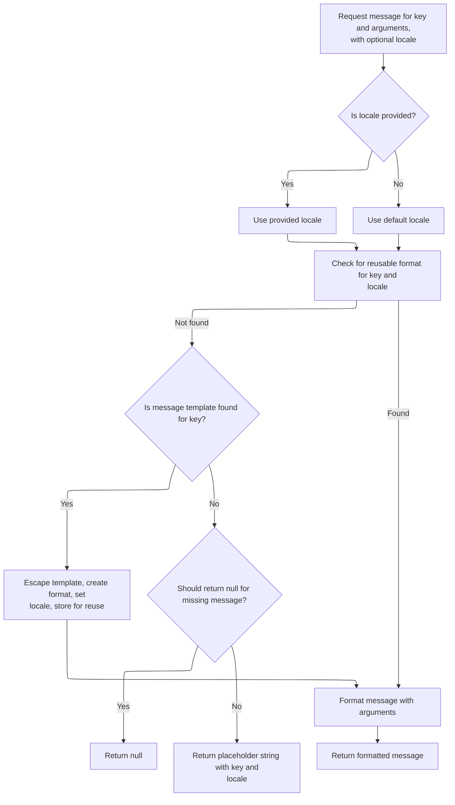
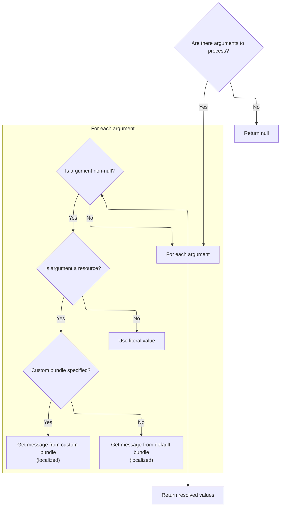

This document describes how the validation system generates a localized message for user input. When a validation rule is triggered, the system selects and localizes the appropriate message, formatting it with relevant arguments to provide clear feedback to the user.



# Where is this flow used?

This flow is used multiple times in the codebase as represented in the following diagram:

(Note - these are only some of the entry points of this flow)

```mermaid
graph TD;
      5f38c92c0089bc234ada4661f6795a68f5d36dce15cbbb313430c4d288d794dd(core/…/validator/FieldChecks.java::FieldChecks.validateUrl) --> 7e0b20bd58e84820d21149fd47dbdda751406d7be4151d0217b168f98dec73a6(core/…/validator/Resources.java::Resources.getActionMessage)

f50a72162003216b991ccf5505187646c4be7cae66f1816bf02f1ed5c9dd2f6e(core/…/validwhen/ValidWhen.java::ValidWhen.validateValidWhen) --> 7e0b20bd58e84820d21149fd47dbdda751406d7be4151d0217b168f98dec73a6(core/…/validator/Resources.java::Resources.getActionMessage)

22114997d330b17bf5d42b98ec3618aea845af6ecd007ade0ea39bf7e079af65(core/…/validator/FieldChecks.java::FieldChecks.validateRequiredIf) --> 7e0b20bd58e84820d21149fd47dbdda751406d7be4151d0217b168f98dec73a6(core/…/validator/Resources.java::Resources.getActionMessage)

b0b33e5c0142ad0ad4388b5478562309766e2e2219109dc49e4943ba864b2286(core/…/validator/FieldChecks.java::FieldChecks.validateDoubleRange) --> 7e0b20bd58e84820d21149fd47dbdda751406d7be4151d0217b168f98dec73a6(core/…/validator/Resources.java::Resources.getActionMessage)

0a1f12139297b7658bc64ed7e55906a5bd8f61549cbae8e607604cf0a2f9a023(core/…/validator/FieldChecks.java::FieldChecks.validateFloatRange) --> 7e0b20bd58e84820d21149fd47dbdda751406d7be4151d0217b168f98dec73a6(core/…/validator/Resources.java::Resources.getActionMessage)


classDef mainFlowStyle color:#000000,fill:#7CB9F4
classDef rootsStyle color:#000000,fill:#00FFF4
classDef Style1 color:#000000,fill:#00FFAA
classDef Style2 color:#000000,fill:#FFFF00
classDef Style3 color:#000000,fill:#AA7CB9

%% Swimm:
%% graph TD;
%%       5f38c92c0089bc234ada4661f6795a68f5d36dce15cbbb313430c4d288d794dd(<SwmPath>[core/…/validator/FieldChecks.java](core/src/main/java/org/apache/struts/validator/FieldChecks.java)</SwmPath>::FieldChecks.validateUrl) --> 7e0b20bd58e84820d21149fd47dbdda751406d7be4151d0217b168f98dec73a6(<SwmPath>[core/…/validator/Resources.java](core/src/main/java/org/apache/struts/validator/Resources.java)</SwmPath>::Resources.getActionMessage)
%% 
%% f50a72162003216b991ccf5505187646c4be7cae66f1816bf02f1ed5c9dd2f6e(<SwmPath>[core/…/validwhen/ValidWhen.java](core/src/main/java/org/apache/struts/validator/validwhen/ValidWhen.java)</SwmPath>::ValidWhen.validateValidWhen) --> 7e0b20bd58e84820d21149fd47dbdda751406d7be4151d0217b168f98dec73a6(<SwmPath>[core/…/validator/Resources.java](core/src/main/java/org/apache/struts/validator/Resources.java)</SwmPath>::Resources.getActionMessage)
%% 
%% 22114997d330b17bf5d42b98ec3618aea845af6ecd007ade0ea39bf7e079af65(<SwmPath>[core/…/validator/FieldChecks.java](core/src/main/java/org/apache/struts/validator/FieldChecks.java)</SwmPath>::FieldChecks.validateRequiredIf) --> 7e0b20bd58e84820d21149fd47dbdda751406d7be4151d0217b168f98dec73a6(<SwmPath>[core/…/validator/Resources.java](core/src/main/java/org/apache/struts/validator/Resources.java)</SwmPath>::Resources.getActionMessage)
%% 
%% b0b33e5c0142ad0ad4388b5478562309766e2e2219109dc49e4943ba864b2286(<SwmPath>[core/…/validator/FieldChecks.java](core/src/main/java/org/apache/struts/validator/FieldChecks.java)</SwmPath>::FieldChecks.validateDoubleRange) --> 7e0b20bd58e84820d21149fd47dbdda751406d7be4151d0217b168f98dec73a6(<SwmPath>[core/…/validator/Resources.java](core/src/main/java/org/apache/struts/validator/Resources.java)</SwmPath>::Resources.getActionMessage)
%% 
%% 0a1f12139297b7658bc64ed7e55906a5bd8f61549cbae8e607604cf0a2f9a023(<SwmPath>[core/…/validator/FieldChecks.java](core/src/main/java/org/apache/struts/validator/FieldChecks.java)</SwmPath>::FieldChecks.validateFloatRange) --> 7e0b20bd58e84820d21149fd47dbdda751406d7be4151d0217b168f98dec73a6(<SwmPath>[core/…/validator/Resources.java](core/src/main/java/org/apache/struts/validator/Resources.java)</SwmPath>::Resources.getActionMessage)
%% 
%% 
%% classDef mainFlowStyle color:#000000,fill:#7CB9F4
%% classDef rootsStyle color:#000000,fill:#00FFF4
%% classDef Style1 color:#000000,fill:#00FFAA
%% classDef Style2 color:#000000,fill:#FFFF00
%% classDef Style3 color:#000000,fill:#AA7CB9
```



# Choosing the Message Source



<SwmSnippet path="/core/src/main/java/org/apache/struts/validator/Resources.java" line="365">

---

In <SwmToken path="core/src/main/java/org/apache/struts/validator/Resources.java" pos="365:7:7" line-data="    public static ActionMessage getActionMessage(Validator validator,">`getActionMessage`</SwmToken>, we check if the field's message is a resource. If not, we return an <SwmToken path="core/src/main/java/org/apache/struts/validator/Resources.java" pos="365:5:5" line-data="    public static ActionMessage getActionMessage(Validator validator,">`ActionMessage`</SwmToken> using its key directly. If it is a resource, we need to fetch the localized message, so we move on to <SwmToken path="core/src/main/java/org/apache/struts/config/ConfigHelper.java" pos="56:4:4" line-data="public class ConfigHelper implements ConfigHelperInterface {">`ConfigHelper`</SwmToken> to handle message retrieval.

```java
    public static ActionMessage getActionMessage(Validator validator,
        HttpServletRequest request, ValidatorAction va, Field field) {
        Msg msg = field.getMessage(va.getName());

        if ((msg != null) && !msg.isResource()) {
            return new ActionMessage(msg.getKey(), false);
        }

```

---

</SwmSnippet>

## Retrieving Localized Messages



<SwmSnippet path="/core/src/main/java/org/apache/struts/config/ConfigHelper.java" line="496">

---

In <SwmToken path="core/src/main/java/org/apache/struts/config/ConfigHelper.java" pos="496:5:5" line-data="    public String getMessage(String key) {">`getMessage`</SwmToken>, we grab the <SwmToken path="core/src/main/java/org/apache/struts/config/ConfigHelper.java" pos="497:1:1" line-data="        MessageResources resources = getMessageResources();">`MessageResources`</SwmToken> and check if they're available. Then we call <SwmToken path="core/src/main/java/org/apache/struts/config/ConfigHelper.java" pos="503:7:9" line-data="        return resources.getMessage(RequestUtils.getUserLocale(request, null),">`RequestUtils.getUserLocale`</SwmToken> to figure out which locale to use for message lookup.

```java
    public String getMessage(String key) {
        MessageResources resources = getMessageResources();

        if (resources == null) {
            return null;
        }

        return resources.getMessage(RequestUtils.getUserLocale(request, null),
```

---

</SwmSnippet>

<SwmSnippet path="/core/src/main/java/org/apache/struts/util/RequestUtils.java" line="299">

---

<SwmToken path="core/src/main/java/org/apache/struts/util/RequestUtils.java" pos="299:7:7" line-data="    public static Locale getUserLocale(HttpServletRequest request, String locale) {">`getUserLocale`</SwmToken> checks for a Locale in the session using the provided key (or <SwmToken path="core/src/main/java/org/apache/struts/util/RequestUtils.java" pos="304:5:7" line-data="            locale = Globals.LOCALE_KEY;">`Globals.LOCALE_KEY`</SwmToken> if none). If nothing is found, it falls back to the request's locale, so we always get a valid Locale for message lookup.

```java
    public static Locale getUserLocale(HttpServletRequest request, String locale) {
        Locale userLocale = null;
        HttpSession session = request.getSession(false);

        if (locale == null) {
            locale = Globals.LOCALE_KEY;
        }

        // Only check session if sessions are enabled
        if (session != null) {
            userLocale = (Locale) session.getAttribute(locale);
        }

        if (userLocale == null) {
            // Returns Locale based on Accept-Language header or the server default
            userLocale = request.getLocale();
        }

        return userLocale;
    }
```

---

</SwmSnippet>

<SwmSnippet path="/core/src/main/java/org/apache/struts/config/ConfigHelper.java" line="503">

---

Back in `ConfigHelper.getMessage`, after getting the user's locale from <SwmToken path="core/src/main/java/org/apache/struts/config/ConfigHelper.java" pos="503:7:7" line-data="        return resources.getMessage(RequestUtils.getUserLocale(request, null),">`RequestUtils`</SwmToken>, we use it to fetch the message string from <SwmToken path="core/src/main/java/org/apache/struts/validator/Resources.java" pos="117:5:5" line-data="    public static MessageResources getMessageResources(">`MessageResources`</SwmToken>. Next, we call Resources.getMessage to handle the actual retrieval.

```java
        return resources.getMessage(RequestUtils.getUserLocale(request, null),
            key);
    }
```

---

</SwmSnippet>

<SwmSnippet path="/core/src/main/java/org/apache/struts/validator/Resources.java" line="249">

---

<SwmToken path="core/src/main/java/org/apache/struts/validator/Resources.java" pos="249:7:7" line-data="    public static String getMessage(HttpServletRequest request, String key) {">`getMessage`</SwmToken> grabs <SwmToken path="core/src/main/java/org/apache/struts/validator/Resources.java" pos="250:1:1" line-data="        MessageResources messages = getMessageResources(request);">`MessageResources`</SwmToken> from the request and then calls <SwmToken path="core/src/main/java/org/apache/struts/validator/Resources.java" pos="252:8:10" line-data="        return getMessage(messages, RequestUtils.getUserLocale(request, null),">`RequestUtils.getUserLocale`</SwmToken> to make sure we're using the right locale for message lookup.

```java
    public static String getMessage(HttpServletRequest request, String key) {
        MessageResources messages = getMessageResources(request);

        return getMessage(messages, RequestUtils.getUserLocale(request, null),
            key);
    }
```

---

</SwmSnippet>

## Preparing Message Arguments



<SwmSnippet path="/core/src/main/java/org/apache/struts/validator/Resources.java" line="373">

---

Back in <SwmToken path="core/src/main/java/org/apache/struts/validator/Resources.java" pos="365:7:7" line-data="    public static ActionMessage getActionMessage(Validator validator,">`getActionMessage`</SwmToken>, after handling the message key and bundle, we call <SwmToken path="core/src/main/java/org/apache/struts/validator/Resources.java" pos="391:1:1" line-data="            getMessageResources(application, request, msgBundle);">`getMessageResources`</SwmToken> to fetch the right <SwmToken path="core/src/main/java/org/apache/struts/validator/Resources.java" pos="390:1:1" line-data="        MessageResources messages =">`MessageResources`</SwmToken> for the current context and bundle.

```java
        String msgKey = null;
        String msgBundle = null;

        if (msg == null) {
            msgKey = va.getMsg();
        } else {
            msgKey = msg.getKey();
            msgBundle = msg.getBundle();
        }

        if ((msgKey == null) || (msgKey.length() == 0)) {
            return new ActionMessage("??? " + va.getName() + "."
                + field.getProperty() + " ???", false);
        }

        ServletContext application =
            (ServletContext) validator.getParameterValue(SERVLET_CONTEXT_PARAM);
        MessageResources messages =
            getMessageResources(application, request, msgBundle);
```

---

</SwmSnippet>

<SwmSnippet path="/core/src/main/java/org/apache/struts/validator/Resources.java" line="117">

---

<SwmToken path="core/src/main/java/org/apache/struts/validator/Resources.java" pos="117:7:7" line-data="    public static MessageResources getMessageResources(">`getMessageResources`</SwmToken> looks for <SwmToken path="core/src/main/java/org/apache/struts/validator/Resources.java" pos="117:5:5" line-data="    public static MessageResources getMessageResources(">`MessageResources`</SwmToken> in the request, then in the application using the module prefix, and finally just the bundle name. This fallback covers different deployment setups and modular configs.

```java
    public static MessageResources getMessageResources(
        ServletContext application, HttpServletRequest request, String bundle) {
        if (bundle == null) {
            bundle = Globals.MESSAGES_KEY;
        }

        MessageResources resources =
            (MessageResources) request.getAttribute(bundle);

        if (resources == null) {
            ModuleConfig moduleConfig =
                ModuleUtils.getInstance().getModuleConfig(request, application);

            resources =
                (MessageResources) application.getAttribute(bundle
                    + moduleConfig.getPrefix());
        }

        if (resources == null) {
            resources = (MessageResources) application.getAttribute(bundle);
        }

        if (resources == null) {
            throw new NullPointerException(
                "No message resources found for bundle: " + bundle);
        }

        return resources;
    }
```

---

</SwmSnippet>

<SwmSnippet path="/core/src/main/java/org/apache/struts/validator/Resources.java" line="392">

---

Back in <SwmToken path="core/src/main/java/org/apache/struts/validator/Resources.java" pos="365:7:7" line-data="    public static ActionMessage getActionMessage(Validator validator,">`getActionMessage`</SwmToken>, after getting <SwmToken path="core/src/main/java/org/apache/struts/validator/Resources.java" pos="117:5:5" line-data="    public static MessageResources getMessageResources(">`MessageResources`</SwmToken>, we call <SwmToken path="core/src/main/java/org/apache/struts/validator/Resources.java" pos="392:7:9" line-data="        Locale locale = RequestUtils.getUserLocale(request, null);">`RequestUtils.getUserLocale`</SwmToken> to make sure we have the right locale for formatting message arguments.

```java
        Locale locale = RequestUtils.getUserLocale(request, null);

```

---

</SwmSnippet>

<SwmSnippet path="/core/src/main/java/org/apache/struts/validator/Resources.java" line="394">

---

Back in <SwmToken path="core/src/main/java/org/apache/struts/validator/Resources.java" pos="365:7:7" line-data="    public static ActionMessage getActionMessage(Validator validator,">`getActionMessage`</SwmToken>, after getting the locale, we fetch the arguments for the message using <SwmToken path="core/src/main/java/org/apache/struts/validator/Resources.java" pos="394:11:11" line-data="        Arg[] args = field.getArgs(va.getName());">`getArgs`</SwmToken>, so we can substitute them into the message template.

```java
        Arg[] args = field.getArgs(va.getName());
```

---

</SwmSnippet>

## Localizing Message Arguments



<SwmSnippet path="/core/src/main/java/org/apache/struts/validator/Resources.java" line="420">

---

<SwmToken path="core/src/main/java/org/apache/struts/validator/Resources.java" pos="420:9:9" line-data="    public static String[] getArgs(String actionName,">`getArgs`</SwmToken> grabs up to four arguments from the field, checks if each needs localization, and uses <SwmToken path="core/src/main/java/org/apache/struts/validator/Resources.java" pos="436:8:8" line-data="                argMessages[i] = getMessage(messages, locale, args[i].getKey());">`getMessage`</SwmToken> to fetch localized strings for resource args.

```java
    public static String[] getArgs(String actionName,
        MessageResources messages, Locale locale, Field field) {
        String[] argMessages = new String[4];

        Arg[] args =
            new Arg[] {
                field.getArg(actionName, 0), field.getArg(actionName, 1),
                field.getArg(actionName, 2), field.getArg(actionName, 3)
            };

        for (int i = 0; i < args.length; i++) {
            if (args[i] == null) {
                continue;
            }

            if (args[i].isResource()) {
                argMessages[i] = getMessage(messages, locale, args[i].getKey());
            } else {
                argMessages[i] = args[i].getKey();
            }
        }

        return argMessages;
    }
```

---

</SwmSnippet>

## Fetching Argument Messages

<SwmSnippet path="/core/src/main/java/org/apache/struts/validator/Resources.java" line="231">

---

<SwmToken path="core/src/main/java/org/apache/struts/validator/Resources.java" pos="231:7:7" line-data="    public static String getMessage(MessageResources messages, Locale locale,">`getMessage`</SwmToken> checks if <SwmToken path="core/src/main/java/org/apache/struts/validator/Resources.java" pos="231:9:9" line-data="    public static String getMessage(MessageResources messages, Locale locale,">`MessageResources`</SwmToken> is available, then calls <SwmToken path="core/src/main/java/org/apache/struts/validator/Resources.java" pos="236:5:7" line-data="            message = messages.getMessage(locale, key);">`messages.getMessage`</SwmToken> to fetch the string for the given locale and key.

```java
    public static String getMessage(MessageResources messages, Locale locale,
        String key) {
        String message = null;

        if (messages != null) {
            message = messages.getMessage(locale, key);
        }

        return (message == null) ? "" : message;
    }
```

---

</SwmSnippet>

## Formatting Single Argument Messages

<SwmSnippet path="/core/src/main/java/org/apache/struts/util/MessageResources.java" line="218">

---

<SwmToken path="core/src/main/java/org/apache/struts/util/MessageResources.java" pos="218:5:5" line-data="    public String getMessage(String key, Object arg0) {">`getMessage`</SwmToken> takes a single argument and passes it as an array to the three-argument version, so formatting is consistent.

```java
    public String getMessage(String key, Object arg0) {
        return this.getMessage((Locale) null, key, arg0);
    }
```

---

</SwmSnippet>

## Formatting Multiple Argument Messages



<SwmSnippet path="/core/src/main/java/org/apache/struts/util/MessageResources.java" line="324">

---

<SwmToken path="core/src/main/java/org/apache/struts/util/MessageResources.java" pos="324:5:5" line-data="    public String getMessage(Locale locale, String key, Object arg0) {">`getMessage`</SwmToken> takes the locale, key, and argument array, then calls the four-argument version to handle formatting and caching.

```java
    public String getMessage(Locale locale, String key, Object arg0) {
        return this.getMessage(locale, key, new Object[] { arg0 });
    }
```

---

</SwmSnippet>

<SwmSnippet path="/core/src/main/java/org/apache/struts/util/MessageResources.java" line="286">

---

<SwmToken path="core/src/main/java/org/apache/struts/util/MessageResources.java" pos="286:5:5" line-data="    public String getMessage(Locale locale, String key, Object[] args) {">`getMessage`</SwmToken> checks the cache for a <SwmToken path="core/src/main/java/org/apache/struts/util/MessageResources.java" pos="287:5:5" line-data="        // Cache MessageFormat instances as they are accessed">`MessageFormat`</SwmToken> for the locale and key, creates one if needed, escapes the format string, and formats the message with the arguments. If the message is missing, it returns a visible placeholder.

```java
    public String getMessage(Locale locale, String key, Object[] args) {
        // Cache MessageFormat instances as they are accessed
        if (locale == null) {
            locale = defaultLocale;
        }

        MessageFormat format = null;
        String formatKey = messageKey(locale, key);

        synchronized (formats) {
            format = (MessageFormat) formats.get(formatKey);

            if (format == null) {
                String formatString = getMessage(locale, key);

                if (formatString == null) {
                    return returnNull ? null : ("???" + formatKey + "???");
                }

                format = new MessageFormat(escape(formatString));
                format.setLocale(locale);
                formats.put(formatKey, format);
            }
        }

        return format.format(args);
    }
```

---

</SwmSnippet>

## Substituting Argument Values

<SwmSnippet path="/core/src/main/java/org/apache/struts/validator/Resources.java" line="395">

---

Back in <SwmToken path="core/src/main/java/org/apache/struts/validator/Resources.java" pos="365:7:7" line-data="    public static ActionMessage getActionMessage(Validator validator,">`getActionMessage`</SwmToken>, after getting the argument keys, we call <SwmToken path="core/src/main/java/org/apache/struts/validator/Resources.java" pos="396:1:1" line-data="            getArgValues(application, request, messages, locale, args);">`getArgValues`</SwmToken> to resolve the actual strings for substitution, handling localization and bundle lookup as needed.

```java
        String[] argValues =
            getArgValues(application, request, messages, locale, args);

```

---

</SwmSnippet>

## Resolving Argument Strings



<SwmSnippet path="/core/src/main/java/org/apache/struts/validator/Resources.java" line="455">

---

In <SwmToken path="core/src/main/java/org/apache/struts/validator/Resources.java" pos="455:9:9" line-data="    private static String[] getArgValues(ServletContext application,">`getArgValues`</SwmToken>, for each argument, if it needs localization and has a bundle, we fetch the right <SwmToken path="core/src/main/java/org/apache/struts/validator/Resources.java" pos="456:6:6" line-data="        HttpServletRequest request, MessageResources defaultMessages,">`MessageResources`</SwmToken> using <SwmToken path="core/src/main/java/org/apache/struts/validator/Resources.java" pos="471:1:1" line-data="                            getMessageResources(application, request,">`getMessageResources`</SwmToken> before resolving the string.

```java
    private static String[] getArgValues(ServletContext application,
        HttpServletRequest request, MessageResources defaultMessages,
        Locale locale, Arg[] args) {
        if ((args == null) || (args.length == 0)) {
            return null;
        }

        String[] values = new String[args.length];

        for (int i = 0; i < args.length; i++) {
            if (args[i] != null) {
                if (args[i].isResource()) {
                    MessageResources messages = defaultMessages;

                    if (args[i].getBundle() != null) {
                        messages =
                            getMessageResources(application, request,
                                args[i].getBundle());
                    }

```

---

</SwmSnippet>

<SwmSnippet path="/core/src/main/java/org/apache/struts/validator/Resources.java" line="475">

---

Back in <SwmToken path="core/src/main/java/org/apache/struts/validator/Resources.java" pos="396:1:1" line-data="            getArgValues(application, request, messages, locale, args);">`getArgValues`</SwmToken>, after fetching the right <SwmToken path="core/src/main/java/org/apache/struts/validator/Resources.java" pos="117:5:5" line-data="    public static MessageResources getMessageResources(">`MessageResources`</SwmToken>, we resolve each argument to its localized string or use the key directly, so the final message is ready for formatting.

```java
                    values[i] = messages.getMessage(locale, args[i].getKey());
                } else {
                    values[i] = args[i].getKey();
                }
            }
        }

        return values;
    }
```

---

</SwmSnippet>

## Building the <SwmToken path="core/src/main/java/org/apache/struts/validator/Resources.java" pos="365:5:5" line-data="    public static ActionMessage getActionMessage(Validator validator,">`ActionMessage`</SwmToken>

<SwmSnippet path="/core/src/main/java/org/apache/struts/validator/Resources.java" line="398">

---

Back in <SwmToken path="core/src/main/java/org/apache/struts/validator/Resources.java" pos="365:7:7" line-data="    public static ActionMessage getActionMessage(Validator validator,">`getActionMessage`</SwmToken>, after resolving argument values, we either create <SwmToken path="core/src/main/java/org/apache/struts/validator/Resources.java" pos="398:1:1" line-data="        ActionMessage actionMessage = null;">`ActionMessage`</SwmToken> with the key and values or fetch the formatted message string using <SwmToken path="core/src/main/java/org/apache/struts/validator/Resources.java" pos="403:7:9" line-data="            String message = messages.getMessage(locale, msgKey, argValues);">`messages.getMessage`</SwmToken>, depending on whether <SwmToken path="core/src/main/java/org/apache/struts/validator/Resources.java" pos="400:4:4" line-data="        if (msgBundle == null) {">`msgBundle`</SwmToken> is set.

```java
        ActionMessage actionMessage = null;

        if (msgBundle == null) {
            actionMessage = new ActionMessage(msgKey, argValues);
        } else {
            String message = messages.getMessage(locale, msgKey, argValues);

            actionMessage = new ActionMessage(message, false);
        }

        return actionMessage;
    }
```

---

</SwmSnippet>

&nbsp;

*This is an auto-generated document by Swimm 🌊 and has not yet been verified by a human*

<SwmMeta version="3.0.0" repo-id="Z2l0aHViJTNBJTNBc3RydXRzMSUzQSUzQVN3aW1tLURlbW8=" repo-name="struts1"><sup>Powered by [Swimm](https://app.swimm.io/)</sup></SwmMeta>
