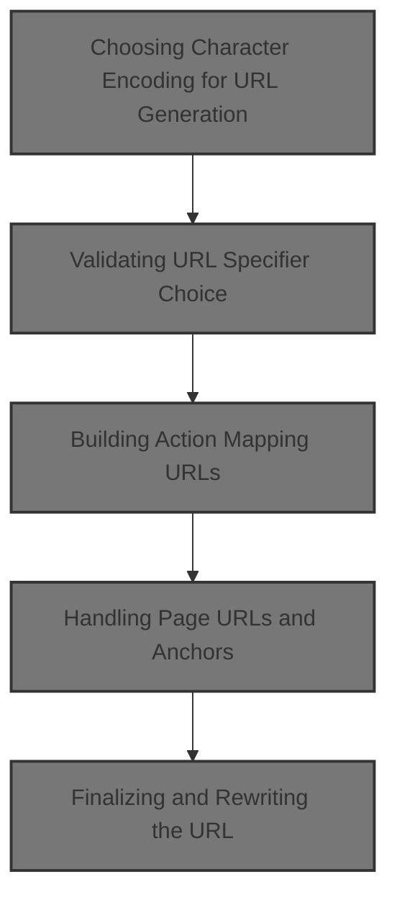
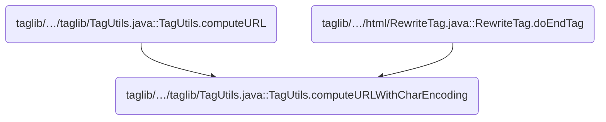
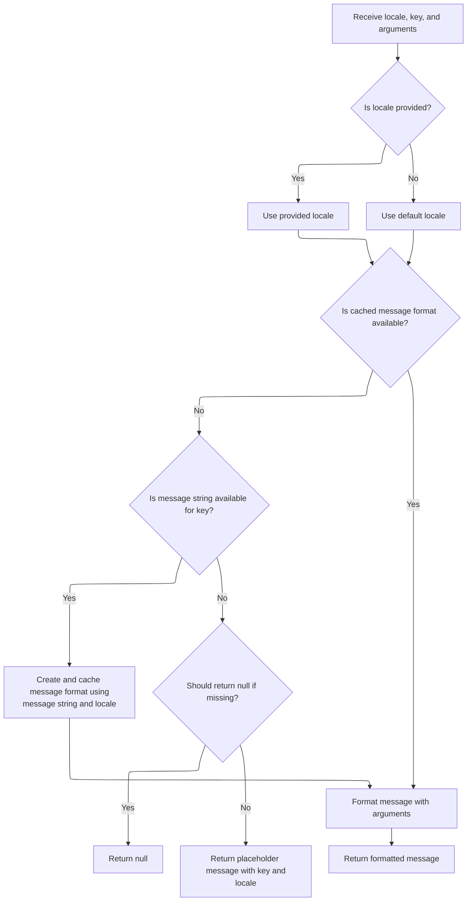
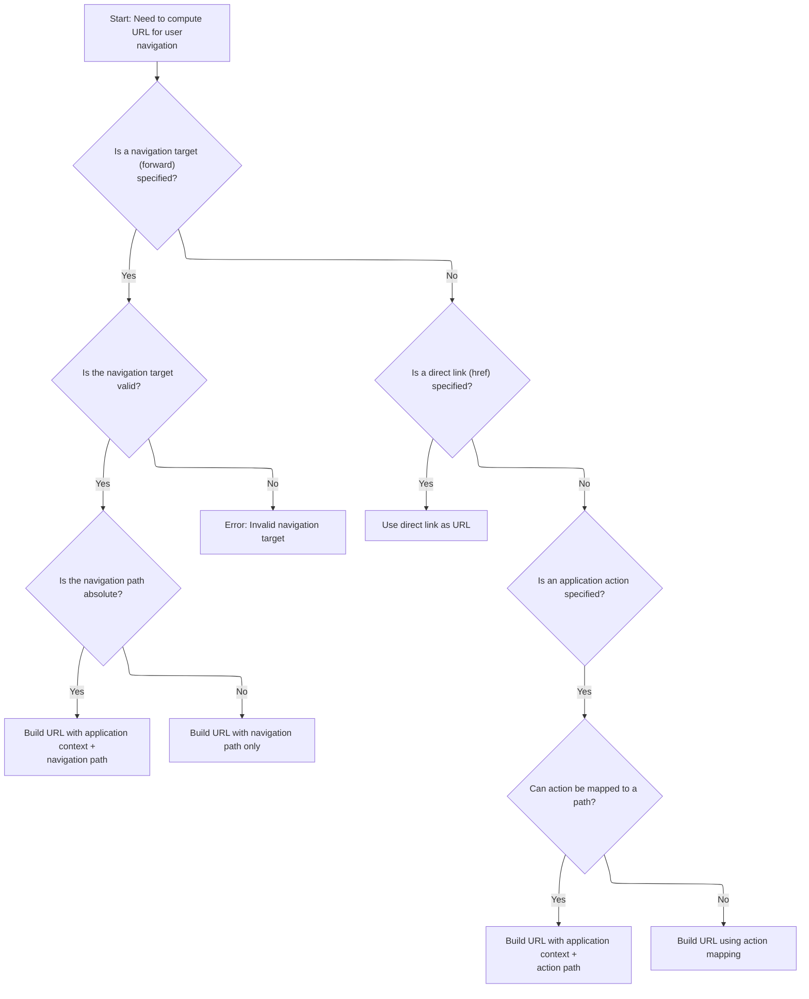
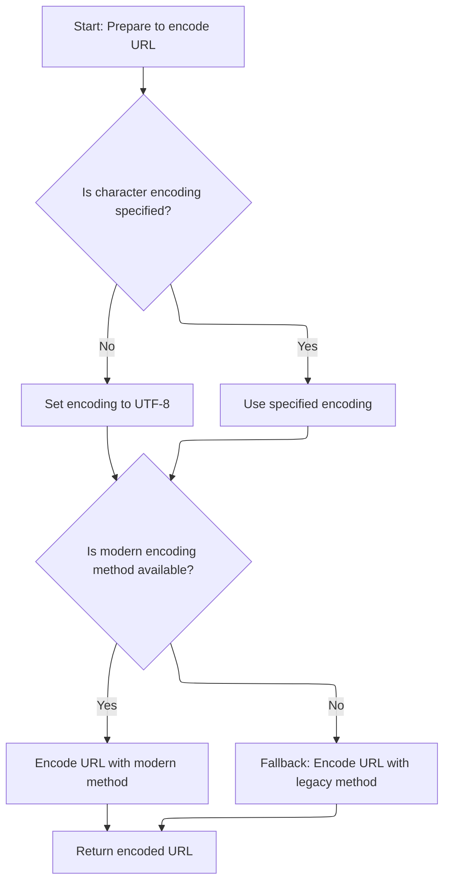
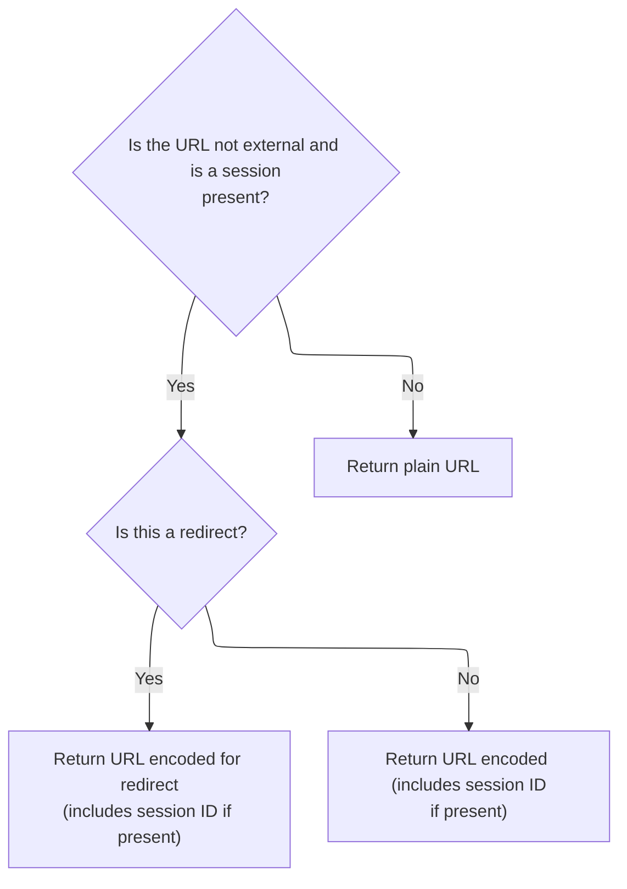

```mermaid
%%{init: {"flowchart": {"defaultRenderer": "elk"}} }%%
flowchart TD
    node1["Start: Build action URL"] --> node2{"Is context path longer than 1?"}
    click node1 openCode "taglib/src/main/java/org/apache/struts/taglib/TagUtils.java:654:716"
    node2 -->|"Yes"| node3["Add context path"]
    node2 -->|"No"| node4["Skip context path"]
    node3 --> node5{"Add module prefix? (moduleConfig exists
and not context-relative)"}
    node4 --> node5
    node5 -->|"Yes"| node6["Add module prefix"]
    node5 -->|"No"| node7["Skip module prefix"]
    node6 --> node8{"Is servlet mapping specified?"}
    node7 --> node8
    node8 -->|"Yes"| node9{"Servlet mapping type"}
    node8 -->|"No"| node12{"Does action start with '/'?"}
    node9 -->|"Extension mapping (e.g. *.do)"| node10["Add action mapping and extension"]
    node9 -->|"Path mapping (e.g. /app/*)"| node11["Add servlet path and action mapping"]
    node9 -->|"Root mapping (/)"| node13["Add action mapping"]
    node10 --> node14{"Action has query string?"}
    node11 --> node14
    node13 --> node14
    node14 -->|"Yes"| node15["Append query string"]
    node14 -->|"No"| node16["Return URL"]
    node12 -->|"No"| node17["Add leading slash and action to URL"]
    node12 -->|"Yes"| node18["Add action to URL"]
    node17 --> node16
    node18 --> node16
    node15 --> node16
    node16["Return final URL"]
    click node2 openCode "taglib/src/main/java/org/apache/struts/taglib/TagUtils.java:665:667"
    click node3 openCode "taglib/src/main/java/org/apache/struts/taglib/TagUtils.java:665:667"
    click node4 openCode "taglib/src/main/java/org/apache/struts/taglib/TagUtils.java:665:667"
    click node5 openCode "taglib/src/main/java/org/apache/struts/taglib/TagUtils.java:671:673"
    click node6 openCode "taglib/src/main/java/org/apache/struts/taglib/TagUtils.java:671:673"
    click node7 openCode "taglib/src/main/java/org/apache/struts/taglib/TagUtils.java:671:673"
    click node8 openCode "taglib/src/main/java/org/apache/struts/taglib/TagUtils.java:680:704"
    click node9 openCode "taglib/src/main/java/org/apache/struts/taglib/TagUtils.java:690:699"
    click node10 openCode "taglib/src/main/java/org/apache/struts/taglib/TagUtils.java:691:692"
    click node11 openCode "taglib/src/main/java/org/apache/struts/taglib/TagUtils.java:694:696"
    click node13 openCode "taglib/src/main/java/org/apache/struts/taglib/TagUtils.java:698:698"
    click node14 openCode "taglib/src/main/java/org/apache/struts/taglib/TagUtils.java:684:686"
    click node15 openCode "taglib/src/main/java/org/apache/struts/taglib/TagUtils.java:701:702"
    click node16 openCode "taglib/src/main/java/org/apache/struts/taglib/TagUtils.java:715:716"
    click node12 openCode "taglib/src/main/java/org/apache/struts/taglib/TagUtils.java:708:710"
    click node17 openCode "taglib/src/main/java/org/apache/struts/taglib/TagUtils.java:709:712"
    click node18 openCode "taglib/src/main/java/org/apache/struts/taglib/TagUtils.java:712:712"

classDef HeadingStyle fill:#777777,stroke:#333,stroke-width:2px;

%% Swimm:
%% %%{init: {"flowchart": {"defaultRenderer": "elk"}} }%%
%% flowchart TD
%%     node1["Start: Build action URL"] --> node2{"Is context path longer than 1?"}
%%     click node1 openCode "<SwmPath>[taglib/…/taglib/TagUtils.java](taglib/src/main/java/org/apache/struts/taglib/TagUtils.java)</SwmPath>:654:716"
%%     node2 -->|"Yes"| node3["Add context path"]
%%     node2 -->|"No"| node4["Skip context path"]
%%     node3 --> node5{"Add module prefix? (<SwmToken path="taglib/src/main/java/org/apache/struts/taglib/TagUtils.java" pos="403:3:3" line-data="        ModuleConfig moduleConfig = getModuleConfig(module, pageContext);">`moduleConfig`</SwmToken> exists
%% and not <SwmToken path="taglib/src/main/java/org/apache/struts/taglib/TagUtils.java" pos="306:3:5" line-data="     *                    context-relative URI (if specified)">`context-relative`</SwmToken>)"}
%%     node4 --> node5
%%     node5 -->|"Yes"| node6["Add module prefix"]
%%     node5 -->|"No"| node7["Skip module prefix"]
%%     node6 --> node8{"Is servlet mapping specified?"}
%%     node7 --> node8
%%     node8 -->|"Yes"| node9{"Servlet mapping type"}
%%     node8 -->|"No"| node12{"Does action start with '/'?"}
%%     node9 -->|"Extension mapping (e.g. *.do)"| node10["Add action mapping and extension"]
%%     node9 -->|"Path mapping (e.g. /app/*)"| node11["Add servlet path and action mapping"]
%%     node9 -->|"Root mapping (/)"| node13["Add action mapping"]
%%     node10 --> node14{"Action has query string?"}
%%     node11 --> node14
%%     node13 --> node14
%%     node14 -->|"Yes"| node15["Append query string"]
%%     node14 -->|"No"| node16["Return URL"]
%%     node12 -->|"No"| node17["Add leading slash and action to URL"]
%%     node12 -->|"Yes"| node18["Add action to URL"]
%%     node17 --> node16
%%     node18 --> node16
%%     node15 --> node16
%%     node16["Return final URL"]
%%     click node2 openCode "<SwmPath>[taglib/…/taglib/TagUtils.java](taglib/src/main/java/org/apache/struts/taglib/TagUtils.java)</SwmPath>:665:667"
%%     click node3 openCode "<SwmPath>[taglib/…/taglib/TagUtils.java](taglib/src/main/java/org/apache/struts/taglib/TagUtils.java)</SwmPath>:665:667"
%%     click node4 openCode "<SwmPath>[taglib/…/taglib/TagUtils.java](taglib/src/main/java/org/apache/struts/taglib/TagUtils.java)</SwmPath>:665:667"
%%     click node5 openCode "<SwmPath>[taglib/…/taglib/TagUtils.java](taglib/src/main/java/org/apache/struts/taglib/TagUtils.java)</SwmPath>:671:673"
%%     click node6 openCode "<SwmPath>[taglib/…/taglib/TagUtils.java](taglib/src/main/java/org/apache/struts/taglib/TagUtils.java)</SwmPath>:671:673"
%%     click node7 openCode "<SwmPath>[taglib/…/taglib/TagUtils.java](taglib/src/main/java/org/apache/struts/taglib/TagUtils.java)</SwmPath>:671:673"
%%     click node8 openCode "<SwmPath>[taglib/…/taglib/TagUtils.java](taglib/src/main/java/org/apache/struts/taglib/TagUtils.java)</SwmPath>:680:704"
%%     click node9 openCode "<SwmPath>[taglib/…/taglib/TagUtils.java](taglib/src/main/java/org/apache/struts/taglib/TagUtils.java)</SwmPath>:690:699"
%%     click node10 openCode "<SwmPath>[taglib/…/taglib/TagUtils.java](taglib/src/main/java/org/apache/struts/taglib/TagUtils.java)</SwmPath>:691:692"
%%     click node11 openCode "<SwmPath>[taglib/…/taglib/TagUtils.java](taglib/src/main/java/org/apache/struts/taglib/TagUtils.java)</SwmPath>:694:696"
%%     click node13 openCode "<SwmPath>[taglib/…/taglib/TagUtils.java](taglib/src/main/java/org/apache/struts/taglib/TagUtils.java)</SwmPath>:698:698"
%%     click node14 openCode "<SwmPath>[taglib/…/taglib/TagUtils.java](taglib/src/main/java/org/apache/struts/taglib/TagUtils.java)</SwmPath>:684:686"
%%     click node15 openCode "<SwmPath>[taglib/…/taglib/TagUtils.java](taglib/src/main/java/org/apache/struts/taglib/TagUtils.java)</SwmPath>:701:702"
%%     click node16 openCode "<SwmPath>[taglib/…/taglib/TagUtils.java](taglib/src/main/java/org/apache/struts/taglib/TagUtils.java)</SwmPath>:715:716"
%%     click node12 openCode "<SwmPath>[taglib/…/taglib/TagUtils.java](taglib/src/main/java/org/apache/struts/taglib/TagUtils.java)</SwmPath>:708:710"
%%     click node17 openCode "<SwmPath>[taglib/…/taglib/TagUtils.java](taglib/src/main/java/org/apache/struts/taglib/TagUtils.java)</SwmPath>:709:712"
%%     click node18 openCode "<SwmPath>[taglib/…/taglib/TagUtils.java](taglib/src/main/java/org/apache/struts/taglib/TagUtils.java)</SwmPath>:712:712"
%% 
%% classDef HeadingStyle fill:#777777,stroke:#333,stroke-width:2px;
```

```mermaid
%%{init: {"flowchart": {"defaultRenderer": "elk"}} }%%
flowchart TD
  node1["Build base URL with context and page
path"]
  click node1 openCode "taglib/src/main/java/org/apache/struts/taglib/TagUtils.java:444:448"
  node1 --> node2{"Is anchor present?"}
  click node2 openCode "taglib/src/main/java/org/apache/struts/taglib/TagUtils.java:451:461"
  node2 -->|"Yes"| node3["Add anchor to URL"]
  click node3 openCode "taglib/src/main/java/org/apache/struts/taglib/TagUtils.java:451:461"
  node2 -->|"No"| node4{"Are there parameters to add?"}
  node3 --> node4
  click node4 openCode "taglib/src/main/java/org/apache/struts/taglib/TagUtils.java:463:464"
  node4 -->|"Yes"| node5["Prepare to add parameters"]
  node4 -->|"No"| node12["URL is ready"]
  click node5 openCode "taglib/src/main/java/org/apache/struts/taglib/TagUtils.java:465:473"
  node5 --> node6["Choose parameter separator
(redirect/encodeSeparator)"]
  click node6 openCode "taglib/src/main/java/org/apache/struts/taglib/TagUtils.java:477:486"
  node6 --> node7["Check if URL already has parameters"]
  click node7 openCode "taglib/src/main/java/org/apache/struts/taglib/TagUtils.java:489:489"

  subgraph loop1["For each parameter to add"]
    node7 --> node8{"Parameter value type?"}
    click node8 openCode "taglib/src/main/java/org/apache/struts/taglib/TagUtils.java:492:545"
    node8 -->|"Null"| node9["Add key with no value"]
    click node9 openCode "taglib/src/main/java/org/apache/struts/taglib/TagUtils.java:496:506"
    node8 -->|"String"| node10["Add key=value"]
    click node10 openCode "taglib/src/main/java/org/apache/struts/taglib/TagUtils.java:507:517"
    node8 -->|"Array"| node11["Add key=value for each array element"]
    click node11 openCode "taglib/src/main/java/org/apache/struts/taglib/TagUtils.java:518:531"
    node8 -->|"Other"| node13["Add key=value (object as string)"]
    click node13 openCode "taglib/src/main/java/org/apache/struts/taglib/TagUtils.java:532:544"
    node9 --> node8
    node10 --> node8
    node11 --> node8
    node13 --> node8
  end
  node8 --> node14{"Was anchor saved?"}
  click node14 openCode "taglib/src/main/java/org/apache/struts/taglib/TagUtils.java:547:551"
  node14 -->|"Yes"| node15["Re-add anchor to URL"]
  click node15 openCode "taglib/src/main/java/org/apache/struts/taglib/TagUtils.java:547:551"
  node14 -->|"No"| node12
  node15 --> node12
  click node12 openCode "taglib/src/main/java/org/apache/struts/taglib/TagUtils.java:552:552"

classDef HeadingStyle fill:#777777,stroke:#333,stroke-width:2px;

%% Swimm:
%% %%{init: {"flowchart": {"defaultRenderer": "elk"}} }%%
%% flowchart TD
%%   node1["Build base URL with context and page
%% path"]
%%   click node1 openCode "<SwmPath>[taglib/…/taglib/TagUtils.java](taglib/src/main/java/org/apache/struts/taglib/TagUtils.java)</SwmPath>:444:448"
%%   node1 --> node2{"Is anchor present?"}
%%   click node2 openCode "<SwmPath>[taglib/…/taglib/TagUtils.java](taglib/src/main/java/org/apache/struts/taglib/TagUtils.java)</SwmPath>:451:461"
%%   node2 -->|"Yes"| node3["Add anchor to URL"]
%%   click node3 openCode "<SwmPath>[taglib/…/taglib/TagUtils.java](taglib/src/main/java/org/apache/struts/taglib/TagUtils.java)</SwmPath>:451:461"
%%   node2 -->|"No"| node4{"Are there parameters to add?"}
%%   node3 --> node4
%%   click node4 openCode "<SwmPath>[taglib/…/taglib/TagUtils.java](taglib/src/main/java/org/apache/struts/taglib/TagUtils.java)</SwmPath>:463:464"
%%   node4 -->|"Yes"| node5["Prepare to add parameters"]
%%   node4 -->|"No"| node12["URL is ready"]
%%   click node5 openCode "<SwmPath>[taglib/…/taglib/TagUtils.java](taglib/src/main/java/org/apache/struts/taglib/TagUtils.java)</SwmPath>:465:473"
%%   node5 --> node6["Choose parameter separator
%% (redirect/encodeSeparator)"]
%%   click node6 openCode "<SwmPath>[taglib/…/taglib/TagUtils.java](taglib/src/main/java/org/apache/struts/taglib/TagUtils.java)</SwmPath>:477:486"
%%   node6 --> node7["Check if URL already has parameters"]
%%   click node7 openCode "<SwmPath>[taglib/…/taglib/TagUtils.java](taglib/src/main/java/org/apache/struts/taglib/TagUtils.java)</SwmPath>:489:489"
%% 
%%   subgraph loop1["For each parameter to add"]
%%     node7 --> node8{"Parameter value type?"}
%%     click node8 openCode "<SwmPath>[taglib/…/taglib/TagUtils.java](taglib/src/main/java/org/apache/struts/taglib/TagUtils.java)</SwmPath>:492:545"
%%     node8 -->|"Null"| node9["Add key with no value"]
%%     click node9 openCode "<SwmPath>[taglib/…/taglib/TagUtils.java](taglib/src/main/java/org/apache/struts/taglib/TagUtils.java)</SwmPath>:496:506"
%%     node8 -->|"String"| node10["Add key=value"]
%%     click node10 openCode "<SwmPath>[taglib/…/taglib/TagUtils.java](taglib/src/main/java/org/apache/struts/taglib/TagUtils.java)</SwmPath>:507:517"
%%     node8 -->|"Array"| node11["Add key=value for each array element"]
%%     click node11 openCode "<SwmPath>[taglib/…/taglib/TagUtils.java](taglib/src/main/java/org/apache/struts/taglib/TagUtils.java)</SwmPath>:518:531"
%%     node8 -->|"Other"| node13["Add key=value (object as string)"]
%%     click node13 openCode "<SwmPath>[taglib/…/taglib/TagUtils.java](taglib/src/main/java/org/apache/struts/taglib/TagUtils.java)</SwmPath>:532:544"
%%     node9 --> node8
%%     node10 --> node8
%%     node11 --> node8
%%     node13 --> node8
%%   end
%%   node8 --> node14{"Was anchor saved?"}
%%   click node14 openCode "<SwmPath>[taglib/…/taglib/TagUtils.java](taglib/src/main/java/org/apache/struts/taglib/TagUtils.java)</SwmPath>:547:551"
%%   node14 -->|"Yes"| node15["<SwmToken path="taglib/src/main/java/org/apache/struts/taglib/TagUtils.java" pos="547:3:5" line-data="            // Re-add the saved anchor (if any)">`Re-add`</SwmToken> anchor to URL"]
%%   click node15 openCode "<SwmPath>[taglib/…/taglib/TagUtils.java](taglib/src/main/java/org/apache/struts/taglib/TagUtils.java)</SwmPath>:547:551"
%%   node14 -->|"No"| node12
%%   node15 --> node12
%%   click node12 openCode "<SwmPath>[taglib/…/taglib/TagUtils.java](taglib/src/main/java/org/apache/struts/taglib/TagUtils.java)</SwmPath>:552:552"
%% 
%% classDef HeadingStyle fill:#777777,stroke:#333,stroke-width:2px;
```

This document outlines how navigation <SwmToken path="core/src/main/java/org/apache/struts/util/RequestUtils.java" pos="677:9:9" line-data="     * the case for URLs that were originally created from relative or">`URLs`</SwmToken> are generated for use in web applications. The process supports different navigation types, ensures proper encoding, and produces a URL ready for navigation or redirection.



# Where is this flow used?

This flow is used multiple times in the codebase as represented in the following diagram:



# Choosing Character Encoding for URL Generation

```mermaid
%%{init: {"flowchart": {"defaultRenderer": "elk"}} }%%
flowchart TD
  node1["Decide character encoding for URL"] --> node2{"Use local encoding?"}
  click node1 openCode "taglib/src/main/java/org/apache/struts/taglib/TagUtils.java:371:375"
  node2 -->|"Yes"| node3["Accessing the Servlet Response Object"]
  click node2 openCode "taglib/src/main/java/org/apache/struts/taglib/TagUtils.java:373:375"
  node2 -->|"No"| node4["Use UTF-8 encoding"]
  
  click node4 openCode "taglib/src/main/java/org/apache/struts/taglib/TagUtils.java:371:372"
  node3 --> node5["Validate only one URL type specified"]
  node4 --> node5
  click node5 openCode "taglib/src/main/java/org/apache/struts/taglib/TagUtils.java:377:400"
  node5 --> node6{"Exactly one URL type?"}
  node6 -->|"No"| node7["Fetching Error Message for Invalid Specifier"]
  click node6 openCode "taglib/src/main/java/org/apache/struts/taglib/TagUtils.java:397:400"
  
  node6 -->|"Yes"| node8["Resolving the ModuleConfig for the Request"]
  
  node8 --> node9{"Which URL type?"}
  node9 -->|"forward"| node10["Build forward URL"]
  node9 -->|"href"| node11["Use href as URL"]
  node9 -->|"action"| node12["Building Action Mapping URLs"]
  node9 -->|"page"| node13["Build page URL"]
  click node9 openCode "taglib/src/main/java/org/apache/struts/taglib/TagUtils.java:410:448"
  click node10 openCode "taglib/src/main/java/org/apache/struts/taglib/TagUtils.java:410:430"
  click node11 openCode "taglib/src/main/java/org/apache/struts/taglib/TagUtils.java:431:433"
  
  click node13 openCode "taglib/src/main/java/org/apache/struts/taglib/TagUtils.java:444:448"
  node10 --> node14["Add anchor if present"]
  node11 --> node14
  node12 --> node14
  node13 --> node14
  click node14 openCode "taglib/src/main/java/org/apache/struts/taglib/TagUtils.java:450:461"
  node14 --> node15{"Are there parameters?"}
  node15 -->|"Yes"| loop1
  node15 -->|"No"| node17["Continue"]
  click node15 openCode "taglib/src/main/java/org/apache/struts/taglib/TagUtils.java:464:545"
  subgraph loop1["For each parameter in params"]
    node16["Encoding the URL String"]
    
  end
  loop1 --> node17
  node17 --> node18["Re-add anchor if needed"]
  click node18 openCode "taglib/src/main/java/org/apache/struts/taglib/TagUtils.java:547:551"
  node18 --> node19{"Is redirect or session encoding needed?"}
  node19 -->|"Yes"| node20["Applying Encoding and Compatibility Handling"]
  node19 -->|"No"| node21["Return final URL"]
  click node19 openCode "taglib/src/main/java/org/apache/struts/taglib/TagUtils.java:554:565"
  
  click node21 openCode "taglib/src/main/java/org/apache/struts/taglib/TagUtils.java:567:568"

classDef HeadingStyle fill:#777777,stroke:#333,stroke-width:2px;
click node3 goToHeading "Accessing the Servlet Response Object"
node3:::HeadingStyle
click node7 goToHeading "Fetching Error Message for Invalid Specifier"
node7:::HeadingStyle
click node8 goToHeading "Resolving the ModuleConfig for the Request"
node8:::HeadingStyle
click node12 goToHeading "Building Action Mapping URLs"
node12:::HeadingStyle
click node16 goToHeading "Encoding the URL String"
node16:::HeadingStyle
click node20 goToHeading "Applying Encoding and Compatibility Handling"
node20:::HeadingStyle

%% Swimm:
%% %%{init: {"flowchart": {"defaultRenderer": "elk"}} }%%
%% flowchart TD
%%   node1["Decide character encoding for URL"] --> node2{"Use local encoding?"}
%%   click node1 openCode "<SwmPath>[taglib/…/taglib/TagUtils.java](taglib/src/main/java/org/apache/struts/taglib/TagUtils.java)</SwmPath>:371:375"
%%   node2 -->|"Yes"| node3["Accessing the Servlet Response Object"]
%%   click node2 openCode "<SwmPath>[taglib/…/taglib/TagUtils.java](taglib/src/main/java/org/apache/struts/taglib/TagUtils.java)</SwmPath>:373:375"
%%   node2 -->|"No"| node4["Use <SwmToken path="taglib/src/main/java/org/apache/struts/taglib/TagUtils.java" pos="371:8:10" line-data="        String charEncoding = &quot;UTF-8&quot;;">`UTF-8`</SwmToken> encoding"]
%%   
%%   click node4 openCode "<SwmPath>[taglib/…/taglib/TagUtils.java](taglib/src/main/java/org/apache/struts/taglib/TagUtils.java)</SwmPath>:371:372"
%%   node3 --> node5["Validate only one URL type specified"]
%%   node4 --> node5
%%   click node5 openCode "<SwmPath>[taglib/…/taglib/TagUtils.java](taglib/src/main/java/org/apache/struts/taglib/TagUtils.java)</SwmPath>:377:400"
%%   node5 --> node6{"Exactly one URL type?"}
%%   node6 -->|"No"| node7["Fetching Error Message for Invalid Specifier"]
%%   click node6 openCode "<SwmPath>[taglib/…/taglib/TagUtils.java](taglib/src/main/java/org/apache/struts/taglib/TagUtils.java)</SwmPath>:397:400"
%%   
%%   node6 -->|"Yes"| node8["Resolving the <SwmToken path="taglib/src/main/java/org/apache/struts/taglib/TagUtils.java" pos="403:1:1" line-data="        ModuleConfig moduleConfig = getModuleConfig(module, pageContext);">`ModuleConfig`</SwmToken> for the Request"]
%%   
%%   node8 --> node9{"Which URL type?"}
%%   node9 -->|"forward"| node10["Build forward URL"]
%%   node9 -->|"href"| node11["Use href as URL"]
%%   node9 -->|"action"| node12["Building Action Mapping <SwmToken path="core/src/main/java/org/apache/struts/util/RequestUtils.java" pos="677:9:9" line-data="     * the case for URLs that were originally created from relative or">`URLs`</SwmToken>"]
%%   node9 -->|"page"| node13["Build page URL"]
%%   click node9 openCode "<SwmPath>[taglib/…/taglib/TagUtils.java](taglib/src/main/java/org/apache/struts/taglib/TagUtils.java)</SwmPath>:410:448"
%%   click node10 openCode "<SwmPath>[taglib/…/taglib/TagUtils.java](taglib/src/main/java/org/apache/struts/taglib/TagUtils.java)</SwmPath>:410:430"
%%   click node11 openCode "<SwmPath>[taglib/…/taglib/TagUtils.java](taglib/src/main/java/org/apache/struts/taglib/TagUtils.java)</SwmPath>:431:433"
%%   
%%   click node13 openCode "<SwmPath>[taglib/…/taglib/TagUtils.java](taglib/src/main/java/org/apache/struts/taglib/TagUtils.java)</SwmPath>:444:448"
%%   node10 --> node14["Add anchor if present"]
%%   node11 --> node14
%%   node12 --> node14
%%   node13 --> node14
%%   click node14 openCode "<SwmPath>[taglib/…/taglib/TagUtils.java](taglib/src/main/java/org/apache/struts/taglib/TagUtils.java)</SwmPath>:450:461"
%%   node14 --> node15{"Are there parameters?"}
%%   node15 -->|"Yes"| loop1
%%   node15 -->|"No"| node17["Continue"]
%%   click node15 openCode "<SwmPath>[taglib/…/taglib/TagUtils.java](taglib/src/main/java/org/apache/struts/taglib/TagUtils.java)</SwmPath>:464:545"
%%   subgraph loop1["For each parameter in params"]
%%     node16["Encoding the URL String"]
%%     
%%   end
%%   loop1 --> node17
%%   node17 --> node18["<SwmToken path="taglib/src/main/java/org/apache/struts/taglib/TagUtils.java" pos="547:3:5" line-data="            // Re-add the saved anchor (if any)">`Re-add`</SwmToken> anchor if needed"]
%%   click node18 openCode "<SwmPath>[taglib/…/taglib/TagUtils.java](taglib/src/main/java/org/apache/struts/taglib/TagUtils.java)</SwmPath>:547:551"
%%   node18 --> node19{"Is redirect or session encoding needed?"}
%%   node19 -->|"Yes"| node20["Applying Encoding and Compatibility Handling"]
%%   node19 -->|"No"| node21["Return final URL"]
%%   click node19 openCode "<SwmPath>[taglib/…/taglib/TagUtils.java](taglib/src/main/java/org/apache/struts/taglib/TagUtils.java)</SwmPath>:554:565"
%%   
%%   click node21 openCode "<SwmPath>[taglib/…/taglib/TagUtils.java](taglib/src/main/java/org/apache/struts/taglib/TagUtils.java)</SwmPath>:567:568"
%% 
%% classDef HeadingStyle fill:#777777,stroke:#333,stroke-width:2px;
%% click node3 goToHeading "Accessing the Servlet Response Object"
%% node3:::HeadingStyle
%% click node7 goToHeading "Fetching Error Message for Invalid Specifier"
%% node7:::HeadingStyle
%% click node8 goToHeading "Resolving the <SwmToken path="taglib/src/main/java/org/apache/struts/taglib/TagUtils.java" pos="403:1:1" line-data="        ModuleConfig moduleConfig = getModuleConfig(module, pageContext);">`ModuleConfig`</SwmToken> for the Request"
%% node8:::HeadingStyle
%% click node12 goToHeading "Building Action Mapping <SwmToken path="core/src/main/java/org/apache/struts/util/RequestUtils.java" pos="677:9:9" line-data="     * the case for URLs that were originally created from relative or">`URLs`</SwmToken>"
%% node12:::HeadingStyle
%% click node16 goToHeading "Encoding the URL String"
%% node16:::HeadingStyle
%% click node20 goToHeading "Applying Encoding and Compatibility Handling"
%% node20:::HeadingStyle
```



<SwmSnippet path="/taglib/src/main/java/org/apache/struts/taglib/TagUtils.java" line="366">

---

In <SwmToken path="taglib/src/main/java/org/apache/struts/taglib/TagUtils.java" pos="366:5:5" line-data="    public String computeURLWithCharEncoding(PageContext pageContext,">`computeURLWithCharEncoding`</SwmToken>, we decide which character encoding to use for the URL. If <SwmToken path="taglib/src/main/java/org/apache/struts/taglib/TagUtils.java" pos="369:3:3" line-data="        boolean useLocalEncoding)">`useLocalEncoding`</SwmToken> is true, we grab the encoding from the servlet response, which means we need to call <SwmToken path="taglib/src/main/java/org/apache/struts/taglib/TagUtils.java" pos="374:7:9" line-data="            charEncoding = pageContext.getResponse().getCharacterEncoding();">`getResponse()`</SwmToken> next to access that encoding info.

```java
    public String computeURLWithCharEncoding(PageContext pageContext,
        String forward, String href, String page, String action, String module,
        Map params, String anchor, boolean redirect, boolean encodeSeparator,
        boolean useLocalEncoding)
        throws MalformedURLException {
        String charEncoding = "UTF-8";

        if (useLocalEncoding) {
            charEncoding = pageContext.getResponse().getCharacterEncoding();
        }

```

---

</SwmSnippet>

## Accessing the Servlet Response Object

<SwmSnippet path="/core/src/main/java/org/apache/struts/chain/contexts/ServletActionContext.java" line="103">

---

<SwmToken path="core/src/main/java/org/apache/struts/chain/contexts/ServletActionContext.java" pos="103:5:5" line-data="    public HttpServletResponse getResponse() {">`getResponse`</SwmToken> just fetches the <SwmToken path="core/src/main/java/org/apache/struts/chain/contexts/ServletActionContext.java" pos="103:3:3" line-data="    public HttpServletResponse getResponse() {">`HttpServletResponse`</SwmToken> by delegating to <SwmToken path="core/src/main/java/org/apache/struts/chain/contexts/ServletActionContext.java" pos="104:3:5" line-data="        return servletWebContext().getResponse();">`servletWebContext()`</SwmToken>. This is needed to get the encoding for the URL, and we call it because we want the response's character encoding.

```java
    public HttpServletResponse getResponse() {
        return servletWebContext().getResponse();
    }
```

---

</SwmSnippet>

<SwmSnippet path="/core/src/main/java/org/apache/struts/chain/contexts/ServletActionContext.java" line="67">

---

<SwmToken path="core/src/main/java/org/apache/struts/chain/contexts/ServletActionContext.java" pos="67:5:5" line-data="    protected ServletWebContext servletWebContext() {">`servletWebContext`</SwmToken> just casts the base context to <SwmToken path="core/src/main/java/org/apache/struts/chain/contexts/ServletActionContext.java" pos="67:3:3" line-data="    protected ServletWebContext servletWebContext() {">`ServletWebContext`</SwmToken> and returns it. No checks, just a straight cast—if the context isn't right, it'll throw.

```java
    protected ServletWebContext servletWebContext() {
        return (ServletWebContext) this.getBaseContext();
    }
```

---

</SwmSnippet>

## Validating URL Specifier Choice

<SwmSnippet path="/taglib/src/main/java/org/apache/struts/taglib/TagUtils.java" line="377">

---

Back in <SwmToken path="taglib/src/main/java/org/apache/struts/taglib/TagUtils.java" pos="366:5:5" line-data="    public String computeURLWithCharEncoding(PageContext pageContext,">`computeURLWithCharEncoding`</SwmToken>, after getting the response encoding, we check that exactly one of forward, href, page, or action is set. If not, we throw an exception using a message from <SwmToken path="taglib/src/main/java/org/apache/struts/taglib/TagUtils.java" pos="34:10:10" line-data="import org.apache.struts.util.MessageResources;">`MessageResources`</SwmToken>, so that's why we call <SwmToken path="taglib/src/main/java/org/apache/struts/taglib/TagUtils.java" pos="398:7:9" line-data="            throw new MalformedURLException(messages.getMessage(">`messages.getMessage`</SwmToken> next.

```java
        // TODO All the computeURL() methods need refactoring!
        // Validate that exactly one specifier was included
        int n = 0;

        if (forward != null) {
            n++;
        }

        if (href != null) {
            n++;
        }

        if (page != null) {
            n++;
        }

        if (action != null) {
            n++;
        }

        if (n != 1) {
            throw new MalformedURLException(messages.getMessage(
                    "computeURL.specifier"));
        }

```

---

</SwmSnippet>

## Fetching Error Message for Invalid Specifier

<SwmSnippet path="/core/src/main/java/org/apache/struts/util/MessageResources.java" line="196">

---

<SwmToken path="core/src/main/java/org/apache/struts/util/MessageResources.java" pos="196:5:5" line-data="    public String getMessage(String key) {">`getMessage`</SwmToken> is called with the error key to fetch the right error message string. This is used in the exception thrown for invalid specifier input.

```java
    public String getMessage(String key) {
        return this.getMessage((Locale) null, key, null);
    }
```

---

</SwmSnippet>

## Formatting Error Message with Arguments

<SwmSnippet path="/core/src/main/java/org/apache/struts/util/MessageResources.java" line="324">

---

<SwmToken path="core/src/main/java/org/apache/struts/util/MessageResources.java" pos="324:5:5" line-data="    public String getMessage(Locale locale, String key, Object arg0) {">`getMessage`</SwmToken> here is called with a locale, key, and one argument. This is for formatting the error message with extra details.

```java
    public String getMessage(Locale locale, String key, Object arg0) {
        return this.getMessage(locale, key, new Object[] { arg0 });
    }
```

---

</SwmSnippet>

## Formatting and Escaping Localized Messages



<SwmSnippet path="/core/src/main/java/org/apache/struts/util/MessageResources.java" line="286">

---

<SwmToken path="core/src/main/java/org/apache/struts/util/MessageResources.java" pos="286:5:5" line-data="    public String getMessage(Locale locale, String key, Object[] args) {">`getMessage`</SwmToken> (with locale, key, args) does the heavy lifting: it formats the message, caches <SwmToken path="core/src/main/java/org/apache/struts/util/MessageResources.java" pos="287:5:5" line-data="        // Cache MessageFormat instances as they are accessed">`MessageFormat`</SwmToken> objects for speed, escapes the string if needed, and returns a placeholder if the key is missing. Locale fallback is handled here too.

```java
    public String getMessage(Locale locale, String key, Object[] args) {
        // Cache MessageFormat instances as they are accessed
        if (locale == null) {
            locale = defaultLocale;
        }

        MessageFormat format = null;
        String formatKey = messageKey(locale, key);

        synchronized (formats) {
            format = (MessageFormat) formats.get(formatKey);

            if (format == null) {
                String formatString = getMessage(locale, key);

                if (formatString == null) {
                    return returnNull ? null : ("???" + formatKey + "???");
                }

                format = new MessageFormat(escape(formatString));
                format.setLocale(locale);
                formats.put(formatKey, format);
            }
        }

        return format.format(args);
    }
```

---

</SwmSnippet>

<SwmSnippet path="/core/src/main/java/org/apache/struts/util/MessageResources.java" line="417">

---

<SwmToken path="core/src/main/java/org/apache/struts/util/MessageResources.java" pos="417:5:5" line-data="    protected String escape(String string) {">`escape`</SwmToken> checks if escaping is enabled, and if so, doubles single quotes in the string. This prevents <SwmToken path="core/src/main/java/org/apache/struts/util/MessageResources.java" pos="287:5:5" line-data="        // Cache MessageFormat instances as they are accessed">`MessageFormat`</SwmToken> from misinterpreting them.

```java
    protected String escape(String string) {
        if (!isEscape()) {
            return string;
        }

        if ((string == null) || (string.indexOf('\'') < 0)) {
            return string;
        }

        int n = string.length();
        StringBuffer sb = new StringBuffer(n);

        for (int i = 0; i < n; i++) {
            char ch = string.charAt(i);

            if (ch == '\'') {
                sb.append('\'');
            }

            sb.append(ch);
        }
```

---

</SwmSnippet>

## Looking Up Module Configuration

<SwmSnippet path="/taglib/src/main/java/org/apache/struts/taglib/TagUtils.java" line="402">

---

Back in <SwmToken path="taglib/src/main/java/org/apache/struts/taglib/TagUtils.java" pos="366:5:5" line-data="    public String computeURLWithCharEncoding(PageContext pageContext,">`computeURLWithCharEncoding`</SwmToken>, after validating the specifier, we fetch the <SwmToken path="taglib/src/main/java/org/apache/struts/taglib/TagUtils.java" pos="403:1:1" line-data="        ModuleConfig moduleConfig = getModuleConfig(module, pageContext);">`ModuleConfig`</SwmToken> for the current request. This is needed to build the correct URL for the module.

```java
        // Look up the module configuration for this request
        ModuleConfig moduleConfig = getModuleConfig(module, pageContext);

```

---

</SwmSnippet>

## Resolving the <SwmToken path="taglib/src/main/java/org/apache/struts/taglib/TagUtils.java" pos="403:1:1" line-data="        ModuleConfig moduleConfig = getModuleConfig(module, pageContext);">`ModuleConfig`</SwmToken> for the Request

<SwmSnippet path="/taglib/src/main/java/org/apache/struts/taglib/TagUtils.java" line="786">

---

In <SwmToken path="taglib/src/main/java/org/apache/struts/taglib/TagUtils.java" pos="786:5:5" line-data="    public ModuleConfig getModuleConfig(String module, PageContext pageContext) {">`getModuleConfig`</SwmToken>, we use <SwmToken path="taglib/src/main/java/org/apache/struts/taglib/TagUtils.java" pos="788:1:1" line-data="            ModuleUtils.getInstance().getModuleConfig(module,">`ModuleUtils`</SwmToken> to fetch the <SwmToken path="taglib/src/main/java/org/apache/struts/taglib/TagUtils.java" pos="786:3:3" line-data="    public ModuleConfig getModuleConfig(String module, PageContext pageContext) {">`ModuleConfig`</SwmToken> for the given module, request, and context. We need to call <SwmToken path="taglib/src/main/java/org/apache/struts/taglib/TagUtils.java" pos="789:7:9" line-data="                (HttpServletRequest) pageContext.getRequest(),">`getRequest()`</SwmToken> to extract the <SwmToken path="taglib/src/main/java/org/apache/struts/taglib/TagUtils.java" pos="789:2:2" line-data="                (HttpServletRequest) pageContext.getRequest(),">`HttpServletRequest`</SwmToken> from the <SwmToken path="taglib/src/main/java/org/apache/struts/taglib/TagUtils.java" pos="786:12:12" line-data="    public ModuleConfig getModuleConfig(String module, PageContext pageContext) {">`PageContext`</SwmToken>.

```java
    public ModuleConfig getModuleConfig(String module, PageContext pageContext) {
        ModuleConfig config =
            ModuleUtils.getInstance().getModuleConfig(module,
                (HttpServletRequest) pageContext.getRequest(),
                pageContext.getServletContext());

```

---

</SwmSnippet>

<SwmSnippet path="/core/src/main/java/org/apache/struts/chain/contexts/ServletActionContext.java" line="94">

---

<SwmToken path="core/src/main/java/org/apache/struts/chain/contexts/ServletActionContext.java" pos="94:5:5" line-data="    public HttpServletRequest getRequest() {">`getRequest`</SwmToken> fetches the <SwmToken path="core/src/main/java/org/apache/struts/chain/contexts/ServletActionContext.java" pos="94:3:3" line-data="    public HttpServletRequest getRequest() {">`HttpServletRequest`</SwmToken> from the context, so we can pass it to <SwmToken path="taglib/src/main/java/org/apache/struts/taglib/TagUtils.java" pos="788:1:1" line-data="            ModuleUtils.getInstance().getModuleConfig(module,">`ModuleUtils`</SwmToken> for module config lookup.

```java
    public HttpServletRequest getRequest() {
        return servletWebContext().getRequest();
    }
```

---

</SwmSnippet>

<SwmSnippet path="/taglib/src/main/java/org/apache/struts/taglib/TagUtils.java" line="792">

---

Back in <SwmToken path="taglib/src/main/java/org/apache/struts/taglib/TagUtils.java" pos="403:7:7" line-data="        ModuleConfig moduleConfig = getModuleConfig(module, pageContext);">`getModuleConfig`</SwmToken>, if <SwmToken path="taglib/src/main/java/org/apache/struts/taglib/TagUtils.java" pos="792:3:3" line-data="        // ModuleConfig not found">`ModuleConfig`</SwmToken> is missing, we throw a <SwmToken path="taglib/src/main/java/org/apache/struts/taglib/TagUtils.java" pos="794:5:5" line-data="            throw new NullPointerException(&quot;Module &#39;&quot; + module + &quot;&#39; not found.&quot;);">`NullPointerException`</SwmToken>. Otherwise, we return the config for use in URL building.

```java
        // ModuleConfig not found
        if (config == null) {
            throw new NullPointerException("Module '" + module + "' not found.");
        }

        return config;
    }
```

---

</SwmSnippet>

## Preparing the URL Components



<SwmSnippet path="/taglib/src/main/java/org/apache/struts/taglib/TagUtils.java" line="405">

---

Back in <SwmToken path="taglib/src/main/java/org/apache/struts/taglib/TagUtils.java" pos="366:5:5" line-data="    public String computeURLWithCharEncoding(PageContext pageContext,">`computeURLWithCharEncoding`</SwmToken>, after getting the <SwmToken path="taglib/src/main/java/org/apache/struts/taglib/TagUtils.java" pos="403:1:1" line-data="        ModuleConfig moduleConfig = getModuleConfig(module, pageContext);">`ModuleConfig`</SwmToken>, we start building the URL. We fetch the request context path to make sure the URL is context-aware.

```java
        // Calculate the appropriate URL
        StringBuffer url = new StringBuffer();
        HttpServletRequest request =
            (HttpServletRequest) pageContext.getRequest();

```

---

</SwmSnippet>

<SwmSnippet path="/taglib/src/main/java/org/apache/struts/taglib/TagUtils.java" line="410">

---

Back in <SwmToken path="taglib/src/main/java/org/apache/struts/taglib/TagUtils.java" pos="366:5:5" line-data="    public String computeURLWithCharEncoding(PageContext pageContext,">`computeURLWithCharEncoding`</SwmToken>, if a forward is specified, we look up its config. If it's missing, we throw an exception with a message from <SwmToken path="taglib/src/main/java/org/apache/struts/taglib/TagUtils.java" pos="34:10:10" line-data="import org.apache.struts.util.MessageResources;">`MessageResources`</SwmToken>.

```java
        if (forward != null) {
            ForwardConfig forwardConfig =
                moduleConfig.findForwardConfig(forward);

            if (forwardConfig == null) {
                throw new MalformedURLException(messages.getMessage(
                        "computeURL.forward", forward));
            }

```

---

</SwmSnippet>

<SwmSnippet path="/core/src/main/java/org/apache/struts/util/MessageResources.java" line="218">

---

<SwmToken path="core/src/main/java/org/apache/struts/util/MessageResources.java" pos="218:5:5" line-data="    public String getMessage(String key, Object arg0) {">`getMessage`</SwmToken> is called with the forward name as an argument to format the error message for missing forwards.

```java
    public String getMessage(String key, Object arg0) {
        return this.getMessage((Locale) null, key, arg0);
    }
```

---

</SwmSnippet>

<SwmSnippet path="/taglib/src/main/java/org/apache/struts/taglib/TagUtils.java" line="419">

---

Back in <SwmToken path="taglib/src/main/java/org/apache/struts/taglib/TagUtils.java" pos="366:5:5" line-data="    public String computeURLWithCharEncoding(PageContext pageContext,">`computeURLWithCharEncoding`</SwmToken>, if the forward path starts with '/', we use <SwmToken path="taglib/src/main/java/org/apache/struts/taglib/TagUtils.java" pos="426:5:7" line-data="                url.append(RequestUtils.forwardURL(request, forwardConfig,">`RequestUtils.forwardURL`</SwmToken> to build the correct URL with module and pattern handling.

```java
            // **** removed - see bug 37817 ****
            //  if (forwardConfig.getRedirect()) {
            //      redirect = true;
            //  }

            if (forwardConfig.getPath().startsWith("/")) {
                url.append(request.getContextPath());
                url.append(RequestUtils.forwardURL(request, forwardConfig,
                        moduleConfig));
            } else {
                url.append(forwardConfig.getPath());
            }
```

---

</SwmSnippet>

<SwmSnippet path="/core/src/main/java/org/apache/struts/util/RequestUtils.java" line="842">

---

<SwmToken path="core/src/main/java/org/apache/struts/util/RequestUtils.java" pos="842:7:7" line-data="    public static String forwardURL(HttpServletRequest request,">`forwardURL`</SwmToken> builds the URL using the module prefix, forward path, and an optional pattern with placeholders ($M, $P, $$). It handles overrides and falls back to defaults if no pattern is set.

```java
    public static String forwardURL(HttpServletRequest request,
        ForwardConfig forward, ModuleConfig moduleConfig) {
        //load the current moduleConfig, if null
        if (moduleConfig == null) {
            moduleConfig = ModuleUtils.getInstance().getModuleConfig(request);
        }

        String path = forward.getPath();

        //load default prefix
        String prefix = moduleConfig.getPrefix();

        //override prefix if supplied by forward
        if (forward.getModule() != null) {
            prefix = forward.getModule();

            if ("/".equals(prefix)) {
                prefix = "";
            }
        }

        StringBuffer sb = new StringBuffer();

        // Calculate a context relative path for this ForwardConfig
        String forwardPattern =
            moduleConfig.getControllerConfig().getForwardPattern();

        if (forwardPattern == null) {
            // Performance optimization for previous default behavior
            sb.append(prefix);

            // smoothly insert a '/' if needed
            if (!path.startsWith("/")) {
                sb.append("/");
            }

            sb.append(path);
        } else {
            boolean dollar = false;

            for (int i = 0; i < forwardPattern.length(); i++) {
                char ch = forwardPattern.charAt(i);

                if (dollar) {
                    switch (ch) {
                    case 'M':
                        sb.append(prefix);

                        break;

                    case 'P':

                        // add '/' if needed
                        if (!path.startsWith("/")) {
                            sb.append("/");
                        }

                        sb.append(path);

                        break;

                    case '$':
                        sb.append('$');

                        break;

                    default:
                        ; // Silently swallow
                    }

                    dollar = false;

                    continue;
                } else if (ch == '$') {
                    dollar = true;
                } else {
                    sb.append(ch);
                }
            }
```

---

</SwmSnippet>

<SwmSnippet path="/taglib/src/main/java/org/apache/struts/taglib/TagUtils.java" line="431">

---

Back in <SwmToken path="taglib/src/main/java/org/apache/struts/taglib/TagUtils.java" pos="366:5:5" line-data="    public String computeURLWithCharEncoding(PageContext pageContext,">`computeURLWithCharEncoding`</SwmToken>, if href isn't set and action is, we use <SwmToken path="taglib/src/main/java/org/apache/struts/taglib/TagUtils.java" pos="435:7:9" line-data="            String actionIdPath = RequestUtils.actionIdURL(action, moduleConfig, servlet);">`RequestUtils.actionIdURL`</SwmToken> to resolve the action to a real URL, using the servlet mapping and action config.

```java
        } else if (href != null) {
            url.append(href);
        } else if (action != null) {
            ActionServlet servlet = (ActionServlet) pageContext.getServletContext().getAttribute(Globals.ACTION_SERVLET_KEY);
            String actionIdPath = RequestUtils.actionIdURL(action, moduleConfig, servlet);
```

---

</SwmSnippet>

<SwmSnippet path="/core/src/main/java/org/apache/struts/util/RequestUtils.java" line="1080">

---

<SwmToken path="core/src/main/java/org/apache/struts/util/RequestUtils.java" pos="1080:7:7" line-data="    public static String actionIdURL(String originalPath, ModuleConfig moduleConfig, ActionServlet servlet) {">`actionIdURL`</SwmToken> resolves a relative action ID to a mapped URL, handling query strings, servlet mapping patterns, and action config lookups. It skips absolute <SwmToken path="core/src/main/java/org/apache/struts/util/RequestUtils.java" pos="677:9:9" line-data="     * the case for URLs that were originally created from relative or">`URLs`</SwmToken> and returns null if the action isn't found.

```java
    public static String actionIdURL(String originalPath, ModuleConfig moduleConfig, ActionServlet servlet) {
        if (originalPath.startsWith("http") || originalPath.startsWith("/")) {
            return null;
        }

        // Split the forward path into the resource and query string;
        // it is possible a forward (or redirect) has added parameters.
        String actionId = null;
        String qs = null;
        int qpos = originalPath.indexOf("?");
        if (qpos == -1) {
            actionId = originalPath;
        } else {
            actionId = originalPath.substring(0, qpos);
            qs = originalPath.substring(qpos);
        }

        // Find the action of the given actionId
        ActionConfig actionConfig = moduleConfig.findActionConfigId(actionId);
        if (actionConfig == null) {
            if (log.isDebugEnabled()) {
                log.debug("No actionId found for " + actionId);
            }
            return null;
        }

        String path = actionConfig.getPath();
        String mapping = RequestUtils.getServletMapping(servlet);
        StringBuffer actionIdPath = new StringBuffer();

        // Form the path based on the servlet mapping pattern
        if (mapping.startsWith("*")) {
            actionIdPath.append(path);
            actionIdPath.append(mapping.substring(1));
        } else if (mapping.startsWith("/")) {  // implied ends with a *
            mapping = mapping.substring(0, mapping.length() - 1);
            if (mapping.endsWith("/") && path.startsWith("/")) {
                actionIdPath.append(mapping);
                actionIdPath.append(path.substring(1));
            } else {
                actionIdPath.append(mapping);
                actionIdPath.append(path);
            }
        } else {
            log.warn("Unknown servlet mapping pattern");
            actionIdPath.append(path);
        }

        // Lastly add any query parameters (the ? is part of the query string)
        if (qs != null) {
            actionIdPath.append(qs);
        }

        // Return the path
        if (log.isDebugEnabled()) {
            log.debug(originalPath + " unaliased to " + actionIdPath.toString());
        }
        return actionIdPath.toString();
    }
```

---

</SwmSnippet>

<SwmSnippet path="/taglib/src/main/java/org/apache/struts/taglib/TagUtils.java" line="436">

---

Back in <SwmToken path="taglib/src/main/java/org/apache/struts/taglib/TagUtils.java" pos="366:5:5" line-data="    public String computeURLWithCharEncoding(PageContext pageContext,">`computeURLWithCharEncoding`</SwmToken>, if <SwmToken path="taglib/src/main/java/org/apache/struts/taglib/TagUtils.java" pos="435:9:9" line-data="            String actionIdPath = RequestUtils.actionIdURL(action, moduleConfig, servlet);">`actionIdURL`</SwmToken> returns null, we call <SwmToken path="taglib/src/main/java/org/apache/struts/taglib/TagUtils.java" pos="441:7:7" line-data="                url.append(instance.getActionMappingURL(action, module,">`getActionMappingURL`</SwmToken> to handle the action string and build the URL another way.

```java
            if (actionIdPath != null) {
                action = actionIdPath;
                url.append(request.getContextPath());
                url.append(actionIdPath);
            } else {
                url.append(instance.getActionMappingURL(action, module,
                        pageContext, false));
            }
```

---

</SwmSnippet>

## Building Action Mapping <SwmToken path="core/src/main/java/org/apache/struts/util/RequestUtils.java" pos="677:9:9" line-data="     * the case for URLs that were originally created from relative or">`URLs`</SwmToken>



<SwmSnippet path="/taglib/src/main/java/org/apache/struts/taglib/TagUtils.java" line="654">

---

In <SwmToken path="taglib/src/main/java/org/apache/struts/taglib/TagUtils.java" pos="654:5:5" line-data="    public String getActionMappingURL(String action, String module,">`getActionMappingURL`</SwmToken>, we grab the request to get the context path for building the action URL.

```java
    public String getActionMappingURL(String action, String module,
        PageContext pageContext, boolean contextRelative) {
        HttpServletRequest request =
            (HttpServletRequest) pageContext.getRequest();

```

---

</SwmSnippet>

<SwmSnippet path="/taglib/src/main/java/org/apache/struts/taglib/TagUtils.java" line="659">

---

Back in <SwmToken path="taglib/src/main/java/org/apache/struts/taglib/TagUtils.java" pos="441:7:7" line-data="                url.append(instance.getActionMappingURL(action, module,">`getActionMappingURL`</SwmToken>, after getting the context path, we fetch the <SwmToken path="taglib/src/main/java/org/apache/struts/taglib/TagUtils.java" pos="669:1:1" line-data="        ModuleConfig moduleConfig = getModuleConfig(module, pageContext);">`ModuleConfig`</SwmToken> to get the module prefix for the URL.

```java
        String contextPath = request.getContextPath();
        StringBuffer value = new StringBuffer();

        // Avoid setting two slashes at the beginning of an action:
        //  the length of contextPath should be more than 1
        //  in case of non-root context, otherwise length==1 (the slash)
        if (contextPath.length() > 1) {
            value.append(contextPath);
        }

        ModuleConfig moduleConfig = getModuleConfig(module, pageContext);

```

---

</SwmSnippet>

<SwmSnippet path="/taglib/src/main/java/org/apache/struts/taglib/TagUtils.java" line="671">

---

Back in <SwmToken path="taglib/src/main/java/org/apache/struts/taglib/TagUtils.java" pos="441:7:7" line-data="                url.append(instance.getActionMappingURL(action, module,">`getActionMappingURL`</SwmToken>, we call <SwmToken path="taglib/src/main/java/org/apache/struts/taglib/TagUtils.java" pos="688:7:7" line-data="            String actionMapping = getActionMappingName(action);">`getActionMappingName`</SwmToken> to normalize the action string—removing query params, fragments, and extensions.

```java
        if ((moduleConfig != null) && (!contextRelative)) {
            value.append(moduleConfig.getPrefix());
        }

        // Use our servlet mapping, if one is specified
        String servletMapping =
            (String) pageContext.getAttribute(Globals.SERVLET_KEY,
                PageContext.APPLICATION_SCOPE);

        if (servletMapping != null) {
            String queryString = null;
            int question = action.indexOf("?");

            if (question >= 0) {
                queryString = action.substring(question);
            }

            String actionMapping = getActionMappingName(action);

```

---

</SwmSnippet>

<SwmSnippet path="/taglib/src/main/java/org/apache/struts/taglib/TagUtils.java" line="620">

---

<SwmToken path="taglib/src/main/java/org/apache/struts/taglib/TagUtils.java" pos="620:5:5" line-data="    public String getActionMappingName(String action) {">`getActionMappingName`</SwmToken> strips query parameters, fragments, and file extensions from the action string, and ensures it starts with '/'. This gives us a clean mapping name.

```java
    public String getActionMappingName(String action) {
        String value = action;
        int question = action.indexOf("?");

        if (question >= 0) {
            value = value.substring(0, question);
        }

        int pound = value.indexOf("#");

        if (pound >= 0) {
            value = value.substring(0, pound);
        }

        int slash = value.lastIndexOf("/");
        int period = value.lastIndexOf(".");

        if ((period >= 0) && (period > slash)) {
            value = value.substring(0, period);
        }

        return value.startsWith("/") ? value : ("/" + value);
    }
```

---

</SwmSnippet>

<SwmSnippet path="/taglib/src/main/java/org/apache/struts/taglib/TagUtils.java" line="690">

---

Back in <SwmToken path="taglib/src/main/java/org/apache/struts/taglib/TagUtils.java" pos="441:7:7" line-data="                url.append(instance.getActionMappingURL(action, module,">`getActionMappingURL`</SwmToken>, we use the normalized action mapping and servlet mapping to build the final URL, then tack on the query string if there was one.

```java
            if (servletMapping.startsWith("*.")) {
                value.append(actionMapping);
                value.append(servletMapping.substring(1));
            } else if (servletMapping.endsWith("/*")) {
                value.append(servletMapping.substring(0,
                        servletMapping.length() - 2));
                value.append(actionMapping);
            } else if (servletMapping.equals("/")) {
                value.append(actionMapping);
            }

            if (queryString != null) {
                value.append(queryString);
            }
        }
        // Otherwise, assume extension mapping is in use and extension is
        // already included in the action property
        else {
            if (!action.startsWith("/")) {
                value.append("/");
            }

            value.append(action);
        }

        return value.toString();
    }
```

---

</SwmSnippet>

## Handling Page <SwmToken path="core/src/main/java/org/apache/struts/util/RequestUtils.java" pos="677:9:9" line-data="     * the case for URLs that were originally created from relative or">`URLs`</SwmToken> and Anchors



<SwmSnippet path="/taglib/src/main/java/org/apache/struts/taglib/TagUtils.java" line="444">

---

Back in <SwmToken path="taglib/src/main/java/org/apache/struts/taglib/TagUtils.java" pos="366:5:5" line-data="    public String computeURLWithCharEncoding(PageContext pageContext,">`computeURLWithCharEncoding`</SwmToken>, if page is set, we use <SwmToken path="taglib/src/main/java/org/apache/struts/taglib/TagUtils.java" pos="447:7:7" line-data="            url.append(this.pageURL(request, page, moduleConfig));">`pageURL`</SwmToken> to build the page's URL with the right module prefix and pattern.

```java
        } else /* if (page != null) */
         {
            url.append(request.getContextPath());
            url.append(this.pageURL(request, page, moduleConfig));
        }

```

---

</SwmSnippet>

<SwmSnippet path="/taglib/src/main/java/org/apache/struts/taglib/TagUtils.java" line="1031">

---

<SwmToken path="taglib/src/main/java/org/apache/struts/taglib/TagUtils.java" pos="1031:5:5" line-data="    public String pageURL(HttpServletRequest request, String page,">`pageURL`</SwmToken> builds the page URL using the module prefix and page string, applying a pattern with $M, $P, and $$ placeholders if defined. Unknown placeholders are ignored.

```java
    public String pageURL(HttpServletRequest request, String page,
        ModuleConfig moduleConfig) {
        StringBuffer sb = new StringBuffer();
        String pagePattern =
            moduleConfig.getControllerConfig().getPagePattern();

        if (pagePattern == null) {
            sb.append(moduleConfig.getPrefix());
            sb.append(page);
        } else {
            boolean dollar = false;

            for (int i = 0; i < pagePattern.length(); i++) {
                char ch = pagePattern.charAt(i);

                if (dollar) {
                    switch (ch) {
                    case 'M':
                        sb.append(moduleConfig.getPrefix());

                        break;

                    case 'P':
                        sb.append(page);

                        break;

                    case '$':
                        sb.append('$');

                        break;

                    default:
                        ; // Silently swallow
                    }

                    dollar = false;

                    continue;
                } else if (ch == '$') {
                    dollar = true;
                } else {
                    sb.append(ch);
                }
            }
```

---

</SwmSnippet>

<SwmSnippet path="/taglib/src/main/java/org/apache/struts/taglib/TagUtils.java" line="450">

---

Back in <SwmToken path="taglib/src/main/java/org/apache/struts/taglib/TagUtils.java" pos="366:5:5" line-data="    public String computeURLWithCharEncoding(PageContext pageContext,">`computeURLWithCharEncoding`</SwmToken>, after building the main URL, we handle anchors (replacing any existing one) and add parameters, encoding everything as needed.

```java
        // Add anchor if requested (replacing any existing anchor)
        if (anchor != null) {
            String temp = url.toString();
            int hash = temp.indexOf('#');

            if (hash >= 0) {
                url.setLength(hash);
            }

            url.append('#');
            url.append(this.encodeURL(anchor, charEncoding));
        }

        // Add dynamic parameters if requested
        if ((params != null) && (params.size() > 0)) {
            // Save any existing anchor
            String temp = url.toString();
            int hash = temp.indexOf('#');

            if (hash >= 0) {
                anchor = temp.substring(hash + 1);
                url.setLength(hash);
                temp = url.toString();
            } else {
                anchor = null;
            }

            // Define the parameter separator
            String separator = null;

            if (redirect) {
                separator = "&";
            } else if (encodeSeparator) {
                separator = "&amp;";
            } else {
                separator = "&";
            }

            // Add the required request parameters
            boolean question = temp.indexOf('?') >= 0;
            Iterator keys = params.keySet().iterator();

            while (keys.hasNext()) {
                String key = (String) keys.next();
                Object value = params.get(key);

                if (value == null) {
                    if (!question) {
                        url.append('?');
                        question = true;
                    } else {
                        url.append(separator);
                    }

                    url.append(this.encodeURL(key, charEncoding));
                    url.append('='); // Interpret null as "no value"
                } else if (value instanceof String) {
                    if (!question) {
                        url.append('?');
                        question = true;
                    } else {
                        url.append(separator);
                    }

                    url.append(this.encodeURL(key, charEncoding));
                    url.append('=');
                    url.append(this.encodeURL((String) value, charEncoding));
                } else if (value instanceof String[]) {
                    String[] values = (String[]) value;

                    for (int i = 0; i < values.length; i++) {
                        if (!question) {
                            url.append('?');
                            question = true;
                        } else {
                            url.append(separator);
                        }

                        url.append(this.encodeURL(key, charEncoding));
                        url.append('=');
                        url.append(this.encodeURL(values[i], charEncoding));
                    }
                } else /* Convert other objects to a string */
                 {
                    if (!question) {
                        url.append('?');
                        question = true;
                    } else {
                        url.append(separator);
                    }

                    url.append(this.encodeURL(key, charEncoding));
                    url.append('=');
                    url.append(this.encodeURL(value.toString(), charEncoding));
                }
            }
```

---

</SwmSnippet>

<SwmSnippet path="/taglib/src/main/java/org/apache/struts/taglib/TagUtils.java" line="547">

---

Finally, we encode and re-attach the anchor (if present) to the URL, making sure it's safe and properly formatted.

```java
            // Re-add the saved anchor (if any)
            if (anchor != null) {
                url.append('#');
                url.append(this.encodeURL(anchor, charEncoding));
            }
        }

```

---

</SwmSnippet>

## Encoding the URL String

<SwmSnippet path="/taglib/src/main/java/org/apache/struts/taglib/TagUtils.java" line="590">

---

<SwmToken path="taglib/src/main/java/org/apache/struts/taglib/TagUtils.java" pos="590:5:5" line-data="    public String encodeURL(String url, String enc) {">`encodeURL`</SwmToken> just hands off the URL and encoding to <SwmToken path="taglib/src/main/java/org/apache/struts/taglib/TagUtils.java" pos="591:3:5" line-data="        return ResponseUtils.encodeURL(url, enc);">`ResponseUtils.encodeURL`</SwmToken>. This keeps encoding logic in one place and lets <SwmToken path="taglib/src/main/java/org/apache/struts/taglib/TagUtils.java" pos="591:3:3" line-data="        return ResponseUtils.encodeURL(url, enc);">`ResponseUtils`</SwmToken> handle any quirks or compatibility issues. We call <SwmToken path="taglib/src/main/java/org/apache/struts/taglib/TagUtils.java" pos="591:3:3" line-data="        return ResponseUtils.encodeURL(url, enc);">`ResponseUtils`</SwmToken> next because that's where the actual encoding happens.

```java
    public String encodeURL(String url, String enc) {
        return ResponseUtils.encodeURL(url, enc);
    }
```

---

</SwmSnippet>

## Applying Encoding and Compatibility Handling



<SwmSnippet path="/core/src/main/java/org/apache/struts/util/ResponseUtils.java" line="163">

---

<SwmToken path="core/src/main/java/org/apache/struts/util/ResponseUtils.java" pos="163:7:7" line-data="    public static String encodeURL(String url, String enc) {">`encodeURL`</SwmToken> tries to use reflection to call a newer encode method with the specified encoding, defaulting to <SwmToken path="core/src/main/java/org/apache/struts/util/ResponseUtils.java" pos="166:6:8" line-data="                enc = &quot;UTF-8&quot;;">`UTF-8`</SwmToken> if none is given. If that fails, it falls back to the old <SwmToken path="core/src/main/java/org/apache/struts/util/ResponseUtils.java" pos="181:3:5" line-data="        return URLEncoder.encode(url);">`URLEncoder.encode`</SwmToken>. We call <SwmToken path="faces/src/main/java/org/apache/struts/faces/taglib/CommandLinkTag.java" pos="39:4:4" line-data="public class CommandLinkTag extends AbstractFacesTag {">`CommandLinkTag`</SwmToken> next because its invoke method is referenced in reflective calls, but in practice, it just returns a stored outcome.

```java
    public static String encodeURL(String url, String enc) {
        try {
            if ((enc == null) || (enc.length() == 0)) {
                enc = "UTF-8";
            }

            // encode url with new 1.4 method and UTF-8 encoding
            if (encode != null) {
                return (String) encode.invoke(null, new Object[] { url, enc });
            }
        } catch (IllegalAccessException e) {
            log.debug("Could not find Java 1.4 encode method.  Using deprecated version.",
                e);
        } catch (InvocationTargetException e) {
            log.debug("Could not find Java 1.4 encode method. Using deprecated version.",
                e);
        }

        return URLEncoder.encode(url);
    }
```

---

</SwmSnippet>

<SwmSnippet path="/faces/src/main/java/org/apache/struts/faces/taglib/CommandLinkTag.java" line="356">

---

<SwmToken path="faces/src/main/java/org/apache/struts/faces/taglib/CommandLinkTag.java" pos="356:5:5" line-data="    public Object invoke(FacesContext context, Object params[]) {">`invoke`</SwmToken> just returns the outcome variable and ignores both the context and params. The signature suggests it should do more, but here it's basically a getter, not a computation or callback.

```java
    public Object invoke(FacesContext context, Object params[]) {
        return (this.outcome);
    }
```

---

</SwmSnippet>

## Finalizing and Rewriting the URL



<SwmSnippet path="/taglib/src/main/java/org/apache/struts/taglib/TagUtils.java" line="554">

---

We just got back from TagUtils.encodeURL. Now, TagUtils.computeURLWithCharEncoding checks if session rewriting is needed and picks <SwmToken path="taglib/src/main/java/org/apache/struts/taglib/TagUtils.java" pos="561:6:6" line-data="                return (response.encodeRedirectURL(url.toString()));">`encodeRedirectURL`</SwmToken> or <SwmToken path="taglib/src/main/java/org/apache/struts/taglib/TagUtils.java" pos="564:6:6" line-data="            return (response.encodeURL(url.toString()));">`encodeURL`</SwmToken> based on the redirect flag. We call <SwmToken path="core/src/main/java/org/apache/struts/chain/contexts/ServletActionContext.java" pos="39:4:4" line-data="public class ServletActionContext extends WebActionContext {">`ServletActionContext`</SwmToken> next to fetch the response object, which is needed for encoding and session handling.

```java
        // Perform URL rewriting to include our session ID (if any)
        // but only if url is not an external URL
        if ((href == null) && (pageContext.getSession() != null)) {
            HttpServletResponse response =
                (HttpServletResponse) pageContext.getResponse();

            if (redirect) {
                return (response.encodeRedirectURL(url.toString()));
            }

            return (response.encodeURL(url.toString()));
        }

        return (url.toString());
    }
```

---

</SwmSnippet>

&nbsp;

*This is an auto-generated document by Swimm 🌊 and has not yet been verified by a human*

<SwmMeta version="3.0.0" repo-id="Z2l0aHViJTNBJTNBc3RydXRzMSUzQSUzQVN3aW1tLURlbW8=" repo-name="struts1"><sup>Powered by [Swimm](https://app.swimm.io/)</sup></SwmMeta>
