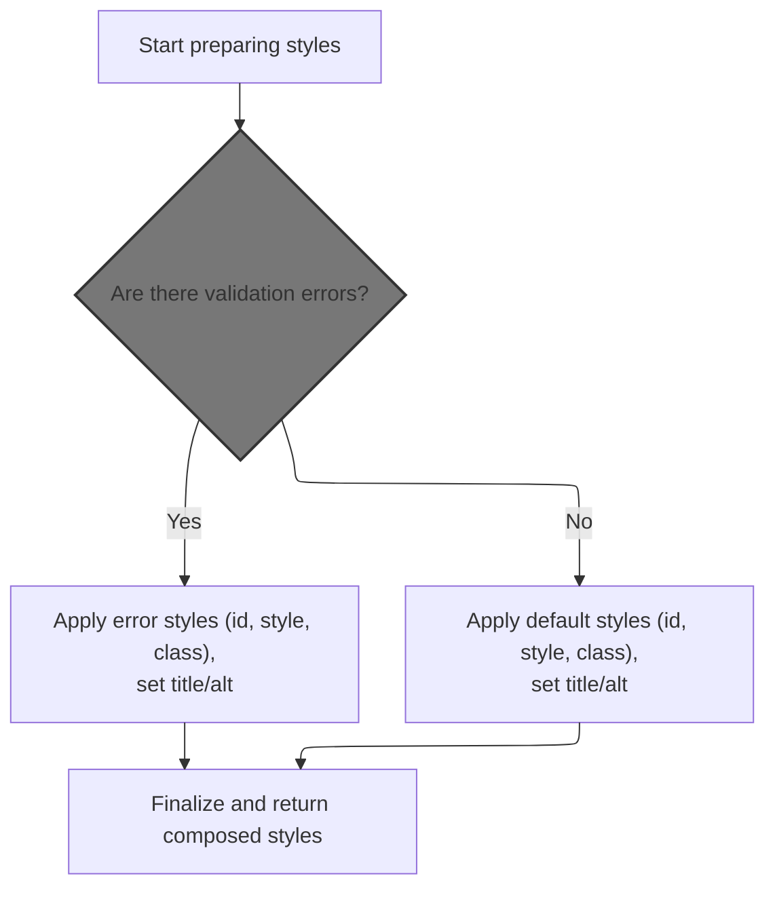
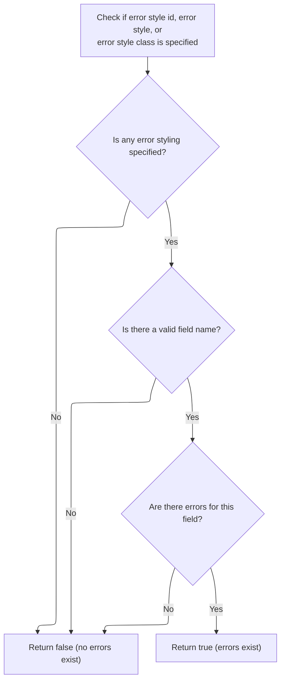
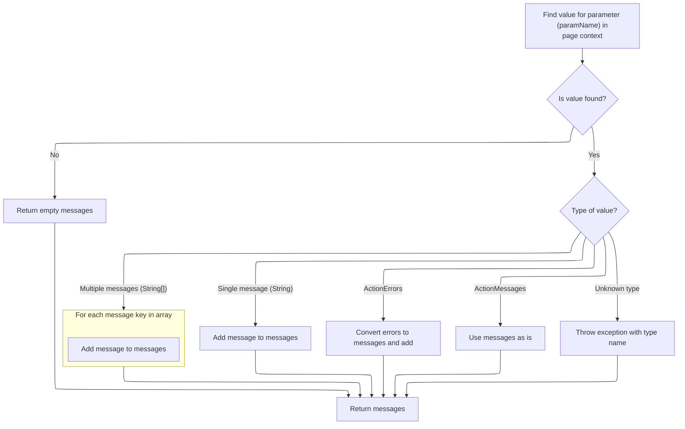

This document explains how style attributes are generated for form elements, ensuring that fields with validation errors are visually distinguished. Style configuration and field error information are used to apply the correct styles and set internationalized attributes, resulting in a composed style string for rendering.

# Building the Style Attribute String



<SwmSnippet path="/taglib/src/main/java/org/apache/struts/taglib/html/BaseHandlerTag.java" line="967">

---

In <SwmToken path="taglib/src/main/java/org/apache/struts/taglib/html/BaseHandlerTag.java" pos="967:5:5" line-data="    protected String prepareStyles()">`prepareStyles`</SwmToken>, we start by setting up a <SwmToken path="taglib/src/main/java/org/apache/struts/taglib/html/BaseHandlerTag.java" pos="969:1:1" line-data="        StringBuffer styles = new StringBuffer();">`StringBuffer`</SwmToken> for the style attributes and immediately check for errors using <SwmToken path="taglib/src/main/java/org/apache/struts/taglib/html/BaseHandlerTag.java" pos="971:7:7" line-data="        boolean errorsExist = doErrorsExist();">`doErrorsExist`</SwmToken>. This check decides if we should use error-specific styles or the regular ones in the rest of the method.

```java
    protected String prepareStyles()
        throws JspException {
        StringBuffer styles = new StringBuffer();

        boolean errorsExist = doErrorsExist();

```

---

</SwmSnippet>

## Detecting Field Errors



<SwmSnippet path="/taglib/src/main/java/org/apache/struts/taglib/html/BaseHandlerTag.java" line="1003">

---

<SwmToken path="taglib/src/main/java/org/apache/struts/taglib/html/BaseHandlerTag.java" pos="1003:5:5" line-data="    protected boolean doErrorsExist()">`doErrorsExist`</SwmToken> checks if any error styling is configured and, if so, gets the actual field name. It then uses <SwmToken path="taglib/src/main/java/org/apache/struts/taglib/html/BaseHandlerTag.java" pos="1013:1:1" line-data="                    TagUtils.getInstance().getActionMessages(pageContext,">`TagUtils`</SwmToken> to pull error messages for that field from the page context, so we know if there are any errors to trigger error styling.

```java
    protected boolean doErrorsExist()
        throws JspException {
        boolean errorsExist = false;

        if ((getErrorStyleId() != null) || (getErrorStyle() != null)
            || (getErrorStyleClass() != null)) {
            String actualName = prepareName();

            if (actualName != null) {
                ActionMessages errors =
                    TagUtils.getInstance().getActionMessages(pageContext,
                        errorKey);

                errorsExist = ((errors != null)
                    && (errors.size(actualName) > 0));
            }
        }

        return errorsExist;
    }
```

---

</SwmSnippet>

## Normalizing Error Messages



<SwmSnippet path="/taglib/src/main/java/org/apache/struts/taglib/TagUtils.java" line="727">

---

In <SwmToken path="taglib/src/main/java/org/apache/struts/taglib/TagUtils.java" pos="727:5:5" line-data="    public ActionMessages getActionMessages(PageContext pageContext,">`getActionMessages`</SwmToken>, we grab an attribute from the page context and normalize it into an <SwmToken path="taglib/src/main/java/org/apache/struts/taglib/TagUtils.java" pos="727:3:3" line-data="    public ActionMessages getActionMessages(PageContext pageContext,">`ActionMessages`</SwmToken> object. The code handles Strings, String arrays, <SwmToken path="taglib/src/main/java/org/apache/struts/taglib/TagUtils.java" pos="745:12:12" line-data="                } else if (value instanceof ActionErrors) {">`ActionErrors`</SwmToken>, and <SwmToken path="taglib/src/main/java/org/apache/struts/taglib/TagUtils.java" pos="727:3:3" line-data="    public ActionMessages getActionMessages(PageContext pageContext,">`ActionMessages`</SwmToken>, so whatever format the errors are in, we end up with a consistent <SwmToken path="taglib/src/main/java/org/apache/struts/taglib/TagUtils.java" pos="727:3:3" line-data="    public ActionMessages getActionMessages(PageContext pageContext,">`ActionMessages`</SwmToken> object.

```java
    public ActionMessages getActionMessages(PageContext pageContext,
        String paramName) throws JspException {
        ActionMessages am = new ActionMessages();

        Object value = pageContext.findAttribute(paramName);

        if (value != null) {
            try {
                if (value instanceof String) {
                    am.add(ActionMessages.GLOBAL_MESSAGE,
                        new ActionMessage((String) value));
                } else if (value instanceof String[]) {
                    String[] keys = (String[]) value;

                    for (int i = 0; i < keys.length; i++) {
                        am.add(ActionMessages.GLOBAL_MESSAGE,
                            new ActionMessage(keys[i]));
                    }
```

---

</SwmSnippet>

<SwmSnippet path="/taglib/src/main/java/org/apache/struts/taglib/TagUtils.java" line="745">

---

After handling all the possible types, <SwmToken path="taglib/src/main/java/org/apache/struts/taglib/html/BaseHandlerTag.java" pos="1013:7:7" line-data="                    TagUtils.getInstance().getActionMessages(pageContext,">`getActionMessages`</SwmToken> always returns an <SwmToken path="taglib/src/main/java/org/apache/struts/taglib/TagUtils.java" pos="746:1:1" line-data="                    ActionMessages m = (ActionMessages) value;">`ActionMessages`</SwmToken> object—either filled with messages or empty if nothing was found or the type was wrong. This keeps the rest of the flow simple since it doesn't have to check for null.

```java
                } else if (value instanceof ActionErrors) {
                    ActionMessages m = (ActionMessages) value;

                    am.add(m);
                } else if (value instanceof ActionMessages) {
                    am = (ActionMessages) value;
                } else {
                    throw new JspException(messages.getMessage(
                            "actionMessages.errors", value.getClass().getName()));
                }
            } catch (JspException e) {
                throw e;
            } catch (Exception e) {
                log.warn("Unable to retieve ActionMessage for paramName : "
                    + paramName, e);
            }
        }

        return am;
    }
```

---

</SwmSnippet>

## Applying Conditional Styles

```mermaid
%%{init: {"flowchart": {"defaultRenderer": "elk"}} }%%
flowchart TD
    node1{"Errors exist and error id available?"}
    click node1 openCode "taglib/src/main/java/org/apache/struts/taglib/html/BaseHandlerTag.java:973:975"
    node1 -->|"Yes"| node2["Set id to error id"]
    click node2 openCode "taglib/src/main/java/org/apache/struts/taglib/html/BaseHandlerTag.java:974:974"
    node1 -->|"No"| node3["Set id to normal id"]
    click node3 openCode "taglib/src/main/java/org/apache/struts/taglib/html/BaseHandlerTag.java:976:976"

    node2 --> node4
    node3 --> node4

    node4{"Errors exist and error style
available?"}
    click node4 openCode "taglib/src/main/java/org/apache/struts/taglib/html/BaseHandlerTag.java:979:981"
    node4 -->|"Yes"| node5["Set style to error style"]
    click node5 openCode "taglib/src/main/java/org/apache/struts/taglib/html/BaseHandlerTag.java:980:980"
    node4 -->|"No"| node6["Set style to normal style"]
    click node6 openCode "taglib/src/main/java/org/apache/struts/taglib/html/BaseHandlerTag.java:982:982"

    node5 --> node7
    node6 --> node7

    node7{"Errors exist and error class
available?"}
    click node7 openCode "taglib/src/main/java/org/apache/struts/taglib/html/BaseHandlerTag.java:985:987"
    node7 -->|"Yes"| node8["Set class to error class"]
    click node8 openCode "taglib/src/main/java/org/apache/struts/taglib/html/BaseHandlerTag.java:986:986"
    node7 -->|"No"| node9["Set class to normal class"]
    click node9 openCode "taglib/src/main/java/org/apache/struts/taglib/html/BaseHandlerTag.java:988:988"

    node8 --> node10
    node9 --> node10

    node10["Set title and alt attributes (using
message for internationalization)"]
    click node10 openCode "taglib/src/main/java/org/apache/struts/taglib/html/BaseHandlerTag.java:991:992"
    node10 --> node11["Add internationalization attributes"]
    click node11 openCode "taglib/src/main/java/org/apache/struts/taglib/html/BaseHandlerTag.java:993:993"
    node11 --> node12["Return final style string"]
    click node12 openCode "taglib/src/main/java/org/apache/struts/taglib/html/BaseHandlerTag.java:995:995"

classDef HeadingStyle fill:#777777,stroke:#333,stroke-width:2px;

%% Swimm:
%% %%{init: {"flowchart": {"defaultRenderer": "elk"}} }%%
%% flowchart TD
%%     node1{"Errors exist and error id available?"}
%%     click node1 openCode "<SwmPath>[taglib/…/html/BaseHandlerTag.java](taglib/src/main/java/org/apache/struts/taglib/html/BaseHandlerTag.java)</SwmPath>:973:975"
%%     node1 -->|"Yes"| node2["Set id to error id"]
%%     click node2 openCode "<SwmPath>[taglib/…/html/BaseHandlerTag.java](taglib/src/main/java/org/apache/struts/taglib/html/BaseHandlerTag.java)</SwmPath>:974:974"
%%     node1 -->|"No"| node3["Set id to normal id"]
%%     click node3 openCode "<SwmPath>[taglib/…/html/BaseHandlerTag.java](taglib/src/main/java/org/apache/struts/taglib/html/BaseHandlerTag.java)</SwmPath>:976:976"
%% 
%%     node2 --> node4
%%     node3 --> node4
%% 
%%     node4{"Errors exist and error style
%% available?"}
%%     click node4 openCode "<SwmPath>[taglib/…/html/BaseHandlerTag.java](taglib/src/main/java/org/apache/struts/taglib/html/BaseHandlerTag.java)</SwmPath>:979:981"
%%     node4 -->|"Yes"| node5["Set style to error style"]
%%     click node5 openCode "<SwmPath>[taglib/…/html/BaseHandlerTag.java](taglib/src/main/java/org/apache/struts/taglib/html/BaseHandlerTag.java)</SwmPath>:980:980"
%%     node4 -->|"No"| node6["Set style to normal style"]
%%     click node6 openCode "<SwmPath>[taglib/…/html/BaseHandlerTag.java](taglib/src/main/java/org/apache/struts/taglib/html/BaseHandlerTag.java)</SwmPath>:982:982"
%% 
%%     node5 --> node7
%%     node6 --> node7
%% 
%%     node7{"Errors exist and error class
%% available?"}
%%     click node7 openCode "<SwmPath>[taglib/…/html/BaseHandlerTag.java](taglib/src/main/java/org/apache/struts/taglib/html/BaseHandlerTag.java)</SwmPath>:985:987"
%%     node7 -->|"Yes"| node8["Set class to error class"]
%%     click node8 openCode "<SwmPath>[taglib/…/html/BaseHandlerTag.java](taglib/src/main/java/org/apache/struts/taglib/html/BaseHandlerTag.java)</SwmPath>:986:986"
%%     node7 -->|"No"| node9["Set class to normal class"]
%%     click node9 openCode "<SwmPath>[taglib/…/html/BaseHandlerTag.java](taglib/src/main/java/org/apache/struts/taglib/html/BaseHandlerTag.java)</SwmPath>:988:988"
%% 
%%     node8 --> node10
%%     node9 --> node10
%% 
%%     node10["Set title and alt attributes (using
%% message for internationalization)"]
%%     click node10 openCode "<SwmPath>[taglib/…/html/BaseHandlerTag.java](taglib/src/main/java/org/apache/struts/taglib/html/BaseHandlerTag.java)</SwmPath>:991:992"
%%     node10 --> node11["Add internationalization attributes"]
%%     click node11 openCode "<SwmPath>[taglib/…/html/BaseHandlerTag.java](taglib/src/main/java/org/apache/struts/taglib/html/BaseHandlerTag.java)</SwmPath>:993:993"
%%     node11 --> node12["Return final style string"]
%%     click node12 openCode "<SwmPath>[taglib/…/html/BaseHandlerTag.java](taglib/src/main/java/org/apache/struts/taglib/html/BaseHandlerTag.java)</SwmPath>:995:995"
%% 
%% classDef HeadingStyle fill:#777777,stroke:#333,stroke-width:2px;
```



<SwmSnippet path="/taglib/src/main/java/org/apache/struts/taglib/html/BaseHandlerTag.java" line="973">

---

Back in <SwmToken path="taglib/src/main/java/org/apache/struts/taglib/html/BaseHandlerTag.java" pos="967:5:5" line-data="    protected String prepareStyles()">`prepareStyles`</SwmToken>, after checking for errors, we pick either the error or normal style attributes based on the result. Then we call <SwmToken path="taglib/src/main/java/org/apache/struts/taglib/html/BaseHandlerTag.java" pos="991:11:11" line-data="        prepareAttribute(styles, &quot;title&quot;, message(getTitle(), getTitleKey()));">`message`</SwmToken> for the title and alt fields to resolve any localization or key-based values before adding them to the style string.

```java
        if (errorsExist && (getErrorStyleId() != null)) {
            prepareAttribute(styles, "id", getErrorStyleId());
        } else {
            prepareAttribute(styles, "id", getStyleId());
        }

        if (errorsExist && (getErrorStyle() != null)) {
            prepareAttribute(styles, "style", getErrorStyle());
        } else {
            prepareAttribute(styles, "style", getStyle());
        }

        if (errorsExist && (getErrorStyleClass() != null)) {
            prepareAttribute(styles, "class", getErrorStyleClass());
        } else {
            prepareAttribute(styles, "class", getStyleClass());
        }

        prepareAttribute(styles, "title", message(getTitle(), getTitleKey()));
        prepareAttribute(styles, "alt", message(getAlt(), getAltKey()));
```

---

</SwmSnippet>

<SwmSnippet path="/taglib/src/main/java/org/apache/struts/taglib/html/BaseHandlerTag.java" line="830">

---

<SwmToken path="taglib/src/main/java/org/apache/struts/taglib/html/BaseHandlerTag.java" pos="830:5:5" line-data="    protected String message(String literal, String key)">`message`</SwmToken> checks if both a literal and a key are provided and throws if that's the case. If only a key is given, it fetches the localized string using <SwmToken path="taglib/src/main/java/org/apache/struts/taglib/html/BaseHandlerTag.java" pos="837:1:1" line-data="                TagUtils.getInstance().saveException(pageContext, e);">`TagUtils`</SwmToken>; otherwise, it just returns the literal. If neither is set, it returns null.

```java
    protected String message(String literal, String key)
        throws JspException {
        if (literal != null) {
            if (key != null) {
                JspException e =
                    new JspException(messages.getMessage("common.both"));

                TagUtils.getInstance().saveException(pageContext, e);
                throw e;
            } else {
                return (literal);
            }
        } else {
            if (key != null) {
                return TagUtils.getInstance().message(pageContext, getBundle(),
                    getLocale(), key);
            } else {
                return null;
            }
        }
    }
```

---

</SwmSnippet>

<SwmSnippet path="/taglib/src/main/java/org/apache/struts/taglib/html/BaseHandlerTag.java" line="993">

---

After resolving the title and alt attributes with <SwmToken path="taglib/src/main/java/org/apache/struts/taglib/html/BaseHandlerTag.java" pos="830:5:5" line-data="    protected String message(String literal, String key)">`message`</SwmToken>, <SwmToken path="taglib/src/main/java/org/apache/struts/taglib/html/BaseHandlerTag.java" pos="967:5:5" line-data="    protected String prepareStyles()">`prepareStyles`</SwmToken> calls <SwmToken path="taglib/src/main/java/org/apache/struts/taglib/html/BaseHandlerTag.java" pos="993:1:1" line-data="        prepareInternationalization(styles);">`prepareInternationalization`</SwmToken> to handle any last locale-specific tweaks, then returns the complete style string.

```java
        prepareInternationalization(styles);

        return styles.toString();
    }
```

---

</SwmSnippet>

&nbsp;

*This is an auto-generated document by Swimm 🌊 and has not yet been verified by a human*

<SwmMeta version="3.0.0" repo-id="Z2l0aHViJTNBJTNBc3RydXRzMSUzQSUzQVN3aW1tLURlbW8=" repo-name="struts1"><sup>Powered by [Swimm](https://app.swimm.io/)</sup></SwmMeta>
