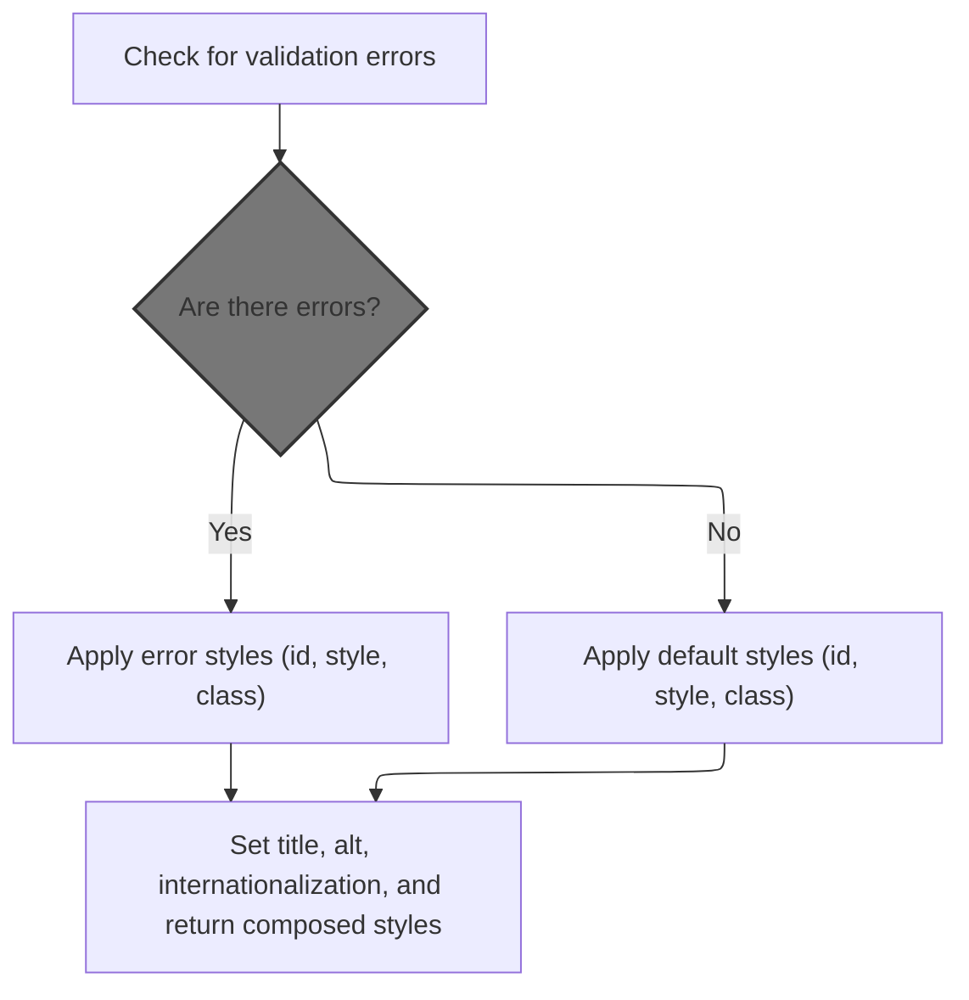
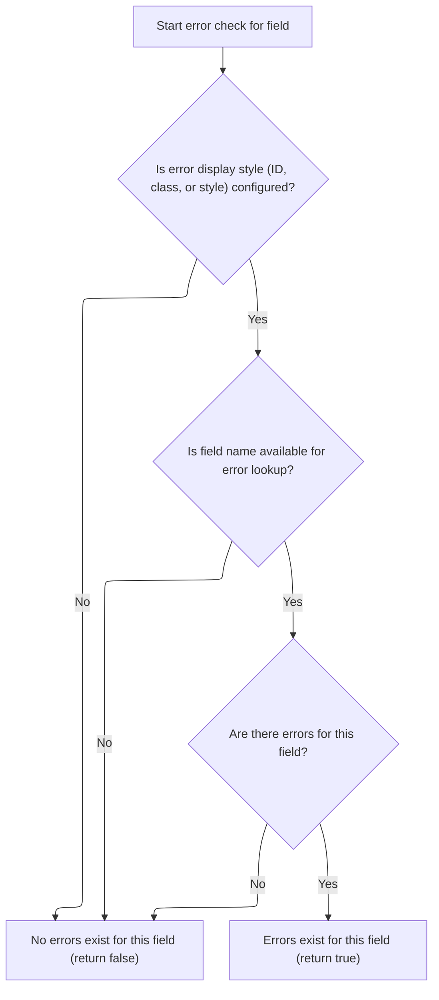
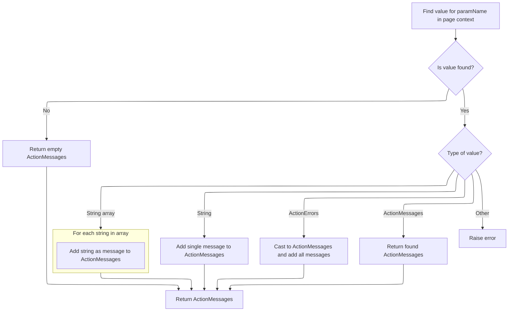

This document describes how style attributes for form fields are dynamically generated to reflect validation errors and localization settings, producing a string of HTML attributes for rendering.

# Where is this flow used?

This flow is used multiple times in the codebase as represented in the following diagram:

(Note - these are only some of the entry points of this flow)

```mermaid
graph TD;
      71ddfa855c52deabd2f43f2927180c614cd5406e57899956abd88820d83bba04(taglib/…/html/ImgTag.java::ImgTag.doEndTag) --> 08aaab10f2832af029636f04b4f977011203800549dcc6cc3175d2134ef30e25(taglib/…/html/BaseHandlerTag.java::BaseHandlerTag.prepareStyles)

301dfc7ce22ede9c7489c8be7f41b3e29c1314ff3abbff75b89d76d9d9735032(taglib/…/html/RadioTag.java::RadioTag.doStartTag) --> 5879655579cd0af8fa7578026060c84080ed05a38d35bf1edc129bd63318a65c(taglib/…/html/RadioTag.java::RadioTag.renderRadioElement)

5879655579cd0af8fa7578026060c84080ed05a38d35bf1edc129bd63318a65c(taglib/…/html/RadioTag.java::RadioTag.renderRadioElement) --> 08aaab10f2832af029636f04b4f977011203800549dcc6cc3175d2134ef30e25(taglib/…/html/BaseHandlerTag.java::BaseHandlerTag.prepareStyles)

2c2ce28aaa6165003ef5589d8a8a5bdc21b65969cd85fd8b3612224a11795533(taglib/…/html/BaseFieldTag.java::BaseFieldTag.doStartTag) --> e05f7a0268d45dd6cbda0454d34b519da746846bf88e8c631682bc7870014f4c(taglib/…/html/BaseFieldTag.java::BaseFieldTag.renderInputElement)

e05f7a0268d45dd6cbda0454d34b519da746846bf88e8c631682bc7870014f4c(taglib/…/html/BaseFieldTag.java::BaseFieldTag.renderInputElement) --> 08aaab10f2832af029636f04b4f977011203800549dcc6cc3175d2134ef30e25(taglib/…/html/BaseHandlerTag.java::BaseHandlerTag.prepareStyles)

16954283ad016dbbdd2ab1921c68eca78115311671b85ed5cbdc2e02dc68e0de(taglib/…/html/CheckboxTag.java::CheckboxTag.doStartTag) --> 08aaab10f2832af029636f04b4f977011203800549dcc6cc3175d2134ef30e25(taglib/…/html/BaseHandlerTag.java::BaseHandlerTag.prepareStyles)

0072d0bda5a83199fb108597a9cc7e79ab04d586b0862cee6b4b66640d2665d0(taglib/…/html/LinkTag.java::LinkTag.doEndTag) --> 08aaab10f2832af029636f04b4f977011203800549dcc6cc3175d2134ef30e25(taglib/…/html/BaseHandlerTag.java::BaseHandlerTag.prepareStyles)


classDef mainFlowStyle color:#000000,fill:#7CB9F4
classDef rootsStyle color:#000000,fill:#00FFF4
classDef Style1 color:#000000,fill:#00FFAA
classDef Style2 color:#000000,fill:#FFFF00
classDef Style3 color:#000000,fill:#AA7CB9

%% Swimm:
%% graph TD;
%%       71ddfa855c52deabd2f43f2927180c614cd5406e57899956abd88820d83bba04(<SwmPath>[taglib/…/html/ImgTag.java](taglib/src/main/java/org/apache/struts/taglib/html/ImgTag.java)</SwmPath>::ImgTag.doEndTag) --> 08aaab10f2832af029636f04b4f977011203800549dcc6cc3175d2134ef30e25(<SwmPath>[taglib/…/html/BaseHandlerTag.java](taglib/src/main/java/org/apache/struts/taglib/html/BaseHandlerTag.java)</SwmPath>::BaseHandlerTag.prepareStyles)
%% 
%% 301dfc7ce22ede9c7489c8be7f41b3e29c1314ff3abbff75b89d76d9d9735032(<SwmPath>[taglib/…/html/RadioTag.java](taglib/src/main/java/org/apache/struts/taglib/html/RadioTag.java)</SwmPath>::RadioTag.doStartTag) --> 5879655579cd0af8fa7578026060c84080ed05a38d35bf1edc129bd63318a65c(<SwmPath>[taglib/…/html/RadioTag.java](taglib/src/main/java/org/apache/struts/taglib/html/RadioTag.java)</SwmPath>::RadioTag.renderRadioElement)
%% 
%% 5879655579cd0af8fa7578026060c84080ed05a38d35bf1edc129bd63318a65c(<SwmPath>[taglib/…/html/RadioTag.java](taglib/src/main/java/org/apache/struts/taglib/html/RadioTag.java)</SwmPath>::RadioTag.renderRadioElement) --> 08aaab10f2832af029636f04b4f977011203800549dcc6cc3175d2134ef30e25(<SwmPath>[taglib/…/html/BaseHandlerTag.java](taglib/src/main/java/org/apache/struts/taglib/html/BaseHandlerTag.java)</SwmPath>::BaseHandlerTag.prepareStyles)
%% 
%% 2c2ce28aaa6165003ef5589d8a8a5bdc21b65969cd85fd8b3612224a11795533(<SwmPath>[taglib/…/html/BaseFieldTag.java](taglib/src/main/java/org/apache/struts/taglib/html/BaseFieldTag.java)</SwmPath>::BaseFieldTag.doStartTag) --> e05f7a0268d45dd6cbda0454d34b519da746846bf88e8c631682bc7870014f4c(<SwmPath>[taglib/…/html/BaseFieldTag.java](taglib/src/main/java/org/apache/struts/taglib/html/BaseFieldTag.java)</SwmPath>::BaseFieldTag.renderInputElement)
%% 
%% e05f7a0268d45dd6cbda0454d34b519da746846bf88e8c631682bc7870014f4c(<SwmPath>[taglib/…/html/BaseFieldTag.java](taglib/src/main/java/org/apache/struts/taglib/html/BaseFieldTag.java)</SwmPath>::BaseFieldTag.renderInputElement) --> 08aaab10f2832af029636f04b4f977011203800549dcc6cc3175d2134ef30e25(<SwmPath>[taglib/…/html/BaseHandlerTag.java](taglib/src/main/java/org/apache/struts/taglib/html/BaseHandlerTag.java)</SwmPath>::BaseHandlerTag.prepareStyles)
%% 
%% 16954283ad016dbbdd2ab1921c68eca78115311671b85ed5cbdc2e02dc68e0de(<SwmPath>[taglib/…/html/CheckboxTag.java](taglib/src/main/java/org/apache/struts/taglib/html/CheckboxTag.java)</SwmPath>::CheckboxTag.doStartTag) --> 08aaab10f2832af029636f04b4f977011203800549dcc6cc3175d2134ef30e25(<SwmPath>[taglib/…/html/BaseHandlerTag.java](taglib/src/main/java/org/apache/struts/taglib/html/BaseHandlerTag.java)</SwmPath>::BaseHandlerTag.prepareStyles)
%% 
%% 0072d0bda5a83199fb108597a9cc7e79ab04d586b0862cee6b4b66640d2665d0(<SwmPath>[taglib/…/html/LinkTag.java](taglib/src/main/java/org/apache/struts/taglib/html/LinkTag.java)</SwmPath>::LinkTag.doEndTag) --> 08aaab10f2832af029636f04b4f977011203800549dcc6cc3175d2134ef30e25(<SwmPath>[taglib/…/html/BaseHandlerTag.java](taglib/src/main/java/org/apache/struts/taglib/html/BaseHandlerTag.java)</SwmPath>::BaseHandlerTag.prepareStyles)
%% 
%% 
%% classDef mainFlowStyle color:#000000,fill:#7CB9F4
%% classDef rootsStyle color:#000000,fill:#00FFF4
%% classDef Style1 color:#000000,fill:#00FFAA
%% classDef Style2 color:#000000,fill:#FFFF00
%% classDef Style3 color:#000000,fill:#AA7CB9
```



# Building Style Attributes Based on Errors



<SwmSnippet path="/taglib/src/main/java/org/apache/struts/taglib/html/BaseHandlerTag.java" line="967">

---

In <SwmToken path="taglib/src/main/java/org/apache/struts/taglib/html/BaseHandlerTag.java" pos="967:5:5" line-data="    protected String prepareStyles()">`prepareStyles`</SwmToken>, we start by setting up a buffer for the style string and immediately check for errors using <SwmToken path="taglib/src/main/java/org/apache/struts/taglib/html/BaseHandlerTag.java" pos="971:7:7" line-data="        boolean errorsExist = doErrorsExist();">`doErrorsExist`</SwmToken>. This check is needed right away because the rest of the logic depends on whether errors exist, which changes which style attributes get applied next.

```java
    protected String prepareStyles()
        throws JspException {
        StringBuffer styles = new StringBuffer();

        boolean errorsExist = doErrorsExist();

```

---

</SwmSnippet>

## Detecting Field-Specific Errors



<SwmSnippet path="/taglib/src/main/java/org/apache/struts/taglib/html/BaseHandlerTag.java" line="1003">

---

<SwmToken path="taglib/src/main/java/org/apache/struts/taglib/html/BaseHandlerTag.java" pos="1003:5:5" line-data="    protected boolean doErrorsExist()">`doErrorsExist`</SwmToken> checks if any error style attributes are set, then figures out the field name and uses `TagUtils.getActionMessages` to pull any errors for that field from the page context. This is how we know if error-specific styles should be used.

```java
    protected boolean doErrorsExist()
        throws JspException {
        boolean errorsExist = false;

        if ((getErrorStyleId() != null) || (getErrorStyle() != null)
            || (getErrorStyleClass() != null)) {
            String actualName = prepareName();

            if (actualName != null) {
                ActionMessages errors =
                    TagUtils.getInstance().getActionMessages(pageContext,
                        errorKey);

                errorsExist = ((errors != null)
                    && (errors.size(actualName) > 0));
            }
        }

        return errorsExist;
    }
```

---

</SwmSnippet>

## Fetching Error Messages from Context



<SwmSnippet path="/taglib/src/main/java/org/apache/struts/taglib/TagUtils.java" line="727">

---

In <SwmToken path="taglib/src/main/java/org/apache/struts/taglib/TagUtils.java" pos="727:5:5" line-data="    public ActionMessages getActionMessages(PageContext pageContext,">`getActionMessages`</SwmToken>, we grab an attribute from the page context and convert it into an <SwmToken path="taglib/src/main/java/org/apache/struts/taglib/TagUtils.java" pos="727:3:3" line-data="    public ActionMessages getActionMessages(PageContext pageContext,">`ActionMessages`</SwmToken> object. The function handles different types (String, String\[\], <SwmToken path="taglib/src/main/java/org/apache/struts/taglib/TagUtils.java" pos="745:12:12" line-data="                } else if (value instanceof ActionErrors) {">`ActionErrors`</SwmToken>, <SwmToken path="taglib/src/main/java/org/apache/struts/taglib/TagUtils.java" pos="727:3:3" line-data="    public ActionMessages getActionMessages(PageContext pageContext,">`ActionMessages`</SwmToken>) so it can work with however errors were stored. If the type is wrong, it throws.

```java
    public ActionMessages getActionMessages(PageContext pageContext,
        String paramName) throws JspException {
        ActionMessages am = new ActionMessages();

        Object value = pageContext.findAttribute(paramName);

        if (value != null) {
            try {
                if (value instanceof String) {
                    am.add(ActionMessages.GLOBAL_MESSAGE,
                        new ActionMessage((String) value));
                } else if (value instanceof String[]) {
                    String[] keys = (String[]) value;

                    for (int i = 0; i < keys.length; i++) {
                        am.add(ActionMessages.GLOBAL_MESSAGE,
                            new ActionMessage(keys[i]));
                    }
```

---

</SwmSnippet>

<SwmSnippet path="/taglib/src/main/java/org/apache/struts/taglib/TagUtils.java" line="745">

---

The function returns an <SwmToken path="taglib/src/main/java/org/apache/struts/taglib/TagUtils.java" pos="746:1:1" line-data="                    ActionMessages m = (ActionMessages) value;">`ActionMessages`</SwmToken> object with all messages for the given <SwmToken path="taglib/src/main/java/org/apache/struts/taglib/TagUtils.java" pos="758:16:16" line-data="                log.warn(&quot;Unable to retieve ActionMessage for paramName : &quot;">`paramName`</SwmToken>, no matter if they started as a String, array, or another messages object. If the type doesn't match, it throws, but otherwise you always get a consistent result.

```java
                } else if (value instanceof ActionErrors) {
                    ActionMessages m = (ActionMessages) value;

                    am.add(m);
                } else if (value instanceof ActionMessages) {
                    am = (ActionMessages) value;
                } else {
                    throw new JspException(messages.getMessage(
                            "actionMessages.errors", value.getClass().getName()));
                }
            } catch (JspException e) {
                throw e;
            } catch (Exception e) {
                log.warn("Unable to retieve ActionMessage for paramName : "
                    + paramName, e);
            }
        }

        return am;
    }
```

---

</SwmSnippet>

## Applying Conditional Style Attributes

```mermaid
%%{init: {"flowchart": {"defaultRenderer": "elk"}} }%%
flowchart TD
    node1["Decide id: errors exist & error id?"]
    click node1 openCode "taglib/src/main/java/org/apache/struts/taglib/html/BaseHandlerTag.java:973:977"
    node1 -->|"Yes"| node2["Apply error id"]
    click node2 openCode "taglib/src/main/java/org/apache/struts/taglib/html/BaseHandlerTag.java:974:974"
    node1 -->|"No"| node3["Apply normal id"]
    click node3 openCode "taglib/src/main/java/org/apache/struts/taglib/html/BaseHandlerTag.java:976:976"
    node2 --> node4["Decide style: errors exist & error style?"]
    node3 --> node4
    click node4 openCode "taglib/src/main/java/org/apache/struts/taglib/html/BaseHandlerTag.java:979:983"
    node4 -->|"Yes"| node5["Apply error style"]
    click node5 openCode "taglib/src/main/java/org/apache/struts/taglib/html/BaseHandlerTag.java:980:980"
    node4 -->|"No"| node6["Apply normal style"]
    click node6 openCode "taglib/src/main/java/org/apache/struts/taglib/html/BaseHandlerTag.java:982:982"
    node5 --> node7["Decide class: errors exist & error class?"]
    node6 --> node7
    click node7 openCode "taglib/src/main/java/org/apache/struts/taglib/html/BaseHandlerTag.java:985:989"
    node7 -->|"Yes"| node8["Apply error class"]
    click node8 openCode "taglib/src/main/java/org/apache/struts/taglib/html/BaseHandlerTag.java:986:986"
    node7 -->|"No"| node9["Apply normal class"]
    click node9 openCode "taglib/src/main/java/org/apache/struts/taglib/html/BaseHandlerTag.java:988:988"
    node8 --> node10["Add title and alt text"]
    node9 --> node10
    click node10 openCode "taglib/src/main/java/org/apache/struts/taglib/html/BaseHandlerTag.java:991:992"
    node10 --> node11["Prepare internationalization"]
    click node11 openCode "taglib/src/main/java/org/apache/struts/taglib/html/BaseHandlerTag.java:993:993"
    node11 --> node12["Return final style string"]
    click node12 openCode "taglib/src/main/java/org/apache/struts/taglib/html/BaseHandlerTag.java:995:995"

classDef HeadingStyle fill:#777777,stroke:#333,stroke-width:2px;

%% Swimm:
%% %%{init: {"flowchart": {"defaultRenderer": "elk"}} }%%
%% flowchart TD
%%     node1["Decide id: errors exist & error id?"]
%%     click node1 openCode "<SwmPath>[taglib/…/html/BaseHandlerTag.java](taglib/src/main/java/org/apache/struts/taglib/html/BaseHandlerTag.java)</SwmPath>:973:977"
%%     node1 -->|"Yes"| node2["Apply error id"]
%%     click node2 openCode "<SwmPath>[taglib/…/html/BaseHandlerTag.java](taglib/src/main/java/org/apache/struts/taglib/html/BaseHandlerTag.java)</SwmPath>:974:974"
%%     node1 -->|"No"| node3["Apply normal id"]
%%     click node3 openCode "<SwmPath>[taglib/…/html/BaseHandlerTag.java](taglib/src/main/java/org/apache/struts/taglib/html/BaseHandlerTag.java)</SwmPath>:976:976"
%%     node2 --> node4["Decide style: errors exist & error style?"]
%%     node3 --> node4
%%     click node4 openCode "<SwmPath>[taglib/…/html/BaseHandlerTag.java](taglib/src/main/java/org/apache/struts/taglib/html/BaseHandlerTag.java)</SwmPath>:979:983"
%%     node4 -->|"Yes"| node5["Apply error style"]
%%     click node5 openCode "<SwmPath>[taglib/…/html/BaseHandlerTag.java](taglib/src/main/java/org/apache/struts/taglib/html/BaseHandlerTag.java)</SwmPath>:980:980"
%%     node4 -->|"No"| node6["Apply normal style"]
%%     click node6 openCode "<SwmPath>[taglib/…/html/BaseHandlerTag.java](taglib/src/main/java/org/apache/struts/taglib/html/BaseHandlerTag.java)</SwmPath>:982:982"
%%     node5 --> node7["Decide class: errors exist & error class?"]
%%     node6 --> node7
%%     click node7 openCode "<SwmPath>[taglib/…/html/BaseHandlerTag.java](taglib/src/main/java/org/apache/struts/taglib/html/BaseHandlerTag.java)</SwmPath>:985:989"
%%     node7 -->|"Yes"| node8["Apply error class"]
%%     click node8 openCode "<SwmPath>[taglib/…/html/BaseHandlerTag.java](taglib/src/main/java/org/apache/struts/taglib/html/BaseHandlerTag.java)</SwmPath>:986:986"
%%     node7 -->|"No"| node9["Apply normal class"]
%%     click node9 openCode "<SwmPath>[taglib/…/html/BaseHandlerTag.java](taglib/src/main/java/org/apache/struts/taglib/html/BaseHandlerTag.java)</SwmPath>:988:988"
%%     node8 --> node10["Add title and alt text"]
%%     node9 --> node10
%%     click node10 openCode "<SwmPath>[taglib/…/html/BaseHandlerTag.java](taglib/src/main/java/org/apache/struts/taglib/html/BaseHandlerTag.java)</SwmPath>:991:992"
%%     node10 --> node11["Prepare internationalization"]
%%     click node11 openCode "<SwmPath>[taglib/…/html/BaseHandlerTag.java](taglib/src/main/java/org/apache/struts/taglib/html/BaseHandlerTag.java)</SwmPath>:993:993"
%%     node11 --> node12["Return final style string"]
%%     click node12 openCode "<SwmPath>[taglib/…/html/BaseHandlerTag.java](taglib/src/main/java/org/apache/struts/taglib/html/BaseHandlerTag.java)</SwmPath>:995:995"
%% 
%% classDef HeadingStyle fill:#777777,stroke:#333,stroke-width:2px;
```



<SwmSnippet path="/taglib/src/main/java/org/apache/struts/taglib/html/BaseHandlerTag.java" line="973">

---

Back in <SwmToken path="taglib/src/main/java/org/apache/struts/taglib/html/BaseHandlerTag.java" pos="967:5:5" line-data="    protected String prepareStyles()">`prepareStyles`</SwmToken>, after checking for errors, we set the id, style, and class attributes based on whether errors exist. Then we call <SwmToken path="taglib/src/main/java/org/apache/struts/taglib/html/BaseHandlerTag.java" pos="991:11:11" line-data="        prepareAttribute(styles, &quot;title&quot;, message(getTitle(), getTitleKey()));">`message`</SwmToken> for the title and alt attributes, since those might need to be localized or just used as-is, depending on what's set.

```java
        if (errorsExist && (getErrorStyleId() != null)) {
            prepareAttribute(styles, "id", getErrorStyleId());
        } else {
            prepareAttribute(styles, "id", getStyleId());
        }

        if (errorsExist && (getErrorStyle() != null)) {
            prepareAttribute(styles, "style", getErrorStyle());
        } else {
            prepareAttribute(styles, "style", getStyle());
        }

        if (errorsExist && (getErrorStyleClass() != null)) {
            prepareAttribute(styles, "class", getErrorStyleClass());
        } else {
            prepareAttribute(styles, "class", getStyleClass());
        }

        prepareAttribute(styles, "title", message(getTitle(), getTitleKey()));
        prepareAttribute(styles, "alt", message(getAlt(), getAltKey()));
```

---

</SwmSnippet>

<SwmSnippet path="/taglib/src/main/java/org/apache/struts/taglib/html/BaseHandlerTag.java" line="830">

---

<SwmToken path="taglib/src/main/java/org/apache/struts/taglib/html/BaseHandlerTag.java" pos="830:5:5" line-data="    protected String message(String literal, String key)">`message`</SwmToken> picks between a literal string and a key for localization. If both are set, it throws. If only a key is set, it fetches the localized message; if only a literal is set, it just returns that; if neither, it returns null.

```java
    protected String message(String literal, String key)
        throws JspException {
        if (literal != null) {
            if (key != null) {
                JspException e =
                    new JspException(messages.getMessage("common.both"));

                TagUtils.getInstance().saveException(pageContext, e);
                throw e;
            } else {
                return (literal);
            }
        } else {
            if (key != null) {
                return TagUtils.getInstance().message(pageContext, getBundle(),
                    getLocale(), key);
            } else {
                return null;
            }
        }
    }
```

---

</SwmSnippet>

<SwmSnippet path="/taglib/src/main/java/org/apache/struts/taglib/html/BaseHandlerTag.java" line="993">

---

After getting the title and alt values from <SwmToken path="taglib/src/main/java/org/apache/struts/taglib/html/BaseHandlerTag.java" pos="830:5:5" line-data="    protected String message(String literal, String key)">`message`</SwmToken>, we finish up in <SwmToken path="taglib/src/main/java/org/apache/struts/taglib/html/BaseHandlerTag.java" pos="967:5:5" line-data="    protected String prepareStyles()">`prepareStyles`</SwmToken> by adding any internationalization tweaks and returning the final style string. The output now has all the right attributes, including any localized text.

```java
        prepareInternationalization(styles);

        return styles.toString();
    }
```

---

</SwmSnippet>

&nbsp;

*This is an auto-generated document by Swimm 🌊 and has not yet been verified by a human*

<SwmMeta version="3.0.0" repo-id="Z2l0aHViJTNBJTNBc3RydXRzMSUzQSUzQVN3aW1tLURlbW8=" repo-name="struts1"><sup>Powered by [Swimm](https://app.swimm.io/)</sup></SwmMeta>
