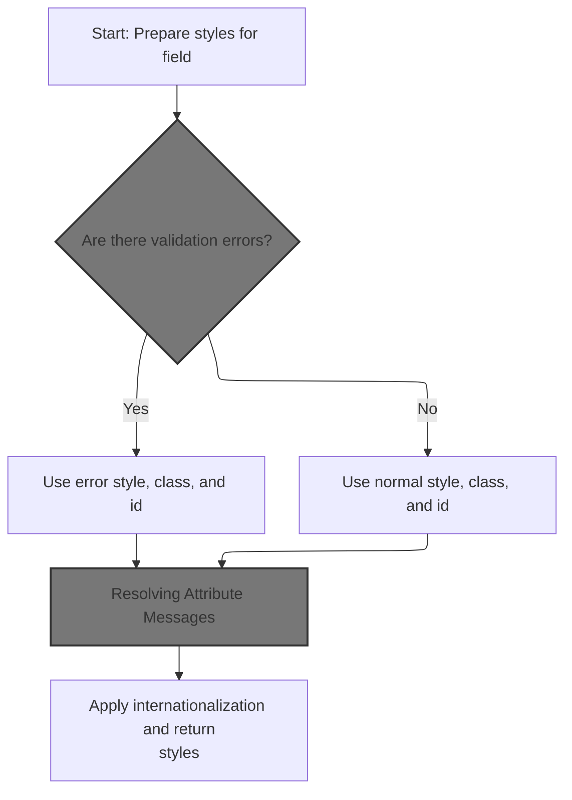
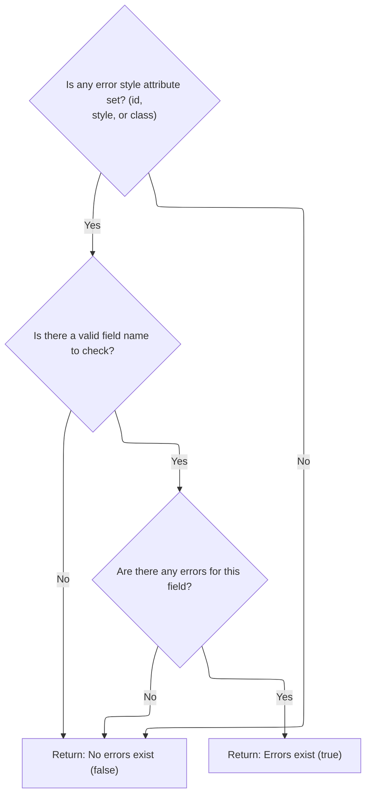
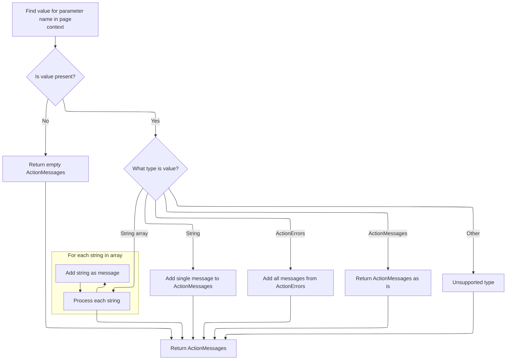
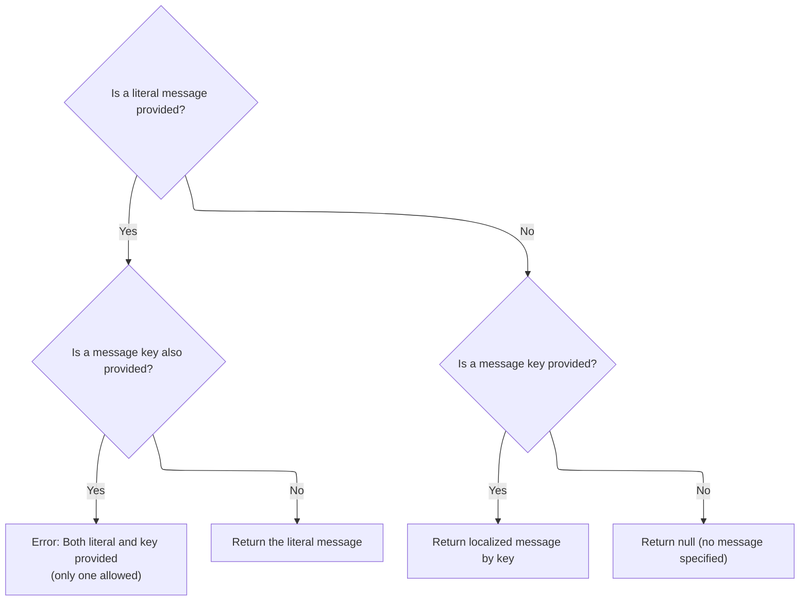

This document explains how style attributes are generated for form fields during rendering. When validation errors are present, error-specific styles and localized messages are applied, resulting in a string of attributes that ensure the field is displayed with the correct appearance and accessibility information.

# Building the Style Attributes



<SwmSnippet path="/taglib/src/main/java/org/apache/struts/taglib/html/BaseHandlerTag.java" line="967">

---

In <SwmToken path="taglib/src/main/java/org/apache/struts/taglib/html/BaseHandlerTag.java" pos="967:5:5" line-data="    protected String prepareStyles()">`prepareStyles`</SwmToken>, we start by setting up a buffer for the style string and immediately check for errors using <SwmToken path="taglib/src/main/java/org/apache/struts/taglib/html/BaseHandlerTag.java" pos="971:7:7" line-data="        boolean errorsExist = doErrorsExist();">`doErrorsExist`</SwmToken>. This check decides if we should use error-specific style attributes later. That's why we need to call <SwmToken path="taglib/src/main/java/org/apache/struts/taglib/html/BaseHandlerTag.java" pos="971:7:7" line-data="        boolean errorsExist = doErrorsExist();">`doErrorsExist`</SwmToken> next—it tells us which set of styles to apply.

```java
    protected String prepareStyles()
        throws JspException {
        StringBuffer styles = new StringBuffer();

        boolean errorsExist = doErrorsExist();

```

---

</SwmSnippet>

## Detecting Field Errors



<SwmSnippet path="/taglib/src/main/java/org/apache/struts/taglib/html/BaseHandlerTag.java" line="1003">

---

<SwmToken path="taglib/src/main/java/org/apache/struts/taglib/html/BaseHandlerTag.java" pos="1003:5:5" line-data="    protected boolean doErrorsExist()">`doErrorsExist`</SwmToken> checks if any error style properties are set and, if so, gets the actual field name. If the name is valid, it uses <SwmToken path="taglib/src/main/java/org/apache/struts/taglib/html/BaseHandlerTag.java" pos="1013:1:1" line-data="                    TagUtils.getInstance().getActionMessages(pageContext,">`TagUtils`</SwmToken> to fetch any error messages for that field from the page context. We call <SwmToken path="taglib/src/main/java/org/apache/struts/taglib/html/BaseHandlerTag.java" pos="1013:1:1" line-data="                    TagUtils.getInstance().getActionMessages(pageContext,">`TagUtils`</SwmToken> here because it handles the lookup and conversion of error data into <SwmToken path="taglib/src/main/java/org/apache/struts/taglib/html/BaseHandlerTag.java" pos="1012:1:1" line-data="                ActionMessages errors =">`ActionMessages`</SwmToken>, which we need to check if errors exist.

```java
    protected boolean doErrorsExist()
        throws JspException {
        boolean errorsExist = false;

        if ((getErrorStyleId() != null) || (getErrorStyle() != null)
            || (getErrorStyleClass() != null)) {
            String actualName = prepareName();

            if (actualName != null) {
                ActionMessages errors =
                    TagUtils.getInstance().getActionMessages(pageContext,
                        errorKey);

                errorsExist = ((errors != null)
                    && (errors.size(actualName) > 0));
            }
        }

        return errorsExist;
    }
```

---

</SwmSnippet>

## Retrieving Error Messages



<SwmSnippet path="/taglib/src/main/java/org/apache/struts/taglib/TagUtils.java" line="727">

---

In <SwmToken path="taglib/src/main/java/org/apache/struts/taglib/TagUtils.java" pos="727:5:5" line-data="    public ActionMessages getActionMessages(PageContext pageContext,">`getActionMessages`</SwmToken>, we start by looking up the error messages in the page context by name. Depending on the type (string, array, <SwmToken path="taglib/src/main/java/org/apache/struts/taglib/TagUtils.java" pos="745:12:12" line-data="                } else if (value instanceof ActionErrors) {">`ActionErrors`</SwmToken>, <SwmToken path="taglib/src/main/java/org/apache/struts/taglib/TagUtils.java" pos="727:3:3" line-data="    public ActionMessages getActionMessages(PageContext pageContext,">`ActionMessages`</SwmToken>), we wrap or convert them into an <SwmToken path="taglib/src/main/java/org/apache/struts/taglib/TagUtils.java" pos="727:3:3" line-data="    public ActionMessages getActionMessages(PageContext pageContext,">`ActionMessages`</SwmToken> object so the rest of the code can handle errors uniformly.

```java
    public ActionMessages getActionMessages(PageContext pageContext,
        String paramName) throws JspException {
        ActionMessages am = new ActionMessages();

        Object value = pageContext.findAttribute(paramName);

        if (value != null) {
            try {
                if (value instanceof String) {
                    am.add(ActionMessages.GLOBAL_MESSAGE,
                        new ActionMessage((String) value));
                } else if (value instanceof String[]) {
                    String[] keys = (String[]) value;

                    for (int i = 0; i < keys.length; i++) {
                        am.add(ActionMessages.GLOBAL_MESSAGE,
                            new ActionMessage(keys[i]));
                    }
```

---

</SwmSnippet>

<SwmSnippet path="/taglib/src/main/java/org/apache/struts/taglib/TagUtils.java" line="745">

---

After handling all supported types and wrapping them as needed, we return the <SwmToken path="taglib/src/main/java/org/apache/struts/taglib/TagUtils.java" pos="746:1:1" line-data="                    ActionMessages m = (ActionMessages) value;">`ActionMessages`</SwmToken> object. If the type is unknown, we throw a <SwmToken path="taglib/src/main/java/org/apache/struts/taglib/TagUtils.java" pos="752:5:5" line-data="                    throw new JspException(messages.getMessage(">`JspException`</SwmToken> with a message from <SwmToken path="taglib/src/main/java/org/apache/struts/taglib/html/BaseHandlerTag.java" pos="30:10:10" line-data="import org.apache.struts.util.MessageResources;">`MessageResources`</SwmToken>, which also handles localization for error messages.

```java
                } else if (value instanceof ActionErrors) {
                    ActionMessages m = (ActionMessages) value;

                    am.add(m);
                } else if (value instanceof ActionMessages) {
                    am = (ActionMessages) value;
                } else {
                    throw new JspException(messages.getMessage(
                            "actionMessages.errors", value.getClass().getName()));
                }
            } catch (JspException e) {
                throw e;
            } catch (Exception e) {
                log.warn("Unable to retieve ActionMessage for paramName : "
                    + paramName, e);
            }
        }

        return am;
    }
```

---

</SwmSnippet>

## Applying Conditional Styles

```mermaid
%%{init: {"flowchart": {"defaultRenderer": "elk"}} }%%
flowchart TD
    node1{"Are there errors and error id?"}
    click node1 openCode "taglib/src/main/java/org/apache/struts/taglib/html/BaseHandlerTag.java:973:975"
    node1 -->|"Yes"| node2["Use error id (errorStyleId)"]
    click node2 openCode "taglib/src/main/java/org/apache/struts/taglib/html/BaseHandlerTag.java:974:974"
    node1 -->|"No"| node3["Use normal id (styleId)"]
    click node3 openCode "taglib/src/main/java/org/apache/struts/taglib/html/BaseHandlerTag.java:976:976"
    node2 --> node4
    node3 --> node4
    node4{"Are there errors and error style?"}
    click node4 openCode "taglib/src/main/java/org/apache/struts/taglib/html/BaseHandlerTag.java:979:981"
    node4 -->|"Yes"| node5["Use error style (errorStyle)"]
    click node5 openCode "taglib/src/main/java/org/apache/struts/taglib/html/BaseHandlerTag.java:980:980"
    node4 -->|"No"| node6["Use normal style (style)"]
    click node6 openCode "taglib/src/main/java/org/apache/struts/taglib/html/BaseHandlerTag.java:982:982"
    node5 --> node7
    node6 --> node7
    node7{"Are there errors and error class?"}
    click node7 openCode "taglib/src/main/java/org/apache/struts/taglib/html/BaseHandlerTag.java:985:987"
    node7 -->|"Yes"| node8["Use error class (errorStyleClass)"]
    click node8 openCode "taglib/src/main/java/org/apache/struts/taglib/html/BaseHandlerTag.java:986:986"
    node7 -->|"No"| node9["Use normal class (styleClass)"]
    click node9 openCode "taglib/src/main/java/org/apache/struts/taglib/html/BaseHandlerTag.java:988:988"
    node8 --> node10["Set title and alt text"]
    click node10 openCode "taglib/src/main/java/org/apache/struts/taglib/html/BaseHandlerTag.java:991:992"
    node9 --> node10
classDef HeadingStyle fill:#777777,stroke:#333,stroke-width:2px;

%% Swimm:
%% %%{init: {"flowchart": {"defaultRenderer": "elk"}} }%%
%% flowchart TD
%%     node1{"Are there errors and error id?"}
%%     click node1 openCode "<SwmPath>[taglib/…/html/BaseHandlerTag.java](taglib/src/main/java/org/apache/struts/taglib/html/BaseHandlerTag.java)</SwmPath>:973:975"
%%     node1 -->|"Yes"| node2["Use error id (<SwmToken path="taglib/src/main/java/org/apache/struts/taglib/html/BaseHandlerTag.java" pos="222:5:5" line-data="    private String errorStyleId = null;">`errorStyleId`</SwmToken>)"]
%%     click node2 openCode "<SwmPath>[taglib/…/html/BaseHandlerTag.java](taglib/src/main/java/org/apache/struts/taglib/html/BaseHandlerTag.java)</SwmPath>:974:974"
%%     node1 -->|"No"| node3["Use normal id (<SwmToken path="taglib/src/main/java/org/apache/struts/taglib/html/BaseHandlerTag.java" pos="202:5:5" line-data="    private String styleId = null;">`styleId`</SwmToken>)"]
%%     click node3 openCode "<SwmPath>[taglib/…/html/BaseHandlerTag.java](taglib/src/main/java/org/apache/struts/taglib/html/BaseHandlerTag.java)</SwmPath>:976:976"
%%     node2 --> node4
%%     node3 --> node4
%%     node4{"Are there errors and error style?"}
%%     click node4 openCode "<SwmPath>[taglib/…/html/BaseHandlerTag.java](taglib/src/main/java/org/apache/struts/taglib/html/BaseHandlerTag.java)</SwmPath>:979:981"
%%     node4 -->|"Yes"| node5["Use error style (<SwmToken path="taglib/src/main/java/org/apache/struts/taglib/html/BaseHandlerTag.java" pos="212:5:5" line-data="    private String errorStyle = null;">`errorStyle`</SwmToken>)"]
%%     click node5 openCode "<SwmPath>[taglib/…/html/BaseHandlerTag.java](taglib/src/main/java/org/apache/struts/taglib/html/BaseHandlerTag.java)</SwmPath>:980:980"
%%     node4 -->|"No"| node6["Use normal style (style)"]
%%     click node6 openCode "<SwmPath>[taglib/…/html/BaseHandlerTag.java](taglib/src/main/java/org/apache/struts/taglib/html/BaseHandlerTag.java)</SwmPath>:982:982"
%%     node5 --> node7
%%     node6 --> node7
%%     node7{"Are there errors and error class?"}
%%     click node7 openCode "<SwmPath>[taglib/…/html/BaseHandlerTag.java](taglib/src/main/java/org/apache/struts/taglib/html/BaseHandlerTag.java)</SwmPath>:985:987"
%%     node7 -->|"Yes"| node8["Use error class (<SwmToken path="taglib/src/main/java/org/apache/struts/taglib/html/BaseHandlerTag.java" pos="217:5:5" line-data="    private String errorStyleClass = null;">`errorStyleClass`</SwmToken>)"]
%%     click node8 openCode "<SwmPath>[taglib/…/html/BaseHandlerTag.java](taglib/src/main/java/org/apache/struts/taglib/html/BaseHandlerTag.java)</SwmPath>:986:986"
%%     node7 -->|"No"| node9["Use normal class (<SwmToken path="taglib/src/main/java/org/apache/struts/taglib/html/BaseHandlerTag.java" pos="197:5:5" line-data="    private String styleClass = null;">`styleClass`</SwmToken>)"]
%%     click node9 openCode "<SwmPath>[taglib/…/html/BaseHandlerTag.java](taglib/src/main/java/org/apache/struts/taglib/html/BaseHandlerTag.java)</SwmPath>:988:988"
%%     node8 --> node10["Set title and alt text"]
%%     click node10 openCode "<SwmPath>[taglib/…/html/BaseHandlerTag.java](taglib/src/main/java/org/apache/struts/taglib/html/BaseHandlerTag.java)</SwmPath>:991:992"
%%     node9 --> node10
%% classDef HeadingStyle fill:#777777,stroke:#333,stroke-width:2px;
```



<SwmSnippet path="/taglib/src/main/java/org/apache/struts/taglib/html/BaseHandlerTag.java" line="973">

---

Back in <SwmToken path="taglib/src/main/java/org/apache/struts/taglib/html/BaseHandlerTag.java" pos="967:5:5" line-data="    protected String prepareStyles()">`prepareStyles`</SwmToken>, after checking for errors, we pick either the error or normal style attributes for id, style, and class. Then, for the title and alt attributes, we call <SwmToken path="taglib/src/main/java/org/apache/struts/taglib/html/BaseHandlerTag.java" pos="991:11:11" line-data="        prepareAttribute(styles, &quot;title&quot;, message(getTitle(), getTitleKey()));">`message`</SwmToken> to resolve either a literal or a localized string, so these attributes are set up correctly for the UI.

```java
        if (errorsExist && (getErrorStyleId() != null)) {
            prepareAttribute(styles, "id", getErrorStyleId());
        } else {
            prepareAttribute(styles, "id", getStyleId());
        }

        if (errorsExist && (getErrorStyle() != null)) {
            prepareAttribute(styles, "style", getErrorStyle());
        } else {
            prepareAttribute(styles, "style", getStyle());
        }

        if (errorsExist && (getErrorStyleClass() != null)) {
            prepareAttribute(styles, "class", getErrorStyleClass());
        } else {
            prepareAttribute(styles, "class", getStyleClass());
        }

        prepareAttribute(styles, "title", message(getTitle(), getTitleKey()));
        prepareAttribute(styles, "alt", message(getAlt(), getAltKey()));
```

---

</SwmSnippet>

## Resolving Attribute Messages



<SwmSnippet path="/taglib/src/main/java/org/apache/struts/taglib/html/BaseHandlerTag.java" line="830">

---

In <SwmToken path="taglib/src/main/java/org/apache/struts/taglib/html/BaseHandlerTag.java" pos="830:5:5" line-data="    protected String message(String literal, String key)">`message`</SwmToken>, we check if both 'literal' and 'key' are set. If so, we throw a <SwmToken path="taglib/src/main/java/org/apache/struts/taglib/html/BaseHandlerTag.java" pos="831:3:3" line-data="        throws JspException {">`JspException`</SwmToken> with a localized message from <SwmToken path="taglib/src/main/java/org/apache/struts/taglib/html/BaseHandlerTag.java" pos="30:10:10" line-data="import org.apache.struts.util.MessageResources;">`MessageResources`</SwmToken>, and log it using <SwmToken path="taglib/src/main/java/org/apache/struts/taglib/html/BaseHandlerTag.java" pos="837:1:1" line-data="                TagUtils.getInstance().saveException(pageContext, e);">`TagUtils`</SwmToken>. This keeps message handling strict and clear. If only one is set, we either return the literal or fetch the localized message using <SwmToken path="taglib/src/main/java/org/apache/struts/taglib/html/BaseHandlerTag.java" pos="837:1:1" line-data="                TagUtils.getInstance().saveException(pageContext, e);">`TagUtils`</SwmToken>.

```java
    protected String message(String literal, String key)
        throws JspException {
        if (literal != null) {
            if (key != null) {
                JspException e =
                    new JspException(messages.getMessage("common.both"));

```

---

</SwmSnippet>

<SwmSnippet path="/taglib/src/main/java/org/apache/struts/taglib/html/BaseHandlerTag.java" line="837">

---

After getting the exception message from <SwmToken path="taglib/src/main/java/org/apache/struts/taglib/html/BaseHandlerTag.java" pos="30:10:10" line-data="import org.apache.struts.util.MessageResources;">`MessageResources`</SwmToken>, we use <SwmToken path="taglib/src/main/java/org/apache/struts/taglib/html/BaseHandlerTag.java" pos="837:1:1" line-data="                TagUtils.getInstance().saveException(pageContext, e);">`TagUtils`</SwmToken> to save the exception in the page context. If only the key is set, we use <SwmToken path="taglib/src/main/java/org/apache/struts/taglib/html/BaseHandlerTag.java" pos="837:1:1" line-data="                TagUtils.getInstance().saveException(pageContext, e);">`TagUtils`</SwmToken> again to fetch the localized message. This keeps all message and exception handling consistent across tags.

```java
                TagUtils.getInstance().saveException(pageContext, e);
                throw e;
            } else {
                return (literal);
            }
        } else {
            if (key != null) {
                return TagUtils.getInstance().message(pageContext, getBundle(),
                    getLocale(), key);
            } else {
                return null;
            }
        }
    }
```

---

</SwmSnippet>

## Finalizing Style Output

<SwmSnippet path="/taglib/src/main/java/org/apache/struts/taglib/html/BaseHandlerTag.java" line="993">

---

Back in <SwmToken path="taglib/src/main/java/org/apache/struts/taglib/html/BaseHandlerTag.java" pos="967:5:5" line-data="    protected String prepareStyles()">`prepareStyles`</SwmToken>, after resolving the title and alt messages, we finalize the style string with any internationalization tweaks and return the result. The output now includes all the correct attributes, including any localized messages.

```java
        prepareInternationalization(styles);

        return styles.toString();
    }
```

---

</SwmSnippet>

&nbsp;

*This is an auto-generated document by Swimm 🌊 and has not yet been verified by a human*

<SwmMeta version="3.0.0" repo-id="Z2l0aHViJTNBJTNBc3RydXRzMSUzQSUzQVN3aW1tLURlbW8=" repo-name="struts1"><sup>Powered by [Swimm](https://app.swimm.io/)</sup></SwmMeta>
