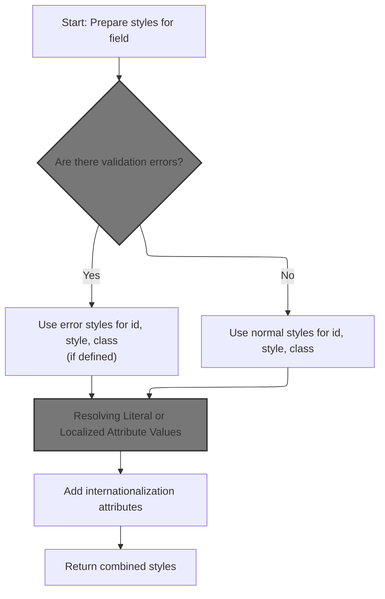
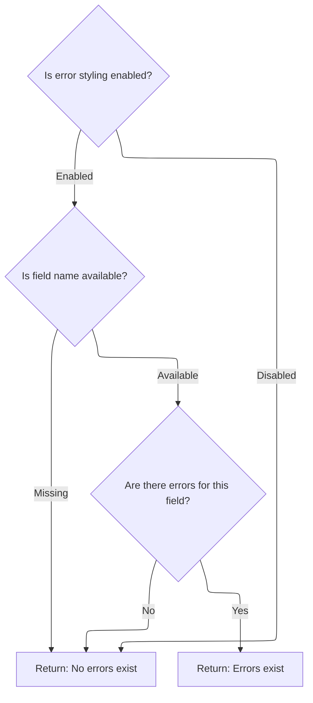
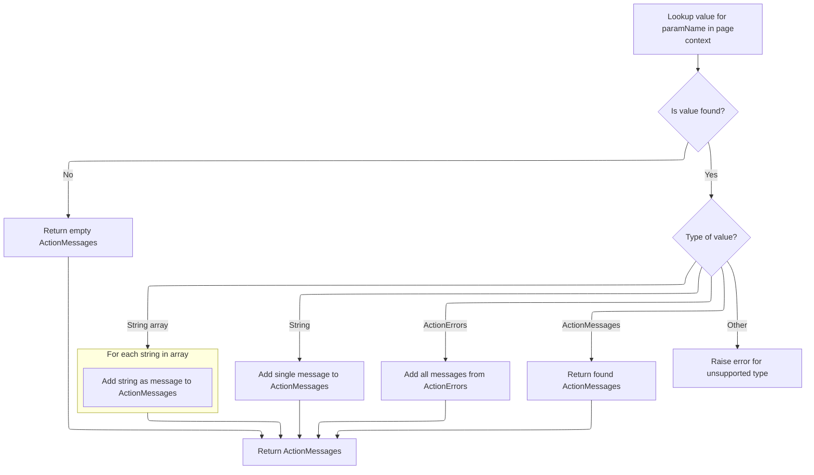
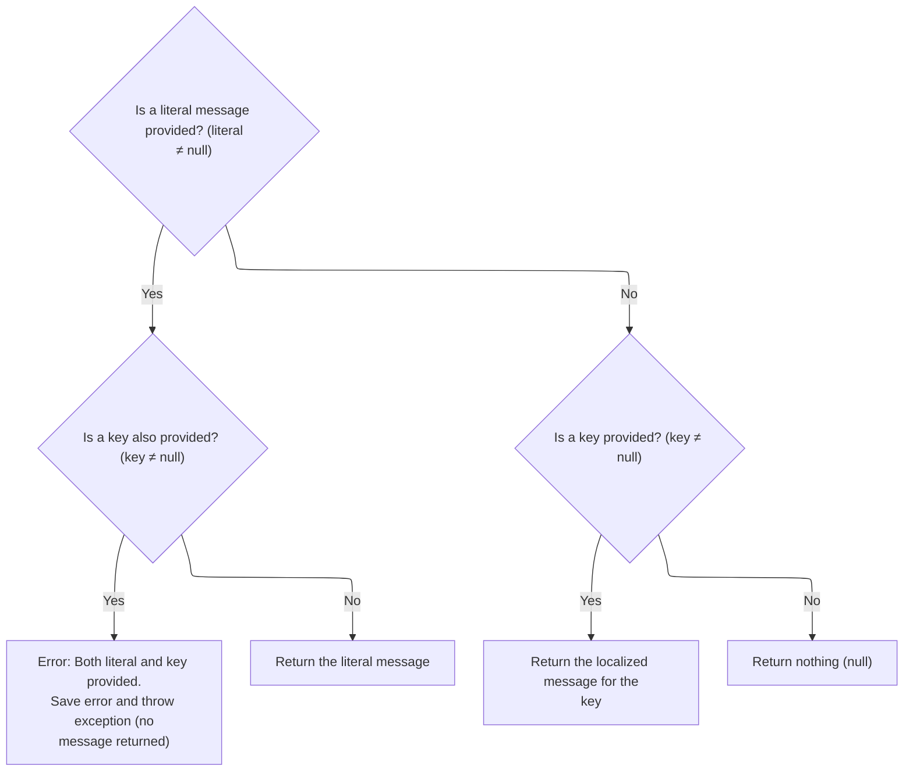

This document describes how style attributes are generated for UI fields, reflecting their validation state and supporting localization. When rendering a field, the process checks for validation errors and applies the appropriate styles, producing a string of attributes for rendering.

# Where is this flow used?

This flow is used multiple times in the codebase as represented in the following diagram:

(Note - these are only some of the entry points of this flow)

```mermaid
graph TD;
      71ddfa855c52deabd2f43f2927180c614cd5406e57899956abd88820d83bba04(taglib/…/html/ImgTag.java::ImgTag.doEndTag) --> 08aaab10f2832af029636f04b4f977011203800549dcc6cc3175d2134ef30e25(taglib/…/html/BaseHandlerTag.java::BaseHandlerTag.prepareStyles)

301dfc7ce22ede9c7489c8be7f41b3e29c1314ff3abbff75b89d76d9d9735032(taglib/…/html/RadioTag.java::RadioTag.doStartTag) --> 5879655579cd0af8fa7578026060c84080ed05a38d35bf1edc129bd63318a65c(taglib/…/html/RadioTag.java::RadioTag.renderRadioElement)

5879655579cd0af8fa7578026060c84080ed05a38d35bf1edc129bd63318a65c(taglib/…/html/RadioTag.java::RadioTag.renderRadioElement) --> 08aaab10f2832af029636f04b4f977011203800549dcc6cc3175d2134ef30e25(taglib/…/html/BaseHandlerTag.java::BaseHandlerTag.prepareStyles)

2c2ce28aaa6165003ef5589d8a8a5bdc21b65969cd85fd8b3612224a11795533(taglib/…/html/BaseFieldTag.java::BaseFieldTag.doStartTag) --> e05f7a0268d45dd6cbda0454d34b519da746846bf88e8c631682bc7870014f4c(taglib/…/html/BaseFieldTag.java::BaseFieldTag.renderInputElement)

e05f7a0268d45dd6cbda0454d34b519da746846bf88e8c631682bc7870014f4c(taglib/…/html/BaseFieldTag.java::BaseFieldTag.renderInputElement) --> 08aaab10f2832af029636f04b4f977011203800549dcc6cc3175d2134ef30e25(taglib/…/html/BaseHandlerTag.java::BaseHandlerTag.prepareStyles)

16954283ad016dbbdd2ab1921c68eca78115311671b85ed5cbdc2e02dc68e0de(taglib/…/html/CheckboxTag.java::CheckboxTag.doStartTag) --> 08aaab10f2832af029636f04b4f977011203800549dcc6cc3175d2134ef30e25(taglib/…/html/BaseHandlerTag.java::BaseHandlerTag.prepareStyles)

0072d0bda5a83199fb108597a9cc7e79ab04d586b0862cee6b4b66640d2665d0(taglib/…/html/LinkTag.java::LinkTag.doEndTag) --> 08aaab10f2832af029636f04b4f977011203800549dcc6cc3175d2134ef30e25(taglib/…/html/BaseHandlerTag.java::BaseHandlerTag.prepareStyles)


classDef mainFlowStyle color:#000000,fill:#7CB9F4
classDef rootsStyle color:#000000,fill:#00FFF4
classDef Style1 color:#000000,fill:#00FFAA
classDef Style2 color:#000000,fill:#FFFF00
classDef Style3 color:#000000,fill:#AA7CB9

%% Swimm:
%% graph TD;
%%       71ddfa855c52deabd2f43f2927180c614cd5406e57899956abd88820d83bba04(<SwmPath>[taglib/…/html/ImgTag.java](taglib/src/main/java/org/apache/struts/taglib/html/ImgTag.java)</SwmPath>::ImgTag.doEndTag) --> 08aaab10f2832af029636f04b4f977011203800549dcc6cc3175d2134ef30e25(<SwmPath>[taglib/…/html/BaseHandlerTag.java](taglib/src/main/java/org/apache/struts/taglib/html/BaseHandlerTag.java)</SwmPath>::BaseHandlerTag.prepareStyles)
%% 
%% 301dfc7ce22ede9c7489c8be7f41b3e29c1314ff3abbff75b89d76d9d9735032(<SwmPath>[taglib/…/html/RadioTag.java](taglib/src/main/java/org/apache/struts/taglib/html/RadioTag.java)</SwmPath>::RadioTag.doStartTag) --> 5879655579cd0af8fa7578026060c84080ed05a38d35bf1edc129bd63318a65c(<SwmPath>[taglib/…/html/RadioTag.java](taglib/src/main/java/org/apache/struts/taglib/html/RadioTag.java)</SwmPath>::RadioTag.renderRadioElement)
%% 
%% 5879655579cd0af8fa7578026060c84080ed05a38d35bf1edc129bd63318a65c(<SwmPath>[taglib/…/html/RadioTag.java](taglib/src/main/java/org/apache/struts/taglib/html/RadioTag.java)</SwmPath>::RadioTag.renderRadioElement) --> 08aaab10f2832af029636f04b4f977011203800549dcc6cc3175d2134ef30e25(<SwmPath>[taglib/…/html/BaseHandlerTag.java](taglib/src/main/java/org/apache/struts/taglib/html/BaseHandlerTag.java)</SwmPath>::BaseHandlerTag.prepareStyles)
%% 
%% 2c2ce28aaa6165003ef5589d8a8a5bdc21b65969cd85fd8b3612224a11795533(<SwmPath>[taglib/…/html/BaseFieldTag.java](taglib/src/main/java/org/apache/struts/taglib/html/BaseFieldTag.java)</SwmPath>::BaseFieldTag.doStartTag) --> e05f7a0268d45dd6cbda0454d34b519da746846bf88e8c631682bc7870014f4c(<SwmPath>[taglib/…/html/BaseFieldTag.java](taglib/src/main/java/org/apache/struts/taglib/html/BaseFieldTag.java)</SwmPath>::BaseFieldTag.renderInputElement)
%% 
%% e05f7a0268d45dd6cbda0454d34b519da746846bf88e8c631682bc7870014f4c(<SwmPath>[taglib/…/html/BaseFieldTag.java](taglib/src/main/java/org/apache/struts/taglib/html/BaseFieldTag.java)</SwmPath>::BaseFieldTag.renderInputElement) --> 08aaab10f2832af029636f04b4f977011203800549dcc6cc3175d2134ef30e25(<SwmPath>[taglib/…/html/BaseHandlerTag.java](taglib/src/main/java/org/apache/struts/taglib/html/BaseHandlerTag.java)</SwmPath>::BaseHandlerTag.prepareStyles)
%% 
%% 16954283ad016dbbdd2ab1921c68eca78115311671b85ed5cbdc2e02dc68e0de(<SwmPath>[taglib/…/html/CheckboxTag.java](taglib/src/main/java/org/apache/struts/taglib/html/CheckboxTag.java)</SwmPath>::CheckboxTag.doStartTag) --> 08aaab10f2832af029636f04b4f977011203800549dcc6cc3175d2134ef30e25(<SwmPath>[taglib/…/html/BaseHandlerTag.java](taglib/src/main/java/org/apache/struts/taglib/html/BaseHandlerTag.java)</SwmPath>::BaseHandlerTag.prepareStyles)
%% 
%% 0072d0bda5a83199fb108597a9cc7e79ab04d586b0862cee6b4b66640d2665d0(<SwmPath>[taglib/…/html/LinkTag.java](taglib/src/main/java/org/apache/struts/taglib/html/LinkTag.java)</SwmPath>::LinkTag.doEndTag) --> 08aaab10f2832af029636f04b4f977011203800549dcc6cc3175d2134ef30e25(<SwmPath>[taglib/…/html/BaseHandlerTag.java](taglib/src/main/java/org/apache/struts/taglib/html/BaseHandlerTag.java)</SwmPath>::BaseHandlerTag.prepareStyles)
%% 
%% 
%% classDef mainFlowStyle color:#000000,fill:#7CB9F4
%% classDef rootsStyle color:#000000,fill:#00FFF4
%% classDef Style1 color:#000000,fill:#00FFAA
%% classDef Style2 color:#000000,fill:#FFFF00
%% classDef Style3 color:#000000,fill:#AA7CB9
```



# Building Style Attributes Based on Error State



<SwmSnippet path="/taglib/src/main/java/org/apache/struts/taglib/html/BaseHandlerTag.java" line="967">

---

In <SwmToken path="taglib/src/main/java/org/apache/struts/taglib/html/BaseHandlerTag.java" pos="967:5:5" line-data="    protected String prepareStyles()">`prepareStyles`</SwmToken>, we start by checking if there are any errors using <SwmToken path="taglib/src/main/java/org/apache/struts/taglib/html/BaseHandlerTag.java" pos="971:7:7" line-data="        boolean errorsExist = doErrorsExist();">`doErrorsExist`</SwmToken>. This check is needed because the rest of the function will decide which style attributes to use based on whether errors exist or not.

```java
    protected String prepareStyles()
        throws JspException {
        StringBuffer styles = new StringBuffer();

        boolean errorsExist = doErrorsExist();

```

---

</SwmSnippet>

## Detecting Error Conditions for Styling



<SwmSnippet path="/taglib/src/main/java/org/apache/struts/taglib/html/BaseHandlerTag.java" line="1003">

---

<SwmToken path="taglib/src/main/java/org/apache/struts/taglib/html/BaseHandlerTag.java" pos="1003:5:5" line-data="    protected boolean doErrorsExist()">`doErrorsExist`</SwmToken> checks if any error style properties are set, then looks up the actual field name and fetches error messages for it using <SwmToken path="taglib/src/main/java/org/apache/struts/taglib/html/BaseHandlerTag.java" pos="1013:1:1" line-data="                    TagUtils.getInstance().getActionMessages(pageContext,">`TagUtils`</SwmToken>. This lets us know if there are any errors tied to the current input, so we can adjust the styles accordingly.

```java
    protected boolean doErrorsExist()
        throws JspException {
        boolean errorsExist = false;

        if ((getErrorStyleId() != null) || (getErrorStyle() != null)
            || (getErrorStyleClass() != null)) {
            String actualName = prepareName();

            if (actualName != null) {
                ActionMessages errors =
                    TagUtils.getInstance().getActionMessages(pageContext,
                        errorKey);

                errorsExist = ((errors != null)
                    && (errors.size(actualName) > 0));
            }
        }

        return errorsExist;
    }
```

---

</SwmSnippet>

## Retrieving and Normalizing Error Messages



<SwmSnippet path="/taglib/src/main/java/org/apache/struts/taglib/TagUtils.java" line="727">

---

In <SwmToken path="taglib/src/main/java/org/apache/struts/taglib/TagUtils.java" pos="727:5:5" line-data="    public ActionMessages getActionMessages(PageContext pageContext,">`getActionMessages`</SwmToken>, we grab an attribute from the page context and convert it into an <SwmToken path="taglib/src/main/java/org/apache/struts/taglib/TagUtils.java" pos="727:3:3" line-data="    public ActionMessages getActionMessages(PageContext pageContext,">`ActionMessages`</SwmToken> object, handling String, String\[\], <SwmToken path="taglib/src/main/java/org/apache/struts/taglib/TagUtils.java" pos="745:12:12" line-data="                } else if (value instanceof ActionErrors) {">`ActionErrors`</SwmToken>, or <SwmToken path="taglib/src/main/java/org/apache/struts/taglib/TagUtils.java" pos="727:3:3" line-data="    public ActionMessages getActionMessages(PageContext pageContext,">`ActionMessages`</SwmToken> types. This lets us treat all error messages the same way downstream.

```java
    public ActionMessages getActionMessages(PageContext pageContext,
        String paramName) throws JspException {
        ActionMessages am = new ActionMessages();

        Object value = pageContext.findAttribute(paramName);

        if (value != null) {
            try {
                if (value instanceof String) {
                    am.add(ActionMessages.GLOBAL_MESSAGE,
                        new ActionMessage((String) value));
                } else if (value instanceof String[]) {
                    String[] keys = (String[]) value;

                    for (int i = 0; i < keys.length; i++) {
                        am.add(ActionMessages.GLOBAL_MESSAGE,
                            new ActionMessage(keys[i]));
                    }
```

---

</SwmSnippet>

<SwmSnippet path="/taglib/src/main/java/org/apache/struts/taglib/TagUtils.java" line="745">

---

After running through all the type checks, we return an <SwmToken path="taglib/src/main/java/org/apache/struts/taglib/TagUtils.java" pos="746:1:1" line-data="                    ActionMessages m = (ActionMessages) value;">`ActionMessages`</SwmToken> object that holds all relevant error messages for the <SwmToken path="taglib/src/main/java/org/apache/struts/taglib/TagUtils.java" pos="758:16:16" line-data="                log.warn(&quot;Unable to retieve ActionMessage for paramName : &quot;">`paramName`</SwmToken>, so downstream code can just work with <SwmToken path="taglib/src/main/java/org/apache/struts/taglib/TagUtils.java" pos="746:1:1" line-data="                    ActionMessages m = (ActionMessages) value;">`ActionMessages`</SwmToken> and not worry about the original format.

```java
                } else if (value instanceof ActionErrors) {
                    ActionMessages m = (ActionMessages) value;

                    am.add(m);
                } else if (value instanceof ActionMessages) {
                    am = (ActionMessages) value;
                } else {
                    throw new JspException(messages.getMessage(
                            "actionMessages.errors", value.getClass().getName()));
                }
            } catch (JspException e) {
                throw e;
            } catch (Exception e) {
                log.warn("Unable to retieve ActionMessage for paramName : "
                    + paramName, e);
            }
        }

        return am;
    }
```

---

</SwmSnippet>

## Applying Conditional Styles Based on Error Presence

```mermaid
%%{init: {"flowchart": {"defaultRenderer": "elk"}} }%%
flowchart TD
  node1{"Errors exist and error style id
available?"}
  click node1 openCode "taglib/src/main/java/org/apache/struts/taglib/html/BaseHandlerTag.java:973:975"
  node1 -->|"Yes"| node2["Set id to error style id"]
  click node2 openCode "taglib/src/main/java/org/apache/struts/taglib/html/BaseHandlerTag.java:974:974"
  node1 -->|"No"| node3["Set id to normal style id"]
  click node3 openCode "taglib/src/main/java/org/apache/struts/taglib/html/BaseHandlerTag.java:976:976"

  node2 --> node4
  node3 --> node4

  node4{"Errors exist and error style
available?"}
  click node4 openCode "taglib/src/main/java/org/apache/struts/taglib/html/BaseHandlerTag.java:979:981"
  node4 -->|"Yes"| node5["Set style to error style"]
  click node5 openCode "taglib/src/main/java/org/apache/struts/taglib/html/BaseHandlerTag.java:980:980"
  node4 -->|"No"| node6["Set style to normal style"]
  click node6 openCode "taglib/src/main/java/org/apache/struts/taglib/html/BaseHandlerTag.java:982:982"

  node5 --> node7
  node6 --> node7

  node7{"Errors exist and error style class
available?"}
  click node7 openCode "taglib/src/main/java/org/apache/struts/taglib/html/BaseHandlerTag.java:985:987"
  node7 -->|"Yes"| node8["Set class to error style class"]
  click node8 openCode "taglib/src/main/java/org/apache/struts/taglib/html/BaseHandlerTag.java:986:986"
  node7 -->|"No"| node9["Set class to normal style class"]
  click node9 openCode "taglib/src/main/java/org/apache/struts/taglib/html/BaseHandlerTag.java:988:988"

  node8 --> node10["Set title and alt text"]
  click node10 openCode "taglib/src/main/java/org/apache/struts/taglib/html/BaseHandlerTag.java:991:992"
  node9 --> node10
classDef HeadingStyle fill:#777777,stroke:#333,stroke-width:2px;

%% Swimm:
%% %%{init: {"flowchart": {"defaultRenderer": "elk"}} }%%
%% flowchart TD
%%   node1{"Errors exist and error style id
%% available?"}
%%   click node1 openCode "<SwmPath>[taglib/…/html/BaseHandlerTag.java](taglib/src/main/java/org/apache/struts/taglib/html/BaseHandlerTag.java)</SwmPath>:973:975"
%%   node1 -->|"Yes"| node2["Set id to error style id"]
%%   click node2 openCode "<SwmPath>[taglib/…/html/BaseHandlerTag.java](taglib/src/main/java/org/apache/struts/taglib/html/BaseHandlerTag.java)</SwmPath>:974:974"
%%   node1 -->|"No"| node3["Set id to normal style id"]
%%   click node3 openCode "<SwmPath>[taglib/…/html/BaseHandlerTag.java](taglib/src/main/java/org/apache/struts/taglib/html/BaseHandlerTag.java)</SwmPath>:976:976"
%% 
%%   node2 --> node4
%%   node3 --> node4
%% 
%%   node4{"Errors exist and error style
%% available?"}
%%   click node4 openCode "<SwmPath>[taglib/…/html/BaseHandlerTag.java](taglib/src/main/java/org/apache/struts/taglib/html/BaseHandlerTag.java)</SwmPath>:979:981"
%%   node4 -->|"Yes"| node5["Set style to error style"]
%%   click node5 openCode "<SwmPath>[taglib/…/html/BaseHandlerTag.java](taglib/src/main/java/org/apache/struts/taglib/html/BaseHandlerTag.java)</SwmPath>:980:980"
%%   node4 -->|"No"| node6["Set style to normal style"]
%%   click node6 openCode "<SwmPath>[taglib/…/html/BaseHandlerTag.java](taglib/src/main/java/org/apache/struts/taglib/html/BaseHandlerTag.java)</SwmPath>:982:982"
%% 
%%   node5 --> node7
%%   node6 --> node7
%% 
%%   node7{"Errors exist and error style class
%% available?"}
%%   click node7 openCode "<SwmPath>[taglib/…/html/BaseHandlerTag.java](taglib/src/main/java/org/apache/struts/taglib/html/BaseHandlerTag.java)</SwmPath>:985:987"
%%   node7 -->|"Yes"| node8["Set class to error style class"]
%%   click node8 openCode "<SwmPath>[taglib/…/html/BaseHandlerTag.java](taglib/src/main/java/org/apache/struts/taglib/html/BaseHandlerTag.java)</SwmPath>:986:986"
%%   node7 -->|"No"| node9["Set class to normal style class"]
%%   click node9 openCode "<SwmPath>[taglib/…/html/BaseHandlerTag.java](taglib/src/main/java/org/apache/struts/taglib/html/BaseHandlerTag.java)</SwmPath>:988:988"
%% 
%%   node8 --> node10["Set title and alt text"]
%%   click node10 openCode "<SwmPath>[taglib/…/html/BaseHandlerTag.java](taglib/src/main/java/org/apache/struts/taglib/html/BaseHandlerTag.java)</SwmPath>:991:992"
%%   node9 --> node10
%% classDef HeadingStyle fill:#777777,stroke:#333,stroke-width:2px;
```



<SwmSnippet path="/taglib/src/main/java/org/apache/struts/taglib/html/BaseHandlerTag.java" line="973">

---

Back in BaseHandlerTag.prepareStyles, after checking for errors, we pick either error or normal style attributes for id, style, and class. Then we call message for title and alt, so we can handle both literal and localized values for those attributes.

```java
        if (errorsExist && (getErrorStyleId() != null)) {
            prepareAttribute(styles, "id", getErrorStyleId());
        } else {
            prepareAttribute(styles, "id", getStyleId());
        }

        if (errorsExist && (getErrorStyle() != null)) {
            prepareAttribute(styles, "style", getErrorStyle());
        } else {
            prepareAttribute(styles, "style", getStyle());
        }

        if (errorsExist && (getErrorStyleClass() != null)) {
            prepareAttribute(styles, "class", getErrorStyleClass());
        } else {
            prepareAttribute(styles, "class", getStyleClass());
        }

        prepareAttribute(styles, "title", message(getTitle(), getTitleKey()));
        prepareAttribute(styles, "alt", message(getAlt(), getAltKey()));
```

---

</SwmSnippet>

## Resolving Literal or Localized Attribute Values



<SwmSnippet path="/taglib/src/main/java/org/apache/struts/taglib/html/BaseHandlerTag.java" line="830">

---

<SwmToken path="taglib/src/main/java/org/apache/struts/taglib/html/BaseHandlerTag.java" pos="830:5:5" line-data="    protected String message(String literal, String key)">`message`</SwmToken> checks if both literal and key are set, throws if so, otherwise returns either the literal or fetches a localized value using <SwmToken path="taglib/src/main/java/org/apache/struts/taglib/html/BaseHandlerTag.java" pos="837:1:1" line-data="                TagUtils.getInstance().saveException(pageContext, e);">`TagUtils`</SwmToken>. This keeps the attribute value logic clean and avoids conflicts.

```java
    protected String message(String literal, String key)
        throws JspException {
        if (literal != null) {
            if (key != null) {
                JspException e =
                    new JspException(messages.getMessage("common.both"));

                TagUtils.getInstance().saveException(pageContext, e);
                throw e;
            } else {
                return (literal);
            }
        } else {
            if (key != null) {
                return TagUtils.getInstance().message(pageContext, getBundle(),
                    getLocale(), key);
            } else {
                return null;
            }
        }
    }
```

---

</SwmSnippet>

## Storing Exceptions in Request Scope

<SwmSnippet path="/tiles/src/main/java/org/apache/struts/tiles/taglib/util/TagUtils.java" line="301">

---

<SwmToken path="tiles/src/main/java/org/apache/struts/tiles/taglib/util/TagUtils.java" pos="301:7:7" line-data="    public static void saveException(PageContext pageContext, Throwable exception) {">`saveException`</SwmToken> puts the exception into the request scope using a fixed key, so error handlers or JSPs can access it later in the request lifecycle.

```java
    public static void saveException(PageContext pageContext, Throwable exception) {
        pageContext.setAttribute(Globals.EXCEPTION_KEY, exception, PageContext.REQUEST_SCOPE);
    }
```

---

</SwmSnippet>

<SwmSnippet path="/tiles/src/main/java/org/apache/struts/tiles/taglib/util/TagUtils.java" line="290">

---

<SwmToken path="tiles/src/main/java/org/apache/struts/tiles/taglib/util/TagUtils.java" pos="290:7:7" line-data="    public static void setAttribute(PageContext pageContext, String name, Object beanValue)">`setAttribute`</SwmToken> always puts the attribute in the request scope, so it's only available for the current request and doesn't leak to other scopes.

```java
    public static void setAttribute(PageContext pageContext, String name, Object beanValue)
        throws JspException {
        pageContext.setAttribute(name, beanValue, PageContext.REQUEST_SCOPE);
    }
```

---

</SwmSnippet>

## Finalizing Styles and Internationalization

<SwmSnippet path="/taglib/src/main/java/org/apache/struts/taglib/html/BaseHandlerTag.java" line="993">

---

After getting the values for title and alt from message, we run <SwmToken path="taglib/src/main/java/org/apache/struts/taglib/html/BaseHandlerTag.java" pos="993:1:1" line-data="        prepareInternationalization(styles);">`prepareInternationalization`</SwmToken> and then return the complete style string from BaseHandlerTag.prepareStyles. The message results are now part of the final output.

```java
        prepareInternationalization(styles);

        return styles.toString();
    }
```

---

</SwmSnippet>

&nbsp;

*This is an auto-generated document by Swimm 🌊 and has not yet been verified by a human*

<SwmMeta version="3.0.0" repo-id="Z2l0aHViJTNBJTNBc3RydXRzMSUzQSUzQVN3aW1tLURlbW8=" repo-name="struts1"><sup>Powered by [Swimm](https://app.swimm.io/)</sup></SwmMeta>
