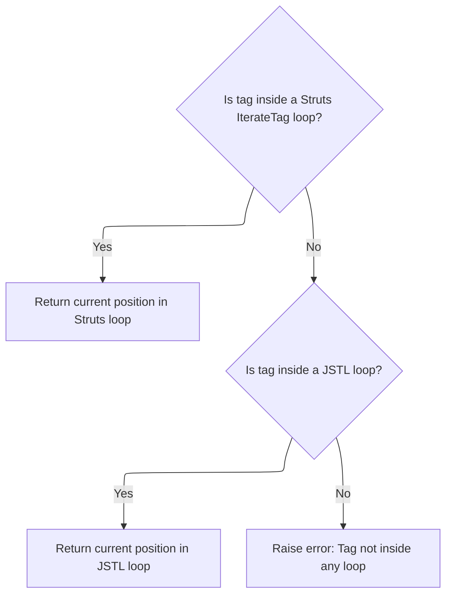

This document describes how a unique handler string is generated for each repeated form element in a list or table. The process combines the field name with the current index, supporting both Struts and JSTL loops, so each form element can be individually identified and processed.

# Building the Indexed Handler String

<SwmSnippet path="/taglib/src/main/java/org/apache/struts/taglib/html/BaseHandlerTag.java" line="913">

---

In <SwmToken path="taglib/src/main/java/org/apache/struts/taglib/html/BaseHandlerTag.java" pos="913:5:5" line-data="    protected void prepareIndex(StringBuffer handlers, String name)">`prepareIndex`</SwmToken>, we start by appending the (possibly filtered) name and an opening bracket to the handlers. Next, we call <SwmToken path="taglib/src/main/java/org/apache/struts/taglib/html/BaseHandlerTag.java" pos="920:5:5" line-data="        handlers.append(getIndexValue());">`getIndexValue`</SwmToken> to fetch the current loop index, which is required to build a unique handler string for each repeated element.

```java
    protected void prepareIndex(StringBuffer handlers, String name)
        throws JspException {
        if (name != null) {
            handlers.append(TagUtils.getInstance().filter(name));
        }

        handlers.append("[");
        handlers.append(getIndexValue());
```

---

</SwmSnippet>

## Resolving the Current Loop Index



<SwmSnippet path="/taglib/src/main/java/org/apache/struts/taglib/html/BaseHandlerTag.java" line="935">

---

In <SwmToken path="taglib/src/main/java/org/apache/struts/taglib/html/BaseHandlerTag.java" pos="935:5:5" line-data="    protected int getIndexValue()">`getIndexValue`</SwmToken>, we first try to find an enclosing <SwmToken path="taglib/src/main/java/org/apache/struts/taglib/html/BaseHandlerTag.java" pos="938:1:1" line-data="        IterateTag iterateTag =">`IterateTag`</SwmToken> and, if found, grab its index. This lets us support Struts-specific iteration. If not found, we need to check for JSTL loops next to cover both iteration mechanisms.

```java
    protected int getIndexValue()
        throws JspException {
        // look for outer iterate tag
        IterateTag iterateTag =
            (IterateTag) findAncestorWithClass(this, IterateTag.class);

        if (iterateTag != null) {
            return iterateTag.getIndex();
        }

```

---

</SwmSnippet>

<SwmSnippet path="/taglib/src/main/java/org/apache/struts/taglib/logic/IterateTag.java" line="159">

---

GetIndex() in <SwmToken path="taglib/src/main/java/org/apache/struts/taglib/html/BaseHandlerTag.java" pos="938:1:1" line-data="        IterateTag iterateTag =">`IterateTag`</SwmToken> returns the current loop index, using <SwmToken path="taglib/src/main/java/org/apache/struts/taglib/logic/IterateTag.java" pos="161:5:5" line-data="            return ((offsetValue + lengthCount) - 1);">`offsetValue`</SwmToken> and <SwmToken path="taglib/src/main/java/org/apache/struts/taglib/logic/IterateTag.java" pos="161:9:9" line-data="            return ((offsetValue + lengthCount) - 1);">`lengthCount`</SwmToken> if iteration has started, or 0 otherwise. This value is used by <SwmToken path="taglib/src/main/java/org/apache/struts/taglib/html/BaseHandlerTag.java" pos="920:5:5" line-data="        handlers.append(getIndexValue());">`getIndexValue`</SwmToken> to identify the current element.

```java
    public int getIndex() {
        if (started) {
            return ((offsetValue + lengthCount) - 1);
        } else {
            return (0);
        }
    }
```

---

</SwmSnippet>

<SwmSnippet path="/taglib/src/main/java/org/apache/struts/taglib/html/BaseHandlerTag.java" line="945">

---

Back in <SwmToken path="taglib/src/main/java/org/apache/struts/taglib/html/BaseHandlerTag.java" pos="920:5:5" line-data="        handlers.append(getIndexValue());">`getIndexValue`</SwmToken>, if no <SwmToken path="taglib/src/main/java/org/apache/struts/taglib/html/BaseHandlerTag.java" pos="938:1:1" line-data="        IterateTag iterateTag =">`IterateTag`</SwmToken> was found, we try <SwmToken path="taglib/src/main/java/org/apache/struts/taglib/html/BaseHandlerTag.java" pos="946:7:7" line-data="        Integer i = getJstlLoopIndex();">`getJstlLoopIndex`</SwmToken> next. This covers the case where the tag is inside a JSTL loop instead of a Struts <SwmToken path="taglib/src/main/java/org/apache/struts/taglib/html/BaseHandlerTag.java" pos="938:1:1" line-data="        IterateTag iterateTag =">`IterateTag`</SwmToken>.

```java
        // Look for JSTL loops
        Integer i = getJstlLoopIndex();

        if (i != null) {
            return i.intValue();
        }

```

---

</SwmSnippet>

<SwmSnippet path="/taglib/src/main/java/org/apache/struts/taglib/html/BaseHandlerTag.java" line="852">

---

GetJstlLoopIndex tries to find a JSTL loop tag ancestor and fetch its index using reflection. It only sets up the reflection machinery once, so there's minimal overhead if JSTL is present.

```java
    private Integer getJstlLoopIndex() {
        if (!triedJstlInit) {
            triedJstlInit = true;

            try {
                loopTagClass =
                    RequestUtils.applicationClass(
                        "javax.servlet.jsp.jstl.core.LoopTag");

                loopTagGetStatus =
                    loopTagClass.getDeclaredMethod("getLoopStatus", null);

                loopTagStatusClass =
                    RequestUtils.applicationClass(
                        "javax.servlet.jsp.jstl.core.LoopTagStatus");

                loopTagStatusGetIndex =
                    loopTagStatusClass.getDeclaredMethod("getIndex", null);

                triedJstlSuccess = true;
            } catch (ClassNotFoundException ex) {
                // These just mean that JSTL isn't loaded, so ignore
            } catch (NoSuchMethodException ex) {
            }
        }

        if (triedJstlSuccess) {
            try {
                Object loopTag =
                    findAncestorWithClass(this, loopTagClass);

                if (loopTag == null) {
                    return null;
                }

                Object status = loopTagGetStatus.invoke(loopTag, null);

                return (Integer) loopTagStatusGetIndex.invoke(status, null);
            } catch (IllegalAccessException ex) {
                log.error(ex.getMessage(), ex);
            } catch (IllegalArgumentException ex) {
                log.error(ex.getMessage(), ex);
            } catch (InvocationTargetException ex) {
                log.error(ex.getMessage(), ex);
            } catch (NullPointerException ex) {
                log.error(ex.getMessage(), ex);
            } catch (ExceptionInInitializerError ex) {
                log.error(ex.getMessage(), ex);
            }
        }

        return null;
    }
```

---

</SwmSnippet>

<SwmSnippet path="/taglib/src/main/java/org/apache/struts/taglib/html/BaseHandlerTag.java" line="952">

---

Back in <SwmToken path="taglib/src/main/java/org/apache/struts/taglib/html/BaseHandlerTag.java" pos="920:5:5" line-data="        handlers.append(getIndexValue());">`getIndexValue`</SwmToken>, if neither an <SwmToken path="taglib/src/main/java/org/apache/struts/taglib/html/BaseHandlerTag.java" pos="952:17:17" line-data="        // this tag should be nested in an IterateTag or JSTL loop tag, if it&#39;s not, throw exception">`IterateTag`</SwmToken> nor a JSTL loop is found, we fetch a localized error message to explain the missing context before throwing an exception.

```java
        // this tag should be nested in an IterateTag or JSTL loop tag, if it's not, throw exception
        JspException e =
            new JspException(messages.getMessage("indexed.noEnclosingIterate"));

```

---

</SwmSnippet>

<SwmSnippet path="/core/src/main/java/org/apache/struts/util/MessageResources.java" line="196">

---

GetMessage fetches the localized error string for the missing loop context, which is used in the <SwmToken path="taglib/src/main/java/org/apache/struts/taglib/html/BaseHandlerTag.java" pos="914:3:3" line-data="        throws JspException {">`JspException`</SwmToken>.

```java
    public String getMessage(String key) {
        return this.getMessage((Locale) null, key, null);
    }
```

---

</SwmSnippet>

<SwmSnippet path="/taglib/src/main/java/org/apache/struts/taglib/html/BaseHandlerTag.java" line="956">

---

Back in <SwmToken path="taglib/src/main/java/org/apache/struts/taglib/html/BaseHandlerTag.java" pos="920:5:5" line-data="        handlers.append(getIndexValue());">`getIndexValue`</SwmToken>, after creating the exception, we save it to the page context so the framework can access it for error handling.

```java
        TagUtils.getInstance().saveException(pageContext, e);
```

---

</SwmSnippet>

<SwmSnippet path="/tiles/src/main/java/org/apache/struts/tiles/taglib/util/TagUtils.java" line="301">

---

SaveException puts the exception into the request scope of the page context, making it available for error handling downstream.

```java
    public static void saveException(PageContext pageContext, Throwable exception) {
        pageContext.setAttribute(Globals.EXCEPTION_KEY, exception, PageContext.REQUEST_SCOPE);
    }
```

---

</SwmSnippet>

<SwmSnippet path="/taglib/src/main/java/org/apache/struts/taglib/html/BaseHandlerTag.java" line="957">

---

Finally, in <SwmToken path="taglib/src/main/java/org/apache/struts/taglib/html/BaseHandlerTag.java" pos="920:5:5" line-data="        handlers.append(getIndexValue());">`getIndexValue`</SwmToken>, after saving the exception, we throw it to stop processing since there's no valid loop context.

```java
        throw e;
    }
```

---

</SwmSnippet>

## Finalizing the Handler String

<SwmSnippet path="/taglib/src/main/java/org/apache/struts/taglib/html/BaseHandlerTag.java" line="921">

---

Back in <SwmToken path="taglib/src/main/java/org/apache/struts/taglib/html/BaseHandlerTag.java" pos="913:5:5" line-data="    protected void prepareIndex(StringBuffer handlers, String name)">`prepareIndex`</SwmToken>, after getting the index value, we close the bracket and, if a name was provided, add a dot to separate the indexed part from any following property.

```java
        handlers.append("]");

        if (name != null) {
            handlers.append(".");
        }
    }
```

---

</SwmSnippet>

&nbsp;

*This is an auto-generated document by Swimm 🌊 and has not yet been verified by a human*

<SwmMeta version="3.0.0" repo-id="Z2l0aHViJTNBJTNBc3RydXRzMSUzQSUzQVN3aW1tLURlbW8=" repo-name="struts1"><sup>Powered by [Swimm](https://app.swimm.io/)</sup></SwmMeta>
