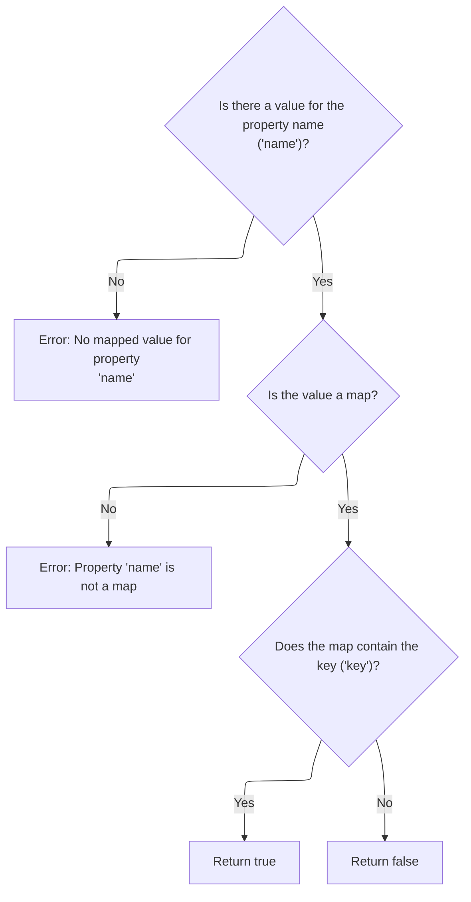
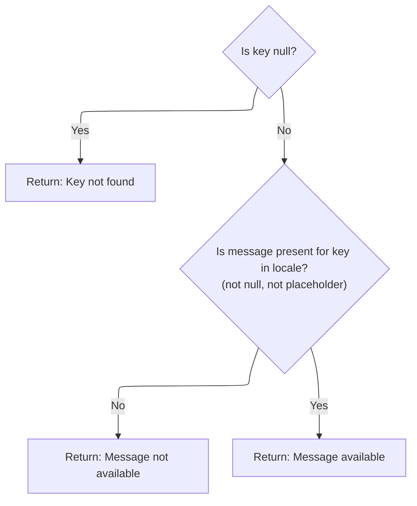
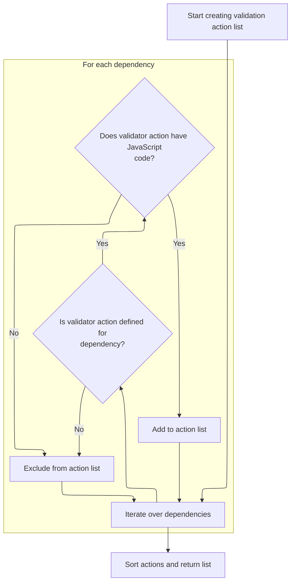

This document describes how a list of unique validation actions with <SwmToken path="taglib/src/main/java/org/apache/struts/taglib/html/JavascriptValidatorTag.java" pos="55:11:11" line-data=" * Custom tag that generates JavaScript for client side validation based on">`JavaScript`</SwmToken> logic is generated for a form. By collecting and filtering dependencies from form fields, the flow produces a sorted list of actions for efficient client-side validation.

# Collecting Unique Validation Dependencies from Form Fields

```mermaid
%%{init: {"flowchart": {"defaultRenderer": "elk"}} }%%
flowchart TD
    subgraph loop1["For each field in the form"]
      node1["Collect unique dependencies for
validation"]
    end
    loop1 --> subgraph loop2["For each collected dependency"]
      node2{"Does the validation action have
JavaScript logic?"}
      node2 -->|"Yes"| node3["Retrieving and Filtering Validator Actions for JavaScript Output"]
      node2 -->|"No"| node4["Retrieving and Filtering Validator Actions for JavaScript Output"]
    end
    loop2 --> node5["Return list of validation actions"]

    click node1 openCode "taglib/src/main/java/org/apache/struts/taglib/html/JavascriptValidatorTag.java:681:694"
    
    
    
    click node5 openCode "taglib/src/main/java/org/apache/struts/taglib/html/JavascriptValidatorTag.java:721:722"

classDef HeadingStyle fill:#777777,stroke:#333,stroke-width:2px;
click node2 goToHeading "Retrieving and Filtering Validator Actions for JavaScript Output"
node2:::HeadingStyle
click node3 goToHeading "Retrieving and Filtering Validator Actions for JavaScript Output"
node3:::HeadingStyle
click node4 goToHeading "Retrieving and Filtering Validator Actions for JavaScript Output"
node4:::HeadingStyle

%% Swimm:
%% %%{init: {"flowchart": {"defaultRenderer": "elk"}} }%%
%% flowchart TD
%%     subgraph loop1["For each field in the form"]
%%       node1["Collect unique dependencies for
%% validation"]
%%     end
%%     loop1 --> subgraph loop2["For each collected dependency"]
%%       node2{"Does the validation action have
%% <SwmToken path="taglib/src/main/java/org/apache/struts/taglib/html/JavascriptValidatorTag.java" pos="55:11:11" line-data=" * Custom tag that generates JavaScript for client side validation based on">`JavaScript`</SwmToken> logic?"}
%%       node2 -->|"Yes"| node3["Retrieving and Filtering Validator Actions for <SwmToken path="taglib/src/main/java/org/apache/struts/taglib/html/JavascriptValidatorTag.java" pos="55:11:11" line-data=" * Custom tag that generates JavaScript for client side validation based on">`JavaScript`</SwmToken> Output"]
%%       node2 -->|"No"| node4["Retrieving and Filtering Validator Actions for <SwmToken path="taglib/src/main/java/org/apache/struts/taglib/html/JavascriptValidatorTag.java" pos="55:11:11" line-data=" * Custom tag that generates JavaScript for client side validation based on">`JavaScript`</SwmToken> Output"]
%%     end
%%     loop2 --> node5["Return list of validation actions"]
%% 
%%     click node1 openCode "<SwmPath>[taglib/…/html/JavascriptValidatorTag.java](taglib/src/main/java/org/apache/struts/taglib/html/JavascriptValidatorTag.java)</SwmPath>:681:694"
%%     
%%     
%%     
%%     click node5 openCode "<SwmPath>[taglib/…/html/JavascriptValidatorTag.java](taglib/src/main/java/org/apache/struts/taglib/html/JavascriptValidatorTag.java)</SwmPath>:721:722"
%% 
%% classDef HeadingStyle fill:#777777,stroke:#333,stroke-width:2px;
%% click node2 goToHeading "Retrieving and Filtering Validator Actions for <SwmToken path="taglib/src/main/java/org/apache/struts/taglib/html/JavascriptValidatorTag.java" pos="55:11:11" line-data=" * Custom tag that generates JavaScript for client side validation based on">`JavaScript`</SwmToken> Output"
%% node2:::HeadingStyle
%% click node3 goToHeading "Retrieving and Filtering Validator Actions for <SwmToken path="taglib/src/main/java/org/apache/struts/taglib/html/JavascriptValidatorTag.java" pos="55:11:11" line-data=" * Custom tag that generates JavaScript for client side validation based on">`JavaScript`</SwmToken> Output"
%% node3:::HeadingStyle
%% click node4 goToHeading "Retrieving and Filtering Validator Actions for <SwmToken path="taglib/src/main/java/org/apache/struts/taglib/html/JavascriptValidatorTag.java" pos="55:11:11" line-data=" * Custom tag that generates JavaScript for client side validation based on">`JavaScript`</SwmToken> Output"
%% node4:::HeadingStyle
```

<SwmSnippet path="/taglib/src/main/java/org/apache/struts/taglib/html/JavascriptValidatorTag.java" line="678">

---

In <SwmToken path="taglib/src/main/java/org/apache/struts/taglib/html/JavascriptValidatorTag.java" pos="678:5:5" line-data="    private List createActionList(ValidatorResources resources, Form form) {">`createActionList`</SwmToken>, we're looping through each field in the form and then through each dependency in the field's dependency list. We add each dependency to the <SwmToken path="taglib/src/main/java/org/apache/struts/taglib/html/JavascriptValidatorTag.java" pos="679:3:3" line-data="        List actionMethods = new ArrayList();">`actionMethods`</SwmToken> list only if it's not already there and not null. This ensures we only collect unique dependencies. We use an iterator here so we can traverse the lists efficiently, and that's why we need to call <SwmToken path="core/src/main/java/org/apache/struts/util/IteratorAdapter.java" pos="36:4:4" line-data="public class IteratorAdapter implements Iterator {">`IteratorAdapter`</SwmToken> next—to handle the iteration over these collections.

```java
    private List createActionList(ValidatorResources resources, Form form) {
        List actionMethods = new ArrayList();

        Iterator iterator = form.getFields().iterator();

        while (iterator.hasNext()) {
            Field field = (Field) iterator.next();

            for (Iterator x = field.getDependencyList().iterator();
                x.hasNext();) {
                Object o = x.next();

```

---

</SwmSnippet>

<SwmSnippet path="/core/src/main/java/org/apache/struts/util/IteratorAdapter.java" line="47">

---

<SwmToken path="core/src/main/java/org/apache/struts/util/IteratorAdapter.java" pos="47:5:5" line-data="    public Object next() {">`next`</SwmToken> in <SwmToken path="core/src/main/java/org/apache/struts/util/IteratorAdapter.java" pos="36:4:4" line-data="public class IteratorAdapter implements Iterator {">`IteratorAdapter`</SwmToken> checks if the underlying enumeration has more elements. If not, it throws an exception. Otherwise, it returns the next element. This lets us use Enumeration objects as Iterators, which is needed for the dependency iteration in <SwmToken path="taglib/src/main/java/org/apache/struts/taglib/html/JavascriptValidatorTag.java" pos="678:5:5" line-data="    private List createActionList(ValidatorResources resources, Form form) {">`createActionList`</SwmToken>.

```java
    public Object next() {
        if (!e.hasMoreElements()) {
            throw new NoSuchElementException(
                "IteratorAdaptor.next() has no more elements");
        }

        return e.nextElement();
    }
```

---

</SwmSnippet>

<SwmSnippet path="/taglib/src/main/java/org/apache/struts/taglib/html/JavascriptValidatorTag.java" line="690">

---

Back in JavascriptValidatorTag.createActionList, after iterating with <SwmToken path="core/src/main/java/org/apache/struts/util/IteratorAdapter.java" pos="36:4:4" line-data="public class IteratorAdapter implements Iterator {">`IteratorAdapter`</SwmToken>, we add each dependency to <SwmToken path="taglib/src/main/java/org/apache/struts/taglib/html/JavascriptValidatorTag.java" pos="690:15:15" line-data="                if ((o != null) &amp;&amp; !actionMethods.contains(o)) {">`actionMethods`</SwmToken> only if it's not null and not already present. This keeps the list unique. Next, we need to call <SwmToken path="core/src/main/java/org/apache/struts/action/DynaActionForm.java" pos="50:14:14" line-data=" * solution is to subclass &lt;code&gt;DynaActionForm&lt;/code&gt; and call the">`DynaActionForm`</SwmToken> to check for mapped values tied to these dependencies.

```java
                if ((o != null) && !actionMethods.contains(o)) {
                    actionMethods.add(o);
                }
            }
        }

```

---

</SwmSnippet>

## Checking for Mapped Values in Dynamic Form Data



<SwmSnippet path="/core/src/main/java/org/apache/struts/action/DynaActionForm.java" line="203">

---

<SwmToken path="core/src/main/java/org/apache/struts/action/DynaActionForm.java" pos="203:5:5" line-data="    public boolean contains(String name, String key) {">`contains`</SwmToken> checks if a given key exists in a Map stored under 'name' in <SwmToken path="core/src/main/java/org/apache/struts/action/DynaActionForm.java" pos="204:7:7" line-data="        Object value = dynaValues.get(name);">`dynaValues`</SwmToken>. If the value is missing or not a Map, it throws an exception. Next, we call <SwmToken path="faces/src/main/java/org/apache/struts/faces/util/MessagesMap.java" pos="41:4:4" line-data="public class MessagesMap implements Map {">`MessagesMap`</SwmToken> to check if a message exists for this key, which ties into validation feedback.

```java
    public boolean contains(String name, String key) {
        Object value = dynaValues.get(name);

        if (value == null) {
            throw new NullPointerException("No mapped value for '" + name + "("
                + key + ")'");
        } else if (value instanceof Map) {
            return (((Map) value).containsKey(key));
        } else {
            throw new IllegalArgumentException("Non-mapped property for '"
                + name + "(" + key + ")'");
        }
    }
```

---

</SwmSnippet>

## Verifying Presence of Validation Messages for Locale



<SwmSnippet path="/faces/src/main/java/org/apache/struts/faces/util/MessagesMap.java" line="107">

---

<SwmToken path="faces/src/main/java/org/apache/struts/faces/util/MessagesMap.java" pos="107:5:5" line-data="    public boolean containsKey(Object key) {">`containsKey`</SwmToken> checks if a message exists for a given key and locale. If the key is null, it returns false. Otherwise, it calls MessageResources.isPresent to see if the message is available.

```java
    public boolean containsKey(Object key) {

        if (key == null) {
            return (false);
        } else {
            return (messages.isPresent(locale, key.toString()));
        }

    }
```

---

</SwmSnippet>

<SwmSnippet path="/core/src/main/java/org/apache/struts/util/MessageResources.java" line="397">

---

<SwmToken path="core/src/main/java/org/apache/struts/util/MessageResources.java" pos="397:5:5" line-data="    public boolean isPresent(Locale locale, String key) {">`isPresent`</SwmToken> checks if a message exists for a locale and key by calling <SwmToken path="core/src/main/java/org/apache/struts/util/MessageResources.java" pos="398:7:7" line-data="        String message = getMessage(locale, key);">`getMessage`</SwmToken>. If the result is null or wrapped in '???', it returns false. Otherwise, it returns true. This lets us filter out missing or placeholder messages.

```java
    public boolean isPresent(Locale locale, String key) {
        String message = getMessage(locale, key);

        if (message == null) {
            return false;
        } else if (message.startsWith("???") && message.endsWith("???")) {
            return false; // FIXME - Only valid for default implementation
        } else {
            return true;
        }
    }
```

---

</SwmSnippet>

## Retrieving and Filtering Validator Actions for <SwmToken path="taglib/src/main/java/org/apache/struts/taglib/html/JavascriptValidatorTag.java" pos="55:11:11" line-data=" * Custom tag that generates JavaScript for client side validation based on">`JavaScript`</SwmToken> Output



<SwmSnippet path="/taglib/src/main/java/org/apache/struts/taglib/html/JavascriptValidatorTag.java" line="696">

---

Just back from <SwmToken path="core/src/main/java/org/apache/struts/action/DynaActionForm.java" pos="50:14:14" line-data=" * solution is to subclass &lt;code&gt;DynaActionForm&lt;/code&gt; and call the">`DynaActionForm`</SwmToken>, JavascriptValidatorTag.createActionList now loops through the unique dependency strings in <SwmToken path="taglib/src/main/java/org/apache/struts/taglib/html/JavascriptValidatorTag.java" pos="698:15:15" line-data="        // Create list of ValidatorActions based on actionMethods">`actionMethods`</SwmToken> using <SwmToken path="core/src/main/java/org/apache/struts/util/IteratorAdapter.java" pos="36:4:4" line-data="public class IteratorAdapter implements Iterator {">`IteratorAdapter`</SwmToken>. For each, it fetches the <SwmToken path="taglib/src/main/java/org/apache/struts/taglib/html/JavascriptValidatorTag.java" pos="703:1:1" line-data="            ValidatorAction va = resources.getValidatorAction(depends);">`ValidatorAction`</SwmToken> from <SwmToken path="taglib/src/main/java/org/apache/struts/taglib/html/JavascriptValidatorTag.java" pos="678:7:7" line-data="    private List createActionList(ValidatorResources resources, Form form) {">`ValidatorResources`</SwmToken>. If it's missing, it throws an exception to catch config errors early.

```java
        List actions = new ArrayList();

        // Create list of ValidatorActions based on actionMethods
        iterator = actionMethods.iterator();

        while (iterator.hasNext()) {
            String depends = (String) iterator.next();
```

---

</SwmSnippet>

<SwmSnippet path="/taglib/src/main/java/org/apache/struts/taglib/html/JavascriptValidatorTag.java" line="703">

---

Just back from <SwmToken path="core/src/main/java/org/apache/struts/util/IteratorAdapter.java" pos="36:4:4" line-data="public class IteratorAdapter implements Iterator {">`IteratorAdapter`</SwmToken>, JavascriptValidatorTag.createActionList checks each <SwmToken path="taglib/src/main/java/org/apache/struts/taglib/html/JavascriptValidatorTag.java" pos="703:1:1" line-data="            ValidatorAction va = resources.getValidatorAction(depends);">`ValidatorAction`</SwmToken> for <SwmToken path="taglib/src/main/java/org/apache/struts/taglib/html/JavascriptValidatorTag.java" pos="55:11:11" line-data=" * Custom tag that generates JavaScript for client side validation based on">`JavaScript`</SwmToken> code. If it's present, it adds it to the actions list; otherwise, it removes the dependency. Finally, it sorts the actions and returns them for use in client-side validation.

```java
            ValidatorAction va = resources.getValidatorAction(depends);

            // throw nicer NPE for easier debugging
            if (va == null) {
                throw new NullPointerException("Depends string \"" + depends
                    + "\" was not found in validator-rules.xml.");
            }

            if ((va.getJavascript() != null)
                && (va.getJavascript().length() > 0)) {
                actions.add(va);
            } else {
                iterator.remove();
            }
        }

        Collections.sort(actions, actionComparator);

        return actions;
    }
```

---

</SwmSnippet>

&nbsp;

*This is an* <SwmToken path="taglib/src/main/java/org/apache/struts/taglib/html/JavascriptValidatorTag.java" pos="239:24:26" line-data="     * method name if it has a value.  This overrides the auto-generated">`auto-generated`</SwmToken> *document by Swimm 🌊 and has not yet been verified by a human*

<SwmMeta version="3.0.0" repo-id="Z2l0aHViJTNBJTNBc3RydXRzMSUzQSUzQVN3aW1tLURlbW8=" repo-name="struts1"><sup>Powered by [Swimm](https://app.swimm.io/)</sup></SwmMeta>
