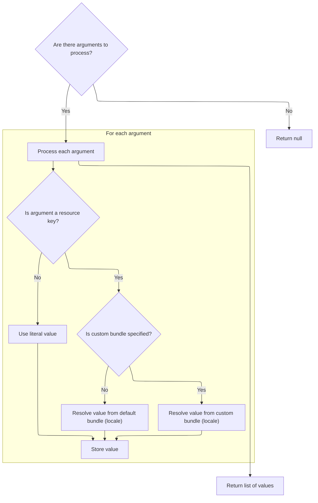

This document explains how a personalized validation message is generated for the user as part of the form validation infrastructure. When a form is validated, the system builds a message based on the validation action and field, resolves any arguments, and finalizes the message to ensure it is properly localized and personalized for the user.

# Where is this flow used?

This flow is used multiple times in the codebase as represented in the following diagram:

(Note - these are only some of the entry points of this flow)

```mermaid
graph TD;
      5f38c92c0089bc234ada4661f6795a68f5d36dce15cbbb313430c4d288d794dd(core/…/validator/FieldChecks.java::FieldChecks.validateUrl) --> 7e0b20bd58e84820d21149fd47dbdda751406d7be4151d0217b168f98dec73a6(core/…/validator/Resources.java::Resources.getActionMessage)

f50a72162003216b991ccf5505187646c4be7cae66f1816bf02f1ed5c9dd2f6e(core/…/validwhen/ValidWhen.java::ValidWhen.validateValidWhen) --> 7e0b20bd58e84820d21149fd47dbdda751406d7be4151d0217b168f98dec73a6(core/…/validator/Resources.java::Resources.getActionMessage)

22114997d330b17bf5d42b98ec3618aea845af6ecd007ade0ea39bf7e079af65(core/…/validator/FieldChecks.java::FieldChecks.validateRequiredIf) --> 7e0b20bd58e84820d21149fd47dbdda751406d7be4151d0217b168f98dec73a6(core/…/validator/Resources.java::Resources.getActionMessage)

b0b33e5c0142ad0ad4388b5478562309766e2e2219109dc49e4943ba864b2286(core/…/validator/FieldChecks.java::FieldChecks.validateDoubleRange) --> 7e0b20bd58e84820d21149fd47dbdda751406d7be4151d0217b168f98dec73a6(core/…/validator/Resources.java::Resources.getActionMessage)

0a1f12139297b7658bc64ed7e55906a5bd8f61549cbae8e607604cf0a2f9a023(core/…/validator/FieldChecks.java::FieldChecks.validateFloatRange) --> 7e0b20bd58e84820d21149fd47dbdda751406d7be4151d0217b168f98dec73a6(core/…/validator/Resources.java::Resources.getActionMessage)


classDef mainFlowStyle color:#000000,fill:#7CB9F4
classDef rootsStyle color:#000000,fill:#00FFF4
classDef Style1 color:#000000,fill:#00FFAA
classDef Style2 color:#000000,fill:#FFFF00
classDef Style3 color:#000000,fill:#AA7CB9

%% Swimm:
%% graph TD;
%%       5f38c92c0089bc234ada4661f6795a68f5d36dce15cbbb313430c4d288d794dd(<SwmPath>[core/…/validator/FieldChecks.java](core/src/main/java/org/apache/struts/validator/FieldChecks.java)</SwmPath>::FieldChecks.validateUrl) --> 7e0b20bd58e84820d21149fd47dbdda751406d7be4151d0217b168f98dec73a6(<SwmPath>[core/…/validator/Resources.java](core/src/main/java/org/apache/struts/validator/Resources.java)</SwmPath>::Resources.getActionMessage)
%% 
%% f50a72162003216b991ccf5505187646c4be7cae66f1816bf02f1ed5c9dd2f6e(<SwmPath>[core/…/validwhen/ValidWhen.java](core/src/main/java/org/apache/struts/validator/validwhen/ValidWhen.java)</SwmPath>::ValidWhen.validateValidWhen) --> 7e0b20bd58e84820d21149fd47dbdda751406d7be4151d0217b168f98dec73a6(<SwmPath>[core/…/validator/Resources.java](core/src/main/java/org/apache/struts/validator/Resources.java)</SwmPath>::Resources.getActionMessage)
%% 
%% 22114997d330b17bf5d42b98ec3618aea845af6ecd007ade0ea39bf7e079af65(<SwmPath>[core/…/validator/FieldChecks.java](core/src/main/java/org/apache/struts/validator/FieldChecks.java)</SwmPath>::FieldChecks.validateRequiredIf) --> 7e0b20bd58e84820d21149fd47dbdda751406d7be4151d0217b168f98dec73a6(<SwmPath>[core/…/validator/Resources.java](core/src/main/java/org/apache/struts/validator/Resources.java)</SwmPath>::Resources.getActionMessage)
%% 
%% b0b33e5c0142ad0ad4388b5478562309766e2e2219109dc49e4943ba864b2286(<SwmPath>[core/…/validator/FieldChecks.java](core/src/main/java/org/apache/struts/validator/FieldChecks.java)</SwmPath>::FieldChecks.validateDoubleRange) --> 7e0b20bd58e84820d21149fd47dbdda751406d7be4151d0217b168f98dec73a6(<SwmPath>[core/…/validator/Resources.java](core/src/main/java/org/apache/struts/validator/Resources.java)</SwmPath>::Resources.getActionMessage)
%% 
%% 0a1f12139297b7658bc64ed7e55906a5bd8f61549cbae8e607604cf0a2f9a023(<SwmPath>[core/…/validator/FieldChecks.java](core/src/main/java/org/apache/struts/validator/FieldChecks.java)</SwmPath>::FieldChecks.validateFloatRange) --> 7e0b20bd58e84820d21149fd47dbdda751406d7be4151d0217b168f98dec73a6(<SwmPath>[core/…/validator/Resources.java](core/src/main/java/org/apache/struts/validator/Resources.java)</SwmPath>::Resources.getActionMessage)
%% 
%% 
%% classDef mainFlowStyle color:#000000,fill:#7CB9F4
%% classDef rootsStyle color:#000000,fill:#00FFF4
%% classDef Style1 color:#000000,fill:#00FFAA
%% classDef Style2 color:#000000,fill:#FFFF00
%% classDef Style3 color:#000000,fill:#AA7CB9
```



# Building the Validation Message

<SwmSnippet path="/core/src/main/java/org/apache/struts/validator/Resources.java" line="365">

---

In <SwmToken path="core/src/main/java/org/apache/struts/validator/Resources.java" pos="365:7:7" line-data="    public static ActionMessage getActionMessage(Validator validator,">`getActionMessage`</SwmToken>, we start by checking if there's a Msg for the <SwmToken path="core/src/main/java/org/apache/struts/validator/Resources.java" pos="366:6:6" line-data="        HttpServletRequest request, ValidatorAction va, Field field) {">`ValidatorAction`</SwmToken> name and whether it's a resource. If it's not a resource, we return an <SwmToken path="core/src/main/java/org/apache/struts/validator/Resources.java" pos="365:5:5" line-data="    public static ActionMessage getActionMessage(Validator validator,">`ActionMessage`</SwmToken> using its key. Otherwise, we figure out the message key and bundle, and if there's no key, we return a placeholder <SwmToken path="core/src/main/java/org/apache/struts/validator/Resources.java" pos="365:5:5" line-data="    public static ActionMessage getActionMessage(Validator validator,">`ActionMessage`</SwmToken>. After setting up the context and resources, we grab the arguments for the message and need to resolve their values next, since these are used to personalize the validation message for the user.

```java
    public static ActionMessage getActionMessage(Validator validator,
        HttpServletRequest request, ValidatorAction va, Field field) {
        Msg msg = field.getMessage(va.getName());

        if ((msg != null) && !msg.isResource()) {
            return new ActionMessage(msg.getKey(), false);
        }

        String msgKey = null;
        String msgBundle = null;

        if (msg == null) {
            msgKey = va.getMsg();
        } else {
            msgKey = msg.getKey();
            msgBundle = msg.getBundle();
        }

        if ((msgKey == null) || (msgKey.length() == 0)) {
            return new ActionMessage("??? " + va.getName() + "."
                + field.getProperty() + " ???", false);
        }

        ServletContext application =
            (ServletContext) validator.getParameterValue(SERVLET_CONTEXT_PARAM);
        MessageResources messages =
            getMessageResources(application, request, msgBundle);
        Locale locale = RequestUtils.getUserLocale(request, null);

        Arg[] args = field.getArgs(va.getName());
        String[] argValues =
            getArgValues(application, request, messages, locale, args);

```

---

</SwmSnippet>

## Resolving Message Arguments



<SwmSnippet path="/core/src/main/java/org/apache/struts/validator/Resources.java" line="455">

---

<SwmToken path="core/src/main/java/org/apache/struts/validator/Resources.java" pos="455:9:9" line-data="    private static String[] getArgValues(ServletContext application,">`getArgValues`</SwmToken> loops through the Arg array and checks if each Arg is a resource. If it is, we pick the right message bundle (either the default or the one specified by the Arg) using <SwmToken path="core/src/main/java/org/apache/struts/validator/Resources.java" pos="471:1:1" line-data="                            getMessageResources(application, request,">`getMessageResources`</SwmToken>, then fetch the localized string for the Arg's key. If it's not a resource, we just use the key as the argument value. This lets us mix localized and literal values in the message arguments.

```java
    private static String[] getArgValues(ServletContext application,
        HttpServletRequest request, MessageResources defaultMessages,
        Locale locale, Arg[] args) {
        if ((args == null) || (args.length == 0)) {
            return null;
        }

        String[] values = new String[args.length];

        for (int i = 0; i < args.length; i++) {
            if (args[i] != null) {
                if (args[i].isResource()) {
                    MessageResources messages = defaultMessages;

                    if (args[i].getBundle() != null) {
                        messages =
                            getMessageResources(application, request,
                                args[i].getBundle());
                    }

                    values[i] = messages.getMessage(locale, args[i].getKey());
                } else {
                    values[i] = args[i].getKey();
                }
            }
        }

        return values;
    }
```

---

</SwmSnippet>

<SwmSnippet path="/core/src/main/java/org/apache/struts/validator/Resources.java" line="117">

---

<SwmToken path="core/src/main/java/org/apache/struts/validator/Resources.java" pos="117:7:7" line-data="    public static MessageResources getMessageResources(">`getMessageResources`</SwmToken> first checks the request for resources using the bundle key. If not found, it grabs the module config and tries the application scope with the bundle plus module prefix. If still missing, it tries just the bundle key in the application scope. If nothing is found, it throws an exception. This lets us prioritize module-specific and request-specific resources for message localization.

```java
    public static MessageResources getMessageResources(
        ServletContext application, HttpServletRequest request, String bundle) {
        if (bundle == null) {
            bundle = Globals.MESSAGES_KEY;
        }

        MessageResources resources =
            (MessageResources) request.getAttribute(bundle);

        if (resources == null) {
            ModuleConfig moduleConfig =
                ModuleUtils.getInstance().getModuleConfig(request, application);

            resources =
                (MessageResources) application.getAttribute(bundle
                    + moduleConfig.getPrefix());
        }

        if (resources == null) {
            resources = (MessageResources) application.getAttribute(bundle);
        }

        if (resources == null) {
            throw new NullPointerException(
                "No message resources found for bundle: " + bundle);
        }

        return resources;
    }
```

---

</SwmSnippet>

## Finalizing the <SwmToken path="core/src/main/java/org/apache/struts/validator/Resources.java" pos="365:5:5" line-data="    public static ActionMessage getActionMessage(Validator validator,">`ActionMessage`</SwmToken>

<SwmSnippet path="/core/src/main/java/org/apache/struts/validator/Resources.java" line="398">

---

Back in <SwmToken path="core/src/main/java/org/apache/struts/validator/Resources.java" pos="365:7:7" line-data="    public static ActionMessage getActionMessage(Validator validator,">`getActionMessage`</SwmToken>, after getting the argument values from <SwmToken path="core/src/main/java/org/apache/struts/validator/Resources.java" pos="396:1:1" line-data="            getArgValues(application, request, messages, locale, args);">`getArgValues`</SwmToken>, we check if there's a message bundle. If not, we build the <SwmToken path="core/src/main/java/org/apache/struts/validator/Resources.java" pos="398:1:1" line-data="        ActionMessage actionMessage = null;">`ActionMessage`</SwmToken> with the key and argument values. If there is a bundle, we fetch the localized message string and use that for the <SwmToken path="core/src/main/java/org/apache/struts/validator/Resources.java" pos="398:1:1" line-data="        ActionMessage actionMessage = null;">`ActionMessage`</SwmToken>. This step makes sure the user gets a message that's properly localized and filled in with the right arguments.

```java
        ActionMessage actionMessage = null;

        if (msgBundle == null) {
            actionMessage = new ActionMessage(msgKey, argValues);
        } else {
            String message = messages.getMessage(locale, msgKey, argValues);

            actionMessage = new ActionMessage(message, false);
        }

        return actionMessage;
    }
```

---

</SwmSnippet>

&nbsp;

*This is an auto-generated document by Swimm 🌊 and has not yet been verified by a human*

<SwmMeta version="3.0.0" repo-id="Z2l0aHViJTNBJTNBc3RydXRzMSUzQSUzQVN3aW1tLURlbW8=" repo-name="struts1"><sup>Powered by [Swimm](https://app.swimm.io/)</sup></SwmMeta>
