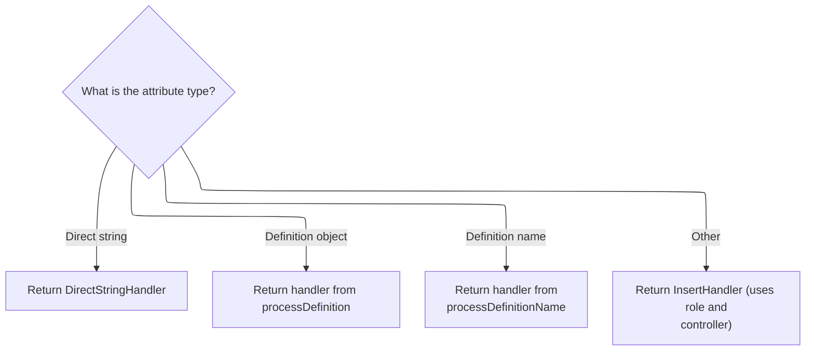

This document explains how values are handled when being inserted into templates. Depending on the type of value provided, the system selects the appropriate way to process and render it, allowing templates to support a variety of value types.

# Dispatching Based on Value Type

<SwmSnippet path="/tiles/src/main/java/org/apache/struts/tiles/taglib/InsertTag.java" line="501">

---

In <SwmToken path="tiles/src/main/java/org/apache/struts/tiles/taglib/InsertTag.java" pos="501:5:5" line-data="    public TagHandler processObjectValue(Object value) throws JspException {">`processObjectValue`</SwmToken>, the code checks if the input is an <SwmToken path="tiles/src/main/java/org/apache/struts/tiles/taglib/InsertTag.java" pos="503:8:8" line-data="        if (value instanceof AttributeDefinition) {">`AttributeDefinition`</SwmToken>. If so, it hands off to <SwmToken path="tiles/src/main/java/org/apache/struts/tiles/taglib/InsertTag.java" pos="505:3:3" line-data="            return processTypedAttribute((AttributeDefinition) value);">`processTypedAttribute`</SwmToken> to handle the specifics of that type. This separation ensures that type-specific logic is encapsulated, and only falls back to string-based processing if the value isn't a known type.

```java
    public TagHandler processObjectValue(Object value) throws JspException {
        // First, check if value is one of the Typed Attribute
        if (value instanceof AttributeDefinition) {
            // We have a type => return appropriate IncludeType
            return processTypedAttribute((AttributeDefinition) value);

```

---

</SwmSnippet>

## Handling Attribute Definitions



<SwmSnippet path="/tiles/src/main/java/org/apache/struts/tiles/taglib/InsertTag.java" line="735">

---

In <SwmToken path="tiles/src/main/java/org/apache/struts/tiles/taglib/InsertTag.java" pos="735:5:5" line-data="    public TagHandler processTypedAttribute(AttributeDefinition value)">`processTypedAttribute`</SwmToken>, the code checks if the value is a <SwmToken path="tiles/src/main/java/org/apache/struts/tiles/taglib/InsertTag.java" pos="737:8:8" line-data="        if (value instanceof DirectStringAttribute) {">`DirectStringAttribute`</SwmToken> and handles it directly. If it's a <SwmToken path="tiles/src/main/java/org/apache/struts/tiles/taglib/InsertTag.java" pos="740:12:12" line-data="        } else if (value instanceof DefinitionAttribute) {">`DefinitionAttribute`</SwmToken>, it passes the contained <SwmToken path="tiles/src/main/java/org/apache/struts/tiles/taglib/InsertTag.java" pos="741:6:6" line-data="            return processDefinition((ComponentDefinition) value.getValue());">`ComponentDefinition`</SwmToken> to <SwmToken path="tiles/src/main/java/org/apache/struts/tiles/taglib/InsertTag.java" pos="741:3:3" line-data="            return processDefinition((ComponentDefinition) value.getValue());">`processDefinition`</SwmToken> for further handling, since that type needs more involved processing.

```java
    public TagHandler processTypedAttribute(AttributeDefinition value)
        throws JspException {
        if (value instanceof DirectStringAttribute) {
            return new DirectStringHandler((String) value.getValue());

        } else if (value instanceof DefinitionAttribute) {
            return processDefinition((ComponentDefinition) value.getValue());

```

---

</SwmSnippet>

<SwmSnippet path="/tiles/src/main/java/org/apache/struts/tiles/taglib/InsertTag.java" line="743">

---

Back in <SwmToken path="tiles/src/main/java/org/apache/struts/tiles/taglib/InsertTag.java" pos="505:3:3" line-data="            return processTypedAttribute((AttributeDefinition) value);">`processTypedAttribute`</SwmToken>, after handling <SwmToken path="tiles/src/main/java/org/apache/struts/tiles/taglib/InsertTag.java" pos="740:12:12" line-data="        } else if (value instanceof DefinitionAttribute) {">`DefinitionAttribute`</SwmToken>, the code checks for <SwmToken path="tiles/src/main/java/org/apache/struts/tiles/taglib/InsertTag.java" pos="743:12:12" line-data="        } else if (value instanceof DefinitionNameAttribute) {">`DefinitionNameAttribute`</SwmToken>. If found, it calls <SwmToken path="tiles/src/main/java/org/apache/struts/tiles/taglib/InsertTag.java" pos="744:3:3" line-data="            return processDefinitionName((String) value.getValue());">`processDefinitionName`</SwmToken> to resolve and process the definition by its name.

```java
        } else if (value instanceof DefinitionNameAttribute) {
            return processDefinitionName((String) value.getValue());
        }

```

---

</SwmSnippet>

<SwmSnippet path="/tiles/src/main/java/org/apache/struts/tiles/taglib/InsertTag.java" line="747">

---

Finally, in <SwmToken path="tiles/src/main/java/org/apache/struts/tiles/taglib/InsertTag.java" pos="505:3:3" line-data="            return processTypedAttribute((AttributeDefinition) value);">`processTypedAttribute`</SwmToken>, if none of the specific attribute types matched, the code creates an <SwmToken path="tiles/src/main/java/org/apache/struts/tiles/taglib/InsertTag.java" pos="747:5:5" line-data="        return new InsertHandler(">`InsertHandler`</SwmToken> with the attribute's value, role, and a controller (if any) fetched via <SwmToken path="tiles/src/main/java/org/apache/struts/tiles/taglib/InsertTag.java" pos="750:1:1" line-data="            getController());">`getController`</SwmToken>.

```java
        return new InsertHandler(
            (String) value.getValue(),
            role,
            getController());
    }
```

---

</SwmSnippet>

<SwmSnippet path="/tiles/src/main/java/org/apache/struts/tiles/taglib/InsertTag.java" line="400">

---

<SwmToken path="tiles/src/main/java/org/apache/struts/tiles/taglib/InsertTag.java" pos="400:5:5" line-data="    private Controller getController() throws JspException {">`getController`</SwmToken> checks if a controller type is set. If so, it uses <SwmToken path="tiles/src/main/java/org/apache/struts/tiles/taglib/InsertTag.java" pos="406:3:5" line-data="            return ComponentDefinition.createController(">`ComponentDefinition.createController`</SwmToken> to instantiate the controller, wiring it up for use in the handler.

```java
    private Controller getController() throws JspException {
        if (controllerType == null) {
            return null;
        }

        try {
            return ComponentDefinition.createController(
                controllerName,
                controllerType);

        } catch (InstantiationException ex) {
            throw new JspException(ex);
        }
    }
```

---

</SwmSnippet>

## Handling Component Definitions and Fallback

<SwmSnippet path="/tiles/src/main/java/org/apache/struts/tiles/taglib/InsertTag.java" line="507">

---

Back in <SwmToken path="tiles/src/main/java/org/apache/struts/tiles/taglib/InsertTag.java" pos="501:5:5" line-data="    public TagHandler processObjectValue(Object value) throws JspException {">`processObjectValue`</SwmToken>, if the value is a <SwmToken path="tiles/src/main/java/org/apache/struts/tiles/taglib/InsertTag.java" pos="507:12:12" line-data="        } else if (value instanceof ComponentDefinition) {">`ComponentDefinition`</SwmToken>, the code hands it off to <SwmToken path="tiles/src/main/java/org/apache/struts/tiles/taglib/InsertTag.java" pos="508:3:3" line-data="            return processDefinition((ComponentDefinition) value);">`processDefinition`</SwmToken> for direct processing.

```java
        } else if (value instanceof ComponentDefinition) {
            return processDefinition((ComponentDefinition) value);
        }

```

---

</SwmSnippet>

<SwmSnippet path="/tiles/src/main/java/org/apache/struts/tiles/taglib/InsertTag.java" line="511">

---

Finally, in <SwmToken path="tiles/src/main/java/org/apache/struts/tiles/taglib/InsertTag.java" pos="501:5:5" line-data="    public TagHandler processObjectValue(Object value) throws JspException {">`processObjectValue`</SwmToken>, if the value isn't a known type, the code falls back to calling <SwmToken path="tiles/src/main/java/org/apache/struts/tiles/taglib/InsertTag.java" pos="512:3:3" line-data="        return processAsDefinitionOrURL(value.toString());">`processAsDefinitionOrURL`</SwmToken> with the value's string representation, assuming it's a valid definition name or URL.

```java
        // Value must denote a valid String
        return processAsDefinitionOrURL(value.toString());
    }
```

---

</SwmSnippet>

&nbsp;

*This is an auto-generated document by Swimm 🌊 and has not yet been verified by a human*

<SwmMeta version="3.0.0" repo-id="Z2l0aHViJTNBJTNBc3RydXRzMSUzQSUzQVN3aW1tLURlbW8=" repo-name="struts1"><sup>Powered by [Swimm](https://app.swimm.io/)</sup></SwmMeta>
